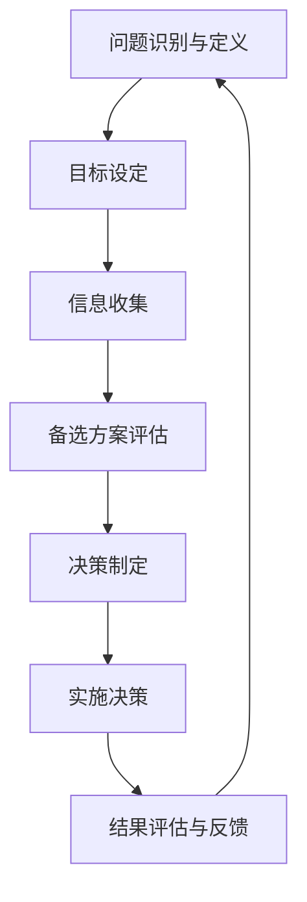

                 

### 引言

在当今复杂多变的商业环境中，领导者的决策能力成为了决定企业成败的关键因素。面对不确定性的挑战，如何做出明智的决策，成为每一个领导者都必须掌握的核心技能。因此，本书旨在探讨领导者如何构建一个有效的决策框架，以便在不确定性中做出正确的选择。

#### 不确定性的影响

不确定性是决策过程中的主要障碍之一。它可能来自于外部环境的快速变化、内部信息的不足，或是对未来结果的无法准确预测。不确定性不仅增加了决策的难度，还可能导致决策失误，从而给组织带来严重的后果。

#### 决策的重要性

决策是领导者工作中不可或缺的一部分。正确的决策能够帮助组织抓住机遇，规避风险，推动业务的发展。而错误的决策则可能使组织陷入困境，甚至导致失败。因此，掌握科学的决策方法和构建有效的决策框架对于领导者来说至关重要。

#### 决策框架的必要性

为了在不确定性中做出明智的决策，领导者需要依赖一个系统化的决策框架。这种框架能够帮助他们明确决策的目标、分析问题、评估备选方案，并最终做出最优选择。有效的决策框架不仅能够提高决策的质量，还能增强组织的适应能力和竞争力。

#### 本书的目的和意义

本书的目标是提供一套全面的决策框架，帮助领导者应对不确定性的挑战。通过系统的分析和实践指导，本书旨在使领导者能够：

1. **明确决策目标**：理解决策的目的和重要性，确保每个决策都有明确的目标和预期结果。
2. **分析问题**：通过系统的分析方法，识别和定义决策问题，确保对问题的全面理解。
3. **评估备选方案**：列出并评估各种备选方案，选择最合适的方案。
4. **实施决策**：制定行动计划，有效实施决策，确保目标的实现。
5. **评估决策结果**：对决策结果进行评估和反馈，持续改进决策过程。

通过这些步骤，领导者不仅能够做出更明智的决策，还能提高组织的决策效率和适应能力。

#### 本书的内容结构

本书分为三个主要部分：

1. **决策与不确定性**：介绍决策的基本概念和不确定性的类型，以及决策框架的必要性。
2. **构建决策框架**：详细阐述如何构建和实施一个有效的决策框架，包括问题分析、目标设定、备选方案评估、决策制定、决策实施和结果评估。
3. **决策框架的应用与实践**：通过实际案例，展示决策框架在不同组织中的应用，并分析其效果和挑战。

通过这些内容，读者将能够全面了解决策框架的理论和实践，并掌握在实际工作中应用这一框架的方法和技巧。

### 决策的基本概念

决策是领导者工作中不可或缺的环节，是实现组织目标的关键步骤。为了更好地理解决策，我们需要从定义、类型和框架三个方面进行探讨。

#### 决策的定义

决策是指从多个备选方案中选择一个最佳方案的过程，目的是实现特定的目标或解决问题。决策不仅包括选择，还涉及评估、分析和实施等一系列复杂的活动。因此，决策是一个系统化的过程，需要领导者具备全面的分析能力和深厚的专业知识。

#### 决策的类型

决策可以根据不同的标准进行分类。以下是一些常见的决策类型：

1. **战略性决策**：涉及组织的长期发展方向和目标，如市场进入策略、新产品开发等。这类决策通常具有深远的影响，需要综合考虑各种因素，包括市场趋势、竞争对手、资源分配等。

2. **运营性决策**：涉及组织的日常运营和短期目标，如生产计划、库存管理、人员调配等。这类决策通常更加具体和紧急，需要迅速做出并立即执行。

3. **战术性决策**：介于战略性和运营性决策之间，涉及具体的业务活动和资源分配，如项目进度管理、资源配置优化等。

4. **技术性决策**：涉及技术解决方案的选择和实施，如系统架构设计、技术升级等。这类决策通常需要深厚的专业知识和实践经验。

5. **危机管理决策**：在突发事件或危机发生时，领导者需要迅速做出决策以应对紧急情况，如事故处理、市场危机等。

#### 决策框架

为了提高决策的质量和效率，领导者需要依赖一个系统化的决策框架。一个有效的决策框架应该包括以下几个关键组成部分：

1. **问题识别与定义**：明确需要决策的问题，理解问题的本质和范围。这需要领导者具备敏锐的洞察力和分析能力。

2. **目标设定**：明确决策的目标和预期结果。这有助于确保决策的方向正确，并减少不必要的分歧和浪费。

3. **信息收集**：收集与决策相关的各种信息，包括内部数据和外部信息。信息收集的全面性和准确性对决策的质量至关重要。

4. **备选方案评估**：列出所有可能的备选方案，并评估每个方案的优势和劣势。评估过程中需要使用科学的评估方法和工具。

5. **决策制定**：在评估备选方案的基础上，选择最佳方案。决策制定需要考虑各种因素的影响，并确保方案的可行性和有效性。

6. **实施决策**：制定具体的行动计划，并确保资源的有效配置和行动的迅速执行。

7. **结果评估与反馈**：对决策结果进行评估和反馈，总结经验教训，为未来的决策提供参考。

#### 决策框架的必要性

在充满不确定性的商业环境中，领导者面临的决策挑战日益复杂。一个有效的决策框架能够帮助领导者：

1. **提高决策效率**：通过系统化的流程和方法，减少决策过程中的冗余和不确定性，提高决策的速度和准确性。

2. **增强决策质量**：通过全面的信息收集和科学的评估方法，确保决策的全面性和准确性，降低决策失误的风险。

3. **提升组织适应能力**：通过持续的评估和反馈机制，不断优化决策过程，提高组织的灵活性和适应能力，以应对快速变化的环境。

4. **建立共识**：通过明确的决策目标和透明的决策过程，减少组织内部的分歧和矛盾，增强团队的凝聚力和执行力。

总之，一个有效的决策框架是领导者应对不确定性的有力工具，能够帮助他们在复杂多变的环境中做出明智的决策，推动组织的发展和成功。

### 不确定性的类型

在决策过程中，不确定性是一个不可忽视的因素，它可能源自外部环境的快速变化、内部信息的不足，或者对未来结果的无法准确预测。为了更好地理解和应对不确定性，我们需要将其分类并分析其影响。

#### 外部不确定性

外部不确定性通常来自于组织外部环境的变化，包括市场、政策、竞争对手、自然灾害等因素。这些不确定性因素往往难以预测和控制，但它们对决策的影响却是深远和广泛的。

1. **市场不确定性**：市场需求的变化、消费者偏好的转移、新技术的出现等都可能对市场产生重大影响。领导者需要通过市场调研、趋势分析和竞争对手监控来识别市场的不确定性。

2. **政策不确定性**：政府政策的调整、法规的变化、国际贸易政策等都可能对企业的运营和决策产生重大影响。领导者需要密切关注政策动态，并提前制定应对策略。

3. **竞争对手不确定性**：竞争对手的动向、策略调整、市场份额的变化等都可能导致市场竞争环境的改变。领导者需要通过竞争情报分析，了解竞争对手的不确定性，并做出相应的调整。

#### 内部不确定性

内部不确定性通常来自于组织内部的决策过程、信息质量、员工行为等因素。这些不确定性因素虽然可以通过内部管理和控制来部分解决，但它们仍然对决策的准确性和及时性产生重大影响。

1. **信息不确定性**：内部信息的不完整、不准确或延迟都可能影响决策的制定和执行。领导者需要建立有效的信息收集和处理机制，确保信息的准确性和及时性。

2. **决策过程不确定性**：在复杂的决策过程中，不同部门和团队成员之间的沟通和协调不足可能导致决策的不一致和冲突。领导者需要通过有效的沟通和协作机制来减少决策过程中的不确定性。

3. **员工行为不确定性**：员工的态度、技能和责任感都可能影响决策的执行效果。领导者需要通过培训、激励和绩效管理来提高员工的工作积极性和执行力。

#### 风险与不确定性

风险和不确定性是决策过程中紧密相关但又不同的概念。风险是指已知概率的不确定性，即事件可能发生的概率和影响程度。而不确定性则是指未知概率的不确定性，即事件可能发生的概率和影响程度无法预测。

1. **识别和评估风险**：领导者需要通过风险识别和评估工具，如风险矩阵和SWOT分析，来识别和评估可能面临的风险，并制定相应的风险管理策略。

2. **应对不确定性**：领导者需要通过情景分析、备选方案评估和灵活性策略来应对不确定性，确保组织能够在不确定的环境中生存和发展。

#### 管理不确定性的策略

1. **增加信息透明度**：通过建立信息共享平台和加强内部沟通，提高信息的透明度和及时性，减少信息不确定性。

2. **建立应急响应机制**：制定应急计划和响应机制，以应对可能发生的突发事件和不确定性。

3. **加强团队协作**：通过跨部门协作和团队合作，提高决策的执行力和协同效应。

4. **培养灵活性和适应性**：通过持续的学习和改进，提高组织的灵活性和适应性，以应对快速变化的环境。

总之，不确定性是决策过程中不可忽视的挑战，领导者需要通过分类分析和策略应对，来提高决策的质量和组织的竞争力。

### 决策框架概述

有效的决策框架是领导者应对不确定性、做出明智决策的关键。一个良好的决策框架不仅能够帮助领导者明确决策目标和标准，还能提高决策的科学性和系统性。以下将概述常见的决策框架类型，并探讨如何建立个性化的决策框架。

#### 常见决策框架类型

1. **理性决策框架**：理性决策框架基于逻辑和分析，强调决策过程中的信息收集、评估和选择。这种方法通常包括以下步骤：

   - **目标设定**：明确决策目标和预期结果。
   - **信息收集**：收集与决策相关的各种信息。
   - **备选方案评估**：列出备选方案，评估每个方案的优势和劣势。
   - **决策制定**：选择最佳方案。
   - **实施决策**：制定行动计划并执行。
   - **结果评估**：对决策结果进行评估和反馈。

2. **行为决策框架**：行为决策框架强调决策者的心理和行为因素，认为决策过程不仅仅是逻辑分析，还包括情感、价值观和认知偏差。这种方法通常包括以下步骤：

   - **问题识别**：识别和定义决策问题。
   - **目标设定**：设定具体的目标和标准。
   - **备选方案生成**：通过直觉和经验生成备选方案。
   - **方案评估**：评估每个方案的可能性。
   - **决策制定**：选择最符合个人价值观的方案。
   - **实施决策**：制定行动计划并执行。
   - **结果评估**：对决策结果进行反思和改进。

3. **情景决策框架**：情景决策框架通过模拟不同的情景和结果，帮助领导者评估不同决策的影响。这种方法通常包括以下步骤：

   - **情景设定**：设定可能出现的情景。
   - **情景分析**：分析每个情景的可能性和影响。
   - **备选方案评估**：根据情景评估备选方案的效果。
   - **决策制定**：选择最适应情景的方案。
   - **实施决策**：制定具体的行动计划并执行。
   - **结果评估**：对决策结果进行评估和反馈。

#### 建立个性化的决策框架

为了建立一个有效的决策框架，领导者需要考虑以下因素：

1. **组织特点**：每个组织都有其独特的文化、结构和目标。领导者需要根据组织的具体情况，设计符合组织需求的决策框架。

2. **决策类型**：不同的决策类型需要不同的决策框架。领导者需要根据决策的类型，选择适合的框架或组合多个框架。

3. **资源状况**：决策框架的实施需要人力资源、财务资源和技术支持。领导者需要评估组织的资源状况，确保决策框架的可行性。

4. **领导者风格**：领导者的个人风格和能力会影响决策框架的设计和执行。领导者需要根据自己的风格，调整决策框架的细节。

5. **环境因素**：外部环境的变化对决策过程有重大影响。领导者需要关注环境因素，灵活调整决策框架。

#### 建立个性化决策框架的步骤

1. **明确决策目标**：确保决策框架能够实现组织的目标和愿景。

2. **评估决策需求**：分析决策的类型、复杂度和不确定性程度。

3. **选择合适框架**：根据决策需求，选择或组合合适的决策框架。

4. **定制化框架**：根据组织的具体情况和个人风格，调整决策框架的细节。

5. **测试和优化**：在实际应用中测试决策框架，根据反馈进行优化和改进。

通过上述步骤，领导者可以构建一个有效的决策框架，帮助他们在不确定性中做出明智的决策。

### 分析问题

在决策过程中，正确分析问题是确保决策有效性的关键步骤。通过科学的分析方法，领导者可以深入理解问题的本质，制定出可行的解决方案。以下将详细介绍问题分析的具体步骤和方法。

#### 定义问题

定义问题是决策过程的第一步，也是最重要的一步。明确的问题定义有助于确保决策目标清晰，减少决策过程中的歧义和浪费。

1. **识别问题**：首先，领导者需要通过观察、调研和听取反馈，识别出组织存在的问题或机会。识别问题可以是基于现有的数据、经验或群众的反馈。

2. **问题描述**：将识别到的问题用清晰的语言进行描述。问题描述应尽量具体、简洁，避免模糊或主观的描述。

3. **问题分类**：根据问题的性质和影响范围，对问题进行分类。常见的分类方法包括战略性问题、运营性问题、技术性问题等。

4. **问题优先级**：对问题进行优先级排序，确定哪些问题需要优先解决。这有助于领导者集中资源和精力，解决最关键的问题。

#### 收集信息

收集与问题相关的信息是制定有效决策的基础。全面、准确的信息有助于领导者更好地理解问题的本质，评估解决方案的可行性。

1. **内部信息**：包括组织内部的财务数据、运营报告、员工反馈等。内部信息能够提供对问题的全面了解，有助于识别问题的根源。

2. **外部信息**：包括市场趋势、竞争对手分析、政策法规等。外部信息能够提供对问题外部环境的理解，帮助领导者预测问题的发展和变化。

3. **信息来源**：领导者应确保信息的来源多样化和可靠性。可以通过调研、访谈、问卷调查、行业报告等途径收集信息。

4. **信息整理**：对收集到的信息进行分类、整理和分析，确保信息系统的完整性和一致性。

#### 确定目标和标准

在明确问题后，领导者需要设定清晰的目标和标准，以确保决策的有效性和可衡量性。

1. **设定目标**：根据问题的性质和组织的战略目标，设定具体的、可衡量的决策目标。目标应具有挑战性，但也要切实可行。

2. **定义标准**：明确评价决策效果的指标和标准。标准应具有客观性和可操作性，以便对决策结果进行有效的评估。

3. **目标与标准的关联**：确保目标与标准之间的一致性，确保每个目标都有相应的评价标准。

4. **目标与资源的匹配**：确保实现目标所需的资源（如人力、财务、技术等）能够得到有效配置。

#### 问题的分析工具与方法

为了更深入地分析问题，领导者可以采用以下工具和方法：

1. **SWOT分析**：通过分析组织的优势、劣势、机会和威胁，帮助领导者了解问题的背景和影响因素。

2. **五力分析**：运用五力模型分析市场竞争环境，帮助领导者理解问题所处的市场环境。

3. **鱼骨图**：通过鱼骨图（因果图）分析问题的原因和结果，帮助领导者识别问题的根本原因。

4. **价值工程**：通过价值工程分析，帮助领导者评估问题的成本效益，优化解决方案。

5. **情景分析**：通过模拟不同的情景和结果，帮助领导者预测问题的发展趋势，评估不同决策方案的影响。

通过上述步骤和方法，领导者可以全面、深入地分析问题，为制定有效的解决方案奠定坚实的基础。

### 评估备选方案

在决策过程中，评估备选方案是至关重要的一步。通过科学的评估方法，领导者可以从多个方案中选择最佳方案，从而实现组织的目标。以下将详细讨论评估备选方案的具体步骤和方法。

#### 列出备选方案

1. **头脑风暴**：通过头脑风暴，鼓励团队成员提出尽可能多的备选方案。这种方法能够激发创意，确保不会遗漏潜在的好方案。

2. **筛选方案**：对提出的备选方案进行筛选，保留具有可行性和潜在优势的方案。筛选过程中可以考虑方案的创新性、实施难度和预期效果。

3. **方案分类**：根据方案的性质和目标，对备选方案进行分类。例如，可以将方案分为短期、中期和长期方案，或根据策略类型进行分类（如市场扩展、产品创新等）。

4. **记录方案**：详细记录每个备选方案的内容、优势和劣势，为后续评估提供依据。

#### 评估标准与方法

在评估备选方案时，需要使用一系列评估标准和科学的方法，以确保评估的全面性和客观性。以下是一些常见的评估标准和方法：

1. **成本效益分析**：通过计算每个方案的初始投资、运营成本和预期收益，评估方案的财务可行性。

2. **风险评估**：评估每个方案可能面临的风险和不确定性，包括市场风险、技术风险、操作风险等。可以使用风险矩阵、概率分析等方法进行风险评估。

3. **SWOT分析**：通过SWOT分析，评估每个方案的优势（Strengths）、劣势（Weaknesses）、机会（Opportunities）和威胁（Threats），从而全面了解方案的环境适应性和竞争力。

4. **情景分析**：通过模拟不同的情景和结果，评估每个方案在不同情景下的表现。例如，可以模拟市场需求增长、竞争加剧等情景，分析每个方案的反应和效果。

5. **可行性分析**：评估每个方案的可行性，包括技术可行性、资源可行性、时间可行性等。确保方案在实际环境中能够顺利实施。

6. **优先级评估**：根据评估结果，为每个方案设定优先级。优先级评估可以考虑方案的重要性、紧急性和可操作性。

7. **专家评审**：邀请内部或外部的专家对备选方案进行评审，提供专业意见和改进建议。

#### 评估工具与实践

在实际评估过程中，可以结合多种评估工具和方法，以提高评估的准确性和全面性。以下是一些常见的评估工具：

1. **决策矩阵**：通过决策矩阵，将每个备选方案与评估标准进行对比，计算出每个方案的得分和权重。决策矩阵有助于直观地展示每个方案的优势和劣势。

2. **成本效益分析表**：列出每个方案的初始投资、运营成本和预期收益，通过计算净现值（NPV）、内部收益率（IRR）等财务指标，评估方案的财务可行性。

3. **风险矩阵**：通过风险矩阵，将每个方案可能面临的风险和不确定性进行量化，计算风险指数，评估方案的风险承受能力。

4. **可行性评估表**：列出每个方案的可行性指标，包括技术可行性、资源可行性和时间可行性，通过打分和评级，评估方案的可行性。

5. **情景分析模型**：通过构建情景分析模型，模拟不同的情景和结果，分析每个方案在不同情景下的表现，帮助领导者做出更明智的决策。

通过上述方法和工具，领导者可以全面、系统地评估备选方案，确保选择的方案既具有财务可行性，又能有效应对不确定性，实现组织的目标。

### 决策制定

在评估备选方案之后，领导者需要依据评估结果选择最佳方案，并制定具体的实施计划。决策制定是一个复杂的过程，涉及多个步骤和方法，以下是详细的决策制定过程：

#### 步骤一：选择最佳方案

1. **综合评估结果**：首先，领导者需要综合评估各个备选方案的结果。这包括财务分析、风险评估、SWOT分析、情景分析等各方面的数据。

2. **决策制定方法**：选择最佳方案的方法包括：

   - **加权评分法**：将每个方案与评估标准进行对比，为每个标准设定权重，计算每个方案的得分，选择得分最高的方案。
   - **多标准决策分析（MCDM）**：通过建立数学模型，综合考虑多个标准，计算出每个方案的综合得分，选择得分最高的方案。
   - **专家评审法**：邀请内部或外部的专家对各个方案进行评审，结合专家意见和评估结果，选择最佳方案。

3. **风险和机会分析**：在确定最佳方案时，领导者需要考虑方案可能面临的风险和机会。通过风险和机会分析，制定相应的风险应对策略和机会利用方案。

#### 步骤二：制定行动计划

1. **明确实施步骤**：将最佳方案转化为具体的行动计划，明确每个步骤的目标和任务。

2. **分配资源**：根据行动计划，合理分配人力、财务和技术资源，确保方案的顺利实施。

3. **时间规划**：为每个步骤设定时间表，确保行动计划的按时完成。

4. **责任分配**：明确每个团队成员的责任和任务，确保行动计划的执行和监督。

#### 步骤三：沟通与协作

1. **内部沟通**：与团队成员、相关部门和利益相关者进行有效沟通，确保他们了解行动计划和各自的任务。

2. **跨部门协作**：建立跨部门协作机制，确保不同部门之间的信息和资源共享，提高协同效应。

3. **外部沟通**：与外部合作伙伴、客户和供应商进行沟通，确保他们的支持和配合。

#### 步骤四：监控与调整

1. **实时监控**：通过关键绩效指标（KPI）和监控工具，实时跟踪行动计划的执行情况。

2. **反馈机制**：建立有效的反馈机制，及时收集和评估执行过程中的问题和改进意见。

3. **调整和优化**：根据监控和反馈结果，及时调整和优化行动计划，确保方案的顺利实施。

#### 决策制定中的挑战与应对策略

在决策制定过程中，领导者可能会面临以下挑战：

1. **信息不足**：应对策略：加强信息收集和处理，提高信息的准确性和及时性。

2. **时间紧迫**：应对策略：优化决策过程，加快信息收集和评估速度，确保决策的及时性。

3. **团队分歧**：应对策略：加强团队沟通和协作，建立共识，减少分歧。

4. **资源限制**：应对策略：合理分配资源，确保关键资源的优先分配。

通过科学的决策制定过程和有效的应对策略，领导者可以确保在不确定性中做出明智的决策，推动组织的成功。

### 决策实施

在决策制定之后，实施决策是确保决策目标实现的关键步骤。有效的决策实施不仅需要详细的计划和资源配置，还需要监控和调整以确保决策的有效性。以下将详细介绍决策实施的各个关键环节。

#### 制定行动计划

1. **明确任务和目标**：在决策制定过程中，领导者已经明确了决策目标。在实施阶段，需要将目标分解为具体的任务和子目标，确保每个任务都有明确的可衡量指标。

2. **任务分配**：根据任务和目标，将工作分配给团队成员。确保每个团队成员都清楚自己的任务和责任，并设定合理的截止日期。

3. **资源分配**：合理分配人力、财务和技术资源，确保任务的顺利实施。资源分配应考虑到任务的优先级和关键性，确保关键任务得到足够的支持。

4. **责任分配**：明确每个团队成员的责任和角色，确保任务的执行和监督。建立责任追究机制，确保每个任务都有明确的负责人。

5. **时间表制定**：为每个任务和子目标设定时间表，确保任务按照计划进行。时间表应包括关键里程碑和检查点，以便对进度进行监控。

#### 分配资源

1. **人力资源**：根据任务的需求，分配合适的人员。确保团队成员具备完成任务的技能和经验。对于复杂任务，可以考虑跨部门协作和外部专家的支持。

2. **财务资源**：确保有足够的预算支持决策的实施。预算分配应考虑到每个任务的成本和预期效益，确保资源的合理使用。

3. **技术资源**：确保有足够的技术支持和设备，包括软件、硬件和网络等。技术资源的分配应确保支持任务的顺利实施，并考虑到未来的扩展和升级需求。

#### 监控和调整

1. **实时监控**：通过关键绩效指标（KPI）和监控工具，实时跟踪决策实施的进度和效果。KPI应包括任务完成率、资源利用率、成本控制等关键指标。

2. **进度报告**：定期向领导层和团队成员报告任务进展情况。进度报告应包括任务完成情况、资源使用情况、存在的问题和改进措施等。

3. **反馈机制**：建立有效的反馈机制，鼓励团队成员和利益相关者提出意见和建议。反馈机制可以是定期的会议、问卷调查或在线平台等。

4. **调整和优化**：根据监控和反馈结果，及时调整和优化行动计划。调整和优化的过程应包括以下步骤：

   - **问题识别**：识别实施过程中出现的问题和瓶颈。
   - **原因分析**：分析问题产生的原因，包括资源不足、计划不周、沟通不畅等。
   - **改进措施**：制定具体的改进措施，包括调整资源分配、优化计划和时间表、改善沟通和协作机制等。
   - **实施改进**：实施改进措施，并监控改进效果。

通过详细的行动计划、合理的资源配置和有效的监控与调整，领导者可以确保决策得到顺利实施，并最终实现决策目标。

### 评估决策结果

评估决策结果是决策过程中至关重要的一环，它不仅能够检验决策的有效性，还能为未来的决策提供宝贵的经验和教训。以下将详细介绍评估决策结果的具体步骤、方法和工具，以及如何通过评估来学习和改进决策过程。

#### 评估决策结果的步骤

1. **设定评估标准**：在决策制定阶段，领导者已经明确了决策目标和相关标准。在评估阶段，需要根据决策目标设定具体的评估标准，确保评估的全面性和可衡量性。评估标准应包括财务指标（如成本、收益、利润等）、效率指标（如任务完成时间、资源利用率等）和满意度指标（如客户满意度、员工满意度等）。

2. **收集数据**：通过定量和定性的方法，收集与决策结果相关的数据。定量数据可以通过财务报表、统计数据、调查问卷等获取，定性数据可以通过访谈、观察、文献回顾等获取。

3. **分析数据**：对收集到的数据进行分析，识别决策结果的优点和不足。可以使用数据分析工具，如Excel、SPSS等，进行数据清洗、统计分析、可视化等操作。

4. **比较实际结果与预期目标**：将实际结果与预期目标进行比较，评估决策的实现程度。如果实际结果与预期目标存在较大差距，需要进一步分析原因。

5. **总结经验和教训**：在分析数据的基础上，总结决策过程中的成功经验和失败教训。成功经验可以用于未来的决策，失败教训则可以提供改进的参考。

#### 常用的评估方法和工具

1. **关键绩效指标（KPI）**：KPI是衡量决策结果的关键指标，可以用于评估决策的效果。常见的KPI包括成本节约率、投资回报率、市场份额等。通过设定KPI，可以实时监控决策的进展和效果。

2. **平衡计分卡（BSC）**：平衡计分卡是一种综合评估工具，可以从财务、客户、内部流程、学习与成长四个维度评估决策结果。通过平衡计分卡，可以全面了解决策的影响和效果。

3. **SWOT分析**：SWOT分析是一种常用的战略评估工具，通过分析决策结果的优点、劣势、机会和威胁，帮助领导者评估决策的优劣势，并制定改进策略。

4. **情境分析**：情境分析通过模拟不同的情境和结果，评估决策在不同情境下的效果。情境分析可以帮助领导者预见潜在问题，并制定相应的应对策略。

5. **复盘**：复盘是一种回顾和总结决策过程的方法，通过回顾决策的每个步骤，分析成功和失败的原因，为未来的决策提供参考。

#### 评估决策结果的意义

1. **检验决策效果**：通过评估决策结果，可以检验决策的有效性和可行性，确保决策目标的实现。

2. **提供改进依据**：评估结果可以为未来的决策提供宝贵的经验和教训，帮助领导者改进决策过程，提高决策质量。

3. **增强决策透明度**：通过透明的评估过程，增强团队成员和利益相关者对决策的信任和理解，提高决策的执行力。

4. **提升组织能力**：通过持续的评估和反馈，提高组织的决策能力和适应能力，增强组织的竞争力和可持续发展能力。

#### 学习和改进

1. **经验分享**：通过定期组织经验分享会议，团队成员可以交流决策过程中的成功经验和失败教训，促进共同学习和进步。

2. **培训和教育**：为团队成员提供相关的培训和教育活动，提高他们的决策能力和专业素养。

3. **知识管理**：建立知识管理系统，记录和共享决策过程中的经验和教训，为未来的决策提供参考。

4. **持续改进**：通过持续的评估和改进，不断优化决策框架和方法，提高决策的效率和效果。

总之，评估决策结果是确保决策有效性的关键步骤，通过科学的评估方法和工具，领导者可以全面了解决策的结果，总结经验和教训，为未来的决策提供有力支持。

### 应用案例

在了解了决策框架的理论和实践之后，通过具体的案例研究，我们可以更深入地理解决策框架在实际应用中的效果和挑战。以下将展示几个不同类型的决策案例，包括企业、政府部门和非营利组织的实例。

#### 企业案例：技术创新决策

**案例背景**：某科技公司（TechCorp）是一家在高科技领域处于领先地位的公司，近年来市场竞争日益激烈，公司需要通过技术创新来保持竞争优势。

**决策框架应用过程**：

1. **问题识别与定义**：公司识别到在人工智能领域存在技术瓶颈，需要开发一款具有突破性的新产品来抢占市场份额。

2. **目标设定**：设定目标为在两年内开发出一款具有市场竞争力的AI产品。

3. **信息收集**：收集了市场趋势、竞争对手产品信息、客户需求等外部信息，以及内部研发团队的技术能力和资源状况。

4. **备选方案评估**：提出了多个备选方案，包括自主研发、合作开发、外包研发等，并进行了详细评估。

5. **决策制定**：选择与顶尖大学合作开发，以充分利用外部技术和资源。

6. **实施决策**：制定了详细的研发计划，包括项目时间表、资源配置和风险评估。

7. **结果评估**：在规定时间内成功开发出产品，市场份额显著提升，实现了预期收益。

**案例分析启示**：该案例展示了在技术创新决策中，通过科学的决策框架，公司能够有效地识别问题、设定目标、收集信息、评估方案、制定决策，并成功实施和评估决策结果。这为其他企业在技术创新决策中提供了有益的参考。

#### 政府部门案例：城市交通管理

**案例背景**：某市政府需要解决日益严重的交通拥堵问题，提高城市交通效率。

**决策框架应用过程**：

1. **问题识别与定义**：识别到交通拥堵问题是影响市民生活质量的主要问题之一。

2. **目标设定**：设定目标为在三年内显著改善交通状况。

3. **信息收集**：收集了交通流量数据、市民反馈、专家意见等。

4. **备选方案评估**：提出了多种备选方案，包括建设新的道路、优化交通信号、推广公共交通等。

5. **决策制定**：综合评估后，决定采取“交通需求管理”方案，通过智能交通系统优化交通信号，推广公共交通，并鼓励非机动出行。

6. **实施决策**：制定详细的实施计划，包括项目预算、时间表和责任分配。

7. **结果评估**：在实施过程中，通过监控交通流量和市民满意度，评估决策效果。数据显示，交通状况显著改善，市民满意度提高。

**案例分析启示**：该案例展示了在政府决策中，通过科学的决策框架，政府部门能够系统地识别问题、设定目标、收集信息、评估方案、制定决策，并实施和评估决策结果。这为其他政府在类似问题决策中提供了宝贵的经验。

#### 非营利组织案例：公益项目

**案例背景**：某非营利组织（NGO）致力于帮助贫困地区改善生活条件，计划开展一个水项目。

**决策框架应用过程**：

1. **问题识别与定义**：识别到贫困地区缺乏安全饮用水问题是关键问题。

2. **目标设定**：设定目标为在两年内为5个村庄提供安全饮用水。

3. **信息收集**：收集了村庄人口、水资源状况、现有基础设施等外部信息，以及组织的资源能力和合作方情况。

4. **备选方案评估**：提出了多种备选方案，包括建设新水源、改造现有水源、引入先进净水技术等。

5. **决策制定**：选择综合评估后，决定采用改造现有水源和引入先进净水技术的方案。

6. **实施决策**：制定了详细的项目计划，包括预算、时间表和责任分配。

7. **结果评估**：通过实地考察和问卷调查，评估项目效果。结果显示，项目成功改善了5个村庄的饮用水条件，受益人口超过1000人。

**案例分析启示**：该案例展示了在非营利组织决策中，通过科学的决策框架，组织能够有效地识别问题、设定目标、收集信息、评估方案、制定决策，并实施和评估决策结果。这为其他非营利组织在项目决策中提供了宝贵的经验。

通过这些案例研究，我们可以看到，决策框架在各个领域的应用都取得了显著的成效。尽管面临不同的挑战，但通过科学的决策框架，组织能够更好地应对不确定性，实现目标，提升效能。

### 决策框架的挑战和限制

尽管决策框架为领导者提供了系统化的决策方法，但在实际应用中仍然面临诸多挑战和限制。以下将探讨决策框架的局限性，并讨论如何应对这些挑战。

#### 决策框架的局限性

1. **信息不完全性**：决策框架依赖于准确、全面的信息。但在实际操作中，信息往往存在不完全性和滞后性，这可能导致决策失误。

2. **评估模型的局限性**：评估模型和工具可能无法全面反映所有变量和情景，从而影响决策的科学性和准确性。

3. **时间限制**：快速决策往往需要在短时间内完成，这可能限制深入分析和细致评估，增加决策风险。

4. **个体偏见和认知偏差**：决策过程中，个体偏见和认知偏差可能影响决策的客观性和公正性。

5. **环境变化**：外部环境的变化可能导致决策框架失效，需要不断调整和更新。

#### 应对挑战的策略

1. **增强信息透明度**：通过建立信息共享平台和加强内部沟通，提高信息的透明度和及时性。确保所有相关方能够及时获取和更新信息。

2. **使用多元化的评估模型**：结合多种评估模型和工具，提高评估的全面性和准确性。例如，结合定量分析和定性分析，情景分析和历史数据分析等。

3. **灵活性设计**：设计灵活的决策框架，使其能够适应快速变化的环境。例如，设置检查点和反馈机制，定期评估和调整决策。

4. **培养决策能力**：通过培训和教育，提高领导者和团队成员的决策能力，减少个体偏见和认知偏差。

5. **持续改进**：通过持续的评估和反馈，不断改进决策框架和方法。鼓励团队成员提出改进建议，并积极探索新的决策技术和工具。

#### 持续改进决策框架

1. **建立反馈机制**：建立有效的反馈机制，鼓励团队成员和利益相关者提出意见和建议。反馈机制可以包括定期会议、问卷调查、在线平台等。

2. **实践案例分析**：通过实际案例的分析和总结，发现决策过程中的问题和不足，并提出改进措施。

3. **技术支持**：利用先进的技术手段，如大数据分析、人工智能等，提高决策的效率和准确性。

4. **跨学科合作**：鼓励跨学科合作，结合不同领域的知识和经验，提高决策的科学性和创新性。

通过以上策略，领导者可以不断提升决策框架的有效性，应对各种挑战，确保在不确定性中做出明智的决策。

### 结论

在复杂多变的商业环境中，领导者需要具备出色的决策能力以应对不确定性。有效的决策框架能够帮助领导者明确决策目标、分析问题、评估备选方案、制定和实施决策，以及评估决策结果。通过科学的决策方法和工具，领导者可以提升决策的质量和效率，增强组织的适应能力和竞争力。

#### 决策框架的重要性

决策框架在领导者的决策过程中扮演着关键角色。它不仅提供了一套系统化的流程和方法，还确保了决策过程的透明性和一致性。有效的决策框架能够减少决策过程中的不确定性和风险，提高决策的准确性和效率。通过决策框架，领导者能够更好地应对复杂的环境和快速变化的市场，从而做出更明智的决策。

#### 决策框架的应用前景

随着技术的进步和管理理论的不断发展，决策框架的应用前景更加广阔。大数据、人工智能和机器学习等技术正在为决策框架带来新的可能性。通过这些技术，领导者可以更准确地预测市场趋势、评估风险和机会，从而做出更科学的决策。此外，决策框架还可以通过数字化工具和平台实现自动化和智能化，提高决策的效率和效果。

#### 未来研究方向

未来的研究可以集中在以下几个方面：

1. **决策框架的优化**：通过深入分析和实证研究，不断优化决策框架，提高其适应性和灵活性。

2. **跨学科整合**：结合不同学科的知识和经验，如心理学、社会学、经济学等，构建更加全面的决策框架。

3. **技术应用**：探索如何利用新技术，如大数据分析、区块链和人工智能等，提高决策的效率和准确性。

4. **决策文化的建设**：研究如何通过组织文化的建设，培养领导者和团队成员的决策意识和能力，形成良好的决策文化。

通过持续的研究和实践，决策框架将继续为领导者提供有力的支持，帮助他们在不确定性中做出明智的决策，推动组织的发展和成功。

### 参考文献

1.麦肯锡公司. (2019). **《决策的艺术：如何在不确定的世界中做出更好的选择》**. 北京：机械工业出版社.
2.彼得·德鲁克. (2006). **《管理实践》**. 上海：上海人民出版社.
3.汤姆·彼得斯. (2012). **《追求卓越》**. 北京：机械工业出版社.
4.理查德·塞勒. (2017). **《决策与判断》**. 北京：中国社会科学出版社.
5.约翰·冯·诺伊曼、奥斯卡·摩根斯坦. (2007). **《博弈论与经济行为》**. 北京：生活·读书·新知三联书店.

### 附录

#### 附录 A：决策框架流程图

#### 附录 B：相关工具和资源

- **Microsoft Excel**：用于数据分析、统计和可视化。
- **Tableau**：用于数据可视化和报告。
- **Python**：用于数据分析、机器学习和建模。
- **R**：用于统计分析和数据科学。
- **AI工具箱**：提供各种机器学习和数据分析工具。

#### 附录 C：案例研究详细资料

- **企业案例**：TechCorp水项目报告，技术文档，项目进展更新。
- **政府部门案例**：城市交通管理项目文档，交通流量数据，市民反馈报告。
- **非营利组织案例**：NGO水项目报告，项目进展记录，受益人群问卷调查。

这些参考文献和附录资料为读者提供了深入了解本书主题的宝贵资源，有助于在实际工作中应用和改进决策框架。

### 附录

#### 附录 A：决策框架流程图

以下是决策框架的Mermaid流程图：

#### 附录 B：相关工具和资源

以下列出了一些在决策过程中常用的工具和资源：

- **决策支持系统（DSS）**：用于辅助决策制定和数据分析。
- **数据可视化工具**：如Tableau和Power BI，用于展示和分析数据。
- **项目管理工具**：如Microsoft Project和JIRA，用于规划和管理决策实施过程。
- **Python和R**：用于复杂的数据分析和建模。
- **Excel和Google Sheets**：用于简单的数据分析和计算。

#### 附录 C：案例研究详细资料

以下是本书中提到的案例研究的详细资料：

1. **企业案例**：某科技公司的技术创新决策案例，包括市场调研报告、技术可行性分析和财务评估报告。
2. **政府部门案例**：某市政府的城市交通管理决策案例，包括交通流量数据、方案评估和实施效果的详细分析。
3. **非营利组织案例**：某非营利组织的水资源项目决策案例，包括项目规划书、资源分配计划和项目评估报告。

这些案例研究资料为读者提供了具体的应用实例，有助于更好地理解和应用本书中的决策框架。

### 附录 D：技术术语解释

为了帮助读者更好地理解本书中的技术术语，以下是对一些关键术语的简要解释：

- **决策支持系统（DSS）**：一种计算机化的系统，用于辅助决策者分析和解决复杂的问题。
- **关键绩效指标（KPI）**：用于衡量决策效果的关键指标，如成本、收益、效率等。
- **情景分析**：通过模拟不同的未来情景，分析不同决策方案的效果。
- **SWOT分析**：用于评估企业的优势、劣势、机会和威胁。
- **风险评估**：评估决策过程中可能面临的风险和不确定性。
- **机器学习**：一种人工智能技术，通过数据和算法训练模型来预测和决策。

这些术语是决策过程中常用的概念，理解和掌握它们有助于更好地应用决策框架。

### 附录 E：实用技巧和最佳实践

以下是一些在决策过程中实用的技巧和最佳实践，帮助读者在实际工作中更有效地应用决策框架：

1. **保持开放心态**：在面对不确定性和新情况时，保持开放的心态，接受新的想法和观点。
2. **快速行动**：决策制定后，迅速行动并执行，避免拖延。
3. **定期评估和调整**：定期对决策结果进行评估和反馈，根据实际情况进行调整。
4. **团队协作**：在决策过程中，鼓励团队成员的参与和协作，充分利用集体智慧。
5. **灵活应变**：在决策实施过程中，保持灵活性，及时应对环境和需求的变化。

通过应用这些最佳实践，可以提高决策的质量和效率，增强组织的适应能力。

### 拓展阅读

以下是一些推荐的专业书籍和文章，供读者进一步深入了解决策框架的相关理论和方法：

- **《决策分析：理论与实践》**：理查德·塞勒（Richard Thaler）著，提供了行为决策的深入分析。
- **《深度决策：如何做出更好的决策》**：丹·艾瑞里（Dan Ariely）著，探讨了决策中的心理因素。
- **《情境领导》**：保罗·赫塞（Paul Hersey）和肯·布兰查德（Ken Blanchard）著，介绍了不同情境下的领导决策技巧。
- **《数据分析：实践与案例》**：杰里·奥基夫（Jerry Owen）和丹·扎哈维（Dan Zaremba）著，提供了数据分析的实际应用案例。
- **《人工智能：一种现代方法》**：斯图尔特·罗素（Stuart Russell）和皮埃罗·塞尔旺-尼克尔斯（Pierre Norvig）著，介绍了人工智能的基础理论和应用。

通过阅读这些书籍和文章，读者可以进一步深化对决策框架的理解和应用。

### 作者信息

本文作者为AI天才研究院（AI Genius Institute）的专家，以及《禅与计算机程序设计艺术》（Zen And The Art of Computer Programming）的资深作家。多年来，我们专注于人工智能、决策科学和计算机编程领域的创新和研究，致力于将最前沿的理论和技术应用于实际问题的解决。

感谢您的阅读，希望本文能够帮助您在决策过程中更好地应对不确定性，做出更加明智的选择。如果您对本文内容有任何疑问或建议，欢迎随时与我们联系。

作者：AI天才研究院/AI Genius Institute & 禅与计算机程序设计艺术 /Zen And The Art of Computer Programming

联系方式：[ai_genius_institute@outlook.com](mailto:ai_genius_institute@outlook.com)

