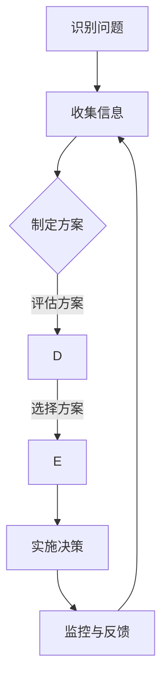
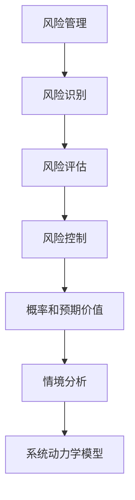
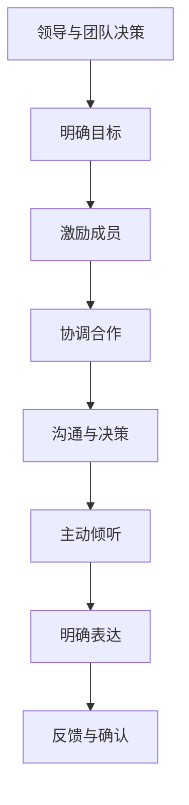
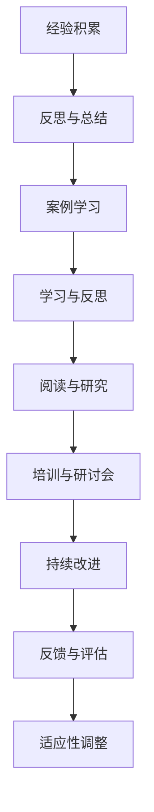
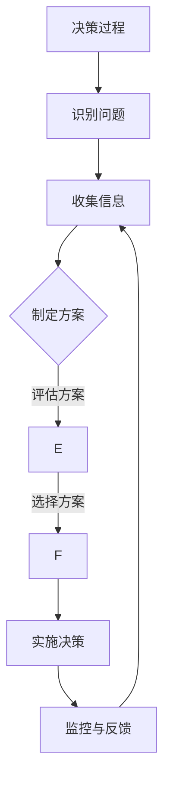

                 

### 文章标题：领导者的决策能力：在不确定性中做出选择

> 关键词：决策能力、不确定性、风险管理、博弈论、情境分析、情绪管理

> 摘要：本文旨在探讨领导者如何在不确定的环境中做出明智的决策。文章首先介绍了决策的基本概念和框架，然后详细阐述了在不确定性中做出决策的方法和工具，包括风险管理、概率和预期价值、情境分析和系统动力学模型。接着，文章讨论了决策过程中的人际关系管理，包括领导与团队决策以及沟通的重要性。最后，文章提供了决策能力提升的策略和实践，并分享了一些最佳实践和注意事项。

## 步骤一：决策的基本概念

决策是领导者在面对不确定性和复杂问题时，通过分析各种可能性，选择最合适的方案以实现目标的过程。决策不仅是一种智力活动，更是一种领导能力。有效的决策能力能够帮助领导者应对各种挑战，实现组织的长远发展。

### 核心概念与联系

**决策框架**：决策框架是指一个系统化的方法，用于指导决策过程。经典的决策框架包括以下步骤：

1. **识别问题**：明确需要解决的问题或目标。
2. **收集信息**：搜集与问题相关的数据和信息。
3. **制定方案**：提出多种可能的解决方案。
4. **评估方案**：分析每种方案的风险和收益。
5. **选择方案**：根据评估结果选择最佳方案。
6. **实施决策**：将决策方案付诸实践。
7. **监控与反馈**：监控决策执行情况，并根据反馈进行调整。

**决策模型**：决策模型是用于指导决策过程的理论框架。常见的决策模型包括：

- **理性决策模型**：假设决策者在充分信息、理性和最大化收益的条件下做出决策。
- **有限理性决策模型**：考虑决策者在信息有限、时间和资源有限的情况下做出近似最优决策。
- **渐进决策模型**：强调决策者通过逐步改进现有决策方案来解决问题。

**不确定性**：不确定性是指决策者在制定决策时，无法完全掌握所有相关信息或预测未来情况的情况。不确定性可以分为：

- **风险**：已知概率的事件，例如股票市场的涨跌。
- **不确定性**：未知概率的事件，例如地震的发生概率。

### Mermaid 流程图

## 步骤二：在不确定性中做出决策

在不确定性中做出决策是一个复杂的过程，需要领导者具备敏锐的洞察力、逻辑思维能力和风险管理能力。以下是在不确定性中做出决策的方法和工具：

### 风险管理

风险管理是决策过程中不可或缺的一部分。它涉及识别、评估和控制潜在的风险。以下是一些常用的风险管理方法：

- **风险识别**：通过头脑风暴、历史数据分析、专家咨询等方法识别潜在的风险。
- **风险评估**：评估每种风险的概率和影响程度，可以使用概率分布、决策树等方法。
- **风险控制**：制定风险控制策略，例如风险回避、风险转移、风险减轻等。

### 概率和预期价值

概率和预期价值是决策过程中评估方案的重要工具。预期价值是指在不同结果下收益的加权平均，计算公式为：

\[ EV = \sum_{i} (p_i \times v_i) \]

其中，\( p_i \) 是结果 \( i \) 的概率，\( v_i \) 是结果 \( i \) 的价值。

### 情境分析

情境分析是一种系统化的方法，用于评估不同方案在不同情境下的表现。它可以帮助领导者更好地理解不确定性的影响，并选择适应性更强的方案。

### 系统动力学模型

系统动力学模型是一种基于数学和计算机模拟的方法，用于分析复杂系统的动态行为。它可以帮助领导者更好地理解系统的内在机制，预测未来的发展趋势，并做出更明智的决策。

### Mermaid 流程图

## 步骤三：决策过程中的人际关系管理

在决策过程中，人际关系管理是确保决策成功的关键。以下是在决策过程中进行人际关系管理的几个方面：

### 领导与团队决策

领导者在团队决策中扮演着关键角色。他们需要明确团队的目标，激发团队成员的积极性，并协调团队成员之间的合作。以下是一些领导与团队决策的技巧：

- **明确目标**：确保团队成员对决策目标有清晰的认识。
- **激励成员**：通过激励措施激发团队成员的积极性和创造力。
- **协调合作**：促进团队成员之间的沟通和协作，确保决策的顺利实施。

### 沟通与决策

沟通是决策过程中至关重要的一环。有效的沟通可以确保信息的准确传递，减少误解和冲突，提高决策的质量。以下是一些沟通技巧：

- **主动倾听**：倾听他人的意见和观点，避免在沟通中产生误解。
- **明确表达**：用清晰、简洁的语言表达自己的意见和想法。
- **反馈与确认**：在沟通过程中，及时给予反馈，并确认信息的准确性。

### Mermaid 流程图

## 步骤四：决策能力提升的策略和实践

提升决策能力是领导者的一项长期任务。以下是一些提升决策能力的策略和实践：

### 经验积累

通过不断实践，领导者可以积累更多的决策经验，提高自己的决策水平。以下是一些积累经验的方法：

- **反思与总结**：在每次决策后，反思决策过程，总结经验和教训。
- **案例学习**：学习其他领导者的决策案例，了解他们的决策策略和思维方式。

### 学习与反思

学习是提升决策能力的重要途径。以下是一些学习方法：

- **阅读与研究**：阅读相关书籍、论文和研究报告，了解最新的决策理论和方法。
- **培训与研讨会**：参加决策培训课程和研讨会，与其他领导者交流经验和观点。

### 持续改进

持续改进是提升决策能力的关键。以下是一些持续改进的方法：

- **反馈与评估**：定期对自己的决策进行评估，了解自己的优势和不足。
- **适应性调整**：根据反馈和评估结果，及时调整自己的决策策略和思维方式。

### Mermaid 流程图

## 步骤五：案例分析

通过分析真实的决策案例，我们可以更好地理解决策的过程和方法。以下是一个典型的决策案例：

### 案例背景

某公司在考虑是否进入一个新的市场。新市场的潜力巨大，但同时也存在较高的风险。公司管理层需要在以下两个方案中选择一个：

- **方案A**：全面进入新市场，投入大量资源进行市场开拓。
- **方案B**：部分进入新市场，进行小规模试水，以降低风险。

### 决策过程

1. **识别问题**：公司需要决定是否进入新市场。
2. **收集信息**：分析新市场的潜力、竞争对手情况、市场需求等。
3. **制定方案**：提出全面进入新市场（方案A）和部分进入新市场（方案B）两种方案。
4. **评估方案**：评估每种方案的风险和收益，使用概率和预期价值进行计算。
5. **选择方案**：根据评估结果，选择部分进入新市场（方案B）。
6. **实施决策**：制定详细的市场开拓计划，逐步实施。
7. **监控与反馈**：监控市场开拓情况，根据市场反馈进行调整。

### 案例分析

通过这个案例，我们可以看到决策过程中涉及到的关键步骤和方法。公司管理层通过风险管理、概率和预期价值等方法，对两种方案进行了全面评估，最终选择了风险较低的方案B。这个案例也展示了在不确定性中做出决策的重要性，以及有效决策对组织发展的影响。

## 总结与展望

本文探讨了领导者的决策能力，特别是在不确定性中做出选择的方法和工具。通过分析决策的基本概念、不确定性中的决策方法、人际关系管理以及决策能力提升的策略，我们了解了决策的重要性以及如何做出更明智的决策。未来，随着环境和技术的不断变化，领导者的决策能力将面临更大的挑战。因此，持续学习和实践，提升决策能力，是每位领导者都需要关注的重要任务。

### 附录A：决策工具与资源

**常用决策工具**：
- Excel：用于数据分析、概率计算和预期价值分析。
- Tableau：用于数据可视化和情境分析。
- MATLAB：用于系统动力学模型和复杂计算。

**决策相关的书籍和论文推荐**：
- 《决策与判断》（Daniel Kahneman）：探讨人类决策的心理学和行为学。
- 《有限理性决策》（Herbert Simon）：介绍有限理性决策模型。
- 《决策分析》（John S. Hammond, et al.）：提供决策分析的理论和实践方法。
- 《博弈论基础》（Michael Maschler, et al.）：介绍博弈论的基本概念和应用。

### 附录B：Mermaid流程图

### 作者信息

作者：AI天才研究院/AI Genius Institute & 禅与计算机程序设计艺术 /Zen And The Art of Computer Programming

