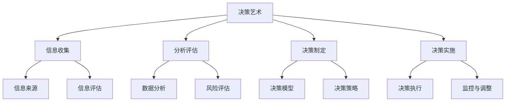
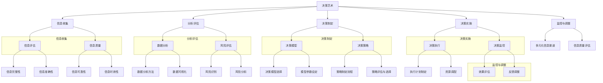

                 

### 引言

在现代企业管理和商业运营中，领导者作为组织的核心，其决策质量直接影响到企业的生存与发展。然而，随着市场环境的复杂化和不确定性增加，领导者在进行决策时面临的挑战日益严峻。如何在不确定性中把握方向，做出科学合理的决策，成为每位领导者必须面对的课题。

本书《领导者的决策艺术：在不确定性中把握方向》旨在探讨领导者的决策艺术，通过深入分析决策过程、方法、核心概念和实际案例，为读者提供一套系统化、实用化的决策框架。本书将分为四个主要部分：

**第一部分：核心概念与联系**，将介绍决策艺术的基本概念、类型及其在不确定性环境中的应用。

**第二部分：决策过程与方法**，详细讲解领导者如何进行有效决策，包括信息收集、分析评估、决策制定和实施等步骤。

**第三部分：案例分析**，通过实际案例说明决策艺术在不同情境中的应用，帮助读者更好地理解决策艺术在实际操作中的具体应用。

**第四部分：实战技巧**，提供领导者提高决策能力的具体策略和技巧，包括应对不确定性的方法、提高决策效率的技巧等。

本书的核心目的是帮助读者理解并掌握领导者的决策艺术，提高在复杂和不确定环境中的决策能力，从而为组织的长远发展奠定坚实基础。

读者对象主要是企业中层及以上管理者、高层决策者以及致力于提升决策能力的专业人士。无论您是经验丰富的领导者，还是正在迈向领导岗位的潜在领导者，本书都将为您提供宝贵的指导和启示。

随着本书的深入阅读，您将逐步掌握决策艺术的核心原理，学会在不确定性中从容应对各种挑战，成为更加卓越的领导者。

### 第一部分：核心概念与联系

#### 1.1 决策艺术概述

**决策**，是领导者在面对多种可能性时，根据一定信息、利用逻辑思维，通过分析评估，从多个可行方案中选择一个最优或次优方案的过程。决策可以大致分为以下几种类型：

- **战略决策**：涉及企业长期目标和方向，如产品研发、市场拓展等。
- **战术决策**：关注短期目标和行动，如人力资源调配、生产计划等。
- **运营决策**：日常业务活动中的具体决策，如库存管理、订单处理等。

每种决策类型都有其独特的特点和要求，但不论哪种类型，决策过程中都会面临一个共同的挑战——**不确定性**。不确定性主要来源于信息的不完全性、环境的变化性以及决策者的认知局限。

**不确定性原理**，源自于量子物理学中的概念，表明在某些物理系统中，某些对偶物理量（如位置和动量）无法同时被精确测定。这一原理在领导决策中具有深远的启示意义：决策者无法完全掌握所有相关信息，也无法准确预测未来变化，这要求领导者必须在不确定性的环境中进行决策。

**决策艺术**，是对决策过程和方法的高度提炼和总结，它不仅包括科学的决策流程，还涵盖了领导者的个人素质和经验积累。决策艺术的核心在于如何在不确定性的环境中做出最优或次优的决策。

**决策的定义、类型与特点**

决策可以定义为：在给定条件下，为了实现某一目标，从多个可行方案中选择一个最佳方案的过程。以下是决策的几种主要类型及其特点：

- **确定型决策**：在明确的信息和条件下进行决策，结果相对可预测。例如，新产品定价决策，在已知市场需求和成本情况下选择最合适的定价策略。
- **风险型决策**：在不确定性较高的条件下进行决策，结果存在一定概率分布。例如，投资决策，在不确定的市场环境下选择不同资产配置，以实现预期收益。
- **不确定型决策**：在高度不确定性的条件下进行决策，结果完全不可预测。例如，应对自然灾害的应急决策，在未知灾害影响和应对策略效果的情况下制定应急措施。

**决策艺术中的不确定性原理**

不确定性原理在决策艺术中扮演着关键角色。以下是其在决策中的几个方面：

1. **信息不完全性**：决策者无法获取所有相关信息，导致决策基于不完全信息进行。这要求领导者通过多元化信息渠道，尽可能获取全面的信息。
2. **环境变化性**：市场、技术、政策等外部环境因素不断变化，增加了决策的复杂性。领导者需要具备快速适应环境变化的能力，及时调整决策方案。
3. **认知局限**：人类认知的局限导致决策者难以完全理解复杂问题。领导者需要借助外部专业知识和工具，弥补自身认知的不足。

**决策艺术的架构图**

为了更好地理解决策艺术的核心概念和联系，我们可以使用Mermaid绘制决策艺术的架构图。以下是一个简化的架构图示例：



上述架构图展示了决策艺术的主要环节及其相互关系。信息收集是决策的基础，分析评估是决策的核心，决策制定和决策实施则是实现决策目标的关键步骤。监控与调整则是确保决策效果的重要环节。

通过以上对决策艺术核心概念的介绍，读者可以初步了解决策的定义、类型与特点，以及不确定性原理在决策艺术中的应用。接下来，本书将详细探讨决策的各个环节和方法，帮助读者更深入地理解领导者的决策艺术。

#### 1.2 决策艺术架构图

为了更直观地展示决策艺术的核心概念及其相互关系，我们可以使用Mermaid绘制一个详细的架构图。以下是决策艺术的架构图示例：



**架构图详细说明**：

1. **信息收集（B）**：
   - **信息来源（G）**：多元化信息渠道，如内部数据、市场调查、专家意见等。
   - **信息评估（H）**：包括信息的完整性、准确性、可靠性和时效性。

2. **分析评估（C）**：
   - **数据分析（I）**：采用各种数据分析方法，如统计、机器学习等，对收集到的信息进行处理和可视化。
   - **风险评估（J）**：识别潜在风险，分析风险的概率和影响。

3. **决策制定（D）**：
   - **决策模型（K）**：选择合适的决策模型，设定模型参数，进行模拟和预测。
   - **决策策略（L）**：制定具体的决策策略，评估和选择最佳策略。

4. **决策实施（E）**：
   - **决策执行（M）**：根据决策策略，制定执行计划，进行资源调配。
   - **决策监控（N）**：对决策执行过程进行监控，评估效果，及时调整。

5. **监控与调整（F）**：
   - **效果评估（EE）**：评估决策实施的效果，分析是否达到预期目标。
   - **反馈调整（FF）**：根据效果评估结果，进行调整和改进。

通过上述架构图，我们可以清晰地看到决策艺术的各个组成部分及其相互关系。每个环节都有其特定的任务和目标，共同构成了一个完整的决策过程。接下来，本书将深入探讨这些环节的具体方法和实践，帮助读者更好地理解和应用决策艺术。

### 2.1 信息收集

信息收集是决策过程的基础，决策的科学性和有效性在很大程度上取决于信息的质量和数量。有效的信息收集需要系统化、多渠道、多层次地进行，以确保获取全面、准确的信息。

#### 2.1.1 信息来源

信息来源的多样性是保证信息质量的关键。以下是一些常见的信息来源：

1. **内部数据**：企业内部运营数据、财务报表、销售数据等。这些数据通常是最直接和准确的。
2. **市场调查**：通过问卷、访谈、焦点小组等方式，了解市场需求、消费者偏好和竞争对手情况。
3. **专家意见**：邀请行业专家、顾问或内部专家提供专业意见和建议。
4. **公共数据**：政府发布的经济数据、行业报告、学术研究等。
5. **社交媒体**：社交媒体平台上的用户评论、行业动态和热门话题。
6. **竞争对手信息**：通过市场调研、商业间谍等手段获取竞争对手的运营策略、产品信息等。

#### 2.1.2 收集方法

收集信息的方法多种多样，以下是一些常用的方法：

1. **定量数据收集**：
   - **问卷调查**：通过设计问卷，收集大量定量数据。
   - **数据分析**：对现有数据进行统计分析，如描述性统计、相关性分析等。
   - **实验研究**：设计实验，控制变量，收集数据。

2. **定性数据收集**：
   - **访谈**：与行业专家、内部员工等进行深度访谈，获取详细的定性信息。
   - **案例研究**：通过分析具体案例，了解决策过程的详细情况和效果。
   - **观察法**：直接观察企业运营和决策过程，获取真实的信息。

3. **混合数据收集**：结合定量和定性方法，获取更全面的信息。

#### 2.1.3 信息评估

信息收集后，需要对信息的质量进行评估，以确保其适用于决策过程。以下是评估信息质量的标准：

1. **信息完整性**：信息是否涵盖了所有相关方面，是否遗漏了关键数据。
2. **信息准确性**：信息是否真实可靠，是否有偏差或错误。
3. **信息可靠性**：信息的来源是否可靠，是否有权威性和公信力。
4. **信息时效性**：信息是否最新，是否过时，对当前决策的适用性。

#### 2.1.4 实际案例

以下是一个企业进行市场调研的实际案例：

**案例背景**：某企业在准备推出一款新产品，为了确定市场需求和消费者偏好，决定进行市场调研。

**信息收集**：
- **内部数据**：分析企业历史销售数据、市场反馈等。
- **市场调查**：设计问卷，通过线上和线下渠道收集消费者意见。
- **专家意见**：邀请行业分析师和消费者行为专家提供专业意见。
- **公共数据**：查阅政府发布的行业报告和市场趋势。
- **社交媒体**：分析社交媒体上的用户评论和话题讨论。

**收集方法**：
- **定量数据收集**：使用问卷调查，收集大量定量数据，采用统计分析方法进行分析。
- **定性数据收集**：进行深度访谈和焦点小组讨论，获取详细定性信息。

**信息评估**：
- **信息完整性**：确保收集的数据覆盖了市场需求、消费者偏好、竞争情况等多个方面。
- **信息准确性**：通过验证问卷和访谈数据的真实性和可靠性，确保信息的准确性。
- **信息可靠性**：评估专家意见和公共数据的权威性，确保其可靠性。
- **信息时效性**：关注市场变化，确保数据的时效性。

通过上述案例，我们可以看到，有效的信息收集需要综合多种方法和渠道，确保信息的全面性、准确性和可靠性。信息评估则是对信息质量的把关，为后续的分析和决策提供坚实的基础。

#### 2.2 分析评估

在信息收集完成后，分析评估是决策过程中至关重要的一环。这一阶段的主要任务是通过对收集到的信息进行系统化的处理和分析，识别潜在风险，评估决策方案的有效性和可行性。以下将详细探讨数据分析、风险评估以及决策分析的具体步骤和方法。

##### 2.2.1 数据分析

数据分析是信息处理的核心环节，通过定量和定性的方法，将信息转化为有用的决策依据。以下是数据分析的基本步骤：

1. **数据预处理**：清洗数据，处理缺失值、异常值，确保数据质量。
    ```python
    # 数据清洗示例代码
    import pandas as pd

    # 读取数据
    data = pd.read_csv('data.csv')

    # 删除缺失值
    data.dropna(inplace=True)

    # 处理异常值
    data = data[data['column_name'] <= data['column_name'].quantile(0.99)]
    ```

2. **描述性统计**：对数据的基本特征进行描述，包括均值、方差、标准差等。
    ```python
    # 描述性统计分析
    summary_stats = data.describe()
    print(summary_stats)
    ```

3. **相关性分析**：分析不同变量之间的相关性，帮助识别潜在的关系和影响因素。
    ```python
    # 相关系数矩阵
    import seaborn as sns

    sns.heatmap(data.corr(), annot=True)
    ```

4. **数据可视化**：通过图表和图形，将复杂的数据直观化，便于理解。
    ```python
    # 数据可视化
    import matplotlib.pyplot as plt

    # 绘制散点图
    plt.scatter(data['variable1'], data['variable2'])
    plt.xlabel('Variable 1')
    plt.ylabel('Variable 2')
    plt.show()
    ```

5. **高级数据分析**：采用机器学习、深度学习等方法，进行数据挖掘和预测分析。
    ```python
    # 回归分析
    from sklearn.linear_model import LinearRegression

    model = LinearRegression()
    model.fit(data[['independent_variable']], data['dependent_variable'])
    print(model.coef_)
    ```

##### 2.2.2 风险评估

风险评估是决策过程中识别和评估潜在风险的重要步骤。以下是一个简化的风险评估流程：

1. **风险识别**：识别决策过程中可能出现的风险，包括市场风险、财务风险、操作风险等。
    ```python
    # 风险识别示例
    risk_identification = ['Market Risk', 'Financial Risk', 'Operational Risk']
    ```

2. **风险分析**：对识别出的风险进行定量和定性分析，评估其发生的概率和影响。
    ```python
    # 风险分析
    risk_analysis = {'Market Risk': {'Probability': 0.3, 'Impact': 5}, 
                     'Financial Risk': {'Probability': 0.2, 'Impact': 3}, 
                     'Operational Risk': {'Probability': 0.1, 'Impact': 2}}
    ```

3. **风险评级**：根据风险的概率和影响，对风险进行评级，以便制定相应的风险管理策略。
    ```python
    # 风险评级
    risk评级 = {'High': ['Market Risk'], 'Medium': ['Financial Risk'], 'Low': ['Operational Risk']}
    ```

##### 2.2.3 决策分析

决策分析是对不同决策方案进行系统化评估，以确定最佳方案。以下是一个简化的决策分析流程：

1. **制定决策方案**：根据数据分析结果和风险评估，制定多个决策方案。
    ```python
    # 制定决策方案
    decision_schemes = [{'Scheme': 'A', 'Details': 'Description of Scheme A'}, 
                        {'Scheme': 'B', 'Details': 'Description of Scheme B'}, 
                        {'Scheme': 'C', 'Details': 'Description of Scheme C'}]
    ```

2. **评估决策方案**：对每个决策方案进行评估，包括可行性、成本效益、风险等因素。
    ```python
    # 评估决策方案
    evaluation_results = {'Scheme A': {'Cost': 100, 'Benefit': 150, 'Risk': 0.3}, 
                          'Scheme B': {'Cost': 200, 'Benefit': 250, 'Risk': 0.2}, 
                          'Scheme C': {'Cost': 300, 'Benefit': 200, 'Risk': 0.1}}
    ```

3. **选择最佳方案**：根据评估结果，选择最佳决策方案。
    ```python
    # 选择最佳方案
    best_scheme = max(evaluation_results, key=evaluation_results.get)
    print(f"The best decision scheme is: {best_scheme}")
    ```

通过以上步骤，领导者可以系统地分析评估信息，识别潜在风险，并选择最佳决策方案，从而在不确定性中做出科学合理的决策。

#### 2.3 决策制定

决策制定是决策过程中的关键环节，它将分析评估的结果转化为具体的行动方案。这一阶段涉及选择合适的决策模型、制定有效的决策策略，并详细说明决策流程。以下将详细探讨这些内容。

##### 2.3.1 决策模型

决策模型是用于分析和模拟决策过程的有力工具。选择合适的决策模型可以大幅提升决策的科学性和有效性。以下是几种常见的决策模型及其特点：

1. **线性规划模型**：
    - **特点**：适用于资源分配和优化问题。
    - **公式**：
        ```latex
        \min c^T x \\
        s.t. Ax \leq b \\
        x \geq 0
        ```
    - **应用**：例如，企业生产计划的最优化。

2. **决策树模型**：
    - **特点**：适用于分类和排序问题。
    - **公式**：决策树由节点和分支构成，每个节点代表一个决策或事件，分支代表不同决策结果。
    - **应用**：例如，信用评分模型。

3. **贝叶斯网络模型**：
    - **特点**：适用于不确定性问题的建模。
    - **公式**：
        ```latex
        P(A|B) = \frac{P(B|A)P(A)}{P(B)}
        ```
    - **应用**：例如，医疗诊断系统。

4. **仿真模型**：
    - **特点**：通过模拟仿真，分析决策结果。
    - **公式**：无固定公式，依赖于仿真算法。
    - **应用**：例如，供应链管理。

##### 2.3.2 决策策略

决策策略是指导决策过程的基本原则和行动指南。以下是几种常见的决策策略：

1. **风险中性策略**：
    - **定义**：在决策过程中，不考虑风险，只关注收益最大化。
    - **应用**：适用于高度可预测和稳定的环境。

2. **风险规避策略**：
    - **定义**：尽量减少风险，选择最保守的方案。
    - **应用**：适用于高风险、不确定性较高的环境。

3. **风险接受策略**：
    - **定义**：接受一定程度的风险，追求更高收益。
    - **应用**：适用于对风险有一定承受能力，同时期望获得高回报的环境。

4. **情境规划策略**：
    - **定义**：根据不同情境制定相应的决策方案，灵活应对不确定性。
    - **应用**：适用于复杂多变的环境。

##### 2.3.3 决策流程

决策制定过程是一个系统化、层次化的过程，通常包括以下几个步骤：

1. **确定目标**：明确决策的目标和期望结果。
    ```python
    # 确定目标
    target = "Maximize profit while minimizing risk"
    ```

2. **选择模型**：根据问题特点选择合适的决策模型。
    ```python
    # 选择决策模型
    decision_model = "Linear Programming Model"
    ```

3. **制定策略**：根据模型和目标，制定具体的决策策略。
    ```python
    # 制定策略
    strategy = "Risk-neutral strategy"
    ```

4. **模拟分析**：使用模型和策略，对决策结果进行模拟和分析。
    ```python
    # 模拟分析
    simulation_results = simulate_decision(target, decision_model, strategy)
    ```

5. **评估与选择**：根据模拟结果，评估不同决策方案，选择最佳方案。
    ```python
    # 评估与选择
    best_scheme = evaluate_and_select(simulation_results)
    ```

6. **决策实施**：根据最佳方案，制定详细的实施计划，并执行。
    ```python
    # 决策实施
    execute_decision(best_scheme)
    ```

##### 2.3.4 伪代码：决策制定算法流程

以下是决策制定过程的伪代码，用于描述决策模型的选择、策略制定、模拟分析等步骤：

```python
# 决策制定算法流程

# 输入参数：目标（target）、问题特点（problem_features）
# 输出：最佳决策方案（best_decision_scheme）

def decision_making_algorithm(target, problem_features):
    # 确定目标
    goal = target
    
    # 选择模型
    if problem_features['predictability'] == 'high':
        decision_model = "Linear Programming Model"
    elif problem_features['uncertainty'] == 'medium':
        decision_model = "Decision Tree Model"
    else:
        decision_model = "Bayesian Network Model"
    
    # 制定策略
    if problem_features['risk_tolerance'] == 'low':
        strategy = "Risk-avoidance strategy"
    elif problem_features['risk_tolerance'] == 'high':
        strategy = "Risk-acceptance strategy"
    else:
        strategy = "Scenario planning strategy"
    
    # 模拟分析
    simulation_results = simulate_decision(goal, decision_model, strategy)
    
    # 评估与选择
    best_scheme = evaluate_and_select(simulation_results)
    
    # 决策实施
    execute_decision(best_scheme)
    
    return best_scheme
```

通过上述步骤和伪代码，我们可以看到决策制定是一个系统化、层次化的过程，通过选择合适的模型、制定有效的策略，以及模拟分析和评估，最终确定最佳决策方案。这一过程不仅提升了决策的科学性和有效性，也为领导者提供了在面对不确定性的环境中从容应对的决策艺术。

#### 2.4 决策实施

决策实施是将决策方案转化为具体行动的过程，是决策过程中的关键环节。有效的决策实施不仅需要详细的计划和执行方案，还需要对执行过程进行持续的监控和调整。以下将详细探讨决策实施的具体步骤和方法。

##### 2.4.1 决策执行

决策执行是将决策方案转化为实际操作的过程，需要确保各项任务和活动按照既定计划进行。以下是决策执行的基本步骤：

1. **制定执行计划**：在决策方案确定后，制定详细的执行计划，明确各阶段的任务、时间表和责任人。

    ```python
    # 制定执行计划
    execution_plan = {
        'Task 1': {'Description': 'Perform market analysis', 'Deadline': '2023-04-01', 'Person in Charge': 'Alice'},
        'Task 2': {'Description': 'Develop marketing strategy', 'Deadline': '2023-04-15', 'Person in Charge': 'Bob'},
        'Task 3': {'Description': 'Implement marketing activities', 'Deadline': '2023-05-01', 'Person in Charge': 'Charlie'}
    }
    ```

2. **资源调配**：根据执行计划，合理调配人力资源、物资资源等，确保各项活动能够顺利开展。

    ```python
    # 资源调配
    allocate_resources(execution_plan)
    ```

3. **任务分配**：将执行计划中的任务具体分配到团队成员，确保每个任务都有明确的执行者。

    ```python
    # 任务分配
    assign_tasks(execution_plan)
    ```

4. **启动执行**：正式开始执行决策方案，监督任务进展，确保按照计划进行。

    ```python
    # 启动执行
    start_execution(execution_plan)
    ```

##### 2.4.2 决策监控

决策监控是确保决策执行效果的重要环节，通过持续监控和反馈，及时发现问题并进行调整。以下是决策监控的基本步骤：

1. **设立监控指标**：根据决策目标和执行计划，设立关键绩效指标（KPIs），用于衡量决策执行效果。

    ```python
    # 设立监控指标
    monitoring_metrics = ['Market Share', 'Sales Revenue', 'Customer Satisfaction']
    ```

2. **数据收集**：定期收集执行过程中的相关数据，包括任务完成情况、资源消耗、成本控制等。

    ```python
    # 数据收集
    collect_data(monitoring_metrics)
    ```

3. **分析评估**：对收集到的数据进行分析，评估决策执行的效果，识别潜在问题和风险。

    ```python
    # 分析评估
    evaluate_execution(monitoring_metrics)
    ```

4. **反馈调整**：根据分析评估的结果，及时调整执行方案，确保决策目标能够实现。

    ```python
    # 反馈调整
    adjust_plan_based_on_feedback(evaluation_results)
    ```

##### 2.4.3 决策调整

在决策实施过程中，由于外部环境的变化和内部执行的不确定性，决策方案可能需要不断调整。以下是一些常见的决策调整方法：

1. **适应性调整**：根据环境变化和执行情况，灵活调整决策方案，以适应新的情境。

    ```python
    # 适应性调整
    adapt_to_environment_changes(current_status)
    ```

2. **优化调整**：通过分析评估结果，优化决策方案中的某些环节，提升决策效果。

    ```python
    # 优化调整
    optimize_plan_based_on_evaluation(evaluation_results)
    ```

3. **应急调整**：在遇到突发情况或紧急事件时，迅速调整决策方案，以应对紧急情况。

    ```python
    # 应急调整
    emergency_adjustment_for_crisis(sudden_event)
    ```

##### 2.4.4 实际案例

以下是一个企业推出新产品决策实施的实际案例：

**案例背景**：某企业决定推出一款新型智能手机，为了确保产品的市场竞争力，制定了详细的决策实施计划。

**执行计划**：
- **任务分配**：明确各部门的任务和时间节点，如市场部门负责市场调研，研发部门负责产品开发，生产部门负责生产准备。
- **资源调配**：合理分配研发资金、人力资源和设备资源，确保各项任务顺利进行。

**监控指标**：
- **市场占有率**：衡量新产品在市场中的竞争力。
- **销售额**：衡量新产品的市场接受度。
- **顾客满意度**：衡量产品的用户体验。

**数据分析**：
- **定期收集数据**：通过市场调研、销售数据等，收集新产品推出的相关数据。
- **分析评估**：对收集到的数据进行统计分析，评估新产品的市场表现。

**调整措施**：
- **市场反馈**：根据顾客反馈，调整产品功能和营销策略。
- **成本控制**：优化生产流程，降低成本，提高利润率。

通过上述步骤，企业成功地将新产品决策实施到位，并在市场中取得了良好的反响。

通过决策实施的具体步骤和方法，以及实际案例的说明，我们可以看到，决策实施不仅需要详细的计划和执行方案，还需要持续的监控和调整。有效的决策实施是实现决策目标的关键，也是领导者应对不确定性的重要手段。

### 3.1 案例一：企业战略决策

**案例背景**：某全球知名科技公司在未来五年战略规划中，面临是否进入新兴市场的决策。新兴市场虽然具有巨大的市场潜力和增长空间，但同时也伴随着较高的不确定性和风险。

**决策目标**：确定是否进入新兴市场，并制定具体的战略方案。

**决策过程与方法**：

1. **信息收集**：
   - **内部数据**：收集公司过去五年的财务报表、市场表现、产品线等信息。
   - **市场调查**：通过问卷调查、专家访谈等方式，了解新兴市场的消费习惯、市场竞争格局、政策环境等。
   - **公共数据**：查阅政府发布的行业报告、经济数据等，获取新兴市场的宏观环境信息。

2. **分析评估**：
   - **数据分析**：采用统计分析方法，评估公司现有产品和新兴市场需求的匹配度。
   - **风险评估**：识别进入新兴市场可能面临的风险，如市场进入壁垒、竞争压力、政策风险等。

3. **决策制定**：
   - **决策模型**：采用多属性决策模型（MAUT），对进入新兴市场的不同方案进行评估和比较。
   - **决策策略**：制定“渐进进入”策略，即先进行小规模市场试水，再根据市场反应调整战略。

4. **决策实施**：
   - **制定执行计划**：明确各部门的任务和时间节点，制定详细的执行方案。
   - **资源调配**：合理分配资金、人力资源和设备资源，确保战略实施。

**决策结果**：

通过以上步骤，公司最终决定进入新兴市场，并采取了渐进进入策略。初期市场试水取得了良好的反馈，市场份额逐渐提升，公司也在新兴市场中建立了稳固的竞争优势。

**案例分析**：

本案例展示了企业战略决策的全过程，从信息收集、分析评估到决策制定和实施，每个环节都至关重要。特别是多属性决策模型和渐进进入策略的应用，为公司在不确定性较高的环境中提供了科学的决策依据和灵活的应对策略。

通过本案例，读者可以深刻理解企业战略决策的核心方法和实践过程，为自身企业的战略规划提供有益的参考。

### 3.2 案例二：危机管理决策

**案例背景**：某大型航空公司因全球疫情影响，面临航班取消、客户投诉激增、员工安全担忧等危机。公司需要在短时间内制定有效的危机管理决策，以应对突发事件，保障公司运营和员工安全。

**决策目标**：制定有效的危机管理策略，迅速平息危机，恢复公司正常运营。

**决策过程与方法**：

1. **信息收集**：
   - **内部数据**：收集公司过去一年的运营数据、客户反馈、员工调查等，了解公司的运营状况和潜在问题。
   - **外部数据**：通过新闻、政府公告、行业报告等渠道，了解全球疫情的发展趋势和行业影响。
   - **客户反馈**：通过社交媒体、客户热线等渠道，了解客户的投诉和建议。

2. **分析评估**：
   - **数据分析**：采用数据分析工具，对收集到的信息进行分类和整理，识别主要问题和潜在风险。
   - **风险评估**：评估不同危机应对策略的风险和成本，如继续运营、部分停运、全面停运等。

3. **决策制定**：
   - **决策模型**：采用决策树模型，对不同危机管理策略进行评估和选择。
   - **决策策略**：制定“分阶段应对”策略，即首先确保员工和客户安全，然后逐步恢复运营。

4. **决策实施**：
   - **制定执行计划**：明确各部门的任务和时间节点，确保危机管理策略的顺利实施。
   - **资源调配**：合理调配人力资源、物资资源和财务资源，保障危机应对措施的落实。

**决策结果**：

通过以上步骤，公司成功应对了疫情带来的危机，采取了有效的危机管理策略。部分航班恢复正常运营，客户投诉得到及时处理，员工得到了充分的安全保障。

**案例分析**：

本案例展示了危机管理决策的复杂性和紧迫性。公司通过全面的信息收集、系统化的分析评估和科学的决策制定，迅速制定了有效的危机应对策略。特别是在面对高度不确定的外部环境时，公司展现了强大的决策能力和执行力。

通过本案例，读者可以深入理解危机管理决策的核心方法和实践过程，为自身企业在面对突发事件时提供有益的参考。

### 3.3 案例三：人力资源决策

**案例背景**：某国际咨询公司计划进行组织结构调整，以适应市场变化和公司战略调整。这一决策涉及到关键岗位的人员调配和技能培训，对公司未来发展至关重要。

**决策目标**：制定合理的人力资源调整方案，优化组织结构，提升员工技能和公司整体竞争力。

**决策过程与方法**：

1. **信息收集**：
   - **内部数据**：收集公司员工的基本信息、工作表现、职业发展规划等。
   - **外部数据**：通过市场调查和行业报告，了解同行业的组织结构、人力资源趋势等。
   - **员工调查**：通过问卷调查和访谈，了解员工对组织结构调整的看法和建议。

2. **分析评估**：
   - **数据分析**：采用统计分析方法，评估现有组织结构中存在的问题和潜在改进点。
   - **风险评估**：评估不同人力资源调整方案对员工和公司的潜在影响，如岗位流失、技能缺失等。

3. **决策制定**：
   - **决策模型**：采用多属性决策模型，综合考虑员工需求、市场趋势和公司战略，制定优化方案。
   - **决策策略**：制定“分阶段调整”策略，即首先调整关键岗位，然后逐步推广到其他岗位。

4. **决策实施**：
   - **制定执行计划**：明确各部门的任务和时间节点，确保人力资源调整方案的顺利实施。
   - **资源调配**：合理调配人力资源和培训资源，保障调整过程的顺利进行。

**决策结果**：

通过以上步骤，公司成功进行了组织结构调整，优化了组织结构，提升了员工技能和公司整体竞争力。员工对调整方案的接受度较高，公司运营效率得到了显著提升。

**案例分析**：

本案例展示了人力资源决策的复杂性和重要性。公司通过全面的信息收集、科学的分析评估和系统的决策制定，成功优化了组织结构，提升了公司竞争力。特别是在面对市场变化和战略调整时，公司展现了强大的决策能力和执行力。

通过本案例，读者可以深入理解人力资源决策的核心方法和实践过程，为自身企业在进行组织结构调整和员工技能培训时提供有益的参考。

### 4.1 提高决策能力的策略

在复杂和不确定的环境中进行有效决策，是领导者必备的能力。以下是一些提高决策能力的策略，帮助领导者在面对各种挑战时做出更明智的决策。

#### 4.1.1 培养决策思维

1. **系统性思维**：
   - **定义**：系统性思维是一种从整体和相互关联的角度分析问题的方法。
   - **应用**：领导者应学会从全局出发，分析决策的各个方面及其相互影响，避免片面和短视的决策。

2. **前瞻性思维**：
   - **定义**：前瞻性思维是一种预测未来发展趋势和潜在问题的能力。
   - **应用**：领导者应关注行业动态、市场变化和新兴技术，提前预判未来可能出现的挑战和机遇。

3. **批判性思维**：
   - **定义**：批判性思维是一种对信息进行深入分析和评估的能力。
   - **应用**：领导者应学会质疑信息来源和假设，对各种决策方案进行全面评估，避免盲目跟从。

#### 4.1.2 提升决策效率

1. **快速决策**：
   - **定义**：快速决策是一种在有限时间内做出有效决策的能力。
   - **应用**：领导者应通过简化决策流程、减少决策层次，提升决策效率。

2. **信息整合**：
   - **定义**：信息整合是指将分散的信息整合成一个整体，以便更好地理解问题和制定决策。
   - **应用**：领导者应学会从不同渠道获取信息，并利用数据分析工具进行整合，形成全面的决策依据。

3. **利用工具**：
   - **决策支持工具**：如决策树、蒙特卡洛模拟等，可以帮助领导者更快速、更准确地做出决策。

#### 4.1.3 提高决策质量

1. **基于数据的决策**：
   - **定义**：基于数据的决策是一种利用数据分析和统计方法进行决策的方法。
   - **应用**：领导者应通过收集和分析数据，形成基于事实的决策依据，避免主观判断。

2. **多角度分析**：
   - **定义**：多角度分析是一种从不同角度和层面分析问题的方法。
   - **应用**：领导者应鼓励团队成员从不同角度提出意见和建议，确保决策的全面性和多样性。

3. **持续学习与改进**：
   - **定义**：持续学习与改进是指通过不断学习和反思，提升决策能力。
   - **应用**：领导者应积极参加培训、阅读相关书籍，同时鼓励团队成员分享经验和教训，形成良好的学习氛围。

#### 4.1.4 应对不确定性的方法

1. **适应性策略**：
   - **定义**：适应性策略是一种在面对不确定性和变化时，快速调整策略以适应新环境的方法。
   - **应用**：领导者应保持灵活性，根据环境变化迅速调整决策方案，确保组织能够持续适应。

2. **风险管理**：
   - **定义**：风险管理是指识别、评估和应对潜在风险的方法。
   - **应用**：领导者应建立完善的风险管理体系，对各种潜在风险进行识别和评估，制定应对措施。

3. **情景规划**：
   - **定义**：情景规划是一种通过模拟不同情景，分析不同决策方案效果的方法。
   - **应用**：领导者应利用情景规划，预判不同情景下的决策效果，提高决策的适应性和稳健性。

通过以上策略，领导者可以显著提升决策能力，在复杂和不确定的环境中做出科学合理的决策，从而为组织的长远发展奠定坚实基础。

### 4.2 应对不确定性的方法

在领导者的决策过程中，不确定性是不可避免的挑战。有效的应对不确定性不仅能够帮助领导者做出更稳健的决策，还能提升组织的适应能力和竞争力。以下将详细介绍几种应对不确定性的方法，并使用数学模型和公式进行详细讲解。

#### 4.2.1 适应性策略

适应性策略是指在面对不确定性时，领导者能够灵活调整决策方案，以适应不断变化的环境。以下是一个简化的适应性策略模型：

**模型公式**：

假设决策变量为 \( x \)，环境不确定性为 \( \epsilon \)，目标函数为最大化 \( f(x) \)。则适应性策略可以通过以下公式表示：

\[ x_{\text{new}} = x_{\text{current}} + k \cdot \frac{f'(x_{\text{current}})}{|\epsilon|} \]

其中，\( k \) 为调整系数，用于控制调整力度。

**详细讲解**：

- **目标函数 \( f(x) \)**：代表领导者希望实现的目标，如利润最大化、成本最小化等。
- **不确定性 \( \epsilon \)**：表示外部环境的不确定性，可以是市场波动、政策变化等。
- **调整系数 \( k \)**：用于调节调整力度，确保在不确定性较高时，能够迅速做出反应。

**举例说明**：

假设某公司面临市场需求波动的不确定性，目标函数为最大化销售额。当市场需求上升时，适应性策略可以增加生产量，以提高销售额。反之，当市场需求下降时，可以减少生产量，以避免库存积压。

\[ x_{\text{new}} = x_{\text{current}} + k \cdot \frac{f'(x_{\text{current}})}{|\epsilon|} \]

假设当前生产量为1000单位，市场需求不确定性为10%，则调整系数 \( k = 0.1 \)：

\[ x_{\text{new}} = 1000 + 0.1 \cdot \frac{f'(1000)}{0.1} \]

通过计算，可以确定新的生产量，从而适应市场需求变化。

#### 4.2.2 风险评估

风险评估是应对不确定性的一种关键方法，通过识别和评估潜在风险，领导者可以制定相应的应对措施。以下是一个基本的风险评估模型：

**模型公式**：

\[ R = P \cdot I \]

其中，\( R \) 为风险值，\( P \) 为风险发生的概率，\( I \) 为风险发生后的影响。

**详细讲解**：

- **风险值 \( R \)**：表示风险对决策的影响程度，数值越高，表示风险越大。
- **概率 \( P \)**：表示风险发生的可能性，可以通过历史数据、专家意见等估算。
- **影响 \( I \)**：表示风险发生后的影响程度，可以是财务损失、运营中断等。

**举例说明**：

假设某公司在进入新市场时面临政策变化的风险，根据历史数据和专家意见，政策变化的概率为30%，变化后的影响可能是市场准入门槛提高，导致公司市场份额下降10%。则风险值为：

\[ R = 0.3 \cdot 10\% = 3\% \]

通过计算，公司可以了解到政策变化风险对公司的影响程度，从而制定相应的应对策略，如增加市场调研、建立风险预警机制等。

#### 4.2.3 情景规划

情景规划是一种通过模拟不同情景，分析不同决策效果的方法。以下是一个简化的情景规划模型：

**模型公式**：

\[ S = \sum_{i=1}^{n} w_i \cdot p_i \]

其中，\( S \) 为情景得分，\( w_i \) 为不同情景的权重，\( p_i \) 为不同情景发生的概率。

**详细讲解**：

- **情景得分 \( S \)**：表示不同情景下的决策效果，可以通过设定指标进行评估。
- **情景权重 \( w_i \)**：表示不同情景的重要程度，可以根据专家意见或历史数据确定。
- **情景概率 \( p_i \)**：表示不同情景发生的可能性。

**举例说明**：

假设某公司在制定新市场进入策略时，考虑了三种情景：市场快速增长、市场稳定增长、市场缓慢增长。根据市场预测，快速增长的概率为30%，稳定增长的概率为50%，缓慢增长的概率为20%。公司设定了三个指标：市场份额、利润率、客户满意度，分别计算不同情景下的指标得分，并加权平均，得到总情景得分。

\[ S = 0.3 \cdot (0.5 \cdot \text{市场份额} + 0.5 \cdot \text{利润率} + 0.5 \cdot \text{客户满意度}) + 0.5 \cdot (0.3 \cdot \text{市场份额} + 0.3 \cdot \text{利润率} + 0.3 \cdot \text{客户满意度}) + 0.2 \cdot (0.1 \cdot \text{市场份额} + 0.1 \cdot \text{利润率} + 0.1 \cdot \text{客户满意度}) \]

通过计算，公司可以得到不同情景下的总情景得分，从而评估不同决策方案的效果，选择最优策略。

通过适应性策略、风险评估和情景规划，领导者可以更有效地应对不确定性，做出科学合理的决策。这些方法不仅提供了数学模型和公式进行量化分析，还通过实际案例说明了在不同情境中的应用，为领导者在复杂和不确定的环境中提供了宝贵的决策指导。

### 4.3 决策艺术的实践建议

在实际操作中，决策艺术不仅需要理论的指导，还需要具体的实践技巧和注意事项。以下是一些决策艺术在实践中的应用建议，旨在帮助领导者更有效地应对不确定性，提高决策质量。

#### 4.3.1 实践步骤

1. **明确决策目标**：在开始任何决策之前，首先要明确决策的目标和期望结果。确保所有参与者对决策目标有共同的理解，有助于提高决策的一致性和有效性。

2. **组建决策团队**：组建一个多元化的决策团队，包括不同部门、不同职能的人员，以确保决策过程中能够获得多角度、全方位的意见和建议。团队成员应具备相关领域的专业知识和经验，以提高决策的准确性和科学性。

3. **系统化信息收集**：建立一个系统化的信息收集机制，确保从多个渠道获取全面、准确的信息。信息收集应包括内部数据和外部数据，并通过数据分析工具进行整理和整合，为决策提供有力的支持。

4. **分析评估与模拟**：对收集到的信息进行系统化的分析评估，采用适当的数学模型和工具进行模拟，预测不同决策方案的结果。通过情景分析和风险评估，识别潜在风险，评估决策方案的有效性和可行性。

5. **制定决策策略**：根据分析评估的结果，制定具体的决策策略。策略应包括详细的执行计划、资源调配方案和应急预案，确保决策方案在实施过程中能够灵活调整。

6. **实施与监控**：将决策方案转化为具体行动，并设立关键绩效指标（KPIs）进行监控。定期收集执行过程中的数据，分析评估决策效果，及时调整决策方案，确保决策目标能够实现。

7. **反馈与总结**：在决策实施结束后，对决策过程和结果进行总结和反馈，识别成功经验和不足之处。将经验教训纳入组织知识库，为未来的决策提供参考。

#### 4.3.2 注意事项

1. **保持客观与理性**：在决策过程中，领导者应保持客观和理性，避免情绪化和主观偏见。通过数据分析和逻辑推理，确保决策基于事实和证据。

2. **关注风险与不确定性**：在制定决策方案时，应充分考虑可能出现的风险和不确定性，制定相应的应对措施。通过风险评估和情景分析，提前识别和应对潜在问题。

3. **鼓励多元化意见**：在决策团队中，应鼓励团队成员提出不同的意见和建议，确保决策过程的全面性和多样性。领导者应善于倾听和整合不同意见，形成共识。

4. **持续学习和改进**：决策艺术是一个持续学习和改进的过程。领导者应积极参加相关培训和学习，关注行业动态和新兴技术，不断提升自身的决策能力和知识水平。

5. **灵活调整策略**：在决策实施过程中，领导者应保持灵活性，根据实际情况和反馈，及时调整决策方案。适应性策略和应急预案是确保决策成功的关键。

#### 4.3.3 拓展阅读

1. **《决策与判断》**：丹尼尔·卡内曼（Daniel Kahneman）的著作，介绍了行为经济学和决策科学的基本原理，对理解人类决策行为具有很高的参考价值。

2. **《领导者的决策艺术》**：彼得·德鲁克（Peter Drucker）的经典著作，详细探讨了领导者在不同情境下的决策方法和实践技巧，对领导者提高决策能力有重要启示。

3. **《情景规划：应对不确定性的战略工具》**：罗伯特·安索夫（Robert H. Ashton）的著作，介绍了情景规划的理论和实践方法，为领导者应对不确定性提供了实用的工具和策略。

通过以上实践建议和拓展阅读，领导者可以更好地理解和应用决策艺术，提高决策质量和效果，从而在复杂和不确定的环境中做出更明智的决策。

### 结语

《领导者的决策艺术：在不确定性中把握方向》旨在为领导者提供一套系统化、实用化的决策框架，帮助他们在复杂和不确定的环境中做出科学合理的决策。通过本书的深入探讨，读者可以了解决策艺术的核心概念、方法、实践技巧以及在不同情境中的应用。

首先，决策艺术的核心在于如何在不确定性中做出最优或次优的决策。领导者必须具备系统性思维、前瞻性思维和批判性思维，以确保决策过程的科学性和全面性。同时，提升决策效率和质量是领导者面临的另一重要任务，通过基于数据的决策、多角度分析和持续学习与改进，领导者可以显著提高决策能力。

书中详细介绍了信息收集、分析评估、决策制定、决策实施以及监控与调整等决策过程中的关键步骤和方法。通过实际案例的解析，读者可以深刻理解决策艺术在战略决策、危机管理和人力资源决策等不同情境中的应用。

在应对不确定性方面，本书提出了适应性策略、风险评估和情景规划等具体方法，通过数学模型和公式进行了详细讲解。这些方法不仅提供了量化的分析工具，还通过实际案例说明了在不同情境中的应用。

最后，本书提供了丰富的实践建议和拓展阅读，帮助读者在决策实践中应用所学知识，不断提升自身的决策能力。

未来，随着技术进步和市场环境的变化，领导者的决策艺术将面临新的挑战和机遇。本书的读者可以通过持续学习和实践，不断完善自己的决策体系，成为更加卓越的领导者，为组织的长远发展贡献力量。

作者：AI天才研究院/AI Genius Institute & 禅与计算机程序设计艺术 /Zen And The Art of Computer Programming

感谢您的阅读，希望本书能对您的领导之路提供有益的指导。愿您在不确定性中从容应对，把握正确的方向，实现组织的辉煌成就。

