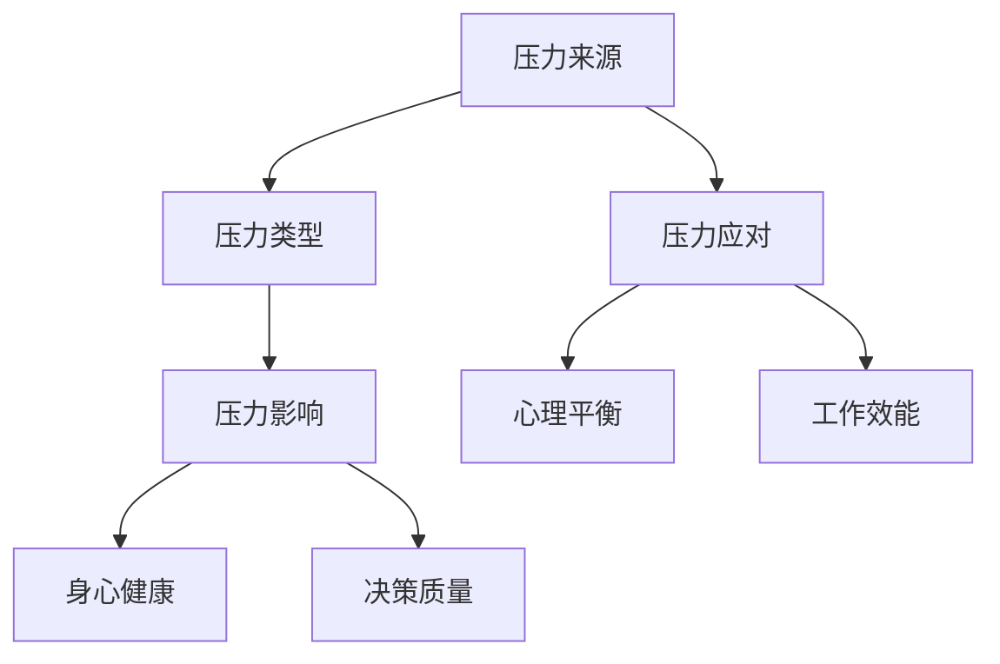
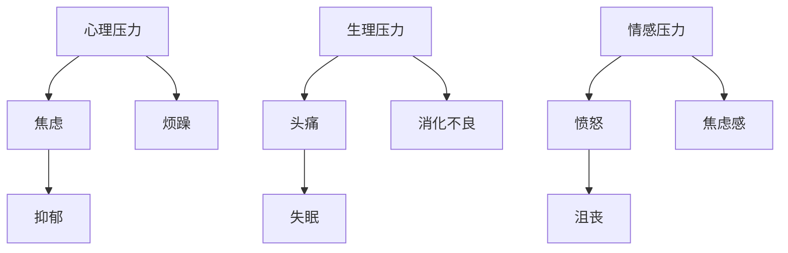
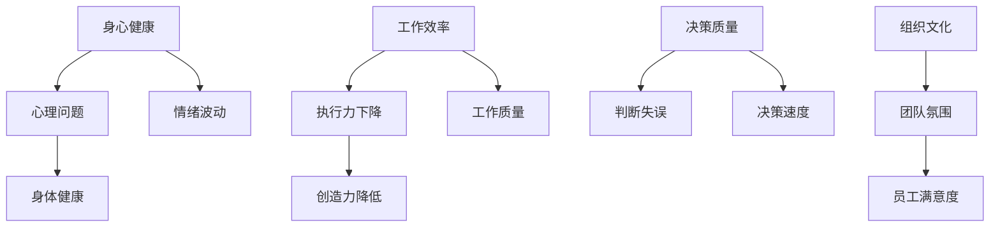
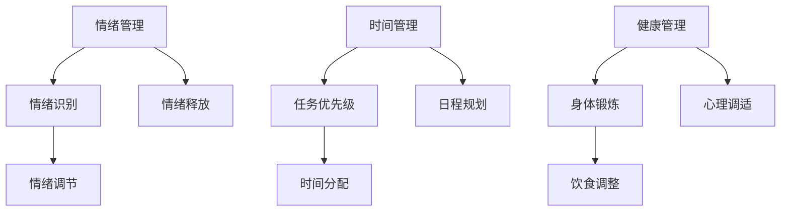

                 

### 文章标题：领导者的压力管理：保持冷静的艺术

在信息爆炸和技术飞速发展的当今社会，领导者的角色变得尤为重要。他们不仅要具备卓越的管理能力，还要能够应对复杂多变的环境带来的巨大压力。因此，掌握有效的压力管理技巧，保持冷静成为领导者必备的素养。《领导者的压力管理：保持冷静的艺术》这本书旨在通过深入探讨压力的本质，提供系统化的方法，帮助领导者更好地管理压力，保持心理和情绪上的平衡。

本文将按照以下步骤进行分析和推理：

1. **引言**：介绍压力管理的背景和重要性，以及本书的目的和结构。
2. **核心概念与联系**：阐述压力管理的核心概念，并用Mermaid流程图展示概念之间的联系。
3. **具体方法**：详细讲解压力管理的具体策略和技巧。
4. **实际应用与案例分析**：通过实际案例说明压力管理方法的应用效果。
5. **总结与展望**：总结文章的核心观点，提出未来研究的方向和读者可以采取的行动。

通过这样的结构，本文将系统地帮助读者理解和应用压力管理的艺术。

### 文章关键词

- 领导者
- 压力管理
- 心理平衡
- 策略与技巧
- 情绪管理
- 组织文化

### 摘要

本文探讨了领导者面临压力的背景和压力管理的必要性。首先，我们介绍了压力管理的核心概念，包括压力的来源、类型和影响。接着，通过Mermaid流程图展示了这些概念之间的联系，帮助读者建立整体理解。然后，本文详细讲解了领导者压力管理的具体方法和技巧，如情绪管理、时间管理和组织文化建设。最后，通过实际案例展示了这些方法的有效性，并提出了未来研究的方向和读者可以采取的行动。本文旨在为领导者提供一套实用的压力管理指南，帮助他们在高压环境中保持冷静和高效。

### 引言：压力管理的背景与重要性

在现代职场中，领导者的角色至关重要，他们不仅要负责团队的日常运营，还要面对外部环境的快速变化和内部团队的管理挑战。这些因素共同构成了领导者面临的重压，使得压力管理成为一个不可忽视的话题。根据《哈佛商业评论》的一项研究，超过70%的领导者表示，他们经常感到工作压力巨大，这种压力不仅影响了他们的工作效率，还对他们的身心健康产生了负面影响。

领导者之所以容易受到压力的影响，原因主要有以下几点。首先，领导者的职责往往要求他们在多个方面做出决策，这些决策往往涉及到团队利益和公司发展，责任重大。其次，领导者的地位往往意味着他们需要面对更多的责任和期望，这些期望往往来自于上级、下属、客户和股东等多个方面。最后，领导者常常需要处理复杂的人际关系，如团队冲突、员工纠纷等，这些人际关系问题往往增加了他们的心理压力。

有效的压力管理对于领导者来说至关重要。首先，良好的压力管理能力可以帮助领导者更好地应对工作挑战，提高决策质量和工作效率。其次，压力管理有助于维护领导者的身心健康，减少因长期高压导致的身体疾病和心理问题。最后，压力管理还可以提升领导者的情绪稳定性和心理韧性，使他们能够更好地处理突发事件，保持冷静和理智。

为了帮助读者更好地理解压力管理的核心概念，本文将使用Mermaid流程图来展示这些概念之间的联系。Mermaid是一种基于Markdown的绘图语言，可以方便地创建流程图、序列图、类图等。下面是一个简化的Mermaid流程图，展示了压力管理的核心概念及其关系：



在这个流程图中，我们可以看到压力来源（A）直接影响压力类型（B），进而影响压力的影响（C）。压力应对（D）则通过心理平衡（E）和工作效能（F）来缓解压力的影响，同时，良好的压力管理还能提升决策质量（H）和保持身心健康（G）。通过这个流程图，读者可以更清晰地理解压力管理的整体架构，从而更好地应用这些概念。

### 核心概念与联系：Mermaid流程图

在前文中，我们已经介绍了压力管理的背景和重要性，并通过Mermaid流程图展示了压力管理的核心概念及其关系。在这一节中，我们将进一步深入探讨这些核心概念，并用详细的Mermaid流程图来阐述它们之间的内在联系。

#### 压力来源

压力来源是压力管理的起点，它包括工作压力、生活压力、环境压力等多个方面。以下是具体的压力来源分类及其影响：

```mermaid
graph TD
    A[工作压力] --> B[任务繁重]
    B --> C[责任重大]
    A --> D[职业发展]
    E[生活压力] --> F[家庭责任]
    F --> G[经济负担]
    E --> H[人际关系]
    I[环境压力] --> J[竞争激烈]
    I --> K[不确定性]
    A, E, I --> L[压力累积]
```

在这个流程图中，工作压力（A）包括任务繁重（B）和责任重大（C），生活压力（E）涵盖家庭责任（F）和经济负担（G），环境压力（I）则涉及竞争激烈（J）和不确定性（K）。这些压力源最终会导致压力累积（L），影响领导者的身心健康和工作效能。

#### 压力类型

压力类型是压力表现的形式，常见的压力类型包括心理压力、生理压力和情感压力等。以下是各种压力类型的定义和影响：



在这个流程图中，心理压力（M）会导致焦虑（N）、抑郁（O）和烦躁（P），生理压力（Q）会引起头痛（R）、失眠（S）和消化不良（T），情感压力（U）则会导致愤怒（V）、沮丧（W）和焦虑感（X）。这些压力类型的不同表现形式会相互作用，共同影响领导者的情绪和生理状态。

#### 压力影响

压力的影响是压力管理的核心关注点，它涵盖了身心健康、工作效率、决策质量等多个方面。以下是压力影响的详细说明：



在这个流程图中，压力对身心健康（Y）的影响包括心理问题（Z，如焦虑、抑郁）、身体健康（AA，如头痛、失眠）和情绪波动（BB）。对工作效率（CC）的影响表现为执行力下降（DD）和创造力降低（EE），对决策质量（GG）的影响包括判断失误（HH）和决策速度（II）。此外，压力还会对组织文化（KK）产生间接影响，如团队氛围（LL）和员工满意度（MM）。

#### 压力应对

为了应对上述各种压力，领导者需要采用一系列的策略和技巧，包括情绪管理、时间管理、健康管理等。以下是这些策略的具体内容和影响：



在这个流程图中，情绪管理（JJ）包括情绪识别（KK）、情绪调节（LL）和情绪释放（MM），时间管理（NN）包括任务优先级（OO）、时间分配（PP）和日程规划（QQ），健康管理（RR）包括身体锻炼（SS）、饮食调整（TT）和心理调适（UU）。这些策略共同作用，帮助领导者保持心理平衡，提高工作效率和决策质量。

通过上述Mermaid流程图，我们可以清晰地看到压力来源、压力类型、压力影响和压力应对之间的内在联系。这个流程图不仅帮助我们理解了压力管理的整体框架，还为领导者提供了具体的应对策略和方法。在接下来的章节中，我们将详细探讨这些策略和技巧，帮助领导者更好地管理压力，保持冷静和高效。

### 具体方法：情绪管理技巧

情绪管理是压力管理的重要组成部分，对于领导者来说尤为重要。良好的情绪管理技巧不仅有助于领导者保持冷静和专注，还能提升团队合作效果和领导力。在这一节中，我们将详细探讨几种有效的情绪管理技巧，包括情绪识别、情绪调节和情绪释放。

#### 情绪识别

情绪识别是情绪管理的第一步，它帮助领导者意识到自己和他人的情绪状态。以下是一些具体的情绪识别技巧：

1. **自我反思**：通过自我反思，领导者可以更好地了解自己的情绪状态。例如，每天花几分钟时间思考：“我今天的情绪如何？哪些事件引起了我的情绪变化？”

2. **日记记录**：定期记录情绪变化有助于领导者发现情绪模式。例如，可以记录每天的情绪波动，分析情绪产生的原因。

3. **情绪检测工具**：使用情绪检测工具，如情绪量表和情绪分析软件，可以帮助领导者更准确地识别情绪。

4. **与信任人士交流**：与信任的同事、朋友或心理咨询师交流，可以帮助领导者获得外界对自身情绪的反馈。

#### 情绪调节

情绪调节是指通过特定的方法和技巧来调整和管理情绪。以下是一些有效的情绪调节技巧：

1. **深呼吸**：深呼吸是一种简单而有效的情绪调节方法。领导者可以尝试在感到压力或情绪波动时，进行深呼吸练习，以缓解紧张情绪。

2. **正念冥想**：正念冥想是一种通过专注当下，观察情绪而不做出反应的方法。领导者可以通过定期练习正念冥想来提高情绪调节能力。

3. **认知重构**：认知重构是一种通过改变负面思维模式来调整情绪的方法。领导者可以通过识别和挑战自己的负面思维，用更积极的方式来看待问题。

4. **积极心理学**：积极心理学强调关注和培养积极情绪，如感恩、快乐和满足感。领导者可以通过记录感恩日记、参与正面的社交活动来培养积极情绪。

#### 情绪释放

情绪释放是指通过特定的方法和渠道来释放负面情绪。以下是一些有效的情绪释放技巧：

1. **运动**：运动是一种有效的情绪释放方法，可以帮助领导者释放压力和紧张情绪。例如，跑步、游泳或瑜伽等运动都可以提升情绪状态。

2. **艺术创作**：艺术创作，如绘画、写作或音乐，可以帮助领导者表达和释放情绪。通过艺术创作，领导者可以将内心的情绪转化为外在的艺术作品。

3. **情绪宣泄**：情绪宣泄是指通过特定的方式，如哭泣、大笑或大声喊叫来释放情绪。领导者可以选择一个私密的环境，安全地宣泄情绪。

4. **心理咨询**：心理咨询是一种专业的情绪释放方法，领导者可以通过与心理咨询师交流，探索和处理深层次的负面情绪。

#### 综合应用

领导者可以综合应用上述情绪管理技巧，以达到更好的效果。例如，在会议前进行深呼吸练习，以保持冷静和专注；在紧张的工作间隙，通过冥想或运动来放松身心；在遇到困难时，通过认知重构来调整思维模式。

通过这些情绪管理技巧，领导者不仅可以更好地应对工作压力，还能提升情绪稳定性和心理韧性，从而在高压环境中保持高效和冷静。

### 压力释放与放松技巧

在领导者压力管理中，压力释放与放松技巧是不可或缺的一部分。这些技巧不仅有助于缓解短期的紧张情绪，还能提升长期的心理健康。以下是一些有效的压力释放与放松技巧，包括身体放松技巧、心理放松技巧和实际应用方法。

#### 身体放松技巧

身体放松技巧主要通过缓解肌肉紧张和促进血液循环来减轻压力。以下是一些常用的身体放松技巧：

1. **深层肌肉放松**：这是一种逐步放松身体各部位肌肉的方法。具体步骤如下：
   - 取一个舒适的坐姿或躺姿。
   - 从头部开始，逐渐向下肢放松每个部位的肌肉。
   - 注意呼吸，每次吸气时放松相应的肌肉，每次呼气时进一步放松。
   - 持续5-10分钟。

2. **瑜伽与太极**：瑜伽和太极都是通过体位练习、呼吸调节和冥想来放松身心的方法。以下是一个简单的瑜伽练习示例：
   - 山式站立，深呼吸，专注于呼吸。
   - 逐渐下蹲至半坐姿，保持脊背挺直。
   - 呼气，前弯身体，双手触地，头部放松。
   - 吸气，直立身体，重复此过程数次。

3. **按摩**：按摩可以促进血液循环，缓解肌肉紧张。领导者可以选择定期进行全身按摩或局部按摩，如颈部和肩部按摩。

#### 心理放松技巧

心理放松技巧主要通过调节思维和情绪来缓解压力。以下是一些有效的心理放松技巧：

1. **冥想与正念**：冥想和正念练习可以帮助领导者专注于当下，减少杂念和焦虑。以下是一个简单的冥想练习：
   - 找一个安静的环境，舒适地坐下或躺下。
   - 闭上眼睛，深呼吸，专注于呼吸的感觉。
   - 当思维偏离时，轻轻地将注意力引回到呼吸上。
   - 持续10-15分钟。

2. **情感释放**：情感释放技巧，如哭泣、大声宣泄或写情绪日记，可以帮助领导者释放压抑的情绪。例如，领导者可以在感到情绪积压时，找一个私密的空间，大声说出或写下自己的感受。

3. **积极思考**：积极思考是一种通过关注积极事物和积极情绪来缓解压力的方法。领导者可以通过记录每日的感恩事项或参与正面的社交活动来培养积极思维。

#### 实际应用方法

以下是一些实际应用方法，帮助领导者将上述压力释放与放松技巧融入日常生活：

1. **每日放松时间**：领导者可以设定一个固定的每日放松时间，如早晨醒来后的10分钟或晚上睡前的时间。在这个时间段内，专注于放松技巧，减少外界干扰。

2. **工作与休息结合**：在工作间隙，领导者可以短暂休息，进行深呼吸、冥想或简单的瑜伽动作。这种短时间的放松可以帮助恢复精力，提高工作效率。

3. **团队放松活动**：领导者可以组织定期的团队放松活动，如团建活动、瑜伽课或冥想小组。这种活动不仅有助于团队建设，还能提升团队成员的心理健康。

4. **心理健康支持**：领导者可以寻求专业的心理健康支持，如心理咨询或心理治疗。这种支持可以帮助领导者更深入地了解和处理压力问题。

通过身体放松技巧和心理放松技巧的综合应用，领导者可以在高压环境中保持身心健康，提高情绪稳定性和工作效率。这些技巧不仅有助于领导者自身的成长，还能为团队成员树立榜样，促进整体团队的健康与发展。

### 时间管理与效率提升

在领导者的日常工作中，时间管理和效率提升是确保任务完成和目标达成的关键。良好的时间管理不仅能帮助领导者减轻工作压力，还能提高整体的工作效能。以下将介绍时间管理的核心原则和提升工作效率的具体方法。

#### 时间管理原则

1. **目标设定**：明确目标和优先级是时间管理的第一步。领导者应确保每个任务都与长期目标和愿景一致。具体方法包括设定SMART目标（具体、可衡量、可达成、相关性强、时限性）。

2. **任务分解**：将大型任务分解成小步骤，有助于更清晰地了解任务进度，并避免因为任务复杂而感到无从下手。每个小步骤都应有一个明确的开始和结束时间。

3. **优先级设定**：根据任务的紧急程度和重要性来设定优先级。领导者可以使用“艾森豪威尔矩阵”（紧急且重要、紧急但不重要、不紧急但重要、不紧急且不重要）来帮助决策。

4. **避免拖延**：拖延是效率低下的常见原因。领导者可以采用“番茄工作法”等时间管理工具来提高工作效率，减少拖延。

5. **定期回顾**：定期回顾和调整时间管理计划，有助于持续优化时间利用效果。这包括每月、每周和每日的回顾。

#### 提升工作效率的方法

1. **集中注意力**：避免多任务处理，专注于一项任务直到完成。领导者可以使用专注工具，如专注力训练应用或“单点关注”训练，以提高注意力集中度。

2. **避免干扰**：在工作时尽量减少干扰，如关闭不必要的通知、保持工作环境的整洁、设定特定的工作时间段等。

3. **优化工作习惯**：建立健康的工作习惯，如定时休息、定期锻炼、保持良好的作息时间等，有助于提高整体工作效率。

4. **使用工具与技巧**：利用各种时间管理和效率提升工具，如日历应用、任务管理工具（如Trello、Asana等）、时间跟踪工具等，可以帮助领导者更有效地管理时间和任务。

5. **团队协作与沟通**：良好的团队协作和沟通可以减少重复工作和沟通成本，提高整体效率。领导者可以通过明确的任务分配、定期的团队会议和实时沟通工具（如Slack、Microsoft Teams等）来提升团队协作效率。

#### 综合应用

领导者可以将上述时间管理原则和工作效率提升方法综合应用，以达到最佳效果。例如，在每日早晨进行目标设定和任务规划，利用番茄工作法来提高专注力，定期回顾和调整时间管理计划。通过这种方式，领导者不仅能更好地管理自己的时间，还能带动团队成员共同提升工作效率。

总之，时间管理和效率提升是领导者压力管理的重要组成部分。通过科学的时间管理方法和提升工作效率的具体实践，领导者可以在高压环境中保持高效和冷静，确保任务的顺利完成和目标的达成。

### 压力管理与组织文化

在领导者的压力管理中，组织文化扮演着至关重要的角色。一个支持性的组织文化不仅能够减轻领导者的压力，还能提升整个团队的情绪健康和工作效能。以下将探讨压力管理在团队中的应用策略、组织层面的压力管理策略，以及管理层的角色和责任。

#### 压力管理在团队中的应用策略

1. **建立支持性团队文化**：支持性团队文化是压力管理的基石。领导者可以通过以下方法来建立这种文化：
   - **鼓励开放沟通**：建立一个开放的沟通环境，让团队成员可以自由地分享自己的担忧和挑战。
   - **培养同理心**：领导者应展示同理心，关注团队成员的感受，并给予必要的支持和鼓励。
   - **建立团队目标**：共同制定团队目标，使每个成员都能感受到自己的工作对团队的成功至关重要，从而增强归属感和责任感。

2. **团队协作与沟通技巧**：有效的团队协作和沟通可以减少压力和误解。领导者可以采取以下措施：
   - **明确职责和期望**：确保每个团队成员都清楚自己的职责和团队的期望，避免模糊性和不确定性。
   - **定期团队会议**：定期举行团队会议，讨论项目进展、问题和解决方案，确保团队成员之间的信息同步。
   - **跨部门协作**：鼓励不同部门之间的协作，以促进知识和经验的共享，减少部门间的隔阂和冲突。

3. **提供心理健康支持**：为团队成员提供心理健康支持，如心理咨询服务和压力管理培训。这可以帮助团队成员更好地应对工作压力，保持心理健康。

#### 组织层面的压力管理策略

1. **员工关怀与心理健康支持**：组织应重视员工的心理健康，提供全面的心理健康支持服务，包括：
   - **心理咨询服务**：提供免费的心理咨询服务，帮助员工解决心理问题。
   - **员工援助计划（EAP）**：建立员工援助计划，为员工提供专业心理咨询、压力管理和心理健康支持。

2. **管理层的角色与责任**：管理层在压力管理中扮演关键角色，他们应采取以下措施：
   - **树立榜样**：管理层应通过自身的行为和态度，展示如何积极应对压力，成为员工的榜样。
   - **提供资源**：确保员工有足够的资源和工具来应对压力，如灵活的工作安排、培训机会和放松设施。
   - **关注反馈**：定期收集员工对工作环境和压力管理的反馈，并采取相应的改进措施。

3. **建立健康的工作环境**：组织应营造一个健康的工作环境，包括：
   - **合理的工作负荷**：避免过度工作，确保员工有足够的时间休息和恢复。
   - **公平的绩效评估**：建立公平的绩效评估机制，避免因不合理的考核标准而增加员工压力。
   - **提供职业发展机会**：为员工提供职业发展机会，如培训、晋升机会等，以提升员工的职业满意度和归属感。

#### 管理层的角色与责任

1. **领导者的角色**：领导者不仅是团队的核心，也是压力管理的推动者。他们应通过以下方式来履行自己的角色：
   - **关注团队成员的情绪和需求**：领导者应关注团队成员的情绪变化，及时发现并解决潜在的压力问题。
   - **提供支持和指导**：领导者应提供必要的支持和指导，帮助团队成员应对工作中的挑战。

2. **责任与行动**：管理层应承担起以下责任：
   - **制定明确的压力管理政策**：制定明确的压力管理政策，包括心理健康支持、员工援助计划等。
   - **监督和评估**：定期监督和评估压力管理策略的实施效果，并根据反馈进行调整。

通过建立支持性的团队文化和实施组织层面的压力管理策略，管理层可以为领导者提供有力支持，帮助他们在高压环境中保持冷静和高效，同时提升整个组织的情绪健康和工作效能。

### 案例研究与实际应用

为了更好地理解压力管理策略在实践中的应用效果，下面我们通过两个具体的案例来展示这些策略的实际效果，并分析其成功和失败的原因。

#### 案例一：成功应用压力管理策略的公司

**公司背景**：
某大型科技公司，员工超过1000人，业务涉及软件开发、市场营销等多个领域。该公司在高压工作环境中，面临着激烈的竞争和快速的技术变革，员工普遍感到工作压力巨大。

**解决方案**：
1. **建立支持性团队文化**：
   - **员工援助计划（EAP）**：公司为员工提供免费的心理咨询服务，员工可以在遇到压力和情绪问题时，获得专业的心理支持。
   - **团队建设活动**：定期组织团队建设活动，如团建旅行、户外运动等，以增强团队凝聚力和员工之间的沟通。
   - **开放沟通渠道**：建立开放的沟通渠道，鼓励员工提出建议和意见，管理层会定期听取并回应员工的反馈。

2. **实施时间管理和效率提升策略**：
   - **弹性工作制**：公司实施弹性工作制，允许员工在一定时间内自主安排工作时间和地点，以减少通勤压力和工作时间压力。
   - **专注工作时段**：公司推广“番茄工作法”，帮助员工提高专注力，减少多任务处理带来的效率降低。

3. **组织层面的压力管理策略**：
   - **定期健康检查**：公司为员工提供定期健康检查，关注员工的身心健康。
   - **心理健康培训**：组织心理健康培训，教授员工压力管理和情绪调节技巧。

**效果分析**：
通过上述策略的实施，公司员工的工作满意度和心理健康水平显著提高。员工在工作中的积极性和创造力得到了提升，团队的整体绩效也有所改善。此外，员工的流失率明显降低，公司的人力资源成本得到有效控制。

#### 案例二：压力管理策略失败的原因

**公司背景**：
某中型科技公司，员工约500人，主要从事IT服务。尽管公司管理层意识到员工压力问题，但在实际操作中未能有效实施压力管理策略。

**解决方案**：
1. **缺乏支持性团队文化**：
   - **沟通不足**：公司缺乏有效的沟通机制，管理层与员工之间的信息交流不畅，员工感到被忽视。
   - **缺乏团队建设**：公司很少组织团建活动，员工之间的互动有限，团队凝聚力较弱。

2. **时间管理和效率提升策略不足**：
   - **不合理的工作负荷**：员工经常需要加班，工作负荷较大，但公司未能提供有效的休息时间和恢复机制。
   - **缺乏专注工具**：公司没有推广有效的专注工作方法，员工在多任务处理中效率低下。

3. **组织层面的压力管理策略缺乏**：
   - **心理健康支持不足**：公司没有提供员工援助计划或心理健康支持，员工在遇到压力时缺乏有效的帮助。
   - **健康检查和培训缺失**：公司未能为员工提供定期健康检查或心理健康培训。

**效果分析**：
由于上述原因，公司员工普遍感到工作压力大，情绪波动较大。员工流失率上升，工作效率下降，公司绩效受到严重影响。管理层虽意识到问题，但未能采取有效的措施加以解决，导致压力管理策略失败。

#### 成功与失败的经验教训

从上述两个案例中，我们可以得出以下经验教训：

1. **成功的关键因素**：
   - **建立支持性团队文化**：有效的沟通和团队建设活动有助于提高员工的归属感和团队凝聚力。
   - **实施科学的时间管理和效率提升策略**：合理的弹性工作制和专注工作方法可以显著提高工作效率和员工满意度。
   - **组织层面的压力管理策略**：提供心理健康支持和定期健康检查有助于提升员工的身心健康水平。

2. **失败的原因**：
   - **缺乏沟通和团队建设**：管理层与员工之间的信息不对称和缺乏互动会导致员工感到被忽视和孤独。
   - **不合理的工作负荷**：长期过度工作会消耗员工的体力和精力，导致心理健康问题。
   - **缺乏心理健康支持**：没有有效的心理健康支持会导致员工在压力下无法得到帮助，影响整体工作效率和绩效。

通过分析这些案例，我们可以看到，有效的压力管理策略不仅需要理论上的指导，更需要实际操作中的具体实施。只有在建立支持性团队文化、实施科学的时间管理和效率提升策略、以及组织层面的压力管理策略方面全面发力，才能真正实现压力管理的目标。

### 附录：压力管理资源与工具

在压力管理的过程中，利用一些工具和资源可以显著提高效果。以下是一些推荐的压力管理工具和资源，以及如何利用这些工具进行实际操作的建议。

#### 压力管理工具推荐

1. **心理测评工具**：
   - **情绪量表**：如“情绪状态量表”（Profile of Mood States, POMS）和“情感温度计”（Positive and Negative Affect Schedule, PANAS）等。这些工具可以帮助领导者识别自己的情绪状态，了解情绪波动的原因。
   - **心理健康APP**：如“Headspace”、“Headspace”等，这些应用程序提供冥想、呼吸练习和正念训练，帮助领导者缓解压力。

2. **情绪调节工具**：
   - **情绪日记**：记录每天的情绪变化和事件，有助于领导者反思情绪模式，找到情绪调节的方法。
   - **情绪释放工具**：如“愤怒释放器”（Anger Release Box）或“情绪释放音乐”等，这些工具可以帮助领导者安全地释放负面情绪。

#### 推荐阅读与进一步学习

1. **压力管理相关书籍**：
   - 《压力管理：策略与方法》（Stress Management: Strategies for Health and Well-being）
   - 《情绪智力：为什么情商比智商更重要》（Emotional Intelligence: Why It Can Matter More Than IQ）
   - 《如何掌控自己的注意力，回归真实生活》（The Power of Now: A Guide to Spiritual Enlightenment）

2. **专业培训与研讨会**：
   - 参加专业压力管理培训，如正念冥想培训、情绪管理培训等，这些培训可以帮助领导者掌握更系统的压力管理技巧。
   - 参与行业研讨会和讲座，与同行交流压力管理的经验和技巧。

#### 实际操作建议

1. **定期使用心理测评工具**：
   - 每周或每月使用一次情绪量表进行自我测评，记录情绪变化，分析压力源。
   - 利用心理健康APP进行每日的冥想和呼吸练习，帮助身心放松。

2. **建立情绪调节机制**：
   - 每天记录情绪日记，反思情绪波动的原因，制定应对策略。
   - 利用情绪释放工具，如愤怒释放器或情绪释放音乐，在情绪高涨时进行释放。

3. **持续学习和实践**：
   - 定期阅读压力管理和情绪智力的书籍，提升理论知识。
   - 参加专业培训，与实践中的优秀领导者交流，提升实际操作能力。

通过利用这些工具和资源，领导者可以更有效地管理自己的压力，保持情绪稳定，提高工作效率和整体幸福感。

### 总结

通过本文的探讨，我们系统地介绍了压力管理的背景和重要性，详细阐述了压力管理的核心概念，如压力来源、类型、影响和应对策略，并通过Mermaid流程图展示了这些概念之间的内在联系。我们还介绍了具体的方法，如情绪管理、时间管理和组织文化策略，并通过实际案例展示了这些方法的应用效果。

压力管理不仅关乎领导者的个人健康，也对团队和组织整体绩效产生深远影响。因此，领导者应当高度重视压力管理，通过持续的学习和实践，掌握有效的压力管理技巧。本文提出的策略和方法为领导者提供了一个实用的指南，帮助他们更好地应对工作中的压力，保持冷静和高效。

未来研究可以进一步探索不同文化背景下的压力管理策略，以及技术工具在压力管理中的应用。此外，针对不同类型的领导者，设计个性化的压力管理方案，也将是一个重要的研究方向。

总之，有效的压力管理是领导者保持长远成功和幸福的关键。希望通过本文，读者能够对压力管理有更深入的理解，并积极应用这些策略，提升自己的领导力和整体幸福感。

### 最佳实践 Tips

为了更好地实践压力管理，以下是几个实用的建议：

1. **每日冥想**：每天花10分钟进行冥想，专注于呼吸和当下的感受，有助于减轻压力和提升专注力。
2. **设定清晰目标**：制定可实现的短期和长期目标，并定期评估进度，有助于提升工作效率和减少迷茫感。
3. **运动与健康饮食**：定期进行适量的运动，如散步、跑步或瑜伽，并保持均衡的饮食，有助于身心健康。
4. **定期休息与休假**：确保每周有足够的休息时间，避免过度劳累，定期休假有助于恢复活力和创造力。
5. **学会说“不”**：合理拒绝超出自己能力范围的任务，避免因过度承诺而增加压力。

通过这些最佳实践，领导者可以更有效地管理压力，保持冷静和高效的工作状态。

### 注意事项

在实施压力管理策略时，需要注意以下几点：

1. **个性化**：压力管理策略需要根据个人的具体情况定制，避免一刀切的方法。
2. **持续性与系统性**：压力管理是一个长期过程，需要持续和系统的努力，不能一蹴而就。
3. **心理健康支持**：寻求专业的心理健康支持，特别是在遇到复杂或深层次的压力问题时，专业的帮助至关重要。
4. **透明与开放**：在团队和组织内建立透明和开放的沟通文化，鼓励团队成员分享压力和挑战，共同寻找解决方案。

通过关注这些注意事项，领导者可以更有效地实施压力管理策略。

### 拓展阅读

对于希望进一步深入了解压力管理的读者，以下几本书籍和资源推荐：

1. **书籍**：
   - 《压力管理：策略与方法》（Stress Management: Strategies for Health and Well-being）
   - 《情绪智力：为什么情商比智商更重要》（Emotional Intelligence: Why It Can Matter More Than IQ）
   - 《如何掌控自己的注意力，回归真实生活》（The Power of Now: A Guide to Spiritual Enlightenment）

2. **在线资源**：
   - **哈佛商业评论**：提供关于领导者压力管理的最新研究和案例分析。
   - **Mindful.org**：提供正念冥想和心理健康的资源和指导。
   - **国家心理健康热线**：提供专业的心理健康咨询和支持服务。

通过阅读这些书籍和访问这些资源，读者可以更深入地理解压力管理的理论和实践，提升自己的压力管理能力。

