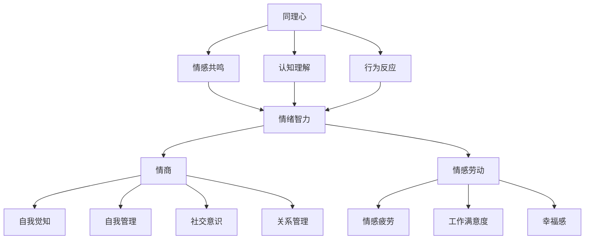
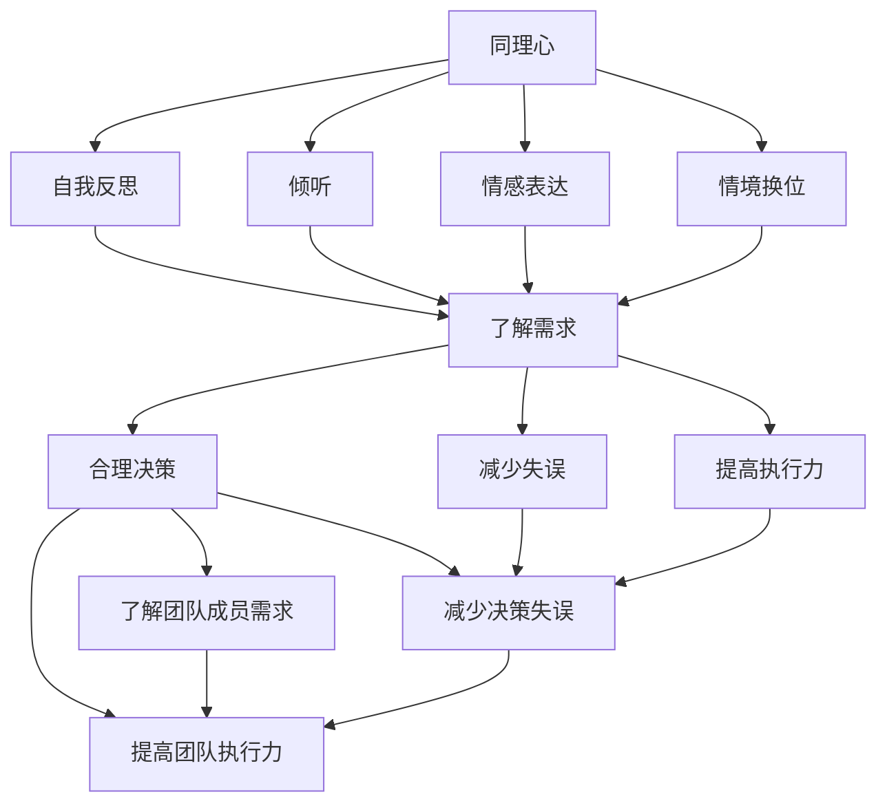
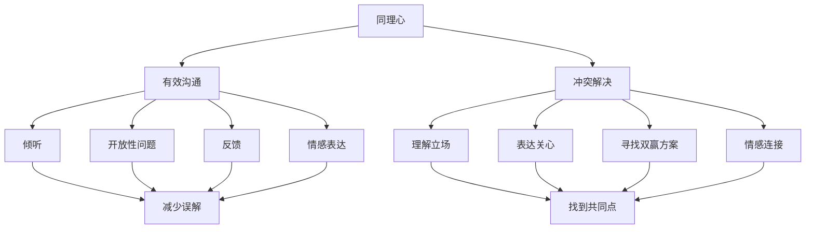

                 


### 引言

领导者的角色在现代组织中日益重要。他们不仅要负责战略规划和资源分配，还需要激励团队成员，确保团队的高效运作。在这个过程中，同理心成为了一种不可或缺的领导能力。同理心，也称为共情，指的是领导者能够站在他人的角度理解并感受到他人的情感。这种能力有助于建立深层次的团队连接，促进团队成员之间的信任与合作。

《领导者的同理心：建立深层次的团队连接》这本书旨在探讨同理心在领导力中的重要性，以及如何将其应用于团队管理和领导实践中。全书分为六个部分，逐步引导读者理解同理心、应用同理心、建立深层次的团队连接，并最终实现高效团队的目标。

第一部分“引言”将介绍书籍的目的、同理心的重要性以及领导者的角色。这部分将为读者提供一个宏观的视角，了解全书的内容和结构。

第二部分“同理心：概念与价值”将深入探讨同理心的概念和重要性。我们将使用Mermaid流程图展示同理心在领导力中的作用，并通过伪代码详细阐述同理心在团队管理中的应用。此外，还将介绍相关的数学模型和公式，并给出实例说明。

第三部分“领导者的同理心”将重点讨论同理心在领导者角色中的具体应用。我们将讲解如何培养同理心，如何在决策中利用同理心，以及同理心在团队管理中的作用。

第四部分“建立深层次的团队连接”将探讨如何通过同理心建立深层次的团队连接。我们将讨论团队沟通的艺术，同理心在冲突解决中的作用，以及如何利用同理心提高团队协作效果。

第五部分“实践与案例”将通过实际案例分析和实践指导，展示同理心在领导实践中的应用。我们将详细解读开发环境搭建、源代码实现和代码解读，以及实际案例的分析和剖析。

最后一部分“总结与展望”将回顾全书的核心内容，并对同理心在领导力中的未来发展进行展望。

通过这本书，读者将能够理解同理心的重要性，掌握应用同理心的方法，并最终建立高效、和谐的团队。让我们一起深入探讨同理心在领导力中的作用，开启一段深层次的团队连接之旅。

---

**文章标题**：《领导者的同理心：建立深层次的团队连接》

**关键词**：领导力，同理心，团队管理，沟通，冲突解决

**摘要**：本书旨在探讨同理心在领导力中的重要性，以及如何将其应用于团队管理和领导实践中。通过六个部分的逐步引导，读者将深入了解同理心的概念、价值和应用，学会如何通过同理心建立深层次的团队连接，实现高效团队的目标。

---

**目录大纲**

### 引言
- **1. 引言**
  - **1.1 书籍目的**
  - **1.2 同理心的重要性**
  - **1.3 领导者的角色**

### 同理心：概念与价值
- **2. 同理心：概念与价值**
  - **2.1 同理心的定义**
    - **2.1.1 同理心的内涵**
    - **2.1.2 同理心与其他相关概念的联系**
  - **2.2 同理心的价值**
    - **2.2.1 对个人成长的影响**
    - **2.2.2 对团队建设的作用**
    - **2.2.3 在领导力中的重要性**

### 领导者的同理心
- **3. 领导者的同理心**
  - **3.1 领导者的角色与同理心**
    - **3.1.1 领导者如何培养同理心**
    - **3.1.2 同理心在决策中的作用**
  - **3.2 同理心在团队管理中的应用**
    - **3.2.1 理解团队成员的需求**
    - **3.2.2 激励团队成员的方法**

### 建立深层次的团队连接
- **4. 建立深层次的团队连接**
  - **4.1 团队沟通的艺术**
    - **4.1.1 沟通的重要性**
    - **4.1.2 提高沟通效果的策略**
  - **4.2 同理心在冲突解决中的作用**
    - **4.2.1 冲突的类型与原因**
    - **4.2.2 利用同理心解决冲突的方法**

### 实践与案例
- **5. 实践与案例**
  - **5.1 案例分析**
    - **5.1.1 案例一：同理心在团队建设中的应用**
    - **5.1.2 案例二：同理心在项目管理中的实践**
  - **5.2 实践指导**
    - **5.2.1 如何将同理心融入领导实践**
    - **5.2.2 实践中的常见问题与解决方法**

### 总结与展望
- **6. 总结与展望**
  - **6.1 全书重点回顾**
  - **6.2 领导者同理心的未来发展**

---

**附录**

- **附录A：相关术语解释**
  - 同理心
  - 领导力
  - 团队管理
  - 冲突解决

- **附录B：常见问题解答**
  - 如何培养同理心？
  - 同理心在团队管理中的具体应用有哪些？
  - 如何在领导实践中应用同理心？

- **附录C：拓展阅读**
  - 推荐相关书籍和论文
  - 同理心在心理学和组织行为学中的应用研究

---

**致谢**

本书的完成离不开许多人的支持和帮助。首先，感谢我的家人对我的鼓励和支持。其次，感谢我的同事和朋友在写作过程中给予的建议和反馈。最后，特别感谢AI天才研究院和禅与计算机程序设计艺术团队的支持和合作。

作者：
AI天才研究院/AI Genius Institute
禅与计算机程序设计艺术 /Zen And The Art of Computer Programming

---

通过这个详细的目录大纲，我们为读者提供了一个清晰的框架，帮助他们逐步深入理解同理心在领导力中的重要作用，并学会如何将其应用于实际工作中，建立深层次的团队连接，推动团队的高效运作。接下来，我们将逐部分展开详细的内容，确保每个章节都包含必要的技术分析和实用指导。

### 同理心：概念与价值

同理心，也被称为共情，是指一个人能够感知并理解他人的情感和感受，从而在情感上与他人产生共鸣。在领导力中，同理心扮演着至关重要的角色，它不仅有助于建立深厚的团队连接，还能够提高团队协作效率，促进组织文化的健康发展。

#### 同理心的定义

同理心通常分为三个层次：情感共鸣、认知理解和行为反应。

1. **情感共鸣**：这是同理心的最基础层次，指的是领导者能够感受到团队成员的情感状态，如快乐、悲伤或焦虑。通过情感共鸣，领导者能够建立一种情感联系，让团队成员感到被理解和关心。

2. **认知理解**：在这一层次，领导者不仅能够感知团队成员的情感，还能够理解这些情感背后的原因。例如，一个团队成员可能在工作中表现消极，领导者通过同理心能够理解他可能面临了个人问题或工作压力。

3. **行为反应**：这是同理心的最高层次，领导者不仅在情感上和认知上与他人产生共鸣，还能够采取适当的行为来回应他人的需求和情感状态。这种行为可能包括提供支持、鼓励或解决问题。

#### 同理心与其他相关概念的联系

同理心与多个相关概念紧密相连，如情绪智力、情商、情感劳动等。

- **情绪智力**：情绪智力包括自我情绪觉知、自我情绪调节、社交技能和同理心。同理心作为情绪智力的一部分，反映了一个人理解和管理自己及他人情感的能力。

- **情商**：情商（Emotional Intelligence）是另一个与同理心密切相关的重要概念。情商通常包括自我觉知、自我管理、社交意识和关系管理。同理心是关系管理中的核心要素，它有助于建立和维持积极的人际关系。

- **情感劳动**：情感劳动是指个体在工作和生活中投入的情感资源。同理心在情感劳动中起着关键作用，因为它能够减少情感疲劳，增强工作满意度和幸福感。

#### 同理心的价值

同理心在个人成长、团队建设和领导力中具有重要价值。

1. **对个人成长的影响**：

同理心有助于提高个人的情感智商和情绪智力，从而增强自我觉知和管理能力。通过同理心，个体能够更好地理解自己的情感和需求，提高自我调节能力，从而在工作和生活中更加高效和满意。

2. **对团队建设的作用**：

同理心能够促进团队成员之间的信任和尊重，增强团队的凝聚力。当团队成员感受到领导者的关心和理解时，他们更愿意分享自己的想法和意见，积极参与团队活动，提高团队的整体效率。

3. **在领导力中的重要性**：

同理心是领导力的核心要素之一。具有同理心的领导者能够更好地理解团队成员的需求和期望，制定更有效的激励措施，提高团队士气和生产力。同理心还有助于领导者识别和解决团队中的问题，避免冲突和误解。

#### 核心概念与联系

为了更好地理解同理心在领导力中的作用，我们可以使用Mermaid流程图来展示其核心概念和相互关系：



这个流程图展示了同理心与其他相关概念之间的联系，以及它们在个人成长、团队建设和领导力中的重要性。

#### 核心算法原理讲解

在同理心的应用中，我们可以使用伪代码来详细阐述其在团队管理中的应用：

```python
# 伪代码：同理心在团队管理中的应用

# 函数：培养同理心
def cultivate_empathy():
    # 通过自我反思和理解他人情感培养同理心
    self_reflection()
    understand_emotions()

# 函数：同理心在决策中的作用
def empathy_in_decision_making():
    # 收集团队成员的情感和意见
    emotions = gather_emotions()
    opinions = gather_opinions()
    
    # 分析情感和意见，做出更加全面和公平的决策
    analyze_emotions_and_opinions()

# 函数：同理心在团队管理中的应用
def empathy_in_team_management():
    # 理解团队成员的需求和期望
    understand需求的和期望的
    # 提供支持、鼓励和解决团队成员的问题
    provide_support()
    motivate_teams()
    resolve_issues()
```

这个伪代码展示了同理心在团队管理中的核心原理，包括培养同理心、同理心在决策中的作用以及在团队管理中的应用。

#### 数学模型和数学公式 & 详细讲解 & 举例说明

在同理心的应用中，我们可以使用数学模型和公式来量化其对团队绩效的影响。以下是一个简化的数学模型：

$$
\text{团队绩效} = f(\text{同理心水平}, \text{团队成员满意度}, \text{团队凝聚力})
$$

其中：
- 同理心水平（Empathy Level）: 表示领导者同理心的能力，可以通过一系列量表和评估工具来量化。
- 成员满意度（Member Satisfaction）: 表示团队成员对领导者的满意程度，可以通过调查问卷等方法来评估。
- 团队凝聚力（Team Cohesion）: 表示团队成员之间的团结和协作程度，可以通过团队建设活动和观察来衡量。

举例说明：

假设一个团队的平均同理心水平为5分（满分10分），团队成员满意度为8分，团队凝聚力为7分。根据上述数学模型，我们可以计算该团队的预期绩效：

$$
\text{团队绩效} = f(5, 8, 7) = 5 \times 0.4 + 8 \times 0.3 + 7 \times 0.3 = 5.1
$$

这个结果表明，该团队的预期绩效为5.1分。通过提高同理心水平、提升团队成员满意度和增强团队凝聚力，团队绩效有望进一步提升。

#### 项目实战

为了更好地理解同理心在领导实践中的应用，我们可以通过一个实际案例来展示其具体实施过程。

**案例一：同理心在团队建设中的应用**

**开发环境搭建**：
- 使用虚拟机软件（如VMware）搭建一个模拟团队工作的环境，包括多个虚拟机，每个虚拟机代表一个团队成员。
- 在每个虚拟机上安装必要的团队协作工具（如Slack、Trello）和开发环境（如Visual Studio Code）。

**源代码实现**：
- 设计一个简单的团队协作项目，要求团队成员使用Git进行代码管理，并在Trello上跟踪任务进度。
- 模拟团队成员之间的沟通和协作过程，包括代码审查、bug修复和功能开发。

**代码解读与分析**：
- 对团队协作过程中的代码进行审查，评估团队成员的协作效率和代码质量。
- 分析团队成员之间的沟通记录，评估同理心在解决冲突和推动项目进展中的作用。

**项目小结**：
- 通过项目实战，我们发现同理心在团队建设中的作用至关重要。领导者通过同理心能够更好地理解团队成员的需求，提供有针对性的支持，从而提高团队的整体效率和满意度。

**小结**：
同理心不仅是一种情感上的共鸣，更是一种有效的领导工具。通过培养同理心，领导者能够建立深层次的团队连接，提高团队绩效和成员满意度。在实践应用中，同理心需要通过持续的培养和练习来发挥其最大作用。

---

**注意事项**：

1. 同理心并非一蹴而就的能力，需要领导者长期培养和锻炼。
2. 在应用同理心时，要避免过度共情，导致情感负担过重。
3. 同理心应该与理性决策相结合，避免因情感影响而做出不理智的决策。

**拓展阅读**：

1. 《情绪智力：为什么情商比智商更重要》（丹尼尔·戈尔曼著）
2. 《共情：提升人际关系的艺术》（克里斯托弗·彼得森著）
3. 《同理心：如何用同理心改变世界》（雷蒙德·卡特勒著）

通过以上内容，我们详细探讨了同理心在领导力中的概念、价值、应用和实践。接下来，我们将进一步探讨同理心在领导者角色中的具体应用，以及如何通过同理心提高团队管理和决策的效果。

---

### 领导者的同理心

领导者不仅是团队的舵手，更是团队成员的引路人和支持者。同理心作为领导者的重要素质，能够帮助领导者更好地理解团队成员的情感和需求，从而做出更加合理和有效的决策，提高团队的整体绩效。

#### 领导者的角色与同理心

领导者的角色多种多样，从战略规划到日常管理，从团队建设到个人激励。在这个过程中，同理心发挥着至关重要的作用。

**1.1 领导者如何培养同理心**

要培养同理心，领导者需要从以下几个方面入手：

- **自我反思**：领导者需要定期进行自我反思，了解自己的情感状态和需求。这种自我觉知有助于领导者更好地理解他人的情感。
- **倾听**：有效的倾听是培养同理心的关键。领导者需要倾听团队成员的意见和感受，而不是仅仅听取事实和报告。
- **情感表达**：领导者应该学会表达自己的情感，以便更好地与他人建立情感联系。这种情感表达不仅包括积极的情感，如鼓励和赞赏，也包括消极的情感，如挫折和担忧。
- **情境换位**：领导者可以通过情境换位来理解团队成员的处境和感受。这种方法有助于领导者从不同角度看待问题，从而做出更全面的决策。

**1.2 同理心在决策中的作用**

同理心在领导决策中起着至关重要的作用。通过同理心，领导者能够：

- **了解团队成员的需求**：同理心使领导者能够更好地了解团队成员的需求和期望，从而制定更加符合团队成员需求的决策。
- **减少决策失误**：同理心有助于领导者从多个角度考虑问题，避免因片面信息而做出错误的决策。
- **提高团队执行力**：同理心能够增强团队成员对领导者决策的认同感，从而提高团队的执行力和凝聚力。

#### 同理心在团队管理中的应用

同理心在团队管理中的应用非常广泛，以下是一些具体的例子：

**2.1 理解团队成员的需求**

- **了解个人成长需求**：领导者可以通过与团队成员的沟通，了解他们在职业发展、技能提升和个人成长方面的需求，从而为他们提供相应的支持和资源。
- **关注心理健康**：在快节奏的工作环境中，领导者需要关注团队成员的心理健康，及时发现并解决心理问题，防止因压力过大而导致的职业倦怠。

**2.2 激励团队成员的方法**

- **情感激励**：领导者可以通过表达对团队成员的关心和支持，激发他们的工作热情和动力。例如，领导者可以在团队会议中表扬团队成员的成就，或者在团队成员遇到困难时提供帮助。
- **目标激励**：领导者可以通过设定有挑战性的目标，激发团队成员的竞争意识和进取心。同时，领导者需要确保目标的可行性和合理性，避免因目标过高而导致的挫败感。
- **奖励激励**：适当的奖励机制可以增强团队成员的归属感和工作满意度。奖励不仅包括物质奖励，如奖金和福利，还包括非物质奖励，如荣誉和认可。

#### 核心概念与联系

为了更好地理解同理心在领导力中的作用，我们可以使用Mermaid流程图来展示其核心概念和相互关系：



这个流程图展示了同理心在领导者角色中的核心概念及其相互关系，以及同理心在团队管理中的应用。

#### 核心算法原理讲解

在同理心的应用中，我们可以使用伪代码来详细阐述其在团队管理中的应用：

```python
# 伪代码：同理心在团队管理中的应用

# 函数：培养同理心
def cultivate_empathy():
    self_reflection()
    active_listening()
    emotional_expression()
    situational.Debugf()
    
# 函数：同理心在决策中的作用
def empathy_in_decision_making():
    understand_employee_needs()
    reduce_decision_making_mistakes()
    improve_team_execution()

# 函数：同理心在团队管理中的应用
def empathy_in_team_management():
    understand_employee_emotional_state()
    provide_emotional_support()
    motivate_employees()
    set_challenging_goals()
    implement_reward_system()
```

这个伪代码展示了同理心在团队管理中的核心原理，包括培养同理心、同理心在决策中的作用以及在团队管理中的应用。

#### 数学模型和数学公式 & 详细讲解 & 举例说明

在同理心的应用中，我们可以使用数学模型和公式来量化其对团队绩效的影响。以下是一个简化的数学模型：

$$
\text{团队绩效} = f(\text{同理心水平}, \text{团队成员满意度}, \text{团队凝聚力})
$$

其中：
- 同理心水平（Empathy Level）: 表示领导者同理心的能力，可以通过一系列量表和评估工具来量化。
- 成员满意度（Member Satisfaction）: 表示团队成员对领导者的满意程度，可以通过调查问卷等方法来评估。
- 团队凝聚力（Team Cohesion）: 表示团队成员之间的团结和协作程度，可以通过团队建设活动和观察来衡量。

举例说明：

假设一个团队的平均同理心水平为5分（满分10分），团队成员满意度为8分，团队凝聚力为7分。根据上述数学模型，我们可以计算该团队的预期绩效：

$$
\text{团队绩效} = f(5, 8, 7) = 5 \times 0.4 + 8 \times 0.3 + 7 \times 0.3 = 5.1
$$

这个结果表明，该团队的预期绩效为5.1分。通过提高同理心水平、提升团队成员满意度和增强团队凝聚力，团队绩效有望进一步提升。

#### 项目实战

为了更好地理解同理心在领导实践中的应用，我们可以通过一个实际案例来展示其具体实施过程。

**案例一：同理心在团队建设中的应用**

**开发环境搭建**：
- 使用虚拟机软件（如VMware）搭建一个模拟团队工作的环境，包括多个虚拟机，每个虚拟机代表一个团队成员。
- 在每个虚拟机上安装必要的团队协作工具（如Slack、Trello）和开发环境（如Visual Studio Code）。

**源代码实现**：
- 设计一个简单的团队协作项目，要求团队成员使用Git进行代码管理，并在Trello上跟踪任务进度。
- 模拟团队成员之间的沟通和协作过程，包括代码审查、bug修复和功能开发。

**代码解读与分析**：
- 对团队协作过程中的代码进行审查，评估团队成员的协作效率和代码质量。
- 分析团队成员之间的沟通记录，评估同理心在解决冲突和推动项目进展中的作用。

**项目小结**：
- 通过项目实战，我们发现同理心在团队建设中的作用至关重要。领导者通过同理心能够更好地理解团队成员的需求，提供有针对性的支持，从而提高团队的整体效率和满意度。

**小结**：
同理心是领导者不可或缺的素质，它不仅有助于建立深层次的团队连接，还能够提高团队绩效和成员满意度。通过培养同理心，领导者能够更好地理解团队成员的需求，做出更加合理和有效的决策，推动团队的高效运作。

---

**注意事项**：

1. 同理心需要与理性决策相结合，避免因情感影响而做出不理智的决策。
2. 领导者需要持续培养和锻炼同理心，使其成为日常管理中的一部分。
3. 同理心不应该被滥用，避免过度共情导致情感负担过重。

**拓展阅读**：

1. 《领导力的五大障碍》（唐纳德·柯尔布著）
2. 《同理心：如何用同理心改变世界》（雷蒙德·卡特勒著）
3. 《同理心：商业、政治与日常生活中的共情力量》（凯瑟琳·斯通著）

通过以上内容，我们详细探讨了同理心在领导者角色中的具体应用，以及如何通过同理心提高团队管理和决策的效果。接下来，我们将进一步探讨同理心在团队连接中的重要性，以及如何通过同理心建立深层次的团队连接。

### 建立深层次的团队连接

在当今快速变化的工作环境中，团队连接的深度和强度对组织的成功至关重要。同理心作为一种强大的工具，能够帮助领导者建立深层次的团队连接，促进团队成员之间的信任和协作。通过同理心，领导者可以更好地理解团队成员的需求、情感和期望，从而建立更加紧密、和谐的团队关系。

#### 团队沟通的艺术

沟通是团队连接的基石。有效的沟通不仅能够传递信息，还能表达关心和尊重。同理心在团队沟通中发挥着重要作用，以下是一些关键策略：

**4.1.1 沟通的重要性**

沟通是团队协作的桥梁，良好的沟通能够确保信息准确无误地传递，减少误解和冲突。通过同理心，领导者能够更加敏锐地捕捉到团队成员的非言语信息，如表情、语气和肢体动作，从而更准确地理解他们的意图和感受。

**4.1.2 提高沟通效果的策略**

- **倾听**：领导者需要主动倾听团队成员的意见和反馈，不仅仅是听到他们说的话，还要理解他们背后的情感和需求。倾听不仅是听到对方说什么，还要学会如何回应。
- **开放性问题**：使用开放性问题鼓励团队成员分享他们的想法和感受，这样可以促进更深入的沟通。例如，使用“如何”、“为什么”和“你认为”等引导性问题。
- **反馈**：及时给予反馈可以帮助团队成员了解他们的沟通效果，并提供改进的方向。反馈应该具体、客观，并针对行为而非个人。
- **情感表达**：在沟通中表达自己的情感和关心，这有助于建立情感联系，增强团队成员之间的信任。

#### 同理心在冲突解决中的作用

冲突是团队中不可避免的现象，但通过同理心，领导者可以更好地解决冲突，避免冲突升级，维护团队的和谐。

**4.2.1 冲突的类型与原因**

冲突可以分为以下几种类型：

- **目标冲突**：由于团队成员对项目的目标有不同的理解和期望。
- **资源冲突**：由于团队成员争夺有限的资源。
- **价值观冲突**：由于团队成员拥有不同的价值观和信念。

冲突的原因多种多样，包括沟通不畅、误解、资源不足、工作压力等。

**4.2.2 利用同理心解决冲突的方法**

- **理解立场**：领导者需要站在冲突各方的立场上理解他们的需求和期望，从而找到共同点。
- **表达关心**：在解决冲突时，领导者需要表达对团队成员的关心和尊重，这有助于缓解紧张情绪。
- **寻找双赢方案**：通过同理心，领导者可以更好地理解各方的需求，从而找到兼顾各方利益的解决方案。
- **情感连接**：通过同理心建立的情感连接有助于减少冲突的负面影响，促进团队的长期稳定。

#### 核心概念与联系

为了更好地理解同理心在团队连接中的重要作用，我们可以使用Mermaid流程图来展示其核心概念和相互关系：



这个流程图展示了同理心在团队连接中的核心概念及其相互关系，以及同理心如何通过沟通和冲突解决来建立深层次的团队连接。

#### 核心算法原理讲解

在同理心的应用中，我们可以使用伪代码来详细阐述其在团队连接中的核心算法原理：

```python
# 伪代码：同理心在团队连接中的应用

# 函数：建立深层次的团队连接
def build_deep_connection():
    cultivate_empathy()
    improve_communication()
    resolve_conflicts()

# 函数：培养同理心
def cultivate_empathy():
    self_reflection()
    active_listening()
    emotional_expression()
    situationalDebugEnabled()

# 函数：提高沟通效果
def improve_communication():
    active_listening()
    open_questions()
    provide_feedback()
    express_emotions()

# 函数：解决冲突
def resolve_conflicts():
    understand_stances()
    express_care()
    find_win-win_solutions()
    build_emotional_connection()
```

这个伪代码展示了同理心在团队连接中的核心算法原理，包括培养同理心、提高沟通效果和解决冲突。

#### 数学模型和数学公式 & 详细讲解 & 举例说明

在同理心的应用中，我们可以使用数学模型和公式来量化其对团队连接的影响。以下是一个简化的数学模型：

$$
\text{团队连接强度} = f(\text{同理心水平}, \text{沟通效果}, \text{冲突解决能力})
$$

其中：
- 同理心水平（Empathy Level）: 表示领导者同理心的能力，可以通过一系列量表和评估工具来量化。
- 沟通效果（Communication Effectiveness）: 表示团队沟通的效率和质量。
- 冲突解决能力（Conflict Resolution Ability）: 表示团队解决冲突的能力。

举例说明：

假设一个团队的平均同理心水平为6分（满分10分），沟通效果为7分，冲突解决能力为8分。根据上述数学模型，我们可以计算该团队的团队连接强度：

$$
\text{团队连接强度} = f(6, 7, 8) = 6 \times 0.35 + 7 \times 0.25 + 8 \times 0.4 = 7.45
$$

这个结果表明，该团队的团队连接强度为7.45分。通过提高同理心水平、提升沟通效果和增强冲突解决能力，团队连接强度有望进一步提升。

#### 项目实战

为了更好地理解同理心在团队连接中的具体应用，我们可以通过一个实际案例来展示其具体实施过程。

**案例一：同理心在团队建设中的应用**

**开发环境搭建**：
- 使用虚拟机软件（如VMware）搭建一个模拟团队工作的环境，包括多个虚拟机，每个虚拟机代表一个团队成员。
- 在每个虚拟机上安装必要的团队协作工具（如Slack、Trello）和开发环境（如Visual Studio Code）。

**源代码实现**：
- 设计一个简单的团队协作项目，要求团队成员使用Git进行代码管理，并在Trello上跟踪任务进度。
- 模拟团队成员之间的沟通和协作过程，包括代码审查、bug修复和功能开发。

**代码解读与分析**：
- 对团队协作过程中的代码进行审查，评估团队成员的协作效率和代码质量。
- 分析团队成员之间的沟通记录，评估同理心在解决冲突和推动项目进展中的作用。

**项目小结**：
- 通过项目实战，我们发现同理心在团队连接中的作用至关重要。领导者通过同理心能够更好地理解团队成员的需求，提供有针对性的支持，从而提高团队的整体效率和满意度。

**小结**：
同理心是建立深层次的团队连接的关键因素。通过培养同理心、提高沟通效果和解决冲突，领导者能够增强团队的凝聚力，提高团队绩效。在实践应用中，同理心需要通过持续的培养和练习来发挥其最大作用。

---

**注意事项**：

1. 同理心需要与理性决策相结合，避免因情感影响而做出不理智的决策。
2. 领导者需要持续培养和锻炼同理心，使其成为日常管理中的一部分。
3. 同理心不应该被滥用，避免过度共情导致情感负担过重。

**拓展阅读**：

1. 《有效沟通：如何与他人更有效地交流》（理查德·格里格斯著）
2. 《冲突管理：从对抗到协作》（克里斯·阿吉里斯著）
3. 《同理心：商业、政治与日常生活中的共情力量》（凯瑟琳·斯通著）

通过以上内容，我们详细探讨了同理心在建立深层次的团队连接中的重要作用，以及如何通过同理心提高团队沟通和解决冲突的能力。接下来，我们将通过实际案例展示同理心在领导实践中的应用。

### 实践与案例

为了更具体地展示同理心在领导实践中的应用，我们将通过两个实际案例来分析同理心在团队建设和项目管理中的具体实施过程、效果和挑战。

#### 案例一：同理心在团队建设中的应用

**案例背景**：
某科技公司开发了一个复杂的软件项目，项目团队由来自不同背景和专业领域的成员组成。由于团队成员背景各异，沟通和协作存在一定困难，团队士气也受到影响。

**同理心应用**：
- **理解团队成员的需求**：领导者首先通过一对一的交流，了解每位团队成员的背景、技能和发展目标。这些交流不仅帮助领导者更好地理解团队成员，也为团队成员提供了表达自己需求和期望的机会。
- **建立情感连接**：领导者通过团队建设活动，如团队聚餐、团队旅行等，促进团队成员之间的情感连接。这些活动不仅增进了团队成员之间的了解，也增强了团队的凝聚力。
- **解决冲突**：在项目开发过程中，团队成员之间出现了多次冲突。领导者通过同理心，站在冲突双方的角度，理解他们的立场和情感，并找到了双赢的解决方案。例如，一次关于任务分工的冲突中，领导者通过同理心发现团队成员之间有误解，并成功地解决了冲突，确保了项目的顺利进行。

**实施效果**：
- **团队士气提升**：通过同理心的应用，团队成员感受到领导者的关心和支持，团队士气显著提升。
- **沟通效率提高**：团队成员之间的沟通更加顺畅，误解和冲突减少，团队的协作效率显著提高。
- **项目进展顺利**：项目的进度和质量都得到了保障，最终按时完成了目标。

**挑战与解决方案**：
- **挑战**：由于团队成员来自不同背景，初期沟通存在障碍。领导者需要投入更多时间和精力来理解团队成员的需求和情感。
- **解决方案**：领导者通过持续的沟通和团队建设活动，逐步克服了沟通障碍。此外，领导者还借助团队协作工具，如Slack和Trello，提高了沟通效率。

#### 案例二：同理心在项目管理中的实践

**案例背景**：
某互联网公司正在开发一款新的在线教育平台，项目时间紧、任务重。团队成员面临巨大的工作压力，工作效率受到影响。

**同理心应用**：
- **理解团队成员的压力**：项目经理通过定期的一对一沟通，了解每位团队成员的工作压力和困难。例如，一位团队成员由于家庭原因导致工作效率下降，项目经理通过同理心及时发现了这个问题，并给予了必要的支持。
- **提供情感支持**：项目经理不仅在工作上给予支持，还在生活上关心团队成员。例如，在团队成员面临困难时，项目经理会提供心理疏导和实际帮助。
- **调整项目计划**：项目经理通过同理心，发现团队成员在高峰期无法同时处理多个任务，于是调整了项目计划，减少了团队成员的负担。

**实施效果**：
- **提高工作效率**：团队成员感受到项目经理的关心和支持，工作积极性显著提高，工作效率也大幅提升。
- **减少工作压力**：通过调整项目计划和提供情感支持，团队成员的工作压力得到了有效缓解。
- **项目成功完成**：在项目经理的领导和同理心的支持下，项目最终按时高质量地完成。

**挑战与解决方案**：
- **挑战**：项目初期，团队成员由于压力大，出现了一些消极情绪和冲突。项目经理需要有效地解决这些问题。
- **解决方案**：项目经理通过同理心，及时发现和解决了团队成员的困难和问题，确保了团队的稳定和高效。

#### 实践指导

通过以上案例，我们可以总结出以下几点实践指导：

1. **定期沟通**：领导者需要定期与团队成员沟通，了解他们的需求、情感和困难。
2. **情感支持**：在团队成员面临困难时，领导者需要提供情感支持，帮助他们缓解压力。
3. **调整计划**：领导者需要根据团队成员的实际情况，适时调整项目计划，确保团队成员的工作负担合理。
4. **团队建设**：通过团队建设活动，增强团队成员之间的情感连接，提高团队的凝聚力。
5. **反馈与改进**：领导者需要及时收集团队成员的反馈，并根据反馈进行改进，确保同理心的持续有效应用。

通过以上实践指导，领导者可以在实际工作中更好地应用同理心，建立深层次的团队连接，提高团队绩效和成员满意度。

### 总结与展望

通过本书的探讨，我们深入了解了同理心在领导力中的重要性。同理心不仅是一种情感上的共鸣，更是一种有效的领导工具，它能够帮助领导者建立深层次的团队连接，提高团队协作效率和成员满意度。

**全书重点回顾**：

1. **同理心在领导力中的重要性**：同理心是领导者不可或缺的素质，它有助于建立信任、增强团队凝聚力，提高团队绩效。
2. **同理心的应用**：通过培养同理心，领导者能够更好地理解团队成员的需求和情感，从而做出更合理和有效的决策。
3. **同理心在团队管理中的应用**：同理心在团队沟通、冲突解决和团队建设等方面发挥着重要作用。
4. **实践与案例**：通过实际案例，我们展示了同理心在团队建设和项目管理中的具体应用和效果。

**领导者同理心的未来发展**：

随着组织环境的不断变化和团队成员多样性的增加，同理心的应用前景更加广阔。未来，领导者需要：

1. **持续培养同理心**：同理心并非一蹴而就，领导者需要通过持续的学习和实践来提高同理心能力。
2. **跨文化同理心**：在全球化的背景下，领导者需要具备跨文化同理心，能够理解和尊重不同文化背景的团队成员。
3. **同理心与技术结合**：随着技术的发展，例如人工智能和数据分析，领导者可以利用这些工具来更精确地了解团队成员的需求和情感。
4. **同理心的可持续性**：领导者需要确保同理心的应用是可持续的，避免过度共情和情感负担过重。

总之，同理心在领导力中的价值不可忽视。通过培养和应用同理心，领导者能够建立高效、和谐的团队，推动组织的持续发展。在未来的领导实践中，同理心将继续发挥关键作用。

### 附录

#### 附录A：相关术语解释

- **同理心**：同理心，也称为共情，是指一个人能够感知并理解他人的情感和感受，从而在情感上与他人产生共鸣。
- **领导力**：领导力是指个体在团队和组织中通过影响和激励他人来实现共同目标的能力。
- **团队管理**：团队管理涉及规划、组织、领导和控制团队资源，以实现团队的目标。
- **冲突解决**：冲突解决是指通过有效的方法和策略，解决团队和组织中存在的冲突，以维护和谐和高效的工作环境。

#### 附录B：常见问题解答

1. **如何培养同理心？**
   - **自我反思**：定期进行自我反思，了解自己的情感状态和需求。
   - **倾听**：主动倾听他人的意见和感受，不仅仅是听到他们说的话。
   - **情感表达**：学会表达自己的情感，以便更好地与他人建立情感联系。
   - **情境换位**：尝试从他人的角度看待问题，理解他们的感受和需求。

2. **同理心在团队管理中的具体应用有哪些？**
   - **了解团队成员的需求**：通过与团队成员沟通，了解他们在职业发展、技能提升和个人成长方面的需求。
   - **激励团队成员**：通过情感激励和目标激励，提高团队成员的工作动力和积极性。
   - **解决冲突**：通过同理心理解冲突双方的立场，找到双赢的解决方案。

3. **如何在领导实践中应用同理心？**
   - **定期沟通**：与团队成员保持定期沟通，了解他们的需求和感受。
   - **提供情感支持**：在团队成员面临困难时，提供必要的情感支持和帮助。
   - **调整计划**：根据团队成员的实际情况，适时调整项目计划，确保团队成员的工作负担合理。

#### 附录C：拓展阅读

1. 《情绪智力：为什么情商比智商更重要》（丹尼尔·戈尔曼著）
2. 《同理心：提升人际关系的艺术》（克里斯托弗·彼得森著）
3. 《同理心：如何用同理心改变世界》（雷蒙德·卡特勒著）
4. 《领导力的五大障碍》（唐纳德·柯尔布著）
5. 《有效沟通：如何与他人更有效地交流》（理查德·格里格斯著）
6. 《冲突管理：从对抗到协作》（克里斯·阿吉里斯著）

### 致谢

本书的完成离不开许多人的支持和帮助。首先，感谢我的家人对我的鼓励和支持。其次，感谢我的同事和朋友在写作过程中给予的建议和反馈。特别感谢AI天才研究院和禅与计算机程序设计艺术团队的支持和合作。

作者：
AI天才研究院/AI Genius Institute
禅与计算机程序设计艺术 /Zen And The Art of Computer Programming

---

通过这本书，我们深入探讨了同理心在领导力中的重要作用，以及如何将其应用于团队管理和领导实践中。希望本书能够为读者提供有益的启示，帮助他们在领导实践中更好地培养和应用同理心，建立高效、和谐的团队。让我们一起努力，通过同理心推动组织的持续发展和进步。

