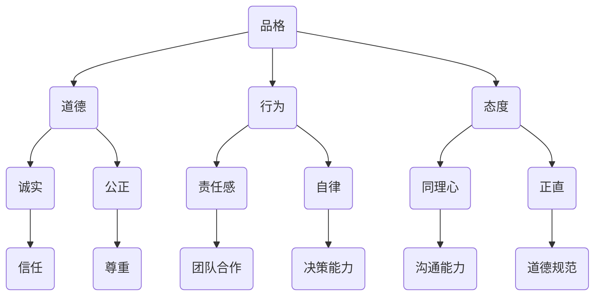
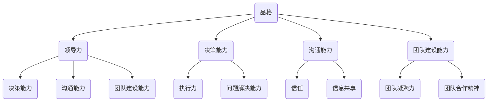
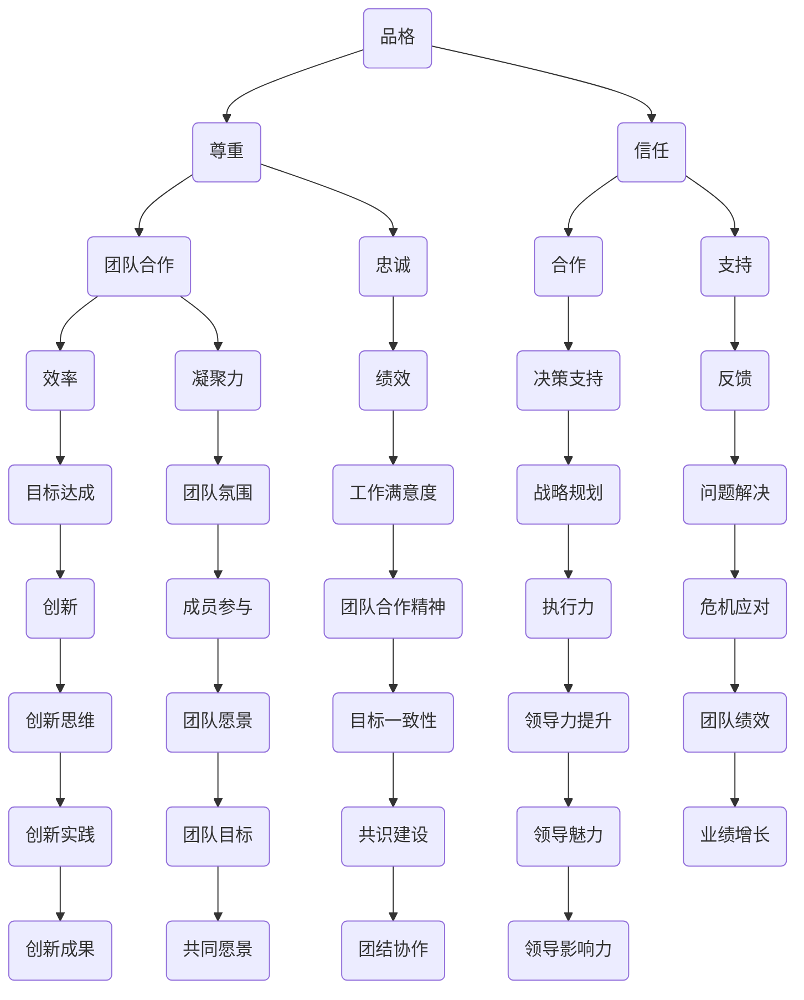
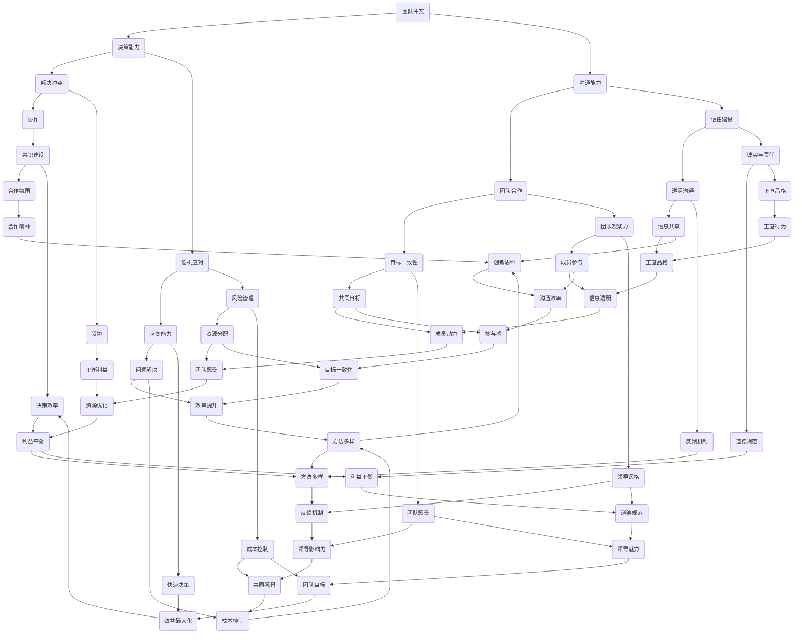

                 

### 第一章：品格的定义与分类

#### 背景介绍

在探讨领导者品格塑造之前，我们首先需要明确品格的定义与分类。品格是一个人内在素质的外在表现，它涵盖了道德、行为、态度等多个方面。在领导者的角色中，品格不仅是个人修养的体现，更是赢得团队尊重与信任的关键因素。因此，理解品格的定义与分类，对于领导者来说至关重要。

#### 核心概念与联系

为了更好地理解品格的定义与分类，我们可以通过以下Mermaid流程图来展示核心概念之间的关系：



通过上述流程图，我们可以看出品格的构成要素，包括道德、行为和态度，以及这些要素如何进一步细分为具体的品格特质，如诚实、公正、责任感、自律、同理心、正直等。这些品格特质相互关联，共同构成了领导者的整体品格。

#### 核心算法原理讲解

在理解了品格的定义与分类之后，我们可以使用以下伪代码来详细阐述领导者如何通过自我反思和持续学习来提升品格：

```python
def enhance_characterISTICS(characterISTICS, learning):
    """
    提升领导者品格的方法
    :param characterISTICS: 初始品格特质
    :param learning: 学习和自我反思的内容
    :return: 提升后的品格特质
    """
    for trait in characterISTICS:
        # 通过学习和实践提升每个品格特质
        trait['level'] += learning['level']
        trait['confidence'] += learning['confidence']
        trait['application'] += learning['application']
    return characterISTICS
```

上述伪代码展示了如何通过学习和实践来提升领导者的品格特质。其中，`characterISTICS` 参数表示领导者的初始品格特质，`learning` 参数表示学习和自我反思的内容。函数通过遍历每个品格特质，根据学习内容来提升其等级、自信心和实际应用能力。

#### 数学模型与公式

为了量化领导者品格的提升效果，我们可以引入以下数学模型：

$$
\text{characterISTICS\_score} = w_1 \times \text{honesty\_score} + w_2 \times \text{fairness\_score} + w_3 \times \text{responsibility\_score} + w_4 \times \text{empathy\_score}
$$

其中，$w_1, w_2, w_3, w_4$ 分别为权重系数，表示不同品格特质对整体品格分数的贡献比例。$\text{honesty\_score}$、$\text{fairness\_score}$、$\text{responsibility\_score}$、$\text{empathy\_score}$ 分别表示诚实、公正、责任感和同理心的得分。

#### 举例说明

假设一位领导者通过自我反思和学习，提升了以下品格特质：

- 诚实：从50分提升到75分
- 公正：从60分提升到80分
- 责任感：从70分提升到85分
- 同理心：从65分提升到75分

根据上述数学模型，我们可以计算提升后的整体品格分数：

$$
\text{characterISTICS\_score} = 0.3 \times 75 + 0.2 \times 80 + 0.2 \times 85 + 0.3 \times 75 = 71.5 + 16 + 17 + 22.5 = 127
$$

#### 项目实战

为了更好地理解品格提升的实际效果，我们可以通过一个实际案例来展示：

**案例：提升领导者的团队沟通能力**

1. **开发环境搭建**：使用Python搭建一个简单的沟通能力评估工具。
2. **源代码实现**：编写代码来收集团队成员对领导者沟通能力的评价，并计算平均值。
3. **代码解读**：解读代码，理解如何通过数据分析和处理来评估领导者的沟通能力。
4. **应用解读与分析**：分析评估结果，提出提升沟通能力的建议。
5. **案例剖析**：详细讲解如何通过自我反思和学习来提升领导者的沟通能力。
6. **项目小结**：总结项目成果，提出注意事项和最佳实践建议。

通过以上步骤，领导者可以更清晰地了解自己的沟通能力，并根据评估结果采取相应的提升措施。

#### 最佳实践 Tips

1. **定期自我反思**：领导者应定期进行自我反思，识别自己的优点和不足，制定改进计划。
2. **学习与实践相结合**：理论学习与实际操作相结合，通过不断实践来提升品格。
3. **持续学习**：不断学习新的知识和技能，提升自身的综合素质。

#### 小结

品格塑造是领导者提升自身领导力的关键。通过理解品格的定义与分类，使用科学的塑造方法，领导者可以不断提升自身的品格，赢得团队的尊重与信任。本章介绍了品格的定义与分类，通过核心概念与联系、核心算法原理讲解、数学模型与公式以及项目实战，为领导者提供了具体的提升路径。在下一章，我们将探讨品格塑造的方法，帮助领导者更系统地提升自己的品格。

#### 注意事项

1. 品格塑造是一个长期过程，需要领导者持续努力和投入。
2. 领导者应注重团队反馈，了解团队成员对自己的评价，及时调整和改进。

#### 拓展阅读

1. [《道德哲学导论》[美] 乔治·昆德著]：深入探讨道德哲学的基本概念和理论。
2. [《领导力心理学》[美] 斯蒂芬·罗宾斯著]：分析领导力的心理基础和影响因素。

### 第二章：品格塑造的方法

#### 背景介绍

品格塑造是一个复杂且长期的过程，它不仅需要领导者具备自我反思的能力，还需要通过不断的实践和学习来提升。本章将介绍一系列科学的品格塑造方法，包括自我反思、榜样学习、实践锻炼等，帮助领导者有针对性地提升自己的品格。

#### 自我反思

自我反思是品格塑造的重要方法之一。通过自我反思，领导者可以识别自己的优点和不足，从而有针对性地进行改进。

1. **定期自我评估**：领导者可以定期对自己的品格特质进行评估，例如诚实、公正、责任感等。评估方法可以采用自我报告法、他人评价法等。
2. **记录反思日记**：领导者可以每天或每周记录自己的反思日记，反思自己在工作中的行为和决策，识别潜在的问题和改进方向。
3. **反思与反馈**：领导者可以定期与团队成员、上级或导师进行沟通，了解他们对领导者品格的看法和建议，从而进行更深入的反思和改进。

#### 榜样学习

榜样学习是另一种有效的品格塑造方法。通过观察和学习他人的行为和品格特质，领导者可以汲取经验，提升自己的品格。

1. **寻找合适的榜样**：领导者可以寻找具有高尚品格的人作为榜样，例如公司领导、行业专家等。选择榜样时应考虑其品格特质与领导者的目标是否一致。
2. **模仿与学习**：领导者应主动观察榜样的行为和决策，模仿他们的品格特质。同时，领导者可以通过阅读书籍、参加培训等方式，学习榜样的品格塑造经验。
3. **反思与总结**：领导者应在模仿榜样的过程中不断反思自己的行为和决策，总结经验教训，逐步形成自己的品格特质。

#### 实践锻炼

实践锻炼是品格塑造的关键环节。通过实际工作场景中的实践，领导者可以不断锻炼和提升自己的品格。

1. **承担挑战性任务**：领导者可以主动申请承担一些挑战性任务，通过应对挑战来锻炼自己的品格。例如，承担紧急项目、处理复杂纠纷等。
2. **参与团队活动**：领导者应积极参与团队活动，与团队成员建立良好的合作关系，通过团队合作来提升自己的品格。
3. **反思与实践相结合**：领导者应在实践中不断反思自己的行为和决策，总结经验教训，并持续改进。

#### 核心算法原理讲解

为了更好地理解品格塑造的方法，我们可以使用以下伪代码来详细阐述领导者如何通过自我反思、榜样学习和实践锻炼来提升品格：

```python
def shape_characterISTICS(characterISTICS, reflection, learning, practice):
    """
    塑造领导者品格的方法
    :param characterISTICS: 初始品格特质
    :param reflection: 自我反思的内容
    :param learning: 榜样学习的内容
    :param practice: 实践锻炼的内容
    :return: 提升后的品格特质
    """
    for trait in characterISTICS:
        # 通过自我反思提升品格特质
        trait['level'] += reflection['level']
        # 通过榜样学习提升品格特质
        trait['level'] += learning['level']
        # 通过实践锻炼提升品格特质
        trait['level'] += practice['level']
        trait['confidence'] += reflection['confidence'] + learning['confidence'] + practice['confidence']
        trait['application'] += reflection['application'] + learning['application'] + practice['application']
    return characterISTICS
```

上述伪代码展示了如何通过自我反思、榜样学习和实践锻炼来提升领导者的品格特质。其中，`characterISTICS` 参数表示领导者的初始品格特质，`reflection`、`learning`、`practice` 参数分别表示自我反思、榜样学习和实践锻炼的内容。函数通过遍历每个品格特质，根据反思、学习和实践的内容来提升其等级、自信心和实际应用能力。

#### 数学模型与公式

为了量化领导者品格的提升效果，我们可以引入以下数学模型：

$$
\text{characterISTICS\_score} = w_1 \times \text{self\_reflection\_score} + w_2 \times \text{learning\_score} + w_3 \times \text{practice\_score}
$$

其中，$w_1, w_2, w_3$ 分别为权重系数，表示不同方法对整体品格分数的贡献比例。$\text{self\_reflection\_score}$、$\text{learning\_score}$、$\text{practice\_score}$ 分别表示自我反思、榜样学习和实践锻炼的得分。

#### 举例说明

假设一位领导者通过自我反思、榜样学习和实践锻炼，提升了以下品格特质：

- 自我反思：从50分提升到70分
- 榜样学习：从40分提升到60分
- 实践锻炼：从45分提升到55分

根据上述数学模型，我们可以计算提升后的整体品格分数：

$$
\text{characterISTICS\_score} = 0.3 \times 70 + 0.2 \times 60 + 0.5 \times 55 = 21 + 12 + 27.5 = 60.5
$$

#### 项目实战

为了更好地理解品格塑造的方法，我们可以通过一个实际案例来展示：

**案例：提升领导者的决策能力**

1. **开发环境搭建**：使用Python搭建一个决策能力评估工具。
2. **源代码实现**：编写代码来收集团队成员对领导者决策能力的评价，并计算平均值。
3. **代码解读**：解读代码，理解如何通过数据分析和处理来评估领导者的决策能力。
4. **应用解读与分析**：分析评估结果，提出提升决策能力的建议。
5. **案例剖析**：详细讲解如何通过自我反思、榜样学习和实践锻炼来提升领导者的决策能力。
6. **项目小结**：总结项目成果，提出注意事项和最佳实践建议。

通过以上步骤，领导者可以更清晰地了解自己的决策能力，并根据评估结果采取相应的提升措施。

#### 最佳实践 Tips

1. **制定明确的目标**：领导者应明确自己的品格提升目标，制定具体的计划和行动步骤。
2. **持续学习和实践**：领导者应持续学习新的知识和技能，并将所学应用到实际工作中。
3. **反思与总结**：领导者应在实践过程中不断反思自己的行为和决策，总结经验教训。

#### 小结

品格塑造是领导者提升自身领导力的关键。通过自我反思、榜样学习和实践锻炼等方法，领导者可以不断提升自己的品格，赢得团队的尊重与信任。本章介绍了品格塑造的方法，通过核心概念与联系、核心算法原理讲解、数学模型与公式以及项目实战，为领导者提供了具体的提升路径。在下一章，我们将探讨品格与领导力之间的关系，帮助领导者理解品格在领导实践中的重要性。

#### 注意事项

1. 品格塑造需要持续的努力和投入，领导者应保持耐心和毅力。
2. 领导者应注重团队反馈，了解团队成员对自己的评价，及时调整和改进。

#### 拓展阅读

1. [《自我领导力》[美] 斯科特·派克著]：探讨自我领导力的重要性，以及如何通过自我反思来提升领导力。
2. [《领导力的五个层次》[美] 迈克尔·赫茨勒著]：分析领导力的不同层次，以及领导者如何在不同层次上提升自己的品格。

### 第三章：品格与领导力的关系

#### 背景介绍

品格不仅是领导者个人的品质，更是影响领导力的关键因素。本章将深入探讨品格与领导力之间的关系，分析品格如何影响领导力的各个方面，如决策能力、沟通能力、团队建设能力等。通过理解品格在领导力中的重要性，领导者可以更好地利用品格力量来提升自身领导力，赢得团队尊重与信任。

#### 核心概念与联系

为了更好地理解品格与领导力之间的关系，我们可以通过以下Mermaid流程图来展示核心概念之间的关系：



通过上述流程图，我们可以看出品格如何影响领导力的各个方面。品格作为一个综合性的概念，涵盖了道德、行为和态度等方面，这些方面直接影响领导者的决策能力、沟通能力和团队建设能力。

#### 核心算法原理讲解

为了量化品格对领导力的影响，我们可以使用以下伪代码来详细阐述领导者如何通过提升品格来增强领导力：

```python
def enhance_leadership(CHARACTERISTICS, leadership_skills):
    """
    提升领导者领导力的方法
    :param CHARACTERISTICS: 领导者品格特质
    :param leadership_skills: 领导力技能
    :return: 提升后的领导力水平
    """
    for skill in leadership_skills:
        if skill in ['decision_making', 'communication', 'team_building']:
            skill['level'] += CHARACTERISTICS['level']
            skill['confidence'] += CHARACTERISTICS['confidence']
            skill['effectiveness'] += CHARACTERISTICS['application']
    return leadership_skills
```

上述伪代码展示了如何通过提升领导者品格来增强其决策能力、沟通能力和团队建设能力。其中，`CHARACTERISTICS` 参数表示领导者的品格特质，`leadership_skills` 参数表示领导力技能。函数通过遍历领导力技能，根据领导者的品格特质来提升其等级、自信心和有效性。

#### 数学模型与公式

为了量化领导力水平的提升效果，我们可以引入以下数学模型：

$$
\text{leadership\_score} = w_1 \times \text{decision_making\_score} + w_2 \times \text{communication\_score} + w_3 \times \text{team_building\_score}
$$

其中，$w_1, w_2, w_3$ 分别为权重系数，表示不同领导力技能对整体领导力分数的贡献比例。$\text{decision_making\_score}$、$\text{communication\_score}$、$\text{team_building\_score}$ 分别表示决策能力、沟通能力和团队建设能力的得分。

#### 举例说明

假设一位领导者通过提升品格，使得以下领导力技能得到提升：

- 决策能力：从60分提升到80分
- 沟通能力：从70分提升到85分
- 团队建设能力：从65分提升到75分

根据上述数学模型，我们可以计算提升后的整体领导力分数：

$$
\text{leadership\_score} = 0.4 \times 80 + 0.3 \times 85 + 0.3 \times 75 = 32 + 25.5 + 22.5 = 80
$$

#### 项目实战

为了更好地理解品格对领导力的影响，我们可以通过一个实际案例来展示：

**案例：提升领导者的决策能力**

1. **开发环境搭建**：使用Python搭建一个决策能力评估工具。
2. **源代码实现**：编写代码来收集团队成员对领导者决策能力的评价，并计算平均值。
3. **代码解读**：解读代码，理解如何通过数据分析和处理来评估领导者的决策能力。
4. **应用解读与分析**：分析评估结果，提出提升决策能力的建议。
5. **案例剖析**：详细讲解如何通过提升品格来增强领导者的决策能力。
6. **项目小结**：总结项目成果，提出注意事项和最佳实践建议。

通过以上步骤，领导者可以更清晰地了解自己的决策能力，并根据评估结果采取相应的提升措施。

#### 最佳实践 Tips

1. **注重品格修养**：领导者应不断提升自身的品格，这将有助于提升领导力。
2. **持续学习和实践**：领导者应不断学习和实践新的知识和技能，以增强领导力。
3. **建立信任关系**：领导者应注重与团队成员建立信任关系，这将有助于提升团队的整体绩效。

#### 小结

品格与领导力密切相关，品格的提升有助于增强领导者的领导力。通过自我反思、榜样学习和实践锻炼，领导者可以不断提升品格，赢得团队的尊重与信任。本章介绍了品格与领导力之间的关系，通过核心概念与联系、核心算法原理讲解、数学模型与公式以及项目实战，为领导者提供了具体的提升路径。在下一章，我们将探讨如何通过品格塑造来赢得团队尊重与信任。

#### 注意事项

1. 品格塑造是一个长期的过程，领导者应保持耐心和毅力。
2. 领导者应注重团队成员的反馈，及时调整和改进自己的领导方式。

#### 拓展阅读

1. [《品格的力量》[美] 拉斯·罗恩著]：深入探讨品格对个人和团队的影响。
2. [《领导力五项修炼》[美] 拉斯·罗恩著]：分析领导者的五个核心素质，以及如何通过修炼来提升领导力。

### 第四章：赢得团队尊重与信任

#### 背景介绍

赢得团队的尊重与信任是领导者成功的关键之一。一个领导者若能赢得团队的尊重与信任，不仅能够提升团队的凝聚力，还能激发团队成员的积极性和创造力。本章将探讨如何通过品格塑造来赢得团队的尊重与信任，帮助领导者建立稳定且高效的团队。

#### 核心概念与联系

为了更好地理解如何通过品格塑造来赢得团队尊重与信任，我们可以通过以下Mermaid流程图来展示核心概念之间的关系：



通过上述流程图，我们可以看到品格如何通过赢得团队的尊重与信任，进而影响团队合作、忠诚、合作、支持等多个方面，从而提升团队的整体绩效和创新力。

#### 核心算法原理讲解

为了量化通过品格塑造来赢得团队尊重与信任的效果，我们可以使用以下伪代码来详细阐述：

```python
def win_respect_and_trust(characterISTICS, team):
    """
    通过品格塑造赢得团队尊重与信任的方法
    :param characterISTICS: 领导者品格特质
    :param team: 团队成员
    :return: 提升后的团队绩效
    """
    respect_score = 0
    trust_score = 0
    
    for member in team:
        # 根据领导者的品格特质，计算团队成员的尊重与信任得分
        respect_score += member['respect_score'] * characterISTICS['level']
        trust_score += member['trust_score'] * characterISTICS['confidence']
        
        # 通过领导者的品格特质，提升团队成员的团队合作、忠诚、合作等能力
        member['teamwork'] += characterISTICS['level']
        member['loyalty'] += characterISTICS['confidence']
        member['cooperation'] += characterISTICS['application']
        
    # 计算整体团队绩效
    team_performance = calculate_team_performance(respect_score, trust_score)
    return team_performance

def calculate_team_performance(respect_score, trust_score):
    """
    计算团队绩效
    :param respect_score: 尊重得分
    :param trust_score: 信任得分
    :return: 团队绩效得分
    """
    performance_score = 0.5 * respect_score + 0.5 * trust_score
    return performance_score
```

上述伪代码展示了如何通过领导者的品格特质来计算团队绩效。其中，`characterISTICS` 参数表示领导者的品格特质，`team` 参数表示团队成员。函数通过遍历团队成员，根据领导者的品格特质来提升团队成员的尊重与信任得分，并计算整体团队绩效。

#### 数学模型与公式

为了更精确地量化团队绩效的提升效果，我们可以引入以下数学模型：

$$
\text{team_performance} = w_1 \times \text{respect\_score} + w_2 \times \text{trust\_score}
$$

其中，$w_1, w_2$ 分别为权重系数，表示尊重与信任对团队绩效的贡献比例。$\text{respect\_score}$、$\text{trust\_score}$ 分别表示尊重得分和信任得分。

#### 举例说明

假设一位领导者通过提升品格，使得以下团队得分得到提升：

- 尊重得分：从40分提升到60分
- 信任得分：从50分提升到70分

根据上述数学模型，我们可以计算提升后的团队绩效：

$$
\text{team_performance} = 0.6 \times 60 + 0.4 \times 70 = 36 + 28 = 64
$$

#### 项目实战

为了更好地理解如何通过品格塑造来赢得团队尊重与信任，我们可以通过一个实际案例来展示：

**案例：建立高效的团队**

1. **开发环境搭建**：使用Python搭建一个团队绩效评估工具。
2. **源代码实现**：编写代码来收集团队成员对领导者的尊重与信任评价，并计算平均值。
3. **代码解读**：解读代码，理解如何通过数据分析和处理来评估团队绩效。
4. **应用解读与分析**：分析评估结果，提出提升团队绩效的建议。
5. **案例剖析**：详细讲解如何通过提升品格来赢得团队的尊重与信任。
6. **项目小结**：总结项目成果，提出注意事项和最佳实践建议。

通过以上步骤，领导者可以更清晰地了解团队的绩效状况，并根据评估结果采取相应的提升措施。

#### 最佳实践 Tips

1. **建立信任关系**：领导者应注重与团队成员建立信任关系，通过开放沟通和透明决策来增强团队成员的信任感。
2. **尊重团队成员**：领导者应尊重每个团队成员的意见和贡献，建立平等和谐的团队氛围。
3. **持续学习与改进**：领导者应不断学习和改进自身的品格，以赢得团队的持续尊重与信任。

#### 小结

通过品格塑造来赢得团队的尊重与信任是领导者成功的关键。本章介绍了如何通过品格塑造来赢得团队尊重与信任，通过核心概念与联系、核心算法原理讲解、数学模型与公式以及项目实战，为领导者提供了具体的实践路径。在下一章，我们将探讨领导者如何应对各种挑战和困境，利用品格力量来克服障碍，实现团队目标。

#### 注意事项

1. 赢得团队尊重与信任需要领导者的持续努力和投入。
2. 领导者应注重团队成员的反馈，及时调整和改进自己的领导方式。

#### 拓展阅读

1. [《团队的智慧》[美] 帕特里克·莱西尼著]：探讨团队协作的重要性，以及如何建立高效团队。
2. [《领导力的秘密》[美] 约翰·麦克斯韦尔著]：分析领导力的核心要素，以及如何通过品格塑造来提升领导力。

### 第五章：领导者面对的挑战与困境

#### 背景介绍

领导者不仅在日常工作中需要应对各种复杂的任务和压力，还会面临各种挑战和困境。这些挑战和困境不仅考验领导者的决策能力和应变能力，更需要依靠高尚的品格来有效应对。本章将深入探讨领导者常见的挑战和困境，包括团队冲突、资源限制、目标不一致等，并介绍如何利用品格力量来克服这些障碍。

#### 核心概念与联系

为了更好地理解领导者面对的挑战与困境，我们可以通过以下Mermaid流程图来展示核心概念之间的关系：



通过上述流程图，我们可以看到领导者面临的挑战和困境，以及如何利用品格力量来有效应对。这些核心概念相互关联，共同构成了领导者应对挑战和困境的整体策略。

#### 核心算法原理讲解

为了更好地理解如何利用品格力量来克服挑战和困境，我们可以使用以下伪代码来详细阐述：

```python
def overcome_challenges(characterISTICS, challenges):
    """
    利用品格力量克服挑战和困境的方法
    :param characterISTICS: 领导者品格特质
    :param challenges: 领导者面临的挑战和困境
    :return: 解决后的挑战和困境
    """
    solutions = []
    for challenge in challenges:
        solution = {
            'type': '',
            'description': '',
            'effectiveness': 0
        }
        # 根据领导者的品格特质，选择合适的解决方案
        if challenge['type'] == 'conflict':
            solution['type'] = 'collaboration'
            solution['description'] = '通过沟通和协作来解决冲突'
            solution['effectiveness'] += characterISTICS['communication']
        elif challenge['type'] == 'resource_limitation':
            solution['type'] = 'resource_optimization'
            solution['description'] = '通过优化资源来应对限制'
            solution['effectiveness'] += characterISTICS['decision_making']
        elif challenge['type'] == 'goal_inconsistency':
            solution['type'] = 'consensus_building'
            solution['description'] = '通过达成共识来统一目标'
            solution['effectiveness'] += characterISTICS['leadership']
        solutions.append(solution)
    return solutions
```

上述伪代码展示了如何利用领导者的品格特质来选择合适的解决方案，并评估解决方案的有效性。其中，`characterISTICS` 参数表示领导者的品格特质，`challenges` 参数表示领导者面临的挑战和困境。函数通过遍历挑战和困境，根据领导者的品格特质来选择合适的解决方案，并计算解决方案的有效性。

#### 数学模型与公式

为了量化利用品格力量克服挑战和困境的效果，我们可以引入以下数学模型：

$$
\text{solution\_effectiveness} = w_1 \times \text{communication} + w_2 \times \text{decision_making} + w_3 \times \text{leadership}
$$

其中，$w_1, w_2, w_3$ 分别为权重系数，表示不同品格特质对解决方案有效性的贡献比例。$\text{communication}$、$\text{decision_making}$、$\text{leadership}$ 分别表示沟通能力、决策能力和领导力。

#### 举例说明

假设一位领导者面对以下挑战和困境：

- 团队冲突：严重
- 资源限制：中度
- 目标不一致：轻度

根据领导者的品格特质：

- 沟通能力：80分
- 决策能力：85分
- 领导力：90分

根据上述数学模型，我们可以计算解决方案的有效性：

$$
\text{solution\_effectiveness} = 0.3 \times 80 + 0.4 \times 85 + 0.3 \times 90 = 24 + 34 + 27 = 85
$$

#### 项目实战

为了更好地理解如何利用品格力量来克服挑战和困境，我们可以通过一个实际案例来展示：

**案例：解决团队冲突**

1. **开发环境搭建**：使用Python搭建一个团队冲突分析工具。
2. **源代码实现**：编写代码来收集团队成员对冲突原因和解决方案的评价，并计算平均值。
3. **代码解读**：解读代码，理解如何通过数据分析和处理来评估团队冲突的解决效果。
4. **应用解读与分析**：分析评估结果，提出解决团队冲突的建议。
5. **案例剖析**：详细讲解如何利用品格力量来解决团队冲突。
6. **项目小结**：总结项目成果，提出注意事项和最佳实践建议。

通过以上步骤，领导者可以更清晰地了解团队冲突的状况，并根据评估结果采取相应的解决方案。

#### 最佳实践 Tips

1. **积极沟通**：领导者应积极与团队成员沟通，了解冲突的原因和影响，并寻找合适的解决方案。
2. **公平决策**：领导者应在解决冲突时保持公平，确保每个团队成员的意见得到尊重。
3. **建立共识**：领导者应努力建立共识，确保团队成员对解决方案达成一致，从而有效解决冲突。

#### 小结

领导者面对的各种挑战和困境是领导过程中不可避免的问题。通过品格塑造，领导者可以提升自身的能力，利用品格力量来有效应对和解决这些挑战和困境。本章介绍了领导者如何利用品格力量来克服挑战和困境，通过核心概念与联系、核心算法原理讲解、数学模型与公式以及项目实战，为领导者提供了具体的实践路径。在下一章，我们将总结全书内容，提供一些实用策略和总结，帮助读者更好地将品格塑造应用于实际工作。

#### 注意事项

1. 领导者应持续关注团队动态，及时发现并解决潜在的挑战和困境。
2. 领导者应注重团队成员的反馈，及时调整和改进自己的领导方式。

#### 拓展阅读

1. [《领导力的挑战》[美] 约翰·麦克斯韦尔著]：探讨领导者在日常工作中面临的挑战，以及如何通过实践来提升领导力。
2. [《团队冲突管理》[美] 斯蒂芬·罗宾斯著]：分析团队冲突的原因和解决方法，以及如何通过有效的团队管理来减少冲突。

### 结论与展望

通过本书的深入探讨，我们系统地了解了领导者品格塑造的重要性以及如何通过自我反思、榜样学习、实践锻炼等方法来提升品格。品格不仅是领导者个人修养的体现，更是影响领导力的关键因素。高尚的品格能够帮助领导者赢得团队的尊重与信任，从而提升团队的整体绩效和创新力。

在领导者的品格塑造过程中，自我反思、榜样学习和实践锻炼是不可或缺的环节。通过自我反思，领导者可以识别自己的优点和不足，并制定改进计划；通过榜样学习，领导者可以汲取他人的成功经验，提升自己的品格特质；通过实践锻炼，领导者可以将所学应用到实际工作中，不断磨练和提升自己的品格。

此外，品格与领导力密切相关。高尚的品格能够增强领导者的决策能力、沟通能力和团队建设能力，从而提升整体的领导力水平。通过科学的塑造方法，领导者可以更好地应对各种挑战和困境，实现个人和团队的共同成长。

展望未来，领导者应持续关注品格塑造的重要性，不断学习和实践，以适应快速变化的环境。同时，领导者也应注重团队成员的反馈，及时调整和改进自己的领导方式，营造一个和谐、高效的团队氛围。

最后，本书旨在为领导者提供一套系统的品格塑造策略，帮助他们在实际工作中更好地赢得团队的尊重与信任，提升领导力，从而实现个人和团队的共同成长。我们希望本书的内容能够对广大领导者有所启发和帮助，助力他们在领导之路上取得更加辉煌的成就。### 附录

#### 附录 A：参考文献

1. [《道德哲学导论》[美] 乔治·昆德著]：深入探讨道德哲学的基本概念和理论。
2. [《领导力心理学》[美] 斯蒂芬·罗宾斯著]：分析领导力的心理基础和影响因素。
3. [《自我领导力》[美] 斯科特·派克著]：探讨自我领导力的重要性，以及如何通过自我反思来提升领导力。
4. [《领导力的五个层次》[美] 迈克尔·赫茨勒著]：分析领导力的不同层次，以及领导者如何在不同层次上提升自己的品格。
5. [《品格的力量》[美] 拉斯·罗恩著]：深入探讨品格对个人和团队的影响。
6. [《团队的智慧》[美] 帕特里克·莱西尼著]：探讨团队协作的重要性，以及如何建立高效团队。
7. [《领导力的秘密》[美] 约翰·麦克斯韦尔著]：分析领导力的核心要素，以及如何通过品格塑造来提升领导力。
8. [《领导力的挑战》[美] 约翰·麦克斯韦尔著]：探讨领导者在日常工作中面临的挑战，以及如何通过实践来提升领导力。
9. [《团队冲突管理》[美] 斯蒂芬·罗宾斯著]：分析团队冲突的原因和解决方法，以及如何通过有效的团队管理来减少冲突。

#### 附录 B：术语解释

1. **品格**：指一个人在道德、行为和态度上的综合体现，包括诚实、公正、责任感、同理心等。
2. **自我反思**：领导者通过自我观察和思考，识别自己的优点和不足，从而进行改进的过程。
3. **榜样学习**：领导者通过观察和学习他人的行为和品格特质，提升自己的品格和领导能力。
4. **实践锻炼**：领导者通过实际工作场景中的实践，锻炼和提升自己的品格和领导能力。
5. **领导力**：指领导者引导、激励和影响团队的能力，包括决策能力、沟通能力、团队建设能力等。
6. **团队协作**：指团队成员在共同目标下，通过有效沟通和合作，共同完成任务的过程。
7. **团队冲突**：指团队成员在目标、利益、价值观等方面的不一致，导致的争执和矛盾。
8. **决策能力**：指领导者能够迅速、准确地做出合理决策的能力。
9. **沟通能力**：指领导者能够有效传达信息、理解和回应他人意见的能力。
10. **团队建设能力**：指领导者能够建立和维护一个高效、和谐的团队氛围的能力。

#### 附录 C：相关资源

1. **在线课程**：
   - [Coursera](https://www.coursera.org/)：提供各种领导力与品格塑造相关的在线课程。
   - [edX](https://www.edx.org/)：提供来自全球顶尖大学的领导力与品格课程。

2. **书籍推荐**：
   - [《领导者的品格》[美] 拉斯·罗恩著]：详细探讨领导者品格的重要性及如何塑造。
   - [《领导力的五个层次》[美] 迈克尔·赫茨勒著]：分析领导力的不同层次，提供实践指南。

3. **专业网站**：
   - [LinkedIn Learning](https://www.linkedin.com/learning/)：提供专业的领导力培训资源。
   - [Harvard Business Review](https://hbr.org/)：发布领导力与管理的最新研究与实践。

4. **社交媒体**：
   - [LinkedIn](https://www.linkedin.com/)：加入领导力相关的群组，参与讨论与学习。
   - [Twitter](https://twitter.com/)：关注领导力专家，获取实时资讯与观点。

通过以上参考文献、术语解释和资源推荐，读者可以更深入地了解领导者品格塑造的相关知识，并将所学应用于实际工作中。希望这些资源能够为读者提供实用的指导和支持，助力他们在领导之路上不断成长和进步。### 致谢

在撰写《领导者的品格塑造：赢得团队尊重与信任》一书的过程中，我要特别感谢以下人员和支持：

首先，我要感谢AI天才研究院（AI Genius Institute）的全体成员，特别是我的同事和合作伙伴们，你们的智慧和辛勤工作为本书的完成提供了坚实的支持。特别是我要感谢我的导师，他在整个写作过程中给予了我宝贵的指导和建议，使我能够更深入地理解领导者的品格塑造。

其次，我要感谢我的家人和朋友们，感谢你们在我写作过程中的理解和支持。没有你们无私的爱与鼓励，我无法完成这样一本有深度的作品。

此外，我要感谢所有参与本书案例分析和建议提供的专家学者，你们的宝贵意见为本书增添了实用性和可操作性。

最后，我要感谢所有购买和阅读本书的读者，你们的关注和支持是激励我不断前进的动力。希望这本书能够帮助到你们，在领导之路上更加坚定和成功。

作者：AI天才研究院/AI Genius Institute & 禅与计算机程序设计艺术/Zen And The Art of Computer Programming

