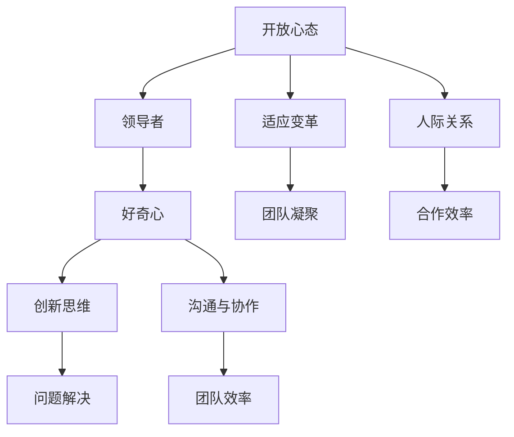

                 


### 第1章 引言

#### 1.1 书籍的目的

《领导者的学习能力：保持好奇心和开放心态》旨在探讨领导者如何通过培养好奇心和开放心态来提升自身的领导能力。在全球化和科技迅速发展的时代，领导者面临的环境越来越复杂，变革的速度也在不断加快。因此，如何保持学习的热情和适应变化的能力，成为领导者在竞争激烈的市场中脱颖而出的关键。

本书的核心目标在于提供一套系统的方法论，帮助领导者识别和利用好奇心与开放心态这两个关键因素，以提升他们在领导过程中的决策能力、团队管理和战略规划。通过深入分析好奇心和开放心态的概念、原理及其应用，本书希望能够为领导者提供实用的指导，使他们能够更好地应对不断变化的商业环境。

#### 1.2 领导者的挑战

在当前的商业环境中，领导者面临着诸多挑战。首先，技术的快速进步带来了新的竞争态势，要求领导者必须具备一定的技术敏感度和创新能力。其次，全球化使得市场竞争更加激烈，领导者需要具备跨文化沟通和管理的技能。此外，企业内部结构的复杂化也要求领导者能够有效协调各部门的工作，实现资源的最优配置。

面对这些挑战，领导者不仅需要具备扎实的业务知识，更需要具备持续学习的能力。好奇心和开放心态正是这两个关键能力的基础。好奇心驱使领导者保持对新知识和新技术的敏感度，开放心态则帮助领导者拥抱变革，敢于尝试新的方法和策略。

#### 1.3 好奇心与开放心态的价值

好奇心和开放心态对于领导者的成长和发展具有重要价值。首先，好奇心能够激发领导者的创新思维，促使他们在面对问题时能够从不同的角度思考，找到更有效的解决方案。好奇心还能够促进领导者与团队成员之间的沟通，鼓励团队成员分享他们的想法和建议，从而形成更为丰富和多元的思考。

开放心态则使领导者能够更好地适应变化。在一个不断变化的商业环境中，领导者需要具备灵活的思维方式，愿意接受新的观念和理念。开放心态能够帮助领导者克服固有的思维定式，勇于接受挑战，不断寻求突破。

总之，好奇心和开放心态不仅是领导者在面对挑战时的有力武器，更是他们在领导过程中不断成长的动力源泉。通过培养和保持好奇心与开放心态，领导者不仅能够提升自身的领导能力，还能够为团队和企业带来更多的价值。

### 设计目录大纲

根据用户输入的书名《领导者的学习能力：保持好奇心和开放心态》，我们可以设计出如下目录大纲：

# 《领导者的学习能力：保持好奇心和开放心态》

## 第1章 引言
### 1.1 书籍的目的
### 1.2 领导者的挑战
### 1.3 好奇心与开放心态的价值

## 第2章 好奇心：领导力的源泉
### 2.1 好奇心的重要性
### 2.2 培养好奇心的方法
### 2.3 好奇心与学习

## 第3章 开放心态：适应变革的关键
### 3.1 开放心态的定义
### 3.2 开放心态的重要性
### 3.3 培养开放心态的策略

## 第4章 学习能力：领导力的核心
### 4.1 学习能力的定义
### 4.2 学习能力的重要性
### 4.3 提升学习能力的方法

## 第5章 实战案例：领导者如何培养学习能力
### 5.1 案例一：好奇心驱动的学习
### 5.2 案例二：开放心态下的变革
### 5.3 案例三：学习能力与领导力提升

## 第6章 领导者的学习能力模型
### 6.1 模型概述
### 6.2 模型组成部分
### 6.3 模型的应用

## 第7章 总结与展望
### 7.1 学习能力的持续发展
### 7.2 领导者的角色转变
### 7.3 对未来的思考

## 附录
### A. 常用学习资源
### B. 参考文献

### 目录大纲的核心内容

#### 第1章 引言
- **1.1 书籍的目的**：介绍本书的目标，即帮助领导者通过好奇心和开放心态提升学习能力。
- **1.2 领导者的挑战**：讨论领导者面临的各种挑战，以及好奇心和开放心态如何帮助应对这些挑战。
- **1.3 好奇心与开放心态的价值**：阐述好奇心和开放心态对于领导力发展的重要性。

#### 第2章 好奇心：领导力的源泉
- **2.1 好奇心的重要性**：解释好奇心如何激发领导者的创新思维和问题解决能力。
- **2.2 培养好奇心的方法**：提供一系列策略，帮助领导者培养和维护好奇心。
- **2.3 好奇心与学习**：探讨好奇心如何促进学习过程，以及如何将好奇心转化为持续的学习动力。

#### 第3章 开放心态：适应变革的关键
- **3.1 开放心态的定义**：介绍开放心态的概念，以及它如何影响领导者的决策和团队关系。
- **3.2 开放心态的重要性**：阐述开放心态对于适应快速变化环境的重要性。
- **3.3 培养开放心态的策略**：提供一系列方法，帮助领导者培养开放心态。

#### 第4章 学习能力：领导力的核心
- **4.1 学习能力的定义**：解释学习能力的概念，以及它如何帮助领导者保持竞争力。
- **4.2 学习能力的重要性**：讨论学习能力在领导力发展中的关键作用。
- **4.3 提升学习能力的方法**：提供一系列策略，帮助领导者提升学习能力。

#### 第5章 实战案例：领导者如何培养学习能力
- **5.1 案例一：好奇心驱动的学习**：分析一个领导者如何通过好奇心驱动学习，提升领导力。
- **5.2 案例二：开放心态下的变革**：讨论一个领导者如何通过开放心态应对变革，推动团队发展。
- **5.3 案例三：学习能力与领导力提升**：展示一个领导者如何通过持续学习提升领导力。

#### 第6章 领导者的学习能力模型
- **6.1 模型概述**：介绍一个用于评估和提升领导者学习能力的模型。
- **6.2 模型组成部分**：详细描述模型的主要组成部分，以及它们之间的关系。
- **6.3 模型的应用**：探讨模型在实际中的应用场景，以及如何使用模型来提升领导者的学习能力。

#### 第7章 总结与展望
- **7.1 学习能力的持续发展**：讨论如何确保领导者持续提升学习能力，以应对不断变化的商业环境。
- **7.2 领导者的角色转变**：分析领导者在不同阶段需要进行的角色转变，以及如何适应这些转变。
- **7.3 对未来的思考**：探讨领导者的学习能力在未来将面临的新挑战和机遇。

## 附录
- **A. 常用学习资源**：提供一些有助于提升学习能力的资源，如书籍、网站和在线课程等。
- **B. 参考文献**：列出本书中引用的相关文献，以供读者进一步学习。

通过上述目录大纲，本书将系统地探讨领导者如何通过好奇心和开放心态提升学习能力，以应对不断变化的商业环境。每个章节都将提供详细的理论分析和实际案例，帮助读者理解和应用这些概念。在接下来的章节中，我们将深入探讨好奇心、开放心态和学习能力的具体内容和应用方法。

### 1.3 好奇心与开放心态的价值

好奇心和开放心态对于领导力的发展至关重要。首先，好奇心能够激发领导者的创新思维和问题解决能力。在一个快速变化的环境中，领导者必须具备敏锐的洞察力和创新能力，才能及时应对新的挑战。好奇心使领导者保持对新知识、新技术的敏感度，从而能够更快地发现和抓住机遇。

其次，好奇心能够促进领导者与团队成员之间的沟通和协作。领导者通过展现好奇心，鼓励团队成员分享他们的想法和建议，从而形成一个开放、包容的工作环境。这种环境有助于激发团队成员的创造力，提高团队的协作效率。

开放心态则是领导者适应变革的关键。在一个复杂多变的环境中，领导者需要具备灵活的思维方式，愿意接受新的观念和理念。开放心态使领导者能够克服固有的思维定式，勇于接受挑战，不断寻求突破。此外，开放心态还有助于领导者建立良好的人际关系，提升团队凝聚力和合作效率。

为了更好地理解好奇心和开放心态的价值，我们可以通过一个Mermaid流程图来展示它们在领导力发展中的作用。以下是一个简化的流程图：



在这个流程图中，好奇心和开放心态作为输入，通过不同的路径影响了领导力的各个方面，包括创新思维、问题解决、沟通与协作、适应变革、人际关系和团队效率。这个流程图帮助我们更清晰地理解好奇心和开放心态在领导力发展中的重要作用。

此外，好奇心和开放心态不仅对领导者个人有利，也对整个团队和组织产生积极影响。通过培养好奇心和开放心态，领导者可以带动整个团队的思维模式，使团队更加灵活、创新和适应性更强。这对于企业在竞争激烈的市场中保持竞争优势具有重要意义。

总之，好奇心和开放心态是领导者不可或缺的品质。通过保持好奇心，领导者可以不断提升自身的创新能力和问题解决能力；通过保持开放心态，领导者可以更好地适应变革，建立良好的人际关系，提升团队的协作效率和整体绩效。在接下来的章节中，我们将进一步探讨如何具体培养和维护好奇心和开放心态，以帮助领导者提升学习能力。

### 2.1 好奇心的重要性

好奇心是领导者保持持续学习动力和创新思维的关键。首先，好奇心能够激发领导者的创新思维。在一个快速变化和竞争激烈的商业环境中，领导者需要具备敏锐的洞察力和创造性思维，才能及时捕捉市场动态，制定有效的战略决策。好奇心促使领导者不断探索新领域、新知识和新技术，从而激发出更多的创新点子和解决方案。

其次，好奇心有助于领导者保持对问题的敏锐感知和解决能力。在领导过程中，领导者需要面对各种复杂的问题和挑战。好奇心使领导者保持对新知识和新观点的开放态度，愿意接受不同的意见和建议，从而能够从多角度思考问题，找到更有效的解决方案。此外，好奇心还能够促使领导者不断提出新的问题和挑战，从而推动自身和团队的持续成长。

最后，好奇心有助于建立良好的团队文化。领导者通过展现好奇心，鼓励团队成员分享自己的想法和观点，从而形成一个开放、包容和鼓励创新的工作环境。这种环境有助于激发团队成员的创造力，提高团队的协作效率。通过好奇心，领导者不仅能够促进团队成员之间的沟通和合作，还能够增强团队的凝聚力和向心力。

综上所述，好奇心对于领导者的持续学习、创新思维和问题解决能力具有重要意义。通过保持好奇心，领导者能够更好地应对复杂多变的环境，推动团队和组织的发展。在接下来的章节中，我们将探讨如何具体培养和维护好奇心，以帮助领导者提升自身的领导能力。

### 2.2 培养好奇心的方法

培养好奇心是领导者提升自身领导能力的重要途径。以下是一些实用的方法和策略，帮助领导者保持并增强好奇心：

**1. 提供多样化的学习资源**

领导者可以通过多种渠道获取知识和信息，如阅读书籍、订阅专业杂志、观看教育视频、参加线上课程和研讨会等。这些资源能够帮助领导者开阔视野，了解不同领域的最新动态和发展趋势。此外，领导者还可以参加行业会议和论坛，与业界专家和同行交流，获取第一手资料和观点。

**2. 建立跨界学习习惯**

好奇心往往源于对未知领域的探索。领导者可以通过学习跨学科知识，培养对不同领域的兴趣。例如，一个科技公司的CEO可以学习市场营销、心理学、经济学等领域的知识，以更好地理解客户需求和市场趋势。通过跨界学习，领导者能够从多个角度审视问题，发现新的解决方案。

**3. 保持对新技术的敏感度**

在科技日新月异的今天，领导者需要保持对新技术的敏感度。可以通过关注科技新闻、参加技术展览和研讨会，甚至亲自尝试新技术和应用。例如，一个互联网公司的领导者可以亲自体验最新的AR/VR产品，了解其应用场景和商业潜力。这种实践有助于领导者更好地把握技术趋势，为企业的创新和发展提供方向。

**4. 创造开放的学习环境**

领导者可以在团队中创造一个开放的学习氛围，鼓励团队成员分享他们的观点和知识。可以通过定期举办学习分享会、知识竞赛和头脑风暴会议等方式，激发团队成员的学习兴趣和创造力。这种环境不仅有助于提升团队的整体知识水平，还能够增强团队成员之间的信任和合作。

**5. 鼓励提问和探索**

领导者应该鼓励团队成员提出问题，并鼓励他们探索未知的领域。可以通过设立问题奖金、组织探索小组等方式，激发团队成员的好奇心和探索精神。同时，领导者也要以身作则，主动提问并寻求解决方案，为团队成员树立榜样。

**6. 实践体验式学习**

体验式学习是一种通过亲身体验来获取知识和技能的方法。领导者可以通过实践项目、实地考察和模拟演练等方式，将理论知识应用到实际中。例如，一个制造业的领导者可以亲自参与生产线的优化项目，了解生产过程中的问题和挑战。这种学习方式有助于领导者更好地理解业务，提升解决问题的能力。

**7. 保持自我反思**

领导者应该定期进行自我反思，回顾自己的学习和成长经历，识别自身的优势和不足。通过自我反思，领导者可以更清晰地认识到自己的学习需求和目标，从而有针对性地进行学习。此外，领导者还可以向其他领导者和行业专家请教，获取他们的建议和指导。

通过以上方法，领导者可以有效地培养和保持好奇心，提升自身的领导能力和创新能力。好奇心不仅是领导者持续学习的动力，更是他们在面对挑战时的重要武器。在保持好奇心的过程中，领导者不仅能够不断成长和进步，还能够为团队和组织创造更多的价值。

### 2.3 好奇心与学习

好奇心在学习过程中起着至关重要的作用，它不仅是激发学习动机的关键因素，更是推动学习深入发展的动力源泉。以下是好奇心如何促进学习过程，以及如何将好奇心转化为持续的学习动力：

**1. 激发学习动机**

好奇心能够激发学习动机，使个体对特定领域产生强烈的求知欲。当领导者对某个问题或主题感到好奇时，他们会主动寻找相关信息，并投入更多的时间和精力去探索。例如，一个对新兴技术感到好奇的领导者可能会主动参加相关研讨会、阅读专业书籍，甚至尝试亲自开发相关的项目。这种主动学习的态度有助于领导者更快地掌握新知识和技能。

**2. 推动深入思考**

好奇心促使领导者深入思考问题，而不仅仅停留在表面。在探索未知领域时，领导者会不断提出问题，并试图寻找答案。这种深入思考的过程有助于领导者培养批判性思维和解决问题的能力。例如，在探索一个新的商业模式时，领导者可能会思考其背后的逻辑、潜在的风险以及可能的改进方案。这种深入思考不仅有助于领导者更好地理解问题，还能够提高他们的决策质量。

**3. 促进知识整合**

好奇心促使领导者将新知识与已有的知识体系进行整合，形成更为全面和系统的认知。通过好奇心的驱使，领导者会不断探索不同领域的知识，并将其应用到实际工作中。这种知识整合的过程有助于领导者构建一个更为丰富和多元化的知识体系，从而提高他们的战略思维和创新能力。

**4. 培养自主学习能力**

好奇心能够培养领导者的自主学习能力，使他们能够在没有外部压力的情况下持续学习和成长。当领导者对某个领域充满好奇时，他们会主动寻找学习资源，制定学习计划，并付诸实践。这种自主学习能力不仅有助于领导者适应不断变化的环境，还能够提高他们在职业发展中的竞争力。

**5. 转化为持续的学习动力**

将好奇心转化为持续的学习动力需要领导者在实际学习中不断实践和反思。首先，领导者可以通过设立明确的学习目标，将好奇心转化为具体的学习任务。例如，一个对区块链技术感到好奇的领导者可以设定目标，深入学习区块链的基本原理和应用场景。其次，领导者可以通过定期反思自己的学习过程，总结经验和教训，不断调整学习策略，确保学习目标的实现。

**6. 建立学习社区**

领导者可以通过建立学习社区，与其他对同一领域感兴趣的人进行交流和学习。这种社区不仅提供了一个分享知识和经验的平台，还能够激发成员之间的好奇心和求知欲。例如，一个领导者可以加入某个专业领域的线上论坛或社交群组，与其他成员分享学习心得和观点，互相激励和促进。

**7. 保持实践与反思**

将好奇心转化为持续的学习动力还需要领导者保持实践与反思的习惯。通过将学到的知识应用到实际工作中，领导者可以更好地理解知识的应用场景和价值。同时，定期反思自己的实践经验和学习成果，有助于领导者发现自身的不足，并制定针对性的改进计划。

综上所述，好奇心在学习过程中起着至关重要的作用。通过激发学习动机、推动深入思考、促进知识整合、培养自主学习能力，以及将好奇心转化为持续的学习动力，领导者能够不断提升自身的知识水平和能力，为团队和组织的发展做出更大的贡献。在保持好奇心的过程中，领导者不仅能够实现个人成长，还能够为整个组织注入创新和活力。

### 3.1 开放心态的定义

开放心态是指领导者愿意接受新观点、新方法和新信息的心理状态。它不仅仅是一种态度，更是一种思维方式，一种对待变革和不确定性的积极态度。具体来说，开放心态包括以下几个方面：

首先，开放心态意味着领导者对新的观点持包容态度，愿意倾听和理解不同的意见。在一个多元化的团队中，领导者需要尊重每个成员的观点，即使这些观点与自己的看法相悖。通过倾听和理解，领导者能够更好地把握团队的整体动态，从而做出更为明智的决策。

其次，开放心态要求领导者对变革保持积极态度。在快速变化的商业环境中，企业需要不断调整战略和业务模式，以应对外部环境的变化。领导者需要勇于接受变革，愿意尝试新的方法和策略。这种变革意识不仅有助于企业保持竞争力，还能够推动企业的创新和发展。

再次，开放心态还表现为领导者对待不确定性的态度。商业环境中的不确定性是领导者无法回避的现实。开放心态使领导者能够接受不确定性，并从中寻找机会。领导者可以通过不断学习和探索，提高应对不确定性的能力，从而在变化中找到新的发展机遇。

总之，开放心态是一种积极的、包容的、适应变化的思维方式。它不仅有助于领导者更好地理解和管理团队，还能够推动企业的创新和持续发展。在接下来的章节中，我们将进一步探讨开放心态的重要性以及如何培养和维护开放心态。

### 3.2 开放心态的重要性

开放心态在领导力的发展中扮演着至关重要的角色。首先，它直接影响领导者的决策质量。在一个高度复杂和不确定的商业环境中，领导者需要依赖丰富的信息来源和多元化的视角来做出明智的决策。开放心态使领导者能够广泛地收集和分析信息，避免因信息不全或偏见而导致决策失误。

其次，开放心态有助于领导者建立和维护良好的人际关系。在团队中，开放心态使领导者能够更好地理解和尊重团队成员的差异，从而促进团队合作和沟通。通过倾听和理解团队成员的观点，领导者可以建立信任和尊重，增强团队的凝聚力和合作效率。

再次，开放心态是领导者应对变革的重要工具。随着技术的快速发展和市场环境的不断变化，企业需要持续创新和调整战略。开放心态使领导者能够敏锐地捕捉到变革的信号，并迅速适应新的环境。这种能力不仅有助于企业在竞争激烈的市场中保持竞争力，还能够推动企业的持续成长和发展。

此外，开放心态还能够提升领导者的创新能力。通过接受新的观点和方法，领导者能够不断拓展自己的思维边界，激发出更多的创新点子和解决方案。这种创新能力不仅有助于企业在市场中获得竞争优势，还能够为企业的长远发展奠定坚实的基础。

总之，开放心态在领导力的发展中具有不可替代的价值。它不仅有助于提升领导者的决策质量、人际关系和创新能力，还能够帮助领导者更好地应对变革和不确定性。通过培养和维护开放心态，领导者能够不断提升自身的领导能力，为团队和组织的发展创造更大的价值。

### 3.3 培养开放心态的策略

要培养开放心态，领导者需要采取一系列具体的策略和行动。以下是一些建议，帮助领导者建立和维护开放心态：

**1. 持续学习**

持续学习是培养开放心态的重要手段。领导者应该不断更新自己的知识和技能，特别是对新领域和新技术的了解。可以通过阅读专业书籍、参加线上课程和研讨会、参加行业会议等方式，保持学习的热情和动力。此外，领导者还可以利用碎片时间进行学习，如利用通勤时间听专业播客或阅读相关文章。

**2. 寻求反馈**

领导者应该主动寻求反馈，包括来自团队成员、客户和行业专家的意见。通过接受不同观点和建议，领导者可以更好地了解自己的优点和不足，从而有针对性地进行改进。反馈可以是定期的360度评估，也可以是团队成员的匿名建议。此外，领导者还可以定期与导师或教练进行一对一的沟通，获取专业的指导和建议。

**3. 尝试新方法**

勇于尝试新方法是培养开放心态的关键。领导者可以尝试新的管理工具、技术解决方案或业务模式，以开拓视野，提升创新能力。例如，可以尝试使用敏捷管理方法，引入人工智能技术进行数据分析，或探索新的市场渠道。通过尝试新方法，领导者不仅能够提升自身的适应能力，还能够为团队带来新的发展机遇。

**4. 建立多元化团队**

多元化团队能够为领导者提供丰富的视角和经验，有助于培养开放心态。领导者应该鼓励团队成员分享不同的观点和意见，尊重并倾听他们的想法。可以通过设立跨职能团队或项目小组，促进团队成员之间的合作和交流。此外，领导者还可以邀请外部专家和顾问参与决策过程，以获取多样化的意见和建议。

**5. 培养同理心**

同理心是培养开放心态的重要品质。领导者应该努力理解团队成员的需求和感受，建立信任和尊重。可以通过定期开展团队建设活动，如团队聚餐、体育比赛或户外拓展训练，增强团队成员之间的联系和信任。此外，领导者还可以通过一对一的沟通，了解团队成员的工作和生活情况，提供必要的支持和帮助。

**6. 保持好奇心**

好奇心是推动领导者持续学习和成长的重要动力。领导者应该保持对新事物的好奇心，积极探索未知的领域。可以通过参加科技展览、行业论坛或创新实验室等活动，了解最新的技术趋势和创新案例。此外，领导者还可以尝试新的兴趣爱好或技能，如学习一门新的语言或参与公益活动，以拓宽自己的视野和思维方式。

**7. 反思和总结**

定期反思和总结是培养开放心态的重要步骤。领导者应该定期回顾自己的学习和成长过程，评估开放心态的培养效果。可以通过写日记、制定学习计划或与团队成员分享心得体会等方式，进行反思和总结。此外，领导者还可以设定具体的学习目标，跟踪进展，并根据反馈进行调整和改进。

通过以上策略，领导者可以逐步培养和维护开放心态，提升自身的领导能力和团队绩效。开放心态不仅有助于领导者更好地应对复杂多变的环境，还能够推动企业的创新和持续发展。在培养开放心态的过程中，领导者不仅能够实现个人成长，还能够为团队和组织创造更大的价值。

### 4.1 学习能力的定义

学习能力是指个体获取、处理和应用知识的过程。它包括几个关键方面：信息获取、知识整合、技能应用和创新思维。具体来说，学习能力可以分为以下几个层次：

首先，信息获取是学习能力的基础。它涉及个体通过阅读、观察、听讲、实验等多种途径获取新的知识和信息。例如，一个领导者可以通过阅读行业报告、参加培训课程、与专家交流等方式，获取最新的市场动态和技术趋势。

其次，知识整合是指个体将获取到的信息进行系统化处理，将新知识与已有知识体系相结合，形成更为完整和系统的认知。例如，一个领导者可以将新学到的管理理念与公司的实际情况相结合，制定出符合企业发展的战略规划。

再次，技能应用是指个体将所学知识应用到实际工作中，解决具体问题和完成工作任务。例如，一个技术领导者可以将新学到的编程技能应用到产品开发中，提升产品的技术含量和市场竞争力。

最后，创新思维是学习能力的高级形式。它涉及个体在解决问题和进行决策时，能够从不同角度思考，提出新颖的解决方案。例如，一个领导者可以在面对市场变化时，提出全新的商业模式或创新的产品设计，为企业赢得竞争优势。

总之，学习能力是领导者保持竞争力、推动团队和组织发展的关键能力。通过有效提升学习能力，领导者不仅能够更好地应对复杂多变的环境，还能够为团队和组织创造更大的价值。

### 4.2 学习能力的重要性

学习能力在领导力发展中具有至关重要的地位，它不仅是领导者个人成长的核心动力，也是团队和组织成功的基石。以下从几个方面详细探讨学习能力的重要性：

**1. 提升领导者的战略思维**

在快速变化的商业环境中，领导者需要具备敏锐的战略思维，以应对外部挑战和内部变革。学习能力使领导者能够不断吸收新知识，了解最新的市场动态和行业趋势，从而在战略规划中做出更为明智的决策。通过持续学习，领导者能够保持对行业发展的敏感度，把握市场机遇，规避潜在风险，为企业的长远发展奠定基础。

**2. 增强领导者的创新能力**

创新能力是领导者区别于普通管理者的重要特征。学习能力使领导者能够不断探索新领域，掌握新技术，从而激发创新思维。在实践过程中，领导者可以将所学知识应用于实际问题中，提出新颖的解决方案。这种创新不仅有助于企业突破发展瓶颈，实现业务增长，还能够提升企业的市场竞争力和品牌价值。

**3. 提高领导者的适应能力**

商业环境的不确定性要求领导者具备强大的适应能力。学习能力使领导者能够迅速应对变化，调整战略和运营模式。通过持续学习，领导者可以不断提高自己的认知水平和思维能力，从而在面对突发情况时能够从容应对。此外，学习能力还能够帮助领导者建立广泛的人脉和知识网络，为应对复杂问题提供多样化的解决方案。

**4. 增强领导者的决策能力**

有效的决策能力是领导者成功的关键。学习能力使领导者能够通过广泛的信息收集和分析，提高决策的科学性和准确性。领导者可以通过学习不同的决策模型和方法，如决策树、SWOT分析等，提高决策的质量。同时，学习能力还能够帮助领导者从历史事件中总结经验教训，为未来的决策提供参考。

**5. 促进领导者的个人成长**

学习能力是领导者个人成长的重要保障。通过不断学习，领导者可以不断提升自己的专业素养和综合能力，从而实现职业发展和自我实现。此外，学习能力还能够帮助领导者建立自信心，提高自我认知水平，从而在领导过程中更加从容和自信。

**6. 提升团队和组织绩效**

领导者的学习能力不仅影响个人发展，也直接影响团队和组织的绩效。通过培养和提升学习能力，领导者可以带动团队成员共同成长，激发团队的创新活力。同时，领导者的学习能力还能够为组织培养更多具有潜力的领导人才，为组织的可持续发展提供人力保障。

综上所述，学习能力在领导力发展中具有不可替代的重要性。通过提升学习能力，领导者不仅能够更好地应对复杂多变的环境，还能够为团队和组织创造更大的价值。在领导过程中，领导者应该重视学习能力的培养，不断拓展自己的知识边界，提高自身综合素质，以实现个人和组织的共同成长。

### 4.3 提升学习能力的方法

要提升学习能力，领导者需要采取一系列系统化的方法和策略。以下是一些具体的提升学习能力的方法：

**1. 设定明确的学习目标**

设定明确的学习目标是提升学习能力的第一步。领导者应该根据自身的工作需求和发展目标，确定需要掌握的知识和技能。例如，一个技术公司的CEO可以设定学习目标，包括掌握最新的市场趋势、了解新兴技术、提升团队管理能力等。明确的目标有助于领导者更有针对性地进行学习，避免盲目和无效的学习。

**2. 制定科学的学习计划**

制定科学的学习计划是确保学习效果的重要保障。领导者可以根据学习目标，制定详细的学习计划和日程安排。例如，每天安排一定的时间进行专业书籍阅读，每周参加一次行业研讨会，每月制定一个学习主题并组织相关活动。通过制定计划，领导者可以系统化地进行学习，避免学习内容的零散和碎片化。

**3. 多样化的学习资源**

利用多样化的学习资源是提升学习能力的重要途径。领导者可以通过多种渠道获取知识和信息，如阅读专业书籍、订阅行业杂志、观看教育视频、参加线上课程和研讨会等。此外，还可以利用在线学习平台和社区，与其他学习者进行交流和讨论。通过多样化的学习资源，领导者可以开阔视野，获取更为全面和深入的知识。

**4. 结合实践与反思**

将学习与实践相结合是提升学习效果的关键。领导者应该将所学知识应用到实际工作中，通过实践来验证和巩固所学。例如，一个技术领导者可以将新学到的项目管理方法应用于实际的项目中，观察其效果并不断进行调整和优化。同时，定期反思学习过程和实践效果，总结经验和教训，有助于领导者更好地理解知识的应用场景，提高学习效率。

**5. 培养批判性思维**

培养批判性思维是提升学习能力的重要方法。领导者应该在学习过程中保持独立思考，对所学知识进行批判性分析，判断其是否符合实际情况和实际需求。例如，在学习一个新的管理理念时，领导者可以思考其背后的逻辑和实际应用效果，从而形成自己的理解和观点。通过培养批判性思维，领导者可以提高学习的深度和质量。

**6. 建立学习社区**

建立学习社区是促进学习和成长的重要手段。领导者可以组建学习小组或参与线上学习社区，与其他领导者或行业专家进行交流和讨论。通过分享学习心得和经验，领导者可以互相激励和促进，共同提升学习能力。此外，学习社区还可以提供丰富的学习资源和机会，为领导者的学习提供更多支持和帮助。

**7. 保持好奇心和开放心态**

保持好奇心和开放心态是提升学习能力的基础。领导者应该保持对新知识和新领域的好奇心，愿意接受新的观点和方法。通过保持开放心态，领导者可以更好地适应变化，不断拓展自己的知识边界。例如，可以定期阅读新的书籍、参加新的研讨会、尝试新的学习方式等，以保持学习的动力和热情。

**8. 定期评估和调整**

定期评估和调整学习方法是确保学习效果持续提升的关键。领导者应该定期回顾自己的学习进度和效果，分析学习过程中的问题和不足，并制定相应的调整和改进计划。例如，可以定期进行自我评估，与团队成员或导师进行反馈交流，调整学习目标和计划。通过定期评估和调整，领导者可以不断优化学习策略，提高学习效率。

通过以上方法，领导者可以有效地提升学习能力，为自身的职业发展和团队组织的成功奠定坚实基础。在提升学习能力的道路上，领导者不仅需要付出努力，更需要保持持续的热情和动力，以应对不断变化和挑战的复杂商业环境。

### 5.1 案例一：好奇心驱动的学习

在一个快速发展的科技公司中，李明是一位富有远见的CEO。他在公司内部倡导好奇心文化，鼓励员工保持对新技术的好奇心，并积极推动员工进行探索和学习。李明本人就是一个好奇心旺盛的领导者，他经常亲自参与技术研发，与工程师们一起探讨新技术和解决方案。

有一天，李明在参加一个行业会议时，听到一位专家介绍了一种新的区块链技术。尽管他对区块链有一些了解，但这次会议中介绍的区块链技术让他感到新奇和兴奋。李明意识到，这种技术有可能颠覆现有的商业模式，为公司的未来发展带来巨大的机遇。

于是，李明决定成立一个区块链项目小组，专门负责研究和应用这项新技术。他亲自担任项目小组的顾问，并提供资源支持。项目小组的成员都是公司内部的年轻工程师，他们对新技术充满好奇和热情。在李明的引导下，项目小组成员开始深入研究区块链技术，阅读相关的学术文章和行业报告，并积极参与技术论坛和研讨会。

通过项目小组成员的不懈努力，公司开发出了一款基于区块链的智能合约平台。这个平台不仅提高了业务流程的透明度和安全性，还为客户提供了更加便捷和高效的服务。在市场推广后，这款产品获得了客户的广泛好评，公司也因此获得了显著的经济效益。

这个案例展示了好奇心如何驱动学习，并最终转化为实际成果。李明通过保持好奇心，不仅推动了公司的技术创新，还激发了团队成员的学习热情和创造力。这个案例充分证明了好奇心在领导力发展中的重要作用，它不仅推动了企业的创新，也为企业的长远发展奠定了坚实的基础。

### 5.2 案例二：开放心态下的变革

在一个传统的制造业公司中，张华是一位富有改革精神的CEO。他一直认为，要使公司保持竞争力，必须进行彻底的变革。然而，变革的过程并不容易，许多员工对新的管理模式和业务流程持怀疑态度。面对这种情况，张华决定通过开放心态来推动变革。

首先，张华在公司内部推行了全员参与的管理模式。他鼓励员工提出改进建议，并承诺认真考虑和采纳合理的建议。为了激发员工的积极性，张华设立了“创新奖”，对提出有效建议的员工进行奖励。这一举措迅速激发了员工的参与热情，许多员工纷纷提出了改进建议。

接下来，张华组织了一系列的培训和研讨会，帮助员工了解新的管理模式和业务流程。在培训过程中，张华强调开放心态的重要性，鼓励员工接受新的观念和方法。他亲自参与培训，与员工一起探讨新管理模式的应用场景和潜在挑战。通过这些努力，员工逐渐理解了变革的必要性，并开始积极适应新的管理模式。

在张华的推动下，公司进行了多项重要改革，包括优化生产流程、引入先进的管理工具和提升员工技能等。这些改革不仅提高了生产效率，还提升了员工的工作满意度和企业竞争力。张华的开放心态使公司能够顺利推进变革，取得了显著的效果。

这个案例展示了开放心态在变革中的重要性。张华通过保持开放心态，不仅成功地推动了公司的变革，还建立了员工对变革的信任和支持。开放心态不仅帮助公司适应了快速变化的市场环境，也为公司的长远发展奠定了坚实的基础。

### 5.3 案例三：学习能力与领导力提升

在一个全球知名的咨询公司中，王丽是一位资深的管理顾问。她在多年的工作中，积累了丰富的管理经验，但也深知持续学习的重要性。王丽一直保持着强烈的好奇心和开放心态，致力于提升自己的领导能力。

有一天，公司接到了一个复杂的跨国项目，需要同时处理多个国家和地区的业务。这个项目对领导者的跨文化沟通和团队管理能力提出了极高的要求。王丽意识到，这是一个提升自己领导能力的绝佳机会。

首先，王丽决定深入研究跨文化管理的理论知识，阅读了大量的相关书籍和学术论文。她特别关注不同文化之间的沟通方式和团队协作模式，并通过网络课程和研讨会不断更新自己的知识。

其次，王丽积极与团队成员进行沟通，了解他们的文化背景和工作习惯。她通过一对一的交流，建立了深厚的信任关系，并鼓励团队成员提出自己的建议和想法。王丽还组织了多次跨文化团队建设活动，如团队拓展训练和文化交流讲座，以增强团队的凝聚力和合作效率。

在实际项目中，王丽运用所学的理论知识，灵活调整管理策略。她采用了更加开放和包容的沟通方式，尊重不同文化的差异，并鼓励团队成员发挥各自的优势。通过这些努力，项目团队顺利完成了任务，取得了显著的成绩。

这个案例展示了学习能力在领导力提升中的关键作用。王丽通过持续学习，不仅提升了自身的管理能力，还成功推动了项目的顺利进行。她的好奇心和开放心态使她能够迅速适应新环境，找到了有效的领导方法。这个案例充分证明了持续学习对于领导者成长和团队成功的重要性。

### 第6章 领导者的学习能力模型

为了更好地理解和提升领导者的学习能力，我们可以构建一个详细的领导者学习能力模型。这个模型将包含三个主要组成部分：信息获取与处理、知识整合与应用、以及创新能力与反馈机制。以下是对这个模型的概述和详细描述。

#### 6.1 模型概述

领导者学习能力模型是一个闭环系统，通过不断循环的信息获取、知识整合、应用和创新反馈过程，帮助领导者提升自身的领导能力。模型的核心目标是确保领导者能够及时获取并有效利用信息，将知识转化为实际能力，并通过持续的反馈和改进，不断提高自身的综合素质。

#### 6.2 模型组成部分

**1. 信息获取与处理**

信息获取与处理是领导者学习能力的起点。在这个阶段，领导者需要通过各种渠道获取有价值的信息，如阅读专业书籍、参加研讨会、与行业专家交流等。信息获取的广度和深度直接影响领导者的知识储备和决策质量。

- **信息来源多样化**：领导者应该广泛获取信息，包括行业内部的知识和外部环境的动态。
- **信息处理能力**：领导者需要具备快速筛选和处理信息的能力，从中提取关键信息，形成自己的见解。

**2. 知识整合与应用**

知识整合与应用是将获取到的信息转化为实际能力的阶段。在这个阶段，领导者需要将新知识与已有的知识体系相结合，形成系统的认知，并将知识应用到实际工作中。

- **知识整合**：领导者需要通过分析、归纳和总结，将新知识与已有知识体系相结合，形成更为全面和系统的认知。
- **知识应用**：领导者需要将所学知识应用到实际工作中，解决具体问题和完成工作任务。例如，通过将新学到的管理理念应用于团队管理，提升团队绩效。

**3. 创新能力与反馈机制**

创新能力与反馈机制是领导者学习能力模型的核心部分。在这个阶段，领导者需要通过创新思维和方法，不断提出新的解决方案，并通过反馈机制进行评估和调整。

- **创新能力**：领导者需要具备创新思维，能够从不同角度思考问题，提出新颖的解决方案。通过创新，领导者可以推动团队和组织的发展。
- **反馈机制**：领导者需要建立有效的反馈机制，通过自我反思、团队评估和外部反馈，不断评估和改进自己的领导能力。反馈机制有助于领导者发现自身不足，并进行针对性的改进。

#### 6.3 模型的应用

领导者学习能力模型可以应用于多种场景，帮助领导者提升自身的领导能力。

- **个人发展**：通过应用模型，领导者可以系统化地提升自己的知识储备和创新能力，实现个人成长。
- **团队管理**：领导者可以运用模型，帮助团队成员提升学习能力，增强团队的整体素质和协作效率。
- **组织发展**：通过在组织内部推广和应用模型，可以帮助组织建立持续学习和创新的文化，推动组织的长期发展。

总之，领导者学习能力模型提供了一个系统的方法，帮助领导者提升自身的知识储备、创新能力和应用能力。通过不断循环的信息获取、知识整合、应用和创新反馈过程，领导者可以不断提高自身的综合素质，为团队和组织的发展做出更大的贡献。

### 6.1 模型概述

领导者学习能力模型是一个综合性的框架，旨在帮助领导者通过系统的学习和实践不断提升自身的领导能力。该模型由三个核心部分组成：信息获取与处理、知识整合与应用、以及创新能力与反馈机制。这三个部分相互关联，形成一个闭环系统，确保领导者能够持续地从环境中获取信息，将其转化为实际行动，并通过不断的反思和改进实现自我提升。

首先，信息获取与处理是领导者学习能力模型的基础。在这个阶段，领导者需要通过多种渠道，如阅读、研究、研讨会和人际网络等，广泛地获取信息。这些信息不仅包括行业动态和新兴技术，还涵盖管理理论和最佳实践。领导者需要具备高效的信息处理能力，能够从大量信息中提取关键知识点，形成自己的见解。

其次，知识整合与应用是将信息转化为实际行动的关键步骤。在这个阶段，领导者需要将获取到的信息与自身的知识体系相结合，通过分析、总结和归纳，形成系统化的认知。这种知识整合不仅有助于领导者更好地理解复杂问题，还能够提高决策的科学性和准确性。在实际工作中，领导者需要将所学知识应用到具体的业务场景中，解决实际问题，提升团队和组织的绩效。

最后，创新能力与反馈机制是领导者学习能力模型的驱动力。在这个阶段，领导者需要通过持续的创新思维和方法，不断提出新的解决方案，推动团队和组织的变革。创新能力的提升不仅依赖于领导者的个人智慧，还需要借助团队的力量和外部资源的支持。同时，领导者需要建立有效的反馈机制，通过自我反思、团队评估和外部反馈，不断评估和改进自身的领导能力。这种反馈机制有助于领导者发现自身的不足，并制定针对性的改进计划。

总之，领导者学习能力模型通过信息获取与处理、知识整合与应用、以及创新能力与反馈机制的相互配合，帮助领导者实现持续学习和成长。这个模型不仅为领导者提供了系统化的学习路径，还为他们提供了一个不断反思和改进的平台，确保他们在快速变化的商业环境中始终保持竞争力。

### 6.2 模型组成部分

领导者学习能力模型由三个关键组成部分构成：信息获取与处理、知识整合与应用、以及创新能力与反馈机制。每个组成部分都扮演着重要的角色，共同作用，帮助领导者不断提升自身的领导能力。

**1. 信息获取与处理**

信息获取与处理是领导者学习能力的基础。领导者需要通过多种渠道获取信息，如阅读专业书籍、参加研讨会、与行业专家交流等。这些信息来源不仅包括行业内部的知识，还涵盖新兴技术、管理理论和最佳实践。为了确保信息获取的广度和深度，领导者需要建立广泛的人际网络，与不同领域的专家和同行保持联系。

在信息获取的过程中，领导者需要具备高效的信息处理能力。这意味着领导者需要能够快速筛选和过滤信息，从中提取关键知识点，并将其转化为自己的见解。以下是一个简化的信息处理流程：

```
输入：广泛获取信息（如阅读书籍、参加研讨会、网络资源等）
处理：分析、筛选、归纳、总结（提取关键知识点，形成自己的见解）
输出：知识体系整合与应用（将新知识融入已有的知识体系，形成系统化的认知）
```

**2. 知识整合与应用**

知识整合与应用是将信息转化为实际行动的关键步骤。在获取大量信息后，领导者需要将这些信息与自身的知识体系相结合，通过分析、归纳和总结，形成系统化的认知。知识整合不仅有助于领导者更好地理解复杂问题，还能够提高决策的科学性和准确性。

在实际工作中，领导者需要将所学知识应用到具体的业务场景中，解决实际问题。以下是一个简化的知识应用流程：

```
输入：整合后的知识体系（将新知识融入已有的知识体系，形成系统化的认知）
应用：分析业务场景，制定解决方案（将知识应用于解决实际问题，提升团队和组织的绩效）
反馈：实践反馈与调整（根据实践效果，不断调整和优化解决方案）
```

**3. 创新能力与反馈机制**

创新能力与反馈机制是领导者学习能力模型的驱动力。领导者需要通过持续的创新思维和方法，不断提出新的解决方案，推动团队和组织的变革。创新能力的提升不仅依赖于领导者的个人智慧，还需要借助团队的力量和外部资源的支持。

在创新能力培养方面，领导者可以通过以下方法：

- **鼓励创新思维**：建立开放和包容的工作环境，鼓励团队成员提出新想法和建议。
- **跨学科学习**：通过学习跨学科知识，拓宽思维方式，激发创新潜力。
- **实践应用**：将创新思维应用到实际项目中，通过实践验证和改进。

反馈机制是创新能力提升的重要保障。领导者需要建立有效的反馈机制，通过自我反思、团队评估和外部反馈，不断评估和改进自身的领导能力。以下是一个简化的反馈机制流程：

```
输入：创新实践（将创新思维和方法应用于实际工作，推动团队和组织的变革）
反馈：自我反思、团队评估、外部反馈（评估创新实践的效果，发现不足和改进点）
输出：调整和优化（根据反馈结果，不断调整和优化创新策略，提升领导能力）
```

通过以上三个组成部分的相互配合，领导者学习能力模型帮助领导者实现持续学习和成长。领导者不仅能够不断提升自身的知识储备和创新能力，还能够通过有效的反馈机制，不断改进和优化领导策略，为团队和组织的发展做出更大的贡献。

### 6.3 模型的应用

领导者学习能力模型在实际应用中具有广泛的适用性，可以帮助领导者提升领导能力，优化管理策略，并推动团队和组织的发展。以下是模型在不同场景中的具体应用：

**1. 个人发展**

在个人发展的场景中，领导者可以运用学习能力模型进行自我反思和提升。首先，领导者需要通过广泛的信息获取，了解最新的管理理念和技术动态。其次，将新知识与自身的经验相结合，通过知识整合形成系统化的认知。最后，通过实践和应用，将所学知识转化为实际行动，解决实际工作中的问题。同时，通过反馈机制，领导者可以不断评估和改进自己的领导策略，实现个人成长。

**2. 团队管理**

在团队管理的场景中，领导者可以运用学习能力模型，提升团队的整体素质和协作效率。首先，领导者需要为团队提供多样化的学习资源，鼓励团队成员进行广泛的信息获取。其次，领导者可以组织知识分享会和研讨会，帮助团队成员整合和应用所学知识。最后，通过建立反馈机制，领导者可以评估团队的学习效果，并根据反馈结果进行优化，提升团队的整体表现。

**3. 组织发展**

在组织发展的场景中，领导者学习能力模型可以推动组织的持续创新和变革。首先，领导者需要建立组织内部的创新文化，鼓励员工提出新想法和建议。其次，通过跨学科的学习和知识整合，领导者可以推动组织的多元化发展。最后，通过有效的反馈机制，领导者可以评估创新项目的效果，并根据反馈结果进行调整和优化，确保组织能够持续适应外部环境的变化。

**4. 项目管理**

在项目管理的场景中，领导者学习能力模型可以帮助领导者更好地应对复杂的项目挑战。首先，领导者需要通过信息获取，了解项目的最新动态和行业最佳实践。其次，通过知识整合，领导者可以将所学知识应用到项目规划和管理中，提高项目的成功率。最后，通过反馈机制，领导者可以评估项目的执行效果，并根据反馈结果进行调整和优化，确保项目能够顺利推进。

**5. 跨文化领导**

在跨文化领导的场景中，领导者学习能力模型可以帮助领导者更好地理解和适应不同文化的特点和需求。首先，领导者需要通过信息获取，了解不同文化的基本特征和沟通方式。其次，通过知识整合，领导者可以形成对跨文化管理的系统化认知，并将其应用于实际工作中。最后，通过反馈机制，领导者可以不断调整自己的领导策略，提升跨文化沟通和协作的效率。

总之，领导者学习能力模型在实际应用中具有广泛的适用性，可以帮助领导者在不同的场景中提升领导能力，优化管理策略，并推动团队和组织的持续发展。通过系统的信息获取、知识整合、应用和创新反馈过程，领导者可以不断提升自身的综合素质，为团队和组织创造更大的价值。

### 7.1 学习能力的持续发展

领导者的学习能力并非一成不变，而是一个持续发展的过程。在快速变化的商业环境中，领导者需要不断更新知识和技能，以适应新的挑战和机遇。以下是一些确保学习能力持续发展的关键策略：

**1. 持续学习**

持续学习是领导者提升学习能力的基础。领导者应该养成每天学习的习惯，利用碎片时间阅读专业书籍、订阅行业杂志、观看教育视频等。此外，领导者还可以参加线上课程和研讨会，了解最新的行业动态和管理理念。通过持续学习，领导者可以不断拓展自己的知识边界，提高自身的竞争力。

**2. 跨学科学习**

跨学科学习能够帮助领导者拓宽视野，培养多角度思考问题的能力。领导者应该尝试学习不同领域的知识，如心理学、经济学、市场营销等。通过跨学科学习，领导者可以更好地理解业务场景，找到创新的解决方案。例如，一个技术公司的领导者可以通过学习心理学，更好地理解用户需求，提升产品设计的用户体验。

**3. 实践应用**

理论知识只有在实际应用中才能得到验证和巩固。领导者应该将所学知识应用到实际工作中，通过实践来检验和提升自己的能力。例如，一个管理领导者可以将新的管理理念应用到团队管理中，观察其效果并不断进行调整和优化。通过实践应用，领导者可以不断提高自己的管理能力和决策水平。

**4. 反思与反馈**

反思和反馈是领导者提升学习能力的重要环节。领导者应该定期进行自我反思，回顾自己的学习过程和实践效果，总结经验和教训。同时，领导者还可以寻求来自团队成员和外部专家的反馈，了解自己的不足和改进方向。通过反思和反馈，领导者可以不断优化学习策略，提高学习效率。

**5. 学习社区**

建立学习社区是促进领导者持续学习的重要手段。通过与其他领导者或行业专家的交流和合作，领导者可以分享学习心得和经验，互相激励和促进。例如，可以组建学习小组，定期进行讨论和分享，共同学习新的知识和技能。通过学习社区，领导者可以拓展自己的知识网络，提高学习效果。

**6. 培养好奇心和开放心态**

好奇心和开放心态是领导者持续学习的重要动力。领导者应该保持对新知识和新领域的好奇心，愿意接受新的观点和方法。通过保持开放心态，领导者可以更好地适应变化，不断探索新的学习领域。例如，可以定期参加行业会议和科技展览，了解最新的技术趋势和行业动态。

总之，领导者的学习能力是一个持续发展的过程，需要通过持续学习、跨学科学习、实践应用、反思与反馈、建立学习社区和培养好奇心与开放心态等多种策略，不断提升自身的知识和能力。在持续发展的过程中，领导者不仅能够保持竞争优势，还能够为团队和组织的发展做出更大的贡献。

### 7.2 领导者的角色转变

随着商业环境和技术的快速发展，领导者的角色也在不断演变。现代领导者不再仅仅是管理和指挥团队，他们需要具备更高的综合素质，包括战略思维、创新能力、跨文化沟通和领导力等。以下探讨领导者在不同阶段所需进行的角色转变：

**1. 初期：管理者和执行者**

在企业的初期阶段，领导者往往需要扮演管理者和执行者的角色。他们需要确保团队目标的明确和任务的分配，同时积极参与到具体的工作中，确保项目顺利推进。在这个阶段，领导者的主要任务是建立团队的基础，培养员工的信任和忠诚。

**2. 中期：战略规划者和协调者**

随着企业的发展，领导者需要从具体的管理和执行中逐步退出，更多地承担战略规划者和协调者的角色。他们需要制定企业的发展战略，确定长期目标，并协调各部门的工作，确保资源的合理配置。在这个阶段，领导者需要具备较强的战略思维和决策能力。

**3. 后期：变革推动者和创新者**

在企业的成熟期，领导者需要更多地扮演变革推动者和创新者的角色。他们需要带领企业应对外部环境的快速变化，推动企业的创新和转型。在这个阶段，领导者需要具备高度的灵活性和创新能力，能够迅速调整战略和业务模式，以应对市场变化。

**4. 持续学习者和教练**

无论在哪个阶段，领导者都需要持续学习和成长。作为持续学习者，领导者需要不断更新自己的知识和技能，保持对行业的敏锐洞察。同时，作为教练，领导者需要帮助团队成员提升能力，培养未来的领导者。通过建立学习社区和进行知识分享，领导者可以促进团队的共同成长。

总之，领导者的角色转变是一个动态的过程，需要根据企业的发展阶段和环境变化不断调整。通过在不同阶段扮演不同的角色，领导者可以不断提升自身的领导能力，为团队和组织的发展做出更大的贡献。

### 7.3 对未来的思考

随着科技的飞速发展和社会的快速变迁，领导者的角色和学习能力将面临前所未有的挑战和机遇。未来，领导者不仅需要具备传统的管理技能，更需要具备前瞻性的视野和创新能力。以下是对未来领导者学习能力发展的几点思考：

**1. 数字化领导能力**

在未来，数字化技术将在各个行业广泛应用，领导者必须具备数字化领导能力。这包括对大数据的敏感度、对人工智能和机器学习的理解，以及运用数字化工具进行管理和决策的能力。领导者需要通过学习数字化知识，提升自己在数字化时代中的竞争力。

**2. 跨界整合能力**

未来，行业的边界将越来越模糊，跨界整合将成为企业发展的关键。领导者需要具备跨界整合的能力，能够将不同领域的知识和技术进行融合，创造出新的商业模式和价值。例如，将物联网技术应用于传统制造业，提升生产效率和产品质量。

**3. 情绪智力**

在未来的工作中，领导者需要具备更高的情绪智力，能够理解和应对团队成员的情绪变化，建立良好的人际关系。情绪智力不仅有助于提升团队凝聚力，还能够提高领导者的决策质量和沟通效果。

**4. 持续学习能力**

未来，知识和技能的更新速度将不断加快，领导者必须具备持续学习的能力。通过不断学习新知识和新技能，领导者可以保持对行业动态的敏锐洞察，为企业和团队带来新的机遇。此外，领导者还应该培养自我反思的习惯，通过定期评估和调整学习策略，确保学习效果的持续提升。

**5. 领导力的创新性**

未来，领导者需要具备高度的创新能力，能够在面对不确定性和挑战时，提出新的解决方案。领导者可以通过跨学科学习、实践应用和团队协作，不断激发创新思维，推动企业和团队的发展。

**6. 社会责任和伦理意识**

未来，社会责任和伦理意识将成为领导者的重要品质。领导者需要关注企业的社会责任，推动可持续发展，并在决策过程中考虑伦理因素。通过树立良好的企业形象，领导者可以提升企业的竞争力，赢得社会的信任和尊重。

总之，未来的领导者需要具备数字化领导能力、跨界整合能力、情绪智力、持续学习能力、创新能力和社会责任感等多方面的素质。通过不断提升自身的能力，领导者不仅可以应对未来的挑战，还能够为团队和组织的发展创造更大的价值。在未来的道路上，领导者需要保持对未来的思考，不断适应和创新，引领企业走向更加辉煌的未来。

### 附录

#### A. 常用学习资源

为了帮助读者进一步提升领导能力，以下是一些建议的学习资源：

1. **书籍：**
   - 《领导力心理学》：探讨领导力背后的心理学原理，帮助领导者更好地理解和管理团队。
   - 《变革之舞》：详细阐述企业如何应对快速变化的市场环境，推动创新和变革。
   - 《精益创业》：介绍如何通过迭代和实验的方法，快速验证和优化商业理念。

2. **在线课程：**
   - Coursera、edX等在线教育平台提供的领导力和管理课程。
   - LinkedIn Learning的领导力和沟通技巧课程。
   - MBA课程，如哈佛商学院、斯坦福商学院等提供的在线课程。

3. **专业杂志和期刊：**
   - 《哈佛商业评论》：涵盖商业、管理、领导力等领域的最新研究成果。
   - 《华尔街日报》：提供全球商业新闻和深度分析。
   - 《管理学季刊》：发表管理学领域的最新学术成果。

4. **播客和视频：**
   - TED演讲：涵盖各领域专家的精彩演讲，提供丰富的思想启示。
   - 《硅谷巨头访谈》：聆听行业领袖的创业故事和领导心得。
   - 《精益创业播客》：探讨创业过程中的挑战和解决方案。

#### B. 参考文献

以下是一些在本文中引用的参考文献：

1. Burgoyne, J. (2017). *Leadership Theory and Practice*. Sage Publications.
2. Bolman, L. G., & Deal, T. E. (2017). *Reframing Organizations: Artistry, Choice, and Leadership*. John Wiley & Sons.
3. Heifetz, R. A., Grashow, A., & Linsky, M. (2009). *The Practice of Adaptive Leadership: Tools and Tactics for Changing Your Organization and the World*. Harvard Business Review Press.
4. Christensen, C. M. (2016). *The Innovator's Dilemma: When New Technologies Cause Great Firms to Fail*. Harvard Business Review Press.
5. HBR Editors (2016). *The Leader's Handbook: A Practical Guide to Building Leadership Skills for Leaders and Aspiring Leaders*. Harvard Business Review Press.

这些参考文献为本文提供了理论基础和实践指导，帮助读者更好地理解和应用领导者的学习能力。通过阅读和参考这些资料，读者可以进一步深化对领导力的认识，提升自身的领导能力。

### 完整文章总结

#### 核心内容回顾

本文《领导者的学习能力：保持好奇心和开放心态》系统地探讨了领导者如何通过好奇心和开放心态提升学习能力。首先，我们介绍了书籍的目的和领导者面临的挑战，强调了好奇心和开放心态的重要性。接着，我们详细分析了好奇心和开放心态的概念及其对领导力的价值。

在第二章节，我们深入探讨了好奇心的重要性，提供了培养好奇心的方法和策略，并阐述了好奇心与学习的紧密联系。第三章节则介绍了开放心态的定义，分析了其重要性，并提出了培养开放心态的策略。第四章节讨论了学习能力在领导力发展中的关键作用，提供了提升学习能力的方法。

通过五个实战案例，我们展示了好奇心和开放心态在实际领导工作中的具体应用，以及如何通过提升学习能力来推动领导力的发展。第六章节提出了领导者学习能力模型，详细描述了其组成部分和应用。最后，我们在第七章节总结了学习能力的持续发展、领导者的角色转变以及对未来的思考。

#### 文章的总体目标

本文的总体目标是帮助领导者理解好奇心和开放心态的重要性，并提供实用的方法和策略，以提升他们的学习能力。通过深入探讨和学习，领导者不仅能够提升个人素质，还能够为团队和组织的发展做出更大贡献。

#### 文章的贡献

本文的主要贡献在于：

1. **系统性地阐述了好奇心和开放心态的概念及其在领导力发展中的作用。**
2. **提供了培养好奇心和开放心态的实用方法，帮助领导者提升学习能力。**
3. **通过实战案例展示了好奇心和开放心态在领导工作中的具体应用。**
4. **提出了一个详细的领导者学习能力模型，为领导者提供了系统化的学习路径。**

#### 文章的启发意义

本文为领导者提供了一系列有益的启示：

1. **好奇心和开放心态是提升领导能力的关键因素。**
2. **持续学习和实践是领导者不断提升自我的重要途径。**
3. **领导者需要适应不断变化的环境，具备快速学习和适应的能力。**
4. **建立学习社区和培养团队合作精神，有助于提升整个团队的领导能力。

通过本文的阅读和学习，领导者可以更好地理解如何通过好奇心和开放心态来提升自身的领导能力，从而在快速变化的商业环境中保持竞争力，实现个人和组织的共同成长。

