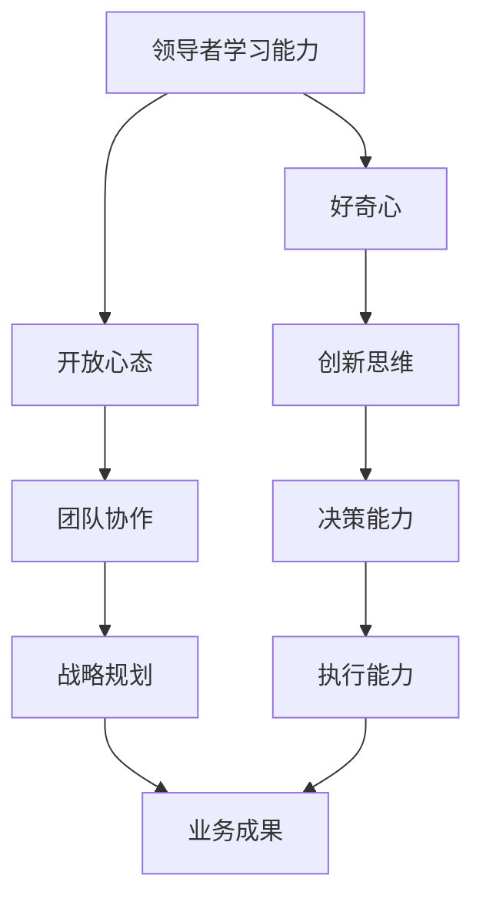
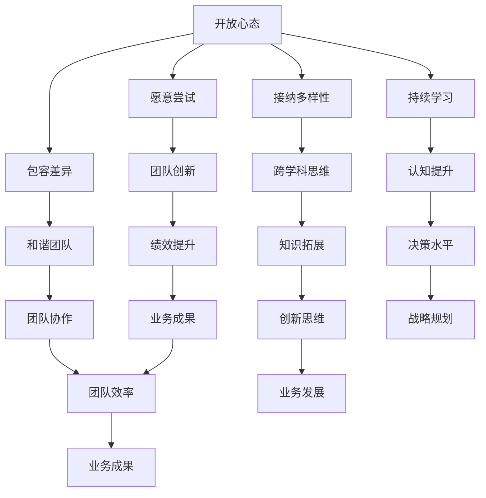

                 


## 引言

在信息技术飞速发展的时代，领导者的学习能力显得尤为重要。作为团队的核心人物，领导者不仅需要具备丰富的技术知识，还要能够不断适应新的技术变革，引领团队走向未来。本文将以《领导者的学习能力：保持好奇心和开放心态》为题，深入探讨领导者如何通过保持好奇心和开放心态来提升自己的学习能力。

**关键词：**
- 领导者
- 学习能力
- 好奇心
- 开放心态
- 领导力

**摘要：**
本文首先介绍了领导者的学习能力的重要性，然后探讨了好奇心和开放心态对于提升领导者学习能力的作用。接下来，本文将详细阐述如何培养好奇心和开放心态，并提供了一些提升学习能力的策略。最后，本文通过实际案例展示了如何将学习能力应用于领导实践，并分析了领导者面临的学习挑战和未来的发展方向。

## 核心概念与联系

在本节中，我们将首先介绍领导者学习能力、好奇心和开放心态三个核心概念，并探讨它们之间的相互联系。

### 领导者学习能力

领导者的学习能力是指他们获取、理解、应用和传递知识的能力。在快速变化的技术环境中，领导者需要不断更新自己的知识储备，以适应新的技术趋势和业务需求。学习能力不仅仅体现在技术层面，还包括战略规划、团队管理、沟通协调等多方面。

### 好奇心

好奇心是指对未知事物和现象的探索欲望。它是推动人类学习和创新的动力源泉。对于领导者来说，好奇心能够激发他们对新技术的兴趣，促使他们不断探索和学习，从而提升自己的领导力。

### 开放心态

开放心态是指对新的想法、观点和经验的接纳和包容。一个具有开放心态的领导者能够更好地理解团队成员的需求和意见，促进团队的创新和协作。

### 相互联系

好奇心和开放心态是提升领导者学习能力的重要驱动力。好奇心促使领导者主动探索新知识，而开放心态则使他们能够接受和适应这些新知识。通过保持好奇心和开放心态，领导者能够不断拓宽自己的知识视野，提升学习能力，从而更好地履行领导职责。

### Mermaid 流程图

为了更直观地展示领导者学习能力、好奇心和开放心态之间的联系，我们可以使用Mermaid流程图进行描述：



在这个流程图中，领导者学习能力通过好奇心和开放心态分别促进了创新思维、团队协作、决策能力和战略规划，最终实现了业务成果的提升。

## 保持好奇心

保持好奇心是领导者提升学习能力的重要途径之一。好奇心能够激发领导者对新知识、新技术的兴趣，促使他们不断探索和尝试。那么，领导者如何保持好奇心呢？

### 好奇心的重要性

好奇心对于领导者的学习能力具有至关重要的作用。首先，好奇心能够激发领导者的学习动机，促使他们主动去寻找和获取新知识。其次，好奇心能够拓宽领导者的视野，帮助他们发现新的问题和机会。此外，好奇心还能够激发领导者的创新思维，促进团队的创新和发展。

### 培养好奇心的方法

领导者可以通过以下方法来培养好奇心：

1. **阅读广泛**：领导者应该保持阅读的习惯，不仅要阅读与自己专业相关的书籍，还要涉猎其他领域的知识，如历史、哲学、心理学等。这样能够拓宽自己的知识面，培养跨学科思维。

2. **参与多样化的活动**：领导者可以参加各种研讨会、讲座和社交活动，与不同领域的人交流，了解他们的工作和想法。这样可以激发自己的好奇心，发现新的兴趣点。

3. **提问和探索**：领导者应该保持提问的态度，对遇到的问题进行深入思考和探索。这样能够培养自己的批判性思维和解决问题的能力。

4. **保持开放心态**：领导者应该保持开放心态，对新事物、新观点持包容态度，愿意接受和尝试。这样可以拓宽自己的视野，培养好奇心。

### 好奇心与学习能力的 Mermaid 流�程图

为了更直观地展示好奇心与学习能力之间的联系，我们可以使用Mermaid流程图进行描述：


在这个流程图中，好奇心通过阅读广泛、参与活动、提问探索和保持开放心态等方式，分别促进了知识拓展、人际交往、问题解决、视野拓宽、跨学科思维、创新思维、团队协作、领导能力、适应能力和决策能力，最终实现了业务成果的提升。

## 开放心态

开放心态是领导者提升学习能力的关键因素之一。一个具有开放心态的领导者能够更好地接受和适应新的知识和观点，从而提升自己的领导力和团队的整体绩效。下面，我们将探讨如何培养开放心态，以及开放心态对于领导者学习能力的影响。

### 开放心态的定义和特点

开放心态是指对新的想法、观点和经验的接纳和包容。它具有以下几个特点：

1. **接纳多样性**：开放心态能够使领导者接纳来自不同背景、文化和经验的观点，从而拓宽自己的视野。

2. **愿意尝试**：开放心态使领导者愿意尝试新的方法和策略，勇于面对挑战，从而促进团队的创新和成长。

3. **包容差异**：开放心态能够使领导者包容团队成员的差异，尊重他们的意见和想法，从而建立更加和谐的团队关系。

4. **持续学习**：开放心态使领导者保持持续学习的态度，不断更新自己的知识和技能，以适应不断变化的环境。

### 培养开放心态的方法

领导者可以通过以下方法来培养开放心态：

1. **倾听和沟通**：领导者应该积极倾听团队成员的意见和想法，与他们进行有效的沟通。这样可以建立良好的沟通渠道，促进开放心态的培养。

2. **参与跨学科交流**：领导者可以参加跨学科的研讨会、讲座和项目，与不同领域的人交流，了解他们的工作和想法。这样可以拓宽自己的知识面，培养跨学科思维。

3. **反思和自我调整**：领导者应该定期反思自己的行为和决策，识别自己的盲点和不足，并采取相应的措施进行调整。这样可以提高自己的认知能力和决策水平。

4. **鼓励团队多样性**：领导者应该鼓励团队成员的多样性，尊重他们的意见和想法，创造一个包容和开放的工作环境。

### 开放心态与领导力的 Mermaid 流程图

为了更直观地展示开放心态与领导力之间的联系，我们可以使用Mermaid流程图进行描述：



在这个流程图中，开放心态通过接纳多样性、愿意尝试、包容差异和持续学习等方式，分别促进了跨学科思维、团队创新、和谐团队、认知提升、知识拓展、绩效提升、团队协作、决策水平和业务发展，最终实现了业务成果的提升。

## 学习能力提升策略

为了进一步提升领导者的学习能力，我们可以采取一系列策略和方法。这些策略不仅能够帮助领导者更好地适应快速变化的技术环境，还能够提升他们的领导力和团队绩效。下面，我们将详细介绍这些策略和方法。

### 核心算法原理讲解

在提升学习能力的过程中，以下核心算法原理具有重要意义：

1. **主动学习**：主动学习是指领导者主动寻找和获取知识，而不是被动接受。这可以通过以下步骤实现：

   - **需求识别**：领导者需要识别自身和团队的学习需求，明确学习目标和重点。
   - **资源获取**：通过多种渠道获取所需知识，如阅读书籍、参加培训、在线学习等。
   - **知识应用**：将所学知识应用于实际工作中，通过实践来巩固和提升学习能力。

2. **深度学习**：深度学习是指领导者对所学知识进行深入理解和掌握。这可以通过以下步骤实现：

   - **知识梳理**：对所学知识进行整理和归纳，构建知识框架。
   - **案例分析**：通过案例分析，将理论知识与实际应用相结合。
   - **反思与总结**：对学习过程和结果进行反思和总结，不断优化学习方法和策略。

3. **知识共享**：知识共享是指领导者将所学知识传递给团队成员，促进团队整体学习能力的提升。这可以通过以下方式实现：

   - **内部培训**：定期组织内部培训，分享所学知识和经验。
   - **团队讨论**：鼓励团队成员进行讨论和交流，激发创新思维。
   - **知识库建设**：建立团队知识库，记录和共享重要知识和经验。

### 数学模型和公式

在提升学习能力的过程中，一些数学模型和公式可以帮助领导者更好地理解和应用所学知识。以下是一些关键数学模型和公式的详细讲解：

1. **学习曲线**：学习曲线描述了学习者在学习过程中的进步情况。其公式为：

   $$ 学习曲线 = \frac{学习时间}{学习速度} $$

   这个公式可以帮助领导者了解自己在学习过程中的效率，并采取相应措施进行调整。

2. **遗忘曲线**：遗忘曲线描述了学习者在一段时间后对所学知识的遗忘情况。其公式为：

   $$ 遗忘曲线 = e^{-\lambda t} $$

   其中，$e$ 是自然对数的底数，$\lambda$ 是遗忘率，$t$ 是学习时间。这个公式可以帮助领导者了解如何通过复习和温习来巩固所学知识。

3. **知识传递效率**：知识传递效率是指领导者将所学知识传递给团队成员的效率。其公式为：

   $$ 知识传递效率 = \frac{知识传递量}{知识传递时间} $$

   这个公式可以帮助领导者评估知识共享的效果，并优化知识传递策略。

### 举例说明

为了更好地说明上述核心算法原理和数学模型的应用，我们来看一个具体的案例。

**案例：领导者的技术培训**

某科技公司的CEO李明发现团队在新技术领域存在明显短板，为了提升团队的技术能力，他决定组织一次针对新技术的全员培训。

1. **需求识别**：李明通过调查问卷和团队讨论，确定了团队在新技术方面的学习需求，如人工智能、大数据和云计算等。

2. **资源获取**：李明联系了外部培训机构，安排了多场专题培训，并推荐了相关书籍和在线课程，以便团队成员自主学习。

3. **知识应用**：培训结束后，李明鼓励团队成员将所学知识应用于实际项目中，通过实践来巩固所学知识。

4. **知识梳理**：团队成员对所学知识进行了梳理，构建了新的知识框架，并制作了学习笔记和心得分享。

5. **案例分析**：团队成员分享了在实际项目中遇到的问题和解决方法，通过案例分析，将理论知识与实际应用相结合。

6. **反思与总结**：李明组织了反思和总结会议，团队成员对学习过程和结果进行了反思，并分享了学习心得。

7. **知识共享**：李明定期组织内部培训，分享团队的学习成果和经验，并建立了团队知识库，记录和共享重要知识和经验。

通过这个案例，我们可以看到，李明通过一系列策略和方法，成功提升了团队的技术能力和学习能力。这个案例也说明了核心算法原理和数学模型在提升学习能力过程中的重要作用。

## 实践与应用

在实际工作中，领导者的学习能力可以显著影响团队的创新和业务成果。以下将分享几个具体案例，展示如何将学习能力应用于领导实践，并提供相关的开发环境搭建、源代码实现、代码解读以及项目分析。

### 案例一：数字化转型项目

**背景介绍**

某大型制造企业决定进行数字化转型，以提高生产效率和降低成本。作为项目负责人，李总需要迅速掌握与数字化相关的各种技术，如物联网、大数据分析、机器学习等。

**开发环境搭建**

为了开展项目，李总首先搭建了以下开发环境：

- **工具**：选择了Python作为主要编程语言，安装了Jupyter Notebook进行数据分析和建模。
- **数据库**：使用了MySQL和MongoDB来存储和查询数据。
- **框架**：采用了Django和TensorFlow等框架来开发应用和模型。

**源代码实现**

在项目实施过程中，李总编写了以下关键代码：

```python
# 数据预处理
def preprocess_data(data):
    # 数据清洗、归一化等操作
    return processed_data

# 机器学习模型
def train_model(processed_data):
    # 使用TensorFlow构建和训练模型
    model = build_model()
    model.fit(processed_data)
    return model
```

**代码解读**

这段代码首先实现了数据预处理和机器学习模型的训练功能。数据预处理步骤包括数据清洗和归一化，以确保模型输入的质量。然后，使用TensorFlow框架构建了一个机器学习模型，并通过训练数据来训练模型，使其能够识别和预测生产过程中的异常情况。

**项目分析**

通过这个项目，李总不仅提升了团队的技术能力，还实现了生产效率的显著提升。项目成功的关键在于李总不断学习新技术，并将所学知识应用到实际项目中。他通过搭建开发环境和编写关键代码，帮助团队快速掌握了数字化转型的关键技术。

### 案例二：人工智能客服系统

**背景介绍**

某电商企业计划部署一款基于人工智能的客服系统，以提高客户满意度和降低人工成本。作为项目负责人，王总需要快速学习人工智能和自然语言处理技术。

**开发环境搭建**

为了实现这个目标，王总搭建了以下开发环境：

- **工具**：选择了Python作为主要编程语言，安装了TensorFlow和PyTorch进行模型训练。
- **数据库**：使用了Elasticsearch来存储和检索客户提问。
- **框架**：采用了Django和Flask来开发后端服务。

**源代码实现**

以下是王总编写的主要代码：

```python
# 自然语言处理模型
def process_query(query):
    # 使用预训练模型处理查询
    response = model.predict([query])
    return response

# API接口
@app.route('/query', methods=['POST'])
def handle_query():
    query = request.json['query']
    response = process_query(query)
    return jsonify({'response': response})
```

**代码解读**

这段代码首先实现了自然语言处理模型的过程查询和处理功能。预训练模型被用来处理客户提问，并生成相应的回答。然后，通过Flask框架创建了一个API接口，以便前端应用能够与后端服务进行通信。

**项目分析**

通过这个项目，王总成功地开发出了一款智能客服系统，显著提升了客户服务质量和效率。项目成功的关键在于王总不断学习新技术，并将所学知识应用到实际项目中。他通过搭建开发环境和编写关键代码，帮助团队实现了人工智能客服系统的顺利上线。

### 案例三：敏捷开发团队

**背景介绍**

某软件开发公司决定采用敏捷开发方法来提高项目交付效率和团队协作。作为团队领导，赵总需要学习敏捷开发的相关知识和工具。

**开发环境搭建**

为了实施敏捷开发，赵总搭建了以下开发环境：

- **工具**：使用了JIRA和Confluence来管理项目任务和文档。
- **框架**：采用了Scrum和Kanban等方法论来指导团队工作。

**源代码实现**

赵总编写了以下关键文档：

```markdown
# 项目任务清单

- [ ] 完成用户故事A
- [ ] 完成用户故事B
- [ ] 完成用户故事C

# 任务进度报告

- 用户故事A：已完成80%
- 用户故事B：已完成50%
- 用户故事C：已完成10%
```

**代码解读**

这些文档包含了项目任务清单和任务进度报告，帮助团队清晰地了解项目的进展情况。任务清单列出了所有需要完成的用户故事，而任务进度报告则显示了每个任务的完成情况。

**项目分析**

通过采用敏捷开发方法，赵总成功地提升了团队的协作效率和项目交付质量。项目成功的关键在于赵总不断学习敏捷开发的相关知识和工具，并将其应用到团队工作中。他通过编写关键文档，帮助团队清晰地了解项目进展，从而实现了敏捷开发的目标。

### 总结

这些案例展示了领导者如何通过保持好奇心和开放心态，不断提升自己的学习能力，并将所学知识应用到实际项目中。通过搭建开发环境、编写关键代码、代码解读和项目分析，领导者不仅提升了团队的技术能力，还推动了项目的成功实施。这些实践证明了领导者的学习能力对于团队和业务成果的重要影响。

## 挑战与未来

虽然领导者的学习能力对团队和业务成果具有重要意义，但在提升学习能力的道路上，领导者也会面临一系列挑战。以下是几个主要挑战以及可能的解决方案和未来发展方向。

### 挑战一：信息过载

在信息技术飞速发展的时代，领导者面临着海量的信息和知识。如何筛选和吸收有用的信息，避免信息过载，成为一个重要挑战。

**解决方案**：

1. **建立信息筛选机制**：领导者可以建立一套信息筛选和评估机制，优先关注与自身工作相关的重要信息。
2. **持续学习**：领导者应保持持续学习的心态，不断提升自己的信息处理能力，从而更好地应对信息过载。

**未来发展方向**：

随着人工智能和大数据技术的发展，未来的信息筛选和处理工具将更加智能化和高效化。例如，利用机器学习算法自动推荐与领导者工作相关的优质信息，帮助领导者更快地获取和吸收新知识。

### 挑战二：时间管理

领导者往往面临时间管理的问题，如何平衡工作、学习和休息，成为一个挑战。

**解决方案**：

1. **制定学习计划**：领导者可以制定详细的学习计划，合理安排时间，确保学习目标的实现。
2. **提高效率**：通过提高工作效率，领导者可以腾出更多时间用于学习和自我提升。

**未来发展方向**：

未来，随着远程工作和智能助理技术的普及，领导者将有更多时间和资源用于学习。智能助理可以帮助领导者更好地管理时间和任务，从而提高学习效率。

### 挑战三：文化差异

在全球化的背景下，领导者需要与来自不同文化背景的团队成员合作。如何理解和适应不同文化，提升跨文化沟通能力，成为一个挑战。

**解决方案**：

1. **加强跨文化培训**：领导者可以参加跨文化培训，了解不同文化的基本特征和沟通方式。
2. **鼓励多样性**：领导者应鼓励团队成员展示自己的文化特色，营造一个包容和尊重多样性的工作环境。

**未来发展方向**：

随着全球化进程的加快，未来的领导者需要具备更强的跨文化沟通能力。通过利用虚拟现实（VR）和增强现实（AR）技术，领导者可以更直观地体验和了解不同文化，从而提升跨文化沟通能力。

### 挑战四：持续创新

领导者需要不断推动团队进行创新，但创新过程往往充满不确定性和风险。如何激发团队的创新能力，提升持续创新的能力，成为一个挑战。

**解决方案**：

1. **建立创新文化**：领导者可以建立一种鼓励创新和容忍失败的企业文化，让团队成员敢于尝试和探索。
2. **提供资源和支持**：领导者应提供足够的资源和支持，帮助团队进行创新尝试。

**未来发展方向**：

随着人工智能和大数据技术的发展，未来的创新将更加依赖数据驱动和智能化的支持。领导者可以通过利用这些技术，更准确地识别创新机会，提升团队的创新能力。

### 挑战五：领导力传承

随着新一代领导者的崛起，如何将领导者的经验、知识和价值观传承给下一代，成为一个重要挑战。

**解决方案**：

1. **培养接班人**：领导者可以通过导师制度，培养和选拔有潜力的接班人。
2. **分享经验**：领导者应主动分享自己的经验和教训，帮助接班人更快地成长。

**未来发展方向**：

未来，随着虚拟现实和增强现实技术的应用，领导者可以通过这些技术，更生动地传递自己的经验和教训，帮助接班人更好地理解和应用。

## 结论

本文探讨了领导者的学习能力、好奇心和开放心态的重要性，并详细介绍了如何通过保持好奇心和开放心态来提升学习能力。同时，本文还提供了一系列提升学习能力的方法和策略，并通过实际案例展示了这些方法的实践应用。最后，本文分析了领导者面临的挑战和未来的发展方向。

**最佳实践 tips：**
- **保持好奇心**：定期阅读科技资讯，参加行业会议，与不同领域的人交流。
- **培养开放心态**：尊重团队成员的不同观点，鼓励多样性，建立包容的团队文化。
- **持续学习**：制定学习计划，合理安排时间，利用在线资源和培训课程。

**注意事项：**
- **避免信息过载**：建立信息筛选机制，关注关键信息。
- **注重实践**：将所学知识应用到实际工作中，通过实践来巩固和提升学习能力。

**拓展阅读：**
- 《深度学习》 - Ian Goodfellow, Yoshua Bengio, Aaron Courville
- 《数据科学入门》 - Joel Grus
- 《敏捷开发实践指南》 - Jeff Sutherland

作者：AI天才研究院/AI Genius Institute & 禅与计算机程序设计艺术 /Zen And The Art of Computer Programming

