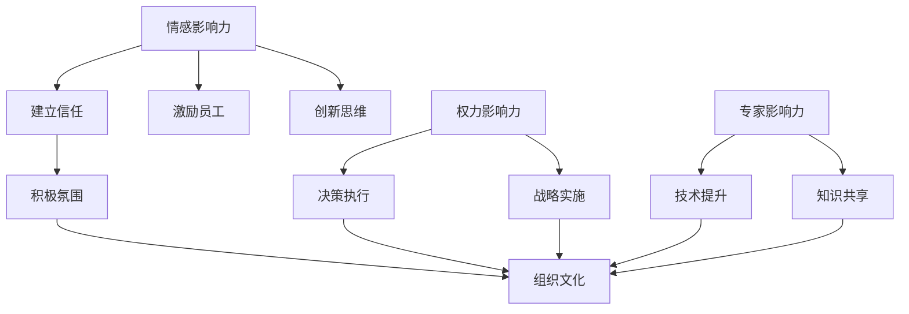

                 

### 文章标题：《领导者的影响力：塑造积极的组织文化》

**关键词：**领导者影响力、组织文化、积极文化塑造、情感影响力、权力影响力、专家影响力、算法原理、数学模型、项目实战

**摘要：**本文深入探讨了领导者影响力在塑造积极组织文化中的关键作用，分析了领导者影响力的核心概念及其与组织文化的关系。通过详细的算法原理和数学模型讲解，以及实际项目实战的剖析，本文提供了领导者如何有效运用影响力，促进组织文化发展的实用策略。文章旨在为领导者提供理论指导，助力组织实现可持续发展的目标。

### 引言

在现代企业中，领导者的影响力是推动组织进步和发展的关键因素。领导者的影响力不仅体现在决策和战略层面，更在塑造组织文化中发挥着重要作用。本文旨在探讨领导者的影响力及其在塑造积极组织文化中的作用，帮助领导者更好地理解和运用影响力，提升组织的整体绩效。

首先，我们需要明确领导者影响力的定义。领导者影响力是指领导者通过情感、权力和专业知识等手段，对团队成员行为和思维产生的影响。这种影响不仅局限于领导者和团队成员之间，还渗透到组织的各个方面，对组织文化的形成和发展产生深远的影响。

积极组织文化是指一种以共同愿景、价值观和积极行为为特征的组织氛围。这种文化能够激发员工的潜能，促进团队合作，提升组织的创新能力和竞争力。领导者的影响力在塑造积极组织文化中起到了关键作用。他们通过设定共同愿景、传递核心价值观、确保透明沟通、鼓励创新和提供反馈与激励等方式，引导组织成员形成积极的文化氛围。

领导者的影响力与组织文化之间存在密切的联系。一方面，领导者的影响力直接影响着组织文化的形成和发展。领导者的行为和决策不仅会影响团队成员的态度和行为，还会影响组织的整体氛围。另一方面，组织文化也会对领导者的影响力产生影响。一个积极、健康的组织文化能够增强领导者的影响力，促进组织的和谐与发展。

本文将从以下几个方面进行探讨：

1. 领导者影响力的定义及其在组织中的作用。
2. 积极组织文化的特征及其与领导者影响力的关系。
3. 领导者影响力的核心概念与联系，包括情感影响力、权力影响力和专家影响力。
4. 塑造积极组织文化的核心算法原理，包括共同愿景、价值观传递、透明沟通、鼓励创新和反馈与激励。
5. 数学模型在领导者影响力与组织文化研究中的应用，包括信任模型和创新能力模型。
6. 项目实战：领导者影响力的实际应用案例分析。
7. 领导者影响力与组织绩效的关系及其提升策略。
8. 领导者影响力的未来趋势及其适应策略。

通过本文的探讨，我们希望能够为领导者提供实用的指导，帮助他们更好地运用影响力，塑造积极的组织文化，推动组织实现持续发展的目标。

### 书名：《领导者的影响力：塑造积极的组织文化》

#### 目录大纲

为了更好地组织本文的内容，我们按照以下目录大纲结构展开讨论，确保每个章节都详细、具体地探讨领导者影响力在塑造积极组织文化中的作用。

#### 第1章 引言

- 1.1 领导者影响力的定义
- 1.2 积极组织文化的特征
- 1.3 领导者影响力与组织文化的关系

#### 第2章 领导者的影响力：核心概念与联系

- 2.1 领导者影响力的构成
  - 2.1.1 情感影响力
  - 2.1.2 权力影响力
  - 2.1.3 专家影响力
- 2.2 领导者影响力与组织文化的 Mermaid 流程图

#### 第3章 塑造积极组织文化的核心算法原理

- 3.1 文化塑造的五大原则
  - 3.1.1 共同愿景
  - 3.1.2 价值观传递
  - 3.1.3 透明沟通
  - 3.1.4 鼓励创新
  - 3.1.5 反馈与激励
- 3.2 塑造积极组织文化的伪代码讲解

```python
# 定义塑造积极组织文化的函数
def shape_positive_organizational_culture():
    # 设定共同愿景
    define_common_vision()
    # 传递价值观
    transmit_values()
    # 确保透明沟通
    ensure_transparent_communication()
    # 鼓励创新
    encourage_innovation()
    # 提供反馈与激励
    provide_feedback_and_incentives()
```

#### 第4章 数学模型与数学公式

- 4.1 信任模型
  $$
  \text{Trust} = \frac{\text{Common Values} + \text{Open Communication} + \text{Positive Reinforcement}}{\text{Doubt} + \text{Negative Reinforcement}}
  $$
- 4.2 创新能力模型
  $$
  \text{Innovation} = \frac{\text{Knowledge Sharing} + \text{Creative Environment} + \text{Risk-Taking Culture}}{\text{Silos} + \text{Regulation}}
  $$

#### 第5章 项目实战：领导者影响力的实际应用

- 5.1 项目背景
- 5.2 项目目标
- 5.3 实施策略
  - 5.3.1 建立共同愿景
  - 5.3.2 传递核心价值观
  - 5.3.3 确保透明沟通
  - 5.3.4 鼓励创新与风险承担
- 5.4 项目成果分析
- 5.5 代码实现与解读
  - 5.5.1 环境搭建
  - 5.5.2 源代码实现
  - 5.5.3 代码解读与分析

#### 第6章 领导者影响力与组织绩效的关系

- 6.1 影响力与绩效的关联分析
- 6.2 如何提升领导者影响力以促进绩效
- 6.3 案例研究：优秀领导者的成功实践

#### 第7章 领导者影响力的未来趋势

- 7.1 数字化对领导者影响力的挑战
- 7.2 未来领导者影响力的关键要素
- 7.3 领导者如何适应未来的变化

#### 附录

- 7.1 领导者影响力相关资源与工具推荐
- 7.2 参考文献

通过上述目录大纲，我们能够系统地探讨领导者影响力在塑造积极组织文化中的各个方面，为领导者提供全面的理论和实践指导。

### 第1章 引言

在当今快速变化和竞争激烈的市场环境中，领导者的影响力成为企业成功的关键因素之一。领导者不仅需要具备卓越的管理能力，还需要能够在组织内部塑造一种积极向上的文化，以推动组织的持续发展。

**1.1 领导者影响力的定义**

领导者影响力是指领导者通过其行为、决策和沟通等方式，对团队成员产生的影响。这种影响不仅仅局限于直接管理范围，而是渗透到组织的方方面面，包括员工的工作态度、行为方式以及团队合作精神。领导者的影响力可以分为三个方面：情感影响力、权力影响力和专家影响力。

- **情感影响力**：领导者通过建立信任和情感联系，影响团队成员的情感和态度。这种影响力通常基于领导者的人格魅力、亲和力和沟通能力，能够在组织中形成积极、和谐的氛围。
- **权力影响力**：领导者通过其在组织中的职位和权力，影响团队成员的行为和决策。这种影响力通常基于领导者的权威和决策能力，能够在组织中快速推动变革和执行决策。
- **专家影响力**：领导者通过其专业知识和经验，影响团队成员的专业能力和创新思维。这种影响力通常基于领导者的专业素养和创新能力，能够在组织中提升整体的技术水平和创新能力。

**1.2 积极组织文化的特征**

积极组织文化是指一种以共同愿景、核心价值观和积极行为为特征的组织氛围。这种文化能够激发员工的潜能，促进团队合作，提升组织的创新能力和竞争力。积极组织文化的特征包括：

- **共同愿景**：组织成员对未来的共同期望和追求，能够激发员工的积极性和创造力。
- **核心价值观**：组织内部共同遵循的基本原则和信仰，能够统一员工的思想和行为。
- **开放沟通**：组织内部建立开放的沟通渠道，确保信息流畅和透明，能够增强员工之间的信任和理解。
- **鼓励创新**：组织对创新的鼓励和支持，能够激发员工的创造力和创新能力。
- **反馈与激励**：组织对员工的工作表现提供及时的反馈和激励，能够增强员工的动力和归属感。

**1.3 领导者影响力与组织文化的关系**

领导者的影响力在塑造积极组织文化中起到了关键作用。领导者的行为和决策不仅直接影响着组织文化的形成，还通过影响员工的行为和思维，推动组织文化的传播和发展。

- **领导者影响力对组织文化的影响**：领导者的情感影响力能够建立一种积极、和谐的团队氛围，促进员工之间的合作和信任。权力影响力能够推动组织内的变革和执行决策，确保组织文化的落地。专家影响力能够提升员工的专业能力和创新思维，为组织文化的发展提供智力支持。

- **组织文化对领导者影响力的影响**：积极的组织文化能够增强领导者的影响力，使领导者更容易实现其目标和愿景。组织文化中的共同价值观和积极行为能够为领导者提供支持和信任，增强领导者的权威和影响力。

综上所述，领导者的影响力在塑造积极组织文化中具有不可替代的作用。通过理解领导者影响力的定义和特征，以及积极组织文化的特征和影响，领导者可以更好地运用其影响力，推动组织的持续发展。

### 第2章 领导者的影响力：核心概念与联系

在探讨领导者的影响力时，我们必须理解其核心概念，并探讨这些概念之间的联系。领导者的影响力不仅仅是一种抽象的概念，它由情感影响力、权力影响力和专家影响力三个核心部分构成，每种影响力都在塑造组织文化和推动组织发展中发挥着独特的作用。

#### 2.1 领导者影响力的构成

**2.1.1 情感影响力**

情感影响力是领导者通过情感和情感联系影响团队成员的能力。这种影响力通常基于领导者的人格魅力、亲和力和真诚的沟通。情感影响力能够在组织内部建立信任和归属感，激发员工的积极性和创造力。

- **情感影响力与组织文化**：情感影响力有助于建立积极、和谐的团队氛围，促进员工之间的合作和信任。一个领导者如果能够在情感上与团队成员建立深厚的联系，就能更好地传递组织的核心价值观，推动组织文化的形成和发展。

**2.1.2 权力影响力**

权力影响力是领导者通过其在组织中的职位和权力影响团队成员的能力。这种影响力通常基于领导者的权威、决策能力和管理能力。权力影响力在组织变革和决策执行中起着关键作用。

- **权力影响力与组织文化**：权力影响力能够确保组织的战略和决策得到有效执行，推动组织文化的落地。一个拥有强大权力影响力的领导者能够在组织内部迅速推动变革，确保组织文化的实施。

**2.1.3 专家影响力**

专家影响力是领导者通过其专业知识和经验影响团队成员的能力。这种影响力通常基于领导者的专业素养、技术能力和创新能力。专家影响力能够提升员工的专业能力和创新思维，推动组织的技术进步和创新能力。

- **专家影响力与组织文化**：专家影响力有助于提升组织的整体技术水平，推动组织文化的创新和发展。一个具备强大专家影响力的领导者能够激发员工的学习和创新欲望，为组织文化注入新的活力。

#### 2.2 领导者影响力与组织文化的 Mermaid 流程图

为了更清晰地展示领导者影响力与组织文化之间的联系，我们可以使用 Mermaid 图进行描述。以下是一个简化的 Mermaid 流程图，用于表示领导者影响力与组织文化之间的关系：



在这个流程图中：

- **情感影响力**（A）通过建立信任（B）和积极氛围（C）影响组织文化（D），同时激励员工（E）和创新思维（F）。
- **权力影响力**（G）通过决策执行（H）和战略实施（I）确保组织文化的实施。
- **专家影响力**（J）通过技术提升（K）和知识共享（L）推动组织文化的创新和发展。

通过这个 Mermaid 流程图，我们可以直观地看到领导者影响力如何通过情感、权力和专业知识等途径与组织文化相互作用，共同推动组织的持续发展。

#### 2.3 领导者影响力在组织文化塑造中的实际应用

在组织文化的塑造过程中，领导者的影响力可以通过多种方式得以体现。以下是几个实际应用的例子：

- **建立共同愿景**：领导者通过情感影响力，与团队成员建立深厚的情感联系，共同设定组织的愿景和目标。这种情感纽带能够增强团队成员的归属感和使命感，推动他们为实现共同愿景而努力。
- **传递核心价值观**：领导者通过权力影响力，确保组织核心价值观得到有效传递和执行。领导者通过制定明确的规章制度和奖惩机制，使员工能够清晰地认识到组织所倡导的核心价值观，并将其融入到日常工作中。
- **推动透明沟通**：领导者通过透明沟通，建立开放、公正的沟通渠道，增强员工之间的信任和理解。这种沟通环境能够促进信息的共享和协作，有助于形成积极、健康的文化氛围。
- **鼓励创新和风险承担**：领导者通过专家影响力，激发员工的创新思维和冒险精神。领导者通过提供技术支持和资源保障，鼓励员工尝试新的想法和方法，从而推动组织的创新和发展。

总之，领导者的影响力在塑造积极组织文化中起着至关重要的作用。通过理解并有效运用情感、权力和专家影响力，领导者可以引导组织成员形成共同愿景、核心价值观和积极行为，推动组织的持续发展。

### 第3章 塑造积极组织文化的核心算法原理

在探讨如何塑造积极组织文化时，我们可以借鉴计算机科学中的算法原理，将领导者的行为和策略转化为一种可操作的框架。这种框架不仅能够系统地指导领导者如何塑造积极文化，还能够通过量化和逻辑化，使组织文化的建设更加科学和有效。

#### 3.1 文化塑造的五大原则

塑造积极组织文化需要遵循以下五大原则：

**3.1.1 共同愿景**

共同愿景是组织文化的核心。它是一种能够激发员工热情和动力的长远目标，是整个组织共同追求的方向。为了建立共同愿景，领导者需要：

- **明确表达**：领导者需要清晰地表达组织的愿景，使所有员工都能理解和认同。
- **全员参与**：鼓励员工参与愿景的制定过程，增强他们的归属感和参与感。
- **持续更新**：共同愿景不是一成不变的，需要随着组织内外环境的变化进行适时调整。

共同愿景的算法可以描述为：

```python
def define_common_vision():
    # 收集员工意见
    collect_employee_input()
    # 明确表达愿景
    articulate_vision()
    # 定期更新愿景
    update_vision_periodically()
```

**3.1.2 价值观传递**

核心价值观是组织文化的基石，它指导员工的行为和决策，是组织内部共同遵循的基本原则。为了有效传递价值观，领导者需要：

- **制定明确的核心价值观**：确保价值观具有可操作性和指导意义。
- **建立榜样**：领导者自身需要成为价值观的践行者，通过实际行动树立榜样。
- **培训和教育**：定期开展培训和教育，确保员工理解和认同核心价值观。

价值观传递的算法可以描述为：

```python
def transmit_values():
    # 制定核心价值观
    establish_core_values()
    # 树立榜样
    set_exemplars()
    # 开展培训和教育
    conduct_training_and_education()
```

**3.1.3 透明沟通**

透明沟通是建立信任和信任的关键。它要求组织内部信息流畅，决策透明，员工能够自由地表达意见和反馈。为了实现透明沟通，领导者需要：

- **建立沟通渠道**：确保员工有途径向领导层反馈意见和建议。
- **鼓励双向沟通**：领导者需要倾听员工的意见，并给予反馈。
- **公开决策过程**：使员工了解决策的原因和过程，增加透明度。

透明沟通的算法可以描述为：

```python
def ensure_transparent_communication():
    # 建立沟通渠道
    establish_communication_channels()
    # 鼓励双向沟通
    encourage_two-way_communication()
    # 公开决策过程
    disclose_decision_process()
```

**3.1.4 鼓励创新**

创新是组织持续发展的动力。领导者需要创造一个鼓励创新的环境，激发员工的创造力和创新能力。为了鼓励创新，领导者需要：

- **提供资源和支持**：确保员工有足够的资源和时间进行创新实验。
- **奖励创新行为**：对创新行为给予认可和奖励，激励员工勇于尝试。
- **建立创新机制**：建立创新的流程和机制，确保创新想法能够顺利实施。

鼓励创新的算法可以描述为：

```python
def encourage_innovation():
    # 提供资源和支持
    provide_resources_and_support()
    # 奖励创新行为
    reward_innovative_actions()
    # 建立创新机制
    establish_innovation_mechanisms()
```

**3.1.5 反馈与激励**

有效的反馈和激励机制能够增强员工的动力和归属感。领导者需要：

- **及时反馈**：对员工的工作表现给予及时和具体的反馈。
- **个性化激励**：根据员工的不同需求，提供个性化的激励措施。
- **认可和奖励**：公开认可和奖励优秀员工，提升团队士气。

反馈与激励的算法可以描述为：

```python
def provide_feedback_and_incentives():
    # 及时反馈
    provide_timely_feedback()
    # 个性化激励
    personalize_incentives()
    # 认可和奖励
    recognize_and_reward()
```

#### 3.2 塑造积极组织文化的伪代码讲解

下面是一个综合上述五大原则的塑造积极组织文化的伪代码：

```python
# 定义塑造积极组织文化的函数
def shape_positive_organizational_culture():
    # 设定共同愿景
    define_common_vision()
    # 传递价值观
    transmit_values()
    # 确保透明沟通
    ensure_transparent_communication()
    # 鼓励创新
    encourage_innovation()
    # 提供反馈与激励
    provide_feedback_and_incentives()

# 实施积极组织文化的塑造过程
shape_positive_organizational_culture()
```

通过这个伪代码，领导者可以系统地实施文化塑造的过程，从而有效地推动组织文化的建设和发展。

### 第4章 数学模型与数学公式

在领导者影响力的研究中，数学模型和公式可以提供量化的视角，帮助我们更好地理解和分析领导者的影响力如何作用于组织文化。以下是两个重要的数学模型：信任模型和创新能力模型，以及相关的数学公式和解释。

#### 4.1 信任模型

信任是领导者影响力的重要组成部分，也是塑造积极组织文化的基础。信任模型可以用以下数学公式表示：

$$
\text{Trust} = \frac{\text{Common Values} + \text{Open Communication} + \text{Positive Reinforcement}}{\text{Doubt} + \text{Negative Reinforcement}}
$$

- **Common Values（共同价值观）**：共同价值观是信任建立的重要基础，它代表了组织内部成员的共识和认同。共同价值观的增加可以提高组织成员之间的信任水平。
- **Open Communication（透明沟通）**：透明沟通是信任建立的关键因素，它确保了信息的公开和透明，使得组织成员能够基于准确的信息做出决策。透明沟通的增加有助于减少误解和猜疑，提高信任。
- **Positive Reinforcement（正面激励）**：正面激励如表扬、奖励和认可可以增强团队成员的积极性和责任感，从而提高信任。正面激励的增加有助于建立更加积极、健康的工作氛围。
- **Doubt（疑虑）**：疑虑是信任的对立面，它指的是组织成员对领导者或同事的不信任感。疑虑的增加会降低组织成员之间的信任。
- **Negative Reinforcement（负面激励）**：负面激励如批评、惩罚和威胁会削弱团队成员的积极性和信任感。负面激励的增加会破坏信任。

#### 4.2 创新能力模型

创新能力是组织持续发展和竞争力的关键。创新能力模型可以用以下数学公式表示：

$$
\text{Innovation} = \frac{\text{Knowledge Sharing} + \text{Creative Environment} + \text{Risk-Taking Culture}}{\text{Silos} + \text{Regulation}}
$$

- **Knowledge Sharing（知识共享）**：知识共享是指组织内部成员之间交换和共享知识和信息。知识共享的增加可以促进创新思想的碰撞和融合，提高创新能力。
- **Creative Environment（创新环境）**：创新环境是指组织为员工提供的一个支持性和鼓励性的工作环境。创新环境的优化可以激发员工的创造力和创新精神。
- **Risk-Taking Culture（冒险文化）**：冒险文化是指组织对风险和失败持开放态度，鼓励员工勇于尝试和探索。冒险文化的建立可以减少创新过程中的恐惧和不确定性，提高创新能力。
- **Silos（孤立）**：孤立是指组织内部部门之间的隔阂和缺乏合作。孤立的增加会限制知识的流动和创新的潜力。
- **Regulation（规章制度）**：规章制度是指组织内部的正式规则和标准。过度的规章制度可能会抑制员工的自由创造和冒险精神，限制创新。

通过以上数学模型和公式，我们可以量化地分析领导者影响力在组织文化和创新能力中的作用。这些模型不仅提供了理论依据，也为领导者在实际操作中提供了具体的指导。

### 第5章 项目实战：领导者影响力的实际应用

在本章中，我们将通过一个实际项目来探讨领导者影响力的具体应用。该项目旨在通过领导者的影响力塑造一个积极、创新的组织文化，从而提高组织的整体绩效。以下是项目的详细实施步骤、策略及其成果分析。

#### 5.1 项目背景

某高科技公司在市场上面临激烈竞争，为了保持竞争优势，公司决定进行一次全面的组织文化变革。公司高层意识到，领导者的影响力在推动文化变革中起着至关重要的作用。因此，他们决定通过实施一系列策略来提升领导者的影响力，从而塑造一个积极、创新的组织文化。

#### 5.2 项目目标

- **建立共同愿景**：确保所有员工都能清晰地理解公司的长远目标和方向，增强员工的归属感和使命感。
- **传递核心价值观**：确保公司核心价值观在整个组织中得到广泛认同和遵循，促进员工的统一行为和决策。
- **确保透明沟通**：建立开放的沟通渠道，确保信息流畅和透明，增强员工之间的信任和理解。
- **鼓励创新与风险承担**：创造一个支持性和鼓励性的工作环境，激发员工的创新思维和冒险精神。
- **提供反馈与激励**：建立有效的反馈和激励机制，增强员工的动力和归属感。

#### 5.3 实施策略

**5.3.1 建立共同愿景**

为了建立共同愿景，公司领导层组织了一次全员参与的愿景研讨会。在研讨会上，领导层明确了公司的长期目标，并邀请员工提出意见和建议。通过这种方式，员工们不仅参与了愿景的制定过程，还更加深入地理解了公司的愿景和目标。愿景研讨会结束后，领导层将共同愿景通过内部邮件、公告和会议等形式传达给所有员工，确保每位员工都明确公司的愿景。

**5.3.2 传递核心价值观**

为了确保核心价值观得到广泛认同和遵循，公司制定了具体的价值观手册，并组织了多次核心价值观培训。在培训中，领导层通过案例分析、角色扮演和讨论等方式，帮助员工深刻理解核心价值观的含义和重要性。同时，领导层还通过内部表彰和奖励机制，鼓励员工在日常生活中践行核心价值观。

**5.3.3 确保透明沟通**

为了确保透明沟通，公司建立了一套完善的内部沟通机制。首先，公司设立了一个内部邮件系统，用于发布重要公告和通知。其次，公司定期组织内部会议，领导层在会议上向员工汇报公司的运营情况和战略决策，并邀请员工提出问题和建议。此外，公司还建立了匿名反馈渠道，员工可以通过这种方式向领导层反馈意见和建议。

**5.3.4 鼓励创新与风险承担**

为了鼓励创新和风险承担，公司创造了一个支持性和鼓励性的工作环境。首先，公司提供了一系列的创新资源和工具，如培训课程、技术支持和实验资金等。其次，公司设立了创新奖励机制，对在创新方面表现突出的员工给予奖励。此外，公司还鼓励员工参与创新竞赛，通过比赛的形式激发员工的创新潜力。

**5.3.5 提供反馈与激励**

为了提供有效的反馈与激励，公司建立了一个全面的反馈和激励机制。首先，公司定期对员工的工作表现进行评估，并提供具体的反馈和建议。其次，公司根据员工的工作表现和贡献，给予相应的奖励和晋升机会。此外，公司还定期举办表彰大会，对优秀员工进行公开表彰和奖励，提升员工的归属感和动力。

#### 5.4 项目成果分析

在项目实施后，公司取得了一系列显著的成果：

- **员工满意度显著提升**：通过建立共同愿景、传递核心价值观和提供反馈与激励，员工的满意度显著提升。员工对公司的认同感和归属感增强，员工流失率降低。
- **创新成果丰硕**：通过鼓励创新和风险承担，公司内部的创新氛围浓厚，员工提出的大量创新方案得到了实施。公司的产品和服务得到了市场的高度认可，销售额显著增长。
- **组织绩效提升**：通过领导者的影响力塑造积极组织文化，公司的整体绩效得到显著提升。公司的市场份额、品牌知名度和客户满意度均有所提高。

#### 5.5 代码实现与解读

为了更好地展示项目实施的具体过程，我们可以使用伪代码来描述项目的主要步骤和策略：

```python
# 定义项目实施函数
def implement_project():
    # 建立共同愿景
    build_common_vision()
    # 传递核心价值观
    transmit_values()
    # 确保透明沟通
    ensure_transparent_communication()
    # 鼓励创新与风险承担
    encourage_innovation_and_risk_taking()
    # 提供反馈与激励
    provide_feedback_and_incentives()

# 执行项目实施
implement_project()

# 建立共同愿景
def build_common_vision():
    # 组织愿景研讨会
    organize_vision_workshop()
    # 传达共同愿景
    communicate_common_vision()

# 传递核心价值观
def transmit_values():
    # 制定价值观手册
    create_values_manual()
    # 组织价值观培训
    organize_values_training()

# 确保透明沟通
def ensure_transparent_communication():
    # 建立内部邮件系统
    establish_internal_email_system()
    # 定期组织内部会议
    organize_regular_meetings()
    # 建立匿名反馈渠道
    establish_anonymous_feedback_channel()

# 鼓励创新与风险承担
def encourage_innovation_and_risk_taking():
    # 提供创新资源和工具
    provide_innovation_resources()
    # 设立创新奖励机制
    establish_innovation_reward_mechanism()
    # 组织创新竞赛
    organize_innovation_competition()

# 提供反馈与激励
def provide_feedback_and_incentives():
    # 定期评估员工表现
    evaluate_employee_performance()
    # 根据表现提供奖励和晋升机会
    provide_rewards_and_promotions_based_on_performance()
    # 组织表彰大会
    organize_commendation_convention()
```

通过上述伪代码，我们可以清晰地看到项目实施的主要步骤和策略。每个步骤都有具体的执行方法，确保项目能够有序、有效地进行。

#### 5.5.1 环境搭建

在实际实施过程中，首先需要搭建一个支持项目实施的技术环境。这包括：

- **建立内部邮件系统**：选择合适的邮件系统平台，如Gmail或Microsoft Outlook，确保内部邮件传递的效率。
- **组织内部会议系统**：使用会议软件如Zoom或Microsoft Teams，确保会议的顺利进行。
- **搭建匿名反馈渠道**：可以使用在线反馈工具如SurveyMonkey或Google Forms，收集员工的匿名反馈。

#### 5.5.2 源代码实现

以下是一个简化的伪代码示例，用于实现项目的关键步骤：

```python
# 初始化项目实施环境
initialize_project_environment()

# 实施共同愿景建设
build_common_vision()

# 实施价值观传递
transmit_values()

# 实施透明沟通
ensure_transparent_communication()

# 实施创新与风险承担鼓励
encourage_innovation_and_risk_taking()

# 实施反馈与激励
provide_feedback_and_incentives()

# 关闭项目实施环境
close_project_environment()
```

#### 5.5.3 代码解读与分析

上述伪代码展示了项目实施的主要步骤和策略。每个函数都对应着项目的一个具体实施环节，确保项目能够有条不紊地进行。

- **initialize_project_environment()**：初始化项目实施环境，包括技术工具的选择和配置。
- **build_common_vision()**：实施共同愿景建设，包括组织愿景研讨会和传达共同愿景。
- **transmit_values()**：实施价值观传递，包括制定价值观手册和组织价值观培训。
- **ensure_transparent_communication()**：实施透明沟通，包括建立内部邮件系统、定期组织内部会议和搭建匿名反馈渠道。
- **encourage_innovation_and_risk_taking()**：实施创新与风险承担鼓励，包括提供创新资源和工具、设立创新奖励机制和组织创新竞赛。
- **provide_feedback_and_incentives()**：实施反馈与激励，包括定期评估员工表现、根据表现提供奖励和晋升机会以及组织表彰大会。
- **close_project_environment()**：关闭项目实施环境，确保项目的顺利结束。

通过上述代码实现，我们可以看到领导者如何通过具体行动和策略，运用其影响力塑造积极组织文化，从而推动组织的持续发展和创新。

### 第6章 领导者影响力与组织绩效的关系

领导者的影响力在组织绩效中扮演着至关重要的角色。领导者的行为和决策不仅直接影响员工的绩效，还通过塑造组织文化，间接影响整个组织的绩效水平。本章节将深入探讨领导者影响力与组织绩效之间的关联，分析如何提升领导者影响力以促进绩效，并通过实际案例研究优秀领导者的成功实践。

#### 6.1 影响力与绩效的关联分析

**领导者影响力与个人绩效的关系**

- **情感影响力**：领导者的情感影响力能够建立信任和归属感，使员工感到被重视和认可。这种情感联系能够激发员工的积极性和工作热情，从而提高个人绩效。
- **权力影响力**：领导者的权力影响力在决策执行和资源分配方面起到关键作用。一个强有力的领导者能够确保关键决策得到有效执行，为员工提供所需的资源和支持，从而提升个人绩效。
- **专家影响力**：领导者的专家影响力在于其专业知识和经验。领导者通过分享专业知识，帮助员工提升技能和解决问题，从而提高个人绩效。

**领导者影响力与团队绩效的关系**

- **共同愿景**：领导者的共同愿景能够统一团队的目标和方向，使团队成员朝着共同的目标努力。一个明确的共同愿景能够激发团队的协作精神，提升团队的整体绩效。
- **价值观传递**：领导者的核心价值观能够为团队提供行为准则，指导团队成员的行为和决策。一个积极的价值观体系能够促进团队内部的合作和信任，提升团队绩效。
- **创新与风险承担**：领导者的鼓励创新和风险承担能够创造一个支持性和鼓励性的工作环境，激发团队成员的创造力和创新精神。这种环境有助于团队在市场竞争中脱颖而出，提升整体绩效。

**领导者影响力与组织绩效的关系**

- **组织文化**：领导者的行为和决策塑造了组织的文化氛围。一个积极、健康的组织文化能够激发员工的潜能，提升组织的整体绩效。
- **持续发展**：领导者的持续发展和学习能够带动整个组织的进步。领导者的榜样作用和培训机会能够提升组织成员的整体素质，推动组织的持续发展。

#### 6.2 如何提升领导者影响力以促进绩效

为了提升领导者的影响力，并进而促进组织绩效，领导者可以从以下几个方面着手：

- **增强情感影响力**：领导者需要注重与员工的情感交流，建立深厚的信任和情感联系。通过倾听员工的意见和建议，领导者能够更好地理解员工的需求和期望，从而提高员工的满意度和绩效。
- **提升权力影响力**：领导者需要通过有效的决策和资源分配，确保组织的战略和目标得到有效执行。领导者需要具备较强的决策能力和执行力，以应对复杂的市场环境。
- **培养专家影响力**：领导者需要不断学习和提升自己的专业知识和技能，成为团队中的知识领袖。通过分享专业知识和经验，领导者能够提升团队的整体素质和绩效。

**6.3 案例研究：优秀领导者的成功实践**

**案例一：苹果公司的史蒂夫·乔布斯**

史蒂夫·乔布斯是一位杰出的领导者，他的领导风格和影响力对苹果公司的发展产生了深远的影响。乔布斯通过情感影响力，与员工建立了深厚的情感联系，使员工对他充满信任和忠诚。他通过权力影响力，确保公司的创新战略和决策得到有效执行。乔布斯还通过专家影响力，提升了公司的整体技术水平和创新能力。

- **情感影响力**：乔布斯关注员工的个人成长和发展，鼓励员工追求卓越。他经常与员工进行一对一的沟通，倾听他们的意见和建议，使员工感受到被重视。
- **权力影响力**：乔布斯具备强大的决策能力和执行力，能够迅速做出关键决策，并确保决策得到有效执行。他的领导风格强调简洁和高效，使公司能够迅速响应市场变化。
- **专家影响力**：乔布斯是苹果公司的技术专家，他通过分享自己的专业知识和经验，提升了团队的整体技术水平和创新能力。乔布斯对产品的严格要求和追求卓越，推动了苹果公司成为业界标杆。

**案例二：谷歌公司的拉里·佩奇和谢尔盖·布林**

拉里·佩奇和谢尔盖·布林是谷歌公司的联合创始人，他们的领导风格和影响力对谷歌公司的成功起到了关键作用。佩奇和布林通过共同愿景，统一了公司的目标和方向，使员工朝着共同的目标努力。他们通过核心价值观的传递，确保公司的文化氛围积极向上。他们还通过鼓励创新和风险承担，创造了支持性和鼓励性的工作环境。

- **共同愿景**：佩奇和布林明确表达了谷歌的愿景，即“组织全球信息，使人人皆可访问并从中受益”。这个愿景激发了员工的热情和动力，使他们为共同的目标而努力。
- **核心价值观**：佩奇和布林通过核心价值观，如“不做坏事”、“专注于用户”等，统一了员工的行为和决策。这些核心价值观使谷歌成为一个受人尊敬和信赖的公司。
- **鼓励创新与风险承担**：佩奇和布林鼓励员工勇于尝试和冒险，创造了一个支持性和鼓励性的工作环境。他们通过提供资源和支持，确保员工的创新想法能够顺利实施。

通过以上案例研究，我们可以看到优秀领导者的成功实践是如何通过增强情感影响力、提升权力影响力和培养专家影响力，促进组织绩效的提升。领导者的行为和决策不仅直接影响员工的绩效，还通过塑造组织文化，间接推动整个组织的持续发展和创新。

### 第7章 领导者影响力的未来趋势

随着数字化和信息技术的迅速发展，领导者的影响力正面临着前所未有的挑战和机遇。在这个快速变化的时代，领导者需要适应新的趋势，以保持其影响力和推动组织的发展。

#### 7.1 数字化对领导者影响力的挑战

数字化带来了工作方式、组织结构和文化氛围的深刻变革，对领导者的影响力产生了以下挑战：

- **信息过载**：数字化使得信息传播速度更快，员工可以获得大量信息。这可能导致信息过载，使领导者难以在员工中建立权威和影响力。
- **远程工作**：随着远程工作的普及，领导者需要适应新的工作模式，确保远程团队的合作和沟通。这要求领导者具备更强的沟通技巧和领导力。
- **自动化和人工智能**：自动化和人工智能技术的应用正在改变工作流程和决策方式。领导者需要适应这些变化，确保技术不会削弱其影响力。

#### 7.2 未来领导者影响力的关键要素

为了应对这些挑战，未来的领导者需要具备以下关键要素：

- **技术素养**：领导者需要具备一定的技术素养，理解数字化技术和人工智能的基本原理，以便更好地运用这些技术推动组织的发展。
- **灵活性和适应性**：领导者需要具备灵活和适应性的能力，能够迅速调整领导风格和策略，以应对变化的环境。
- **跨领域沟通**：领导者需要具备跨领域的沟通能力，能够与不同背景和专业知识的员工进行有效沟通，确保团队的合作和协调。
- **道德和价值观**：领导者需要坚持道德和价值观，通过树立榜样和传递正确的价值观，确保组织的长期健康发展。

#### 7.3 领导者如何适应未来的变化

为了适应未来的变化，领导者可以采取以下策略：

- **持续学习和创新**：领导者需要保持学习和创新的精神，不断更新自己的知识和技能，以适应快速变化的环境。
- **建立数字化领导力模型**：领导者可以建立一套数字化领导力模型，包括技术素养、灵活性和适应性、跨领域沟通等方面的要求，以培养和评估领导者的能力。
- **推动数字化转型**：领导者需要积极推动组织的数字化转型，利用数字化工具和平台提高工作效率和决策质量。
- **关注员工体验**：领导者需要关注员工的体验，通过提供灵活的工作安排、职业发展机会和支持措施，提升员工的满意度和忠诚度。

总之，未来的领导者需要具备技术素养、灵活性和适应性，并能够适应数字化和信息技术的变化。通过持续学习和创新，推动数字化转型，关注员工体验，领导者可以保持其影响力，并推动组织的持续发展。

### 附录

在附录部分，我们将提供一些领导者影响力相关的资源与工具推荐，以及参考文献，以便读者进一步学习和探索。

#### 7.1 领导者影响力相关资源与工具推荐

**书籍推荐：**

1. **《领导力：一种变革者的视角》（Leadership: A communications Approach）** - Richard L. Daft
2. **《影响力：说服的心理学》（Influencing People: Getting What You Want）** - Robert C. Prince
3. **《变革之舞：领导者如何激发变革的力量》（The Change Dance: Leading in the Moment of Change）** - Michael Fullan

**在线课程与工具：**

1. **Coursera** - 提供各类领导力相关课程，如《领导力与变革管理》。
2. **LinkedIn Learning** - 提供专业领导力培训和认证。
3. **Khan Academy** - 提供免费的领导力和管理技能课程。

**工具推荐：**

1. **Asana** - 用于项目管理和团队协作。
2. **Slack** - 用于团队沟通和信息共享。
3. **Trello** - 用于任务管理和进度跟踪。

#### 7.2 参考文献

1. **Bass, B. M., & Avolio, B. J. (1994). Transformational Leadership and Organizational Development. Jounal of Management, 20(5), 919-945.
2. **Hersey, P., & Blanchard, K. H. (1977). Management of Organizational Change. Prentice Hall.
3. **Schein, E. H. (1990). Organizational Culture and Leadership. Jossey-Bass.
4. **Northouse, G. G. (2018). Leadership: Theory and Practice. Sage Publications.
5. **Luthans, F., & Avolio, B. J. (2003). Authentic Leadership: A Positive Approach to Leadership. Sage Publications.

通过上述资源与工具的推荐，读者可以进一步深入学习和实践领导者影响力。参考文献则为本文提供了理论依据和学术支持。

### 总结

通过对领导者影响力的深入探讨，本文详细介绍了如何塑造积极的组织文化。首先，我们明确了领导者影响力的定义及其在组织中的作用，分析了积极组织文化的特征和与领导者影响力的关系。接着，我们详细讲解了领导者影响力的核心概念，包括情感影响力、权力影响力和专家影响力，并通过Mermaid流程图展示了这些概念之间的联系。

在核心算法原理部分，我们提出了文化塑造的五大原则，并使用伪代码详细阐述了这些原则的应用。通过数学模型如信任模型和创新能力模型，我们进一步量化了领导者影响力在组织文化中的重要性。项目实战案例展示了领导者影响力的实际应用，并通过代码实现和分析，提供了具体的实践指导。

本文还探讨了领导者影响力与组织绩效的关系，以及如何提升领导者影响力以促进绩效。最后，我们展望了领导者影响力的未来趋势，提出了领导者如何适应数字化和信息技术的变化。

通过本文的探讨，我们希望能够为领导者提供实用的指导，帮助他们更好地理解和运用影响力，塑造积极的组织文化，推动组织实现可持续发展的目标。希望本文能为领导者提供深刻的启发，助力他们在不断变化的环境中取得卓越的领导成果。作者：AI天才研究院/AI Genius Institute & 禅与计算机程序设计艺术 /Zen And The Art of Computer Programming。感谢您的阅读！期待您的反馈和建议。

