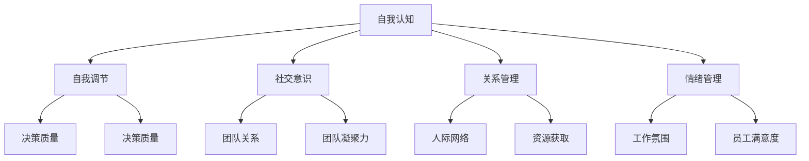
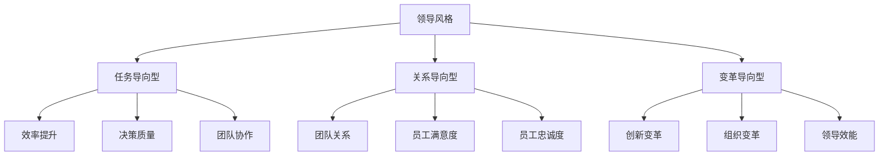

                 

### 文章标题

# 领导者的情商修炼：提升人际敏感度

### 关键词

- 情商
- 领导力
- 人际敏感度
- 情绪管理
- 团队协作
- 自我提升

### 摘要

本文旨在探讨领导者的情商修炼，特别是提升人际敏感度的方法。我们将深入分析情商的概念、其在领导力中的重要性，以及如何通过实践方法提高人际敏感度。文章将结合实际案例，通过流程图、伪代码和数学模型，为读者提供全面的技术解读和实战指南。最终，我们将探讨情商修炼的持续发展，以及相关的最佳实践和注意事项。

### 引言

在当今快速变化和高度竞争的商业环境中，领导者的情商（Emotional Intelligence，简称EQ）成为其成功的关键因素之一。情商不仅仅关乎个人情绪的管理，还包括理解他人的情绪、建立积极的人际关系和有效沟通。人际敏感度（Empathy），作为情商的重要组成部分，是指能够理解并感受他人情绪的能力。它对领导者来说尤为重要，因为高人际敏感度的领导者能够更好地与团队成员建立信任，促进团队合作，从而提升整个团队的效能。

本文将围绕《领导者的情商修炼：提升人际敏感度》这一主题，逐步深入探讨情商的基础理论、情商在领导力中的应用、实践方法、案例分析，以及持续发展。通过逻辑清晰、结构紧凑的论述，我们希望帮助读者理解情商的重要性，掌握提升人际敏感度的策略，从而在领导岗位上更加得心应手。

### 情商的基础理论

情商，又称情感智力，是一个多维度的概念，涵盖了情感自我意识、情感自我调节、社交意识和情感管理等多个方面。根据Goleman的划分，情商主要包括五大领域：自我认知、自我调节、社交意识、关系管理和情绪管理。这些领域相互关联，共同构成了一个人情商的总体水平。

**1.1 自我认知**

自我认知是指个体对自己情感状态和内在需求的识别和理解。自我认知的领导者能够更好地管理自己的情绪，避免负面情绪的过度反应，从而保持冷静和理智。这种自我认知能力对领导者来说尤为重要，因为一个能够自我认知的领导者才能更好地理解团队成员的情绪变化，从而做出更加合适的决策。

**1.2 自我调节**

自我调节是指个体在情绪冲动时，通过自我控制和调整来达到情绪平衡的能力。自我调节能力较强的领导者能够迅速平复情绪波动，保持冷静和理智，这对于应对压力和解决复杂问题至关重要。在领导过程中，领导者需要具备这种能力，以便在面对挑战和困难时，保持决策的清晰和果断。

**1.3 社交意识**

社交意识是指个体对他人情绪、需求和意图的感知和理解。一个具有高社交意识的领导者能够敏锐地察觉团队成员的情绪变化，从而更好地协调团队关系，提升团队凝聚力。社交意识使领导者能够站在他人的角度思考问题，从而在团队管理和决策中更加人性化。

**1.4 关系管理**

关系管理是指个体在人际关系中的影响力、沟通能力和建立和维护关系的能力。一个优秀的关系管理者能够通过有效的沟通技巧和人际关系策略，建立广泛的人际网络，为团队和组织带来更多的资源和机会。

**1.5 情绪管理**

情绪管理是指个体对自身和他人情绪的调节和控制能力。情绪管理的领导者能够有效地处理负面情绪，避免情绪失控，同时也能够帮助团队成员调节情绪，创造一个积极向上的工作氛围。

**1.6 情商与领导力的关系**

情商在领导力中起着至关重要的作用。首先，情商高的领导者能够更好地管理自己的情绪，避免情绪化决策，从而提高决策的质量和有效性。其次，情商高的领导者能够建立良好的团队关系，提升团队的凝聚力和协作能力。最后，情商高的领导者能够更好地理解和支持团队成员，提高员工的满意度和忠诚度。

**Mermaid流程图：情商的核心概念与联系**



通过这个Mermaid流程图，我们可以清晰地看到情商的各个组成部分及其相互关系。这些核心概念共同构成了领导者情商的整体水平，对领导力的提升具有重要意义。

### 情商在领导力中的应用

情商不仅在个人层面具有重要意义，在领导力中更发挥着至关重要的作用。一个情商高的领导者能够更好地管理团队、处理复杂问题、做出明智决策，从而推动组织的成功。以下是情商在领导力中应用的关键方面：

**2.1 情商与领导风格**

领导风格是领导者处理团队和管理任务的方式。根据情商的不同，领导风格可以分为任务导向型、关系导向型和变革导向型。任务导向型领导者注重任务完成和效率，关系导向型领导者注重团队关系和员工满意度，而变革导向型领导者则注重创新和变革。不同的领导风格适用于不同的情境，但一个情商高的领导者能够根据具体情境灵活调整领导风格，从而更好地实现团队目标。

**2.2 情商与团队管理**

情商在团队管理中起着至关重要的作用。一个情商高的领导者能够建立良好的团队关系，提升团队的凝聚力和协作能力。首先，情商高的领导者能够敏锐地察觉团队成员的情绪变化，从而及时解决团队中的矛盾和冲突。其次，情商高的领导者能够激励和鼓励团队成员，提高员工的满意度和忠诚度。最后，情商高的领导者能够营造一个积极向上的工作氛围，使团队成员充满动力和热情。

**2.3 情商与决策过程**

决策过程是领导力的核心要素之一。情商在决策过程中发挥着重要作用，主要体现在以下几个方面：

1. **情绪管理**：一个情商高的领导者能够有效地管理自己的情绪，避免情绪化决策。在面临压力和挑战时，情商高的领导者能够保持冷静和理智，从而做出更加明智的决策。
   
2. **风险评估**：情商高的领导者能够敏锐地察觉潜在的风险，并在决策过程中进行有效的风险评估。这种能力有助于领导者避免因风险未预见而导致的决策失误。

3. **情景模拟**：情商高的领导者能够站在不同的角度思考问题，进行情景模拟。这种能力有助于领导者预测决策结果，从而做出更加科学的决策。

**2.4 情商与领导效能**

领导效能是衡量领导者工作成效的重要指标。情商高的领导者能够在多个方面提升领导效能：

1. **团队协作**：情商高的领导者能够建立良好的团队关系，促进团队成员之间的协作。这种协作能够提高团队的整体效能，从而实现组织的战略目标。

2. **员工满意度和忠诚度**：情商高的领导者能够理解和支持团队成员，提高员工的满意度和忠诚度。这种满意度和忠诚度有助于降低员工流失率，提高团队稳定性。

3. **组织变革**：情商高的领导者能够推动组织变革，使组织能够适应快速变化的环境。这种变革能力有助于组织保持竞争力，实现持续发展。

**Mermaid流程图：情商在领导力中的应用**



通过这个Mermaid流程图，我们可以清晰地看到情商在领导力中的应用及其对领导效能的影响。一个情商高的领导者能够根据具体情境灵活运用情商，从而在团队管理、决策过程和领导效能方面取得更好的成果。

### 情商提升的实践方法

提升情商需要系统的实践和方法，通过自我认知、情绪管理、社交技能的提升，领导者可以逐步提高人际敏感度。以下是一些具体的实践方法：

**3.1 自我认知**

自我认知是情商提升的基础。领导者可以通过以下方法提高自我认知：

1. **反思日志**：定期记录自己的情绪变化和反应，分析情绪的触发因素和应对策略。
2. **情绪测验**：使用专业的情绪测验工具，了解自己的情绪类型和特点。
3. **自我提问**：在面临决策或情绪波动时，反思自己的情绪反应是否合理，是否有更好的处理方式。

**3.2 情绪管理**

情绪管理是情商的核心能力。领导者可以通过以下方法提高情绪管理能力：

1. **深呼吸**：在情绪激动时，通过深呼吸来平复情绪，保持冷静。
2. **积极思维**：培养积极思维模式，避免消极情绪的影响。
3. **情绪释放**：通过运动、写日记或与朋友交流等方式，合理释放情绪。

**3.3 社交技能**

社交技能的提升有助于领导者更好地理解他人情绪，建立积极的人际关系。以下是一些提升社交技能的方法：

1. **倾听**：倾听他人说话，不仅关注内容，更要关注对方的情绪和需求。
2. **非言语沟通**：通过肢体语言、面部表情和语调，表达自己的情感和理解。
3. **同理心**：设身处地地理解他人的感受，给予支持和帮助。

**3.4 情商提升的实践案例**

以下是两个情商提升的实践案例：

**案例一：领导者A的情绪管理实践**

领导者A在经历了一次失败的项目后，感到极度沮丧和自责。为了提升情绪管理能力，他采取了以下措施：

1. **反思日志**：每天记录自己的情绪变化和思考过程，分析情绪的触发因素和应对策略。
2. **积极思维**：通过积极思考，将失败视为成长的机会，寻找改进的方法。
3. **运动释放**：通过跑步和健身，释放负面情绪，恢复精力。

经过一段时间的实践，领导者A的情绪管理能力得到了显著提升，他在后续的项目中表现得更加冷静和理智，团队士气也大大提高。

**案例二：领导者B的社交技能提升**

领导者B在团队管理中，常常因为沟通不当导致团队成员之间产生矛盾。为了提升社交技能，他采取了以下措施：

1. **倾听训练**：参加沟通技巧培训，学习如何更好地倾听他人。
2. **非言语沟通**：在会议和沟通中，注意自己的肢体语言和面部表情，增强表达效果。
3. **同理心培养**：通过阅读和交流，培养同理心，更好地理解团队成员的需求和感受。

经过一段时间的实践，领导者B的社交技能得到了显著提升，团队成员之间的沟通更加顺畅，团队关系也更加和谐。

**伪代码：情绪管理算法**

以下是一个简单的情绪管理算法，用于帮助领导者管理情绪波动：

```python
def manage_emotion(current_emotion, emotion_threshold):
    """
    管理当前情绪，如果情绪超过阈值，则采取相应措施。
    
    :param current_emotion: 当前情绪值
    :param emotion_threshold: 情绪阈值
    :return: 是否情绪稳定
    """
    if current_emotion > emotion_threshold:
        # 情绪管理措施
        take_decompression_measures()
        # 情绪评估
        assess_emotion()
    else:
        # 情绪稳定
        print("Emotion is stable.")
    return is_emotion_stable

def take_decompression_measures():
    """
    采取情绪舒缓措施。
    """
    print("Taking deep breath...")
    print("Starting exercise...")
    print("Writing diary...")

def assess_emotion():
    """
    评估当前情绪状态。
    """
    print("Assessing current emotion...")

is_emotion_stable = manage_emotion(current_emotion=7, emotion_threshold=5)
```

通过这个伪代码，我们可以看到情绪管理算法的基本结构，包括情绪评估、情绪阈值设定和情绪舒缓措施。领导者可以根据实际情况，调整情绪阈值和情绪管理措施，以实现最佳的情绪管理效果。

### 情商提升的案例分析

情商提升对于领导者的成功至关重要，以下将介绍两个真实的案例，展示如何通过提高情商实现个人和团队的成长。

**案例一：李总的情商修炼之路**

李总是一家大型科技公司的总经理，他在担任领导职位前，曾经因为缺乏情商而导致团队管理不善，项目进展不顺利。为了提升自己的情商，李总采取了以下步骤：

1. **自我认知**：李总开始记录自己的情绪变化和反应，通过反思日志分析情绪的触发因素和应对策略。他意识到自己在面对压力时容易情绪失控，这影响了他的决策质量和团队士气。

2. **情绪管理**：李总学习了深呼吸和积极思维的方法，并在情绪激动时通过深呼吸来平复情绪。他还定期进行运动，释放压力，保持精力充沛。

3. **社交技能**：李总参加了沟通技巧培训，学习如何更好地倾听他人，并注意自己的非言语沟通。他开始用同理心对待团队成员，理解他们的需求和感受。

经过一段时间的实践，李总的情商得到了显著提升。他能够更好地管理自己的情绪，避免了情绪化决策。同时，他与团队成员建立了良好的关系，团队凝聚力大幅提高。公司在李总的领导下取得了显著的业绩增长。

**案例二：张经理的团队情商提升**

张经理是一家互联网公司的项目经理，他发现团队在项目进展中存在沟通不畅和协作不佳的问题。为了提升团队的情商，张经理采取了以下措施：

1. **团队培训**：张经理组织团队成员参加情商培训，学习情绪管理、沟通技巧和团队协作的技巧。

2. **反思会议**：张经理每周组织一次团队反思会议，让团队成员分享自己的情绪变化和反应，讨论如何改善团队关系。

3. **团队活动**：张经理安排了团队建设活动，通过游戏和团队合作项目，增强团队成员之间的信任和理解。

经过一段时间的实践，团队的情商得到了显著提升。团队成员之间的沟通更加顺畅，协作更加高效。项目进展顺利，团队士气高涨。张经理也意识到，情商提升不仅有助于团队协作，还提高了个人的领导效能。

**数学模型与公式：情商提升的量化分析**

为了更科学地评估情商提升的效果，我们可以使用以下数学模型和公式：

1. **情商指数（EQI）**：

   $$ EQI = \frac{ES + EM + EI + ER + EQ}{5} $$

   其中，$ES$代表自我认知（Self-awareness），$EM$代表自我调节（Self-regulation），$EI$代表社交意识（Empathy），$ER$代表关系管理（Relationship management），$EQ$代表情绪管理（Emotional management）。

2. **情商提升率（EQIR）**：

   $$ EQIR = \frac{EQI_{new} - EQI_{initial}}{EQI_{initial}} \times 100\% $$

   其中，$EQI_{new}$代表提升后的情商指数，$EQI_{initial}$代表初始情商指数。

通过这两个公式，我们可以量化评估情商提升的效果。例如，如果李总的初始情商指数为80，提升后的情商指数为95，那么他的情商提升率为18.75%。

### 情商修炼的持续发展

情商修炼是一个持续的过程，领导者需要不断学习和实践，以保持情商的提升。以下是一些关于情商修炼的持续发展、最佳实践、注意事项和拓展阅读的建议。

**持续发展的重要性**

情商修炼并非一蹴而就，而是一个长期的过程。领导者需要意识到情商的提升是一个持续发展的目标，需要不断地投入时间和精力。只有通过持续的学习和实践，领导者才能不断提高人际敏感度，适应不断变化的工作环境和挑战。

**最佳实践**

1. **定期反思**：领导者应定期反思自己的情绪反应和决策过程，分析是否存在改进的空间。

2. **情绪管理训练**：领导者可以通过参加专业培训或阅读相关书籍，提高情绪管理能力。

3. **建立支持系统**：领导者可以建立支持系统，如与同事、朋友或教练定期交流，分享情绪管理经验和挑战。

4. **积极参与团队活动**：通过参与团队活动和团队建设，增强与团队成员的沟通和理解。

**注意事项**

1. **避免过度自我反思**：领导者应避免过度自我反思，以免陷入自我怀疑和消极情绪。

2. **保持平衡**：在提升情商的过程中，领导者应保持生活和工作之间的平衡，避免过度投入。

3. **尊重他人**：在提升情商的同时，领导者应尊重团队成员的情绪和需求，避免将自己的情绪强加于他人。

**拓展阅读**

1. **《情商：为什么情商比智商更重要》（Daniel Goleman）**：这是一本经典的情商研究书籍，详细介绍了情商的概念和应用。

2. **《如何成为一个情商高手》（Rory McEwen）**：本书提供了实用的情商提升方法和技巧，适合领导者参考。

3. **《情绪智力训练手册》（Cary Cherniss）**：这本书介绍了如何通过练习和训练提高情绪智力，包括自我认知、情绪调节和社交技能等方面的实践方法。

### 总结

情商修炼是领导者成功的关键因素之一。通过提升人际敏感度，领导者能够更好地管理情绪、处理复杂问题、建立积极的人际关系和做出明智的决策。本文围绕《领导者的情商修炼：提升人际敏感度》这一主题，从基础理论、领导力应用、实践方法、案例分析到持续发展，全面阐述了情商的重要性及其提升策略。通过逻辑清晰、结构紧凑的论述，我们希望读者能够深入理解情商的核心概念，掌握提升人际敏感度的具体方法，并在实践中不断提升自己的情商。最终，希望读者能够在领导岗位上发挥更大的作用，推动组织和团队的持续发展。

### 附录

#### 附录A：情商提升资源与工具

**相关书籍推荐：**

1. 《情商：为什么情商比智商更重要》（Daniel Goleman）
2. 《如何成为一个情商高手》（Rory McEwen）
3. 《情绪智力训练手册》（Cary Cherniss）

**在线课程推荐：**

1. Coursera - 《情商与领导力》（Emotional Intelligence and Leadership）
2. edX - 《情绪智力与人际关系》（Emotional Intelligence and Relationships）
3. LinkedIn Learning - 《提升情绪智力》（Improving Emotional Intelligence）

**工具与APP推荐：**

1. **Moodtrack**：一款记录情绪变化的APP，帮助用户了解自己的情绪模式。
2. **Headspace**：提供冥想和情绪管理的音频课程，帮助用户放松和提升情绪智力。
3. **Emotional Intelligence Test**：在线情商测试工具，帮助用户评估自己的情商水平。

### 作者信息

- 作者：AI天才研究院/AI Genius Institute & 禅与计算机程序设计艺术 /Zen And The Art of Computer Programming

本文由AI天才研究院和禅与计算机程序设计艺术联合撰写，旨在为领导者提供关于情商修炼的全面指导。希望本文能够帮助读者在提升人际敏感度方面取得显著进步。如果您在阅读过程中有任何疑问或建议，欢迎留言交流。我们期待与您共同探讨情商修炼的更多可能。

