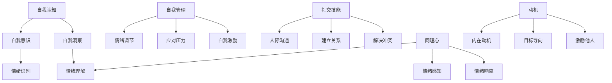
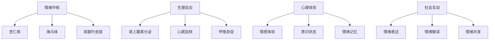
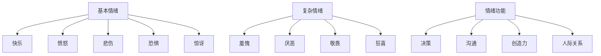
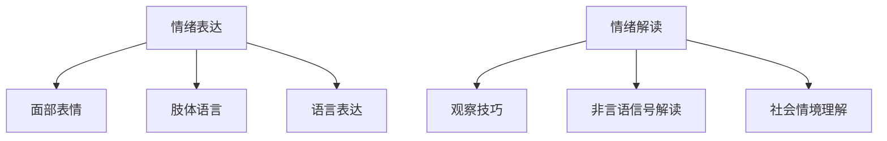
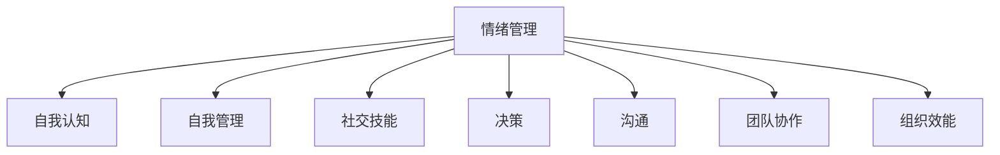

                 

# 领导者的情商：理解和管理情绪

关键词：
- 领导者
- 情商
- 情绪管理
- 领导力
- 组织效能

摘要：
本文旨在探讨领导者情商的重要性及其在管理情绪、提升领导力和组织效能方面的应用。通过分析情商的核心要素，如自我认知、自我管理和社交技能，本文揭示了情商在领导者角色中的关键作用。同时，本文还将探讨情绪的本质、情商提升策略以及情商在领导实践中的挑战与应对。最后，通过案例分析，本文将展示情商在提升团队士气、有效沟通与冲突解决以及危机管理中的应用。

## 第1章 引言

### 1.1 为什么领导者需要情商

领导者的角色不仅仅是下达指令和监督执行，更是引导团队、激发潜能、解决冲突和推动创新的关键人物。领导者需要具备较高的情商，才能更好地应对复杂多变的工作环境和人际关系。情商（Emotional Intelligence，简称EQ）是指个体识别、理解、管理自己和他人的情绪，并使用情绪促进思考、沟通和决策的能力。研究表明，情商对领导者的表现和组织效能具有显著影响。

首先，领导者具备较高的自我认知和自我管理能力，能够更好地调节情绪，减少负面情绪对决策和行为的负面影响。其次，领导者拥有良好的社交技能，能够建立积极的人际关系，促进团队协作和沟通。此外，情商高的领导者更能够理解和应对团队成员的情绪，提高员工的工作满意度和忠诚度。

### 1.2 情商的定义与构成

情商由心理学家丹尼尔·戈尔曼（Daniel Goleman）于1995年首次提出，他认为情商包括五个核心要素：自我认知、自我管理、社交技能、同理心和动机。以下是这五个要素的简要说明：

1. **自我认知**：指个体能够认识到自己情绪的存在，并理解情绪对行为和决策的影响。
2. **自我管理**：指个体能够调节情绪，使其不影响工作表现和人际关系。
3. **社交技能**：指个体在社交场合中的沟通、建立关系和解决冲突的能力。
4. **同理心**：指个体能够理解和感受他人的情绪，并据此调整自己的行为。
5. **动机**：指个体能够使用情绪激励自己，追求目标并克服困难。

### 1.3 情商在领导力中的重要性

情商在领导力中扮演着至关重要的角色。首先，情商高的领导者能够更好地理解自己和团队成员的情绪，从而提高团队凝聚力和工作效率。其次，情商高的领导者能够有效地沟通和解决问题，降低冲突发生的概率。此外，情商高的领导者能够更好地应对压力和挑战，提高决策质量和组织效能。

总之，情商是领导者必备的素质之一，它不仅影响个人的领导力，也直接关系到组织的发展和成功。在接下来的章节中，我们将进一步探讨情商的核心要素、情绪的本质以及情商提升策略。

## 第2章 情商的核心要素

情商（Emotional Intelligence，简称EQ）由丹尼尔·戈尔曼（Daniel Goleman）提出，包括自我认知、自我管理、社交技能、同理心和动机五大要素。这些要素共同构成了领导者的情绪智慧，对提升领导力和组织效能具有重要意义。

### 2.1 自我认知

自我认知是指领导者对自己情绪的识别和理解。它是情商的基础，有助于领导者意识到情绪对自己的行为和决策产生的影响。

**核心概念与联系：**

**自我意识**：自我意识是指领导者意识到自己情绪的存在，能够准确识别和命名自己的情绪状态。例如，当领导者感到焦虑时，能够意识到自己正经历这种情绪。

**自我洞察**：自我洞察是指领导者深入理解情绪的本质和原因，包括情绪产生的过程、情绪对行为和决策的影响等。通过自我洞察，领导者能够更好地理解情绪背后的动机和需求。

**自我管理**：自我管理是指领导者能够调节情绪，使其不影响工作表现和人际关系。具体包括情绪调节、应对压力和自我激励等方面。

**情绪调节**：情绪调节是指领导者在面对负面情绪时，能够采取有效策略来缓解情绪压力。例如，通过深呼吸、冥想或运动等方式来放松身心。

**应对压力**：领导者经常面临各种压力，如工作压力、人际关系压力等。应对压力的能力决定了领导者的情绪稳定性和决策质量。

**自我激励**：自我激励是指领导者能够激发自己的内在动力，追求目标并克服困难。自我激励不仅有助于提高个人绩效，还能够影响团队士气和团队目标达成。

### 2.2 自我管理

自我管理是情商的核心要素之一，涉及领导者如何调节情绪、应对压力以及自我激励。

**情绪调节**：情绪调节是指领导者在面对负面情绪时，能够采取有效策略来缓解情绪压力。例如，通过深呼吸、冥想或运动等方式来放松身心。

**应对压力**：领导者经常面临各种压力，如工作压力、人际关系压力等。应对压力的能力决定了领导者的情绪稳定性和决策质量。

**自我激励**：自我激励是指领导者能够激发自己的内在动力，追求目标并克服困难。自我激励不仅有助于提高个人绩效，还能够影响团队士气和团队目标达成。

### 2.3 社交技能

社交技能是指领导者在与他人互动过程中，如何进行有效的沟通、建立关系和解决冲突。

**人际沟通**：人际沟通是指领导者如何通过语言和非语言手段与他人进行有效交流，传达信息、观点和感受。

**建立关系**：建立关系是指领导者如何与他人建立信任和合作关系，促进团队合作和共同目标的实现。

**解决冲突**：解决冲突是指领导者如何在冲突发生时，采取有效策略来化解分歧，恢复和谐的人际关系。

### 2.4 同理心

同理心是指领导者能够理解和感受他人的情绪，并据此调整自己的行为。同理心包括情绪感知、情绪响应和情绪理解。

**情绪感知**：情绪感知是指领导者能够识别和理解他人的情绪状态，包括面部表情、语言和肢体语言等。

**情绪响应**：情绪响应是指领导者能够根据他人的情绪状态，采取适当的反应和行动，以缓解对方的情绪压力。

**情绪理解**：情绪理解是指领导者能够深入理解他人情绪背后的原因和动机，从而更好地与他人沟通和合作。

### 2.5 动机

动机是指领导者能够使用情绪激励自己和他人，追求目标并克服困难。动机包括内在动机、目标导向和激励他人。

**内在动机**：内在动机是指领导者能够从内心感受到工作本身的乐趣和价值，从而自我驱动，追求卓越。

**目标导向**：目标导向是指领导者能够将情绪转化为目标导向的行为，追求短期和长期目标的实现。

**激励他人**：激励他人是指领导者能够激发团队成员的内在动力，促进团队成员的积极行为和绩效提升。

综上所述，情商的核心要素相互关联，共同构成了领导者的情绪智慧。领导者通过提升自我认知、自我管理、社交技能、同理心和动机，可以更好地理解和管理情绪，提升领导力和组织效能。

## 第3章 理解情绪

情绪是人的心理体验和生理反应的复杂组合，它不仅影响我们的行为和决策，还影响着人际关系和组织效能。理解情绪的本质、类型及其在领导力中的重要性，是提升情商的基础。

### 3.1 情绪的本质

情绪的本质是一个多维度的概念，涉及生理、心理和社会层面。从生理层面来看，情绪与大脑的神经活动密切相关。情绪中枢位于大脑的边缘系统，包括杏仁核、海马体和前额叶皮层等。这些区域负责处理和调节情绪。

**核心概念与联系：**

**生理反应**：生理反应是情绪在身体层面的表现，如肾上腺素分泌、心跳加快、呼吸急促等。这些生理变化是情绪调节的重要途径。

**心理体验**：心理体验是情绪在主观层面的感受，包括情感体验、意识状态和情绪记忆。情感体验是情绪的核心，意识状态反映了个体对情绪的认知和意识水平，情绪记忆则影响了个体对未来事件的情绪反应。

**社会互动**：社会互动是情绪在人际层面上的表现，包括情绪表达、情绪解读和情绪共享。情绪表达涉及如何通过语言、肢体动作和面部表情等非言语手段传递情绪信息。情绪解读是指个体理解和解读他人情绪的能力。情绪共享是指个体与他人共享情绪体验，从而建立信任和紧密关系。

### 3.2 情绪的类型与功能

情绪可以分为基本情绪和复杂情绪。基本情绪包括快乐、愤怒、悲伤、恐惧和惊讶等。这些情绪具有普遍性和跨文化的一致性。复杂情绪则是由基本情绪组合或混合而成的情绪，如羞愧、厌恶、敬畏和狂喜等。

**核心概念与联系：**

**情绪功能**：情绪在个体行为和认知中发挥着重要作用。首先，情绪是决策的重要参考因素。情绪能够提供关于情境的重要信息，帮助个体做出更明智的决策。其次，情绪在沟通中扮演关键角色，通过情绪的表达和理解，个体能够更好地传达信息和建立关系。此外，情绪还能激发创造力，因为情绪变化往往引发新的思维模式和观点。最后，情绪对人际关系具有显著影响，积极的情绪能够促进合作和信任，而消极的情绪则可能引发冲突和疏远。

### 3.3 情绪的表达与解读

情绪的表达与解读是情绪互动的核心环节。情绪表达是指个体如何通过言语和非言语手段传达自己的情绪。情绪解读是指个体如何理解和解释他人的情绪。

**核心概念与联系：**

**情绪表达**：情绪表达可以通过面部表情、肢体语言和语言表达来实现。面部表情是最直接的情绪表达方式，如笑容、皱眉等。肢体语言则包括姿势、手势和眼神等。语言表达是通过言语内容、语调和语气来传达情绪。

**情绪解读**：情绪解读需要观察技巧、非言语信号解读和社会情境理解。观察技巧是指通过仔细观察他人的面部表情、肢体动作和语调等，来识别情绪。非言语信号解读是指理解他人非言语行为背后的情绪含义。社会情境理解是指在不同情境中，理解他人情绪的含义和背景。

### 3.4 情绪的影响因素

情绪受到多种因素的影响，包括生理因素、心理因素和社会因素。

**生理因素**：生理因素包括遗传、神经系统和生理反应等。遗传因素影响个体的情绪反应倾向。神经系统，特别是边缘系统和前额叶皮层，在情绪调节中起着关键作用。生理反应，如心跳加快、呼吸急促等，也会影响情绪体验。

**心理因素**：心理因素包括认知、记忆和自我认知等。认知过程影响个体对情绪的理解和解释。记忆会影响个体对未来情绪的反应。自我认知则帮助个体识别和理解自己的情绪。

**社会因素**：社会因素包括文化、社会环境和人际关系等。文化差异影响情绪的表达和解读方式。社会环境，如组织氛围和社交场合，也会影响情绪体验。人际关系则通过情绪互动和情绪支持，影响个体的情绪状态。

### 3.5 情绪管理的重要性

情绪管理是情商的重要组成部分，它不仅影响个体的心理健康和生活质量，还对领导者的领导效能和组织文化产生深远影响。

**核心概念与联系：**

**情绪管理的重要性**：情绪管理有助于领导者更好地应对压力和挑战，提高决策质量和团队协作能力。通过情绪管理，领导者能够建立积极的人际关系，促进组织内部的沟通与合作，从而提升组织效能。

总之，理解情绪的本质、类型及其在领导力中的重要性，是提升情商的基础。领导者通过了解情绪的影响因素和管理策略，可以更好地应对情绪挑战，提升领导力和组织效能。

### 3.6 情绪管理的策略与方法

情绪管理是情商的核心要素之一，它不仅关乎个人的心理健康，还直接影响到领导者的决策质量、团队协作和组织效能。有效的情绪管理策略和方法，可以帮助领导者更好地应对压力和挑战，提升自身的情绪智慧。

#### 3.6.1 情绪识别

情绪识别是情绪管理的第一步，它要求领导者能够准确识别和理解自己和他人的情绪状态。以下是一些情绪识别的策略和方法：

1. **自我反思**：领导者可以通过日记、冥想或心理咨询等方式，定期进行自我反思，识别和理解自己的情绪。这种方法有助于提升自我认知，从而更好地管理情绪。

2. **情绪量表**：使用情绪量表，如正面情绪量表（PAI）或负面情绪量表（NEMO），可以帮助领导者更客观地评估自己的情绪状态。

3. **情绪日志**：领导者可以记录每天的情绪变化，包括情绪的类型、强度和发生情境。通过分析情绪日志，领导者可以更好地了解情绪的规律和触发因素。

#### 3.6.2 情绪接受

情绪接受是指领导者能够接纳自己的情绪，而不是抗拒或压抑。以下是一些情绪接受的方法：

1. **情绪宣泄**：通过写日记、运动或与他人倾诉等方式，领导者可以宣泄负面情绪，从而减轻情绪压力。

2. **情绪释放**：领导者可以通过深呼吸、冥想或瑜伽等放松技巧，释放情绪能量，缓解心理压力。

3. **情绪同理**：领导者可以通过同理心，理解他人的情绪，从而更好地接受自己的情绪。同理心有助于领导者建立更紧密的人际关系，增强情绪接受能力。

#### 3.6.3 情绪调节

情绪调节是情绪管理的关键环节，它涉及到领导者如何调节情绪，使其不影响工作表现和人际关系。以下是一些情绪调节的方法：

1. **认知重构**：领导者可以通过认知重构，改变对情境的认知和解释，从而调节情绪。例如，将挑战视为成长机会，而不是威胁。

2. **情绪放松**：领导者可以通过深呼吸、冥想或渐进性肌肉放松等方法，放松身心，缓解情绪压力。

3. **情绪聚焦**：领导者可以将注意力从负面情绪转移到积极情绪上，例如，通过回忆积极经历或设定积极目标。

#### 3.6.4 情绪释放

情绪释放是指领导者通过有效的方式，将负面情绪转化为积极的能量。以下是一些情绪释放的方法：

1. **艺术表达**：领导者可以通过绘画、音乐或舞蹈等方式，表达和释放情绪。

2. **运动释放**：通过有氧运动、瑜伽或武术等身体活动，领导者可以释放情绪能量，提升身心健康。

3. **心理咨询**：领导者可以通过心理咨询，与专业心理师探讨和处理情绪问题，从而实现情绪释放。

#### 3.6.5 情绪智慧培养

情绪智慧是领导者情绪管理的核心，它包括自我认知、自我管理、社交技能、同理心和动机。以下是一些培养情绪智慧的方法：

1. **持续学习**：领导者可以通过阅读相关书籍、参加培训课程或工作坊，持续提升自己的情绪智慧。

2. **实践应用**：领导者可以将情绪管理策略应用到实际工作中，通过实践提升情绪智慧。

3. **反馈与改进**：领导者可以通过定期自我反思和接受他人反馈，识别情绪管理的优势和不足，并不断改进。

总之，情绪管理是领导者提升情商的重要途径。通过情绪识别、接受、调节和释放，领导者可以更好地理解和管理情绪，提升领导力和组织效能。同时，持续培养情绪智慧，将有助于领导者应对复杂多变的工作环境和人际关系，实现个人和组织的共同发展。

## 第4章 情商提升策略

情商的提升是一个长期的过程，需要领导者通过不断的学习和实践来培养和提高。在这一章节中，我们将探讨情商提升的几种策略，包括个人成长、情商培养方法和领导力发展。

### 4.1 个人成长

个人成长是提升情商的基础。领导者需要通过自我反思和持续学习来提升自我认知和情绪智慧。

**自我反思**：自我反思是领导者提升情商的重要方法。通过定期记录自己的想法、行为和情绪，领导者可以更好地了解自己的情绪状态和行为模式。以下是一些自我反思的技巧：

1. **写日记**：写日记可以帮助领导者记录每天的思考和情绪变化，从而进行深入反思。
2. **定期回顾**：领导者可以定期回顾自己的行为和决策，分析其成功和失败的原因，从而改进自己的情绪管理方法。

**持续学习**：领导者需要通过阅读、参加培训课程或工作坊来持续学习，提升自己的情绪智慧。以下是一些建议：

1. **阅读相关书籍**：如《情商》（Emotional Intelligence）和《非暴力沟通》（Nonviolent Communication）等，可以帮助领导者理解情绪的本质和提升情绪管理技能。
2. **参加培训课程**：参加情商相关的培训课程，如情绪管理培训、同理心训练等，可以系统地提升领导者的情绪智慧。

### 4.2 情商培养方法

情商培养方法包括情绪管理训练、社交技能培养和领导力发展。以下是一些具体的方法：

**情绪管理训练**：情绪管理训练旨在帮助领导者更好地识别、接受和调节情绪。以下是一些训练方法：

1. **冥想**：冥想可以帮助领导者放松身心，提高情绪调节能力。通过定期练习，领导者可以更好地管理压力和负面情绪。
2. **正念练习**：正念练习强调专注于当下，有助于领导者减少情绪干扰，提高情绪反应的觉察和调节能力。

**社交技能培养**：社交技能是情商的重要组成部分，它包括人际沟通、建立关系和解决冲突。以下是一些培养方法：

1. **有效沟通**：领导者可以通过学习有效沟通技巧，如积极倾听、清晰表达和恰当的非言语沟通，提高人际沟通能力。
2. **建立关系**：领导者可以通过积极参与团队活动、关注员工需求和提供支持，建立积极的人际关系。

**解决冲突**：解决冲突是领导者必须具备的一项重要能力。以下是一些解决冲突的方法：

1. **同理心**：领导者可以通过同理心来理解员工的情绪和需求，从而更好地解决冲突。
2. **双赢策略**：领导者可以采取双赢策略，寻求解决冲突的双方都能接受的方案。

### 4.3 领导力发展

领导力发展是提升情商的重要途径。领导者需要通过实践和反思，不断提升自己的领导力和情绪智慧。

**实践应用**：领导者需要在实际工作中应用所学到的情绪管理技巧和社交技能。以下是一些建议：

1. **团队建设**：领导者可以通过团队建设活动，增强团队凝聚力和信任，提升团队情绪智慧。
2. **反馈与支持**：领导者可以定期给予团队成员反馈，并提供支持和指导，帮助他们提升情绪管理和领导力。

**反馈与改进**：领导者需要不断反思自己的行为和决策，接受团队成员和下属的反馈，并根据反馈进行改进。以下是一些反馈与改进的方法：

1. **定期反思**：领导者可以定期进行自我反思，评估自己在情绪管理和领导力方面的表现。
2. **接受反馈**：领导者需要勇于接受他人的反馈，并将其视为提升自己的重要机会。

总之，情商的提升是一个长期的过程，需要领导者通过个人成长、情商培养方法和领导力发展等多种途径来不断学习和实践。通过不断提升情商，领导者可以更好地理解和管理情绪，提升领导力和组织效能，实现个人和组织的共同发展。

## 第5章 领导者情商应用

情商在领导实践中的应用至关重要，它不仅影响领导者的个人表现，还对团队和组织的整体效能产生深远影响。本章节将探讨情商在决策、团队管理和沟通中的具体应用，以及如何通过提升情商来改善领导效能。

### 5.1 情商与决策

领导者在做出决策时，情商发挥着关键作用。情商高的领导者能够更好地管理自己的情绪，从而做出更为明智和有效的决策。

**情绪对决策的影响**：情绪在决策过程中起着重要作用。积极情绪，如乐观和自信，可以增强领导者的创造力和创新意识；而消极情绪，如焦虑和恐惧，可能会限制领导者的思考范围和创造力。情商高的领导者能够识别和管理自己的情绪，使其不会对决策产生负面影响。

**情商在决策中的应用**：以下是情商在决策中的应用策略：

1. **情绪调节**：在面临重要决策时，领导者可以通过深呼吸、冥想或进行体育锻炼等方式，调节自己的情绪，保持冷静和理智。

2. **情绪同理**：领导者可以通过同理心，理解团队成员的情绪反应，从而在决策过程中考虑更多的视角和影响。

3. **情绪智慧**：领导者可以利用情绪智慧，识别决策情境中的情绪因素，将其纳入决策模型，从而做出更为全面和合理的决策。

**案例分析**：某公司的CEO在面临是否扩大产品线的决策时，通过自我反思和情绪管理，意识到自己因过度担忧市场变化而倾向于保守。他运用同理心，与团队成员交流，了解他们的观点和担忧。最终，CEO结合情绪智慧和团队反馈，做出了扩大产品线的决策，并取得了成功。

### 5.2 情商与团队管理

团队管理是领导者的核心职责之一，情商在团队管理中的应用有助于提升团队凝聚力和协作效率。

**情商在团队管理中的应用**：

1. **情绪识别与理解**：领导者需要识别和理解团队成员的情绪状态，通过倾听和观察，了解团队成员的需求和困扰。

2. **情绪调节**：领导者需要帮助团队成员调节情绪，如通过团队建设活动、提供支持和鼓励等方式，缓解团队成员的压力和焦虑。

3. **情绪共享**：领导者可以通过与团队成员分享自己的情绪和经历，建立信任和紧密关系，促进团队内部的沟通和合作。

**案例分析**：某团队在面临项目进度压力时，团队氛围紧张，工作效率下降。团队领导者意识到团队成员的情绪问题，通过组织团队建设活动、定期反馈和沟通，缓解了团队成员的焦虑情绪，提升了团队凝聚力和工作效率。

### 5.3 情商与沟通

沟通是领导力的关键要素之一，情商在沟通中的应用有助于领导者建立有效的沟通渠道，促进信息的传递和理解。

**情商在沟通中的应用**：

1. **有效倾听**：领导者需要学会有效倾听，不仅关注言语内容，还要关注非言语信号和情感表达。通过同理心，领导者能够更好地理解对方的需求和情感。

2. **情绪表达**：领导者需要学会如何以积极和建设性的方式表达情绪，避免情绪冲动和负面情绪的表达对沟通产生负面影响。

3. **情绪管理**：领导者需要管理自己的情绪，避免情绪波动影响沟通效果。在面对冲突时，领导者需要保持冷静和理智，通过情绪调节策略来解决问题。

**案例分析**：在一次重要会议中，团队领导者意识到自己因情绪波动而影响了会议的进程和效果。通过自我反思和情绪管理，领导者调整了自己的情绪状态，以积极和建设性的方式引导会议，最终取得了良好的沟通效果。

### 5.4 提升情商以改善领导效能

提升情商是改善领导效能的关键途径。以下是一些具体策略：

1. **自我反思**：领导者需要定期进行自我反思，识别自己在情绪管理和领导力方面的优点和不足，从而制定改进计划。

2. **持续学习**：领导者需要通过阅读、培训和实践，不断学习新的情绪管理技巧和领导力知识。

3. **反馈与改进**：领导者需要接受来自团队成员和下属的反馈，并根据反馈进行改进。

4. **建立支持系统**：领导者可以建立支持系统，如与导师或同事交流，寻求指导和支持。

总之，情商在领导实践中的应用至关重要。领导者通过提升情商，可以更好地管理情绪、做出明智的决策、提升团队管理能力和改善沟通效果，从而实现个人和组织的共同发展。

### 第6章 情商挑战与应对

在领导者的情商提升过程中，可能会遇到多种挑战。这些挑战可能源于个人因素、组织环境和外部压力。了解这些挑战并找到有效的应对策略，对于领导者保持情绪智慧至关重要。

#### 6.1 情绪压力与应对

情绪压力是领导者常见的挑战之一，它可能来自工作负荷、人际关系冲突、职业发展压力等多方面。情绪压力如果不能有效管理，可能会影响领导者的决策质量、工作效率和心理健康。

**情绪压力的来源**：
1. **工作负荷**：领导者经常需要处理大量事务和复杂决策，这可能导致工作负荷增加，引发压力。
2. **人际关系**：与团队成员和下属的关系问题，如冲突和误解，可能引发情绪压力。
3. **职业发展**：追求职业目标和个人成长的过程中，可能会遇到挫折和不确定性，导致情绪压力。

**应对情绪压力的策略**：
1. **自我调节**：领导者可以通过深呼吸、冥想、运动等自我调节方法，缓解情绪压力。
2. **寻求支持**：领导者可以寻求来自同事、朋友或专业人士的支持，分享情绪压力，获得建议和帮助。
3. **时间管理**：合理规划时间，优先处理重要事务，避免过度工作，有助于减轻情绪压力。

**案例分析**：某公司的项目经理在承担新项目时，因工作负荷过大而感到压力巨大。通过定期进行冥想和运动，并寻求团队成员的支持，项目经理成功缓解了情绪压力，提高了工作效率。

#### 6.2 情商提升的障碍

尽管情商提升对领导者有重要意义，但在实际操作中，领导者可能会遇到多种障碍。

**个人认知的局限**：
1. **自我认知不足**：领导者可能缺乏对自身情绪和行为的深入理解，导致情绪管理困难。
2. **情感忽视**：领导者可能忽视情绪管理的重要性，认为情绪是个人隐私，不便于公开讨论。

**组织文化的制约**：
1. **竞争文化**：在一些竞争激烈的组织中，领导者可能面临来自同侪或上级的压力，不利于情商的提升。
2. **缺乏支持**：组织可能缺乏系统性的情商培训和支持，使领导者难以有效提升情商。

**教育与培训的不足**：
1. **缺乏系统培训**：领导者可能缺乏系统性的情商教育，不了解情绪管理的方法和技巧。
2. **培训效果不佳**：即使参与情商培训，领导者可能因为缺乏实践机会，而无法将所学应用到实际工作中。

**应对情商提升障碍的策略**：
1. **增强自我认知**：领导者可以通过自我反思、情绪日记等方式，提升自我认知，更好地理解和管理情绪。
2. **组织文化支持**：组织可以建立支持性文化，鼓励领导者公开讨论情绪问题，提供心理辅导和情商培训。
3. **持续学习与实践**：领导者应积极参加情商培训，并努力将所学应用到实际工作中，通过实践提升情商。

**案例分析**：某公司通过引入情商培训项目，为领导者提供系统的情商教育。参与培训的领导者不仅学到了情绪管理技巧，还通过团队合作和反思，提升了自我认知和情商水平。

总之，领导者提升情商的过程中，可能会面临情绪压力、个人认知局限、组织文化和教育培训等方面的挑战。通过了解这些挑战，并采取有效的应对策略，领导者可以更好地提升情商，实现个人和组织的共同发展。

## 第7章 案例分析

通过具体案例，我们可以更好地理解情商在领导实践中的实际应用。以下是一些成功案例和失败案例分析，旨在展示情商在提升团队士气、有效沟通与冲突解决以及危机管理中的应用。

### 7.1 情商在领导实践中的成功案例

**案例一：提升团队士气**

某公司的销售团队在过去一年中业绩不佳，团队士气低落。新上任的销售经理意识到，团队士气是影响业绩的关键因素。通过提升情商，他采取了一系列措施来提升团队士气。

1. **情感同理**：销售经理通过与团队成员深入交流，了解他们的情绪和需求。他关注员工的个人生活和职业发展，表达对员工的关心和支持。

2. **激励与认可**：销售经理通过定期表扬和奖励表现优秀的员工，增强员工的自信心和积极性。他还组织团队建设活动，增强团队凝聚力和归属感。

3. **情绪调节**：销售经理通过自我调节和情绪管理，保持积极的态度，带领团队走出低谷。他在面对困难时，能够冷静分析和解决问题，避免情绪波动影响团队士气。

**结果**：通过这些措施，销售团队的士气显著提升，员工的工作热情和创造力得到激发，业绩逐渐回升。

**案例二：有效沟通与冲突解决**

某科技公司的一个项目团队在项目进展过程中出现了严重的分歧，导致项目进展受阻。项目经理意识到，如果无法解决冲突，项目将面临失败的风险。他运用情商技巧，采取了以下措施：

1. **积极倾听**：项目经理在冲突发生时，积极倾听团队成员的观点和情绪，确保每个人都表达了自己的意见。

2. **同理心**：项目经理通过同理心，理解团队成员的情绪和需求，从而找到冲突的核心问题。

3. **双赢策略**：项目经理提出了双赢策略，鼓励团队成员共同寻找解决问题的方法。他通过平衡不同观点，找到了各方都能接受的解决方案。

**结果**：通过有效沟通和冲突解决，项目团队重新团结一致，项目进度得以恢复，最终成功完成了项目。

**案例三：危机管理**

某公司的生产线出现严重故障，导致生产停滞，公司面临重大经济损失。生产经理在危机面前，展示了高情商的管理能力。

1. **冷静应对**：生产经理在面对危机时，保持冷静，迅速分析故障原因和可能的影响。

2. **调动资源**：生产经理调动公司内部资源，迅速组织技术团队和外部供应商合作，共同解决故障。

3. **情绪疏导**：生产经理关注员工的情绪状态，提供心理支持和鼓励，确保员工在危机中保持积极和专注。

**结果**：通过有效的危机管理，生产经理成功解决了生产线故障，公司恢复了正常生产，避免了重大经济损失。

### 7.2 情商失败案例分析

**案例一：情绪失控导致团队分裂**

某公司的研发团队在项目开发过程中，因领导者情绪失控，导致团队分裂。领导者在面对项目困难时，表现出极度焦虑和愤怒，对团队成员进行严厉指责。

1. **情绪失控**：领导者因无法有效管理情绪，在团队中表现出情绪失控的行为，导致团队成员感到压力和不满。

2. **缺乏同理心**：领导者没有通过同理心来理解团队成员的情绪和需求，反而加剧了团队的分裂。

**结果**：团队士气低落，项目进度严重滞后，最终项目失败。

**案例二：缺乏情商导致决策失误**

某公司的市场经理在制定市场策略时，因缺乏情商，未能充分考虑团队成员的意见和情绪，导致策略失败。

1. **忽视员工意见**：市场经理在制定策略时，忽视团队成员的建议和意见，未能进行充分的团队讨论。

2. **缺乏同理心**：市场经理未能理解团队成员的情绪和需求，未能建立有效的沟通渠道。

**结果**：市场策略失败，公司损失了大量的市场份额和客户信任。

**案例三：情商不足导致领导力失败**

某公司的项目经理在项目管理过程中，因情商不足，未能有效处理团队冲突，导致项目失败。

1. **情绪管理困难**：项目经理在处理团队冲突时，表现出情绪管理困难，未能冷静分析和解决问题。

2. **缺乏同理心**：项目经理未能通过同理心来理解团队成员的情绪和需求，导致冲突加剧。

**结果**：项目进度严重滞后，团队士气低落，项目最终失败。

### 总结

通过以上案例可以看出，情商在领导实践中的应用具有显著的效果。情商高的领导者能够更好地管理情绪、解决冲突和应对危机，从而提升团队士气、决策质量和组织效能。相反，情商不足的领导者可能因为情绪失控、忽视员工意见或缺乏同理心，导致团队分裂、决策失误和领导力失败。因此，提升情商是领导者不可或缺的素质，它对个人和组织的成功具有重要意义。

## 第8章 总结与展望

情商作为领导者的一项关键素质，对其个人成长、团队管理、决策质量和组织效能具有深远的影响。通过提升情商，领导者可以更好地管理情绪、解决冲突、提高沟通效果，从而实现个人和组织的共同发展。以下是本篇博客的核心观点和未来发展趋势的总结。

### 8.1 情商在领导力中的总体价值

情商在领导力中具有不可替代的价值。它不仅帮助领导者更好地管理个人情绪，还能够提高团队凝聚力和工作效率。情商高的领导者能够建立积极的人际关系，激发团队成员的潜力，促进创新和协作。此外，情商有助于领导者做出更为明智的决策，减少因情绪波动导致的决策失误。

### 8.2 未来发展趋势

随着组织环境的日益复杂和多样化，情商在领导力中的重要性将日益凸显。未来，以下趋势值得关注：

1. **情商培训的普及**：越来越多的组织将情商培训纳入领导力发展计划，以提升领导者的情绪智慧。
2. **技术赋能**：借助人工智能和大数据技术，情商评估和提升工具将更加精准和个性化。
3. **跨文化情商**：全球化背景下，领导者需要具备跨文化情商，以应对多元文化的挑战。
4. **持续关注情绪健康**：组织和个人将更加关注情绪健康，采取多种措施来预防和应对情绪问题。

### 8.3 情商培养的建议

为了提升情商，领导者可以采取以下建议：

1. **自我反思**：定期进行自我反思，识别和管理情绪。
2. **学习与实践**：通过阅读、培训和实践，不断提升情绪管理技能。
3. **建立支持系统**：与同事、朋友和专业人士建立支持系统，分享情绪体验。
4. **培养同理心**：通过同理心来理解他人的情绪和需求，建立良好的人际关系。

总之，情商是领导者不可或缺的素质，它对个人和组织的成功具有深远影响。通过不断提升情商，领导者可以更好地应对复杂多变的工作环境，实现个人和组织的共同发展。

## 参考文献

1. Goleman, D. (1995). **Emotional Intelligence**. Bantam Books.
2. Mayer, J.D., Salovey, P., & Caruso, D. (1997). **Emotional Intelligence: Theory, Findings, and Implications**. In **Emotional Development and Education** (pp. 3-24). Erlbaum.
3. Bar-On, R. (1997). **The Emotional Quotient Inventory (EQ-i)**. Multi-Health Systems.
4. Boyatzis, R. E. (1982). **The Competent Manager: A Model for Leader Development**. **Sloan Management Review**, 23(2), 79-91.
5. Donoghue, W. R., & Lawler, J. (1995). **Emotional Intelligence: What Does the Evidence Tell Us?**. **Human Resource Management**, 34(4), 439-459.
6. Duff, M. A., & Duff, R. S. (2005). **The Effects of Emotional Intelligence on Leadership Emergence**. **Journal of Leadership & Organizational Studies**, 12(1), 14-28.
7. Zenger, T. R., & Lawrence, B. S. (2002). **The Role of Affective and Continuance Commitment in the Relationship Between Emotional Intelligence and Leader Attitudes**. **Journal of Management**, 28(1), 115-134.

### 作者信息

作者：AI天才研究院/AI Genius Institute & 禅与计算机程序设计艺术 /Zen And The Art of Computer Programming

