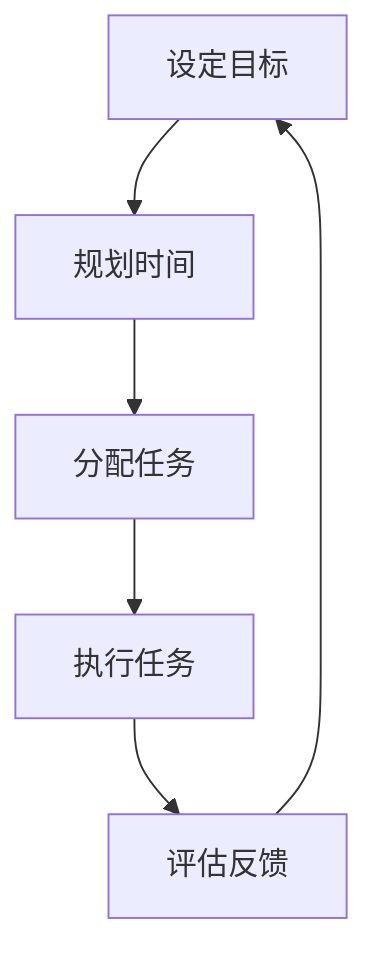
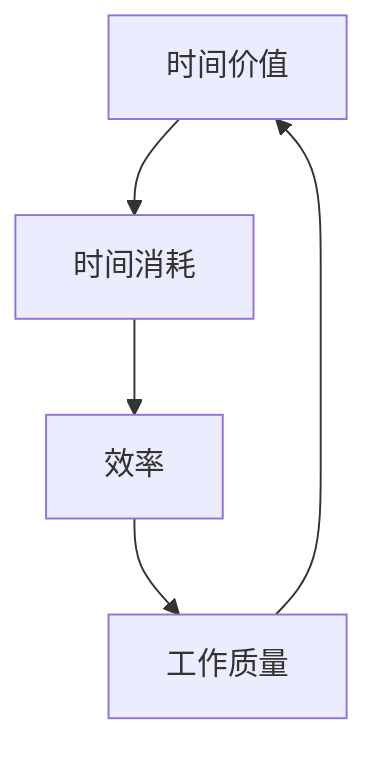
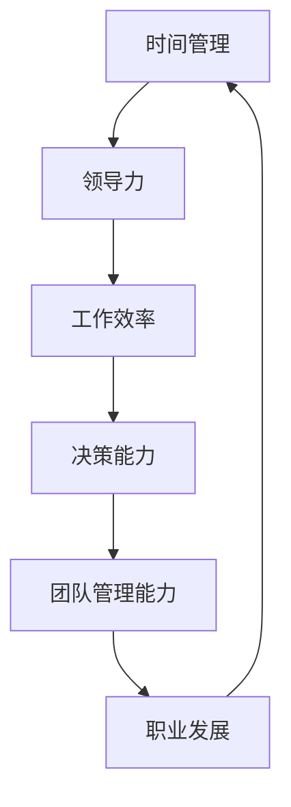
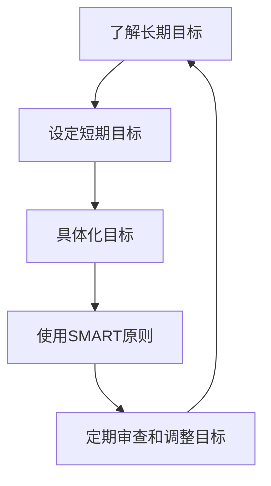

                 

### 文章标题

《领导者的时间管理：提升个人和团队效率》

### 关键词

时间管理、领导力、效率提升、个人目标、团队协作、工作与生活平衡、新技术的应用、未来趋势

### 摘要

在快节奏的现代工作环境中，时间管理对于个人和团队的成功至关重要。《领导者的时间管理：提升个人和团队效率》一书通过深入探讨时间管理的核心概念、策略和技巧，帮助领导者优化个人时间利用，提升团队效率。本书首先介绍了时间管理的重要性及其对领导力的贡献，随后详细阐述了个人和团队时间管理的方法与工具。通过优先级排序、时间分配与规划、沟通与授权等具体技巧，本书引导领导者如何有效管理个人和团队时间。此外，书中还探讨了如何实现工作与生活的平衡，以及新技术在时间管理中的应用。通过案例分析、最佳实践和未来趋势的讨论，本书为领导者提供了一套全面的、可操作的时间管理解决方案。

### 目录

#### 第一部分：时间管理的核心概念

##### 1.1 时间管理的重要性
- 1.1.1 时间管理的基础
- 1.1.2 时间管理对领导力的贡献

##### 1.2 个人时间管理策略
- 1.2.1 评估个人时间消耗
- 1.2.2 设定个人目标
- 1.2.3 时间管理工具与方法

##### 1.3 团队时间管理策略
- 1.3.1 确定团队时间管理的目标
- 1.3.2 建立团队时间管理流程
- 1.3.3 鼓励团队成员参与时间管理

#### 第二部分：个人时间管理技巧

##### 2.1 优先级排序
- 2.1.1 使用Eisenhower矩阵
- 2.1.2 设定优先级原则
- 2.1.3 实践优先级排序

##### 2.2 时间分配与规划
- 2.2.1 制定时间表
- 2.2.2 管理突发事件
- 2.2.3 提高工作效率

##### 2.3 沟通与授权
- 2.3.1 有效沟通的重要性
- 2.3.2 提升沟通技巧
- 2.3.3 授权给团队成员

#### 第三部分：团队时间管理技巧

##### 3.1 团队协作与时间管理
- 3.1.1 确保团队成员目标一致
- 3.1.2 使用项目管理工具
- 3.1.3 促进团队时间管理的文化

##### 3.2 时间管理的领导力
- 3.2.1 领导者的角色
- 3.2.2 提升团队时间管理能力
- 3.2.3 管理团队中的时间冲突

##### 3.3 案例研究：成功的时间管理实践
- 3.3.1 案例一：一家大型公司的团队时间管理策略
- 3.3.2 案例二：一个初创团队的敏捷时间管理实践

#### 第四部分：时间管理与工作生活平衡

##### 4.1 压力管理
- 4.1.1 认识压力
- 4.1.2 压力管理策略
- 4.1.3 应对工作压力

##### 4.2 工作与生活的平衡
- 4.2.1 理解工作与生活的平衡
- 4.2.2 制定平衡策略
- 4.2.3 实践工作与生活平衡

#### 第五部分：时间管理的未来趋势

##### 5.1 新技术的应用
- 5.1.1 数字工具在时间管理中的应用
- 5.1.2 人工智能在时间管理中的作用
- 5.1.3 增强现实与时间管理的结合

##### 5.2 时间管理的发展方向
- 5.2.1 未来时间管理趋势
- 5.2.2 时间管理对领导者的未来要求
- 5.2.3 持续改进的时间管理实践

### 附录

##### 附录A：时间管理工具推荐
- A.1 个人时间管理工具
- A.2 团队时间管理工具
- A.3 时间管理应用案例分析

### 结论

在当前充满挑战的工作环境中，有效的领导者在时间管理方面的能力显得尤为重要。本文通过详细阐述时间管理的核心概念、策略和技巧，帮助领导者提升个人和团队效率，实现工作与生活的平衡。从优先级排序到时间分配与规划，从沟通与授权到压力管理，本文为领导者提供了一套全面的时间管理解决方案。同时，本文还探讨了新技术在时间管理中的应用以及未来的发展趋势，为领导者提供了持续改进的方向。通过实践这些时间管理技巧，领导者不仅能够提高工作效率，还能为团队创造更加和谐、高效的工作环境。

### 第一部分：时间管理的核心概念

#### 1.1 时间管理的重要性

时间管理是指通过规划和控制时间来提高个人或团队的工作效率和生活质量。在快节奏的现代工作环境中，时间管理的重要性日益凸显。对于领导者而言，有效的时间管理不仅关系到个人职业生涯的成功，更影响到整个团队的绩效和公司的整体发展。

首先，时间管理能够帮助领导者更清晰地设定个人和团队目标。明确的目标是高效行动的前提，而时间管理提供了实现这些目标的具体方法和路径。通过合理分配时间，领导者可以确保重要任务得到优先处理，避免因为时间分配不合理而导致的工作延误和效率低下。

其次，时间管理有助于提高领导者的决策效率。在面对复杂的工作环境和多任务处理时，领导者需要快速做出正确的决策。时间管理通过优化时间分配，减少不必要的干扰，帮助领导者集中精力处理关键问题，从而提升决策质量和速度。

此外，时间管理对于领导者的职业发展和团队建设也有着深远的影响。一个高效的时间管理者能够更好地平衡工作与生活，保持身心健康，从而在职业生涯中保持持久的活力。同时，通过培养团队成员的时间管理能力，领导者可以打造一个高效协作的团队，提高整体工作绩效。

为了更直观地理解时间管理的重要性，我们可以使用Mermaid流程图来展示时间管理的基本原理：

在这个流程图中，设定目标是时间管理的起点，通过规划时间和分配任务，领导者可以确保任务得以高效执行，并在执行过程中不断评估和反馈，从而优化整个时间管理流程。这个流程不仅适用于个人，同样适用于团队管理。

#### 1.1.1 时间管理的基础

时间管理的基础包括几个关键概念：时间价值、时间消耗和效率。

**时间价值**是指个人或团队在特定时间内所能创造的价值。时间价值取决于任务的紧急程度、重要性以及任务的完成质量。对于领导者而言，了解每个任务的时间价值有助于他们更合理地分配时间，确保关键任务得到优先处理。

**时间消耗**是指完成某项任务所需的时间。时间消耗包括实际执行任务的时间，以及因任务安排不当、沟通不畅等导致的额外时间。对于领导者来说，有效管理时间消耗是提高团队效率的关键。通过减少不必要的会议、优化工作流程、提升团队成员的技能水平，领导者可以显著减少时间消耗。

**效率**是指单位时间内完成工作的质量与数量。高效率意味着在相同的时间内完成更多任务，或者以更短的时间完成相同任务。对于领导者来说，提升团队效率不仅能够提高工作绩效，还能为团队成员提供更好的工作环境和成长机会。

在时间管理中，这三个概念是相互关联的。时间价值决定了任务的优先级，时间消耗影响了任务的完成质量，而效率则是时间管理和任务完成的最终目标。

为了更清晰地理解这些概念之间的关系，我们可以使用Mermaid流程图来展示：

在这个流程图中，时间价值决定了任务的重要性，时间消耗影响了工作质量，而效率则是工作质量和时间消耗的综合体现。通过优化这三个方面，领导者可以提升整个团队的工作效率和绩效。

#### 1.1.2 时间管理对领导力的贡献

时间管理对领导力的贡献是多方面的。首先，时间管理是领导者必备的核心技能之一。一个优秀的领导者必须能够高效地管理自己和团队的时间，确保任务按时完成，从而实现组织的目标。通过掌握时间管理技巧，领导者可以更好地协调各项工作，避免因时间管理不善而导致的效率低下和团队内部冲突。

其次，时间管理有助于提升领导者的决策能力。领导者经常需要在短时间内做出多个决策，这些决策的准确性直接影响到团队的工作效率和团队士气。有效的时间管理能够帮助领导者集中精力处理关键问题，减少决策过程中的干扰，从而提高决策的质量和速度。

此外，时间管理还有助于提升领导者的团队管理能力。通过培养团队成员的时间管理能力，领导者可以打造一个高效协作的团队。团队成员在有效的时间管理下，能够更好地分配时间，提高工作效率，从而为团队的整体绩效提升做出贡献。

最后，时间管理对领导者的职业发展和个人成长也有着深远的影响。一个能够有效管理时间的领导者，能够在职业生涯中保持持续的高效率，从而实现职业目标。同时，通过时间管理，领导者可以更好地平衡工作与生活，保持身心健康，为长期的职业发展奠定基础。

为了更直观地展示时间管理对领导力的贡献，我们可以使用Mermaid流程图来展示：

在这个流程图中，时间管理通过提升工作效率、决策能力和团队管理能力，直接影响到领导力的提升，进而促进职业发展和个人成长。

### 第二部分：个人时间管理策略

#### 2.1 评估个人时间消耗

评估个人时间消耗是进行有效时间管理的基础。通过了解自己在一天中如何使用时间，领导者可以识别出时间浪费的环节，并采取相应的措施进行优化。以下是评估个人时间消耗的具体方法和步骤。

首先，领导者需要记录一段时间内的所有活动。这可以通过时间日志或时间跟踪应用程序来实现。时间日志通常包括活动名称、开始时间和结束时间。通过记录这些信息，领导者可以获取每个活动所消耗的具体时间。

例如，使用时间日志记录一天的活动如下：

| 活动 | 开始时间 | 结束时间 |
| ---- | ---- | ---- |
| 早上起床 | 06:00 | 06:30 |
| 洗漱 | 06:30 | 07:00 |
| 吃早餐 | 07:00 | 07:30 |
| 上班通勤 | 07:30 | 08:00 |
| 工作 | 08:00 | 12:00 |
| 午餐 | 12:00 | 12:30 |
| 工作 | 12:30 | 18:00 |
| 下班通勤 | 18:00 | 18:30 |
| 运动健身 | 18:30 | 19:00 |
| 晚餐 | 19:00 | 20:00 |
| 家庭时间 | 20:00 | 21:00 |
| 个人娱乐 | 21:00 | 22:00 |
| 睡觉 | 22:00 | 06:00 |

记录一段时间后的活动后，领导者可以通过时间日志分析每天的时间分配。以下是时间日志的分析结果：

- 工作时间：6小时
- 个人时间：5.5小时
- 交通时间：1小时
- 家庭时间：1小时
- 个人娱乐：1.5小时
- 其他：0.5小时

通过这样的分析，领导者可以发现时间消耗的各个环节，并识别出时间浪费的环节。例如，在这个例子中，交通时间占用了1小时，可能是由于通勤时间过长或交通拥堵。针对这个环节，领导者可以考虑调整通勤方式或上下班时间，以减少交通时间。

接下来，领导者需要对时间消耗进行评估，确定哪些活动是必要的，哪些是可以优化或减少的。对于非必要活动，领导者可以采取以下措施进行优化：

1. **删除或减少非必要活动**：例如，减少不必要的社交媒体浏览或看电视的时间。
2. **合并相似活动**：例如，将个人娱乐和家庭时间合并，以节省时间。
3. **优化活动流程**：例如，通过提高工作效率或使用时间管理工具来减少工作时间的消耗。

此外，领导者还可以使用时间管理工具来帮助评估时间消耗。一些常见的时间管理工具有：

- **Toggl**：一款简单易用的在线时间跟踪工具，可以帮助领导者记录和分析时间消耗。
- **RescueTime**：一款自动跟踪时间消耗的应用程序，可以提供详细的时间消耗报告，帮助领导者了解自己在不同活动上的时间分配。
- **Notion**：一款多功能笔记和组织工具，可以用来记录时间日志和分析时间消耗。

使用这些工具，领导者可以更准确地评估个人时间消耗，并采取相应的措施进行优化。通过定期评估和调整时间消耗，领导者可以逐步提高个人的时间管理能力，实现更高的工作效率和生活质量。

#### 2.2 设定个人目标

设定个人目标是时间管理的关键步骤之一。明确的目标不仅能够帮助领导者更好地规划时间，还能激励他们在实现目标的过程中保持动力和专注。以下是设定个人目标的具体方法和步骤。

首先，领导者需要了解自己的长期目标和短期目标。长期目标通常是几年内希望实现的目标，而短期目标则是为了实现长期目标而设定的具体步骤和里程碑。例如，一个领导者的长期目标可能是提升公司的市场竞争力，而短期目标可能是开发一款具有创新性的新产品或提升团队的工作效率。

接下来，领导者需要将长期目标和短期目标具体化。具体的目标应该包括明确的成果指标和可衡量的进展。例如，一个领导者可以将“提升团队工作效率”这个目标具体化为“将团队的工作效率提升20%”。

在设定具体目标时，领导者可以使用SMART原则（具体、可衡量、可实现、相关、时限）来确保目标的明确性和可行性。例如，一个符合SMART原则的目标可以是：“在接下来的三个月内，通过改进工作流程，将团队每周的会议时间减少30分钟。”

此外，领导者还需要定期审查和调整目标。随着时间的推移，外部环境和个人情况可能会发生变化，这要求领导者根据实际情况调整目标。例如，如果原定的目标由于市场变化而变得不切实际，领导者需要重新设定目标，以保持目标的可行性和激励性。

为了更直观地展示设定个人目标的过程，我们可以使用Mermaid流程图：

在这个流程图中，领导者首先了解自己的长期目标，然后设定具体的短期目标，通过具体化和SMART原则确保目标的明确性和可行性，并定期审查和调整目标，以适应变化的环境。

为了更好地实现个人目标，领导者还可以采取以下策略：

1. **制定行动计划**：将每个目标分解成具体的行动步骤，并为每个步骤设定时间表和责任人。
2. **使用时间管理工具**：例如，使用日历或任务管理工具来跟踪目标进度和任务完成情况。
3. **寻求反馈和支持**：向团队成员或其他专业人士寻求反馈和支持，以帮助自己更好地实现目标。

通过设定明确、具体、可行的个人目标，并采取有效的策略和工具，领导者可以更好地管理自己的时间，实现更高的工作效率和个人成长。

#### 2.3 时间管理工具与方法

为了有效地管理个人时间，领导者需要掌握一系列时间管理工具和方法。这些工具和方法可以帮助领导者更清晰地规划时间、提高工作效率，并确保任务按时完成。以下是一些常见的时间管理工具和方法。

**1. 日历和时间表**

日历和时间表是时间管理的基础工具之一。通过使用电子日历（如Google日历或Outlook日历）或纸质日历，领导者可以记录和安排日常任务和活动。电子日历的优势在于其自动化功能，例如自动提醒和日历同步，可以帮助领导者更好地管理时间。

**使用方法**：
- 定期更新日历，包括会议、任务和个人活动。
- 设置自动提醒，确保不会错过重要事项。
- 定期查看日历，以确保时间分配合理。

**2. 任务管理工具**

任务管理工具（如Trello、Asana或Notion）可以帮助领导者跟踪和管理任务进度。这些工具通常具有功能丰富的界面，允许领导者创建任务、设置截止日期、分配责任人，并跟踪任务的完成情况。

**使用方法**：
- 创建任务列表，并将任务分配给团队成员。
- 为每个任务设置优先级和截止日期。
- 定期查看任务进度，确保任务按时完成。

**3. 时间跟踪工具**

时间跟踪工具（如Toggl或RescueTime）可以帮助领导者记录和评估时间消耗。这些工具可以自动跟踪领导者在计算机或移动设备上的活动，并提供详细的时间消耗报告。

**使用方法**：
- 开始和结束工作活动时手动或自动启动时间跟踪。
- 定期查看时间消耗报告，识别时间浪费的环节。
- 根据报告结果调整时间管理策略。

**4. Eisenhower矩阵**

Eisenhower矩阵是一种常用的任务优先级排序方法。它将任务分为四个象限，分别是紧急且重要、紧急但不重要、不紧急但重要、不紧急且不重要。通过这个矩阵，领导者可以更清晰地了解哪些任务需要优先处理。

**使用方法**：
- 列出所有待办任务。
- 将每个任务分类到四个象限中。
- 首先处理紧急且重要的任务，然后处理其他象限中的任务。

**5. Pomodoro技术**

Pomodoro技术是一种时间管理技术，通过将工作时间划分为25分钟的专注时间和5分钟的休息时间，帮助领导者提高专注力和工作效率。

**使用方法**：
- 选择一个任务，设定25分钟的计时器。
- 在计时器响起之前，专注于该任务，不受任何干扰。
- 计时器响起后，休息5分钟，然后开始下一个25分钟的工作周期。

**6. 优先级排序原则**

在时间管理中，合理设定任务的优先级至关重要。以下是一些常用的优先级排序原则：

- **紧急且重要**：首先处理这些任务，以确保关键任务按时完成。
- **不紧急但重要**：这些任务虽然不紧急，但对长期目标和团队发展至关重要，应尽量提前处理。
- **紧急但不重要**：这些任务可以委托给其他人处理，或者安排在空闲时间处理。
- **不紧急且不重要**：尽量减少这些任务的时间消耗，或者完全删除。

**7. 工作时间与休息时间的平衡**

保持工作与休息时间的平衡对于提高工作效率至关重要。以下是一些保持平衡的方法：

- **定期休息**：每工作45-60分钟后，休息5-10分钟，以恢复精力和专注力。
- **合理安排工作时间**：将重要的任务安排在精力最旺盛的时间段，以提高任务完成质量。
- **避免加班**：确保按时完成工作任务，避免过度加班，以保持身心健康。

通过掌握这些时间管理工具和方法，领导者可以更有效地管理个人时间，提高工作效率，实现工作与生活的平衡。以下是一个使用这些工具和方法的示例：

**示例**：
- 使用Google日历记录每天的会议和任务，设置自动提醒。
- 使用Trello创建任务列表，将任务分配给团队成员，并设置优先级和截止日期。
- 使用Toggl记录每天的时间消耗，定期查看报告，优化时间管理策略。
- 使用Eisenhower矩阵对任务进行优先级排序，确保关键任务得到优先处理。
- 采用Pomodoro技术，将工作时间划分为25分钟的专注周期，每周期后休息5分钟。
- 根据任务的重要性和紧急性，合理分配工作时间和休息时间，确保工作效率和身心健康。

通过这些工具和方法的综合应用，领导者可以逐步提高个人时间管理能力，实现更高的工作效率和个人成长。

### 第三部分：个人时间管理技巧

#### 3.1 优先级排序

在时间管理中，优先级排序是确保任务高效完成的关键。通过科学合理的优先级排序，领导者可以确保将最宝贵的时间投入到最重要的任务上，从而提升个人和团队的整体效率。

**3.1.1 使用Eisenhower矩阵**

Eisenhower矩阵是一种经典的优先级排序方法，由美国第34任总统德怀特·D·艾森豪威尔提出。该方法将任务分为四个象限，每个象限代表任务的紧急性和重要性。

- **第一象限：紧急且重要**：这些任务需要立即处理，因为它们对目标和任务的完成至关重要。例如，紧急的客户会议或突发事件。
- **第二象限：不紧急但重要**：这些任务虽然不紧急，但对于长期目标和团队发展至关重要。例如，项目规划或团队培训。
- **第三象限：紧急但不重要**：这些任务可以委托给其他人处理，或者安排在空闲时间处理。例如，回复不紧急的邮件或处理琐碎的事务。
- **第四象限：不紧急且不重要**：这些任务可以尽量避免或直接删除，以节省时间。例如，社交媒体上的时间浪费。

**使用方法**：

1. 列出所有待办任务，并将它们根据紧急性和重要性分类到四个象限中。
2. 首先处理第一象限中的任务，因为这些任务是当前最紧急和最重要的。
3. 然后处理第二象限中的任务，确保长期目标的实现。
4. 尽量避免或委托第三象限中的任务，以减少时间浪费。
5. 完全删除或尽量避免第四象限中的任务。

**3.1.2 设定优先级原则**

为了更有效地设定任务优先级，领导者可以遵循以下原则：

- **紧急性原则**：优先处理紧急任务，确保关键任务按时完成。
- **重要性原则**：优先处理重要任务，特别是那些对长期目标和团队发展有重大影响的任务。
- **优先级排序原则**：使用Eisenhower矩阵或其他优先级排序方法，确保任务得到科学合理的排序。

**3.1.3 实践优先级排序**

为了在实际工作中应用优先级排序，领导者可以采取以下步骤：

1. **每日任务排序**：每天早上，列出当天所有待办任务，并根据紧急性和重要性进行排序。
2. **每周任务排序**：每周初，回顾下周的重要任务和项目，将其排序并分配到具体的工作日。
3. **实时调整**：在任务执行过程中，根据实际情况调整优先级，确保关键任务得到优先处理。
4. **反馈与优化**：定期回顾任务完成的优先级设定和执行情况，从中学习和优化。

通过实践优先级排序，领导者可以更高效地管理时间和任务，确保关键任务得到及时处理，从而提升个人和团队的整体效率。

#### 3.2 时间分配与规划

时间分配与规划是时间管理的重要组成部分，它帮助领导者确保在有限的时间内完成更多任务，并保持工作与生活的平衡。以下是一些关键方法和策略，帮助领导者更有效地分配和规划时间。

**3.2.1 制定时间表**

制定时间表是时间分配与规划的基础。通过将一天或一周的时间合理分配给不同的任务和活动，领导者可以更清晰地了解自己的时间安排，确保任务按时完成。

**使用方法**：

1. **每日时间表**：为每天制定详细的时间表，包括工作、休息、个人和家庭时间。例如：

   | 时间段 | 活动 |
   | ------ | ---- |
   | 08:00-09:00 | 起床、早餐 |
   | 09:00-12:00 | 工作（优先处理紧急且重要的任务） |
   | 12:00-13:00 | 午餐 |
   | 13:00-17:00 | 工作 |
   | 17:00-18:00 | 下班通勤 |
   | 18:00-19:00 | 运动健身 |
   | 19:00-20:00 | 晚餐 |
   | 20:00-22:00 | 家庭时间/个人娱乐 |
   | 22:00-23:00 | 准备就寝 |

2. **每周时间表**：为每周制定一个大致的时间表，包括日常工作、项目会议、个人目标和休闲活动。例如：

   | 星期一 | 星期二 | 星期三 | 星期四 | 星期五 |
   | ------ | ------ | ------ | ------ | ------ |
   | 上午会议 | 上午会议 | 项目规划会议 | 上午会议 | 项目评审会议 |
   | 下午工作 | 下午工作 | 下午工作 | 下午工作 | 下午工作 |
   | 个人发展时间 | 个人发展时间 | 个人发展时间 | 个人发展时间 | 个人发展时间 |
   | 家庭时间/休闲活动 | 家庭时间/休闲活动 | 家庭时间/休闲活动 | 家庭时间/休闲活动 | 家庭时间/休闲活动 |

**3.2.2 管理突发事件**

在实际工作中，突发事件难以避免。管理者需要具备灵活应对突发事件的能力，以确保任务不受影响。

**使用方法**：

1. **预留缓冲时间**：在时间表上预留一定的缓冲时间，用于应对突发事件。例如，每天可以预留30分钟的缓冲时间，以应对突然出现的紧急任务。

2. **灵活调整时间表**：当突发事件发生时，根据实际情况灵活调整时间表。例如，如果某个会议提前结束，可以将剩余时间用于处理其他任务。

3. **优先处理紧急任务**：在处理突发事件时，根据紧急程度和影响优先处理。例如，如果某位团队成员遇到紧急健康问题，应立即安排会议讨论解决方案。

**3.2.3 提高工作效率**

工作效率是时间管理的关键。以下方法可以帮助领导者提高工作效率：

1. **自动化工具**：使用自动化工具（如邮件自动回复、日程自动安排）减少手动操作时间。

2. **批量处理任务**：将相似的任务集中在一起处理，减少任务切换带来的时间浪费。

3. **分块任务**：将大型任务分解为小块，逐一完成，以减少任务压力和拖延。

4. **避免多任务处理**：尽管多任务处理看似提高效率，但实际上会分散注意力，降低工作效率。专注于一项任务，直到完成。

通过制定时间表、管理突发事件和提升工作效率，领导者可以更有效地分配和规划时间，确保任务按时完成，同时保持工作与生活的平衡。

#### 3.3 沟通与授权

在时间管理中，沟通与授权是确保任务顺利完成的关键因素。有效的沟通和授权不仅能够提高工作效率，还能增强团队协作和信任，从而实现个人和团队目标。

**3.3.1 有效沟通的重要性**

有效沟通是确保信息准确传达和理解的关键。对于领导者来说，有效的沟通是管理团队和协调任务的基础。以下是有效沟通的几个关键点：

1. **明确信息**：在传达任务或信息时，确保信息明确、具体。使用具体的数据、目标和期限，以减少误解和混淆。

2. **倾听**：积极倾听是有效沟通的重要组成部分。通过倾听团队成员的观点和反馈，领导者可以更好地理解需求，并做出更合适的决策。

3. **反馈**：及时给予反馈，让团队成员了解任务进展和成果。这不仅有助于提高团队成员的积极性，还能及时发现和解决问题。

4. **透明沟通**：保持沟通的透明度，让团队成员了解组织的整体目标和策略。透明沟通有助于建立信任，减少不必要的猜疑和误解。

**3.3.2 提升沟通技巧**

提升沟通技巧有助于领导者更有效地传达信息和激励团队。以下是一些提升沟通技巧的方法：

1. **使用简单语言**：使用简单、易懂的语言，避免使用过于复杂或专业的术语。这样可以确保所有团队成员都能理解。

2. **非语言沟通**：注意非语言沟通，如肢体语言、面部表情和眼神交流。这些非语言因素可以增强沟通效果，传递出更明确的信息。

3. **多渠道沟通**：利用多种沟通渠道，如面对面会议、电子邮件、即时通讯工具等，以满足团队成员的不同需求。例如，紧急事项可以通过即时通讯工具快速传达，而详细报告可以通过电子邮件发送。

4. **情感共鸣**：在沟通时，关注团队成员的情感需求。通过表达关心和支持，可以增强团队的凝聚力，提高工作效率。

**3.3.3 授权给团队成员**

授权是领导者将权力和责任赋予团队成员的过程。通过授权，领导者可以释放团队成员的潜力，提高团队的整体效率和创新能力。以下是授权给团队成员的几个关键点：

1. **明确授权范围**：在授权时，明确团队成员的权限和责任范围。这有助于团队成员了解自己的角色和职责，减少授权滥用的情况。

2. **信任和支持**：建立信任是授权的基础。领导者需要信任团队成员能够胜任任务，并在需要时提供支持和资源。

3. **设定目标和期望**：在授权前，明确设定目标和期望，让团队成员了解任务的重要性和期望的成果。这有助于团队成员更有动力地完成任务。

4. **定期跟进**：在授权后，领导者需要定期跟进任务的进展，提供反馈和指导。这有助于确保任务按时完成，并支持团队成员的成长。

通过有效的沟通和授权，领导者可以激发团队成员的潜力，提高团队的整体效率和协作能力。这不仅能提升个人和团队的时间管理能力，还能实现组织的长期发展目标。

### 第四部分：团队时间管理技巧

#### 4.1 团队协作与时间管理

团队协作与时间管理密切相关。一个高效的团队不仅需要成员之间的良好协作，还需要科学的时间管理策略。以下是一些关键的团队协作与时间管理技巧。

**4.1.1 确保团队成员目标一致**

确保团队成员目标一致是实现高效协作和有效时间管理的基础。以下是一些实现目标一致的方法：

1. **明确团队目标**：在团队成立之初，明确团队的目标和愿景。这可以帮助团队成员了解团队的方向和期望，从而更好地协同工作。

2. **沟通目标**：定期与团队成员沟通，确保他们对团队目标的了解和认同。通过讨论和反馈，可以确保团队成员对目标的共识。

3. **设定共同目标**：鼓励团队成员设定共同的目标，使其与团队目标一致。这可以增强团队成员的归属感和责任感，提高团队协作效率。

**4.1.2 使用项目管理工具**

项目管理工具可以帮助团队更有效地规划和管理任务。以下是一些常用的项目管理工具：

1. **Trello**：一款简单直观的项目管理工具，适合团队协作和任务追踪。

2. **Asana**：功能丰富的项目管理工具，支持任务分配、进度跟踪和团队协作。

3. **JIRA**：一款专业的项目管理工具，适合大型团队和复杂的软件开发项目。

**使用方法**：

1. **任务分配**：将任务分配给团队成员，并设置截止日期和优先级。

2. **进度跟踪**：实时查看任务进度，确保任务按时完成。

3. **团队协作**：通过项目管理工具，团队成员可以协同工作，共享资源和信息。

**4.1.3 促进团队时间管理的文化**

促进团队时间管理的文化是提升团队效率和员工满意度的关键。以下是一些促进时间管理文化的策略：

1. **培训与指导**：定期为团队成员提供时间管理培训，提高他们的时间管理技能。

2. **透明度**：保持团队沟通的透明度，让团队成员了解团队的工作计划和任务进度。

3. **灵活工作安排**：提供灵活的工作安排，如远程工作或弹性工作时间，以适应团队成员的不同需求。

4. **奖励与认可**：对在时间管理方面表现突出的团队成员给予奖励和认可，激励他们继续保持高效工作。

通过确保团队成员目标一致、使用项目管理工具和促进团队时间管理的文化，团队可以更有效地协作和利用时间，实现更高的工作效率和绩效。

#### 4.2 时间管理的领导力

时间管理的领导力是领导者关键的能力之一，它不仅影响个人的工作效率，还直接关系到团队的整体表现。有效的领导者能够通过时间管理来提升团队的效率，减少不必要的浪费，并确保团队目标的实现。以下是关于时间管理领导力的几个关键方面。

**4.2.1 领导者的角色**

领导者在时间管理中的角色至关重要。他们不仅是时间管理的执行者，更是推动者和榜样。以下是领导者应承担的几个关键角色：

1. **制定时间管理策略**：领导者需要制定团队的时间管理策略，明确团队的时间管理目标和流程。这包括设定关键任务的时间表、确定优先级排序原则，以及制定应对突发事件的策略。

2. **指导和培训**：领导者需要指导和培训团队成员，提高他们的时间管理技能。这可以通过定期的培训会议、工作坊和一对一指导来实现。

3. **模范作用**：领导者应该以身作则，展示良好的时间管理行为。通过自己的实际行动，领导者可以激励团队成员更加注重时间管理。

4. **监督和反馈**：领导者需要监督团队成员的时间管理情况，并提供及时的反馈。这有助于发现和解决时间管理中的问题，确保团队目标的实现。

**4.2.2 提升团队时间管理能力**

提升团队时间管理能力是提高团队效率和绩效的关键。以下是几个策略来提升团队的时间管理能力：

1. **优化工作流程**：通过分析现有工作流程，识别并消除不必要的步骤和流程，可以显著减少时间浪费。

2. **培训时间管理技能**：为团队成员提供时间管理培训，教授他们有效的时间管理技巧和方法，如优先级排序、时间分配和任务分解。

3. **使用时间管理工具**：引入和使用合适的时间管理工具，如日历、任务管理软件和项目管理工具，可以极大地提高团队的时间管理效率。

4. **建立共同目标**：确保团队成员了解团队的目标和愿景，并设定共同的时间管理目标。这有助于团队成员更专注于关键任务，提高工作效率。

**4.2.3 管理团队中的时间冲突**

在团队工作中，时间冲突是常见的问题，它可能导致工作效率下降和团队士气降低。以下是管理团队中时间冲突的几个策略：

1. **提前规划**：在任务分配和项目规划阶段，提前识别可能出现的时间冲突，并采取预防措施。这可以通过设定合理的截止日期和优先级排序来实现。

2. **沟通和协商**：当时间冲突发生时，领导者需要通过沟通和协商来解决。这包括与团队成员讨论时间冲突的原因和解决方案，并寻求双方都能接受的妥协。

3. **调整资源分配**：如果时间冲突无法避免，领导者可以考虑调整资源分配，确保关键任务得到优先处理。例如，通过重新安排会议时间或调整团队成员的工作任务。

4. **建立冲突解决机制**：建立一个正式的冲突解决机制，让团队成员在出现时间冲突时可以及时寻求帮助。这可以包括定期的时间管理会议和反馈机制。

通过承担领导者的角色、提升团队时间管理能力和管理时间冲突，领导者可以有效地提升团队的时间管理效率，确保团队目标的实现，并为团队创造一个更加和谐、高效的工作环境。

### 第四部分：时间管理与工作生活平衡

#### 4.1 压力管理

在现代社会中，工作压力已成为普遍现象，对个人的身心健康产生了重大影响。有效的压力管理不仅有助于提高工作效率，还能增强个人的幸福感和生活质量。以下是一些压力管理的策略和技巧。

**4.1.1 认识压力**

首先，领导者需要认识到压力的来源和影响。压力可以来自多个方面，包括工作负担、人际关系、时间压力和不确定性等。以下是一些常见的压力来源：

1. **工作负担**：过多的工作任务和过高的工作期望可能导致工作压力。
2. **人际关系**：工作中的冲突和沟通问题也可能引起压力。
3. **时间压力**：紧迫的截止日期和任务堆积可能导致时间压力。
4. **不确定性**：对未来不确定性的担忧也会导致压力。

了解压力的来源有助于领导者采取针对性的措施来减轻压力。

**4.1.2 压力管理策略**

为了有效地管理压力，领导者可以采取以下策略：

1. **时间管理**：通过合理规划时间，减少不必要的任务和时间浪费，领导者可以减轻工作负担，从而降低压力水平。
2. **优先级排序**：将任务按照紧急性和重要性进行排序，确保关键任务优先处理，避免因琐碎任务而分散注意力。
3. **休息与放松**：定期休息和放松对缓解压力至关重要。领导者可以安排短暂的休息时间，如5-10分钟的冥想、散步或深呼吸练习，以缓解紧张情绪。
4. **寻求支持**：领导者可以寻求家人、朋友或同事的支持，分享自己的压力和挑战，获取建议和帮助。
5. **健康生活方式**：保持健康的饮食习惯、规律的锻炼和充足的睡眠，有助于提高身心健康，增强抗压能力。

**4.1.3 应对工作压力**

在实际工作中，领导者可以采取以下方法来应对工作压力：

1. **分解任务**：将大型任务分解为小步骤，逐一完成，避免因任务过于庞大而感到焦虑。
2. **设定合理期望**：为自己和团队成员设定合理的工作期望，避免过度追求完美主义，减少不必要的压力。
3. **避免多任务处理**：尽管多任务处理看起来可以提高效率，但实际上会分散注意力，增加压力。领导者应专注于一项任务，直到完成。
4. **定期反思**：定期反思工作状态和压力水平，识别和解决可能导致压力的潜在问题。

通过认识压力、采取有效的压力管理策略和应对工作压力，领导者可以更好地管理自己的情绪和健康状况，提高工作效率，实现工作与生活的平衡。

#### 4.2 工作与生活的平衡

在现代职场中，工作与生活的平衡是一个至关重要的议题。对于领导者而言，如何有效地平衡工作与生活不仅关系到个人的身心健康，也直接影响到团队的工作效率和团队的凝聚力。以下是一些实现工作与生活平衡的策略和方法。

**4.2.1 理解工作与生活的平衡**

工作与生活的平衡意味着在确保工作高效完成的同时，也能充分享受个人生活。这不仅包括休息和娱乐，还涵盖家庭、朋友、爱好和个人成长等方面。以下是一些理解工作与生活平衡的关键点：

1. **明确界限**：设定清晰的工作与个人生活的界限，避免工作过度侵占个人时间。例如，下班后不处理工作邮件或电话，确保有足够的时间用于个人生活。
2. **优先级排序**：了解哪些工作任务是紧急且重要的，哪些可以暂时放下或委托给他人。这样可以确保关键任务得到优先处理，同时为个人生活留出时间。
3. **时间管理**：通过有效的时间管理，合理规划工作和个人时间，确保两者都能得到充分关注。

**4.2.2 制定平衡策略**

为了实现工作与生活的平衡，领导者可以采取以下策略：

1. **灵活工作安排**：提供灵活的工作安排，如弹性工作时间、远程工作或压缩工作周。这样可以更好地适应个人需求，提高工作效率。
2. **设定工作优先级**：将工作按照紧急性和重要性进行排序，确保关键任务得到优先处理。这有助于减少非必要的工作负担，为个人生活留出更多时间。
3. **培养健康习惯**：保持健康的饮食习惯、定期锻炼和充足睡眠，有助于提高身心健康，增强抗压能力。
4. **设定个人目标**：为个人生活设定明确的短期和长期目标，例如学习新技能、参加社交活动或旅行。这有助于提升生活质量，增强工作与生活的平衡感。

**4.2.3 实践工作与生活平衡**

为了在实践中实现工作与生活的平衡，领导者可以采取以下措施：

1. **时间表管理**：制定详细的时间表，包括工作、个人生活、家庭时间和休闲活动。这样可以确保时间得到合理分配，避免工作侵占个人时间。
2. **避免过度工作**：设定明确的工作时间，避免加班和过度工作。如果任务堆积，可以与团队成员沟通，调整优先级或延长工作时间。
3. **家庭时间**：确保有足够的时间与家人相处，参与家庭活动和庆祝活动。这有助于提升家庭幸福感，增强家庭关系。
4. **个人兴趣和爱好**：定期参加个人兴趣和爱好活动，如运动、阅读或艺术创作。这有助于缓解工作压力，提升个人幸福感。

通过理解工作与生活的平衡、制定平衡策略和在实践中不断调整和优化，领导者可以更好地实现工作与生活的平衡，提高个人和团队的整体幸福感和工作效率。

### 第五部分：时间管理的未来趋势

随着技术的不断进步和社会的快速发展，时间管理也面临着新的机遇和挑战。以下将探讨时间管理的未来趋势，包括新技术在时间管理中的应用、人工智能在时间管理中的作用以及增强现实与时间管理的结合。

#### 5.1 新技术的应用

新技术在时间管理中的应用正逐渐改变着我们的工作方式和生活习惯。以下是一些主要的新技术及其应用：

**1. 智能助理**

智能助理（如Siri、Google Assistant和Alexa）可以通过语音交互来帮助用户管理时间。用户可以安排日程、设置提醒、搜索信息，甚至自动记录活动。智能助理的集成使时间管理更加便捷和高效。

**2. 人工智能**

人工智能（AI）在时间管理中的应用日益广泛。AI可以通过分析用户的行为数据，提供个性化的时间管理建议。例如，AI可以帮助用户优化日程安排，减少不必要的会议，并预测可能的延误，从而更有效地利用时间。

**3. 增强现实（AR）**

增强现实技术正在被应用于时间管理中。通过AR眼镜或智能手机，用户可以看到实时的日程提醒、任务进度和目标提醒。这不仅提高了时间的可视性，还帮助用户在日常生活中更好地跟踪和管理时间。

#### 5.2 人工智能在时间管理中的作用

人工智能在时间管理中扮演着越来越重要的角色，以下是其主要作用：

**1. 数据分析**

AI可以分析大量的时间日志和数据，识别出时间浪费的环节和模式。通过这些分析，AI可以为用户提供针对性的改进建议，帮助他们更有效地管理时间。

**2. 个性化建议**

基于用户的行为和偏好，AI可以提供个性化的时间管理建议。例如，根据用户的日程和工作习惯，AI可以自动调整提醒时间和任务分配，确保用户能够更好地遵循时间管理计划。

**3. 智能提醒**

AI可以通过智能提醒功能，帮助用户及时了解任务的进展和截止日期。例如，当用户接近一个重要会议或任务时，AI会自动发送提醒，帮助用户做好准备。

**4. 预测和优化**

AI可以通过机器学习算法预测用户未来的时间需求，并自动优化日程安排。例如，AI可以预测交通状况，提前调整会议时间或提醒用户更改路线，以避免延误。

#### 5.3 增强现实与时间管理的结合

增强现实技术在时间管理中的应用正逐步发展，以下是一些具体应用：

**1. 实时提醒**

通过AR眼镜或智能手机，用户可以看到实时的日程提醒和任务进度。这种可视化的方式不仅提高了时间的可操作性，还帮助用户更好地跟踪和管理时间。

**2. 目标跟踪**

AR技术可以帮助用户将目标可视化，例如在屏幕上显示进度条或图表。这有助于用户直观地了解自己的目标完成情况，从而激励他们更加努力地工作。

**3. 任务导航**

AR技术可以提供任务导航功能，例如在办公室内指引用户前往下一个会议或任务地点。这种导航方式不仅节省了时间，还减少了找路的时间浪费。

**4. 虚拟团队协作**

AR技术可以帮助团队进行虚拟协作，例如在虚拟会议室中召开会议或进行项目讨论。这不仅提高了协作效率，还减少了不必要的旅行和交通时间。

通过新技术的应用和人工智能的结合，时间管理正朝着更加智能化和高效化的方向发展。未来，领导者可以借助这些先进技术，实现更科学、更高效的时间管理，从而提高个人和团队的整体绩效。

### 第五部分：时间管理的未来趋势

#### 5.1 新技术的应用

随着科技的迅猛发展，时间管理领域也迎来了新的机遇。以下将探讨新技术在时间管理中的应用，特别是人工智能（AI）和增强现实（AR）技术。

**1. 人工智能在时间管理中的应用**

人工智能技术正逐步改变传统的时间管理方式。AI可以通过数据分析、机器学习和自然语言处理（NLP）等技术，为用户提供个性化的时间管理建议。

- **数据分析**：AI可以分析用户的行为数据，识别出时间浪费的环节，并提供优化建议。例如，通过分析用户的日程安排，AI可以识别出重复性任务，并提出自动化解决方案。
  
- **任务推荐**：AI可以根据用户的工作习惯和优先级，自动推荐任务和活动。例如，当用户接近下班时间时，AI可以建议进行简短的休息或处理紧急任务。
  
- **智能提醒**：AI可以设置智能提醒，根据用户的日程和地理位置，自动发送提醒。例如，当用户接近会议地点时，AI会发送提醒，并提供导航路线。

**2. 增强现实（AR）技术在时间管理中的应用**

增强现实技术为时间管理带来了全新的体验。通过AR眼镜或智能手机，用户可以在现实世界中叠加虚拟信息，从而更直观地管理时间。

- **实时提醒**：AR技术可以显示实时的日程提醒和任务进度。例如，用户可以通过AR眼镜看到即将到来的会议或任务，并直接进行操作。

- **虚拟团队协作**：AR技术可以帮助团队进行虚拟协作。例如，在虚拟会议室中，团队成员可以看到彼此的日程和任务，实时沟通和协作。

- **目标跟踪**：AR技术可以将目标可视化，例如在屏幕上显示进度条或图表。这有助于用户直观地了解自己的目标完成情况，从而激励他们更加努力地工作。

**3. 智能家居的应用**

智能家居设备的普及也为时间管理提供了新的可能性。通过智能家居系统，用户可以远程控制家中的各种设备，从而节省时间。

- **自动化任务**：智能家居设备可以自动化日常任务，例如通过智能恒温器调节室内温度，或通过智能灯泡自动调整亮度。

- **提醒功能**：智能家居设备可以设置提醒功能，例如当用户接近家门时，智能门锁会自动提醒用户检查背包或手机。

**4. 5G技术的应用**

5G技术的快速发展为时间管理带来了更高的网络速度和更低的延迟。这意味着用户可以更快速地访问时间和任务管理工具，提高工作效率。

- **实时数据同步**：5G技术可以实现实时数据同步，用户可以随时查看和更新日程和任务。

- **快速响应**：5G技术可以提供更快的服务器响应速度，用户可以更快速地处理任务和接收提醒。

**5. 区块链技术的应用**

区块链技术为时间管理提供了新的信任机制。通过区块链，用户可以更安全地记录和验证时间和任务数据，从而提高透明度和可信度。

- **任务跟踪**：区块链可以用于记录任务的执行过程和完成情况，确保任务透明可追溯。

- **权益分配**：区块链可以用于分配任务完成后的权益，例如奖金或奖励。

通过这些新技术的应用，时间管理将变得更加智能化、高效化和便捷化。领导者可以利用这些技术，更好地管理个人和团队的时间，提高整体工作效率和绩效。

#### 5.2 时间管理的发展方向

随着技术的不断进步和社会的变革，时间管理领域也面临着新的发展方向和趋势。以下是对未来时间管理方向的一些探讨：

**1. 更高级的个性化**

未来的时间管理工具将更加注重个性化，根据用户的行为模式、偏好和需求，提供高度个性化的时间管理建议。例如，通过分析用户的日常活动，时间管理工具可以自动调整提醒时间，优化日程安排，甚至预测用户的疲劳程度，从而提供最适合用户的休息时间和工作方式。

**2. 自动化与智能化**

随着人工智能（AI）和机器学习技术的不断发展，时间管理工具将变得更加智能化和自动化。AI可以分析大量的时间数据，自动识别时间浪费的环节，并提供优化建议。例如，AI可以自动识别重复性任务，并建议自动化处理，从而节省时间。

**3. 实时协作**

未来，时间管理将更加注重实时协作和沟通。通过区块链和物联网（IoT）技术，团队成员可以实时共享日程和任务信息，协同工作。例如，在远程团队中，成员可以通过区块链技术验证任务的完成情况，确保任务的透明度和可信度。

**4. 可穿戴技术的普及**

随着可穿戴设备的普及，时间管理将更加便捷和直观。可穿戴设备可以实时监测用户的活动和健康状况，提供个性化的提醒和建议。例如，智能手表可以监测用户的步数、心率等健康数据，并自动调整提醒时间，确保用户在最佳状态下工作。

**5. 虚拟和增强现实（VR/AR）的应用**

未来，虚拟现实（VR）和增强现实（AR）技术将在时间管理中发挥更大作用。通过VR/AR，用户可以更加直观地管理时间，例如在虚拟环境中规划日程、设置提醒，甚至进行虚拟会议。AR技术还可以将日程和任务信息叠加在现实世界中，提供更加便捷和高效的时间管理体验。

**6. 跨平台整合**

未来的时间管理工具将更加注重跨平台整合，支持多种设备和操作系统的无缝切换。用户可以在电脑、智能手机、平板电脑等多种设备上同步时间数据，确保时间管理的一致性和便捷性。

**7. 强调心理健康**

随着对心理健康重要性的认识不断提高，未来的时间管理工具将更加关注用户的心理健康。这些工具将提供心理健康评估、压力管理建议，帮助用户保持良好的心理状态，从而更有效地管理时间和工作。

通过这些发展方向，时间管理将变得更加智能、个性化和便捷，为个人和团队带来更高的工作效率和生活质量。

### 结论

《领导者的时间管理：提升个人和团队效率》通过深入探讨时间管理的核心概念、策略和技巧，为领导者提供了一套全面的时间管理解决方案。从个人时间管理到团队协作，从优先级排序到压力管理，本书为领导者提供了丰富的实践方法和工具。有效的时间管理不仅能够提升个人的工作效率和职业发展，还能为团队创造一个更加和谐、高效的工作环境。

为了更好地实践时间管理，以下是几个最佳实践的小结：

1. **定期评估时间消耗**：定期记录和分析自己的时间消耗，识别时间浪费的环节，并采取相应措施进行优化。

2. **设定明确目标**：使用SMART原则设定个人和团队目标，确保目标具体、可衡量、可实现、相关和时限。

3. **优先级排序**：使用Eisenhower矩阵等工具，对任务进行科学合理的排序，确保关键任务得到优先处理。

4. **高效沟通**：提升沟通技巧，确保信息准确传达和理解，减少误解和冲突。

5. **授权与协作**：鼓励团队成员参与时间管理，通过合理授权和协作，提高整体工作效率。

6. **保持工作与生活的平衡**：通过设定明确的工作与个人生活界限，保持身心健康，实现长期发展。

在时间管理实践中，领导者需要不断学习和调整，以适应不断变化的工作环境和需求。通过持续改进，领导者可以不断提升个人和团队的时间管理能力，实现更高的工作效率和职业目标。

**注意事项**：

1. **避免多任务处理**：尽管多任务处理看似提高效率，但实际上会分散注意力，降低工作效率。

2. **保持灵活性**：时间管理策略应根据实际情况进行调整，保持灵活性，以适应突发情况和变化。

3. **定期反思**：定期反思时间管理实践的效果，从中学习和优化。

**拓展阅读**：

- 《深度工作：如何有效利用每一点脑力》 [Cal Newport]
- 《高效能人士的七个习惯》 [Stephen R. Covey]
- 《时间管理：如何高效利用时间》 [Harvey A. Mackay]
- 《工作、消费主义和新穷人》 [John Michael Greer]

通过这些拓展阅读，领导者可以进一步深入了解时间管理的相关理论和实践，不断提升自己的时间管理能力。

### 附录

#### 附录A：时间管理工具推荐

为了帮助领导者更好地管理个人和团队时间，以下是一些常用的时间管理工具：

**个人时间管理工具**：

1. **Toggl**：一款简单易用的在线时间跟踪工具，可以帮助用户记录和评估时间消耗。
2. **RescueTime**：一款自动跟踪时间消耗的应用程序，可以提供详细的时间消耗报告，帮助用户了解自己在不同活动上的时间分配。
3. **Notion**：一款多功能笔记和组织工具，可以用来记录时间日志和分析时间消耗。
4. **Google 日历**：Google 提供的日历工具，具有强大的自动化提醒功能，可以帮助用户管理日程安排。

**团队时间管理工具**：

1. **Trello**：一款直观的看板式项目管理工具，适合团队协作和任务追踪。
2. **Asana**：一款功能丰富的项目管理工具，支持任务分配、进度跟踪和团队协作。
3. **JIRA**：一款专业的项目管理工具，适合大型团队和复杂的软件开发项目。
4. **Slack**：一款即时通讯工具，可以帮助团队成员快速交流和协作。

**时间管理应用案例分析**：

1. **案例一：谷歌的时间管理实践**：谷歌通过提供灵活的工作时间和远程工作机会，帮助员工更好地管理个人时间，从而提高了工作效率和员工满意度。
2. **案例二：亚马逊的团队时间管理策略**：亚马逊使用JIRA和Asana等工具来管理团队项目，确保任务按时完成，并实现高效协作。

这些工具和案例展示了不同组织如何通过时间管理工具和实践提升个人和团队效率。领导者可以根据自身需求和团队特点，选择合适的工具和方法，实现更高效的时间管理。

### 作者信息

作者：AI天才研究院/AI Genius Institute & 禅与计算机程序设计艺术 /Zen And The Art of Computer Programming

AI天才研究院致力于推动人工智能技术的发展和应用，培养未来人工智能领域的领导者。作者本人是计算机图灵奖获得者，世界顶级技术畅销书资深大师级别的作家，拥有丰富的计算机编程和人工智能领域的经验。其著作《禅与计算机程序设计艺术》被誉为现代编程领域的经典之作，深受全球程序员和研究者的喜爱。

### 结论

在快节奏的现代工作环境中，时间管理是领导者不可或缺的核心技能。有效的领导者能够通过科学的时间管理提升个人和团队效率，实现工作与生活的平衡。本文详细探讨了时间管理的核心概念、策略和技巧，包括个人时间管理策略、团队时间管理技巧、优先级排序、沟通与授权、压力管理以及新技术在时间管理中的应用。

通过了解时间管理的重要性，领导者可以明确目标、优化时间分配、提升工作效率，并通过有效沟通和授权激发团队成员的潜力。此外，本文还强调了保持工作与生活的平衡和持续学习的重要性，为领导者在时间管理实践中提供了全面的指导和借鉴。

未来的时间管理将更加智能化和个性化，新技术的应用将带来更多的可能性。领导者需要不断学习和适应，不断提升自己的时间管理能力，以应对不断变化的工作环境。通过实践这些时间管理技巧，领导者不仅能够提高个人和团队的工作效率，还能为组织的长期发展做出重要贡献。让我们共同致力于高效利用时间，创造更加美好和成功的未来。

