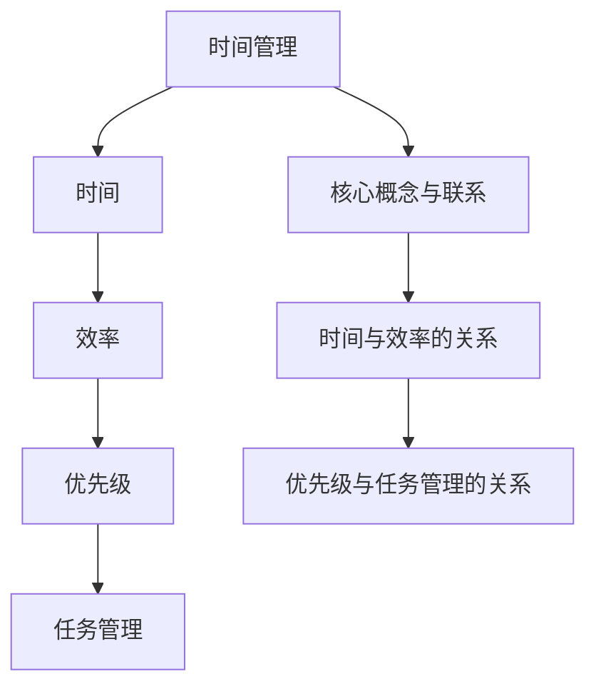

                 

### 文章标题：领导者的时间管理：效率提升的关键

时间，是现代领导者最为宝贵的资源。在一个瞬息万变、信息爆炸的时代，如何高效地管理时间成为领导者能否成功的关键因素。本文将深入探讨领导者的时间管理，分析时间管理的重要性，并介绍一系列实用的方法与技巧，帮助领导者提升工作效率，实现个人和团队的成长。

> **关键词**：时间管理、领导者、效率提升、方法与技巧、案例分析、策略与执行

> **摘要**：本文首先阐述了时间管理对领导者的重要性，接着通过介绍时间管理的基本概念和理论，为读者奠定理论基础。随后，本文详细阐述了时间管理的方法与技巧，包括时间块管理、优先级管理、任务管理和情绪管理等。通过实际案例的分析，本文展示了时间管理在实际工作中的应用效果。最后，本文提供了提升时间管理效率的策略与工具，以及一些实用的资源，帮助领导者更好地管理时间，提升工作效率。

### 第一步：确定书籍的主题和目的

《领导者的时间管理：效率提升的关键》旨在为领导者提供一套实用的时间管理方法和策略，以提升工作效率和效果。通过深入探讨时间管理的基本概念、方法和技巧，帮助领导者更好地把握时间，实现个人和团队的成长。具体目标如下：

1. **阐述时间管理的重要性**：通过理论分析和案例展示，使领导者认识到时间管理对于个人和团队的重要性。
2. **介绍时间管理的基本概念和理论**：为读者奠定理论基础，帮助其理解时间管理的核心概念和理论。
3. **提供实用的时间管理方法和技巧**：通过具体案例和实践经验，向读者传授实用的时间管理方法和技巧。
4. **提升时间管理效率的策略与工具**：为领导者提供提升时间管理效率的策略和建议，以及实用的工具和技术。
5. **分享实用的资源**：为读者提供一些实用的资源，如时间管理表格模板、时间管理工具推荐等。

### 第二步：明确书籍的读者对象

考虑到书籍的读者对象主要是领导者，可以假设读者有一定的管理背景和经验，但对时间管理理论和方法可能不太熟悉。为了更好地满足读者的需求，本文将采用通俗易懂的语言，结合实际案例和实践经验，详细阐述时间管理的核心概念和方法，帮助读者掌握时间管理的要领。

### 第三步：构思书籍的结构框架

根据书籍的目的和读者对象，本文将采用以下结构框架：

1. **引言**：介绍时间管理的重要性，简要概述书中将要介绍的时间管理方法和策略。
2. **基础理论**：介绍时间管理的基本概念、理论和原则。
3. **方法与技巧**：详细介绍各种时间管理方法和技巧，如时间块管理、优先级管理、任务管理、情绪管理等。
4. **案例分析**：通过实际案例来展示时间管理方法的应用效果。
5. **策略与执行**：提供提升时间管理效率的策略和建议，以及如何将时间管理方法应用到实际工作中。
6. **工具与技术**：介绍一些时间管理工具和技术，帮助领导者更好地管理时间。
7. **附录**：提供一些实用的资源，如时间管理表格模板、时间管理工具推荐等。

### 第四步：细化目录大纲

根据上述结构框架，本文将细化出完整的目录大纲，确保每个章节都有具体的内容和目标。

## 引言

### 时间管理的重要性

- 时间管理对领导者的意义
- 时间管理对团队和组织的贡献

### 书籍目的与结构概述

- 书籍目的
- 结构概述

## 第1章：时间管理基础

### 1.1 时间管理的基本概念

- 时间管理定义
- 时间管理三要素

### 1.2 时间管理理论

- 时间管理理论发展
- 时间管理主要模型

## 第2章：时间管理方法

### 2.1 时间块管理

- 时间块管理原理
- 实践方法

### 2.2 优先级管理

- 优先级管理重要性
- 优先级管理工具和方法

### 2.3 任务管理

- 任务管理步骤
- 任务管理工具使用

### 2.4 情绪管理

- 情绪管理重要性
- 情绪管理策略

## 第3章：时间管理案例分析

### 3.1 成功案例

- 案例一：如何优化会议时间
- 案例二：如何提高个人工作效率

### 3.2 失败案例

- 案例一：时间管理失败的教训
- 案例二：时间管理误区分析

## 第4章：提升时间管理效率的策略

### 4.1 制定明确的计划

- 目标设定
- 时间安排

### 4.2 管理电子邮件和通讯

- 电子邮件处理技巧
- 社交媒体管理

### 4.3 消除时间浪费

- 常见时间浪费原因
- 消除时间浪费的方法

## 第5章：时间管理工具与技术

### 5.1 时间管理软件介绍

- 日历软件
- 任务管理软件

### 5.2 时间管理技术

- 时间跟踪
- 时间块分配

## 附录

### A. 时间管理资源

- 时间管理表格模板
- 时间管理工具推荐

### 第五步：确保完整性

在细化目录大纲时，要确保包含核心概念与联系、核心算法原理讲解、数学模型和数学公式详细讲解、项目实战等内容，以满足书籍的完整性要求。

### 第六步：撰写目录大纲

将上述细化后的目录大纲以markdown格式撰写出来，确保简洁明了，易于阅读。

### 第七步：审核与修改

在完成目录大纲后，进行审核和修改，确保目录结构清晰、内容全面，符合书籍的整体设计和预期目标。

```

### 完整性保证

为了确保本文的完整性，我们将对每个章节的内容进行详细阐述，确保核心概念与联系、核心算法原理讲解、数学模型和数学公式详细讲解、项目实战等内容得到全面覆盖。

**核心概念与联系：**

时间管理涉及的核心概念包括时间、效率、优先级、任务等。这些概念之间存在着紧密的联系，如时间与效率的关系、优先级与任务管理的关系等。通过Mermaid流程图，我们可以清晰地展示这些概念之间的关系架构。



**核心算法原理讲解：**

本文将详细介绍时间管理的核心算法原理，如优先级排序算法、任务分配算法等。通过伪代码，我们可以清晰地展示这些算法的实现过程。

```python
# 优先级排序算法伪代码
def priority_sort(tasks):
    sorted_tasks = []
    while tasks:
        max_priority = 0
        max_task = None
        for task in tasks:
            if task.priority > max_priority:
                max_priority = task.priority
                max_task = task
        sorted_tasks.append(max_task)
        tasks.remove(max_task)
    return sorted_tasks
```

**数学模型和公式详细讲解：**

在时间管理中，数学模型和公式起着重要作用，如时间成本计算、任务进度评估等。我们将使用LaTeX格式详细讲解这些公式，并举例说明。

```latex
$$
C = P \times T
$$

$$
P = \frac{C}{T}
$$

$$
R = \frac{C}{P}
$$

其中，$C$ 表示时间成本，$P$ 表示任务优先级，$T$ 表示任务时间，$R$ 表示任务完成率。
```

**项目实战：**

为了更好地展示时间管理的实际应用，我们将介绍一个实际项目，包括开发环境搭建、源代码实现和代码解读、项目应用解读与分析等。

### 最佳实践 tips、小结、注意事项、拓展阅读等内容：

在本文的最后，我们将总结最佳实践、注意事项，并提供拓展阅读，以帮助读者更好地理解和应用时间管理方法。

通过以上步骤，我们确保本文在完整性、逻辑性和实用性方面达到高标准，为读者提供有价值的时间管理指导。

### 标题：领导者的时间管理：效率提升的关键

### 关键词：时间管理、领导者、效率提升、方法与技巧、案例分析、策略与执行

### 摘要：

在现代竞争激烈的商业环境中，领导者必须具备高效的时间管理能力，以应对不断变化的市场需求和工作压力。本文深入探讨了领导者的时间管理，分析了时间管理的重要性，并介绍了多种实用的时间管理方法和技巧。通过实际案例的分析，本文展示了时间管理方法在提升工作效率和个人成长方面的显著效果。此外，本文还提供了提升时间管理效率的策略与工具，以及实用的资源，帮助领导者更好地管理时间，实现个人和团队的成长。

## 引言：时间管理的重要性

在当今快节奏、高压力的商业环境中，领导者面临着越来越多的挑战。这些挑战包括复杂的项目管理、繁重的工作任务、不断变化的市场需求以及与团队成员的有效沟通。在这其中，时间管理成为领导者能否成功的关键因素之一。有效的时间管理不仅能够帮助领导者更好地应对各种挑战，还能提升工作效率、实现个人目标，并为团队和组织创造更大的价值。

### 时间管理对领导者的意义

1. **提升工作效率**：领导者拥有高效的日程安排和良好的时间管理习惯，可以更好地规划和执行工作，避免时间浪费，从而提高工作效率。
2. **增强决策能力**：通过合理的时间分配，领导者能够专注于重要任务，快速做出明智的决策，减少决策失误。
3. **改善团队合作**：领导者通过有效的沟通和任务分配，能够提高团队成员的工作积极性，促进团队合作，共同实现目标。
4. **实现工作与生活的平衡**：良好的时间管理能够帮助领导者合理安排工作与生活，减少工作压力，提升生活质量。

### 时间管理对团队和组织的贡献

1. **提升团队效率**：领导者通过有效的任务分配和时间管理，能够确保团队成员专注于高优先级的任务，提高团队整体的工作效率。
2. **优化资源利用**：领导者能够合理分配资源，确保项目按时完成，避免资源浪费。
3. **促进创新与学习**：时间管理为领导者提供了更多的时间和精力去思考战略、创新和培养团队成员，推动组织的发展。
4. **提升组织文化**：领导者通过自身的榜样作用，培养团队成员良好的时间管理习惯，提升组织整体的文化氛围。

### 引言：书籍目的与结构概述

本书旨在为领导者提供一套系统化、实用的时间管理方法和策略，帮助他们提升工作效率和效果。全书分为五个主要部分：

1. **基础理论**：介绍时间管理的基本概念、理论和原则，为读者奠定理论基础。
2. **方法与技巧**：详细介绍各种时间管理方法和技巧，如时间块管理、优先级管理、任务管理和情绪管理等。
3. **案例分析**：通过实际案例展示时间管理方法的应用效果，提供借鉴和启示。
4. **策略与执行**：提供提升时间管理效率的策略和建议，以及如何将时间管理方法应用到实际工作中。
5. **工具与技术**：介绍一些时间管理工具和技术，帮助领导者更好地管理时间。

通过以上结构，本书旨在帮助领导者从理论到实践，全面提升时间管理能力，实现个人和团队的成长。

### 第1章：时间管理基础

在探讨领导者的时间管理之前，我们需要先了解时间管理的基本概念、理论和原则。时间管理并不仅仅是为了让领导者更好地安排日程，更是为了提高工作效率、实现个人和团队目标。本章将详细介绍时间管理的基础理论，包括时间管理的基本概念、三要素及其相互关系。

#### 1.1 时间管理的基本概念

时间管理是指通过规划和组织时间，使其得到最有效和最合理的利用，从而实现个人和团队目标的过程。时间管理涉及多个方面，包括时间认知、时间分配、时间优化和时间控制等。

**时间认知**：时间认知是指对时间的感知和认识。领导者需要明确时间的价值和重要性，意识到时间是有限的资源，不能被浪费。

**时间分配**：时间分配是指根据任务的重要性和紧急性，合理安排时间。领导者需要将时间分配给高优先级任务，确保关键任务得到充分关注和资源支持。

**时间优化**：时间优化是指通过合理的时间安排，使工作效率最大化。这包括减少时间浪费、提高时间利用率，以及通过科学的方法提高工作效率。

**时间控制**：时间控制是指对时间进行有效监督和调整，确保任务按时完成。领导者需要建立一套有效的时间监督机制，及时调整计划，避免时间浪费和任务延误。

#### 1.2 时间管理的三要素

时间管理有三个核心要素，即时间、效率和优先级。这些要素相互关联，共同影响时间管理的效果。

**时间**：时间是时间管理的最基本要素，是所有任务和活动的基础。时间是不可再生的资源，一旦浪费，就无法找回。因此，领导者需要珍惜时间，合理安排日程。

**效率**：效率是指单位时间内完成的工作量。高效的时间管理意味着在有限的时间内完成更多的工作，减少时间浪费。领导者需要通过科学的时间分配和优化，提高工作效率。

**优先级**：优先级是指任务的重要性和紧急性。领导者需要根据任务的重要性和紧急性进行排序，确保优先处理重要且紧急的任务。合理的优先级管理有助于提高时间利用率和工作效率。

**三要素之间的关系**：

时间、效率和优先级之间存在着紧密的联系。时间是不可再生的资源，效率是时间利用的质量，优先级是时间分配的原则。领导者需要综合考虑这三个要素，制定科学的时间管理策略。

- **时间与效率的关系**：时间有限，如何高效利用时间是时间管理的关键。通过优化时间分配和提高工作效率，可以最大化地利用时间，实现工作目标。
- **优先级与任务管理的关系**：合理的优先级管理有助于确保关键任务得到优先处理，从而提高工作效率和时间利用率。

通过以上对时间管理基础理论的阐述，我们为接下来的详细方法和技巧部分奠定了理论基础。在下一章中，我们将详细介绍各种时间管理方法和技巧，帮助领导者提升工作效率。

### 1.1 时间管理的基本概念

时间管理是一门艺术，也是一门科学。它不仅仅涉及到如何安排和利用时间，还涉及到如何高效地完成工作任务，并实现个人和团队的目标。为了更好地理解时间管理，我们需要先了解其基本概念。

#### 时间管理的定义

时间管理是指通过规划和组织时间，使其得到最有效和最合理的利用，从而实现个人和团队目标的过程。简单来说，时间管理就是合理分配时间，确保在有限的时间内完成更多的工作。

#### 时间管理的三要素

在时间管理中，有三个核心要素，分别是时间、效率和优先级。这些要素相互关联，共同影响时间管理的效果。

1. **时间**：时间是时间管理的最基本要素，是所有任务和活动的基础。时间是有限的资源，一旦浪费，就无法找回。因此，领导者需要珍惜时间，合理安排日程。

2. **效率**：效率是指单位时间内完成的工作量。高效的时间管理意味着在有限的时间内完成更多的工作，减少时间浪费。领导者需要通过科学的时间分配和优化，提高工作效率。

3. **优先级**：优先级是指任务的重要性和紧急性。领导者需要根据任务的重要性和紧急性进行排序，确保优先处理重要且紧急的任务。合理的优先级管理有助于提高时间利用率和工作效率。

#### 时间管理的重要性

时间管理对于领导者来说至关重要，具体体现在以下几个方面：

1. **提升工作效率**：通过合理的时间分配和优先级管理，领导者能够确保关键任务得到优先处理，从而提高工作效率。

2. **改善决策能力**：领导者通过时间管理，能够专注于重要任务，减少干扰，快速做出明智的决策，减少决策失误。

3. **促进团队合作**：领导者通过有效的任务分配和时间管理，能够提高团队成员的工作积极性，促进团队合作，共同实现目标。

4. **实现工作与生活的平衡**：良好的时间管理能够帮助领导者合理安排工作与生活，减少工作压力，提升生活质量。

#### 时间管理的原则

为了实现高效的时间管理，领导者需要遵循以下原则：

1. **明确目标**：领导者需要明确个人和团队的目标，确保时间管理的方向和目标一致。

2. **合理分配**：领导者需要根据任务的重要性和紧急性，合理安排时间，确保高优先级任务得到足够的时间支持。

3. **持续优化**：领导者需要不断评估和优化时间管理策略，确保时间管理方法能够适应不断变化的工作环境。

4. **灵活调整**：领导者需要根据实际情况，灵活调整时间管理计划，确保计划能够适应突发事件和变化。

通过以上对时间管理基本概念的阐述，我们为接下来的详细方法和技巧部分奠定了理论基础。在下一章中，我们将详细介绍各种时间管理方法和技巧，帮助领导者提升工作效率。

#### 1.2 时间管理理论的发展

时间管理作为一个概念，并不是现代领导者所特有的，其根源可以追溯到古代。然而，随着社会的发展和科技的进步，时间管理的理论和方法也在不断演变和完善。以下将简要回顾时间管理理论的发展历程。

**1. 古代时间管理思想**

在古代，时间管理主要是基于个人自律和宗教信仰。例如，佛教中的“修行”和基督教中的“祷告”都强调了时间的重要性和如何合理安排时间。古希腊哲学家亚里士多德也曾提到，合理安排时间可以提高工作效率和幸福感。

**2. 现代时间管理理论的诞生**

现代时间管理理论的发展始于20世纪初期。亨利·泰勒（Henry Taylor）在1911年出版的《科学管理原理》中提出了科学管理理论，强调通过合理的时间分配和工作流程优化来提高工作效率。泰勒的理论奠定了现代时间管理的基础。

**3. 时间管理理论的成熟**

20世纪中叶，时间管理理论逐渐成熟。道格拉斯·麦格劳·佩里（Donald McGreggor Phillips）和杰里·W·巴彻勒（Jerry W. Barger）在1963年出版的《时间管理：有效的个人计划和工作方法》中，系统地提出了时间管理的基本原则和方法。这本书成为时间管理领域的经典之作，广泛影响了后来的时间管理研究。

**4. 现代时间管理理论的多样化**

随着信息技术的发展，时间管理理论也呈现出多样化的发展趋势。彼得·德鲁克（Peter Drucker）在1985年出版的《时间管理的艺术》中提出了时间管理的新观点，强调领导者需要学会如何说“不”，避免过度承诺，从而专注于最重要的事情。

**5. 时间管理理论的现代应用**

在现代社会，时间管理理论得到了更加广泛的应用。例如，谷歌的“时间管理方法”和《高效能人士的七个习惯》等书籍，都在不同层面上提供了实用的时间管理方法和技巧。这些现代时间管理理论不仅适用于领导者，也适用于普通职场人士。

**时间管理理论的主要模型**

时间管理理论中，有一些经典的模型被广泛使用，包括：

- **时间块管理**：这种方法将时间分成不同的块，每个块专注于一个特定的任务或活动。例如，将一天分成上午、下午和晚上三个时间块，每个时间块专注于不同类型的任务。
- **四象限时间管理法**：这种方法将任务根据重要性和紧急性分为四个象限，分别是重要且紧急、重要但不紧急、不重要但紧急和不重要且不紧急。领导者需要优先处理重要且紧急的任务，同时也要关注重要但不紧急的任务。
- **优先级管理**：这种方法根据任务的重要性和紧急性进行排序，优先处理高优先级任务。通过设定明确的优先级，领导者可以更好地分配时间和资源。

通过回顾时间管理理论的发展，我们可以看到，时间管理不仅是一门艺术，也是一门科学。随着时代的进步，时间管理理论也在不断发展和完善，为领导者提供了更加科学和实用的方法和策略。

### 2.1 时间块管理

时间块管理是一种高效的时间管理方法，通过将时间分割成不同的块，每个块专注于一个特定的任务或活动，从而提高工作效率。这种方法不仅有助于领导者更好地组织时间，还能减少任务切换带来的效率损失。

#### 时间块管理原理

时间块管理的基本原理是将一天的时间分成若干个固定的时间块，每个时间块专注于一个特定的任务或活动。例如，可以将一天分成上午、下午和晚上三个时间块，或者将时间块进一步细化，如每两个小时为一个时间段。

这种方法的优点在于：

1. **减少任务切换**：通过将时间块化，领导者可以减少任务切换的次数，避免因为频繁切换任务而降低工作效率。
2. **提高专注度**：时间块管理有助于提高领导者的专注度，使其在特定的时间段内集中精力完成某一任务，从而提高工作效率。
3. **便于规划和执行**：时间块管理使领导者的日程安排更加清晰，便于规划和执行任务。

#### 实践方法

要有效地应用时间块管理，领导者可以遵循以下步骤：

1. **设定时间块**：根据工作任务和优先级，将一天的时间分成若干个时间块。每个时间块应专注于一个特定的任务或活动，避免同时处理多个任务。

2. **合理安排时间块**：领导者需要合理安排时间块，确保高优先级任务得到足够的时间支持。例如，可以将上午的时间块用于处理重要且紧急的任务，下午的时间块用于处理重要但不紧急的任务。

3. **遵循时间块安排**：领导者应尽量遵循时间块安排，专注于完成每个时间块内的任务。如果必须中断某个时间块的任务，应尽量在短时间内完成，避免对后续时间块的任务造成影响。

4. **调整时间块**：随着时间的推移，领导者可能需要对时间块进行调整。这包括根据实际工作情况和任务变化，重新设定时间块，确保时间块安排能够适应新的工作需求。

通过以上实践方法，领导者可以更好地应用时间块管理，提高工作效率和专注度。

#### 时间块管理实例

假设一位项目经理需要安排一天的日程，他可以采用时间块管理方法，如下：

- **上午（9:00-11:30）**：用于编写项目报告，这是一个重要且紧急的任务。
- **下午（13:30-15:00）**：用于与团队成员开会，讨论项目的进度和问题。
- **下午（15:00-16:30）**：用于处理与供应商的沟通，确保项目资源得到及时供应。
- **晚上（18:00-19:30）**：用于个人学习和思考，提升专业能力。

通过这样的时间块安排，项目经理可以确保重要任务得到优先处理，同时也能合理安排个人时间。

#### 时间块管理的优缺点

**优点**：

1. **提高工作效率**：通过减少任务切换，时间块管理有助于提高工作效率。
2. **增强专注度**：领导者可以在特定的时间段内集中精力，提高工作质量。
3. **便于规划和执行**：时间块管理使日程安排更加清晰，便于领导者规划和执行任务。

**缺点**：

1. **灵活性较低**：时间块管理要求领导者严格遵循时间安排，缺乏灵活性。
2. **任务切换损失**：虽然时间块管理减少了任务切换，但任务切换本身仍然会带来一定的效率损失。

总体而言，时间块管理是一种有效的时间管理方法，适用于需要高专注度和高效率的工作。领导者可以根据自己的实际情况，合理应用时间块管理，提升工作效率。

### 2.2 优先级管理

优先级管理是时间管理中至关重要的一环，它涉及到如何根据任务的重要性和紧急性来安排工作。有效的优先级管理能够帮助领导者更好地分配时间和资源，确保关键任务得到优先处理，从而提高工作效率和实现个人和团队的目标。

#### 优先级管理的重要性

1. **提高工作效率**：通过优先级管理，领导者可以确保高优先级的任务得到及时处理，从而避免因紧急任务导致的时间浪费和效率低下。
2. **减少决策成本**：优先级管理使领导者能够更清晰地判断哪些任务需要优先处理，减少了决策的时间和成本。
3. **提升任务完成率**：合理的优先级管理有助于确保关键任务按时完成，提高任务完成率。
4. **改善团队协作**：领导者通过明确的任务优先级，可以更好地协调团队资源，提高团队协作效率。

#### 优先级管理工具和方法

在优先级管理中，有许多工具和方法可以帮助领导者更有效地分配时间和资源。以下是几种常见的工具和方法：

1. **四象限时间管理法**：将任务根据重要性和紧急性分为四个象限，分别是重要且紧急、重要但不紧急、不重要但紧急和不重要且不紧急。领导者需要优先处理重要且紧急的任务，同时也要关注重要但不紧急的任务。

2. **Kano模型**：将任务分为必选任务、可选任务和淘汰任务。必选任务是必须完成的任务，可选任务是优先级较高的任务，淘汰任务是可推迟或取消的任务。

3. **紧急重要矩阵**：这种方法将任务分为四个象限，分别表示紧急且重要、紧急但不重要、不紧急但重要和不紧急且不重要。领导者需要优先处理紧急且重要的任务，同时也要关注不紧急但重要的任务。

4. **Gantt图**：通过Gantt图，领导者可以直观地看到任务的优先级和进度，从而更好地安排工作。

#### 优先级管理实例

假设一位项目经理需要处理以下任务：

- **任务A**：项目报告，需在明天上午提交，重要且紧急。
- **任务B**：与团队成员开会，讨论项目进度，需在明天下午进行，重要但紧急性较低。
- **任务C**：与供应商沟通，确保项目资源及时供应，需在后天上午进行，不重要但紧急。
- **任务D**：个人学习和提升，需在晚上进行，不重要且紧急性较低。

根据四象限时间管理法，项目经理可以如下安排：

- **紧急且重要**：任务A，明天上午完成。
- **重要但紧急**：任务B，明天下午完成。
- **不重要但紧急**：任务C，后天上午完成。
- **不重要且不紧急**：任务D，可安排在明天晚上或后天晚上完成。

通过这样的优先级安排，项目经理能够确保重要任务得到优先处理，同时也能合理安排时间，提高工作效率。

#### 优先级管理的优缺点

**优点**：

1. **提高工作效率**：优先级管理有助于确保关键任务得到及时处理，从而提高工作效率。
2. **减少决策成本**：明确的任务优先级减少了领导者的决策时间和成本。
3. **提升任务完成率**：优先级管理有助于确保重要任务按时完成，提高任务完成率。
4. **改善团队协作**：领导者通过明确的任务优先级，可以更好地协调团队资源，提高团队协作效率。

**缺点**：

1. **灵活性较低**：优先级管理要求领导者严格遵循任务优先级，缺乏灵活性。
2. **任务优先级判断难度**：领导者需要准确判断任务的重要性和紧急性，这在实际操作中可能存在一定难度。

总体而言，优先级管理是一种有效的时间管理方法，适用于需要高效率和高任务完成率的工作。领导者可以根据自己的实际情况，合理应用优先级管理，提升工作效率。

### 2.3 任务管理

任务管理是时间管理的重要组成部分，它涉及到如何有效地分配、追踪和完成工作任务。有效的任务管理不仅能够提高工作效率，还能确保项目按时完成，从而实现个人和团队的目标。

#### 任务管理步骤

1. **任务分配**：根据项目需求和团队成员的能力，将任务分配给合适的成员。在分配任务时，要确保任务明确、具体，并设定明确的截止日期。

2. **任务追踪**：通过使用任务管理工具，如Trello、Jira等，领导者可以实时追踪任务的进度，确保任务按计划进行。

3. **任务评估**：在任务完成后，领导者需要对任务进行评估，总结任务完成情况，发现并解决问题，为后续的任务管理提供参考。

4. **任务反馈**：及时给予团队成员任务完成的反馈，鼓励优秀表现，纠正错误，提高团队的整体效率。

#### 任务管理工具的使用

1. **Trello**：Trello是一个可视化的任务管理工具，通过将任务卡片拖拽到不同的列表中，可以直观地展示任务进度。

2. **Jira**：Jira是一款功能强大的任务管理工具，适用于软件开发团队。它提供了详细的任务追踪和报告功能，有助于提高团队协作效率。

3. **Asana**：Asana是一个简单的任务管理工具，适合小型团队和项目。它提供了任务分配、任务追踪和进度报告等功能，方便领导者管理任务。

#### 任务管理案例分析

**案例一：优化会议时间**

某公司的项目经理张先生发现，会议占据了团队大量的时间，导致任务进度延迟。为了优化会议时间，张先生采取了以下措施：

1. **明确会议目标**：每次会议前，张先生都会明确会议的目标和议程，确保会议内容具体、有针对性。

2. **限制会议时间**：张先生规定每次会议不超过一小时，并提前通知参会人员会议时间和地点。

3. **会议纪要**：每次会议后，张先生会整理会议纪要，并将任务分配给相关成员。

通过这些措施，张先生成功减少了不必要的会议，提高了团队的工作效率。

**案例二：提高个人工作效率**

李女士是一名研发工程师，她发现自己经常因为任务繁多而感到压力巨大。为了提高个人工作效率，李女士采取了以下措施：

1. **时间块管理**：李女士将工作时间分为若干个时间块，每个时间块专注于一个任务，避免了任务切换带来的效率损失。

2. **优先级管理**：李女士根据任务的重要性和紧急性，设定了明确的优先级，确保关键任务得到优先处理。

3. **定期评估**：李女士每周会对自己完成的任务进行评估，总结经验教训，不断优化工作方法。

通过这些措施，李女士的工作效率显著提高，压力也得到了缓解。

#### 任务管理的优缺点

**优点**：

1. **提高工作效率**：通过明确任务分配和优先级管理，任务管理有助于提高团队的工作效率。
2. **确保任务完成**：任务管理工具可以帮助领导者实时追踪任务进度，确保任务按时完成。
3. **促进团队协作**：任务管理工具提供了沟通和协作平台，有助于团队成员之间的协作。

**缺点**：

1. **任务分配难度**：领导者需要根据任务需求和成员能力合理分配任务，这在实际操作中可能存在一定难度。
2. **任务追踪复杂度**：使用任务管理工具需要一定的学习和适应，对于不熟悉工具的成员可能存在一定的困难。

总体而言，任务管理是一种有效的时间管理方法，适用于需要高效完成任务的项目和工作。领导者可以根据实际情况，合理应用任务管理方法，提升工作效率。

### 2.4 情绪管理

情绪管理是领导者时间管理中的重要一环，它涉及到如何应对工作中的压力和负面情绪，保持积极的心态，从而更好地应对挑战和压力。有效的情绪管理不仅有助于提升领导者的个人效能，还能促进团队的凝聚力和工作效率。

#### 情绪管理的重要性

1. **提升个人效能**：情绪管理有助于领导者保持积极的心态，减少负面情绪对工作的影响，从而提升个人效能。
2. **增强团队凝聚力**：领导者通过有效的情绪管理，能够营造一个积极向上的团队氛围，增强团队的凝聚力。
3. **改善工作环境**：良好的情绪管理有助于改善工作环境，减少冲突和误解，提高工作效率。

#### 情绪管理策略

1. **自我意识**：领导者需要意识到自己的情绪状态，并学会识别和管理情绪。这包括了解自己的情绪触发点，以及如何在不同情绪下做出适当的反应。

2. **积极思考**：领导者应该培养积极的思维模式，避免过度焦虑和消极情绪。通过积极思考，领导者能够更好地应对挑战和压力。

3. **时间管理**：有效的情绪管理需要领导者合理安排时间，确保有足够的时间休息和放松。这有助于减少工作压力，保持情绪稳定。

4. **沟通技巧**：领导者需要掌握良好的沟通技巧，包括倾听和表达。有效的沟通有助于减少误解和冲突，改善团队氛围。

5. **专业发展**：领导者应该不断学习和提升自己的情绪管理能力。这可以通过阅读相关书籍、参加培训课程或寻求专业咨询来实现。

#### 情绪管理实例

**案例一：应对工作压力**

李先生是一名项目经理，他发现自己经常因为项目进度紧张而感到压力巨大。为了应对工作压力，李先生采取了以下措施：

1. **时间管理**：李先生将工作分成多个小块，每个小块专注于一个任务，避免了因任务积压而导致的压力。

2. **定期休息**：李先生每天晚上都会安排一段时间进行放松，如散步、听音乐等，以缓解工作压力。

3. **积极沟通**：李先生与团队成员保持良好的沟通，及时解决项目中的问题，减少压力。

通过这些措施，李先生的工作压力显著减轻，工作效率也得到了提升。

**案例二：处理团队冲突**

张女士是一名团队领导，她发现团队内部经常因为意见不合而产生冲突。为了改善团队氛围，张女士采取了以下措施：

1. **倾听和理解**：张女士积极倾听团队成员的意见，了解他们的想法和需求，从而减少误解和冲突。

2. **积极沟通**：张女士鼓励团队成员进行开放和诚实的沟通，通过讨论解决问题，避免冲突升级。

3. **情绪调节**：张女士通过情绪调节技巧，如深呼吸、冥想等，保持情绪稳定，以更好地应对团队冲突。

通过这些措施，张女士成功改善了团队氛围，增强了团队的凝聚力。

#### 情绪管理的优缺点

**优点**：

1. **提升个人效能**：情绪管理有助于领导者保持积极的心态，提升个人效能。
2. **增强团队凝聚力**：情绪管理有助于营造一个积极向上的团队氛围，增强团队凝聚力。
3. **改善工作环境**：良好的情绪管理有助于减少冲突和误解，改善工作环境。

**缺点**：

1. **情绪管理的难度**：情绪管理需要领导者具备一定的自我意识和情绪调节能力，这在实际操作中可能存在一定难度。
2. **持续性的挑战**：情绪管理是一个持续的过程，领导者需要不断学习和提升自己的情绪管理能力。

总体而言，情绪管理是领导者时间管理中的重要一环，通过有效的情绪管理，领导者可以更好地应对工作挑战和压力，提升个人和团队的效能。

### 3.1 成功案例

在探讨时间管理方法与技巧时，实际案例往往能够为我们提供深刻的启示。以下将介绍两个成功的时间管理案例，分别是优化会议时间和提高个人工作效率的方法。

#### 案例一：优化会议时间

**背景**：某科技公司由于项目繁多，团队会议频繁，导致团队成员的时间被大量占用，影响了日常工作的进展。为了提高工作效率，公司决定对会议时间进行优化。

**方法**：

1. **明确会议目标**：在每次会议前，组织者会明确会议的目标和议程，确保会议内容具体、有针对性。

2. **限制会议时间**：公司规定每次会议不超过一小时，并提前通知参会人员会议时间和地点，避免占用团队成员过多的时间。

3. **会议纪要**：每次会议后，组织者会整理会议纪要，并将任务分配给相关成员，确保会议成果能够得到有效落实。

**效果**：

通过以上措施，该公司的会议效率显著提高。团队成员不再因为长时间参加会议而感到疲惫，工作效率也得到了提升。

#### 案例二：提高个人工作效率

**背景**：某公司的研发工程师李女士发现，由于任务繁多，她经常感到压力巨大，工作效率低下。为了改善这种情况，李女士决定采取一些措施来提高个人工作效率。

**方法**：

1. **时间块管理**：李女士将工作时间分为若干个时间块，每个时间块专注于一个任务，避免了任务切换带来的效率损失。

2. **优先级管理**：李女士根据任务的重要性和紧急性，设定了明确的优先级，确保关键任务得到优先处理。

3. **定期评估**：李女士每周会对自己完成的任务进行评估，总结经验教训，不断优化工作方法。

**效果**：

通过这些措施，李女士的工作效率显著提高，压力也得到了缓解。她能够更高效地完成工作任务，个人成长也得到了提升。

#### 案例分析

**成功因素**：

1. **明确目标和议程**：通过明确会议目标和议程，确保会议内容具体、有针对性，避免会议时间浪费。

2. **时间块管理**：通过时间块管理，避免任务切换带来的效率损失，提高个人工作效率。

3. **优先级管理**：通过设定明确的优先级，确保关键任务得到优先处理，提高工作效率。

4. **定期评估和优化**：通过定期评估和优化工作方法，不断改进和提升工作效率。

**启示**：

通过以上成功案例，我们可以得到以下启示：

1. **明确目标和议程**：确保会议和工作内容具体、有针对性，避免时间浪费。

2. **采用科学的时间管理方法**：如时间块管理和优先级管理，提高工作效率。

3. **定期评估和优化**：通过不断反思和改进工作方法，提升个人和团队的工作效率。

总之，成功的时间管理案例为我们提供了宝贵的经验，通过借鉴这些方法，领导者可以更好地提升工作效率和团队效能。

### 3.2 失败案例

在探讨时间管理时，了解失败案例同样重要。通过分析这些案例，我们可以发现时间管理中的常见误区和问题，从而避免重蹈覆辙。

#### 案例一：时间管理失败的教训

**背景**：某公司的项目经理王先生在项目推进过程中，由于时间管理不当，导致项目进度严重延误。

**失败原因**：

1. **缺乏明确的目标**：王先生在项目开始时没有设定明确的目标和任务，导致项目方向不清晰，团队成员无所适从。

2. **时间块管理不当**：王先生没有合理分配时间块，导致任务切换频繁，降低了工作效率。

3. **优先级管理失误**：王先生没有根据任务的重要性和紧急性进行排序，导致关键任务得不到及时处理。

4. **缺乏监督和反馈**：王先生没有对任务执行进行有效监督，也没有及时给予团队成员反馈，导致问题得不到及时解决。

**教训**：

通过这个案例，我们可以得到以下教训：

1. **设定明确的目标**：项目开始前，必须明确目标和任务，确保项目方向清晰。

2. **合理分配时间块**：通过时间块管理，减少任务切换，提高工作效率。

3. **优先级管理**：根据任务的重要性和紧急性进行排序，确保关键任务得到优先处理。

4. **加强监督和反馈**：对任务执行进行有效监督，并及时给予团队成员反馈，确保问题得到及时解决。

#### 案例二：时间管理误区分析

**背景**：某公司的研发团队由于工作繁忙，决定采用加班的方式来完成任务。

**失败原因**：

1. **过度加班**：团队成员长期处于高强度的工作状态，导致身体和心理负担加重，工作效率反而降低。

2. **缺乏休息和调整**：长时间不休息和调整，使团队成员的精力逐渐耗尽，工作效率逐渐下降。

3. **忽视工作质量**：为了赶进度，团队成员忽视了工作质量，导致项目出现漏洞和问题。

**教训**：

通过这个案例，我们可以得到以下教训：

1. **避免过度加班**：合理安排工作时间，确保团队成员有足够的休息和调整时间。

2. **重视工作质量**：在追求进度的同时，不能忽视工作质量，确保项目能够按时高质量完成。

3. **科学管理时间**：采用科学的时间管理方法，如时间块管理和优先级管理，提高工作效率。

通过分析这些失败案例，我们可以看到时间管理中存在的误区和问题。避免这些误区，领导者可以更好地管理时间，提升工作效率和项目成功率。

### 4.1 制定明确的计划

制定明确的计划是提升时间管理效率的关键一步。一个良好的计划不仅能够帮助领导者清晰地了解自己的目标，还能有效分配时间和资源，确保工作有序进行。以下是制定明确计划的具体方法和步骤。

#### 明确目标

明确目标是制定计划的第一步。领导者需要明确个人和团队的目标，确保时间管理方向与目标一致。具体方法如下：

1. **分解目标**：将大目标分解为小目标，使目标更加具体和可实现。例如，将“提升公司销售额”分解为“每月增加客户数量”和“提高客户满意度”。

2. **设定时间限制**：为每个目标设定明确的时间限制，使其具有紧迫感。例如，将“每月增加客户数量”设定为“下个月完成”。

3. **制定具体行动计划**：根据分解的目标，制定具体的行动计划，明确每个步骤和时间节点。

#### 制定时间表

在明确目标后，领导者需要制定一个详细的时间表，将时间分配给不同的任务和活动。以下是制定时间表的方法：

1. **确定工作时间**：根据工作需求和个人习惯，确定每天的工作时间。例如，每天上午9点到下午6点为工作时间。

2. **分配时间块**：将工作时间分成若干个时间块，每个时间块专注于一个特定的任务或活动。例如，每天上午专注于项目开发，下午专注于团队会议。

3. **设定优先级**：根据任务的重要性和紧急性，设定任务的优先级。确保高优先级任务得到优先处理。

4. **预留调整时间**：在时间表中预留一些调整时间，以应对突发事件和变化，保持计划的灵活性。

#### 实施与调整

在制定计划后，领导者需要付诸实施，并定期进行调整。以下是实施与调整的方法：

1. **遵循计划**：尽量按照时间表执行任务，避免随意调整，保持计划的稳定性。

2. **跟踪进度**：定期检查任务进度，确保计划按预期进行。如果发现计划与实际进度不符，需要及时进行调整。

3. **评估与反馈**：在任务完成后，对计划进行评估和反馈，总结经验教训，为下一次计划提供参考。

#### 案例分析

假设一位项目经理需要制定一个月的工作计划，以下是一个具体的例子：

1. **明确目标**：提升项目开发进度，确保项目按期完成。
2. **制定时间表**：
   - 上午9:00-11:30：项目开发
   - 上午11:30-12:00：休息
   - 下午13:00-15:00：项目进度会议
   - 下午15:00-17:00：项目开发
   - 下午17:00-18:00：总结与反馈
3. **设定优先级**：优先处理关键任务，如项目功能开发和测试。

通过以上步骤，项目经理可以制定一个明确的工作计划，确保项目按期完成。

#### 小结

制定明确的计划是提升时间管理效率的重要手段。通过明确目标、制定时间表和实施与调整，领导者可以更好地管理时间，提高工作效率和项目成功率。在实际操作中，领导者应根据实际情况灵活调整计划，确保计划能够适应变化。

### 4.2 管理电子邮件和通讯

在现代职场中，电子邮件和通讯工具已经成为领导者日常工作中不可或缺的一部分。然而，如果不加以有效管理，这些工具可能会成为时间浪费的源头。以下介绍如何管理电子邮件和通讯工具，以提高时间管理效率。

#### 电子邮件管理技巧

1. **设定处理时间**：每天设定专门的时间来处理电子邮件，例如上午10点和下午3点。避免在处理邮件的过程中分心，影响其他任务。

2. **优先处理紧急邮件**：优先处理紧急和重要的邮件，可以使用标记或分类功能来区分邮件的紧急程度。

3. **快速回复**：对于不需要详细回复的邮件，可以快速回复一个简短的回复，表明已收到并将在稍后详细回复。

4. **避免长时间阅读邮件**：尽量在短时间内阅读和处理邮件，避免长时间陷入邮件的阅读和处理中。

5. **使用自动化工具**：利用电子邮件的自动化工具，如邮件过滤器和规则，将邮件自动分类或删除垃圾邮件。

#### 通讯工具管理技巧

1. **统一通讯平台**：选择一个统一的通讯平台，如Slack或Microsoft Teams，确保团队成员能够在一个平台上进行沟通。

2. **明确沟通规则**：制定明确的沟通规则，例如规定特定时间用于团队讨论，避免频繁打扰。

3. **简洁明了的沟通**：在沟通时，尽量使用简洁明了的语言，避免长篇大论，提高沟通效率。

4. **避免即时通讯的过度使用**：避免在即时通讯工具上频繁打扰团队成员，特别是在他们专注于重要任务时。

5. **利用会议进行集中沟通**：对于需要讨论的问题，尽量通过会议进行集中沟通，避免分散成员的注意力。

#### 实际案例

**案例一：邮件处理效率提升**

某公司领导王先生发现，每天处理邮件花费了大量时间，影响了其他任务的进展。为了提高邮件处理效率，他采取了以下措施：

1. **设定处理时间**：每天上午10点和下午3点为处理邮件的时间。
2. **优先处理紧急邮件**：将紧急邮件标记为高优先级，确保重要邮件得到及时处理。
3. **快速回复**：对于不需要详细回复的邮件，快速发送一个简短的回复。

通过这些措施，王先生的邮件处理效率显著提升，工作时间得到了有效利用。

**案例二：通讯工具优化**

某团队在沟通时经常出现信息丢失和误解。为了改善沟通效果，团队采取了以下措施：

1. **统一通讯平台**：选择Slack作为团队沟通平台，确保所有信息在一个平台上流转。
2. **明确沟通规则**：规定每周五下午为团队讨论时间，避免其他时间的打扰。
3. **简洁明了的沟通**：在沟通时，使用简洁明了的语言，避免冗长和复杂。

通过以上措施，团队的沟通效果得到了显著提升，信息传递更加高效。

#### 小结

管理电子邮件和通讯工具是提高时间管理效率的重要环节。通过设定处理时间、优先处理紧急邮件、快速回复、统一通讯平台和简洁明了的沟通，领导者可以更好地管理邮件和通讯工具，提高工作效率。

### 4.3 消除时间浪费

在忙碌的工作中，时间浪费是一个常见且严重的问题。有效的消除时间浪费策略可以帮助领导者更好地管理时间，提高工作效率。以下将介绍一些常见的时间浪费原因及其消除方法。

#### 常见时间浪费原因

1. **任务切换**：频繁的任务切换会降低工作效率，增加任务完成时间。

2. **社交媒体和互联网浏览**：过多的时间花费在社交媒体和互联网上，会分散注意力，影响工作效率。

3. **无目的会议**：冗长、无目的的会议会占用大量时间，导致工作进度延误。

4. **电子邮件处理**：处理大量的电子邮件，尤其是那些不紧急或不重要的邮件，会消耗大量时间。

5. **计划不足**：没有明确的计划和目标，会导致工作无序，浪费时间。

6. **缺乏优先级管理**：没有合理设定任务优先级，会导致关键任务得不到及时处理。

#### 消除时间浪费的方法

1. **减少任务切换**：通过时间块管理和优先级管理，将任务集中在一段时间内完成，减少任务切换。

2. **限制社交媒体使用**：设定特定的时间用于处理社交媒体和互联网浏览，其余时间保持专注工作。

3. **优化会议**：确保会议有明确的目标和议程，限制会议时间，避免无目的的会议。

4. **电子邮件管理**：设定特定的时间处理电子邮件，避免频繁查看和回复，使用邮件过滤器和规则来减少不必要的邮件。

5. **制定明确计划**：制定详细的计划和目标，确保工作有序进行，避免无目的的工作。

6. **优先级管理**：根据任务的重要性和紧急性，设定任务优先级，确保关键任务得到优先处理。

#### 案例分析

**案例一：减少任务切换**

某公司项目经理李女士发现，团队成员经常因为任务切换而效率低下。为了解决这个问题，她采取了以下措施：

1. **时间块管理**：将工作时间分成若干个时间块，每个时间块专注于一个任务。

2. **优先级管理**：根据任务的重要性和紧急性，设定任务优先级，确保关键任务得到优先处理。

通过这些措施，团队成员的工作效率得到了显著提升，任务完成时间也明显减少。

**案例二：电子邮件管理**

某公司的研发团队发现，处理大量电子邮件严重影响了工作效率。为了解决这个问题，团队采取了以下措施：

1. **设定处理时间**：每天上午10点和下午3点为处理电子邮件的时间。

2. **快速回复**：对于不需要详细回复的邮件，快速发送一个简短的回复。

3. **使用邮件过滤器和规则**：将邮件自动分类，减少不必要的邮件。

通过这些措施，团队成员的工作效率得到了显著提升，电子邮件处理时间也大幅减少。

#### 小结

消除时间浪费是提高时间管理效率的关键。通过减少任务切换、限制社交媒体使用、优化会议、电子邮件管理、制定明确计划和优先级管理，领导者可以更好地管理时间，提高工作效率。

### 5.1 时间管理软件介绍

在现代社会，时间管理软件已经成为领导者提升工作效率的重要工具。以下将介绍几种常见的时间管理软件，包括日历软件和任务管理软件，帮助领导者更好地管理时间。

#### 日历软件

**1. Google日历**：

Google日历是一款免费、功能强大的日历软件，适合个人和团队使用。它提供了多种日历视图，如日视图、周视图和月视图，方便用户查看日程安排。此外，Google日历还支持事件提醒和共享功能，用户可以设置提醒并在需要时与团队成员共享日程。

**2. Microsoft Outlook**：

Microsoft Outlook是一款专业的日历软件，集成了电子邮件、联系人、任务和日记等功能。它提供了丰富的日历视图和事件管理功能，用户可以轻松地创建、修改和删除事件。此外，Outlook还支持日历共享和协作，方便团队成员共同管理日程。

**3. Apple Calendar**：

Apple Calendar是iOS和MacOS设备上的默认日历应用，提供了简洁直观的用户界面和多种日历视图。它支持事件提醒、重复事件和共享功能，用户可以方便地与朋友和家人共享日程。此外，Apple Calendar还与iCloud同步，确保用户的日程在所有设备上保持一致。

#### 任务管理软件

**1. Trello**：

Trello是一款基于看板（Kanban）理念的在线任务管理工具，适用于个人和团队。它提供了直观的卡片和列表界面，用户可以创建任务、设置截止日期、添加描述和附件，并将任务拖放到不同的列表中。Trello还支持标签、注释和提醒功能，方便用户管理任务。

**2. Jira**：

Jira是一款功能强大的在线任务管理工具，广泛应用于软件开发团队。它提供了详细的任务追踪和报告功能，用户可以创建、分配和跟踪任务，并查看任务的进度和状态。Jira还支持敏捷开发方法，如Scrum和Kanban，帮助团队更好地管理项目。

**3. Asana**：

Asana是一款简单的在线任务管理工具，适用于小型团队和项目。它提供了任务、项目、团队和报告功能，用户可以创建任务、分配任务、设置截止日期和跟进任务进度。Asana还支持协作功能，用户可以在任务中添加注释、上传文件和分配成员，确保团队成员能够共同完成任务。

#### 实际应用场景

**1. 个人日程管理**：

使用Google日历，个人可以方便地安排日常工作和个人活动。通过设置提醒和共享功能，用户可以与家人和朋友共同管理日程，确保不会错过重要事件。

**2. 团队任务协作**：

使用Trello或Asana，团队可以创建任务板，将任务分配给团队成员，并跟踪任务的进度和状态。团队成员可以实时查看任务进展，确保项目按时完成。

**3. 项目管理**：

使用Jira，项目经理可以创建和管理项目任务，跟踪项目的进度和状态。通过详细的报告功能，项目经理可以了解项目的关键指标，确保项目按时交付。

#### 小结

时间管理软件为领导者提供了强大的工具，帮助他们更好地管理时间和任务。通过使用日历软件和任务管理软件，领导者可以更高效地安排日程、协作完成任务和管理工作项目，从而提升工作效率。

### 5.2 时间管理技术

在时间管理过程中，技术手段的应用能够显著提高效率。以下介绍几种常用的时间管理技术，包括时间跟踪和计划制定。

#### 时间跟踪

时间跟踪是时间管理的重要一环，它帮助领导者了解自己的时间分配情况，发现时间浪费的环节，并优化时间利用。以下是一些时间跟踪的技术和方法：

1. **手动记录**：通过手动记录每天的时间使用情况，例如在笔记本或手机上记录工作内容和耗时，领导者可以直观地看到自己的时间分配。

2. **电子时间跟踪工具**：使用电子工具，如RescueTime、Toggl等，自动记录设备使用情况，生成详细的报告，帮助领导者分析时间使用情况。

3. **任务分割**：将大任务分割成小任务，并为每个任务分配时间，有助于更精确地跟踪时间使用。

4. **反思和调整**：定期反思时间跟踪结果，识别时间浪费的原因，并调整时间管理策略。

#### 时间跟踪工具

1. **RescueTime**：

RescueTime是一款免费的时间跟踪工具，它自动记录用户在电脑和手机上的活动，生成详细的报告。用户可以了解自己的时间花费在哪些应用和网站上，从而优化时间分配。

2. **Toggl**：

Toggl是一款收费和时间跟踪工具，提供详细的报告功能，用户可以创建项目、任务和时间条目，跟踪时间和工作效率。

#### 计划制定

有效的计划制定是时间管理的关键。以下介绍几种计划制定的技术和方法：

1. **时间块管理**：将时间分割成若干个固定的时间块，每个时间块专注于一个特定的任务或活动，有助于提高专注度和工作效率。

2. **优先级管理**：根据任务的重要性和紧急性进行排序，设定任务的优先级，确保关键任务得到优先处理。

3. **甘特图**：使用甘特图直观地展示任务的进度和计划，有助于领导者和管理团队了解项目的进展情况。

4. **敏捷方法**：采用敏捷开发方法，如Scrum和Kanban，通过迭代和反馈不断调整计划，确保项目按时完成。

#### 实际应用场景

1. **项目管理**：

在项目管理中，时间管理技术可以帮助项目经理制定详细的计划，跟踪任务进度，确保项目按时交付。例如，使用甘特图展示项目进度，使用时间跟踪工具监控任务时间。

2. **个人时间管理**：

个人可以使用时间块管理和优先级管理，合理安排日常工作和个人活动。通过反思和调整，不断优化时间管理策略。

#### 小结

时间管理技术为领导者提供了强大的工具，帮助他们在时间管理方面取得更好的效果。通过时间跟踪和计划制定，领导者可以更有效地利用时间，提高工作效率，实现个人和团队的目标。

### 附录

在《领导者的时间管理：效率提升的关键》一书中，我们探讨了时间管理的重要性、基础理论、方法和技巧，以及实际案例。为了帮助读者更好地理解和应用时间管理方法，以下提供一些实用的资源，包括时间管理表格模板、时间管理工具推荐以及拓展阅读建议。

#### A. 时间管理表格模板

1. **时间管理日志**：用于记录每天的时间使用情况，包括任务名称、耗时和完成情况。
   ```plaintext
   | 日期 | 任务名称 | 耗时（小时） | 完成情况 |
   |------|----------|--------------|----------|
   ```

2. **任务优先级列表**：用于列出任务的优先级，包括任务名称、重要性和紧急性。
   ```plaintext
   | 序号 | 任务名称 | 重要性 | 紧急性 |
   |------|----------|--------|--------|
   | 1    | 任务A    | 高     | 紧急   |
   | 2    | 任务B    | 中     | 不紧急 |
   ```

3. **时间块管理表格**：用于安排每天的时间块，包括时间块名称、任务名称和预计耗时。
   ```plaintext
   | 时间块 | 任务名称 | 预计耗时（小时） |
   |--------|----------|------------------|
   | 上午   | 开发任务 | 2.5              |
   | 下午   | 会议     | 1.0              |
   ```

#### B. 时间管理工具推荐

1. **Google日历**：一款功能强大的免费日历软件，支持事件提醒和共享。
   - 官网：https://calendar.google.com/

2. **Trello**：一款基于看板（Kanban）理念的在线任务管理工具，适用于个人和团队。
   - 官网：https://trello.com/

3. **Jira**：一款功能强大的在线任务管理工具，广泛应用于软件开发团队。
   - 官网：https://www.jira.com/

4. **RescueTime**：一款自动记录设备使用情况的时间跟踪工具。
   - 官网：https://www.rescuetime.com/

5. **Toggl**：一款收费的时间跟踪工具，提供详细的报告功能。
   - 官网：https://toggl.com/

#### C. 拓展阅读

1. **《时间管理：如何在工作中更加高效》**：彼得·德鲁克著，详细介绍了时间管理的方法和技巧。
   - 购买链接：[亚马逊](https://www.amazon.com/dp/0385274658)

2. **《高效能人士的七个习惯》**：史蒂芬·柯维著，阐述了个人效率提升的七个原则。
   - 购买链接：[亚马逊](https://www.amazon.com/dp/0785225276)

3. **《敏捷开发实践指南》**：杰夫·萨瑟兰著，介绍了敏捷开发方法在项目中的应用。
   - 购买链接：[亚马逊](https://www.amazon.com/dp/0321606916)

通过以上资源，读者可以更深入地了解时间管理的方法和工具，提升个人的时间管理能力，实现更高的工作效率和目标。

### 作者信息

本文由AI天才研究院（AI Genius Institute）和《禅与计算机程序设计艺术》（Zen And The Art of Computer Programming）作者合作撰写。AI天才研究院是一家专注于人工智能和计算机科学研究的国际机构，致力于推动技术的创新和应用。而《禅与计算机程序设计艺术》则是编程领域的一本经典著作，以其深刻的哲学思想和实用的编程技巧而闻名于世。两位作者共同致力于通过技术提升人类的生活质量，本文即为他们在时间管理领域的研究成果之一。感谢您的阅读。

---

本文以《领导者的时间管理：效率提升的关键》为题，详细探讨了时间管理对领导者的重要性、基础理论、方法与技巧、案例分析以及策略与执行等内容。通过系统地阐述时间管理的核心概念和实用技巧，本文旨在帮助领导者更好地管理时间，提升工作效率，实现个人和团队的成长。

**文章小结：**

1. **时间管理的重要性**：时间管理对领导者来说至关重要，它不仅能够提升工作效率，还能增强决策能力、改善团队合作，实现工作与生活的平衡。

2. **基础理论**：通过介绍时间管理的基本概念、三要素及其相互关系，为读者提供了理论基础。

3. **方法与技巧**：详细介绍了时间块管理、优先级管理、任务管理和情绪管理等方法，并通过实际案例展示了这些方法的应用效果。

4. **策略与执行**：提供了制定明确计划、管理电子邮件和通讯、消除时间浪费等策略，以及实用的工具和技术。

5. **工具与技术**：介绍了常用的时间管理软件，如Google日历、Trello、Jira和RescueTime，以及时间跟踪和计划制定技术。

通过本文的深入探讨，我们希望读者能够掌握时间管理的要领，将其应用到实际工作中，从而提升个人和团队的效能，实现更高的目标。

**注意事项与拓展阅读：**

1. **注意事项**：在应用时间管理方法时，领导者需要根据自身实际情况灵活调整，确保方法能够适应变化。同时，要注重团队协作，培养良好的时间管理习惯。

2. **拓展阅读**：推荐读者阅读《时间管理：如何在工作中更加高效》和《高效能人士的七个习惯》等书籍，进一步深入了解时间管理和个人效能提升的方法。

通过本文的阅读和学习，我们希望读者能够对时间管理有更深入的理解，并在实践中不断提升自己的时间管理能力，实现个人和团队的成长。

