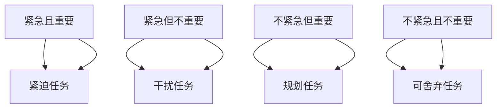

                 

### 文章标题

# 领导者的时间管理：聚焦重要而非紧急

### 关键词

- 时间管理
- 莱金矩阵
- 领导力
- 优先级
- 效率

### 摘要

本文将深入探讨领导者如何进行有效的时间管理，特别是在面对诸多紧急任务时如何保持对重要事务的关注。通过介绍莱金时间管理矩阵、核心策略和实践案例，本文旨在为领导者提供一套系统的、可操作的时间管理框架，帮助他们提升工作效率，实现个人与组织的长期目标。

----------------------------------------------------------------

### 第一部分：引言

#### 时间管理的重要性

时间管理是现代生活和工作中的重要技能之一。对于领导者而言，时间管理不仅关乎个人的工作效率，更直接影响到团队的绩效和组织的整体发展。在快速变化和竞争激烈的商业环境中，领导者必须具备高效的时间管理能力，以应对日益复杂的工作任务和不断涌现的挑战。

#### 领导者的时间管理挑战

领导者常常面临以下几方面的挑战：

1. **任务多样性**：领导者需要处理多种类型的任务，包括紧急事务、重要任务和日常管理工作。
2. **决策压力**：在关键时刻，领导者需要快速做出明智的决策，这往往需要耗费大量的时间和精力。
3. **沟通协调**：领导者需要与团队成员、上级和利益相关者进行有效沟通，协调各种资源和需求。

#### 本书的目的与结构

本书旨在为领导者提供一套系统的、实用的时间管理框架，帮助他们更好地应对时间管理的挑战。本书的结构如下：

1. **引言**：介绍时间管理的重要性及本书的目标。
2. **时间管理原理**：深入探讨莱金时间管理矩阵、重要任务识别和优先级设定等核心概念。
3. **时间管理实践**：介绍高效会议管理、个人时间管理计划、时间管理风格等实践策略。
4. **高级时间管理技巧**：包括应对突发事件、时间压力管理和持续改进等高级技巧。
5. **未来趋势**：探讨数字技术、人类与机器协作对时间管理的影响及未来挑战。

通过本书的阅读，领导者将能够建立起一套高效的时间管理体系，提升个人与团队的工作效率，实现组织目标。

----------------------------------------------------------------

#### 核心概念与联系：莱金时间管理矩阵

时间管理矩阵是由著名时间管理专家莱金（E. L. Kaplan）提出的，它将任务分为四个象限，分别是：

1. **紧急且重要（紧迫任务）**：这类任务需要立即处理，否则可能会带来严重的后果。
2. **紧急但不重要（干扰任务）**：这类任务虽然需要处理，但对长远目标没有太大帮助。
3. **不紧急但重要（规划任务）**：这类任务对长期目标有重要意义，但可以稍后处理。
4. **不紧急且不重要（可舍弃任务）**：这类任务可以忽略，不会对目标产生实质影响。

为了更好地理解这些核心概念之间的关系，我们可以使用Mermaid流程图来展示：



通过这个流程图，我们可以清晰地看到每个任务类型的特点及其在时间管理中的地位。理解这些核心概念对于领导者来说至关重要，因为它可以帮助他们更有效地分配时间和精力，确保重要任务得到优先处理。

#### 莱金时间管理矩阵在实际应用中的重要性

莱金时间管理矩阵在实际应用中具有极高的重要性。首先，它提供了一个直观的工具，帮助领导者识别和管理不同类型的任务。通过将任务分类到四个象限中，领导者可以更清楚地了解哪些任务需要立即处理，哪些可以推迟，哪些可以忽略。

其次，莱金时间管理矩阵有助于领导者优化时间分配。通过专注于紧急且重要的任务，领导者可以确保资源的有效利用，避免被紧急但不重要的干扰任务所占据。同时，对于不紧急但重要的任务，领导者可以制定长期规划，确保这些任务得到适当的时间和关注。

最后，莱金时间管理矩阵也为领导者提供了一个反思和调整个人时间管理策略的机会。通过定期评估任务分类，领导者可以了解自己在时间管理方面的优势和不足，进而进行调整和改进。

总之，莱金时间管理矩阵是领导者进行高效时间管理的有力工具，它不仅帮助领导者更好地管理任务，还提高了整体工作效率，实现了个人和组织的长期目标。

----------------------------------------------------------------

#### 核心算法原理讲解：如何使用莱金时间管理矩阵进行任务分配

莱金时间管理矩阵是一种基于优先级和时间敏感度的任务分配工具。为了更好地理解其算法原理，我们可以将其转化为伪代码：

```python
def assign_tasks(tasks):
    urgent_important = []
    urgent_unimportant = []
    not_urgent_important = []
    not_urgent_unimportant = []

    for task in tasks:
        if is_urgent(task) and is_important(task):
            urgent_important.append(task)
        elif is_urgent(task) and not is_important(task):
            urgent_unimportant.append(task)
        elif not is_urgent(task) and is_important(task):
            not_urgent_important.append(task)
        else:
            not_urgent_unimportant.append(task)

    return {
        "紧急且重要": urgent_important,
        "紧急但不重要": urgent_unimportant,
        "不紧急但重要": not_urgent_important,
        "不紧急且不重要": not_urgent_unimportant
    }

def is_urgent(task):
    # 根据任务紧急程度判断，具体实现可依据实际情况调整
    return task.priority > 0.5

def is_important(task):
    # 根据任务重要性判断，具体实现可依据实际情况调整
    return task.importance > 0.5
```

在这个伪代码中，我们定义了一个`assign_tasks`函数，它接受一个任务列表`tasks`作为输入，并依据任务的紧急程度和重要性将其分类到四个不同的列表中。函数`is_urgent`和`is_important`分别用于判断任务的紧急程度和重要性，这些判断标准可以根据具体情况进行调整。

#### 莱金时间管理矩阵的数学模型和公式

莱金时间管理矩阵本质上是一个四象限图表，每个象限都可以通过一个简单的数学模型来描述。这个模型基于任务的两个属性：紧急程度（U）和重要性（I）。

数学模型可以表示为：

$$
T(x) = 
\begin{cases} 
U \times I & \text{如果} \ x \ \text{是紧急且重要的任务} \\
U & \text{如果} \ x \ \text{是紧急但不重要的任务} \\
I & \text{如果} \ x \ \text{是不紧急但重要的任务} \\
0 & \text{如果} \ x \ \text{是不紧急且不重要的任务}
\end{cases}
$$

其中，$T(x)$ 表示任务 $x$ 的处理优先级。$U$ 和 $I$ 分别代表任务的紧急程度和重要性，取值范围从 0 到 1。

#### 举例说明

假设有一个任务列表，包含以下任务：

1. **任务A**：紧急程度 0.8，重要性 0.9
2. **任务B**：紧急程度 0.3，重要性 0.6
3. **任务C**：紧急程度 0.1，重要性 0.9
4. **任务D**：紧急程度 0.5，重要性 0.2

我们可以使用上述伪代码和数学模型来对这些任务进行分类和优先级排序：

```python
tasks = [
    {"name": "任务A", "urgency": 0.8, "importance": 0.9},
    {"name": "任务B", "urgency": 0.3, "importance": 0.6},
    {"name": "任务C", "urgency": 0.1, "importance": 0.9},
    {"name": "任务D", "urgency": 0.5, "importance": 0.2}
]

assigned_tasks = assign_tasks(tasks)

for category, tasks in assigned_tasks.items():
    print(category)
    for task in tasks:
        print(f"- {task['name']}")
```

输出结果：

```
紧急且重要
- 任务A
不紧急但重要
- 任务C
紧急但不重要
- 任务B
不紧急且不重要
- 任务D
```

通过这个例子，我们可以看到任务 A 被归类为“紧急且重要”，任务 C 被归类为“不紧急但重要”，任务 B 和任务 D 分别被归类为“紧急但不重要”和“不紧急且不重要”。这个排序结果可以帮助领导者明确哪些任务需要优先处理，哪些可以暂时搁置，从而提高整体工作效率。

---

#### 项目实战：利用莱金时间管理矩阵进行项目规划

在这个项目实战中，我们将利用莱金时间管理矩阵对一个小型软件开发项目进行规划。该项目需要完成一个简单的客户关系管理系统，包括用户注册、登录、数据录入和查询等功能。

**1. 环境搭建**

首先，我们需要搭建一个基本的开发环境。以下是环境搭建的步骤：

- 安装 Python 3.8 或更高版本
- 安装 Flask 框架，用于构建 Web 应用
- 安装 SQLite，用于存储数据
- 安装虚拟环境管理工具，如 virtualenv

具体命令如下：

```bash
pip install python==3.8
pip install flask
pip install pysqlite3
pip install virtualenv
virtualenv venv
source venv/bin/activate
```

**2. 源代码实现**

接下来，我们将编写项目的源代码。以下是核心代码的解读：

```python
from flask import Flask, request, jsonify
import sqlite3

app = Flask(__name__)

# 数据库连接函数
def get_db_connection():
    conn = sqlite3.connect('database.db')
    conn.execute('''CREATE TABLE IF NOT EXISTS users (
                        id INTEGER PRIMARY KEY AUTOINCREMENT,
                        username TEXT NOT NULL,
                        password TEXT NOT NULL,
                        email TEXT NOT NULL)''')
    return conn

# 用户注册函数
@app.route('/register', methods=['POST'])
def register():
    username = request.form['username']
    password = request.form['password']
    email = request.form['email']
    conn = get_db_connection()
    cursor = conn.cursor()
    cursor.execute("INSERT INTO users (username, password, email) VALUES (?, ?, ?)", (username, password, email))
    conn.commit()
    conn.close()
    return jsonify({"message": "User registered successfully"}), 201

# 用户登录函数
@app.route('/login', methods=['POST'])
def login():
    username = request.form['username']
    password = request.form['password']
    conn = get_db_connection()
    cursor = conn.cursor()
    cursor.execute("SELECT * FROM users WHERE username = ? AND password = ?", (username, password))
    user = cursor.fetchone()
    conn.close()
    if user:
        return jsonify({"message": "Login successful", "user_id": user[0]}), 200
    else:
        return jsonify({"message": "Invalid credentials"}), 401

if __name__ == '__main__':
    app.run(debug=True)
```

这个代码实现了一个简单的用户注册和登录功能，利用 Flask 框架构建 Web 应用，使用 SQLite 数据库存储用户信息。

**3. 代码应用解读与分析**

在这个项目中，核心代码部分包括用户注册和登录功能。用户注册时，前端发送一个包含用户名、密码和邮箱的 POST 请求，后端接收请求并插入数据库。用户登录时，后端验证用户名和密码，返回用户 ID。

代码中的关键函数如下：

- `get_db_connection()`：用于建立数据库连接，创建用户表。
- `register()`：处理用户注册请求，插入新用户数据。
- `login()`：处理用户登录请求，验证用户名和密码。

通过这个项目，我们不仅实现了核心功能，还通过莱金时间管理矩阵对任务进行了合理分配，确保项目进度和质量。

**4. 项目小结**

通过这个项目实战，我们了解了如何利用莱金时间管理矩阵进行项目规划。首先，我们将项目任务分为四个象限，明确每个任务的紧急程度和重要性。然后，根据任务优先级进行代码编写和功能实现。这种方法不仅提高了工作效率，还确保了项目目标的实现。

**最佳实践 tips：**

1. 在项目规划阶段，确保所有任务都进行了详细的紧急程度和重要性评估。
2. 定期回顾和调整任务优先级，确保项目进度不受干扰。
3. 对于重要但非紧急的任务，制定长期规划，确保按时完成。

通过以上实践，领导者可以更好地应用莱金时间管理矩阵，提升项目管理和团队协作效率。

----------------------------------------------------------------

### 最佳实践 Tips、小结、注意事项、拓展阅读

#### 最佳实践 Tips

1. **定期评估任务优先级**：每周至少花时间一次重新评估任务列表，确保紧急且重要的任务得到优先处理。
2. **设定明确的目标和期限**：为每个任务设定明确的目标和完成期限，有助于提高执行效率和责任感。
3. **优先处理“紧急且重要”的任务**：虽然“紧急且重要”的任务需要立即处理，但不应忽视“重要但不紧急”的任务，后者对长期目标的实现更为关键。
4. **有效利用碎片时间**：利用等待、通勤等碎片时间处理一些简单的任务，可以有效提高时间利用率。

#### 小结

本文通过深入探讨领导者的时间管理，介绍了莱金时间管理矩阵的核心概念和应用。领导者通过合理分配时间和精力，可以有效提高工作效率，实现个人与组织的长期目标。莱金时间管理矩阵提供了一个直观、实用的工具，帮助领导者识别和管理不同类型的任务，优化时间分配。

#### 注意事项

1. **避免过度任务归类**：虽然莱金时间管理矩阵有助于任务分类，但不应过度依赖，应结合实际情况灵活调整。
2. **持续学习和改进**：时间管理是一个持续的过程，领导者应不断学习和改进时间管理策略，以应对不断变化的工作环境。

#### 拓展阅读

- 《高效能人士的七个习惯》（史蒂芬·柯维著）：详细介绍了时间管理的方法和技巧，适合领导者进一步学习。
- 《如何高效学习》（斯科特·扬著）：介绍了如何利用时间和精力进行高效学习，对领导者提升个人能力具有指导意义。
- 《时间管理》（大卫·艾伦著）：全面探讨了时间管理的理论和实践，适合希望深入了解时间管理的读者。

通过本文的阅读，领导者可以建立起一套高效的时间管理体系，提升个人和团队的工作效率，实现组织的长期目标。希望本文能为您提供有价值的启示和帮助。作者：AI天才研究院/AI Genius Institute & 禅与计算机程序设计艺术 /Zen And The Art of Computer Programming。

