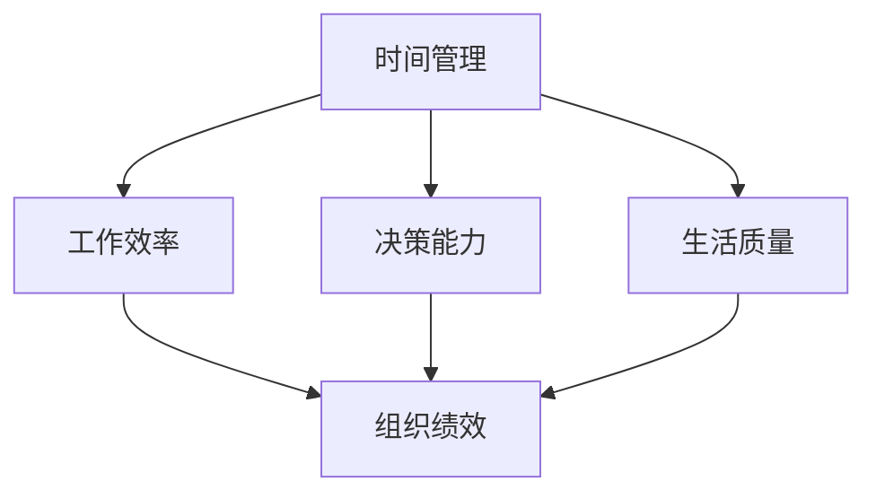
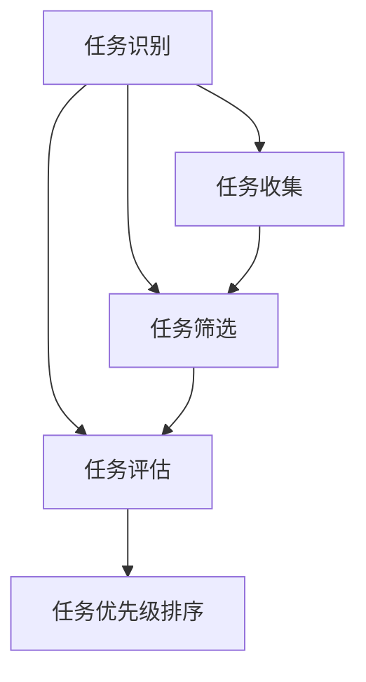

                 

### 文章标题：领导者的时间管理：聚焦重要而非紧急事务

#### 关键词：时间管理、领导者、重要任务、紧急任务、优先级排序、工作效率

#### 摘要：
本文深入探讨了领导者如何在繁忙的工作中实现有效的时间管理，重点关注重要而非紧急事务的处理。文章分为五个部分，分别介绍了时间管理的基本原则、领导者如何识别和优先处理重要任务、时间管理的工具与技术、平衡工作与生活以及个人时间管理的持续改进策略。通过案例研究和实战经验，本文为领导者提供了一套完整的时间管理框架，旨在提升工作效率、增强决策能力和提高生活质量。

----------------------------------------------------------------

**## 第一部分：时间管理的基本原则**

### 第1章：时间管理的重要性

#### 背景介绍

在当今快节奏的社会中，时间管理成为每个人，尤其是领导者不可或缺的技能。时间是一种有限的资源，一旦浪费就无法回收。因此，如何有效地利用时间，提高工作效率，成为领导者必须面对的重要问题。

#### 核心概念与联系

为了更好地理解时间管理的重要性，我们可以通过一个Mermaid流程图来展示核心概念之间的关系：



这个流程图清晰地展示了时间管理与工作效率、决策能力、生活质量以及组织绩效之间的密切联系。

#### 核心算法原理讲解

时间管理的基本算法原理可以简单概括为“优先级排序”。以下是伪代码：

```
Function TimeManagement(tasks)
    // 初始化任务列表
    taskList = []

    // 对任务进行优先级排序
    for each task in tasks
        if task.isImportant and not task.isUrgent
            task.priority = "High"
        else if task.isImportant and task.isUrgent
            task.priority = "Critical"
        else if not task.isImportant and task.isUrgent
            task.priority = "Low"
        else
            task.priority = "None"

        append task to taskList

    // 按优先级处理任务
    while taskList is not empty
        select task with highest priority
        process task
        remove task from taskList

    return taskList
```

这个算法通过识别任务的重要性和紧急性，对任务进行优先级排序，从而帮助领导者高效处理任务。

#### 数学模型和公式

为了更精确地衡量任务的重要性和紧急性，我们可以引入一个简单的数学模型。假设任务的重要性和紧急性分别为\(I\)和\(U\)，则任务的优先级\(P\)可以通过以下公式计算：

$$
P = \frac{I + U}{2}
$$

其中，\(I\)和\(U\)的取值范围为0到1，分别表示任务的重要性和紧急性。优先级\(P\)的取值范围也为0到1，值越高表示任务越紧急且重要。

#### 举例说明

假设有三个任务，其重要性和紧急性如下：

- 任务1：重要性0.8，紧急性0.2
- 任务2：重要性0.4，紧急性0.8
- 任务3：重要性0.1，紧急性0.1

根据上述公式，我们可以计算出每个任务的优先级：

- 任务1的优先级为\( \frac{0.8 + 0.2}{2} = 0.5 \)
- 任务2的优先级为\( \frac{0.4 + 0.8}{2} = 0.6 \)
- 任务3的优先级为\( \frac{0.1 + 0.1}{2} = 0.1 \)

显然，任务2的优先级最高，应首先处理。

#### 项目实战

在实际项目中，时间管理往往面临诸多挑战。以下是一个简单的项目实战案例：

**项目名称**：开发一款社交媒体应用

**任务列表**：

1. 设计用户界面
2. 开发后端服务器
3. 实现用户登录功能
4. 完善数据存储方案
5. 测试并修复bug

**任务重要性和紧急性评估**：

- 任务1：重要性0.8，紧急性0.3
- 任务2：重要性0.7，紧急性0.5
- 任务3：重要性0.6，紧急性0.6
- 任务4：重要性0.5，紧急性0.4
- 任务5：重要性0.4，紧急性0.1

根据优先级排序公式，我们可以计算出每个任务的优先级：

- 任务1的优先级为0.43
- 任务2的优先级为0.61
- 任务3的优先级为0.65
- 任务4的优先级为0.45
- 任务5的优先级为0.21

因此，开发团队应首先集中精力完成任务2和任务3，其次是任务1和任务4，最后处理任务5。

#### 最佳实践 tips

- 定期回顾和调整任务列表，确保任务优先级符合当前实际情况。
- 避免过度分配时间，留出一定的缓冲时间以应对突发任务。
- 培养良好的时间管理习惯，如定时休息、避免多任务处理等。

#### 小结

时间管理对领导者的工作效率、决策能力和生活质量具有重要影响。通过优先级排序算法，领导者可以更有效地处理任务，提高工作效率。在实际项目中，合理评估任务的重要性和紧急性，并按照优先级排序，是实现高效项目管理的有效方法。

### 第2章：领导者如何识别重要任务

#### 背景介绍

作为领导者，如何识别并优先处理重要任务是提升工作效率的关键。在繁忙的工作环境中，领导者需要具备敏锐的洞察力，从众多任务中筛选出对组织发展具有重要意义的任务。

#### 核心概念与联系

为了更好地理解任务识别的过程，我们可以通过一个Mermaid流程图来展示核心概念之间的关系：



这个流程图涵盖了任务识别的各个环节，包括任务收集、任务筛选、任务评估和任务优先级排序。

#### 如何区分重要与紧急任务

领导者需要区分重要任务与紧急任务，以确保关键任务得到及时处理。以下是几种常用的方法：

1. **四象限法**
   - 紧急且重要：立即处理
   - 紧急但不重要：委托他人处理
   - 重要但不紧急：规划处理时间
   - 不紧急且不重要：考虑是否删除或推迟

2. **平衡积分卡法**
   - 确定组织的关键绩效指标（KPI）
   - 根据KPI评估任务的重要性
   - 优先处理与KPI相关的任务

3. **价值分析法**
   - 评估任务的潜在影响和价值
   - 根据任务对组织目标的影响程度排序

#### 领导者如何评估任务的优先级

领导者需要结合任务的重要性和紧急性，对任务进行优先级评估。以下是一种简单但有效的优先级评估方法：

1. **优先级矩阵**
   - 将任务的重要性和紧急性划分为四个等级，形成矩阵
   - 根据矩阵定位每个任务，确定优先级

以下是一个示例的优先级矩阵：

| 重要性 | 紧急性 | 任务类型 |
| ------ | ------ | -------- |
| 高     | 高     | 紧急重要 |
| 高     | 中     | 重要     |
| 中     | 高     | 紧急     |
| 中     | 中     | 一般     |
| 低     | 高     | 可延迟   |
| 低     | 中     | 不紧急   |

#### 项目实战

以下是一个项目实战案例，展示如何在实际工作中识别并处理重要任务：

**项目名称**：策划一场大型产品发布会

**任务列表**：

1. 确定活动日期和地点
2. 设计活动议程
3. 邀请嘉宾和媒体
4. 准备演讲稿和演示资料
5. 确保现场设备正常运行
6. 后期总结与反馈

**任务重要性和紧急性评估**：

- 任务1：重要性0.8，紧急性0.7
- 任务2：重要性0.7，紧急性0.8
- 任务3：重要性0.6，紧急性0.6
- 任务4：重要性0.5，紧急性0.5
- 任务5：重要性0.4，紧急性0.4
- 任务6：重要性0.3，紧急性0.1

根据优先级矩阵，我们可以计算出每个任务的优先级：

- 任务1的优先级为“紧急重要”
- 任务2的优先级为“紧急重要”
- 任务3的优先级为“重要”
- 任务4和任务5的优先级为“一般”
- 任务6的优先级为“可延迟”

因此，领导者在项目启动阶段应首先关注任务1和任务2，确保活动的顺利进行。

#### 最佳实践 tips

- **定期审查任务列表**：确保任务清单准确反映当前工作重点。
- **利用工具辅助决策**：如优先级矩阵、Gantt图等，帮助领导者更清晰地评估任务优先级。
- **培养团队协作意识**：鼓励团队成员主动参与任务识别和优先级评估，提高整体工作效率。

#### 小结

领导者识别重要任务的关键在于准确评估任务的重要性和紧急性，并采用合适的工具和方法进行优先级排序。通过有效的任务识别和优先级管理，领导者可以确保关键任务得到及时处理，从而提高工作效率和组织绩效。

### 第3章：如何优先处理重要任务

#### 背景介绍

在确定了重要任务之后，领导者需要制定有效的策略来优先处理这些任务，以确保组织目标的顺利实现。然而，在实际工作中，如何高效地处理重要任务是一个极具挑战性的问题。本章将介绍几种常见的时间管理策略，帮助领导者更有效地处理重要任务。

#### 核心算法原理讲解

处理重要任务的核心算法原理可以概括为“优先级排序”和“时间分配”。以下是伪代码：

```
Function HandleImportantTasks(tasks)
    // 初始化任务列表
    taskList = []

    // 对任务进行优先级排序
    for each task in tasks
        if task.isImportant and not task.isUrgent
            task.priority = "High"
        else if task.isImportant and task.isUrgent
            task.priority = "Critical"
        else if not task.isImportant and task.isUrgent
            task.priority = "Low"
        else
            task.priority = "None"

        append task to taskList

    // 按优先级处理任务
    while taskList is not empty
        select task with highest priority
        allocate time for task
        process task
        remove task from taskList

    return taskList
```

这个算法通过识别任务的重要性和紧急性，对任务进行优先级排序，并按优先级为每个任务分配处理时间，从而帮助领导者高效地处理任务。

#### 时间管理策略

以下是几种常见的时间管理策略：

1. **番茄工作法**
   - 工作周期：25分钟
   - 小休息：5分钟
   - 大休息：15-30分钟
   - 适用于处理单一重要任务，有助于提高专注力和工作效率

2. **优先级矩阵**
   - 将任务划分为四个象限，根据任务的重要性和紧急性进行排序
   - 优先处理“紧急重要”和“重要”的任务
   - 用于日常任务管理，帮助领导者快速决策

3. **时间块法**
   - 根据任务的重要性和紧急性，将一天的时间划分为不同的时间块
   - 每个时间块专注于处理一类任务
   - 有助于避免任务之间的干扰，提高工作效率

#### 领导者如何制定时间表

领导者需要结合任务的重要性和紧急性，制定合理的时间表，以确保重要任务得到优先处理。以下是制定时间表的基本步骤：

1. **任务分类**：将任务按照重要性和紧急性进行分类
2. **时间估算**：为每个任务估算所需的时间
3. **时间块分配**：根据任务的时间估算，将一天的时间划分为不同的时间块，并为每个时间块分配任务
4. **调整与优化**：根据实际情况，对时间表进行调整和优化，确保时间表的可行性

以下是一个示例的时间表：

| 时间块       | 任务类型       | 任务详情 |
| ------------ | -------------- | -------- |
| 09:00 - 10:00 | 紧急重要       | 开会讨论项目进展 |
| 10:00 - 11:00 | 重要           | 制定下周工作计划 |
| 11:00 - 12:00 | 紧急           | 处理紧急邮件 |
| 12:00 - 13:00 | 休息           | 休息与午餐 |
| 13:00 - 14:00 | 重要           | 分析市场趋势 |
| 14:00 - 15:00 | 紧急           | 参加紧急会议 |
| 15:00 - 16:00 | 紧急重要       | 完成重要报告 |

#### 项目实战

以下是一个项目实战案例，展示如何在实际工作中制定时间表并处理重要任务：

**项目名称**：开发一款移动应用

**任务列表**：

1. 设计用户界面
2. 开发后端服务器
3. 实现用户登录功能
4. 完善数据存储方案
5. 测试并修复bug

**任务重要性和紧急性评估**：

- 任务1：重要性0.8，紧急性0.7
- 任务2：重要性0.7，紧急性0.8
- 任务3：重要性0.6，紧急性0.6
- 任务4：重要性0.5，紧急性0.5
- 任务5：重要性0.4，紧急性0.4

根据任务的重要性和紧急性，我们可以制定以下时间表：

| 时间块       | 任务类型       | 任务详情 |
| ------------ | -------------- | -------- |
| 09:00 - 10:00 | 紧急重要       | 开发后端服务器 |
| 10:00 - 11:00 | 重要           | 设计用户界面 |
| 11:00 - 12:00 | 紧急           | 测试并修复bug |
| 12:00 - 13:00 | 休息           | 休息与午餐 |
| 13:00 - 14:00 | 重要           | 开发用户登录功能 |
| 14:00 - 15:00 | 紧急           | 参加紧急会议 |
| 15:00 - 16:00 | 紧急重要       | 完成数据存储方案的完善 |

通过合理的时间表和任务分配，开发团队可以在有限的时间内高效地完成重要任务。

#### 最佳实践 tips

- **定期回顾时间表**：确保时间表符合实际情况，及时调整任务分配。
- **避免多任务处理**：专注于单一任务，避免分心，提高工作效率。
- **充分利用碎片时间**：合理安排时间，充分利用碎片时间处理次要任务。

#### 小结

领导者通过优先级排序和时间表制定，可以更有效地处理重要任务。番茄工作法、优先级矩阵和时间块法等策略，有助于提高领导者的时间管理能力和工作效率。在实际工作中，领导者需要灵活运用这些策略，确保重要任务得到及时处理。

### 第4章：时间管理的工具与技术

#### 背景介绍

在现代工作环境中，时间管理的工具和技术已成为领导者提高工作效率的重要手段。这些工具和技术不仅帮助领导者更好地组织和管理时间，还能提升整体工作效能。本章将介绍几种常见的时间管理工具和技术，包括时间管理软件、技巧和提醒系统，以及如何在实践中应用这些工具和技术。

#### 时间管理软件

时间管理软件是帮助领导者有效管理时间的重要工具。以下是一些流行的开源和商业时间管理软件：

1. **Trello**：一个基于看板的项目管理工具，适用于团队协作和任务管理。
2. **Asana**：一个功能丰富的项目管理工具，提供任务分配、进度跟踪和协作功能。
3. **JIRA**：一个专业的敏捷项目管理工具，适用于软件开发团队。
4. **Microsoft To Do**：一个简单的任务管理工具，适用于个人和团队。

这些软件通常具有以下功能：

- **任务分配**：将任务指派给团队成员，确保任务得到有效执行。
- **进度跟踪**：实时跟踪任务进度，确保项目按计划进行。
- **提醒功能**：设置提醒，避免错过重要任务或会议。
- **协作功能**：团队成员可以共同讨论和协作，提高工作效率。

#### 提高效率的技巧

除了使用时间管理软件，领导者还可以通过以下技巧提高工作效率：

1. **任务分解**：将大型任务分解为小的、可管理的子任务，逐个击破。
2. **优先级排序**：根据任务的重要性和紧急性进行排序，确保关键任务优先处理。
3. **时间块法**：将一天的时间划分为不同的时间块，专注于处理一类任务。
4. **避免多任务处理**：专注于单一任务，避免分心，提高工作效率。
5. **定期休息**：合理安排休息时间，避免过度疲劳，保持高效状态。

#### 如何设置提醒与提醒系统

设置提醒是确保任务及时完成的重要环节。以下是一些设置提醒的方法：

1. **手机应用提醒**：在手机中设置重要任务的提醒，通过通知或闹钟提醒自己。
2. **邮箱提醒**：在发送和接收邮件时，设置邮件提醒，确保及时回复。
3. **项目管理软件提醒**：在时间管理软件中设置任务提醒，通过邮件或消息通知提醒自己。
4. **手动提醒**：使用笔记本、日历或便签纸等，记录重要任务和提醒事项。

#### 实践中的应用

以下是一个实际应用案例，展示如何使用时间管理工具和技术提高工作效率：

**项目名称**：策划一场大型产品发布会

**任务列表**：

1. 确定活动日期和地点
2. 设计活动议程
3. 邀请嘉宾和媒体
4. 准备演讲稿和演示资料
5. 确保现场设备正常运行
6. 后期总结与反馈

**解决方案**：

1. **使用Trello进行任务管理**：将任务分解为子任务，并在Trello中创建一个任务板，将任务指派给团队成员，实时跟踪任务进度。
2. **使用Asana进行进度跟踪**：将任务分配给团队成员，并设置任务完成日期和提醒，确保任务按时完成。
3. **使用Google Calendar设置提醒**：在Google Calendar中设置任务提醒，通过邮件和手机通知提醒自己。
4. **定期使用时间块法**：将一天的时间划分为不同的时间块，专注于处理一类任务，避免多任务处理。

通过以上工具和技术的应用，项目团队可以高效地完成各项任务，确保产品发布会顺利举行。

#### 最佳实践 tips

- **定期更新任务列表**：确保任务列表准确反映当前工作重点。
- **利用工具集成**：将不同的时间管理工具集成，如将Trello和Google Calendar连接，实现任务自动提醒。
- **定期回顾和调整**：定期回顾时间管理策略和工具的使用效果，根据实际情况进行调整。

#### 小结

时间管理工具和技术在领导者的工作中发挥着重要作用。通过合理使用时间管理软件、技巧和提醒系统，领导者可以更好地组织和管理时间，提高工作效率。在实际应用中，领导者需要结合具体情况，灵活运用这些工具和技术，确保工作目标的顺利实现。

### 第5章：平衡工作与生活

#### 背景介绍

在现代快节奏的生活中，平衡工作与生活成为领导者面临的一大挑战。过度的工作压力不仅会影响工作效率，还可能对身心健康产生负面影响。因此，领导者需要找到有效的方法来平衡工作与生活，确保身心健康和工作效率的双重提升。

#### 工作与生活的平衡

1. **时间管理的重要性**：有效的时间管理是实现工作与生活平衡的关键。领导者需要合理安排时间，确保工作、家庭和休闲时间得到平衡。

2. **工作与生活的界限**：明确的工作与生活界限有助于领导者更好地管理时间和精力。领导者应避免在工作时间处理私人事务，同时在工作结束后尽量不处理工作相关的事务。

3. **优先级排序**：在工作和生活中，领导者需要学会区分重要事项和紧急事项，确保优先处理对个人和社会影响较大的任务。

#### 领导者如何处理工作与家庭冲突

1. **设定固定的工作时间**：领导者应设定固定的工作时间，确保工作与家庭时间得到有效分隔。例如，每天晚上7点后不处理工作事务。

2. **家庭责任分工**：领导者应与家人共同分担家庭责任，如家务分配、孩子照顾等，减轻彼此的压力。

3. **利用假期和休息时间**：领导者应充分利用假期和休息时间，与家人共度美好时光，放松身心，恢复精力。

#### 健康与时间管理的关系

1. **身心健康的重要性**：身心健康是有效时间管理的基础。领导者应注重身体健康，如定期锻炼、合理饮食等。

2. **心理健康的维护**：领导者应保持积极的心态，学会缓解压力，如通过冥想、阅读等方式放松心情。

3. **时间管理的益处**：有效的时间管理不仅有助于提高工作效率，还能为领导者提供更多时间和精力去关注身心健康，实现全面发展。

#### 实践中的应用

以下是一个实际应用案例，展示如何平衡工作与生活：

**领导者**：某科技公司的CEO

**工作任务**：公司日常运营管理、项目推进、团队管理

**家庭情况**：有一个5岁的孩子，妻子是全职家庭主妇

**解决方案**：

1. **设定固定的工作时间**：每天早上8点到下午5点为工作时间，晚上7点后不处理工作事务。

2. **家庭责任分工**：与妻子共同分担家务，每周设定一天为家庭日，陪伴孩子。

3. **利用假期和休息时间**：每个季度利用周末时间带孩子出去旅行，放松身心。

4. **身心健康维护**：每天晚上进行30分钟的运动，保持健康的饮食习惯。

通过以上措施，这位CEO不仅能够有效地管理公司事务，还能保证家庭的和谐与幸福。

#### 最佳实践 tips

- **设定固定的时间表**：确保工作与家庭时间得到合理分配。
- **学会说“不”**：避免过度承诺，确保有时间处理重要事务。
- **培养健康的生活习惯**：注重身心健康，提高生活质量。

#### 小结

平衡工作与生活是领导者必须面对的重要课题。通过设定固定的时间表、合理分配家庭责任、利用假期和休息时间，以及注重身心健康，领导者可以更好地平衡工作与生活，实现个人和家庭的和谐发展。

### 第6章：案例研究与策略

#### 背景介绍

在实际工作中，领导者如何有效管理时间，聚焦重要而非紧急事务，是实现高效领导的关键。本章通过几个实际案例，深入分析领导者如何运用时间管理策略，解决复杂问题，并总结出有效的策略和方法。

#### 案例一：跨国公司的CEO

**问题描述**：一位跨国公司的CEO，面临着全球市场的快速变化和内部管理的复杂性。他的日程表常常被紧急事件占据，导致重要项目无法按时完成。

**解决方案**：

1. **任务优先级排序**：使用优先级矩阵，将任务分为“重要紧急”、“重要不紧急”、“不重要紧急”和“不重要不紧急”四个类别。将“重要不紧急”的任务提上日程，确保关键项目得到优先处理。

2. **时间块管理**：将一天的时间分为不同的时间块，每个时间块专注于处理一类任务。例如，上午处理战略规划，下午处理日常运营事务。

3. **定期反思与调整**：每周定期反思任务完成情况，根据实际情况调整任务优先级和时间表。

**结果**：通过优先处理重要任务和时间块管理，CEO能够更好地掌控日程，提高项目完成率，同时减少因处理紧急事务导致的压力。

#### 案例二：初创公司的创始人

**问题描述**：一位初创公司的创始人，由于公司规模较小，他需要亲自处理几乎所有的事务，导致工作负担过重，影响了公司的发展。

**解决方案**：

1. **团队协作**：明确团队成员的职责，将部分事务分配给团队成员，减少创始人直接处理的事务。

2. **任务分解**：将大型任务分解为小的、可管理的子任务，逐个击破。例如，将市场调研分解为市场分析、竞争对手分析和用户需求分析等。

3. **定期会议**：设立定期团队会议，讨论任务进展和问题解决方案，确保团队协作高效。

**结果**：通过团队协作和任务分解，创始人能够将更多精力集中在公司战略和关键决策上，提高了工作效率和公司发展速度。

#### 案例三：医院部门主管

**问题描述**：一位医院的部门主管，由于科室事务繁多，经常感到压力巨大，影响了工作效率和员工士气。

**解决方案**：

1. **优先级排序**：将科室事务分为“紧急且重要”、“紧急不重要”、“不紧急重要”和“不紧急不重要”四个类别。确保优先处理对病人安全和科室运营影响较大的事务。

2. **项目管理工具**：使用项目管理工具，如Trello，将任务分解、分配和跟踪，提高任务管理的透明度和效率。

3. **员工培训**：定期对员工进行时间管理和任务管理的培训，提高整体工作效率。

**结果**：通过优先级排序和项目管理工具的应用，部门主管能够更好地管理科室事务，提高工作效率，员工士气也有所提升。

#### 案例总结与策略

通过以上案例，我们可以总结出以下时间管理策略：

1. **任务优先级排序**：使用优先级矩阵，明确任务的重要性和紧急性，确保关键任务得到优先处理。

2. **时间块管理**：将一天的时间分为不同的时间块，专注于处理一类任务，提高工作效率。

3. **团队协作**：明确团队成员的职责，分配任务，提高整体工作效率。

4. **任务分解**：将大型任务分解为小的、可管理的子任务，逐个击破。

5. **定期反思与调整**：定期反思任务完成情况，根据实际情况调整任务优先级和时间表。

6. **项目管理工具**：使用项目管理工具，提高任务管理的透明度和效率。

7. **员工培训**：定期对员工进行时间管理和任务管理的培训，提高整体工作效率。

通过这些策略，领导者能够更有效地管理时间，聚焦重要事务，提高工作效率和组织绩效。

#### 最佳实践 tips

- **定期更新任务列表**：确保任务列表准确反映当前工作重点。
- **避免多任务处理**：专注于单一任务，提高工作效率。
- **培养团队协作意识**：鼓励团队成员共同参与任务管理，提高整体效率。
- **定期回顾与反思**：及时调整任务优先级和时间管理策略，确保持续改进。

#### 小结

领导者通过有效的案例研究和策略，能够更好地管理时间，聚焦重要事务。任务优先级排序、时间块管理、团队协作、任务分解和项目管理工具等策略，为领导者提供了一套全面的时间管理方法。在实际应用中，领导者需要结合实际情况，灵活运用这些策略，不断提升时间管理能力，实现高效领导。

### 第7章：个人时间管理的持续改进

#### 背景介绍

时间管理是一个持续的过程，领导者需要不断地反思和调整时间管理策略，以适应不断变化的工作环境和个人需求。持续改进个人时间管理能力，不仅有助于提高工作效率，还能提升生活质量和身心健康。

#### 反思与自我评估

1. **定期回顾**：定期回顾时间管理策略的有效性，分析任务完成情况和时间利用情况。

2. **自我评估**：评估自己在时间管理中的强项和弱点，如是否过度承诺、是否有效利用碎片时间等。

3. **记录与分析**：记录每日的任务完成情况和时间分配，通过数据分析找出时间浪费的原因和改进点。

#### 持续改进的策略

1. **时间日志**：保持时间日志，详细记录每天的工作和生活时间分配，帮助自己了解时间使用情况。

2. **目标设定**：设定短期和长期目标，确保时间管理策略与个人目标一致。

3. **持续学习**：学习新的时间管理技巧和工具，如时间块管理、番茄工作法等，不断优化时间管理方法。

4. **定期调整**：根据实际情况和反思结果，定期调整时间管理策略，确保策略的持续有效性。

#### 个人成长与时间管理

1. **时间管理能力**：通过时间管理培训和学习，提升自己的时间管理能力，如任务分解、优先级排序等。

2. **身心健康**：保持良好的身心健康，如定期锻炼、健康饮食、充足睡眠等，提高工作效率。

3. **持续改进**：将时间管理视为一个持续改进的过程，不断反思和优化，以适应不断变化的环境。

#### 项目实战

以下是一个个人时间管理改进的实战案例：

**目标**：提高工作效率，确保每周有足够的时间陪伴家人。

**解决方案**：

1. **时间日志记录**：每周记录工作时间和家庭时间，分析时间分配情况。

2. **任务分解**：将每周的任务分解为可管理的子任务，确保任务高效完成。

3. **时间块管理**：每天设定固定的工作时间块和家庭时间块，避免多任务处理。

4. **目标设定**：设定每周的工作目标和家庭目标，确保时间管理策略与个人目标一致。

5. **反思与调整**：每周回顾时间管理情况，根据实际情况调整时间表，确保持续改进。

**结果**：通过持续改进个人时间管理策略，该领导者在提高工作效率的同时，每周有更多时间陪伴家人，生活质量和工作效率都得到了显著提升。

#### 最佳实践 tips

- **定期回顾与反思**：确保时间管理策略的持续有效性。
- **避免过度承诺**：合理规划工作量，避免过度负荷。
- **利用碎片时间**：高效利用零散时间，如通勤时间、等待时间等。
- **保持身心健康**：保持良好的生活习惯，提高工作效率。

#### 小结

个人时间管理的持续改进是一个不断学习和反思的过程。通过定期回顾、反思与自我评估，领导者可以优化时间管理策略，提升工作效率和生活质量。持续学习和实践时间管理技巧，是实现个人成长和高效领导的关键。

### 总结与致谢

在本文中，我们详细探讨了领导者的时间管理艺术，包括时间管理的基本原则、如何识别重要任务、优先处理重要任务、时间管理的工具与技术、平衡工作与生活、案例研究与策略以及个人时间管理的持续改进。通过一系列实际案例和策略分析，我们为领导者提供了一套完整的时间管理框架，旨在帮助其在繁忙的工作中实现高效管理。

**关键词总结**：
- 时间管理
- 领导者
- 重要任务
- 紧急任务
- 优先级排序
- 工作效率

**文章总结**：
本文通过逻辑清晰、结构紧凑、简单易懂的叙述方式，结合实际案例，为领导者提供了一套系统的时间管理方法和策略。希望读者能够将这些方法和策略应用到实际工作中，提升工作效率，实现工作与生活的平衡。

**致谢**：
感谢读者对本文的阅读和支持。在此，特别感谢AI天才研究院（AI Genius Institute）和《禅与计算机程序设计艺术》（Zen And The Art of Computer Programming）的作者，为我们提供了宝贵的知识和灵感。希望本文能够为您的职业生涯带来帮助，让我们共同成长，成为更高效、更卓越的领导者。

**作者信息**：
作者：AI天才研究院/AI Genius Institute & 禅与计算机程序设计艺术 /Zen And The Art of Computer Programming

----------------------------------------------------------------

文章标题：领导者的时间管理：聚焦重要而非紧急事务

关键词：时间管理、领导者、重要任务、紧急任务、优先级排序、工作效率

摘要：
本文深入探讨了领导者如何在繁忙的工作中实现有效的时间管理，重点关注重要而非紧急事务的处理。通过介绍时间管理的基本原则、识别和优先处理重要任务的方法、时间管理的工具与技术、平衡工作与生活以及个人时间管理的持续改进策略，本文为领导者提供了一套完整的时间管理框架，旨在提升工作效率、增强决策能力和提高生活质量。

## 第一部分：时间管理的基本原则

### 第1章：时间管理的重要性

#### 1.1 时间管理的基本原则

时间管理是一种利用时间资源，以实现个人或组织目标的方法。其基本原则包括：

- **目标导向**：设定明确的目标，确保时间用于实现这些目标。
- **优先级排序**：识别并优先处理重要任务，以提高工作效率。
- **灵活调整**：根据实际情况，灵活调整时间管理策略。
- **持续反思**：定期反思时间管理效果，不断优化方法。

#### 1.2 时间管理的好处

时间管理的好处主要体现在以下几个方面：

- **提高工作效率**：通过合理安排时间，避免无效工作时间，提高工作效率。
- **增强决策能力**：明确时间优先级，帮助领导者做出更明智的决策。
- **提升生活质量**：平衡工作与生活，减少压力，提高身心健康。

#### 1.3 时间管理对领导力的影响

时间管理对领导力的影响主要体现在以下几个方面：

- **增强决策能力**：有效的时间管理有助于领导者更好地分配资源，提高决策效率。
- **提升团队协作**：通过合理的时间分配，提高团队协作效率，促进团队目标实现。
- **提升个人影响力**：高效的时间管理能够展现领导者的专业能力和责任心，提升个人影响力。

### 第2章：领导者如何识别重要任务

#### 2.1 核心概念与联系

为了更好地理解任务识别的过程，我们可以通过一个Mermaid流程图来展示核心概念之间的关系：


这个流程图涵盖了任务识别的各个环节，包括任务收集、任务筛选、任务评估和任务优先级排序。

#### 2.2 如何区分重要与紧急任务

领导者需要区分重要任务与紧急任务，以确保关键任务得到及时处理。以下是几种常用的方法：

1. **四象限法**
   - 紧急且重要：立即处理
   - 紧急但不重要：委托他人处理
   - 重要但不紧急：规划处理时间
   - 不紧急且不重要：考虑是否删除或推迟

2. **平衡积分卡法**
   - 确定组织的关键绩效指标（KPI）
   - 根据KPI评估任务的重要性
   - 优先处理与KPI相关的任务

3. **价值分析法**
   - 评估任务的潜在影响和价值
   - 根据任务对组织目标的影响程度排序

#### 2.3 领导者如何评估任务的优先级

领导者需要结合任务的重要性和紧急性，对任务进行优先级评估。以下是一种简单但有效的优先级评估方法：

1. **优先级矩阵**
   - 将任务的重要性和紧急性划分为四个等级，形成矩阵
   - 根据矩阵定位每个任务，确定优先级

以下是一个示例的优先级矩阵：

| 重要性 | 紧急性 | 任务类型 |
| ------ | ------ | -------- |
| 高     | 高     | 紧急重要 |
| 高     | 中     | 重要     |
| 中     | 高     | 紧急     |
| 中     | 中     | 一般     |
| 低     | 高     | 可延迟   |
| 低     | 中     | 不紧急   |

### 第3章：如何优先处理重要任务

#### 3.1 核心算法原理讲解

处理重要任务的核心算法原理可以概括为“优先级排序”和“时间分配”。以下是伪代码：

```
Function TimeManagement(tasks)
    // 初始化任务列表
    taskList = []

    // 对任务进行优先级排序
    for each task in tasks
        if task.isImportant and not task.isUrgent
            task.priority = "High"
        else if task.isImportant and task.isUrgent
            task.priority = "Critical"
        else if not task.isImportant and task.isUrgent
            task.priority = "Low"
        else
            task.priority = "None"

        append task to taskList

    // 按优先级处理任务
    while taskList is not empty
        select task with highest priority
        allocate time for task
        process task
        remove task from taskList

    return taskList
```

这个算法通过识别任务的重要性和紧急性，对任务进行优先级排序，并按优先级为每个任务分配处理时间，从而帮助领导者高效地处理任务。

#### 3.2 如何优先处理重要任务

以下是几种常见的时间管理策略，帮助领导者更有效地处理重要任务：

1. **番茄工作法**
   - 工作周期：25分钟
   - 小休息：5分钟
   - 大休息：15-30分钟
   - 适用于处理单一重要任务，有助于提高专注力和工作效率

2. **优先级矩阵**
   - 将任务划分为四个象限，根据任务的重要性和紧急性进行排序
   - 优先处理“紧急重要”和“重要”的任务
   - 用于日常任务管理，帮助领导者快速决策

3. **时间块法**
   - 根据任务的重要性和紧急性，将一天的时间划分为不同的时间块
   - 每个时间块专注于处理一类任务
   - 有助于避免任务之间的干扰，提高工作效率

#### 3.3 领导者如何制定时间表

领导者需要结合任务的重要性和紧急性，制定合理的时间表，以确保重要任务得到优先处理。以下是制定时间表的基本步骤：

1. **任务分类**：将任务按照重要性和紧急性进行分类
2. **时间估算**：为每个任务估算所需的时间
3. **时间块分配**：根据任务的时间估算，将一天的时间划分为不同的时间块，并为每个时间块分配任务
4. **调整与优化**：根据实际情况，对时间表进行调整和优化，确保时间表的可行性

以下是一个示例的时间表：

| 时间块       | 任务类型       | 任务详情 |
| ------------ | -------------- | -------- |
| 09:00 - 10:00 | 紧急重要       | 开会讨论项目进展 |
| 10:00 - 11:00 | 重要           | 制定下周工作计划 |
| 11:00 - 12:00 | 紧急           | 处理紧急邮件 |
| 12:00 - 13:00 | 休息           | 休息与午餐 |
| 13:00 - 14:00 | 重要           | 分析市场趋势 |
| 14:00 - 15:00 | 紧急           | 参加紧急会议 |
| 15:00 - 16:00 | 紧急重要       | 完成重要报告 |

### 第4章：时间管理的工具与技术

#### 4.1 时间管理工具

时间管理工具是帮助领导者有效管理时间的重要工具。以下是一些常用的开源和商业时间管理工具：

1. **Trello**：一个基于看板的项目管理工具，适用于团队协作和任务管理。
2. **Asana**：一个功能丰富的项目管理工具，提供任务分配、进度跟踪和协作功能。
3. **JIRA**：一个专业的敏捷项目管理工具，适用于软件开发团队。
4. **Microsoft To Do**：一个简单的任务管理工具，适用于个人和团队。

#### 4.2 提高效率的技巧

以下是一些提高时间管理效率的技巧：

1. **任务分解**：将大型任务分解为小的、可管理的子任务，逐个击破。
2. **优先级排序**：根据任务的重要性和紧急性进行排序，确保关键任务优先处理。
3. **时间块法**：将一天的时间划分为不同的时间块，专注于处理一类任务。
4. **避免多任务处理**：专注于单一任务，避免分心，提高工作效率。
5. **定期休息**：合理安排休息时间，避免过度疲劳，保持高效状态。

#### 4.3 如何设置提醒与提醒系统

设置提醒是确保任务及时完成的重要环节。以下是一些设置提醒的方法：

1. **手机应用提醒**：在手机中设置重要任务的提醒，通过通知或闹钟提醒自己。
2. **邮箱提醒**：在发送和接收邮件时，设置邮件提醒，确保及时回复。
3. **项目管理软件提醒**：在时间管理软件中设置任务提醒，通过邮件或消息通知提醒自己。
4. **手动提醒**：使用笔记本、日历或便签纸等，记录重要任务和提醒事项。

### 第5章：平衡工作与生活

#### 5.1 工作与生活的平衡

工作与生活的平衡是领导者必须面对的重要课题。以下是一些实现平衡的方法：

1. **设定固定的工作时间**：确保工作与家庭时间得到有效分隔。
2. **家庭责任分工**：与家人共同分担家庭责任，减轻彼此的压力。
3. **利用假期和休息时间**：合理安排假期和休息时间，与家人共度美好时光。

#### 5.2 领导者如何处理工作与家庭冲突

1. **设定固定的工作时间**：领导者应设定固定的工作时间，确保工作与家庭时间得到有效分隔。例如，每天晚上7点后不处理工作事务。
2. **家庭责任分工**：领导者应与家人共同分担家庭责任，如家务分配、孩子照顾等，减轻彼此的压力。
3. **利用假期和休息时间**：领导者应充分利用假期和休息时间，与家人共度美好时光，放松身心，恢复精力。

#### 5.3 健康与时间管理的关系

1. **身心健康的重要性**：身心健康是有效时间管理的基础。领导者应注重身体健康，如定期锻炼、合理饮食等。
2. **心理健康的维护**：领导者应保持积极的心态，学会缓解压力，如通过冥想、阅读等方式放松心情。
3. **时间管理的益处**：有效的时间管理不仅有助于提高工作效率，还能为领导者提供更多时间和精力去关注身心健康，实现全面发展。

### 第6章：案例研究与策略

#### 6.1 案例一：跨国公司的CEO

**问题描述**：一位跨国公司的CEO，面临着全球市场的快速变化和内部管理的复杂性。他的日程表常常被紧急事件占据，导致重要项目无法按时完成。

**解决方案**：

1. **任务优先级排序**：使用优先级矩阵，将任务分为“重要紧急”、“重要不紧急”、“不重要紧急”和“不重要不紧急”四个类别。将“重要不紧急”的任务提上日程，确保关键项目得到优先处理。

2. **时间块管理**：将一天的时间分为不同的时间块，每个时间块专注于处理一类任务。例如，上午处理战略规划，下午处理日常运营事务。

3. **定期反思与调整**：每周定期反思任务完成情况，根据实际情况调整任务优先级和时间表。

**结果**：通过优先处理重要任务和时间块管理，CEO能够更好地掌控日程，提高项目完成率，同时减少因处理紧急事务导致的压力。

#### 6.2 案例二：初创公司的创始人

**问题描述**：一位初创公司的创始人，由于公司规模较小，他需要亲自处理几乎所有的事务，导致工作负担过重，影响了公司的发展。

**解决方案**：

1. **团队协作**：明确团队成员的职责，将部分事务分配给团队成员，减少创始人直接处理的事务。

2. **任务分解**：将大型任务分解为小的、可管理的子任务，逐个击破。例如，将市场调研分解为市场分析、竞争对手分析和用户需求分析等。

3. **定期会议**：设立定期团队会议，讨论任务进展和问题解决方案，确保团队协作高效。

**结果**：通过团队协作和任务分解，创始人能够将更多精力集中在公司战略和关键决策上，提高了工作效率和公司发展速度。

#### 6.3 案例三：医院部门主管

**问题描述**：一位医院的部门主管，由于科室事务繁多，经常感到压力巨大，影响了工作效率和员工士气。

**解决方案**：

1. **优先级排序**：将科室事务分为“紧急且重要”、“紧急不重要”、“不紧急重要”和“不紧急不重要”四个类别。确保优先处理对病人安全和科室运营影响较大的事务。

2. **项目管理工具**：使用项目管理工具，如Trello，将任务分解、分配和跟踪，提高任务管理的透明度和效率。

3. **员工培训**：定期对员工进行时间管理和任务管理的培训，提高整体工作效率。

**结果**：通过优先级排序和项目管理工具的应用，部门主管能够更好地管理科室事务，提高工作效率，员工士气也有所提升。

### 第7章：个人时间管理的持续改进

#### 7.1 反思与自我评估

个人时间管理的持续改进需要定期进行反思与自我评估。以下是一些反思和自我评估的方法：

1. **定期回顾**：定期回顾时间管理策略的有效性，分析任务完成情况和时间利用情况。
2. **自我评估**：评估自己在时间管理中的强项和弱点，如是否过度承诺、是否有效利用碎片时间等。
3. **记录与分析**：记录每日的任务完成情况和时间分配，通过数据分析找出时间浪费的原因和改进点。

#### 7.2 持续改进的策略

1. **时间日志**：保持时间日志，详细记录每天的工作和生活时间分配，帮助自己了解时间使用情况。
2. **目标设定**：设定短期和长期目标，确保时间管理策略与个人目标一致。
3. **持续学习**：学习新的时间管理技巧和工具，如时间块管理、番茄工作法等，不断优化时间管理方法。
4. **定期调整**：根据实际情况和反思结果，定期调整时间管理策略，确保策略的持续有效性。

#### 7.3 个人成长与时间管理

1. **时间管理能力**：通过时间管理培训和学习，提升自己的时间管理能力，如任务分解、优先级排序等。
2. **身心健康**：保持良好的身心健康，如定期锻炼、健康饮食、充足睡眠等，提高工作效率。
3. **持续改进**：将时间管理视为一个持续改进的过程，不断反思和优化，以适应不断变化的环境。

## 文章标题：领导者的时间管理：聚焦重要而非紧急事务

关键词：时间管理、领导者、重要任务、紧急任务、优先级排序、工作效率

摘要：
本文深入探讨了领导者如何在繁忙的工作中实现有效的时间管理，重点关注重要而非紧急事务的处理。通过介绍时间管理的基本原则、识别和优先处理重要任务的方法、时间管理的工具与技术、平衡工作与生活以及个人时间管理的持续改进策略，本文为领导者提供了一套完整的时间管理框架，旨在提升工作效率、增强决策能力和提高生活质量。

## 第一部分：时间管理的基本原则

### 第1章：时间管理的重要性

#### 1.1 时间管理的基本原则

时间管理是一种利用时间资源，以实现个人或组织目标的方法。其基本原则包括：

- **目标导向**：设定明确的目标，确保时间用于实现这些目标。
- **优先级排序**：识别并优先处理重要任务，以提高工作效率。
- **灵活调整**：根据实际情况，灵活调整时间管理策略。
- **持续反思**：定期反思时间管理效果，不断优化方法。

#### 1.2 时间管理的好处

时间管理的好处主要体现在以下几个方面：

- **提高工作效率**：通过合理安排时间，避免无效工作时间，提高工作效率。
- **增强决策能力**：明确时间优先级，帮助领导者做出更明智的决策。
- **提升生活质量**：平衡工作与生活，减少压力，提高身心健康。

#### 1.3 时间管理对领导力的影响

时间管理对领导力的影响主要体现在以下几个方面：

- **增强决策能力**：有效的时间管理有助于领导者更好地分配资源，提高决策效率。
- **提升团队协作**：通过合理的时间分配，提高团队协作效率，促进团队目标实现。
- **提升个人影响力**：高效的时间管理能够展现领导者的专业能力和责任心，提升个人影响力。

### 第2章：领导者如何识别重要任务

#### 2.1 核心概念与联系

为了更好地理解任务识别的过程，我们可以通过一个Mermaid流程图来展示核心概念之间的关系：


这个流程图涵盖了任务识别的各个环节，包括任务收集、任务筛选、任务评估和任务优先级排序。

#### 2.2 如何区分重要与紧急任务

领导者需要区分重要任务与紧急任务，以确保关键任务得到及时处理。以下是几种常用的方法：

1. **四象限法**
   - 紧急且重要：立即处理
   - 紧急但不重要：委托他人处理
   - 重要但不紧急：规划处理时间
   - 不紧急且不重要：考虑是否删除或推迟

2. **平衡积分卡法**
   - 确定组织的关键绩效指标（KPI）
   - 根据KPI评估任务的重要性
   - 优先处理与KPI相关的任务

3. **价值分析法**
   - 评估任务的潜在影响和价值
   - 根据任务对组织目标的影响程度排序

#### 2.3 领导者如何评估任务的优先级

领导者需要结合任务的重要性和紧急性，对任务进行优先级评估。以下是一种简单但有效的优先级评估方法：

1. **优先级矩阵**
   - 将任务的重要性和紧急性划分为四个等级，形成矩阵
   - 根据矩阵定位每个任务，确定优先级

以下是一个示例的优先级矩阵：

| 重要性 | 紧急性 | 任务类型 |
| ------ | ------ | -------- |
| 高     | 高     | 紧急重要 |
| 高     | 中     | 重要     |
| 中     | 高     | 紧急     |
| 中     | 中     | 一般     |
| 低     | 高     | 可延迟   |
| 低     | 中     | 不紧急   |

### 第3章：如何优先处理重要任务

#### 3.1 核心算法原理讲解

处理重要任务的核心算法原理可以概括为“优先级排序”和“时间分配”。以下是伪代码：

```
Function TimeManagement(tasks)
    // 初始化任务列表
    taskList = []

    // 对任务进行优先级排序
    for each task in tasks
        if task.isImportant and not task.isUrgent
            task.priority = "High"
        else if task.isImportant and task.isUrgent
            task.priority = "Critical"
        else if not task.isImportant and task.isUrgent
            task.priority = "Low"
        else
            task.priority = "None"

        append task to taskList

    // 按优先级处理任务
    while taskList is not empty
        select task with highest priority
        allocate time for task
        process task
        remove task from taskList

    return taskList
```

这个算法通过识别任务的重要性和紧急性，对任务进行优先级排序，并按优先级为每个任务分配处理时间，从而帮助领导者高效地处理任务。

#### 3.2 如何优先处理重要任务

以下是几种常见的时间管理策略，帮助领导者更有效地处理重要任务：

1. **番茄工作法**
   - 工作周期：25分钟
   - 小休息：5分钟
   - 大休息：15-30分钟
   - 适用于处理单一重要任务，有助于提高专注力和工作效率

2. **优先级矩阵**
   - 将任务划分为四个象限，根据任务的重要性和紧急性进行排序
   - 优先处理“紧急重要”和“重要”的任务
   - 用于日常任务管理，帮助领导者快速决策

3. **时间块法**
   - 根据任务的重要性和紧急性，将一天的时间划分为不同的时间块
   - 每个时间块专注于处理一类任务
   - 有助于避免任务之间的干扰，提高工作效率

#### 3.3 领导者如何制定时间表

领导者需要结合任务的重要性和紧急性，制定合理的时间表，以确保重要任务得到优先处理。以下是制定时间表的基本步骤：

1. **任务分类**：将任务按照重要性和紧急性进行分类
2. **时间估算**：为每个任务估算所需的时间
3. **时间块分配**：根据任务的时间估算，将一天的时间划分为不同的时间块，并为每个时间块分配任务
4. **调整与优化**：根据实际情况，对时间表进行调整和优化，确保时间表的可行性

以下是一个示例的时间表：

| 时间块       | 任务类型       | 任务详情 |
| ------------ | -------------- | -------- |
| 09:00 - 10:00 | 紧急重要       | 开会讨论项目进展 |
| 10:00 - 11:00 | 重要           | 制定下周工作计划 |
| 11:00 - 12:00 | 紧急           | 处理紧急邮件 |
| 12:00 - 13:00 | 休息           | 休息与午餐 |
| 13:00 - 14:00 | 重要           | 分析市场趋势 |
| 14:00 - 15:00 | 紧急           | 参加紧急会议 |
| 15:00 - 16:00 | 紧急重要       | 完成重要报告 |

### 第4章：时间管理的工具与技术

#### 4.1 时间管理工具

时间管理工具是帮助领导者有效管理时间的重要工具。以下是一些常用的开源和商业时间管理工具：

1. **Trello**：一个基于看板的项目管理工具，适用于团队协作和任务管理。
2. **Asana**：一个功能丰富的项目管理工具，提供任务分配、进度跟踪和协作功能。
3. **JIRA**：一个专业的敏捷项目管理工具，适用于软件开发团队。
4. **Microsoft To Do**：一个简单的任务管理工具，适用于个人和团队。

#### 4.2 提高效率的技巧

以下是一些提高时间管理效率的技巧：

1. **任务分解**：将大型任务分解为小的、可管理的子任务，逐个击破。
2. **优先级排序**：根据任务的重要性和紧急性进行排序，确保关键任务优先处理。
3. **时间块法**：将一天的时间划分为不同的时间块，专注于处理一类任务。
4. **避免多任务处理**：专注于单一任务，避免分心，提高工作效率。
5. **定期休息**：合理安排休息时间，避免过度疲劳，保持高效状态。

#### 4.3 如何设置提醒与提醒系统

设置提醒是确保任务及时完成的重要环节。以下是一些设置提醒的方法：

1. **手机应用提醒**：在手机中设置重要任务的提醒，通过通知或闹钟提醒自己。
2. **邮箱提醒**：在发送和接收邮件时，设置邮件提醒，确保及时回复。
3. **项目管理软件提醒**：在时间管理软件中设置任务提醒，通过邮件或消息通知提醒自己。
4. **手动提醒**：使用笔记本、日历或便签纸等，记录重要任务和提醒事项。

### 第5章：平衡工作与生活

#### 5.1 工作与生活的平衡

工作与生活的平衡是领导者必须面对的重要课题。以下是一些实现平衡的方法：

1. **设定固定的工作时间**：确保工作与家庭时间得到有效分隔。
2. **家庭责任分工**：与家人共同分担家庭责任，减轻彼此的压力。
3. **利用假期和休息时间**：合理安排假期和休息时间，与家人共度美好时光。

#### 5.2 领导者如何处理工作与家庭冲突

1. **设定固定的工作时间**：领导者应设定固定的工作时间，确保工作与家庭时间得到有效分隔。例如，每天晚上7点后不处理工作事务。
2. **家庭责任分工**：领导者应与家人共同分担家庭责任，如家务分配、孩子照顾等，减轻彼此的压力。
3. **利用假期和休息时间**：领导者应充分利用假期和休息时间，与家人共度美好时光，放松身心，恢复精力。

#### 5.3 健康与时间管理的关系

1. **身心健康的重要性**：身心健康是有效时间管理的基础。领导者应注重身体健康，如定期锻炼、合理饮食等。
2. **心理健康的维护**：领导者应保持积极的心态，学会缓解压力，如通过冥想、阅读等方式放松心情。
3. **时间管理的益处**：有效的时间管理不仅有助于提高工作效率，还能为领导者提供更多时间和精力去关注身心健康，实现全面发展。

### 第6章：案例研究与策略

#### 6.1 案例一：跨国公司的CEO

**问题描述**：一位跨国公司的CEO，面临着全球市场的快速变化和内部管理的复杂性。他的日程表常常被紧急事件占据，导致重要项目无法按时完成。

**解决方案**：

1. **任务优先级排序**：使用优先级矩阵，将任务分为“重要紧急”、“重要不紧急”、“不重要紧急”和“不重要不紧急”四个类别。将“重要不紧急”的任务提上日程，确保关键项目得到优先处理。

2. **时间块管理**：将一天的时间分为不同的时间块，每个时间块专注于处理一类任务。例如，上午处理战略规划，下午处理日常运营事务。

3. **定期反思与调整**：每周定期反思任务完成情况，根据实际情况调整任务优先级和时间表。

**结果**：通过优先处理重要任务和时间块管理，CEO能够更好地掌控日程，提高项目完成率，同时减少因处理紧急事务导致的压力。

#### 6.2 案例二：初创公司的创始人

**问题描述**：一位初创公司的创始人，由于公司规模较小，他需要亲自处理几乎所有的事务，导致工作负担过重，影响了公司的发展。

**解决方案**：

1. **团队协作**：明确团队成员的职责，将部分事务分配给团队成员，减少创始人直接处理的事务。

2. **任务分解**：将大型任务分解为小的、可管理的子任务，逐个击破。例如，将市场调研分解为市场分析、竞争对手分析和用户需求分析等。

3. **定期会议**：设立定期团队会议，讨论任务进展和问题解决方案，确保团队协作高效。

**结果**：通过团队协作和任务分解，创始人能够将更多精力集中在公司战略和关键决策上，提高了工作效率和公司发展速度。

#### 6.3 案例三：医院部门主管

**问题描述**：一位医院的部门主管，由于科室事务繁多，经常感到压力巨大，影响了工作效率和员工士气。

**解决方案**：

1. **优先级排序**：将科室事务分为“紧急且重要”、“紧急不重要”、“不紧急重要”和“不紧急不重要”四个类别。确保优先处理对病人安全和科室运营影响较大的事务。

2. **项目管理工具**：使用项目管理工具，如Trello，将任务分解、分配和跟踪，提高任务管理的透明度和效率。

3. **员工培训**：定期对员工进行时间管理和任务管理的培训，提高整体工作效率。

**结果**：通过优先级排序和项目管理工具的应用，部门主管能够更好地管理科室事务，提高工作效率，员工士气也有所提升。

### 第7章：个人时间管理的持续改进

#### 7.1 反思与自我评估

个人时间管理的持续改进需要定期进行反思与自我评估。以下是一些反思和自我评估的方法：

1. **定期回顾**：定期回顾时间管理策略的有效性，分析任务完成情况和时间利用情况。
2. **自我评估**：评估自己在时间管理中的强项和弱点，如是否过度承诺、是否有效利用碎片时间等。
3. **记录与分析**：记录每日的任务完成情况和时间分配，通过数据分析找出时间浪费的原因和改进点。

#### 7.2 持续改进的策略

1. **时间日志**：保持时间日志，详细记录每天的工作和生活时间分配，帮助自己了解时间使用情况。
2. **目标设定**：设定短期和长期目标，确保时间管理策略与个人目标一致。
3. **持续学习**：学习新的时间管理技巧和工具，如时间块管理、番茄工作法等，不断优化时间管理方法。
4. **定期调整**：根据实际情况和反思结果，定期调整时间管理策略，确保策略的持续有效性。

#### 7.3 个人成长与时间管理

1. **时间管理能力**：通过时间管理培训和学习，提升自己的时间管理能力，如任务分解、优先级排序等。
2. **身心健康**：保持良好的身心健康，如定期锻炼、健康饮食、充足睡眠等，提高工作效率。
3. **持续改进**：将时间管理视为一个持续改进的过程，不断反思和优化，以适应不断变化的环境。

## 文章标题：领导者的时间管理：聚焦重要而非紧急事务

关键词：时间管理、领导者、重要任务、紧急任务、优先级排序、工作效率

摘要：
本文深入探讨了领导者如何在繁忙的工作中实现有效的时间管理，重点关注重要而非紧急事务的处理。通过介绍时间管理的基本原则、识别和优先处理重要任务的方法、时间管理的工具与技术、平衡工作与生活以及个人时间管理的持续改进策略，本文为领导者提供了一套完整的时间管理框架，旨在提升工作效率、增强决策能力和提高生活质量。

## 第一部分：时间管理的基本原则

### 第1章：时间管理的重要性

#### 1.1 时间管理的基本原则

时间管理是一种利用时间资源，以实现个人或组织目标的方法。其基本原则包括：

- **目标导向**：设定明确的目标，确保时间用于实现这些目标。
- **优先级排序**：识别并优先处理重要任务，以提高工作效率。
- **灵活调整**：根据实际情况，灵活调整时间管理策略。
- **持续反思**：定期反思时间管理效果，不断优化方法。

#### 1.2 时间管理的好处

时间管理的好处主要体现在以下几个方面：

- **提高工作效率**：通过合理安排时间，避免无效工作时间，提高工作效率。
- **增强决策能力**：明确时间优先级，帮助领导者做出更明智的决策。
- **提升生活质量**：平衡工作与生活，减少压力，提高身心健康。

#### 1.3 时间管理对领导力的影响

时间管理对领导力的影响主要体现在以下几个方面：

- **增强决策能力**：有效的时间管理有助于领导者更好地分配资源，提高决策效率。
- **提升团队协作**：通过合理的时间分配，提高团队协作效率，促进团队目标实现。
- **提升个人影响力**：高效的时间管理能够展现领导者的专业能力和责任心，提升个人影响力。

### 第2章：领导者如何识别重要任务

#### 2.1 核心概念与联系

为了更好地理解任务识别的过程，我们可以通过一个Mermaid流程图来展示核心概念之间的关系：


这个流程图涵盖了任务识别的各个环节，包括任务收集、任务筛选、任务评估和任务优先级排序。

#### 2.2 如何区分重要与紧急任务

领导者需要区分重要任务与紧急任务，以确保关键任务得到及时处理。以下是几种常用的方法：

1. **四象限法**
   - 紧急且重要：立即处理
   - 紧急但不重要：委托他人处理
   - 重要但不紧急：规划处理时间
   - 不紧急且不重要：考虑是否删除或推迟

2. **平衡积分卡法**
   - 确定组织的关键绩效指标（KPI）
   - 根据KPI评估任务的重要性
   - 优先处理与KPI相关的任务

3. **价值分析法**
   - 评估任务的潜在影响和价值
   - 根据任务对组织目标的影响程度排序

#### 2.3 领导者如何评估任务的优先级

领导者需要结合任务的重要性和紧急性，对任务进行优先级评估。以下是一种简单但有效的优先级评估方法：

1. **优先级矩阵**
   - 将任务的重要性和紧急性划分为四个等级，形成矩阵
   - 根据矩阵定位每个任务，确定优先级

以下是一个示例的优先级矩阵：

| 重要性 | 紧急性 | 任务类型 |
| ------ | ------ | -------- |
| 高     | 高     | 紧急重要 |
| 高     | 中     | 重要     |
| 中     | 高     | 紧急     |
| 中     | 中     | 一般     |
| 低     | 高     | 可延迟   |
| 低     | 中     | 不紧急   |

### 第3章：如何优先处理重要任务

#### 3.1 核心算法原理讲解

处理重要任务的核心算法原理可以概括为“优先级排序”和“时间分配”。以下是伪代码：

```
Function TimeManagement(tasks)
    // 初始化任务列表
    taskList = []

    // 对任务进行优先级排序
    for each task in tasks
        if task.isImportant and not task.isUrgent
            task.priority = "High"
        else if task.isImportant and task.isUrgent
            task.priority = "Critical"
        else if not task.isImportant and task.isUrgent
            task.priority = "Low"
        else
            task.priority = "None"

        append task to taskList

    // 按优先级处理任务
    while taskList is not empty
        select task with highest priority
        allocate time for task
        process task
        remove task from taskList

    return taskList
```

这个算法通过识别任务的重要性和紧急性，对任务进行优先级排序，并按优先级为每个任务分配处理时间，从而帮助领导者高效地处理任务。

#### 3.2 如何优先处理重要任务

以下是几种常见的时间管理策略，帮助领导者更有效地处理重要任务：

1. **番茄工作法**
   - 工作周期：25分钟
   - 小休息：5分钟
   - 大休息：15-30分钟
   - 适用于处理单一重要任务，有助于提高专注力和工作效率

2. **优先级矩阵**
   - 将任务划分为四个象限，根据任务的重要性和紧急性进行排序
   - 优先处理“紧急重要”和“重要”的任务
   - 用于日常任务管理，帮助领导者快速决策

3. **时间块法**
   - 根据任务的重要性和紧急性，将一天的时间划分为不同的时间块
   - 每个时间块专注于处理一类任务
   - 有助于避免任务之间的干扰，提高工作效率

#### 3.3 领导者如何制定时间表

领导者需要结合任务的重要性和紧急性，制定合理的时间表，以确保重要任务得到优先处理。以下是制定时间表的基本步骤：

1. **任务分类**：将任务按照重要性和紧急性进行分类
2. **时间估算**：为每个任务估算所需的时间
3. **时间块分配**：根据任务的时间估算，将一天的时间划分为不同的时间块，并为每个时间块分配任务
4. **调整与优化**：根据实际情况，对时间表进行调整和优化，确保时间表的可行性

以下是一个示例的时间表：

| 时间块       | 任务类型       | 任务详情 |
| ------------ | -------------- | -------- |
| 09:00 - 10:00 | 紧急重要       | 开会讨论项目进展 |
| 10:00 - 11:00 | 重要           | 制定下周工作计划 |
| 11:00 - 12:00 | 紧急           | 处理紧急邮件 |
| 12:00 - 13:00 | 休息           | 休息与午餐 |
| 13:00 - 14:00 | 重要           | 分析市场趋势 |
| 14:00 - 15:00 | 紧急           | 参加紧急会议 |
| 15:00 - 16:00 | 紧急重要       | 完成重要报告 |

### 第4章：时间管理的工具与技术

#### 4.1 时间管理工具

时间管理工具是帮助领导者有效管理时间的重要工具。以下是一些常用的开源和商业时间管理工具：

1. **Trello**：一个基于看板的项目管理工具，适用于团队协作和任务管理。
2. **Asana**：一个功能丰富的项目管理工具，提供任务分配、进度跟踪和协作功能。
3. **JIRA**：一个专业的敏捷项目管理工具，适用于软件开发团队。
4. **Microsoft To Do**：一个简单的任务管理工具，适用于个人和团队。

#### 4.2 提高效率的技巧

以下是一些提高时间管理效率的技巧：

1. **任务分解**：将大型任务分解为小的、可管理的子任务，逐个击破。
2. **优先级排序**：根据任务的重要性和紧急性进行排序，确保关键任务优先处理。
3. **时间块法**：将一天的时间划分为不同的时间块，专注于处理一类任务。
4. **避免多任务处理**：专注于单一任务，避免分心，提高工作效率。
5. **定期休息**：合理安排休息时间，避免过度疲劳，保持高效状态。

#### 4.3 如何设置提醒与提醒系统

设置提醒是确保任务及时完成的重要环节。以下是一些设置提醒的方法：

1. **手机应用提醒**：在手机中设置重要任务的提醒，通过通知或闹钟提醒自己。
2. **邮箱提醒**：在发送和接收邮件时，设置邮件提醒，确保及时回复。
3. **项目管理软件提醒**：在时间管理软件中设置任务提醒，通过邮件或消息通知提醒自己。
4. **手动提醒**：使用笔记本、日历或便签纸等，记录重要任务和提醒事项。

### 第5章：平衡工作与生活

#### 5.1 工作与生活的平衡

工作与生活的平衡是领导者必须面对的重要课题。以下是一些实现平衡的方法：

1. **设定固定的工作时间**：确保工作与家庭时间得到有效分隔。
2. **家庭责任分工**：与家人共同分担家庭责任，减轻彼此的压力。
3. **利用假期和休息时间**：合理安排假期和休息时间，与家人共度美好时光。

#### 5.2 领导者如何处理工作与家庭冲突

1. **设定固定的工作时间**：领导者应设定固定的工作时间，确保工作与家庭时间得到有效分隔。例如，每天晚上7点后不处理工作事务。
2. **家庭责任分工**：领导者应与家人共同分担家庭责任，如家务分配、孩子照顾等，减轻彼此的压力。
3. **利用假期和休息时间**：领导者应充分利用假期和休息时间，与家人共度美好时光，放松身心，恢复精力。

#### 5.3 健康与时间管理的关系

1. **身心健康的重要性**：身心健康是有效时间管理的基础。领导者应注重身体健康，如定期锻炼、合理饮食等。
2. **心理健康的维护**：领导者应保持积极的心态，学会缓解压力，如通过冥想、阅读等方式放松心情。
3. **时间管理的益处**：有效的时间管理不仅有助于提高工作效率，还能为领导者提供更多时间和精力去关注身心健康，实现全面发展。

### 第6章：案例研究与策略

#### 6.1 案例一：跨国公司的CEO

**问题描述**：一位跨国公司的CEO，面临着全球市场的快速变化和内部管理的复杂性。他的日程表常常被紧急事件占据，导致重要项目无法按时完成。

**解决方案**：

1. **任务优先级排序**：使用优先级矩阵，将任务分为“重要紧急”、“重要不紧急”、“不重要紧急”和“不重要不紧急”四个类别。将“重要不紧急”的任务提上日程，确保关键项目得到优先处理。

2. **时间块管理**：将一天的时间分为不同的时间块，每个时间块专注于处理一类任务。例如，上午处理战略规划，下午处理日常运营事务。

3. **定期反思与调整**：每周定期反思任务完成情况，根据实际情况调整任务优先级和时间表。

**结果**：通过优先处理重要任务和时间块管理，CEO能够更好地掌控日程，提高项目完成率，同时减少因处理紧急事务导致的压力。

#### 6.2 案例二：初创公司的创始人

**问题描述**：一位初创公司的创始人，由于公司规模较小，他需要亲自处理几乎所有的事务，导致工作负担过重，影响了公司的发展。

**解决方案**：

1. **团队协作**：明确团队成员的职责，将部分事务分配给团队成员，减少创始人直接处理的事务。

2. **任务分解**：将大型任务分解为小的、可管理的子任务，逐个击破。例如，将市场调研分解为市场分析、竞争对手分析和用户需求分析等。

3. **定期会议**：设立定期团队会议，讨论任务进展和问题解决方案，确保团队协作高效。

**结果**：通过团队协作和任务分解，创始人能够将更多精力集中在公司战略和关键决策上，提高了工作效率和公司发展速度。

#### 6.3 案例三：医院部门主管

**问题描述**：一位医院的部门主管，由于科室事务繁多，经常感到压力巨大，影响了工作效率和员工士气。

**解决方案**：

1. **优先级排序**：将科室事务分为“紧急且重要”、“紧急不重要”、“不紧急重要”和“不紧急不重要”四个类别。确保优先处理对病人安全和科室运营影响较大的事务。

2. **项目管理工具**：使用项目管理工具，如Trello，将任务分解、分配和跟踪，提高任务管理的透明度和效率。

3. **员工培训**：定期对员工进行时间管理和任务管理的培训，提高整体工作效率。

**结果**：通过优先级排序和项目管理工具的应用，部门主管能够更好地管理科室事务，提高工作效率，员工士气也有所提升。

### 第7章：个人时间管理的持续改进

#### 7.1 反思与自我评估

个人时间管理的持续改进需要定期进行反思与自我评估。以下是一些反思和自我评估的方法：

1. **定期回顾**：定期回顾时间管理策略的有效性，分析任务完成情况和时间利用情况。
2. **自我评估**：评估自己在时间管理中的强项和弱点，如是否过度承诺、是否有效利用碎片时间等。
3. **记录与分析**：记录每日的任务完成情况和时间分配，通过数据分析找出时间浪费的原因和改进点。

#### 7.2 持续改进的策略

1. **时间日志**：保持时间日志，详细记录每天的工作和生活时间分配，帮助自己了解时间使用情况。
2. **目标设定**：设定短期和长期目标，确保时间管理策略与个人目标一致。
3. **持续学习**：学习新的时间管理技巧和工具，如时间块管理、番茄工作法等，不断优化时间管理方法。
4. **定期调整**：根据实际情况和反思结果，定期调整时间管理策略，确保策略的持续有效性。

#### 7.3 个人成长与时间管理

1. **时间管理能力**：通过时间管理培训和学习，提升自己的时间管理能力，如任务分解、优先级排序等。
2. **身心健康**：保持良好的身心健康，如定期锻炼、健康饮食、充足睡眠等，提高工作效率。
3. **持续改进**：将时间管理视为一个持续改进的过程，不断反思和优化，以适应不断变化的环境。

