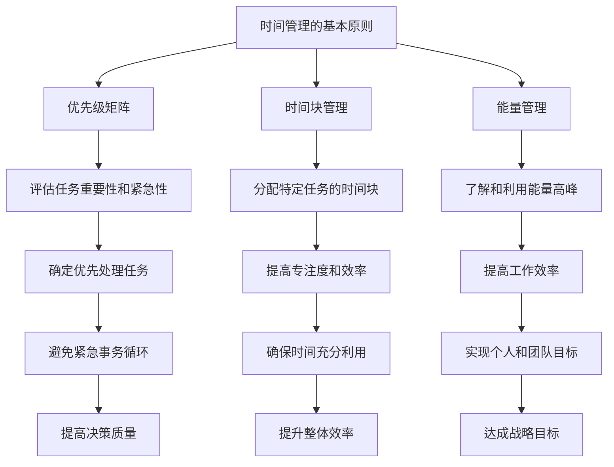
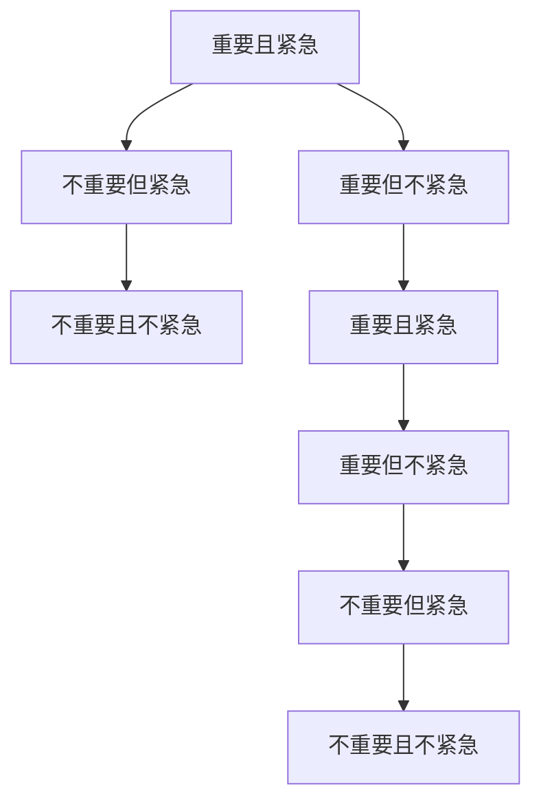

                 


### 引言

在现代企业环境中，领导者扮演着至关重要的角色。他们的决策、领导风格和管理能力直接影响着团队的效率和公司的业绩。然而，在快速变化的市场和技术革新中，领导者面临的挑战也日益增多。时间管理成为领导者成功的关键因素之一。本文将围绕领导者的时间管理展开讨论，探讨高效能人士如何养成良好时间管理习惯，从而提升工作效率和领导力。

首先，我们需要明确时间管理的重要性。时间是一种不可再生的资源，对于每个人来说都是公平的。如何有效地利用时间，直接关系到个人的成就和公司的竞争力。对于领导者而言，时间管理不仅关乎个人效率，更关乎团队的整体表现。一个能够有效管理自己时间的人，往往能够更清晰地规划目标、更好地分配资源、更高效地解决问题，从而在激烈的竞争中脱颖而出。

本文的核心内容包括：

1. **时间管理的基本原则**：介绍时间管理的核心原则，如优先级矩阵、时间块管理和能量管理等。
2. **时间管理策略**：讲解GTD（Getting Things Done）原理、优先级矩阵和如何进行时间块管理。
3. **实战应用**：探讨如何制定个人时间管理计划以及如何使用时间管理工具。
4. **案例分析**：分析成功和失败的时间管理案例，从中吸取经验和教训。
5. **时间管理技巧**：分享高效会议管理和电子邮件管理的最佳实践。
6. **总结与展望**：回顾时间管理的重要性，展望未来时间管理的趋势。

通过本文的逐步分析，我们将帮助读者深入了解时间管理的本质，掌握高效能人士的时间管理技巧，从而在个人和职业生活中取得更大的成功。

---

### 第1章 引言

#### 1.1 时间管理的重要性

时间管理在领导者职业发展中占据着至关重要的位置。随着科技的发展和市场环境的快速变化，领导者不仅需要处理日常的运营事务，还需要应对突发情况、规划战略方向、维护团队士气等多方面的挑战。这些任务的复杂性和多样性使得时间管理变得尤为关键。

首先，时间管理对于提升工作效率至关重要。一个懂得如何高效利用时间的人，可以更专注于核心任务，减少不必要的干扰，从而在短时间内完成更多的任务。对于领导者而言，这意味着他们能够更好地掌控团队的工作节奏，提高团队的整体效率。

其次，时间管理有助于提高决策质量。领导者往往需要在短时间内做出多个决策，这些决策的准确性直接影响到公司的战略方向和业务成果。有效的时间管理可以帮助领导者更好地安排决策的时间，充分准备，从而做出更明智的决策。

此外，时间管理也是维护工作和生活平衡的关键。领导者常常面临高强度的工作压力，如果无法合理安排时间，很容易陷入工作和生活的困境。良好的时间管理不仅可以帮助领导者更好地处理工作事务，还能让他们有更多的时间陪伴家人、进行自我提升，从而实现生活与工作的平衡。

总之，时间管理对于领导者的职业发展和个人成长都具有深远的影响。通过合理地管理时间，领导者可以提升工作效率、提高决策质量、维护工作和生活的平衡，从而在竞争激烈的市场中脱颖而出。

#### 1.2 时间管理的基本原则

为了实现高效的时间管理，领导者需要遵循一些基本的原则。这些原则不仅适用于个人，也适用于团队和组织。以下是几个关键的基本原则：

1. **优先级矩阵**：优先级矩阵是一种用于评估任务重要性和紧急性的工具。通过将任务分为四个象限（重要且紧急、重要但不紧急、不重要但紧急、不重要且不紧急），领导者可以更清晰地了解哪些任务需要优先处理。这种方法有助于避免陷入紧急事务的循环，从而更好地分配时间和资源。

2. **时间块管理**：时间块管理是一种将时间分为不同块，并为每个块分配特定任务的方法。例如，将一天分为早晨、上午、下午和晚上，并为每个时间块分配具体的工作任务。这种方法有助于提高专注度和效率，避免分散注意力。

3. **能量管理**：每个人的精力状态是有起伏的。领导者需要了解自己的能量高峰和低谷，并在能量高峰时处理重要任务，在能量低谷时进行轻松的工作或休息。有效的能量管理可以提高工作效率，减少疲劳。

4. **日计划与周计划**：制定日计划和周计划可以帮助领导者明确当天的目标和任务，确保时间得到充分利用。同时，周计划可以帮助领导者审视整个星期的工作安排，确保长期目标的实现。

5. **定期回顾与调整**：定期回顾时间管理的效果，并根据实际情况进行调整，是持续改进时间管理的重要方法。通过反思和调整，领导者可以不断优化自己的时间管理策略。

这些基本原则不仅为个人提供了明确的指导，也为团队和组织提供了有效的管理工具。通过遵循这些原则，领导者可以更好地管理自己的时间，提高工作效率，实现个人和组织的共同目标。

#### 1.3 时间管理的误区

在时间管理的实践中，许多领导者容易陷入一些常见的误区，这些误区不仅影响了时间管理的效果，还可能对工作效率和心理健康产生负面影响。以下是一些常见的时间管理误区及相应的解决方案：

1. **过度计划**：许多领导者倾向于制定详尽的计划，希望每一分钟都被充分利用。然而，过度计划往往导致过度安排，使得个人和时间处于持续紧张状态。解决方案是减少计划的数量，只保留真正重要的任务，并留出一些弹性时间，以应对突发情况。

2. **忽视休息**：在追求高效的过程中，一些领导者可能忽视了休息的重要性。长时间的连续工作不仅降低了工作效率，还可能对身体健康造成损害。为了克服这一误区，领导者应定期安排休息时间，包括短时间的休息和长期的假期。

3. **依赖工具**：虽然工具在时间管理中发挥了重要作用，但过度依赖工具可能导致忽视了基本的自我管理能力。解决方案是学会平衡工具的使用，同时培养良好的时间管理习惯，确保工具成为管理的辅助而非主导。

4. **忽略能量管理**：每个人的精力状态是有起伏的。一些领导者可能忽视了这一点，在没有能量高峰的情况下处理重要任务，导致效率低下。有效的能量管理可以通过了解自己的能量周期，合理安排工作和休息，提高整体效率。

5. **分散注意力**：多任务处理虽然看似高效，但往往会分散注意力，降低任务质量。解决方案是专注于一项任务，直到完成后再转向下一项任务，从而提高工作质量。

通过认识到并克服这些误区，领导者可以更加有效地管理时间，提高工作效率和整体生活质量。

### 第2章 核心概念与联系

#### 2.1 时间管理的基本原则

时间管理的基本原则是高效能人士成功的关键。为了更好地理解这些原则，我们首先需要了解它们之间的关系架构，并通过Mermaid流程图来展示。



**优先级矩阵**：优先级矩阵是一种用于评估任务重要性和紧急性的工具。通过将任务分为四个象限，领导者可以更清晰地了解哪些任务需要优先处理。

**时间块管理**：时间块管理是一种将时间分为不同块，并为每个块分配特定任务的方法。这种方法有助于提高专注度和效率。

**能量管理**：能量管理是一种了解和利用自己的能量高峰的方法。通过合理安排工作和休息，领导者可以在能量高峰时处理重要任务，提高工作效率。

这些原则之间的关系如下：

1. **优先级矩阵**和**能量管理**结合使用，可以帮助领导者确定哪些任务在能量高峰时处理，从而提高效率和决策质量。
2. **时间块管理**确保了任务的专注度和连续性，避免多任务处理带来的分散注意力。
3. **优先级矩阵**、**时间块管理**和**能量管理**共同作用，帮助领导者充分利用时间，实现个人和团队目标。

通过理解和运用这些基本原则，领导者可以更好地管理时间，提高工作效率和领导力。

#### 2.1.1 优先级矩阵

优先级矩阵是一种评估任务重要性和紧急性的工具，它将任务分为四个象限，以便领导者能够更清晰地了解哪些任务需要优先处理。这四个象限分别是：

1. **重要且紧急**：这类任务通常需要立即处理，因为它们对目标实现有着直接影响。例如，紧急的客户需求、突发的技术问题等。
2. **重要但不紧急**：这类任务虽然不紧急，但如果不及时处理，可能会对长期目标造成影响。例如，项目规划、员工培训等。
3. **不重要但紧急**：这类任务通常是一些次要的干扰，如电话、邮件等。虽然它们需要处理，但不会对长期目标产生重大影响。
4. **不重要且不紧急**：这类任务可以暂时搁置，甚至不必处理。例如，某些社交媒体活动、非紧急的邮件等。

以下是一个简单的优先级矩阵示意图：



通过使用优先级矩阵，领导者可以确保首先处理重要且紧急的任务，从而避免紧急事务的循环。同时，优先级矩阵也提醒领导者关注重要但不紧急的任务，以避免长期目标的延迟。

#### 2.1.2 时间块管理

时间块管理是一种通过将时间分为不同块，并为每个块分配特定任务的方法，以最大化专注度和效率。这种方法的核心在于为每个任务分配一个明确的时间段，从而减少任务之间的干扰，提高工作效率。

**时间块管理的步骤**：

1. **确定工作时间块**：首先，将一天分为多个时间块，每个时间块通常为1小时或更短。例如，可以将一天分为以下几个时间块：早晨8点到9点、上午9点到10点、上午10点到11点，依此类推。

2. **分配任务到时间块**：根据任务的重要性和紧急性，将任务分配到相应的时间块。例如，重要且紧急的任务可以安排在早晨的工作时间块，而重要但不紧急的任务可以安排在下午的工作时间块。

3. **专注执行**：在每个时间块中，专注于完成分配的任务，避免分心和切换任务。如果任务需要中断，确保在时间块结束时进行总结和记录，以便后续继续。

4. **定期回顾和调整**：每天或每周回顾时间块的使用情况，根据实际情况进行调整。如果某些任务需要更多时间，可以重新分配时间块，以确保所有任务都能得到妥善处理。

以下是一个示例的时间块管理表：

```markdown
| 时间块   | 任务                     |
| -------- | ------------------------ |
| 8:00-9:00 | 紧急会议                 |
| 9:00-10:00 | 重要报告编写             |
| 10:00-11:00 | 回复邮件和处理电话       |
| 11:00-12:00 | 个人项目规划             |
| 12:00-1:00 | 午餐休息                 |
| 1:00-2:00 | 重要但不紧急的任务       |
| 2:00-3:00 | 团队协作与会议           |
| 3:00-4:00 | 清理工作台和整理文件     |
| 4:00-5:00 | 个人学习和自我提升       |
```

通过时间块管理，领导者可以更好地控制工作节奏，提高专注度，从而实现高效的时间利用。

#### 2.1.3 能量管理

能量管理是时间管理中至关重要的一环，它涉及到了解并利用个人的能量高峰期，以实现最高效率的工作。每个人的能量状态都有起伏，通常在一天中的某些时间段能量较高，而在其他时间段则相对较低。领导者需要认识到这种能量波动，并据此调整自己的工作安排。

**能量管理的重要性**：

1. **提高工作效率**：在能量高峰期，人们更容易保持专注、处理复杂任务，并且能够保持较高的工作质量。因此，将重要且复杂的任务安排在能量高峰期，可以显著提高工作效率。

2. **减少疲劳**：合理安排能量低谷期的工作，比如进行轻松的任务或休息，有助于避免过度疲劳，保持长期的工作效率。

3. **改善工作与生活平衡**：通过合理安排能量高峰和低谷期的工作与休息，领导者可以更好地管理自己的时间和精力，实现工作与生活的平衡。

**能量管理的方法**：

1. **了解个人能量周期**：每个人有不同的能量周期，了解自己的能量高峰和低谷期是进行有效能量管理的基础。可以通过记录一段时间的工作表现和精力状态，分析出自己的能量周期。

2. **规划能量高峰期的工作**：将重要且复杂的任务安排在能量高峰期，以确保任务的高效完成。例如，一些领导者选择在早晨处理最重要的任务，因为他们通常在早上拥有较高的能量。

3. **利用能量低谷期进行轻松任务**：在能量低谷期，可以安排一些相对轻松的任务，如整理文件、回复邮件等。这不仅能提高工作效率，还能帮助恢复精力。

4. **定期休息和恢复**：定期休息是能量管理的重要组成部分。领导者应确保在工作日中安排短暂的休息时间，如短暂的休息、冥想或散步，以帮助恢复精力。

5. **灵活调整工作计划**：根据能量周期灵活调整工作计划，如果某天能量较低，可以适当调整任务安排，确保在高能量时期处理重要任务。

通过有效的能量管理，领导者可以最大化自己的能量利用率，提高工作效率，实现个人和团队的目标。

### 第3章 时间管理策略

#### 3.1 GTD（Getting Things Done）原理

GTD（Getting Things Done）是一种著名的时间管理方法，由David Allen提出。其核心思想是将所有待办事项整理有序，从而减轻大脑的负担，使其能够专注于高价值的工作。GTD方法包括以下几个步骤：

**步骤1：收集**  
首先，将所有待办事项、想法、任务和活动记录下来，放入一个统一的收集工具中，如待办事项应用程序、笔记本或文件夹。这一步骤的目的是将大脑中的杂乱信息转移到外部工具中，减轻大脑的负担。

**步骤2：处理**  
对收集到的每一个条目进行处理。处理的方式有四种：执行、委托、延迟或存档。例如，如果某项任务可以在2分钟内完成，那么立即执行；如果任务需要他人协助，则委托给合适的人；如果任务需要在未来某个时间点处理，则将其放入待办事项列表中；如果信息不再需要，则将其存档。

**步骤3：组织**  
将处理后的任务进行分类和组织。可以使用不同的文件夹、标签或清单，根据任务的性质、优先级或执行方式来组织。例如，将任务分为个人任务和团队任务，或按照项目的不同阶段进行分类。

**步骤4：实施**  
根据优先级和任务类型，安排每天、每周和每月的任务。使用日程表或待办事项应用，确保按时完成每个任务。实施过程中，要不断回顾和调整任务列表，确保所有任务都能得到妥善处理。

**步骤5：回顾与调整**  
定期回顾和处理任务列表，以确保工作进度和目标实现。例如，每周或每月回顾一次任务列表，评估已完成任务、未完成任务的优先级，并根据实际情况进行调整。

通过GTD方法，领导者可以系统地管理任务，提高工作效率和任务完成率。以下是一个GTD流程的伪代码示例：

```python
# GTD方法伪代码

# 收集阶段
for item in all_items:
    process_item(item)

# 处理阶段
def process_item(item):
    if item_can_be_completed_in_2_minutes:
        complete_item(item)
    elif item_should_be_delegated:
        delegate_item(item)
    elif item_should_be_postponed:
        postpone_item(item)
    else:
        archive_item(item)

# 组织阶段
def organize_items():
    create_folders_for_projects()
    create_lists_for_priorities()
    move_items_to_appropriate_categories()

# 实施阶段
def implement_tasks():
    daily_tasks = get_daily_tasks()
    weekly_tasks = get_weekly_tasks()
    monthly_tasks = get_monthly_tasks()
    execute_tasks(daily_tasks, weekly_tasks, monthly_tasks)

# 回顾与调整阶段
def review_and_adjust():
    review_completed_tasks()
    review_pending_tasks()
    adjust_priorities_and_dates()

# 辅助函数
def complete_item(item): ...
def delegate_item(item): ...
def postpone_item(item): ...
def archive_item(item): ...
def create_folders_for_projects(): ...
def create_lists_for_priorities(): ...
def move_items_to_appropriate_categories(): ...
def get_daily_tasks(): ...
def get_weekly_tasks(): ...
def get_monthly_tasks(): ...
def execute_tasks(daily_tasks, weekly_tasks, monthly_tasks): ...
def review_completed_tasks(): ...
def review_pending_tasks(): ...
```

通过GTD方法，领导者可以更好地管理自己的时间和任务，提高工作效率，实现个人和团队的目标。

#### 3.2 优先级矩阵

优先级矩阵是一种用于评估任务重要性和紧急性的工具，通过将任务分为四个象限，领导者可以更清晰地了解哪些任务需要优先处理。这四个象限分别是：

1. **重要且紧急**：这类任务通常需要立即处理，因为它们对目标实现有着直接影响。例如，紧急的客户需求、突发的技术问题等。

2. **重要但不紧急**：这类任务虽然不紧急，但如果不及时处理，可能会对长期目标造成影响。例如，项目规划、员工培训等。

3. **不重要但紧急**：这类任务通常是一些次要的干扰，如电话、邮件等。虽然它们需要处理，但不会对长期目标产生重大影响。

4. **不重要且不紧急**：这类任务可以暂时搁置，甚至不必处理。例如，某些社交媒体活动、非紧急的邮件等。

以下是一个简单的优先级矩阵示意图：


**优先级矩阵的使用方法**：

1. **评估任务**：对每个任务进行重要性（I）和紧急性（E）的评估，根据评估结果将其放入相应的象限。

2. **优先处理**：首先处理**重要且紧急**的任务，因为这些任务通常是当前最紧迫的。例如，处理紧急的客户需求或解决突发的技术问题。

3. **规划长期任务**：其次处理**重要但不紧急**的任务，这些任务对长期目标有重要影响。例如，项目规划和员工培训。

4. **处理紧急任务**：处理**不重要但紧急**的任务，这些任务虽然对长期目标影响不大，但需要及时处理。例如，回复邮件和处理电话。

5. **放弃或不处理**：最后处理**不重要且不紧急**的任务，这些任务可以暂时搁置或不必处理。例如，某些非紧急的邮件或社交媒体活动。

通过优先级矩阵，领导者可以更有效地分配时间和资源，确保首先处理最重要和最紧急的任务，从而提高工作效率和实现目标。

#### 3.3 时间块管理

时间块管理是一种通过将时间划分为不同块，并为每个块分配特定任务的方法，以最大化专注度和效率。这种方法的核心在于为每个任务分配一个明确的时间段，从而减少任务之间的干扰，提高工作效率。

**时间块管理的步骤**：

1. **确定工作时间块**：首先，将一天的时间分为多个时间块，每个时间块通常为1小时或更短。例如，可以将一天分为以下几个时间块：早晨8点到9点、上午9点到10点、上午10点到11点，依此类推。

2. **分配任务到时间块**：根据任务的重要性和紧急性，将任务分配到相应的时间块。例如，重要且紧急的任务可以安排在早晨的工作时间块，而重要但不紧急的任务可以安排在下午的工作时间块。

3. **专注执行**：在每个时间块中，专注于完成分配的任务，避免分心和切换任务。如果任务需要中断，确保在时间块结束时进行总结和记录，以便后续继续。

4. **定期回顾和调整**：每天或每周回顾时间块的使用情况，根据实际情况进行调整。如果某些任务需要更多时间，可以重新分配时间块，以确保所有任务都能得到妥善处理。

**时间块管理的优点**：

1. **提高专注度**：通过将时间划分为明确的工作块，领导者可以更好地集中注意力，减少分心和任务切换，从而提高工作效率。

2. **减少拖延**：明确的时间块使任务有明确的开始和结束时间，有助于避免拖延，提高任务的完成率。

3. **优化任务分配**：根据任务的重要性和紧急性，将任务合理分配到不同的时间块，有助于确保重要任务得到优先处理。

4. **增强可预测性**：通过时间块管理，领导者可以更好地预测每天的工作安排，为其他事务预留时间，从而提高整体的工作规划能力。

**时间块管理的例子**：

- **工作日时间块管理**：

  ```plaintext
  | 时间块   | 任务                     |
  | -------- | ------------------------ |
  | 8:00-9:00 | 紧急会议                 |
  | 9:00-10:00 | 重要报告编写             |
  | 10:00-11:00 | 回复邮件和处理电话       |
  | 11:00-12:00 | 个人项目规划             |
  | 12:00-1:00 | 午餐休息                 |
  | 1:00-2:00 | 重要但不紧急的任务       |
  | 2:00-3:00 | 团队协作与会议           |
  | 3:00-4:00 | 清理工作台和整理文件     |
  | 4:00-5:00 | 个人学习和自我提升       |
  ```

  在这个例子中，领导者在不同的时间段专注于不同的任务，从而提高了工作效率和任务完成率。

通过时间块管理，领导者可以更好地控制工作节奏，提高专注度，从而实现高效的时间利用。

### 第4章 实战应用

#### 4.1 制定个人时间管理计划

制定个人时间管理计划是有效管理时间的关键步骤。一个详细且实际可行的时间管理计划可以帮助领导者明确目标、分配任务、合理利用时间，从而提高工作效率和实现个人与职业目标。

**制定个人时间管理计划的步骤**：

1. **设定目标**：首先，明确个人和职业目标。这些目标可以是长期的，如提升专业技能、实现职业晋升，也可以是短期的，如完成一个项目或参加一个培训课程。将目标写下来，使其具体、明确。

2. **分解目标**：将大目标分解为小任务，以便更容易管理和完成。例如，如果目标是提升专业技能，可以将任务分解为学习新的编程语言、阅读相关书籍、参加在线课程等。

3. **评估任务**：对每个任务进行重要性（I）和紧急性（E）的评估，确定任务的优先级。可以使用优先级矩阵来帮助评估任务。

4. **制定日程表**：将任务分配到具体的日期和时间，制定日程表。确保每个任务都有明确的时间安排，以便在规定时间内完成。

5. **定期回顾和调整**：定期回顾日程表，检查任务进度，并根据实际情况进行调整。如果某些任务无法按时完成，重新评估任务优先级，调整计划。

**制定时间管理计划的工具**：

- **电子工具**：如Google日历、Trello、Asana等。这些工具可以帮助领导者创建和跟踪日程表、任务清单和项目进度。
- **纸质工具**：如日历、笔记本、任务清单等。纸质工具有助于提高专注度和减少电子设备干扰。
- **混合工具**：结合电子工具和纸质工具，可以根据个人喜好和需求进行选择。

**案例：制定个人时间管理计划**：

- **目标**：提升编程技能，完成一个开源项目，每月阅读一本技术书籍。
- **任务分解**：
  - 学习新的编程语言（2个月）
  - 完成开源项目（3个月）
  - 每月阅读一本技术书籍（12个月）
- **日程表**：
  - 每周安排2小时学习新的编程语言，选择周一和周三下午进行。
  - 每周安排2小时用于开源项目开发，选择周二和周四晚上进行。
  - 每月安排一个周末下午用于阅读技术书籍，并做笔记。

通过制定详细的个人时间管理计划，领导者可以更好地组织和管理自己的时间，确保重要任务得到优先处理，从而提高工作效率和实现个人目标。

#### 4.2 时间管理工具的使用

在现代社会中，时间管理工具成为了领导者提高工作效率、优化时间管理的重要助手。以下将介绍几种常见的时间管理工具，并讨论如何高效使用这些工具。

**1. 电子工具**

**Google日历**：Google日历是一款功能强大的日程管理工具，可以用于安排会议、设置提醒、跟踪任务进度等。以下是如何高效使用Google日历的建议：

- **创建日程事件**：将每天的重要活动和会议添加到日历中，确保所有安排都在同一视图中。
- **设置提醒**：为每个事件设置提醒，提前通知您即将到来的任务或会议。
- **共享日历**：与团队成员共享日历，以便更好地协调工作和时间。

**Trello**：Trello是一款基于看板（Kanban）原理的任务管理工具，适用于项目管理和团队协作。以下是如何高效使用Trello的建议：

- **创建看板**：为每个项目创建一个看板，并将任务划分为不同的列，如“待办”、“进行中”和“已完成”。
- **分配任务**：为每个任务指派负责人，并设置截止日期，以确保任务按计划进行。
- **添加注释和附件**：在任务卡片中添加注释和附件，便于团队成员了解任务详情。

**Asana**：Asana是一款功能全面的任务管理工具，适用于个人和团队。以下是如何高效使用Asana的建议：

- **创建任务**：为每个任务创建详细的描述和子任务，确保团队成员了解任务要求。
- **设置提醒**：为任务设置提醒，确保任务按时完成。
- **使用报表**：定期查看报表，了解团队的工作进度和效率。

**2. 纸质工具**

**日历**：纸质日历便于随身携带，适合记录重要事件和时间安排。以下是如何高效使用纸质日历的建议：

- **每天查看**：每天早上查看纸质日历，了解当天的重要任务和活动。
- **标记重点**：使用不同颜色的笔或贴纸，标记重要事件和任务，便于快速识别。
- **定期回顾**：每周或每月回顾纸质日历，检查任务完成情况，并根据实际情况进行调整。

**笔记本**：笔记本适合记录灵感、想法和任务清单。以下是如何高效使用笔记本的建议：

- **分类记录**：将笔记本划分为不同的部分，如任务清单、灵感记录、会议纪要等，便于分类管理。
- **定期整理**：定期整理笔记本，删除已完成的任务和不再重要的记录，保持笔记整洁。

**3. 混合工具**

**混合使用电子工具和纸质工具**：结合电子工具和纸质工具，可以充分发挥各自的优势。以下是如何混合使用电子工具和纸质工具的建议：

- **备份记录**：将重要记录备份到云端或电子设备中，确保数据安全。
- **定期同步**：定期同步电子工具和纸质工具中的数据，保持信息的一致性。

通过合理使用这些时间管理工具，领导者可以更好地管理时间，提高工作效率，实现个人和团队的目标。

### 第5章 案例分析

#### 5.1 成功案例分享

**案例一：提升工作效率**

某公司的技术总监杰克（Jack）在采用时间管理策略后，显著提升了工作效率。以下是他的成功经验：

**背景**：杰克每天都要处理大量任务，包括项目管理、技术支持和团队协调。由于任务繁杂，他经常感到压力巨大，工作效率低下。

**策略**：

1. **优先级矩阵**：杰克使用优先级矩阵评估每个任务的重要性和紧急性，将任务分为四个象限。首先处理重要且紧急的任务，如技术问题的紧急修复。

2. **时间块管理**：杰克将一天的时间划分为不同的时间块，并为每个块分配特定任务。例如，早晨处理重要且紧急的任务，下午处理重要但不紧急的任务。

3. **能量管理**：杰克了解自己的能量高峰期，通常在早晨，因此将重要任务安排在早晨，以提高工作效率。

**结果**：

- 杰克的工作效率显著提升，能够更迅速地解决技术问题，减少项目延迟。
- 团队成员对杰克的时间管理策略给予了高度评价，团队士气和工作效率得到提高。

**经验教训**：

- 优先处理重要任务，避免陷入紧急事务的循环。
- 合理利用时间块和能量高峰，确保高效完成任务。
- 定期回顾和调整时间管理策略，以适应不断变化的工作需求。

#### 5.2 失败案例解析

**案例一：过度依赖工具**

某公司的项目经理莉莉（Lily）在尝试使用时间管理工具时，遭遇了失败。以下是她的经验教训：

**背景**：莉莉希望通过使用时间管理工具来提高工作效率，减少任务拖延。她购买了多个应用程序，如Trello、Asana和Google日历等。

**问题**：

1. **工具过多**：莉莉同时使用多个时间管理工具，导致她花费大量时间在工具切换和管理上，反而降低了工作效率。

2. **忽视基本习惯**：莉莉过分依赖工具，忽视了时间管理的基本习惯，如优先级设置和定期回顾。

**结果**：

- 莉莉的工作效率没有提高，反而因为工具使用不当而感到更加焦虑。
- 项目进展缓慢，多次出现延迟。

**经验教训**：

- 合理选择并熟练使用一种或几种时间管理工具，避免工具过多导致效率降低。
- 基本时间管理习惯（如优先级设置和定期回顾）同样重要，不应因依赖工具而忽视。
- 定期评估工具的使用效果，根据实际情况进行调整。

通过这两个案例，我们可以看到成功和失败的时间管理实践所带来的不同结果。成功的关键在于合理使用时间管理工具和基本原则，而失败的原因则往往是工具选择不当、忽视基本习惯或过度依赖工具。

### 第6章 时间管理技巧

#### 6.1 高效会议管理

会议是领导者日常工作中不可避免的一部分，高效管理会议不仅能节省时间，还能提高会议质量和决策效率。以下是一些高效会议管理的技巧：

**1. 会议前准备**

- **明确会议目的**：在会议前明确会议的目的和议程，确保每个参与者都清楚会议的目标和预期成果。
- **提前分发会议资料**：提前发送会议相关资料，如报告、文档和PPT，让参会人员有足够的时间预习。
- **设置明确的时间**：为会议设定明确的时间，包括开始和结束时间，确保会议在预定时间内完成。

**2. 会议中管理**

- **控制会议时间**：严格遵守会议开始和结束时间，避免会议时间过长或拖延。
- **明确发言规则**：设定发言规则，如每人发言时间限制，确保每个人都有机会表达意见。
- **记录会议纪要**：指定专人记录会议纪要，包括讨论内容、决策结果和行动项。

**3. 会议后跟进**

- **发送会议纪要**：会后及时发送会议纪要，确保每个参与者都了解会议结果和行动项。
- **跟进行动项**：定期检查行动项的进度，确保会议决定得到有效执行。
- **反馈与改进**：收集参会人员的反馈，持续改进会议管理，提高会议效率。

通过以上技巧，领导者可以高效管理会议，确保会议在预定时间内完成，提高会议质量和决策效率。

#### 6.2 电子邮件管理

电子邮件是现代工作中不可或缺的沟通工具，有效的电子邮件管理不仅可以节省大量时间，还能提高沟通效率和工作质量。以下是一些电子邮件管理的技巧：

**1. 阅读与处理**

- **快速分类**：在收到邮件时，快速判断邮件的重要性和紧急程度，将其分类为“需要立即处理”、“稍后处理”或“存档”。
- **简短回复**：对于不需要详细回复的邮件，可以简短地表达感谢或确认，避免长时间阅读和撰写。
- **制定回复计划**：对于需要详细回复的邮件，将其添加到待办事项中，设定一个具体回复时间，确保及时处理。

**2. 回复与发送**

- **个性化回复**：根据邮件的内容和发送者，制定个性化的回复，确保回复内容具体、有针对性。
- **简化语言**：使用简洁明了的语言撰写邮件，避免使用复杂、冗长的句子。
- **使用附件**：对于需要详细说明的邮件，可以使用附件发送相关文档，确保邮件内容简洁。

**3. 电子邮件礼仪**

- **清晰主题**：为邮件设定清晰的标题，使接收者能够一目了然邮件内容。
- **避免过度使用表情符号**：在邮件中使用表情符号要适度，避免过于随意或显得不专业。
- **尊重对方时间**：在邮件中表达尊重对方时间的态度，避免冗长和不必要的讨论。

通过以上技巧，领导者可以高效管理电子邮件，提高沟通效率和工作质量，从而更好地利用时间。

### 第7章 总结与展望

#### 7.1 时间管理的重要性回顾

时间管理是领导者提升工作效率、实现工作与生活平衡、维护团队士气和竞争力的关键因素。通过有效的时间管理，领导者可以更清晰地规划目标、更好地分配资源、更高效地解决问题，从而在竞争激烈的市场中脱颖而出。本文从核心概念、策略和实战应用等方面，详细介绍了时间管理的基本原则、优先级矩阵、时间块管理和能量管理等实用技巧，帮助领导者掌握高效时间管理的方法。

#### 7.2 时间管理的未来趋势

随着技术的不断进步和工作的日益数字化，时间管理的方法和工具也在不断演变。以下是未来时间管理的一些趋势：

1. **智能化工具**：人工智能和机器学习技术的应用将使时间管理工具更加智能化，能够根据用户的习惯和需求，自动安排任务和提醒，提高时间利用效率。

2. **个性化管理**：未来的时间管理将更加注重个性化，工具和策略将根据个人习惯、工作类型和目标，提供个性化的时间管理建议。

3. **协作管理**：随着远程工作和团队协作的普及，时间管理工具将更加注重团队协作，提供实时协作和任务跟踪功能，帮助领导者更好地管理团队时间。

4. **健康与平衡**：未来时间管理将更加注重健康与平衡，通过监测用户的能量状态、心理压力等指标，提供个性化的休息和恢复建议，帮助领导者保持良好的工作状态。

#### 7.3 如何持续改进时间管理

为了持续改进时间管理，领导者可以采取以下措施：

1. **定期反思**：定期回顾时间管理的效果，识别问题和改进点，不断优化时间管理策略。

2. **持续学习**：学习新的时间管理方法和技巧，了解行业最佳实践，不断提升自己的时间管理能力。

3. **培养良好习惯**：培养良好的时间管理习惯，如定期规划、专注执行、合理安排休息，确保时间管理方法得以持续实施。

4. **寻求反馈**：从团队成员和同事那里寻求反馈，了解他们的意见和建议，以便不断改进时间管理策略。

通过以上措施，领导者可以持续改进时间管理，提高工作效率，实现个人和组织的共同目标。

### 参考文献

1. Allen, D. (2001). *Getting Things Done: The Art of Stress-Free Productivity*. Penguin.
2. Lake, R. (2016). *The Productive Leader: How to Boost Your Productivity and Transform Your Work Culture*. McGraw Hill.
3. Farkas, M. (2018). *The Energy Project: Overcoming Cognitive Overload to Transform How You Work Every Day*. Simon & Schuster.
4. James, M. (2015). *The 4 Disciplines of Execution: Achieving Your Wildly Important Goals*. Wiley.
5. Kress, D. (2019). *The Time Management Equation: Optimize Your Life, Work, and Time*. Greenleaf Book Group.

---

作者：AI天才研究院/AI Genius Institute & 禅与计算机程序设计艺术 /Zen And The Art of Computer Programming

---

通过本文的逐步分析，我们深入探讨了领导者的时间管理策略和方法，帮助读者掌握高效能人士的时间管理技巧。希望本文能为您的职业发展和个人成长提供有益的启示和帮助。持续关注和改进时间管理，您将能够在工作和生活中取得更大的成功。愿本文成为您时间管理之旅的指南。

