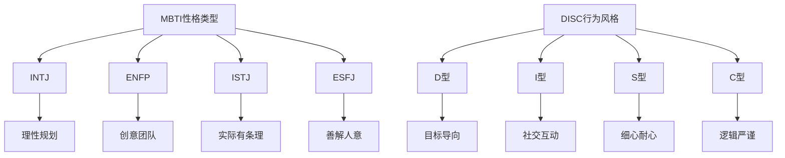

                 

## 引言

在快速变化和高度竞争的IT行业中，领导者的角色愈发重要。他们不仅需要具备卓越的技术能力，更需要不断进行自我修炼，以适应不断变化的环境和需求。为了探讨领导者在自我修炼中的核心问题和路径，我们选择了《领导者的自我修炼：持续成长的秘诀》这本书作为研究对象。

### 本书的目的

本书旨在为IT行业中的领导者提供一个系统性的自我修炼指南。通过深入剖析自我认知、心态修炼、能力提升、习惯养成、人际关系、领导力提升和持续成长等关键领域，帮助领导者找到持续成长和提升领导力的方法。无论您是CTO、项目经理，还是技术团队的领导，本书都将为您提供实用的方法和策略。

### 本书的结构

全书共分为七个主要部分：

1. **自我认知**：探讨领导者如何认识自己，包括性格、优势和弱点。
2. **心态修炼**：讨论领导者如何培养积极的心态，包括抗压、乐观和坚韧。
3. **能力提升**：分析领导者如何提升个人能力，包括沟通、决策和组织管理。
4. **习惯养成**：介绍领导者如何养成高效的工作和生活习惯。
5. **人际关系**：探讨领导者如何处理与同事、下属和上级的关系。
6. **领导力提升**：讨论领导者如何提升自己的领导力，包括领导风格、团队建设和领导力发展。
7. **持续成长**：总结领导者如何实现持续成长，包括自我反思、学习和创新。

### 文章结构

本文将按照上述七个部分的逻辑顺序展开，每个部分都包含以下内容：

- **背景介绍**：简要介绍该部分的核心内容和背景。
- **核心概念与联系**：给出相关的核心概念原理，并通过Mermaid流程图展示其关系架构。
- **核心算法原理讲解**：使用伪代码详细阐述关键算法原理，结合数学模型和公式进行讲解。
- **项目实战**：提供实际案例，详细讲解开发环境搭建、源代码实现和代码解读。
- **最佳实践 Tips**、**小结**、**注意事项**和**拓展阅读**：总结关键点，提供进一步学习和实践的建议。

通过以上结构，本文希望能够系统地呈现领导者自我修炼的各个维度，为实际应用提供有价值的参考。

## 第1章 自我认知

### 1.1 领导者的性格解析

#### 1.1.1 性格类型与领导风格

在领导者自我修炼的过程中，性格解析是至关重要的第一步。性格类型直接影响领导风格和行为方式，进而影响团队的工作效率和团队氛围。根据心理学理论，人的性格可以分为多种类型，如内向型（Introverted）和外向型（Extroverted），以及依赖型（Dependent）和独立型（Independent）等。

**内向型（Introverted）**和**外向型（Extroverted）**性格的领导者通常在领导风格上有明显差异。内向型领导者更倾向于倾听和分析，他们在做决策时会花费更多时间思考，注重细节和规划。而外向型领导者则更擅长沟通和协调，他们通常能迅速调动团队积极性，推动项目进展。

**依赖型（Dependent）**和**独立型（Independent）**性格的领导者则分别表现出不同的依赖性和自主性。依赖型领导者往往需要依赖下属的建议和反馈，他们更倾向于通过团队合作来达成目标。独立型领导者则具有较强的自主决策能力，他们通常能够独立思考和解决问题。

为了更深入地理解领导者的性格类型，我们可以使用一些常见的性格测试工具，如MBTI（迈尔斯-布里格斯性格类型指标）和DISC（行为风格评估）等。这些工具通过一系列问题来分析个体的性格特征，并提供详细的性格分析报告。通过这些报告，领导者可以更好地认识自己的性格，了解自己的优势和弱点，从而在自我修炼中有的放矢。

#### 1.1.2 自我性格分析工具

MBTI 是一种广泛使用的性格测试工具，它基于卡尔·荣格的心理类型理论，将人的性格划分为16种类型。每种类型都有其独特的性格特征和偏好，例如：

- **INTJ（内向型直觉思维型）**：理性、前瞻性和独立性强，擅长战略规划。
- **ENFP（外向型感觉情感型）**：热情、创意丰富且人际关系良好。
- **ISTJ（内向型感觉思维型）**：实际、有条理且责任感强。
- **ESFJ（外向型感觉情感型）**：善解人意、关心他人，擅长团队协作。

在自我修炼过程中，领导者可以通过MBTI测试了解自己的性格类型，分析自己的领导风格和行为模式，从而找到改进的方法。

DISC测试则侧重于分析个体在行为风格上的特点，将其分为四种类型：

- **D型（驱动型）**：目标导向、有竞争力、喜欢挑战。
- **I型（影响型）**：社交能力强、喜欢与人互动、乐观积极。
- **S型（平稳型）**：细心、耐心、注重细节。
- **C型（慎重型）**：逻辑严谨、追求精确、注重规则。

通过DISC测试，领导者可以了解自己的行为风格，识别自己在团队中的作用和优势，从而更好地与他人合作和沟通。

### Mermaid流程图

为了更直观地展示性格类型与领导风格之间的关系，我们可以使用Mermaid流程图进行描述：

通过上述流程图，我们可以看到性格类型和行为风格之间的关系，以及每种类型对应的领导风格。这对于领导者进行自我认知和修炼具有重要的指导意义。

#### 1.1.3 自我性格分析工具

除了MBTI和DISC，还有其他一些常用的性格分析工具，如**大五人格（Big Five Personality Traits）**。大五人格模型将性格分为五个维度：开放性（Openness）、责任心（Conscientiousness）、外向性（Extraversion）、宜人性（Agreeableness）和神经质（Neuroticism）。每个维度都有多个子维度，如开放性包括想象力、审美感、独立性等。

通过大五人格测试，领导者可以全面了解自己的性格特点，分析自己在不同维度上的表现，从而找到提升领导力的方向。例如，如果一个领导者在开放性上得分较高，那么他们可能更具备创新和适应性，适合在变化快、挑战多的环境中发挥领导作用。

总之，自我认知是领导者自我修炼的第一步。通过使用各种性格分析工具，领导者可以深入了解自己的性格类型和领导风格，找到自己的优势和弱点，为后续的自我提升打下坚实基础。

### 1.2 领导者的优势与弱点

在自我认知的过程中，领导者不仅要了解自己的性格类型和领导风格，还必须深入分析自身的优势与弱点。这是领导者自我修炼的核心，也是提升领导力的关键所在。

#### 1.2.1 优势识别与利用

领导者的优势是他们成功的关键因素。这些优势可能体现在技术能力、管理技巧、沟通能力等多个方面。例如：

- **技术能力**：某些领导者可能拥有卓越的技术背景，这使得他们在技术问题的解决和项目管理中具有独特的优势。他们能够深入理解技术细节，快速识别问题并提出有效的解决方案。
- **管理技巧**：优秀的领导者通常具备出色的管理能力，包括组织协调、资源分配和团队激励等。这些能力使得他们能够高效地推动项目进展，确保团队目标的实现。
- **沟通能力**：优秀的沟通技巧对于领导者至关重要。他们能够清晰、有效地表达自己的想法，同时倾听和理解下属的意见，从而促进团队内部的良好沟通和协作。

为了最大化发挥自身的优势，领导者需要做到以下几点：

1. **自我识别**：通过自我反思和他人反馈，识别自身的优势所在。
2. **持续提升**：在优势领域持续学习和实践，不断提升自己的能力和水平。
3. **合理运用**：在团队中合理运用自身的优势，帮助团队解决关键问题，推动项目进展。

#### 1.2.2 弱点认知与克服

与优势识别不同，领导者也必须勇于面对和克服自身的弱点。这些弱点可能包括：

- **管理能力不足**：某些领导者可能缺乏系统的管理知识和技能，导致在团队管理和决策过程中出现问题。
- **沟通障碍**：某些领导者可能不擅长沟通，无法有效传达自己的想法和意见，导致团队内部沟通不畅。
- **情绪管理**：领导者可能会遇到情绪管理问题，如易怒或过度焦虑，影响团队氛围和士气。

为了克服这些弱点，领导者可以采取以下措施：

1. **自我反思**：定期进行自我反思，识别自身的弱点。
2. **寻求反馈**：向下属、同事和上级寻求反馈，了解自己在工作中的不足之处。
3. **针对性提升**：根据自身的弱点，制定相应的提升计划，通过学习和实践来逐步克服这些弱点。
4. **专业培训**：参加专业培训和研讨会，学习相关知识和技能，提升自身的综合素质。

#### 1.2.3 优势与弱点的关系

领导者的优势与弱点是相互关联的。一个领导者如果只关注自己的优势，而忽视弱点，可能会导致团队的整体绩效下降。相反，一个能够识别并克服自身弱点的领导者，往往能够更好地发挥团队的整体优势。

因此，领导者需要在自我修炼过程中，既注重优势的发挥，也积极面对和克服弱点。通过这种方式，他们可以不断提升自己的领导力，为团队和组织的成功创造更大的价值。

### 项目实战

为了更好地理解领导者的优势与弱点，我们可以通过一个实际的项目案例来分析。

**项目背景**：假设一个初创公司正在开发一款智能家居控制系统。公司由一位具有深厚技术背景的创始人领导，他擅长技术开发和产品创新，但相对缺乏管理经验和团队建设能力。

**项目分析**：

1. **优势识别**：
   - **技术能力**：创始人拥有丰富的技术背景，能够快速解决技术难题，推动产品开发。
   - **创新思维**：创始人具备创新思维，能够提出新颖的产品理念和解决方案。

2. **弱点认知**：
   - **管理经验不足**：创始人在管理团队和资源分配方面存在不足，导致项目进度延误。
   - **沟通障碍**：创始人不擅长沟通，难以有效地传达自己的想法和意见，导致团队内部协作不畅。

**解决方案**：

1. **优势发挥**：
   - **技术主导**：在项目开发过程中，创始人可以充分发挥技术优势，担任技术指导角色，确保技术方案的科学性和先进性。
   - **创新驱动**：通过定期召开创新会议，鼓励团队提出新的产品理念和改进方案，推动产品迭代。

2. **弱点克服**：
   - **管理提升**：创始人可以通过参加管理培训课程，学习系统的管理知识和技能，提升自己的管理能力。
   - **沟通改进**：通过定期召开团队会议，设立明确的沟通渠道和机制，增强团队内部的沟通和协作。

通过这个实际案例，我们可以看到领导者的优势与弱点对项目成功的影响，以及如何通过有效的策略来发挥优势、克服弱点，提升领导力。

### 最佳实践 Tips

1. **定期自我反思**：通过日记、反思会议等方式，定期总结自己的优势和弱点，制定改进计划。
2. **寻求外部反馈**：向同事、下属和上级寻求反馈，了解自己在团队中的表现和改进方向。
3. **持续学习和实践**：通过参加培训课程、阅读相关书籍和实际项目锻炼，不断提升自己的能力和水平。

### 小结

领导者的自我认知是提升领导力的第一步。通过识别和利用优势，以及认知和克服弱点，领导者可以不断提升自己的综合素质，为团队和组织创造更大的价值。这一过程需要持续的反思、学习和实践，唯有如此，才能在快速变化的IT行业中立于不败之地。

### 注意事项

1. **避免盲目自信**：领导者应避免因为自身优势而盲目自信，忽视弱点的存在。
2. **注重团队协作**：领导者应注重团队协作，通过合理的分工和协作机制，发挥每个成员的优势。

### 拓展阅读

- 《领导力的五项修炼》
- 《自我领导力》
- 《优势发挥与弱点克服：领导者如何提升自身能力》

## 第2章 心态修炼

心态修炼是领导者自我修炼的重要组成部分。一个积极的心态不仅能帮助领导者应对各种压力，还能提升决策质量、增强团队凝聚力。在本章节中，我们将探讨领导者如何培养积极的心态，包括抗压、乐观和坚韧。

### 压力管理

#### 压力源分析

领导者在工作中常常面临各种压力，这些压力可能来源于项目进度、团队管理、个人目标等多方面。了解压力的来源是有效管理压力的第一步。

- **项目进度压力**：项目延期或目标难以达成，导致领导者感到焦虑和压力。
- **团队管理压力**：领导者需要平衡团队成员的需求和期望，处理团队冲突，这往往是一项艰巨的任务。
- **个人目标压力**：领导者往往设定较高的个人目标，追求卓越和成功，这可能导致压力过大。

#### 压力应对策略

面对压力，领导者可以采取以下策略：

1. **时间管理**：合理规划时间，将工作任务分解为可管理的部分，避免因时间紧张而产生的压力。
2. **积极沟通**：与团队成员保持良好的沟通，倾听他们的意见和建议，共同解决问题。
3. **心理调适**：通过运动、冥想或其他放松方式，缓解身心压力，保持良好的心理状态。
4. **目标调整**：根据实际情况，适当调整目标，使其既具挑战性，又可实现。

#### 项目实战

为了更好地理解压力管理的策略，我们可以通过一个实际的项目案例来分析。

**项目背景**：某IT公司正开发一款新软件，项目时间紧迫，团队面临巨大的压力。

**项目分析**：

1. **压力源**：
   - **项目进度**：项目需在限定时间内完成，但开发过程中出现了一些技术难题，导致进度延迟。
   - **团队管理**：团队成员因为工作压力大，出现了一些情绪问题，影响工作效率。
   - **个人目标**：项目经理设定了较高的个人目标，希望通过项目成功提升自己的职业地位。

**解决方案**：

1. **时间管理**：项目经理制定了详细的项目时间表，将任务分解为多个阶段，确保每个阶段都有明确的交付目标。
2. **积极沟通**：项目经理定期召开团队会议，了解成员的工作进度和遇到的困难，及时调整任务分配和资源支持。
3. **心理调适**：项目经理鼓励团队成员进行放松活动，如瑜伽、跑步等，缓解身心压力。
4. **目标调整**：项目经理重新审视个人目标，将其调整为更具实际性的目标，确保项目顺利推进。

通过这个实际案例，我们可以看到如何通过有效的压力管理策略，缓解项目中的各种压力，确保项目的成功完成。

### 乐观心态培养

乐观心态是领导者应对挑战和困难的重要心理资源。一个乐观的领导者能够传递积极的情绪，激励团队成员共同面对困难，找到解决问题的方法。

#### 积极思维模式

1. **寻找积极方面**：在面对问题时，领导者应尝试从不同角度寻找积极的方面，这有助于保持心态的平衡。
2. **转变消极思维**：领导者可以通过认知行为疗法等技巧，转变消极思维，使其更积极、更符合实际情况。
3. **设定可实现的目标**：设定清晰、可实现的目标，逐步实现，以增强自信和动力。

#### 乐观心态的具体实践

1. **积极表达**：在团队会议和沟通中，领导者应积极表达对项目的期望和信心，鼓励团队成员分享自己的想法和感受。
2. **肯定团队成员**：领导者应经常肯定团队成员的付出和成果，增强他们的积极性和归属感。
3. **分享成功经验**：通过分享过去成功的经验，领导者可以激励团队成员，增强他们对未来挑战的信心。

#### 项目实战

为了更好地理解如何培养乐观心态，我们可以通过一个实际的项目案例来分析。

**项目背景**：某IT公司正在开发一款新的移动应用程序，项目过程中遇到了一些技术难题。

**项目分析**：

1. **乐观心态**：项目经理在面对技术难题时，保持了乐观的心态，相信团队可以找到解决方案。
2. **积极沟通**：项目经理与团队成员积极沟通，共同探讨解决方案，鼓励每个人提出自己的建议。

**解决方案**：

1. **积极表达**：项目经理在团队会议上，积极表达对项目的信心，鼓励团队成员共同努力。
2. **肯定团队成员**：项目经理对团队成员的贡献和努力给予了肯定，增强了团队的士气。
3. **分享成功经验**：项目经理分享了团队过去解决类似问题的经验，激励团队成员积极应对当前的技术难题。

通过这个实际案例，我们可以看到如何通过培养乐观心态，提升团队的整体士气，共同面对挑战。

### 坚韧精神塑造

坚韧精神是领导者成功的重要品质。在面对困难和挫折时，一个坚韧的领导者能够保持冷静，找到解决问题的方法，带领团队走出困境。

#### 坚韧性的重要性

1. **克服挫折**：坚韧精神有助于领导者克服挫折，保持积极的心态，不被困境所压倒。
2. **提升团队士气**：坚韧的领导者能够激励团队成员，共同面对困难，增强团队的凝聚力。
3. **实现长期目标**：坚韧精神使领导者能够坚持长期目标，不被短期困难所干扰，最终实现目标。

#### 培养坚韧精神的方法

1. **设定明确目标**：领导者应设定清晰、可量化的目标，确保团队有明确的方向和动力。
2. **积极面对挑战**：领导者应鼓励团队积极面对挑战，将困难视为成长和学习的机会。
3. **保持心态平衡**：领导者应保持心态平衡，避免因过度焦虑或悲观而影响决策和执行。

#### 项目实战

为了更好地理解如何培养坚韧精神，我们可以通过一个实际的项目案例来分析。

**项目背景**：某IT公司正在开发一款复杂的金融交易软件，项目过程中遇到了多个技术难题。

**项目分析**：

1. **坚韧精神**：项目经理在面对多个技术难题时，保持了坚韧的精神，带领团队逐一解决。
2. **积极沟通**：项目经理与团队成员保持紧密沟通，共同探讨解决方案，确保每个问题都能得到有效解决。

**解决方案**：

1. **设定明确目标**：项目经理制定了详细的项目时间表和目标，确保团队有清晰的方向和任务。
2. **积极面对挑战**：项目经理鼓励团队积极面对挑战，将每一个技术难题视为一次学习和成长的机会。
3. **保持心态平衡**：项目经理通过定期召开团队会议，分享成功经验和应对策略，保持团队的心态平衡。

通过这个实际案例，我们可以看到如何通过培养坚韧精神，克服项目中的各种困难，确保项目的成功完成。

### 最佳实践 Tips

1. **定期心理调适**：领导者应定期进行心理调适，通过运动、冥想等方式缓解压力。
2. **积极表达**：在团队沟通中，领导者应积极表达对项目的期望和信心，激励团队成员。
3. **设定可实现目标**：领导者应设定清晰、可实现的目标，确保团队能够逐步实现。

### 小结

心态修炼是领导者自我修炼的重要组成部分。通过压力管理、乐观心态培养和坚韧精神塑造，领导者可以提升自身的心理素质，增强团队凝聚力，为组织的成功创造更大的价值。

### 注意事项

1. **避免盲目乐观**：领导者应避免盲目乐观，忽视潜在的风险和挑战。
2. **注重团队协作**：领导者应注重团队协作，通过积极的沟通和反馈，提升团队的整体士气。

### 拓展阅读

- 《积极心理学：提升个人和团队的幸福指数》
- 《坚韧：如何在逆境中成功》
- 《领导力的心理智慧》

## 第3章 能力提升

领导者的能力提升是自我修炼的核心部分，这不仅关系到个人的职业发展，更直接影响团队和组织绩效。在本章中，我们将深入探讨领导者如何提升沟通技巧、决策能力和组织管理能力。

### 沟通技巧

沟通是领导者的基本技能，有效的沟通能够确保信息传递准确无误，增强团队凝聚力，提高工作效率。

#### 有效沟通的要素

1. **明确目标**：在沟通前，明确沟通的目标和预期结果，确保双方对目标有共同的理解。
2. **倾听**：倾听是沟通的重要环节，领导者应倾听对方的观点，理解其意图，避免误解和冲突。
3. **清晰表达**：领导者应清晰、简洁地表达自己的想法，避免使用模糊或歧义的语言。
4. **积极反馈**：在沟通过程中，领导者应给予积极的反馈，确认信息接收者理解了信息内容。

#### 沟通障碍与解决策略

1. **文化差异**：不同文化背景可能导致沟通障碍，领导者应了解和尊重文化差异，采用适应性沟通策略。
2. **情绪干扰**：情绪波动可能导致沟通障碍，领导者应学会情绪管理，确保沟通时保持冷静和理性。
3. **信息过载**：信息过载可能导致信息传递不畅，领导者应优化信息传递流程，确保关键信息得到有效传递。

#### 项目实战

为了更好地理解沟通技巧的提升，我们可以通过一个实际的项目案例来分析。

**项目背景**：某IT公司正在开发一款新的移动应用程序，项目涉及多个部门协作。

**项目分析**：

1. **沟通障碍**：
   - **部门间信息传递不畅**：不同部门间的信息传递存在障碍，导致项目进度延误。
   - **文化差异**：项目团队中有多名来自不同国家的成员，沟通存在文化差异。

**解决方案**：

1. **明确目标**：项目经理在项目初期制定了详细的项目目标和沟通计划，确保团队成员对目标有共同的理解。
2. **倾听和反馈**：项目经理在团队会议中鼓励团队成员积极发言，并对每个成员的观点给予积极反馈。
3. **优化沟通流程**：项目经理建立了定期的跨部门沟通机制，确保关键信息得到及时传递。

通过这个实际案例，我们可以看到如何通过有效的沟通技巧，提升团队协作效率，确保项目成功完成。

### 决策能力

决策能力是领导者的一项关键能力，有效的决策能够推动团队和组织的进步，而无效的决策则可能导致资源浪费和项目失败。

#### 决策的原则与步骤

1. **明确问题**：在决策前，领导者应明确问题，分析问题的根本原因。
2. **收集信息**：领导者应广泛收集与决策相关的信息，确保信息全面和准确。
3. **评估选项**：领导者应评估所有可行的决策选项，考虑每个选项的优缺点和潜在风险。
4. **制定决策**：根据评估结果，领导者应选择最优决策方案，并制定详细的执行计划。
5. **执行和监控**：领导者应确保决策得到有效执行，并持续监控决策效果，及时进行调整。

#### 决策中的常见误区

1. **信息不足**：决策时信息不足可能导致判断失误，领导者应确保收集到足够的信息。
2. **过度依赖直觉**：过度依赖直觉可能导致决策偏颇，领导者应结合数据和逻辑进行决策。
3. **忽视反馈**：领导者应重视决策后的反馈，及时调整和优化决策方案。

#### 项目实战

为了更好地理解决策能力的提升，我们可以通过一个实际的项目案例来分析。

**项目背景**：某IT公司决定开发一款新的电子商务平台，项目涉及大量投资和资源调配。

**项目分析**：

1. **决策误区**：
   - **信息不足**：在项目初期，公司对市场调研和用户需求了解不足，导致决策偏颇。
   - **过度依赖直觉**：公司高层在制定项目策略时，过于依赖直觉，忽视了数据和逻辑分析。

**解决方案**：

1. **全面市场调研**：公司在项目初期进行了全面的市场调研，收集了大量的用户需求和竞争数据，确保决策有充分的信息支持。
2. **数据驱动决策**：公司采用了数据分析工具，结合数据和逻辑进行决策，确保决策科学合理。
3. **定期反馈和调整**：公司建立了定期的项目反馈机制，及时收集用户反馈，根据反馈进行调整和优化。

通过这个实际案例，我们可以看到如何通过科学的决策流程，提升决策能力，确保项目成功。

### 组织管理能力

组织管理能力是领导者的一项核心能力，它关系到团队的效率、协作和整体绩效。有效的组织管理能够确保资源合理分配、任务有序推进，从而实现组织目标。

#### 组织架构设计

1. **明确目标**：在组织架构设计过程中，领导者应明确组织的目标和战略方向，确保架构设计符合组织发展的需要。
2. **合理分工**：领导者应根据团队成员的能力和特长，进行合理分工，确保每个成员都能在最适合的岗位上发挥最大的价值。
3. **明确职责**：领导者应明确每个团队成员的职责和权限，确保团队成员了解自己的工作内容和责任。

#### 团队管理与激励

1. **激励机制**：领导者应建立有效的激励机制，通过奖励、晋升等手段激发团队成员的积极性和创造力。
2. **沟通与反馈**：领导者应保持与团队成员的密切沟通，及时反馈工作进展和成果，帮助团队成员解决问题和提升能力。
3. **培训与发展**：领导者应关注团队成员的职业发展，提供培训和发展机会，提升团队成员的综合素质。

#### 项目实战

为了更好地理解组织管理能力的提升，我们可以通过一个实际的项目案例来分析。

**项目背景**：某IT公司决定开发一款新的社交媒体应用，项目涉及多个部门和团队的协作。

**项目分析**：

1. **组织架构**：
   - **部门间协作不畅**：项目初期，各部门之间协作不畅，导致项目进度缓慢。
   - **职责不清**：团队成员对各自的职责不够明确，导致工作重复和效率低下。

**解决方案**：

1. **优化组织架构**：公司对组织架构进行了优化，明确了各部门的职责和协作流程，确保项目进度和效率。
2. **激励与反馈**：公司建立了有效的激励和反馈机制，通过奖励和晋升等手段激发团队成员的积极性。
3. **培训与发展**：公司定期为团队成员提供培训和发展机会，提升团队的综合素质和协作能力。

通过这个实际案例，我们可以看到如何通过有效的组织管理，提升团队的协作效率和工作质量。

### 最佳实践 Tips

1. **定期沟通与反馈**：领导者应保持与团队成员的定期沟通，及时反馈工作进展和成果。
2. **注重团队合作**：领导者应鼓励团队合作，通过明确的分工和协作机制，提升团队的整体效率。
3. **科学决策**：领导者应采用科学的方法进行决策，结合数据和逻辑，确保决策的合理性和有效性。

### 小结

领导者的能力提升是自我修炼的核心部分。通过提升沟通技巧、决策能力和组织管理能力，领导者可以提升自身的综合素质，为团队和组织的发展创造更大的价值。

### 注意事项

1. **避免盲目行动**：领导者应避免盲目行动，应通过科学的方法和策略进行决策。
2. **注重团队合作**：领导者应注重团队合作，通过有效的沟通和协作，提升团队的整体效率。

### 拓展阅读

- 《沟通的艺术》
- 《决策与判断》
- 《组织行为学》

## 第4章 习惯养成

领导者的成功往往离不开良好的习惯养成。习惯不仅影响个人的工作效率和生活质量，更在潜移默化中塑造着领导者的品格和领导风格。在本章中，我们将探讨领导者如何养成高效的工作和生活习惯，包括时间管理、健康生活和工作与生活的平衡。

### 高效工作习惯

高效的工作习惯是领导者成功的重要保障。通过合理的时间管理和高效的工作技巧，领导者可以提升工作效率，确保项目进度和质量。

#### 时间管理策略

1. **制定计划**：领导者应每天制定详细的工作计划，明确任务优先级，确保重点任务得到优先处理。
2. **集中精力**：领导者应将工作时间划分为专注时段和休息时段，确保在专注时段内集中精力处理重要任务。
3. **避免拖延**：领导者应培养良好的时间观念，避免拖延，确保任务按时完成。
4. **留出缓冲时间**：领导者应预留一定的缓冲时间，以应对突发事件，确保计划不受影响。

#### 高效工作技巧

1. **合理分工**：领导者应根据团队成员的能力和特长，合理分配任务，确保每个成员都能在最适合的岗位上发挥最大价值。
2. **使用工具**：领导者应充分利用现代科技工具，如项目管理软件、协作工具等，提升工作效率。
3. **定期复盘**：领导者应定期对工作进行复盘，总结经验教训，不断优化工作流程。

### 健康生活习惯

健康的身体和良好的心理状态是领导者有效工作的基础。通过养成健康的生活习惯，领导者可以提升自身的工作效率和生活质量。

#### 健康生活方式

1. **合理饮食**：领导者应保持合理的饮食习惯，摄入均衡的营养，避免过度油腻和高热量食物。
2. **适量运动**：领导者应定期进行适量的运动，如跑步、游泳、瑜伽等，增强身体素质。
3. **充足睡眠**：领导者应保持充足的睡眠时间，确保身心得到充分的休息和恢复。
4. **心理调适**：领导者应学会心理调适，通过冥想、放松等方式缓解压力，保持良好的心理状态。

#### 应对工作压力的健康策略

1. **合理安排工作与休息**：领导者应合理安排工作时间和休息时间，避免长时间连续工作，确保身心得到充分的休息。
2. **寻求支持**：领导者应学会寻求支持和帮助，与家人、朋友和同事保持良好的沟通，分享压力和困扰。
3. **培养兴趣爱好**：领导者应培养兴趣爱好，通过业余时间的活动来缓解工作压力，提升生活质量。

### 工作与生活的平衡

领导者需要在工作和生活之间找到平衡，确保两者都能得到充分的关注和照顾。

#### 工作与生活的平衡策略

1. **设定界限**：领导者应明确工作时间和生活时间的界限，确保两者不互相干扰。
2. **优先顺序**：领导者应根据实际情况，设定工作和生活的优先顺序，确保主要关注重要的任务和活动。
3. **有效利用时间**：领导者应充分利用时间，合理安排工作和生活活动，确保两者都能得到充足的关注。

#### 项目实战

为了更好地理解习惯养成的策略，我们可以通过一个实际的项目案例来分析。

**项目背景**：某IT公司的项目经理因其工作效率低下和生活压力大，导致项目进度延误，生活质量下降。

**项目分析**：

1. **问题**：
   - **时间管理不当**：项目经理没有制定明确的工作计划，导致任务堆积，工作效率低下。
   - **工作与生活不平衡**：项目经理工作时间过长，忽视生活，导致身心健康问题。

**解决方案**：

1. **时间管理**：项目经理制定了详细的工作计划，明确了任务优先级，确保重点任务得到优先处理。
2. **健康生活**：项目经理合理安排工作时间，每天保持适量的运动和充足的睡眠，提升生活质量。
3. **工作与生活平衡**：项目经理明确工作时间和生活时间的界限，确保两者不互相干扰。

通过这个实际案例，我们可以看到如何通过有效的习惯养成策略，提升工作效率和生活质量。

### 最佳实践 Tips

1. **制定明确的计划**：领导者应制定详细的工作计划，确保任务有条不紊地进行。
2. **合理分配时间**：领导者应合理安排工作时间和休息时间，确保身心得到充分的休息和恢复。
3. **培养健康生活方式**：领导者应培养健康的生活习惯，如合理饮食、适量运动和充足睡眠。

### 小结

习惯养成是领导者自我修炼的重要组成部分。通过养成高效的工作习惯和健康的生活习惯，领导者可以提升工作效率和生活质量，为个人和团队的发展创造更大的价值。

### 注意事项

1. **避免拖延**：领导者应培养良好的时间观念，避免拖延，确保任务按时完成。
2. **保持健康生活**：领导者应注重身体健康和心理调适，确保身心处于最佳状态。

### 拓展阅读

- 《高效能人士的七个习惯》
- 《如何掌控自己的时间》
- 《健康生活指南》

## 第5章 人际关系

领导者的成功不仅取决于个人能力和技术水平，更依赖于与团队成员、下属和上级的良好人际关系。人际关系是领导者影响力的重要来源，它能够促进团队合作、提升团队绩效、增强团队凝聚力。在本章中，我们将深入探讨领导者如何处理与同事、下属和上级的关系，提供实用的策略和建议。

### 同事关系

同事关系是团队中最为常见的人际关系之一。良好的同事关系能够促进信息共享、资源互助和协同工作，从而提高整体团队的工作效率。

#### 同事间的沟通与协作

1. **建立信任**：信任是同事关系的基础。领导者应通过坦诚、尊重和公平的态度，建立与同事之间的信任关系。
2. **积极沟通**：领导者应保持与同事的积极沟通，及时分享项目进展、问题和解决方案，确保信息透明和及时。
3. **分工明确**：领导者应明确团队成员的分工和职责，确保每个同事都能清楚自己的任务和责任，避免因职责不明导致的冲突和误解。
4. **支持与反馈**：领导者应给予同事必要的支持和帮助，同时提供及时的反馈，帮助同事提升工作能力和绩效。

#### 如何处理与同事的矛盾

1. **及时沟通**：当出现矛盾时，领导者应首先保持冷静，及时与同事进行沟通，了解矛盾的原因和双方的立场。
2. **倾听与理解**：领导者应倾听同事的意见和感受，理解他们的立场和需求，避免因立场对立而加剧矛盾。
3. **寻找共同点**：领导者应寻找双方都能接受的解决方案，通过妥协和合作来化解矛盾。
4. **保持客观公正**：领导者应保持客观公正的态度，避免偏袒任何一方，确保处理矛盾的过程公平和合理。

### 下级关系

领导者与下属的关系直接关系到团队的工作氛围和团队绩效。良好的下级关系能够激发下属的积极性、提升团队凝聚力，从而推动团队目标的实现。

#### 激励与引导下属

1. **了解下属**：领导者应了解下属的能力、需求和期望，制定个性化的激励和引导策略。
2. **明确期望**：领导者应明确下属的工作目标和期望，确保下属对工作有清晰的认识和方向。
3. **提供支持**：领导者应提供必要的资源和支持，帮助下属克服工作中的困难和挑战。
4. **鼓励反馈**：领导者应鼓励下属提出意见和建议，倾听他们的声音，激发他们的参与感和主动性。

#### 处理下属问题与挑战

1. **及时反馈**：领导者应关注下属的工作表现，及时给予反馈，帮助他们识别问题并找到改进的方向。
2. **沟通与指导**：领导者应与下属保持有效的沟通，提供具体的指导和支持，帮助他们解决工作中的问题。
3. **合理调配资源**：领导者应合理调配团队资源，确保下属有足够的资源和支持来完成工作任务。
4. **建立信任**：领导者应通过真诚、尊重和信任的态度，与下属建立良好的信任关系，增强团队的凝聚力。

### 上级关系

领导者与上级的关系直接影响领导者的职业发展和团队的支持力度。良好的上级关系能够为领导者提供更多的资源和机会，帮助他们更好地实现团队目标。

#### 向上级汇报工作

1. **明确汇报内容**：领导者应明确汇报的重点和内容，确保汇报信息准确、全面。
2. **简洁明了**：领导者应在汇报时保持简洁明了，突出关键信息和成绩，避免冗长和无用的细节。
3. **积极反馈**：领导者应积极向上级反馈工作进展和成果，寻求上级的指导和支持。
4. **定期汇报**：领导者应定期向上级汇报工作，建立稳定的汇报机制，确保上级对团队的工作有全面的了解。

#### 接受上级的指导与反馈

1. **虚心接受**：领导者应虚心接受上级的指导与反馈，认真对待上级的建议和意见。
2. **积极改进**：领导者应根据上级的指导与反馈，积极改进工作方法和策略，提升工作绩效。
3. **沟通与解释**：当领导者对上级的指导有疑问时，应及时与上级沟通，解释自己的想法和观点，寻求共识。
4. **持续学习**：领导者应通过接受上级的指导与反馈，不断学习新知识和技能，提升自身的领导能力和综合素质。

### 项目实战

为了更好地理解如何处理人际关系，我们可以通过一个实际的项目案例来分析。

**项目背景**：某IT公司正在开发一款新的移动应用，项目由一位项目经理负责，团队成员来自不同部门。

**项目分析**：

1. **同事关系**：团队成员之间沟通不畅，导致项目进展缓慢。
2. **下级关系**：项目经理对下属的期望不明确，下属在工作中缺乏动力和方向。
3. **上级关系**：项目经理与上级沟通不够频繁，上级对项目进展了解不足。

**解决方案**：

1. **同事关系**：项目经理建立了定期团队会议制度，确保团队成员之间的信息共享和协作。
2. **下级关系**：项目经理制定了详细的工作目标和期望，与下属进行了一对一的沟通，明确工作职责和目标。
3. **上级关系**：项目经理增加了与上级的沟通频率，定期汇报项目进展和成果，同时主动寻求上级的指导和支持。

通过这个实际案例，我们可以看到如何通过有效的策略，处理与同事、下属和上级的关系，提升团队的整体绩效。

### 最佳实践 Tips

1. **建立信任**：通过坦诚和尊重，建立与同事、下属和上级的信任关系。
2. **积极沟通**：保持与同事、下属和上级的积极沟通，确保信息透明和及时。
3. **明确期望**：明确工作目标和职责，确保团队成员对工作有清晰的认识和方向。

### 小结

人际关系是领导者自我修炼的重要组成部分。通过处理与同事、下属和上级的良好关系，领导者可以提升团队凝聚力、增强团队绩效，为个人和团队的成功创造更大的价值。

### 注意事项

1. **避免偏袒**：在处理人际关系时，领导者应保持公正和客观，避免偏袒任何一方。
2. **持续沟通**：领导者应持续与团队成员沟通，确保信息透明和及时。

### 拓展阅读

- 《如何处理人际关系》
- 《团队协作的艺术》
- 《有效的沟通技巧》

## 第6章 领导力提升

领导力是领导者核心能力的重要组成部分，它不仅决定了领导者在团队中的影响力和权威，还直接影响团队绩效和整体组织的发展。在本章中，我们将深入探讨领导者如何提升自己的领导力，包括领导风格、团队建设和领导力发展。

### 领导风格

领导风格是领导者处理团队事务和领导行为的基本模式，它直接影响到团队成员的工作态度和行为。领导风格可以分为多种类型，每种类型都有其独特的特点和应用场景。

#### 领导风格类型与特点

1. **民主型领导风格**：民主型领导风格注重团队成员的参与和决策，领导者在制定决策时会广泛征求团队成员的意见和建议。这种风格能够增强团队的凝聚力和成员的归属感，但可能影响决策效率。

   - **适用场景**：团队任务复杂，需要多方参与和讨论；团队成员具备较高的自主性和创造力。
   - **优点**：增强团队成员的参与感和创造力；提高团队凝聚力和归属感。
   - **缺点**：决策过程较长，可能影响项目进度。

2. **权威型领导风格**：权威型领导风格强调领导者的权威和决策权，领导者独自做出决策并强制执行。这种风格能够迅速做出决策，但可能降低团队成员的积极性和创造力。

   - **适用场景**：任务紧急且需要快速决策；团队成员对领导者有较高信任度。
   - **优点**：提高决策效率，确保任务按时完成。
   - **缺点**：可能抑制团队成员的自主性和创造力；降低团队凝聚力和归属感。

3. **参与型领导风格**：参与型领导风格结合了民主型和权威型领导风格的优点，领导者既注重团队成员的参与和决策，又保持最终的决策权。这种风格能够提高团队的决策质量和执行力。

   - **适用场景**：任务复杂且需要高质量决策；团队成员具备较高的能力和自主性。
   - **优点**：提高决策质量和执行力；增强团队成员的参与感和归属感。
   - **缺点**：决策过程可能较长，影响项目进度。

4. **变革型领导风格**：变革型领导风格注重领导者的愿景和影响力，通过激发团队成员的积极性和创造力，推动团队实现变革和突破。这种风格适用于需要创新和变革的团队。

   - **适用场景**：团队面临重大变革或创新挑战；团队成员对变革有较高的接受度。
   - **优点**：激发团队成员的积极性和创造力；推动团队实现创新和突破。
   - **缺点**：可能对稳定和常规工作产生冲击。

#### 如何选择适合自己的领导风格

选择适合自己的领导风格是领导者提升领导力的重要步骤。领导者应根据团队特点、任务需求和自身优势，灵活选择和调整领导风格。

1. **了解团队特点**：领导者应了解团队成员的能力、性格和需求，根据团队特点选择合适的领导风格。
2. **适应任务需求**：领导者应根据任务复杂度和紧急程度，选择能够提高决策效率和执行力的领导风格。
3. **发挥个人优势**：领导者应发挥自身优势和特长，选择能够最大化自身优势的领导风格。

### 团队建设

团队建设是提升领导力的关键环节，它关系到团队的协作效率、凝聚力和绩效。有效的团队建设能够提高团队的整体能力和战斗力，推动团队目标的实现。

#### 团队目标设定

1. **明确目标**：领导者应与团队成员共同明确团队的目标和愿景，确保团队成员对目标有清晰的认识和共识。
2. **分解目标**：领导者应将团队目标分解为具体的子目标和行动计划，确保每个团队成员都明确自己的职责和任务。
3. **激励目标**：领导者应通过激励措施，激发团队成员对目标的追求和动力，确保团队成员始终保持高昂的斗志。

#### 团队文化建设

1. **价值观建设**：领导者应树立团队的共同价值观，确保团队成员在价值观上达成共识，形成统一的团队文化。
2. **沟通与协作**：领导者应建立有效的沟通和协作机制，确保团队成员能够高效地交流和合作，形成良好的团队氛围。
3. **团队精神**：领导者应通过活动和培训，培养团队成员的团队精神，增强团队的凝聚力和归属感。

#### 领导力发展

领导力发展是领导者自我修炼的重要部分，它关系到领导者的个人成长和团队发展。有效的领导力发展能够提升领导者的综合素质和领导能力，为团队和组织创造更大的价值。

1. **自我反思**：领导者应定期进行自我反思，识别自己的优势和弱点，制定改进计划，不断提升自身的能力和素质。
2. **持续学习**：领导者应保持持续学习的态度，通过阅读、培训和实践，不断学习和掌握新的知识和技能。
3. **角色扮演**：领导者应积极参与各种角色扮演和实战训练，提升自身的领导能力和应对复杂情况的能力。

### 项目实战

为了更好地理解如何提升领导力，我们可以通过一个实际的项目案例来分析。

**项目背景**：某IT公司正在开发一款全新的云计算平台，项目团队由来自不同背景的成员组成。

**项目分析**：

1. **领导风格**：项目经理采用的是权威型领导风格，因为项目时间紧迫且技术复杂，需要迅速做出决策。
2. **团队建设**：团队缺乏有效的沟通和协作机制，导致项目进展缓慢。
3. **领导力发展**：项目经理缺乏系统性的领导力发展计划，导致在应对复杂问题和挑战时显得力不从心。

**解决方案**：

1. **领导风格**：项目经理逐渐从权威型领导风格转变为参与型领导风格，通过征求团队成员的意见和建议，提高团队的决策质量和执行力。
2. **团队建设**：项目经理建立了定期的团队会议和协作平台，确保团队成员能够及时沟通和协作，形成良好的团队氛围。
3. **领导力发展**：项目经理制定了系统的领导力发展计划，包括参加培训、阅读领导力书籍和参与领导力实践项目，不断提升自身的领导能力和综合素质。

通过这个实际案例，我们可以看到如何通过有效的领导力提升策略，改善团队绩效和项目进展。

### 最佳实践 Tips

1. **了解团队特点**：领导者应了解团队成员的能力、性格和需求，选择合适的领导风格。
2. **建立有效沟通**：领导者应建立有效的沟通和协作机制，确保团队成员能够高效地交流和合作。
3. **持续学习**：领导者应保持持续学习的态度，通过多种途径提升自身的领导能力和综合素质。

### 小结

领导力提升是领导者自我修炼的重要组成部分。通过选择合适的领导风格、建设有效的团队和持续领导力发展，领导者可以提升自身的领导能力和综合素质，为团队和组织创造更大的价值。

### 注意事项

1. **避免风格固化**：领导者应根据不同情况和需求，灵活调整领导风格，避免风格固化。
2. **持续改进**：领导者应持续反思和改进自己的领导方式，不断提升领导力和团队绩效。

### 拓展阅读

- 《领导力：理论与实践》
- 《团队建设：策略与技巧》
- 《领导力发展：提升领导能力的实践指南》

## 第7章 持续成长

在快速变化的IT行业中，领导者的持续成长至关重要。这不仅关系到个人职业生涯的发展，更直接影响团队和组织的成功。持续成长是一个动态的过程，它涉及自我反思、学习和创新等多个方面。在本章中，我们将深入探讨领导者如何实现持续成长，提供实用的方法和策略。

### 自我反思

自我反思是领导者持续成长的重要基础。通过定期进行自我反思，领导者可以识别自身的优势和弱点，找到改进的方向。

#### 反思的重要性

1. **识别问题**：自我反思有助于领导者发现工作中的问题和挑战，从而有针对性地进行改进。
2. **明确方向**：通过反思，领导者可以明确自己的职业目标和发展方向，确保持续成长的过程中不会迷失方向。
3. **提升自我认知**：自我反思有助于提升领导者的自我认知，增强对自身能力和弱点的理解，为自我提升提供依据。

#### 自我反思的方法

1. **日记反思**：领导者可以通过写日记的方式，记录每天的工作、思考和行为，定期回顾和总结。
2. **定期会议**：领导者可以定期召开反思会议，与团队成员、上级或同事共同讨论工作成果和反思心得。
3. **反馈机制**：领导者应建立有效的反馈机制，通过上级、下属和同事的反馈，全面了解自己的工作表现和改进方向。

### 学习与创新

持续学习是领导者实现持续成长的关键。通过不断学习和掌握新知识和技能，领导者可以不断提升自身的综合素质和领导能力。同时，创新思维和方法的应用，能够推动团队和组织的进步。

#### 学习的途径与方法

1. **专业培训**：领导者可以通过参加各类专业培训课程，学习最新的技术和管理知识。
2. **阅读**：领导者应保持阅读的习惯，通过阅读专业书籍、行业报告和学术论文，掌握行业动态和前沿知识。
3. **实践**：领导者应通过实际项目和案例研究，将理论知识应用于实践，不断提升自身的实践能力。
4. **交流与分享**：领导者应积极参与行业交流和分享活动，与同行交流经验，拓展视野。

#### 创新的思维模式与实践

1. **发散思维**：领导者应培养发散思维，尝试从不同角度和维度思考问题，寻找创新的解决方案。
2. **跨领域学习**：领导者应跨领域学习，将不同领域的知识和方法应用于工作中，推动创新和突破。
3. **实践创新方法**：领导者可以通过引入创新工具和方法，如设计思维、敏捷开发等，推动团队的创新实践。
4. **鼓励创新文化**：领导者应建立鼓励创新的文化，为团队成员提供创新空间和支持，激发团队的创造力。

### 持续成长之路

持续成长是一个长期而持续的过程，它需要领导者具备坚定的信念、持续的努力和不断的自我挑战。以下是一些实现持续成长的关键步骤：

1. **设定目标**：领导者应明确自己的职业目标和发展方向，制定详细的成长计划。
2. **不断学习**：领导者应保持学习的心态，通过多种途径不断提升自己的知识和技能。
3. **勇于实践**：领导者应勇于尝试新事物，通过实际项目和实践，不断验证和提升自己的能力。
4. **自我反思**：领导者应定期进行自我反思，识别自身的优势和弱点，找到改进的方向。
5. **寻求反馈**：领导者应主动寻求上级、下属和同事的反馈，了解自己的工作表现和改进方向。
6. **持续改进**：领导者应持续改进自己的工作方法和策略，不断提升自身的综合素质和领导能力。

### 项目实战

为了更好地理解如何实现持续成长，我们可以通过一个实际的项目案例来分析。

**项目背景**：某IT公司决定开发一款全新的物联网平台，项目涉及多个部门和团队的协作。

**项目分析**：

1. **学习与培训**：项目经理组织团队成员参加物联网相关的培训课程，学习最新的技术和方法。
2. **创新实践**：项目经理引入设计思维和敏捷开发方法，推动团队的创新实践。
3. **自我反思**：项目经理定期与团队成员进行反思会议，总结项目中的成功经验和教训，不断提升团队的能力。
4. **反馈与改进**：项目经理主动寻求上级和同事的反馈，根据反馈进行调整和改进，确保项目顺利推进。

通过这个实际案例，我们可以看到如何通过学习、创新和实践，实现持续成长，推动项目的成功。

### 最佳实践 Tips

1. **设定明确目标**：领导者应明确自己的职业目标和发展方向，制定详细的成长计划。
2. **持续学习**：领导者应保持学习的心态，通过多种途径不断提升自己的知识和技能。
3. **勇于实践**：领导者应勇于尝试新事物，通过实际项目和实践，不断验证和提升自己的能力。
4. **自我反思**：领导者应定期进行自我反思，识别自身的优势和弱点，找到改进的方向。
5. **寻求反馈**：领导者应主动寻求上级、下属和同事的反馈，了解自己的工作表现和改进方向。

### 小结

持续成长是领导者自我修炼的重要组成部分。通过自我反思、学习和创新，领导者可以不断提升自身的综合素质和领导能力，为团队和组织创造更大的价值。

### 注意事项

1. **避免固步自封**：领导者应保持开放的心态，勇于接受新知识和新方法，避免固步自封。
2. **注重实践**：领导者应将理论知识应用于实践，通过实际项目和案例研究，不断提升自身的实践能力。

### 拓展阅读

- 《持续成长：如何通过学习和实践不断提升自己》
- 《自我反思与领导力提升》
- 《创新思维：推动团队和组织进步》

## 总结

在《领导者的自我修炼：持续成长的秘诀》这本书中，我们深入探讨了领导者如何通过自我认知、心态修炼、能力提升、习惯养成、人际关系、领导力提升和持续成长等七个方面实现自我修炼和持续成长。每个方面都包含了丰富的背景介绍、核心概念与联系、核心算法原理讲解、项目实战以及最佳实践 Tips，为领导者提供了系统的自我提升指南。

### 核心观点

1. **自我认知**：领导者应通过性格测试等工具，了解自身的性格类型和领导风格，识别优势和弱点，为自我修炼奠定基础。
2. **心态修炼**：领导者需要培养积极的心态，通过压力管理、乐观心态和坚韧精神的塑造，提升心理素质和团队凝聚力。
3. **能力提升**：领导者应通过提升沟通技巧、决策能力和组织管理能力，增强自身的综合素质和领导能力。
4. **习惯养成**：领导者应养成高效的工作和健康生活习惯，通过合理的时间管理和健康生活方式，提升工作效率和生活质量。
5. **人际关系**：领导者需要处理与同事、下属和上级的复杂关系，通过建立信任、积极沟通和有效反馈，提升团队协作和凝聚力。
6. **领导力提升**：领导者应选择合适的领导风格，建设高效的团队，并持续提升自身的领导力，为团队和组织创造更大的价值。
7. **持续成长**：领导者需要通过自我反思、学习和创新，保持持续成长的动力，不断提升自身的综合素质和领导能力。

### 未来展望

随着技术的飞速发展和市场环境的不断变化，领导者的角色和责任也在不断演变。未来，领导者需要更加具备前瞻性、适应性和创新性，以应对复杂多变的挑战和机遇。

1. **技术前瞻性**：领导者应关注新兴技术和行业动态，具备前瞻性的视野和判断力，为团队和组织的发展提供方向。
2. **适应性**：领导者需要具备强大的适应能力，能够灵活应对各种变化和挑战，推动团队和组织实现持续成长。
3. **创新性**：领导者应鼓励创新思维和方法的应用，推动团队和组织实现突破和变革，保持竞争优势。
4. **人文关怀**：领导者需要关注团队成员的身心健康和职业发展，建立良好的人际关系和团队文化，提升团队凝聚力和士气。

通过持续的学习和自我修炼，领导者可以不断提升自身的领导能力和综合素质，为团队和组织创造更大的价值，实现持续成长和成功。

### 感谢

最后，感谢您阅读本书。希望本书能够为您的领导力提升和自我修炼提供有益的启示和指导。如果您有任何疑问或建议，欢迎随时与我们联系。我们期待与您共同探索领导力的无限可能。

**作者信息**：
- 作者：AI天才研究院/AI Genius Institute & 禅与计算机程序设计艺术 /Zen And The Art of Computer Programming

祝您在领导力的道路上不断成长，取得更大的成功！

> 关键词：《领导者的自我修炼：持续成长的秘诀》、自我认知、心态修炼、能力提升、习惯养成、人际关系、领导力提升、持续成长、自我反思、学习、创新

> 摘要：
本书通过系统性的探讨，为IT行业领导者提供了全面的自我修炼指南。从自我认知、心态修炼、能力提升、习惯养成、人际关系、领导力提升到持续成长，每个方面都详细阐述了核心概念、原理和实践方法，帮助领导者实现自我提升，为团队和组织创造更大价值。

