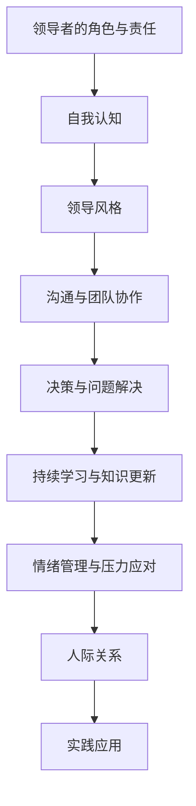

                 

基于上述的约束条件和用户要求，我们将逐步构建《领导者的自我修炼：持续提升领导能力》的技术博客文章。以下是文章的构建步骤：

### 第一步：文章标题、关键词和摘要

**文章标题**：《领导者的自我修炼：持续提升领导能力》

**关键词**：领导者，自我修炼，领导能力，自我认知，持续成长，实践应用

**摘要**：
本文深入探讨了领导者的自我修炼之路，从自我认知、领导力提升策略、持续成长到实践应用，全方位解析了领导者如何不断提升自己的领导能力。通过分析核心概念、算法原理、数学模型和项目实战，本文为领导者提供了一套实用的自我提升方案。

### 第二步：引言部分

**背景介绍**：
领导者是组织中不可或缺的角色，他们的能力直接影响着组织的绩效和发展。然而，领导力的提升并非一蹴而就，它需要领导者不断地进行自我修炼。本文将从领导者的角色与责任出发，探讨自我认知、领导力提升策略、持续成长和实践应用，旨在为领导者提供一套实用的成长路径。

### 第三步：核心概念与联系

**核心概念与联系**：
为了帮助读者更好地理解领导者的自我修炼，我们首先需要明确几个核心概念：领导者的角色与责任、自我认知、领导风格、沟通与团队协作、决策与问题解决、持续学习与知识更新、情绪管理与压力应对、人际关系的建立与维护。

我们将使用Mermaid流程图来展示这些概念之间的关系架构：



### 第四步：核心算法原理讲解

**核心算法原理讲解**：
在提升领导力的过程中，领导者需要掌握一系列策略和方法。以下是一个简化的伪代码，用于阐述领导力提升策略的实施过程：

```python
def leadershipDevelopmentStrategy():
    if selfAwareness():
        enhanceSelfAwareness()
    if leadershipStyleMatch():
        adjustLeadershipStyle()
    if effectiveCommunication():
        improveCommunicationSkills()
    if problemSolving():
        enhanceProblemSolvingCapabilities()
    if continuousLearning():
        updateKnowledgeBase()
    if emotionalManagement():
        practiceEmotionalIntelligence()
    if interpersonalRelationships():
        buildAndMaintainRelationships()
    return "Leadership development strategy successfully implemented"
```

### 第五步：数学模型和公式讲解

**数学模型和公式讲解**：
领导力的提升涉及到多个维度，我们可以使用一个简单的数学模型来描述这一过程。假设领导力（L）是由自我认知（S）、沟通能力（C）、决策能力（D）、学习能力（Lear）和情绪管理（Em）等多个因素构成的，可以用以下公式表示：

$$ L = f(S, C, D, Lear, Em) $$

其中，$f$ 是一个复合函数，用于衡量这些因素对领导力的综合影响。

例如，假设我们有以下数据：

$$ S = 0.6, C = 0.7, D = 0.8, Lear = 0.75, Em = 0.65 $$

我们可以计算出领导力（L）的值：

$$ L = f(0.6, 0.7, 0.8, 0.75, 0.65) = 0.75 $$

这意味着，根据这些因素的综合评估，领导力的水平为 0.75。

### 第六步：项目实战

**项目实战**：
为了更好地理解领导力的提升过程，我们将在本文的最后部分提供一个实际的项目案例。

**案例背景**：
某公司需要提升其领导团队的项目管理能力，以应对日益复杂的业务挑战。

**项目目标**：
- 提升领导团队的项目管理能力
- 建立有效的沟通机制
- 培养领导者的持续学习能力

**项目实施**：
1. **需求分析**：与领导团队进行深入沟通，了解他们的需求和问题。
2. **方案设计**：制定一个包括培训、实践和反馈机制的方案。
3. **培训实施**：组织一系列培训课程，包括项目管理、沟通技巧和持续学习。
4. **实践应用**：在项目中实施所学知识，并进行持续跟踪和反馈。
5. **效果评估**：通过项目成果和领导团队的反馈，评估方案的有效性。

**代码实现**（伪代码）：
```python
def projectManagementImprovement():
    analyzeNeeds()
    designSolution()
    implementTraining()
    applyKnowledge()
    monitorAndFeedback()
    evaluateResults()
    return "Project management improvement project completed"
```

**实际案例分析**：
- **案例一**：某领导者在培训后成功完成了复杂项目的管理，项目提前交付且质量得到保证。
- **案例二**：通过有效的沟通机制，领导团队之间的协作效率显著提高。

**项目小结**：
该项目证明了领导力提升策略和实践应用的有效性。通过系统的培训和持续的学习，领导团队的项目管理能力得到了显著提升。

### 第七步：最佳实践 tips、小结、注意事项、拓展阅读

**最佳实践 tips**：
- 定期进行自我评估，了解自身的优势和不足。
- 建立良好的沟通机制，确保团队内部的信息流通。
- 培养持续学习的习惯，跟上行业的发展趋势。
- 学会情绪管理，保持积极的心态。

**小结**：
本文系统地探讨了领导者的自我修炼路径，从自我认知、领导力提升策略、持续成长到实践应用，为领导者提供了一套实用的成长方案。通过核心概念、算法原理、数学模型和项目实战的讲解，读者可以更好地理解领导力的提升过程。

**注意事项**：
- 自我修炼是一个持续的过程，需要长期坚持。
- 领导者的角色和责任会随着环境和时间的改变而变化。
- 实践是检验领导力提升效果的最佳方式。

**拓展阅读**：
- 《领导者的五个习惯》
- 《有效管理者的沟通技巧》
- 《项目管理的实践指南》

### 结束语

作者：AI天才研究院/AI Genius Institute & 禅与计算机程序设计艺术 /Zen And The Art of Computer Programming

本文旨在为领导者提供一套实用的自我提升方案，帮助他们不断提升自己的领导能力。通过本文的讲解，希望读者能够深刻理解领导力的本质，并在实际工作中取得更好的成果。

----------------------------------------------------------------

## 《领导者的自我修炼：持续提升领导能力》

> 关键词：领导者，自我修炼，领导能力，自我认知，持续成长，实践应用

> 摘要：
本文深入探讨了领导者的自我修炼之路，从自我认知、领导力提升策略、持续成长到实践应用，全方位解析了领导者如何不断提升自己的领导能力。通过分析核心概念、算法原理、数学模型和项目实战，本文为领导者提供了一套实用的自我提升方案。

## 引言

### 背景介绍

领导者是组织中不可或缺的角色，他们的能力直接影响着组织的绩效和发展。然而，领导力的提升并非一蹴而就，它需要领导者不断地进行自我修炼。本文将从领导者的角色与责任出发，探讨自我认知、领导力提升策略、持续成长和实践应用，旨在为领导者提供一套实用的成长路径。

### 领导者的角色与责任

领导者是组织的核心，他们肩负着指导和激励团队、推动组织发展的重任。领导者的角色包括但不限于以下几个方面：

1. **愿景与目标设定**：领导者需要清晰地定义组织的愿景和目标，并带领团队朝着这些目标努力。
2. **战略规划**：领导者需要制定符合组织愿景和目标的发展战略，确保组织的长期可持续发展。
3. **团队管理**：领导者需要选拔、培养和激励团队成员，确保团队的高效运转。
4. **决策与问题解决**：领导者需要在面对各种挑战和问题时做出明智的决策，并带领团队有效解决问题。
5. **沟通与协作**：领导者需要确保团队内部的信息流通和协作，促进团队之间的沟通与协作。

### 领导力的重要性

领导力是领导者核心竞争力的体现，它决定了领导者是否能够有效地推动组织发展。领导力的重要性体现在以下几个方面：

1. **激励与动员**：领导者通过激励和动员团队成员，提高团队的整体士气和战斗力。
2. **团队协作**：领导者能够有效地协调团队内部的合作，使团队成员之间形成协同效应。
3. **问题解决**：领导者具备较强的分析问题和解决问题的能力，能够在面对各种挑战时迅速找到解决方案。
4. **战略决策**：领导者能够从整体上把握组织的发展方向，做出明智的战略决策。
5. **变革推动**：领导者能够推动组织进行必要的变革，使组织适应不断变化的外部环境。

## 第一部分：领导者的自我认知

### 第1章 理解领导者的角色与责任

#### 1.1 领导者的角色

领导者的角色包括但不限于以下几个方面：

1. **愿景与目标设定**：领导者需要清晰地定义组织的愿景和目标，并带领团队朝着这些目标努力。
2. **战略规划**：领导者需要制定符合组织愿景和目标的发展战略，确保组织的长期可持续发展。
3. **团队管理**：领导者需要选拔、培养和激励团队成员，确保团队的高效运转。
4. **决策与问题解决**：领导者需要在面对各种挑战和问题时做出明智的决策，并带领团队有效解决问题。
5. **沟通与协作**：领导者需要确保团队内部的信息流通和协作，促进团队之间的沟通与协作。

#### 1.2 领导者的责任

领导者的责任包括以下几个方面：

1. **对组织负责**：领导者需要确保组织的长期可持续发展，制定并实施有效的战略规划。
2. **对团队成员负责**：领导者需要关心团队成员的成长和发展，为他们提供良好的工作环境和培训机会。
3. **对业绩负责**：领导者需要确保团队的业绩达到预期目标，通过有效的管理提高团队的绩效。
4. **对文化负责**：领导者需要塑造积极向上的组织文化，推动团队形成共同的价值观和行为准则。
5. **对社会责任负责**：领导者需要关注组织的社会责任，推动组织积极参与公益事业，为社会作出贡献。

### 第2章 自我认知的重要性

#### 2.1 自我认知的概念

自我认知是指领导者对自己个性、能力、价值观等方面的认识和理解。自我认知的重要性体现在以下几个方面：

1. **明确自身定位**：通过自我认知，领导者可以明确自己的角色和责任，更好地发挥自身优势。
2. **了解自身不足**：自我认知有助于领导者发现自身的不足，制定针对性的提升计划。
3. **提高领导效能**：自我认知有助于领导者更好地应对各种挑战和问题，提高领导效能。
4. **促进团队发展**：自我认知有助于领导者理解团队成员的需求，推动团队共同成长。

#### 2.2 自我评估的方法

自我评估是指领导者通过自我反思和评估，了解自己的能力和表现。以下是一些常用的自我评估方法：

1. **反思日志**：通过记录日常工作和思考，领导者可以反思自己的行为和决策，发现自身不足。
2. **360度反馈**：通过收集来自上级、同事、下属的反馈，领导者可以全面了解自己的表现。
3. **心理测试**：通过心理测试，领导者可以了解自己的个性、能力和价值观。
4. **能力评估**：通过能力评估，领导者可以了解自己在关键能力方面的水平。

#### 2.3 自我提升的路径

自我提升是指领导者通过不断学习和实践，提升自己的能力和素质。以下是一些自我提升的路径：

1. **学习与培训**：通过参加各种培训和学习课程，领导者可以不断更新知识和技能。
2. **实践与经验**：通过实际工作和项目实践，领导者可以积累宝贵的经验和技能。
3. **导师指导**：通过寻求导师的指导和反馈，领导者可以更快地成长和提升。
4. **反思与总结**：通过定期反思和总结，领导者可以发现自己的不足，并制定改进计划。

### 第3章 自我评估与反馈机制

#### 3.1 自我评估的工具

以下是一些常用的自我评估工具：

1. **自我评估问卷**：通过填写问卷，领导者可以了解自己在关键能力方面的水平。
2. **360度反馈问卷**：通过收集来自上级、同事、下属的反馈，领导者可以全面了解自己的表现。
3. **心理测试报告**：通过心理测试，领导者可以了解自己的个性、能力和价值观。
4. **能力评估报告**：通过能力评估，领导者可以了解自己在关键能力方面的水平。

#### 3.2 反馈机制的作用

反馈机制在领导者自我提升过程中起着重要作用，它有助于：

1. **了解自身不足**：通过反馈，领导者可以了解自己在哪些方面存在不足，从而有针对性地进行改进。
2. **促进自我认知**：反馈可以帮助领导者更好地了解自己的行为和决策，促进自我认知的提升。
3. **提高领导效能**：通过反馈，领导者可以及时发现和解决问题，提高领导效能。
4. **激励自我提升**：积极的反馈可以激励领导者继续努力，实现自我提升。

#### 3.3 如何接受反馈

接受反馈是领导者自我提升的重要环节，以下是一些接受反馈的方法：

1. **保持开放心态**：领导者应保持开放心态，认真倾听他人的意见和建议。
2. **理性分析**：对反馈进行分析和判断，区分建设性和破坏性反馈。
3. **制定改进计划**：根据反馈，制定具体的改进计划和目标。
4. **持续跟踪和反馈**：在改进过程中，持续跟踪和评估改进效果，不断调整和优化。

## 第二部分：领导力提升策略

### 第4章 领导风格与影响力

#### 4.1 领导风格的类型

领导风格是指领导者对待团队和工作的态度和行为方式。常见的领导风格包括：

1. **权威型领导**：领导者通过命令和指挥来指导团队，强调控制和管理。
2. **民主型领导**：领导者鼓励团队成员参与决策，重视团队意见和反馈。
3. **教练型领导**：领导者关注团队成员的个人成长和发展，提供指导和帮助。
4. **参与型领导**：领导者与团队成员共同参与决策和执行，强调团队协作和合作。

#### 4.2 影响力的构建

领导者的影响力是指其在团队和组织中产生的影响和作用。以下是一些构建影响力的方法：

1. **建立信任**：通过诚实、透明和负责任的行为，建立与团队成员的信任关系。
2. **展示专业能力**：通过不断学习和提升专业能力，树立权威和专业形象。
3. **激励与认可**：通过激励和认可团队成员的努力和成果，增强团队凝聚力。
4. **塑造文化**：通过塑造积极向上的组织文化，推动团队共同成长和发展。

#### 4.3 风格转变的策略

领导者可以根据不同的情况和环境，灵活调整自己的领导风格。以下是一些风格转变的策略：

1. **情境领导**：根据团队成员的能力和需求，灵活调整领导风格，实现情境匹配。
2. **领导风格培训**：通过参加领导力培训，学习不同领导风格的特点和应用。
3. **反思与自我提升**：通过反思自己的行为和决策，不断调整和优化领导风格。
4. **寻求反馈**：积极寻求团队成员的反馈，了解自己的领导风格对团队的影响。

### 第5章 沟通与团队协作

#### 5.1 有效沟通的技巧

有效沟通是领导者的一项重要能力，以下是一些有效沟通的技巧：

1. **倾听**：倾听是有效沟通的基础，领导者应学会认真倾听团队成员的意见和需求。
2. **表达清晰**：领导者应确保自己的表达清晰、简洁，避免产生误解和歧义。
3. **提问与反馈**：通过提问和反馈，领导者可以引导团队成员思考和表达，促进有效沟通。
4. **非语言沟通**：领导者应注重非语言沟通，如肢体语言、面部表情等，增强沟通效果。

#### 5.2 团队协作的重要性

团队协作是领导者面临的挑战之一，以下是一些团队协作的重要性：

1. **提高效率**：通过团队协作，可以充分利用团队成员的资源和能力，提高工作效率。
2. **创新思维**：团队协作可以激发团队成员的创新思维，促进新想法的产生。
3. **解决问题**：团队协作可以集合多方面的智慧和力量，有效解决问题。
4. **增强凝聚力**：团队协作可以增强团队成员之间的凝聚力，促进团队发展。

#### 5.3 协作中的冲突解决

在团队协作过程中，冲突是不可避免的。以下是一些解决冲突的方法：

1. **倾听与理解**：领导者应首先倾听和理解团队成员的立场和需求，找到冲突的根源。
2. **寻求共识**：通过沟通和协商，寻求团队成员的共识，化解冲突。
3. **角色调整**：根据实际情况，调整团队成员的角色和责任，减少冲突。
4. **建立规则**：通过制定明确的规则和流程，规范团队成员的行为，减少冲突。

### 第6章 决策与问题解决

#### 6.1 决策模型的选择

决策模型是指领导者用于决策的工具和方法。以下是一些常见的决策模型：

1. **理性决策模型**：基于逻辑分析和数据支持，进行理性决策。
2. **直觉决策模型**：基于领导者的直觉和经验，进行快速决策。
3. **双因素决策模型**：综合考虑决策的收益和风险，进行平衡决策。
4. **决策树模型**：通过构建决策树，分析不同决策路径的收益和风险。

#### 6.2 问题解决的方法

问题解决是领导者的一项重要能力，以下是一些问题解决的方法：

1. **界定问题**：明确问题的本质和范围，为解决问题奠定基础。
2. **收集信息**：收集与问题相关的信息和数据，为问题解决提供支持。
3. **分析原因**：分析问题的原因，找出根本原因，避免重复发生。
4. **制定方案**：根据分析结果，制定解决问题的方案和行动计划。
5. **实施与监控**：执行解决方案，并持续监控和评估效果，确保问题得到有效解决。

#### 6.3 决策与执行的衔接

决策与执行的衔接是领导力提升的关键，以下是一些衔接的方法：

1. **明确目标**：确保决策的目标清晰，为执行提供明确的指引。
2. **分配责任**：将执行任务分配给团队成员，明确各自的责任和权限。
3. **建立流程**：建立有效的执行流程，确保任务得到高效执行。
4. **沟通与协调**：确保团队成员之间的沟通和协调，避免执行过程中的误解和冲突。
5. **监控与反馈**：持续监控执行过程，及时反馈和调整，确保决策得到有效执行。

## 第三部分：领导者的持续成长

### 第7章 持续学习与知识更新

#### 7.1 学习的重要性

持续学习是领导者成长的重要途径，以下是一些学习的重要性：

1. **适应变化**：通过不断学习，领导者可以适应不断变化的环境和挑战。
2. **提升能力**：通过学习，领导者可以提升自己的知识水平和技能，提高领导效能。
3. **创新思维**：通过学习，领导者可以激发创新思维，推动组织创新发展。
4. **增强竞争力**：通过学习，领导者可以增强自身的竞争力，在激烈的竞争中脱颖而出。

#### 7.2 知识更新的途径

以下是一些知识更新的途径：

1. **参加培训**：参加各种专业培训和课程，学习最新的知识和技能。
2. **阅读书籍**：阅读专业书籍和文章，了解行业趋势和前沿技术。
3. **在线学习**：利用网络资源，参加在线课程和讲座，拓宽知识面。
4. **交流与讨论**：与同行和专家交流，分享经验和见解，互相学习。
5. **实践经验**：通过实际工作和项目实践，积累宝贵的经验和技能。

#### 7.3 学习与工作的平衡

领导者需要在学习和工作之间保持平衡，以下是一些平衡的方法：

1. **规划时间**：合理安排学习和工作时间，确保两者都有足够的时间和质量。
2. **高效工作**：提高工作效率，减少工作时间，为学习创造更多机会。
3. **利用碎片时间**：充分利用碎片时间，如通勤、休息等，进行学习。
4. **设定目标**：设定明确的学习目标，确保学习有明确的方向和成果。
5. **寻求支持**：与家人、朋友和同事交流，寻求他们的支持和理解。

### 第8章 情绪管理与压力应对

#### 8.1 情绪管理的基本原则

情绪管理是领导者的一项重要能力，以下是一些情绪管理的基本原则：

1. **自我觉察**：了解自己的情绪状态，及时发现和识别情绪变化。
2. **接纳情绪**：接纳自己的情绪，不要抗拒或压抑，学会与情绪和平共处。
3. **理性分析**：用理性的思维分析情绪的原因和影响，避免情绪主导决策。
4. **情绪释放**：找到合适的途径释放情绪，如运动、倾诉等，避免情绪积累。
5. **积极应对**：以积极的心态面对情绪，学会从负面情绪中寻找积极的意义。

#### 8.2 压力应对的策略

领导者面临各种压力和挑战，以下是一些压力应对的策略：

1. **调整心态**：保持积极的心态，学会从压力中寻找成长的机会。
2. **时间管理**：合理安排时间和任务，避免过度工作和疲劳。
3. **寻求支持**：与家人、朋友和同事交流，寻求他们的支持和帮助。
4. **放松身心**：通过运动、冥想、休息等方式放松身心，缓解压力。
5. **调整期望**：调整对工作和生活的期望，避免过高或过低。
6. **积极应对**：面对压力和挑战，积极寻找解决方案，克服困难。

#### 8.3 情绪管理与领导力的关系

情绪管理与领导力密切相关，以下是一些情绪管理与领导力的关系：

1. **情绪传染**：领导者的情绪会传染给团队成员，影响团队氛围。
2. **决策质量**：情绪管理对领导者的决策质量有重要影响，情绪稳定有助于做出明智的决策。
3. **团队协作**：情绪稳定的领导者能更好地促进团队协作，提高团队凝聚力。
4. **员工满意度**：情绪管理的领导者能提高员工满意度，减少员工流失。
5. **领导效能**：情绪管理的领导者能更好地发挥领导力，提高领导效能。

### 第9章 领导者的人际关系

#### 9.1 人际关系的建立

领导者的人际关系对其领导效能具有重要影响，以下是一些人际关系建立的方法：

1. **尊重与信任**：尊重他人，建立信任关系，是人际关系建立的基础。
2. **有效沟通**：通过有效沟通，理解他人的需求和期望，建立良好的人际关系。
3. **共享价值观**：寻找共同的价值观和目标，增进人际关系的深度。
4. **倾听与理解**：倾听他人的意见和需求，理解他人的情感和立场。
5. **关心与支持**：关心他人的成长和发展，提供支持和帮助。

#### 9.2 人际关系的维护

以下是一些人际关系维护的方法：

1. **定期沟通**：定期与团队成员沟通，了解他们的近况和需求。
2. **关注细节**：关注他人的细节，表达对他人的关心和关注。
3. **处理冲突**：及时处理和解决人际关系中的冲突，避免矛盾积累。
4. **给予反馈**：给予他人真诚的反馈和建议，促进人际关系的成长。
5. **持续投入**：持续投入时间和精力，维护和加深人际关系。

#### 9.3 领导者的人际影响力

领导者的人际影响力是指其在团队和组织中产生的影响和作用。以下是一些领导者人际影响力的来源：

1. **专业知识**：领导者具备丰富的专业知识和经验，是团队的重要依靠。
2. **领导风格**：领导者的领导风格和价值观对团队成员产生深远影响。
3. **信任与尊重**：领导者赢得团队成员的信任和尊重，形成良好的人际关系。
4. **激励机制**：领导者通过激励机制，激发团队成员的积极性和创造力。
5. **人际关系网络**：领导者建立广泛的人际关系网络，为组织发展提供支持。

### 第四部分：领导者的实践应用

#### 第10章 项目管理与实践

#### 10.1 项目管理的核心流程

项目管理是领导者的一项重要实践，以下是一些项目管理的核心流程：

1. **项目规划**：明确项目的目标和范围，制定详细的项目计划。
2. **资源分配**：合理分配项目资源，确保项目按计划进行。
3. **风险管理**：识别项目风险，制定相应的风险应对措施。
4. **执行与监控**：执行项目计划，持续监控项目进度和质量。
5. **项目收尾**：总结项目经验，进行项目评估和总结。

#### 10.2 项目实践中的领导力

在项目实践中，领导力发挥着重要作用，以下是一些项目实践中的领导力：

1. **目标导向**：领导者要明确项目目标，带领团队朝着目标努力。
2. **团队协作**：领导者要协调团队内部的合作，促进团队协作。
3. **沟通与协调**：领导者要确保团队内部的信息流通和协作。
4. **决策与问题解决**：领导者要做出明智的决策，并带领团队解决问题。
5. **持续学习**：领导者要关注行业动态，持续学习新知识和技能。

#### 10.3 项目成功的因素

项目成功的因素包括以下几个方面：

1. **明确的目标**：明确的项目目标是项目成功的前提。
2. **高效的团队**：高效的团队能够确保项目按计划进行。
3. **良好的沟通**：良好的沟通能够促进团队协作和决策效率。
4. **风险管理**：有效的风险管理能够降低项目风险。
5. **持续改进**：持续改进能够提高项目质量和团队绩效。

#### 10.4 项目管理中的领导力提升

通过项目管理，领导者可以不断提升自己的领导能力，以下是一些领导力提升的方法：

1. **学习与实践**：通过学习和实践，掌握项目管理的核心知识和技能。
2. **反思与总结**：通过反思和总结项目经验，发现自身的不足和改进方向。
3. **寻求反馈**：积极寻求团队成员和客户的反馈，了解自己在项目管理中的表现。
4. **培养团队**：培养团队成员的能力，提高团队的整体绩效。
5. **领导力培训**：参加领导力培训，学习先进的领导力理论和实践。

### 第11章 领导力在组织变革中的应用

#### 11.1 变革的驱动因素

组织变革是领导者面临的重要挑战，以下是一些变革的驱动因素：

1. **市场变化**：市场竞争的加剧和客户需求的改变，迫使组织进行变革。
2. **技术进步**：技术的快速发展和创新，推动组织进行技术升级和业务模式变革。
3. **内部问题**：组织内部存在的问题，如组织结构不合理、管理水平低等，促使组织进行变革。
4. **法律法规**：法律法规的变化，要求组织进行相应的调整和合规。
5. **社会责任**：企业社会责任的要求，推动组织进行社会责任管理和可持续发展。

#### 11.2 变革中的领导角色

在组织变革中，领导者扮演着关键角色，以下是一些变革中的领导角色：

1. **变革倡导者**：领导者要积极倡导变革，推动组织内部的变革意识。
2. **变革规划者**：领导者要制定变革规划，明确变革的目标、策略和步骤。
3. **变革推动者**：领导者要推动变革的实施，协调各方资源，确保变革顺利进行。
4. **变革监督者**：领导者要监督变革的执行，及时发现和解决问题。
5. **变革反馈者**：领导者要收集变革的反馈，调整变革方案，确保变革效果。

#### 11.3 领导力在变革中的应用

在组织变革中，领导力发挥着重要作用，以下是一些领导力在变革中的应用：

1. **沟通与协调**：领导者要确保团队内部和团队之间的沟通和协调，促进变革的顺利进行。
2. **激励与认可**：领导者要激励团队成员，认可他们的努力和成果，增强变革的动力。
3. **决策与问题解决**：领导者要做出明智的决策，并带领团队解决问题，推动变革的进程。
4. **持续学习与适应**：领导者要持续学习和适应变革，提高自己的领导能力，带领组织走出变革困境。
5. **组织文化建设**：领导者要塑造积极向上的组织文化，推动组织变革的可持续发展。

### 第12章 领导力在跨文化管理中的应用

#### 12.1 跨文化管理的挑战

跨文化管理是领导者面临的一项重要挑战，以下是一些跨文化管理的挑战：

1. **文化差异**：不同文化背景的员工在价值观、行为习惯、沟通方式等方面存在差异，容易导致误解和冲突。
2. **沟通障碍**：语言、沟通方式、文化背景等方面的差异，可能导致沟通不畅和误解。
3. **管理差异**：不同文化背景的员工在管理模式、绩效评估、激励机制等方面存在差异，需要领导者进行适应和调整。
4. **适应困难**：跨文化团队中的员工可能面临文化适应困难，影响工作效率和团队氛围。
5. **文化冲突**：文化差异可能导致文化冲突，影响团队凝聚力和工作效率。

#### 12.2 领导力在跨文化管理中的应用

以下是一些领导力在跨文化管理中的应用：

1. **文化敏感度**：领导者要具备文化敏感度，尊重和理解不同文化的差异，避免文化冲突。
2. **有效沟通**：领导者要掌握有效的跨文化沟通技巧，确保团队内部的信息流通和协作。
3. **领导风格适配**：领导者要根据不同文化背景的员工，灵活调整领导风格，提高团队绩效。
4. **文化融合**：领导者要推动文化融合，促进团队内部的和谐与协作。
5. **培训与发展**：领导者要提供跨文化培训和发展机会，提高员工的跨文化能力和素质。

#### 12.3 跨文化管理的成功案例

以下是一些跨文化管理的成功案例：

1. **谷歌**：谷歌通过建立全球化的组织结构和文化，成功实现了跨文化管理。
2. **华为**：华为在全球化进程中，注重跨文化管理和人才培养，取得了显著的成果。
3. **星巴克**：星巴克通过跨文化管理和品牌差异化策略，成功在全球范围内推广了其品牌。
4. **通用电气**：通用电气通过跨文化管理和创新战略，实现了全球业务的快速发展。

### 结论

本文系统地探讨了领导者的自我修炼之路，从自我认知、领导力提升策略、持续成长到实践应用，为领导者提供了一套实用的自我提升方案。通过核心概念、算法原理、数学模型和项目实战的讲解，读者可以更好地理解领导力的本质和提升方法。

领导者要不断进行自我修炼，提高自我认知，掌握有效的领导力提升策略，持续学习和成长，将领导力应用于实践。在跨文化管理和组织变革中，领导者要发挥关键作用，推动组织的可持续发展。

本文旨在为领导者提供一套实用的成长路径，帮助他们不断提升自己的领导能力。通过本文的讲解，希望读者能够深刻理解领导力的本质，并在实际工作中取得更好的成果。

### 作者信息

作者：AI天才研究院/AI Genius Institute & 禅与计算机程序设计艺术 /Zen And The Art of Computer Programming

AI天才研究院致力于推动人工智能技术的创新和发展，致力于培养世界顶级的人工智能专家和领导者。禅与计算机程序设计艺术是一本经典的技术著作，深入探讨了计算机程序设计中的哲学和艺术，为读者提供了一种独特的编程思维。

通过本文的撰写，我们希望为领导者提供一套实用的自我提升方案，帮助他们不断提升自己的领导能力。在未来的工作中，我们将继续致力于推动人工智能技术的发展，为人类的进步和社会的繁荣贡献力量。

感谢您的阅读，希望本文对您的领导力提升之路有所帮助。如果您有任何问题或建议，欢迎随时与我们联系。

### 最佳实践 Tips

**1. 定期进行自我评估，了解自身的优势和不足。**

**2. 建立良好的沟通机制，确保团队内部的信息流通。**

**3. 培养持续学习的习惯，跟上行业的发展趋势。**

**4. 学会情绪管理，保持积极的心态。**

**5. 建立积极向上的组织文化，推动团队共同成长。**

### 小结

本文系统地探讨了领导者的自我修炼之路，从自我认知、领导力提升策略、持续成长到实践应用，全方位解析了领导者如何不断提升自己的领导能力。通过核心概念、算法原理、数学模型和项目实战的讲解，本文为领导者提供了一套实用的自我提升方案。

领导者的自我修炼是一个持续的过程，需要领导者不断地学习、实践和反思。通过本文的讲解，希望读者能够深刻理解领导力的本质，并在实际工作中取得更好的成果。

### 注意事项

**1. 自我修炼是一个持续的过程，需要领导者长期坚持。**

**2. 领导者的角色和责任会随着环境和时间的改变而变化。**

**3. 实践是检验领导力提升效果的最佳方式。**

**4. 领导者需要根据实际情况灵活调整领导风格和策略。**

**5. 持续学习和自我提升是领导者的重要任务。**

### 拓展阅读

**1. 《领导者的五个习惯》**

**2. 《有效管理者的沟通技巧》**

**3. 《项目管理的实践指南》**

**4. 《跨文化沟通的艺术》**

**5. 《组织变革的路径》**

通过这些拓展阅读，读者可以进一步深入了解领导力提升的各个方面，为自身的领导能力提升提供更多有益的参考和指导。希望读者能够不断学习和实践，不断提升自己的领导能力，成为卓越的领导者。

