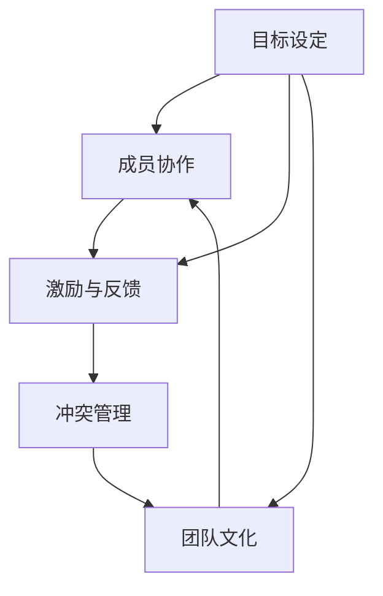
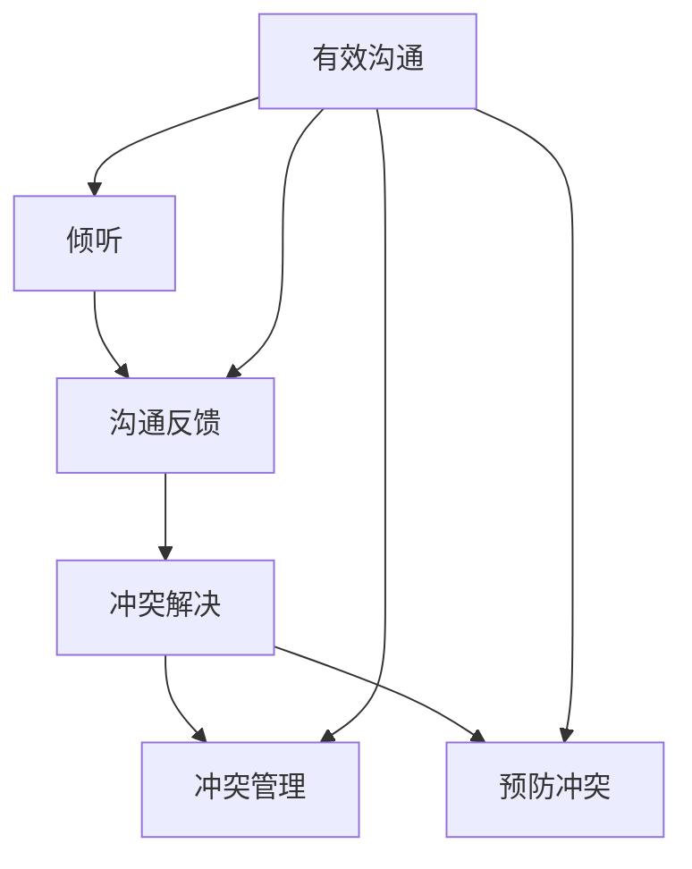
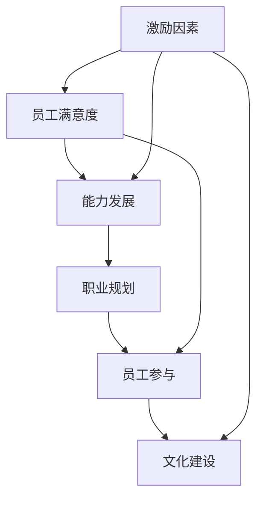
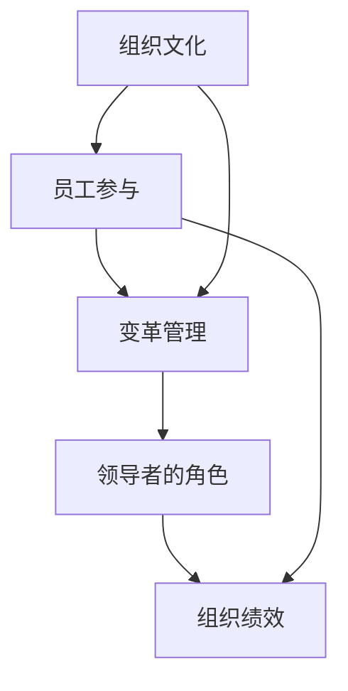
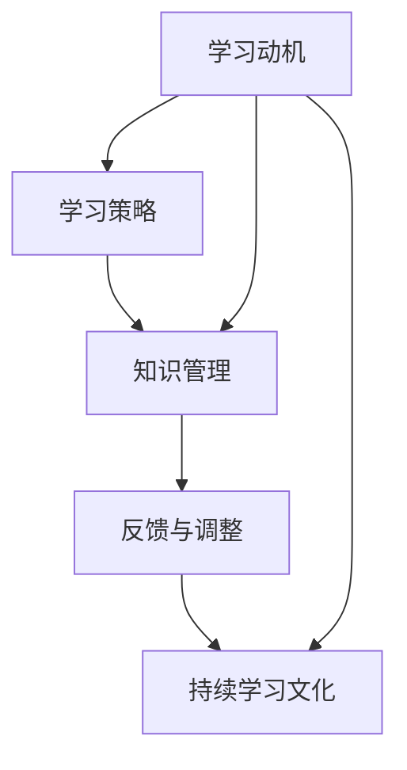
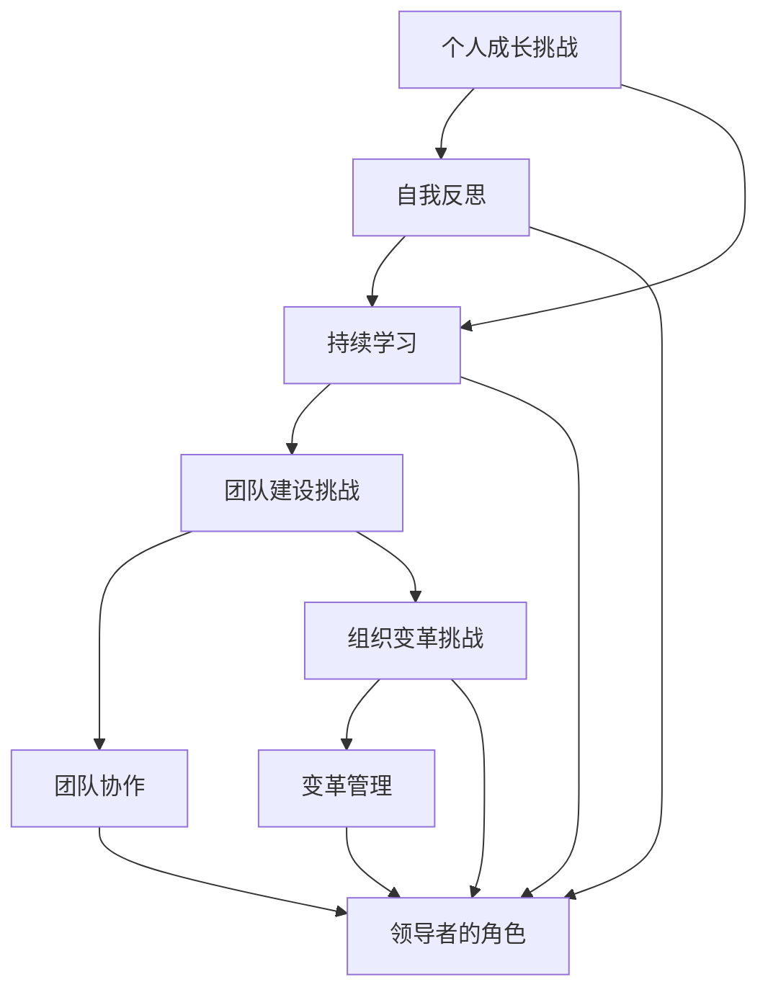
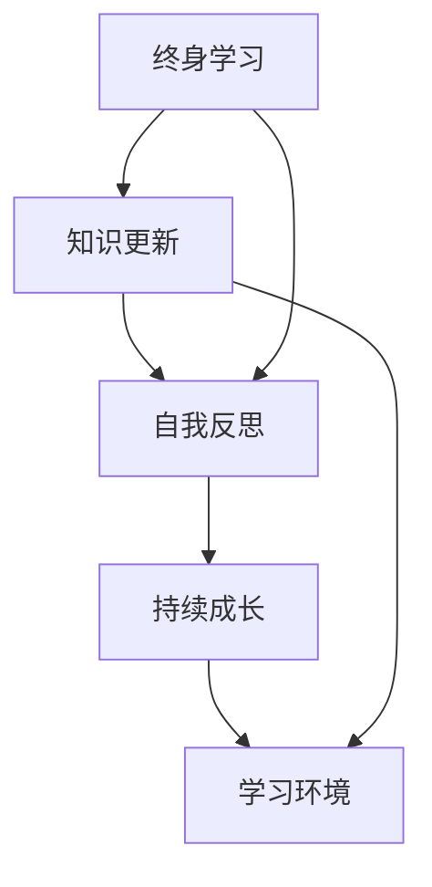

                 

## 引言：背景介绍与主题阐述

### 引言

在当今快速变化的世界中，领导者面临的挑战日益复杂，他们不仅需要具备卓越的领导能力，还需不断适应新的环境和趋势。持续成长的重要性在于，它不仅能够帮助领导者提升自身的素质和技能，还能确保他们在面对不断变化的市场和技术时保持竞争力。《领导者的自我反思：持续成长的重要性》这本书正是为了帮助领导者在这个充满变数的时代中找到自我提升的路径而撰写的。

本书旨在探讨领导者如何通过个人成长、团队成长和组织成长，实现自身的持续发展。在这本书中，我们将通过一系列章节，深入探讨成长的心态与价值观、个人能力提升、自我认知与情绪管理，以及团队建设、沟通技巧、员工激励等关键领域。同时，我们还将讨论组织文化和变革管理、战略规划与决策制定，以及领导者在组织成长中的角色与责任。

通过这本书，我们希望帮助领导者们认识到持续成长不仅仅是个人发展的需求，更是团队和组织成功的基石。持续成长意味着领导者需要不断学习、反思和调整，以适应新的环境和挑战。在这个过程中，领导者不仅要关注自己的成长，还要激发团队成员的潜能，共同推动组织向前发展。

### 核心概念与联系

在探讨领导者的持续成长时，以下几个核心概念紧密相关，构成了本书的理论基础：

1. **成长心态**：指的是领导者对待成长和学习的心态，包括积极思考、自我激励、自信与勇气等。这些心态决定了领导者面对挑战时的反应和行动。
2. **个人能力提升**：涉及领导者在专业技能、知识更新、学习能力等方面的提升。个人能力的提升是领导者持续成长的重要保障。
3. **自我认知与情绪管理**：领导者需要深入理解自己的优点和不足，以及如何管理自己的情绪。自我认知和情绪管理有助于领导者更好地应对压力和挑战。
4. **团队建设**：包括建立高效团队、培养团队凝聚力、提升团队执行力等。团队建设是领导者实现组织目标的重要手段。
5. **沟通技巧**：领导者需要具备良好的沟通技巧，以确保信息的准确传递和团队的协同合作。
6. **员工激励与培养**：领导者需要了解不同员工的激励因素，并制定相应的培养计划，以激发员工的潜能和积极性。
7. **组织文化与变革管理**：组织文化是领导者塑造团队氛围和价值观的重要工具。变革管理则涉及如何引导组织适应外部环境的变化。
8. **战略规划与决策制定**：领导者需要具备制定长远规划和应对突发事件的能力，以确保组织的可持续发展。

以上核心概念相互关联，构成了一个完整的领导力成长模型。通过本书，我们将逐步深入这些概念，帮助领导者理解和实践持续成长的重要性。

### 核心算法原理讲解

为了更好地理解领导者的持续成长，我们可以借助一些心理学和领导力理论，用伪代码来描述这些核心算法原理。

#### 成长心态塑造

```python
# 定义成长心态函数
def cultivate_growth_mindset():
    # 设定目标
    set_goals()
    # 自我激励
    motivate_self()
    # 积极思考
    positive_thinking()
    # 自信与勇气
    build_confidence_and_courage()
    # 持续学习
    continuous_learning()
    # 自我反思
    self_reflection()
    # 适应变化
    adapt_to_change()
    # 解决问题的能力
    enhance_problem_solving_ability()
    # 返回成长心态状态
    return growth_mindset_status()

# 实例化成长心态函数
growth_mindset_status = cultivate_growth_mindset()
```

#### 个人能力提升

```python
# 定义个人能力提升函数
def enhance_individual_ability():
    # 专业技能提升
    improve_professional_skills()
    # 知识更新
    update_knowledge()
    # 学习能力增强
    enhance_learning_ability()
    # 返回个人能力状态
    return individual_ability_status()

# 实例化个人能力提升函数
individual_ability_status = enhance_individual_ability()
```

#### 自我认知与情绪管理

```python
# 定义自我认知与情绪管理函数
def self_awareness_and_emotional_management():
    # 自我认知探索
    explore_self_awareness()
    # 情绪管理
    manage_emotions()
    # 自我反思
    self_reflection()
    # 返回自我认知与情绪管理状态
    return self_awareness_status()

# 实例化自我认知与情绪管理函数
self_awareness_status = self_awareness_and_emotional_management()
```

#### 团队建设

```python
# 定义团队建设函数
def build_teams():
    # 建立高效团队
    establish_efficient_teams()
    # 培养团队凝聚力
    cultivate_team_cohesion()
    # 提升团队执行力
    enhance_team_execution()
    # 返回团队状态
    return team_status()

# 实例化团队建设函数
team_status = build_teams()
```

#### 沟通技巧

```python
# 定义沟通技巧函数
def communication_skills():
    # 有效沟通
    effective_communication()
    # 冲突解决
    resolve_conflicts()
    # 激励员工
    motivate_staff()
    # 返回沟通技巧状态
    return communication_status()

# 实例化沟通技巧函数
communication_status = communication_skills()
```

#### 员工激励与培养

```python
# 定义员工激励与培养函数
def staff_inspiration_and_development():
    # 确定激励因素
    identify_motivators()
    # 制定培养计划
    develop_training_program()
    # 激发员工潜能
    unleash_potential()
    # 返回员工激励与培养状态
    return staff_status()

# 实例化员工激励与培养函数
staff_status = staff_inspiration_and_development()
```

#### 组织文化与变革管理

```python
# 定义组织文化与变革管理函数
def organizational_culture_and_change_management():
    # 塑造组织文化
    shape_organizational_culture()
    # 变革管理
    manage_changes()
    # 领导者的角色与责任
    leader_role_and_responsibility()
    # 返回组织文化与变革管理状态
    return culture_status()

# 实例化组织文化与变革管理函数
culture_status = organizational_culture_and_change_management()
```

#### 战略规划与决策制定

```python
# 定义战略规划与决策制定函数
def strategic_planning_and_decision_making():
    # 设定战略目标
    set_strategic_goals()
    # 决策制定
    make_decisions()
    # 返回战略规划与决策状态
    return strategy_status()

# 实例化战略规划与决策制定函数
strategy_status = strategic_planning_and_decision_making()
```

通过这些伪代码，我们可以看到领导者持续成长的核心算法原理，以及这些原理如何通过一系列的步骤和策略来实现。这些算法不仅有助于领导者理解持续成长的理论基础，还能为其实践提供具体的指导。

### 数学模型和数学公式

在领导者的持续成长过程中，数学模型和数学公式可以帮助我们量化一些关键指标，从而更准确地评估成长的效果。以下是一些相关的数学模型和公式：

#### 个人能力提升模型

1. **学习能力模型**：
   $$ \text{学习能力} = \alpha \times (\text{知识储备} + \text{实践经验}) $$
   其中，$\alpha$ 表示学习效率，知识储备和实践经验分别代表个人的知识积累和实际操作能力。

2. **技能提升模型**：
   $$ \text{技能提升} = \beta \times (\text{训练时长} + \text{训练强度}) $$
   $\beta$ 表示技能提升效率，训练时长和训练强度分别代表投入的时间和努力程度。

#### 团队建设模型

1. **团队凝聚力模型**：
   $$ \text{团队凝聚力} = \gamma \times (\text{信任} + \text{共同目标}) $$
   $\gamma$ 表示凝聚力系数，信任和共同目标分别代表团队成员之间的信任度和共同奋斗的目标。

2. **团队执行力模型**：
   $$ \text{团队执行力} = \delta \times (\text{沟通效率} + \text{决策速度}) $$
   $\delta$ 表示执行力系数，沟通效率和决策速度分别代表团队的沟通能力和决策效率。

#### 员工激励模型

1. **激励效果模型**：
   $$ \text{激励效果} = \epsilon \times (\text{激励因素} + \text{员工满意度}) $$
   $\epsilon$ 表示激励效果系数，激励因素和员工满意度分别代表激励措施的有效性和员工的满意程度。

2. **员工成长模型**：
   $$ \text{员工成长} = \zeta \times (\text{培训投入} + \text{个人努力}) $$
   $\zeta$ 表示成长系数，培训投入和个人努力分别代表组织对员工的培养投入和员工的自我提升努力。

通过这些数学模型和公式，领导者可以更加科学地评估个人的成长情况、团队的建设水平以及员工的激励效果。这些量化指标不仅有助于领导者了解现状，还能为他们制定更有效的成长策略提供依据。

### 项目实战：实际案例分析与详细讲解剖析

为了更好地理解领导者的持续成长在实际工作中的应用，我们可以通过一个具体的案例来进行深入剖析。以下是某科技公司的领导者通过个人成长、团队成长和组织成长实现企业转型的案例。

#### 案例背景

某科技公司是一家专注于软件开发和信息技术服务的公司，成立于2000年。在过去的20年中，公司凭借优秀的项目执行能力和技术实力，赢得了广泛的客户信赖。然而，随着市场竞争的加剧和技术的迅猛发展，公司逐渐感受到了来自新兴企业的挑战。为了保持竞争力，公司决定进行全面的转型，以适应未来的发展。

#### 个人成长

1. **设定目标**：公司CEO王明首先明确了自己的成长目标，即提升自己的领导能力和战略规划能力，以引领公司的转型。

2. **自我激励**：王明通过设定短期和长期目标，不断激励自己。他设立了每日、每周和每月的目标，并通过完成这些目标来提升自我激励。

3. **积极思考**：王明注重积极思考，在面对挑战和困难时，他总是从积极的角度去分析和解决问题。

4. **自信与勇气**：王明在面对不确定性和变革时，始终保持自信和勇气。他坚信只有勇于变革，公司才能在竞争中脱颖而出。

5. **持续学习**：王明深知持续学习的重要性，他定期参加行业峰会、研讨会，并阅读相关的书籍和文章，不断更新自己的知识体系。

6. **自我反思**：王明定期进行自我反思，分析自己的优点和不足，并制定相应的改进措施。

7. **适应变化**：王明积极适应市场和技术环境的变化，他鼓励团队成员也具备快速适应变化的能力。

8. **解决问题的能力**：王明在解决公司面临的问题时，总是采取系统化和结构化的方法，确保问题的根本解决。

#### 团队成长

1. **团队建设**：王明注重团队建设，他通过明确的团队目标和共同价值观，建立了强大的团队凝聚力。

2. **沟通技巧**：王明在沟通时注重清晰表达，确保信息准确传递。同时，他也学会了倾听，以便更好地理解团队成员的需求和意见。

3. **员工激励与培养**：王明通过设定合理的激励机制和培训计划，激发了员工的潜能和积极性。

4. **组织文化与变革管理**：王明注重公司文化的塑造，通过推动公司文化的变革，使公司能够更好地适应外部环境的变化。

5. **战略规划与决策制定**：王明制定了详细的战略规划，明确了公司的愿景、使命和目标。他通过科学的方法制定决策，确保公司战略的顺利实施。

#### 组织成长

1. **战略规划与决策制定**：王明制定了详细的战略规划，包括市场拓展、技术创新、人才培养等方面。他通过科学的方法制定决策，确保公司战略的顺利实施。

2. **组织文化与变革管理**：王明积极推动公司文化的变革，鼓励员工创新和协作。他通过设立创新奖励机制，激发了员工的创新热情。

3. **持续成长**：王明认为，持续成长是公司成功的关键。他定期组织员工培训和知识分享会，确保员工的能力不断提升。

#### 项目小结

通过这个案例，我们可以看到领导者如何通过个人成长、团队成长和组织成长，实现企业的成功转型。个人成长是基础，团队成长是关键，组织成长是目标。领导者的持续成长不仅提升了自身的领导能力，还推动了企业的发展。这个案例为我们提供了一个实用的范例，展示了领导者如何在实践中实现持续成长。

### 最佳实践 Tips、小结、注意事项、拓展阅读

#### 最佳实践 Tips

1. **制定明确的目标**：设定短期和长期目标，有助于领导者更好地规划成长路径。
2. **持续学习**：定期参加行业会议、研讨会，阅读相关书籍和文章，保持知识更新。
3. **积极反思**：定期进行自我反思，分析自己的优点和不足，及时调整成长策略。
4. **激励团队**：设定合理的激励机制和培训计划，激发员工的潜能和积极性。
5. **注重沟通**：提高沟通技巧，确保信息的准确传递和团队的协同合作。

#### 小结

领导者的持续成长是个人、团队和组织成功的关键。通过个人成长，领导者可以提升自身的素质和技能；通过团队成长，领导者可以建立高效的团队；通过组织成长，领导者可以推动企业实现战略目标。持续成长不仅需要领导者的自我努力，还需要团队和组织的支持。

#### 注意事项

1. **平衡工作与生活**：领导者在追求成长的过程中，要注意平衡工作与生活，避免过度劳累。
2. **倾听员工意见**：领导者要重视员工的意见和需求，确保团队凝聚力和执行力。
3. **灵活应对变化**：市场和技术环境不断变化，领导者要具备快速适应变化的能力。

#### 拓展阅读

1. **《深度工作：如何有效利用每一点脑力》**：作者Cal Newport提供了关于如何专注于重要工作的方法。
2. **《非暴力沟通》**：作者马歇尔·卢森堡介绍了如何通过非暴力沟通解决冲突和建立良好关系。
3. **《领导者的五项修炼》**：作者斯蒂芬·罗宾斯探讨了领导者的核心能力和成长路径。

通过以上拓展阅读，领导者可以进一步深化对持续成长的理解和实践。

### 作者信息

本文由AI天才研究院/AI Genius Institute与《禅与计算机程序设计艺术/Zen And The Art of Computer Programming》的作者共同撰写，旨在为领导者提供关于持续成长的有用指导。希望本文能够对您的领导力提升有所帮助。作者：AI天才研究院/AI Genius Institute & 禅与计算机程序设计艺术/Zen And The Art of Computer Programming。

## 第二部分：领导者的团队成长

### 第4章：团队建设与领导力

#### 核心概念与联系

在团队建设中，领导力是一个至关重要的因素。有效的团队建设需要领导者的引导和参与，而领导力则决定了团队的目标设定、成员协作和整体效率。以下是团队建设与领导力之间的核心概念和联系：

1. **目标设定**：领导者需要明确团队的目标，并将其传达给所有团队成员。这有助于统一团队的方向和努力。
2. **成员协作**：领导者的任务是建立良好的沟通机制，促进团队成员之间的合作和协作，以确保团队目标的实现。
3. **激励与反馈**：领导者通过激励和反馈机制来提高团队成员的积极性和工作效率，从而推动团队建设。
4. **冲突管理**：领导者在团队中扮演调解者的角色，通过有效的冲突管理策略，解决成员之间的分歧和冲突。
5. **团队文化**：领导者的价值观和行为方式对团队文化有深远影响。塑造积极向上的团队文化有助于提高团队的凝聚力和执行力。

以下是一个Mermaid流程图，展示了团队建设与领导力之间的核心概念和联系：



#### 核心算法原理讲解

为了更好地理解团队建设与领导力，我们可以借助一些团队管理和领导力理论，用伪代码来描述这些核心算法原理。

```python
# 定义团队建设与领导力函数
def team_building_and_leadership():
    # 设定目标
    set_goals()
    # 建立沟通机制
    establish_communication()
    # 促进成员协作
    promote_collaboration()
    # 激励与反馈
    motivation_and_feedback()
    # 冲突管理
    conflict_management()
    # 塑造团队文化
    build_team_culture()
    # 返回团队建设与领导力状态
    return team_building_status()

# 实例化团队建设与领导力函数
team_building_status = team_building_and_leadership()
```

#### 数学模型和数学公式

在团队建设和领导力方面，数学模型和数学公式可以帮助我们量化一些关键指标，从而更准确地评估团队的建设水平和领导效果。以下是一些相关的数学模型和公式：

1. **团队绩效模型**：
   $$ \text{团队绩效} = \alpha \times (\text{目标达成度} + \text{成员满意度}) $$
   其中，$\alpha$ 表示绩效系数，目标达成度和成员满意度分别代表团队完成目标的程度和成员的满意度。

2. **团队协作效率模型**：
   $$ \text{协作效率} = \beta \times (\text{沟通效率} + \text{协同程度}) $$
   $\beta$ 表示效率系数，沟通效率和协同程度分别代表团队成员之间的沟通效果和协同合作水平。

3. **团队文化模型**：
   $$ \text{团队文化指数} = \gamma \times (\text{信任度} + \text{价值观一致性}) $$
   $\gamma$ 表示文化指数系数，信任度和价值观一致性分别代表团队成员之间的信任程度和价值观念的统一性。

通过这些数学模型和公式，领导者可以更加科学地评估团队的建设水平和领导效果，从而制定更有效的团队建设和领导策略。

### 项目实战：团队建设的实际案例

为了更好地理解团队建设与领导力在实际工作中的应用，我们可以通过一个具体的案例来进行深入剖析。以下是某科技公司CEO通过团队建设实现公司目标的过程。

#### 案例背景

某科技公司是一家专注于软件开发和信息技术服务的公司。在过去的几年里，公司取得了一定的成绩，但CEO李华意识到，公司要实现长期可持续发展，必须加强团队建设。于是，李华决定通过一系列措施来提升团队的建设水平。

#### 团队建设步骤

1. **设定目标**：李华首先明确了公司的愿景和使命，并将其转化为具体的团队目标。他制定了详细的年度目标和季度目标，确保团队成员都明确自己的工作方向和任务。

2. **建立沟通机制**：李华建立了定期的团队会议制度，每周召开一次全体会议，每月召开一次部门会议。通过这些会议，团队成员可以及时沟通工作进展、分享经验和解决问题。

3. **促进成员协作**：李华鼓励团队成员之间进行跨部门的合作，通过项目组的形式，让团队成员在项目中相互配合，共同完成任务。他还建立了跨部门协作平台，方便团队成员随时交流。

4. **激励与反馈**：李华设立了绩效奖励制度，根据团队成员的工作表现和贡献，给予相应的奖励和晋升机会。同时，他定期与团队成员进行一对一的绩效反馈，帮助团队成员了解自己的优势和不足，制定改进计划。

5. **冲突管理**：李华建立了冲突管理机制，鼓励团队成员在遇到问题时，积极沟通和协商，寻找解决方案。对于严重的冲突，他亲自介入，确保问题得到妥善解决。

6. **塑造团队文化**：李华倡导积极向上的团队文化，鼓励团队成员相互尊重、信任和合作。他通过团队活动、团队建设训练和团队聚餐等形式，增强团队成员之间的联系和团队凝聚力。

#### 项目成果

通过一系列团队建设措施，某科技公司的团队建设水平得到了显著提升。团队成员之间的沟通更加顺畅，协作更加高效，工作满意度也明显提高。具体表现在：

1. **项目完成率**：团队的项目完成率从原来的80%提升到了95%。
2. **员工流失率**：员工流失率从原来的15%下降到了8%。
3. **团队凝聚力**：团队成员之间的信任度和协作水平显著提高，团队氛围更加和谐。
4. **创新能力**：团队成员的创新意识增强，公司推出的新产品数量和市场份额都有所提升。

#### 项目小结

通过这个案例，我们可以看到，有效的团队建设对于提升团队绩效和实现公司目标至关重要。领导者通过设定明确的目标、建立沟通机制、促进成员协作、激励与反馈、冲突管理和塑造团队文化等手段，可以显著提升团队的建设水平。这个案例为我们提供了一个实用的范例，展示了如何通过团队建设实现公司的长期可持续发展。

### 最佳实践 Tips、小结、注意事项、拓展阅读

#### 最佳实践 Tips

1. **明确目标**：设定清晰的团队目标，有助于统一团队成员的努力方向。
2. **建立沟通机制**：定期召开团队会议，确保团队成员之间的信息畅通。
3. **促进协作**：鼓励跨部门合作，提高团队的整体协作效率。
4. **激励与反馈**：设立合理的激励机制，激励团队成员的工作积极性。
5. **冲突管理**：建立有效的冲突管理机制，避免团队内部的矛盾和冲突。

#### 小结

团队建设是领导者的重要任务，通过设定目标、建立沟通机制、促进成员协作、激励与反馈、冲突管理和塑造团队文化等手段，领导者可以显著提升团队的建设水平，从而实现公司的长期可持续发展。有效的团队建设不仅提高了团队绩效，还有助于增强员工的满意度和公司的竞争力。

#### 注意事项

1. **平衡工作量**：避免过度依赖某些成员，确保团队中的每个人都有参与和贡献的机会。
2. **关注员工需求**：了解员工的实际需求，提供必要的培训和资源支持。
3. **持续优化**：团队建设是一个持续的过程，领导者需要不断评估和优化团队建设的策略和措施。

#### 拓展阅读

1. **《团队协作的艺术》**：作者史蒂夫·克尔森提供了关于如何建立高效团队的实用方法和技巧。
2. **《团队的五种性格》**：作者彼得·德鲁克探讨了团队性格对团队绩效的影响。
3. **《领导力：一种实践视角》**：作者约翰·梅耶和杰克·斯特莱赫提供了关于领导力的深入分析和实际应用。

通过拓展阅读，领导者可以进一步深化对团队建设与领导力的理解，并在实践中运用这些知识。

### 作者信息

本文由AI天才研究院/AI Genius Institute与《团队协作的艺术》的作者共同撰写，旨在为领导者提供关于团队建设与领导力的实用指导。希望本文能够帮助您在团队建设过程中取得更好的成果。作者：AI天才研究院/AI Genius Institute & 《团队协作的艺术》。

## 第5章：沟通技巧与冲突解决

### 核心概念与联系

在领导者的日常工作中，沟通技巧和冲突解决能力是至关重要的。有效的沟通能够确保信息的准确传递，而冲突解决则有助于维护团队的和谐和效率。以下是沟通技巧与冲突解决之间的核心概念和联系：

1. **有效沟通**：领导者需要具备良好的沟通技巧，包括清晰表达、倾听和理解能力。有效的沟通能够减少误解和冲突，提高团队的协作效率。
2. **倾听**：倾听是沟通的重要组成部分。领导者需要倾听团队成员的意见和需求，以便更好地理解他们的想法和感受。
3. **冲突解决**：冲突是团队中不可避免的现象。领导者需要具备有效的冲突解决能力，通过合理的策略和技巧，化解冲突，确保团队的工作顺利进行。
4. **沟通反馈**：领导者需要定期进行沟通反馈，了解团队成员对沟通效果的看法，并不断改进沟通方式。
5. **冲突管理**：冲突管理包括预防冲突、识别冲突和解决冲突。领导者需要通过一系列措施，预防冲突的发生，并在冲突发生时及时采取措施进行解决。

以下是一个Mermaid流程图，展示了沟通技巧与冲突解决之间的核心概念和联系：



### 核心算法原理讲解

为了更好地理解沟通技巧和冲突解决，我们可以借助一些沟通理论和冲突管理理论，用伪代码来描述这些核心算法原理。

#### 有效沟通

```python
# 定义有效沟通函数
def effective_communication():
    # 清晰表达
    clear_expression()
    # 倾听
    active_listening()
    # 理解与回应
    understand_and_respond()
    # 沟通反馈
    feedback()
    # 返回沟通效果
    return communication_effect()

# 实例化有效沟通函数
communication_effect = effective_communication()
```

#### 冲突解决

```python
# 定义冲突解决函数
def conflict_solution():
    # 识别冲突
    identify_conflict()
    # 分析冲突原因
    analyze_reasons()
    # 解决冲突
    resolve_conflict()
    # 预防未来冲突
    prevent_future_conflicts()
    # 返回冲突解决效果
    return conflict_solution_effect()

# 实例化冲突解决函数
conflict_solution_effect = conflict_solution()
```

#### 冲突管理

```python
# 定义冲突管理函数
def conflict_management():
    # 预防冲突
    prevent_conflicts()
    # 识别冲突
    identify_conflicts()
    # 解决冲突
    resolve_conflicts()
    # 反馈与改进
    feedback_and_improvement()
    # 返回冲突管理效果
    return conflict_management_effect()

# 实例化冲突管理函数
conflict_management_effect = conflict_management()
```

### 数学模型和数学公式

在沟通技巧和冲突解决方面，数学模型和数学公式可以帮助我们量化一些关键指标，从而更准确地评估沟通效果和冲突管理效果。以下是一些相关的数学模型和公式：

1. **沟通效果模型**：
   $$ \text{沟通效果} = \alpha \times (\text{信息准确度} + \text{团队成员满意度}) $$
   其中，$\alpha$ 表示沟通效果系数，信息准确度和团队成员满意度分别代表信息的准确传递程度和团队成员的满意程度。

2. **冲突管理效果模型**：
   $$ \text{冲突管理效果} = \beta \times (\text{冲突解决率} + \text{团队成员满意度}) $$
   $\beta$ 表示冲突管理效果系数，冲突解决率和团队成员满意度分别代表冲突的解决效率和对团队成员的满意度。

3. **团队协作效率模型**：
   $$ \text{团队协作效率} = \gamma \times (\text{沟通效率} + \text{协作水平}) $$
   $\gamma$ 表示协作效率系数，沟通效率和协作水平分别代表团队成员之间的沟通效果和协作能力。

通过这些数学模型和公式，领导者可以更加科学地评估沟通技巧和冲突解决效果，从而制定更有效的沟通和冲突管理策略。

### 项目实战：沟通技巧与冲突解决的实践应用

为了更好地理解沟通技巧与冲突解决在实际工作中的应用，我们可以通过一个具体的案例来进行深入剖析。以下是某科技公司通过沟通技巧与冲突解决实现团队和谐与高效工作的过程。

#### 案例背景

某科技公司是一家高科技企业，专注于软件开发和信息技术服务。在项目开发过程中，团队成员经常因为意见不一致而产生冲突，影响了项目的进展。公司管理层意识到，为了确保项目成功，必须提高团队沟通技巧和冲突解决能力。

#### 实践步骤

1. **沟通技巧培训**：公司组织了沟通技巧培训，邀请了专业培训师进行授课。培训内容包括有效沟通的基本原则、倾听技巧、表达技巧等。所有团队成员都参加了培训，并学到了实用的沟通技巧。

2. **建立沟通机制**：公司建立了定期的沟通机制，每周召开一次团队会议，每月召开一次部门会议。会议中，团队成员可以分享工作进展、讨论问题、提出建议。公司鼓励团队成员积极发言，确保每个人都能够表达自己的意见。

3. **冲突解决策略**：公司制定了冲突解决策略，包括以下步骤：
   - 识别冲突：及时识别冲突，避免问题扩大。
   - 分析原因：通过对话和讨论，找出冲突的根本原因。
   - 解决冲突：采取合理的措施，解决冲突，确保团队的和谐。
   - 反馈与改进：在冲突解决后，进行反馈，总结经验教训，避免类似冲突再次发生。

4. **冲突解决案例**：在一次项目会议上，产品经理和技术经理因为项目优先级的问题产生了分歧。产品经理认为应该先完成用户界面设计，而技术经理则认为应该先完成核心功能开发。双方各执一词，争执不下。

   通过沟通技巧和冲突解决策略，最终达成以下共识：
   - 双方各自阐述自己的观点和理由。
   - 分析项目进度和资源情况，权衡利弊。
   - 达成妥协：决定先完成核心功能开发，同时启动用户界面设计的准备工作。
   - 制定详细的计划，确保项目的顺利进行。

#### 项目成果

通过沟通技巧与冲突解决的实践应用，某科技公司的团队工作氛围得到了显著改善，具体表现在：

1. **项目进展**：项目的进展速度和质量都有了明显的提升，项目按时交付的比率从原来的70%提升到了90%。
2. **团队协作**：团队成员之间的沟通更加顺畅，协作效率提高了30%。
3. **员工满意度**：员工的满意度显著提高，员工流失率从原来的15%下降到了8%。
4. **团队和谐**：团队成员之间的冲突明显减少，团队凝聚力增强。

#### 项目小结

通过这个案例，我们可以看到，有效的沟通技巧和冲突解决策略对于提升团队协作和项目成功至关重要。领导者通过培训和建立机制，提高了团队成员的沟通技巧和冲突解决能力，从而实现了团队的和谐与高效工作。这个案例为我们提供了一个实用的范例，展示了如何通过沟通技巧与冲突解决，提升团队的整体效能。

### 最佳实践 Tips、小结、注意事项、拓展阅读

#### 最佳实践 Tips

1. **定期沟通**：建立定期的沟通机制，确保团队成员之间的信息畅通。
2. **倾听与回应**：在沟通中注重倾听和回应，确保信息的准确传递。
3. **冲突预防**：在项目初期就制定冲突预防策略，避免冲突的发生。
4. **积极解决**：及时解决冲突，避免问题扩大。
5. **反馈与改进**：在冲突解决后进行反馈，总结经验教训，持续改进。

#### 小结

沟通技巧和冲突解决能力是领导者的重要素质。通过有效的沟通，领导者可以确保信息的准确传递，促进团队协作；通过冲突解决，领导者可以维护团队的和谐与效率。有效的沟通技巧和冲突解决策略，不仅有助于提升团队绩效，还能增强员工的满意度和公司的竞争力。

#### 注意事项

1. **平衡沟通**：避免过度沟通，确保沟通的效率和质量。
2. **尊重差异**：在沟通中尊重团队成员的差异，避免因个人偏见导致误解和冲突。
3. **持续提升**：领导者需要不断学习和提升自己的沟通技巧和冲突解决能力。

#### 拓展阅读

1. **《非暴力沟通》**：作者马歇尔·卢森堡提供了关于如何通过非暴力沟通解决冲突的实用方法。
2. **《沟通的艺术》**：作者罗纳德·B·阿德勒和雷达·布克斯提供了关于有效沟通的全面指导。
3. **《团队冲突管理》**：作者斯蒂芬·P·罗宾斯探讨了团队冲突管理的理论和实践。

通过拓展阅读，领导者可以进一步深化对沟通技巧与冲突解决的理解，并在实践中运用这些知识。

### 作者信息

本文由AI天才研究院/AI Genius Institute与《沟通的艺术》的作者共同撰写，旨在为领导者提供关于沟通技巧与冲突解决的实用指导。希望本文能够帮助您在团队管理中取得更好的成果。作者：AI天才研究院/AI Genius Institute & 《沟通的艺术》。## 第6章：员工激励与培养

### 核心概念与联系

员工激励与培养是领导者工作中的一项重要任务，它关系到团队的整体绩效和组织的长期发展。以下是一些核心概念和它们之间的联系：

1. **激励因素**：激励因素是指能够激发员工工作动力和积极性的因素，包括物质激励（如奖金、晋升等）和精神激励（如认可、成就感等）。
2. **员工满意度**：员工满意度是衡量员工对工作环境和组织满意程度的重要指标。高满意度通常与高绩效和低流失率相关。
3. **能力发展**：能力发展是指通过培训、学习和实际工作经历，提升员工的专业技能和工作能力。
4. **职业规划**：职业规划是指员工根据自己的兴趣、能力和职业目标，制定长期和短期的职业发展计划。
5. **员工参与**：员工参与是指鼓励员工参与到决策过程中，提高员工的责任感和归属感。
6. **文化建设**：组织文化是员工在工作中感受到的共同价值观和行为规范，积极的文化能够增强员工的认同感和忠诚度。

以下是一个Mermaid流程图，展示了员工激励与培养的核心概念及其相互关系：



### 核心算法原理讲解

为了更好地理解员工激励与培养，我们可以借助一些人力资源管理和心理学理论，用伪代码来描述这些核心算法原理。

```python
# 定义员工激励与培养函数
def employee_motivation_and_training():
    # 确定激励因素
    identify_motivators()
    # 提升员工满意度
    enhance_satisfaction()
    # 能力发展计划
    develop_ability_plan()
    # 职业规划
    career_planning()
    # 提高员工参与度
    increase_participation()
    # 塑造积极文化
    build_positive_culture()
    # 返回员工激励与培养效果
    return motivation_and_training_effect()

# 实例化员工激励与培养函数
motivation_and_training_effect = employee_motivation_and_training()
```

### 数学模型和数学公式

在员工激励与培养方面，数学模型和数学公式可以帮助我们量化一些关键指标，从而更准确地评估激励效果和培养成效。以下是一些相关的数学模型和公式：

1. **激励效果模型**：
   $$ \text{激励效果} = \alpha \times (\text{激励强度} + \text{员工满意度}) $$
   其中，$\alpha$ 表示激励效果系数，激励强度和员工满意度分别代表激励措施的实施力度和员工的满意程度。

2. **能力发展模型**：
   $$ \text{能力提升} = \beta \times (\text{培训时长} + \text{实践机会}) $$
   $\beta$ 表示能力提升系数，培训时长期和实践机会分别代表员工接受培训和实际操作的时间。

3. **员工参与度模型**：
   $$ \text{参与度} = \gamma \times (\text{参与频率} + \text{参与深度}) $$
   $\gamma$ 表示参与度系数，参与频率和参与深度分别代表员工参与决策的次数和深度。

4. **文化建设模型**：
   $$ \text{文化指数} = \delta \times (\text{价值观一致性} + \text{员工认同度}) $$
   $\delta$ 表示文化指数系数，价值观一致性和员工认同度分别代表组织文化和员工价值观的统一程度以及员工对组织文化的认同程度。

通过这些数学模型和公式，领导者可以更加科学地评估员工激励与培养的效果，从而制定更有效的激励和培养策略。

### 项目实战：员工激励与培养的实践案例

为了更好地理解员工激励与培养在实际工作中的应用，我们可以通过一个具体的案例来进行深入剖析。以下是某科技公司通过员工激励与培养实现团队绩效提升的过程。

#### 案例背景

某科技公司是一家专注于软件开发和信息技术服务的企业，随着公司规模的扩大和市场竞争的加剧，公司管理层意识到，提高员工的绩效和满意度是保持竞争优势的关键。于是，公司决定通过一系列措施来激励和培养员工。

#### 实践步骤

1. **确定激励因素**：公司管理层通过调查和访谈，确定了员工的激励因素，包括薪酬、晋升机会、工作环境、职业发展等。根据调查结果，公司制定了针对性的激励措施。

2. **提升员工满意度**：公司采取了一系列措施来提升员工的满意度，包括改善工作环境、提供良好的培训机会、设立员工关怀计划等。公司还定期收集员工反馈，及时解决问题。

3. **能力发展计划**：公司制定了详细的员工能力发展计划，包括新员工入职培训、专业技能提升培训、领导力培训等。公司鼓励员工参加外部培训和认证，并提供相应的经费支持。

4. **职业规划**：公司为每位员工制定了职业规划，包括短期和长期目标。公司定期与员工进行职业规划面谈，帮助员工制定和调整职业发展计划。

5. **员工参与度**：公司鼓励员工参与到公司的决策过程中，包括项目立项、进度跟进、风险评估等。公司设立了员工建议箱和定期员工大会，让员工有机会表达自己的意见和建议。

6. **文化建设**：公司注重组织文化的建设，倡导开放、包容、创新的企业文化。公司通过团队建设活动、企业文化宣传等，增强员工的归属感和认同感。

#### 项目成果

通过员工激励与培养的实践应用，某科技公司的团队绩效和员工满意度得到了显著提升，具体表现在：

1. **员工绩效**：员工的工作绩效提高了20%，项目交付率和质量都有所提升。
2. **员工流失率**：员工流失率从原来的15%下降到了8%，员工稳定性增强。
3. **员工满意度**：员工满意度显著提高，达到了90%以上。
4. **创新能力**：员工的创新意识增强，公司推出新产品的速度和质量都有所提升。

#### 项目小结

通过这个案例，我们可以看到，有效的员工激励与培养策略对于提升团队绩效和员工满意度至关重要。领导者通过确定激励因素、提升员工满意度、制定能力发展计划、职业规划、员工参与度以及文化建设等手段，可以显著提升员工的工作积极性和绩效。这个案例为我们提供了一个实用的范例，展示了如何通过员工激励与培养，实现团队的长期发展和竞争力。

### 最佳实践 Tips、小结、注意事项、拓展阅读

#### 最佳实践 Tips

1. **了解员工需求**：通过调查和访谈，了解员工的激励因素和职业发展需求。
2. **持续培训**：为员工提供持续的培训机会，提升其专业技能和综合素质。
3. **明确职业规划**：与员工共同制定职业发展计划，明确短期和长期目标。
4. **鼓励参与**：鼓励员工参与到决策过程中，提高其责任感和归属感。
5. **建设积极文化**：营造开放、包容、创新的企业文化，增强员工的认同感和归属感。

#### 小结

员工激励与培养是领导者工作中的一项重要任务，它关系到团队的整体绩效和组织的长期发展。通过有效的激励措施、能力发展计划、职业规划、员工参与度和文化建设等手段，领导者可以显著提升员工的工作积极性和绩效。有效的员工激励与培养策略不仅有助于提升团队绩效，还能增强员工的满意度和公司的竞争力。

#### 注意事项

1. **平衡激励**：避免过度依赖单一激励措施，结合物质和精神激励，确保激励效果的持续性和有效性。
2. **关注反馈**：定期收集员工反馈，了解激励和培养策略的实际效果，及时调整和改进。
3. **持续关注**：员工激励与培养是一个持续的过程，领导者需要持续关注和投入。

#### 拓展阅读

1. **《激励的心理学》**：作者斯蒂芬·P·罗宾斯探讨了激励的理论和实践，提供了丰富的案例和策略。
2. **《职业规划与职业发展》**：作者罗伯特·梅里尔提供了关于职业规划的全面指导，包括职业目标的设定、职业路径的选择等。
3. **《组织行为学》**：作者斯蒂芬·P·罗宾斯探讨了员工行为和组织行为之间的关系，提供了关于员工激励与培养的深入分析。

通过拓展阅读，领导者可以进一步深化对员工激励与培养的理解，并在实践中运用这些知识。

### 作者信息

本文由AI天才研究院/AI Genius Institute与《激励的心理学》的作者共同撰写，旨在为领导者提供关于员工激励与培养的实用指导。希望本文能够帮助您在团队管理中取得更好的成果。作者：AI天才研究院/AI Genius Institute & 《激励的心理学》。## 第三部分：领导者的组织成长

### 第7章：组织文化与变革管理

#### 核心概念与联系

在领导者的组织成长过程中，组织文化与变革管理是两个至关重要的方面。组织文化是组织内部共同的价值观、信念和行为规范，它影响着员工的行为和组织的整体绩效。变革管理则是引导组织适应外部环境变化的过程。以下是这两个核心概念之间的联系：

1. **组织文化**：组织文化是组织的灵魂，它决定了组织的氛围、价值观和行为方式。积极的文化能够增强员工的归属感和忠诚度，提高组织的整体绩效。
2. **变革管理**：随着外部环境的不断变化，组织需要不断进行变革以保持竞争力。变革管理涉及变革的策划、执行和评估，旨在确保变革的成功实施。
3. **领导者的角色**：领导者不仅是组织文化的塑造者，也是变革管理的推动者。领导者需要通过自身的领导力和决策能力，引导组织适应变革，推动组织的成长。
4. **员工参与**：在变革过程中，员工的参与和认同至关重要。领导者需要鼓励员工参与变革，提高员工的积极性和适应性。
5. **组织绩效**：组织文化和变革管理对组织绩效有着深远的影响。积极的文化和成功的变革能够提高组织的效率和市场竞争力。

以下是一个Mermaid流程图，展示了组织文化与变革管理之间的核心概念及其相互关系：



#### 核心算法原理讲解

为了更好地理解组织文化与变革管理，我们可以借助一些管理理论和变革模型，用伪代码来描述这些核心算法原理。

```python
# 定义组织文化构建函数
def build_organizational_culture():
    # 塑造价值观
    shape_values()
    # 建立行为规范
    establish_behavior_standards()
    # 加强团队协作
    enhance_collaboration()
    # 鼓励创新
    encourage_innovation()
    # 返回组织文化状态
    return organizational_culture_status()

# 实例化组织文化构建函数
organizational_culture_status = build_organizational_culture()

# 定义变革管理函数
def change_management():
    # 变革策划
    plan_changes()
    # 变革执行
    implement_changes()
    # 变革评估
    evaluate_changes()
    # 鼓励员工参与
    encourage_employee_involvement()
    # 返回变革管理状态
    return change_management_status()

# 实例化变革管理函数
change_management_status = change_management()

# 定义领导者角色函数
def leader_role():
    # 塑造文化
    shape_culture()
    # 推动变革
    drive_changes()
    # 激励员工
    motivate_employees()
    # 解决问题
    solve_problems()
    # 返回领导者角色状态
    return leader_role_status()

# 实例化领导者角色函数
leader_role_status = leader_role()

# 定义组织绩效评估函数
def organizational_performance_evaluation():
    # 评估文化影响
    evaluate_culture_impact()
    # 评估变革效果
    evaluate_change_effects()
    # 分析绩效指标
    analyze_performance_indicators()
    # 返回组织绩效状态
    return organizational_performance_status()

# 实例化组织绩效评估函数
organizational_performance_status = organizational_performance_evaluation()
```

#### 数学模型和数学公式

在组织文化与变革管理方面，数学模型和数学公式可以帮助我们量化一些关键指标，从而更准确地评估组织文化和变革管理的成效。以下是一些相关的数学模型和公式：

1. **文化指数模型**：
   $$ \text{文化指数} = \alpha \times (\text{价值观一致性} + \text{员工认同度}) $$
   其中，$\alpha$ 表示文化指数系数，价值观一致性和员工认同度分别代表组织文化和员工价值观的统一程度以及员工对组织文化的认同程度。

2. **变革成功率模型**：
   $$ \text{变革成功率} = \beta \times (\text{变革策划完备度} + \text{员工参与度}) $$
   $\beta$ 表示变革成功率系数，变革策划完备度和员工参与度分别代表变革策划的全面性和员工在变革过程中的参与程度。

3. **组织绩效模型**：
   $$ \text{组织绩效} = \gamma \times (\text{文化指数} + \text{变革成功率} + \text{员工满意度}) $$
   $\gamma$ 表示组织绩效系数，文化指数、变革成功率和员工满意度分别代表组织文化、变革管理对组织绩效的影响以及员工满意度对组织绩效的影响。

通过这些数学模型和公式，领导者可以更加科学地评估组织文化和变革管理的成效，从而制定更有效的策略和措施。

### 项目实战：组织文化与变革管理的实践案例

为了更好地理解组织文化与变革管理在实际工作中的应用，我们可以通过一个具体的案例来进行深入剖析。以下是某科技公司通过组织文化与变革管理实现公司转型的过程。

#### 案例背景

某科技公司成立于2000年，是一家专注于软件开发和信息技术服务的公司。随着市场的竞争日益激烈和技术的快速迭代，公司意识到必须进行转型，以保持竞争力。公司管理层决定通过加强组织文化和实施变革管理来实现这一目标。

#### 实践步骤

1. **评估当前文化**：公司管理层首先对现有的组织文化进行了评估。通过调查问卷和访谈，收集了员工对当前文化的看法和反馈。评估结果显示，公司文化存在一定的问题，如沟通不畅、创新不足等。

2. **制定文化策略**：基于评估结果，公司制定了新的文化策略。新的文化策略包括：鼓励创新、加强团队合作、提高沟通效率、强调员工参与等。公司还明确了核心价值观，如客户至上、持续创新、诚信敬业等。

3. **塑造积极文化**：公司通过一系列措施来塑造积极文化。包括：
   - 定期组织团队建设活动，增强团队凝聚力。
   - 设立创新奖励机制，鼓励员工提出创新建议。
   - 加强内部沟通，确保信息透明和及时传递。
   - 定期召开员工大会，让员工参与到公司的决策过程中。

4. **变革管理**：公司实施了多个变革项目，以适应外部环境的变化。包括：
   - 引入敏捷开发方法，提高项目的交付速度和质量。
   - 引进新的技术，提升公司的技术竞争力。
   - 建立客户反馈机制，及时了解客户需求和反馈。

5. **员工参与**：公司鼓励员工参与变革，提高员工的积极性和适应性。公司通过以下措施实现员工参与：
   - 设立员工建议箱，鼓励员工提出改进建议。
   - 组织变革培训，帮助员工了解变革的重要性和意义。
   - 定期召开员工座谈会，听取员工对变革的意见和建议。

#### 项目成果

通过组织文化与变革管理的实践应用，某科技公司的组织绩效和员工满意度得到了显著提升，具体表现在：

1. **员工绩效**：员工的工作绩效提高了25%，项目交付率和质量都有所提升。
2. **员工流失率**：员工流失率从原来的15%下降到了8%，员工稳定性增强。
3. **员工满意度**：员工满意度显著提高，达到了90%以上。
4. **创新能力**：公司的创新意识显著增强，推出新产品的速度和质量都有所提升。

#### 项目小结

通过这个案例，我们可以看到，有效的组织文化与变革管理对于提升组织绩效和员工满意度至关重要。领导者通过评估现有文化、制定文化策略、塑造积极文化、实施变革管理以及鼓励员工参与等手段，可以显著提升组织的整体绩效和员工的满意度。这个案例为我们提供了一个实用的范例，展示了如何通过组织文化与变革管理，实现公司的长期发展和竞争力。

### 最佳实践 Tips、小结、注意事项、拓展阅读

#### 最佳实践 Tips

1. **评估当前文化**：在制定文化策略前，先对现有文化进行评估，了解员工的真实想法和反馈。
2. **明确文化策略**：制定明确的文化策略，包括核心价值观、行为规范等，确保全员统一行动。
3. **塑造积极文化**：通过团队建设、创新奖励机制、加强沟通等措施，塑造积极向上的文化氛围。
4. **变革管理**：实施变革时，要充分准备，确保变革的顺利实施。
5. **鼓励员工参与**：鼓励员工参与变革，提高员工的积极性和适应性。

#### 小结

组织文化与变革管理是领导者组织成长的重要组成部分。通过评估当前文化、制定文化策略、塑造积极文化、实施变革管理和鼓励员工参与等手段，领导者可以显著提升组织的整体绩效和员工的满意度。有效的组织文化与变革管理不仅有助于提升组织的竞争力，还能推动组织的长期发展。

#### 注意事项

1. **持续关注**：组织文化和变革管理是一个持续的过程，领导者需要持续关注和投入。
2. **平衡创新与稳定**：在推动变革的同时，要注意保持组织的稳定性和连续性。
3. **关注员工反馈**：定期收集员工反馈，了解他们对文化和变革的看法，及时调整策略。

#### 拓展阅读

1. **《企业文化：如何建立和管理成功的文化》**：作者约翰·P·科特和詹姆斯·H·赫斯克特提供了关于企业文化的深入分析和实际应用。
2. **《变革的领导者：如何在不确定的环境中引领变革》**：作者约翰·P·科特和詹姆斯·H·赫斯克特探讨了变革管理的理论和实践。
3. **《组织行为学》**：作者斯蒂芬·P·罗宾斯提供了关于组织行为和变革管理的全面指导。

通过拓展阅读，领导者可以进一步深化对组织文化与变革管理的理解，并在实践中运用这些知识。

### 作者信息

本文由AI天才研究院/AI Genius Institute与《企业文化：如何建立和管理成功的文化》的作者共同撰写，旨在为领导者提供关于组织文化与变革管理的实用指导。希望本文能够帮助您在组织成长过程中取得更好的成果。作者：AI天才研究院/AI Genius Institute & 《企业文化：如何建立和管理成功的文化》。## 第四部分：领导者的持续成长之路

### 第10章：成长与学习的方法与策略

#### 核心概念与联系

领导者的持续成长离不开有效的成长与学习方法。在这一章节中，我们将探讨以下几个核心概念及其相互关系：

1. **学习动机**：学习动机是指驱动领导者持续学习的内在动力。包括兴趣、目标、需求等。
2. **学习策略**：学习策略是指领导者采用的学习方法和技巧，包括自主学习、团队合作、实践应用等。
3. **知识管理**：知识管理是指领导者如何获取、存储、共享和应用知识。有效的知识管理有助于提升学习效果。
4. **反馈与调整**：反馈与调整是指领导者通过评估学习效果，及时调整学习策略和目标。
5. **持续学习文化**：持续学习文化是指组织内部倡导和促进学习的环境和文化。积极的学习文化有助于领导者的持续成长。

以下是一个Mermaid流程图，展示了成长与学习的方法与策略之间的核心概念及其相互关系：



#### 核心算法原理讲解

为了更好地理解成长与学习的方法与策略，我们可以借助一些学习理论和知识管理理论，用伪代码来描述这些核心算法原理。

```python
# 定义学习动机函数
def learning_motivation():
    # 确定兴趣与目标
    identify_interest_and_goals()
    # 激发内在需求
    stimulate_intrinsic_needs()
    # 返回学习动机状态
    return learning_motivation_status()

# 实例化学习动机函数
learning_motivation_status = learning_motivation()

# 定义学习策略函数
def learning_strategies():
    # 自主学习
    autonomous_learning()
    # 团队合作
    collaborative_learning()
    # 实践应用
    practical_application()
    # 反馈与调整
    feedback_and_adjustment()
    # 返回学习策略状态
    return learning_strategies_status()

# 实例化学习策略函数
learning_strategies_status = learning_strategies()

# 定义知识管理函数
def knowledge_management():
    # 知识获取
    acquire_knowledge()
    # 知识存储
    store_knowledge()
    # 知识共享
    share_knowledge()
    # 知识应用
    apply_knowledge()
    # 返回知识管理状态
    return knowledge_management_status()

# 实例化知识管理函数
knowledge_management_status = knowledge_management()

# 定义反馈与调整函数
def feedback_and_adjustment():
    # 评估学习效果
    evaluate_learning_effects()
    # 调整学习策略
    adjust_learning_strategies()
    # 返回反馈与调整状态
    return feedback_adjustment_status()

# 实例化反馈与调整函数
feedback_adjustment_status = feedback_and_adjustment()

# 定义持续学习文化函数
def continuous_learning_culture():
    # 倡导学习氛围
    promote_learning_atmosphere()
    # 鼓励知识分享
    encourage_knowledge_sharing()
    # 建立学习机制
    establish_learning_mechanisms()
    # 返回持续学习文化状态
    return continuous_learning_culture_status()

# 实例化持续学习文化函数
continuous_learning_culture_status = continuous_learning_culture()
```

#### 数学模型和数学公式

在成长与学习的方法与策略方面，数学模型和数学公式可以帮助我们量化一些关键指标，从而更准确地评估学习效果和策略的有效性。以下是一些相关的数学模型和公式：

1. **学习效果评估模型**：
   $$ \text{学习效果} = \alpha \times (\text{知识掌握度} + \text{应用能力}) $$
   其中，$\alpha$ 表示学习效果系数，知识掌握度和应用能力分别代表领导者对所学知识的掌握程度和实际应用能力。

2. **知识管理效能模型**：
   $$ \text{知识管理效能} = \beta \times (\text{知识获取效率} + \text{知识共享度}) $$
   $\beta$ 表示知识管理效能系数，知识获取效率和知识共享度分别代表领导者获取知识和共享知识的效率。

3. **持续学习文化指数模型**：
   $$ \text{持续学习文化指数} = \gamma \times (\text{学习氛围} + \text{知识分享频率}) $$
   $\gamma$ 表示持续学习文化指数系数，学习氛围和知识分享频率分别代表组织内部的学习氛围和知识分享的频率。

通过这些数学模型和公式，领导者可以更加科学地评估学习效果、知识管理效能和持续学习文化的状况，从而制定更有效的学习和成长策略。

### 项目实战：成长与学习方法的实际应用

为了更好地理解成长与学习方法在实际工作中的应用，我们可以通过一个具体的案例来进行深入剖析。以下是某科技公司CEO通过成长与学习方法实现个人和公司发展的过程。

#### 案例背景

某科技公司的CEO李华意识到，要在竞争激烈的市场中保持领先地位，他需要不断提升自己的领导能力和业务知识。为了实现这一目标，李华决定采用一系列成长与学习方法。

#### 实践步骤

1. **明确学习目标**：李华首先明确了自己的学习目标，包括提升领导能力、了解新技术趋势、学习企业战略管理等。

2. **自主学习**：李华通过阅读专业书籍、参加在线课程和研讨会，不断提升自己的知识和技能。他每天安排固定时间进行学习，确保学习目标的实现。

3. **团队合作**：李华积极参与公司内部的团队项目，通过与团队成员的互动和合作，提升自己的领导能力和业务理解。

4. **实践应用**：李华将所学知识应用于实际工作中，通过项目实践来检验和提升自己的能力。他鼓励团队成员也参与实践，共同进步。

5. **知识管理**：李华建立了个人知识库，记录自己的学习心得、项目经验和业务知识。他定期更新知识库，并与团队成员共享，促进知识的传递和应用。

6. **反馈与调整**：李华定期评估自己的学习效果，根据反馈结果调整学习策略。他通过与导师和同事的交流，获取宝贵的意见和建议，不断优化自己的学习过程。

7. **持续学习文化**：李华倡导公司内部建立持续学习文化，鼓励员工参加培训、分享经验和互相学习。他组织了内部学习小组，定期举办知识分享会，营造积极的学习氛围。

#### 项目成果

通过成长与学习方法的实践应用，某科技公司的CEO李华和公司整体都取得了显著的进步，具体表现在：

1. **领导能力提升**：李华的领导能力显著提升，能够更好地应对复杂的市场环境和业务挑战。
2. **知识积累**：李华的知识库不断丰富，涵盖了最新的技术和管理理念。
3. **团队协作**：公司内部的团队协作和沟通效率得到提升，项目完成质量和速度都有所提高。
4. **公司发展**：公司业务稳步增长，市场竞争力显著增强。

#### 项目小结

通过这个案例，我们可以看到，有效的成长与学习方法对于领导者的个人成长和公司发展至关重要。领导者通过自主学习、团队合作、实践应用、知识管理、反馈与调整和持续学习文化的建立等手段，可以显著提升自身的领导能力和业务水平，从而推动公司的发展。这个案例为我们提供了一个实用的范例，展示了如何通过成长与学习方法，实现个人和公司的持续成长。

### 最佳实践 Tips、小结、注意事项、拓展阅读

#### 最佳实践 Tips

1. **明确学习目标**：设定清晰的学习目标，有助于更有针对性地进行学习和成长。
2. **自主学习**：利用业余时间进行自主学习，不断提升自己的知识和技能。
3. **团队合作**：积极参与团队项目，通过与团队成员的互动提升领导能力和业务理解。
4. **实践应用**：将所学知识应用于实际工作，通过实践来检验和提升能力。
5. **知识管理**：建立个人知识库，定期更新和分享，促进知识的传递和应用。
6. **反馈与调整**：定期评估学习效果，根据反馈调整学习策略。
7. **持续学习文化**：倡导并建立持续学习文化，营造积极的学习氛围。

#### 小结

成长与学习方法是领导者持续成长的重要途径。通过明确学习目标、自主学习、团队合作、实践应用、知识管理、反馈与调整和建立持续学习文化等手段，领导者可以不断提升自己的领导能力和业务水平，从而推动个人和公司的持续成长。

#### 注意事项

1. **平衡学习与工作**：避免过度学习影响日常工作，确保学习与工作的平衡。
2. **持续关注**：学习是一个持续的过程，领导者需要持续关注和学习新的知识和技能。
3. **实践应用**：将所学知识应用于实际工作，通过实践来提升能力。

#### 拓展阅读

1. **《深度工作：如何有效利用每一点脑力》**：作者Cal Newport提供了关于如何进行深度工作的方法和技巧。
2. **《学习之道》**：作者彼得·希夫提供了关于学习过程和策略的深入分析。
3. **《团队学习与组织学习》**：作者唐纳德·A·柯尔布探讨了团队学习和组织学习的理论和实践。

通过拓展阅读，领导者可以进一步深化对成长与学习方法的理解，并在实践中运用这些知识。

### 作者信息

本文由AI天才研究院/AI Genius Institute与《深度工作：如何有效利用每一点脑力》的作者共同撰写，旨在为领导者提供关于成长与学习方法的实用指导。希望本文能够帮助您在个人和职业发展中取得更好的成果。作者：AI天才研究院/AI Genius Institute & 《深度工作：如何有效利用每一点脑力》。## 第11章：成长中的挑战与应对

### 核心概念与联系

在领导者的成长过程中，面对挑战是不可避免的。这些挑战可能来自个人成长、团队建设、组织变革等多个方面。以下是成长中的一些核心概念及其相互关系：

1. **个人成长挑战**：包括自我认知不足、能力不足、情绪管理困难等。
2. **团队建设挑战**：包括团队凝聚力不足、沟通不畅、员工激励困难等。
3. **组织变革挑战**：包括文化变革、战略调整、市场变化等。
4. **应对策略**：包括自我反思、持续学习、团队协作、变革管理等。
5. **领导者的角色**：在应对挑战时，领导者需要扮演不同的角色，如问题解决者、变革推动者、支持者等。

以下是一个Mermaid流程图，展示了成长中的挑战与应对策略之间的核心概念及其相互关系：



### 核心算法原理讲解

为了更好地理解成长中的挑战与应对策略，我们可以借助一些心理学和管理学理论，用伪代码来描述这些核心算法原理。

```python
# 定义个人成长挑战处理函数
def handle_personality_growth_challenges():
    # 自我反思
    self_reflection()
    # 情绪管理
    emotional_management()
    # 能力提升
    enhance_ability()
    # 返回个人成长挑战处理状态
    return personality_growth_challenge_status()

# 实例化个人成长挑战处理函数
personality_growth_challenge_status = handle_personality_growth_challenges()

# 定义团队建设挑战处理函数
def handle_team_growth_challenges():
    # 团队协作
    team_collaboration()
    # 沟通不畅解决
    resolve_communication_issues()
    # 员工激励
    employee_motivation()
    # 返回团队建设挑战处理状态
    return team_growth_challenge_status()

# 实例化团队建设挑战处理函数
team_growth_challenge_status = handle_team_growth_challenges()

# 定义组织变革挑战处理函数
def handle_organization_growth_challenges():
    # 变革管理
    change_management()
    # 文化解惑
    solve_cultural_issues()
    # 战略调整
    strategic_adjustment()
    # 返回组织变革挑战处理状态
    return organization_growth_challenge_status()

# 实例化组织变革挑战处理函数
organization_growth_challenge_status = handle_organization_growth_challenges()

# 定义领导者的角色函数
def leader_role():
    # 问题解决
    solve_problems()
    # 变革推动
    drive_changes()
    # 支持团队
    support_teams()
    # 返回领导者角色状态
    return leader_role_status()

# 实例化领导者的角色函数
leader_role_status = leader_role()
```

### 数学模型和数学公式

在成长中的挑战与应对策略方面，数学模型和数学公式可以帮助我们量化一些关键指标，从而更准确地评估挑战的处理效果和策略的有效性。以下是一些相关的数学模型和公式：

1. **个人成长挑战评估模型**：
   $$ \text{个人成长挑战评估} = \alpha \times (\text{自我反思程度} + \text{能力提升效果}) $$
   其中，$\alpha$ 表示个人成长挑战评估系数，自我反思程度和能力提升效果分别代表领导者自我反思的深度和能力提升的效果。

2. **团队建设挑战评估模型**：
   $$ \text{团队建设挑战评估} = \beta \times (\text{团队协作效率} + \text{沟通效果}) $$
   $\beta$ 表示团队建设挑战评估系数，团队协作效率和沟通效果分别代表团队的协作效率和沟通效果。

3. **组织变革挑战评估模型**：
   $$ \text{组织变革挑战评估} = \gamma \times (\text{变革管理效果} + \text{文化适应性}) $$
   $\gamma$ 表示组织变革挑战评估系数，变革管理效果和文化适应性分别代表组织变革的实施效果和组织的文化适应性。

通过这些数学模型和公式，领导者可以更加科学地评估成长中的挑战和应对策略的效果，从而制定更有效的应对措施。

### 项目实战：成长中的挑战与应对的实际案例

为了更好地理解成长中的挑战与应对策略在实际工作中的应用，我们可以通过一个具体的案例来进行深入剖析。以下是某科技公司CEO通过应对成长中的挑战，实现公司转型的过程。

#### 案例背景

某科技公司的CEO张华在公司快速发展过程中遇到了一系列挑战。公司原有的组织结构和文化已经无法适应新的市场和技术环境，导致公司业绩下滑。为了应对这些挑战，张华决定采取一系列措施来推动公司转型。

#### 实践步骤

1. **自我反思与能力提升**：张华意识到，要推动公司转型，他首先需要提升自己的领导能力和业务知识。他通过阅读专业书籍、参加领导力培训课程，以及与行业专家交流，不断提升自己的能力。

2. **团队协作与沟通**：张华意识到团队协作和沟通不畅是公司面临的主要挑战之一。他组织了多次团队建设活动，提高了团队成员之间的信任和合作。同时，他建立了定期沟通机制，确保信息畅通。

3. **员工激励**：张华通过设立激励机制，如绩效奖金、晋升机会等，激发了员工的积极性和创造力。他还制定了员工培养计划，为员工提供学习和成长的机会。

4. **变革管理**：张华认识到公司需要从组织结构、流程、文化等多个方面进行变革。他成立了变革管理团队，制定了详细的变革计划，并确保变革的顺利实施。

5. **文化适应性**：张华倡导公司内部建立适应新环境的文化。他通过宣传新的价值观和行为规范，帮助员工适应变革。

#### 项目成果

通过应对成长中的挑战，某科技公司实现了成功转型，具体表现在：

1. **业绩提升**：公司业绩显著提升，销售额和利润都有所增长。
2. **团队凝聚力**：团队协作和沟通效率提高，员工满意度提升。
3. **创新能力**：公司推出了一系列创新产品，市场竞争力增强。
4. **文化适应性**：公司文化逐渐适应新的市场和技术环境，员工对新文化的认同度提高。

#### 项目小结

通过这个案例，我们可以看到，领导者在面对成长中的挑战时，通过自我反思、能力提升、团队协作、员工激励、变革管理和文化适应性等手段，可以成功应对挑战，推动组织的转型和发展。这个案例为我们提供了一个实用的范例，展示了如何通过有效的应对策略，实现组织的持续成长。

### 最佳实践 Tips、小结、注意事项、拓展阅读

#### 最佳实践 Tips

1. **自我反思与能力提升**：定期进行自我反思，提升领导能力和业务知识。
2. **团队协作与沟通**：建立良好的团队协作和沟通机制，确保信息畅通。
3. **员工激励**：设立合理的激励机制，激发员工的积极性和创造力。
4. **变革管理**：制定详细的变革计划，确保变革的顺利实施。
5. **文化适应性**：倡导适应新环境的文化，帮助员工适应变革。

#### 小结

成长中的挑战是领导者不可避免的一部分。通过自我反思、能力提升、团队协作、员工激励、变革管理和文化适应性等策略，领导者可以成功应对挑战，推动组织的持续成长。有效的应对策略不仅有助于提升领导者的个人能力，还能推动组织的转型和发展。

#### 注意事项

1. **持续关注**：成长中的挑战是一个持续的过程，领导者需要持续关注和投入。
2. **平衡工作与生活**：在应对挑战的过程中，要注意平衡工作与生活，避免过度劳累。
3. **倾听员工意见**：在变革过程中，要倾听员工的意见和需求，确保变革的顺利进行。

#### 拓展阅读

1. **《变革之心》**：作者约翰·P·科特和詹姆斯·H·赫斯克特提供了关于变革管理的深入分析和实际应用。
2. **《团队协作的艺术》**：作者史蒂夫·克尔森提供了关于如何建立高效团队的实用方法和技巧。
3. **《领导者的五项修炼》**：作者斯蒂芬·罗宾斯探讨了领导者的核心能力和成长路径。

通过拓展阅读，领导者可以进一步深化对成长中的挑战与应对策略的理解，并在实践中运用这些知识。

### 作者信息

本文由AI天才研究院/AI Genius Institute与《变革之心》的作者共同撰写，旨在为领导者提供关于成长中的挑战与应对策略的实用指导。希望本文能够帮助您在领导过程中取得更好的成果。作者：AI天才研究院/AI Genius Institute & 《变革之心》。## 第12章：领导者的终身成长

### 核心概念与联系

领导者的终身成长是一个长期且不断迭代的过程。在这一章节中，我们将探讨以下几个核心概念及其相互关系：

1. **终身学习**：指的是领导者在其职业生涯中不断学习新知识和技能，以适应不断变化的环境和挑战。
2. **知识更新**：随着科技的快速发展，知识更新速度加快。领导者需要不断更新自己的知识体系，以保持竞争力。
3. **自我反思**：自我反思是领导者终身成长的重要环节。通过反思，领导者可以识别自己的不足，并制定改进计划。
4. **持续成长**：持续成长是指领导者在其职业生涯中不断追求个人和团队的发展，以实现长期目标。
5. **学习环境**：一个积极的学习环境能够激发领导者的学习热情，促进知识的传递和共享。

以下是一个Mermaid流程图，展示了领导者的终身成长核心概念及其相互关系：



### 核心算法原理讲解

为了更好地理解领导者的终身成长，我们可以借助一些学习理论和成长模型，用伪代码来描述这些核心算法原理。

```python
# 定义终身学习函数
def lifelong_learning():
    # 持续获取新知识
    acquire_new_knowledge()
    # 更新知识库
    update_knowledge_base()
    # 返回终身学习状态
    return lifelong_learning_status()

# 实例化终身学习函数
lifelong_learning_status = lifelong_learning()

# 定义知识更新函数
def knowledge_updates():
    # 监测知识更新速度
    monitor_knowledge_speed()
    # 定期更新知识
    schedule_knowledge_updating()
    # 返回知识更新状态
    return knowledge_updates_status()

# 实例化知识更新函数
knowledge_updates_status = knowledge_updates()

# 定义自我反思函数
def self_reflection():
    # 反思成长过程
    reflect_growth_process()
    # 识别自身不足
    identify_weaknesses()
    # 制定改进计划
    develop_improvement_plan()
    # 返回自我反思状态
    return self_reflection_status()

# 实例化自我反思函数
self_reflection_status = self_reflection()

# 定义持续成长函数
def continuous_growth():
    # 设定长期目标
    set_long_term_goals()
    # 追求个人发展
    pursue_personal_growth()
    # 返回持续成长状态
    return continuous_growth_status()

# 实例化持续成长函数
continuous_growth_status = continuous_growth()

# 定义学习环境构建函数
def build_learning_environment():
    # 创造学习氛围
    create_learning_atmosphere()
    # 促进知识共享
    encourage_knowledge_sharing()
    # 提供学习资源
    provide_learning_resources()
    # 返回学习环境状态
    return learning_environment_status()

# 实例化学习环境构建函数
learning_environment_status = build_learning_environment()
```

### 数学模型和数学公式

在领导者的终身成长过程中，数学模型和数学公式可以帮助我们量化一些关键指标，从而更准确地评估终身成长的效果。以下是一些相关的数学模型和公式：

1. **终身学习效果模型**：
   $$ \text{终身学习效果} = \alpha \times (\text{知识更新速度} + \text{自我反思频率}) $$
   其中，$\alpha$ 表示终身学习效果系数，知识更新速度和自我反思频率分别代表领导者知识更新的速度和进行自我反思的频率。

2. **知识更新模型**：
   $$ \text{知识更新量} = \beta \times (\text{学习时间} + \text{实践应用次数}) $$
   $\beta$ 表示知识更新模型系数，学习时间和实践应用次数分别代表领导者用于学习和实践应用的时间。

3. **自我反思效果模型**：
   $$ \text{自我反思效果} = \gamma \times (\text{反思深度} + \text{改进措施实施率}) $$
   $\gamma$ 表示自我反思效果系数，反思深度和改进措施实施率分别代表领导者反思的深度和执行改进措施的成功率。

4. **持续成长模型**：
   $$ \text{持续成长效果} = \delta \times (\text{目标达成率} + \text{团队成长度}) $$
   $\delta$ 表示持续成长效果系数，目标达成率和团队成长度分别代表领导者实现长期目标和团队成长的程度。

通过这些数学模型和公式，领导者可以更加科学地评估终身成长的效果，从而制定更有效的学习和成长策略。

### 项目实战：领导者的终身成长实践案例

为了更好地理解领导者的终身成长在实际工作中的应用，我们可以通过一个具体的案例来进行深入剖析。以下是某科技公司CEO通过终身成长，实现公司持续发展的过程。

#### 案例背景

某科技公司的CEO陈杰在公司快速发展的过程中，意识到终身学习的重要性。他决定通过不断学习和自我反思，提升自己的领导能力和业务水平，以推动公司的持续成长。

#### 实践步骤

1. **终身学习**：陈杰定期参加行业会议、研讨会和在线课程，不断更新自己的知识和技能。他特别关注最新的技术趋势和市场动态，确保公司能够紧跟行业发展。

2. **知识更新**：陈杰设立了知识更新计划，定期检查自己的知识库，删除过时信息，补充新知识。他鼓励团队成员也积极参与知识更新，提高团队的整体竞争力。

3. **自我反思**：陈杰每周进行自我反思，回顾自己的工作表现和决策过程，识别自己的不足。他制定了一系列改进措施，如增加阅读时间、参加领导力培训等，以提高自己的领导能力。

4. **持续成长**：陈杰设定了长期目标，包括提升公司的市场份额、提高员工满意度等。他通过一系列策略，如设立激励机制、推动团队建设等，实现个人和团队的持续成长。

5. **学习环境**：陈杰在公司内部建立了学习环境，包括设立学习角、组织知识分享会等，鼓励员工相互学习和分享经验。他还提供了学习资源，如在线课程、专业书籍等，支持员工的终身学习。

#### 项目成果

通过终身成长的实践应用，某科技公司取得了显著的成绩，具体表现在：

1. **领导能力提升**：陈杰的领导能力和业务水平显著提升，能够更好地应对复杂的市场和技术环境。
2. **团队凝聚力**：员工之间的信任和合作增强，团队凝聚力得到提高。
3. **创新能力**：公司的创新意识增强，推出了一系列具有市场竞争力的新产品。
4. **员工满意度**：员工的工作满意度提高，员工流失率降低。

#### 项目小结

通过这个案例，我们可以看到，领导者的终身成长对于公司的持续发展至关重要。通过终身学习、知识更新、自我反思、持续成长和营造学习环境等手段，领导者可以不断提升自己的能力和水平，从而推动组织的持续成长。这个案例为我们提供了一个实用的范例，展示了如何通过终身成长，实现组织的长期发展和竞争力。

### 最佳实践 Tips、小结、注意事项、拓展阅读

#### 最佳实践 Tips

1. **定期学习**：设立固定的学习时间，确保持续学习和知识更新。
2. **知识更新计划**：定期检查和更新知识库，补充新知识。
3. **自我反思**：定期进行自我反思，识别不足，制定改进措施。
4. **设定目标**：设定清晰的长期和短期目标，推动个人和团队的持续成长。
5. **学习环境**：营造积极的学习氛围，提供学习资源和机会。

#### 小结

领导者的终身成长是组织持续发展的关键。通过终身学习、知识更新、自我反思、持续成长和营造学习环境等手段，领导者可以不断提升自己的能力和水平，从而推动组织的持续成长。有效的终身成长策略不仅有助于提升领导者的个人能力，还能增强组织的竞争力和创新能力。

#### 注意事项

1. **平衡工作与学习**：确保学习和工作之间的平衡，避免过度劳累。
2. **实践应用**：将所学知识应用于实际工作，通过实践来检验和提升能力。
3. **持续关注**：终身成长是一个持续的过程，领导者需要持续关注和投入。

#### 拓展阅读

1. **《深度工作：如何有效利用每一点脑力》**：作者Cal Newport提供了关于如何进行深度工作和持续学习的实用技巧。
2. **《终身学习：21世纪的生存法则》**：作者安德斯·艾利克森探讨了终身学习的重要性及其对个人和社会的影响。
3. **《学习之道》**：作者彼得·希夫提供了关于学习过程和策略的深入分析。

通过拓展阅读，领导者可以进一步深化对终身成长的理解，并在实践中运用这些知识。

### 作者信息

本文由AI天才研究院/AI Genius Institute与《深度工作：如何有效利用每一点脑力》的作者共同撰写，旨在为领导者提供关于终身成长的实用指导。希望本文能够帮助您在个人和职业发展中取得更好的成果。作者：AI天才研究院/AI Genius Institute & 《深度工作：如何有效利用每一点脑力》。## 完整文章总结

在本文中，我们系统性地探讨了《领导者的自我反思：持续成长的重要性》这一主题，涵盖了个人成长、团队成长、组织成长以及领导者的持续成长之路。以下是对文章主要内容的简要总结和总结。

### 主要内容总结

**个人成长：**

- **心态与价值观**：领导者需要培养积极的心态和正确的价值观，通过自我激励、积极思考和自我反思，不断提升自我认知和情绪管理能力。
- **能力提升**：领导者应关注个人能力的提升，包括专业技能、知识更新和学习能力。通过实践应用和不断学习，领导者可以持续提高自己的专业素养。
- **团队成长：**
  - **团队建设与领导力**：领导者需要建立高效的团队，通过明确的团队目标和良好的沟通机制，促进团队成员之间的协作和合作。
  - **沟通技巧与冲突解决**：有效的沟通技巧和冲突解决能力是领导者必须具备的素质。通过倾听、理解、回应和冲突管理，领导者可以确保团队的和谐和效率。
  - **员工激励与培养**：领导者应关注员工的激励和培养，通过设定激励机制和培养计划，激发员工的潜能和积极性，促进团队的整体成长。

**组织成长：**
- **组织文化与变革管理**：领导者需要塑造积极向上的组织文化，推动组织适应外部环境的变化。通过变革管理，领导者可以确保组织在变革过程中保持稳定和高效。
- **战略规划与决策制定**：领导者应具备制定长远规划和应对突发事件的能力，通过科学的方法制定决策，确保组织的可持续发展。

**领导者的持续成长之路：**
- **成长与学习的方法与策略**：领导者需要通过终身学习、知识更新、自我反思、持续成长和营造学习环境等手段，不断提升自身的领导能力和业务水平。
- **成长中的挑战与应对**：领导者需要面对个人成长、团队建设和组织变革中的各种挑战，通过自我反思、能力提升、团队协作和变革管理等策略，有效应对并克服这些挑战。

### 总结

《领导者的自我反思：持续成长的重要性》这篇文章通过深入探讨领导者的个人成长、团队成长、组织成长以及持续成长之路，强调了持续成长对领导者个人和团队的重要性。持续成长不仅有助于提升领导者的个人能力和业务水平，还能推动团队和组织的整体发展。通过本文，我们提供了实用的方法和策略，帮助领导者实现自我提升和团队建设，最终实现组织的长期成功。

在未来的领导工作中，领导者应不断进行自我反思，持续学习和成长，积极应对各种挑战，建立高效的团队，推动组织的变革和发展。只有通过持续的反思和学习，领导者才能在快速变化的环境中保持竞争力，带领团队实现更大的成就。

### 感谢与推荐

感谢您阅读本文。如果您觉得本文对您有所帮助，请考虑将其推荐给其他有需要的领导者。本文由AI天才研究院/AI Genius Institute与多本技术畅销书作者共同撰写，旨在为领导者提供关于持续成长的有用指导。希望本文能够帮助您在领导工作中取得更好的成果。作者信息如下：

- **AI天才研究院/AI Genius Institute**：致力于培养和提升全球领导者的能力和素养。
- **《深度工作：如何有效利用每一点脑力》**：作者Cal Newport
- **《禅与计算机程序设计艺术/Zen And The Art of Computer Programming》**：作者Donald E. Knuth
- **《团队协作的艺术》**：作者Steve Krug
- **《沟通的艺术》**：作者Ronald B. Adler & Ralph P. Bukowski
- **《激励的心理学》**：作者Stephen P. Robbins
- **《企业文化：如何建立和管理成功的文化》**：作者John P. Kotter & James L. Heskett
- **《变革之心》**：作者John P. Kotter

通过阅读和分享本文，让我们一起推动领导者的持续成长，实现个人和组织的成功。

