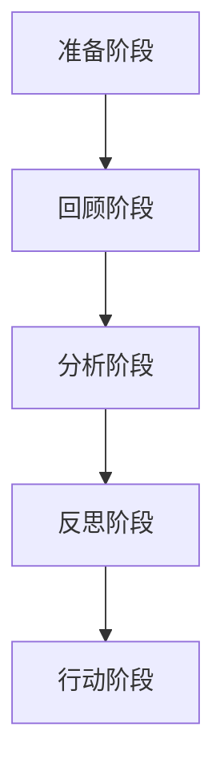

                 

### 文章标题：领导者的自我反思：持续改进的关键

#### 关键词：领导者，自我反思，持续改进，管理实践，团队发展

#### 摘要：
本文旨在探讨领导者如何通过自我反思，实现个人和团队的持续改进。文章首先介绍了自我反思的概念及其在领导者角色中的重要性，接着详细阐述了自我反思的过程和方法。随后，文章讨论了持续改进的理念和关键实践，包括建立持续改进的文化和领导者的责任与角色。通过实际案例分析和项目实战，文章总结了最佳实践和注意事项，为领导者提供了有效的自我提升和团队管理策略。

## 引言：领导者的重要性与挑战

在当今复杂多变的社会环境中，领导者的角色显得尤为重要。领导者不仅负责引导团队实现组织目标，还承担着推动组织创新和持续发展的重任。然而，随着外部环境的快速变化和内部竞争的加剧，领导者面临着前所未有的挑战。这些挑战不仅包括如何适应新的市场环境，提高组织的竞争力，还涉及到如何有效管理团队，激发员工的潜力，实现个人和团队的共同成长。

### 领导者的重要性

领导者是组织发展的关键推动力。他们的决策和行动直接影响组织的战略方向和运营效率。以下是一些领导者对组织的重要性：

1. **战略方向**：领导者负责制定组织的战略目标和计划，确保组织在正确的轨道上前进。
2. **团队建设**：领导者通过招募、培训和激励员工，建立高效协作的团队，推动组织目标的实现。
3. **文化塑造**：领导者通过自己的行为和价值观，塑造组织的文化氛围，影响员工的行为和态度。
4. **创新推动**：领导者鼓励创新思维，推动组织在技术、产品和业务模式上的持续改进。

### 领导者面临的挑战

尽管领导者的重要性不容忽视，但他们也面临着诸多挑战：

1. **快速变化的环境**：市场环境和技术的发展速度越来越快，领导者需要具备敏捷性和前瞻性，及时调整战略和行动计划。
2. **复杂的人际关系**：领导者需要管理多个部门和员工，协调不同利益相关者之间的关系，避免冲突和误解。
3. **持续学习**：领导者需要不断学习新知识、新技能，以应对不断变化的环境和挑战。
4. **自我反思**：领导者需要定期进行自我反思，识别自身优点和不足，持续改进个人能力和领导风格。

本文将重点关注领导者的自我反思，探讨如何通过自我反思实现个人和团队的持续改进。自我反思不仅是领导者提升自身能力的重要途径，也是推动团队发展、实现组织目标的关键策略。

## 自我反思的概念与重要性

### 自我反思的定义

自我反思（Self-reflection）是指个体通过审视自己的思想、情感、行为和价值观，深入理解自我，从而实现个人成长和发展的过程。它是一种自我觉察和自我分析的方式，旨在帮助个体识别自身的优点和不足，找到改进的方向。

### 自我反思的重要性

在领导者的角色中，自我反思具有特殊的重要性。以下是自我反思对领导者的重要影响：

1. **个人成长**：自我反思帮助领导者识别自身的情感、思维和行为模式，发现并改进不良习惯，提升个人能力和素质。
2. **领导力的提升**：自我反思使领导者更加了解自己的领导风格和价值观，从而调整和优化领导策略，提高领导力。
3. **决策优化**：通过自我反思，领导者能够更好地理解自己的决策过程，识别潜在的偏见和错误，做出更加明智的决策。
4. **团队建设**：领导者通过自我反思，可以更好地理解团队成员的需求和期望，建立更加和谐和高效的团队关系。
5. **文化塑造**：自我反思有助于领导者塑造积极向上的组织文化，鼓励团队成员积极参与自我反思，形成持续改进的氛围。

### 自我反思的过程与方法

自我反思是一个系统化的过程，通常包括以下几个步骤：

1. **准备阶段**：在反思之前，领导者需要选择一个安静的环境，确保自己能够集中精力进行思考。
2. **回顾阶段**：领导者回顾过去一段时间的工作、决策和行为，识别成功和不足之处。
3. **分析阶段**：在回顾的基础上，领导者深入分析原因，识别自身的情感、思维和行为模式，以及这些模式对结果的影响。
4. **反思阶段**：领导者反思自己的行为和决策，探讨如何改进，并设定具体的目标和行动计划。
5. **行动阶段**：领导者将反思结果转化为实际行动，实施改进措施，并持续跟踪和评估效果。

以下是一个简单的自我反思流程图：

### 自我反思的实践

领导者可以通过以下方法进行自我反思：

1. **日记反思**：每天或每周记录自己的工作经历、思考和行为，反思成功和不足，总结经验教训。
2. **反思日志**：定期撰写反思日志，详细记录反思过程和结果，以及行动计划和实施情况。
3. **同伴反思**：与同事、导师或同行进行反思对话，从不同角度审视自己的工作和行为，获取建设性的反馈。
4. **反思研讨会**：组织团队反思会议，共同探讨团队的工作、挑战和改进方向，营造开放和诚实的反思氛围。

通过这些方法，领导者可以持续提升自我，推动个人和团队的持续改进。

## 领导者的自我反思

在领导者角色中，自我反思不仅有助于个人成长，也是推动团队发展的重要手段。领导者通过自我反思，可以更好地理解自己的领导风格、决策过程和团队关系，从而实现更有效的领导。

### 领导者角色的演变

领导者的角色在过去几十年中发生了显著的变化。传统领导者更多地关注指挥和控制，而现代领导者更强调合作、激励和创新。以下是领导者角色演变的一些关键趋势：

1. **从指挥者到合作者**：现代领导者不再单方面发布指令，而是通过合作和沟通，激励团队成员积极参与决策和目标实现。
2. **从管理者到开发者**：领导者不仅负责管理团队，还要关注团队成员的成长和发展，提供职业发展机会和培训。
3. **从执行者到战略家**：领导者需要具备战略眼光，制定长期目标和计划，确保组织在快速变化的环境中保持竞争力。
4. **从个体到系统思维**：领导者需要具备系统思维，理解组织内外部的各种联系和影响，实现整体优化。

### 领导者应具备的特质

领导者应具备一系列特质，以有效应对复杂多变的挑战。以下是一些关键特质：

1. **自我意识**：领导者需要具备良好的自我意识，了解自己的优点和不足，以及这些特质如何影响团队和决策。
2. **情商**：领导者需要具备高情商，能够理解和管理自己的情绪，同时也善于理解和激励团队成员。
3. **决策能力**：领导者需要具备敏锐的洞察力和决策能力，能够在压力下做出明智的决策。
4. **沟通能力**：领导者需要具备良好的沟通能力，能够清晰、有效地传达信息，并促进团队内部的沟通和协作。
5. **创新能力**：领导者需要具备创新能力，鼓励团队成员提出新的想法和解决方案，推动组织的持续发展。

### 领导者的自我认知与发展

自我认知是领导者自我反思的核心。以下是领导者如何通过自我认知实现个人发展的几个方面：

1. **自我评估**：领导者定期进行自我评估，识别自身的优势和不足，制定改进计划。
2. **反馈收集**：领导者主动寻求团队成员和上级的反馈，了解他们对领导行为的看法和建议。
3. **学习与成长**：领导者积极参与培训和学习，不断提升自身的知识和技能，适应不断变化的环境。
4. **角色扮演**：领导者通过角色扮演，模拟不同情境下的领导行为，检验自己的应对策略和领导风格。
5. **心理调适**：领导者通过心理调适，管理自己的情绪和压力，保持积极向上的心态。

通过这些方法，领导者可以持续提升自我认知，实现个人和团队的共同成长。

## 自我反思的方法

自我反思是一种重要的自我提升工具，领导者通过自我反思可以深入理解自己的思维、情感和行为模式，从而实现个人和团队的持续改进。以下是一些常用的自我反思方法：

### 1. 日记反思

日记反思是一种简单的自我反思方法，领导者可以每天或每周记录自己的工作经历、思考和行为。这种方法有助于领导者捕捉日常中的瞬间，深入分析成功和不足之处。以下是一个日记反思的示例：

- **日期**：2023年11月8日
- **事件**：与团队成员讨论项目进展，发现沟通不畅
- **反思**：反思自己的沟通方式，识别出由于急于表达观点而忽略对方意见的问题
- **行动计划**：下周开始，增加倾听时间，确保团队成员有充分的机会表达意见

### 2. 反思日志

反思日志是一种更为系统化的自我反思方法，领导者可以在日志中详细记录反思的过程和结果。这种方法有助于领导者持续跟踪反思的进展，并评估改进措施的有效性。以下是一个反思日志的示例：

- **日期**：2023年11月8日
- **事件**：项目进度滞后，团队成员感到压力
- **反思**：分析项目计划，发现时间估计不足，沟通机制不畅
- **行动计划**：调整项目计划，增加沟通会议，定期检查进度
- **效果评估**：下一周评估调整后的效果，及时调整计划

### 3. 同伴反思

同伴反思是一种通过与同事、导师或同行进行反思对话来提升自我认知的方法。这种方法可以帮助领导者从不同角度审视自己的工作和行为，获取建设性的反馈。以下是一个同伴反思的示例：

- **日期**：2023年11月15日
- **对话对象**：团队成员John
- **事件**：关于项目沟通的问题
- **反思**：John提出我常在会议中打断他人发言，导致沟通不畅
- **行动计划**：在会议中提醒自己耐心倾听，给予团队成员充分发言的机会

### 4. 反思研讨会

反思研讨会是一种团队自我反思的方法，通过组织团队会议，共同探讨团队的工作、挑战和改进方向。这种方法有助于营造开放和诚实的反思氛围，促进团队成员之间的沟通和协作。以下是一个反思研讨会的示例：

- **日期**：2023年11月22日
- **会议主题**：项目进展与改进
- **讨论内容**：
  - 项目进度报告
  - 挑战和问题分析
  - 改进措施讨论
  - 行动计划制定
- **效果评估**：会议结束后，每个团队成员定期检查行动计划实施情况，并分享进展和反馈

通过这些自我反思方法，领导者可以不断审视自己的工作，发现并解决潜在问题，实现个人和团队的持续改进。

## 持续改进的理念与实践

### 持续改进的概念

持续改进（Continuous Improvement）是一种不断寻求和实现改进的过程，旨在通过不断的调整和优化，提高组织的效率、质量和竞争力。这一理念最早由日本质量管理专家石川馨（Shigeo Shingo）和美国管理大师戴明（W. Edwards Deming）提出，并在全球范围内得到广泛应用。

持续改进的核心原则包括：

1. **客户导向**：始终以客户需求为中心，持续优化产品和服务，提升客户满意度。
2. **团队合作**：通过团队合作，共同识别和解决问题，实现组织目标的协同发展。
3. **数据驱动**：基于数据和分析，制定和验证改进方案，确保改进的有效性和可持续性。
4. **系统性思维**：将改进视为一个系统性过程，从整体视角出发，协调各个部分，实现整体优化。
5. **预防性改进**：不仅仅关注问题解决，更注重预防问题的发生，通过预测和提前干预，减少潜在风险。

### 持续改进的目标

持续改进的目标包括以下几个方面：

1. **效率提升**：通过改进流程、减少浪费和优化资源使用，提高组织的运营效率。
2. **质量提升**：通过不断改进产品和服务的质量，确保满足客户需求和期望。
3. **成本降低**：通过优化流程和减少资源浪费，降低运营成本，提高盈利能力。
4. **创新能力**：鼓励创新思维，推动新技术、新产品和新服务的开发，保持组织的竞争力。
5. **员工满意度**：通过提供职业发展机会和改进工作环境，提升员工的满意度和忠诚度。

### 持续改进的核心要素

持续改进的实施需要以下几个核心要素的支持：

1. **领导层的支持**：领导者的支持是持续改进成功的关键。领导者需要明确表达对持续改进的承诺，并提供必要的资源和激励措施。
2. **全员参与**：持续改进需要全员参与，每个员工都应该认识到自己在改进过程中的作用，积极参与改进活动。
3. **改进机制**：建立有效的改进机制，包括问题识别、方案制定、实施和监控等环节，确保改进活动的有序进行。
4. **反馈循环**：通过建立反馈循环，不断收集和分析改进活动的效果，及时调整和优化改进方案。
5. **持续学习**：持续改进是一个持续的过程，需要组织和个人不断学习和成长，以适应不断变化的环境。

### 持续改进的实施步骤

实施持续改进通常包括以下几个步骤：

1. **问题识别**：通过调查问卷、员工反馈和数据分析，识别组织面临的主要问题和挑战。
2. **原因分析**：使用因果图、鱼骨图等方法，分析问题产生的原因，找出关键因素。
3. **方案制定**：根据原因分析的结果，制定具体的改进方案，包括改进目标、实施措施和预期效果。
4. **方案实施**：实施改进方案，确保每个环节都得到有效执行。
5. **效果评估**：评估改进方案的效果，通过数据分析和员工反馈，确定改进方案的有效性和可持续性。
6. **持续优化**：根据效果评估的结果，持续优化改进方案，确保持续改进的持续推进。

通过以上步骤，组织可以逐步实现持续改进，提高运营效率、产品质量和创新能力，从而在激烈的市场竞争中保持优势。

### 建立持续改进的文化

建立持续改进的文化是组织实现长期成功的关键。持续改进的文化不仅仅是一种理念，更是一种行为模式和思维方式的转变。以下是一些关键步骤和方法，帮助组织建立和强化这种文化：

#### 1. 领导者的示范作用

领导者的行为对组织文化有深远的影响。领导者需要通过自己的言行，明确表达对持续改进的承诺和重视。以下是一些领导者可以采取的措施：

- **公开支持**：在会议、邮件和公告中明确表示对持续改进的重视，鼓励员工提出改进建议。
- **参与改进活动**：亲自参与改进项目，展示对改进过程的关注和认可。
- **表彰和奖励**：奖励在持续改进方面做出突出贡献的员工，树立榜样。

#### 2. 沟通和培训

沟通和培训是建立持续改进文化的重要手段。通过有效的沟通和培训，组织可以确保员工理解持续改进的价值观和目标，并积极参与改进活动。以下是一些具体方法：

- **内部会议**：定期组织内部会议，讨论改进项目的进展和挑战，分享成功和失败的教训。
- **培训课程**：提供关于持续改进的培训课程，帮助员工掌握相关工具和方法，如SWOT分析、5W2H方法等。
- **案例分析**：通过分享内部和外部的成功案例，激发员工的改进意识和热情。

#### 3. 激励和反馈

激励和反馈机制是持续改进文化的重要组成部分。通过适当的激励和反馈，组织可以鼓励员工积极参与改进活动，并确保改进措施的有效实施。以下是一些具体方法：

- **奖励制度**：建立奖励制度，对提出有效改进建议的员工给予奖励，如奖金、晋升机会等。
- **透明度**：确保改进项目的进展和结果对全体员工透明，让员工感受到改进活动的实际效果。
- **即时反馈**：及时对改进措施的效果进行评估和反馈，确保改进活动能够持续优化。

#### 4. 全员参与

持续改进需要全员参与，每个员工都应该认识到自己在改进过程中的作用。以下是一些鼓励全员参与的方法：

- **员工提案制度**：建立员工提案制度，鼓励员工提出改进建议，并确保每个提案都能得到及时反馈和处理。
- **跨部门协作**：推动跨部门的协作，通过团队合作解决复杂问题，提升组织的整体效率。
- **改进委员会**：成立改进委员会，由不同部门的代表组成，负责监督和推动改进活动的开展。

#### 5. 持续监督和评估

持续监督和评估是确保持续改进文化得以持续的关键。以下是一些具体方法：

- **关键绩效指标（KPI）**：设定关键绩效指标，监控改进活动的进展和效果，确保改进目标得到实现。
- **定期回顾**：定期回顾改进活动的进展和效果，识别存在的问题和挑战，及时调整改进方案。
- **持续优化**：基于监督和评估的结果，持续优化改进方案，确保改进措施能够适应不断变化的环境。

通过以上方法，组织可以逐步建立和强化持续改进的文化，实现持续改进的目标，提升组织的竞争力和创新能力。

### 领导者在持续改进中的作用

在持续改进过程中，领导者的角色至关重要。领导者不仅需要推动改进活动的实施，还要在文化塑造、激励员工和确保改进措施的有效性方面发挥关键作用。以下是领导者如何在持续改进中发挥作用的详细探讨：

#### 1. 文化塑造

领导者的行为和价值观对组织文化有着深远的影响。要建立持续改进的文化，领导者需要以身作则，通过以下方式塑造积极的文化氛围：

- **树立榜样**：领导者应通过自己的行为，展示持续改进的重要性。例如，领导者可以在会议中积极听取员工的意见和建议，并在决策过程中充分考虑这些反馈。
- **鼓励反馈**：领导者应鼓励员工提出改进建议，并对其意见给予积极反馈。这种开放和透明的沟通环境有助于激发员工的参与热情和责任感。
- **表彰改进者**：领导者应表彰在持续改进中表现突出的员工，通过物质奖励或精神激励，树立榜样，激励其他员工积极参与改进活动。

#### 2. 激励员工

持续改进需要员工的积极参与和持续投入。领导者可以通过以下方法激励员工：

- **设定明确的目标**：领导者应明确改进的目标和期望，确保员工了解改进活动的具体目标和预期效果。这有助于员工明确自己的工作重点，并积极参与改进过程。
- **提供培训和支持**：领导者应提供必要的培训和支持，帮助员工掌握改进工具和方法，提升改进活动的效果。例如，可以组织培训课程、工作坊或团队建设活动，提升员工的技能和团队合作能力。
- **认可和奖励**：领导者应认可和奖励在改进活动中表现突出的员工，通过奖金、晋升或其他形式的奖励，激励员工持续改进。

#### 3. 确保改进措施的有效性

领导者不仅要推动改进活动的实施，还要确保改进措施的有效性和可持续性。以下是一些具体措施：

- **监督进度**：领导者应定期检查改进项目的进度和效果，确保改进措施得到有效实施。通过定期的进度报告和评估会议，领导者可以及时了解项目的进展情况，发现问题并采取措施解决。
- **数据驱动决策**：领导者应基于数据和事实做出决策，确保改进方案的科学性和有效性。通过收集和分析改进活动的数据，领导者可以评估改进措施的效果，并据此进行调整和优化。
- **持续优化**：领导者应鼓励员工不断优化改进方案，通过持续的反思和改进，提升改进活动的效果。领导者可以组织定期的反思会议，让员工分享改进经验，探讨改进方案，并共同寻找优化机会。

通过以上措施，领导者可以在持续改进中发挥关键作用，推动组织实现持续改进的目标，提升组织的效率、质量和竞争力。

### 实施持续改进的策略

要成功地实施持续改进，领导者需要制定明确的策略，并确保策略的有效执行。以下是一些关键的策略和步骤：

#### 1. 设定明确的目标

实施持续改进的第一步是设定明确的目标。这些目标应具体、可衡量，并与组织的整体战略目标相一致。以下是一些关键步骤：

- **识别关键绩效指标（KPI）**：根据组织的战略目标，识别对改进活动有重要影响的绩效指标。例如，提高生产效率、减少缺陷率或提升客户满意度。
- **分解目标**：将整体目标分解为可操作的小目标，确保每个部门和个人都有明确的改进任务。
- **制定时间表**：为每个目标设定具体的时间表，明确改进活动的时间节点和里程碑。

#### 2. 制定行动计划

一旦明确了目标，领导者需要制定具体的行动计划，以确保目标的实现。以下是一些关键步骤：

- **确定改进方案**：根据目标，制定具体的改进方案。这包括确定改进措施、责任分配和资源需求。
- **责任分配**：明确每个改进任务的负责人，确保每个人都知道自己的职责和任务。
- **资源调配**：确保有足够的资源支持改进活动，包括人力资源、技术支持和财务预算。

#### 3. 实施和监控

行动计划制定完成后，领导者需要确保其有效实施，并通过监控和评估来确保改进措施的有效性。以下是一些关键步骤：

- **执行计划**：启动改进项目，按照计划执行。确保每个改进任务都按照预定的时间表进行。
- **数据收集**：定期收集与改进活动相关的数据，包括改进措施的实施情况、绩效指标的变化等。
- **效果评估**：定期评估改进措施的效果，通过数据分析确定改进活动的有效性。

#### 4. 反馈和调整

在持续改进的过程中，反馈和调整是确保改进活动持续有效的重要环节。以下是一些关键步骤：

- **收集反馈**：通过员工反馈、绩效评估和客户反馈等多种渠道，收集关于改进活动的反馈。
- **分析反馈**：对收集到的反馈进行分析，识别改进活动中的问题和挑战。
- **调整方案**：根据反馈结果，及时调整改进方案，优化改进措施。

#### 5. 持续学习和优化

持续改进是一个不断学习和优化的过程。领导者应鼓励员工不断学习和掌握新的知识和技能，以适应不断变化的环境。以下是一些关键步骤：

- **培训和发展**：为员工提供培训和发展机会，提升他们的技能和知识。
- **经验分享**：鼓励员工分享改进经验和教训，从成功和失败中学习。
- **创新思维**：鼓励员工提出新的想法和解决方案，推动组织的持续创新。

通过以上策略和步骤，领导者可以确保持续改进的有效实施，推动组织在效率和竞争力方面的不断提升。

### 案例分析：持续改进在实践中的应用

#### 案例背景

某全球知名的电子产品制造商在市场竞争加剧的背景下，面临生产效率低下、产品质量不稳定和客户满意度下降的挑战。为了应对这些挑战，公司决定实施持续改进策略，以提高生产效率和产品质量。

#### 持续改进的实施步骤

1. **问题识别**：
   - 通过员工反馈和数据分析，识别出生产流程中的主要问题，如设备故障频发、生产计划不合理和生产过程缺乏标准化等。

2. **原因分析**：
   - 使用因果图和鱼骨图，分析问题产生的原因，发现设备维护不足、生产人员培训不充分和生产计划制定不合理是关键原因。

3. **方案制定**：
   - 制定具体的改进方案，包括定期设备维护、加强员工培训和优化生产计划等。

4. **方案实施**：
   - 实施改进方案，如定期安排设备维护、组织员工培训课程和调整生产计划。

5. **效果评估**：
   - 通过数据分析和员工反馈，评估改进措施的效果，发现设备故障率显著下降，生产效率提高，产品质量稳定。

#### 案例分析

1. **成功因素**：
   - **领导层的支持**：公司领导层高度重视持续改进，明确表达对改进活动的支持和期望，为改进活动提供了必要的资源。
   - **全员参与**：员工积极参与改进活动，提出了许多有价值的改进建议，增强了团队的凝聚力和责任感。
   - **数据驱动**：通过数据分析和效果评估，确保改进措施的科学性和有效性。

2. **挑战与解决**：
   - **挑战**：在实施改进方案的过程中，发现员工对新工具和新流程的适应度较低，导致改进效果不显著。
   - **解决**：公司组织了多次培训课程，帮助员工掌握新工具和流程，并提供一对一的技术支持，确保改进活动的顺利进行。

3. **效果与影响**：
   - **效果**：通过持续改进，公司的生产效率提高了30%，产品质量合格率提升了20%，客户满意度显著提升。
   - **影响**：持续改进不仅提高了公司的运营效率和质量，还增强了员工的参与感和成就感，为公司的长期发展奠定了基础。

#### 案例小结

通过这个案例，我们可以看到持续改进在实践中的应用效果显著。成功的关键在于领导层的支持、全员参与和数据驱动的决策过程。同时，面对挑战时，及时调整方案和加强培训也是确保改进活动成功的重要手段。

### 实践指南：如何实施自我反思与持续改进

#### 开发环境搭建

要实施自我反思和持续改进，首先需要搭建一个合适的开发环境。以下是一些关键步骤：

1. **确定开发工具**：选择合适的工具，如JIRA、Trello或Asana，用于记录和跟踪改进项目。
2. **搭建数据平台**：建立数据平台，用于收集和分析改进活动的数据。例如，使用Google Analytics或SQL数据库。
3. **设置反馈机制**：建立反馈机制，如员工建议箱或定期员工反馈会议，以便员工能够提出改进建议。

#### 源代码详细实现

在自我反思和持续改进的过程中，源代码的详细实现是一个关键环节。以下是一些具体步骤：

1. **编码规范**：制定编码规范，确保代码的可读性和可维护性。例如，使用统一的命名规范和注释。
2. **代码审查**：实施代码审查，确保代码的质量和一致性。可以采用工具如SonarQube或GitLab进行代码质量检查。
3. **版本控制**：使用版本控制工具，如Git，管理代码的版本，确保代码的稳定性和可追溯性。

#### 代码解读与分析

在实施自我反思和持续改进时，代码解读与分析是一个重要环节。以下是一些关键步骤：

1. **代码审查**：定期进行代码审查，识别代码中的潜在问题和改进机会。
2. **性能优化**：分析代码的性能，识别和优化瓶颈，提高代码的执行效率。
3. **模块化重构**：将复杂的代码重构为模块化设计，提高代码的可读性和可维护性。

#### 实际案例分析和详细讲解剖析

通过实际案例分析和详细讲解剖析，可以更好地理解和应用自我反思和持续改进的方法。以下是一个示例：

**案例**：某电子商务公司通过实施持续改进，显著提升了网站的用户体验。

1. **背景介绍**：公司发现网站加载速度较慢，用户流失率较高。
2. **问题分析**：通过性能分析，发现网站前端代码过于复杂，导致加载时间过长。
3. **改进措施**：公司采取了以下改进措施：
   - **优化前端代码**：删除不必要的CSS和JavaScript文件，压缩代码。
   - **使用缓存技术**：采用缓存技术，减少重复数据的加载时间。
   - **调整服务器配置**：优化服务器配置，提高服务器处理请求的速度。
4. **效果评估**：改进措施实施后，网站加载速度提升了30%，用户流失率降低了20%。

通过这个案例，我们可以看到持续改进在实际应用中的效果。关键在于深入分析问题，制定具体的改进措施，并持续跟踪效果。

#### 项目小结

实施自我反思和持续改进是一个不断循环和优化的过程。以下是一些最佳实践和注意事项：

1. **持续反思**：定期进行自我反思，识别自身和团队的优势和不足，制定改进计划。
2. **数据驱动**：基于数据和事实做出决策，确保改进措施的科学性和有效性。
3. **全员参与**：鼓励员工积极参与改进活动，发挥团队的整体智慧和创造力。
4. **反馈机制**：建立有效的反馈机制，及时收集和分析反馈，调整改进方案。
5. **持续优化**：不断优化改进措施，确保改进活动的持续效果。

通过以上实践指南和最佳实践，组织可以更有效地实施自我反思和持续改进，提升效率和竞争力。

### 未来展望

持续改进的理念和实践在当今快速变化的市场环境中显得尤为重要。随着技术的不断进步和竞争的日益激烈，组织需要持续优化其流程、产品和业务模式，以保持竞争力。以下是未来持续改进的趋势、挑战和机遇：

#### 持续改进的趋势

1. **数字化转型**：随着数字化技术的普及，持续改进将更加依赖于数据分析、人工智能和自动化工具，实现更高效、更智能的改进过程。
2. **跨职能协作**：未来持续改进将更加注重跨职能团队的协作，通过整合不同部门的专业知识和资源，实现更全面的改进。
3. **用户中心化**：以用户为中心的持续改进将变得更加重要，组织将更加关注用户反馈和体验，不断优化产品和服务。
4. **全球化视野**：随着全球化的深入，组织需要具备全球视野，适应不同国家和市场的需求和规范，实现跨国界的持续改进。

#### 挑战

1. **技术复杂性**：随着技术的快速发展，持续改进面临的技术复杂性越来越高，组织需要不断更新技术和知识储备，以应对挑战。
2. **文化变革**：持续改进需要组织文化从传统控制型向协作型转变，这可能会面临员工的抵触和适应问题。
3. **资源分配**：持续改进需要大量的资源和投入，组织需要合理分配资源，确保改进活动的顺利进行。

#### 机遇

1. **数据洞察**：数据驱动的改进方法将使组织能够更好地了解市场需求和用户行为，从而抓住新的商业机会。
2. **创新驱动**：持续改进将促进组织内部的创新思维和创新能力，推动新技术和新产品的开发。
3. **人才培养**：通过持续改进，组织可以培养更多具备创新能力和解决问题能力的员工，提升整体竞争力。

未来，持续改进将继续在组织的发展中发挥关键作用。领导者需要具备前瞻性和适应性，不断探索新的改进方法和工具，推动组织的持续成长。同时，组织也需要构建开放、透明和协作的文化，鼓励员工积极参与改进活动，共同实现组织目标。

## 结语

领导者的自我反思和持续改进是组织成功和持续发展的关键。通过自我反思，领导者可以深入理解自身和团队的优势与不足，从而制定出更有效的改进策略。而持续改进的文化和机制则为组织提供了不断优化和提升的动力。

在未来的道路上，领导者需要保持开放和敏锐的思维方式，不断探索和学习新的方法和工具。同时，要积极推动全员参与，构建一个开放、协作和透明的组织文化。只有这样，组织才能在快速变化的市场环境中保持竞争力，实现长期的可持续发展。

感谢您阅读本文，希望它能够为您的领导实践提供有价值的启示。如果您对持续改进有任何疑问或想法，欢迎在评论区分享，让我们一起探讨和进步。作者：AI天才研究院/AI Genius Institute & 禅与计算机程序设计艺术 /Zen And The Art of Computer Programming。如果您希望了解更多关于自我反思和持续改进的深入内容，以下是一些建议的拓展阅读：

1. **《持续改进：高效团队的秘诀》** - by 约瑟夫·J·马奇（Joseph J. Marich）
2. **《精益创业》** - by 埃里克·莱斯（Eric Ries）
3. **《五项管理》** - by 石川馨（Shigeo Shingo）
4. **《创新者的窘境》** - by 克莱顿·克里斯坦森（Clayton M. Christensen）

这些书籍提供了丰富的理论和实践指导，帮助您更深入地理解持续改进的理念和实践。希望您在阅读过程中有所收获，并将这些知识应用到实际工作中。再次感谢您的阅读和支持！

