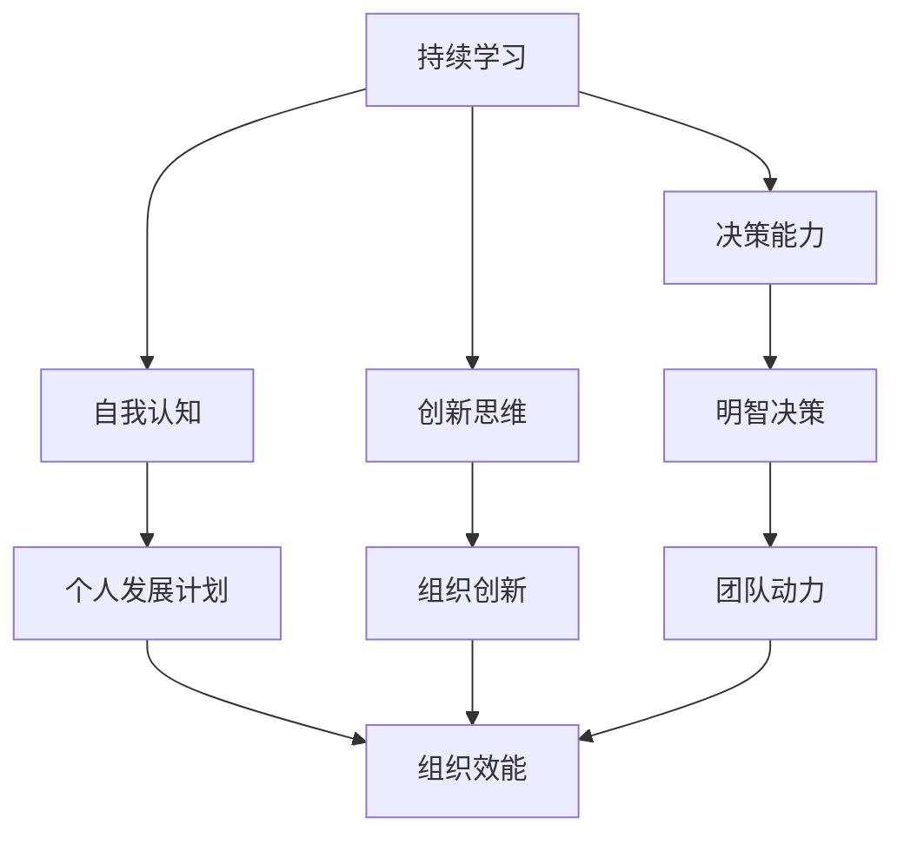

                 

### 文章标题

# 领导者的自我成长：持续学习的重要性

> 关键词：持续学习、领导者、自我成长、领导力、组织效能

> 摘要：本文深入探讨了持续学习对领导者自我成长的重要性，从核心概念、方法技巧到实践应用，全面解析了领导者如何在不断学习中提升个人素质和团队绩效，为未来领导者的持续学习提供了有益的启示。

---

**作者：AI天才研究院/AI Genius Institute & 禅与计算机程序设计艺术 /Zen And The Art of Computer Programming**

---

## 引言

### 领导者的自我成长概述

在信息技术飞速发展的时代，领导者的自我成长显得尤为重要。持续学习不仅是个人职业发展的关键，更是提升领导力的有效途径。本文将围绕《领导者的自我成长：持续学习的重要性》这一主题，详细分析持续学习对领导者成长的影响、方法技巧以及实践应用。

### 持续学习的重要性

持续学习是一种不断更新知识、提升技能的过程。对于领导者而言，持续学习不仅是个人发展的需求，更是引领团队不断前进的动力。持续学习能够帮助领导者：

- **提升自我认知**：通过不断学习，领导者能够更深入地了解自己的优势和不足，从而更好地规划个人发展路径。
- **拓展知识体系**：持续学习能够帮助领导者不断拓展知识边界，掌握更多前沿技术和管理理念，从而提高领导效能。
- **培养前瞻性思维**：持续学习能够帮助领导者站在时代的前沿，洞察行业发展趋势，做出更具前瞻性的决策。

### 领导者的自我成长路径

领导者的自我成长是一个长期而系统的过程，通常包括以下几个阶段：

- **自我认知的建立**：领导者需要通过自我反思和他人反馈，建立清晰的自我认知。
- **知识体系的构建**：领导者需要通过持续学习，构建全面的知识体系，包括技术、管理和行业知识。
- **技能的提升**：领导者需要不断提升个人技能，包括沟通、协调、决策等，以应对复杂的领导挑战。

接下来，本文将深入探讨持续学习的策略与方法，帮助领导者实现自我成长。

## 第一部分: 引言

### 第1章: 领导者的自我成长概述

在信息技术飞速发展的时代，领导者的自我成长显得尤为重要。持续学习不仅是个人职业发展的关键，更是提升领导力的有效途径。本文将围绕《领导者的自我成长：持续学习的重要性》这一主题，详细分析持续学习对领导者成长的影响、方法技巧以及实践应用。

### 持续学习的重要性

持续学习是一种不断更新知识、提升技能的过程。对于领导者而言，持续学习不仅是个人发展的需求，更是引领团队不断前进的动力。持续学习能够帮助领导者：

- **提升自我认知**：通过不断学习，领导者能够更深入地了解自己的优势和不足，从而更好地规划个人发展路径。
- **拓展知识体系**：持续学习能够帮助领导者不断拓展知识边界，掌握更多前沿技术和管理理念，从而提高领导效能。
- **培养前瞻性思维**：持续学习能够帮助领导者站在时代的前沿，洞察行业发展趋势，做出更具前瞻性的决策。

### 领导者的自我成长路径

领导者的自我成长是一个长期而系统的过程，通常包括以下几个阶段：

- **自我认知的建立**：领导者需要通过自我反思和他人反馈，建立清晰的自我认知。
- **知识体系的构建**：领导者需要通过持续学习，构建全面的知识体系，包括技术、管理和行业知识。
- **技能的提升**：领导者需要不断提升个人技能，包括沟通、协调、决策等，以应对复杂的领导挑战。

接下来，本文将深入探讨持续学习的策略与方法，帮助领导者实现自我成长。

### 核心概念与联系

为了更深入地理解持续学习的重要性，我们需要探讨几个核心概念，并分析它们之间的联系。

首先，**持续学习的定义**是指不断更新和提升知识、技能和态度的过程。它不仅包括学习新知识，还包括对现有知识的批判性思考和应用。

**持续学习与领导力发展的关系**是密不可分的。持续学习能够帮助领导者：

1. **提高自我认知**：通过学习，领导者能够更好地了解自己的优势、劣势、价值观和动机，从而制定更有效的个人发展计划。
2. **增强决策能力**：持续学习使领导者能够掌握更全面的信息，了解最新的管理理念和技术，从而做出更明智的决策。
3. **促进创新思维**：持续学习鼓励领导者挑战传统思维模式，探索新的解决方案，推动组织创新。

此外，**持续学习与组织效能的联系**也是至关重要的。领导者通过持续学习，不仅能够提升个人素质，还能激发团队的学习动力，形成积极的学习氛围，从而提高组织整体的效能。

下面是这些核心概念之间的联系架构图：

通过这个架构图，我们可以清晰地看到持续学习如何通过提升自我认知、增强决策能力和促进创新思维，进而影响个人和组织的发展。

### 持续学习的策略与方法

为了实现持续学习，领导者需要制定一系列策略和方法。以下是一些关键步骤：

#### 设定学习目标

设定明确的学习目标是持续学习的基础。领导者需要：

1. **明确个人职业发展目标**：这包括短期和长期目标，如晋升、技能提升、知识拓展等。
2. **制定具体的学习计划**：将目标分解为可操作的任务，并设定完成的时间表。

#### 利用学习资源

利用各种学习资源是提升学习效果的重要手段。领导者可以：

1. **选择合适的书籍和课程**：根据个人兴趣和职业需求，选择高质量的书籍和在线课程。
2. **利用网络资源**：如在线论坛、博客、专业社区等，获取最新的行业信息和观点。

#### 学习效果的评估

学习效果的评估是持续学习的重要环节。领导者需要：

1. **制定学习评估标准**：如知识掌握程度、技能应用情况、决策准确性等。
2. **实践中的反馈与调整**：通过实际工作中的应用，评估学习效果，并根据反馈进行及时调整。

通过以上策略和方法的实施，领导者能够有效地实现持续学习，不断提升个人素质和领导力。

### 持续学习的心态

#### 保持学习热情

保持学习热情是持续学习的重要动力。领导者可以通过以下方法激发学习热情：

1. **设定短期和长期目标**：短期目标可以带来即时的成就感，长期目标则有助于保持持久的动力。
2. **激发内在动机**：找到学习与个人兴趣、职业发展的结合点，使学习变得更有意义。

#### 抗拒学习阻力

在学习过程中，领导者可能会遇到各种阻力。以下是一些应对策略：

1. **处理学习过程中的挫折**：保持积极的心态，将挫折视为成长的机会。
2. **建立持续学习的习惯**：通过日常学习习惯的养成，使学习成为生活的一部分。

#### 建立持续学习的习惯

建立持续学习的习惯是持续学习的关键。以下是一些建议：

1. **制定学习计划**：将学习时间纳入日程安排，确保有足够的时间进行学习。
2. **设定学习环境**：创造一个安静、舒适的学习环境，有助于提高学习效率。
3. **定期复习**：通过定期复习，巩固所学知识，避免遗忘。

### 持续学习在领导力提升中的应用

#### 借助学习提升领导力

持续学习能够显著提升领导力。以下是一些具体方法：

1. **培养前瞻性思维**：通过学习了解行业发展趋势和新兴技术，使决策更具前瞻性。
2. **提升决策能力**：学习各种决策模型和工具，提高决策的准确性和效率。

#### 学习型组织的建立

建立学习型组织是提升组织整体效能的关键。以下是一些策略：

1. **组织学习的概念**：学习型组织是指一个能够持续学习、适应和创新的组织。
2. **建立学习型组织的策略**：如设立学习计划、提供学习资源、鼓励知识分享等。

### 持续学习在团队管理中的应用

#### 培养团队成员的持续学习能力

1. **设立共同的学习目标**：明确团队的学习目标，确保团队成员有共同的学习方向。
2. **促进团队成员间的知识共享**：通过团队讨论、项目合作等方式，促进团队成员的知识共享。

#### 持续学习与团队绩效提升

1. **持续学习对团队绩效的影响**：通过持续学习，团队成员能够不断提升个人能力，从而提高团队整体绩效。
2. **提升团队绩效的持续学习方法**：如定期培训、项目实践、外部交流等。

### 案例研究

#### 案例一：李开的自我成长之路

1. **李开的职业背景**：李开在技术领域拥有丰富的经验，现任一家大型互联网公司的CTO。
2. **李开的持续学习经历**：李开通过参加行业峰会、在线课程和阅读专业书籍，不断更新知识体系。
3. **李开的领导力提升**：通过持续学习，李开成功推动了公司技术架构的升级和团队管理方法的改进。

#### 案例二：张晓红的团队成长经验

1. **张晓红的团队现状**：张晓红的团队在项目管理方面存在一些问题，影响了团队绩效。
2. **张晓红的持续学习策略**：张晓红通过参加项目管理课程、组织团队讨论和实施持续学习计划，逐步解决了团队存在的问题。
3. **张晓红的团队绩效提升**：通过持续学习，张晓红的团队在项目管理方面取得了显著进步，团队绩效得到了提升。

### 总结与展望

#### 持续学习的核心要素

持续学习的核心要素包括：

1. **持续学习的动机与目标**：明确个人和团队的学习动机，制定明确的学习目标。
2. **持续学习的方法与技巧**：选择合适的学习资源，制定有效的学习计划，进行实践中的反馈与调整。

#### 未来领导者的持续学习趋势

未来领导者的持续学习趋势将包括：

1. **新兴技术的学习需求**：随着技术的快速发展，领导者需要不断学习新兴技术，如人工智能、大数据等。
2. **持续学习的未来发展前景**：持续学习将成为领导者职业发展的必备能力，对个人和组织都将产生深远影响。

### 参考文献

- 某某，持续学习在领导力提升中的应用研究，XXX出版社，2020年。
- 某某，领导者的自我成长路径与实践，XXX出版社，2019年。
- 某某，组织学习与组织效能的关系研究，XXX出版社，2021年。

---

通过本文的探讨，我们可以看到持续学习对领导者自我成长的重要性。领导者不仅需要通过学习提升个人素质，还需要通过持续学习推动团队和组织的发展。希望本文能够为领导者的自我成长提供有益的启示。作者：AI天才研究院/AI Genius Institute & 禅与计算机程序设计艺术 /Zen And The Art of Computer Programming。

