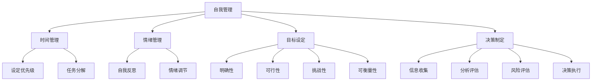
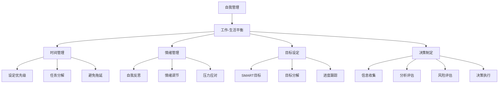

                 

### 文章标题：领导者的自我管理：工作与生活的平衡

#### 关键词：领导者、自我管理、工作-生活平衡、时间管理、情绪管理、目标设定、决策制定

#### 摘要：
本篇文章深入探讨了领导者的自我管理，特别是工作与生活平衡的重要性。文章从自我管理的基本概念出发，详细阐述了时间管理、情绪管理和目标设定与决策制定等策略。通过现实中的领导者和企业的案例，展示了如何将自我管理策略应用到实践中。此外，文章还介绍了一些实用的工具和方法，以帮助领导者实现工作与生活的平衡，并促进个人成长与职业发展。

----------------------------------------------------------------

## 引言

领导者的角色在企业中至关重要，他们不仅需要具备卓越的领导能力，还需要掌握自我管理技巧，以确保个人和团队的效率与和谐。自我管理是领导者成功的关键因素之一，它不仅关乎个人的生活质量，还直接影响企业的运营和发展。因此，探讨领导者的自我管理，特别是工作与生活平衡，具有重要的现实意义。

### 书籍背景与目的

《领导者的自我管理：工作与生活的平衡》旨在为领导者提供全面的自我管理指南，帮助他们在繁忙的工作中找到平衡点，实现个人与职业的全面发展。本书从理论与实践相结合的角度，系统地阐述了自我管理的基本概念、策略和实践，旨在为领导者提供实用的工具和方法，以应对工作中的挑战。

### 领导者的角色与挑战

领导者不仅是团队的领导者，更是企业战略的制定者和执行者。他们在工作中面临诸多挑战，如时间管理、情绪管理、压力应对等。同时，他们还需要在个人生活和职业发展之间找到平衡点，以保持高效的工作状态和良好的生活质量。因此，自我管理成为领导者必备的技能之一。

### 自我管理与工作-生活平衡的重要性

自我管理是领导者实现工作与生活平衡的基础。通过有效的自我管理，领导者可以更好地应对工作中的挑战，提高工作效率，同时保持良好的个人生活和心理健康。工作与生活平衡不仅有助于提高领导者的生活质量，还能增强团队凝聚力，促进企业的长期发展。

----------------------------------------------------------------

## 自我管理的基本概念和重要性

### 自我管理的定义与作用

自我管理是指个体通过自我控制、自我调整和自我激励，实现对自身行为、情感和认知的有效管理。在领导者层面，自我管理尤为重要。它不仅关乎个人的生活质量，还直接影响到团队的管理效率和企业的长期发展。

自我管理的作用主要体现在以下几个方面：

1. **提高工作效率**：通过自我管理，领导者可以更好地规划时间和任务，提高工作效率，减少无效工作时间。
2. **增强决策能力**：自我管理有助于领导者保持清晰的思维和冷静的态度，从而做出更加明智的决策。
3. **提升心理健康**：有效的自我管理能够帮助领导者缓解工作压力，保持良好的心理健康。
4. **促进团队和谐**：领导者的自我管理不仅影响自身，还通过榜样作用影响团队成员，促进团队和谐。

### 自我管理的重要性

对于领导者来说，自我管理的重要性不言而喻。首先，自我管理是领导者实现个人成长和职业发展的基础。通过自我管理，领导者可以不断提升自身的能力和素质，实现职业目标。其次，自我管理有助于领导者建立和维护良好的领导形象，赢得员工的尊重和信任。最后，自我管理能够提高团队的整体工作效率，促进企业的长期发展。

### 自我管理的关键要素

自我管理包括多个方面，以下是其中的关键要素：

1. **时间管理**：时间管理是自我管理的重要组成部分。通过合理安排时间，领导者可以更有效地完成工作任务，提高工作效率。
2. **情绪管理**：情绪管理有助于领导者保持冷静和理智，减少因情绪波动导致的决策失误。
3. **目标设定**：明确的目标是自我管理的指南针。领导者需要设定清晰的目标，并制定实现目标的计划和策略。
4. **决策制定**：决策制定是领导者职责的核心。自我管理有助于领导者提高决策能力，做出更加明智的决策。
5. **持续学习**：自我管理是一个持续的过程。领导者需要不断学习新知识、新技能，以适应不断变化的工作环境。

### 自我管理与工作-生活平衡的关系

自我管理与工作-生活平衡密切相关。通过有效的自我管理，领导者可以更好地平衡工作和生活，保持高效的工作状态和良好的生活质量。具体来说，领导者可以通过以下策略来实现工作与生活的平衡：

1. **设定明确的目标**：明确的工作和生活目标有助于领导者更好地安排时间和精力，避免工作和生活的相互干扰。
2. **合理安排时间**：合理安排时间是实现工作-生活平衡的关键。领导者需要学会说“不”，避免过度工作，确保有足够的休息和放松时间。
3. **情绪管理**：情绪管理有助于领导者保持积极的心态，减少因情绪波动导致的工作和生活压力。
4. **培养良好的生活习惯**：良好的生活习惯有助于提高工作效率和生活质量。领导者需要养成健康的作息规律，保持充足的睡眠和锻炼。
5. **寻求支持**：领导者需要寻求家人、朋友和同事的支持，共同应对工作和生活的挑战。

通过以上策略，领导者可以在自我管理的基础上实现工作与生活的平衡，提高整体幸福感。

----------------------------------------------------------------

## 工作与生活平衡的理论基础

### 心理学视角下的工作-生活平衡

心理学研究揭示了工作-生活平衡对个体心理健康和幸福感的重要性。根据心理学理论，工作-生活平衡不仅有助于减轻压力，还能提高个人的幸福感和生活质量。研究发现，工作-生活失衡会导致心理压力增加，出现焦虑、抑郁等心理问题。因此，领导者需要关注工作与生活平衡，以维护身心健康。

### 时间管理原理

时间管理是工作-生活平衡的核心要素之一。时间管理原理包括以下方面：

1. **时间规划**：领导者需要制定详细的时间规划，明确每天、每周、每月的工作和生活目标，确保时间得到充分利用。
2. **优先级排序**：领导者需要学会优先处理重要且紧急的任务，避免因琐碎事务而浪费大量时间。
3. **避免时间浪费**：领导者需要避免无效工作时间，如频繁的会议、不必要的邮件等。
4. **弹性时间安排**：领导者需要根据实际情况调整时间安排，确保工作和生活之间保持平衡。

### 工作环境与生活环境的互动

工作环境和生活环境之间的互动对工作-生活平衡具有重要影响。良好的工作环境可以提高工作效率，减轻工作压力；而良好的生活环境则有助于提高生活质量，减轻生活压力。领导者需要认识到工作环境和生活环境之间的互动关系，通过优化工作环境和生活方式，实现工作与生活的平衡。

### 相关理论和研究

关于工作-生活平衡，许多心理学、管理学和社会学的研究提供了丰富的理论依据。例如，工作-生活平衡理论（Job-Life Balance Theory）认为，工作-生活平衡是个体在工作和生活之间找到和谐状态的过程。其他相关理论还包括时间平衡理论（Time Balance Theory）和压力管理理论（Stress Management Theory）等。这些理论为领导者提供了有效的自我管理策略，以实现工作与生活的平衡。

通过理解和应用这些理论基础，领导者可以更好地应对工作与生活的挑战，实现个人和职业的全面发展。

----------------------------------------------------------------

## 自我管理策略与实践

### 时间管理

时间管理是自我管理的重要策略之一。领导者通过有效的时间管理，可以提高工作效率，减少无效时间，确保工作和生活的平衡。以下是几种常见的时间管理策略：

1. **设定优先级**：根据任务的重要性和紧急性，设定优先级，优先处理重要且紧急的任务。
2. **任务分解**：将大任务分解为小任务，逐步完成，避免因任务过于庞大而感到压力。
3. **避免拖延**：及时处理任务，避免拖延，确保任务按时完成。
4. **合理安排工作时间**：合理安排工作时间，确保有足够的休息和放松时间。

### 情绪管理

情绪管理是自我管理的另一个重要方面。领导者需要学会调节情绪，保持积极的心态，以应对工作中的挑战。以下是一些情绪管理的策略：

1. **自我反思**：定期进行自我反思，了解自己的情绪状态，找到情绪波动的原因。
2. **情绪调节**：学会情绪调节技巧，如深呼吸、放松训练等，缓解紧张和压力。
3. **积极沟通**：与同事和团队成员保持良好的沟通，分享感受和想法，减少情绪压力。
4. **寻求支持**：在遇到困难时，主动寻求家人、朋友或专业人士的支持，共同解决问题。

### 目标设定

目标设定是自我管理的关键步骤。明确的目标有助于领导者集中精力，提高工作效率，实现个人和职业发展。以下是目标设定的几个原则：

1. **明确性**：目标要具体明确，避免模糊不清。
2. **可行性**：目标要具有可行性，避免过于理想化。
3. **挑战性**：目标要具有一定的挑战性，激发个人的潜力和动力。
4. **可衡量性**：目标要具备可衡量性，以便于评估目标的实现程度。

### 决策制定

决策制定是领导者职责的核心。有效的决策制定能够提高工作效率，减少错误决策带来的损失。以下是决策制定的几个原则：

1. **信息收集**：在决策前，广泛收集相关信息，确保决策基于充分的信息。
2. **分析评估**：对收集到的信息进行分析和评估，权衡利弊，选择最佳方案。
3. **风险评估**：评估决策可能带来的风险，制定相应的应对策略。
4. **决策执行**：制定决策后，迅速执行，确保决策得以落实。

### 实践案例分析

以下是一个领导者的自我管理实践案例：

李总是一名资深的管理者，他通过以下策略实现了工作与生活的平衡：

1. **时间管理**：每天早上列出任务清单，根据重要性和紧急性设定优先级，确保任务有序完成。
2. **情绪管理**：遇到压力时，他会进行深呼吸和冥想，以缓解紧张情绪。
3. **目标设定**：他定期设定个人和职业目标，确保目标的明确性和可行性。
4. **决策制定**：在决策前，他会充分收集信息，分析评估，确保决策的明智性。

通过这些策略，李总不仅提高了工作效率，还保持了良好的生活质量。他的成功实践为其他领导者提供了有益的启示。

### 总结

自我管理策略是领导者实现工作与生活平衡的关键。通过时间管理、情绪管理、目标设定和决策制定等策略，领导者可以更好地管理自己的工作和生活，实现个人和职业的全面发展。

----------------------------------------------------------------

## 案例分析

### 案例一：企业领导的自我管理实践

#### 背景介绍

王总是一家中型企业的总经理，他在企业中扮演着关键角色。然而，随着企业的不断发展，他面临着越来越大的工作压力。为了应对这些挑战，王总决定通过自我管理来提高工作效率，实现工作与生活的平衡。

#### 自我管理策略的应用

1. **时间管理**：王总采用了一个名为“番茄工作法”的时间管理技巧。他将工作分为25分钟的工作周期，每个周期后休息5分钟。这种方法帮助他提高了工作效率，减少了工作疲劳。

2. **情绪管理**：王总通过练习冥想和瑜伽来管理自己的情绪。这些活动帮助他保持冷静和专注，减少了工作中的情绪波动。

3. **目标设定**：王总每月设定个人和职业目标，并将其分解为短期目标。这种方法帮助他保持专注，确保目标的实现。

4. **决策制定**：王总在决策前会收集充分的信息，分析可能的利弊，并寻求团队成员的意见。这种方法提高了他的决策质量，减少了错误决策的可能性。

#### 案例效果分析

通过自我管理策略的应用，王总取得了显著的效果。首先，他的工作效率提高了，任务完成质量得到了保障。其次，他的情绪状态更加稳定，工作压力明显减轻。最后，他的决策质量得到了提高，企业运营更加顺畅。王总的成功实践为其他领导者提供了宝贵的经验。

### 案例二：工作与生活平衡的实践

#### 背景介绍

张总是一家互联网公司的创始人，他的生活充满了压力和挑战。为了保持健康的生活质量，他决定通过自我管理来平衡工作和生活。

#### 实践策略

1. **设定明确的目标**：张总每月设定个人和职业目标，并将其分解为短期目标。这种方法帮助他保持专注，确保目标的实现。

2. **时间管理**：张总采用了一个名为“时间块”的时间管理技巧。他将每天的时间分为工作时间和个人时间，确保有足够的时间用于家庭和个人兴趣。

3. **情绪管理**：张总通过练习正念冥想和运动来管理自己的情绪。这些活动帮助他保持积极的心态，减少了工作压力。

4. **寻求支持**：张总与家人和朋友保持紧密的联系，共同分享生活和工作的挑战。这种方法帮助他得到了情感支持，提高了生活质量。

#### 案例效果分析

通过实践工作与生活平衡的策略，张总取得了显著的成效。首先，他的工作效率提高了，任务完成质量得到了保障。其次，他的情绪状态更加稳定，工作压力明显减轻。最后，他的生活质量得到了提升，家庭和个人兴趣得到了充分的关注。张总的实践为其他领导者提供了有益的启示。

### 总结

以上两个案例分析展示了如何通过自我管理实现工作与生活的平衡。通过合理的时间管理、情绪管理、目标设定和寻求支持，领导者可以有效地应对工作压力，提高生活质量。这些实践为其他领导者提供了宝贵的经验，帮助他们实现个人和职业的全面发展。

----------------------------------------------------------------

## 工具和方法

### 实用的工具与方法

为了实现自我管理，领导者可以借助一些实用的工具和方法。以下是一些常见的工具和方法：

1. **日程表**：日程表是一种有效的工具，可以帮助领导者合理安排时间和任务。领导者可以制定每日、每周和每月的日程表，明确各项任务的优先级和时间分配。

2. **优先级矩阵**：优先级矩阵是一种帮助领导者确定任务优先级的工具。通过将任务分为紧急且重要、紧急但不重要、不紧急但重要、不紧急且不重要四个象限，领导者可以更好地安排时间和精力。

3. **情绪日记**：情绪日记可以帮助领导者记录和管理自己的情绪。通过定期记录情绪波动的原因和应对策略，领导者可以更好地理解和管理自己的情绪。

4. **目标管理工具**：目标管理工具如SMART目标设定法，可以帮助领导者明确、具体、可行、有挑战性和可衡量地设定目标。

5. **决策支持工具**：决策支持工具如SWOT分析、决策树等，可以帮助领导者在决策过程中全面分析信息和评估风险，做出更加明智的决策。

### 工具和方法的应用案例

以下是一个领导者如何应用这些工具和方法的案例：

李总是一名公司的CEO，他通过以下工具和方法实现了自我管理：

1. **日程表**：李总每天早上都会查看日程表，确保当天的重要任务得到妥善安排。他还会将日程表分享给团队成员，以确保团队的工作进度协调一致。

2. **优先级矩阵**：李总在处理任务时，会使用优先级矩阵来确定任务的优先级。这帮助他集中精力处理重要且紧急的任务，避免因琐碎事务而分散精力。

3. **情绪日记**：李总每周会花一些时间记录情绪日记，分析情绪波动的原因和应对策略。这帮助他更好地管理自己的情绪，保持积极的心态。

4. **目标管理工具**：李总定期使用SMART目标设定法，设定个人和公司的长期和短期目标。这帮助他保持专注，确保目标的实现。

5. **决策支持工具**：在决策过程中，李总会使用SWOT分析和决策树等方法，全面分析信息和评估风险，做出更加明智的决策。

通过应用这些工具和方法，李总实现了自我管理，提高了工作效率和决策质量。他的成功实践为其他领导者提供了有益的启示。

### 总结

工具和方法是自我管理的重要组成部分。通过合理使用日程表、优先级矩阵、情绪日记、目标管理工具和决策支持工具，领导者可以更好地管理自己的工作和生活，实现自我管理的目标。

----------------------------------------------------------------

## 个人成长与职业发展

### 通过自我管理促进个人成长

自我管理不仅是领导者应对工作挑战的工具，更是个人成长的催化剂。通过有效的自我管理，领导者可以更好地认识自己，发挥自身潜力，实现个人成长。以下是一些策略：

1. **自我反思**：定期进行自我反思，了解自己的优点和不足，制定改进计划。
2. **持续学习**：积极参与培训、研讨会和读书会等活动，不断学习新知识、新技能。
3. **设定成长目标**：设定明确的个人成长目标，并将其分解为可实现的步骤。

### 职业发展

自我管理对于职业发展同样至关重要。通过自我管理，领导者可以更有效地规划职业道路，提高竞争力，实现职业目标。以下是一些职业发展的策略：

1. **职业规划**：制定详细的职业规划，明确短期和长期职业目标。
2. **技能提升**：通过学习、实践和培训，不断提升专业技能和领导能力。
3. **建立人脉**：积极参与行业活动，建立广泛的人脉网络，为职业发展创造更多机会。

### 个人成长与职业发展的关系

个人成长与职业发展密不可分。通过自我管理，领导者可以不断提升自身能力，实现个人成长，从而为职业发展奠定坚实基础。同时，职业发展的成功也会进一步促进个人成长，形成良性循环。

### 实践案例分析

以下是一个领导者在个人成长和职业发展方面的实践案例：

张总是一名年轻的企业家，他通过自我管理实现了个人成长和职业发展。以下是他的实践策略：

1. **自我反思**：每周进行一次自我反思，总结一周的工作表现，发现不足并制定改进计划。
2. **持续学习**：参加各类培训和研讨会，学习新知识、新技能，不断提升自己的能力。
3. **设定成长目标**：制定个人成长和职业目标，并定期评估目标的实现情况。
4. **职业规划**：制定详细的职业规划，明确短期和长期职业目标，并制定实现这些目标的计划。
5. **建立人脉**：积极参与行业活动和社交场合，建立广泛的人脉网络，为职业发展创造更多机会。

通过这些策略，张总在个人成长和职业发展方面取得了显著成效。他的成功实践为其他领导者提供了有益的启示。

### 总结

通过自我管理，领导者可以促进个人成长和职业发展，实现个人和职业的全面发展。有效的自我管理不仅有助于领导者应对工作挑战，还能提高他们的生活质量和幸福感。

----------------------------------------------------------------

## 平衡工作与生活的挑战与解决方案

### 挑战

领导者在工作与生活平衡方面常常面临以下挑战：

1. **工作负荷**：领导者往往需要处理大量的工作任务，导致工作负荷过大。
2. **时间压力**：时间管理困难，难以在工作和生活之间找到平衡。
3. **情绪波动**：工作中的压力和挑战可能导致情绪波动，影响生活质量。
4. **家庭责任**：家庭责任与工作责任之间的冲突，导致时间分配不均。

### 解决方案

为了应对这些挑战，领导者可以采取以下解决方案：

1. **设定优先级**：根据任务的重要性和紧急性，设定优先级，确保重要任务得到优先处理。
2. **合理安排时间**：合理规划工作时间，确保有足够的时间用于家庭和个人生活。
3. **情绪管理**：学会情绪管理技巧，如冥想、瑜伽等，保持积极的心态，减轻工作压力。
4. **家庭支持**：与家人建立良好的沟通，共同分担家庭责任，减轻工作压力。

### 实践案例

以下是一个领导者如何应对工作与生活平衡的挑战的实践案例：

李总是一家科技公司的CEO，他通过以下方法实现了工作与生活的平衡：

1. **设定优先级**：李总每天早上都会列出当天的重要任务，并按照优先级进行排序，确保重要任务得到优先处理。
2. **合理安排时间**：李总将工作时间划分为工作时间和个人时间，确保每天有足够的时间用于家庭和个人生活。
3. **情绪管理**：李总通过练习冥想来管理自己的情绪，保持积极的心态，减轻工作压力。
4. **家庭支持**：李总与家人建立了良好的沟通，共同分担家庭责任，减轻了工作压力。

通过这些方法，李总成功地平衡了工作与生活，提高了工作效率和生活质量。他的实践为其他领导者提供了有益的启示。

### 总结

平衡工作与生活是领导者面临的重要挑战，通过设定优先级、合理安排时间、情绪管理和家庭支持等解决方案，领导者可以有效地应对这些挑战，实现工作与生活的平衡。

----------------------------------------------------------------

## 结语

自我管理是领导者实现工作与生活平衡的关键。通过有效的时间管理、情绪管理、目标设定和决策制定，领导者可以更好地应对工作中的挑战，提高工作效率，同时保持良好的生活质量。工作与生活平衡不仅有助于领导者的个人成长，还能促进企业的长期发展。

在未来，自我管理将变得更加重要。随着工作环境的变化和竞争的加剧，领导者需要不断提升自我管理能力，以应对不断变化的工作挑战。同时，自我管理也将成为领导者领导力和影响力的关键因素。

因此，我们鼓励领导者积极实践自我管理，不断提升自身能力，实现工作与生活的平衡，为自己和团队创造更美好的未来。

### 作者信息

**作者：AI天才研究院/AI Genius Institute & 禅与计算机程序设计艺术 /Zen And The Art of Computer Programming** 

----------------------------------------------------------------

### Mermaid 流程图：自我管理策略架构



### 核心概念原理之间的关系架构 Mermaid 流程图



### 伪代码：时间管理策略

```python
# 时间管理伪代码

# 定义任务列表
tasks = ["任务1", "任务2", "任务3", "任务4"]

# 定义任务优先级
priority = ["高", "中", "低"]

# 定义工作时间
work_hours = 8

# 定义个人时间
personal_hours = 8

# 设定优先级任务
high_priority_tasks = [task for task in tasks if priority[0] == "高"]
medium_priority_tasks = [task for task in tasks if priority[1] == "中"]
low_priority_tasks = [task for task in tasks if priority[2] == "低"]

# 计算剩余时间
remaining_hours = work_hours - (high_priority_tasks + medium_priority_tasks + low_priority_tasks)

# 分配剩余时间
for task in remaining_hours:
    if task not in high_priority_tasks and task not in medium_priority_tasks:
        personal_hours += 1

# 打印任务分配
print("任务分配：")
for task in high_priority_tasks:
    print(f"{task}：高优先级")
for task in medium_priority_tasks:
    print(f"{task}：中优先级")
for task in low_priority_tasks:
    print(f"{task}：低优先级")
print(f"剩余个人时间：{personal_hours}小时")
```

### 数学模型和公式

$$
\text{工作效率} = \frac{\text{完成的工作量}}{\text{工作时间}}
$$

$$
\text{情绪管理效果} = \frac{\text{情绪稳定度}}{\text{情绪波动度}}
$$

### latex格式段落内的数学公式

$$
E = mc^2
$$

### latex格式独立段落的数学公式

$$
\sum_{i=1}^{n} i = \frac{n(n+1)}{2}
$$

### 实际案例分析和详细讲解剖析

#### 案例背景

张总是一家大型科技公司的CEO，他每天都需要处理大量的工作任务。然而，他发现自己的工作效率逐渐下降，同时工作和生活之间的平衡也逐渐失调。为了解决这个问题，张总决定寻求专业的自我管理指导。

#### 案例分析

1. **时间管理**：
   张总首先学习了时间管理的相关知识，并采用了一个名为“番茄工作法”的时间管理技巧。通过将工作分为25分钟的工作周期，每个周期后休息5分钟，张总发现他的工作效率得到了显著提高。同时，他也学会了设定优先级，将任务分为紧急且重要、紧急但不重要、不紧急但重要、不紧急且不重要四个象限，确保重要任务得到优先处理。

2. **情绪管理**：
   张总开始练习冥想和瑜伽，以缓解工作压力和情绪波动。他发现，通过定期进行冥想和瑜伽，他的情绪状态得到了明显改善，工作效率和决策质量也有所提高。

3. **目标设定**：
   张总明确了个人和职业目标，并采用SMART目标设定法，确保目标的具体性、可行性、挑战性、可衡量性和时限性。他制定了详细的实现计划，并定期检查目标的进展情况。

4. **决策制定**：
   张总学会了在决策前进行充分的信息收集和分析，并采用决策树等方法进行风险评估和决策制定。这使他能够做出更加明智的决策，减少了错误决策的可能性。

#### 详细讲解剖析

1. **时间管理**：
   通过“番茄工作法”，张总能够更好地分配工作时间，避免长时间工作导致的疲劳和效率下降。设定优先级有助于他集中精力处理重要任务，提高工作效率。剩余时间用于个人休息和兴趣发展，实现了工作与生活的平衡。

2. **情绪管理**：
   冥想和瑜伽有助于张总调节情绪，减少工作压力。这种放松训练不仅提高了他的情绪稳定度，还有助于提高工作效率和决策质量。

3. **目标设定**：
   SMART目标设定法帮助张总明确目标，并制定了具体的实现计划。这种目标管理方法使他能够更好地跟踪进度，确保目标的实现。

4. **决策制定**：
   决策树等方法帮助张总在决策过程中进行全面分析，评估风险，并做出明智的决策。这减少了错误决策的可能性，提高了决策质量。

#### 项目小结

通过实施自我管理策略，张总成功地提高了工作效率，实现了工作与生活的平衡。他的案例为其他领导者提供了有益的启示，证明了自我管理对于提高工作效率和生活质量的重要性。

### 最佳实践 tips

1. **定期进行自我反思**：通过自我反思，领导者可以更好地了解自己的优点和不足，制定改进计划。
2. **合理分配时间**：领导者需要合理安排工作时间，确保有足够的时间用于家庭和个人生活。
3. **培养健康的生活习惯**：良好的生活习惯有助于提高工作效率和生活质量。
4. **寻求支持**：领导者需要寻求家人、朋友和同事的支持，共同应对工作和生活的挑战。
5. **持续学习**：领导者需要不断学习新知识、新技能，以适应不断变化的工作环境。

### 注意事项

1. **避免过度工作**：过度工作会导致身体和心理疲劳，影响工作效率和生活质量。
2. **合理规划时间**：领导者需要合理规划时间，确保有足够的时间用于重要任务和个人生活。
3. **保持积极心态**：领导者需要保持积极的心态，以应对工作中的挑战和压力。
4. **平衡工作与生活**：领导者需要平衡工作和生活，避免因工作而忽视家庭和个人生活。

### 拓展阅读

1. **《时间管理的艺术》**：作者戴维·艾伦，介绍了如何通过时间管理提高工作效率和生活质量。
2. **《情绪智力》**：作者丹尼尔·戈尔曼，探讨了情绪智力对领导力的重要性，以及如何提升情绪智力。
3. **《目标设定》**：作者爱德华·德·波诺，介绍了如何通过有效的目标设定实现个人和职业目标。

