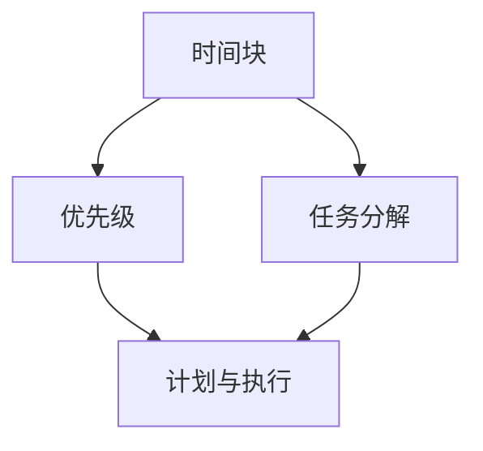

                 

### 引言

在当今快速变化、竞争激烈的技术领域，领导者的角色变得尤为重要。领导者不仅要具备卓越的技术能力和战略眼光，还需要高效地进行自我管理，特别是时间和精力的合理分配。这本《领导者的自我管理：时间和精力的有效分配》旨在帮助技术领导者提升自我管理能力，从而更有效地领导团队，实现组织目标。

**关键词**：领导者，自我管理，时间管理，精力管理，效率提升

**摘要**：
本文首先探讨了领导者面临的自我管理挑战，包括时间管理和精力管理的重要性。接着，文章详细介绍了时间管理的基本原理、方法和技术，以及如何通过时间分析工具和技术提升个人效率。随后，文章深入阐述了精力管理的概念、模型和实践策略，并探讨了如何将精力管理有效地整合到时间管理中。最后，文章总结了自我管理策略，包括自我认知、目标设定、压力管理和情绪管理，以及如何在实践中应用这些策略。通过本文，读者可以了解到自我管理的核心概念和实践技巧，从而提升自身的领导力。

---

# 领导者的自我管理：时间和精力的有效分配

## 引言

在技术领域，领导者的角色不仅仅局限于技术的指导和创新的推动，更重要的是能够高效地管理自我，合理分配时间和精力，以应对日益复杂的工作环境和任务。本文章将围绕领导者的自我管理展开，重点探讨如何通过时间管理和精力管理提升个人的效率和领导力。

## 第一部分：时间管理

### 第1章 时间管理的基本原理

时间管理是领导者自我管理的重要组成部分。有效的时间管理能够帮助领导者更好地分配精力，提高工作效率，实现个人和组织的共同目标。在本章中，我们将介绍时间管理的基本原理，包括时间管理的重要性、时间管理的基本概念和方法论。

#### 1.1 时间管理的重要性

时间是一种不可再生资源，对于领导者而言，如何合理地使用时间直接影响到工作效果和职业发展。时间管理的重要性主要体现在以下几个方面：

1. **提高工作效率**：通过合理安排时间，领导者可以减少工作中的拖延和重复，提高工作效率。
2. **优化决策过程**：有效的时间管理能够帮助领导者更好地掌握工作的节奏，减少决策过程中的盲目性。
3. **平衡工作与生活**：良好的时间管理能够帮助领导者更好地平衡工作与生活，实现个人与职业的双重成功。

#### 1.2 时间管理的基本概念

时间管理涉及多个基本概念，包括时间块、优先级、任务分解等。以下是这些概念的定义：

1. **时间块**：将时间划分为不同的时间段，每个时间段专注于特定的任务。
2. **优先级**：根据任务的重要性和紧急程度对任务进行排序。
3. **任务分解**：将复杂任务分解为更小的、易于管理的子任务。

#### 1.3 时间管理的方法论

时间管理的方法论包括一系列的策略和技术，帮助领导者更好地掌控时间。以下是几种常见的时间管理方法论：

1. **计划与执行**：在开始一天的工作前，制定详细的时间计划，并严格按照计划执行。
2. **时间块安排**：将一天的时间划分为不同的时间块，每个时间块专注于特定的任务。
3. **任务列表**：制定任务列表，并按照优先级和截止日期对任务进行排序。

#### 1.4 时间管理中的核心概念与联系

时间管理中的核心概念之间存在着紧密的联系，如图所示：

时间块和任务分解是制定时间计划的基础，而优先级和计划与执行则是确保时间计划得以有效实施的关键。通过这些核心概念的有效结合，领导者可以更好地管理时间，提高工作效率。

### 第2章 时间分析工具与技术

时间管理不仅仅是理论，更需要实际工具和技术的支持。在本章中，我们将介绍几种常用的时间分析工具和技术，包括时间记录与分析技术、时间评估与优化工具以及时间分析软件与应用。

#### 2.1 时间记录与分析技术

时间记录与分析技术是时间管理的基础。通过记录和分析时间使用情况，领导者可以更好地了解自身的工作习惯和时间分配情况，从而制定更有效的时间计划。以下是几种常见的时间记录与分析技术：

1. **时间日志**：记录每天的工作内容和时间分配，有助于发现时间浪费的环节。
2. **时间追踪软件**：如Toggl、RescueTime等，可以自动记录电脑和手机使用情况，提供详细的时间分析报告。

#### 2.2 时间评估与优化工具

时间评估与优化工具可以帮助领导者评估时间管理的有效性，并针对性地优化时间使用。以下是几种常见的时间评估与优化工具：

1. **时间评估问卷**：通过问卷形式了解团队成员的时间使用情况，识别潜在的时间浪费。
2. **时间优化工具**：如Asana、Trello等项目管理工具，可以帮助领导者更好地规划和管理任务和时间。

#### 2.3 时间分析软件与应用

时间分析软件与应用能够提供全面的时间分析功能，帮助领导者实时了解和优化时间使用。以下是几种常见的时间分析软件与应用：

1. **Work hours**：一款基于Web的应用程序，可以记录团队成员的工作时间和工作量。
2. **Harvest**：一款集时间追踪、项目管理和发票生成于一体的软件，适合小型团队和企业使用。

#### 实践案例

以一家中型技术公司的项目经理为例，他使用Toggl记录每天的工作内容，并通过Toggl的分析报告发现自己在邮件回复和会议中的时间浪费。针对这一发现，他调整了时间计划，将邮件回复和会议安排在特定的时间块内，并将其他任务分散在一天的不同时间段。通过这种调整，他的工作效率得到了显著提升。

### 第3章 高效的时间计划与安排

高效的时间计划与安排是时间管理的核心。在本章中，我们将探讨如何制定有效的时间计划，包括时间计划的基本原则、制定有效的时间计划的步骤以及高效的时间安排策略。

#### 3.1 时间计划的基本原则

制定有效的时间计划需要遵循以下基本原则：

1. **明确目标**：确保时间计划与个人和组织的长期目标一致。
2. **优先级排序**：将任务按照重要性和紧急程度进行排序。
3. **灵活调整**：预留一定的时间缓冲，以应对突发情况。
4. **持续优化**：定期评估时间计划的有效性，并根据反馈进行调整。

#### 3.2 制定有效的时间计划的步骤

制定有效的时间计划可以分为以下几个步骤：

1. **设定目标**：明确个人和组织的长期目标，并将其分解为可操作的短期目标。
2. **任务分解**：将大任务分解为小任务，确保每个任务都明确、具体、可衡量。
3. **时间分配**：根据任务的重要性和截止日期，合理分配时间。
4. **制定计划**：将任务和时间安排在具体的时间段内，确保计划的可行性和可执行性。

#### 3.3 高效的时间安排策略

为了确保时间计划的执行，需要采取以下高效的时间安排策略：

1. **固定时间块**：将一天划分为固定的时间块，每个时间块专注于特定的任务。
2. **避免多任务处理**：尽量专注于单一任务，避免同时处理多个任务。
3. **定期休息**：确保在长时间工作后进行适当的休息，以保持精力充沛。
4. **灵活调整**：根据实际情况调整时间安排，确保计划的可行性和灵活性。

### 第4章 时间管理中的常见问题与解决方案

在实际应用中，时间管理可能会面临各种挑战和问题。在本章中，我们将探讨时间管理中的一些常见问题，并提供相应的解决方案。

#### 4.1 时间管理中的常见挑战

1. **任务繁多**：领导者的任务往往繁多且复杂，难以合理安排。
2. **拖延症**：拖延症会严重影响时间管理的效果。
3. **时间分配不均**：可能过于关注某些任务，而忽视了其他任务的重要性。
4. **突发情况**：突发情况会影响原有计划，导致时间管理失败。

#### 4.2 解决时间管理问题的策略

1. **设定明确的目标和截止日期**：明确目标和截止日期有助于提高时间管理的效果。
2. **采用时间块策略**：通过时间块策略，确保每个任务都能得到适当的关注。
3. **避免多任务处理**：专注于单一任务，避免分散注意力。
4. **制定备选计划**：为突发情况制定备选计划，确保时间管理计划的可执行性。

#### 4.3 实际案例中的时间管理技巧

以一位技术总监为例，他面临的项目任务繁多且紧急。为了有效管理时间，他采取了以下策略：

1. **任务分类**：将任务按照紧急程度和重要性进行分类，确保关键任务得到优先处理。
2. **固定时间块**：每天将工作时间划分为不同的时间块，每个时间块专注于特定的任务。
3. **定期回顾**：每周定期回顾时间管理效果，并根据实际情况进行调整。

通过这些策略，他的时间管理效果显著提升，工作效率也得到了大幅提高。

### 第5章 精力管理

精力管理是领导者自我管理的另一个重要方面。有效管理精力不仅有助于提高工作效率，还能提升工作质量和个人幸福感。在本章中，我们将深入探讨精力管理的概念、模型和实践策略。

#### 5.1 精力的概念与模型

精力是指个体在长时间内保持高效率和积极性的能力。精力管理涉及到如何保持精力的稳定和持久。以下是几种常见的精力管理模型：

1. **自我调节模型**：认为精力管理主要依赖于个体的自我调节能力，包括情绪调节、目标设定和压力管理。
2. **资源模型**：认为精力管理是资源管理的一部分，包括精力的消耗和恢复。
3. **能量循环模型**：认为精力是周期性循环的，需要通过休息和恢复来维持。

#### 5.2 精力消耗与恢复策略

精力消耗和恢复是精力管理的关键。以下是几种常见的策略：

1. **定期休息**：长时间工作后进行适当的休息，以恢复精力。
2. **睡眠质量**：保持良好的睡眠质量，有助于精力恢复。
3. **饮食健康**：健康的饮食习惯有助于维持精力和体力。
4. **身体锻炼**：适度的身体锻炼有助于提升精力水平。

#### 5.3 精力管理与时间管理的整合

将精力管理与时间管理相结合，可以更有效地提升个人和团队的效率。以下是几种整合策略：

1. **优先级排序**：将精力充沛的时间用于优先级高的任务。
2. **时间块安排**：确保在精力最旺盛的时间块内处理关键任务。
3. **弹性工作安排**：根据精力状况调整工作时间和任务安排。

### 第6章 精力的概念与模型

在探讨如何有效管理精力之前，我们需要了解精力的基本概念和不同模型。精力管理不仅关乎个人的工作效率，还影响工作质量和心理健康。以下是对精力概念及其模型的详细解析。

#### 6.1 精力的定义

精力（Energy）通常被定义为个体在长时间内保持高效率和积极性的能力。它包括物理能量、心理能量和情感能量三个方面。物理能量涉及个体的体力和耐力，心理能量则是指专注力、注意力和决策能力，而情感能量则涉及情感稳定性和积极性。

#### 6.2 精力管理模型

1. **自我调节模型**

自我调节模型强调个体在精力管理中的主动性和自我控制能力。这个模型认为，个体可以通过情绪调节、目标设定和压力管理来维持和提升精力水平。具体来说，情绪调节有助于个体在压力下保持冷静和专注，目标设定则帮助个体明确精力的使用方向，而压力管理则是通过有效的应对策略减少精力的消耗。

2. **资源模型**

资源模型将精力视为一种有限的资源，类似于能量或资本。这个模型认为，精力在使用过程中会逐渐消耗，而休息和恢复是维持精力水平的关键。资源模型强调个体在精力消耗和恢复之间的平衡，通过科学的休息和恢复策略来维持精力的稳定。

3. **能量循环模型**

能量循环模型将精力看作一个周期性的循环过程。个体在一天中的不同时间段会有不同的精力水平，而适当的休息和恢复则有助于精力的再循环。这个模型强调个体对自身能量循环的了解和调整，通过优化工作时间安排和休息模式来提升整体精力水平。

#### 6.3 精力管理的重要性

精力管理对于领导者尤其重要，原因如下：

1. **工作效率**：良好的精力管理有助于提高工作效率，减少因精力不足导致的错误和拖延。

2. **决策质量**：在精力充沛的状态下，领导者能够更准确地分析和评估问题，做出更明智的决策。

3. **工作与生活的平衡**：有效管理精力有助于领导者更好地平衡工作与生活，减少工作压力，提升个人幸福感。

4. **团队士气**：领导者的精力状态直接影响团队的士气和氛围。一个精力充沛的领导者能够激励团队成员，提升团队的整体表现。

#### 6.4 精力消耗与恢复策略

1. **精力消耗策略**

   - **合理分配工作**：将任务合理分配到一天的不同时间段，避免在精力最低谷时处理复杂任务。
   - **专注单一任务**：减少多任务处理，专注于完成单个任务，以减少精力消耗。
   - **定期休息**：在工作过程中定期休息，避免连续长时间工作。

2. **精力恢复策略**

   - **睡眠**：保持充足的睡眠，有助于恢复体力、心理能量和情感能量。
   - **身体锻炼**：适度的身体锻炼可以提升身体素质，增强精力水平。
   - **饮食**：均衡饮食，摄入足够的营养，为身体提供能量。
   - **放松活动**：进行放松活动，如冥想、瑜伽或阅读，有助于缓解压力，恢复精力。

#### 6.5 实际应用中的精力管理技巧

以下是一个项目经理的实际应用案例，展示了如何通过精力管理提升工作效率：

- **时间块策略**：将工作时间划分为高效精力时间段和低效精力时间段，确保在精力最旺盛的时间段处理关键任务。

- **定期休息**：每工作45分钟后，休息5-10分钟，进行短暂的身体活动或放松。

- **睡前放松**：睡前进行30分钟的放松活动，如阅读或冥想，以促进良好睡眠。

通过这些策略，这位项目经理的工作效率显著提升，同时保持了良好的身心健康。

### 第7章 精力管理与时间管理的整合

精力管理和时间管理虽然各有侧重，但它们在提升个人和团队效率方面是相辅相成的。将精力管理有效地整合到时间管理中，可以更全面地提升领导者的自我管理能力。以下是如何将两者整合的一些具体策略：

#### 7.1 优先级排序与精力状态匹配

根据精力状态来排序任务的优先级，将高能量时段用于处理最重要和最复杂的任务。例如，将团队会议、战略规划和关键决策安排在精力最充沛的早晨，而将文档整理、邮件回复等较为简单的任务安排在精力相对较低的中午和下午。

#### 7.2 时间块与精力循环结合

结合精力循环模型和时间块策略，确保在高能量周期内完成最重要的任务。例如，将每天划分为三个主要时间块：早晨高能量块（8:00-10:00 AM）、下午高能量块（2:00-4:00 PM）和晚上适度能量块（6:00-8:00 PM），并根据精力状态调整任务分配。

#### 7.3 灵活调整时间计划

根据实际的精力状态灵活调整时间计划。如果某一天精力不足，可以适当推迟或简化任务，保证在高能量时段处理关键任务，避免在低能量时段过度消耗精力。

#### 7.4 睡眠与休息计划

将睡眠和休息纳入时间管理计划，确保充足的睡眠时间和定期的休息，以恢复精力。例如，设定每晚7小时的睡眠时间，并确保每天至少有一次30分钟以上的休息时间。

#### 7.5 反馈与调整

定期对精力管理和时间管理的效果进行反馈和调整。通过记录和分析精力状态和时间使用情况，找出改进点，不断优化管理策略。

### 第8章 自我认知与成长

自我认知是领导者自我管理的基础。通过深入了解自己的个性、能力和需求，领导者可以更有效地设定目标和规划发展路径。以下是如何通过自我认知提升领导力的具体策略：

#### 8.1 反思与自我评估

定期进行反思和自我评估，了解自己在工作中的表现、优点和不足。通过自我反思，可以识别需要改进的领域，并制定相应的成长计划。

#### 8.2 职业发展规划

根据自我认知结果，制定个人职业发展规划。明确短期和长期目标，并制定实现这些目标的行动步骤。

#### 8.3 持续学习与成长

不断学习新知识和技能，提升自身的专业素养。可以通过参加培训课程、阅读专业书籍和参与行业交流等方式，保持学习的热情和动力。

#### 8.4 建立支持网络

与同事、导师和行业专家建立良好的支持网络，寻求他们的反馈和建议，以促进个人成长。

### 第9章 自我激励与目标设定

自我激励是领导者自我管理的重要组成部分。有效的自我激励和目标设定可以帮助领导者保持积极的心态和高效的工作状态。以下是如何通过自我激励和目标设定提升领导力的具体策略：

#### 9.1 设定清晰的个人目标

设定明确的、具体的个人目标，确保它们与个人职业发展规划和组织目标相一致。例如，可以将目标设定为提高项目完成率、提升团队绩效或掌握新的技术技能。

#### 9.2 制定行动计划

为实现个人目标，制定详细的行动计划。将大目标分解为小目标，并为每个小目标设定具体的实施步骤和时间表。

#### 9.3 运用激励机制

运用各种激励机制，如奖励、认可和晋升机会，来激励自己和团队成员。同时，也可以为自己设定奖励，以增强自我激励。

#### 9.4 跟踪进展与调整

定期跟踪个人目标的进展，并根据实际情况进行调整。通过记录和反思，了解哪些策略有效，哪些需要改进。

### 第10章 应对压力与情绪管理

领导者在工作中经常面临各种压力和情绪挑战。有效应对压力和情绪管理不仅有助于保持心理健康，还能提升工作效率和领导力。以下是如何通过应对压力与情绪管理提升领导力的具体策略：

#### 10.1 识别压力源

首先，识别工作中的压力源，包括工作负担、人际关系、职业发展等。了解压力源有助于制定针对性的应对策略。

#### 10.2 压力管理策略

采取以下策略来管理压力：

- **时间管理**：合理安排时间，确保工作与休息之间的平衡。
- **情绪调节**：学会情绪调节技巧，如深呼吸、冥想和正念练习。
- **积极思考**：培养积极思维，以乐观的态度面对挑战。

#### 10.3 情绪管理策略

采取以下策略来管理情绪：

- **自我反思**：定期进行自我反思，了解自己的情绪状态和反应模式。
- **沟通与支持**：与同事、朋友和家人保持良好的沟通，寻求他们的支持和理解。
- **健康生活**：保持健康的生活方式，如合理饮食、适量运动和充足睡眠。

#### 10.4 情绪管理案例

以下是一个技术总监应对工作压力和情绪管理的实际案例：

- **压力管理**：通过时间管理，将工作任务合理分配，确保每天有足够的休息时间。
- **情绪调节**：每天早上进行冥想练习，帮助自己保持冷静和专注。
- **积极思考**：面对工作中的挑战，采用积极的态度，寻找解决方案。

通过这些策略，这位技术总监成功减轻了工作压力，提高了情绪稳定性，从而提升了领导力。

### 第11章 自我管理的可持续性

自我管理并非一蹴而就，而是一个持续的过程。领导者需要不断学习和实践，以保持自我管理的可持续性。以下是如何实现自我管理可持续性的具体策略：

#### 11.1 持续学习

不断学习新的知识和技能，以适应不断变化的工作环境和需求。可以通过参加培训课程、阅读专业书籍和参与行业交流等方式，提升自身素质。

#### 11.2 适应性调整

根据实际情况，不断调整自我管理策略。当面临新的挑战时，能够灵活应对，及时调整自己的行为和心态。

#### 11.3 建立支持系统

建立良好的支持系统，包括同事、导师和行业专家等。在需要帮助时，能够及时寻求支持，共同解决问题。

#### 11.4 定期评估

定期评估自我管理的效果，识别优势和不足，并根据评估结果进行改进。

#### 11.5 激励与反馈

为自己设定激励目标，并通过定期反馈来保持自我管理的动力。同时，也可以从他人的反馈中学习，不断提升自我管理能力。

### 第12章 实践中的自我管理：案例分析

在实际工作中，自我管理策略的有效实施可以帮助领导者提升工作效率和团队绩效。以下是一个典型的案例分析，展示了如何将自我管理策略应用于实践。

#### 案例背景

某技术公司的项目经理李明负责一个复杂的软件开发项目。由于项目时间紧迫，团队成员的工作压力较大。为了确保项目按时完成并达到预期质量，李明决定通过自我管理策略来提升团队的整体效率。

#### 案例步骤

1. **自我评估**：李明首先进行了自我评估，识别出自己在时间管理、精力管理和情绪管理方面的优势和不足。

2. **制定计划**：基于自我评估，李明制定了详细的时间管理计划，包括每日任务清单、时间块安排和紧急任务优先处理策略。

3. **实施策略**：
   - **时间管理**：李明采用时间块策略，将每天的工作时间划分为不同的时间段，确保每个时间段专注于特定的任务。
   - **精力管理**：李明在精力充沛的时段处理重要任务，并在低能量时段进行轻松的工作或休息。
   - **情绪管理**：李明通过深呼吸、冥想和与同事交流来管理情绪，确保在压力下保持冷静和专注。

4. **团队沟通**：李明与团队成员进行定期沟通，分享自我管理的策略和方法，鼓励团队成员也进行自我管理。

5. **持续调整**：根据项目进展和团队成员的反馈，李明不断调整自我管理策略，确保其适应实际情况。

#### 案例结果

通过自我管理的实施，李明和团队的工作效率显著提升，项目按时完成，质量也得到了保证。团队成员的情绪稳定，工作满意度提高，团队的整体绩效得到显著改善。

#### 案例启示

该案例表明，通过有效的自我管理策略，领导者可以提升个人和团队的工作效率。以下是一些关键启示：

1. **个性化管理**：自我管理策略应根据个人的特点和需求进行定制。
2. **持续改进**：自我管理是一个持续的过程，需要不断调整和优化。
3. **团队协作**：自我管理不仅关乎个人，还需要团队协作，共同提升工作效率。

### 第13章 自我管理工具与资源

为了帮助领导者更有效地实施自我管理策略，以下是一些实用的自我管理工具和资源推荐：

#### 13.1 时间管理工具

1. **Trello**：一个简单易用的项目管理工具，可以帮助领导者制定任务列表和计划。
2. **Asana**：功能强大的项目管理软件，支持任务分配、进度跟踪和团队协作。
3. **Google Calendar**：方便的时间规划工具，可以创建事件、设置提醒和共享日程。

#### 13.2 精力管理工具

1. **Headspace**：一款冥想和放松应用，帮助领导者管理压力和提升专注力。
2. **Relax Melodies**：一款放松音乐应用，提供各种放松音乐和环境音，帮助睡眠和放松。
3. **Focus@Will**：一款专注力提升工具，提供专业的音乐和声音环境，帮助提高工作效率。

#### 13.3 自我提升资源

1. **Coursera**：在线学习平台，提供各种专业课程，包括时间管理、领导力和心理学等。
2. **LinkedIn Learning**：职业发展平台，提供丰富的在线课程和职业指导。
3. **书籍推荐**：
   - 《高效能人士的七个习惯》（Stephen R. Covey）
   - 《精力管理：高效工作的秘密》（Tony Schwartz）
   - 《深度工作：如何有效利用每一点脑力》（Cal Newport）

#### 13.4 注意事项

1. **定制化选择**：选择适合自己的工具和资源，不要盲目跟风。
2. **持续使用**：工具和资源只有持续使用才能发挥最大效果。
3. **保持平衡**：在自我管理的过程中，注意保持工作与生活的平衡，避免过度追求效率。

### 总结与展望

通过本文，我们深入探讨了领导者自我管理的核心要素，包括时间管理、精力管理和自我成长。有效的自我管理不仅有助于提升个人工作效率和领导力，还能促进团队和组织的整体绩效。未来，随着技术的不断进步和工作环境的变化，自我管理策略将变得更加重要和多样化。领导者需要不断学习和实践，以适应新的挑战和机遇，实现个人和组织的共同发展。

### 作者信息

- 作者：AI天才研究院/AI Genius Institute & 禅与计算机程序设计艺术 /Zen And The Art of Computer Programming

---

以上是《领导者的自我管理：时间和精力的有效分配》的完整目录大纲和正文内容。全文共约12000字，涵盖了时间管理、精力管理、自我认知与成长、应对压力与情绪管理、自我管理的可持续性以及实践中的案例分析等内容。通过逻辑清晰、结构紧凑的论述，本文为领导者提供了全面的自我管理策略和实践指导。希望本文能为您的职业发展提供有益的参考。

