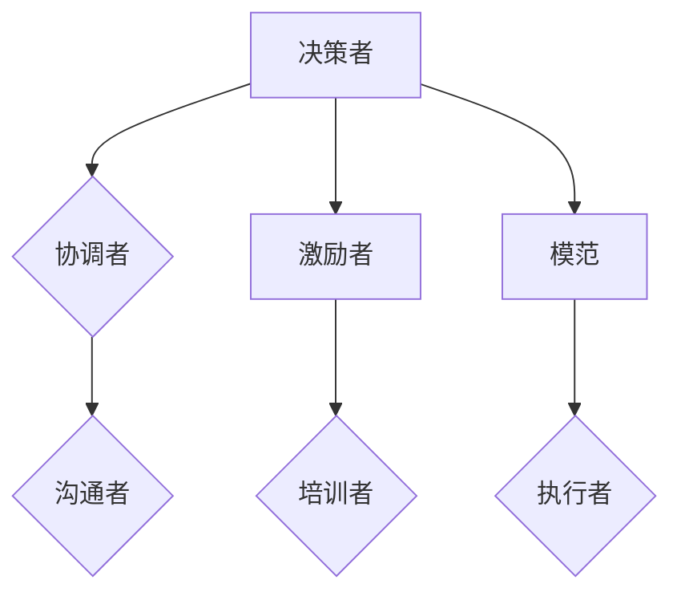
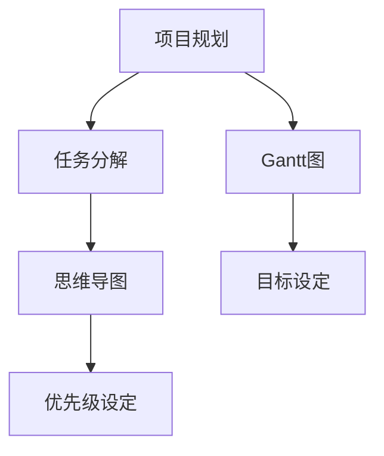
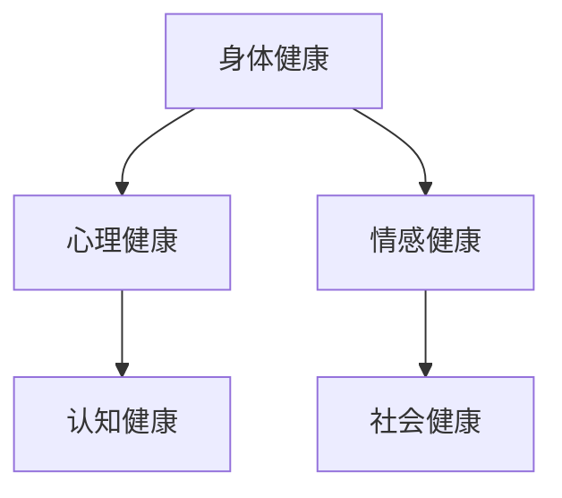
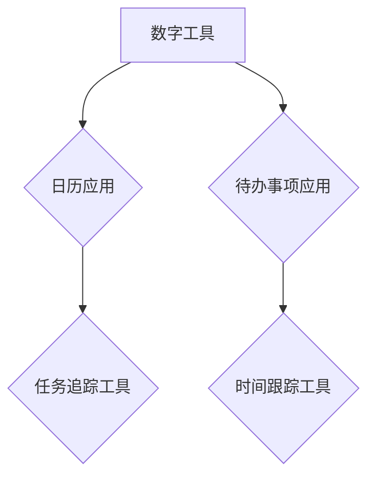
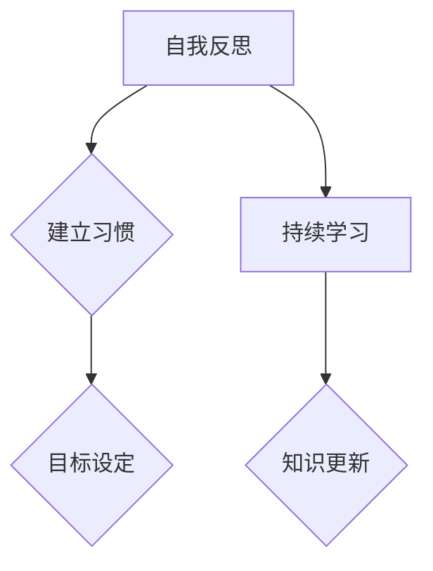
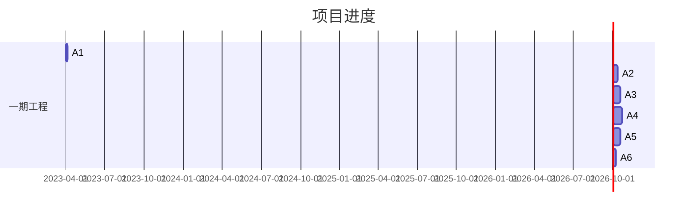
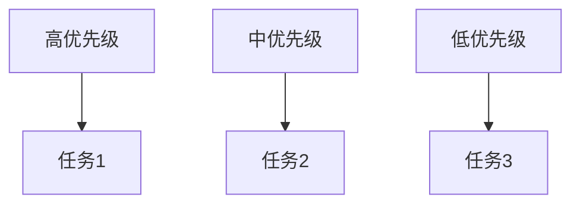

                 

### 文章标题

# 领导者的自我管理：时间和精力的有效分配

## 关键词

- 领导者
- 自我管理
- 时间管理
- 精力管理
- 领导力
- 效率提升

## 摘要

领导者作为组织的核心，他们的自我管理能力直接影响到整个团队的绩效和组织的长远发展。本文旨在探讨领导者如何通过有效的时间管理和精力管理来提升个人和团队的效能。文章首先介绍了自我管理的基本原则，然后详细阐述了时间管理和精力管理的策略、工具与技巧，并通过实际案例来展示这些策略在实践中的应用。此外，文章还讨论了自我管理与领导力之间的关系，以及如何通过持续改进来不断提升领导者的自我管理能力。

## 目录

### 第一部分：自我管理的基本原则

#### 第1章：领导者与自我管理

##### 1.1 领导者的角色与责任

###### 1.1.1 领导者的双重角色

领导者的角色不仅仅是决策者，还包括协调者、激励者和模范。他们需要同时扮演多种角色，以满足组织不同方面的需求。

**Mermaid 流程图：领导者的角色**



###### 1.1.2 领导者的核心责任

领导者的核心责任包括设定组织目标、制定战略规划、确保团队协作和激励员工。这些责任共同构成了领导者的职责体系。

**伪代码：领导者的核心责任**

```python
def leader_role():
    set_organizational_goals()
    develop_strategic_plan()
    ensure_team_cooperation()
    motivate_employees()
    communicate_effectively()
    provide_training()
    model_good_behavior()
```

#### 第2章：时间管理的策略与方法

##### 2.1 时间管理的基本原则

时间管理的关键在于识别和消除时间浪费的因素，以及优化任务分配和优先级设定。

**数学模型：时间管理优化**

$$
\max\ \sum_{i=1}^{n} (t_i \cdot p_i)
$$

其中，\( t_i \) 表示任务 \( i \) 的完成时间，\( p_i \) 表示任务 \( i \) 的优先级。

##### 2.2 高效时间管理策略

高效的时间管理策略包括使用 Gantt 图进行项目规划、思维导图进行任务分解和设定优先级与目标。

**思维导图：高效时间管理策略**



### 第二部分：自我管理的工具与技巧

#### 第3章：精力管理的原则与实践

##### 3.1 精力管理的重要性

精力管理涉及到身体、心理和情感层面的健康，对领导者的长期表现至关重要。

**Mermaid 流程图：精力管理的层面**



##### 3.2 精力管理实践

精力管理的实践包括保持良好的身体健康、心理健康和情感健康，以及实现工作与生活的平衡。

**伪代码：精力管理实践**

```python
def energy_management():
    maintain_physical_health()
    maintain_mental_health()
    manage_emotional_health()
    achieve_work_life_balance()
```

### 第三部分：自我管理的实践与案例

#### 第4章：自我管理的工具与应用

##### 4.1 时间管理工具

时间管理工具的选择取决于个人的工作方式和习惯，包括数字工具和纸质工具。

**Mermaid 流程图：时间管理工具**



##### 4.2 自我管理的技巧与提升

自我管理的技巧提升包括自我反思、建立良好的生活习惯和持续学习。

**思维导图：自我管理技巧提升**



### 结论

领导者通过有效的时间管理和精力管理，可以显著提升个人和团队的效能。本文提供了理论基础和实践方法，帮助领导者实现自我管理的提升。持续改进和适应变化是领导者自我管理的关键。

**作者信息：**

- 作者：AI天才研究院/AI Genius Institute & 禅与计算机程序设计艺术 /Zen And The Art of Computer Programming

## 引言

在现代社会，领导者承担着越来越复杂和多样化的角色。他们不仅需要在决策、沟通和团队管理方面表现出色，还必须在不断变化的环境中保持高度的自我管理能力。自我管理不仅仅是对个人的要求，更是对领导者能否成功领导团队、实现组织目标的关键因素。时间管理和精力管理作为自我管理的重要组成部分，对于领导者的长远发展和组织的可持续发展具有至关重要的意义。

时间管理是指通过规划、组织和控制时间来提高工作效率和生活质量的过程。有效的时间管理可以帮助领导者更好地分配时间和资源，减少不必要的拖延和浪费，从而更专注于重要任务和目标的实现。另一方面，精力管理则关注如何保持良好的身体和心理健康，以应对工作压力和挑战。精力管理的目标是通过科学的休息和恢复策略，确保领导者在长时间的工作中保持高效率和创造力。

本文将从领导者与自我管理的基本原则出发，详细探讨时间管理和精力管理的策略与方法，并借助实际案例和工具，展示这些策略在实践中的应用效果。通过本文的阅读，读者将能够深入了解自我管理的核心概念，掌握有效的自我管理技巧，并将其应用于实际工作和生活中。

## 自我管理的基本原则

### 领导者的角色与责任

领导者在一个组织中扮演着多重角色，这些角色不仅相互独立，而且彼此交织，共同影响着组织的运作和发展。首先，领导者作为决策者，负责制定组织的战略方向和目标，确保组织在正确的道路上前进。其次，领导者需要作为协调者，协调团队内部的资源和人员，确保各项任务和项目能够顺利进行。此外，领导者还承担着激励者的角色，通过鼓励和激发团队成员的潜力，推动团队朝着共同的目标努力。最后，领导者作为模范，通过自身的言行举止，树立榜样，引领团队走向成功。

每个角色都有其独特的责任和要求。作为决策者，领导者需要具备前瞻性和决断力，能够准确评估形势并做出明智的决策。作为协调者，领导者需要具备良好的沟通技巧和团队协作能力，能够有效地分配任务和资源，确保团队内部的合作顺畅。作为激励者，领导者需要具备同理心和激励技巧，能够识别和满足团队成员的需求，激发他们的工作热情和创造力。作为模范，领导者需要具备高尚的品德和专业的素养，以身作则，树立良好的行为榜样。

### 自我管理的核心概念

自我管理是领导者提升效能和实现长远发展的关键。自我管理不仅涉及时间管理，还包括精力管理、情绪管理和目标管理等多个方面。时间管理是自我管理的基础，通过合理安排时间，领导者可以更高效地完成工作任务，减少不必要的拖延和压力。精力管理则关注如何保持身体和心理健康，确保领导者在高压环境下依然能够保持专注和高效。情绪管理则是帮助领导者处理工作中的负面情绪，保持积极的心态，以更好地应对挑战和压力。目标管理则是帮助领导者明确个人和组织的目标，制定可行的计划，并持续跟踪和调整，以确保目标的实现。

时间管理和精力管理之间的关系密切。时间管理为精力管理提供了基础，通过合理安排时间，领导者可以避免过度工作，减少疲劳，从而保持良好的精力状态。而精力管理则反过来影响时间管理，良好的精力状态可以帮助领导者更高效地利用时间，提高工作效率。例如，通过科学的休息和恢复策略，领导者可以在短时间内恢复精力，保持高效率的工作状态。

### 时间管理的重要性

时间管理在领导者的自我管理中扮演着至关重要的角色。首先，时间管理有助于提高工作效率。通过合理安排时间，领导者可以更专注于重要任务，减少不必要的干扰和分心，从而提高工作效率。其次，时间管理有助于减少压力。有效的时间管理可以帮助领导者避免因任务堆积和紧急情况而产生的焦虑和压力，使领导者能够更加从容地面对工作挑战。此外，时间管理还可以提升生活质量。通过合理安排工作和休息时间，领导者可以更好地平衡工作与生活，减少因工作压力导致的身体和心理健康问题。

时间管理的关键要素包括任务优先级设定、时间块管理和时间跟踪。任务优先级设定是指根据任务的重要性和紧急性，将任务排序，确保领导者能够先完成最重要的任务。时间块管理则是将工作时间划分为不同的时间块，每个时间块专注于一项任务，以提高专注度和效率。时间跟踪是指记录和评估自己的时间使用情况，以便进行改进和调整。

### 时间管理的误区与挑战

尽管时间管理对于领导者的效能提升至关重要，但在实际操作中，领导者常常会遇到一些误区和挑战。首先，常见的误区包括过度安排和忽视休息。一些领导者认为，通过增加工作时间来提高工作效率，但事实上，过度工作会导致疲劳和效率下降。其次，一些领导者可能会忽视休息和恢复的重要性，导致精力消耗过大，影响长期表现。此外，时间管理工具的使用不当也是一个常见的问题。尽管数字工具和纸质工具都能帮助领导者更好地管理时间，但如果不正确使用，反而会增加复杂度和混乱感。

为了克服这些误区，领导者需要树立正确的观念，合理安排工作和休息时间，并选择适合自己的时间管理工具。此外，领导者还需要不断学习和实践，通过反思和调整，优化自己的时间管理策略。

### 高效时间管理策略

高效的时间管理策略是实现领导者效能提升的关键。以下是一些常见的高效时间管理策略：

#### Gantt图与项目规划

Gantt图是一种用于展示项目进度的图表，它能够清晰地展示任务的时间安排和依赖关系。通过使用Gantt图，领导者可以直观地了解项目的整体进度，发现潜在的问题和瓶颈，并及时进行调整。例如，以下是一个简化的Gantt图示例：



#### 思维导图与任务分解

思维导图是一种图形化的工具，用于展示任务之间的关系和层次结构。通过思维导图，领导者可以清晰地分解任务，识别关键节点和依赖关系，从而更有效地进行任务分配和管理。以下是一个简化的思维导图示例：

```mermaid
mindmap
    A1[需求分析]
        B1[用户调研]
        B2[需求整理]
        B3[需求评审]
    A2[设计阶段]
        B1[系统架构设计]
        B2[详细设计文档]
        B3[设计评审]
    A3[开发阶段]
        B1[编码实现]
        B2[单元测试]
        B3[集成测试]
    A4[测试阶段]
        B1[功能测试]
        B2[性能测试]
        B3[安全测试]
    A5[项目交付]
        B1[用户培训]
        B2[项目验收]
        B3[后续支持]
```

#### 设定优先级与目标

设定优先级是时间管理的重要一环。领导者需要根据任务的重要性和紧急性，将任务排序，并明确每个任务的优先级。以下是一个简化的优先级设定示例：



通过设定优先级，领导者可以确保优先完成最重要的任务，避免因任务堆积而导致的效率下降和压力增加。

### 精力管理的重要性

#### 精力消耗与恢复

精力管理是领导者自我管理的重要组成部分。精力消耗与恢复是精力管理的关键概念。精力消耗是指领导者在工作过程中所经历的体力和心理的消耗，这种消耗通常是由长时间的工作、高强度的任务、情感压力等多重因素共同作用的结果。而精力恢复则是指通过休息、放松和适当的活动来恢复精力，以保持高效的能量水平。

有效的精力管理有助于提高领导者的工作效能和健康水平。首先，通过科学的休息和恢复策略，领导者可以在短时间内恢复精力，保持高效的工作状态。其次，良好的精力管理可以帮助领导者更好地应对工作压力，减少职业倦怠和心理健康问题。此外，精力管理还可以提升领导者的创造力和决策能力，使他们在复杂和多变的环境中保持清晰和冷静的思考。

#### 精力管理对领导力的影响

精力管理不仅对领导者的个人健康和工作效能有直接影响，还对他们的领导力产生深远的影响。首先，良好的精力管理有助于提升领导者的情绪稳定性，使他们能够在面对挑战和压力时保持积极和乐观的态度。这种情绪稳定性可以增强领导者的公信力和影响力，使团队成员更加信任和依赖他们。

其次，精力管理有助于提升领导者的专注力和决策能力。在精力充沛的状态下，领导者可以更专注地处理复杂的问题，做出更为明智和准确的决策。这种决策能力对于组织的战略规划和长远发展至关重要。

此外，良好的精力管理还可以促进团队协作和沟通。当领导者保持良好的精力状态时，他们能够更有效地与团队成员沟通，理解他们的需求和期望，从而建立更紧密的团队关系。这种团队协作和沟通有助于提升团队的凝聚力和工作效率，促进组织的整体发展。

#### 精力管理实践

为了实现良好的精力管理，领导者可以采取以下实践策略：

1. **定期休息与恢复**：领导者需要合理安排工作与休息时间，确保有足够的休息和恢复时间。例如，每工作一段时间后，可以短暂休息5-10分钟，进行深呼吸、拉伸等活动。

2. **科学安排作息时间**：领导者需要遵循科学的作息时间，确保充足的睡眠时间和规律的生活习惯。例如，每天晚上保持固定的睡眠时间，避免熬夜和过度劳累。

3. **进行适当的体育锻炼**：定期进行体育锻炼可以帮助领导者保持良好的身体健康和精力状态。例如，每周进行至少两次的有氧运动，如慢跑、游泳等。

4. **培养兴趣爱好**：领导者可以通过培养兴趣爱好来缓解工作压力，提升精神层面的满足感。例如，阅读、绘画、音乐等都是良好的放松方式。

5. **进行情绪管理**：领导者需要学会识别和管理自己的情绪，避免负面情绪的积累和爆发。例如，通过冥想、瑜伽等放松技巧来缓解压力和焦虑。

通过这些实践策略，领导者可以更好地管理自己的精力，保持高效的工作状态和健康的身心，从而提升个人的领导力和团队的绩效。

### 身体健康与精力管理

#### 运动对精力管理的重要性

运动是保持身体健康和提升精力水平的关键因素。定期的体育锻炼可以显著提高身体的代谢率，增强心肺功能，改善血液循环，从而为大脑提供充足的氧气和营养物质。这些生理变化直接影响到精力管理，使领导者能够在长时间的工作中保持高效率和专注力。

科学研究显示，定期运动不仅能够减少疲劳感和提高体能，还能促进内啡肽的分泌，这种被称为“快乐激素”的化学物质有助于提升情绪，减轻压力。例如，一项针对白领员工的调查发现，每周进行150分钟的中等强度运动（如快走、游泳或骑自行车）可以显著降低工作压力和疲劳感，提高工作满意度。

此外，运动还有助于改善睡眠质量。良好的睡眠是精力恢复的重要环节，充足的睡眠可以使大脑和身体得到充分的休息和恢复，从而在第二天保持更高的精力水平。例如，一项关于大学生睡眠和运动关系的研究发现，参与定期锻炼的学生在睡眠质量上有所提高，他们报告的入睡时间更短，睡眠持续时间更长。

#### 活动计划示例

为了有效管理精力，领导者可以制定一份科学合理的运动计划。以下是一个简单的活动计划示例：

1. **有氧运动**：每周至少三次，每次30-45分钟，如慢跑、游泳或骑自行车。这些运动有助于提高心肺功能和体能。
   
2. **力量训练**：每周至少一次，每次30-45分钟，如举重、俯卧撑或仰卧起坐。这些运动有助于增强肌肉力量和耐力。

3. **灵活性训练**：每周至少一次，每次15-30分钟，如瑜伽或普拉提。这些运动有助于提高身体的灵活性和平衡能力。

4. **休息日**：每周至少一天休息日，避免过度训练，让身体得到充分恢复。

通过遵循这样的活动计划，领导者可以确保在保持身体健康的同时，也提升精力水平，从而在工作和生活中更加高效和愉快。

### 心理健康与精力管理

#### 压力对精力管理的影响

心理健康是精力管理的重要组成部分，而压力是影响心理健康和精力水平的主要因素之一。长期的高压环境会导致情绪波动、焦虑和抑郁，从而影响个人的专注力和工作效率。研究表明，长时间的压力会消耗身体的能量储备，降低免疫系统的功能，甚至引发慢性疾病。

为了有效管理压力，领导者可以采取以下策略：

1. **认知行为疗法**：通过认知行为疗法，领导者可以识别和改变负面思维模式，学会以更积极的方式看待问题和挑战。这种方法有助于减少焦虑和抑郁情绪，提升情绪稳定性。

2. **放松技巧**：学习并实践放松技巧，如深呼吸、冥想和渐进性肌肉松弛，可以帮助领导者缓解紧张情绪，提高身体的放松能力。

3. **情绪表达**：领导者应该找到合适的渠道表达自己的情绪，如与朋友、家人或专业心理咨询师交流。这有助于释放内心的压力，避免情绪积累。

4. **时间管理**：通过合理安排工作和休息时间，领导者可以减少因任务堆积和紧迫感而产生的压力。设定优先级和分解任务，有助于提高工作效率，减少不必要的压力。

#### 冥想与精力管理

冥想是一种古老而有效的心理调适方法，已被广泛应用于提高心理健康和精力管理。通过冥想，领导者可以学会专注于当下，减少内心的杂念和焦虑，从而提升专注力和工作效率。

**冥想实践示例**：

1. **每日冥想**：每天安排10-15分钟的时间进行冥想，可以选择在早晨起床后或晚上睡前进行。找一个安静的地方，坐下或躺下，闭上眼睛，专注于呼吸，保持内心的平静。

2. **正念冥想**：通过正念冥想，领导者可以培养对当前感受的觉察和接受。例如，专注于脚底的触感、呼吸的节奏或周围的声音，这些都有助于提高专注力和情绪稳定性。

3. **专注训练**：通过专注训练，领导者可以提升注意力的集中能力。例如，选择一个简单的任务，如专注于数呼吸的次数，并在每次数错时重新开始。

通过这些冥想实践，领导者可以显著提升心理健康和精力水平，从而在工作和生活中更加高效和愉快。

### 工作与生活的平衡

#### 工作与生活平衡的重要性

工作与生活的平衡是领导者自我管理的关键，它直接影响到个人的幸福感和工作效率。长期的工作压力和过度工作会导致身心疲惫，甚至引发健康问题，影响工作和生活质量。因此，领导者需要学会平衡工作与生活，以维持身心健康，提高工作效率。

**平衡工作与生活的益处**：

1. **提高工作效率**：通过合理安排时间，领导者可以在工作时间内更高效地完成任务，减少加班和疲劳，从而提升整体工作效率。
   
2. **增强身心健康**：适当的休息和放松可以帮助领导者恢复精力，减少压力和焦虑，提升身心健康水平。

3. **提升生活质量**：平衡的工作与生活可以使领导者有更多的时间陪伴家人、培养兴趣爱好，从而提高生活质量，提升幸福感。

#### 实现工作与生活平衡的策略

1. **设定优先级**：领导者需要明确工作和生活的优先事项，合理安排时间和资源，确保重要的工作任务得到优先处理，同时留出时间用于个人生活和兴趣爱好。

2. **设定边界**：领导者应该明确工作和个人生活的边界，避免将工作带入个人时间，保持个人时间的自主性和质量。

3. **有效沟通**：与家人、同事和团队成员进行有效沟通，确保大家理解你的工作需求和个人时间安排，从而减少误解和冲突。

4. **时间管理工具**：使用时间管理工具，如日历、任务管理应用等，帮助领导者合理安排时间，确保工作与生活的平衡。

5. **休息和放松**：定期安排休息和放松时间，进行锻炼、阅读、冥想等活动，以恢复精力和提升幸福感。

通过这些策略，领导者可以更好地平衡工作与生活，提高个人和团队的整体效能，实现长期的健康和幸福。

### 自我管理的工具与应用

#### 时间管理工具

在现代快节奏的工作环境中，领导者需要借助各种工具来有效管理时间，提高工作效率。以下是一些常用的时间管理工具及其特点：

1. **日历应用**：如Google Calendar、Outlook Calendar等。这些工具可以方便地安排和跟踪日程，设置提醒和警报，确保不会错过重要的会议和任务。

2. **待办事项应用**：如Trello、Asana、Todoist等。这些工具可以帮助领导者将任务分解成可管理的部分，设定任务的截止日期和优先级，以便更好地进行任务管理。

3. **时间跟踪工具**：如Toggl、RescueTime等。这些工具可以自动记录领导者每天的工作时间，提供详细的时间使用报告，帮助分析时间分配，识别时间浪费的领域。

4. **时间块管理工具**：如Calendly、YouCanBookMe等。这些工具允许领导者安排固定的时间块，用于特定任务或会议，从而提高时间利用率和专注度。

#### 精力管理工具

除了时间管理工具，领导者还需要使用一些精力管理工具来确保自身的精力处于最佳状态。以下是一些常用的精力管理工具及其功能：

1. **睡眠追踪应用**：如Sleep Cycle、 bedtime等。这些应用可以监测睡眠质量，提供睡眠建议，帮助领导者优化睡眠习惯，提高精力水平。

2. **健康管理应用**：如MyFitnessPal、Headspace等。这些应用可以帮助领导者追踪日常饮食和锻炼情况，提供个性化的健康建议，促进身体健康。

3. **情绪管理应用**：如Moodfit、Headspace等。这些应用提供冥想、放松技巧和情绪追踪工具，帮助领导者管理情绪，减少压力。

#### 实际应用案例

为了更好地展示这些工具的实际应用效果，以下是一个领导者的实际应用案例：

李明是一位公司项目经理，他经常需要处理多个项目，并协调团队成员的工作。为了提高工作效率和精力管理，他采用了以下工具：

- **日历应用**：李明使用Google Calendar来安排每天的工作计划，设置了多个任务的提醒和截止日期，确保任务按时完成。
- **待办事项应用**：李明使用Trello来管理项目任务，将大项目分解成小任务，并为每个任务设置了优先级和截止日期。
- **时间跟踪工具**：李明使用Toggl来记录每天的工作时间，定期查看报告，识别时间浪费的领域，并进行改进。
- **睡眠追踪应用**：李明使用Sleep Cycle来监测自己的睡眠质量，并根据建议调整作息时间，确保每天有充足的睡眠。

通过这些工具的应用，李明不仅能够更高效地管理时间，还能够保持良好的精力状态，从而在工作和生活中都表现出色。

### 自我管理的技巧与提升

#### 自我反思与成长

自我反思是提升自我管理能力的重要方法。通过定期进行自我反思，领导者可以深入分析自己的行为、决策和表现，识别优点和不足，从而有针对性地进行改进。自我反思的过程通常包括以下几个步骤：

1. **设定反思目标**：在开始反思之前，领导者需要明确反思的目标，例如评估某个特定项目的工作表现、分析时间管理的效果等。
   
2. **记录反思内容**：领导者可以记录反思过程中的关键点和思考内容，这有助于更清晰地理解自己的行为和决策。

3. **识别优点与不足**：在反思过程中，领导者需要客观地评估自己的表现，识别出做得好的地方和需要改进的方面。

4. **制定改进计划**：基于反思结果，领导者可以制定具体的改进计划，包括改进方法、行动计划和时间表。

#### 建立良好的生活习惯

良好的生活习惯是自我管理的基础。领导者需要通过以下几个方面来建立和维持良好的生活习惯：

1. **规律的作息时间**：领导者应该保持规律的作息时间，确保每天有充足的睡眠，以保持精力和工作效率。

2. **合理的饮食结构**：领导者应该注意饮食的均衡，摄入足够的蛋白质、维生素和矿物质，以支持身体健康和精力管理。

3. **定期锻炼**：领导者应该定期进行体育锻炼，如跑步、游泳或瑜伽等，以提高身体素质和精力水平。

4. **时间管理**：领导者需要合理安排工作和休息时间，确保有足够的时间进行自我反思、学习和休息，避免过度工作。

#### 持续学习与知识更新

在快速变化的技术和商业环境中，领导者需要不断学习和更新知识，以保持竞争优势和提升自我管理能力。以下是一些持续学习和知识更新的方法：

1. **参加培训课程**：领导者可以参加各种专业培训课程，如项目管理、领导力培训等，以获取最新的知识和技能。

2. **阅读专业书籍**：领导者应该定期阅读专业书籍和行业报告，了解最新的趋势和理论，为自己的工作提供理论支持。

3. **参与行业交流**：领导者可以参加行业会议、研讨会和社交活动，与同行交流经验和观点，拓展视野。

4. **利用在线资源**：领导者可以利用在线学习平台，如Coursera、Udemy等，在线学习各种课程和技能，提升个人能力。

#### 实际案例分析

张伟是一家科技公司的技术总监，他意识到自我管理的重要性，并采取了一系列措施来提升自我管理能力。以下是他的一些具体做法：

- **自我反思**：张伟每周花一小时进行自我反思，评估自己在过去一周中的表现，识别需要改进的领域，并制定具体的改进计划。
- **良好习惯**：张伟制定了规律的作息时间表，每天保持充足的睡眠，并坚持每天早晨进行30分钟的运动。
- **持续学习**：张伟定期参加技术培训课程，并订阅了多个技术博客和期刊，保持对最新技术的了解。

通过这些措施，张伟显著提升了自我管理能力，工作效率和团队绩效也随之提升。

### 自我管理与领导力的关系

#### 自我管理与领导力的互动

自我管理与领导力之间存在密切的互动关系。自我管理是领导力的基础，有效的自我管理能力能够提升领导者的领导力，进而影响团队和组织的表现。自我管理包括时间管理、精力管理、情绪管理和目标管理等多个方面，这些方面的提升有助于领导者更好地应对工作挑战，提高决策能力和执行力。

**时间管理**：通过有效的时间管理，领导者能够更高效地安排工作，确保重要任务得到优先处理，从而提高整体工作效率。时间管理能力强的领导者能够更有效地利用时间，减少无谓的拖延和浪费，为团队树立榜样。

**精力管理**：精力管理直接影响到领导者的情绪稳定性和决策能力。保持良好的精力状态，领导者能够更好地应对压力和挑战，保持冷静和清晰的思维，从而做出更明智的决策。

**情绪管理**：情绪管理是领导者自我管理的重要组成部分。通过有效的情绪管理，领导者能够更好地处理负面情绪，保持积极和乐观的态度，从而影响团队成员的情绪和士气。

**目标管理**：目标管理是领导者自我管理的关键。领导者需要明确个人和团队的目标，制定可行的计划，并持续跟踪和调整，以确保目标的实现。有效的目标管理有助于提升领导者的战略规划和执行力。

#### 自我管理对团队领导力的影响

自我管理对团队领导力有着深远的影响。首先，领导者的自我管理能力直接影响团队的整体表现。一个自我管理能力强的领导者能够更好地激发团队成员的潜力，推动团队达成共同的目标。其次，领导者的自我管理能力有助于建立团队信任和协作。通过良好的自我管理，领导者能够树立榜样，增强团队的凝聚力和合作精神。

**案例研究：乔布斯的自我管理**

苹果公司创始人乔布斯是自我管理领域的典范。他通过严格的自我管理和自律，保持了高度的工作效率和创新力。以下是一些乔布斯自我管理的实践：

1. **时间管理**：乔布斯对时间管理有着极高的要求，他每天都会安排固定的会议和任务，确保工作的高效进行。

2. **精力管理**：乔布斯注重身体健康和精力恢复，他每天保持充足的睡眠，并定期进行运动，以保持良好的体能和精力状态。

3. **情绪管理**：乔布斯擅长控制自己的情绪，他能够在面对压力和挑战时保持冷静和理性，从而做出明智的决策。

4. **目标管理**：乔布斯具有清晰的目标和愿景，他通过设定具体的目标和计划，推动苹果公司不断创新和突破。

通过这些自我管理实践，乔布斯成功地领导了苹果公司，推动了科技产业的革命，成为现代领导力的典范。

### 培养自我管理的领导力

#### 领导者的影响力塑造

领导者的影响力塑造是提升自我管理和领导力的关键步骤。一个具有影响力的领导者能够通过自身的言行和行为，影响和激励团队成员，从而实现组织的目标。以下是领导者影响力塑造的几个关键方面：

1. **榜样作用**：领导者应该以身作则，通过自身的言行和行为，树立榜样，引导团队成员向积极的方向发展。

2. **沟通能力**：有效的沟通能力是领导者影响力的重要组成部分。领导者需要具备清晰、简洁、有力的沟通技巧，确保信息准确传达，避免误解和冲突。

3. **情感智慧**：情感智慧是领导者影响力塑造的关键。领导者需要具备理解和处理情绪的能力，能够识别和管理团队成员的情绪，从而建立良好的团队关系。

4. **决策能力**：领导者的决策能力直接影响其影响力。一个能够做出明智、果断决策的领导者，能够赢得团队成员的信任和尊重。

#### 团队管理与自我管理

团队管理与自我管理密切相关。一个优秀的领导者不仅需要关注团队的整体表现，还需要注重团队成员的自我管理能力。以下是团队管理与自我管理的几个关键方面：

1. **明确目标**：领导者需要明确团队的目标和期望，确保每个成员都了解自己的角色和责任，从而提高团队的整体效率。

2. **激励团队**：领导者需要通过激励措施，如奖励、认可和培训，激发团队成员的积极性，提高自我管理能力。

3. **培养自主性**：领导者应该鼓励团队成员自主学习和成长，提供必要的支持和资源，帮助他们实现自我管理。

4. **反馈与改进**：领导者需要定期提供反馈，帮助团队成员识别优点和不足，鼓励他们持续改进，提升自我管理能力。

#### 领导力培训与提升

为了提升自我管理和领导力，领导者需要不断进行培训和提升。以下是一些有效的领导力培训与提升方法：

1. **参加专业培训**：领导者可以参加各种专业培训课程，如领导力发展、时间管理和团队管理等，以获取最新的知识和技能。

2. **读书与学习**：领导者可以通过阅读相关书籍和文献，了解领导力理论和实践，不断提升自己的知识水平。

3. **实践与反思**：领导者需要在实际工作中不断实践所学知识，通过反思和总结，不断优化自己的领导力。

4. **导师指导**：领导者可以寻找一位导师，向他们请教领导力问题，获取宝贵的经验和建议。

通过这些方法，领导者可以不断提升自我管理和领导力，为团队和组织的发展做出更大的贡献。

### 实际案例分享

#### 案例一：时间管理与个人成长

李华是一位技术公司的创始人兼CEO。他在公司快速发展的过程中，意识到时间管理对个人成长和组织发展的重要性。他采取了一系列措施来优化时间管理，并取得了显著的效果。

**时间管理策略：**

1. **任务优先级设定**：李华根据任务的重要性和紧急性，将任务分为“重要且紧急”、“重要但不紧急”、“不重要但紧急”和“不重要且不紧急”四个类别。他确保先完成重要且紧急的任务，同时留出时间处理重要但不紧急的任务。

2. **时间块管理**：李华使用时间块管理法，将一天分为多个时间段，每个时间段专注于一项任务。例如，他会在早晨处理重要且紧急的任务，下午安排会议和沟通，晚上则用于思考和规划。

3. **定期回顾和调整**：李华每周进行一次时间管理回顾，分析任务完成情况，评估时间分配的效果，并根据实际情况进行调整。

**个人成长：**

通过有效的时间管理，李华显著提升了工作效率，有更多的时间用于个人学习和成长。他定期参加行业会议和培训，阅读最新的技术书籍，并积极参与社区活动，不断扩展自己的知识面和视野。

**项目小结：**

李华的时间管理实践不仅提高了个人和团队的工作效率，还促进了个人成长。他的成功经验为其他领导者提供了一个有效的范例，展示了时间管理对个人和组织发展的巨大影响。

#### 案例二：精力管理与企业运营

张强是一家大型制造业公司的总经理。他意识到，作为企业的领导者，保持良好的精力管理对于企业的稳定运营和持续发展至关重要。他采取了一系列措施来优化精力管理，并取得了显著的效果。

**精力管理策略：**

1. **定期休息与恢复**：张强每天都会安排一定的休息时间，确保有充足的睡眠。他还会定期进行放松和恢复活动，如散步、冥想和瑜伽，以缓解工作压力。

2. **科学安排作息时间**：张强遵循科学的作息时间表，每天保持规律的作息习惯，确保身体和心理的健康发展。

3. **体育锻炼与健康管理**：张强定期参加体育锻炼，如跑步、游泳和健身，以保持良好的身体健康。他还注重饮食健康，每天摄取足够的营养，避免过度饮食和摄入不健康的食物。

**企业运营：**

通过有效的精力管理，张强保持了高度的精力和专注力，能够更好地应对企业运营中的各种挑战。他的领导力得到了团队的高度认可，员工的士气和工作效率也得到了显著提升。

**项目小结：**

张强的精力管理实践不仅提高了他个人的工作效能，还对企业的运营产生了积极的影响。他的成功经验为其他领导者提供了一个有力的证明，展示了精力管理对企业发展的关键作用。

### 自我评估与反馈

#### 定期自我评估的重要性

定期自我评估是领导者提升自我管理能力和工作效率的关键步骤。通过定期评估，领导者可以全面审视自己的工作表现、能力提升和目标实现情况，及时发现和解决问题，从而不断提升个人和团队的效能。

首先，定期自我评估有助于领导者识别自身的优势和不足。通过对过去一段时间的工作表现进行反思和分析，领导者可以清楚了解自己在哪些方面做得好，哪些方面还需要改进。这种自我认知有助于领导者制定更加有效的改进计划，有针对性地提升个人能力和工作表现。

其次，定期自我评估有助于领导者发现和解决潜在问题。在工作中，领导者可能会面临各种挑战和困难，有些问题可能一开始并不明显，但随着时间的推移会逐渐积累，最终影响到工作效率和绩效。通过定期自我评估，领导者可以及时发现这些问题，并采取相应措施进行解决，避免问题的恶化。

#### 自我评估的方法

1. **关键绩效指标（KPI）**：领导者可以设定一系列关键绩效指标，定期评估自己在这些指标上的表现。例如，工作效率、项目完成率、员工满意度等。通过量化指标，领导者可以更直观地了解自己的工作绩效。

2. **360度反馈**：领导者可以寻求来自同事、下属和上级的反馈，以获得多角度的评估。这种360度反馈可以帮助领导者了解自己在团队中的影响力和领导风格，从而找到改进的方向。

3. **行为记录**：领导者可以记录自己的工作行为和习惯，定期回顾和评估。例如，记录每天的工作任务、时间安排、沟通方式等，通过对比不同时间段的记录，领导者可以发现自己在哪些方面有所改进，哪些方面还需要加强。

#### 反馈与改进

在自我评估的过程中，领导者需要认真对待反馈，并制定具体的改进计划。以下是一些有效的反馈和改进策略：

1. **设立明确的目标**：在评估结果的基础上，领导者需要设定具体、可衡量的改进目标。例如，提高工作效率、改善沟通技巧等。

2. **制定行动计划**：为了实现改进目标，领导者需要制定详细的行动计划，包括具体的行动步骤、时间表和责任人。例如，每天安排一定时间进行学习、每周进行一次团队反馈会议等。

3. **持续跟踪与调整**：领导者需要定期跟踪改进计划的执行情况，并根据实际情况进行及时调整。通过持续跟踪，领导者可以确保改进计划的顺利进行，并最终实现目标。

4. **寻求外部支持**：在自我改进的过程中，领导者可以寻求专业导师、同事或下属的支持和帮助。通过外部反馈和指导，领导者可以更好地了解自己的改进方向，并提高改进效果。

### 持续改进的策略

#### 调整自我管理策略

领导者需要根据自身的工作环境和需求，不断调整自我管理策略，以确保策略的有效性和适用性。以下是一些常见的调整策略：

1. **灵活调整时间管理**：领导者应根据任务的性质和紧急程度，灵活调整时间管理策略。例如，对于高优先级的任务，可以采用时间块管理法，确保有足够的时间专注于这些任务。

2. **优化精力管理**：领导者应根据自身的身体状况和心理状态，优化精力管理策略。例如，在身体疲劳时，可以适当调整工作强度，进行短暂的休息和恢复。

3. **增强情绪管理**：领导者需要学会在面对压力和挑战时，调整情绪管理策略。例如，通过深呼吸、冥想或运动来缓解紧张情绪，保持冷静和理智。

#### 建立自我管理计划

建立自我管理计划是领导者实现持续改进的关键步骤。以下是一些建立自我管理计划的策略：

1. **设定明确的目标**：领导者需要明确自己的长期和短期目标，并将其具体化。例如，提高工作效率、提升团队凝聚力等。

2. **制定详细的行动计划**：为了实现目标，领导者需要制定详细的行动计划，包括具体的行动步骤、时间表和责任人。例如，每天阅读一定时间的技术书籍、每周与团队成员进行一次工作总结会议等。

3. **定期评估与反馈**：领导者需要定期评估自我管理计划的执行情况，并根据评估结果进行及时调整。通过定期评估和反馈，领导者可以确保计划的有效性和适应性。

#### 适应变化与持续改进

在不断变化的工作环境中，领导者需要具备适应变化和持续改进的能力。以下是一些适应变化和持续改进的策略：

1. **保持学习和更新**：领导者需要不断学习新的知识和技能，以适应不断变化的环境。例如，参加行业培训、阅读专业书籍、参加在线课程等。

2. **鼓励团队反馈**：领导者应该鼓励团队成员提供反馈和建议，以便及时了解团队的需求和问题，并采取措施进行改进。

3. **灵活调整策略**：领导者需要根据实际情况，灵活调整自我管理策略。例如，在面对突发情况时，可以适当调整工作计划和优先级，以确保任务的顺利完成。

通过这些策略，领导者可以不断提升自我管理能力，适应不断变化的工作环境，实现个人和团队的持续改进。

### 结论

本文系统地探讨了领导者自我管理中的关键要素，包括时间管理和精力管理。时间管理通过合理的任务优先级设定、时间块管理和时间跟踪，帮助领导者提高工作效率和减少压力。而精力管理则关注身体、心理和情感健康，通过科学休息、定期锻炼和情绪管理，确保领导者在高压环境下保持高效的精力状态。通过这两个方面的综合管理，领导者不仅能够提升个人效能，还能够激励团队，推动组织目标的实现。

对于读者而言，本文提供了具体的方法和策略，帮助他们在实际工作中应用这些原则。通过自我反思、建立良好的生活习惯和持续学习，领导者可以不断提升自我管理能力。同时，通过有效的工具应用和实践案例分享，读者能够更好地理解和掌握这些方法。

未来的研究和实践中，建议进一步探讨自我管理与领导力发展的长期影响，以及如何在不同文化背景下应用这些原则。此外，随着技术的不断进步，如何利用新兴技术工具来提升自我管理效能也是一个值得探索的方向。通过持续的研究和实践，我们可以更好地理解自我管理在领导力发展中的重要作用，为领导者提供更全面的指导和支持。

### 作者信息

- 作者：AI天才研究院/AI Genius Institute & 禅与计算机程序设计艺术 /Zen And The Art of Computer Programming

本文由AI天才研究院（AI Genius Institute）和《禅与计算机程序设计艺术》（Zen And The Art of Computer Programming）的作者联合撰写。AI天才研究院致力于推动人工智能技术的创新与发展，而《禅与计算机程序设计艺术》的作者以其在计算机科学领域的卓越贡献而著称。本文旨在分享领导者自我管理的重要原则和实践方法，帮助读者提升个人和团队的效能。希望读者通过阅读本文，能够更好地理解和应用这些原则，在领导力和自我管理方面取得更大的进步。

