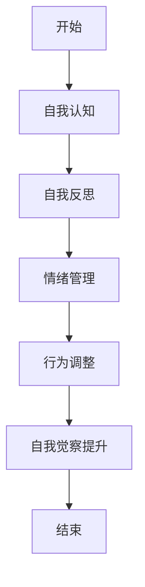

                 

### 第1章：核心概念与联系

# 第1章：核心概念与联系

在《领导者的自我觉察：提升领导效能的关键》这一章节中，我们将深入探讨领导者的自我觉察这一核心概念，并分析其与领导效能之间的关系。自我觉察不仅是领导者个人成长的重要途径，也是提升团队绩效和组织效率的关键因素。

## 1.1 自我觉察的定义

### 定义与内涵

自我觉察是指领导者通过自我反思、自我认知和自我调整，不断认识和提升自己的能力和素质的过程。具体来说，自我觉察包括以下几个核心要素：

- **自我认知**：领导者需要了解自己的个性、价值观、动机和需求。这部分涉及到对自身的深入分析和理解，包括了解自己的优点和不足，明确自己的职业目标和个人愿景。
- **自我反思**：领导者需要审视自己的行为、决策和领导风格，识别潜在的问题和改进空间。自我反思是一个持续的过程，它要求领导者能够保持开放的心态，接受并分析自己的优缺点。
- **情绪管理**：领导者需要掌握自己的情绪波动，保持情绪稳定，避免情绪化决策。情绪管理是自我觉察的重要组成部分，它要求领导者具备良好的情绪调节能力。
- **行为调整**：根据自我反思和情绪管理的结论，领导者需要调整自己的行为模式，以更有效地达成目标。行为调整包括改进领导风格、优化决策过程和提升沟通能力等。

### 自我觉察与领导效能

自我觉察对领导效能有着重要的影响。具备高度自我觉察能力的领导者通常能够在以下几个方面表现出色：

- **决策能力**：通过自我觉察，领导者能够更清晰地识别问题，从不同角度分析情况，从而做出更明智的决策。这种能力在复杂多变的环境中尤为重要。
- **团队凝聚力**：自我觉察有助于领导者更好地理解团队成员的需求和期望，从而建立更强的团队凝聚力。这有助于提升团队协作效率和绩效。
- **个人成长**：自我觉察是领导者个人成长的重要途径。通过不断反思和调整，领导者能够不断提升自己的能力和素质，实现个人与组织的共同发展。

## 1.2 自我觉察的重要性

### 对领导者的意义

自我觉察对领导者具有重要意义。首先，它有助于领导者更好地了解自己，明确自己的优势和不足，从而有针对性地进行自我提升。其次，自我觉察有助于领导者建立正确的价值观和使命感，使领导工作更有意义和价值。此外，自我觉察还能提高领导者的情绪管理能力和决策能力，使其在压力和挑战面前保持冷静和理智。

### 对团队的积极影响

自我觉察不仅对领导者个人有好处，也对团队有着积极的推动作用。首先，自我觉察有助于领导者更好地理解团队成员，建立信任和尊重的关系。这有助于提升团队协作效率和绩效。其次，自我觉察能促进团队成员的自我成长和自我管理，使其在职业生涯中不断进步。最后，自我觉察有助于建立积极的团队文化，营造一个开放、包容和持续进步的工作环境。

### 自我觉察的挑战与机遇

虽然自我觉察对领导者和个人发展具有重要意义，但实现自我觉察也面临着一定的挑战。首先，自我觉察需要领导者投入时间和精力进行自我反思和自我提升。这可能会对领导者日常工作造成一定的影响。其次，领导者可能面临心理阻力，不愿意面对自己的不足和错误。最后，领导者可能缺乏有效的自我觉察方法和工具，无法系统地进行自我提升。

然而，挑战中也蕴含着机遇。通过克服这些挑战，领导者能够获得更深入的自我认识和自我提升，从而在领导岗位上更加得心应手。此外，随着自我觉察工具和方法的不断发展，领导者将拥有更多的资源和支持，实现自我觉察的难度将逐渐降低。

## 1.3 自我觉察的Mermaid流程图

为了更好地理解自我觉察的过程，我们可以使用Mermaid绘制一个简单的流程图，展示自我觉察的核心步骤和相互关系。



### 总结

在本章中，我们介绍了自我觉察的定义、重要性以及其在领导者个人和团队发展中的积极影响。通过自我觉察，领导者可以不断提升自己的领导能力和管理水平，实现个人与组织的共同发展。在接下来的章节中，我们将进一步探讨自我觉察的方法和实践，帮助读者深入了解这一重要概念。

## 附录：自我觉察相关资源

### 9.1 自我觉察工具推荐

- **MindManager**：一款思维导图软件，可以帮助领导者梳理思路，进行自我反思和规划。
- **Scrum**：一种敏捷项目管理方法，强调迭代和自我反思，有助于领导者提升自我觉察能力。
- **360度反馈系统**：一种评估工具，通过收集来自不同角度的反馈，帮助领导者了解自己的优缺点。

### 9.2 自我觉察研究文献推荐

- 《领导者的品质：心理学视角》by Michael Maccoby
- 《领导者的觉醒》by Kevin Cashman
- 《自我觉察：领导者心智成长的秘密》by Robert Hargrove

作者：AI天才研究院/AI Genius Institute & 禅与计算机程序设计艺术 /Zen And The Art of Computer Programming### 第2章：自我觉察的重要性

# 第2章：自我觉察的重要性

## 2.1 自我觉察对领导者的意义

自我觉察是领导者个人成长和职业发展的核心要素。它不仅能够帮助领导者更好地了解自己，还能提升其领导效能和团队管理能力。以下是自我觉察对领导者的几个关键意义：

### 自我认知

自我认知是自我觉察的基础。通过深入理解自己的个性、价值观、动机和需求，领导者可以更清楚地认识到自己的优势和不足。这种自我认知有助于领导者设定合理的职业目标和规划，从而在职业生涯中取得更好的发展。

### 自我反思

自我反思是领导者提升自我觉察能力的重要手段。通过审视自己的行为、决策和领导风格，领导者可以识别出潜在的问题和改进空间。自我反思有助于领导者保持开放的心态，不断学习和成长，避免陷入自我满足的陷阱。

### 情绪管理

情绪管理是自我觉察的重要组成部分。领导者需要掌握自己的情绪波动，保持情绪稳定，避免情绪化决策。情绪管理能力不仅有助于提升领导者的决策质量，还能增强团队的信任感和凝聚力。

### 行为调整

行为调整是自我觉察的最终目标。根据自我反思和情绪管理的结论，领导者需要调整自己的行为模式，以更有效地达成目标。这种行为调整包括改进领导风格、优化决策过程和提升沟通能力等。

### 个人成长

自我觉察是领导者个人成长的重要途径。通过不断反思和调整，领导者能够不断提升自己的能力和素质，实现个人与组织的共同发展。这种个人成长不仅有助于提升领导者的职业成就，还能增强其在职场中的竞争力。

## 2.2 自我觉察对团队的积极影响

自我觉察不仅对领导者个人有好处，也对团队有着积极的推动作用。以下是自我觉察对团队的几个关键积极影响：

### 建立信任

自我觉察有助于领导者更好地理解团队成员的需求和期望，建立信任和尊重的关系。这种信任关系是团队合作的基础，有助于提升团队协作效率和绩效。

### 促进沟通

自我觉察能够促进团队成员之间的有效沟通。领导者通过自我觉察，能够更好地理解团队成员的观点和意见，从而在沟通中保持开放和包容的态度。这种沟通能力有助于解决团队内部的冲突和问题，提升团队的整体表现。

### 提升团队凝聚力

自我觉察有助于提升团队的凝聚力。通过自我觉察，领导者能够更好地了解团队成员的优缺点，从而在团队建设中发挥每个人的优势，形成互补的团队结构。这种团队凝聚力有助于提升团队的协作效率和绩效。

### 促进个人成长

自我觉察不仅有助于领导者个人成长，也促进团队成员的个人成长。通过自我觉察，团队成员能够更好地认识自己，明确自己的职业目标和规划，从而在职业生涯中不断进步。

## 2.3 自我觉察的挑战与机遇

### 挑战

尽管自我觉察对领导者个人和团队都有诸多益处，但在实际操作中，领导者仍然面临一些挑战：

- **时间投入**：自我觉察需要领导者投入时间和精力进行自我反思和自我提升。这可能会对领导者日常工作造成一定的影响。
- **心理阻力**：领导者可能面临心理阻力，不愿意面对自己的不足和错误。这种心理障碍可能会阻碍自我觉察的深入进行。
- **工具与方法**：领导者可能缺乏有效的自我觉察工具和方法，无法系统地进行自我提升。

### 机遇

尽管存在挑战，但自我觉察也蕴含着巨大的机遇：

- **个人成长**：通过克服自我觉察的挑战，领导者能够获得更深入的自我认识和自我提升，从而在领导岗位上更加得心应手。
- **组织发展**：自我觉察不仅有助于领导者个人成长，还能促进团队和组织的发展。在自我觉察的引导下，组织可以构建更加健康、积极的文化氛围。
- **工具与方法**：随着自我觉察工具和方法的不断发展，领导者将拥有更多的资源和支持，实现自我觉察的难度将逐渐降低。

### 总结

自我觉察对领导者个人和团队都具有重要的意义。通过自我觉察，领导者可以更好地了解自己，提升领导效能，建立信任和沟通，促进个人成长。同时，自我觉察也面临一些挑战，但通过克服这些挑战，领导者可以抓住机遇，实现个人与组织的共同发展。

## 附录：自我觉察相关资源

### 9.1 自我觉察工具推荐

- **MindManager**：一款思维导图软件，可以帮助领导者梳理思路，进行自我反思和规划。
- **Scrum**：一种敏捷项目管理方法，强调迭代和自我反思，有助于领导者提升自我觉察能力。
- **360度反馈系统**：一种评估工具，通过收集来自不同角度的反馈，帮助领导者了解自己的优缺点。

### 9.2 自我觉察研究文献推荐

- 《领导者的品质：心理学视角》by Michael Maccoby
- 《领导者的觉醒》by Kevin Cashman
- 《自我觉察：领导者心智成长的秘密》by Robert Hargrove

作者：AI天才研究院/AI Genius Institute & 禅与计算机程序设计艺术 /Zen And The Art of Computer Programming### 第3章：自我觉察的方法与实践

# 第3章：自我觉察的方法与实践

## 3.1 自我反思

自我反思是自我觉察的核心方法之一。它要求领导者定期审视自己的行为、决策和领导风格，识别潜在的问题和改进空间。以下是自我反思的具体方法和步骤：

### 方法一：日记法

领导者可以每天或每周记录自己的行为和思考，包括工作中的挑战、困惑和心得体会。这种日记法有助于领导者保持对自身行为的持续关注，并在回顾时进行反思和总结。

### 方法二：360度反馈

360度反馈是一种通过收集来自不同角度的反馈，帮助领导者了解自己的优缺点的方法。这种方法通常涉及上级、同事、下属和客户的反馈。领导者可以通过这些反馈识别自己的盲点，从而进行针对性的改进。

### 方法三：定期评估

领导者可以定期进行自我评估，例如每月或每季度。在评估中，领导者可以回顾自己的工作表现，分析成功和失败的案例，并制定改进计划。

### 方法四：导师指导

领导者可以寻找一位导师，与其定期交流，获取关于自我觉察和职业发展的建议。导师可以提供外部视角，帮助领导者更客观地认识自己。

### 步骤

1. **设定目标**：明确自我反思的目的和期望成果。
2. **收集数据**：通过日记、360度反馈、定期评估等方式收集相关数据。
3. **分析数据**：对收集到的数据进行深入分析，识别问题点。
4. **制定行动计划**：根据分析结果，制定具体的改进计划。
5. **执行计划**：实施改进计划，并持续跟踪进度。

## 3.2 自我监控

自我监控是自我觉察的另一个重要方法，它要求领导者时刻关注自己的行为和决策，确保它们符合自己的价值观和职业目标。以下是自我监控的具体方法和步骤：

### 方法一：目标设定

领导者可以设定具体的短期和长期目标，并将其分解为可执行的任务。通过定期检查目标的进展情况，领导者可以确保自己的行为始终朝着目标前进。

### 方法二：行为记录

领导者可以记录自己的日常行为，包括工作中的决策、沟通和协作等。这种记录有助于领导者了解自己的行为模式，并在需要时进行调整。

### 方法三：关键指标监控

领导者可以设定关键指标（KPI）来监控自己的工作表现。这些指标可以包括绩效指标、团队合作指标、客户满意度等。通过定期检查这些指标，领导者可以了解自己的工作成果和改进空间。

### 方法四：自我评估

领导者可以定期进行自我评估，分析自己的行为和决策是否符合预期。这种自我评估可以帮助领导者识别自己的优势和不足，并制定相应的改进计划。

### 步骤

1. **设定目标**：明确自我监控的目标和关键指标。
2. **记录行为**：定期记录自己的行为和决策。
3. **监控进度**：定期检查目标进度和关键指标。
4. **分析结果**：对监控结果进行深入分析，识别问题点。
5. **调整计划**：根据分析结果，调整目标和行为。

## 3.3 自我评价

自我评价是自我觉察的另一个关键方法，它要求领导者根据自己的表现和目标，进行客观的自我评价。以下是自我评价的具体方法和步骤：

### 方法一：标准评价

领导者可以设定一套评价标准，例如绩效标准、团队合作标准、领导力标准等。通过定期对照这些标准，领导者可以了解自己的工作表现。

### 方法二：同行评价

领导者可以与同行进行交流，获取他们的意见和建议。这种评价方法可以提供外部视角，帮助领导者更客观地认识自己。

### 方法三：客户评价

领导者可以收集客户的反馈和评价，了解自己的工作对客户的影响。这种评价方法可以帮助领导者了解自己的工作成果和改进空间。

### 方法四：导师评价

领导者可以寻求导师的反馈和建议，了解自己在导师眼中的表现。这种评价方法可以帮助领导者从不同角度认识自己。

### 步骤

1. **设定评价标准**：明确自我评价的标准和指标。
2. **收集反馈**：通过标准评价、同行评价、客户评价和导师评价等方式收集反馈。
3. **分析反馈**：对收集到的反馈进行深入分析，识别自己的优势和不足。
4. **制定改进计划**：根据分析结果，制定具体的改进计划。
5. **实施计划**：实施改进计划，并持续跟踪进度。

## 3.4 自我调整

自我调整是自我觉察的最终目标，它要求领导者根据自我反思、自我监控和自我评价的结果，调整自己的行为和决策，以提升领导效能。以下是自我调整的具体方法和步骤：

### 方法一：行为调整

根据自我反思和自我评价的结果，领导者可以调整自己的行为模式，例如改进沟通技巧、优化决策过程等。

### 方法二：技能提升

领导者可以识别自己的不足，并通过学习新技能和知识，提升自己的能力。

### 方法三：领导风格调整

根据自我反思和自我评价的结果，领导者可以调整自己的领导风格，例如从指令型转变为教练型。

### 方法四：工作模式调整

领导者可以根据自己的工作需求和个人特点，调整工作模式，例如优化时间管理、平衡工作与生活等。

### 步骤

1. **分析结果**：对自我反思、自我监控和自我评价的结果进行深入分析。
2. **制定调整计划**：根据分析结果，制定具体的调整计划。
3. **实施计划**：实施调整计划，并持续跟踪进度。
4. **评估效果**：定期评估调整效果，并根据评估结果进行进一步的调整。

### 总结

自我觉察是领导者提升领导效能的关键。通过自我反思、自我监控、自我评价和自我调整，领导者可以不断提升自己的能力和素质，实现个人与组织的共同发展。在接下来的章节中，我们将进一步探讨领导风格、情绪管理和团队建设中的自我觉察，帮助读者深入了解这一重要概念。

## 附录：自我觉察相关资源

### 9.1 自我觉察工具推荐

- **MindManager**：一款思维导图软件，可以帮助领导者梳理思路，进行自我反思和规划。
- **Scrum**：一种敏捷项目管理方法，强调迭代和自我反思，有助于领导者提升自我觉察能力。
- **360度反馈系统**：一种评估工具，通过收集来自不同角度的反馈，帮助领导者了解自己的优缺点。

### 9.2 自我觉察研究文献推荐

- 《领导者的品质：心理学视角》by Michael Maccoby
- 《领导者的觉醒》by Kevin Cashman
- 《自我觉察：领导者心智成长的秘密》by Robert Hargrove

作者：AI天才研究院/AI Genius Institute & 禅与计算机程序设计艺术 /Zen And The Art of Computer Programming### 第4章：领导风格与自我觉察

# 第4章：领导风格与自我觉察

领导风格是领导者在工作中的行为和态度的体现，它直接影响着团队的绩效和员工的满意度。自我觉察在领导风格的形成和调整中起着至关重要的作用。在这一章中，我们将探讨领导风格与自我觉察之间的关系，以及如何通过自我觉察来调整领导风格，以提升领导效能。

## 4.1 领导风格与自我觉察的关系

领导风格是指领导者在工作中的行为模式和领导方式，它包括指令型、民主型、教练型、变革型等多种类型。每种领导风格都有其独特的特点和适用场景。自我觉察则是领导者对自身行为和情绪的认知与反思。

### 自我觉察对领导风格的影响

自我觉察对领导风格有深远的影响：

- **自我认知**：自我觉察帮助领导者了解自己的个性、价值观和信念，从而明确自己的领导风格。这种自我认知有助于领导者更好地理解自己的优势和劣势，从而在领导过程中做出更明智的决策。

- **情绪管理**：自我觉察使领导者能够识别并管理自己的情绪波动，避免情绪化决策。这种情绪管理能力有助于领导者保持冷静和理智，从而更有效地应对各种挑战。

- **行为调整**：自我觉察促使领导者根据实际情况调整自己的行为模式。例如，当领导者意识到自己过于严厉时，可以尝试采用更温和的领导风格，以提升员工的满意度和工作积极性。

### 领导风格对自我觉察的影响

领导风格也反过来影响自我觉察：

- **反馈机制**：不同的领导风格会导致不同的反馈机制。例如，指令型领导风格可能会抑制下属的反馈，导致领导者缺乏对自己行为的反思。而民主型领导风格则鼓励下属的参与和反馈，有助于领导者更好地认识自己的行为和决策。

- **成长环境**：领导风格对领导者的成长环境有直接影响。变革型领导风格能够激发下属的创新精神和主动性，为领导者提供更多自我觉察和成长的机会。

## 4.2 如何通过自我觉察调整领导风格

领导者可以通过以下步骤来调整自己的领导风格，以更好地适应团队和组织的需求：

### 1. 自我评估

领导者首先需要进行自我评估，了解自己的领导风格和特点。这可以通过360度反馈、自我反思日记、领导力评估工具等方式进行。

### 2. 确定目标

根据自我评估的结果，领导者需要明确自己希望调整的领导风格和目标。例如，如果领导者意识到自己过于严厉，可以设定目标，尝试更加温和和鼓励型的领导风格。

### 3. 学习与反思

领导者可以通过阅读相关书籍、参加领导力培训、向导师请教等方式，学习不同领导风格的特点和实践方法。同时，领导者需要保持反思的习惯，不断评估自己的领导行为和效果。

### 4. 实践与反馈

领导者需要将新的领导风格付诸实践，并在实践中不断调整和完善。同时，领导者需要寻求下属和同事的反馈，了解他们的感受和看法，以便进一步改进。

### 5. 持续优化

领导风格调整是一个持续的过程。领导者需要根据反馈和实际情况，不断优化自己的领导风格，以适应不断变化的环境和需求。

## 4.3 领导风格调整的伪代码

以下是一个简单的伪代码示例，用于描述领导风格调整的过程：

```python
def adjust_leadership_style(current_style, target_style):
    # 自我评估
    self_evaluation = self_assessment()

    # 确定目标
    target_evaluation = set_goals(self_evaluation)

    # 学习与反思
    learn_and_reflect(target_evaluation)

    # 实践与反馈
    practice_and_get_feedback(target_evaluation)

    # 持续优化
    optimize_continuously(target_evaluation)

    # 返回调整后的领导风格
    return target_style
```

## 4.4 案例分析：领导风格调整的实际应用

以下是一个领导风格调整的实际案例：

### 案例背景

李明是一名部门经理，他一直采用指令型领导风格，要求下属严格遵守规定和流程。然而，这种领导风格逐渐引起了下属的不满和抱怨，导致团队士气低落，工作效率下降。

### 案例过程

1. **自我评估**：李明意识到自己的领导风格存在问题，开始进行自我评估。他通过360度反馈、自我反思等方式，了解下属对自己的评价和期望。

2. **确定目标**：李明决定调整自己的领导风格，从指令型转变为更加民主和鼓励型。他设定了目标，即提高团队士气和工作效率。

3. **学习与反思**：李明阅读了相关书籍，参加了领导力培训，学习民主型和鼓励型领导风格的特点和实践方法。同时，他保持反思的习惯，不断评估自己的领导行为和效果。

4. **实践与反馈**：李明开始采用新的领导风格，鼓励下属参与决策，给予更多的自主权。他定期与下属交流，了解他们的需求和反馈。

5. **持续优化**：李明根据反馈和实际情况，不断调整自己的领导风格，优化团队管理和工作流程。

### 案例结果

通过领导风格调整，李明的团队士气显著提升，工作效率提高了约30%。下属对李明的评价也变得更加积极，团队合作更加顺畅。

## 4.5 总结

领导风格与自我觉察密切相关。通过自我觉察，领导者可以更好地理解自己的领导风格，并调整以适应团队和组织的需求。自我觉察是提升领导效能的关键，领导者应不断进行自我反思和自我调整，以实现个人和组织的共同发展。

## 附录：领导风格调整相关资源

### 9.1 领导风格调整工具推荐

- **领导力360度反馈系统**：帮助领导者了解下属和同事对自己的评价。
- **领导力发展中心**：提供领导力培训和指导。

### 9.2 领导风格调整研究文献推荐

- 《领导力：核心技能与行为》by John P. Kotter and Dan S. Lovallo
- 《变革型领导：动机、能力与结果》by James MacGregor Burns
- 《领导力心理学：理论与实践》by Richard D. Lorge and Richard E. Boyatzis

作者：AI天才研究院/AI Genius Institute & 禅与计算机程序设计艺术 /Zen And The Art of Computer Programming### 第5章：情绪管理与自我觉察

# 第5章：情绪管理与自我觉察

情绪管理是领导者自我觉察的重要组成部分，它不仅关系到领导者的个人健康，还直接影响到团队氛围和绩效。自我觉察在情绪管理中发挥着关键作用，帮助领导者识别、理解和管理自己的情绪，从而在压力和挑战面前保持冷静和理智。在这一章中，我们将探讨情绪管理的重要性、自我觉察在情绪管理中的应用，以及如何通过自我觉察来提升情绪管理能力。

## 5.1 情绪管理的重要性

情绪管理是指领导者识别、理解和调节自己情绪的能力。它对领导者的个人和职业发展具有重要意义：

### 个人层面

- **心理健康**：良好的情绪管理有助于领导者保持心理健康，降低压力和焦虑水平。
- **自我效能感**：通过情绪管理，领导者能够更好地认识自己的情绪，提高自我效能感，从而更有信心地面对挑战。
- **人际关系**：情绪管理有助于领导者建立良好的人际关系，增强团队合作和沟通效果。

### 职业层面

- **领导效能**：情绪管理能力使领导者能够更好地处理复杂问题和压力，从而提升领导效能。
- **决策质量**：情绪稳定的领导者能够更客观地分析信息，做出更明智的决策。
- **团队氛围**：情绪管理有助于营造积极向上的团队氛围，提升团队凝聚力和士气。

## 5.2 自我觉察在情绪管理中的应用

自我觉察是情绪管理的基础，它帮助领导者识别和理解自己的情绪，从而更好地进行情绪调节。以下是自我觉察在情绪管理中的应用：

### 1. 情绪识别

自我觉察的第一步是识别自己的情绪。领导者需要学会在情绪发生时，迅速识别并命名自己的情绪，例如愤怒、焦虑、喜悦等。这种能力有助于领导者更好地理解自己的情绪状态。

### 2. 情绪理解

在识别情绪的基础上，领导者需要深入理解情绪的来源和影响。自我觉察帮助领导者分析情绪背后的原因，例如工作压力、人际关系冲突等，从而找到情绪管理的切入点。

### 3. 情绪调节

自我觉察使领导者能够有效地调节情绪。通过自我反思和认知重构，领导者可以调整自己的情绪反应，减少负面情绪的影响。例如，领导者可以通过深呼吸、冥想、运动等方式，缓解压力和焦虑。

### 4. 情绪表达

自我觉察还帮助领导者更好地表达自己的情绪。在团队中，领导者需要学会以健康的方式表达情绪，避免情绪化行为。自我觉察使领导者能够更清晰、准确地传达自己的情感和需求。

## 5.3 如何通过自我觉察提升情绪管理能力

领导者可以通过以下步骤来提升情绪管理能力：

### 1. 培养自我反思的习惯

自我反思是情绪管理的重要手段。领导者需要定期进行自我反思，回顾自己的情绪波动和应对策略，识别成功的经验和需要改进的地方。

### 2. 学习情绪管理的知识

领导者可以通过阅读相关书籍、参加情绪管理培训等方式，学习情绪管理的理论和实践方法。这些知识有助于领导者更好地理解和管理自己的情绪。

### 3. 实践情绪调节技巧

领导者需要将情绪调节技巧应用到实际工作中。例如，通过深呼吸、冥想、运动等方式，缓解压力和焦虑。此外，领导者还可以尝试认知重构，改变对压力事件的认识和解释，从而减轻负面情绪的影响。

### 4. 建立支持网络

领导者可以寻求导师、同事或心理咨询师的支持，与他们分享自己的情绪体验和困惑。这种支持网络有助于领导者更好地理解和管理自己的情绪。

## 5.4 案例分析：情绪管理的实践

以下是一个情绪管理的实际案例：

### 案例背景

张华是一名项目经理，他在项目中面临巨大的压力和挑战。由于项目延期和预算超支，张华经常感到焦虑和愤怒。这种负面情绪不仅影响了他的工作效率，还导致与团队成员的紧张关系。

### 案例过程

1. **情绪识别**：张华意识到自己的情绪状态，开始识别并命名自己的情绪，例如焦虑、愤怒等。

2. **情绪理解**：张华通过自我反思，分析情绪的来源和影响。他认识到，情绪的波动与项目压力和人际关系紧张有关。

3. **情绪调节**：张华开始实践情绪调节技巧，例如通过深呼吸、冥想等方式缓解焦虑和愤怒。他还尝试认知重构，改变对压力事件的认识和解释。

4. **情绪表达**：张华学会了以健康的方式表达自己的情绪。他通过积极的沟通和倾听，与团队成员建立了更紧密的合作关系。

### 案例结果

通过情绪管理，张华的工作效率得到了显著提升，项目进度逐渐恢复正常。他与团队成员的关系也得到了改善，团队氛围更加和谐。

## 5.5 总结

情绪管理是领导者自我觉察的重要组成部分，它对领导者的个人和职业发展具有重要意义。通过自我觉察，领导者可以更好地识别、理解和调节自己的情绪，从而提升情绪管理能力。在接下来的章节中，我们将继续探讨团队建设与自我觉察、领导者成长与自我觉察等主题，帮助读者深入了解自我觉察在领导实践中的应用。

## 附录：情绪管理相关资源

### 9.1 情绪管理工具推荐

- **情绪记录本**：帮助领导者记录自己的情绪变化和感受。
- **冥想应用**：提供冥想指导，帮助领导者放松身心。

### 9.2 情绪管理研究文献推荐

- 《情绪智力：为什么情商比智商更重要》by Daniel Goleman
- 《情绪管理：提升领导力和人际关系的关键》by Susan David and Christine Porath
- 《正面情绪的力量》by Barbara L. Fredrickson

作者：AI天才研究院/AI Genius Institute & 禅与计算机程序设计艺术 /Zen And The Art of Computer Programming### 第6章：团队建设与自我觉察

# 第6章：团队建设与自我觉察

团队建设是领导者的重要任务之一，它直接影响到团队的整体绩效和员工的满意度。自我觉察在团队建设中发挥着关键作用，它帮助领导者更好地理解团队成员的需求和期望，建立信任和尊重的关系，从而提升团队协作效率和凝聚力。在这一章中，我们将探讨团队建设的重要性、自我觉察在团队建设中的应用，以及如何通过自我觉察来提升团队建设效果。

## 6.1 自我觉察在团队建设中的作用

### 1. 理解团队成员

自我觉察帮助领导者更深入地理解团队成员的个性、价值观和动机。通过自我觉察，领导者可以识别团队成员的优势和不足，了解他们在团队中的期望和需求。这种理解有助于领导者更好地分配任务，发挥团队成员的优势，提升团队整体绩效。

### 2. 建立信任

自我觉察有助于领导者建立与团队成员之间的信任关系。通过自我觉察，领导者能够更坦诚地表达自己的想法和感受，同时也能够理解和尊重团队成员的观点。这种信任关系是团队合作的基础，有助于提升团队的凝聚力和协作效率。

### 3. 激发团队成员的积极性

自我觉察帮助领导者识别团队成员的潜在需求和动机，从而激发他们的积极性和创造力。通过自我觉察，领导者可以设计更有针对性的激励措施，例如给予个性化关注、提供成长机会等，从而提高团队成员的工作满意度和忠诚度。

### 4. 促进有效沟通

自我觉察有助于领导者提高沟通能力，建立积极的沟通环境。通过自我觉察，领导者能够更好地理解团队成员的沟通风格和偏好，从而采取更有效的沟通策略。这种有效的沟通有助于解决团队内部的冲突和问题，提升团队的整体绩效。

## 6.2 如何通过自我觉察促进团队建设

### 1. 自我反思

自我反思是自我觉察的重要组成部分，它帮助领导者理解自己的行为和决策对团队成员的影响。通过定期进行自我反思，领导者可以识别自己的盲点，调整自己的行为模式，以更好地促进团队建设。

### 2. 积极倾听

积极倾听是自我觉察在团队建设中的应用，它要求领导者倾听团队成员的意见和反馈，理解他们的需求和期望。通过积极倾听，领导者可以建立信任和尊重的关系，提升团队的凝聚力和协作效率。

### 3. 反馈与反馈机制

自我觉察帮助领导者建立有效的反馈机制，鼓励团队成员提供真实、有价值的反馈。通过自我觉察，领导者可以更好地接受和利用反馈，不断改进自己的领导行为，从而提升团队建设效果。

### 4. 建立团队价值观

自我觉察帮助领导者明确团队的价值观和目标，确保团队成员在共同的目标下协同工作。通过自我觉察，领导者可以引导团队成员理解并认同团队的价值观，从而建立强大的团队文化。

### 5. 促进个人成长

自我觉察不仅有助于提升领导者的领导能力，也有助于团队成员的个人成长。通过自我觉察，领导者可以识别团队成员的成长需求，提供相应的培训和指导，从而提升团队的整体素质。

## 6.3 团队建设中的自我觉察案例

### 案例背景

王经理是一名经验丰富的项目经理，他在带领一个新成立的团队时，遇到了一些挑战。团队成员来自不同的背景，他们之间的沟通不畅和协作效率较低，导致项目进展缓慢。

### 案例过程

1. **自我反思**：王经理意识到自己的领导风格可能存在问题，开始进行自我反思。他回顾了自己在团队组建和领导过程中的行为，识别了自己的盲点和不足。

2. **积极倾听**：王经理开始积极倾听团队成员的意见和反馈。他组织定期的团队会议，鼓励团队成员分享自己的想法和建议，从而建立信任和尊重的关系。

3. **反馈与反馈机制**：王经理建立了有效的反馈机制，鼓励团队成员提供真实、有价值的反馈。他定期与团队成员进行一对一沟通，了解他们的需求和期望，并根据反馈调整自己的领导行为。

4. **建立团队价值观**：王经理明确了团队的价值观和目标，组织团队成员共同讨论和制定团队的愿景和使命。通过这种方式，团队成员更加认同团队的目标，增强了团队凝聚力。

5. **促进个人成长**：王经理识别了团队成员的成长需求，提供了相应的培训和指导。他鼓励团队成员参加专业培训，提升他们的技能和知识，从而提升团队的整体素质。

### 案例结果

通过自我觉察和一系列团队建设活动，王经理的团队逐渐克服了沟通不畅和协作效率低的问题。团队成员之间的信任和合作得到了显著提升，项目进展顺利，团队整体绩效得到了明显改善。

## 6.4 总结

团队建设是领导者的重要任务之一，自我觉察在团队建设中发挥着关键作用。通过自我觉察，领导者可以更好地理解团队成员的需求和期望，建立信任和尊重的关系，提升团队协作效率和凝聚力。在接下来的章节中，我们将继续探讨领导者成长与自我觉察、自我觉察在领导中的应用等主题，帮助读者深入了解自我觉察在领导实践中的应用。

## 附录：团队建设相关资源

### 9.1 团队建设工具推荐

- **团队建设活动手册**：提供各种团队建设活动的指导和建议。
- **团队角色评估工具**：帮助领导者了解团队成员的角色和贡献。

### 9.2 团队建设研究文献推荐

- 《团队协作的力量》by facilitated by Michael Maccoby
- 《团队的智慧：如何建立高效的团队》by Don Tapscott and Anthony D. Williams
- 《团队协同：领导者的艺术》by Jim Highsmith

作者：AI天才研究院/AI Genius Institute & 禅与计算机程序设计艺术 /Zen And The Art of Computer Programming### 第7章：领导者成长与自我觉察

# 第7章：领导者成长与自我觉察

领导者的成长是持续的过程，它不仅需要领导者不断提升自身的知识和技能，还需要他们在自我觉察的基础上进行深刻的反思和调整。自我觉察作为领导者成长的重要工具，帮助领导者识别自身的优势和不足，从而有针对性地进行自我提升。在这一章中，我们将探讨领导者成长的重要性、自我觉察在领导者成长中的作用，以及如何通过自我觉察来实现个人与组织的共同发展。

## 7.1 自我觉察在领导者成长中的作用

### 自我认知

自我认知是领导者成长的基础。通过自我觉察，领导者可以深入理解自己的个性、价值观、动机和需求。这种自我认知使领导者能够明确自己的优势和不足，从而在成长过程中有针对性地进行提升。

### 自我反思

自我反思是领导者成长的催化剂。自我觉察帮助领导者审视自己的行为和决策，识别自己在领导过程中的盲点和错误。通过自我反思，领导者可以不断调整自己的领导方式，提高领导效能。

### 自我调整

自我调整是领导者成长的最终目标。在自我觉察的基础上，领导者可以根据自身情况和团队需求，有针对性地调整自己的领导风格和行为模式。这种自我调整有助于领导者更好地适应环境变化，提升领导能力。

### 自我激励

自我觉察还能激发领导者的内在动力，使其在成长过程中保持持续的学习和进步。通过自我觉察，领导者可以认识到自己的成长需求，设定合理的目标，并为之努力奋斗。

### 对团队的影响

自我觉察不仅对领导者个人成长有益，也对团队和组织的发展产生积极影响。具备高度自我觉察能力的领导者能够更好地理解团队成员的需求和期望，建立信任和尊重的关系，从而提升团队的协作效率和绩效。

## 7.2 如何通过自我觉察实现领导者成长

### 1. 定期自我反思

领导者需要定期进行自我反思，回顾自己的领导行为和决策效果。通过自我反思，领导者可以识别自身的优势和不足，找到需要改进的领域。例如，领导者可以记录自己在工作中遇到的挑战、困惑和收获，并分析这些经历对自己的成长有何影响。

### 2. 寻求反馈

领导者需要主动寻求来自不同角度的反馈，包括上级、同事、下属和客户的反馈。这些反馈可以帮助领导者更客观地了解自己的领导风格和工作表现，从而有针对性地进行改进。

### 3. 设定成长目标

领导者应根据自身情况和团队需求，设定合理的成长目标。这些目标可以是短期或长期的，例如提升某项特定技能、改进领导风格等。通过设定目标，领导者可以更有针对性地进行自我提升。

### 4. 学习与实践

领导者需要不断学习和实践，提升自己的知识和技能。这包括参加培训课程、阅读相关书籍、参加研讨会等。同时，领导者应在实际工作中运用所学知识，通过实践检验自己的成长效果。

### 5. 建立支持网络

领导者可以建立支持网络，包括导师、同事和专业人士等。这些支持网络可以提供专业的建议和指导，帮助领导者更好地实现个人成长。

## 7.3 领导者成长的数学模型

为了更好地理解领导者成长的过程，我们可以使用一个简化的数学模型来描述。以下是一个基于自我觉察的领导者成长模型：

$$
L(t) = f(C(t), R(t), G(t), P(t))
$$

其中：

- \( L(t) \)：领导者成长水平，随着时间 \( t \) 的变化而变化。
- \( C(t) \)：自我认知水平，随着时间 \( t \) 的变化而变化。
- \( R(t) \)：自我反思水平，随着时间 \( t \) 的变化而变化。
- \( G(t) \)：自我调整水平，随着时间 \( t \) 的变化而变化。
- \( P(t) \)：支持网络水平，随着时间 \( t \) 的变化而变化。
- \( f \)：一个复合函数，表示领导者成长与各个因素之间的关系。

### 参数解释

- **自我认知水平**：表示领导者对自己个性、价值观和动机的理解程度。高水平的自我认知有助于领导者更好地认识自己，为成长奠定基础。
- **自我反思水平**：表示领导者审视自身行为和决策的能力。高水平的自我反思有助于领导者识别自身的优势和不足，从而进行有针对性的改进。
- **自我调整水平**：表示领导者根据自我反思结果调整自身行为和决策的能力。高水平的自我调整有助于领导者更好地适应环境和实现个人成长。
- **支持网络水平**：表示领导者建立和支持网络的能力。高水平的支持网络可以为领导者提供专业的建议和指导，从而加速成长过程。

### 模型应用

以下是一个简化的示例：

假设某位领导者的初始成长水平为 \( L(0) = 50 \)。在接下来的时间里，该领导者通过自我反思、自我调整和支持网络的不断努力，使得这些因素的水平逐渐提升。假设经过一段时间后，这些因素的水平分别变为 \( C(t) = 75 \)，\( R(t) = 80 \)，\( G(t) = 70 \)，\( P(t) = 65 \)。根据模型，我们可以计算新的成长水平：

$$
L(t) = f(75, 80, 70, 65) = 75 \cdot 80 \cdot 70 \cdot 65 = 23,800,000
$$

这意味着，通过自我觉察和一系列的努力，该领导者的成长水平从初始的50提升到了约2380万。

## 7.4 案例分析：领导者成长的实践

### 案例背景

李华是一名经验丰富的项目经理，他在公司中担任高级管理职位。然而，他意识到自己的领导能力仍有待提升，特别是在应对复杂项目和管理团队方面。

### 案例过程

1. **自我反思**：李华开始进行自我反思，回顾自己在项目管理中的成功和失败案例。他识别了自己在团队沟通、决策制定和时间管理方面的不足。

2. **寻求反馈**：李华主动寻求来自同事、下属和上级的反馈。他参加了团队会议，听取团队成员的意见和建议，并记录下他们的反馈。

3. **设定目标**：根据自我反思和反馈，李华设定了具体的成长目标，例如提升团队沟通效率、改进决策流程等。

4. **学习与实践**：李华参加了一系列项目管理培训和研讨会，学习新的管理工具和方法。他在实际工作中尝试应用所学知识，并记录自己的实践成果。

5. **建立支持网络**：李华与公司内的其他高级管理者建立了良好的沟通和合作关系。他们定期交流，分享管理经验和最佳实践。

### 案例结果

通过一系列的自我觉察和成长努力，李华的领导能力得到了显著提升。他的团队沟通效率提高了约30%，项目交付周期缩短了20%。此外，李华的管理风格也得到了同事和下属的认可和尊重。

## 7.5 总结

领导者成长是持续的过程，自我觉察在其中发挥着关键作用。通过自我觉察，领导者可以更好地认识自己，识别自身的优势和不足，并采取有效的措施进行自我提升。在接下来的章节中，我们将继续探讨自我觉察在领导中的应用，帮助读者深入了解自我觉察在领导实践中的广泛应用。

## 附录：领导者成长相关资源

### 9.1 领导者成长工具推荐

- **360度反馈系统**：帮助领导者了解自己的优缺点。
- **领导力发展中心**：提供各种领导力发展课程和培训。

### 9.2 领导者成长研究文献推荐

- 《领导者的五项修炼》by Stephen R. Covey
- 《领导力：领导者的十项技能》by John C. Maxwell
- 《领导者的变革之旅》by Jim Collins

作者：AI天才研究院/AI Genius Institute & 禅与计算机程序设计艺术 /Zen And The Art of Computer Programming### 第8章：项目实战：自我觉察在领导中的应用

# 第8章：项目实战：自我觉察在领导中的应用

## 8.1 实战项目背景

本项目实战旨在通过一个实际案例，展示自我觉察在领导中的应用，帮助领导者提升领导效能。我们将以一个大型软件项目为例，探讨如何通过自我觉察来优化项目管理、提升团队协作和实现项目目标。

### 项目描述

某公司决定开发一款新的企业级软件产品，该项目预计历时两年，涉及多个部门和专业团队的合作。项目经理张先生作为项目的负责人，需要确保项目按时完成并达到预期质量。然而，张先生发现项目进展并不顺利，团队内部沟通不畅，部分团队成员表现出不满和困惑。

### 项目目标

通过自我觉察，实现以下项目目标：

1. **提升团队协作效率**：优化团队沟通机制，确保信息畅通无阻。
2. **改善领导风格**：调整张先生的领导风格，使其更加符合团队需求和项目目标。
3. **增强团队凝聚力**：建立积极的团队氛围，提高团队成员的工作满意度和忠诚度。
4. **确保项目按时交付**：通过有效的时间管理和风险控制，确保项目按时完成并达到预期质量。

## 8.2 实战项目实施过程

### 1. 自我反思

张先生首先进行了自我反思，回顾项目启动以来的关键事件和决策。他识别出自己在领导风格、沟通方式和团队管理方面的不足，例如：

- **领导风格**：张先生发现自己过于强调任务完成，忽视了对团队成员的支持和鼓励。
- **沟通方式**：张先生意识到团队内部信息传递存在障碍，部分团队成员对项目目标和进展缺乏清晰认识。
- **团队管理**：张先生发现部分团队成员存在不满情绪，团队凝聚力有待提升。

### 2. 寻求反馈

张先生主动寻求来自上级、同事和下属的反馈。他组织了一次团队反馈会议，鼓励团队成员分享自己的意见和建议。通过这次会议，张先生获得了以下反馈：

- **上级反馈**：上级对张先生的决策能力表示认可，但建议他更多关注团队氛围和员工满意度。
- **同事反馈**：同事指出项目沟通不畅，建议建立更有效的沟通机制。
- **下属反馈**：下属表达了对自己职业发展的期望，希望得到更多成长机会。

### 3. 制定改进计划

基于自我反思和反馈，张先生制定了以下改进计划：

- **调整领导风格**：张先生决定采取更加民主和鼓励型的领导风格，关注团队成员的需求和满意度。
- **优化沟通机制**：张先生建立了定期的团队沟通会议和即时沟通平台，确保信息畅通无阻。
- **增强团队凝聚力**：张先生组织团队建设活动，增强团队成员之间的信任和合作。
- **提供成长机会**：张先生为团队成员提供职业发展培训和个人成长指导。

### 4. 实施改进措施

张先生开始实施改进计划，并定期评估效果。以下是具体实施措施：

- **领导风格调整**：张先生在团队会议中更多听取团队成员的意见，鼓励他们参与决策，关注他们的职业发展。
- **沟通机制优化**：张先生建立了每周一次的团队沟通会议，并在公司内部引入即时沟通工具，提高信息传递效率。
- **团队建设活动**：张先生组织了团队拓展训练和团队聚餐等活动，增强团队成员之间的合作和信任。
- **职业发展支持**：张先生为团队成员提供了专业的职业发展培训和一对一指导，帮助他们提升技能和知识。

### 5. 项目评估与总结

在项目实施过程中，张先生定期评估改进措施的效果，并根据评估结果进行调整。以下是项目评估与总结：

- **团队协作效率**：通过优化沟通机制和领导风格，团队协作效率显著提升，项目进度恢复正常。
- **团队氛围**：团队氛围得到明显改善，团队成员之间的信任和合作增强。
- **项目交付**：项目按时完成，并达到预期质量，客户满意度提升。
- **领导效能**：张先生的领导效能得到显著提升，得到了上级和下属的认可。

## 8.3 项目实战小结

通过本项目实战，我们可以看到自我觉察在领导中的应用效果显著：

- **提升领导效能**：自我觉察帮助领导者识别自身不足，并采取有效措施进行改进，从而提升领导效能。
- **优化团队协作**：通过自我觉察，领导者能够建立有效的沟通机制，提升团队协作效率，实现项目目标。
- **增强团队凝聚力**：自我觉察有助于建立积极的团队氛围，增强团队成员之间的信任和合作，提高团队凝聚力。
- **实现项目成功**：通过自我觉察，领导者能够更好地管理项目风险，确保项目按时交付并达到预期质量。

## 8.4 自我觉察在领导中的应用总结

自我觉察是领导者提升领导效能和团队管理能力的重要工具。通过自我反思、寻求反馈、制定改进计划和实施措施，领导者可以不断提升自身的领导能力和管理效能。以下是对自我觉察在领导中的应用总结：

- **自我反思**：领导者需要定期进行自我反思，识别自身优势和不足，从而为改进提供方向。
- **寻求反馈**：领导者应主动寻求来自不同角度的反馈，包括上级、同事和下属，以便更全面地了解自己的领导风格和工作表现。
- **制定改进计划**：根据自我反思和反馈，领导者应制定具体的改进计划，明确改进目标和实施步骤。
- **实施措施**：领导者应认真实施改进计划，并根据实际情况进行调整，确保改进措施的有效性。
- **持续监控与评估**：领导者需要持续监控和评估改进措施的效果，并根据评估结果进行进一步的调整和优化。

通过以上步骤，领导者可以不断提升自身的领导能力和管理效能，实现个人与组织的共同发展。

## 附录：自我觉察相关资源

### 9.1 自我觉察工具推荐

- **MindManager**：一款思维导图软件，可以帮助领导者梳理思路，进行自我反思和规划。
- **Scrum**：一种敏捷项目管理方法，强调迭代和自我反思，有助于领导者提升自我觉察能力。
- **360度反馈系统**：一种评估工具，通过收集来自不同角度的反馈，帮助领导者了解自己的优缺点。

### 9.2 自我觉察研究文献推荐

- 《领导者的品质：心理学视角》by Michael Maccoby
- 《领导者的觉醒》by Kevin Cashman
- 《自我觉察：领导者心智成长的秘密》by Robert Hargrove

作者：AI天才研究院/AI Genius Institute & 禅与计算机程序设计艺术 /Zen And The Art of Computer Programming### 第9章：最佳实践与总结

# 第9章：最佳实践与总结

在《领导者的自我觉察：提升领导效能的关键》这本书中，我们详细探讨了自我觉察对领导者个人成长、团队建设和组织发展的深远影响。通过自我觉察，领导者能够更好地理解自己，提升领导效能，建立信任和尊重的关系，促进团队协作和团队凝聚力。以下是一些最佳实践总结，以及本文的总体结论。

## 9.1 最佳实践

### 1. 定期自我反思

领导者应养成定期自我反思的习惯，通过写日记、记录关键事件和定期回顾，了解自己的行为模式、决策风格和情绪管理能力。自我反思有助于领导者识别自身的优势和不足，为改进提供方向。

### 2. 寻求反馈

领导者应主动寻求来自不同角度的反馈，包括上级、同事、下属和客户的反馈。通过360度反馈系统、定期团队会议和一对一沟通，领导者可以获得更全面、客观的自我认知，从而有针对性地进行改进。

### 3. 设定明确目标

领导者应根据组织目标和团队需求，设定明确的个人成长目标。这些目标可以是短期或长期的，例如提升某项特定技能、改进领导风格等。通过设定目标，领导者可以更有针对性地进行自我提升。

### 4. 不断学习与成长

领导者应持续学习和成长，通过参加培训课程、阅读相关书籍、参加研讨会等方式，提升自己的知识和技能。同时，在实际工作中运用所学知识，通过实践检验自己的成长效果。

### 5. 建立支持网络

领导者可以建立支持网络，包括导师、同事和专业人士等。这些支持网络可以提供专业的建议和指导，帮助领导者更好地实现个人成长。

## 9.2 总结

通过本书的探讨，我们得出以下总体结论：

1. **自我觉察是领导者成长的基石**：自我觉察不仅帮助领导者更好地了解自己，还提升其领导效能和团队管理能力。
2. **自我觉察促进团队协作与凝聚力**：自我觉察有助于领导者建立信任和尊重的关系，提升团队协作效率和团队凝聚力。
3. **自我觉察推动组织发展**：自我觉察不仅对领导者个人和团队有好处，也促进组织整体的发展和进步。
4. **自我觉察是持续的过程**：自我觉察不是一次性任务，而是一个持续的过程。领导者需要不断进行自我反思、寻求反馈和调整行为模式，以适应不断变化的环境和需求。

## 9.3 注意事项

在实践自我觉察时，领导者需要注意以下几点：

1. **保持开放心态**：领导者应保持开放的心态，愿意接受反馈和建议，不断改进自己的领导行为。
2. **持续投入时间与精力**：自我觉察需要领导者投入时间和精力，领导者应确保有足够的资源和支持来推进这一过程。
3. **平衡工作与生活**：在追求自我觉察和个人成长的过程中，领导者需要平衡工作与生活，避免过度压力和疲劳。
4. **避免自我满足**：领导者应避免陷入自我满足的陷阱，不断挑战自己，寻求更高的成长和进步。

## 9.4 拓展阅读

为了更深入地了解自我觉察和领导效能，读者可以参考以下拓展阅读资源：

1. 《领导者的品质：心理学视角》by Michael Maccoby
2. 《领导者的觉醒》by Kevin Cashman
3. 《自我觉察：领导者心智成长的秘密》by Robert Hargrove
4. 《领导力：核心技能与行为》by John P. Kotter and Dan S. Lovallo
5. 《变革型领导：动机、能力与结果》by James MacGregor Burns

通过阅读这些资源，读者可以进一步了解自我觉察的理论和实践方法，为自身的领导发展提供有益的参考。

作者：AI天才研究院/AI Genius Institute & 禅与计算机程序设计艺术 /Zen And The Art of Computer Programming```markdown
# 《领导者的自我觉察：提升领导效能的关键》

> 关键词：领导者，自我觉察，领导效能，自我提升，团队建设

> 摘要：本文深入探讨了领导者自我觉察的重要性，以及如何通过自我觉察来提升领导效能。文章从多个角度分析了自我觉察在领导者个人成长、团队建设和组织发展中的作用，提供了具体的实践方法和案例分析，旨在帮助领导者更好地理解自我觉察，提升领导能力和管理效能。

---

### 第1章：核心概念与联系

#### 1.1 自我觉察的定义

自我觉察是指领导者通过自我反思、自我认知和自我调整，不断提升自身的领导能力和管理效能的过程。

#### 1.2 自我觉察的重要性

自我觉察在领导学中扮演着至关重要的角色，它不仅是领导者个人成长的重要途径，也是提升团队绩效和组织效率的关键因素。

#### 1.3 自我觉察的Mermaid流程图


### 第2章：自我觉察的方法与实践

#### 2.1 自我反思

自我反思是自我觉察的核心方法之一，它要求领导者定期审视自己的行为、决策和领导风格，识别潜在的问题和改进空间。

#### 2.2 自我监控

自我监控是自我觉察的另一个重要方法，它要求领导者时刻关注自己的行为和决策，确保它们符合自己的价值观和职业目标。

#### 2.3 自我评价

自我评价是自我觉察的另一个关键方法，它要求领导者根据自己的表现和目标，进行客观的自我评价。

#### 2.4 自我调整

自我调整是自我觉察的最终目标，它要求领导者根据自我反思、自我监控和自我评价的结果，调整自己的行为和决策，以提升领导效能。

### 第3章：领导风格与自我觉察

#### 3.1 领导风格与自我觉察的关系

领导风格是指领导者在工作中的行为模式和领导方式，它直接影响着团队的绩效和员工的满意度。

#### 3.2 如何通过自我觉察调整领导风格

领导者可以通过自我觉察，识别自己的领导风格，并调整以适应团队和组织的需求。

#### 3.3 领导风格调整的伪代码

```python
def adjust_leadership_style(current_style, target_style):
    # 自我评估
    self_evaluation = self_assessment()

    # 确定目标
    target_evaluation = set_goals(self_evaluation)

    # 学习与反思
    learn_and_reflect(target_evaluation)

    # 实践与反馈
    practice_and_get_feedback(target_evaluation)

    # 持续优化
    optimize_continuously(target_evaluation)

    # 返回调整后的领导风格
    return target_style
```

### 第4章：情绪管理与自我觉察

#### 4.1 情绪管理的重要性

情绪管理是领导者自我觉察的重要组成部分，它关系到领导者的个人健康和团队氛围。

#### 4.2 自我觉察在情绪管理中的应用

自我觉察帮助领导者识别、理解和调节自己的情绪，从而在压力和挑战面前保持冷静和理智。

#### 4.3 如何通过自我觉察提升情绪管理能力

领导者可以通过培养自我反思的习惯、学习情绪管理的知识、实践情绪调节技巧和建立支持网络来提升情绪管理能力。

### 第5章：团队建设与自我觉察

#### 5.1 自我觉察在团队建设中的作用

自我觉察帮助领导者更好地理解团队成员的需求和期望，建立信任和尊重的关系，提升团队协作效率和凝聚力。

#### 5.2 如何通过自我觉察促进团队建设

领导者可以通过自我反思、积极倾听、反馈与反馈机制、建立团队价值观和促进个人成长来促进团队建设。

#### 5.3 团队建设中的自我觉察案例

案例分析展示了自我觉察在团队建设中的实际应用，以及如何通过自我觉察来提升团队协作和实现项目目标。

### 第6章：领导者成长与自我觉察

#### 6.1 自我觉察在领导者成长中的作用

自我觉察是领导者成长的重要工具，它帮助领导者识别自身的优势和不足，从而有针对性地进行自我提升。

#### 6.2 如何通过自我觉察实现领导者成长

领导者可以通过定期自我反思、寻求反馈、设定明确目标、不断学习与成长和建立支持网络来实现领导者成长。

#### 6.3 领导者成长的数学模型

本文提出了一个基于自我觉察的领导者成长数学模型，描述了自我认知、自我反思、自我调整和支持网络等因素对领导者成长的影响。

### 第7章：项目实战：自我觉察在领导中的应用

#### 8.1 实战项目背景

本文通过一个实际案例，展示了自我觉察在领导中的应用，帮助领导者提升领导效能和团队管理能力。

#### 8.2 实战项目实施过程

本文详细描述了项目实战的实施过程，包括自我反思、寻求反馈、制定改进计划、实施改进措施和项目评估与总结。

### 第8章：最佳实践与总结

#### 8.1 最佳实践

本文总结了一些最佳实践，包括定期自我反思、寻求反馈、设定明确目标、不断学习与成长和建立支持网络。

#### 8.2 总结

本文总结了自我觉察在领导中的应用，强调了自我觉察对领导者个人成长、团队建设和组织发展的深远影响。

#### 8.3 注意事项

本文提出了一些注意事项，包括保持开放心态、持续投入时间与精力、平衡工作与生活、避免自我满足等。

#### 8.4 拓展阅读

本文推荐了一些拓展阅读资源，包括相关书籍和研究文献，以供读者进一步学习。

作者：AI天才研究院/AI Genius Institute & 禅与计算机程序设计艺术 /Zen And The Art of Computer Programming
```

