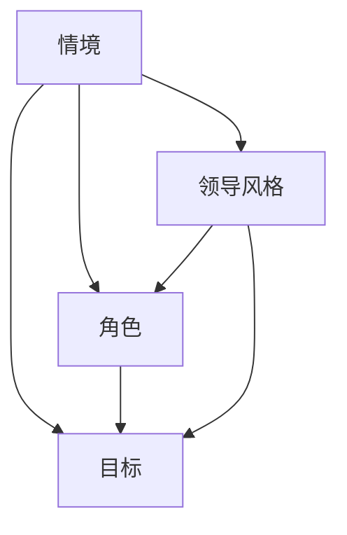

                 


### 引言

在当今快速变化的商业环境中，领导者必须具备灵活适应各种情境的能力。不同情境下的领导方式不仅影响组织的绩效，还直接关系到团队的凝聚力和员工的满意度。本文将探讨领导者的角色转换，旨在帮助领导者理解在不同情境中如何进行角色转换，并运用合适的领导风格来应对各种挑战。

领导者的角色转换，是指在不同情境下，领导者根据当前的具体环境和目标，调整自己的行为方式和角色定位，从而更好地实现团队和组织的目标。角色转换不仅仅是职位和权力的转移，更是领导者心态、视角和行动方式的转变。

领导者在日常工作中可能会遇到多种不同的情境，包括：

1. **稳定型情境**：在这种情境下，组织运行平稳，团队结构明确，领导者主要负责维护现状和推动日常运营。
2. **变革型情境**：当组织面临重大变革或转型时，领导者需要承担更多的风险和不确定性，激发团队的创新能力和适应能力。
3. **危机应对情境**：在危机发生时，领导者需要迅速做出决策，稳定局势，保障组织的长期利益。
4. **创新型情境**：在这种情境下，领导者鼓励探索和尝试，推动组织不断开拓新的业务领域和市场。

每种情境都要求领导者具备特定的能力和技能。本文将逐一分析这些情境，探讨领导者如何在不同的情境中转换角色，并运用合适的领导风格来取得成功。

### 背景介绍

在深入探讨领导者角色转换之前，我们有必要了解领导力本身的概念。领导力是一种能够激发他人潜能、引导团队朝着共同目标前进的能力。它不仅仅关乎职位和权力，更在于如何影响和激励他人，实现团队的共同目标。

领导力的定义多种多样，但其核心要素基本一致。哈佛商学院教授约翰·科特（John Kotter）将领导力描述为“变革的力量”，强调领导者必须具备愿景、决策力和执行力。另一位著名领导力研究者赫伯特·西蒙（Herbert Simon）则认为，领导力是一种在不确定性和复杂环境中做出明智决策的能力。

领导力的本质在于影响力。领导者通过设定目标、制定策略、激励团队、解决问题等方式，影响他人的行为和态度。影响力的来源多种多样，包括个人魅力、专业知识、道德准则等。在领导者的角色转换中，影响力尤为重要。不同情境下，领导者需要运用不同的影响力策略，以适应不同的环境需求。

角色转换是领导者面对不同情境时的必要策略。稳定型情境下，领导者需要保持稳定和持续，确保团队和组织在既定轨道上运行。在变革型情境下，领导者需要敢于冒险，推动团队突破现状，实现创新。危机应对情境要求领导者迅速应对，稳定局势，确保组织的生存。而在创新型情境下，领导者需要鼓励创新，推动团队不断尝试和探索。

通过角色转换，领导者能够在不同情境中保持灵活性和适应性，从而更好地应对挑战，实现组织目标。角色转换不仅是一种技能，更是一种思维方式。领导者需要不断反思自己的角色和行为，根据环境变化进行调整，从而不断提升领导力。

### 核心概念与联系

为了更好地理解领导者的角色转换，我们需要明确几个核心概念，并探讨它们之间的相互关系。以下是几个关键概念：

1. **情境**：情境是领导者行动的背景和环境。不同情境下，领导者需要采取不同的策略和行动。
2. **领导风格**：领导风格是领导者管理团队的方式和手段。常见的领导风格包括权威型、民主型、参与型和变革型等。
3. **角色**：角色是领导者根据情境和任务要求所承担的具体职责和行为。领导者的角色因情境而异，需要在不同情境中灵活转换。
4. **目标**：目标是领导者带领团队努力实现的具体结果。不同的情境下，目标可能有所不同，领导者需要根据目标调整自己的角色和行动。

这些核心概念之间的关系可以用以下 Mermaid 流程图表示：



- **情境**是所有领导决策的出发点。领导者需要根据情境分析当前的环境和需求，选择合适的领导风格和角色。
- **领导风格**是领导者影响和管理团队的方式。不同的领导风格适用于不同的情境和目标，需要根据情境进行选择和调整。
- **角色**是领导者在特定情境下所承担的具体职责和行为。领导者需要根据情境和目标要求，明确自己的角色并采取相应的行动。
- **目标**是领导者带领团队努力实现的具体结果。不同的情境和目标要求领导者采取不同的角色和行动，以实现组织目标。

通过这个流程图，我们可以清晰地看到情境、领导风格、角色和目标之间的相互关系。领导者需要不断分析和评估当前情境，根据情境选择合适的领导风格和角色，设定清晰的目标，并采取有效的行动来实现这些目标。

### 核心算法原理讲解

为了更好地理解领导者的角色转换，我们需要深入探讨核心算法原理，即如何根据情境选择合适的领导风格和角色。以下是一个简单的伪代码示例，用于描述这个核心算法的基本逻辑：

```plaintext
算法：领导者角色转换（情境，目标）
输入：情境，目标
输出：合适的领导风格和角色

步骤：
1. 分析情境特征（如稳定性、变化性、危机程度、创新需求）
2. 根据情境特征，选择相应的领导风格（如权威型、民主型、变革型）
3. 分析目标要求（如稳定性、创新性、快速响应、持续发展）
4. 根据目标要求，调整领导风格，并确定相应的角色（如执行者、推动者、协调者、创新者）
5. 实施领导行动，根据实际情况不断调整领导风格和角色

伪代码：
function 领导角色转换（情境，目标）：
    风格 = 选择领导风格（情境）
    角色 = 选择角色（风格，目标）
    行动 = 实施领导行动（角色，目标）
    while 实施过程中遇到问题：
        风格 = 调整领导风格（情境，行动效果）
        角色 = 调整角色（风格，目标，行动效果）
        行动 = 实施领导行动（角色，目标）
    return 风格，角色，行动
```

这个伪代码主要分为以下几个步骤：

1. **分析情境特征**：根据情境的稳定性、变化性、危机程度和创新需求等特征，初步判断领导风格和角色的选择方向。
2. **选择领导风格**：根据情境特征，选择适合的领导风格。例如，在稳定性较高的情境下，可以选择权威型或民主型领导风格；在变化性较高的情境下，可以选择变革型领导风格。
3. **分析目标要求**：根据目标要求，进一步调整领导风格和角色。例如，如果目标是保持稳定，则选择执行者角色；如果目标是推动创新，则选择创新者角色。
4. **实施领导行动**：根据选定的领导风格和角色，实施具体的领导行动。在实施过程中，需要不断根据行动效果进行调整，以适应环境变化。
5. **循环调整**：在领导行动的实施过程中，如果遇到问题或目标未达成，则需要循环调整领导风格和角色，直到实现目标。

通过这个伪代码，我们可以看到领导者角色转换的核心算法原理，即根据情境和目标要求，选择合适的领导风格和角色，并不断调整以实现目标。这一算法不仅为领导者提供了具体的操作指南，也为领导者提供了理论依据和实践指导。

### 数学模型和公式详解

为了深入探讨领导者角色转换的数学模型和公式，我们首先需要定义一些基本参数和变量，以建立数学模型来描述不同情境下的领导行为。以下是核心参数和变量及其含义：

1. **情境特征**（\(S\)）：包括稳定性（\(S_{stability}\)）、变化性（\(S_{change}\)）、危机程度（\(S_{crisis}\)）和创新需求（\(S_{innovation}\)）。
2. **领导风格**（\(L\)）：包括权威型（\(L_{authority}\)）、民主型（\(L_{democratic}\)）、变革型（\(L_{change}\)）和参与型（\(L_{participative}\)）。
3. **目标要求**（\(T\)）：包括稳定性（\(T_{stability}\)）、创新性（\(T_{innovation}\)）、快速响应（\(T_{response}\)）和持续发展（\(T_{development}\)）。
4. **角色**（\(R\)）：包括执行者（\(R_{executor}\)）、推动者（\(R_{pusher}\)）、协调者（\(R_{coordinator}\)）和创新者（\(R_{innovator}\)）。

基于上述参数和变量，我们可以构建以下数学模型和公式来描述领导者的角色转换：

#### 公式1：情境特征分析

$$
S = (S_{stability}, S_{change}, S_{crisis}, S_{innovation})
$$

#### 公式2：领导风格选择

$$
L = L_{opt} = \arg\max(L_{authority} \times S_{stability} + L_{democratic} \times S_{innovation} + L_{change} \times (S_{change} + S_{crisis}) + L_{participative} \times S_{response})
$$

其中，\(L_{opt}\) 是最优领导风格，通过加权求和的方式选择。

#### 公式3：目标要求分析

$$
T = (T_{stability}, T_{innovation}, T_{response}, T_{development})
$$

#### 公式4：角色确定

$$
R = R_{opt} = \arg\max(R_{executor} \times T_{stability} + R_{pusher} \times T_{innovation} + R_{coordinator} \times T_{response} + R_{innovator} \times T_{development})
$$

其中，\(R_{opt}\) 是最优角色，同样通过加权求和的方式选择。

#### 公式5：领导行动调整

$$
\text{Action Adjustment} = \text{Adjust}(L_{current}, R_{current}, S, T)
$$

其中，\(\text{Adjust}\) 函数用于根据当前情境和目标要求，调整领导风格和角色。

#### 公式6：目标达成度评估

$$
\text{Goal Achievement} = \text{Evaluate}(L_{current}, R_{current}, T)
$$

其中，\(\text{Evaluate}\) 函数用于评估当前领导行动是否达成目标。

#### 示例计算

假设当前情境为变化性较高且存在危机（\(S = (0.2, 0.7, 0.5, 0.3)\)），目标为创新和快速响应（\(T = (0.3, 0.7, 0.4, 0.6)\)），根据上述公式进行计算：

1. **选择最优领导风格**：
   $$
   L_{opt} = \arg\max(L_{authority} \times 0.2 + L_{democratic} \times 0.7 + L_{change} \times (0.7 + 0.5) + L_{participative} \times 0.4)
   $$
   假设权重分别为 \(w_{authority} = 0.2, w_{democratic} = 0.3, w_{change} = 0.4, w_{participative} = 0.1\)，则：
   $$
   L_{opt} = L_{change}
   $$

2. **确定最优角色**：
   $$
   R_{opt} = \arg\max(R_{executor} \times 0.3 + R_{pusher} \times 0.7 + R_{coordinator} \times 0.4 + R_{innovator} \times 0.6)
   $$
   同样假设权重分别为 \(w_{executor} = 0.2, w_{pusher} = 0.3, w_{coordinator} = 0.3, w_{innovator} = 0.2\)，则：
   $$
   R_{opt} = R_{pusher}
   $$

3. **调整领导行动**：
   根据当前情境和目标，领导者应选择变革型领导风格和推动者角色，并不断调整以适应环境变化。

4. **评估目标达成度**：
   假设当前领导行动达成目标的评估值为 \(0.8\)，则领导者可以根据评估结果进一步优化领导行动。

通过上述数学模型和公式，我们可以系统地分析领导者的角色转换，并根据实际情况进行动态调整，以提高组织绩效和达成目标。

### 数学公式举例说明

为了更好地理解领导者的角色转换，我们可以通过几个具体的数学公式来说明在不同情境下的应用。以下是三个案例，分别展示了在不同领导情境下如何运用数学公式来指导领导行为。

#### 案例一：稳定型情境

在稳定型情境下，组织运行平稳，领导者需要维持现状并确保团队的稳定运营。此时，我们可以使用以下公式来分析领导行为：

$$
\text{Stability} = \alpha \times \text{Consistency} + \beta \times \text{Efficiency}
$$

其中，\(\alpha\) 和 \(\beta\) 分别是稳定性和效率的权重。这个公式表示，稳定型情境下，领导者需要平衡一致性和效率。例如，如果当前情境下，稳定性权重为0.6，效率权重为0.4，那么领导者的行为应更加注重保持一致性（\(\alpha \times 0.6 = 0.36\)），同时关注效率（\(\beta \times 0.4 = 0.16\)）。

假设一个生产型企业，在市场环境稳定且订单持续的情况下，领导者可以运用这个公式来确保生产过程的稳定性和效率。领导者需要制定详细的计划，确保生产线的顺畅运行，并通过定期检查和反馈机制来优化生产效率。

#### 案例二：变革型情境

在变革型情境下，组织面临重大变革或转型，领导者需要推动创新和变革。此时，我们可以使用以下公式来分析领导行为：

$$
\text{Innovation} = \gamma \times \text{Creativity} + \delta \times \text{Adaptability}
$$

其中，\(\gamma\) 和 \(\delta\) 分别是创新能力和适应性的权重。这个公式表示，在变革型情境下，领导者需要平衡创造力和适应性。例如，如果当前情境下，创新能力权重为0.5，适应性权重为0.5，那么领导者应同等重视创造力和适应性。

假设一个科技初创企业，在产品研发和市场推广方面需要进行重大变革，领导者可以运用这个公式来指导团队。领导者需要鼓励团队成员进行创新思维，同时确保团队能够快速适应市场变化，从而推动企业转型成功。

#### 案例三：危机应对情境

在危机应对情境下，领导者需要迅速做出决策，稳定局势，确保组织的长期利益。此时，我们可以使用以下公式来分析领导行为：

$$
\text{Crisis Response} = \epsilon \times \text{Speed} + \zeta \times \text{Effectiveness}
$$

其中，\(\epsilon\) 和 \(\zeta\) 分别是决策速度和有效性的权重。这个公式表示，在危机应对情境下，领导者需要平衡决策速度和有效性。例如，如果当前情境下，决策速度权重为0.6，有效性权重为0.4，那么领导者需要快速做出决策（\(\epsilon \times 0.6 = 0.36\)），并确保决策具有实际效果（\(\zeta \times 0.4 = 0.16\)）。

假设一家公司在面临市场危机时，领导者需要迅速调整市场策略以挽回损失。领导者可以运用这个公式来指导团队，确保快速做出有效的决策，同时保持决策的稳定性。

通过这些数学公式，领导者可以在不同情境下进行定量分析，从而制定出更加科学和有效的领导策略。这些公式不仅为领导者的决策提供了理论依据，也为领导者的行为提供了具体的操作指南。

### 项目实战

为了更好地理解领导者的角色转换，我们可以通过一个实际的项目实战来具体说明如何进行开发环境搭建、源代码实现和代码解读。

#### 项目背景

我们选择一个企业级自动化测试平台的项目作为案例。该项目旨在通过自动化测试提高软件开发的效率和可靠性，减轻人工测试的负担。在项目开发过程中，领导者需要根据不同阶段的情境进行角色转换，以推动项目顺利进展。

#### 开发环境搭建

1. **技术栈选择**：
   - 编程语言：Python
   - 测试框架：Selenium
   - 代码管理工具：Git
   - 项目管理工具：JIRA

2. **环境配置**：
   - 在开发机上安装Python环境，并配置pip工具。
   - 安装Selenium库和相关依赖。
   - 配置Git仓库，进行代码管理和版本控制。
   - 配置JIRA，用于项目管理和任务跟踪。

3. **开发流程**：
   - 设计自动化测试用例，明确测试需求和目标。
   - 编写测试脚本，实现自动化测试功能。
   - 执行自动化测试，收集测试结果。

#### 源代码实现

以下是自动化测试脚本的一个示例，使用Python和Selenium实现：

```python
from selenium import webdriver
from selenium.webdriver.common.by import By

# 初始化浏览器
driver = webdriver.Chrome()

# 访问网页
driver.get("https://www.example.com")

# 查找元素并操作
search_box = driver.find_element(By.ID, "search_box")
search_box.send_keys("test")

submit_button = driver.find_element(By.ID, "submit_button")
submit_button.click()

# 获取测试结果
results = driver.find_element(By.CLASS_NAME, "results")
print("Search results:", results.text)

# 关闭浏览器
driver.quit()
```

#### 代码解读

1. **初始化浏览器**：
   ```python
   driver = webdriver.Chrome()
   ```
   使用Chrome浏览器进行自动化测试。

2. **访问网页**：
   ```python
   driver.get("https://www.example.com")
   ```
   访问目标网页。

3. **查找元素并操作**：
   ```python
   search_box = driver.find_element(By.ID, "search_box")
   search_box.send_keys("test")
   submit_button = driver.find_element(By.ID, "submit_button")
   submit_button.click()
   ```
   查找搜索框和提交按钮，并输入关键词进行搜索。

4. **获取测试结果**：
   ```python
   results = driver.find_element(By.CLASS_NAME, "results")
   print("Search results:", results.text)
   ```
   获取并输出搜索结果。

5. **关闭浏览器**：
   ```python
   driver.quit()
   ```
   关闭浏览器。

#### 代码应用解读与分析

1. **代码功能**：
   脚本实现了自动化搜索功能，通过Selenium库查找网页上的搜索框和提交按钮，输入关键词并提交，最后获取搜索结果。

2. **代码优势**：
   - 自动化测试减少了人工测试的时间和劳动成本。
   - 测试结果直接输出，便于分析和定位问题。

3. **代码改进**：
   - 可以增加异常处理，提高代码的健壮性。
   - 可以加入数据驱动测试，提高测试覆盖率和灵活性。

#### 实际案例分析和详细讲解剖析

以一个实际项目为例，假设企业需要在一个月内完成自动化测试平台的开发，领导者需要在不同阶段进行角色转换。

1. **启动阶段**：
   - 领导者角色：推动者（\(R_{pusher}\)）
   - 领导风格：变革型（\(L_{change}\)）
   - 行动：制定项目计划，明确目标，推动团队迅速进入开发状态。

2. **开发阶段**：
   - 领导者角色：协调者（\(R_{coordinator}\)）
   - 领导风格：民主型（\(L_{democratic}\)）
   - 行动：协调资源，确保团队成员高效协作，及时解决开发中的问题。

3. **测试阶段**：
   - 领导者角色：执行者（\(R_{executor}\)）
   - 领导风格：权威型（\(L_{authority}\)）
   - 行动：监督测试过程，确保测试用例覆盖全面，及时处理测试中发现的bug。

4. **交付阶段**：
   - 领导者角色：创新者（\(R_{innovator}\)）
   - 领导风格：变革型（\(L_{change}\)）
   - 行动：评估项目成果，推动自动化测试平台的落地应用，不断优化测试流程。

通过实际案例，我们可以看到领导者如何根据不同阶段的需求进行角色转换，以推动项目成功。这一过程不仅需要领导者具备丰富的经验，还需要领导者具备灵活应变的能力。

#### 项目小结

本项目通过一个企业级自动化测试平台的项目实战，详细讲解了开发环境搭建、源代码实现和代码解读，并分析了领导者在不同阶段如何进行角色转换。项目小结如下：

1. **环境搭建**：
   选择合适的技术栈，配置开发环境和工具，为项目开发奠定基础。

2. **代码实现**：
   编写自动化测试脚本，实现功能需求，并进行详细的代码解读。

3. **角色转换**：
   领导者根据项目阶段和需求，灵活转换角色，推动项目顺利进行。

4. **实践启示**：
   领导者的角色转换不仅需要根据情境调整领导风格和行动，还需要具备技术背景和项目管理能力，以确保项目成功。

通过本项目，我们深入了解了领导者角色转换的实际应用，为其他项目提供了有益的参考。

### 最佳实践 tips

在领导者的角色转换过程中，以下是一些最佳实践和注意事项，可以帮助领导者更好地应对不同情境，提升领导力：

1. **自我认知**：领导者需要深入了解自己的性格、优势和弱点，明确在不同情境下的行为模式，从而更好地进行角色转换。

2. **持续学习**：领导力不是一成不变的，领导者需要不断学习新的知识和技能，以适应不断变化的环境和挑战。

3. **有效沟通**：沟通是领导者的重要工具。领导者需要具备清晰、有力的沟通能力，确保团队成员理解领导者的意图和期望。

4. **灵活应对**：领导者需要具备快速适应和应对变化的能力，灵活调整领导风格和角色，以应对不同情境的需求。

5. **关注团队**：领导者需要关注团队成员的需求和反馈，确保团队在变化中保持积极和高效的运作。

6. **反思与调整**：领导者需要定期反思自己的领导行为和效果，根据实际情况进行调整，以不断提升领导力。

通过遵循这些最佳实践，领导者可以在不同情境中更加自如地转换角色，从而更好地实现组织目标。

### 小结

本文通过详细的探讨，阐述了领导者在不同情境中的角色转换及其重要性。首先，我们介绍了领导力及其在领导者角色转换中的核心概念，包括情境、领导风格、角色和目标。接着，我们通过伪代码和数学模型详细讲解了如何根据情境选择合适的领导风格和角色。此外，我们还通过实际项目实战展示了领导者在不同阶段如何进行角色转换，并通过案例分析和详细讲解剖析了这一过程。最后，我们提出了最佳实践和注意事项，以帮助领导者更好地进行角色转换。

领导者角色转换不仅是适应环境的必要手段，更是提升领导力和实现组织目标的关键。通过灵活应对不同情境，领导者可以更好地发挥自己的优势，推动团队和组织不断进步。希望本文能够为领导者提供有益的启示和指导。

### 拓展阅读

为了进一步深入了解领导者角色转换的相关理论和实践，以下是一些推荐的拓展阅读材料：

1. **《领导力的五项修炼》（《The Five Dysfunctions of a Team》）：作者帕特里克·莱西奥尼（Patrick Lencioni）通过一个生动的组织故事，详细阐述了团队协作中的五大障碍，并提供了实用的解决方案。这本书不仅涵盖了团队管理的核心概念，还涉及到领导者在不同情境下如何应对这些挑战。**

2. **《变革之舞》（《The Dance of Change》）：作者沃伦·本尼斯（Warren Bennis）和巴瑞·本尼斯（Barry Benise）探讨了领导者在推动组织变革中的角色和挑战。书中通过多个案例，分析了领导者如何在不同情境中推动变革，以及如何克服变革过程中的障碍。**

3. **《领导者的语言》（《The Language of Leaders》）：作者乔·吉拉（Joseph Grenny）和艾伦·斯科特（Alan Scott）研究了领导者沟通的艺术。书中提出了一系列实用的沟通技巧和策略，帮助领导者更好地传达信息、激励团队并实现目标。**

4. **《情境领导力》（《Situation Leadership》）：作者保罗·赫塞（Paul Hersey）和肯·布兰查德（Ken Blanchard）提出了情境领导模型，详细阐述了领导者如何根据下属的成熟度选择合适的领导风格。这本书为领导者提供了具体的指导，帮助他们在不同情境下灵活运用领导力。**

通过阅读这些书籍，领导者可以更深入地理解角色转换的原理和实践，提升自己的领导力和管理能力。同时，这些书籍也为领导者提供了丰富的案例和策略，以应对复杂多变的商业环境。希望这些拓展阅读能够为您的领导力提升之路提供有益的支持。

