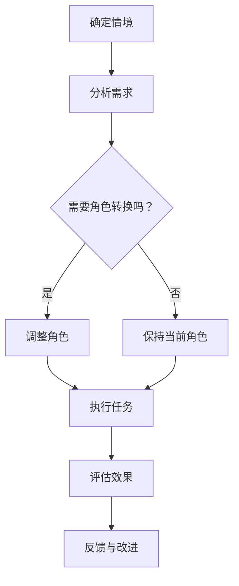
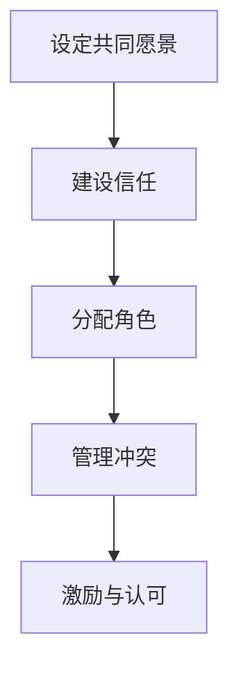
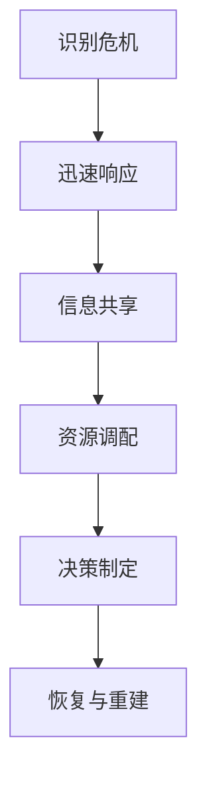
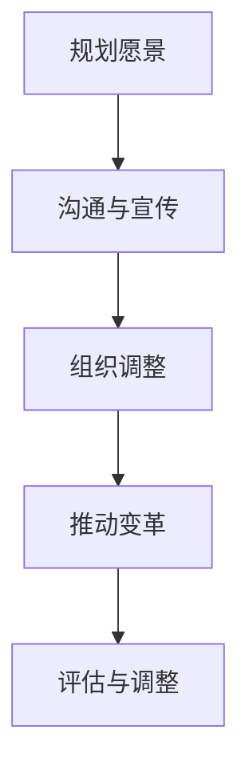
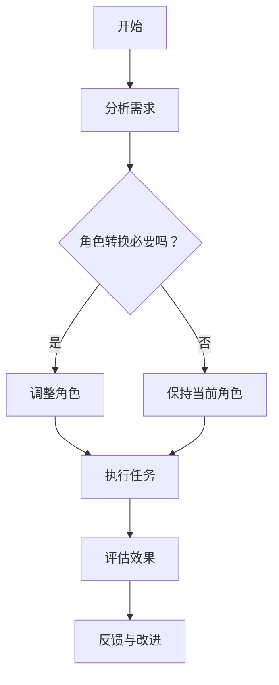

                 

### 文章标题

# 领导者的角色转换：在不同情境中的领导方式

### 关键词

- 领导者角色转换
- 团队建设
- 危机管理
- 变革管理
- 领导策略

### 摘要

本文深入探讨了领导者如何在不同的情境中转换角色和领导方式。通过阐述领导者角色转换的基本原理，分析不同情境下的领导策略，以及成功案例的解析，本文为领导者提供了实用的实践指南，旨在帮助他们在各种复杂环境中更加有效地发挥领导作用。

---

### 引言

在组织管理中，领导者角色的转换是一个不可忽视的重要议题。领导者不仅需要在日常运营中发挥指导作用，还需在不同情境下迅速调整自己的角色和策略，以应对各种挑战和变化。本文将详细探讨领导者的角色转换，包括其基本原理、不同情境下的领导策略以及实际案例分析，旨在为领导者提供有价值的指导。

#### 领导者的角色定义与作用

在开始讨论领导者角色转换之前，首先需要明确领导者的角色定义与作用。领导者是组织的核心，他们负责引导团队、设定目标、协调资源、激励员工以及解决各种问题。领导者的角色不仅仅是发号施令，更是一种影响力和启发力的体现。

##### 角色定义

领导者的角色可以概括为以下几个方面：

1. **战略规划者**：领导者需要制定组织的长远规划和战略目标，确保组织朝着正确的方向前进。
2. **决策者**：领导者负责做出关键决策，解决组织面临的各种问题和挑战。
3. **沟通者**：领导者需要与团队成员、上级和外部利益相关者保持有效沟通，确保信息的畅通无阻。
4. **激励者**：领导者需要激励团队成员，激发他们的积极性和创造力，以实现组织目标。
5. **变革推动者**：在变革时期，领导者需要引导团队接受变革，推动组织的发展。

##### 角色作用

领导者的角色作用主要体现在以下几个方面：

1. **引导团队**：领导者通过设定愿景和目标，引导团队朝着共同的目标努力。
2. **协调资源**：领导者需要合理分配和利用组织资源，以支持团队的工作。
3. **解决问题**：领导者需要面对各种问题和挑战，找出解决方案，确保组织的稳定运行。
4. **培养人才**：领导者需要关注团队成员的成长和发展，提供培训和支持。
5. **文化塑造**：领导者通过自身行为和决策，塑造组织的文化和价值观。

#### 角色转换的必要性

在不同的情境下，领导者需要根据实际情况和目标需求，灵活转换自己的角色。角色转换的必要性主要体现在以下几个方面：

1. **适应变化**：组织环境不断变化，领导者需要根据变化调整自己的角色，以适应新的挑战。
2. **提高效能**：通过角色转换，领导者可以更有效地利用自己的优势和资源，提高领导效能。
3. **增强灵活性**：领导者角色转换使组织更具灵活性，能够迅速应对外部环境和内部需求的变化。
4. **提升团队表现**：领导者角色转换有助于提升团队的整体表现，实现组织的目标。

#### 角色转换的方法与技巧

为了实现有效的角色转换，领导者可以采取以下方法和技巧：

1. **自我认知**：领导者需要深入了解自己的优势和不足，明确在不同情境下的角色定位。
2. **情景分析**：领导者需要对当前情境进行深入分析，了解环境变化和目标需求。
3. **灵活调整**：领导者需要根据情境变化，灵活调整自己的角色和行为。
4. **培养团队成员**：领导者需要培养团队成员，使其具备独立工作和应对复杂情境的能力。
5. **建立信任**：领导者需要建立与团队成员的信任关系，以增强团队的凝聚力和协作能力。

#### Mermaid流程图：领导者角色转换过程

为了更好地理解领导者角色转换的过程，以下是一个简单的Mermaid流程图：



通过这个流程图，领导者可以系统地理解角色转换的过程，并据此进行有效的角色转换。

#### 核心概念与联系

在领导者角色转换的过程中，几个核心概念和联系至关重要。这些概念包括：

1. **情境分析**：领导者需要分析当前情境，以确定角色转换的必要性。
2. **角色定位**：领导者需要根据情境和目标，明确自己的角色定位。
3. **灵活调整**：领导者需要根据情境变化，灵活调整自己的角色和行为。
4. **团队协作**：领导者需要与团队成员保持良好的沟通和协作，以实现角色转换的顺利实施。

这些核心概念相互联系，共同构成了领导者角色转换的理论基础。在下一节中，我们将进一步探讨不同情境下的领导策略。

---

#### 不同情境下的领导策略

在不同的情境中，领导者的角色和策略也会有所不同。以下是几种常见情境下的领导策略：

##### 团队建设情境

在团队建设情境中，领导者的核心任务是建立团队凝聚力，提高团队协作效率。以下是一些团队建设情境下的领导策略：

1. **共同愿景**：领导者需要与团队成员共同设定愿景和目标，确保团队成员对团队目标和方向有清晰的认识。
2. **信任建设**：领导者需要通过沟通和行动建立信任，促进团队成员之间的信任和合作。
3. **角色分配**：领导者需要根据团队成员的能力和兴趣，合理分配任务，确保每个人都能在自己的岗位上发挥最大作用。
4. **冲突管理**：领导者需要积极处理团队成员之间的冲突，通过对话和妥协找到解决方案。
5. **激励与认可**：领导者需要通过激励和认可来提高团队成员的积极性和满意度，促进团队发展。

以下是一个团队建设情境下的Mermaid流程图：



##### 危机管理情境

在危机管理情境中，领导者的核心任务是迅速应对危机，减轻危机影响，并防止危机再次发生。以下是一些危机管理情境下的领导策略：

1. **迅速响应**：领导者需要迅速识别危机，并采取行动应对危机。
2. **信息共享**：领导者需要确保团队成员获得关于危机的准确信息，以支持他们的决策。
3. **资源调配**：领导者需要合理调配组织资源，支持危机应对工作。
4. **决策制定**：领导者需要制定有效的决策，以应对危机并防止危机扩大。
5. **恢复与重建**：领导者需要关注危机后的恢复和重建工作，确保组织恢复正常运作。

以下是一个危机管理情境下的Mermaid流程图：



##### 变革管理情境

在变革管理情境中，领导者的核心任务是推动组织变革，适应外部环境的变化。以下是一些变革管理情境下的领导策略：

1. **愿景规划**：领导者需要明确变革的愿景，并与团队成员分享，以获得他们的支持和参与。
2. **沟通与宣传**：领导者需要通过有效的沟通和宣传，使团队成员了解变革的原因、目标和过程。
3. **组织调整**：领导者需要根据变革需求，调整组织结构、流程和文化。
4. **变革推动**：领导者需要积极推动变革，通过激励和示范来引导团队成员参与变革。
5. **评估与调整**：领导者需要持续评估变革的效果，并根据评估结果进行调整。

以下是一个变革管理情境下的Mermaid流程图：



通过这些领导策略，领导者可以更有效地应对不同情境的挑战，实现组织的持续发展。

### 成功案例分析

为了更好地理解领导者角色转换在不同情境中的应用，以下是几个成功案例的分析：

#### 案例一：领导者角色转换在团队建设中的成功实践

某公司的团队在过去一直表现不佳，团队成员之间缺乏信任和合作。公司领导意识到这个问题，并决定通过领导者角色转换来改善团队状况。

1. **共同愿景**：领导者在一次全体会议上提出了团队的共同愿景，并邀请团队成员参与讨论和制定。
2. **信任建设**：领导者通过组织团队建设活动和团队培训，促进团队成员之间的信任和合作。
3. **角色分配**：领导者根据团队成员的能力和兴趣，重新分配任务，确保每个人都能在自己的岗位上发挥最大作用。
4. **冲突管理**：领导者积极处理团队成员之间的冲突，通过对话和妥协找到解决方案。
5. **激励与认可**：领导者通过激励和认可来提高团队成员的积极性和满意度。

通过这些措施，团队逐渐建立了信任和合作，工作效率显著提高，团队绩效也得到了显著提升。

#### 案例二：领导者角色转换在危机管理中的成功实践

某公司在一次市场变化中遭遇了重大危机，订单大量减少，公司面临严重的财务危机。公司领导通过领导者角色转换，成功应对了这场危机。

1. **迅速响应**：领导者迅速识别了危机，并立即采取行动应对。
2. **信息共享**：领导者确保团队成员获得关于危机的准确信息，支持他们的决策。
3. **资源调配**：领导者合理调配组织资源，支持危机应对工作。
4. **决策制定**：领导者制定了一系列决策，包括裁员、减薪和调整营销策略，以减轻危机影响。
5. **恢复与重建**：领导者关注危机后的恢复和重建工作，确保公司恢复正常运作。

通过这些措施，公司成功度过了危机，并逐渐恢复了正常运营。

#### 案例三：领导者角色转换在变革管理中的成功实践

某公司在市场竞争加剧的背景下，决定进行组织变革，以提升竞争力。公司领导通过领导者角色转换，成功推动了这场变革。

1. **愿景规划**：领导者在一次全体会议上明确了变革的愿景，并与团队成员分享。
2. **沟通与宣传**：领导者通过有效的沟通和宣传，使团队成员了解变革的原因、目标和过程。
3. **组织调整**：领导者根据变革需求，调整了组织结构、流程和文化。
4. **变革推动**：领导者积极推动变革，通过激励和示范来引导团队成员参与变革。
5. **评估与调整**：领导者持续评估变革的效果，并根据评估结果进行调整。

通过这些措施，公司成功实现了变革，并在市场中获得了更大的竞争优势。

### 实践指南

为了帮助领导者更有效地进行角色转换，以下是几个实用的指南：

1. **了解自己的优势和不足**：领导者需要深入了解自己的优势和不足，以便在不同情境下进行有效的角色转换。
2. **持续学习和提升**：领导者需要持续学习和提升自己的领导能力，以适应不断变化的环境和挑战。
3. **积极沟通和反馈**：领导者需要与团队成员保持积极沟通，并及时获取反馈，以调整自己的角色和行为。
4. **关注团队成员的成长**：领导者需要关注团队成员的成长和发展，提供培训和支持，以增强团队的整体能力。
5. **勇于尝试和创新**：领导者需要勇于尝试新的领导方法和工具，不断创新，以提高领导效能。

### 结论和展望

领导者角色转换是组织管理中的重要议题，不同的情境需要领导者采取不同的角色和策略。通过本文的探讨，我们了解了领导者角色转换的基本原理和不同情境下的领导策略。未来，随着组织环境的不断变化，领导者需要不断调整自己的角色，以适应新的挑战和需求。希望本文能为领导者提供有价值的指导和启示。

### 附录

为了更好地理解本文的内容，以下是几个附录：

#### 附录一：Mermaid流程图示例



#### 附录二：伪代码示例

```python
def role_conversion(context):
    if context == "team_building":
        set_common_vision()
        build_trust()
        assign_roles()
        manage_conflicts()
        motivate_and_recognize()
    elif context == "crisis_management":
        respond Quickly()
        share_information()
        allocate_resources()
        make_decisions()
        recover_and_rebuild()
    elif context == "change_management":
        plan_vision()
        communicate_and_educate()
        adjust_organization()
        drive_change()
        evaluate_and_adjust()
```

#### 附录三：LaTeX格式数学模型示例

```latex
\documentclass{article}
\usepackage{amsmath}
\begin{document}
\begin{equation}
    \text{Performance} = f(\text{Vision}, \text{Trust}, \text{Role Assignment}, \text{Conflict Management}, \text{Motivation})
\end{equation}
\end{document}
```

#### 附录四：项目实战示例

```python
# 安装所需的库
!pip install team_builder

# 导入库
import team_builder

# 创建团队
team = team_builder.create_team("Project X")

# 设定共同愿景
team.set_common_vision("Achieve project goals by Q4 2023")

# 建立信任
team.build_trust()

# 分配角色
team.assign_roles()

# 管理冲突
team.manage_conflicts()

# 激励与认可
team.motivate_and_recognize()

# 运行项目
team.run_project()
```

通过这些附录，读者可以更深入地理解本文的内容和应用。

### 结语

作者：AI天才研究院/AI Genius Institute & 禅与计算机程序设计艺术 /Zen And The Art of Computer Programming

在组织管理中，领导者角色转换是一项关键能力。通过本文的探讨，我们了解了领导者如何在不同情境下转换角色和策略，以及成功案例的实践。希望本文能为领导者提供有价值的指导和启示，助力他们在复杂环境中更好地发挥领导作用。未来的领导之路，充满挑战和机遇，让我们共同探索、不断前行。

