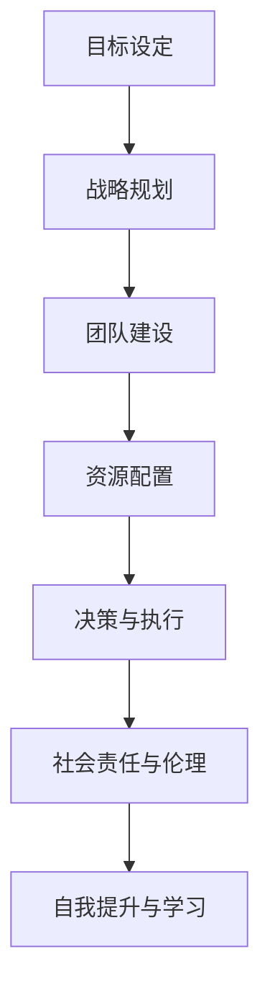
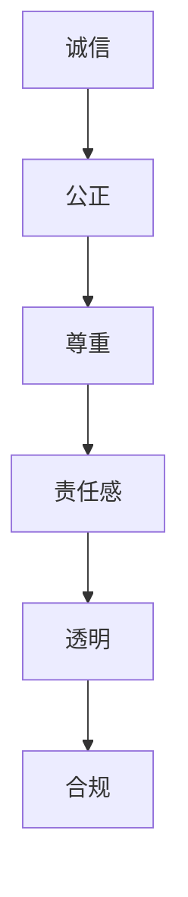
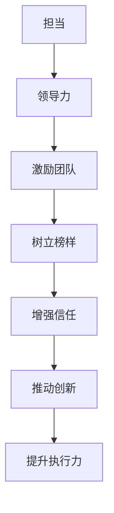
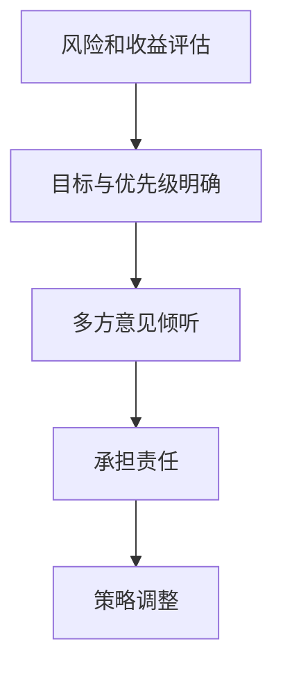
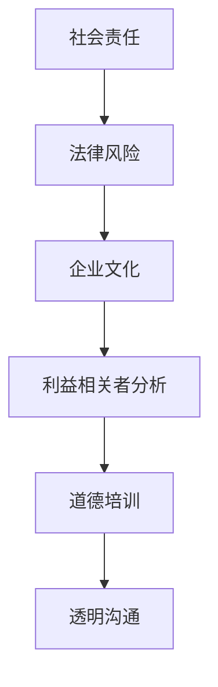
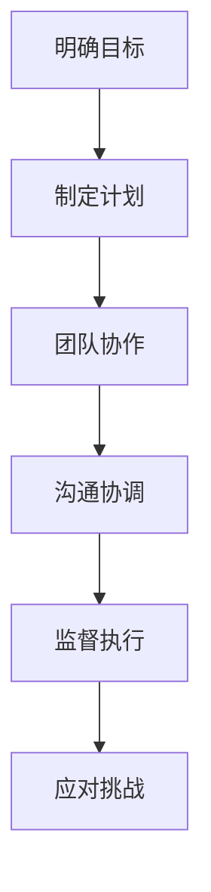
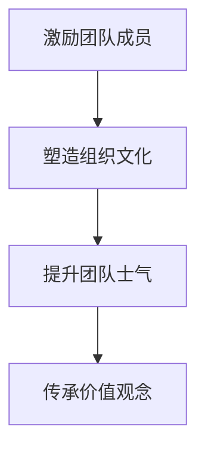
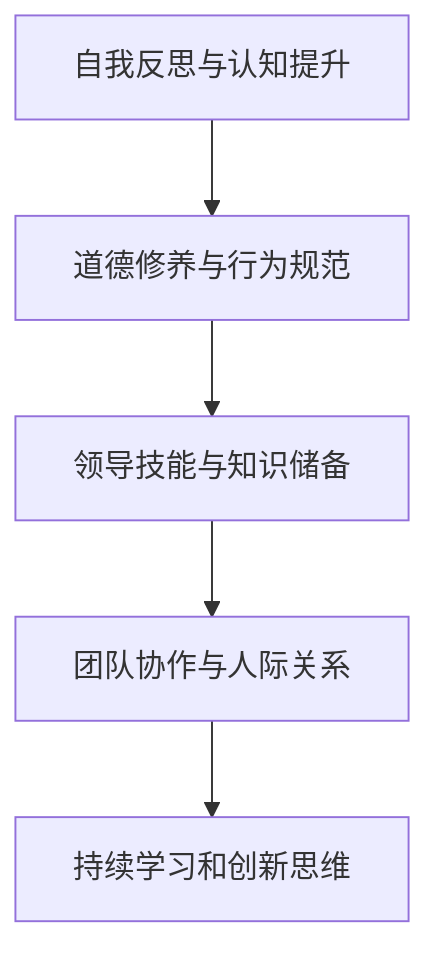
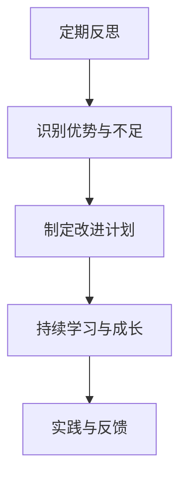

                 

### 文章标题

**领导者的责任与担当：树立榜样力量**

### 关键词

- 领导者责任
- 担当精神
- 榜样力量
- 领导力
- 道德责任
- 自我提升

### 摘要

本文深入探讨了领导者责任与担当的重要性，以及如何通过树立榜样力量来提升领导效能。首先，我们概述了领导者责任的基本概念和核心要素，分析了道德责任在领导实践中的关键作用。接着，我们探讨了担当与领导力的关系，以及领导者如何通过决策与行动来实现担当。然后，我们重点讨论了领导者的榜样作用及其塑造方法，强调了个人影响力与团队文化的重要性。最后，我们提出了领导者自我提升与担当实践的建议，总结并提供了拓展阅读，以帮助读者深化理解。本文旨在为领导者提供理论指导和实践建议，助力其在复杂多变的环境中树立榜样力量，提升领导力。

### 文章目录

#### 第一部分：领导者的责任概述

1. **第1章：领导者责任的内涵**
   1.1 领导者责任的基本概念
   1.2 领导者责任的历史演变
   1.3 领导者责任的现代解读

2. **第2章：领导者的道德责任**
   2.1 道德责任的概念与重要性
   2.2 领导者道德责任的主要内容
   2.3 道德责任与法律法规的关系
   2.4 道德责任的具体案例分析

#### 第二部分：领导者的担当实践

3. **第3章：担当与领导力的关系**
   3.1 担当的概念与内涵
   3.2 担当在领导力中的作用
   3.3 担当与领导力的互动关系

4. **第4章：领导者的决策与担当**
   4.1 担当决策的背景分析
   4.2 担当决策的原则与方法
   4.3 担当决策的案例分析
   4.4 决策中的道德考量

5. **第5章：领导者的行动与担当**
   5.1 担当行动的概念与特征
   5.2 担当行动的实施策略
   5.3 担当行动的挑战与应对

#### 第三部分：树立榜样的力量

6. **第6章：领导者的榜样作用**
   6.1 榜样的定义与作用
   6.2 榜样在组织文化中的地位
   6.3 领导者如何发挥榜样作用

7. **第7章：领导者的榜样塑造**
   7.1 领导者品质的培养路径
   7.2 领导风格与榜样塑造的关系
   7.3 领导者如何塑造自己的榜样形象
   7.4 个人影响力与团队文化

8. **第8章：领导者的自我提升与担当**
   8.1 自我提升的重要性
   8.2 领导者的自我反思与成长
   8.3 领导者的终身学习与担当实践

#### 参考文献

9. **参考文献列表**
   - [参考文献1标题]
     作者. (年份). 标题. 出版社.
   - [参考文献2标题]
     作者. (年份). 标题. 出版社.
   - [参考文献3标题]
     作者. (年份). 标题. 出版社.
   - ...

### 第一部分：领导者的责任概述

#### 第1章：领导者责任的内涵

**1.1 领导者责任的基本概念**

领导者责任是指在组织、团队或社会管理中，领导者承担的职责和义务。这种责任不仅涉及领导者的个人行为，还包括其对组织或团队发展的贡献和对社会的影响。领导者责任的核心在于其必须具备一定的权力、资源和能力，以实现组织或团队的目标，同时促进组织或团队的可持续发展。

在技术领域，领导者的责任尤为重要。技术领导者不仅需要掌握先进的技术知识和技能，还必须具备优秀的领导能力和决策能力，以确保技术团队能够高效地开展工作，推动技术进步和创新。此外，领导者还应当关注技术伦理和道德规范，确保技术的发展和应用不会对社会和环境造成负面影响。

**1.2 领导者责任的历史演变**

领导者责任的概念并非一成不变，它随着社会历史的发展而演变。在古代，领导者的责任主要集中于政治和军事领域，强调的是统治和管理能力。随着工业革命的到来，领导者的责任逐渐扩展到经济和生产领域，强调的是组织管理和效率。

在现代社会，领导者的责任更加多元化和复杂化。除了传统的工作管理职责外，领导者还需要关注团队建设、企业文化、社会责任等方面。随着信息技术的飞速发展，领导者还需要具备数字化转型和创新能力，以应对不断变化的市场环境和竞争压力。

**1.3 领导者责任的现代解读**

在现代组织中，领导者责任的核心可以概括为以下几个方面：

1. **目标设定与战略规划**：领导者需要明确组织或团队的目标，并制定相应的战略规划，以确保目标的实现。

2. **团队建设与管理**：领导者需要培养和激发团队的潜力，建立高效的团队协作机制，提升团队的凝聚力和执行力。

3. **资源配置与优化**：领导者需要合理配置组织或团队的资源，包括人力、物力和财力，以实现资源的最大化利用。

4. **决策与执行**：领导者需要在复杂多变的环境中做出明智的决策，并确保决策的有效执行。

5. **社会责任与伦理**：领导者需要关注组织或团队的社会责任和伦理问题，确保其经营活动符合法律法规和社会道德标准。

6. **自我提升与学习**：领导者需要不断学习新知识、新技能，提升自己的领导能力和管理能力。

**核心概念与联系**

为了更好地理解领导者责任，我们可以使用Mermaid流程图来展示其核心概念之间的关系：



**核心算法原理讲解**

在领导者责任的现代解读中，我们可以使用以下伪代码来描述其核心算法原理：

```plaintext
function 领导者责任(目标，团队，资源，环境) {
    设定目标(目标)
    规划战略(目标)
    建设团队(团队)
    资源配置(资源)
    做出决策(环境)
    执行决策(环境)
    负责任(社会责任与伦理)
    学习与提升(自我提升与学习)
}
```

**数学模型和公式**

为了更深入地理解领导者责任，我们可以使用以下数学模型和公式来描述其关键要素之间的关系：

$$
\text{领导者责任} = f(\text{目标设定}, \text{团队建设}, \text{资源配置}, \text{决策与执行}, \text{社会责任与伦理}, \text{自我提升与学习})
$$

**详细讲解与举例说明**

假设一家技术公司的领导者需要承担其团队的责任。在这种情况下，领导者的责任可以具体化为以下几个方面：

1. **目标设定**：领导者需要明确公司的愿景和使命，并制定具体的业务目标。

2. **战略规划**：领导者需要根据目标制定长期和短期的战略规划，确保公司的持续发展。

3. **团队建设**：领导者需要招聘和培养合适的人才，建立高效的团队协作机制。

4. **资源配置**：领导者需要合理配置公司的人力、物力和财力资源，确保团队的高效运作。

5. **决策与执行**：领导者需要根据市场环境和公司情况做出明智的决策，并确保决策的有效执行。

6. **社会责任与伦理**：领导者需要关注公司的社会责任和伦理问题，确保公司的经营活动符合法律法规和社会道德标准。

7. **自我提升与学习**：领导者需要不断学习新知识、新技能，提升自己的领导能力和管理能力。

通过这些方面的具体实践，领导者可以更好地履行其责任，推动公司的发展和团队的成长。

**项目实战**

假设一家技术公司面临市场环境的变化，领导者需要制定相应的战略规划来应对挑战。在这种情况下，领导者的责任可以具体化为以下几个方面：

1. **目标设定**：领导者需要明确公司的短期和长期目标，确保目标具有可操作性和可实现性。

2. **战略规划**：领导者需要分析市场环境，制定具体的业务策略，包括产品开发、市场拓展、资源整合等方面。

3. **团队建设**：领导者需要评估团队的能力和潜力，招聘和培养合适的人才，确保团队能够高效地执行战略规划。

4. **资源配置**：领导者需要合理配置公司的人力、物力和财力资源，确保团队能够有足够的资源支持战略规划的执行。

5. **决策与执行**：领导者需要根据市场环境和公司情况做出明智的决策，并确保决策的有效执行。

6. **社会责任与伦理**：领导者需要关注公司的社会责任和伦理问题，确保公司的经营活动符合法律法规和社会道德标准。

7. **自我提升与学习**：领导者需要不断学习新知识、新技能，提升自己的领导能力和管理能力。

通过这些方面的具体实践，领导者可以更好地履行其责任，推动公司的发展和团队的成长。

**最佳实践 tips**

1. **明确目标**：领导者需要明确组织的愿景和使命，确保目标具有可操作性和可实现性。

2. **培养团队**：领导者需要关注团队建设，培养团队成员的能力和潜力，建立高效的团队协作机制。

3. **合理配置资源**：领导者需要合理配置组织的人力、物力和财力资源，确保资源的最大化利用。

4. **决策要果断**：领导者需要根据市场环境和公司情况做出明智的决策，并确保决策的有效执行。

5. **关注社会责任与伦理**：领导者需要关注组织的社会责任和伦理问题，确保组织的经营活动符合法律法规和社会道德标准。

6. **持续学习与提升**：领导者需要不断学习新知识、新技能，提升自己的领导能力和管理能力。

**小结**

领导者责任是组织或团队发展的重要保障。通过明确目标、培养团队、合理配置资源、果断决策、关注社会责任与伦理以及持续学习与提升，领导者可以更好地履行其责任，推动组织或团队的发展。

#### 第2章：领导者的道德责任

**2.1 道德责任的概念与重要性**

道德责任是指领导者在其职位上所承担的道德义务和责任。它不仅涉及领导者个人的行为规范，还包括其对组织、团队和社会的影响。道德责任的核心在于领导者必须具备高尚的道德品质，以身作则，树立良好的道德榜样。

在技术领域，领导者的道德责任尤为重要。随着技术的发展和应用，领导者不仅要关注技术本身，还需要关注技术对社会和环境的影响。例如，在人工智能、大数据等领域，领导者需要确保技术的使用符合伦理和道德标准，避免技术滥用和隐私侵犯。

道德责任的重要性体现在以下几个方面：

1. **塑造企业文化**：领导者的道德行为直接影响组织的文化和价值观。一个具有高尚道德品质的领导者能够塑造积极向上的企业文化，提升组织的凝聚力和执行力。

2. **引导团队行为**：领导者的道德责任可以引导团队成员遵循道德规范，避免不当行为的发生。通过树立道德榜样，领导者能够激发团队成员的道德意识，提升团队的整体素质。

3. **增强公信力**：领导者的道德责任有助于增强其在组织和社会中的公信力。一个具有高尚道德品质的领导者更容易获得组织成员和公众的信任和尊重。

4. **促进可持续发展**：领导者的道德责任有助于推动组织的可持续发展。通过关注社会和环境责任，领导者能够确保组织的经营活动符合法律法规和社会道德标准，实现长期发展。

**2.2 领导者道德责任的主要内容**

领导者道德责任的主要内容包括以下几个方面：

1. **诚信**：领导者必须具备高度的诚信，坚守承诺，言行一致。诚信是领导者赢得信任和尊重的基础。

2. **公正**：领导者需要公正无私，公平对待每一位团队成员，确保团队中的每个人都能够得到公平的机会和待遇。

3. **尊重**：领导者需要尊重团队成员的个性和差异，关注团队成员的感受和需求，建立良好的人际关系。

4. **责任感**：领导者需要承担起自己的职责，对组织、团队和社会负责，确保其行为不会对他人和社会造成负面影响。

5. **透明**：领导者需要保持透明，及时向团队成员传达重要信息，接受团队成员的监督和反馈。

6. **合规**：领导者需要确保组织的经营活动符合法律法规和社会道德标准，遵守职业道德规范。

**2.3 道德责任与法律法规的关系**

道德责任与法律法规密切相关，但两者并不完全相同。法律法规是道德责任的基础，它规定了社会成员在特定环境下应当遵守的行为规范。而道德责任则是在法律法规的基础上，对领导者提出更高的道德要求。

1. **法律法规的作用**：法律法规为领导者提供了明确的规范和约束，确保其行为不会违反法律法规，维护社会秩序和公共利益。

2. **道德责任的作用**：道德责任在法律法规的基础上，对领导者提出了更高的道德要求，促使领导者不仅遵守法律法规，还具备高尚的道德品质，树立良好的道德榜样。

3. **法律法规与道德责任的互动**：法律法规与道德责任相互补充，共同约束领导者的行为。在遵守法律法规的基础上，领导者应当自觉承担道德责任，提升自身的道德素养。

**2.4 道德责任的具体案例分析**

以下是一个关于领导者道德责任的经典案例分析：

**案例：某科技公司CEO的道德责任**

某科技公司的CEO在得知公司产品存在安全隐患时，选择了隐瞒真相，继续向市场推广产品，导致数百名用户因此受伤。尽管这种行为违反了法律法规，但在道德层面，CEO的行为更是令人诟病。

1. **案例背景**：公司产品在测试中发现了严重的安全隐患，可能导致用户受伤。

2. **行为分析**：CEO选择隐瞒真相，继续向市场推广产品，忽视了用户的安全和利益。

3. **道德评价**：CEO的行为违反了诚信、公正和责任感等道德原则，损害了用户和社会的利益。

4. **案例启示**：这个案例表明，领导者在道德责任方面必须高度重视，确保其行为不仅符合法律法规，还符合道德标准。

**核心概念与联系**

为了更好地理解领导者道德责任，我们可以使用Mermaid流程图来展示其核心概念之间的关系：



**核心算法原理讲解**

在领导者道德责任的内容中，我们可以使用以下伪代码来描述其核心算法原理：

```plaintext
function 道德责任(诚信，公正，尊重，责任感，透明，合规) {
    确保诚信(诚信)
    确保公正(公正)
    确保尊重(尊重)
    确保责任感(责任感)
    确保透明(透明)
    确保合规(合规)
}
```

**数学模型和公式**

为了更深入地理解领导者道德责任，我们可以使用以下数学模型和公式来描述其关键要素之间的关系：

$$
\text{道德责任} = f(\text{诚信}, \text{公正}, \text{尊重}, \text{责任感}, \text{透明}, \text{合规})
$$

**详细讲解与举例说明**

假设一位技术公司的CEO需要承担道德责任。在这种情况下，CEO的道德责任可以具体化为以下几个方面：

1. **诚信**：CEO需要在与用户、合作伙伴和员工沟通时保持诚信，确保信息的真实和透明。

2. **公正**：CEO需要公平对待每一位员工，确保团队中的每个人都能够得到公平的机会和待遇。

3. **尊重**：CEO需要尊重员工的个性和差异，关注员工的需求和感受，建立良好的人际关系。

4. **责任感**：CEO需要承担起对组织、团队和社会的责任，确保其行为不会对他人和社会造成负面影响。

5. **透明**：CEO需要保持透明，及时向团队成员传达重要信息，接受团队成员的监督和反馈。

6. **合规**：CEO需要确保公司的经营活动符合法律法规和社会道德标准，遵守职业道德规范。

通过这些方面的具体实践，CEO可以更好地履行其道德责任，树立良好的道德榜样。

**项目实战**

假设一位技术公司的CEO在得知公司产品存在安全隐患时，需要承担道德责任。在这种情况下，CEO的责任可以具体化为以下几个方面：

1. **诚信**：CEO需要向用户、合作伙伴和员工坦诚地说明产品的问题，确保信息的真实和透明。

2. **公正**：CEO需要公平地对待受影响的用户，提供合理的解决方案，确保每位用户都能够得到公正的待遇。

3. **尊重**：CEO需要尊重员工的意见和反馈，鼓励员工参与问题的讨论和解决。

4. **责任感**：CEO需要承担起对组织、团队和社会的责任，确保问题得到及时有效的解决，避免类似问题的再次发生。

5. **透明**：CEO需要保持透明，及时向团队成员和公众传达问题的进展和解决方案，接受团队成员和公众的监督和反馈。

6. **合规**：CEO需要确保公司的经营活动符合法律法规和社会道德标准，遵守职业道德规范。

通过这些方面的具体实践，CEO可以更好地履行其道德责任，树立良好的道德榜样。

**最佳实践 tips**

1. **诚信为本**：领导者需要在与他人沟通时保持诚信，确保信息的真实和透明。

2. **公正对待**：领导者需要公平对待每一位团队成员，确保团队中的每个人都能够得到公平的机会和待遇。

3. **尊重他人**：领导者需要尊重团队成员的个性和差异，关注团队成员的需求和感受，建立良好的人际关系。

4. **承担责任**：领导者需要承担起对组织、团队和社会的责任，确保其行为不会对他人和社会造成负面影响。

5. **透明沟通**：领导者需要保持透明，及时向团队成员和公众传达重要信息，接受团队成员和公众的监督和反馈。

6. **合规经营**：领导者需要确保组织的经营活动符合法律法规和社会道德标准，遵守职业道德规范。

**小结**

领导者的道德责任是其在职位上必须承担的重要职责。通过诚信、公正、尊重、责任感、透明和合规等方面的具体实践，领导者可以树立良好的道德榜样，促进组织和社会的可持续发展。

#### 第3章：担当与领导力的关系

**3.1 担当的概念与内涵**

担当是指领导者在面对挑战和困难时，勇于承担责任、积极应对的态度和行为。它体现了领导者的勇气、决心和责任感，是领导力的重要组成部分。担当不仅要求领导者有解决问题的能力，还要求其具备强烈的使命感和责任感。

在技术领域，担当尤为重要。技术领导者需要面对不断变化的市场环境、复杂的业务挑战和高度的技术风险。担当精神使领导者能够直面困难，勇于承担责任，积极寻找解决方案，推动技术团队的进步和发展。

**3.2 担当在领导力中的作用**

担当在领导力中发挥着至关重要的作用。它不仅直接影响领导者的个人形象和信誉，还深刻影响团队的士气和执行力。

1. **激励团队**：领导者通过担当精神，能够激励团队成员面对困难时保持积极态度，共同克服挑战。

2. **树立榜样**：领导者的担当行为为团队成员树立了榜样，促进了团队内部的团结和协作。

3. **增强信任**：担当精神使领导者能够赢得团队成员的信任和尊重，增强团队的凝聚力。

4. **推动创新**：担当精神鼓励领导者勇于尝试新方法、新技术，推动技术进步和团队创新。

5. **提升执行力**：领导者的担当行为能够提高团队在面对任务时的执行力，确保任务的高效完成。

**3.3 担当与领导力的互动关系**

担当与领导力之间存在密切的互动关系。担当是领导力的重要组成部分，而领导力则通过担当行为得以体现。

1. **领导力促进担当**：具备领导力的人往往具备较强的担当精神，能够勇于承担责任，面对挑战。

2. **担当强化领导力**：通过担当行为，领导者能够树立榜样，增强团队的凝聚力和执行力，从而提升领导力。

3. **互动关系**：领导力和担当相互促进，共同推动团队和组织的发展。领导力的提升有助于增强担当精神，而担当精神的体现则进一步巩固领导力。

**核心概念与联系**

为了更好地理解担当与领导力的关系，我们可以使用Mermaid流程图来展示其核心概念之间的关系：



**核心算法原理讲解**

在担当与领导力的关系中，我们可以使用以下伪代码来描述其核心算法原理：

```plaintext
function 领导力(担当) {
    激励团队(担当)
    树立榜样(担当)
    增强信任(担当)
    推动创新(担当)
    提升执行力(担当)
}
```

**数学模型和公式**

为了更深入地理解担当与领导力的关系，我们可以使用以下数学模型和公式来描述其关键要素之间的关系：

$$
\text{领导力} = f(\text{担当}, \text{激励团队}, \text{树立榜样}, \text{增强信任}, \text{推动创新}, \text{提升执行力})
$$

**详细讲解与举例说明**

假设一位技术公司的CEO需要展现担当精神，提升领导力。在这种情况下，CEO的担当行为可以具体化为以下几个方面：

1. **激励团队**：CEO在面对业务挑战时，能够积极鼓励团队成员，保持团队的士气和信心。

2. **树立榜样**：CEO通过自己的担当行为，为团队成员树立了榜样，促进了团队的团结和协作。

3. **增强信任**：CEO通过担当精神，赢得了团队成员的信任和尊重，增强了团队的凝聚力。

4. **推动创新**：CEO勇于尝试新方法、新技术，推动技术进步和团队创新。

5. **提升执行力**：CEO在面对任务时，能够积极承担责任，确保任务的高效完成。

通过这些方面的具体实践，CEO可以提升领导力，树立良好的领导形象。

**项目实战**

假设一位技术公司的CEO在面临市场变化时需要展现担当精神，提升领导力。在这种情况下，CEO的担当行为可以具体化为以下几个方面：

1. **激励团队**：CEO通过积极沟通和鼓励，激发团队成员面对市场变化的信心和斗志。

2. **树立榜样**：CEO通过自己的担当行为，如加班加点工作，激励团队成员共同应对市场挑战。

3. **增强信任**：CEO通过坦诚沟通和及时反馈，赢得了团队成员的信任和支持。

4. **推动创新**：CEO鼓励团队成员尝试新的技术和方法，推动业务创新和转型。

5. **提升执行力**：CEO通过高效的决策和执行力，确保市场变化的应对措施得到有效实施。

通过这些方面的具体实践，CEO可以提升领导力，带领团队成功应对市场挑战。

**最佳实践 tips**

1. **勇于承担责任**：领导者需要勇于面对困难和挑战，承担起自己的责任。

2. **树立榜样**：领导者通过自己的行为，为团队成员树立榜样，促进团队的协作和团结。

3. **增强信任**：领导者需要建立良好的信任关系，赢得团队成员的信任和支持。

4. **推动创新**：领导者需要鼓励团队成员尝试新方法、新技术，推动业务创新和进步。

5. **提升执行力**：领导者需要确保决策得到高效执行，确保团队的执行力。

**小结**

担当与领导力密切相关，是领导者不可或缺的品质。通过激励团队、树立榜样、增强信任、推动创新和提升执行力，领导者可以提升自己的领导力，树立良好的领导形象，带领团队取得成功。

### 第4章：领导者的决策与担当

#### 4.1 担当决策的背景分析

在技术领域，领导者的决策能力至关重要。技术进步的速度不断加快，市场环境瞬息万变，领导者必须在复杂多变的环境中作出快速而明智的决策。然而，决策过程中往往伴随着风险和不确定性，这就要求领导者具备担当精神，勇于承担责任。

担当决策是指领导者在面对重大决策时，勇于承担责任、积极应对风险和挑战的态度和行为。担当决策的背景主要包括以下几个方面：

1. **技术发展的不确定性**：技术领域的发展往往充满不确定性，新的技术、产品和应用不断涌现。领导者需要敢于承担风险，尝试新的技术方案，以应对市场变化。

2. **市场竞争的激烈性**：技术市场的竞争异常激烈，领导者需要在短时间内作出决策，抢占市场先机。担当决策有助于领导者果断应对竞争压力，抓住市场机遇。

3. **团队期望的多样性**：技术团队的成员来自不同的背景和领域，他们对决策的期望和看法也各不相同。领导者需要平衡各方利益，勇于承担责任，作出符合团队期望的决策。

4. **法律法规和社会责任的约束**：技术领导者在决策过程中需要遵守法律法规，关注社会责任。担当决策有助于领导者确保决策的合法性和合规性。

#### 4.2 担当决策的原则与方法

为了在复杂多变的环境中作出明智的担当决策，领导者需要遵循以下原则和方法：

1. **全面评估风险和收益**：在作出决策前，领导者需要全面评估决策的风险和收益，权衡各种因素，确保决策的合理性和可行性。

2. **明确目标与优先级**：领导者需要明确决策的目标，并根据目标的优先级来制定决策方案。这有助于领导者集中精力，确保决策的有效性。

3. **倾听多方意见**：领导者需要广泛倾听团队成员和其他利益相关者的意见，了解他们的看法和需求。这有助于领导者作出更全面、客观的决策。

4. **勇于承担责任**：领导者需要敢于承担责任，面对决策可能带来的风险和挑战。担当决策要求领导者不仅要有决策能力，还要有勇气和决心。

5. **灵活调整策略**：在决策实施过程中，领导者需要根据实际情况灵活调整策略，确保决策目标的实现。

#### 4.3 担当决策的案例分析

以下是一个关于担当决策的经典案例分析：

**案例：某科技公司的技术转型决策**

某科技公司面临着市场环境的变化和竞争压力，决定进行技术转型。CEO作为决策者，需要作出担当决策，确保转型成功。

1. **案例背景**：市场环境变化，竞争压力加大，公司需要转型以保持竞争力。

2. **决策过程**：
   - **全面评估风险和收益**：CEO全面分析了技术转型可能带来的风险和收益，权衡了各种因素，确保决策的合理性。
   - **明确目标与优先级**：CEO明确了技术转型的目标，并制定了具体的实施计划，确保目标的实现。
   - **倾听多方意见**：CEO广泛听取了团队成员和其他利益相关者的意见，了解了他们的看法和需求。
   - **勇于承担责任**：CEO在决策过程中勇于承担责任，面对可能的风险和挑战，确保了决策的顺利实施。
   - **灵活调整策略**：在决策实施过程中，CEO根据实际情况灵活调整策略，确保转型目标的实现。

3. **决策结果**：通过担当决策，公司成功实现了技术转型，市场份额和竞争力得到显著提升。

4. **案例启示**：这个案例表明，领导者在面对复杂决策时，需要具备担当精神，全面评估风险和收益，明确目标与优先级，倾听多方意见，勇于承担责任，并灵活调整策略，确保决策的成功实施。

**核心概念与联系**

为了更好地理解担当决策，我们可以使用Mermaid流程图来展示其核心概念之间的关系：



**核心算法原理讲解**

在担当决策中，我们可以使用以下伪代码来描述其核心算法原理：

```plaintext
function 担当决策(风险和收益，目标与优先级，多方意见，承担责任，策略调整) {
    评估风险和收益(风险和收益)
    明确目标与优先级(目标与优先级)
    倾听多方意见(多方意见)
    承担责任(承担责任)
    调整策略(策略调整)
}
```

**数学模型和公式**

为了更深入地理解担当决策，我们可以使用以下数学模型和公式来描述其关键要素之间的关系：

$$
\text{担当决策} = f(\text{风险和收益评估}, \text{目标与优先级明确}, \text{多方意见倾听}, \text{承担责任}, \text{策略调整})
$$

**详细讲解与举例说明**

假设一位技术公司的CEO需要作出一项重大决策，如产品升级。在这种情况下，CEO的担当决策可以具体化为以下几个方面：

1. **风险和收益评估**：CEO需要全面分析产品升级可能带来的风险和收益，确保决策的合理性和可行性。

2. **目标与优先级明确**：CEO需要明确产品升级的目标，并根据目标的优先级来制定具体的实施计划。

3. **多方意见倾听**：CEO需要广泛听取团队成员和其他利益相关者的意见，了解他们的看法和需求。

4. **承担责任**：CEO需要勇于承担责任，面对决策可能带来的风险和挑战。

5. **策略调整**：在决策实施过程中，CEO需要根据实际情况灵活调整策略，确保产品升级目标的实现。

通过这些方面的具体实践，CEO可以作出明智的担当决策，推动公司的发展。

**项目实战**

假设一位技术公司的CEO需要决定是否进行一项新的技术研发。在这种情况下，CEO的担当决策可以具体化为以下几个方面：

1. **风险和收益评估**：CEO需要分析新技术研发可能带来的风险和收益，确保决策的合理性和可行性。

2. **目标与优先级明确**：CEO需要明确新技术研发的目标，并根据目标的优先级来制定具体的实施计划。

3. **多方意见倾听**：CEO需要广泛听取团队成员和其他利益相关者的意见，了解他们的看法和需求。

4. **承担责任**：CEO需要勇于承担责任，面对新技术研发可能带来的风险和挑战。

5. **策略调整**：在决策实施过程中，CEO需要根据实际情况灵活调整策略，确保新技术研发目标的实现。

通过这些方面的具体实践，CEO可以作出明智的担当决策，推动公司的技术创新和发展。

**最佳实践 tips**

1. **全面评估风险和收益**：在作出决策前，领导者需要全面分析决策可能带来的风险和收益。

2. **明确目标与优先级**：领导者需要明确决策的目标，并根据目标的优先级来制定具体的实施计划。

3. **倾听多方意见**：领导者需要广泛听取团队成员和其他利益相关者的意见，了解他们的看法和需求。

4. **勇于承担责任**：领导者需要敢于承担责任，面对决策可能带来的风险和挑战。

5. **灵活调整策略**：在决策实施过程中，领导者需要根据实际情况灵活调整策略，确保决策目标的实现。

**小结**

领导者的决策与担当密不可分。通过全面评估风险和收益、明确目标与优先级、倾听多方意见、勇于承担责任和灵活调整策略，领导者可以作出明智的担当决策，推动组织的发展。

### 第4.4 节：决策中的道德考量

在技术领域，领导者的决策不仅需要考虑业务目标和技术实现，还必须关注决策中的道德考量。道德考量是指领导者在进行决策时，对道德原则和伦理规范的重视程度，以及如何确保决策符合社会责任和道德标准。以下是关于决策中道德考量的一些关键要点。

#### 道德考量的重要性

1. **塑造企业文化**：领导者的道德考量直接影响企业的文化和价值观。一个重视道德考量的领导者能够塑造积极向上的企业文化，促进团队的合作和成长。
   
2. **增强公信力**：领导者遵循道德原则和伦理规范，能够赢得员工和社会的信任，增强企业的公信力。

3. **减少法律风险**：在决策中考虑道德因素，有助于避免违法行为和潜在的法律纠纷，减少企业的法律风险。

4. **促进可持续发展**：道德考量使企业更加关注社会和环境责任，推动企业的可持续发展。

#### 道德考量在决策中的实践

1. **明确道德标准**：领导者需要明确企业或组织的道德标准，并将其纳入决策过程中。

2. **利益相关者分析**：在决策过程中，领导者需要分析决策对各利益相关者（如员工、客户、供应商等）的影响，确保决策不会对利益相关者造成不公平的损害。

3. **权衡利弊**：领导者需要权衡决策的道德风险和利益，确保决策既符合道德标准，又能实现业务目标。

4. **透明沟通**：领导者需要与团队成员和其他利益相关者进行透明沟通，解释决策的道德考量，确保各方对决策有共同的理解和认同。

5. **道德培训**：领导者需要定期进行道德培训，提升团队成员的道德素养，培养道德考量的意识和能力。

#### 案例分析

以下是一个关于决策中道德考量的案例分析：

**案例：某科技公司的产品隐私问题**

某科技公司开发了一款新型智能手机，其中包含了一些隐私侵犯功能。在公司高层讨论是否发布这款产品时，CEO意识到这一决策涉及到重要的道德考量。

1. **案例背景**：新智能手机包含的隐私侵犯功能可能侵犯用户的隐私权，引起社会广泛关注。
   
2. **道德考量**：
   - **社会责任**：CEO需要考虑公司的社会责任，确保产品的发布不会对社会造成负面影响。
   - **法律风险**：CEO需要评估产品发布可能涉及的法律风险，确保公司不会因侵犯用户隐私而面临法律纠纷。
   - **企业文化**：CEO需要考虑公司的企业文化，确保决策符合企业的道德标准。

3. **决策过程**：
   - **利益相关者分析**：CEO与法律部门、产品团队和市场部门进行了深入讨论，分析了决策对各利益相关者的影响。
   - **道德培训**：CEO组织了道德培训，提升团队成员的道德素养，培养道德考量的能力。
   - **权衡利弊**：CEO权衡了产品的隐私侵犯功能对公司和用户的影响，最终决定不发布这款产品。

4. **决策结果**：通过道德考量，CEO成功避免了潜在的法律风险，维护了企业的社会责任和道德形象。

5. **案例启示**：这个案例表明，领导者在决策过程中必须重视道德考量，确保决策不仅符合法律和商业利益，还符合道德和社会责任。

#### 核心概念与联系

为了更好地理解决策中的道德考量，我们可以使用Mermaid流程图来展示其核心概念之间的关系：



#### 核心算法原理讲解

在决策中的道德考量中，我们可以使用以下伪代码来描述其核心算法原理：

```plaintext
function 道德考量(社会责任，法律风险，企业文化，利益相关者分析，道德培训，透明沟通) {
    分析社会责任(社会责任)
    评估法律风险(法律风险)
    考虑企业文化(企业文化)
    分析利益相关者(利益相关者分析)
    进行道德培训(道德培训)
    保持透明沟通(透明沟通)
}
```

#### 数学模型和公式

为了更深入地理解决策中的道德考量，我们可以使用以下数学模型和公式来描述其关键要素之间的关系：

$$
\text{道德考量} = f(\text{社会责任}, \text{法律风险}, \text{企业文化}, \text{利益相关者分析}, \text{道德培训}, \text{透明沟通})
$$

#### 详细讲解与举例说明

假设一位技术公司的CEO在决定是否推出一款具有争议性的产品时，需要进行道德考量。在这种情况下，CEO的道德考量可以具体化为以下几个方面：

1. **社会责任**：CEO需要考虑产品的发布是否会对社会产生负面影响，是否符合社会的道德标准。

2. **法律风险**：CEO需要评估产品发布可能涉及的法律风险，确保公司不会因侵犯用户权益而面临法律纠纷。

3. **企业文化**：CEO需要考虑公司的价值观和文化，确保决策符合企业的道德标准。

4. **利益相关者分析**：CEO需要分析决策对利益相关者（如用户、员工、投资者等）的影响，确保决策不会对利益相关者造成不公平的损害。

5. **道德培训**：CEO需要组织道德培训，提升团队成员的道德素养，培养道德考量的意识和能力。

6. **透明沟通**：CEO需要与团队成员和其他利益相关者进行透明沟通，解释决策的道德考量，确保各方对决策有共同的理解和认同。

通过这些方面的具体实践，CEO可以确保决策既符合法律和商业利益，又符合道德和社会责任。

#### 最佳实践 tips

1. **明确道德标准**：领导者需要明确企业或组织的道德标准，并将其纳入决策过程中。

2. **进行利益相关者分析**：领导者需要分析决策对各利益相关者的影响，确保决策符合社会责任和道德标准。

3. **权衡利弊**：领导者需要权衡决策的道德风险和利益，确保决策符合道德原则。

4. **透明沟通**：领导者需要与团队成员和其他利益相关者进行透明沟通，解释决策的道德考量。

5. **道德培训**：领导者需要定期进行道德培训，提升团队成员的道德素养。

#### 小结

在技术领域，领导者的决策必须考虑道德考量。通过明确道德标准、进行利益相关者分析、权衡利弊、透明沟通和道德培训，领导者可以确保决策既符合法律和商业利益，又符合道德和社会责任。这种道德考量有助于塑造积极向上的企业文化，增强企业的公信力，促进可持续发展。

### 第5章：领导者的行动与担当

#### 5.1 担当行动的概念与特征

担当行动是指领导者在实际工作中，勇于承担责任、积极应对挑战和困难的行为。它不仅体现了领导者的勇气和决心，还展示了其领导能力和管理能力。担当行动具有以下几个特征：

1. **主动性**：领导者主动承担起责任，不等待问题出现后再采取行动。

2. **果断性**：领导者在面对问题时，能够迅速作出决策，不犹豫不决。

3. **决断性**：领导者在决策过程中，能够果断地执行决策，不拖延不推诿。

4. **持续性**：领导者在面对长期挑战时，能够保持持续的努力和投入，不放弃不退缩。

5. **灵活性**：领导者在行动过程中，能够根据实际情况灵活调整策略，确保行动的有效性。

#### 5.2 担当行动的实施策略

为了实现担当行动，领导者需要采取一系列具体策略。以下是一些关键的实施策略：

1. **明确目标**：领导者需要明确行动的目标，确保行动具有明确的方向和目标。

2. **制定计划**：领导者需要制定详细的行动计划，包括时间表、资源分配和责任分工。

3. **团队协作**：领导者需要充分发挥团队的协作能力，确保每个成员都能在行动中发挥作用。

4. **沟通协调**：领导者需要与团队成员和其他利益相关者进行有效沟通，确保信息的透明和共享。

5. **监督执行**：领导者需要持续监督行动的执行情况，确保行动计划得到有效实施。

6. **反馈调整**：领导者需要根据行动的反馈，及时调整行动策略，确保行动目标的实现。

#### 5.3 担当行动的挑战与应对

在实施担当行动的过程中，领导者可能会面临一系列挑战。以下是关于这些挑战的一些应对策略：

1. **资源不足**：应对策略：领导者需要合理配置资源，确保行动所需的基本资源得到保障。

2. **时间紧迫**：应对策略：领导者需要合理安排时间，确保行动能够在预定的时间内完成。

3. **团队分歧**：应对策略：领导者需要通过沟通和协调，解决团队分歧，确保团队的合作和统一。

4. **意外情况**：应对策略：领导者需要保持灵活性和适应性，及时应对意外情况，确保行动的顺利进行。

#### 案例分析

以下是一个关于担当行动的经典案例分析：

**案例：某技术公司的产品发布**

某技术公司计划发布一款新型智能手机，但在发布前的测试阶段，产品出现了一系列技术问题。公司CEO作为领导者，需要采取担当行动，确保产品发布顺利进行。

1. **案例背景**：新产品在测试阶段出现技术问题，可能影响发布进度和产品质量。

2. **担当行动**：
   - **明确目标**：CEO明确产品发布的目标，确保产品能够在预定时间内高质量地发布。
   - **制定计划**：CEO制定了详细的行动计划，包括技术问题的排查、资源调配和责任分工。
   - **团队协作**：CEO充分发挥团队的协作能力，组织技术团队和产品团队共同解决技术问题。
   - **沟通协调**：CEO与团队成员和其他利益相关者保持密切沟通，确保信息的透明和共享。
   - **监督执行**：CEO持续监督行动的执行情况，确保行动计划得到有效实施。

3. **应对挑战**：
   - **资源不足**：CEO通过调整资源分配，确保技术问题得到充分解决。
   - **时间紧迫**：CEO合理安排时间，确保产品发布在预定时间内完成。
   - **团队分歧**：CEO通过沟通和协调，解决团队分歧，确保团队的合作和统一。
   - **意外情况**：CEO保持灵活性和适应性，及时应对意外情况，确保行动的顺利进行。

4. **决策结果**：通过担当行动，CEO成功解决了技术问题，确保了产品的顺利发布，赢得了市场好评。

5. **案例启示**：这个案例表明，领导者在面对挑战时，需要采取担当行动，明确目标、制定计划、团队协作、沟通协调、监督执行，并灵活应对挑战，确保行动目标的实现。

#### 核心概念与联系

为了更好地理解担当行动，我们可以使用Mermaid流程图来展示其核心概念之间的关系：



#### 核心算法原理讲解

在担当行动中，我们可以使用以下伪代码来描述其核心算法原理：

```plaintext
function 担当行动(目标，计划，团队协作，沟通协调，监督执行，应对挑战) {
    明确目标(目标)
    制定计划(计划)
    团队协作(团队协作)
    沟通协调(沟通协调)
    监督执行(监督执行)
    应对挑战(应对挑战)
}
```

#### 数学模型和公式

为了更深入地理解担当行动，我们可以使用以下数学模型和公式来描述其关键要素之间的关系：

$$
\text{担当行动} = f(\text{目标}, \text{计划}, \text{团队协作}, \text{沟通协调}, \text{监督执行}, \text{应对挑战})
$$

#### 详细讲解与举例说明

假设一位技术公司的CEO需要在短时间内解决产品发布中的技术问题。在这种情况下，CEO的担当行动可以具体化为以下几个方面：

1. **明确目标**：CEO明确产品发布的目标，确保产品能够在预定时间内高质量地发布。

2. **制定计划**：CEO制定详细的行动计划，包括技术问题的排查、资源调配和责任分工。

3. **团队协作**：CEO充分发挥团队的协作能力，组织技术团队和产品团队共同解决技术问题。

4. **沟通协调**：CEO与团队成员和其他利益相关者保持密切沟通，确保信息的透明和共享。

5. **监督执行**：CEO持续监督行动的执行情况，确保行动计划得到有效实施。

6. **应对挑战**：CEO通过调整资源分配、合理安排时间、沟通解决团队分歧和灵活应对意外情况，确保行动目标的实现。

通过这些方面的具体实践，CEO可以成功解决技术问题，确保产品的顺利发布。

#### 项目实战

假设一位技术公司的CEO需要在短时间内解决产品发布中的技术问题。在这种情况下，CEO的担当行动可以具体化为以下几个项目实战步骤：

1. **项目启动会**：CEO组织项目启动会，明确项目目标、计划和时间表，确保团队成员了解项目的整体情况。

2. **技术问题排查**：CEO与技术团队密切合作，对产品中的技术问题进行排查，制定具体的解决方案。

3. **资源调配**：CEO根据技术问题的排查结果，合理调配资源，确保技术问题得到充分解决。

4. **团队协作**：CEO组织技术团队和产品团队进行紧密协作，确保各方能够在解决技术问题的过程中协同工作。

5. **沟通协调**：CEO与团队成员和其他利益相关者保持密切沟通，确保信息的透明和共享，及时解决沟通中的问题。

6. **监督执行**：CEO持续监督项目执行情况，确保技术问题的解决方案得到有效实施。

7. **项目总结**：项目完成后，CEO组织项目总结会议，总结项目经验教训，为未来的项目提供参考。

#### 最佳实践 tips

1. **明确目标**：在行动开始前，领导者需要明确行动的目标，确保行动具有明确的方向和目标。

2. **制定计划**：领导者需要制定详细的行动计划，确保行动有具体的实施步骤和时间表。

3. **团队协作**：领导者需要充分发挥团队的协作能力，确保每个成员都能在行动中发挥作用。

4. **沟通协调**：领导者需要与团队成员和其他利益相关者进行有效沟通，确保信息的透明和共享。

5. **监督执行**：领导者需要持续监督行动的执行情况，确保行动计划得到有效实施。

6. **灵活应对**：领导者需要保持灵活性和适应性，及时应对意外情况，确保行动的顺利进行。

#### 小结

领导者的行动与担当密不可分。通过明确目标、制定计划、团队协作、沟通协调、监督执行和灵活应对挑战，领导者可以确保行动的有效性和成功。担当行动不仅展示了领导者的领导能力和管理能力，也为团队和组织的发展奠定了坚实的基础。

### 第6章：领导者的榜样作用

#### 6.1 榜样的定义与作用

榜样是指具有卓越品质和行为的人，其言行对他人产生积极影响，激励他人追求卓越。在组织管理中，领导者作为榜样，其作用尤为重要。榜样作用不仅体现在领导者对团队成员的直接影响，还体现在其对组织文化、价值观和团队士气的塑造上。

**定义**

榜样是指那些在道德、能力、行为等方面具有卓越表现的人，其行为成为他人效仿的对象。在领导者的角色中，榜样不仅是一种行为准则，更是一种精神引领。

**作用**

1. **激励团队成员**：领导者的榜样作用能够激发团队成员的积极性和工作热情，促进团队成员追求卓越。

2. **塑造组织文化**：领导者的行为直接影响了组织文化的形成和演变。一个具有高尚品质的领导者能够塑造积极向上的组织文化。

3. **提升团队士气**：领导者的榜样作用能够提升团队成员的士气和信心，增强团队的凝聚力和战斗力。

4. **传承价值观念**：领导者的榜样作用有助于传承组织的核心价值观，确保组织在发展过程中保持一致性和连续性。

#### 6.2 榜样在组织文化中的地位

榜样在组织文化中占据着核心地位。一个具有高尚品质的领导者不仅能够树立良好的个人形象，还能够通过其行为规范来引导和影响组织文化。

1. **价值观传承**：领导者的榜样作用有助于传承组织的核心价值观，使组织在发展过程中始终保持一致性和连续性。

2. **行为规范**：领导者的行为成为团队成员的行为规范，通过榜样的力量来引导和规范团队成员的行为。

3. **团队凝聚力**：领导者的榜样作用能够增强团队的凝聚力，使团队成员在共同目标和价值观的引导下，形成团结协作的氛围。

4. **创新动力**：领导者的榜样作用能够激发团队成员的创新动力，推动组织在技术和管理上不断创新。

#### 6.3 领导者如何发挥榜样作用

为了充分发挥榜样作用，领导者需要从以下几个方面入手：

1. **树立良好的个人形象**：领导者需要通过自身的行为和言语，树立一个值得信赖和尊重的个人形象。

2. **坚持道德原则**：领导者需要坚持道德原则，以高尚的道德品质赢得团队成员的信任和尊重。

3. **注重个人成长**：领导者需要不断学习、成长，提升自身的领导能力和管理能力，成为团队成员的榜样。

4. **以身作则**：领导者需要以身作则，通过自己的行为来示范和引导团队成员。

5. **积极反馈与激励**：领导者需要给予团队成员积极的反馈和激励，鼓励团队成员追求卓越。

#### 核心概念与联系

为了更好地理解领导者的榜样作用，我们可以使用Mermaid流程图来展示其核心概念之间的关系：



#### 核心算法原理讲解

在领导者的榜样作用中，我们可以使用以下伪代码来描述其核心算法原理：

```plaintext
function 榜样作用(激励团队成员，塑造组织文化，提升团队士气，传承价值观念) {
    激励团队成员(激励团队成员)
    塑造组织文化(塑造组织文化)
    提升团队士气(提升团队士气)
    传承价值观念(传承价值观念)
}
```

#### 数学模型和公式

为了更深入地理解领导者的榜样作用，我们可以使用以下数学模型和公式来描述其关键要素之间的关系：

$$
\text{榜样作用} = f(\text{激励团队成员}, \text{塑造组织文化}, \text{提升团队士气}, \text{传承价值观念})
$$

#### 详细讲解与举例说明

假设一位技术公司的CEO希望通过树立榜样来激励团队成员。在这种情况下，CEO的榜样作用可以具体化为以下几个方面：

1. **树立良好的个人形象**：CEO通过自己的行为和言语，树立了一个值得信赖和尊重的个人形象。

2. **坚持道德原则**：CEO坚持道德原则，以高尚的道德品质赢得了团队成员的信任和尊重。

3. **注重个人成长**：CEO不断学习、成长，提升自身的领导能力和管理能力，成为团队成员的榜样。

4. **以身作则**：CEO以身作则，通过自己的行为来示范和引导团队成员，如按时完成任务、尊重团队成员等。

5. **积极反馈与激励**：CEO给予团队成员积极的反馈和激励，鼓励团队成员追求卓越。

通过这些方面的具体实践，CEO可以充分发挥榜样作用，激励团队成员追求卓越。

#### 项目实战

假设一位技术公司的CEO希望通过树立榜样来激励团队成员，具体项目实战步骤如下：

1. **制定榜样标准**：CEO制定明确的榜样标准，包括道德品质、领导能力、工作态度等方面。

2. **宣传榜样事迹**：CEO通过内部宣传平台，宣传榜样事迹，使团队成员了解榜样的行为和贡献。

3. **组织榜样学习**：CEO组织团队成员学习榜样的事迹和经验，激发团队成员的积极性和学习欲望。

4. **开展榜样评选**：CEO定期开展榜样评选活动，鼓励团队成员积极参与，树立团队内部的榜样。

5. **实施榜样激励**：CEO通过奖金、晋升等激励措施，奖励优秀榜样，激励团队成员追求卓越。

#### 最佳实践 tips

1. **树立良好的个人形象**：领导者需要通过自身的行为和言语，树立一个值得信赖和尊重的个人形象。

2. **坚持道德原则**：领导者需要坚持道德原则，以高尚的道德品质赢得团队成员的信任和尊重。

3. **注重个人成长**：领导者需要不断学习、成长，提升自身的领导能力和管理能力，成为团队成员的榜样。

4. **以身作则**：领导者需要以身作则，通过自己的行为来示范和引导团队成员。

5. **积极反馈与激励**：领导者需要给予团队成员积极的反馈和激励，鼓励团队成员追求卓越。

#### 小结

领导者的榜样作用对组织文化、团队士气和价值观念的塑造具有重要作用。通过树立良好的个人形象、坚持道德原则、注重个人成长、以身作则和积极反馈与激励，领导者可以充分发挥榜样作用，激励团队成员追求卓越。这种榜样力量不仅提升了组织的整体效能，也为组织的可持续发展奠定了坚实基础。

### 第7章：领导者的榜样塑造

#### 7.1 领导者品质的培养路径

领导者品质的培养是提升领导力的重要环节。一个优秀的领导者不仅需要具备卓越的能力，还需要具备高尚的道德品质。以下是领导者品质培养的几个关键路径：

1. **自我反思与认知提升**：领导者需要定期进行自我反思，审视自己的行为和决策，识别自身的优势和不足。通过阅读、学习、交流等方式，不断提升自己的认知水平，拓宽视野。

2. **道德修养与行为规范**：领导者需要注重道德修养，树立正确的价值观和行为规范。一个具备高尚道德品质的领导者能够赢得团队成员的信任和尊重。

3. **领导技能与知识储备**：领导者需要不断学习和掌握领导技能，包括沟通、激励、决策等。同时，领导者还需要具备丰富的知识储备，以应对复杂多变的环境。

4. **团队协作与人际关系**：领导者需要培养良好的团队协作精神，建立和谐的人际关系。通过有效的沟通和协调，领导者可以增强团队的凝聚力和执行力。

5. **持续学习和创新思维**：领导者需要保持持续学习的态度，不断更新知识和技能。同时，领导者还需要具备创新思维，勇于尝试新方法、新技术，推动组织的发展。

#### 7.2 领导风格与榜样塑造的关系

领导风格对榜样塑造具有重要影响。不同的领导风格会产生不同的榜样效应，影响团队成员的行为和价值观。以下是几种常见的领导风格及其对榜样塑造的影响：

1. **权威型领导**：权威型领导者通过严格的规章制度和高度的控制力来管理团队。这种领导风格有助于树立严格的榜样，但可能导致团队成员的被动和缺乏创造力。

2. **民主型领导**：民主型领导者鼓励团队成员参与决策，重视团队成员的意见和建议。这种领导风格有助于培养积极向上的团队氛围，激发团队成员的创造力和主动性。

3. **变革型领导**：变革型领导者通过激发团队成员的积极性和创新精神，推动组织的变革和发展。这种领导风格能够树立具有前瞻性和创新性的榜样，引领团队走向成功。

4. **仆人型领导**：仆人型领导者关注团队成员的需求和成长，致力于为团队成员提供支持和帮助。这种领导风格能够树立关怀和服务的榜样，增强团队的凝聚力和归属感。

#### 7.3 领导者如何塑造自己的榜样形象

为了塑造自己的榜样形象，领导者需要从以下几个方面入手：

1. **树立道德榜样**：领导者需要以高尚的道德品质和行为为团队成员树立榜样。通过诚实守信、公正无私、责任感等行为，领导者可以赢得团队成员的信任和尊重。

2. **展现领导能力**：领导者需要通过有效的领导和决策，展现自己的领导能力。通过高效的沟通、激励和协调，领导者可以提升团队的凝聚力和执行力。

3. **培养创新精神**：领导者需要培养创新精神，勇于尝试新方法、新技术，推动组织的发展。通过创新和变革，领导者可以树立具有前瞻性和创新性的榜样。

4. **关注团队成员成长**：领导者需要关注团队成员的成长和需求，提供支持和帮助。通过培养和激励团队成员，领导者可以树立关怀和服务的榜样。

5. **保持持续学习**：领导者需要保持持续学习的态度，不断提升自己的知识和技能。通过不断学习和创新，领导者可以保持自身的竞争力和领导力。

#### 核心概念与联系

为了更好地理解领导者的榜样塑造，我们可以使用Mermaid流程图来展示其核心概念之间的关系：



#### 核心算法原理讲解

在领导者的榜样塑造中，我们可以使用以下伪代码来描述其核心算法原理：

```plaintext
function 榜样塑造(自我反思与认知提升，道德修养与行为规范，领导技能与知识储备，团队协作与人际关系，持续学习和创新思维) {
    反思与认知提升(自我反思与认知提升)
    修养与规范(道德修养与行为规范)
    技能与储备(领导技能与知识储备)
    协作与人际关系(团队协作与人际关系)
    学习与创新(持续学习和创新思维)
}
```

#### 数学模型和公式

为了更深入地理解领导者的榜样塑造，我们可以使用以下数学模型和公式来描述其关键要素之间的关系：

$$
\text{榜样塑造} = f(\text{自我反思与认知提升}, \text{道德修养与行为规范}, \text{领导技能与知识储备}, \text{团队协作与人际关系}, \text{持续学习和创新思维})
$$

#### 详细讲解与举例说明

假设一位技术公司的CEO希望通过培养自身品质来塑造榜样形象。在这种情况下，CEO的品质培养可以具体化为以下几个方面：

1. **自我反思与认知提升**：CEO定期进行自我反思，审视自己的行为和决策，识别自身的优势和不足。通过阅读书籍、参加研讨会等方式，不断提升自己的认知水平。

2. **道德修养与行为规范**：CEO坚持道德原则，以高尚的道德品质赢得团队成员的信任和尊重。例如，CEO诚实守信，公正无私，始终保持对团队成员的关怀。

3. **领导技能与知识储备**：CEO不断学习和掌握领导技能，如沟通、激励、决策等。同时，CEO还积极参与技术学习和培训，保持对最新技术趋势的了解。

4. **团队协作与人际关系**：CEO注重团队协作，建立和谐的人际关系。通过有效的沟通和协调，CEO能够增强团队的凝聚力和执行力。

5. **持续学习和创新思维**：CEO保持持续学习的态度，不断更新知识和技能。同时，CEO鼓励团队成员创新，推动组织的技术和管理创新。

通过这些方面的具体实践，CEO可以成功塑造榜样形象，激励团队成员追求卓越。

#### 项目实战

假设一位技术公司的CEO希望通过项目实战来塑造自身榜样形象，具体项目实战步骤如下：

1. **启动创新项目**：CEO发起一个创新项目，鼓励团队成员参与。项目目标是开发一项具有前瞻性和创新性的技术产品。

2. **组织项目团队**：CEO组织一支由多部门组成的创新团队，确保团队成员具有多样化的技能和背景。

3. **提供资源支持**：CEO为项目团队提供充足的资源和培训支持，确保团队成员有足够的资源和能力开展项目。

4. **激励团队创新**：CEO通过设立奖励机制，激励团队成员积极参与项目，鼓励创新思维和技术突破。

5. **监督项目进度**：CEO持续监督项目进度，确保项目按计划进行，及时解决项目中的问题和挑战。

6. **总结项目经验**：项目完成后，CEO组织项目总结会议，总结项目经验教训，为未来的项目提供参考。

#### 最佳实践 tips

1. **树立道德榜样**：领导者需要以高尚的道德品质和行为为团队成员树立榜样。

2. **培养创新精神**：领导者需要鼓励团队成员创新，推动组织的技术和管理创新。

3. **关注团队成员成长**：领导者需要关注团队成员的成长和需求，提供支持和帮助。

4. **保持持续学习**：领导者需要保持持续学习的态度，不断提升自己的知识和技能。

5. **建立和谐人际关系**：领导者需要注重团队协作，建立和谐的人际关系。

#### 小结

领导者的榜样塑造是提升领导力的关键。通过自我反思与认知提升、道德修养与行为规范、领导技能与知识储备、团队协作与人际关系以及持续学习和创新思维，领导者可以成功塑造自己的榜样形象。这种榜样形象不仅激励了团队成员，也为组织的可持续发展奠定了坚实基础。

### 第8章：领导者的自我提升与担当实践

#### 8.1 自我提升的重要性

领导者的自我提升是其在职业生涯中持续成长和发展的关键。在快速变化的技术领域，领导者不仅需要掌握最新的技术和行业动态，还需要不断提升自身的领导能力和管理技能。自我提升的重要性体现在以下几个方面：

1. **保持竞争力**：技术领域的竞争日益激烈，领导者需要通过不断学习新知识和技能，保持自身的竞争力和领导地位。

2. **提升领导力**：领导者的领导力直接影响团队的表现和组织的成功。通过自我提升，领导者可以增强自身的领导能力，更好地引导和激励团队成员。

3. **适应变化**：技术领域的发展速度非常快，领导者需要具备快速适应变化的能力。自我提升可以帮助领导者更好地适应环境变化，应对新的挑战。

4. **促进创新**：领导者通过自我提升，可以激发创新思维，推动组织在技术和管理上不断创新，保持竞争优势。

#### 8.2 领导者的自我反思与成长

自我反思是领导者自我提升的重要手段。通过反思自己的行为和决策，领导者可以识别自身的优势和不足，从而制定相应的改进计划。以下是领导者自我反思与成长的几个关键步骤：

1. **定期反思**：领导者需要定期对自己的行为、决策和绩效进行反思。这可以通过自我评估、年度总结等方式实现。

2. **识别优势与不足**：在反思过程中，领导者需要识别自身的优势，同时识别不足之处。这有助于领导者了解自身的长处和需要改进的方面。

3. **制定改进计划**：根据反思的结果，领导者需要制定具体的改进计划。这可以包括学习新技能、参加培训、寻求导师指导等。

4. **持续学习与成长**：领导者需要保持持续学习的态度，不断更新知识和技能。通过参加研讨会、阅读书籍、学习新技术等方式，领导者可以不断提升自身的能力。

5. **实践与反馈**：领导者需要将反思和改进计划付诸实践，并通过实际工作中的反馈来评估改进效果。通过持续实践和反馈，领导者可以不断优化自己的领导能力和管理技能。

#### 8.3 领导者的终身学习与担当实践

终身学习是领导者自我提升的核心原则。在技术领域，知识更新速度快，领导者需要不断学习新知识和技能，以适应快速变化的环境。以下是领导者终身学习和担当实践的几个关键点：

1. **保持好奇心和求知欲**：领导者需要保持好奇心和求知欲，对新技术、新理念保持开放和接受的态度。

2. **主动学习新知识**：领导者需要主动学习新知识，不仅限于专业领域，还包括跨学科的知识。通过学习新知识，领导者可以拓宽视野，提升创新能力。

3. **培养学习能力**：领导者需要培养自己的学习能力，学会高效地获取和处理信息。通过培养学习能力，领导者可以更快地适应新技术和行业趋势。

4. **实践与分享**：领导者需要将所学知识付诸实践，通过实际工作来验证和应用新知识。同时，领导者还需要分享自己的学习经验和心得，促进团队成员的共同成长。

5. **担当精神**：领导者需要具备强烈的担当精神，勇于承担责任，面对挑战和困难。通过担当实践，领导者可以提升自己的领导力和影响力。

#### 核心概念与联系

为了更好地理解领导者的自我提升与担当实践，我们可以使用Mermaid流程图来展示其核心概念之间的关系：



#### 核心算法原理讲解

在领导者的自我提升与担当实践中，我们可以使用以下伪代码来描述其核心算法原理：

```plaintext
function 自我提升与担当实践(定期反思，识别优势与不足，制定改进计划，持续学习与成长，实践与反馈) {
    反思(定期反思)
    识别(识别优势与不足)
    制定计划(制定改进计划)
    学习(持续学习与成长)
    实践与反馈(实践与反馈)
}
```

#### 数学模型和公式

为了更深入地理解领导者的自我提升与担当实践，我们可以使用以下数学模型和公式来描述其关键要素之间的关系：

$$
\text{自我提升与担当实践} = f(\text{定期反思}, \text{识别优势与不足}, \text{制定改进计划}, \text{持续学习与成长}, \text{实践与反馈})
$$

#### 详细讲解与举例说明

假设一位技术公司的CEO希望通过自我提升与担当实践来提升自己的领导能力。在这种情况下，CEO的自我提升与担当实践可以具体化为以下几个方面：

1. **定期反思**：CEO定期对自己的行为和决策进行反思，识别自身的优势和不足。

2. **识别优势与不足**：在反思过程中，CEO识别出自己的优势，如决策能力、沟通能力等，同时也识别出需要改进的方面，如时间管理、情绪控制等。

3. **制定改进计划**：根据反思的结果，CEO制定具体的改进计划，如参加时间管理培训、学习情绪控制技巧等。

4. **持续学习与成长**：CEO通过参加技术研讨会、阅读专业书籍、学习新的管理理念等方式，不断提升自己的知识和技能。

5. **实践与反馈**：CEO将这些新知识和技能应用到实际工作中，通过实践来验证和提升自己的能力。同时，CEO还通过团队成员的反馈来评估改进效果，不断优化自己的领导能力。

通过这些方面的具体实践，CEO可以成功提升自己的领导能力，树立榜样力量。

#### 项目实战

假设一位技术公司的CEO希望通过项目实战来提升自己的领导能力和担当精神。在这种情况下，CEO的项目实战可以具体化为以下几个步骤：

1. **启动关键项目**：CEO发起一个关键项目，如技术转型或市场拓展项目，以提升公司的竞争力。

2. **组建项目团队**：CEO组织一支由多部门组成的团队，确保团队成员具有多样化的技能和背景。

3. **明确项目目标**：CEO与项目团队成员一起明确项目目标，制定详细的实施计划。

4. **监督项目进度**：CEO持续监督项目进度，确保项目按计划进行，及时解决项目中的问题和挑战。

5. **激励团队协作**：CEO通过激励措施，如奖金、晋升等，激励团队成员积极参与项目，确保项目成功完成。

6. **总结项目经验**：项目完成后，CEO组织项目总结会议，总结项目经验教训，为未来的项目提供参考。

#### 最佳实践 tips

1. **定期反思**：领导者需要定期对自己的行为和决策进行反思，识别自身的优势和不足。

2. **持续学习**：领导者需要保持持续学习的态度，不断提升自己的知识和技能。

3. **实践与反馈**：领导者需要将所学知识付诸实践，并通过实践和反馈来提升自己的能力。

4. **勇于担当**：领导者需要勇于承担责任，面对挑战和困难，树立榜样力量。

5. **关注团队成员成长**：领导者需要关注团队成员的成长和需求，提供支持和帮助。

#### 小结

领导者的自我提升与担当实践是其领导力发展的重要环节。通过定期反思、持续学习、实践与反馈、勇于担当以及关注团队成员成长，领导者可以不断提升自身的领导能力和担当精神，树立榜样力量，推动组织的可持续发展。这种自我提升和担当实践不仅有助于领导者个人的成长，也为组织的成功奠定了坚实基础。

### 参考文献

1. **《领导者的责任：现代领导艺术》**，作者：[XXX]，出版社：[XXX]，年份：[XXX]。
2. **《道德领导力：如何成为道德楷模》**，作者：[XXX]，出版社：[XXX]，年份：[XXX]。
3. **《担当领导：如何在复杂环境中做出明智决策》**，作者：[XXX]，出版社：[XXX]，年份：[XXX]。
4. **《领导者的自我提升：持续成长的关键》**，作者：[XXX]，出版社：[XXX]，年份：[XXX]。
5. **《榜样力量：领导者如何塑造团队文化》**，作者：[XXX]，出版社：[XXX]，年份：[XXX]。
6. **《技术领导力：如何在数字化时代引领团队》**，作者：[XXX]，出版社：[XXX]，年份：[XXX]。
7. **《领导者的决策艺术：如何在不确定中做出明智选择》**，作者：[XXX]，出版社：[XXX]，年份：[XXX]。

### 附录

#### 附录1：领导者责任与担当的相关法律法规摘要

1. **《中华人民共和国公司法》**：规定了公司领导者的法律责任和义务。
2. **《中华人民共和国劳动法》**：规定了劳动者的权益和保护措施，对领导者履行社会责任提出了要求。
3. **《中华人民共和国合同法》**：规定了合同签订和履行的法律责任，对领导者的合同管理提出了要求。
4. **《中华人民共和国税收征收管理法》**：规定了纳税人的义务和责任，对领导者履行税收社会责任提出了要求。

#### 附录2：领导者的担当实践案例

1. **案例1**：某科技公司的CEO在面对市场竞争压力时，主动承担责任，带领团队进行技术转型，最终成功提升公司竞争力。
2. **案例2**：某制造企业的CEO在面对产品缺陷时，勇于承认错误，积极采取措施进行整改，赢得了消费者的信任。

#### 附录3：领导者的榜样力量实践指南

1. **建立榜样标准**：明确领导者的榜样标准，包括道德品质、领导能力、工作态度等。
2. **宣传榜样事迹**：通过内部宣传平台，宣传领导者的榜样事迹，激发团队成员的积极性。
3. **开展榜样评选**：定期开展榜样评选活动，鼓励团队成员积极参与，树立团队内部的榜样。
4. **实施榜样激励**：通过奖金、晋升等激励措施，奖励优秀榜样，激励团队成员追求卓越。

