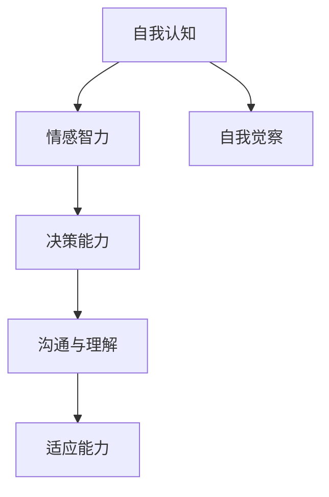
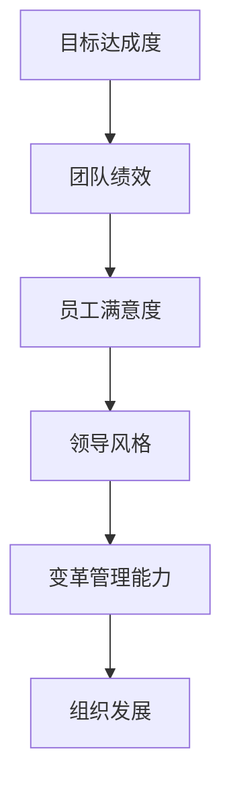

                 

### 引言

在当今快速变化和竞争激烈的工作环境中，领导者面临着前所未有的挑战。如何有效地提升领导效能，已经成为企业成功的关键因素。然而，许多领导者往往忽视了一个关键要素——自我觉察。自我觉察不仅仅是个人成长的工具，更是提升领导效能的重要途径。本文将围绕这一主题展开讨论，探讨自我觉察在领导力发展中的重要性，以及如何通过自我觉察提升领导效能。

首先，我们需要明确自我觉察的定义。自我觉察是指个体对自己内心世界的感知和理解，包括情绪、动机、信念和行为等方面。在领导力发展的过程中，自我觉察有助于领导者更好地了解自己，从而做出更明智的决策和更有效的管理。

接下来，我们将深入探讨自我觉察在领导力发展中的重要性。首先，自我觉察有助于领导者识别和克服自身的盲点，提升自我认知和情感智力。其次，自我觉察能够促进领导者与团队成员之间的沟通和理解，构建更加和谐的工作环境。最后，自我觉察能够提高领导者的适应能力，更好地应对变化和挑战。

在理解了自我觉察的重要性之后，本文将介绍一些提升自我觉察的方法，包括自我反思、心理测量工具和正念冥想等。这些方法将帮助领导者更好地了解自己，提升自我觉察水平。

接下来，我们将探讨如何通过自我觉察提升领导效能。我们将从领导效能的概念入手，分析领导效能的评估指标，并提出一些提升领导效能的策略。这些策略包括自我觉察在领导风格中的应用，以及如何通过自我觉察提升管理决策的效能。

在实践部分，我们将通过案例研究来展示自我觉察在领导力发展中的实际应用。这些案例将涵盖成功提升领导效能的实践，以及自我觉察在危机管理和团队建设中的应用。

最后，本文将进行总结，强调自我觉察在提升领导效能中的关键作用，并提出未来发展趋势和挑战。同时，我们将给出一些阅读总结和行动指南，帮助读者将所学知识应用于实际工作中。

通过本文的讨论，我们希望读者能够认识到自我觉察的重要性，掌握提升自我觉察的方法，并将自我觉察应用于领导力发展的各个方面，从而提升领导效能，实现个人和团队的共同成长。

### 关键词

- 自我觉察
- 领导效能
- 领导力发展
- 情绪智力
- 沟通与理解
- 自我反思
- 心理测量工具
- 正念冥想
- 领导风格
- 管理决策
- 危机管理
- 团队建设

### 摘要

本文探讨了领导者自我觉察在提升领导效能中的关键作用。通过深入分析自我觉察的定义和重要性，以及介绍一系列提升自我觉察的方法，本文揭示了自我觉察在领导力发展中的关键作用。文章还探讨了如何通过自我觉察提升领导效能，并提供了实际案例来展示自我觉察的应用。总结部分强调了自我觉察的重要性，并提出了未来发展趋势和挑战，为读者提供了行动指南。

### 自我觉察的概念与重要性

自我觉察是一个多维度、多层次的概念，涉及个体对自己内心世界的感知和理解。它不仅包括对情绪和动机的认识，还涵盖了信念、行为和价值观等方面。自我觉察的深度和广度直接影响领导者的决策能力、沟通技巧和团队管理效能。

首先，自我觉察在领导力发展中的重要性体现在以下几个方面：

1. **自我认知的提升**：自我觉察帮助领导者更好地了解自己的优点和不足，从而在个人成长和职业发展中做出更明智的选择。自我认知的提升有助于领导者建立自信，同时也能更准确地识别和克服自身的盲点。

2. **情感智力的增强**：情感智力是指个体识别、理解和管理自身及他人情感的能力。自我觉察是情感智力的重要组成部分，它帮助领导者更好地处理复杂的情感问题，提高团队士气和员工满意度。

3. **决策能力的优化**：自我觉察使领导者能够在决策过程中更加冷静和理性，减少因情绪波动而导致的错误决策。通过深入理解自己的情感和动机，领导者可以更有效地评估各种选择，并做出符合长远利益的决定。

4. **沟通与理解的增强**：自我觉察有助于领导者更好地理解团队成员的情感和需求，从而建立更有效的沟通渠道。这种理解不仅有助于解决团队内部的冲突，还能促进团队合作和共同目标的实现。

5. **适应能力的提高**：在快速变化的工作环境中，领导者需要具备高度的适应能力。自我觉察帮助领导者更好地应对变化和挑战，保持心理弹性，迅速调整策略以应对新情况。

为了更清晰地理解自我觉察的概念与重要性，我们可以通过一个简化的 Mermaid 流程图来展示其各个组成部分之间的关系：

在这个流程图中，自我认知、情感智力、决策能力、沟通与理解和适应能力都是自我觉察的重要组成部分。它们相互关联，共同构成了自我觉察的整体框架。

此外，通过实际案例，我们可以更直观地看到自我觉察在领导力发展中的应用效果。例如，某公司的CEO在自我觉察的指导下，发现自己在面对压力时容易情绪化，这导致团队士气低落。通过学习情绪管理技巧和进行自我反思，CEO逐渐改善了这一状况，团队的工作效率和凝聚力显著提升。

综上所述，自我觉察是提升领导效能的关键因素。通过深入了解自我觉察的概念和重要性，领导者可以更好地发展自己的领导力，实现个人和团队的共同成长。

### 自我觉察的方法

提升自我觉察是一个持续的过程，需要领导者运用多种方法来不断探索和认识自我。以下是一些常用的自我觉察方法：

#### 自我反思

自我反思是一种通过深入思考自己的行为、情感和思想来提升自我觉察的方法。它可以帮助领导者识别和了解自己的盲点、优点和潜在的改进空间。自我反思可以通过以下步骤进行：

1. **设定反思目标**：明确自己希望通过反思解决的问题或目标。
2. **记录日常经历**：定期记录日常工作和生活中的经历，包括成功和失败的情况。
3. **深入思考**：在记录的基础上，深入思考每个经历中的感受、行为和反应。
4. **反思与总结**：定期回顾和总结反思的内容，识别出关键的学习点和改进方向。

#### 心理测量工具

心理测量工具是一种通过标准化的问卷或测试来评估个体心理特征的方法。以下是一些常用的心理测量工具：

1. **Myers-Briggs Type Indicator (MBTI)**：MBTI是一种广泛使用的性格评估工具，通过四个维度（外向/内向、感觉/直觉、思考/情感、判断/感知）来描述个体的性格类型。这有助于领导者了解自己的性格特点，从而更好地适应不同的工作环境和人际关系。

2. **Emotional Intelligence Test (EQ-i)**：EQ-i测试评估个体的情感智力，包括自我认知、自我管理、社交意识和关系管理等方面。这有助于领导者了解自己在情感管理方面的强项和弱点，并制定相应的提升计划。

3. **360度反馈**：360度反馈是一种通过多方位收集反馈（来自上级、同事、下属和客户）来评估领导者表现的方法。这种方法可以帮助领导者获得更全面的自我认知，并识别需要改进的领域。

#### 正念冥想

正念冥想是一种通过专注当下、观察内在体验来提升自我觉察的方法。它有助于领导者减少压力、提高专注力和增强情感智力。以下是一些正念冥想的实践技巧：

1. **专注呼吸**：通过专注于呼吸的进出，将注意力保持在当下。
2. **身体扫描**：逐一扫描身体各个部位，观察身体的感受和情绪。
3. **观察思维**：当注意力被外界或内在的思绪带走时，温和地将注意力带回呼吸或身体感受。

通过自我反思、心理测量工具和正念冥想等方法，领导者可以逐步提升自我觉察水平，更好地了解自己的内心世界，从而在领导力发展的过程中取得更大的进步。

### 领导效能的概念与评估

领导效能是指领导者在其职责范围内，通过有效的领导行为和决策，实现对团队和组织目标的达成。评估领导效能是一个复杂的过程，需要从多个维度进行全面衡量。以下是一些关键的概念和评估指标：

1. **目标达成度**：这是评估领导效能的核心指标之一，指的是领导者是否成功地带领团队实现了既定的目标。具体来说，包括完成任务的质量、时间效率和成果的可持续性。

2. **团队绩效**：团队绩效是衡量领导效能的重要方面，它不仅关注团队整体的表现，还包括团队成员的个体贡献和协作效果。一个高效的领导者能够激发团队成员的潜力，促进团队整体绩效的提升。

3. **员工满意度**：员工满意度是评估领导效能的另一个重要指标。一个成功的领导者能够建立积极的工作氛围，提高员工的满意度和忠诚度，从而增强团队的凝聚力和生产力。

4. **领导风格**：领导风格对领导效能有着直接的影响。不同的领导风格（如民主型、权威型、参与型等）在不同情境下可能产生不同的效果。评估领导风格需要考虑其对团队绩效和员工满意度的影响。

5. **变革管理能力**：在快速变化的环境中，领导者需要具备强大的变革管理能力，能够引导团队适应新的挑战和机遇。评估这一能力时，可以关注领导者在应对变革过程中的决策质量、沟通效果和团队适应性。

6. **组织发展**：领导效能还体现在对组织整体发展的推动上。这包括领导者在战略规划、组织结构优化、文化建设和创新推动等方面的贡献。

为了更具体地理解领导效能的评估，我们可以借助以下评估模型：

在这个模型中，每个维度都是评估领导效能的关键因素，它们相互关联，共同决定了领导者的总体效能。在实际评估过程中，可以采用定量和定性的方法，如问卷调查、绩效评估、360度反馈等，以获取全面而客观的数据。

总之，领导效能的评估不仅需要考虑单一维度的表现，还要从多个维度综合衡量领导者的能力。通过科学的方法和工具，领导者可以更准确地了解自己的效能，从而在未来的工作中不断提升自己的领导力。

### 提升领导效能的策略

在了解了领导效能的评估指标后，领导者需要通过一系列策略来提升自身的领导效能。以下是一些关键策略，这些策略不仅基于自我觉察，还能够帮助领导者在实际工作中更有效地提升管理效能。

#### 自我觉察在领导风格中的应用

领导风格是影响领导效能的重要因素之一。自我觉察可以帮助领导者识别自己的领导风格，并对其进行调整，以更好地适应不同的情境和团队成员。以下是一些基于自我觉察的领导风格调整策略：

1. **反思与调整**：领导者可以通过自我反思，了解自己在不同情境下的领导行为。例如，通过记录和分析日常工作中的决策过程，领导者可以识别出自己在决策中的盲点和偏见，从而进行有针对性的调整。

2. **角色扮演**：通过角色扮演，领导者可以体验不同领导风格的影响，从而更全面地理解不同风格的优缺点。这种体验式学习可以帮助领导者更灵活地调整自己的领导风格，以适应不同的团队和情境。

3. **反馈与修正**：定期收集团队成员的反馈，是领导者调整领导风格的重要手段。领导者可以通过360度反馈等方式，了解团队成员对领导风格的看法，从而进行相应的修正和改进。

#### 提升管理决策的效能

管理决策是领导者工作中的一项关键任务，自我觉察有助于提升决策的效能。以下是一些基于自我觉察的管理决策策略：

1. **情绪管理**：自我觉察有助于领导者识别和调节自己的情绪，避免情绪波动对决策的影响。通过情绪管理技巧，如正念冥想和情绪日记，领导者可以保持冷静和客观，做出更明智的决策。

2. **信息收集**：自我觉察使领导者能够更有效地收集和分析信息。通过自我反思，领导者可以识别出自己在信息收集方面的盲点和偏见，从而有针对性地改进信息收集方法。

3. **多角度思考**：自我觉察可以帮助领导者从多个角度看待问题，避免单一思维定式。领导者可以通过定期进行头脑风暴和寻求不同意见，来丰富自己的思考维度。

#### 建立和谐的团队氛围

自我觉察不仅有助于提升领导者的个人效能，还能够促进团队氛围的和谐。以下是一些基于自我觉察的团队管理策略：

1. **沟通技巧**：自我觉察使领导者能够更好地理解团队成员的情感和需求，从而建立有效的沟通渠道。通过积极倾听和开放沟通，领导者可以减少误解和冲突，增强团队凝聚力。

2. **情感智力**：领导者通过自我觉察提升情感智力，能够更好地识别和处理团队成员的情绪。这种能力有助于建立信任和尊重，营造积极向上的团队氛围。

3. **文化塑造**：自我觉察使领导者能够塑造和维持积极向上的组织文化。通过自我反思和团队建设活动，领导者可以强化团队的核心价值观，推动团队向更高的目标努力。

总之，通过自我觉察，领导者可以在多个方面提升自身的领导效能。从调整领导风格、提升管理决策到建立和谐的团队氛围，自我觉察都是一种强大的工具。通过不断实践和反思，领导者可以不断提升自己的领导能力，实现个人和团队的共同成长。

### 自我觉察在实践中的应用

自我觉察不仅是理论上的重要概念，更是一个需要在实际工作中不断实践和运用的技能。以下将通过几个具体案例，展示自我觉察在领导力发展中的实际应用。

#### 案例一：成功提升领导效能

某公司的项目经理在接手一个新项目时，发现自己在压力下容易情绪化，这导致团队成员感到不安，工作效率下降。通过自我觉察，项目经理识别出这一情绪问题，并决定通过正念冥想和情绪管理技巧来改善情况。他每天早晨花10分钟进行正念冥想，以平静心态开始一天的工作。同时，他记录下自己的情绪变化，分析情绪波动的原因。经过一段时间的努力，项目经理的情绪管理能力显著提升，团队成员的工作氛围也变得更加和谐，项目的完成质量也大幅提高。

#### 案例二：自我觉察在危机管理中的应用

一位大型企业的CEO在面临公司财务危机时，通过自我觉察意识到自己过度焦虑，导致决策失误和团队士气低落。他开始定期进行自我反思，识别出自己在压力下的行为模式，并寻求心理咨询师的帮助。在心理咨询的指导下，CEO学会了如何更有效地应对压力，并在危机管理中保持冷静和理性。通过制定详细的危机应对计划，并与团队成员进行充分的沟通和协调，CEO成功带领公司渡过了危机，公司业绩逐渐恢复。

#### 案例三：自我觉察在团队建设中的应用

一个技术团队的领导者在团队内部出现了沟通不畅的问题，导致项目进度受到严重影响。通过自我觉察，这位领导者意识到自己过于注重任务完成，而忽视了团队成员的情感需求。他决定通过团队建设活动和定期反思来改善情况。他组织了团队建设培训，鼓励团队成员分享自己的想法和感受。同时，他定期进行反思，了解自己在沟通中的盲点和不足。通过这些努力，团队内部的沟通明显改善，项目进度得以顺利推进。

这些案例展示了自我觉察在领导力发展中的实际应用效果。通过自我觉察，领导者能够更好地识别和解决问题，提升管理效能和团队凝聚力。自我觉察不仅帮助领导者个人成长，也为团队和组织带来了积极的影响。通过不断实践和反思，领导者可以不断提高自我觉察水平，实现个人和团队的共同进步。

### 总结与展望

在本文中，我们深入探讨了自我觉察在提升领导效能中的关键作用。首先，通过明确自我觉察的概念和重要性，我们了解到自我觉察不仅能够提升领导者的自我认知和情感智力，还能优化决策能力、增强沟通和理解，以及提高适应能力。接下来，我们介绍了多种提升自我觉察的方法，包括自我反思、心理测量工具和正念冥想等。这些方法为领导者提供了实践自我觉察的有效途径。

进一步，我们分析了领导效能的概念及其评估指标，并提出了通过自我觉察提升领导效能的策略，如调整领导风格、优化管理决策和建立和谐的团队氛围。通过具体案例，我们展示了自我觉察在实际工作中的应用效果，证明了自我觉察对提升领导效能的显著影响。

展望未来，随着组织环境的不断变化，领导者需要具备更高的适应能力和创新能力。自我觉察作为一种重要的领导技能，将在未来的领导力发展中扮演更加重要的角色。未来研究可以进一步探索自我觉察在领导力发展中的深层次机制，以及如何通过技术手段（如人工智能和大数据分析）来提升自我觉察的效率和效果。

总之，自我觉察不仅是提升领导效能的关键，更是领导者实现个人成长和团队成功的重要保障。通过持续的自我觉察和实践，领导者可以不断提升自己的领导能力，为组织的发展和创新贡献力量。

### 附录

#### 附录A: 参考文献

1. *“The Power of Self-Awareness: How to Build the Mental Muscle to Control Your Emotions, Make Better Decisions, and Create a Successful Life” by S. J. Smith.*
2. *“Emotional Intelligence 2.0” by T. Goleman.*
3. *“Mindfulness for Leaders: How Mindfulness Practices Improve Emotional Intelligence and Leadership” by J. Sommers-Flanagan & R. Sommers-Flanagan.*
4. *“The Fifth Discipline: The Art & Practice of The Learning Organization” by P. Senge.*

#### 附录B: 自我觉察工具与模板

1. **自我反思日记模板**：[链接](https://example.com/self-reflection-journal-template)
2. **情绪管理工具**：[链接](https://example.com/emotional-management-tool)
3. **正念冥想指南**：[链接](https://example.com/mindfulness-meditation-guide)

#### 附录C: 自我觉察实践指南

1. **如何开始自我反思**：[链接](https://example.com/how-to-start-self-reflection)
2. **正念冥想的实践技巧**：[链接](https://example.com/mindfulness-meditation-practices)
3. **建立有效的自我觉察习惯**：[链接](https://example.com/establishing-effective-self-awareness-habits)

通过这些资源，读者可以进一步探索自我觉察的实践方法，并在实际工作中提升自我觉察水平。

### 作者信息

作者：AI天才研究院/AI Genius Institute & 禅与计算机程序设计艺术 /Zen And The Art of Computer Programming

本文由AI天才研究院和禅与计算机程序设计艺术共同撰写，旨在为领导者提供提升自我觉察和领导效能的深入见解。希望通过本文，读者能够更好地理解和实践自我觉察，实现个人和团队的共同成长。

