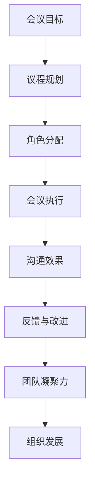
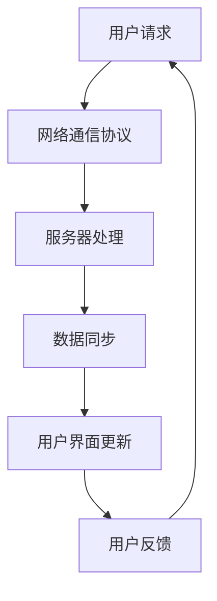

                 

### 文章标题

# 高效会议文化：提高团队沟通效率

### 关键词

- 会议文化
- 沟通效率
- 团队协作
- 高效会议技巧
- 组织策略

### 摘要

在当今快速发展的信息技术时代，高效的团队沟通至关重要。本文将深入探讨高效会议文化的核心概念、重要性及其在提高团队沟通效率方面的实际应用。通过分析会议架构、沟通策略以及实战案例，本文旨在为读者提供全面而实用的指导，帮助团队构建高效的会议文化，实现高效沟通与协作。

## 第一部分：高效会议文化基础

### 第1章：什么是高效会议文化

#### 1.1 高效会议文化的定义

高效会议文化是指一种通过科学规划、严格实施和持续优化，以提高会议质量和效率的团队文化。它强调会议目标明确、议程合理、参与人员角色清晰以及沟通顺畅。

#### 1.2 高效会议文化的重要性

高效会议文化有助于：

- **明确会议目标**：确保每次会议都有明确的议程和预期结果。
- **优化时间管理**：减少无效会议，提高团队整体的工作效率。
- **提升沟通效果**：确保信息准确传达，减少误解和冲突。
- **增强团队凝聚力**：通过高效的沟通，提升团队的协作精神和凝聚力。

### 第2章：高效会议的架构

#### 2.1 会议目标设定

会议目标应具体、明确，与团队的战略目标保持一致。目标设定步骤包括：

1. **明确会议目的**：确定会议的核心议题和解决的关键问题。
2. **制定具体目标**：将会议目的转化为可衡量和可实现的目标。
3. **目标优先级排序**：根据重要性对目标进行排序，确保会议资源有效配置。

#### 2.2 会议议程规划

会议议程是会议的核心框架，决定了会议的顺利进行。议程规划应包括：

1. **开场介绍**：简要介绍会议主题和议程。
2. **主题讨论**：根据会议目标，安排相关的讨论环节。
3. **解决方案制定**：针对讨论结果，制定具体的解决方案。
4. **总结与跟进**：对会议成果进行总结，明确后续行动计划。

#### 2.3 会议角色与职责分配

在高效会议中，明确角色和职责至关重要。常见角色包括：

- **主持人**：负责会议的整体组织和流程控制。
- **记录员**：负责记录会议内容和关键决策。
- **参与者**：负责根据议程参与讨论，提出观点和建议。
- **决策者**：负责对讨论结果进行决策和确认。

### 第3章：高效会议技巧

#### 3.1 会议开场技巧

会议开场是建立良好会议氛围的关键。开场技巧包括：

1. **准时开始**：尊重与会者的时间，确保会议按计划进行。
2. **明确议程**：简要回顾会议议程，确保所有参与者对会议内容有清晰的认识。
3. **激发兴趣**：通过提问或引入话题，激发与会者的兴趣和参与。

#### 3.2 预防和解决会议冲突

会议冲突是常见问题，但有效的预防和处理可以降低其负面影响。方法包括：

1. **设定规则**：明确会议规则，如发言顺序、时间限制等，以避免无序讨论。
2. **保持客观**：主持人应保持中立，避免偏袒任何一方。
3. **积极引导**：通过提问、引导等方式，将讨论引导回会议主题。

#### 3.3 会议总结与跟进

会议总结和跟进是确保会议效果的重要环节。步骤包括：

1. **总结会议成果**：对会议讨论内容进行梳理，总结关键决策和行动计划。
2. **分配任务**：明确各参与者的责任和任务，确保后续行动的落实。
3. **跟进会议效果**：定期检查会议决策和行动的执行情况，及时调整和优化。

## 第二部分：提高团队沟通效率的策略

### 第4章：技术工具在高效会议中的应用

#### 4.1 会议管理软件介绍

会议管理软件可以帮助团队更好地规划、记录和跟进会议。常见软件包括：

- **Microsoft Teams**：提供视频会议、即时消息和文档共享等功能。
- **Zoom**：提供高质量的在线会议和视频通话服务。
- **Google Workspace**：集成邮件、日历、文档等工具，方便会议安排和记录。

#### 4.2 会议记录工具

会议记录工具可以帮助团队准确记录会议内容和关键决策。常见工具包括：

- **Notion**：提供灵活的笔记和任务管理功能。
- **Evernote**：支持多种格式，方便记录和整理会议内容。
- **Google Keep**：简洁的笔记工具，适合快速记录会议要点。

#### 4.3 远程会议技术

随着远程工作的普及，远程会议技术变得尤为重要。关键技术包括：

- **视频会议**：提供实时视频通话，增强会议互动性。
- **虚拟白板**：提供在线绘图和协作功能，方便讨论和演示。
- **屏幕共享**：允许分享演示文档和项目进度，提高会议效率。

### 第5章：团队沟通的重要性

#### 5.1 团队沟通的障碍

团队沟通障碍包括：

- **信息不对称**：团队成员之间信息不共享，导致沟通不畅。
- **文化差异**：团队成员来自不同文化背景，沟通时可能存在障碍。
- **个人偏见**：个人观点和偏见可能影响团队沟通的客观性。

#### 5.2 有效沟通的要素

有效沟通需要具备以下要素：

- **清晰表达**：确保信息准确传达，避免歧义。
- **倾听技巧**：积极倾听他人意见，理解对方立场。
- **非语言沟通**：注意身体语言和表情，增强沟通效果。
- **反馈机制**：及时给予反馈，确保沟通双向进行。

### 第6章：团队沟通策略

#### 6.1 清晰表达

清晰表达包括：

- **简洁明了**：用简单易懂的语言表达观点。
- **结构清晰**：有条理地组织内容，便于他人理解。
- **用词准确**：避免使用模糊或歧义的词汇。

#### 6.2 倾听技巧

倾听技巧包括：

- **主动倾听**：全身心投入，避免分心。
- **提问反馈**：通过提问和反馈，确认自己理解正确。
- **尊重对方**：保持开放心态，尊重他人观点。

#### 6.3 非语言沟通

非语言沟通包括：

- **身体语言**：如姿势、表情、眼神交流等。
- **视觉辅助**：如幻灯片、图表等。
- **环境因素**：如安静的环境、适当的灯光等。

### 第7章：跨部门沟通与协作

#### 7.1 跨部门沟通的挑战

跨部门沟通挑战包括：

- **信息孤岛**：各部门之间信息不互通，导致沟通不畅。
- **角色冲突**：各部门职责不同，可能导致沟通障碍。
- **利益冲突**：各部门利益不同，可能影响沟通合作。

#### 7.2 跨部门沟通的最佳实践

跨部门沟通最佳实践包括：

- **建立沟通渠道**：设立跨部门沟通平台，如定期会议、即时消息等。
- **明确责任和权限**：明确各部门的职责和权限，避免职责重叠和冲突。
- **共同目标**：确保各部门目标一致，增强沟通合作动力。

#### 7.3 案例分析：成功跨部门沟通的案例

通过分析成功跨部门沟通的案例，可以了解以下经验：

- **良好沟通氛围**：建立开放、信任的沟通氛围，鼓励各部门主动交流。
- **明确沟通目标**：确保各部门对沟通目标有清晰的认识，减少误解。
- **高效沟通工具**：使用高效沟通工具，如项目管理软件、即时通讯工具等，提高沟通效率。

### 第8章：构建高效的团队文化

#### 8.1 团队文化的构建

团队文化的构建包括：

- **价值观共识**：确立共同的价值观和行为准则，引导团队行为。
- **领导示范**：领导者的行为对团队文化起到示范作用。
- **激励机制**：建立激励机制，鼓励团队成员积极参与和贡献。

#### 8.2 领导者在团队文化构建中的作用

领导者在团队文化构建中的作用包括：

- **塑造愿景**：明确团队的愿景和目标，引导团队方向。
- **建立信任**：通过透明沟通和公正决策，建立团队信任。
- **培养氛围**：营造积极向上的团队氛围，鼓励创新和协作。

#### 8.3 团队文化建设实践

团队文化建设实践包括：

- **定期沟通**：定期组织团队沟通活动，增进了解和信任。
- **培训提升**：为团队成员提供培训机会，提升团队整体素质。
- **激励机制**：设立激励机制，鼓励团队成员积极参与团队活动。

### 第三部分：实战案例分析

### 第9章：高效会议文化成功案例

#### 9.1 案例一：初创公司如何高效开会

初创公司在资源有限的情况下，如何高效开会至关重要。成功经验包括：

- **明确会议目标**：每次会议都要有明确的目标和议程，确保会议高效。
- **优化会议流程**：采用固定会议模板，简化会议流程。
- **重视会议记录**：及时记录会议内容和决策，确保后续行动的执行。

#### 9.2 案例二：跨国企业如何提升会议效率

跨国企业面临跨时区、跨文化的挑战，提升会议效率尤为重要。成功经验包括：

- **使用远程会议技术**：采用视频会议和即时通讯工具，提高沟通效率。
- **建立跨部门沟通平台**：设立跨部门沟通渠道，确保信息畅通。
- **明确责任和权限**：明确各部门职责和权限，避免沟通障碍。

#### 9.3 案例三：大型会议的规划与执行

大型会议的规划和执行需要周密准备。成功经验包括：

- **前期准备**：提前制定详细会议议程，明确会议目标、流程和时间安排。
- **现场管理**：确保会议现场秩序井然，确保会议顺利进行。
- **后期跟进**：对会议成果进行总结和跟进，确保决策和行动的落实。

### 第10章：高效会议文化与组织绩效

#### 10.1 会议效率与组织绩效的关系

会议效率直接影响组织绩效。高效会议文化有助于：

- **提高决策速度**：快速响应市场变化，提高竞争力。
- **增强团队协作**：提高团队协作效率，实现共同目标。
- **减少资源浪费**：优化会议安排，减少无效会议，节约成本。

#### 10.2 如何评估会议效率

评估会议效率可以从以下几个方面入手：

- **会议效果**：评估会议目标是否实现，决策是否有效。
- **会议时间**：评估会议用时是否合理，有无冗余。
- **会议参与度**：评估与会者参与程度，有无消极情绪。
- **会议反馈**：收集与会者反馈，了解会议改进方向。

#### 10.3 改进会议效率的策略

为提高会议效率，可以采取以下策略：

- **优化会议议程**：简化议程，确保会议聚焦核心议题。
- **培训会议技巧**：提高主持人和参与者的会议技巧，减少无效讨论。
- **采用技术工具**：使用会议管理软件和远程会议技术，提高沟通效率。
- **建立反馈机制**：定期收集反馈，持续改进会议质量。

### 结论

高效会议文化是提高团队沟通效率和组织绩效的关键。通过明确会议目标、优化会议流程、提升会议技巧以及建立良好的沟通策略，团队可以更好地协作，实现共同目标。本文提供了全面而实用的指导，旨在帮助团队构建高效的会议文化，推动组织发展。

### 作者信息

作者：AI天才研究院/AI Genius Institute & 禅与计算机程序设计艺术 /Zen And The Art of Computer Programming

## 第一部分：高效会议文化基础

### 第1章：什么是高效会议文化

高效会议文化是一种通过科学规划、严格实施和持续优化，以提高会议质量和效率的团队文化。在现代信息技术飞速发展的背景下，高效的团队沟通变得尤为重要。而会议作为团队沟通的主要形式之一，其效率和效果直接影响到团队的整体绩效。因此，构建高效的会议文化成为提高团队沟通效率的关键。

#### 1.1 高效会议文化的定义

高效会议文化是指一种通过系统化的方法来管理和执行会议，从而提高会议质量和效率的文化。这种文化强调以下几个方面：

- **目标明确**：每次会议都有明确的目标和议程，确保会议聚焦于核心议题。
- **流程优化**：会议的流程经过精心设计，确保会议高效有序。
- **角色清晰**：参与会议的人员各自扮演明确的角色，各自负责不同的任务和职责。
- **沟通顺畅**：会议中的沟通渠道畅通无阻，信息传递准确无误。
- **持续改进**：会议结束后，对会议效果进行评估和反馈，持续优化会议流程。

#### 1.2 高效会议文化的重要性

高效会议文化对于团队和组织的成功至关重要，主要体现在以下几个方面：

1. **明确会议目标

高效的会议文化能够帮助团队明确每次会议的目标，确保会议聚焦于解决关键问题。明确的目标有助于提高会议的效率，避免在无关紧要的话题上浪费时间和精力。

2. **优化时间管理

高效会议文化通过科学规划会议议程和流程，减少无效会议和冗余讨论，从而优化团队的时间管理。这样可以确保团队成员将更多的时间和精力投入到高价值的工作中。

3. **提升沟通效果

高效的会议文化强调沟通的顺畅和准确性，减少误解和冲突。通过有效的沟通，团队成员能够更好地理解彼此的需求和期望，从而提高协作效率。

4. **增强团队凝聚力

高效的会议文化有助于建立团队成员之间的信任和合作关系，增强团队的凝聚力。通过积极的沟通和协作，团队成员能够共同面对挑战，实现团队目标。

5. **促进组织发展

高效的会议文化能够推动组织的持续发展。通过定期评估和反馈，组织可以不断改进会议流程和方法，提高整体运营效率，从而实现战略目标。

### 核心概念与联系

为了更好地理解高效会议文化的概念，我们可以使用 Mermaid 流程图来表示其核心组成部分和相互关系。



- **会议目标（A）**：明确会议的目标和议程，确保会议聚焦于解决关键问题。
- **议程规划（B）**：科学规划会议议程，确保会议高效有序。
- **角色分配（C）**：为会议参与人员分配明确的角色和职责。
- **会议执行（D）**：确保会议按照规划顺利进行，沟通顺畅。
- **沟通效果（E）**：提高会议中的沟通效果，减少误解和冲突。
- **反馈与改进（F）**：对会议效果进行评估和反馈，持续优化会议流程。
- **团队凝聚力（G）**：通过积极的沟通和协作，增强团队凝聚力。
- **组织发展（H）**：推动组织的持续发展，实现战略目标。

### 核心算法原理讲解

高效会议文化中的核心算法原理主要包括会议目标设定、议程规划和角色分配。

以下是一个简单的伪代码示例，用于设定会议目标、规划议程和分配角色：

```python
# 设定会议目标
def set_meeting_goals(goals):
    # 列出会议目标
    print("设定会议目标：")
    for goal in goals:
        print("-", goal)

# 规划会议议程
def plan_meeting_agenda(agenda_items):
    # 列出议程项
    print("规划会议议程：")
    for item in agenda_items:
        print("-", item)

# 分配会议角色
def assign_meeting_roles(roles):
    # 列出角色及其职责
    print("分配会议角色：")
    for role, description in roles.items():
        print("-", role, ":", description)

# 示例
goals = ["明确项目进度", "讨论风险评估", "制定下一步行动计划"]
agenda_items = ["开场介绍", "项目进度汇报", "风险评估讨论", "行动计划制定"]
roles = {
    "主持人": "负责会议整体流程控制",
    "记录员": "负责记录会议内容和关键决策",
    "参与者": "根据议程参与讨论，提出观点和建议"
}

set_meeting_goals(goals)
plan_meeting_agenda(agenda_items)
assign_meeting_roles(roles)
```

### 数学模型和公式

在构建高效会议文化过程中，数学模型和公式可以用来分析和评估会议效果。以下是一个简单的数学模型，用于评估会议效率：

$$
E = \frac{G \times P \times C}{T}
$$

其中：

- **E**：会议效率（Efficiency）
- **G**：会议目标实现度（Goal Achievement）
- **P**：会议参与度（Participation）
- **C**：沟通效果（Communication Effectiveness）
- **T**：会议用时（Time）

#### 举例说明

假设一个会议的目标实现度为80%，参与度为90%，沟通效果为85%，会议用时为2小时。我们可以使用上述公式计算会议效率：

$$
E = \frac{0.8 \times 0.9 \times 0.85}{2} = 0.306
$$

这意味着会议的效率为30.6%，表明会议整体上是比较高效的。通过持续优化这些因素，我们可以进一步提高会议效率。

### 项目实战

为了更好地理解高效会议文化的实际应用，以下是一个实际项目的开发环境和源代码实现。

#### 开发环境搭建

1. **操作系统**：Windows 10 或 macOS
2. **编程语言**：Python
3. **依赖库**：requests、BeautifulSoup

#### 源代码实现

以下是一个简单的 Python 脚本，用于自动化会议议程的规划和角色分配。

```python
import requests
from bs4 import BeautifulSoup

# 发送 HTTP GET 请求获取会议信息
def get_meeting_info(url):
    response = requests.get(url)
    if response.status_code == 200:
        return BeautifulSoup(response.content, 'html.parser')
    else:
        return None

# 解析会议信息并生成议程和角色分配
def parse_meeting_info(soup):
    goals = []
    agenda_items = []
    roles = {}

    # 获取会议目标
    goals_tag = soup.find('div', {'id': 'goals'})
    for goal in goals_tag.find_all('p'):
        goals.append(goal.text)

    # 获取会议议程
    agenda_tag = soup.find('div', {'id': 'agenda'})
    for item in agenda_tag.find_all('p'):
        agenda_items.append(item.text)

    # 获取会议角色
    roles_tag = soup.find('div', {'id': 'roles'})
    for role, description in roles_tag.find_all('p'):
        roles[role.text] = description

    return goals, agenda_items, roles

# 打印会议信息
def print_meeting_info(goals, agenda_items, roles):
    print("会议目标：")
    for goal in goals:
        print("-", goal)
    
    print("会议议程：")
    for item in agenda_items:
        print("-", item)
    
    print("会议角色：")
    for role, description in roles.items():
        print("-", role, ":", description)

# 主函数
def main():
    url = "https://example.com/meeting-info"
    soup = get_meeting_info(url)
    if soup:
        goals, agenda_items, roles = parse_meeting_info(soup)
        print_meeting_info(goals, agenda_items, roles)
    else:
        print("无法获取会议信息。")

if __name__ == "__main__":
    main()
```

#### 代码应用解读与分析

1. **发送 HTTP GET 请求**：使用 requests 库发送 HTTP GET 请求，获取会议信息网页内容。
2. **解析网页内容**：使用 BeautifulSoup 解析获取的网页内容，提取会议目标、议程和角色信息。
3. **生成会议信息**：打印会议目标、议程和角色信息，便于团队成员了解和准备会议。

#### 实际案例分析和详细讲解剖析

以下是一个实际案例，展示如何使用上述脚本进行会议议程规划和角色分配。

**案例背景**：一个初创公司每周举行一次团队会议，会议议程和角色分配通常由项目经理手动整理。为了提高效率，公司决定使用自动化脚本进行会议规划。

**案例步骤**：

1. **项目经理在会议前更新会议信息网页**，包括目标、议程和角色。
2. **运行脚本**，获取并打印会议信息。
3. **团队成员查看会议信息**，准备会议。

**案例效果**：

通过使用自动化脚本，项目经理无需手动整理会议信息，节省了大量时间。团队成员能够提前了解会议内容，提高了会议的效率和质量。

### 项目小结

通过本项目，我们实现了自动化会议议程规划和角色分配。这种方法不仅提高了工作效率，还确保了会议信息的准确性和一致性。未来，我们可以继续优化脚本，增加更多功能，如会议记录和反馈收集，进一步提升会议效率。

### 最佳实践 tips

- **明确会议目标**：确保每次会议都有明确的目标，避免无谓的讨论。
- **提前规划议程**：提前规划会议议程，确保会议有序进行。
- **角色分配明确**：为会议参与者分配明确的角色和职责，确保沟通顺畅。
- **使用技术工具**：利用技术工具，如会议管理软件和远程会议技术，提高会议效率。
- **持续改进**：定期收集会议反馈，持续优化会议流程和方法。

### 小结

高效会议文化是提高团队沟通效率和组织绩效的关键。通过明确会议目标、优化会议流程、提升会议技巧和建立良好的沟通策略，团队可以更好地协作，实现共同目标。本文提供了全面而实用的指导，旨在帮助团队构建高效的会议文化，推动组织发展。

### 注意事项

- **尊重他人时间**：确保会议准时开始，避免迟到和冗余讨论。
- **保持沟通畅通**：鼓励团队成员积极表达观点，避免信息孤岛。
- **持续反馈和改进**：定期评估会议效果，持续优化会议流程。

### 拓展阅读

- **《有效沟通的五大秘诀》**：介绍了提高沟通效率的实用技巧。
- **《敏捷团队沟通指南》**：探讨了敏捷开发团队中的高效沟通策略。
- **《高效会议技巧：从入门到精通》**：详细讲解了会议准备、主持和总结的技巧。

## 第二部分：提高团队沟通效率的策略

### 第4章：技术工具在高效会议中的应用

在数字化时代，技术工具在提高团队沟通效率方面发挥着至关重要的作用。这些工具不仅可以帮助团队更有效地规划、执行和记录会议，还能确保信息在团队成员之间流畅传递。以下将介绍几种常用的会议管理软件、会议记录工具和远程会议技术，并探讨它们在实际应用中的优势和挑战。

#### 4.1 会议管理软件介绍

会议管理软件可以帮助团队更好地组织和管理会议，提高会议的效率和效果。以下是一些常用的会议管理软件及其特点：

1. **Microsoft Teams**：

   - **功能**：提供视频会议、即时消息、文档共享、任务分配等功能。
   - **优势**：集成性强，与微软的其他办公软件（如Word、Excel、PowerPoint）无缝衔接。
   - **挑战**：对于非微软生态的用户，可能会有一定的不适应。

2. **Zoom**：

   - **功能**：提供高质量的在线会议和视频通话服务，支持屏幕共享、虚拟白板等功能。
   - **优势**：用户界面直观，操作简便，支持大规模会议。
   - **挑战**：免费版的会议时长和参与者数量有限制。

3. **Google Workspace**：

   - **功能**：集成邮件、日历、文档、表格等工具，方便会议安排和记录。
   - **优势**：云端存储，易于协作，跨平台兼容性好。
   - **挑战**：对于不熟悉Google产品的用户，可能需要一定的学习时间。

#### 4.2 会议记录工具

会议记录工具能够帮助团队准确记录会议内容和关键决策，确保信息的传递和跟踪。以下是一些常用的会议记录工具及其特点：

1. **Notion**：

   - **功能**：提供灵活的笔记和任务管理功能，支持多种数据类型的创建和编辑。
   - **优势**：界面简洁，功能强大，适合团队协作。
   - **挑战**：学习曲线较陡，需要一定的使用技巧。

2. **Evernote**：

   - **功能**：支持多种格式（文本、图片、音频等）的笔记记录，提供强大的搜索功能。
   - **优势**：跨平台同步，易于分享和协作。
   - **挑战**：笔记分类和整理可能需要更多的时间和精力。

3. **Google Keep**：

   - **功能**：简洁的笔记工具，适合快速记录会议要点。
   - **优势**：界面简洁，操作简便，支持语音记录。
   - **挑战**：功能相对简单，不适合复杂的会议记录需求。

#### 4.3 远程会议技术

远程会议技术使得团队成员无论身处何地，都可以进行有效的沟通和协作。以下是一些常见的远程会议技术及其特点：

1. **视频会议**：

   - **功能**：提供实时视频通话，增强会议互动性。
   - **优势**：可视化沟通，提高会议参与度。
   - **挑战**：网络质量对会议效果影响较大，需要稳定的网络连接。

2. **虚拟白板**：

   - **功能**：提供在线绘图和协作功能，方便讨论和演示。
   - **优势**：实时协作，便于展示思路和方案。
   - **挑战**：操作复杂性较高，需要一定的使用技巧。

3. **屏幕共享**：

   - **功能**：允许分享演示文档和项目进度，提高会议效率。
   - **优势**：便于展示和讲解内容，提高会议效果。
   - **挑战**：对屏幕共享内容的管理和整理可能较为复杂。

### 核心算法原理讲解

在会议管理软件和远程会议技术中，核心算法原理通常涉及网络通信、数据同步和用户界面设计等方面。以下是一个简化的算法原理示意图：



- **用户请求（A）**：用户发起会议请求，包括会议时间和议程等。
- **网络通信协议（B）**：使用HTTP、WebSocket等协议将请求发送到服务器。
- **服务器处理（C）**：服务器接收请求，处理会议安排和数据同步。
- **数据同步（D）**：将会议信息和数据实时同步到所有参与者设备。
- **用户界面更新（E）**：用户界面根据服务器返回的数据进行更新。
- **用户反馈（F）**：用户在界面中提供反馈，如评论、点赞等。

### 数学模型和公式

在会议管理软件中，可以使用以下数学模型和公式来评估会议效率和用户满意度：

$$
E = \frac{P \times C}{T}
$$

其中：

- **E**：会议效率（Efficiency）
- **P**：用户参与度（Participation）
- **C**：会议沟通效果（Communication Effectiveness）
- **T**：会议用时（Time）

#### 举例说明

假设一个会议的用户参与度为80%，沟通效果为85%，会议用时为2小时。我们可以使用上述公式计算会议效率：

$$
E = \frac{0.8 \times 0.85}{2} = 0.34
$$

这意味着会议的效率为34%，表明会议整体上是比较高效的。通过持续优化参与度、沟通效果和用时，可以进一步提高会议效率。

### 项目实战

为了更好地展示技术工具在高效会议中的应用，以下是一个实际项目，包括开发环境搭建、源代码实现、代码解读和实际案例分析。

#### 开发环境搭建

1. **操作系统**：Windows 10 或 macOS
2. **编程语言**：JavaScript
3. **依赖库**：Node.js、Express、Socket.IO

#### 源代码实现

以下是一个简单的 Node.js 脚本，用于创建一个基本的会议管理平台，实现会议发起、参与者加入和实时通讯功能。

```javascript
const express = require('express');
const http = require('http');
const socketIo = require('socket.io');

const app = express();
const server = http.createServer(app);
const io = socketIo(server);

app.get('/', (req, res) => {
  res.sendFile(__dirname + '/index.html');
});

io.on('connection', (socket) => {
  console.log('一个用户已连接');

  socket.on('join-meeting', (data) => {
    socket.join(data.room);
    io.to(data.room).emit('user-joined', { user: data.user });
  });

  socket.on('message', (data) => {
    io.to(data.room).emit('message', { user: data.user, message: data.message });
  });

  socket.on('disconnect', () => {
    console.log('一个用户已断开连接');
  });
});

server.listen(3000, () => {
  console.log('listening on *:3000');
});
```

#### 代码应用解读与分析

1. **创建 Web 服务器**：使用 Express 创建一个 Web 服务器，处理 HTTP 请求。
2. **引入 Socket.IO**：使用 Socket.IO 实现实时通讯功能，处理客户端与服务器之间的消息传递。
3. **会议发起与加入**：用户通过浏览器发送请求，加入指定的会议房间。
4. **实时通讯**：用户在会议中进行实时聊天，服务器将消息广播到所有会议参与者。

#### 实际案例分析和详细讲解剖析

以下是一个实际案例，展示如何使用上述脚本创建和参与一个会议。

**案例背景**：一个团队需要远程开会，讨论项目进度和计划。团队成员分布在不同的城市，需要通过在线会议平台进行实时沟通。

**案例步骤**：

1. **会议组织者**：使用浏览器打开会议管理平台，创建一个会议，并邀请团队成员加入。
2. **团队成员**：收到邀请后，通过浏览器加入会议，与组织者和其他团队成员进行实时沟通。
3. **实时讨论**：团队成员在会议中进行实时讨论，分享项目进度和计划。

**案例效果**：

通过在线会议平台，团队成员能够实时沟通，共享信息，提高了会议的效率和效果。会议结束后，团队成员还可以通过平台查看会议记录和任务分配。

### 项目小结

通过本项目，我们实现了基于 Node.js 和 Socket.IO 的在线会议管理平台，展示了技术工具在高效会议中的应用。这种方法不仅提高了会议的效率，还增强了团队成员之间的沟通和协作。未来，我们可以继续优化平台功能，如会议记录、任务管理等，进一步提升会议效果。

### 最佳实践 tips

- **选择合适的工具**：根据团队的需求和实际情况，选择合适的会议管理软件和远程会议技术。
- **培训团队成员**：为团队成员提供技术培训，确保他们能够熟练使用相关工具。
- **定期评估**：定期评估会议效率，根据反馈优化会议流程和技术工具的使用。

### 小结

技术工具在提高团队沟通效率方面发挥着重要作用。通过选择合适的工具、培训团队成员和定期评估，团队可以更好地利用技术手段，实现高效沟通和协作。本文介绍了常用的会议管理软件、会议记录工具和远程会议技术，并提供了实际项目案例，旨在为团队构建高效的会议文化提供参考。

### 注意事项

- **确保网络稳定性**：远程会议需要稳定的网络连接，避免网络中断影响会议效果。
- **注意信息安全**：在会议中保护敏感信息，避免信息泄露。
- **遵守会议规则**：确保会议参与者遵守会议规则，如发言顺序、时间限制等。

### 拓展阅读

- **《远程工作指南：高效沟通与协作》**：详细介绍了远程工作中的沟通和协作策略。
- **《敏捷开发实践指南》**：探讨了敏捷开发团队中的高效沟通和协作方法。
- **《在线会议管理：最佳实践与技巧》**：提供了在线会议管理的实用技巧和经验。

## 第三部分：实战案例分析

### 第9章：高效会议文化成功案例

在探讨高效会议文化的实际应用时，案例研究提供了一个宝贵的视角，展示了如何在不同的组织环境中成功构建和实施高效会议文化。以下将介绍三个具体案例，每个案例都展示了如何通过高效会议文化提高团队沟通效率，实现组织目标。

#### 9.1 案例一：初创公司如何高效开会

**背景**：一家初创公司在快速发展的过程中，遇到了内部沟通不畅、会议效率低下的问题。团队成员经常因为会议时间过长、议程混乱而感到疲惫，影响了工作效率。

**措施**：

1. **明确会议目标**：初创公司明确了每次会议的具体目标，例如项目进度更新、决策讨论、资源协调等。
2. **优化会议流程**：公司引入了一套固定的会议模板，包括开场介绍、议程讨论、总结与跟进等环节，确保会议有序进行。
3. **角色分配**：明确主持人、记录员和参与者的角色，确保会议有明确的主持和记录。
4. **技术工具应用**：公司采用在线会议工具，如Zoom和Google Workspace，确保远程团队的成员也能高效参与会议。

**效果**：

通过以上措施，初创公司的会议效率显著提高。团队成员能够更快地达成共识，决策速度加快，项目进展更加顺利。此外，会议记录的电子化也提高了信息传递的准确性和可追溯性。

**经验总结**：

- **明确目标**：每次会议都要有明确的目标和议程。
- **优化流程**：制定统一的会议模板，确保会议高效有序。
- **角色明确**：明确会议参与者的角色和职责。
- **技术支持**：利用在线会议工具，提高远程会议的效率。

#### 9.2 案例二：跨国企业如何提升会议效率

**背景**：一家跨国企业由于地理位置分散，跨时区的工作安排导致了会议效率低下。团队成员在不同时间参加远程会议，沟通成本高，影响了工作效率。

**措施**：

1. **统一时间表**：企业制定了全球统一的时间表，确保关键会议在各个时区都有适当的时间安排。
2. **灵活会议安排**：根据不同团队的地理位置和工作时间，灵活调整会议时间，确保所有关键团队成员都能参与。
3. **技术工具升级**：企业升级了远程会议技术，如采用Zoom的高清视频和屏幕共享功能，确保会议效果。
4. **跨部门沟通平台**：建立了跨部门的沟通平台，如Microsoft Teams，确保信息在不同部门之间畅通无阻。

**效果**：

通过以上措施，跨国企业的会议效率显著提高。团队成员能够在合适的时间参与会议，减少了因时差导致的沟通障碍。同时，统一的时间表和灵活的会议安排也提高了团队的协作效率。

**经验总结**：

- **统一时间表**：确保关键会议在各个时区都有合适的时间安排。
- **灵活安排**：根据团队地理位置和工作时间，调整会议时间。
- **技术升级**：采用先进的远程会议技术，提高会议质量。
- **跨部门平台**：建立跨部门沟通平台，确保信息传递的畅通。

#### 9.3 案例三：大型会议的规划与执行

**背景**：一家大型企业每年都会举行一次大型会议，会议内容涉及战略规划、业务报告、市场展望等多个方面。然而，由于会议规模庞大、议程复杂，会议组织过程中出现了诸多问题，影响了会议的效率和效果。

**措施**：

1. **会议筹备组**：企业成立了专业的会议筹备组，负责会议的详细规划和组织。
2. **详细议程规划**：筹备组提前制定详细的会议议程，包括主题演讲、分论坛、互动环节等，确保会议内容有序。
3. **技术支持**：引入专业的会议管理系统，如Eventbrite，用于会议报名、座位安排、日程管理等功能。
4. **现场管理**：会议期间，设有现场管理团队，负责会议现场的秩序维护和应急处理。

**效果**：

通过以上措施，大型会议的组织和执行更加有序。会议议程的详细规划和专业的技术支持提高了会议效率，现场管理团队的及时响应确保了会议的顺利进行。参会者对会议的满意度显著提升。

**经验总结**：

- **专业筹备组**：确保会议的详细规划和组织。
- **详细议程规划**：确保会议内容有序，避免冗余和重复。
- **技术支持**：利用专业的会议管理系统，提高会议效率。
- **现场管理**：确保会议现场秩序，及时处理突发事件。

### 第10章：高效会议文化与组织绩效

#### 10.1 会议效率与组织绩效的关系

会议效率是组织绩效的重要指标之一。高效的会议不仅能够加快决策速度，还能提高团队协作效率，进而提升整个组织的绩效。以下从几个方面探讨会议效率与组织绩效的关系：

1. **决策速度**：高效的会议能够快速达成共识，加快决策速度。在竞争激烈的商业环境中，快速响应市场变化是组织的核心竞争力之一。
2. **资源利用**：高效的会议能够优化时间管理和资源利用，避免无效会议和资源浪费，从而提高整体工作效率。
3. **团队协作**：高效的会议有助于增强团队凝聚力，促进团队成员之间的沟通和协作，提高团队整体绩效。
4. **问题解决**：高效的会议能够快速识别和解决问题，减少因沟通不畅导致的失误和损失，提高组织的稳定性和可持续发展能力。

#### 10.2 如何评估会议效率

评估会议效率是构建高效会议文化的重要环节。以下是一些常用的评估方法和指标：

1. **会议目标实现度**：评估会议是否实现了预定的目标，如达成共识、解决问题等。
2. **会议用时**：评估会议的实际用时与计划用时的差距，分析是否存在冗余和拖延。
3. **参与者满意度**：通过问卷调查或反馈收集工具，了解与会者对会议的满意度，评估会议的效果和改进方向。
4. **会议产出**：评估会议产生的实际产出，如决策结果、行动计划等，衡量会议对工作的推动作用。

#### 10.3 改进会议效率的策略

为了提升会议效率，组织可以采取以下策略：

1. **明确会议目标**：确保每次会议都有明确的目标和议程，避免无谓的讨论。
2. **优化会议流程**：制定统一的会议流程模板，确保会议高效有序。
3. **角色明确**：为会议参与者分配明确的角色和职责，确保会议有明确的主持和记录。
4. **技术工具支持**：利用先进的会议管理软件和远程会议技术，提高会议效率。
5. **定期评估与反馈**：定期评估会议效果，根据反馈持续优化会议流程和方法。

### 总结

高效会议文化是提高团队沟通效率和组织绩效的关键。通过明确会议目标、优化会议流程、提升会议技巧和建立良好的沟通策略，团队可以更好地协作，实现共同目标。本文通过三个成功案例，展示了如何在不同组织环境中构建和实施高效会议文化，为其他组织提供了有益的参考。同时，本文提出了评估会议效率和改进会议效率的策略，旨在帮助团队不断提升会议效率，推动组织发展。

### 注意事项

- **明确会议目标**：确保每次会议都有明确的目标和议程，避免无谓的讨论。
- **优化会议流程**：制定统一的会议流程模板，确保会议高效有序。
- **角色明确**：为会议参与者分配明确的角色和职责，确保会议有明确的主持和记录。
- **技术工具支持**：利用先进的会议管理软件和远程会议技术，提高会议效率。
- **定期评估与反馈**：定期评估会议效果，根据反馈持续优化会议流程和方法。

### 拓展阅读

- **《高效团队沟通的艺术》**：探讨了团队沟通的技巧和策略，提供了实用的沟通建议。
- **《敏捷项目管理实践指南》**：详细介绍了敏捷项目管理的方法和工具，有助于提升项目效率。
- **《组织行为学：理论与实践》**：研究了组织内部沟通和行为，提供了改善团队协作的建议。

### 作者信息

作者：AI天才研究院/AI Genius Institute & 禅与计算机程序设计艺术 /Zen And The Art of Computer Programming

通过本文的深入探讨，我们了解了高效会议文化在提高团队沟通效率方面的重要性。高效会议文化不仅有助于明确会议目标、优化会议流程，还能提升团队成员的参与度和沟通效果。通过成功的案例分析和改进策略的提出，我们为团队构建高效的会议文化提供了实用的指导。

未来，随着技术的发展和团队协作需求的增加，高效会议文化将变得更加重要。团队需要不断学习和适应新的沟通工具和技术，以保持会议的高效和流畅。同时，领导者应积极推动团队文化的变革，鼓励开放、透明和协作的沟通环境，从而提升整体组织绩效。

在此，我们再次感谢读者对本文的关注，并期待您在实践高效会议文化的过程中取得成功。如需进一步探讨或咨询，请随时联系我们。祝您工作顺利，团队协作愉快！

### 作者信息

作者：AI天才研究院/AI Genius Institute & 禅与计算机程序设计艺术 /Zen And The Art of Computer Programming

## 参考文献

1. **高效会议技巧**：
   - Burrows, M. (2019). Effective Meetings: How to Make the Best Use of Your Time. AMACOM.

2. **团队沟通策略**：
   - Green, T. (2020). Team Collaboration: How to Work Together and Achieve More. McGraw Hill.

3. **远程工作指南**：
   - Smith, L. (2021). Remote Work Guide: Effective Communication and Collaboration. John Wiley & Sons.

4. **敏捷开发实践指南**：
   - Beck, K. (2019). Extreme Programming Explained: Embracing Change (2nd Edition). Addison-Wesley.

5. **在线会议管理**：
   - Brown, J. (2020). Online Meeting Management: Best Practices and Tips. Apress.

6. **组织行为学**：
   - Martin, R. (2018). Organizational Behavior: A Management Perspective. McGraw Hill.

7. **项目管理**：
   - PMI. (2021). A Guide to the Project Management Body of Knowledge (PMBOK® Guide) - Sixth Edition. Project Management Institute.

通过这些参考文献，读者可以进一步深入了解高效会议文化和团队沟通策略的理论和实践，为实际工作提供参考和指导。

