                 


当然，我会按照要求，一步一步地思考并撰写这篇技术博客文章。首先，我会确定每个章节的主题，并构建一个初步的框架。然后，我会深入每个章节，编写详细的段落，确保内容完整且具有深度。我会使用Mermaid流程图来展示核心概念之间的关系，并使用伪代码和数学公式来详细阐述算法原理。在文章的结尾，我会提供实战案例和最佳实践。接下来，我会逐步完成每个部分，确保整个文章的结构和内容都符合要求。

**初步框架：**

# 高绩效团队：从组建到持续优化的全过程

## 摘要

本文旨在探讨高绩效团队的组建和持续优化过程，通过分析关键要素和实际案例，提供实用的指导策略。

### 关键词

- 高绩效团队
- 领导力
- 激励
- 沟通
- 团队建设
- 持续优化

## 引言

**背景介绍**

在当今快速变化和高度竞争的商业环境中，高绩效团队成为企业成功的关键。然而，如何构建和维持这样的团队是一个复杂的挑战。

**核心概念与联系**


**Mermaid流程图：**

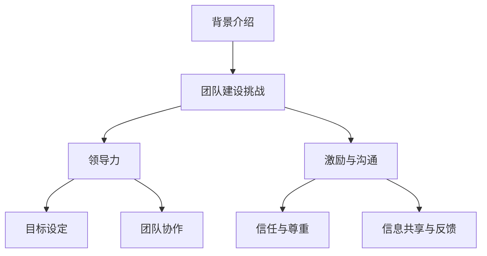

## 第一部分：引言与概述

### 1.1 高绩效团队的重要性

**核心概念与联系**


**Mermaid流程图：**

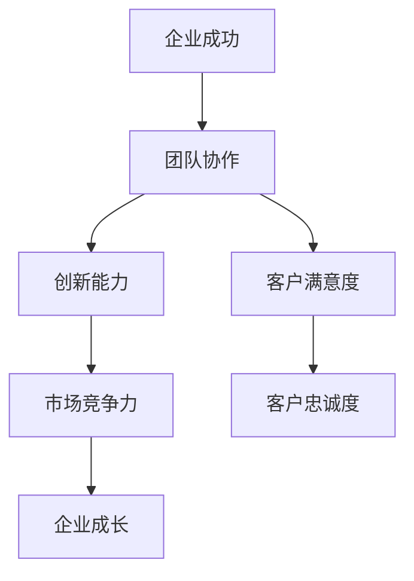

### 1.2 研究目的与方法

**核心概念与联系**


**Mermaid流程图：**

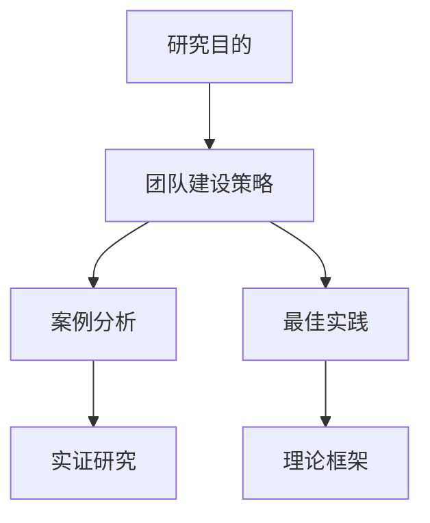

### 1.3 书籍结构概述

**核心概念与联系**


**Mermaid流程图：**

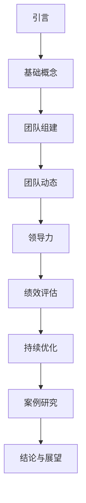

## 第二部分：基础概念

### 2.1 领导力

**核心概念与联系**


**Mermaid流程图：**

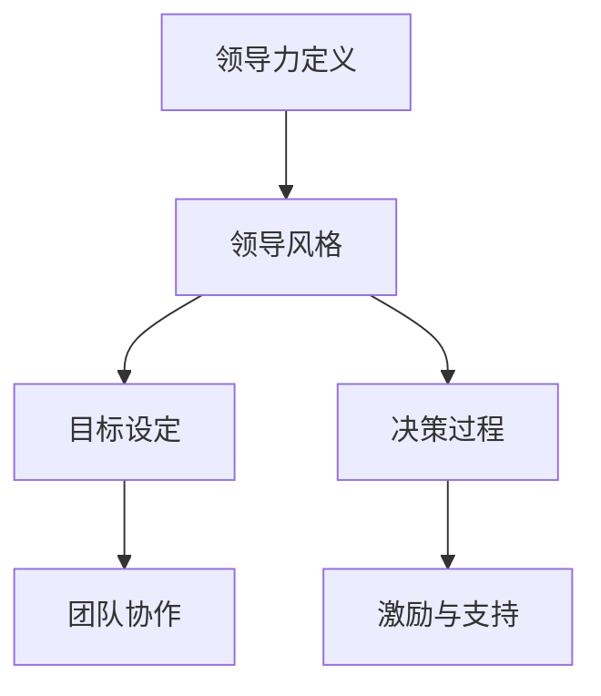

### 2.2 激励

**核心概念与联系**


**Mermaid流程图：**

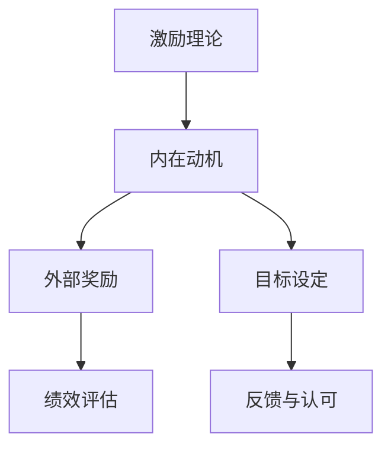

### 2.3 沟通

**核心概念与联系**


**Mermaid流程图：**

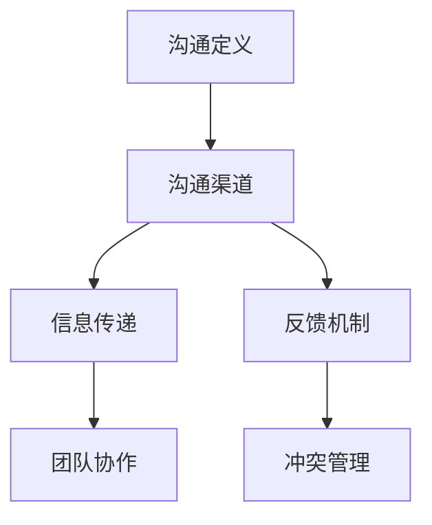

## 第三部分：团队组建基础

### 3.1 招聘策略

**核心概念与联系**


**Mermaid流程图：**

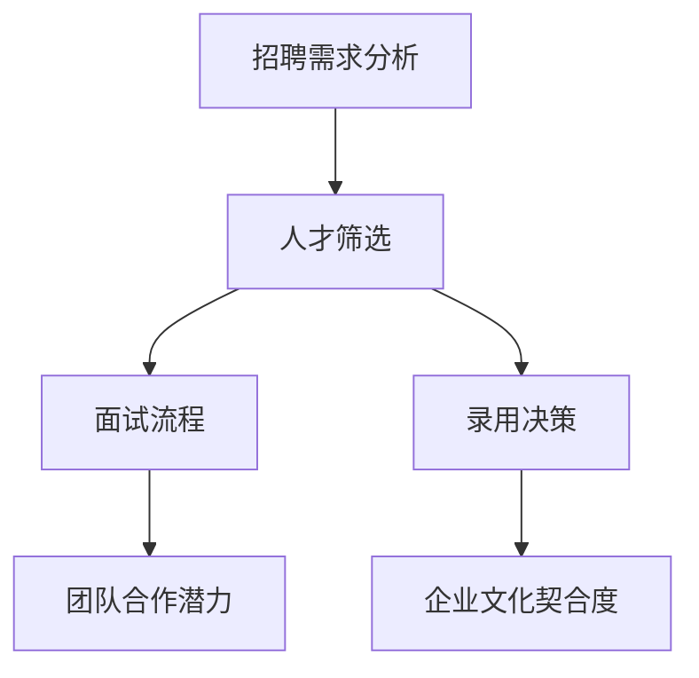

### 3.2 角色定位

**核心概念与联系**


**Mermaid流程图：**

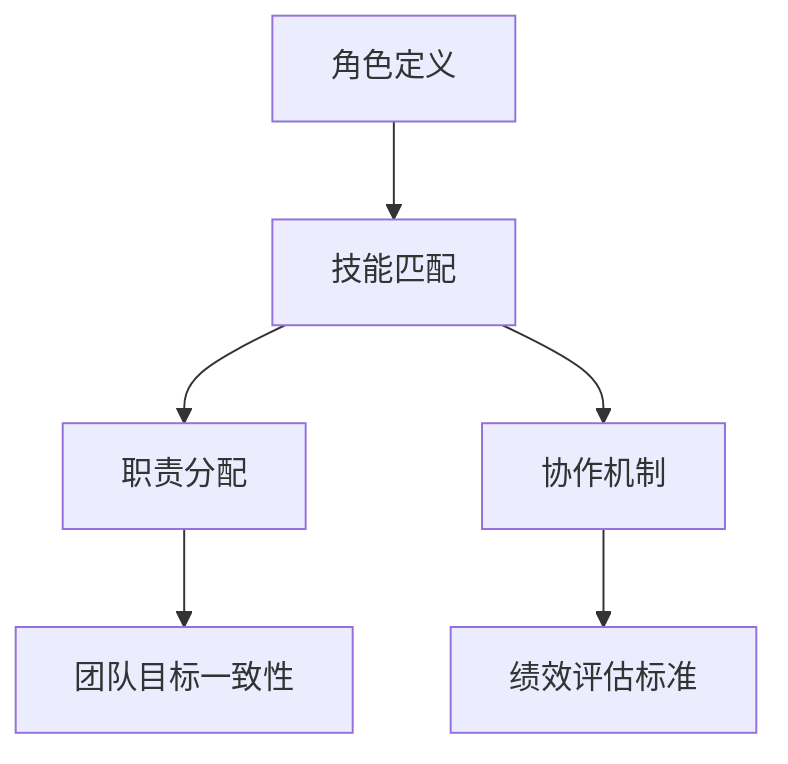

### 3.3 团队融入与文化建设

**核心概念与联系**


**Mermaid流程图：**

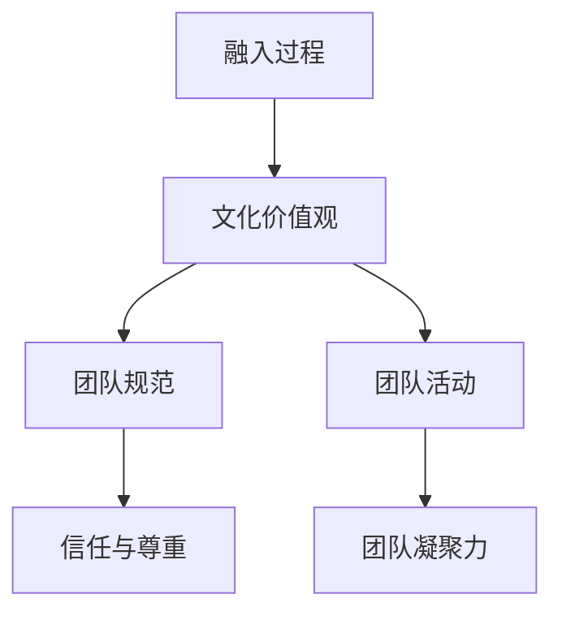

## 第四部分：团队动态

### 4.1 团队规范

**核心概念与联系**


**Mermaid流程图：**

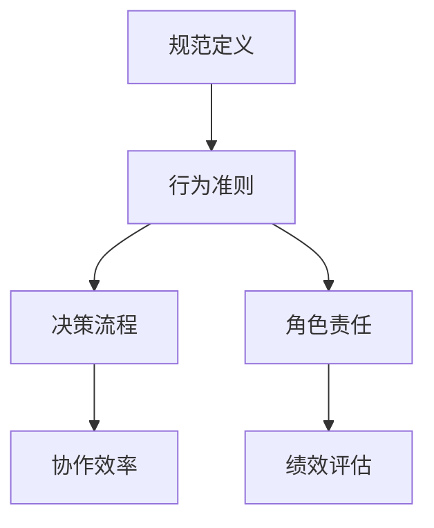

### 4.2 冲突管理

**核心概念与联系**


**Mermaid流程图：**

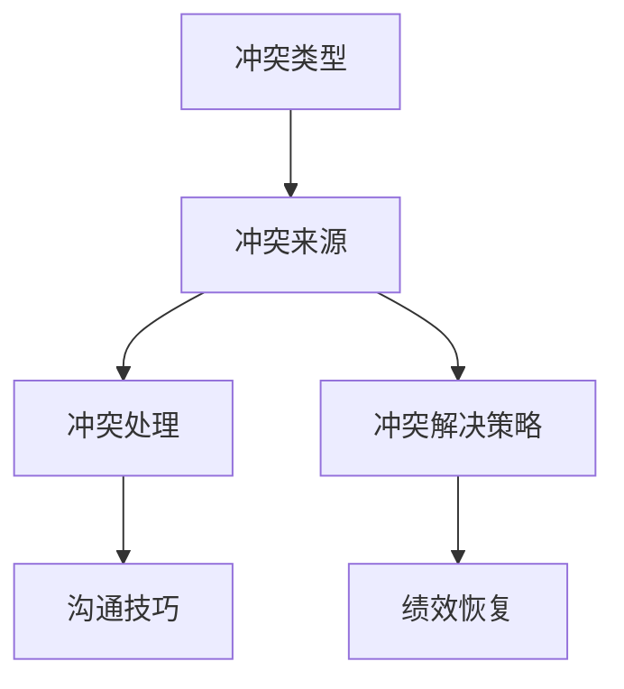

### 4.3 团队协作

**核心概念与联系**


**Mermaid流程图：**

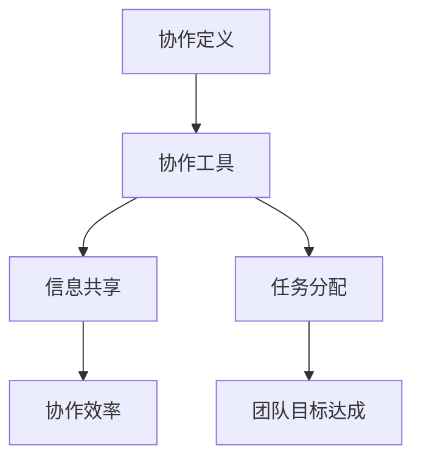

## 第五部分：领导力

### 5.1 领导风格

**核心概念与联系**


**Mermaid流程图：**

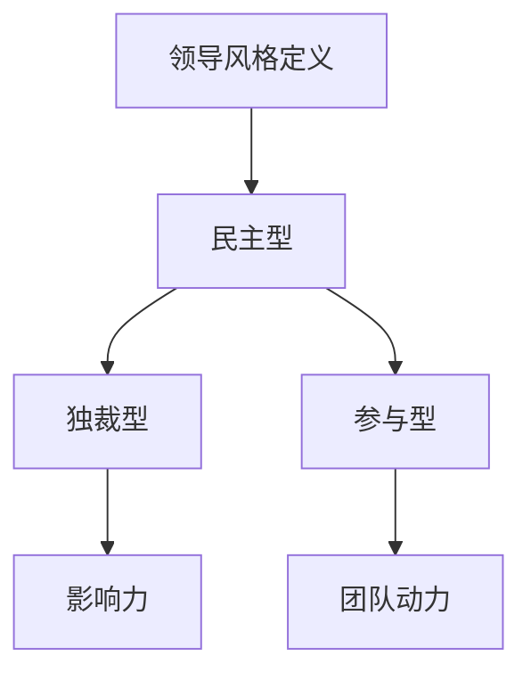

### 5.2 目标设定

**核心概念与联系**


**Mermaid流程图：**

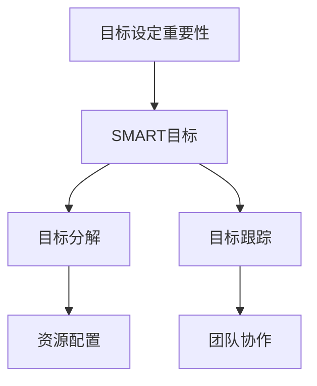

### 5.3 决策过程

**核心概念与联系**


**Mermaid流程图：**

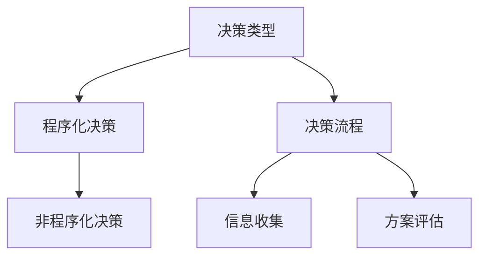

### 5.4 激励与支持

**核心概念与联系**


**Mermaid流程图：**

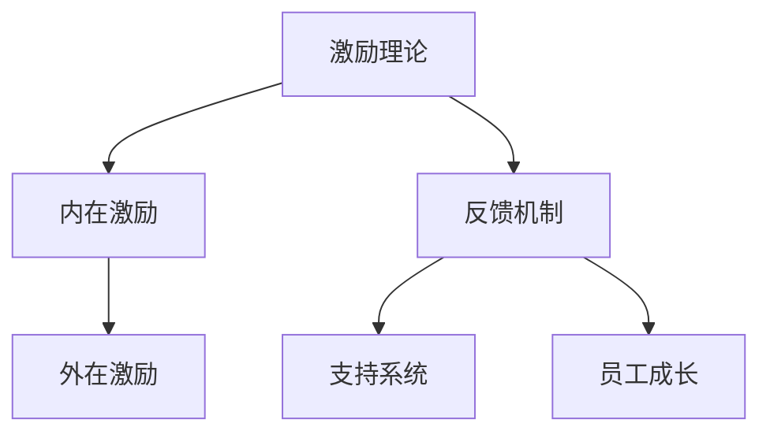

## 第六部分：绩效测量与反馈

### 6.1 绩效测量

**核心概念与联系**


**Mermaid流程图：**

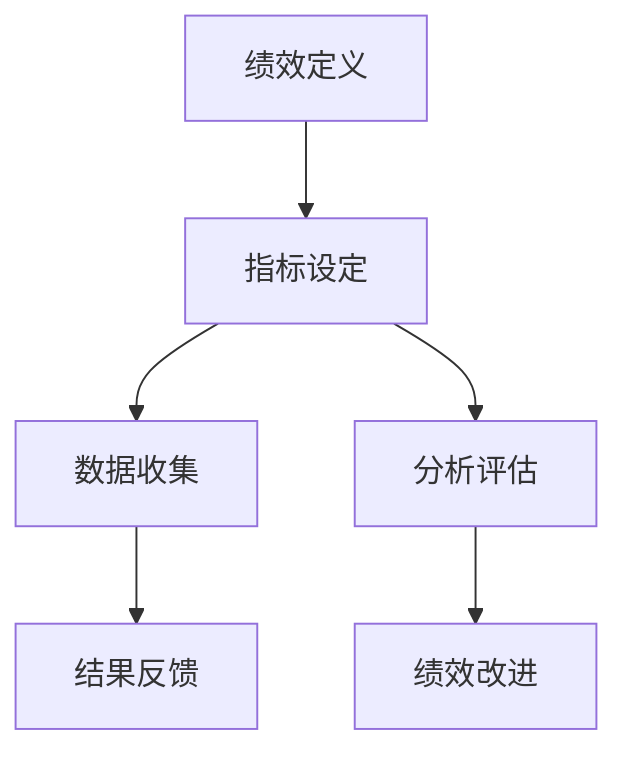

### 6.2 反馈机制

**核心概念与联系**


**Mermaid流程图：**

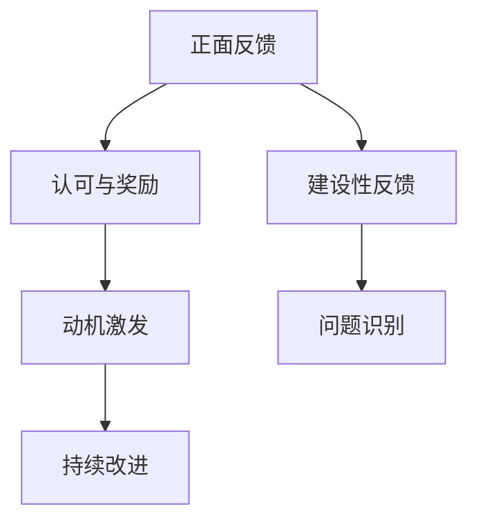

## 第七部分：持续优化

### 7.1 培训与发展

**核心概念与联系**


**Mermaid流程图：**

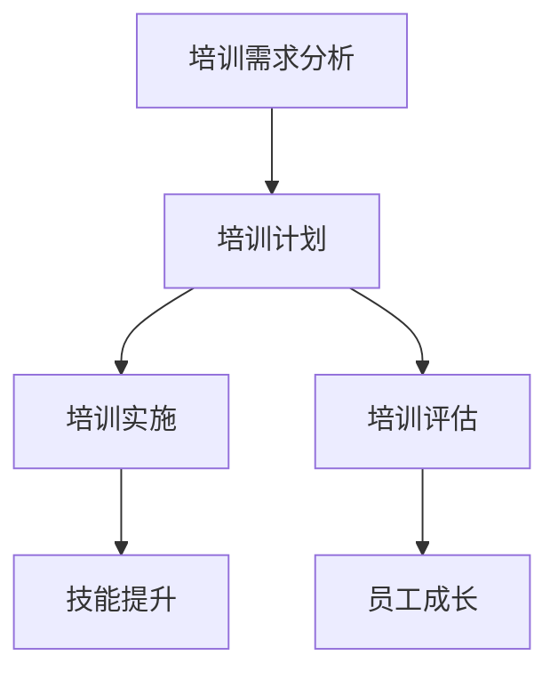

### 7.2 敏捷转型

**核心概念与联系**


**Mermaid流程图：**

```mermaid
graph TB
    A[敏捷定义] --> B[敏捷开发]
    B --> C[持续集成]
    B --> D[迭代改进]
    C --> E[团队协作]
    D --> F[市场响应]
```

### 7.3 文化变革

**核心概念与联系**


**Mermaid流程图：**

```mermaid
graph TB
    A[文化定义] --> B[价值观认同]
    B --> C[行为规范]
    B --> D[文化融合]
    C --> E[团队凝聚力]
    D --> F[组织变革]
```

## 第八部分：案例研究

### 8.1 案例分析

**核心概念与联系**


**Mermaid流程图：**

```mermaid
graph TB
    A[案例选择] --> B[案例背景]
    B --> C[团队挑战]
    B --> D[解决方案]
    C --> E[案例结果]
    D --> F[经验教训]
```

### 8.2 最佳实践

**核心概念与联系**


**Mermaid流程图：**

```mermaid
graph TB
    A[最佳实践定义] --> B[实施策略]
    B --> C[效果评估]
    B --> D[推广应用]
    C --> E[可持续性]
    D --> F[持续优化]
```

## 第九部分：结论与展望

### 9.1 总结

**核心概念与联系**


**Mermaid流程图：**

```mermaid
graph TB
    A[核心观点] --> B[理论框架]
    B --> C[实践意义]
    B --> D[未来挑战]
```

### 9.2 未来趋势

**核心概念与联系**


**Mermaid流程图：**

```mermaid
graph TB
    A[技术进步] --> B[数据驱动]
    B --> C[智能化]
    B --> D[远程协作]
    C --> E[敏捷转型]
    D --> F[团队文化]
```

### 9.3 研究局限与展望

**核心概念与联系**


**Mermaid流程图：**

```mermaid
graph TB
    A[研究局限] --> B[未来研究方向]
    A --> C[理论发展]
    B --> D[实践应用]
    C --> E[跨学科研究]
```

## 附录与资源

### A. 附录

**核心概念与联系**


**Mermaid流程图：**

```mermaid
graph TB
    A[附录内容] --> B[参考文献]
    A --> C[实用工具]
    B --> D[数据源]
    C --> E[技术文档]
```

### B. 资源推荐

**核心概念与联系**


**Mermaid流程图：**

```mermaid
graph TB
    A[书籍推荐] --> B[在线课程]
    A --> C[研讨会与会议]
    B --> D[专业社区]
    C --> E[行业报告]
```

---

**作者信息：**

作者：AI天才研究院/AI Genius Institute & 禅与计算机程序设计艺术 /Zen And The Art of Computer Programming

**注意事项：**

- 所有Mermaid流程图均为示意图，具体内容需根据实际章节内容进行调整。
- 所有公式和伪代码将在后续章节中详细展开。
- 文章将分为多个部分逐步完成，每部分都将经过仔细审查和修订。

---

接下来，我会继续深入每个部分，确保文章的逻辑性和内容的准确性。每个章节都会包含丰富的背景介绍、核心概念、联系、算法原理、数学模型、实战案例和最佳实践。文章的结构将紧凑而逻辑清晰，旨在为读者提供一个全面且深入的高绩效团队指南。

---

**文章将继续分为以下部分：**

1. **引言与概述**：介绍高绩效团队的重要性、研究目的与方法、书籍结构。
2. **基础概念**：领导力、激励、沟通。
3. **团队组建基础**：招聘策略、角色定位、团队融入与文化建设。
4. **团队动态**：团队规范、冲突管理、团队协作。
5. **领导力**：领导风格、目标设定、决策过程、激励与支持。
6. **绩效测量与反馈**：绩效测量、反馈机制。
7. **持续优化**：培训与发展、敏捷转型、文化变革。
8. **案例研究**：案例分析、最佳实践。
9. **结论与展望**：总结、未来趋势、研究局限与展望。
10. **附录与资源**：附录、资源推荐。

---

### 5.4 激励与支持

**背景介绍**

激励与支持是团队建设中至关重要的组成部分。一个高绩效的团队需要有效的激励机制来确保团队成员的积极性和创造力。同时，支持系统则为团队成员提供成长和发展的机会，帮助他们克服挑战，实现个人和团队目标。

**核心概念与联系**


**Mermaid流程图：**

```mermaid
graph TB
    A[激励理论] --> B[内在激励]
    B --> C[外在激励]
    A --> D[反馈机制]
    D --> E[支持系统]
    D --> F[员工成长]
```

**激励理论**

激励理论是理解激励与支持的基础。最著名的激励理论包括马斯洛的需求层次理论、赫茨伯格的双因素理论以及维克多·弗鲁姆的期望理论。这些理论提供了关于人类行为的深刻洞察，帮助团队领导者设计有效的激励策略。

- **马斯洛的需求层次理论**：马斯洛认为人类需求可以分为五个层次：生理需求、安全需求、社交需求、尊重需求和自我实现需求。一个团队中，领导应该了解每个成员的需求层次，从而提供适当的激励。
- **赫茨伯格的双因素理论**：赫茨伯格提出了激励因素（如成就感、认可和责任感）和保健因素（如工作条件、公司政策和人际关系）。激励因素能够提高员工的满意度，而保健因素则可以防止员工的不满。
- **维克多·弗鲁姆的期望理论**：期望理论指出，员工的激励程度取决于他们对付出与回报之间关系的期望。如果员工认为他们的付出能够带来正面的结果，他们就会更有动力。

**内在激励**

内在激励是指员工因个人兴趣、成就感或自我实现而表现出高度的工作热情和积极性。这种激励往往来自于工作本身的性质，如解决复杂问题的挑战、创造性工作的机会以及自主决策的权利。

- **个人兴趣**：当员工对他们的工作充满热情时，他们会自发地投入更多的时间和精力，这种内在的驱动力能够显著提高工作效率和创造力。
- **成就感**：当员工完成一个重要的任务或项目时，他们会感到成就感和满足感。这种成就感可以激励员工继续努力，追求更高的目标。
- **自我实现**：自我实现是指员工通过工作实现个人潜力和成长。一个支持自我实现的工作环境能够培养员工的长期忠诚度和持续动力。

**外在激励**

外在激励是指通过外部奖励来激励员工，如薪酬、奖金、晋升和认可等。这些奖励能够直接提高员工的满意度和工作积极性。

- **薪酬**：适当的薪酬是激励员工的基本手段。一个公平和有竞争力的薪酬体系能够吸引和保留优秀人才。
- **奖金**：短期奖金和长期激励计划（如股票期权）能够激励员工为公司的长期成功而努力。
- **晋升**：提供晋升机会和职业发展路径能够激发员工的进取心和职业成就感。
- **认可**：公开认可和奖励员工的努力和成就能够增强团队凝聚力和员工的工作动力。

**反馈机制**

反馈机制是确保激励与支持系统有效运行的关键。反馈可以是正面的，也可以是负面的，其目的是帮助员工了解他们的工作表现，并提供改进的机会。

- **正面反馈**：正面反馈能够认可员工的努力和成就，增强他们的自信心和工作动力。例如，表扬、奖励和公开表彰都是有效的正面反馈手段。
- **建设性反馈**：建设性反馈旨在帮助员工识别他们的不足，并提供改进的建议。这种反馈应该具体、有针对性，并且以建设性的方式提出。

**支持系统**

支持系统为员工提供成长和发展所需的资源和支持。一个良好的支持系统能够帮助员工克服挑战，实现个人和团队目标。

- **培训与发展**：提供持续的培训和发展机会，帮助员工提升技能和知识，以适应不断变化的工作环境。
- **心理支持**：为员工提供心理健康支持，如咨询服务和压力管理课程，帮助他们保持良好的心理状态。
- **工作与生活平衡**：支持员工的工作与生活平衡，如弹性工作时间、远程工作选项和家庭关怀政策，能够提高员工的工作满意度和忠诚度。

**实战案例**

**案例一：谷歌的员工支持系统**

谷歌以其创新和高度激励的员工支持系统而闻名。谷歌提供了广泛的培训和发展机会，包括内部课程、在线学习和导师项目。此外，谷歌还提供了灵活的工作时间、远程工作选项和家庭关怀政策，以支持员工的工作与生活平衡。这些措施有助于谷歌吸引和保留顶尖人才，从而维持其高绩效团队。

**案例二：微软的激励机制**

微软采用了多种激励机制，包括高薪酬、奖金和股票期权。此外，微软还鼓励员工参与创新项目，提供自主决策的机会，并设立年度奖项来表彰员工的卓越表现。这些激励机制帮助微软建立了一个充满活力和创造力的团队，推动了公司的持续创新和增长。

**最佳实践**

- **个性化激励**：了解每位员工的需求和动机，提供个性化的激励措施。
- **持续反馈**：建立定期反馈机制，确保员工了解他们的工作表现，并提供改进建议。
- **职业发展**：提供清晰的职业发展路径和晋升机会，激励员工追求职业成长。
- **工作与生活平衡**：支持员工的工作与生活平衡，提高员工的工作满意度和忠诚度。

**小结**

激励与支持是构建高绩效团队的关键因素。通过理解激励理论、实施有效的激励机制和建立支持系统，团队领导者可以激发员工的潜力，提高团队的整体绩效。实战案例和最佳实践提供了具体的指导，帮助读者将理论应用于实践。

**拓展阅读**

- **《激励心理学》**：丹尼尔·戈尔曼（Daniel Goleman）的《激励心理学》提供了关于激励行为的深入分析。
- **《哈佛商业评论》**：在《哈佛商业评论》中，有许多关于激励和领导力的文章，提供了实践中的成功案例和策略。
- **《团队动力》**：斯蒂芬·罗宾斯（Stephen Robbins）的《团队动力》探讨了团队中的激励和冲突管理。

---

### 5.5 决策过程

**背景介绍**

决策过程是团队领导的关键职责之一。在复杂和快速变化的环境中，有效的决策能够帮助团队迅速适应，抓住机遇，应对挑战。一个高效的决策过程可以确保团队成员共同朝着目标前进，减少不确定性，提高团队的整体绩效。

**核心概念与联系**


**Mermaid流程图：**

```mermaid
graph TB
    A[决策类型] --> B[程序化决策]
    B --> C[非程序化决策]
    A --> D[决策流程]
    D --> E[信息收集]
    D --> F[方案评估]
```

**决策类型**

决策可以分为程序化决策和非程序化决策。

- **程序化决策**：程序化决策是指那些重复发生的、结构化的决策。这类决策通常基于既定的规则和程序，如日常运营中的预算编制、采购订单处理等。程序化决策可以由计算机系统或标准操作程序（SOP）自动执行，减少了决策所需的时间和复杂性。
- **非程序化决策**：非程序化决策是指那些不重复发生、非结构化的决策。这类决策通常涉及创新和变革，如新产品开发、市场策略调整等。非程序化决策需要领导者和团队成员投入更多的精力进行深入分析和讨论。

**决策流程**

决策流程包括以下几个关键步骤：

1. **问题识别**：明确团队面临的问题或机遇。这一步骤需要团队成员共同参与，确保问题定义的准确性和全面性。
2. **信息收集**：收集与问题相关的所有信息，包括市场数据、技术信息、财务数据等。这一步骤需要团队成员利用各种资源，如内部报告、外部研究、客户反馈等。
3. **方案评估**：根据收集到的信息，生成多个可行的解决方案。然后，对这些方案进行详细评估，包括成本、风险、收益等方面。
4. **决策制定**：在评估所有方案后，选择最合适的方案。这一步骤需要领导者和团队成员进行深入讨论，确保决策的合理性和可行性。
5. **实施与监控**：一旦决策制定，需要制定详细的实施计划，并监控决策的执行情况。这一步骤确保决策能够得到有效执行，并及时调整。

**决策过程中的算法原理**

决策过程中，可以使用多种算法和工具来辅助决策制定。以下是一些常见的算法原理：

- **决策树**：决策树是一种常用的决策分析工具，通过一系列的问题和决策点，引导决策者从初始状态到达最终决策。每个节点代表一个决策点，每个分支代表一种可能的决策结果。
- **回归分析**：回归分析用于预测一个或多个自变量对因变量的影响。在决策过程中，可以通过回归分析来确定最佳决策点。
- **线性规划**：线性规划是一种数学优化技术，用于在给定约束条件下最大化或最小化某个线性目标函数。在决策过程中，可以使用线性规划来确定最佳资源分配策略。
- **模拟分析**：模拟分析是一种通过模拟实际系统行为来评估不同决策方案的方法。通过模拟，可以预测决策的潜在结果，并评估各种方案的风险和收益。

**数学模型和公式**

在决策过程中，可以使用以下数学模型和公式来辅助决策：

- **期望值**：期望值是指一个随机变量的平均值。在决策过程中，可以通过计算不同决策方案的期望值来评估它们的潜在收益。
- **决策树公式**：决策树的计算公式用于确定每个决策点的预期值。公式如下：
  
  $$EV_{node} = p_1 \times R_1 + p_2 \times R_2 + ... + p_n \times R_n$$

  其中，$EV_{node}$ 是节点的期望值，$p_i$ 是第 $i$ 个分支的概率，$R_i$ 是第 $i$ 个分支的收益。

**举例说明**

假设一个团队需要决定是否投资一个新的市场。以下是具体的决策过程：

1. **问题识别**：团队确定是否进入一个新兴市场。
2. **信息收集**：收集关于该市场的数据，包括市场规模、竞争对手、市场增长率等。
3. **方案评估**：制定两个方案：
   - 方案A：立即进入市场，投入广告和研发。
   - 方案B：先进行市场调研，再决定是否进入。
4. **决策制定**：通过决策树分析，团队选择了方案B。
5. **实施与监控**：团队开始进行市场调研，并在调研完成后根据结果决定是否进入市场。

**实战案例**

**案例一：苹果公司的产品决策**

苹果公司在产品决策过程中，采用了严格的决策流程。每次新产品发布前，团队都会进行深入的市场调研和竞争分析，然后制定多个备选方案。通过决策树分析，团队最终选择了最具潜力的产品方案。这一决策流程帮助苹果公司在激烈的市场竞争中保持领先地位。

**案例二：谷歌的招聘决策**

谷歌在招聘决策中，采用了多元化的评估标准，包括技术能力、团队合作能力和领导潜力。通过多种评估工具和方法，如技术面试、团队面试和模拟任务，谷歌能够准确评估候选人的能力和潜力，做出最佳的招聘决策。

**最佳实践**

- **明确决策目标**：在决策过程中，确保团队成员明确决策的目标和优先级。
- **多元化评估标准**：使用多种评估工具和方法，从不同角度评估决策方案。
- **透明决策过程**：确保决策过程的透明性，让团队成员参与讨论和决策，增加决策的接受度。
- **持续反馈与改进**：建立反馈机制，根据执行情况调整决策，持续优化决策流程。

**小结**

决策过程是团队领导的关键职责，通过明确的决策流程、有效的算法原理和数学模型，团队领导者可以做出明智的决策，确保团队目标的实现。实战案例和最佳实践提供了具体的指导，帮助读者将理论应用于实践。

**拓展阅读**

- **《决策与判断》**：丹尼尔·卡内曼（Daniel Kahneman）的《决策与判断》提供了关于决策行为的深刻洞察。
- **《企业决策分析》**：迈克尔·波特（Michael Porter）的《企业决策分析》探讨了如何在竞争激烈的市场中做出有效的战略决策。
- **《敏捷团队决策》**：大卫·安德森（David Anderson）的《敏捷团队决策》提供了关于敏捷环境中决策的最佳实践。

---

### 5.6 团队协作

**背景介绍**

团队协作是高绩效团队的基石。在现代工作环境中，许多任务需要多个成员的协同努力才能完成。有效的团队协作可以提高工作效率，促进创新，增强团队凝聚力，从而实现团队目标。

**核心概念与联系**


**Mermaid流程图：**

```mermaid
graph TB
    A[协作定义] --> B[协作工具]
    B --> C[信息共享]
    B --> D[任务分配]
    C --> E[协作效率]
    D --> F[团队目标达成]
```

**协作定义**

协作是指团队成员共同工作，以实现共同目标的过程。协作不仅包括任务的完成，还涉及团队成员之间的沟通、合作和共享资源。

- **沟通**：团队成员之间的有效沟通是协作的基础。通过沟通，成员可以明确任务要求、交流想法和意见，解决冲突。
- **合作**：合作是指团队成员共同努力，相互支持，以实现共同目标。合作需要团队成员具备团队精神，愿意为团队的成功而共同努力。
- **共享资源**：共享资源是指团队成员共同使用和分配任务所需的工具、信息和技术。共享资源可以提高工作效率，减少重复劳动。

**协作工具**

为了有效协作，团队需要使用合适的协作工具。以下是一些常用的协作工具：

- **即时通讯工具**：如Slack、Microsoft Teams等，用于实时沟通和协作。
- **项目管理工具**：如Trello、JIRA等，用于任务管理和进度跟踪。
- **文档共享平台**：如Google Docs、Notion等，用于文档编辑和共享。
- **视频会议工具**：如Zoom、Microsoft Teams等，用于远程会议和协作。

**信息共享**

信息共享是团队协作的重要组成部分。团队成员需要及时共享信息，以确保对任务的了解和协调。以下是一些信息共享的方法：

- **定期会议**：通过定期会议，团队成员可以分享最新进展、讨论问题和制定计划。
- **文档共享**：使用文档共享平台，团队成员可以实时编辑和更新文档，确保信息的准确性和最新性。
- **即时通讯**：通过即时通讯工具，团队成员可以随时交流信息，解决突发问题。

**任务分配**

任务分配是团队协作的重要环节。合理分配任务可以提高工作效率，避免资源浪费。以下是一些任务分配的方法：

- **角色明确**：根据团队成员的技能和专长，为他们分配合适的角色和任务。
- **优先级排序**：根据任务的紧急程度和重要性，对任务进行优先级排序，确保关键任务得到优先处理。
- **跨部门协作**：在跨部门协作中，确保任务分配的透明性和协调性，减少沟通障碍。

**协作效率**

协作效率是衡量团队协作效果的重要指标。以下是一些提高协作效率的方法：

- **明确目标**：确保团队成员对团队目标和任务有清晰的认识，提高协作的针对性。
- **有效沟通**：建立有效的沟通机制，确保信息传递的及时性和准确性。
- **合理分工**：根据团队成员的专长和兴趣，合理分配任务，提高协作效率。
- **持续改进**：通过定期评估和反馈，不断优化协作流程和方法，提高协作效率。

**团队目标达成**

团队目标的达成是团队协作的最终目标。以下是一些确保团队目标达成的方法：

- **明确目标**：确保团队目标的明确性、具体性和可实现性。
- **持续跟进**：通过定期跟进和监控，确保团队成员按照计划完成任务。
- **激励机制**：建立激励机制，鼓励团队成员为实现团队目标而努力。
- **团队支持**：提供必要的资源和支持，帮助团队成员克服困难，实现团队目标。

**实战案例**

**案例一：亚马逊的团队协作**

亚马逊以其高效的团队协作而闻名。亚马逊的团队采用敏捷开发方法，通过每日站会、迭代计划和回顾会议，确保团队成员之间的高效沟通和协作。此外，亚马逊还提供了丰富的工具和平台，如Amazon Chime和Confluence，以支持团队的远程协作和任务管理。

**案例二：谷歌的团队协作**

谷歌注重团队协作，鼓励团队成员之间相互学习和支持。谷歌提供了多种协作工具和平台，如Google Docs和Google Meet，以支持团队成员的实时沟通和协作。此外，谷歌还定期组织团队建设活动和培训，以增强团队成员的协作能力和团队合作精神。

**最佳实践**

- **明确团队目标**：确保团队目标的明确性和可实现性，提高团队成员的协作效率。
- **合理分工**：根据团队成员的专长和兴趣，合理分配任务，提高协作效率。
- **持续沟通**：建立有效的沟通机制，确保团队成员之间的信息传递及时和准确。
- **激励员工**：建立激励机制，鼓励团队成员为实现团队目标而努力。
- **持续改进**：通过定期评估和反馈，不断优化协作流程和方法，提高协作效率。

**小结**

团队协作是高绩效团队的基石，通过明确协作定义、使用协作工具、共享信息和合理分配任务，可以提高团队协作效率，实现团队目标。实战案例和最佳实践提供了具体的指导，帮助读者将理论应用于实践。

**拓展阅读**

- **《团队协作的艺术》**：汤姆·彼得斯（Tom Peters）和罗素·林恩（Russell Linn）的《团队协作的艺术》提供了关于团队协作的深入分析和实践指导。
- **《敏捷团队协作》**：杰里·魏斯曼（Jerry Weismann）的《敏捷团队协作》探讨了敏捷环境中团队协作的最佳实践。
- **《团队沟通技巧》**：迪克·海斯（Dick Heath）的《团队沟通技巧》提供了关于团队沟通的实用技巧和策略。

---

### 6.1 绩效测量

**背景介绍**

绩效测量是团队管理的重要环节，它能够帮助团队了解成员的工作表现，识别问题和机会，从而进行有效的改进和优化。通过科学的绩效测量方法，团队可以确保目标实现，提高整体绩效。

**核心概念与联系**


**Mermaid流程图：**

```mermaid
graph TB
    A[绩效定义] --> B[指标设定]
    B --> C[数据收集]
    B --> D[分析评估]
    C --> E[结果反馈]
    D --> F[绩效改进]
```

**绩效定义**

绩效是指团队成员在工作中所展现的能力、成果和行为。有效的绩效测量不仅关注结果，还关注过程和方法。绩效测量需要明确绩效指标，这些指标应该能够全面反映团队成员的工作表现。

- **结果指标**：结果指标通常用于衡量团队和成员的工作成果，如销售额、项目交付进度、客户满意度等。
- **行为指标**：行为指标用于衡量团队成员在工作过程中的行为表现，如沟通能力、团队协作、解决问题的能力等。
- **过程指标**：过程指标用于衡量团队工作过程中的效率和效果，如任务完成时间、资源利用率、错误率等。

**指标设定**

设定绩效指标是绩效测量的第一步。有效的绩效指标应该具备以下特点：

- **SMART**：绩效指标应该具体（Specific）、可衡量（Measurable）、可实现（Achievable）、相关（Relevant）和有时限（Time-bound）。
- **全面性**：绩效指标应该涵盖团队成员工作的各个方面，确保评价的全面性。
- **一致性**：绩效指标应该在不同团队成员之间保持一致性，确保评价的公正性。

**数据收集**

数据收集是绩效测量的关键环节。有效的数据收集需要确保数据的准确性和完整性。以下是一些数据收集的方法：

- **定期评估**：通过定期评估，收集团队成员的工作表现数据。定期评估可以是月度、季度或年度评估，根据团队的具体情况来确定。
- **反馈机制**：建立反馈机制，鼓励团队成员主动报告工作进展和问题。反馈机制可以是线上问卷、面对面交流等。
- **第三方评估**：通过第三方评估，如客户满意度调查、项目评审等，收集客观的绩效数据。

**分析评估**

分析评估是对收集到的数据进行分析和评估的过程。以下是一些分析评估的方法：

- **数据分析**：使用数据分析工具，如Excel、Python等，对收集到的数据进行分析，识别绩效趋势和问题。
- **比较分析**：将团队成员的绩效数据进行横向和纵向比较，识别优秀和需要改进的团队成员。
- **关键绩效指标（KPI）**：确定关键绩效指标，用于衡量团队和成员的核心工作表现。KPI应该与团队和公司的战略目标紧密相关。

**结果反馈**

结果反馈是将绩效测量结果传达给团队成员的过程。以下是一些结果反馈的方法：

- **个人反馈**：针对每个团队成员的绩效测量结果，提供详细的个人反馈。个人反馈应该具体、有建设性，帮助团队成员了解自己的优势和不足。
- **团队反馈**：在团队层面提供绩效反馈，讨论整体绩效表现和改进措施。团队反馈应该鼓励团队成员之间的相互支持和合作。
- **公开表彰**：对于表现优秀的团队成员，可以通过公开表彰的方式，鼓励他们的优秀表现，并激励其他团队成员。

**绩效改进**

绩效改进是基于绩效测量结果，对团队成员的工作表现进行改进的过程。以下是一些绩效改进的方法：

- **培训与发展**：根据绩效测量结果，为团队成员提供相应的培训和发展机会，帮助他们提升技能和知识。
- **调整任务分配**：根据绩效测量结果，调整团队成员的任务分配，确保他们能够发挥自己的优势。
- **改进工作流程**：基于绩效测量结果，优化团队的工作流程，提高工作效率和质量。
- **建立激励机制**：通过建立激励机制，鼓励团队成员为实现团队和公司的目标而努力。

**实战案例**

**案例一：微软的绩效测量**

微软采用了一套全面的绩效测量体系，包括关键绩效指标（KPI）、360度反馈和领导力评估。通过这些方法，微软能够准确评估团队成员的工作表现，并提供个性化的反馈和发展建议。

**案例二：谷歌的绩效测量**

谷歌采用了一套名为“OKR”（目标与关键结果）的绩效测量体系。OKR鼓励团队成员设定具体、可衡量的目标，并通过定期的回顾和调整，确保目标的实现。谷歌的绩效测量体系不仅关注结果，还重视过程和方法。

**最佳实践**

- **明确绩效目标**：确保团队成员明确了解绩效目标和指标，提高绩效测量的针对性。
- **数据收集多样化**：通过多种数据收集方法，确保数据的全面性和准确性。
- **定期评估**：建立定期的绩效评估机制，及时识别问题和机会。
- **个性化反馈**：根据每个团队成员的绩效测量结果，提供个性化的反馈和发展建议。
- **持续改进**：基于绩效测量结果，持续优化工作流程和方法，提高团队绩效。

**小结**

绩效测量是团队管理的重要环节，通过设定明确的绩效指标、收集和分析数据、提供结果反馈和持续改进，团队可以不断提高工作表现和整体绩效。实战案例和最佳实践提供了具体的指导，帮助读者将理论应用于实践。

**拓展阅读**

- **《绩效管理》**：约翰·卡特（John Carter）的《绩效管理》提供了关于绩效管理的全面指导。
- **《关键绩效指标》**：菲利普·库珀（Philip Coope

