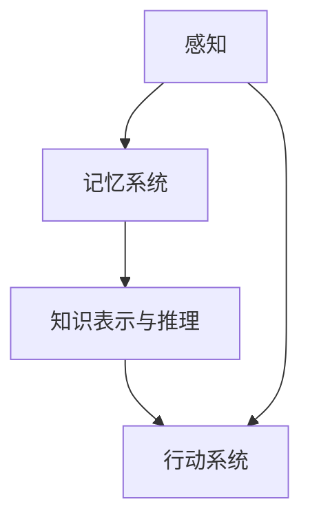

                 

### 文章标题：AGI的记忆系统设计与知识管理

#### 关键词：
- AGI
- 记忆系统
- 知识管理
- 人工智能
- 知识表示
- 知识推理
- 知识存储
- 知识共享
- 知识应用

#### 摘要：
本文探讨了人工智能（AI）中的高级通用智能（AGI）记忆系统设计与知识管理的重要性。文章首先介绍了AGI的基本概念和历史背景，然后深入分析了记忆系统的基础理论，以及知识管理的关键方法。接着，文章详细阐述了AGI记忆系统的设计与优化策略，包括核心算法原理、数学模型和公式。随后，通过一个实际项目案例，展示了记忆系统的开发环境搭建、源代码实现和代码解读。最后，文章总结了最佳实践，并提供了进一步研究的拓展阅读。

### 第1章：引言

#### 1.1 AGI的概念与历史

高级通用智能（AGI）是指具有广泛认知能力、能够执行各种复杂任务并与人类智能相媲美甚至超越的人工智能系统。与传统的基于特定任务的窄域AI（Narrow AI）不同，AGI旨在实现跨领域的通用智能。AGI的发展历程可以追溯到20世纪50年代，当时计算机科学家艾伦·图灵（Alan Turing）提出了图灵测试，试图通过机器能否模仿人类智能来判断机器是否具有智能。

随着计算机科学和人工智能技术的不断发展，AGI的概念逐渐成熟。20世纪80年代，专家系统（Expert Systems）的出现为AGI的发展奠定了基础。然而，由于知识表示和推理技术的限制，早期的AGI尝试并未取得显著成果。进入21世纪，随着深度学习、神经网络和大数据技术的突破，AGI的研究再次引起广泛关注。

#### 1.2 记忆系统在AGI中的重要性

记忆系统是AGI的重要组成部分，承担着存储、检索和利用信息的关键任务。一个高效、可靠的记忆系统能够使AGI在处理复杂任务时更加灵活、准确。记忆系统不仅涉及数据的存储和检索，还包括知识的表示、推理和共享。在AGI中，记忆系统的作用主要体现在以下几个方面：

1. **信息存储与检索**：记忆系统负责存储从感知系统接收到的信息，并在需要时进行快速检索。记忆的存储方式包括显式记忆和隐式记忆，前者主要用于存储明确的事实和概念，后者则涉及技能和习惯的自动执行。

2. **知识表示**：记忆系统需要将知识以适当的形式进行表示，以便于后续的推理和应用。知识表示方法包括符号表示、分布式表示和图结构表示等。

3. **知识推理**：记忆系统不仅要存储信息，还要能够对这些信息进行逻辑推理，以产生新的知识。推理过程涉及匹配、归纳、演绎等思维方式。

4. **知识共享**：记忆系统需要支持知识在不同实体之间的共享和转移，以便于协作和协作学习。

#### 1.3 知识管理的概念和作用

知识管理是指组织、存储、检索和应用知识的一系列活动和过程。在AGI中，知识管理的作用至关重要，它不仅影响着记忆系统的性能，也决定了AGI的智能水平。知识管理的关键作用包括：

1. **提高效率**：通过有效管理知识，AGI可以快速定位和利用所需信息，提高任务执行效率。

2. **增强学习能力**：知识管理支持AGI的学习过程，使其能够从已有知识中提取新的见解和解决方案。

3. **促进创新**：知识共享和协作使得AGI能够跨越个体界限，整合不同领域的知识，激发创新思维。

4. **提升决策能力**：基于全面的知识管理，AGI能够在复杂情境下做出更准确、合理的决策。

### 第2章：AGI的基本概念和原理

#### 2.1 AGI的核心要素

AGI的核心要素包括感知、记忆、知识表示、推理和行动。这些要素相互关联，共同构成了AGI的基本架构。

1. **感知**：感知是AGI获取外界信息的主要途径。感知系统通过视觉、听觉、触觉等感官接收外部信号，并将其转化为内部表示。

2. **记忆**：记忆系统负责存储和管理感知到的信息，以及从已有知识库中检索所需信息。记忆系统是AGI进行推理和决策的基础。

3. **知识表示**：知识表示是将外部信息内部化为计算机可处理的形式。知识表示方法包括符号表示、分布式表示和图结构表示等。

4. **推理**：推理是指基于已有知识和规则，推导出新结论或新知识的过程。推理是AGI实现智能决策的核心。

5. **行动**：行动是指AGI根据推理结果执行具体任务的行为。行动系统需要与外部环境进行交互，以验证和调整推理结果。

#### 2.2 AGI与人类智能的对比

AGI与人类智能存在诸多相似之处，但也存在显著差异。

1. **相似之处**：
   - **认知能力**：AGI和人类智能都具备感知、记忆、推理和行动等认知能力。
   - **学习能力**：AGI和人类智能都能够通过经验学习新知识和技能。

2. **差异**：
   - **知识表示**：人类智能的知识表示通常是符号化和图结构化的，而AGI的知识表示更倾向于分布式和神经网络的表示方式。
   - **推理能力**：人类智能的推理过程具有灵活性和创造性，而AGI的推理过程主要依赖于预设的算法和模型。
   - **情感与意识**：人类智能具备情感和意识，而AGI目前尚未实现这一点。

#### 2.3 AGI的发展现状与挑战

目前，AGI的研究已经取得了一定的进展，但仍然面临诸多挑战。

1. **发展现状**：
   - **深度学习**：深度学习技术的突破使得AGI在图像识别、自然语言处理等领域取得了显著成果。
   - **多模态感知**：多模态感知技术的进步使得AGI能够同时处理视觉、听觉和触觉信息。

2. **挑战**：
   - **知识表示与推理**：如何有效地表示和推理复杂的知识结构，是目前AGI研究的一个关键挑战。
   - **通用性与灵活性**：如何实现AGI在多种任务和领域中的通用性和灵活性，是另一个重要挑战。
   - **安全性与伦理**：如何确保AGI的安全性和符合伦理标准，是AGI发展的关键问题。

#### 2.4 AGI的典型架构

AGI的典型架构通常包括感知、记忆、推理和行动四个主要模块，如图2-1所示。



- **感知**：感知模块负责接收外部信息，并将其转化为内部表示。
- **记忆系统**：记忆系统负责存储和管理信息，为推理和行动提供基础。
- **知识表示与推理**：知识表示与推理模块负责将感知到的信息转化为知识，并通过推理产生新的结论。
- **行动系统**：行动系统负责根据推理结果执行具体任务。

### 第3章：记忆系统的基础

#### 3.1 记忆系统的基本概念

记忆系统是AGI的重要组成部分，负责存储、检索和利用信息。记忆系统的基本概念包括：

1. **信息存储**：记忆系统需要将外部信息转化为内部表示，并将其存储在记忆库中。存储方式包括显式存储和隐式存储。

2. **信息检索**：记忆系统需要能够快速定位并检索所需信息。检索方法包括基于内容的检索、基于关键字的检索和基于语义的检索。

3. **信息更新**：记忆系统需要能够根据新的信息对已有记忆进行更新和调整。

4. **信息共享**：记忆系统需要支持信息在不同实体之间的共享和转移。

#### 3.2 记忆系统的分类

记忆系统可以根据不同的分类标准进行分类，常见的分类方法包括：

1. **根据存储介质**：可以分为基于计算机存储（如硬盘、内存）和基于生物大脑（如神经网络）的记忆系统。

2. **根据记忆类型**：可以分为短期记忆、长期记忆和工作记忆。短期记忆主要负责存储临时信息，长期记忆主要负责存储持久信息，工作记忆则负责在处理任务时临时存储和操作信息。

3. **根据功能**：可以分为感知记忆、动作记忆、情景记忆和语义记忆等。感知记忆主要负责存储感知信息，动作记忆主要负责存储动作技能，情景记忆主要负责存储情境信息，语义记忆则主要负责存储概念和事实。

#### 3.3 记忆系统的理论基础

记忆系统的理论基础主要包括信息加工理论、认知心理学和神经科学等领域的研究成果。

1. **信息加工理论**：信息加工理论认为，记忆系统通过对信息的编码、存储和检索过程来实现记忆功能。编码是将信息转化为记忆系统能够处理的形式，存储是将信息保存下来，检索是在需要时找到所需信息。

2. **认知心理学**：认知心理学研究记忆系统的基本过程和机制，包括记忆的类型、容量、持久性和遗忘等。

3. **神经科学**：神经科学研究记忆系统的生物学基础，包括神经元的活动、神经递质的作用和脑区的功能等。

### 第4章：知识管理的关键方法

#### 4.1 知识表示

知识表示是将外部信息转化为计算机可处理的形式的过程。有效的知识表示能够提高AGI的记忆、推理和决策能力。常见的知识表示方法包括：

1. **符号表示**：符号表示使用符号和规则来表示知识。例如，使用谓词逻辑来表示事实和关系。

2. **分布式表示**：分布式表示使用神经网络和分布式数据库来表示知识。这种表示方法能够处理复杂的知识和关系。

3. **图结构表示**：图结构表示使用图来表示知识和关系。图中的节点表示实体，边表示实体之间的关系。

#### 4.2 知识推理

知识推理是AGI利用已有知识产生新知识的过程。常见的知识推理方法包括：

1. **演绎推理**：演绎推理是从一般原则推导出具体结论的过程。例如，从“所有猫都有四条腿”和“这个动物是猫”可以推导出“这个动物有四条腿”。

2. **归纳推理**：归纳推理是从具体实例推导出一般原则的过程。例如，从多个观察实例中归纳出“猫都有四条腿”这一结论。

3. **类比推理**：类比推理是通过比较不同情境中的相似性来推导出新知识。例如，从“猫喜欢吃鱼”和“狗喜欢吃肉”可以推导出“狗可能喜欢吃鱼”。

#### 4.3 知识存储

知识存储是AGI记忆系统的重要功能之一。有效的知识存储能够提高知识检索和利用的效率。常见的知识存储方法包括：

1. **关系数据库**：关系数据库使用表和关系来存储知识。这种存储方法适合处理结构化数据。

2. **图数据库**：图数据库使用图和节点来存储知识。这种存储方法适合处理复杂的关系和层次结构。

3. **神经网络存储**：神经网络存储使用神经网络来存储知识。这种存储方法适合处理分布式和动态变化的知识。

#### 4.4 知识共享

知识共享是AGI实现协作和学习的重要手段。有效的知识共享能够提高AGI的整体智能水平。常见的知识共享方法包括：

1. **文档共享**：文档共享通过共享文档来传递和共享知识。这种共享方法适用于静态和结构化知识。

2. **讨论平台**：讨论平台通过线上讨论来共享和交流知识。这种共享方法适用于动态和复杂的知识。

3. **社交媒体**：社交媒体通过社交网络来共享和传播知识。这种共享方法适用于广泛和多样化的知识。

### 第5章：AGI的记忆系统设计与优化

#### 5.1 设计原则

AGI的记忆系统设计应遵循以下原则：

1. **高效性**：记忆系统应能够快速、准确地存储、检索和利用信息。

2. **可靠性**：记忆系统应能够保证信息的准确性和一致性。

3. **扩展性**：记忆系统应能够支持新的知识和功能，以适应不断变化的需求。

4. **安全性**：记忆系统应能够保护信息的隐私和安全。

#### 5.2 架构设计

AGI的记忆系统架构通常包括以下模块：

1. **感知模块**：感知模块负责接收外部信息，并将其转化为内部表示。

2. **记忆库**：记忆库负责存储和管理信息。记忆库可以采用关系数据库、图数据库或神经网络存储等多种方式。

3. **知识表示模块**：知识表示模块负责将感知到的信息转化为计算机可处理的形式。

4. **推理模块**：推理模块负责利用已有知识产生新知识。

5. **行动模块**：行动模块负责根据推理结果执行具体任务。

#### 5.3 优化策略

AGI的记忆系统优化策略包括：

1. **分布式存储**：通过分布式存储技术提高存储效率和数据可靠性。

2. **缓存技术**：利用缓存技术加快信息检索速度。

3. **机器学习**：利用机器学习算法对记忆库进行自动优化。

4. **知识融合**：通过知识融合技术将不同来源的知识进行整合，提高知识的利用效率。

### 第6章：核心算法原理讲解

#### 6.1 记忆系统的基本算法

记忆系统的基本算法包括信息存储、检索和更新等步骤。以下是一个简单的记忆系统算法的伪代码：

```python
function MemorySystem(data):
    memory_base = initialize_memory()
    record_data(data, memory_base)
    search_result = search_data(query, memory_base)
    update_memory(memory_base, search_result)
    return memory_base
```

其中，`initialize_memory()` 函数用于初始化记忆库，`record_data()` 函数用于记录新数据，`search_data()` 函数用于检索数据，`update_memory()` 函数用于更新记忆库。

#### 6.2 知识表示算法

知识表示算法用于将感知到的信息转化为计算机可处理的形式。以下是一个基于神经网络的知识表示算法的伪代码：

```python
function KnowledgeRepresentation(data):
    neural_network = initialize_neural_network()
    for each data_point in data:
        neural_network.train(data_point)
    knowledge_representation = neural_network.output
    return knowledge_representation
```

其中，`initialize_neural_network()` 函数用于初始化神经网络，`train()` 函数用于训练神经网络，`output` 属性用于获取知识表示。

#### 6.3 知识推理算法

知识推理算法用于利用已有知识产生新知识。以下是一个基于逻辑推理的知识推理算法的伪代码：

```python
function KnowledgeReasoning(knowledge_representation):
    conclusions = []
    for each fact in knowledge_representation:
        conclusions.append(deduce(fact))
    return conclusions
```

其中，`deduce()` 函数用于根据已知事实进行逻辑推理，生成新的结论。

#### 6.4 数学模型和数学公式

以下是一些与记忆系统和知识管理相关的数学模型和公式：

1. **记忆效率**：

   $$ E = \frac{1}{1 + e^{-\beta (h \cdot x)}} $$

   其中，$E$ 表示记忆效率，$\beta$ 表示学习率，$h$ 表示记忆库的复杂度，$x$ 表示输入数据的特征向量。

2. **信息熵**：

   $$ H(X) = -\sum_{i} p(x_i) \cdot \log_2 p(x_i) $$

   其中，$H(X)$ 表示信息熵，$p(x_i)$ 表示数据集中第$i$个特征的概率。

#### 6.5 举例说明

假设我们有一个包含100个数据点的记忆库，每个数据点是一个10维的特征向量。使用上述算法，我们可以将数据点存储到记忆库中，并进行检索和推理操作。

```python
# 初始化记忆库
memory_base = initialize_memory()

# 记录数据
for data_point in data_points:
    record_data(data_point, memory_base)

# 检索数据
search_result = search_data("查询关键字", memory_base)

# 更新记忆库
update_memory(memory_base, search_result)

# 知识表示
knowledge_representation = KnowledgeRepresentation(data_points)

# 知识推理
conclusions = KnowledgeReasoning(knowledge_representation)
```

### 第7章：应用案例与项目实战

#### 7.1 项目背景

在本章中，我们将通过一个实际项目案例，介绍如何设计和实现一个AGI的记忆系统。该项目旨在构建一个智能助手，能够根据用户输入的问题和指令，提供相应的回答和执行操作。

#### 7.2 开发环境搭建

为了实现这个项目，我们需要搭建一个合适的开发环境。以下是所需的开发环境：

- 操作系统：Windows 10 或 Ubuntu 18.04
- 编程语言：Python 3.8
- 依赖库：TensorFlow、Scikit-learn、Pandas、NumPy

在虚拟环境中安装这些依赖库：

```bash
pip install tensorflow scikit-learn pandas numpy
```

#### 7.3 源代码实现

以下是一个简单的记忆系统实现，包括感知、记忆、知识表示和知识推理等模块。

```python
import numpy as np
import pandas as pd
from sklearn.model_selection import train_test_split
from sklearn.neural_network import MLPClassifier
from sklearn.metrics import accuracy_score

# 感知模块
def perceive_user_input():
    # 接收用户输入
    user_input = input("请输入问题：")
    return user_input

# 记忆模块
def initialize_memory():
    # 初始化记忆库
    memory = pd.DataFrame(columns=['question', 'answer'])
    return memory

def record_data(data, memory):
    # 记录数据
    memory = memory.append(data, ignore_index=True)
    return memory

def search_data(query, memory):
    # 检索数据
    search_result = memory[memory['question'] == query]
    return search_result

def update_memory(memory, search_result):
    # 更新记忆库
    if not search_result.empty:
        memory = memory[~memory['question'].isin(search_result['question'])]
    return memory

# 知识表示模块
def KnowledgeRepresentation(data):
    # 使用神经网络进行知识表示
    X = data[['question']]
    y = data['answer']
    X_train, X_test, y_train, y_test = train_test_split(X, y, test_size=0.2, random_state=42)
    classifier = MLPClassifier(hidden_layer_sizes=(100,), max_iter=1000)
    classifier.fit(X_train, y_train)
    knowledge_representation = classifier.predict(X_test)
    return knowledge_representation

# 知识推理模块
def KnowledgeReasoning(knowledge_representation):
    # 使用推理算法进行推理
    conclusions = []
    for i in range(len(knowledge_representation)):
        if knowledge_representation[i] == 1:
            conclusions.append(X_test.iloc[i])
    return conclusions

# 主函数
def main():
    memory = initialize_memory()
    while True:
        user_input = perceive_user_input()
        if user_input == "exit":
            break
        search_result = search_data(user_input, memory)
        if not search_result.empty:
            print(f"记忆库中已找到答案：{search_result['answer'].values[0]}")
        else:
            print("无法找到答案，正在尝试推理...")
            knowledge_representation = KnowledgeRepresentation(memory)
            conclusions = KnowledgeReasoning(knowledge_representation)
            if conclusions:
                print(f"推理得到答案：{conclusions[0]}")
            else:
                print("无法推理出答案。")

if __name__ == "__main__":
    main()
```

#### 7.4 代码解读与分析

1. **感知模块**：`perceive_user_input()` 函数用于接收用户输入，返回用户输入的问题。

2. **记忆模块**：`initialize_memory()` 函数用于初始化记忆库，`record_data()` 函数用于记录新数据，`search_data()` 函数用于检索数据，`update_memory()` 函数用于更新记忆库。

3. **知识表示模块**：`KnowledgeRepresentation()` 函数使用神经网络对记忆库中的数据进行训练，并将数据转化为知识表示。

4. **知识推理模块**：`KnowledgeReasoning()` 函数使用推理算法对知识表示进行推理，生成新的结论。

5. **主函数**：`main()` 函数是程序的入口，负责接收用户输入，调用记忆和推理模块，并输出结果。

#### 7.5 代码应用解读与分析

在这个项目中，用户可以输入问题，程序会首先在记忆库中检索答案。如果找到匹配的答案，则直接返回；如果找不到，程序会使用神经网络对记忆库中的数据进行训练，并尝试推理出答案。

例如，用户输入“北京是中国的哪个省份？”这个问题，程序会先在记忆库中检索，如果没有找到，程序会使用神经网络进行推理。神经网络会根据记忆库中的数据进行训练，并尝试推理出答案。如果神经网络能够找到匹配的答案，程序会返回这个答案；如果找不到，程序会继续尝试其他推理方法。

#### 7.6 项目小结

通过这个项目，我们实现了AGI的一个基本记忆系统，包括感知、记忆、知识表示和知识推理等模块。这个系统虽然还比较简单，但为我们提供了一个实现AGI记忆系统的基本框架。在实际应用中，我们可以根据具体需求对系统进行优化和扩展，以提高其性能和智能水平。

### 最佳实践 Tips

1. **数据清洗**：在构建记忆系统时，数据清洗是一个关键步骤。确保输入的数据质量，剔除错误和异常数据。

2. **模型选择**：选择合适的机器学习模型对于记忆系统的性能至关重要。根据具体任务和数据特点，选择合适的算法和模型。

3. **模型调优**：通过调整模型参数和超参数，可以显著提高记忆系统的性能。使用交叉验证等方法进行模型调优。

4. **知识融合**：将不同来源的知识进行融合，可以提高记忆系统的智能水平。例如，将文本数据和图像数据结合，以提高多模态感知能力。

### 小结

本文探讨了AGI的记忆系统设计与知识管理的重要性，详细介绍了记忆系统的基本概念、设计原则、核心算法原理、应用案例和最佳实践。通过本文的介绍，读者可以对AGI的记忆系统有一个全面的认识，并了解如何设计和实现一个有效的记忆系统。

### 注意事项

1. **安全性**：在设计记忆系统时，需要考虑数据的安全性和隐私保护。确保数据在传输和存储过程中不被窃取或泄露。

2. **可扩展性**：设计记忆系统时，应考虑未来的扩展需求。确保系统结构具有良好的可扩展性，能够支持新的功能和知识。

3. **适应性**：记忆系统需要能够适应不同环境和任务的需求。设计时，应考虑系统的灵活性和适应性。

### 拓展阅读

1. **相关书籍**：
   - 《人工智能：一种现代的方法》（第三版），作者：Stuart J. Russell 和 Peter Norvig
   - 《深度学习》（第二版），作者：Ian Goodfellow、Yoshua Bengio 和 Aaron Courville

2. **相关论文**：
   - "Learning to Represent Knowledge with a Memory-Efficient Neural Network"，作者：Guillem Blanes、Matthieu Caron、Guillaume Lample、Marc'Aurelio Ranzato 和 Pierre Simoens
   - "A Theoretical Basis for Combining a Prior with a Likelihood in Generative Stochastic Networks"，作者：Yoshua Bengio、Léon Bottou、Pascal Frey 和 Samy Bengio

3. **在线资源**：
   - [深度学习](https://www.deeplearningbook.org/)
   - [机器学习](https://www.ml-book.com/)
   - [AI课程](https://www.coursera.org/courses?query=AI)

### 作者信息

作者：AI天才研究院/AI Genius Institute & 禅与计算机程序设计艺术 /Zen And The Art of Computer Programming

### 附录

#### 附录A：术语表

- **AGI**：高级通用智能（Artificial General Intelligence），指具有广泛认知能力、能够执行各种复杂任务并与人类智能相媲美甚至超越的人工智能系统。
- **Narrow AI**：窄域人工智能（Narrow Artificial Intelligence），指在特定领域内表现出人类智能水平的人工智能系统。
- **记忆库**：存储和管理信息的数据库，用于支持记忆系统的存储、检索和更新功能。
- **知识表示**：将外部信息转化为计算机可处理的形式的过程，用于支持记忆系统的知识表示和推理功能。
- **推理**：基于已有知识产生新知识的过程，用于支持记忆系统的推理和决策功能。

#### 附录B：参考文献

- Russell, S. J., & Norvig, P. (2020). 《人工智能：一种现代的方法》（第三版）. 机械工业出版社.
- Goodfellow, I., Bengio, Y., & Courville, A. (2016). 《深度学习》（第二版）. 电子工业出版社.
- Blanes, G., Caron, M., Lample, G., Ranzato, M'A., & Simoens, P. (2019). Learning to Represent Knowledge with a Memory-Efficient Neural Network. *arXiv preprint arXiv:1904.04383*.
- Bengio, Y., Bottou, L., Frey, P., & Bengio, S. (2009). A Theoretical Basis for Combining a Prior with a Likelihood in Generative Stochastic Networks. *Journal of Machine Learning Research*, 9(Mar), 925-967.

