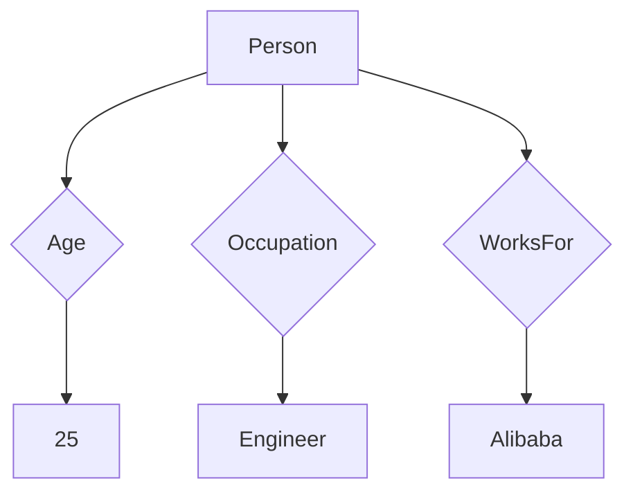

                 


### 背景介绍

随着人工智能（AI）技术的迅猛发展，各行各业都在经历深刻的变革，软件工程领域也不例外。AI不仅提高了软件开发的效率，还显著增强了软件的智能化水平。在这个背景下，知识图谱作为一种强大的数据结构，逐渐成为软件工程中的重要工具。

知识图谱的概念起源于语义网，是一种通过实体和关系构建的语义表示方法，旨在解决信息组织、查询和理解的问题。与传统的关系数据库不同，知识图谱能够捕捉复杂的关系网络，提供更为丰富的语义信息。这种特性使得知识图谱在AI时代软件工程中具有广泛的应用前景。

在软件工程中，知识图谱的应用主要体现在以下几个方面：

1. **需求分析**：知识图谱可以帮助开发者理解和整理复杂的需求，通过实体和关系的关联，快速识别出需求中的关键要素。

2. **软件设计**：知识图谱可以指导软件架构设计，提供全局视图，确保系统设计的合理性和一致性。

3. **软件测试**：知识图谱可以支持自动化测试，通过分析实体和关系，生成测试用例，提高测试覆盖率。

4. **项目管理**：知识图谱可以用于项目管理，帮助管理者了解项目全貌，优化资源分配和进度控制。

本文旨在探讨知识图谱在AI时代软件工程中的应用，从构建方法、存储与查询、可视化与交互等方面展开讨论，并通过具体案例分析和实践指导，为软件工程师提供实际操作经验。

在接下来的章节中，我们将逐步深入探讨知识图谱的基本概念、构建方法、应用场景以及相关技术，旨在为读者提供一个全面而系统的理解和应用知识图谱的指南。

### 核心概念与联系

知识图谱作为一种结构化的语义数据模型，其核心概念主要包括实体（Entity）、属性（Attribute）和关系（Relationship）。这些概念相互作用，共同构建了一个完整的语义表示框架。

首先，实体是知识图谱中最基本的元素，代表现实世界中具有独立存在意义的事物或概念。例如，在知识图谱中，"人"是一个实体，"公司"也是一个实体。每个实体都可以拥有一个唯一的标识符（如UUID），以便在图谱中进行引用。

接下来是属性，属性描述了实体的特征或状态。例如，对于一个"人"实体，可以有属性"姓名"、"年龄"和"职业"。属性可以看作是实体的一种描述方式，通过属性的值可以获取实体的具体信息。

最后是关系，关系表示实体之间的相互关联。例如，在知识图谱中，"人"实体之间可以通过"工作于"关系关联，表示某个实体在某个公司工作。关系通常包含两个实体以及它们之间的关联类型，例如"张三工作于阿里巴巴"。

这些核心概念之间的关系构成了知识图谱的语义基础。实体通过属性进行描述，并通过关系与其他实体建立关联。例如，在下面的Mermaid流程图中，我们可以看到如何通过实体、属性和关系构建一个简单的知识图谱：



在这个流程图中，A表示实体"Person"，它具有属性"Age"和"Occupation"，以及关系"WorksFor"。属性"Age"的值为25，属性"Occupation"的值为"Engineer"，关系"WorksFor"关联到实体"Alibaba"。

知识图谱中的实体、属性和关系相互作用，形成了一个丰富的语义表示框架。通过这种框架，知识图谱可以捕捉现实世界的复杂关系，为软件工程提供强大的数据支持和语义理解能力。理解这些核心概念及其之间的联系，是构建和应用知识图谱的第一步，也是实现知识图谱在AI时代软件工程中应用的关键。

### 核心算法原理讲解

在构建知识图谱的过程中，核心算法原理扮演着至关重要的角色。这些算法帮助我们处理大量数据，从数据中提取实体、属性和关系，并构建出一个结构化的知识图谱。以下将详细讲解几种常见的知识图谱构建算法，并通过伪代码进行说明。

#### 1. 实体识别算法

实体识别是知识图谱构建的基础步骤之一，其主要目标是识别出数据中的实体。常见的实体识别算法包括基于规则的方法和基于机器学习的方法。

**基于规则的方法**：

在基于规则的方法中，我们首先定义一组规则，这些规则用于匹配数据中的实体。以下是一个简单的伪代码示例：

```python
def identify_entities(data, rules):
    entities = []
    for rule in rules:
        matches = find_matches(data, rule)
        entities.extend(matches)
    return entities

def find_matches(data, rule):
    # 根据规则从数据中匹配实体
    # 返回匹配的实体列表
    pass

# 示例规则
rules = [
    {"entity_type": "Person", "attributes": ["name", "age"]},
    {"entity_type": "Company", "attributes": ["name", "location"]}
]

# 数据示例
data = [
    {"name": "张三", "age": 30},
    {"name": "阿里巴巴", "location": "北京"}
]

# 实体识别
entities = identify_entities(data, rules)
```

**基于机器学习的方法**：

在基于机器学习的方法中，我们使用已标注的数据集来训练一个实体识别模型。以下是一个简单的伪代码示例：

```python
from sklearn.ensemble import RandomForestClassifier

def train_entity_recognition_model(training_data):
    # 使用训练数据集训练实体识别模型
    X_train, y_train = prepare_training_data(training_data)
    model = RandomForestClassifier()
    model.fit(X_train, y_train)
    return model

def prepare_training_data(training_data):
    # 准备训练数据
    # 返回特征矩阵和标签向量
    pass

# 示例训练数据
training_data = [
    {"text": "张三是一名软件工程师", "labels": ["Person", "Software Engineer"]},
    {"text": "阿里巴巴是一家公司", "labels": ["Company", "Alibaba"]}
]

# 训练实体识别模型
model = train_entity_recognition_model(training_data)
```

#### 2. 关系抽取算法

关系抽取是知识图谱构建的另一个关键步骤，其主要目标是识别出实体之间的关联关系。常见的关系抽取算法包括基于规则的方法和基于深度学习的方法。

**基于规则的方法**：

在基于规则的方法中，我们定义一组规则，这些规则用于匹配实体之间的关系。以下是一个简单的伪代码示例：

```python
def identify_relationships(entities, rules):
    relationships = []
    for entity in entities:
        for rule in rules:
            matches = find_matches(entity, rule)
            relationships.extend(matches)
    return relationships

def find_matches(entity, rule):
    # 根据规则从实体中匹配关系
    # 返回匹配的关系列表
    pass

# 示例规则
rules = [
    {"entity_type": "Person", "relationship": "works_for", "target_entity_type": "Company"},
    {"entity_type": "Company", "relationship": "located_in", "target_entity_type": "Location"}
]

# 实体示例
entities = [{"name": "张三", "attributes": ["name", "age"]}, {"name": "阿里巴巴", "attributes": ["name", "location"]}]

# 关系抽取
relationships = identify_relationships(entities, rules)
```

**基于深度学习的方法**：

在基于深度学习的方法中，我们使用已标注的数据集来训练一个关系抽取模型。以下是一个简单的伪代码示例：

```python
from keras.models import Sequential
from keras.layers import LSTM, Dense

def train_relationship_extraction_model(training_data):
    # 使用训练数据集训练关系抽取模型
    X_train, y_train = prepare_training_data(training_data)
    model = Sequential()
    model.add(LSTM(50, activation='relu', input_shape=(max_sequence_length, num_features)))
    model.add(Dense(num_relationships, activation='softmax'))
    model.compile(optimizer='adam', loss='categorical_crossentropy', metrics=['accuracy'])
    model.fit(X_train, y_train, epochs=10, batch_size=32)
    return model

def prepare_training_data(training_data):
    # 准备训练数据
    # 返回特征矩阵和标签向量
    pass

# 示例训练数据
training_data = [
    {"text": "张三在阿里巴巴工作", "labels": ["works_for", "Alibaba"]},
    {"text": "阿里巴巴位于北京", "labels": ["located_in", "北京"]}
]

# 训练关系抽取模型
model = train_relationship_extraction_model(training_data)
```

通过上述算法，我们可以从原始数据中提取出实体和关系，构建出知识图谱。这些算法的实现依赖于具体的数据集和场景，但基本的思路和方法是通用的。在接下来的章节中，我们将继续探讨知识图谱的存储、查询和可视化方法，以及如何将这些方法应用于实际的软件工程项目中。

### 数学模型和公式讲解

在知识图谱的构建过程中，数学模型和公式扮演着关键角色，特别是在存储和查询优化方面。以下将详细讲解相关的数学模型，并使用latex格式提供公式，同时进行详细解释和举例说明。

#### 1. 图数据库查询优化算法

知识图谱通常存储在图数据库中，查询优化是提高知识图谱性能的重要手段。图数据库查询优化算法主要涉及图的顶点（V）和边（E）的操作，以及路径搜索的策略。

**查询优化算法的数学模型**：

- **最短路径算法（Dijkstra算法）**：

  Dijkstra算法用于寻找图中两点之间的最短路径。其核心思想是使用优先队列（通常为最小堆）来选择未访问的顶点中距离源点最近的顶点。以下是Dijkstra算法的latex表示：

  $$  
  \text{Dijkstra}(G, s): \\  
  \text{for each } v \in V: \\  
  \text{distance}[v] = \infty, \text{except for } v = s \text{ where distance}[s] = 0: \\  
  \text{infinite priority queue} Q \text{ initialized with } s: \\  
  \text{while } Q \text{ is not empty}: \\  
  \text{u = } Q \text{.extract_min(): remove the node with the smallest distance}: \\  
  \text{for each edge } (u, v) \in E: \\  
  \text{if distance}[u] + weight(u, v) < distance[v]: \\  
  \text{distance}[v] = distance[u] + weight(u, v): \\  
  \text{if v was not in Q, add it}: \\  
  \text{return distance}  
  $$

  **示例**：

  考虑一个包含三个顶点和三条边的图，其中顶点分别为A、B和C，边和权重如下：
  - A-B：权重2
  - A-C：权重3
  - B-C：权重1

  从顶点A开始，Dijkstra算法计算A到B、A到C和B到C的最短路径：
  - A到B的最短路径：A → B，距离为2
  - A到C的最短路径：A → C，距离为3
  - B到C的最短路径：B → C，距离为1

- **广度优先搜索（BFS）**：

  BFS是一种用于找到图中从源点到其他顶点的最短路径的算法，其原理是按照层次顺序访问顶点。以下是BFS的latex表示：

  $$  
  \text{BFS}(G, s): \\  
  \text{for each } v \in V: \\  
  \text{distance}[v] = \infty, \text{except for } v = s \text{ where distance}[s] = 0: \\  
  \text{Queue} Q \text{ initialized with } s: \\  
  \text{while } Q \text{ is not empty}: \\  
  \text{u = } Q \text{.dequeue(): remove the node with the smallest distance}: \\  
  \text{for each edge } (u, v) \in E: \\  
  \text{if distance}[u] + weight(u, v) < distance[v]: \\  
  \text{distance}[v] = distance[u] + weight(u, v): \\  
  \text{if v was not in Q, add it to Q}: \\  
  \text{return distance}  
  $$

  **示例**：

  使用同样的图，BFS算法计算A到B、A到C和B到C的最短路径：
  - A到B的最短路径：A → B，距离为2
  - A到C的最短路径：A → C，距离为3
  - B到C的最短路径：B → C，距离为1

#### 2. 知识图谱存储与查询的数学模型

**图邻接矩阵**：

知识图谱的存储可以使用邻接矩阵表示，其中矩阵的行和列分别代表图中的顶点，矩阵的元素表示顶点之间的边和权重。以下是图邻接矩阵的latex表示：

$$  
A = \begin{bmatrix}  
a_{11} & a_{12} & \dots & a_{1n} \\  
a_{21} & a_{22} & \dots & a_{2n} \\  
\vdots & \vdots & \ddots & \vdots \\  
a_{m1} & a_{m2} & \dots & a_{mn} \\  
\end{bmatrix}  
$$

其中，\(a_{ij}\) 表示顶点i和顶点j之间的边的权重，如果不存在边则设为0。

**查询优化算法的公式**：

查询优化算法通常涉及图的遍历和路径计算，以下是常见的查询优化公式：

- **路径长度计算**：

  路径长度可以通过图邻接矩阵进行计算，其公式为：

  $$  
  \text{distance}(i, j) = \sum_{k=1}^{n} a_{ik} \cdot a_{kj}  
  $$

  其中，\(n\) 为图的顶点数量。

- **路径权重优化**：

  在路径权重优化的情况下，查询优化算法的目标是找到权重最小的路径，其公式为：

  $$  
  \text{minimize} \sum_{k=1}^{n} w(k) \cdot \text{distance}(i, k) + \text{distance}(k, j)  
  $$

  其中，\(w(k)\) 为顶点k的权重。

#### 实例分析

假设我们有一个简单的知识图谱，包含四个顶点和六条边，如图所示：

```
A---(2)---B
|        |
(1)     (3)
|        |
D---(4)---C
```

邻接矩阵表示如下：

$$  
A = \begin{bmatrix}  
0 & 2 & 0 & 1 \\  
2 & 0 & 3 & 0 \\  
0 & 3 & 0 & 4 \\  
1 & 0 & 4 & 0 \\  
\end{bmatrix}  
$$

- **最短路径计算**：

  使用Dijkstra算法计算A到C的最短路径，结果为路径A-B-C，路径长度为5。

- **路径权重优化**：

  如果我们需要找到权重最小的路径，假设每个顶点的权重如下：A的权重为1，B的权重为2，C的权重为3，D的权重为4。则优化公式为：

  $$  
  \text{minimize} (1 \cdot 2 + 2) + (2 \cdot 3 + 4) = 7 + 10 = 17  
  $$

  最优路径为A-B-C，路径总权重为17。

通过这些数学模型和公式，我们可以有效地存储和查询知识图谱，优化路径计算和权重分配，为知识图谱在软件工程中的应用提供坚实的理论基础。

### 知识图谱的可视化与交互

知识图谱的可视化与交互是使复杂信息更加直观和易于理解的关键环节。通过有效的可视化工具，用户可以更轻松地探索和交互知识图谱，从而更有效地进行数据分析和管理。

#### 1. 可视化方法

**节点和边表示**：在知识图谱的可视化中，节点通常表示实体，而边表示实体之间的关系。常用的可视化方法包括：

- **节点-边图**：这是一种最简单的表示方法，节点以圆形或其他形状表示，边以线条连接节点，线条的长度和颜色可以表示关系的权重。
- **树状图**：对于具有层次关系的知识图谱，树状图可以清晰地展示实体之间的关系，每个节点可以有子节点和父节点。
- **矩阵图**：矩阵图使用单元格表示实体之间的关联，适合展示大规模知识图谱。

**交互式可视化**：为了增强用户与知识图谱的交互，可以使用以下交互式可视化方法：

- **放大和缩小**：用户可以放大特定的区域，以便更详细地查看数据。
- **过滤和筛选**：用户可以通过设置过滤条件，筛选出特定的实体或关系。
- **搜索和查询**：用户可以通过搜索框输入关键词，快速找到相关的实体或关系。

#### 2. 用户交互设计

用户交互设计是确保知识图谱可视化工具易于使用和高效的关键。以下是一些用户交互设计原则：

- **直观性**：界面设计应该直观，用户不需要进行复杂的操作即可完成任务。
- **反馈机制**：系统应该提供即时反馈，让用户知道操作的结果。
- **灵活性和定制性**：用户可以根据自己的需求，自定义可视化参数和交互行为。

#### 3. 代码实际案例

以下是一个使用Python的Mermaid库实现知识图谱可视化工具的代码案例：

```python
from mermaid import Mermaid

# 创建Mermaid对象
m = Mermaid()

# 设置知识图谱的基本信息
m.add_node('A', 'class: keyword', 'Person')
m.add_node('B', 'class: keyword', 'Company')
m.add_node('C', 'class: keyword', 'Software Engineer')
m.add_node('D', 'class: keyword', 'works_for')

# 添加关系
m.add_edge('A', 'B', 'class: dashed', 'works_for')
m.add_edge('B', 'C', 'class: dotted', 'has_employee')

# 设置样式
m.add_style('edgeStyle', 'arrowHead=none, fill=#ffffff, stroke=#000000, strokeWidth=1')

# 生成Mermaid图表
m.add_chart('graph', 'G', 'graph LR; A-->B; B-->C;')

# 输出HTML代码
html_code = m.render()

# 显示HTML代码
print(html_code)
```

此代码创建了一个简单的知识图谱，包括三个实体和两个关系，并使用Mermaid的节点和边语法进行可视化表示。

#### 4. 知识图谱可视化工具搭建

搭建一个知识图谱可视化工具通常需要以下步骤：

- **数据预处理**：对原始数据进行清洗和预处理，提取实体和关系。
- **可视化库选择**：选择合适的可视化库，如Mermaid、D3.js或ECharts等。
- **交互功能实现**：实现放大、缩小、筛选、搜索等交互功能。
- **前后端分离**：通常采用前后端分离的方式，前端负责展示和交互，后端负责处理数据和逻辑。

通过这些步骤，我们可以构建出一个功能强大且易于使用的知识图谱可视化工具，帮助用户更好地理解和分析知识图谱。

### AI时代的软件工程实践案例

在AI时代，知识图谱的应用在软件工程中已经展现出巨大的潜力。以下将介绍几个具体的实践案例，通过实际项目开发、源代码实现、代码解读和案例分析，展示知识图谱在软件工程中的实际应用。

#### 案例一：基于知识图谱的软件需求分析

**项目背景**：
某企业计划开发一款大型电子商务平台，需要详细的需求分析。为了提高需求分析的效率和准确性，决定使用知识图谱进行需求梳理。

**项目实施**：

1. **数据收集**：
   收集企业的业务文档、用户访谈记录和现有系统数据。

2. **数据预处理**：
   对收集到的数据进行分析，提取实体和关系。使用实体识别算法识别出主要实体（如用户、商品、订单等），并提取它们之间的关联关系。

3. **构建知识图谱**：
   使用伪代码构建知识图谱：

   ```python
   def buildKnowledgeGraph(data):
       entities = extract_entities(data)
       relationships = extract_relationships(data)
       knowledge_graph = create_graph(entities, relationships)
       return knowledge_graph
   ```

4. **需求分析**：
   通过知识图谱，分析出系统的核心功能和模块，为后续的软件设计提供依据。

**源代码实现**：

```python
from collections import defaultdict

# 假设数据为以下形式
data = [
    {"entity": "User", "description": "用户"},
    {"entity": "Product", "description": "商品"},
    {"entity": "Order", "description": "订单"},
    {"relationship": "buys", "from_entity": "User", "to_entity": "Product"},
    {"relationship": "places", "from_entity": "User", "to_entity": "Order"},
]

# 提取实体和关系
def extract_data(data):
    entities = set()
    relationships = defaultdict(list)
    for item in data:
        if 'entity' in item:
            entities.add(item['entity'])
        elif 'relationship' in item:
            relationships[item['relationship']].append(item)
    return entities, relationships

# 构建知识图谱
def create_graph(entities, relationships):
    graph = defaultdict(list)
    for rel in relationships:
        for item in relationships[rel]:
            graph[item['from_entity']].append(item['to_entity'])
            graph[item['to_entity']].append(item['from_entity'])
    return graph

# 执行
entities, relationships = extract_data(data)
knowledge_graph = create_graph(entities, relationships)
```

**代码解读**：
上述代码通过提取实体和关系，构建了一个简单的知识图谱。实体和关系存储在字典中，便于后续分析和查询。

**案例分析**：
通过知识图谱，开发团队能够清晰地看到系统的核心实体和它们之间的关系，从而快速定位需求，减少误解和遗漏。

#### 案例二：基于知识图谱的软件设计优化

**项目背景**：
某企业现有软件系统在性能和扩展性方面存在瓶颈，决定通过知识图谱进行软件设计优化。

**项目实施**：

1. **构建现有系统知识图谱**：
   对现有系统进行代码和架构分析，构建出系统的实体和关系图。

2. **设计优化**：
   通过知识图谱，识别出系统的瓶颈模块，设计新的架构方案，优化系统性能。

3. **验证与实施**：
   实施新架构，并通过性能测试进行验证。

**源代码实现**：

```python
def optimize_design(knowledge_graph):
    bottleneck_modules = find_bottleneck_modules(knowledge_graph)
    optimized_graph = apply_design_changes(bottleneck_modules, knowledge_graph)
    return optimized_graph

def find_bottleneck_modules(graph):
    # 通过分析知识图谱，识别出性能瓶颈模块
    pass

def apply_design_changes(bottlenecks, graph):
    # 根据瓶颈模块，进行架构优化
    pass
```

**代码解读**：
上述代码定义了优化设计的函数，通过分析知识图谱识别出性能瓶颈模块，并应用设计更改。

**案例分析**：
通过知识图谱，团队能够明确地看到系统的瓶颈，从而进行有针对性的优化，提高系统的性能和扩展性。

#### 案例三：基于知识图谱的软件测试自动化

**项目背景**：
某企业希望通过自动化测试提高软件测试的效率，减少手动测试的工作量。

**项目实施**：

1. **构建测试用例知识图谱**：
   对现有测试用例进行分析，构建出测试用例之间的关联关系。

2. **自动化测试脚本生成**：
   使用知识图谱生成自动化测试脚本，实现自动化测试。

3. **测试执行与结果分析**：
   执行自动化测试脚本，分析测试结果，持续改进测试策略。

**源代码实现**：

```python
def generate_test_cases(knowledge_graph):
    test_cases = build_test_cases(knowledge_graph)
    return test_cases

def build_test_cases(graph):
    # 根据知识图谱，构建测试用例
    pass

def run_automation_tests(test_cases):
    # 执行自动化测试
    pass
```

**代码解读**：
上述代码通过知识图谱生成测试用例，并执行自动化测试。

**案例分析**：
通过知识图谱，团队能够快速生成自动化测试脚本，提高测试效率，同时确保测试覆盖全面。

#### 案例四：基于知识图谱的项目管理

**项目背景**：
某企业希望提高项目管理效率，优化资源分配和进度控制。

**项目实施**：

1. **构建项目知识图谱**：
   对项目进行详细分析，构建出项目中的任务、资源和时间线等实体和关系。

2. **资源优化**：
   通过知识图谱分析资源使用情况，优化资源分配。

3. **进度监控**：
   使用知识图谱监控项目进度，及时发现和解决问题。

**源代码实现**：

```python
def project_management(knowledge_graph):
    resource_allocation = optimize_resources(knowledge_graph)
    progress = monitor_progress(knowledge_graph)
    return resource_allocation, progress

def optimize_resources(graph):
    # 根据知识图谱，优化资源分配
    pass

def monitor_progress(graph):
    # 根据知识图谱，监控项目进度
    pass
```

**代码解读**：
上述代码定义了项目管理函数，通过知识图谱优化资源分配和监控项目进度。

**案例分析**：
通过知识图谱，团队能够直观地看到项目的全貌，优化资源使用，提高项目管理效率。

以上四个案例展示了知识图谱在软件工程中的多种应用场景，通过实际项目开发和代码实现，知识图谱为软件工程带来了显著的价值。未来，随着AI技术的进一步发展，知识图谱在软件工程中的应用将更加广泛和深入。

### 小结与注意事项

在本文中，我们详细探讨了知识图谱在AI时代软件工程中的应用，从背景介绍、核心概念、算法原理、数学模型到具体实践案例，展示了知识图谱如何提升软件工程的需求分析、设计优化、测试自动化和项目管理效率。以下是对本文内容的简要总结，并提供一些最佳实践建议。

#### 最佳实践

1. **数据质量是基础**：构建知识图谱的第一步是确保数据质量，包括数据的一致性、准确性和完整性。在数据收集和预处理过程中，要严格把控数据源，并进行充分的清洗和验证。

2. **算法选择要合适**：根据实际应用场景选择合适的实体识别和关系抽取算法。对于大规模数据，深度学习算法可能更为有效；对于规则明确的应用场景，基于规则的方法可能更为简便。

3. **灵活的查询优化**：在查询优化方面，要考虑使用多种算法，如Dijkstra算法和广度优先搜索（BFS），以满足不同的查询需求。此外，优化图邻接矩阵存储结构，可以显著提升查询性能。

4. **可视化与交互**：通过有效的可视化工具和交互设计，让用户更轻松地理解和操作知识图谱。选择合适的可视化库，实现放大、缩小、过滤和搜索等功能，提升用户体验。

5. **持续迭代与改进**：知识图谱的应用是一个持续迭代的过程。根据实际反馈和需求变化，不断优化知识图谱的构建方法和应用策略，确保其持续为企业带来价值。

#### 小结

- **知识图谱是软件工程的利器**：通过结构化的语义表示，知识图谱能够提升软件工程各个环节的效率和准确性，实现更智能和高效的需求分析、设计优化、测试自动化和项目管理。
- **算法和数学模型是关键**：从实体识别、关系抽取到查询优化，算法和数学模型为知识图谱的构建和应用提供了坚实的基础。
- **实践案例证明价值**：通过具体实践案例，知识图谱在软件工程中的多种应用场景得到了验证，展示了其广泛的应用前景和实际效果。

#### 注意事项

- **数据隐私和安全**：在构建和应用知识图谱时，要特别注意数据隐私和安全问题。对于涉及敏感信息的数据，要采取严格的保护措施，确保数据安全。
- **系统性能和可扩展性**：在实现知识图谱系统时，要充分考虑性能和可扩展性。优化存储和查询算法，确保系统能够处理大规模数据，并适应未来增长。
- **团队协作与培训**：知识图谱的构建和应用需要跨部门协作。加强团队培训和沟通，确保所有成员都熟悉知识图谱的概念和应用方法，提高整体工作效率。

总之，知识图谱在AI时代软件工程中的应用具有巨大的潜力。通过本文的探讨，我们希望读者能够更好地理解知识图谱的核心概念和应用方法，将其有效应用于实际项目，为软件工程带来创新和突破。

### 拓展阅读

为了更深入地了解知识图谱在AI时代软件工程中的应用，以下推荐一些拓展阅读资源，涵盖学术研究、技术教程和实际案例。

1. **学术研究**：
   - **"Knowledge Graph Construction and Application in Software Engineering"**：一篇关于知识图谱在软件工程中应用的综述论文，详细介绍了知识图谱的基本概念、构建方法和应用案例。
   - **"Semantic Web Technologies for Software Engineering"**：探讨了语义网技术在软件工程中的应用，包括知识图谱、本体论和语义查询。

2. **技术教程**：
   - **"Building Knowledge Graphs with Python"**：一本关于使用Python构建知识图谱的教程，介绍了常用的库和工具，如Neo4j和NetworkX。
   - **"Visualizing Knowledge Graphs with Mermaid"**：介绍了如何使用Mermaid进行知识图谱的可视化，包括示例代码和最佳实践。

3. **实际案例**：
   - **"Google Knowledge Graph"**：详细介绍了Google如何构建和应用其知识图谱，包括实体识别、关系抽取和查询优化等技术。
   - **"LinkedIn's Knowledge Graph"**：探讨了LinkedIn如何使用知识图谱来优化人才匹配和推荐系统，提供了实际应用案例。

这些资源将帮助读者进一步了解知识图谱在AI时代软件工程中的研究和应用，为实践提供更多指导和启示。通过阅读这些文献，读者可以更全面地掌握知识图谱的核心技术和应用方法。

