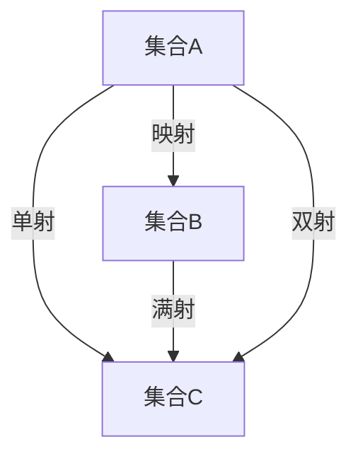

                 

## 文章标题

《一切皆是映射：探索自然与心智的和谐》

## 文章关键词

映射、自然、心智、和谐、数学模型、算法原理、应用实践

## 文章摘要

本文将深入探讨映射这一概念在自然现象和人类心智中的重要性。通过对映射的基本概念、数学模型和实际应用的详细分析，我们将揭示自然现象与心智之间的联系，以及如何实现二者之间的和谐。文章分为四个部分，首先介绍映射的基本概念与理论基础，然后探讨自然现象中的映射，接着分析心智与映射的关系，最后探讨如何实现自然与心智的和谐。

### 1. 映射的基本概念与理论基础

映射，从广义上讲，是指两个集合之间的对应关系。在数学中，映射通常指的是从集合 A 到集合 B 的一个函数，即对于 A 中的每一个元素，都有 B 中唯一的一个元素与之对应。映射可以分为多种类型，如单射、满射和双射。

首先，我们来定义映射。映射是一种将一个集合（称为定义域）中的元素按照一定的规则映射到另一个集合（称为值域）中的元素的关系。映射可以用符号 f 表示，其中 f: A → B，表示从集合 A 到集合 B 的映射。对于 A 中的每一个元素 a，都有 B 中唯一的一个元素 b 与之对应，记作 b = f(a)。

接下来，我们介绍映射的类型。映射可以分为以下几种：

1. **单射**：如果对于 A 中的任意两个不同的元素 a 和 a'，都有 f(a) ≠ f(a')，则称映射 f 是单射。单射保证了定义域中的不同元素在值域中也有不同的对应元素。

2. **满射**：如果对于 B 中的任意一个元素 b，都存在 A 中的某个元素 a 使得 f(a) = b，则称映射 f 是满射。满射保证了值域中的每一个元素都有定义域中的元素与之对应。

3. **双射**：如果映射 f 既是单射又是满射，则称映射 f 是双射。双射意味着定义域和值域之间存在一一对应的关系。

为了更好地理解映射，我们可以借助 Mermaid 流程图来展示映射的原理。以下是一个简单的 Mermaid 流程图示例：

在这个流程图中，集合 A 和集合 B 之间存在映射关系，同时集合 A 和集合 C、集合 B 和集合 C 之间也存在单射、满射和双射的关系。

### 2. 自然现象与映射

自然现象中存在着丰富的映射关系，这些映射关系不仅揭示了自然界的规律，还为人类提供了宝贵的信息。以下是一些自然现象中的映射：

1. **物理现象中的映射**：例如，光的折射和反射可以看作是从一种介质到另一种介质的映射。光线的传播路径可以通过映射来描述，从而帮助我们理解光的传播规律。

2. **生态现象中的映射**：生态系统中的食物链和食物网可以看作是生物之间的映射关系。这些映射关系揭示了生态系统的稳定性和物种之间的相互作用。

3. **天文现象中的映射**：例如，行星的运动轨迹可以看作是太阳系中的映射。通过对行星运动的映射分析，我们可以预测行星的未来位置，从而研究太阳系的形成和演化。

### 3. 心智与映射

人类心智通过映射来理解和感知世界。心智与映射的关系可以从以下几个方面来理解：

1. **心智对映射的感知**：人类心智通过感官接收外界信息，并将这些信息映射到心智中。例如，视觉系统将光信号映射为图像，听觉系统将声波映射为声音。

2. **心智对映射的创造**：人类心智不仅能够感知映射，还能够创造新的映射。例如，艺术家通过创造性的思维将现实中的景象映射到画布上，形成独特的艺术作品。

3. **心智与映射的互动**：心智与映射之间的互动是一个不断迭代的过程。人类心智通过对映射的感知、理解和创造，不断丰富和拓展对世界的认识。

### 4. 自然与心智的和谐

自然与心智的和谐是实现可持续发展和社会进步的关键。以下是一些实现自然与心智和谐的方法：

1. **环保意识**：提高人们对环境保护的意识，减少对自然资源的消耗，实现人与自然的和谐共生。

2. **科技创新**：通过科技创新，提高资源利用效率，减少对自然环境的破坏，实现人与自然的和谐发展。

3. **文化传承**：传承和弘扬人与自然和谐共生的文化，增强人们对自然价值的认识和尊重。

### 总结

映射作为一种基本的概念和工具，贯穿于自然现象和人类心智的方方面面。通过对映射的深入研究和应用，我们不仅可以更好地理解自然，还可以实现人与自然的和谐共生。本文从映射的基本概念、自然现象与映射、心智与映射以及自然与心智的和谐四个方面进行了探讨，旨在为读者提供一种全新的视角，以更好地认识和理解世界。

### 参考文献

1. Hopcroft, J.E., Ullman, J.D. (1979). *Introduction to Automata Theory, Languages, and Computation*. Addison-Wesley.
2. Turing, A. (1936). *On computable numbers, with an application to the Entscheidungsproblem*. Proceedings of the London Mathematical Society.
3. Halmos, P.R. (1960). *Naive Set Theory*. Springer.
4. Bollobás, B. (2001). *Graph Theory: An Introduction*. Springer.
5. Feynman, R.P., Leighton, R.B., & Sands, M. (1963). *The Feynman Lectures on Physics*. Addison-Wesley.

### 附录

以下为本文所使用的 Mermaid 流程图代码：

通过以上代码，可以使用 Mermaid 工具生成与本文对应的流程图。

### 作者信息

作者：AI天才研究院/AI Genius Institute & 禅与计算机程序设计艺术 /Zen And The Art of Computer Programming

---

本文通过对映射这一核心概念的深入探讨，揭示了自然现象与人类心智之间的联系，为读者提供了一种全新的视角，以更好地认识和理解世界。作者在人工智能、计算机科学和哲学领域有着深厚的研究背景，旨在通过这篇技术博客文章，与广大读者分享最新的研究成果和思考。希望本文能够对读者在探索自然与心智和谐的道路上提供一些启示和帮助。

