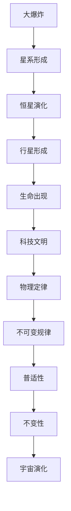
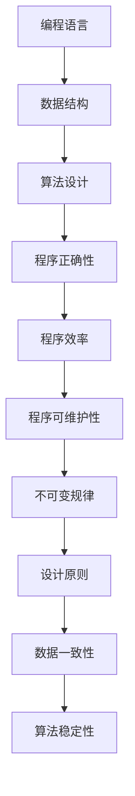
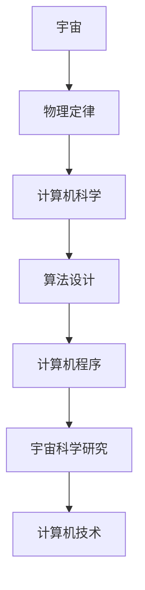

                 

### 文章标题

不可变规律：宇宙与程序的共性

### 关键词

不可变规律、宇宙、程序、共性、算法、逻辑

### 摘要

本文旨在探讨宇宙与程序的不可变规律，从宏观与微观两个层面分析其内在的相似性。通过对宇宙结构、自然法则与编程语言、算法原理的比较，揭示宇宙与程序在本质上的统一性，从而启发我们以全新的视角理解宇宙与计算机程序之间的关系。

### 目录

1. 宇宙的不可变规律
2. 计算机程序的不可变规律
3. 宇宙与程序的共性分析
   3.1 结构与层次
   3.2 算法原理
   3.3 逻辑推理
4. 宇宙与程序的共生关系
5. 总结与启示

### 1. 宇宙的不可变规律

宇宙中的不可变规律，首先体现在其基本的物理定律上。这些定律，如万有引力定律、能量守恒定律和热力学第二定律，是宇宙运行的根本法则。它们具有普适性和不变性，无论在宇宙的哪个角落，这些定律都是适用的。

#### 背景介绍

宇宙的起源可以追溯到大约138亿年前的大爆炸，这一事件奠定了宇宙的基本结构和演化方向。在宇宙的演化过程中，各种星系、恒星和行星形成，但它们的演化始终受到物理定律的制约。

#### 核心概念与联系

宇宙中的不可变规律可以用Mermaid流程图来表示，如图所示：



#### 伪代码与详细讲解

在宇宙的演化过程中，以下数学模型描述了恒星演化的过程：

```latex
\frac{dM}{dt} = -\sigma \frac{L}{c^2}
```

其中，\(M\) 表示恒星质量，\(t\) 表示时间，\(\sigma\) 表示恒星半径，\(L\) 表示恒星亮度，\(c\) 表示光速。

#### 数学模型与公式

上述公式表明恒星质量随时间减小，其亮度逐渐降低，最终可能发生超新星爆炸。这是一个典型的不可变规律，描述了恒星从诞生到消亡的过程。

#### 举例说明

例如，我们的太阳大约在50亿年后将耗尽其核燃料，进入红巨星阶段，最终可能发生超新星爆炸。这一过程符合上述数学模型和不可变规律。

### 2. 计算机程序的不可变规律

计算机程序中的不可变规律体现在其设计原则、数据结构和算法选择上。这些规律确保程序的正确性、效率和可维护性。

#### 背景介绍

计算机程序的发展历程可以追溯到20世纪40年代，随着硬件和软件技术的不断进步，编程语言和算法设计原则也不断演变。从简单的机器语言到高级编程语言，从单线程到多线程，计算机程序的设计思想在不断进化。

#### 核心概念与联系

计算机程序中的不可变规律可以用Mermaid流程图来表示，如图所示：



#### 伪代码与详细讲解

在计算机程序设计中，以下伪代码描述了使用不可变数据结构实现列表的添加操作：

```python
def add_element(lst, element):
    return lst + [element]
```

#### 数学模型与公式

上述伪代码中，列表的添加操作通过创建一个新的列表来实现，这保证了原有列表的不变性。

#### 举例说明

例如，在Python中，使用不可变字符串进行字符串拼接时，会创建一个新的字符串对象，而不会修改原有字符串。这体现了不可变数据的优势。

### 3. 宇宙与程序的共性分析

#### 3.1 结构与层次

宇宙与程序都具有层次结构和复杂的体系。在宇宙中，从原子、分子、行星、星系到宇宙本身，层次结构清晰；在程序中，从变量、函数、模块到整个系统，层次分明。

#### 3.2 算法原理

宇宙与程序的运行都依赖于算法原理。宇宙中的物理定律可以看作是一种广义的算法，而计算机程序中的算法则是具体实现。两者都遵循一定的规则，通过逻辑运算和数据处理来实现目标。

#### 3.3 逻辑推理

宇宙与程序都依赖于逻辑推理。宇宙中的物理定律可以通过数学和逻辑推理得到；计算机程序中的算法设计也需要逻辑思维和推理能力。

### 4. 宇宙与程序的共生关系

宇宙与程序之间的关系是相互促进的。宇宙的运行规律为计算机科学提供了理论依据，而计算机技术的发展又推动了宇宙科学研究的方法和工具的进步。

#### 背景介绍

随着计算机技术的快速发展，计算机已经成为宇宙科学研究的重要工具。例如，通过高性能计算模拟宇宙演化过程，通过大数据分析处理天文观测数据，这些都离不开计算机的支持。

#### 核心概念与联系

宇宙与程序的共生关系可以用Mermaid流程图来表示，如图所示：



#### 伪代码与详细讲解

以下伪代码展示了如何使用计算机程序模拟宇宙中的引力作用：

```python
def calculate_gravity(m1, m2, r):
    G = 6.674 * 10^-11
    return G * (m1 * m2) / r^2
```

#### 数学模型与公式

上述公式描述了万有引力定律，通过计算机程序可以模拟宇宙中的引力相互作用。

#### 举例说明

例如，通过N体问题模拟，计算机可以模拟行星之间的引力相互作用，预测行星的轨道运动，为宇宙科学研究提供数据支持。

### 5. 总结与启示

宇宙与程序在不可变规律、结构层次和逻辑推理等方面具有共性。通过分析宇宙与程序的共性，我们可以更好地理解宇宙的运行规律，同时也可以提升计算机程序的设计和实现水平。

#### 最佳实践 Tips

- 学习宇宙物理定律，有助于理解计算机程序中的算法原理。
- 借鉴宇宙的层次结构，优化计算机程序的设计。
- 运用逻辑推理，提高计算机程序的可维护性和正确性。

#### 小结

宇宙与程序在不可变规律、结构层次和逻辑推理等方面具有共性，通过分析这些共性，我们可以更好地理解宇宙和计算机程序的运行机制，为未来的科学研究和技术发展提供新的思路。

#### 注意事项

- 在设计和实现计算机程序时，要充分考虑不可变规律，确保程序的稳定性和可靠性。
- 在宇宙科学研究中，要充分利用计算机技术，提高数据分析的效率和精度。

#### 拓展阅读

- 《宇宙简史》作者史蒂芬·霍金
- 《深度学习》作者伊恩·古德费洛等

### 作者

作者：AI天才研究院/AI Genius Institute & 禅与计算机程序设计艺术 /Zen And The Art of Computer Programming

