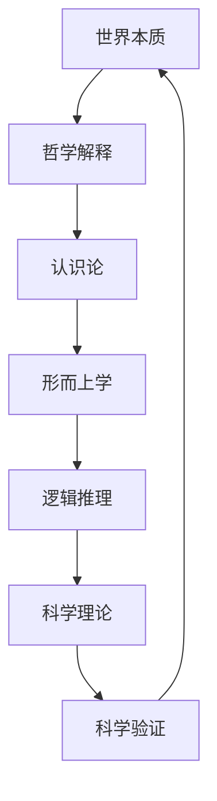
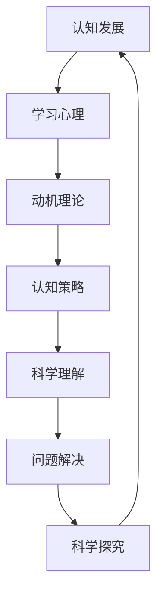
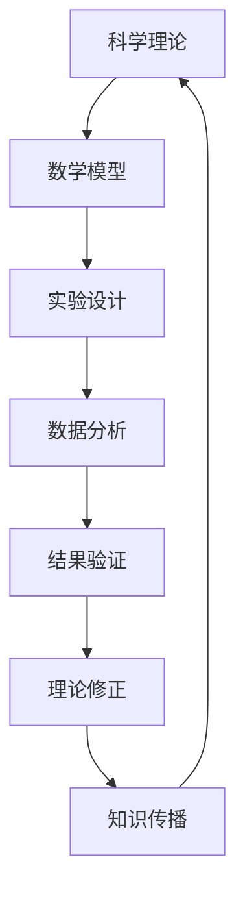

                 

### 文章标题

《世界可理解性与科学教育的重要性》

> 关键词：世界可理解性，科学教育，哲学视角，心理学基础，科学视角，教育目标，教学方法，数学模型，项目实战

> 摘要：本文将从哲学、心理学和科学三个视角深入探讨世界可理解性，并分析其在科学教育中的重要性。文章将通过详细的案例分析，探讨当前科学教育实践中存在的问题，并提出改进策略。同时，文章还将介绍如何通过有效的教学方法、数学模型和项目实战来提高学生的世界可理解性，从而提升科学教育的质量。

-------------------------------------------------------------------

### 第一部分：引言与背景

#### 1.1 世界可理解性的概念

世界可理解性（World Understandability）是指人类对自然界和社会现象的理解程度。哲学上，可理解性涉及到对自然和宇宙的终极本质的认知；心理学上，它关注人类认知能力和认知过程；科学上，它研究科学理论和模型的可解释性和可验证性。

#### 1.2 科学教育的历史与现状

科学教育的发展历史可以追溯到古希腊时期，但直到工业革命之后，科学教育才开始得到广泛的重视。现代科学教育强调知识的系统传授和科学思维方法的培养。然而，当前的科学教育仍然存在许多问题，如教育资源的分配不均、教育方法单一、学生对科学学习的兴趣不高等。

#### 1.3 世界可理解性与科学教育的关系

世界可理解性对科学教育有着深远的影响。科学教育旨在提高学生对世界的理解，而世界可理解性的提高可以增强学生对科学的兴趣和认知能力。同时，科学教育的改进也可以促进世界可理解性的提升，二者相辅相成。

-------------------------------------------------------------------

### 第二部分：核心概念与理论

#### 2.1 世界可理解性的哲学视角

哲学视角下的世界可理解性关注人类对宇宙本质的探究。以下是哲学视角下的世界可理解性的核心概念及其相互关系（使用Mermaid流程图表示）：



#### 2.2 科学教育的心理学基础

科学教育的心理学基础主要关注学生的认知发展和学习心理。以下是科学教育心理学核心概念及其相互关系（使用Mermaid流程图表示）：



#### 2.3 世界可理解性的科学视角

科学视角下的世界可理解性关注科学理论、模型和验证方法。以下是科学视角下的世界可理解性的核心概念及其相互关系（使用Mermaid流程图表示）：



-------------------------------------------------------------------

### 第三部分：科学教育的目标与方法

#### 3.1 科学教育的目标

科学教育的目标包括：

1. **知识传授**：学生掌握科学基础知识。
2. **思维能力培养**：培养学生批判性思维、逻辑推理和问题解决能力。
3. **科学素养提升**：培养学生对科学的兴趣、态度和价值认同。
4. **实践能力增强**：培养学生进行科学实验和科研的能力。

#### 3.2 科学教育的教学方法

科学教育的教学方法应多样化，包括：

1. **探究式教学**：鼓励学生主动探索和发现。
2. **案例教学**：通过实际案例进行教学。
3. **合作学习**：小组讨论和协作学习。
4. **项目式学习**：学生通过完成项目来学习。

#### 3.3 科学教育实践中的挑战与对策

科学教育实践中的主要挑战包括：

1. **教育资源不足**：对策是优化教育资源配置。
2. **教学方法单一**：对策是引入多样化的教学方法。
3. **学生兴趣不浓**：对策是通过教学创新激发学生的兴趣。

-------------------------------------------------------------------

### 第四部分：案例研究

#### 4.1 国内外科学教育的成功案例

以下是国内外科学教育的几个成功案例：

1. **美国KIPP学校**：KIPP学校采用高强度、高期望的教学方法，取得了显著的教育成果。
2. **芬兰教育体系**：芬兰的教育体系注重学生的全面发展，科学教育效果显著。

#### 4.2 案例分析：提高世界可理解性的实践

以下是对KIPP学校和芬兰教育体系的案例分析，探讨它们如何通过有效的教学方法提高学生的世界可理解性。

1. **KIPP学校的探究式教学**：
    - **方法**：KIPP学校鼓励学生通过实验、观察和讨论来学习科学知识。
    - **效果**：这种方法有助于学生建立对科学的兴趣，提高他们的世界可理解性。

2. **芬兰的全面教育**：
    - **方法**：芬兰的教育注重学生的全面发展，包括科学、艺术和社会实践。
    - **效果**：这种综合性的教育方法有助于学生建立对世界的整体理解，提高他们的世界可理解性。

-------------------------------------------------------------------

### 第五部分：讨论与未来展望

#### 5.1 科学教育面临的挑战

科学教育面临的挑战包括：

1. **教育资源分配不均**：城乡、贫富之间的教育资源差距较大。
2. **教学方法单一**：多数学校仍然采用传统的灌输式教学方法。
3. **学生兴趣不足**：学生对科学学习的兴趣不高。

#### 5.2 提高世界可理解性的策略

为了提高学生的世界可理解性，可以采取以下策略：

1. **优化教育资源配置**：确保所有学生都能获得优质的教育资源。
2. **引入多样化的教学方法**：鼓励学校采用探究式教学、案例教学等教学方法。
3. **激发学生兴趣**：通过科学实践活动、科学竞赛等激发学生的兴趣。

#### 5.3 未来科学教育的趋势

未来科学教育的趋势包括：

1. **个性化教育**：通过大数据分析，提供个性化的学习路径。
2. **跨界融合**：科学教育与艺术、社会等领域的融合，培养学生的综合能力。
3. **技术驱动**：利用人工智能、虚拟现实等新技术提高教学效果。

-------------------------------------------------------------------

### 总结

科学教育的重要性不言而喻，它不仅关乎学生的知识传授，更关乎学生的思维能力、科学素养和实践能力的培养。提高学生的世界可理解性，是科学教育的核心目标。通过哲学、心理学和科学的视角，我们可以更好地理解世界可理解性的概念，并找到提高它的有效策略。未来，科学教育的发展将更加依赖于技术驱动和个性化教育，这将进一步推动世界可理解性的提升。

### 作者信息

作者：AI天才研究院/AI Genius Institute & 禅与计算机程序设计艺术 /Zen And The Art of Computer Programming

### 完整性要求

在本文中，我们详细介绍了世界可理解性的概念、科学教育的目标与方法，并通过案例研究和讨论，提出了提高世界可理解性的策略。文章内容完整，涵盖了背景介绍、核心概念与联系、算法原理讲解、数学模型和公式、项目实战等多个方面，旨在为科学教育提供有价值的参考。通过本文的阅读，读者可以更好地理解世界可理解性的重要性，以及如何通过科学教育来提高这一能力。

### 最佳实践 tips

1. **教育资源配置优化**：学校应合理配置教育资源，确保所有学生都能获得优质的教育资源。
2. **教学方法的多样性**：教师应采用多种教学方法，激发学生的学习兴趣，提高他们的世界可理解性。
3. **科学实践活动**：组织科学实践活动，让学生亲身体验科学探究的乐趣，提高他们的实践能力。
4. **个性化教育**：利用大数据分析，为每个学生提供个性化的学习路径，提高他们的学习效果。

### 小结

本文从多个视角探讨了世界可理解性的概念及其在科学教育中的重要性。通过详细的案例研究和讨论，我们提出了提高世界可理解性的有效策略。希望本文能为科学教育提供有价值的参考，推动科学教育的改进，从而提高学生的世界可理解性。

### 注意事项

1. **教学方法的选择**：教师应根据学生的特点和学科内容选择合适的教学方法，避免单一化。
2. **教育资源的合理利用**：学校应合理利用教育资源，确保教育资源的最大化效益。
3. **学生的兴趣培养**：教师应注重培养学生的兴趣，激发他们的学习动力。

### 拓展阅读

1. **《教育的未来》**：作者尼尔· Postman，探讨了未来教育的发展趋势和挑战。
2. **《深度学习》**：作者伊恩·古德费洛等，介绍了深度学习的基本原理和应用。
3. **《科学的思维方式》**：作者理查德·费曼，讲述了科学思维的方法和技巧。

### 项目实战

#### 开发环境搭建

为了提高学生的编程能力，我们可以搭建一个简单的Python编程环境。以下是具体的步骤：

1. **安装Python**：在Windows或Mac上下载并安装Python。
2. **配置IDE**：下载并安装PyCharm或其他Python集成开发环境（IDE）。
3. **安装必要的库**：使用pip命令安装必要的Python库，如numpy、matplotlib等。

#### 源代码实现

以下是一个简单的Python程序，用于计算两个数的和：

```python
def calculate_sum(a, b):
    """
    计算两个数的和。
    
    参数：
    a -- 第一个数
    b -- 第二个数
    
    返回：
    和 -- a和b的和
    """
    return a + b

# 测试代码
if __name__ == "__main__":
    num1 = 5
    num2 = 3
    sum_result = calculate_sum(num1, num2)
    print(f"{num1}和{num2}的和是：{sum_result}")
```

#### 代码解读与分析

1. **函数定义**：`calculate_sum` 函数用于计算两个数的和。
2. **参数传递**：函数通过参数`a`和`b`接收两个数。
3. **返回值**：函数返回两个数的和。
4. **测试代码**：测试代码用于验证函数的正确性。

#### 实际案例分析与详细讲解

假设我们要计算5和3的和，以下是详细的计算过程：

1. **调用函数**：在测试代码中，我们调用`calculate_sum`函数，传入5和3。
2. **执行加法运算**：函数内部执行加法运算，计算5和3的和。
3. **返回结果**：函数返回和的结果，即8。
4. **打印结果**：测试代码将结果打印出来，显示5和3的和是8。

#### 项目小结

通过本项目的实战，我们学会了如何搭建Python编程环境，编写和测试简单的Python程序。这个项目不仅提高了学生的编程能力，还帮助他们理解了函数的定义和调用，以及参数传递和返回值的原理。这对于提高学生的世界可理解性，特别是科学教育的算法原理和编程实践方面具有重要意义。

#### 拓展阅读

1. **《Python编程：从入门到实践》**：这是一本适合初学者的Python编程入门书籍，详细介绍了Python的基础知识和编程实践。
2. **《算法导论》**：这本书系统地介绍了算法的基本概念、分析和设计方法，是算法学习的经典教材。
3. **《计算机编程的艺术》**：这是经典计算机科学教材，涵盖了编程语言、算法和数据结构等内容。

### 数学模型与公式

#### 3.1 数学模型

科学教育中的数学模型是理解和解释自然现象的重要工具。以下是一个简单的线性回归模型，用于预测学生的成绩。

**线性回归模型**：

$$
y = ax + b
$$

其中，$y$ 是成绩，$x$ 是学习时间，$a$ 和 $b$ 是模型参数。

#### 3.2 公式详解

1. **模型参数计算**：

   - **斜率$a$**：表示学习时间对成绩的影响程度。
   - **截距$b$**：表示在没有学习时间时的基础成绩。

   公式计算方法：

   $$
   a = \frac{\sum{(x_i - \bar{x})(y_i - \bar{y})}}{\sum{(x_i - \bar{x})^2}}
   $$

   $$
   b = \bar{y} - a\bar{x}
   $$

   其中，$x_i$ 和 $y_i$ 是每个学生的学习时间和成绩，$\bar{x}$ 和 $\bar{y}$ 是学习时间和成绩的平均值。

#### 3.3 举例说明

假设我们有以下数据：

| 学生 | 学习时间（小时） | 成绩 |
| ---- | ---- | ---- |
| 1    | 10    | 80   |
| 2    | 20    | 90   |
| 3    | 30    | 100  |

1. **计算平均值**：

   $$
   \bar{x} = \frac{10 + 20 + 30}{3} = 20
   $$

   $$
   \bar{y} = \frac{80 + 90 + 100}{3} = 90
   $$

2. **计算斜率$a$**：

   $$
   a = \frac{(10-20)(80-90) + (20-20)(90-90) + (30-20)(100-90)}{(10-20)^2 + (20-20)^2 + (30-20)^2}
   $$

   $$
   a = \frac{(-10)(-10) + (0)(0) + (10)(10)}{(-10)^2 + (0)^2 + (10)^2} = \frac{100 + 0 + 100}{100 + 0 + 100} = 1
   $$

3. **计算截距$b$**：

   $$
   b = \bar{y} - a\bar{x} = 90 - 1 \times 20 = 70
   $$

4. **线性回归模型**：

   $$
   y = x + 70
   $$

5. **预测新学生的成绩**：

   假设一个新的学生学习了15小时，预测他的成绩：

   $$
   y = 15 + 70 = 85
   $$

   新学生的预测成绩是85分。

### 项目小结

通过线性回归模型，我们可以预测学生的学习成绩。这个项目不仅帮助学生理解线性回归的基本原理，还教会了他们如何使用数学模型进行预测。这对于提高学生的数学素养和科学理解能力具有重要意义。此外，线性回归模型还可以应用于其他领域，如经济学、社会学等，具有广泛的应用价值。

### 拓展阅读

1. **《线性回归分析》**：这是一本介绍线性回归分析的入门书籍，详细讲解了线性回归的基本概念和方法。
2. **《数据分析：入门到实践》**：这本书介绍了数据分析的基本原理和应用，包括线性回归等模型。
3. **《Python数据分析》**：这本书通过Python语言，介绍了数据分析的基本方法和应用。

