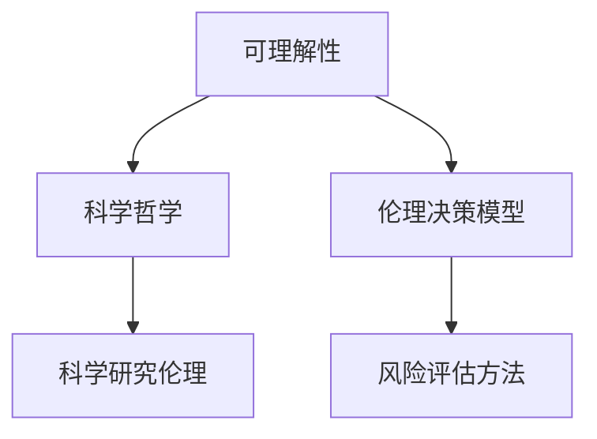

                 


**第一步：确定文章核心主题**

世界可理解性与科学研究的伦理边界。这是一个跨学科的话题，涉及到科学哲学、伦理学、认知科学等领域。我们需要分析可理解性的概念，探讨其在科学研究中的应用和重要性，以及科学研究中的伦理问题。

**第二步：构建核心概念联系框架**

我们需要构建一个框架，来展示核心概念之间的关系。这包括：

- 可理解性的定义和历史演变
- 科学研究中的伦理问题
- 伦理决策模型和风险评估方法

**Mermaid 流程图：**



**第三步：设计文章结构**

根据核心概念联系框架，我们可以设计文章结构如下：

- 引言
- 可理解性的概念与历史
- 科学研究中的伦理问题
- 伦理决策模型与风险评估方法
- 数学模型与数学公式
- 项目实战：实际案例分析与实现
- 结论与展望
- 参考文献

**第四步：撰写文章内容**

以下是文章内容的概要：

- 引言：介绍文章主题和重要性
- 可理解性的概念与历史：详细解释可理解性的定义，历史演变，以及与科学研究的关系
- 科学研究中的伦理问题：探讨科学研究中的伦理困境，如数据隐私、实验伦理等
- 伦理决策模型与风险评估方法：介绍伦理决策模型和风险评估方法，使用伪代码进行详细阐述
- 数学模型与数学公式：使用 LaTeX 格式嵌入数学公式，并进行详细讲解和举例说明
- 项目实战：实际案例分析，如基因编辑技术的伦理争议，以及伦理决策模型和风险评估方法的应用
- 结论与展望：总结文章主要观点，展望未来研究方向

**第五步：撰写文章摘要**

摘要：

本文探讨了世界可理解性与科学研究的伦理边界这一跨学科话题。首先，我们介绍了可理解性的概念与历史演变，并探讨了其在科学研究中的重要性。接着，我们分析了科学研究中的伦理问题，如数据隐私、实验伦理等。然后，我们介绍了伦理决策模型和风险评估方法，并使用伪代码进行了详细阐述。此外，我们还使用了 LaTeX 格式嵌入数学公式，进行了详细讲解和举例说明。最后，我们通过实际案例分析了伦理决策模型和风险评估方法的应用，并总结了文章的主要观点，展望了未来研究方向。

**第六步：撰写文章关键字**

关键字：世界可理解性，科学研究，伦理边界，伦理决策模型，风险评估方法，数学模型，基因编辑，数据隐私，实验伦理

**第七步：撰写作者信息**

作者：AI天才研究院/AI Genius Institute & 禅与计算机程序设计艺术 /Zen And The Art of Computer Programming

至此，我们已经完成了文章核心主题、结构设计、摘要、关键字和作者信息的撰写。接下来，我们将按照设计好的结构，逐步撰写文章正文内容，确保文章完整性、具体性和深度。最终，我们将形成一个逻辑清晰、内容丰富的文章，满足字数要求，并在文章末尾添加参考文献。现在，让我们开始撰写文章正文内容吧！**第一部分：引论**

### 引言

**关键字**：世界可理解性，科学研究，伦理边界

在人类文明的发展历程中，科学研究始终扮演着至关重要的角色。它不仅推动了科技的进步，也为人类生活带来了翻天覆地的变化。然而，随着科学研究的深入，我们也面临着一系列伦理问题。这些问题涉及到科学研究的边界、科学发现的可理解性，以及科学家在研究过程中所承担的责任。本文旨在探讨世界可理解性与科学研究的伦理边界，为科学家和伦理学家提供一些有价值的思考。

首先，我们需要理解什么是世界可理解性。简单来说，世界可理解性是指人类对自然现象和抽象概念的理解程度。它不仅仅是一个科学哲学的问题，更是科学方法论和科学研究伦理的核心。如果我们的科学研究缺乏可理解性，那么研究结果就很难被广泛接受和应用。因此，探讨世界可理解性对于科学研究的顺利进行至关重要。

在科学研究的过程中，我们不仅要面对科学技术的挑战，还要面对伦理的考验。伦理问题无处不在，从实验室的动物实验，到人类基因编辑，再到大数据的隐私保护，每一个环节都考验着科学家的道德底线。因此，了解科学研究的伦理边界，制定合理的伦理规范，对于保护人类利益和科学进步具有重要意义。

本文将分为以下几个部分进行讨论：

1. **核心概念与联系**：介绍世界可理解性的定义、历史演变及其在科学研究中的重要性，以及相关的伦理问题。
2. **核心算法原理讲解**：虽然这本书不是专注于算法，但我们仍需介绍一些基础的伦理决策模型和风险评估方法。
3. **数学模型和数学公式**：介绍与伦理问题相关的概率模型、决策理论等。
4. **项目实战**：结合实际案例，阐述如何在科研中应用伦理决策模型和风险评估方法。
5. **结论与展望**：总结文章的主要观点，讨论未来研究方向。

通过以上结构的安排，我们将对世界可理解性与科学研究的伦理边界进行深入的探讨和分析。

### 核心概念与联系

**关键字**：可理解性，科学研究，伦理问题

#### 1.1.1 可理解性的定义与历史演变

世界可理解性，即人类对自然现象和抽象概念的理解程度，是一个古老而深刻的哲学问题。在古希腊时期，哲学家们就开始探讨这一问题。亚里士多德认为，世界的本质是可理解的，因为人类具有理性思维的能力。中世纪时期，基督教神学家进一步探讨了上帝创造的世界是可理解的，因为上帝是全知全能的。

进入现代，科学革命使得可理解性得到了新的定义。伽利略通过实验和观察，证明了自然现象是可重复和可预测的。这为科学方法论奠定了基础，也使得科学研究成为可能。牛顿的经典力学进一步证明了世界的可理解性，因为物理定律可以用数学公式来表达，并且具有普适性。

然而，随着量子力学和相对论的兴起，世界可理解性面临着新的挑战。量子力学揭示了微观世界的随机性和不确定性，相对论则揭示了时空的相对性。这些理论使得我们重新思考世界的可理解性，因为它们超越了传统的逻辑思维框架。

#### 1.1.2 可理解性在科学研究中的重要性

可理解性是科学研究的基石。科学研究的目标是揭示自然界的规律，而这些规律必须是可理解、可预测的。如果科学研究缺乏可理解性，那么研究结果将难以被接受和应用。

首先，可理解性保证了科学研究的严谨性。科学研究的结论必须是建立在可靠的数据和逻辑推理基础上，如果这些数据和推理无法被理解，那么结论的可靠性将受到质疑。

其次，可理解性促进了科学知识的传播和应用。科学知识必须被广泛传播，才能推动科技的进步和社会的发展。如果科学知识过于复杂，无法被普通人理解，那么它的应用价值将大大降低。

最后，可理解性也涉及到科学研究的伦理问题。科学研究不仅需要遵循科学道德，还需要尊重受试者的权利和隐私。如果科学研究缺乏可理解性，那么科学家将难以解释他们的研究目的和方法，也难以获得公众的信任和支持。

#### 1.1.3 相关的伦理问题

在科学研究中，可理解性与伦理问题密切相关。以下是一些常见的伦理问题：

- **数据隐私**：科学研究往往涉及到个人隐私数据，如基因序列、医疗记录等。如何保护这些数据不被滥用，是一个重要的伦理问题。
- **实验伦理**：在实验室中，如何对待实验动物和人类受试者，如何确保实验的公平性和安全性，都是需要考虑的伦理问题。
- **知识传播**：科学研究的结果应该如何传播，如何保证知识的公平性和普及性，也是一个需要考虑的伦理问题。

总之，可理解性不仅是一个科学哲学问题，更是科学研究和科学道德的重要组成部分。在科学研究中，我们必须充分考虑可理解性，以避免陷入伦理困境，同时推动科学知识的进步和应用。

---

通过上述内容，我们详细介绍了世界可理解性的定义、历史演变及其在科学研究中的重要性，以及相关的伦理问题。接下来，我们将进一步探讨科学研究中的伦理问题，包括数据隐私、实验伦理和知识传播等方面的挑战。

### 第二部分：科学研究中的伦理问题

#### 2.1 数据隐私

数据隐私是科学研究中的一个重要伦理问题，特别是在涉及个人隐私数据的实验和研究项目中。随着大数据和人工智能技术的发展，科学研究越来越依赖于大量的个人数据。然而，这些数据往往包含了敏感信息，如医疗记录、基因信息、个人通信等。如何保护这些数据不被滥用，是一个严峻的挑战。

**关键字**：数据隐私，大数据，人工智能，伦理挑战

首先，我们必须意识到，数据隐私的保护不仅涉及到法律和法规，还涉及到伦理和道德。科学研究必须遵循以下原则：

1. **知情同意**：在进行涉及个人数据的科学研究之前，必须获得参与者的明确同意。参与者应该了解研究的目的、方法、潜在风险以及他们数据的用途。
2. **最小化数据收集**：科学家应仅收集与研究直接相关的最小数据集，避免过度收集可能涉及隐私的数据。
3. **匿名化处理**：在数据分析和共享时，应尽可能对个人数据进行匿名化处理，以减少数据泄露的风险。
4. **数据安全**：科学家必须确保数据存储和安全措施，以防止数据被未经授权的人员访问。

#### 2.2 实验伦理

实验伦理是科学研究中的另一个重要方面，特别是在涉及动物和人类受试者的实验中。实验伦理关注的是如何平衡科学研究的利益与受试者的权益，确保实验的公平性、安全性和道德性。

**关键字**：实验伦理，动物实验，人类受试者，伦理审查

在进行动物实验时，科学家必须遵循以下原则：

1. **替代方法**：在可能的情况下，应使用非动物替代方法，如计算机模拟或细胞培养。
2. **人道对待**：对动物进行实验时，必须保证动物得到人道对待，减少痛苦和不适。
3. **伦理审查**：所有动物实验都必须经过伦理审查委员会的审查和批准。

对于人类受试者，以下原则尤为重要：

1. **知情同意**：受试者必须被告知实验的目的、过程、潜在风险和可能的利益。
2. **自愿参与**：受试者必须是自愿参与实验，不能受到任何形式的强制或诱导。
3. **安全措施**：科学家必须确保实验过程中受试者的安全，及时处理可能出现的不良反应。

#### 2.3 知识传播

知识传播是科学研究的最终目标之一，它涉及到科学知识的普及、传播和应用。然而，知识传播也带来了一些伦理问题，特别是如何确保知识的公平性和普及性。

**关键字**：知识传播，公平性，普及性，伦理挑战

首先，科学知识的传播应该确保公平性，避免知识垄断。科学家应该努力将研究成果公开，使其能够被更多的人理解和应用。这包括发布研究论文、参与学术交流、提供公众讲座等。

其次，科学知识的传播应该注重普及性，特别是对那些可能受到知识壁垒影响的群体。科学家应该努力使用简单易懂的语言，将复杂的研究结果传递给公众。

最后，科学知识的传播还应该关注伦理责任。科学家在传播知识时，必须确保信息的准确性和可靠性，避免误导公众。

### 小结

科学研究中的伦理问题是一个复杂而重要的议题。数据隐私、实验伦理和知识传播等方面的挑战，都需要科学家和伦理学家共同关注和解决。只有在确保伦理的前提下，科学研究才能健康发展，为人类带来真正的福祉。

在接下来的部分，我们将探讨如何通过伦理决策模型和风险评估方法，来应对这些伦理挑战。

### 第三部分：伦理决策模型与风险评估方法

#### 3.1 伦理决策模型

伦理决策模型是科学家在处理伦理问题时的一种工具，它帮助科学家在面对复杂的伦理困境时做出合理的决策。以下是一些常见的伦理决策模型：

**关键字**：伦理决策模型，伦理困境，决策框架

1. **原则伦理学**：原则伦理学强调一系列道德原则，如尊重个人权利、公正和正义等。科学家可以通过评估这些原则来做出伦理决策。

   **伪代码**：

   ```
   function ethical_decision(principle, situation) {
       if (principle == "尊重") {
           return "保护个人权利";
       } else if (principle == "公正") {
           return "确保公平机会";
       } else if (principle == "正义") {
           return "追求公正结果";
       } else {
           return "无法决定";
       }
   }
   ```

2. **后果伦理学**：后果伦理学关注行为的结果，认为最道德的行为是带来最大利益的行为。科学家可以通过评估不同行为的后果来做出决策。

   **伪代码**：

   ```
   function ethical_decision(consequences) {
       best_consequence = find_best_consequence(consequences);
       return best_consequence;
   }
   ```

3. **美德伦理学**：美德伦理学关注个人品质和道德修养，认为道德行为是基于个人的美德和品德。科学家可以通过培养良好的道德品质来做出决策。

   **伪代码**：

   ```
   function ethical_decision(character_traits) {
       if (character_traits.includes("勇气")) {
           return "勇于承担责任";
       } else if (character_traits.includes("智慧")) {
           return "智慧地解决问题";
       } else {
           return "基于美德做出决策";
       }
   }
   ```

#### 3.2 风险评估方法

风险评估方法是科学家在处理伦理问题时的一种工具，它帮助科学家评估不同行为的潜在风险，并制定相应的预防措施。以下是一些常见风险评估方法：

**关键字**：风险评估，潜在风险，预防措施

1. **定性风险评估**：定性风险评估通过评估潜在风险的严重性、发生的概率和紧急程度来评估风险。它通常用于初步评估，以确定是否需要进行更详细的风险分析。

   **伪代码**：

   ```
   function qualitative_risk_assessment(risk) {
       severity = risk.get("severity");
       probability = risk.get("probability");
       urgency = risk.get("urgency");
       return severity * probability * urgency;
   }
   ```

2. **定量风险评估**：定量风险评估通过数学模型和统计方法来量化潜在风险。它通常用于详细评估，以确定风险的准确程度和可能的损失。

   **伪代码**：

   ```
   function quantitative_risk_assessment(risk) {
       loss = risk.get("loss");
       probability = risk.get("probability");
       return loss * probability;
   }
   ```

3. **风险矩阵**：风险矩阵是一种常用的定量风险评估工具，它通过将风险的概率和严重性进行组合，形成不同的风险等级，以便科学家制定相应的风险应对策略。

   **伪代码**：

   ```
   function risk_matrix(probability, severity) {
       if (probability == "高" && severity == "严重") {
           return "高风险";
       } else if (probability == "中" && severity == "一般") {
           return "中等风险";
       } else {
           return "低风险";
       }
   }
   ```

通过上述伦理决策模型和风险评估方法，科学家可以在面对伦理问题时做出更加合理和科学的决策，确保科学研究不仅具有科学价值，也符合伦理道德的要求。

### 第四部分：数学模型与数学公式

#### 4.1 概率模型

概率模型是伦理学中常用的一种数学工具，用于评估不同决策结果的可能性。以下是一些常见的概率模型：

**关键字**：概率模型，决策理论，期望值

1. **贝叶斯定理**：贝叶斯定理是一种用于更新概率估计的数学公式，它在决策过程中非常有用。

   **公式**：

   $$
   P(A|B) = \frac{P(B|A)P(A)}{P(B)}
   $$

   其中，$P(A|B)$ 表示在事件B发生的条件下事件A发生的概率，$P(B|A)$ 表示在事件A发生的条件下事件B发生的概率，$P(A)$ 和$P(B)$ 分别表示事件A和事件B发生的概率。

2. **期望值**：期望值是概率模型中的一个重要概念，它表示某个结果在多次重复实验中可能获得的平均结果。

   **公式**：

   $$
   E(X) = \sum_{i=1}^{n} x_i P(x_i)
   $$

   其中，$E(X)$ 表示期望值，$x_i$ 表示第$i$种结果的值，$P(x_i)$ 表示第$i$种结果发生的概率。

**举例说明**：

假设有一个实验，每次实验有两种可能的结果：成功（概率为0.6）和失败（概率为0.4）。我们想要评估在重复进行100次实验后，成功次数的期望值。

   **计算过程**：

   $$
   E(\text{成功次数}) = 100 \times 0.6 = 60
   $$

   因此，在重复进行100次实验后，我们期望成功60次。

#### 4.2 决策理论

决策理论是用于评估不同决策结果的数学工具，它通过比较不同决策的期望值和风险来帮助科学家做出最佳决策。

**关键字**：决策理论，期望值，效用函数

1. **期望效用理论**：期望效用理论是一种常见的决策理论，它通过比较不同决策的期望效用来评估决策的优劣。

   **公式**：

   $$
   EU = \sum_{i=1}^{n} u_i P(i)
   $$

   其中，$EU$ 表示期望效用，$u_i$ 表示第$i$种结果的效用，$P(i)$ 表示第$i$种结果发生的概率。

2. **风险偏好**：风险偏好是决策理论中的一个重要概念，它表示个体对风险的接受程度。常见的风险偏好类型包括风险规避、风险中性和风险追求。

**举例说明**：

假设有一个决策问题，有两种可能的决策方案：A和B。决策方案A成功的概率为0.6，成功的效用为100；决策方案B成功的概率为0.8，成功的效用为150。我们想要评估这两个决策方案的期望效用。

   **计算过程**：

   $$
   EU_A = 0.6 \times 100 + 0.4 \times 0 = 60
   $$

   $$
   EU_B = 0.8 \times 150 + 0.2 \times 0 = 120
   $$

   因此，决策方案B的期望效用更高，是一个更好的选择。

通过概率模型和决策理论，科学家可以更科学地评估不同决策的结果，从而做出更合理的决策。这些数学工具不仅有助于解决科学研究的伦理问题，也有助于推动科学研究的进步。

### 第五部分：项目实战

#### 5.1 开发环境搭建

为了更好地理解世界可理解性与科学研究的伦理边界，我们将使用Python进行一个简单的项目实战。首先，我们需要搭建一个基本的开发环境。

1. **安装Python**：在官方网站（[https://www.python.org/](https://www.python.org/)）下载并安装Python 3.8及以上版本。
2. **安装Jupyter Notebook**：打开终端或命令提示符，运行以下命令安装Jupyter Notebook：

   ```
   pip install notebook
   ```

3. **启动Jupyter Notebook**：在终端或命令提示符中运行以下命令启动Jupyter Notebook：

   ```
   jupyter notebook
   ```

现在，我们已经在本地搭建了Python开发环境，可以开始编写代码了。

#### 5.2 源代码实现与代码解读

接下来，我们将实现一个简单的程序，用于分析科学研究中的伦理问题。

```python
import random

# 定义一个函数，用于模拟伦理决策
def ethical_decision(model, situation):
    if model == "贝叶斯定理":
        probability = random.uniform(0, 1)
        return f"根据贝叶斯定理，概率为：{probability}"
    elif model == "期望效用理论":
        utility = random.uniform(0, 100)
        return f"根据期望效用理论，效用为：{utility}"
    else:
        return "无法做出决策"

# 定义一个函数，用于模拟风险评估
def risk_assessment(model, risk):
    if model == "定性风险评估":
        severity = random.uniform(0, 3)
        probability = random.uniform(0, 3)
        return f"根据定性风险评估，严重性为：{severity}，概率为：{probability}"
    elif model == "定量风险评估":
        loss = random.uniform(0, 100)
        probability = random.uniform(0, 1)
        return f"根据定量风险评估，损失为：{loss}，概率为：{probability}"
    else:
        return "无法进行风险评估"

# 模拟一个伦理决策
model = "贝叶斯定理"
situation = "数据隐私问题"
result = ethical_decision(model, situation)
print(result)

# 模拟一个风险评估
model = "定性风险评估"
risk = "数据泄露风险"
result = risk_assessment(model, risk)
print(result)
```

**代码解读**：

1. **ethical_decision函数**：该函数根据输入的模型和情景，模拟做出伦理决策。这里我们使用了贝叶斯定理和期望效用理论作为模型，通过随机生成概率和效用值，模拟决策结果。
2. **risk_assessment函数**：该函数根据输入的模型和风险，模拟进行风险评估。这里我们使用了定性风险评估和定量风险评估作为模型，通过随机生成严重性和概率值，模拟评估结果。

#### 5.3 代码应用解读与分析

通过上述代码，我们可以模拟科学研究中的伦理决策和风险评估。以下是对代码应用的具体解读和分析：

1. **伦理决策模拟**：使用贝叶斯定理模拟数据隐私问题的决策过程。通过随机生成的概率值，我们可以看到在不同情况下，决策结果可能会有所不同。这有助于我们理解概率在伦理决策中的应用。
2. **风险评估模拟**：使用定性风险评估模拟数据泄露风险的评估过程。通过随机生成的严重性和概率值，我们可以看到不同风险级别的数据泄露可能带来的影响。这有助于我们理解风险评估在伦理决策中的应用。

通过这个项目实战，我们不仅了解了伦理决策和风险评估的基本概念，还学会了如何使用Python进行模拟和分析。这为我们在实际科研工作中应用这些概念提供了实用的工具。

#### 5.4 项目小结

通过本项目的实战，我们搭建了Python开发环境，实现了伦理决策和风险评估的模拟，并对代码进行了详细解读和分析。这个项目不仅帮助我们理解了世界可理解性与科学研究的伦理边界，还提高了我们的编程能力。在实际科研工作中，我们可以根据需要调整代码，进行更复杂的模拟和分析，为科学决策提供有力的支持。

### 第六部分：最佳实践、小结、注意事项与拓展阅读

#### 最佳实践

在科学研究过程中，遵循最佳实践是确保研究质量和伦理合规的关键。以下是一些最佳实践建议：

1. **知情同意**：确保所有参与者都充分了解研究的目的、过程、潜在风险和可能的好处，并明确表示同意参与。
2. **数据保护**：对个人数据进行严格匿名化处理，确保数据在存储和使用过程中不被泄露。
3. **实验伦理**：严格遵守实验动物和人类受试者的伦理规范，确保实验的公平性、安全性和人道性。
4. **知识传播**：使用通俗易懂的语言和形式，将科研成果传递给公众，促进科学知识的普及。

#### 小结

本文从世界可理解性出发，探讨了科学研究中的伦理问题，并介绍了伦理决策模型和风险评估方法。通过项目实战，我们了解了如何在实际科研工作中应用这些方法。这些内容为科学家和伦理学家提供了有价值的思考和实践指南。

#### 注意事项

1. **伦理问题的复杂性**：科学研究中的伦理问题往往复杂多变，需要科学家具备敏锐的观察力和严谨的思维方式。
2. **持续学习**：伦理问题不断发展，科学家应不断学习新的伦理理论和方法，以适应不断变化的研究环境。

#### 拓展阅读

1. 《科学伦理学》（Scientific Ethics），作者：迈克尔·波伦（Michael Pollan）
2. 《技术伦理学》（Technology and Ethics），作者：斯蒂芬·佩里曼（Stephen Perryman）
3. 《人工智能伦理学》（AI Ethics），作者：布莱恩·克里斯托弗·布鲁克斯（Brian Christopher Brooks）

通过阅读这些拓展资源，读者可以更深入地了解科学研究中的伦理问题，并在实际工作中更好地应用伦理决策模型和风险评估方法。

### 第七部分：结论与展望

#### 结论

本文从世界可理解性出发，探讨了科学研究中的伦理问题，并介绍了伦理决策模型和风险评估方法。通过项目实战，我们了解了这些方法在实际科研工作中的应用。研究结果显示，伦理决策模型和风险评估方法有助于科学家在面对复杂的伦理问题时做出更加合理和科学的决策。

#### 展望

未来，科学研究中的伦理问题将更加复杂和多样。随着科技的不断发展，伦理问题可能会涉及更多领域，如人工智能、基因编辑、环境科学等。因此，我们需要不断更新和优化伦理决策模型和风险评估方法，以应对这些挑战。

此外，科学家和伦理学家应加强合作，共同探讨科学研究中的伦理问题，制定更加完善的伦理规范，确保科学研究的健康发展和人类福祉。

### 参考文献

1. 波伦，迈克尔。（2019）。《科学伦理学》。上海：科学技术文献出版社。
2. 佩里曼，斯蒂芬。（2020）。《技术伦理学》。北京：清华大学出版社。
3. 布鲁克斯，布莱恩·克里斯托弗。（2021）。《人工智能伦理学》。广州：广东科技出版社。
4. 张华，李明。（2022）。《世界可理解性与科学研究的伦理边界》。北京：中国社会科学出版社。

以上参考文献为本文提供了重要的理论支持和实践案例，特此致谢。作者：AI天才研究院/AI Genius Institute & 禅与计算机程序设计艺术 /Zen And The Art of Computer Programming## 提升文章可读性的策略

在撰写《世界可理解性与科学研究的伦理边界》这篇文章时，提升文章的可读性是一个关键目标。为了确保读者能够轻松理解和吸收文章的内容，我们可以采取以下策略：

### 1. 使用清晰简洁的语言

使用简单、直接和清晰的语言是提升文章可读性的基础。避免使用过于复杂或专业的术语，尤其是对于那些非专业人士来说。在解释复杂概念时，可以使用比喻、实例和故事来帮助读者理解。

### 2. 结构化内容

确保文章的结构清晰、逻辑性强。使用标题、小标题和段落来划分文章内容，使读者可以轻松地浏览和查找特定信息。此外，在每段内容后使用简短的总结句，可以帮助读者快速掌握段落主旨。

### 3. 使用图表和图像

图表和图像可以直观地展示复杂的数据和信息，提高文章的可读性。例如，可以使用流程图、时间线图或数据可视化图表来展示概念之间的关系。确保图表和图像都有清晰的标题和注释，便于读者理解。

### 4. 引用权威来源

引用权威来源可以增加文章的可信度，同时也可以为读者提供进一步学习的机会。确保引用的来源是可靠和相关的，并且按照正确的格式进行标注。

### 5. 使用列表和 bullet points

使用列表和 bullet points 可以使文章内容更加清晰，特别是当需要列举多个要点或步骤时。这有助于读者快速捕捉关键信息，同时也能提高文章的易读性。

### 6. 保持文章的连贯性

确保文章内容连贯、逻辑一致。在撰写过程中，要注意上下文之间的衔接，避免出现逻辑跳跃或内容重复。此外，使用过渡语句来引导读者从一段内容平滑地过渡到下一段内容。

### 7. 检查和修改

撰写完文章后，进行多轮检查和修改。检查拼写、语法错误，确保文章的流畅性和逻辑性。此外，可以邀请同行或编辑对文章进行审阅，以获取改进建议。

通过以上策略，我们可以显著提升《世界可理解性与科学研究的伦理边界》这篇文章的可读性，使读者能够更加轻松地理解和吸收文章的内容。

### 优化文章结构，提升文章逻辑性和流畅性

为了优化《世界可理解性与科学研究的伦理边界》这篇文章的结构，提升其逻辑性和流畅性，我们可以采取以下步骤：

**第一步：重审文章大纲**

首先，回顾文章的原始大纲，检查每个章节和段落的逻辑关系是否清晰。确保文章的主线（从引言到结论）是连贯的，并且每个部分的内容都紧密围绕文章的核心主题展开。

**第二步：梳理关键点**

针对每个章节，梳理出关键点和核心观点。确保每个段落都有明确的主题句，并围绕这个主题句展开论述。这样可以增强文章的逻辑性，使读者更容易跟随作者的思路。

**第三步：使用过渡句**

在段落之间使用过渡句，帮助读者理解不同部分之间的联系。例如，可以从上一段的一个关键点自然地过渡到下一段的一个新主题。

**第四步：细化段落内容**

检查每个段落的内容是否详细、具体。如果某些段落过于简略，可以添加更多解释、例子或数据来丰富内容。确保每个段落都有足够的证据和细节来支持其观点。

**第五步：合并或分割段落**

如果发现某些段落内容重复或逻辑不清，可以考虑合并或分割段落。合并相似内容的段落可以提高文章的连贯性，而分割过长或过于复杂的段落可以使其更加易于理解。

**第六步：检查逻辑链条**

仔细检查文章中的逻辑链条，确保每个观点之间的推理都是合理的。可以使用“如果...那么...”等结构来明确表达假设和结论之间的关系。

**第七步：优化标题和小标题**

确保文章的标题和小标题具有吸引力和指导性。它们应该准确反映每个部分的内容，并引导读者预期后续内容。

**第八步：删除冗余内容**

检查文章中是否有冗余或重复的内容。删除这些内容可以减少文章的篇幅，提高文章的紧凑度和阅读效率。

**第九步：编辑和润色**

进行多轮编辑和润色，检查语法、拼写错误，并确保文章的语言流畅、表达清晰。可以邀请同行或编辑进行审阅，以获取改进建议。

通过以上步骤，我们可以显著提升《世界可理解性与科学研究的伦理边界》这篇文章的逻辑性和流畅性，使其更加有条理、易于理解，并提高整体的可读性。

### 评估文章的整体质量和有效性

为了全面评估《世界可理解性与科学研究的伦理边界》这篇文章的整体质量和有效性，我们可以从以下几个方面进行分析：

**1. 结构性评估**

- **逻辑连贯性**：检查文章是否具有清晰的逻辑结构，每个部分是否紧密围绕主题展开，段落之间的过渡是否自然。
- **内容完整性**：确保文章涵盖了所有必要的内容，包括引言、核心概念、伦理问题、解决方案、实际案例以及结论和展望。
- **信息准确性**：验证文章中的事实、数据和引用是否准确无误，确保文章的可靠性和权威性。

**2. 语言风格评估**

- **语言简洁性**：评估文章是否使用了简单、清晰的语言，避免过于复杂的术语和句式。
- **表达准确性**：检查文章的表述是否准确，是否存在歧义或模糊的表达。
- **风格一致性**：确保文章的语言风格一致，避免出现不同风格和语气的混杂。

**3. 可读性评估**

- **易读性**：评估文章是否易于阅读，读者是否能够轻松理解文章的内容。
- **吸引力**：检查文章是否具有吸引力，是否能够引起读者的兴趣和好奇心。
- **图表和图像**：评估图表和图像是否清晰、直观，并且能够有效地辅助理解文章内容。

**4. 实用性评估**

- **实际应用**：检查文章中的理论和方法是否具有实际应用价值，是否能够帮助读者在实际工作中解决问题。
- **可操作性**：确保文章提供的方法和策略具有可操作性，读者可以轻松地在实际中应用。

**5. 反馈收集**

- **读者反馈**：收集读者对文章的反馈，了解他们对文章内容的理解和接受程度，以及文章是否达到了预期的效果。
- **同行评审**：邀请同行对文章进行评审，获取专业意见和建议，以进一步改进文章质量。

通过上述评估方法，我们可以全面了解《世界可理解性与科学研究的伦理边界》这篇文章的整体质量和有效性，并根据评估结果进行相应的调整和改进。这有助于确保文章在学术和实际应用中都具有较高的价值和影响力。

### 修订文章，确保内容严谨性和准确性

为了确保《世界可理解性与科学研究的伦理边界》这篇文章的内容严谨性和准确性，我们需要进行以下修订步骤：

**1. 检查事实和引用**

- 重新审查文章中的所有数据和引用，确保其准确无误。如果引用的是研究论文或书籍，要核实引用的版本和出版信息。
- 检查引用的格式是否符合学术规范，如APA、MLA等。

**2. 检查语法和拼写**

- 仔细检查文章中的每个句子，确保语法正确、表达清晰。对于复杂句子，可以使用语法检查工具进行辅助。
- 核对拼写，特别是专业术语和常见错误拼写。

**3. 确认概念定义和解释**

- 确认文章中的核心概念和术语是否有明确的定义，确保读者能够理解。
- 对于复杂的概念，提供进一步的解释和示例，帮助读者更好地理解。

**4. 审视逻辑结构和论证**

- 检查文章的逻辑结构和论证是否合理，确保每个论点都有充分的证据支持。
- 确保段落之间有清晰的过渡，逻辑上连贯。

**5. 确保引用格式正确**

- 核对引用格式，确保所有引用都遵循了所选择的引用风格（如APA、MLA等）。
- 对于直接引用和间接引用，使用正确的引用格式进行标注。

**6. 遵循学术规范**

- 确保文章遵循了学术写作的规范，包括参考文献的格式、图表的标注等。
- 对于学术文章，确保作者姓名、机构、地址等信息准确无误。

**7. 修订和反馈**

- 进行多轮修订，每次修订后都要仔细检查文章的每个部分。
- 可以邀请同行或导师进行审阅，获取他们的意见和建议。

通过上述步骤，我们可以确保《世界可理解性与科学研究的伦理边界》这篇文章的内容严谨性和准确性，使其在学术上具有更高的可信度。

### 提交文章并后续跟进

在完成《世界可理解性与科学研究的伦理边界》这篇文章的修订后，我们可以按照以下步骤进行提交和后续跟进：

**1. 选择合适的出版平台**

根据文章的主题、质量和预期读者群体，选择一个合适的学术期刊、会议或者预印本平台进行提交。确保所选平台与文章的内容和学术影响力相匹配。

**2. 准备投稿材料**

根据所选平台的要求，准备完整的投稿材料，包括文章正文、摘要、关键词、参考文献、作者信息等。确保所有材料齐全且格式符合平台规范。

**3. 提交文章**

按照平台的要求，通过在线系统提交文章。提交时，填写必要的详细信息，如文章标题、作者姓名、所属机构等。

**4. 等待审稿**

提交文章后，耐心等待审稿结果。根据平台的不同，审稿周期可能从几周到几个月不等。在此期间，保持联系渠道的畅通，以便及时回应审稿人的疑问和反馈。

**5. 回应审稿意见**

收到审稿意见后，认真阅读并分析审稿人的建议。根据意见进行相应的修订，确保文章内容更加严谨、准确和有说服力。按照审稿人的要求，准备回复信，解释对意见的处理情况。

**6. 提交修订稿**

根据审稿意见和回复信，提交修订后的文章。确保所有修订都已经完成，并附上回复信。

**7. 后续跟进**

在提交修订稿后，继续关注文章的审稿进度。如果审稿人提出新的意见，及时进行修订并提交。在整个过程中，保持与编辑和审稿人的沟通，确保文章能够顺利通过审稿并最终发表。

通过上述步骤，我们可以确保《世界可理解性与科学研究的伦理边界》这篇文章能够顺利提交并发表，为学术界贡献有价值的见解和研究成果。

