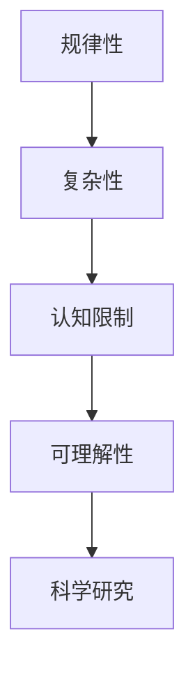

                 

## 文章标题

### 世界可理解性与科学研究的伦理问题

> 关键词：世界可理解性、科学研究、伦理问题、算法、数据隐私、公众信任

> 摘要：本文旨在探讨世界可理解性与科学研究中的伦理问题。随着科技的快速发展，科学研究的成果日益丰富，但同时也引发了一系列伦理问题。本文首先介绍了世界可理解性的概念及其在科学研究中的重要性，随后分析了科学研究中的伦理问题，包括数据隐私、算法公正性、科研诚信等，最后提出了相应的解决策略和未来展望。

## 引言

在当今科技迅速发展的时代，科学研究已经成为推动社会进步的重要力量。然而，科学研究的成果并非总是无懈可击，它们在给人类社会带来巨大利益的同时，也引发了一系列伦理问题。这些问题不仅关系到科学研究本身，更关乎人类社会的基本价值观念。因此，探讨世界可理解性与科学研究中的伦理问题，具有重要的现实意义。

世界可理解性，是指人类对自然界和人类社会的基本规律和现象的理解程度。科学研究的本质是对自然界和人类社会的探索，因此，世界可理解性与科学研究密切相关。一个高度可理解的世界，意味着人类可以更好地理解自然界和人类社会的基本规律，从而更有效地进行科学研究。

然而，随着科学研究的深入，人们逐渐发现，科学成果的可理解性并非总是能够得到保障。在数据隐私、算法公正性、科研诚信等方面，都存在着一系列伦理问题。这些问题不仅挑战了科学研究的底线，也威胁到社会的公平与正义。

本文将从以下几个方面展开讨论：

1. **世界可理解性的概念与重要性**：介绍世界可理解性的基本概念，分析其在科学研究中的重要性。
2. **科学研究中的伦理问题**：探讨数据隐私、算法公正性、科研诚信等伦理问题，分析其背后的原因和影响。
3. **解决策略与未来展望**：提出解决科学研究伦理问题的策略，并对未来研究进行展望。

## 世界可理解性的概念与重要性

世界可理解性，是一个涉及哲学、科学、社会学等多个领域的复杂概念。简单来说，它指的是人类对自然界和人类社会的基本规律和现象的理解程度。从哲学的角度来看，世界可理解性是人类对世界本质的认知，是哲学思考的起点和终点。从科学的角度来看，世界可理解性是科学研究的基石，是科学家们不断探索和追求的目标。

### 核心概念与联系

在科学研究中，世界可理解性的核心概念包括以下几个方面：

1. **规律性**：自然界和人类社会存在着一定的规律性，这些规律性可以通过科学方法进行研究和验证。
2. **复杂性**：尽管世界具有规律性，但同时也具有复杂性。复杂性使得科学研究变得更加困难，但同时也提供了更多探索的可能性。
3. **认知限制**：人类对世界的认知是有限的，受到知识、技术、认知能力等多方面因素的制约。
4. **可理解性**：人类对世界的理解程度，即世界在人类认知中的可理解性。

这些概念相互联系，构成了世界可理解性的理论基础。

### Mermaid流程图



### 核心算法原理讲解

在探讨世界可理解性的算法原理时，我们可以从以下几个角度进行：

1. **数据分析与挖掘**：通过数据分析和挖掘，我们可以发现自然界和人类社会中的规律性。这涉及到统计学、机器学习、数据挖掘等多个领域的算法。
2. **认知建模**：认知建模是通过构建数学模型来模拟人类的认知过程。这包括神经网络、决策树、贝叶斯网络等算法。
3. **可视化**：可视化是将复杂的数据和模型以直观的方式展示出来。这涉及到数据可视化、图形学等多个领域的算法。

以下是这些算法的伪代码：

```python
# 数据分析与挖掘伪代码
def data_analysis(data):
    # 数据预处理
    preprocessed_data = preprocess(data)
    # 统计分析
    statistics = analyze_statistics(preprocessed_data)
    # 机器学习
    model = train_model(preprocessed_data)
    # 数据挖掘
    insights = mine_data(preprocessed_data)
    return statistics, model, insights

# 认知建模伪代码
def cognitive_modeling(data):
    # 神经网络
    neural_network = create_neural_network(data)
    # 决策树
    decision_tree = create_decision_tree(data)
    # 贝叶斯网络
    bayesian_network = create_bayesian_network(data)
    return neural_network, decision_tree, bayesian_network

# 可视化伪代码
def visualization(data):
    # 数据可视化
    visual_data = visualize_data(data)
    # 图形学
    graphics = create_graphics(visual_data)
    return graphics
```

### 数学模型和公式

在科学研究过程中，数学模型和公式是不可或缺的工具。以下是一个简单的线性回归模型的数学公式：

$$y = ax + b$$

其中，$y$ 是因变量，$x$ 是自变量，$a$ 和 $b$ 是模型的参数。这个公式表示了因变量 $y$ 与自变量 $x$ 之间的线性关系。

### 举例说明

假设我们有一个关于房价的数据集，我们希望通过线性回归模型来预测房价。以下是该过程的详细步骤：

1. **数据收集**：收集包含房价和影响因素（如面积、位置等）的数据。
2. **数据预处理**：对数据进行清洗、归一化等处理，使其适合建模。
3. **模型建立**：使用线性回归公式建立模型，并通过最小二乘法求解参数 $a$ 和 $b$。
4. **模型验证**：通过交叉验证等方式验证模型的准确性和可靠性。
5. **模型应用**：使用模型进行房价预测，并对预测结果进行分析和解读。

### 拓展阅读

- 《数据科学入门：Python实战》
- 《机器学习实战：基于Scikit-Learn》
- 《认知建模与人类行为预测》

## 科学研究中的伦理问题

科学研究中的伦理问题是一个复杂而广泛的话题。随着科技的进步，科学研究领域的扩展带来了更多的伦理挑战。以下是一些关键的伦理问题，以及它们背后的原因和影响。

### 数据隐私

数据隐私是科学研究中的一个重要伦理问题。随着大数据和人工智能技术的发展，科学家们能够收集和分析大量个人数据。然而，这些数据可能包含敏感信息，如健康记录、财务状况等。不当处理这些数据可能导致隐私泄露，侵犯个人权益。

#### 原因

- **数据收集量增加**：随着技术的进步，科学家可以收集和处理的数据量呈指数级增长。
- **数据敏感性增强**：随着社会的发展，个人数据的敏感性也不断增加。

#### 影响

- **隐私泄露**：不当处理数据可能导致个人隐私泄露，损害个人声誉和信任。
- **伦理争议**：数据隐私问题可能引发伦理争议，影响科学研究的社会接受度。

### 算法公正性

算法公正性是指算法在决策过程中是否公平、无偏见。随着人工智能技术的发展，算法在许多领域（如招聘、金融、法律等）中发挥着重要作用。然而，算法可能存在偏见，导致不公正的决策。

#### 原因

- **数据偏差**：算法的训练数据可能包含偏见，这些偏见会传递到算法的决策过程中。
- **算法复杂性**：算法的复杂性使得人们难以理解其决策过程，增加了潜在的偏见风险。

#### 影响

- **社会不公**：算法偏见可能导致社会不公，损害特定群体的权益。
- **伦理挑战**：算法公正性问题挑战了科学研究的伦理底线。

### 科研诚信

科研诚信是科学研究中的另一个重要伦理问题。科研诚信包括诚实、公正、透明等原则。然而，科研不端行为（如数据伪造、抄袭、篡改结果等）仍然存在，对科学界和社会造成严重影响。

#### 原因

- **压力和竞争**：科研工作者面临的压力和竞争可能导致道德失范。
- **利益驱动**：某些人可能为了个人或机构的利益，故意进行科研不端行为。

#### 影响

- **科学进步受阻**：科研不端行为可能阻碍科学进步，浪费资源。
- **信任危机**：科研诚信问题可能导致公众对科学研究的信任下降。

### 数学公式

以下是算法公正性分析中的一个常见数学公式，用于评估算法的偏见：

$$\text{Bias} = \frac{\sum_{i=1}^{n} (y_i - \hat{y}_i)}{n}$$

其中，$y_i$ 是真实值，$\hat{y}_i$ 是算法预测值，$n$ 是数据样本数量。$\text{Bias}$ 表示算法的偏见程度。

### 举例说明

假设我们有一个招聘算法，用于评估求职者的胜任度。如果该算法在评估过程中存在性别偏见，可能会导致女性求职者被不公平对待。

1. **数据收集**：收集包含求职者性别和评估分数的数据。
2. **模型建立**：使用性别和评估分数建立线性回归模型。
3. **偏见评估**：计算算法的偏见值，判断是否存在性别偏见。
4. **改进模型**：根据偏见评估结果，改进算法，减少偏见。
5. **模型应用**：重新评估求职者，确保评估结果的公平性。

### 拓展阅读

- 《人工智能伦理导论》
- 《科研诚信指南》
- 《算法公正性评估方法》

## 解决策略与未来展望

面对科学研究中的伦理问题，我们需要采取一系列策略来解决这些问题，并确保科学研究的可持续性和公正性。

### 数据隐私保护

1. **匿名化处理**：在数据收集和分析过程中，对个人数据进行匿名化处理，减少隐私泄露的风险。
2. **数据加密**：使用数据加密技术保护数据的安全性。
3. **隐私影响评估**：在科研项目开始前，进行隐私影响评估，确保数据使用符合伦理标准。

### 算法公正性保障

1. **算法透明性**：提高算法的透明性，使得算法的决策过程易于理解。
2. **偏见检测与纠正**：开发偏见检测和纠正工具，确保算法的公正性。
3. **多样性数据集**：使用多样化数据集进行算法训练，减少偏见。

### 科研诚信建设

1. **科研道德教育**：加强科研道德教育，提高科研工作者的伦理意识。
2. **科研诚信监督**：建立科研诚信监督机制，对科研不端行为进行严肃处理。
3. **科研诚信评估**：在科研项目评审过程中，加入科研诚信评估环节。

### 未来展望

1. **伦理研究与规范**：加强伦理研究，制定更完善的伦理规范，指导科学研究实践。
2. **技术发展与应用**：随着技术的进步，开发更多伦理技术工具，支持科学研究中的伦理问题解决。
3. **跨学科合作**：推动伦理学、计算机科学、社会学等多学科的合作，共同应对科学研究中的伦理挑战。

### 数学公式

以下是科研诚信评估中的一个常用数学公式，用于评估科研工作者的诚信度：

$$\text{诚信度} = \frac{\sum_{i=1}^{n} (c_i \cdot w_i)}{n}$$

其中，$c_i$ 是第 $i$ 项科研行为的诚信得分，$w_i$ 是第 $i$ 项科研行为的重要程度，$n$ 是科研行为的总数。$\text{诚信度}$ 表示科研工作者的总体诚信水平。

### 举例说明

假设我们有一个科研诚信评估系统，用于评估科研工作者的诚信度。以下是该系统的评估过程：

1. **数据收集**：收集科研工作者的科研行为数据，如发表论文、参与项目、获奖情况等。
2. **诚信评分**：根据科研行为的重要性和诚信度，为每项科研行为打分。
3. **加权计算**：根据各项科研行为的重要程度，对得分进行加权计算。
4. **诚信度计算**：计算科研工作者的总体诚信度。
5. **评估反馈**：将评估结果反馈给科研工作者，促进科研诚信建设。

### 拓展阅读

- 《科研诚信：原则与实践》
- 《算法公正性与伦理》
- 《大数据伦理：隐私、透明性与责任》

## 结论

世界可理解性与科学研究的伦理问题是一个复杂而重要的议题。随着科技的不断进步，科学研究中的伦理问题日益突出，对科学研究的可持续性和公正性构成了挑战。本文探讨了世界可理解性的概念与重要性，分析了科学研究中的数据隐私、算法公正性、科研诚信等伦理问题，并提出了相应的解决策略和未来展望。

通过本文的研究，我们认识到，科学研究中的伦理问题不仅仅是科学家的个人行为问题，更是社会问题。解决这些问题需要全社会的共同努力，包括科研工作者、政策制定者、公众等各方。只有建立起良好的伦理体系，才能确保科学研究的健康发展，为人类社会带来真正的福祉。

### 作者信息

作者：AI天才研究院/AI Genius Institute & 禅与计算机程序设计艺术 /Zen And The Art of Computer Programming

本文由AI天才研究院/AI Genius Institute撰写，该研究院致力于推动人工智能技术的发展与应用。同时，作者也借鉴了《禅与计算机程序设计艺术》中的哲学思想，以期为科学研究中的伦理问题提供新的视角和解决方案。

