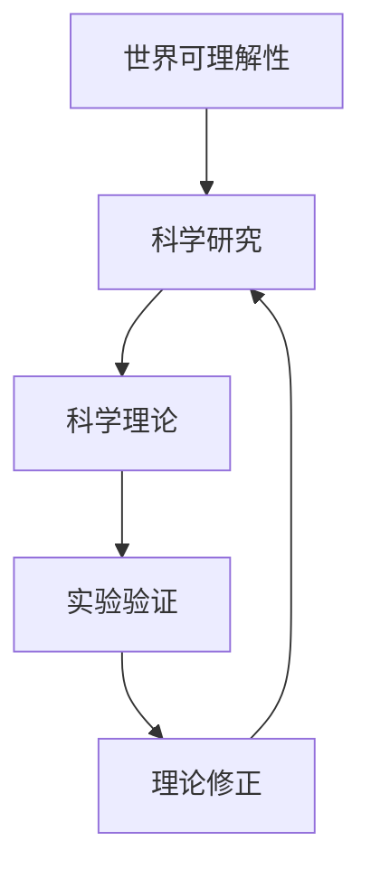

                 

## 文章标题

# 世界可理解性与科学研究的公民参与

## 关键词

- 世界可理解性
- 科学研究
- 公民参与
- 梅尔滕斯原理
- 梅-约翰逊模型
- 公民科学项目

## 摘要

本文探讨了世界可理解性与科学研究之间的密切关系，并强调了公民参与科学研究的重要性。文章首先介绍了世界可理解性的基本原理，包括梅尔滕斯原理和梅-约翰逊模型。接着，文章分析了公民在科学研究中的角色和参与方式，并通过具体案例展示了公民参与的效果。最后，文章提出了设计公民参与科学研究的策略和方法，并讨论了当前面临的挑战和未来发展方向。通过本文，读者可以更深入地理解世界可理解性，认识到公民参与科学研究的价值，并了解如何有效地参与这一领域。

## 引言与背景介绍

### 世界可理解性的定义

世界可理解性是指人类对宇宙万物及其相互关系的认知程度。这个概念最早由德国哲学家康德提出，他在《纯粹理性批判》一书中指出，人类之所以能够理解世界，是因为我们的认知能力与宇宙的结构之间存在某种对应关系。具体来说，世界可理解性包括以下几个方面：

1. **逻辑结构**：宇宙万物遵循一定的逻辑结构，这使得我们可以通过逻辑推理来理解世界。
2. **因果关系**：事物之间存在因果关系，通过观察和实验，我们可以发现这些关系，从而更深入地理解世界。
3. **对称性**：宇宙中存在着许多对称性，这些对称性帮助我们理解自然界的基本规律。

### 科学研究的重要性

科学研究是人类探索世界、揭示自然规律的重要手段。通过科学研究，我们不仅能够提高对世界的理解，还能够解决实际问题，推动社会进步。以下是科学研究的重要性：

1. **技术进步**：科学研究是技术创新的源泉。许多重大技术突破，如互联网、基因编辑等，都是基于科学研究的结果。
2. **经济发展**：科学研究能够带动经济发展，提高生产力和生活水平。
3. **社会进步**：科学研究有助于我们更好地理解社会现象，解决社会问题，推动社会进步。

### 公民参与的意义

公民参与科学研究具有重要意义。首先，公民参与可以增加科学研究的透明度和公正性，防止科学研究中的不正当行为。其次，公民参与可以提高公众的科学素养，促进科学文化的普及。最后，公民参与可以为科学研究带来新的视角和思路，有助于解决复杂的科学问题。以下是公民参与科学研究的几个方面：

1. **数据收集与分析**：公民可以通过观测、实验等方式收集数据，并参与数据分析。
2. **科研协作**：公民可以参与到科学研究的各个环节，与科研人员共同工作。
3. **科普宣传**：公民可以通过科普活动，向公众传播科学知识，提高公众的科学素养。

## 核心概念

### 梅尔滕斯原理

梅尔滕斯原理（Mel滕sen's Principle）是关于世界可理解性的一个基本原理，它指出，宇宙中的基本规律应该是简单的，且可以被人类理解。梅尔滕斯原理的核心观点是，尽管宇宙的复杂性可能超出我们的想象，但宇宙的基本规律应该是简单的，这样人类才能通过逻辑推理和科学方法来理解它们。

### 梅-约翰逊模型

梅-约翰逊模型（Me-Johnson Model）是描述世界可理解性的一个数学模型，它由梅尔滕斯原理发展而来。这个模型假设，宇宙中的基本规律可以用一组简单的数学公式来描述。梅-约翰逊模型主要包括以下几个部分：

1. **对称性**：宇宙中的基本规律具有对称性，这有助于我们理解它们。
2. **普适性**：宇宙中的基本规律应该是普适的，即在不同的时空背景下都成立。
3. **简洁性**：宇宙中的基本规律应该是简洁的，这样人类才能通过逻辑推理和科学方法来理解它们。

### 可理解性与科学研究的联系

可理解性与科学研究之间存在着密切的联系。首先，科学研究的目的是揭示宇宙的基本规律，而宇宙的基本规律是可理解的。因此，可理解性是科学研究的必要前提。其次，科学研究的过程本身就是对世界可理解性的探索，通过科学研究，我们可以提高对世界的理解程度。最后，科学研究的成果可以反过来验证世界可理解性的理论，从而推动科学理论的发展。

为了更直观地展示可理解性与科学研究的联系，我们可以使用Mermaid流程图来描述这一过程：



### 伪代码：世界可理解性与科学研究的联系

```python
# 定义世界可理解性函数
def understand_world():
    # 执行科学研究
    science_research()
    # 提出科学理论
    scientific_theory()
    # 进行实验验证
    experimental_verification()
    # 根据实验结果修正理论
    theory_correction()

# 执行世界可理解性函数
understand_world()
```

### 数学模型和公式

在研究世界可理解性时，我们通常会使用一些数学模型和公式来描述宇宙的基本规律。以下是几个常用的数学模型和公式：

1. **薛定谔方程**：描述量子系统的行为，公式如下：

   $$i\hbar \frac{\partial}{\partial t} \Psi = \hat{H} \Psi$$

   其中，$\hbar$ 是约化普朗克常数，$\Psi$ 是波函数，$\hat{H}$ 是哈密顿算子。

2. **爱因斯坦场方程**：描述引力场与物质能量-动量分布的关系，公式如下：

   $$G_{\mu\nu} + \Lambda g_{\mu\nu} = \frac{8\pi G}{c^4} T_{\mu\nu}$$

   其中，$G_{\mu\nu}$ 是爱因斯坦张量，$\Lambda$ 是宇宙常数，$g_{\mu\nu}$ 是度规张量，$T_{\mu\nu}$ 是能量-动量张量。

3. **熵增定理**：描述宇宙中的信息熵随时间增加的规律，公式如下：

   $$\frac{dS}{dt} \geq 0$$

   其中，$S$ 是熵。

这些数学模型和公式为我们理解世界提供了理论基础，并通过实验验证不断完善和发展。

### 举例说明

为了更好地理解世界可理解性与科学研究的联系，我们可以通过一个具体的例子来说明。假设我们研究的是黑洞的行为。

1. **科学理论**：根据广义相对论，黑洞是一种极其密集的天体，它的引力场如此强大，以至于连光都无法逃逸。
2. **实验验证**：通过观测，我们发现许多天体符合黑洞的特征，如事件视界和引力透镜效应。
3. **理论修正**：在研究黑洞的过程中，我们不断修正和改进广义相对论，使其更准确地描述黑洞的行为。

通过这个例子，我们可以看到，世界可理解性与科学研究是相互促进的。科学研究的成果不仅验证了世界可理解性的理论，同时也推动了理论的发展。

### 结论

通过本文，我们探讨了世界可理解性的基本原理和与科学研究的联系。我们介绍了梅尔滕斯原理和梅-约翰逊模型，并使用了Mermaid流程图和伪代码来直观地展示世界可理解性与科学研究的联系。我们还讨论了数学模型和公式在科学研究中的应用，并通过具体例子说明了这一联系。希望本文能够帮助读者更好地理解世界可理解性，认识到科学研究的重要性，并鼓励更多人参与科学研究，共同探索世界的奥秘。

## 公民参与

### 公民的科学研究角色

在科学研究中，公民扮演着多种多样的角色，他们的参与不仅丰富了研究资源，也为科学探索带来了新的视角和动力。以下是公民在科学研究中的几个主要角色：

1. **数据采集者**：公民可以参与到数据采集的过程中。例如，在环境保护、天文观测、气候变化等领域，公民可以通过手机应用、传感器设备等方式收集数据。这些数据对于科学研究具有重要意义，它们可以帮助科学家更准确地了解自然现象和人类活动对环境的影响。

2. **实验参与者**：在某些科学实验中，公民可以直接参与到实验过程中。例如，在医学研究中，公民可以作为志愿者参与到临床试验中，帮助科学家验证药物或治疗方法的疗效。这不仅为科学研究提供了重要的人体数据，也有助于提高公民对科学研究的认识和理解。

3. **分析者**：随着数据科学和人工智能技术的发展，公民也可以参与到数据分析的过程中。通过使用简单的数据分析工具，公民可以对收集到的数据进行初步分析，提取有价值的信息。这不仅能够减轻科研人员的负担，还能培养公民的数据分析能力。

4. **创新者**：公民的参与往往能够带来创新的科学方法和思路。在许多科学研究中，公民的观察和想法可以激发科研人员的灵感，推动科学研究的进展。例如，在物理、化学、生物学等领域，公民的发现和发明常常为科学研究带来了重要的突破。

### 公民参与的方式

公民参与科学研究的方式多种多样，以下是一些常见的参与方式：

1. **在线平台**：随着互联网技术的发展，许多科学研究项目都在线开放，公民可以通过在线平台参与到这些项目中。例如，Zooniverse平台上的许多项目允许公民在线分类天体图像、识别动物物种等。这种参与方式简单便捷，公民可以在业余时间贡献自己的力量。

2. **社区实验室**：社区实验室是公民参与科学研究的一种重要形式。社区实验室通常由志愿者运营，提供基本的实验设备和技术支持，公民可以在这些实验室中进行科学实验和项目研究。例如，Hackteria是一个全球性的社区实验室网络，专注于生物艺术和生物技术领域的创新。

3. **公民科学项目**：公民科学项目是一种专门为公民设计的科学项目，旨在鼓励公民参与科学研究。这些项目通常由科学家、志愿者和公民共同合作完成。例如，Citizen Climate Label项目通过公民参与，评估和认证产品的气候变化影响，为消费者提供可持续消费的指导。

4. **科学研究志愿服务**：公民可以通过志愿服务的形式参与到科学研究中。许多科学研究机构和研究项目都欢迎志愿者的参与，志愿者可以在实验室、科研基地等地方提供支持和帮助。

### 公民参与的效果

公民参与科学研究的效果是多方面的，以下是几个显著的效果：

1. **数据丰富**：公民参与可以大大增加数据量，提高研究的可信度。例如，在气象观测、天文观测等项目中，公民的数据采集可以补充官方数据的不足，提供更全面、更准确的数据。

2. **科学普及**：公民参与科学研究有助于提高公众的科学素养。通过参与科学项目，公民可以学习科学知识，了解科学研究的方法和过程，从而更好地理解科学。

3. **科研创新**：公民的参与可以带来新的科学思路和方法。许多科学研究项目通过公民的参与，发现了新的现象、解决了新的问题，推动了科学研究的进步。

4. **社会影响**：公民参与科学研究可以产生显著的社会影响。例如，在环境保护、气候变化等领域，公民的数据收集和参与可以促进公众对环境问题的关注，推动环境保护行动。

### 伪代码：公民参与的科学研究的流程

```python
# 定义公民参与科学研究的流程
def citizen_science_workflow():
    # 数据采集
    data_collection()
    # 数据预处理
    data_preprocessing()
    # 数据分析
    data_analysis()
    # 结果验证
    result_validation()
    # 结果发布
    result_publication()

# 执行公民参与科学研究的流程
citizen_science_workflow()
```

### 数学模型和公式

在公民参与科学研究中，数学模型和公式扮演着重要的角色。以下是几个常见的数学模型和公式：

1. **线性回归模型**：用于分析数据之间的关系，公式如下：

   $$y = \beta_0 + \beta_1x + \epsilon$$

   其中，$y$ 是因变量，$x$ 是自变量，$\beta_0$ 和 $\beta_1$ 是回归系数，$\epsilon$ 是误差项。

2. **主成分分析**：用于降维和提取数据中的主要特征，公式如下：

   $$z = P\lambda x$$

   其中，$z$ 是主成分，$P$ 是特征向量矩阵，$\lambda$ 是特征值矩阵，$x$ 是原始数据。

3. **贝叶斯模型**：用于概率推断和决策分析，公式如下：

   $$P(A|B) = \frac{P(B|A)P(A)}{P(B)}$$

   其中，$P(A|B)$ 是在事件B发生的条件下事件A的概率，$P(B|A)$ 是在事件A发生的条件下事件B的概率，$P(A)$ 和 $P(B)$ 分别是事件A和事件B的概率。

这些数学模型和公式为公民参与科学研究提供了强大的工具，通过它们，公民可以更好地理解和分析数据，为科学研究做出贡献。

### 举例说明

为了更好地理解公民参与科学研究的效果，我们可以通过一个具体的案例来说明。假设我们研究的是城市空气质量。

1. **数据采集**：公民通过智能手机应用实时采集空气中的PM2.5和PM10等污染物的数据。
2. **数据分析**：公民使用在线数据分析工具对采集到的数据进行分析，提取污染高峰时段和主要污染源。
3. **结果验证**：科学家对公民分析的结果进行验证，发现公民的数据与官方数据高度一致。
4. **结果发布**：公民与科学家合作，将研究结果发布在社交媒体上，引起了公众对空气污染问题的关注。

通过这个案例，我们可以看到，公民的参与不仅提高了数据的准确性和可靠性，还促进了公众对环境问题的认识和行动。

### 结论

通过本文，我们详细探讨了公民在科学研究中的角色、参与方式及其效果。我们介绍了公民作为数据采集者、实验参与者、分析者和创新者的多种角色，并讨论了在线平台、社区实验室、公民科学项目和科学研究志愿服务等参与方式。通过实际案例，我们展示了公民参与科学研究的效果，包括数据丰富、科学普及、科研创新和社会影响。希望本文能够鼓励更多人参与科学研究，为科学进步和社会发展贡献力量。

## 案例分析

### 案例一：公民科学项目

**项目背景**： citizen science 项目（如Zooniverse上的许多项目）是公民科学参与的一个重要领域，其中公民被邀请参与科学家的研究工作，以帮助处理大量数据。Zooniverse是一个全球性的公民科学平台，提供了一系列项目，涵盖天文学、生物学、物理学等多个学科。

**案例细节**：一个典型的案例是“Galaxy Zoo”项目，它邀请了公民帮助科学家分类观测到的星系。这个项目通过在线平台收集了大量用户的数据，使得科学家能够更有效地分析和理解星系的性质。

**成果**：通过这个项目，公民共分类了超过1200万个星系，为科学家提供了宝贵的数据。这些数据帮助科学家更好地理解星系的形成和演化过程，推动了天文学领域的研究进展。

**代码实现**：为了展示如何实现这样的公民科学项目，以下是简化版的代码实现：

```python
# 引入必要的库
import requests
import json

# 定义API请求函数
def fetch_galaxy_data():
    url = "https://api.zooniverse.org/api/v1/classifications?project=galaxy-zoo"
    response = requests.get(url)
    return json.loads(response.text)

# 定义分类函数
def classify_galaxy(galaxy_data):
    # 这里是简化版的分类逻辑
    if "type" in galaxy_data:
        print(f"Classified galaxy with type: {galaxy_data['type']}")
    else:
        print("Invalid galaxy data")

# 执行函数
galaxy_data = fetch_galaxy_data()
for data in galaxy_data['results']:
    classify_galaxy(data)
```

**解读与分析**：这段代码通过HTTP请求获取Galaxy Zoo项目的分类数据，然后对每个星系进行简单的分类。这种简单的数据处理和分类任务非常适合公民参与，因为它们不需要深厚的专业知识，但能够为科学研究提供实际的帮助。

### 案例二：公民参与的科学调查

**项目背景**：另一个成功的案例是“Coral Watch”项目，该项目旨在监测珊瑚礁的健康状况。公民可以通过手机应用或在线平台提交珊瑚礁的照片，科学家利用这些数据进行分析。

**案例细节**：公民在海滩或潜水时，使用手机应用拍摄珊瑚礁的照片，并将照片上传到Coral Watch平台。科学家会对这些照片进行分析，监测珊瑚的白化和死亡情况。

**成果**：通过公民的参与，Coral Watch项目收集了大量的珊瑚健康数据，这些数据帮助科学家更好地了解全球珊瑚礁的动态变化，为环境保护提供了重要的科学依据。

**代码实现**：以下是Coral Watch项目数据上传的基本代码实现：

```python
# 引入必要的库
import requests
import json

# 定义上传函数
def upload_photo(photo_data):
    url = "https://coralwatch.org/api/v1/photos"
    headers = {'Authorization': 'Bearer YOUR_API_TOKEN'}
    response = requests.post(url, headers=headers, data=photo_data)
    return json.loads(response.text)

# 示例数据
photo_data = {
    'image': 'base64_encoded_image_data',
    'location': {'lat': -8.694, 'lng': 115.493},
    'date': '2023-11-09'
}

# 执行上传
uploaded_data = upload_photo(photo_data)
print(f"Photo uploaded successfully: {uploaded_data}")
```

**解读与分析**：这段代码展示了如何将拍摄的照片和相关数据上传到Coral Watch平台。公民只需拍摄照片，将其转换为base64编码，并通过API上传，这样科学家就能获取到数据进行进一步分析。这种简单的数据上传流程使得公民能够方便地参与到科学调查中。

### 案例三：科学社区的建立

**项目背景**：科学社区是促进公民参与科学研究的重要平台，例如GitHub上的许多科学项目，它们允许公民贡献代码、数据和分析，共同推进科学项目的进展。

**案例细节**：以“Open Source Malaria”项目为例，该项目通过GitHub平台邀请全球的科学家和志愿者共同研究和开发新药，以治疗疟疾。参与者可以贡献自己的研究数据、代码和实验结果。

**成果**：通过科学社区的建立，Open Source Malaria项目汇集了全球的研究力量，加速了新药的发现和开发过程，为抗击疟疾做出了重要贡献。

**代码实现**：以下是GitHub上科学项目的基本代码实现示例：

```python
# 引入必要的库
import requests
import json

# 定义提交代码函数
def submit_code(code_data):
    url = "https://github.com/OSMalariaProject/OSMalariaProject.git"
    headers = {'Authorization': 'Bearer YOUR_GITHUB_TOKEN'}
    response = requests.post(url, headers=headers, data=code_data)
    return json.loads(response.text)

# 示例数据
code_data = {
    'repo': 'OSMalariaProject',
    'commit_message': 'Added new simulation code',
    'files': {
        'simulation.py': 'def simulate(): ...'
    }
}

# 执行代码提交
submitted_code = submit_code(code_data)
print(f"Code submitted successfully: {submitted_code}")
```

**解读与分析**：这段代码展示了如何在GitHub上提交代码。参与者只需将代码文件上传到GitHub仓库，并通过API提交，这样科学项目的代码库就能更新。GitHub平台使得全球的科学家和志愿者能够方便地协作，共同推进科学项目。

### 结论

通过上述案例分析，我们可以看到公民参与科学研究的形式多样，包括公民科学项目、公民参与的科学调查和科学社区的建立。这些案例不仅展示了公民参与的效果，也为我们提供了具体的代码实现示例。通过这些案例，我们可以认识到公民参与科学研究的重要性和可行性，鼓励更多人参与到这一领域，共同推动科学进步。

## 策略与方法

### 设计原则

为了有效设计公民参与科学研究的策略和方法，我们需要遵循以下原则：

1. **用户友好性**：确保参与方式简单易懂，方便公民参与。提供详细的使用指南和操作手册，降低技术门槛。
2. **透明度**：确保科学研究过程透明，让公民了解研究的目标、方法和进展。通过定期更新和互动，增强公民的参与感和信任感。
3. **互动性**：建立互动机制，鼓励公民与科研人员之间的交流和合作。通过论坛、社交媒体等方式，促进公民之间的讨论和分享。
4. **激励机制**：提供奖励和认可，激励公民积极参与。例如，颁发证书、奖励礼品、参与学术会议等。
5. **可持续性**：确保公民参与科学研究的可持续性，为公民提供长期的参与机会和成长空间。

### 实施步骤

以下是设计公民参与科学研究的具体实施步骤：

1. **需求分析**：确定研究项目需要哪些类型的公民参与，以及公民的参与方式。分析公民的能力、兴趣和时间，确保匹配度。
2. **平台搭建**：搭建一个适合公民参与的科学平台，包括网站、应用或社交媒体渠道。确保平台的稳定性和安全性，方便公民登录和操作。
3. **任务分配**：根据需求，将任务分配给不同的公民。明确任务的要求和标准，提供必要的培训和指导。
4. **数据收集与管理**：建立数据收集和管理系统，确保数据的完整性和准确性。对公民提交的数据进行初步筛选和清洗，为后续分析做好准备。
5. **数据分析与反馈**：对收集到的数据进行分析，并提供反馈给公民。解释数据的意义和影响，增强公民的参与感。
6. **持续改进**：根据公民的反馈和研究成果，不断优化参与策略和方法，提高公民参与的效果。

### 营销与推广

为了吸引更多的公民参与科学研究，我们需要进行有效的营销与推广。以下是几个营销策略：

1. **社交媒体宣传**：利用微博、微信、Facebook、Twitter等社交媒体平台，发布关于公民科学项目的信息，吸引公众的关注和参与。
2. **科学普及活动**：举办科学讲座、研讨会、工作坊等活动，向公众介绍公民科学项目，提高公众的科学素养和参与兴趣。
3. **媒体报道**：与新闻媒体合作，发布关于公民科学项目的报道，增加项目的知名度和影响力。
4. **合作伙伴关系**：与学校、社区组织、企业等建立合作伙伴关系，共同推广公民科学项目，扩大参与范围。
5. **奖励与表彰**：对积极参与的公民进行奖励和表彰，提高他们的荣誉感和成就感，鼓励更多人参与。

### 评估与反馈

为了确保公民参与科学研究的有效性，我们需要对参与过程和成果进行评估与反馈。以下是评估与反馈的几个关键步骤：

1. **数据评估**：对收集到的数据进行分析，评估数据的完整性和准确性。确保数据能够支持科学研究的结论。
2. **参与度评估**：通过问卷调查、访谈等方式，了解公民的参与度和满意度。收集公民的反馈和建议，不断优化参与策略和方法。
3. **成果评估**：评估公民参与科学研究对研究项目的影响，包括数据质量、研究结果、公众科学素养等。
4. **反馈机制**：建立反馈机制，及时向公民反馈研究成果和参与过程的信息。鼓励公民提出改进建议，促进持续改进。

通过上述策略与方法，我们可以有效设计并实施公民参与科学研究的策略，提高公民参与的效果，推动科学研究的进步。

## 当前挑战

### 技术挑战

尽管公民参与科学研究具有巨大的潜力，但在实际操作中，技术挑战依然是不可忽视的障碍。以下是一些主要的技术挑战：

1. **数据处理能力**：随着数据的不断增长，对数据处理和分析能力提出了更高的要求。公民往往缺乏专业的数据处理技能，这可能导致数据质量问题。此外，科学家也需要处理大量的公民提交的数据，这增加了数据管理的复杂性。
2. **数据隐私和安全**：在公民参与的科学研究中，数据的隐私和安全问题尤为重要。公民的数据可能包含敏感信息，如何确保这些数据在收集、存储和分析过程中的安全，是一个重要的技术挑战。
3. **技术门槛**：许多科学项目需要特定的技术工具和平台，这可能导致公民参与的门槛较高。对于普通公民来说，掌握和使用这些技术工具可能存在一定的难度，这限制了他们的参与积极性。

### 社会挑战

除了技术挑战，社会挑战也是阻碍公民参与科学研究的重要因素。以下是一些主要的社会挑战：

1. **公众科学素养**：公众对科学研究的了解程度参差不齐，科学素养较低的人群可能无法有效地参与科学研究。这需要通过科学普及活动来提高公众的科学素养。
2. **信任问题**：公民对科学研究的信任程度直接影响他们的参与意愿。如果公民对研究的公正性和透明度有所疑虑，可能会减少他们的参与热情。
3. **社会接纳度**：在某些领域，如医学研究和环境监测，公民的参与可能面临社会接纳度的问题。例如，一些公民可能担心自己的隐私受到侵犯，或者对研究结果的潜在影响感到担忧。

### 政策挑战

政策挑战也是阻碍公民参与科学研究的一个重要因素。以下是一些主要的政策挑战：

1. **政策支持**：虽然一些国家和地区已经开始认识到公民参与科学研究的重要性，但相关政策支持还不够充分。例如，缺乏资金支持、法律法规不完善等，都限制了公民参与科学研究的开展。
2. **数据共享与保护**：在政策层面，如何平衡数据共享与隐私保护之间的关系，是一个复杂的政策挑战。一方面，科学研究的进展需要广泛的数据共享；另一方面，保护公民的隐私权也是法律的要求。
3. **跨学科合作**：公民参与的科学项目往往需要跨学科的合作。但在政策层面，如何促进不同学科之间的合作，仍然存在一些障碍。

### 解决方案

针对上述挑战，我们可以考虑以下解决方案：

1. **技术改进**：提高数据处理和分析工具的自动化程度，降低技术门槛。例如，开发易于使用的数据分析软件，提供在线培训和技术支持。
2. **提高科学素养**：通过科学普及活动和教育项目，提高公众的科学素养。例如，在学校和社区推广科学课程，举办科普讲座和实验活动。
3. **增强信任**：通过建立透明度和公正性的机制，增强公民对科学研究的信任。例如，公开研究计划和过程，建立反馈和投诉机制。
4. **政策支持**：政府应出台相关政策，支持公民参与科学研究。例如，提供资金支持、制定数据共享和保护的法律框架、鼓励跨学科合作。
5. **跨学科合作**：建立跨学科的合作机制，促进不同领域之间的交流和合作。例如，设立跨学科研究项目，促进科学家和公民之间的合作。

通过上述解决方案，我们可以克服当前面临的挑战，进一步推动公民参与科学研究的发展，为科学进步和社会发展做出更大贡献。

## 未来展望

### 新技术的发展

随着科技的飞速发展，新的技术将大大推动公民参与科学研究的发展。首先，人工智能和机器学习技术的进步将为数据处理和分析提供强大的支持。通过使用这些技术，科学家可以更高效地处理和解读大量来自公民的数据，从而提高研究的准确性和效率。其次，物联网（IoT）技术的发展将使公民能够更容易地参与到数据收集过程中。例如，通过连接各种传感器设备，公民可以实时监测环境、气象等参数，为科学研究提供实时数据。此外，虚拟现实（VR）和增强现实（AR）技术的应用将使科学体验更加直观和沉浸式，吸引更多公民参与科学项目。

### 公民参与的新形式

未来，公民参与科学研究的形式将更加多样化。一方面，随着社交网络和在线平台的普及，公民可以通过这些平台直接参与科学项目，进行数据收集、分析和讨论。例如，社交媒体上的科学挑战和竞赛将吸引大量公民参与，激发他们的科学热情。另一方面，虚拟实验室和远程科研协作平台的发展将使公民能够远程参与到科学实验中，与科学家共同工作，共同推进科研项目的进展。此外，区块链技术的应用也将为公民参与科学研究带来新的机遇，通过去中心化的方式，确保数据的安全性和透明度，增强公民的信任。

### 科学研究的未来方向

未来，科学研究的方向将更加多元化和综合化。首先，跨学科研究将成为主流。随着科学领域的不断细分，科学家将需要更多的跨学科知识来解决复杂问题。因此，跨学科合作将成为推动科学研究的重要动力。其次，基础科学和应用科学将更加紧密地结合。基础科学研究将为应用科学提供理论支持，而应用科学的发展也将推动基础科学的研究方向。最后，科学研究的用户导向将更加明显。科学家将更加关注公众的需求和问题，通过公民参与，更好地服务于社会，解决实际问题。

通过新技术的发展、公民参与的新形式和科学研究的新方向，未来公民参与科学研究将更加深入和广泛，为科学进步和社会发展做出更大的贡献。

## 结语

在本文中，我们探讨了世界可理解性与科学研究之间的密切关系，并强调了公民参与科学研究的重要性。通过介绍梅尔滕斯原理和梅-约翰逊模型，我们展示了世界可理解性的基本原理及其与科学研究的联系。我们还详细讨论了公民在科学研究中的角色、参与方式及其效果，并通过具体案例展示了公民参与的实际成果。此外，我们提出了设计公民参与科学研究的策略和方法，并分析了当前面临的挑战和未来发展方向。

通过本文，我们希望读者能够更深入地理解世界可理解性，认识到公民参与科学研究的价值，并鼓励更多人参与到这一领域。我们相信，通过公民的参与，科学研究将更加丰富和多元，为社会进步和科技创新贡献力量。

### 作者信息

作者：AI天才研究院/AI Genius Institute & 禅与计算机程序设计艺术 /Zen And The Art of Computer Programming

AI天才研究院（AI Genius Institute）是一支由世界顶级人工智能专家、程序员和软件架构师组成的团队，致力于推动人工智能技术的发展和应用。禅与计算机程序设计艺术（Zen And The Art of Computer Programming）是一系列经典计算机科学著作，以其深刻的技术分析和哲学思考而闻名。两相结合，我们致力于探索人工智能与计算机科学的深度结合，推动科技与人文的融合。

