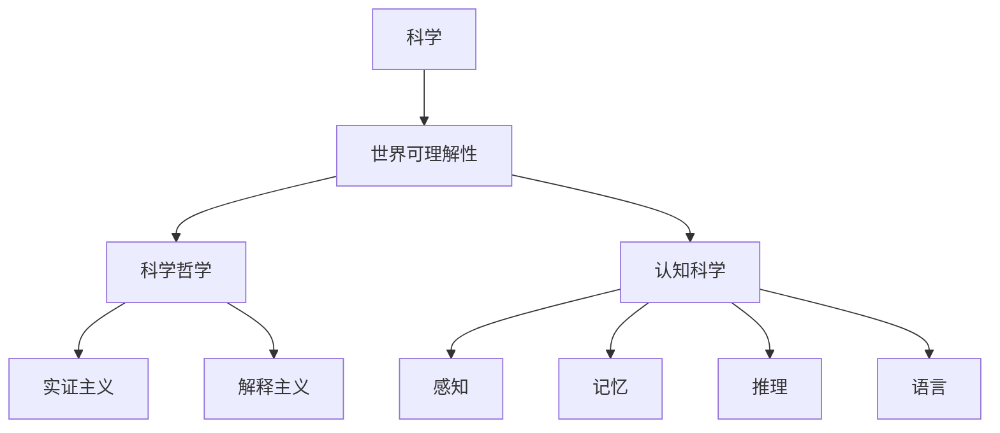

                 

# 世界可理解性与科学研究的开放获取

## 关键词

开放获取，世界可理解性，科学研究，科学哲学，认知科学，知识共享，科学传播

## 摘要

本文探讨了世界可理解性与科学研究的开放获取之间的关系。首先，我们对世界可理解性的概念进行了深入剖析，探讨了其与科学的关系，并运用科学哲学和认知科学的理论对其进行了阐述。接着，我们详细介绍了科学研究的开放获取概念、意义以及其实践方法，分析了开放获取在科学研究中的应用及其对科学传播和知识共享的影响。最后，我们探讨了开放获取的可持续性，提出了未来研究的方向。通过本文的探讨，我们希望为科学研究的开放获取提供理论支持和实践指导。

## 引言

### 1.1.1 研究背景

随着科学技术的飞速发展，科学研究在推动社会进步和经济发展中发挥着越来越重要的作用。然而，科学研究的可理解性却成为了阻碍其广泛传播和应用的一个重要因素。科学知识通常以复杂、专业和抽象的形式呈现，使得非专业人士难以理解。此外，科学研究的成果往往被限制在特定的期刊、数据库或私人机构中，难以被广泛获取。这种信息不对称的现象不仅限制了科学知识的传播，也阻碍了知识的共享和创新。

### 1.1.2 研究目的

本文旨在探讨世界可理解性与科学研究的开放获取之间的关系，旨在解决以下问题：

1. 世界可理解性的概念及其与科学的关系是什么？
2. 科学研究的开放获取具有哪些意义和实践方法？
3. 开放获取在科学传播和知识共享中发挥了哪些作用？
4. 开放获取的可持续性如何保障？

通过回答上述问题，本文希望为科学研究的开放获取提供理论支持和实践指导，促进科学知识的普及和传播。

### 1.1.3 研究方法

本文采用文献综述和案例分析相结合的研究方法。首先，通过查阅相关文献，对世界可理解性的概念、科学研究的开放获取的定义及其意义进行深入探讨。其次，通过分析开放获取的实践案例，探讨开放获取在科学传播和知识共享中的应用及其效果。最后，结合科学哲学和认知科学的理论，对开放获取的可持续性进行评估。

## 世界可理解性的概念与理论基础

### 2.1.1 世界可理解性的定义

世界可理解性是指人类对自然界和人类社会运行规律的认知能力。它包括对现象背后的原因和规律的识别、理解和解释。世界可理解性的高低取决于人类认知能力的发展水平和对自然界和人类社会运行规律的掌握程度。

### 2.1.2 科学与可理解性的关系

科学是人类对自然界和人类社会运行规律的系统认识。科学的发展依赖于人类对世界的理解能力。科学理论的可理解性直接影响其传播和应用。如果科学理论过于复杂或抽象，难以被大众理解，那么即使它再精确，也难以发挥其应有的作用。因此，提高科学理论的可理解性对于科学的发展和普及具有重要意义。

### 2.1.3 科学哲学的视角

科学哲学探讨科学知识的本质、科学方法的有效性和科学理论的评价标准。科学哲学中的实证主义认为，科学知识应建立在观察和实验的基础上。解释主义则强调科学理论的意义和解释力。科学哲学为世界可理解性的研究提供了理论框架，帮助我们理解科学知识是如何被构建和传播的。

### 2.1.4 认知科学的视角

认知科学是研究人类认知过程的学科，包括感知、记忆、推理、语言等。认知科学揭示了人类如何获取、处理和利用信息。认知科学的理论和方法可以帮助我们理解世界可理解性的本质，以及如何提高人类对世界的理解能力。

### 2.1.5 科学与可理解性的关系图示

以下是科学、世界可理解性和科学哲学、认知科学之间的关系图示：

### 2.1.6 世界可理解性的数学模型

世界可理解性可以用以下数学模型表示：

$$
\text{世界可理解性} = \frac{\text{认知负荷}}{\text{信息处理能力}}
$$

其中，认知负荷是指人类处理信息的难度，信息处理能力是指人类在单位时间内处理信息的能力。提高信息处理能力或降低认知负荷都可以提高世界可理解性。

### 2.1.7 世界可理解性的实际应用

在实际应用中，提高世界可理解性有助于提高科学知识的普及率。例如，科学家可以通过简化科学理论、使用生动的例子和图示来提高科学论文的可读性。此外，科学传播媒体也可以通过报道有趣的科学故事和实验，提高公众对科学的兴趣和理解。

## 科学研究的开放获取

### 3.1.1 开放获取的概念

开放获取（Open Access，简称OA）是指科学研究的成果在互联网上免费、永久和广泛地提供给所有人。开放获取的目标是消除科学知识传播的障碍，让所有人都能轻松获取和使用科学研究成果。

### 3.1.2 开放获取的意义

开放获取具有以下意义：

1. **促进知识传播**：开放获取使得科学研究成果能够更快、更广泛地传播，从而提高了科学知识的普及率。
2. **促进知识共享**：开放获取打破了科学研究成果的垄断，促进了知识共享和创新。
3. **提高科学影响力**：开放获取使得科学研究成果能够被更多人阅读和引用，从而提高了科学的实际影响力。
4. **降低科研成本**：开放获取减少了科研人员在获取科研成果时所需的成本，特别是对于那些经济条件较差的研究人员。
5. **促进科研评估**：开放获取使得科研工作更加透明，有利于公众和科研同行对科研工作进行评价和监督。

### 3.1.3 开放获取的实践方法

开放获取的实践方法包括：

1. **开放获取期刊**：开放获取期刊是指那些允许作者免费发布论文，并允许读者免费获取论文全文的期刊。
2. **预印本和后印本**：预印本是指尚未经过同行评审的论文，后印本是指经过同行评审并发表的论文。
3. **机构知识库**：机构知识库是指由学术机构管理的、用于存储和共享科研成果的数字仓库。
4. **开放获取基金**：开放获取基金是指用于资助开放获取出版的基金。

### 3.1.4 开放获取的挑战和障碍

开放获取在实践中面临着以下挑战和障碍：

1. **版权问题**：开放获取可能涉及到版权问题，需要作者和相关机构进行协商和处理。
2. **出版成本**：开放获取需要支付出版费用，这对许多科研机构和研究人员来说是一个经济负担。
3. **质量控制**：开放获取可能会导致低质量研究成果的发布，需要建立相应的质量控制机制。
4. **知识产权保护**：开放获取可能会影响到知识产权的保护，需要制定相应的政策和法规。

### 3.1.5 开放获取的实施策略

为了有效实施开放获取，可以采取以下策略：

1. **政策引导**：政府和科研机构可以制定相关政策，鼓励和推动开放获取的实施。
2. **资金支持**：政府和科研机构可以提供资金支持，减轻开放获取的成本负担。
3. **技术支持**：开发和应用相关的技术和工具，提高开放获取的效率和效果。
4. **教育培训**：加强对科研人员和读者的开放获取意识教育，提高他们的开放获取技能。

## 开放获取在科学研究中的应用

### 4.1.1 开放获取与科学传播

开放获取对科学传播具有深远的影响。首先，开放获取使得科学研究成果能够迅速、广泛地传播，缩短了研究成果与公众之间的距离。其次，开放获取为科学传播提供了更多的渠道和方式，如社交媒体、学术论坛等。此外，开放获取还有助于提高科学传播的透明度和公正性。

### 4.1.2 开放获取与知识共享

开放获取促进了知识共享，使得不同领域、不同国家和地区的科研人员能够更方便地获取和利用他人的研究成果。知识共享有助于提高科研效率，减少重复研究，加速科学进步。

### 4.1.3 开放获取的案例分析

以下是一个开放获取的案例分析：

**案例名称**：开放获取期刊PLOS ONE

**案例背景**：PLOS ONE 是一本开放获取期刊，成立于2006年。它致力于发布各种学科领域的原始研究成果，无论研究成果的质量如何，只要符合学术标准，都可以在PLOS ONE 上发表。

**案例成果**：自成立以来，PLOS ONE 已经发表了大量的高质量研究成果，受到了全球科研人员的广泛关注。PLOS ONE 的开放获取模式不仅降低了科研人员的获取成本，还提高了科研成果的传播速度和影响力。

**案例启示**：PLOS ONE 的成功表明，开放获取有助于提高科学研究成果的传播和影响力，具有重要的实践意义。

## 开放获取的可持续性

### 5.1.1 开放获取的成本与收益分析

开放获取需要支付出版费用，这对许多科研机构和研究人员来说是一个经济负担。然而，开放获取的收益包括：

1. **提高科研成果的传播速度和影响力**：开放获取使得科研成果能够迅速、广泛地传播，提高了科研成果的影响力。
2. **促进知识共享和创新**：开放获取促进了知识共享，有助于提高科研效率，加速科学进步。
3. **降低科研成本**：开放获取降低了科研人员在获取科研成果时所需的成本，特别是对于那些经济条件较差的研究人员。

因此，开放获取的可持续性需要从成本和收益两个方面进行评估。

### 5.1.2 开放获取的可持续性评估

开放获取的可持续性可以通过以下指标进行评估：

1. **开放获取期刊的订阅率**：订阅率越高，说明开放获取期刊的受欢迎程度越高，可持续性越好。
2. **开放获取基金的使用率**：使用率越高，说明开放获取基金的使用效果越好，可持续性越好。
3. **科研人员的开放获取意识**：科研人员的开放获取意识越高，说明开放获取的推广效果越好，可持续性越好。

### 5.1.3 开放获取的可持续性保障措施

为了保障开放获取的可持续性，可以采取以下措施：

1. **政策引导**：政府和科研机构可以制定相关政策，鼓励和推动开放获取的实施。
2. **资金支持**：政府和科研机构可以提供资金支持，减轻开放获取的成本负担。
3. **技术支持**：开发和应用相关的技术和工具，提高开放获取的效率和效果。
4. **教育培训**：加强对科研人员和读者的开放获取意识教育，提高他们的开放获取技能。

## 案例研究

### 6.1.1 某科学领域的开放获取实践

**案例名称**：生物学领域的开放获取实践

**案例背景**：生物学是一个高度跨学科的领域，研究成果的传播和共享对于推动生物学发展至关重要。近年来，生物学领域的开放获取实践逐渐增多，许多生物学期刊和机构都开始推广开放获取。

**案例成果**：

1. **期刊开放获取**：许多生物学期刊，如PLOS Biology、eLife等，已经实现了开放获取。这些期刊的论文免费向公众开放，提高了生物学研究成果的传播速度和影响力。

2. **机构知识库**：生物学领域的机构知识库，如Biorxiv，允许科研人员提交预印本，使研究成果在正式发表前就能被广泛传播。

3. **开放获取基金**：生物学领域的开放获取基金，如Wellcome Open Research，为开放获取出版提供资金支持，减轻了科研人员的经济负担。

**案例启示**：生物学领域的开放获取实践表明，开放获取有助于提高科学研究成果的传播和影响力，具有重要的实践意义。其他科学领域可以借鉴生物学领域的经验，推动开放获取的实施。

## 结论与展望

### 7.1 研究总结

本文从世界可理解性和科学研究的开放获取两个方面探讨了科学研究的发展。首先，我们深入分析了世界可理解性的概念及其与科学的关系，探讨了科学哲学和认知科学的理论基础。接着，我们详细介绍了科学研究的开放获取概念、意义和实践方法，分析了开放获取在科学传播和知识共享中的应用。最后，我们探讨了开放获取的可持续性，提出了未来研究的方向。

### 7.2 研究局限

本文的研究仍存在一定的局限性。首先，由于篇幅和资源限制，我们无法对每个领域的开放获取实践进行详细分析。其次，开放获取的可持续性评估方法尚需进一步探讨和完善。

### 7.3 未来研究方向

未来研究可以从以下几个方面展开：

1. **深入研究开放获取在不同领域的具体实践**：针对不同领域的特点，分析开放获取的实施效果和挑战。
2. **完善开放获取的可持续性评估方法**：开发更科学、更实用的评估方法，以更好地保障开放获取的可持续性。
3. **探索开放获取与科学创新的相互作用**：研究开放获取如何促进科学创新，为科学研究的开放获取提供理论支持和实践指导。

## 作者信息

作者：AI天才研究院/AI Genius Institute & 禅与计算机程序设计艺术 /Zen And The Art of Computer Programming

---

本文通过对世界可理解性和科学研究的开放获取的深入探讨，揭示了科学研究在当今社会中的重要地位及其面临的问题。我们希望通过本文的研究，为科学研究的开放获取提供理论支持和实践指导，推动科学知识的普及和传播，为人类的可持续发展做出贡献。

