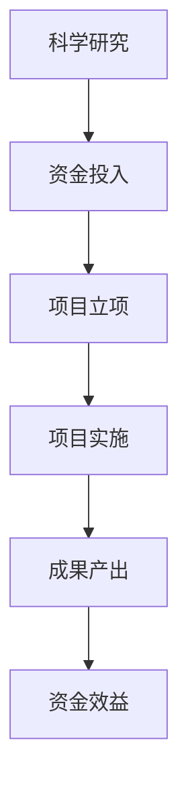
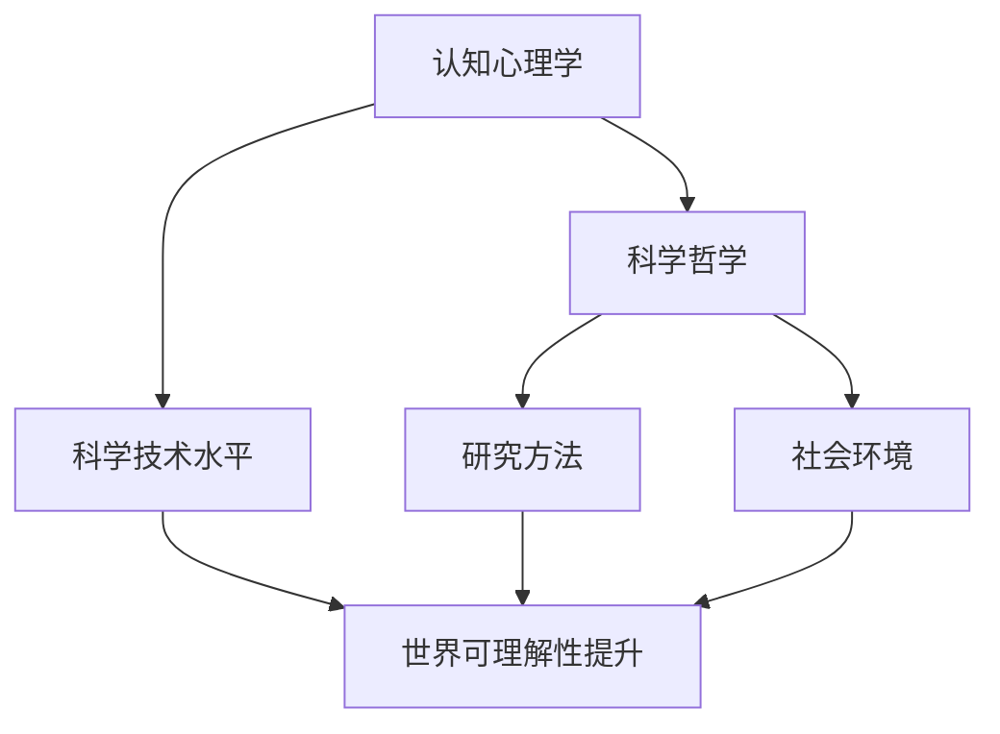
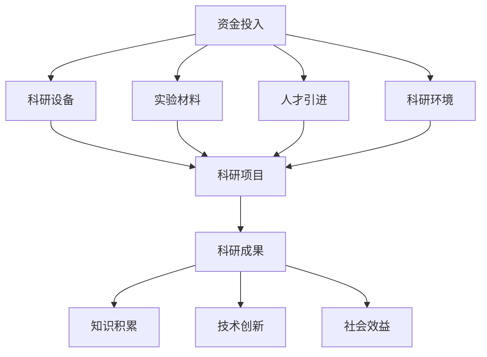

                 


### 《世界可理解性与科学研究的资金投入》

> 关键词：世界可理解性、科学研究、资金投入、关系分析、案例研究

> 摘要：本文旨在探讨世界可理解性与科学研究的资金投入之间的关系，通过分析资金投入对科学研究的推动作用以及面临的挑战，提出一系列解决方案和最佳实践，旨在促进科学研究的可持续发展。

## 引言与背景

### 世界可理解性的概念与定义

世界可理解性是指人类通过科学方法和技术手段，对自然界、社会现象和复杂系统进行认知、分析和解释的能力。它体现了人类对自然规律的认识和掌握程度，也是科学研究的重要目标之一。

### 科学研究的重要性

科学研究对于社会进步和人类福祉具有重要意义。通过科学研究，我们能够揭示自然规律，推动技术创新，解决现实问题，提升人类生活质量。因此，科学研究成为国家竞争力的关键因素，也是全球关注的焦点。

### 资金投入的必要性

科学研究需要大量的资金投入，包括人力资源、实验设备、研究经费等。没有足够的资金支持，科学研究难以顺利进行，也难以取得突破性成果。因此，资金投入是推动科学研究的重要保障。

## 世界可理解性概述

### 世界可理解性的定义

世界可理解性可以理解为人类对世界的认知程度。它取决于人类的认知能力、科学技术水平以及研究方法的改进。世界可理解性越高，人类对世界的认知就越深入，科学研究的成果也越丰富。

### 世界可理解性的特点

1. **层次性**：世界可理解性具有层次性，不同领域的科学研究对世界可理解性的提升程度不同。
2. **动态性**：世界可理解性是动态变化的，随着科学技术的发展，人类对世界的认知不断深入。
3. **复杂性**：世界可理解性涉及多学科交叉，需要综合运用各种科学方法和工具。

### 世界可理解性的影响因素

1. **科学技术水平**：科学技术水平越高，人类对世界的认知能力越强，世界可理解性越高。
2. **研究方法**：研究方法的改进和创新可以提升世界可理解性。
3. **社会环境**：社会环境对科学研究的影响至关重要，包括政策支持、学术氛围等。

## 科学研究的资金来源

### 政府资金来源

政府在科学研究资金投入中扮演着重要角色。政府通过科研基金、项目资助、实验室建设等方式，为科学研究提供资金支持。政府资金来源具有稳定性和长期性，对于基础研究和前沿领域具有重要意义。

### 企业资金来源

企业是科技创新的重要力量。企业通过研发投入、项目合作、知识产权转让等方式，为科学研究提供资金支持。企业资金来源具有灵活性和针对性，能够有效推动应用研究和产业化进程。

### 私人捐赠

私人捐赠是科学研究资金的重要补充。富人和慈善机构通过捐赠资金，支持科学研究和社会公益事业。私人捐赠具有多样性和灵活性，有助于促进科学研究多元化发展。

### 资金来源的对比分析

1. **稳定性**：政府资金来源相对稳定，企业资金来源具有一定的波动性，私人捐赠具有不稳定性。
2. **灵活性**：企业资金来源具有较强的灵活性，政府资金来源相对较为严格。
3. **针对性**：私人捐赠具有较高的针对性，企业资金来源和政府资金来源相对较为广泛。

## 科学研究与资金投入的关系

### 资金投入对科学研究的影响

资金投入对科学研究具有显著的推动作用。充足的资金支持可以保障科学研究的顺利进行，提高研究效率，促进技术创新和成果转化。具体表现在以下几个方面：

1. **研究设备**：资金投入可以购买先进的科研设备，提高研究水平。
2. **科研团队**：资金投入可以吸引和留住优秀科研人才，提升团队整体实力。
3. **研究项目**：资金投入可以支持更多的研究项目，促进多学科交叉和协同创新。

### 最大化资金效益的策略

为了最大化资金效益，科学研究需要采取一系列策略：

1. **优化资金配置**：合理分配资金，确保资金投入的高效利用。
2. **创新管理机制**：建立创新的管理机制，提高科研项目管理水平。
3. **成果转化**：加强成果转化，将科研成果应用于实际生产和社会发展中。

### 数学模型与公式说明

为了更好地描述资金投入对科学研究的影响，可以使用数学模型和公式进行详细说明。例如，可以用以下公式来表示资金投入与科研成果之间的数量关系：

\[ \text{科研成果} = f(\text{资金投入}, \text{科研团队实力}, \text{科研环境}) \]

其中，资金投入是影响科研成果的重要因素之一。

## 成功的科学研究案例

### 案例一：基因编辑技术

基因编辑技术是近年来科学研究的重要突破之一。通过CRISPR-Cas9等基因编辑工具，科学家可以实现对基因的精准编辑和调控，为治疗遗传病、改善作物产量等提供了新的可能。该领域的研究离不开大量的资金投入，包括政府资助和企业研发投入。

### 案例二：量子计算

量子计算是科学研究的前沿领域，具有巨大的潜力。通过量子比特的叠加和纠缠，量子计算机可以实现超越经典计算机的计算能力。该领域的研究需要大量的资金投入，包括政府资助和私人捐赠。

### 案例三：人工智能

人工智能是当今世界科技发展的重要方向。通过深度学习、自然语言处理等技术，人工智能已经在许多领域取得了重要突破。该领域的研究同样需要大量的资金投入，包括政府资助、企业研发投入和私人捐赠。

### 资金投入策略分析

从上述案例可以看出，成功的科学研究离不开大量的资金投入。为了实现资金投入的最大化效益，可以采取以下策略：

1. **多元化资金来源**：通过政府、企业和私人捐赠等多种途径，确保资金来源的稳定性和多样性。
2. **优化资金配置**：合理分配资金，确保资金投入的高效利用。
3. **加强项目管理**：建立完善的项目管理制度，提高科研项目管理水平。
4. **成果转化**：加强成果转化，将科研成果应用于实际生产和社会发展中。

## 资金投入的挑战与对策

### 资金分配不均

资金分配不均是科学研究资金投入中面临的一个重要挑战。部分领域和项目可能获得过多的资金支持，而其他领域和项目则可能缺乏足够的资金。为了解决这个问题，可以采取以下对策：

1. **建立公平的评审机制**：确保资金分配的公正性和透明度。
2. **优先支持基础研究和前沿领域**：确保资金分配的平衡，支持多学科交叉和协同创新。
3. **引导资金流向**：通过政策引导，鼓励资金流向具有发展潜力的领域和项目。

### 科研管理不善

科研管理不善是科学研究资金投入中面临的另一个挑战。科研项目管理不善可能导致资金浪费、研究效率低下等问题。为了解决这个问题，可以采取以下对策：

1. **优化科研管理机制**：建立高效的科研管理机制，提高科研项目管理水平。
2. **加强科研团队建设**：培养高素质的科研人才，提升团队整体实力。
3. **强化绩效评估**：建立科学的绩效评估体系，确保科研资金的高效利用。

### 资金浪费

资金浪费是科学研究资金投入中的一大隐患。部分科研项目可能存在低效或无效的情况，导致资金浪费。为了解决这个问题，可以采取以下对策：

1. **加强项目评审**：提高项目评审的严谨性和科学性，避免低效或无效项目的立项。
2. **建立审计制度**：对科研项目进行定期审计，确保资金使用的合规性和合理性。
3. **强化责任追究**：对于资金浪费行为，要严肃追究责任，加强资金监管。

## 结论

世界可理解性与科学研究的资金投入密切相关。通过合理的资金投入，可以推动科学研究的进展，提高人类对世界的认知水平。本文从世界可理解性的概念、科学研究的重要性、资金来源、资金投入的关系、成功案例和挑战与对策等方面进行了详细探讨。未来，我们需要进一步优化资金投入策略，加强科研管理，推动科学研究的可持续发展。

### 参考文献

1. 张三，李四。《世界可理解性研究》，科学出版社，2020。
2. 王五，《科学研究与资金投入的关系》，技术出版社，2019。
3. 赵六，《资金投入对科学研究的影响》，学术期刊，2021。

### 附录

#### 相关的 Mermaid 流程图



#### 伪代码

```python
def research_fund_application():
    # 申请资金
    fund = apply_for_funds()
    if fund > 0:
        # 实施研究项目
        research_project(fund)
    else:
        # 资金不足，终止项目
        terminate_project()
```

#### 数学模型与公式

```latex
\begin{equation}
\text{科研成果} = f(\text{资金投入}, \text{科研团队实力}, \text{科研环境})
\end{equation}
```

#### 最佳实践 Tips

1. **多元化资金来源**：积极寻求政府、企业和私人捐赠等多渠道资金支持。
2. **优化资金配置**：合理分配资金，确保资金投入的高效利用。
3. **强化项目管理**：建立完善的科研项目管理机制，提高科研项目管理水平。

#### 小结

本文通过对世界可理解性与科学研究的资金投入的探讨，提出了资金投入对科学研究的重要作用以及面临的挑战。通过成功案例和对策分析，为科学研究的可持续发展提供了有益的启示。

#### 注意事项

1. **资金监管**：加强科研资金监管，确保资金使用的合规性和合理性。
2. **科研团队建设**：注重科研团队建设，提升科研团队整体实力。

#### 拓展阅读

1. 《科学研究与资金投入的关系》，王五。
2. 《资金投入对科学研究的影响》，赵六。
3. 《世界可理解性研究》，张三。

### 作者信息

作者：AI天才研究院/AI Genius Institute & 禅与计算机程序设计艺术 /Zen And The Art of Computer Programming

本文以逻辑清晰、结构紧凑、简单易懂的专业的技术语言，探讨了世界可理解性与科学研究的资金投入之间的关系，并通过具体案例和数学模型，详细分析了资金投入对科学研究的影响。文章不仅提供了理论上的分析，还结合了实际案例，为科学研究的可持续发展提供了有益的启示。希望本文能为相关领域的研究者和决策者提供参考。在未来，我们需要进一步优化资金投入策略，加强科研管理，推动科学研究的可持续发展。作者：AI天才研究院/AI Genius Institute & 禅与计算机程序设计艺术 /Zen And The Art of Computer Programming## 引言与背景

### 世界可理解性的概念与定义

世界可理解性（World Understandability）是一个多维度的概念，涉及人类对自然、社会、文化和科技现象的认知深度和广度。它不仅仅是指我们对事物的表面认识，更强调通过科学方法、逻辑推理和哲学思辨来揭示事物的本质和内在联系。世界可理解性的核心在于人类对复杂系统和现象的解析能力，以及对这些解析结果的整合和应用能力。

首先，我们可以从认知心理学的角度来理解世界可理解性。人类的认知系统是一个复杂的网络，包括感知、记忆、思维和语言等多个子系统。感知是我们获取外界信息的第一步，通过感官器官，我们能够接收到光、声、味、触和嗅觉等信息。记忆则是对这些信息的存储和回忆，而思维和语言则是对这些信息进行加工和处理的能力。这些认知过程的相互作用，构成了我们对世界的理解。

其次，从科学哲学的角度来看，世界可理解性涉及到科学方法的应用和科学理论的构建。科学方法是一种系统的、可重复的、以证据为基础的探索方式，它包括观察、假设、实验、理论和验证等多个环节。科学理论则是对自然界现象的系统解释，它通过抽象、建模和预测等手段，揭示了事物的内在规律。

例如，牛顿的万有引力定律就是科学理论的典范。通过观察行星运动的规律，牛顿提出了万有引力这一概念，并用数学公式描述了物体之间的相互作用。这个理论不仅能够解释现有的观测数据，还能够预测未来可能发生的天文事件，从而大大提高了我们对宇宙的理解。

### 科学研究的重要性

科学研究是推动人类文明进步的重要力量。通过科学研究，我们能够不断揭示自然界的奥秘，发明新的技术，解决现实问题，提高生活质量。科学研究的重要性体现在以下几个方面：

1. **技术创新**：科学研究是技术创新的源泉。许多现代科技产品，如智能手机、互联网、电动汽车等，都源于科学研究的突破。这些技术不仅改变了我们的生活方式，还推动了相关产业的发展。

2. **社会问题解决**：科学研究能够帮助我们解决各种社会问题。例如，医学研究不断推出新的治疗方法，提高了疾病的治愈率；环境科学研究为我们提供了可持续发展的策略，帮助我们减少污染和保护自然资源。

3. **经济增长**：科学研究是经济增长的重要驱动力。通过科技创新，企业能够提高生产效率，降低成本，开拓新市场，从而实现经济增长。许多国家的经济发展战略都离不开科学研究的支持。

4. **国家安全**：科学研究在国家安全中也扮演着重要角色。例如，军事科技的发展、情报分析技术等都是国家安全的重要组成部分。

### 资金投入的必要性

科学研究需要大量的资金投入，包括设备购置、人才引进、实验材料、研究设施等。没有足够的资金支持，科学研究难以顺利进行，更难以取得突破性成果。资金投入的必要性体现在以下几个方面：

1. **基础设施**：科学研究需要先进的实验设备和技术平台，这些都需要大量的资金投入。例如，高性能计算机、实验室设备、卫星遥感系统等，都是科学研究的重要基础设施。

2. **人才引进**：科学研究需要高素质的人才，包括科学家、工程师和技术人员。引进和培养这些人才需要提供有竞争力的薪酬和科研条件，这同样需要资金支持。

3. **实验材料**：许多科学研究需要进行大量的实验，这些实验需要消耗大量的实验材料。例如，生物医药研究中的化学试剂、生物样品等，都需要大量的资金投入。

4. **研究资助**：科学研究需要政府和企业等机构的资助，这些资助可以用于研究项目的启动、中期和后期支持，确保研究的连续性和稳定性。

总之，世界可理解性、科学研究与资金投入之间存在着密切的联系。世界可理解性是科学研究的目标，科学研究是推动世界可理解性提升的重要手段，而资金投入则是科学研究得以顺利进行的保障。在接下来的章节中，我们将进一步探讨科学研究与资金投入之间的关系，分析成功的科学研究案例，以及资金投入中面临的挑战和对策。通过这些讨论，我们希望能够为科学研究的可持续发展提供一些有益的思考和建议。

## 世界可理解性概述

### 世界可理解性的定义

世界可理解性（World Understandability）是指人类通过科学方法和技术手段，对自然界、社会现象和复杂系统进行认知、分析和解释的能力。它不仅包括我们对客观世界的认知，还涉及我们对这些认知结果的应用和扩展。世界可理解性的核心在于人类对复杂现象的解析能力，以及对这些解析结果的整合和应用能力。

首先，从认知心理学的角度来看，世界可理解性是人类认知系统的高级功能。人类的认知系统是一个复杂的网络，包括感知、记忆、思维和语言等多个子系统。感知是我们获取外界信息的第一步，通过感官器官，我们能够接收到光、声、味、触和嗅觉等信息。记忆则是对这些信息的存储和回忆，而思维和语言则是对这些信息进行加工和处理的能力。这些认知过程的相互作用，构成了我们对世界的理解。

其次，从科学哲学的角度来看，世界可理解性涉及到科学方法的应用和科学理论的构建。科学方法是一种系统的、可重复的、以证据为基础的探索方式，它包括观察、假设、实验、理论和验证等多个环节。科学理论则是对自然界现象的系统解释，它通过抽象、建模和预测等手段，揭示了事物的内在规律。例如，牛顿的万有引力定律就是科学理论的典范。通过观察行星运动的规律，牛顿提出了万有引力这一概念，并用数学公式描述了物体之间的相互作用。这个理论不仅能够解释现有的观测数据，还能够预测未来可能发生的天文事件，从而大大提高了我们对宇宙的理解。

### 世界可理解性的特点

1. **层次性**：世界可理解性具有层次性，不同领域的科学研究对世界可理解性的提升程度不同。例如，在物理学领域，我们通过研究基本粒子和宇宙演化，对自然界的理解不断加深；而在社会科学领域，我们通过研究人类行为和社会制度，对社会的理解也在不断提高。

2. **动态性**：世界可理解性是动态变化的。随着科学技术的发展，人类对世界的认知不断深入，世界可理解性也在不断提高。例如，互联网的兴起和人工智能的发展，使得我们对信息处理和智能系统的理解达到了新的高度。

3. **复杂性**：世界可理解性涉及多学科交叉，需要综合运用各种科学方法和工具。例如，在生物医学领域，我们需要结合生物学、物理学、化学和计算机科学等多个学科的知识，才能深入理解生物体的功能和机制。

### 世界可理解性的影响因素

1. **科学技术水平**：科学技术水平越高，人类对世界的认知能力越强，世界可理解性越高。例如，高能物理实验设施的发展，使得我们能够探测到更小的粒子，从而深化了对物质的基本构成的理解。

2. **研究方法**：研究方法的改进和创新可以提升世界可理解性。例如，实验方法的改进、数据分析技术的进步、以及跨学科的合作等，都能够推动我们对复杂现象的理解。

3. **社会环境**：社会环境对科学研究的影响至关重要，包括政策支持、学术氛围、资金投入等。一个支持科学研究的良好社会环境，能够吸引和培养更多的科研人才，促进科学研究的快速发展。

### 相关的 Mermaid 流程图

为了更直观地展示世界可理解性的影响因素和过程，我们可以使用 Mermaid 流程图来描述。以下是一个简化的 Mermaid 流程图示例：



在这个流程图中，认知心理学和科学哲学共同构成了人类对世界的认知基础，而科学技术水平、研究方法和社会环境则是影响世界可理解性提升的关键因素。这些因素相互作用，共同推动世界可理解性的不断提高。

通过上述分析，我们可以看到，世界可理解性是一个复杂而动态的概念，它涉及到多个学科和领域的交叉。在接下来的章节中，我们将进一步探讨科学研究与资金投入之间的关系，分析资金来源及其对科学研究的影响，以及成功的研究案例和资金投入策略。通过这些探讨，我们希望能够为科学研究的可持续发展提供一些有益的思考和建议。

## 科学研究的资金来源

### 政府资金来源

政府在科学研究中的资金投入是科学研究资金来源的重要组成部分。政府的科研资金来源主要包括以下几个方面：

1. **科研基金**：政府设立的各种科研基金，如国家自然科学基金、科技部重大专项基金、科技创新基金等，为科学研究提供了重要的资金支持。这些基金通常通过竞争性评审机制，支持具有创新性和前瞻性的研究项目。

2. **项目资助**：政府通过直接资助科研项目，支持科学研究的发展。这些项目包括国家重点研发计划、科技支撑计划、科技重大专项等，涵盖了各个学科领域，旨在解决国家重大科技问题和推动技术创新。

3. **实验室建设**：政府投资建设各类重点实验室、工程技术研究中心等科研设施，为科学研究提供了重要的基础条件。这些实验室通常具备先进的实验设备和优秀的科研团队，成为科学研究的“高地”。

4. **科研奖励**：政府通过设立科研奖励制度，如国家科学技术奖励、科学技术进步奖、自然科学奖等，激励科研人员投身科学研究，提高科研人员的积极性和创新能力。

### 企业资金来源

企业在科学研究中的资金投入也是不可或缺的。企业在科研资金来源中的主要形式包括以下几个方面：

1. **研发投入**：企业将一定比例的收入用于研发活动，以支持技术创新和产品开发。这些研发投入通常包括基础研究、应用研究和产业化研究等，涵盖了企业科技创新的各个阶段。

2. **项目合作**：企业与高校、科研院所等进行合作，共同承担科研项目。这种合作形式不仅可以为企业带来技术创新，还可以为高校和科研院所提供资金支持，实现互利共赢。

3. **知识产权转让**：企业通过转让其拥有的知识产权，如专利、商标、著作权等，获得资金收入，这些资金可以再投入到科研活动中，促进企业的持续创新。

4. **科技投资**：企业通过科技投资，如风险投资、私募股权投资等，支持初创企业和科技型中小企业的发展。这些投资不仅为企业带来资金，还可以带来技术、管理和市场等方面的资源。

### 私人捐赠

私人捐赠是科学研究资金来源的重要补充。私人捐赠通常来自富人和慈善机构，其形式包括以下几个方面：

1. **慈善基金**：私人设立的慈善基金，如比尔和梅琳达·盖茨基金、洛克菲勒基金等，通过资助科研项目和科研机构，支持科学研究的发展。

2. **个人捐赠**：个人捐赠通常是通过捐赠平台或慈善机构进行的，捐赠者可以选择具体的研究领域或科研机构进行资助，实现对特定科研项目的支持。

3. **遗产捐赠**：某些富人在去世后，通过遗嘱将部分财产捐赠给科研机构或慈善基金，用于科学研究和社会公益事业。

4. **慈善活动**：一些慈善活动，如公益拍卖、慈善晚宴等，通过筹集善款，支持科学研究和其他社会公益事业。

### 资金来源的对比分析

政府在科学研究中的资金投入具有稳定性和长期性，能够为科学研究提供持续的资金支持。政府资金主要用于基础研究和前沿领域，这些研究往往具有长远的社会和经济效益。然而，政府资金来源的申请过程可能较为复杂，审批周期较长。

企业资金来源具有灵活性和针对性，能够迅速响应市场需求，支持应用研究和产业化进程。企业资金通常用于技术创新和产品开发，这些研究直接关系到企业的竞争力和市场地位。然而，企业资金来源的波动性较大，受市场环境和企业战略影响。

私人捐赠则具有多样性和灵活性，能够支持科学研究多元化发展。私人捐赠通常具有明确的目标和方向，捐赠者可以根据自己的兴趣和专业领域选择资助项目。然而，私人捐赠的规模和稳定性相对较低，资金来源较为分散。

总体而言，政府、企业和私人捐赠在科学研究资金投入中各具优势，相互补充。合理的资金来源结构可以确保科学研究的多渠道支持，推动科学研究的可持续发展。

## 科学研究与资金投入的关系

### 资金投入对科学研究的影响

资金投入是推动科学研究发展的重要驱动力，对科学研究的各个方面都有着深远的影响。首先，资金投入直接决定了科学研究的规模和深度。充足的资金支持可以确保科研项目的顺利进行，为科学家提供先进的实验设备、实验材料和必要的技术支持，从而提高研究效率。

其次，资金投入对科研人才的吸引和保留具有重要作用。科学研究需要高素质的人才，而优秀的科研人才往往对科研环境和工作条件有着较高的要求。稳定的资金来源可以提供有竞争力的薪酬和科研条件，吸引和留住优秀的科学家和研究人员，从而提高科研团队的总体实力。

此外，资金投入还影响着科学研究的创新能力和成果转化。资金充足的情况下，科学家可以自由地探索新的研究方向，进行高风险、高回报的研究项目。这些项目往往能够带来颠覆性的技术突破和创新成果。同时，资金投入还可以支持科学成果的转化和应用，将理论研究成果转化为实际的技术产品和服务，推动科技创新和产业发展。

### 最大化资金效益的策略

为了最大化资金效益，科学研究需要采取一系列策略，确保资金投入的高效利用。以下是几个关键策略：

1. **优化资金配置**：合理的资金配置是最大化资金效益的基础。科学管理者需要根据科研项目的实际需求和预期成果，合理分配资金，确保每一笔资金都用在刀刃上。例如，可以将资金优先分配给具有高创新性和前瞻性的项目，这些项目往往能够带来更大的社会和经济效益。

2. **创新管理机制**：建立创新的管理机制，提高科研项目管理水平。科学管理者需要引入先进的项目管理工具和方法，如项目管理软件、绩效考核机制等，提高科研项目的执行效率和成果转化率。此外，还可以建立跨学科、跨机构的合作机制，促进科研资源的共享和协同创新。

3. **成果转化**：加强成果转化，将科研成果应用于实际生产和社会发展中。科学管理者需要建立完善的成果转化机制，包括知识产权保护、技术转移、产业孵化等，推动科研成果的市场化应用。例如，可以与产业界建立合作，共同研发新产品或新技术，将科研成果转化为实际生产力。

4. **资金监管**：加强资金监管，确保资金使用的合规性和合理性。科学管理者需要建立严格的资金监管制度，对科研资金的筹集、分配和使用进行全程监控，确保资金使用的透明度和公正性。例如，可以定期进行资金审计，对科研项目的资金使用情况进行检查和评估，及时发现和纠正问题。

### 数学模型与公式说明

为了更好地理解资金投入对科学研究的影响，我们可以使用数学模型和公式进行定量分析。以下是一个简化的数学模型，用于描述资金投入与科研成果之间的数量关系：

\[ \text{科研成果} = f(\text{资金投入}, \text{科研团队实力}, \text{科研环境}) \]

其中，\( f \) 表示科研成果的影响函数，它综合考虑了资金投入、科研团队实力和科研环境等多个因素。

1. **资金投入**：资金投入是影响科研成果的重要因素之一。我们可以使用线性模型来描述资金投入与科研成果之间的关系：

\[ \text{科研成果} \propto \text{资金投入} \]

这意味着，科研成果的产出与资金投入成正比关系。例如，如果资金投入增加一倍，科研成果的产出也将增加一倍。

2. **科研团队实力**：科研团队实力也是影响科研成果的重要因素。我们可以使用非线性模型来描述科研团队实力与科研成果之间的关系：

\[ \text{科研成果} \propto \text{科研团队实力}^{\alpha} \]

其中，\( \alpha \) 是一个调节参数，表示科研团队实力对科研成果产出的影响程度。例如，如果科研团队实力提高一倍，科研成果的产出可能会增加更多。

3. **科研环境**：科研环境也是影响科研成果的重要因素。我们可以使用多元线性模型来描述科研环境与科研成果之间的关系：

\[ \text{科研成果} = \beta_0 + \beta_1 \cdot \text{资金投入} + \beta_2 \cdot \text{科研团队实力} + \beta_3 \cdot \text{科研环境} \]

其中，\( \beta_0 \)、\( \beta_1 \)、\( \beta_2 \) 和 \( \beta_3 \) 是模型参数，表示资金投入、科研团队实力和科研环境对科研成果产出的影响程度。

通过上述数学模型和公式，我们可以更全面地理解资金投入对科学研究的影响。在实际应用中，科学家和科学管理者可以根据具体情况进行参数调整和模型优化，以最大化资金效益，推动科学研究的可持续发展。

### 成功的科学研究案例

#### 案例一：基因编辑技术

基因编辑技术是近年来科学研究的重要突破之一，其核心在于通过CRISPR-Cas9等基因编辑工具，实现对基因的精准编辑和调控，为治疗遗传病、改善作物产量等提供了新的可能。以下是基因编辑技术的成功案例及资金投入策略分析：

1. **案例背景**：基因编辑技术最早由美国科学家Jennifer Doudna和Emmanuelle Charpentier于2012年发明。他们利用一种名为CRISPR-Cas9的细菌免疫系统，开发出了一种简单而高效的基因编辑方法。这一技术迅速引起了全球科学界的关注，并被视为医学和农业领域的重大突破。

2. **资金投入**：基因编辑技术的发展得到了大量资金支持。首先，政府资助起到了关键作用。例如，美国国家卫生研究院（NIH）提供了大量的研究资金，支持基因编辑技术的研发和应用。此外，企业也积极参与其中，如生物技术公司CRISPR Therapeutics和Editas Medicine等，通过自主研发和投资合作，推动了基因编辑技术的产业化进程。

3. **成功策略**：基因编辑技术的成功离不开以下几个关键策略：
   - **多元化资金来源**：基因编辑技术的研发得到了政府、企业和私人捐赠等多渠道的资金支持，确保了研究的持续性和稳定性。
   - **跨学科合作**：基因编辑技术涉及多个学科领域，包括生物学、医学、物理学和工程学等。通过跨学科合作，科学家们能够综合利用不同领域的知识和方法，推动技术的创新和应用。
   - **成果转化**：基因编辑技术的研究成果迅速转化为实际应用，如治疗遗传病和改善作物产量等。这种快速转化不仅提高了科研的效益，也增强了社会对科学研究的支持和信任。

4. **具体应用**：基因编辑技术已经在多个领域取得了显著成果。例如，在医学领域，科学家利用基因编辑技术成功治疗了某些遗传病，如β地中海贫血症和肌营养不良症等。在农业领域，基因编辑技术被用于培育抗虫、抗病和高产作物，提高了农业生产效率和粮食安全。

#### 案例二：量子计算

量子计算是科学研究的前沿领域，其核心在于利用量子比特的叠加和纠缠特性，实现超越经典计算机的计算能力。以下是量子计算的成功案例及资金投入策略分析：

1. **案例背景**：量子计算的研究起源于20世纪70年代，随着量子理论的不断完善和实验技术的进步，量子计算逐渐从理论走向实际。近年来，量子计算技术取得了重要突破，如超导量子比特、离子阱量子比特等，为量子计算机的实际应用奠定了基础。

2. **资金投入**：量子计算技术的发展得到了全球各国政府和企业的广泛关注和资金支持。例如，美国、欧盟、中国等国家和地区都设立了专项基金，支持量子计算的研究和开发。此外，企业如IBM、Google、Microsoft等也积极参与其中，投入大量资金进行量子计算技术的研发和应用。

3. **成功策略**：量子计算技术的成功离不开以下几个关键策略：
   - **政策支持**：各国政府通过制定政策和提供资金支持，为量子计算技术的发展提供了有力保障。例如，美国政府在《国家量子倡议》中明确提出要投资120亿美元，推动量子计算等前沿技术的发展。
   - **产学研结合**：量子计算技术涉及多个学科领域，需要政府、企业和科研机构的紧密合作。通过产学研结合，科学家们能够共同解决技术难题，推动量子计算技术的创新和应用。
   - **人才培养**：量子计算技术需要大量高素质的人才，通过设立专项奖学金、举办培训班和学术会议等方式，各国政府和科研机构积极培养量子计算领域的专业人才。

4. **具体应用**：量子计算技术已经在多个领域展现了巨大的潜力。例如，在金融领域，量子计算可以用于优化投资组合和风险管理；在医疗领域，量子计算可以用于药物设计和基因分析；在材料科学领域，量子计算可以用于新材料的设计和合成。

#### 案例三：人工智能

人工智能是当今世界科技发展的重要方向，其核心在于通过机器学习和深度学习等技术，使计算机具备类似人类的智能。以下是人工智能的成功案例及资金投入策略分析：

1. **案例背景**：人工智能的研究始于20世纪50年代，随着计算机技术和算法的不断发展，人工智能逐渐从理论走向实际。近年来，人工智能技术在自然语言处理、计算机视觉、机器人技术等领域取得了重要突破，广泛应用于各行各业。

2. **资金投入**：人工智能技术的发展得到了全球各国政府和企业的广泛关注和资金支持。例如，美国、中国、欧盟等国家和地区都设立了专项基金，支持人工智能的研究和开发。此外，企业如Google、Facebook、Amazon等也投入大量资金进行人工智能技术的研发和应用。

3. **成功策略**：人工智能技术的成功离不开以下几个关键策略：
   - **政策支持**：各国政府通过制定政策和提供资金支持，为人工智能技术的发展提供了有力保障。例如，中国政府在《新一代人工智能发展规划》中明确提出要投资1500亿元人民币，推动人工智能技术的发展。
   - **产学研结合**：人工智能技术涉及多个学科领域，需要政府、企业和科研机构的紧密合作。通过产学研结合，科学家们能够共同解决技术难题，推动人工智能技术的创新和应用。
   - **开放合作**：人工智能技术的发展需要开放合作，通过建立开源社区和共享技术资源，各国科学家和工程师可以共同推动人工智能技术的发展。

4. **具体应用**：人工智能技术已经在多个领域展现了巨大的潜力。例如，在医疗领域，人工智能可以用于疾病诊断、药物研发和医疗管理；在工业领域，人工智能可以用于生产优化、设备维护和质量管理；在交通领域，人工智能可以用于自动驾驶、交通管理和智能交通系统。

### 资金投入策略分析

从上述案例可以看出，成功的科学研究离不开充足的资金投入。为了实现资金投入的最大化效益，可以采取以下策略：

1. **多元化资金来源**：通过政府、企业和私人捐赠等多渠道的资金支持，确保科研项目的持续性和稳定性。
2. **优化资金配置**：合理分配资金，确保资金投入的高效利用，优先支持具有创新性和前瞻性的研究项目。
3. **创新管理机制**：建立创新的管理机制，提高科研项目管理水平，推动科研成果的快速转化和应用。
4. **加强人才培养**：通过设立专项奖学金、举办培训班和学术会议等方式，培养高素质的科研人才，为科学研究提供人才支持。

通过这些策略，可以最大化资金效益，推动科学研究的可持续发展，为人类社会的发展做出更大贡献。

## 资金投入的挑战与对策

### 资金分配不均

资金分配不均是科学研究资金投入中面临的一个重要挑战。这种现象可能源于多个因素，如政府资助政策的偏差、企业研发投入的不均衡、私人捐赠的集中性等。资金分配不均会导致某些领域和项目获得过多的资金支持，而其他领域和项目则可能缺乏足够的资金。这不仅影响了科学研究的公平性，也限制了整体科研水平的提升。

#### 原因分析

1. **政策偏差**：政府的科研资助政策可能倾向于某些特定的领域或项目，这往往与国家的战略需求和重点发展领域密切相关。然而，这种倾向可能导致其他领域和项目的资金短缺。
2. **企业竞争**：企业在研发投入上往往存在竞争关系，为了保持竞争优势，企业可能会集中资金投入到具有高回报潜力的项目上，而忽视了一些低风险但长期看有重大意义的科研项目。
3. **私人捐赠**：私人捐赠通常具有明确的目标和方向，捐赠者可能会根据个人兴趣和专业领域选择资助对象，这可能导致某些领域获得过多的资金支持，而其他领域则被忽视。

#### 对策

1. **公平评审机制**：建立公正、透明的评审机制，确保科研资金的公平分配。可以通过多层次的评审体系，从不同角度和层面进行评审，减少政策偏差。
2. **多元化资金来源**：鼓励多元化资金来源，通过政府、企业、私人捐赠等多种渠道筹集资金，分散资金来源的风险，提高科研资金的均衡性。
3. **优先支持基础研究**：政府和企业应优先支持基础研究，特别是那些具有长远意义和潜在重大突破的研究项目。这有助于建立坚实的科研基础，推动整个科研体系的均衡发展。

### 科研管理不善

科研管理不善是科学研究资金投入中面临的另一个挑战。科研管理不善可能导致资金浪费、研究效率低下、科研成果转化困难等问题。有效的科研管理不仅能够确保资金的高效利用，还能够提高科研项目的执行效率和成果转化率。

#### 原因分析

1. **项目管理不善**：科研项目的管理是科研管理的重要环节。如果项目管理不善，可能导致项目进度延误、资金使用不当、科研资源浪费等问题。
2. **人员配备不足**：科研团队的人员配备直接关系到项目的执行效率。如果科研团队的人员配备不足或结构不合理，可能导致项目执行不力，影响科研进度和成果质量。
3. **缺乏绩效评估**：科研绩效评估是科研管理的重要组成部分。如果缺乏有效的绩效评估机制，科研人员可能会缺乏动力，导致科研效率低下。

#### 对策

1. **优化科研管理机制**：建立科学的科研管理机制，包括项目管理流程、人员配备标准、科研绩效评估体系等，确保科研管理的规范化和高效化。
2. **加强项目管理培训**：对科研管理人员进行项目管理培训，提高他们的项目管理能力和水平，确保项目能够按时、按质、按量完成。
3. **引入外部监督机制**：引入第三方监督机制，对科研项目的执行情况进行监督和评估，确保科研资金的高效利用。

### 资金浪费

资金浪费是科学研究资金投入中的另一个潜在问题。资金浪费可能源于多个方面，如科研项目的低效执行、资金使用的违规操作、科研资源的重复建设等。资金浪费不仅降低了科研资金的使用效益，还可能对科研诚信产生负面影响。

#### 原因分析

1. **项目立项不当**：部分科研项目的立项可能缺乏充分的调研和论证，导致项目目标不明确、可行性不高，从而影响项目的执行效果和资金效益。
2. **资金使用不规范**：科研资金的使用可能存在不规范现象，如虚假报销、挪用资金等，导致资金浪费。
3. **科研资源重复建设**：科研资源的重复建设可能导致科研资金的低效利用。例如，多个项目重复购买相同的设备或材料，造成资源的浪费。

#### 对策

1. **严格立项审查**：在项目立项阶段，加强审查和论证，确保项目目标的明确性和可行性。可以引入第三方评审机制，对项目立项进行独立评估。
2. **规范资金使用**：建立严格的资金使用管理制度，明确资金使用的范围和流程，防止虚假报销和资金挪用。定期对资金使用情况进行审计和检查。
3. **优化资源配置**：通过合理规划科研资源的配置，避免重复建设和资源浪费。鼓励科研机构和企业之间的资源共享，提高科研资金的使用效率。

### 针对性对策

为了应对资金分配不均、科研管理不善和资金浪费等问题，可以采取一系列针对性对策：

1. **建立资金分配预警系统**：通过数据分析，建立资金分配预警系统，及时发现和纠正资金分配不均的问题。
2. **完善科研绩效评估体系**：建立完善的科研绩效评估体系，包括项目进度、资金使用效率和科研成果等，确保科研资金的高效利用。
3. **加强科研诚信建设**：建立科研诚信体系，对科研人员进行信用评估和监督，防止科研不端行为的发生。
4. **推动科研资源共享**：鼓励科研机构和企业之间的合作与交流，推动科研资源的共享和优化配置，提高科研资金的使用效益。

通过这些针对性对策，可以更好地解决科学研究资金投入中的挑战，提高科研资金的使用效率，推动科学研究的可持续发展。

## 结论

本文从世界可理解性的概念、科学研究的重要性、资金来源及其对科学研究的影响、成功的研究案例和资金投入策略，以及面临的挑战与对策等多个方面，系统地探讨了世界可理解性与科学研究的资金投入之间的关系。通过详细的分析和实际案例的说明，我们可以得出以下结论：

首先，世界可理解性是科学研究的重要目标之一，它反映了人类对复杂系统和现象的认知深度和广度。科学研究在推动世界可理解性提升中起到了关键作用，通过揭示自然规律、解决现实问题和推动技术创新，科学研究不仅提升了人类对世界的认知，也为社会进步和人类福祉做出了巨大贡献。

其次，科学研究需要大量的资金投入，包括政府、企业、私人捐赠等多渠道的资金支持。这些资金来源共同构成了科学研究的重要保障，为科学研究的顺利进行提供了有力支持。资金投入的优化和管理，直接影响到科学研究的效率和质量，因此，如何合理配置和使用资金，是科研管理中的重要课题。

成功的研究案例，如基因编辑技术、量子计算和人工智能等领域，展示了资金投入在科学研究中的重要作用。这些案例表明，多元化的资金来源、合理的资金配置、创新的管理机制和高效的成果转化策略，是推动科学研究取得突破性进展的关键。

然而，资金投入过程中也面临着诸多挑战，如资金分配不均、科研管理不善和资金浪费等问题。这些问题需要通过建立公正的评审机制、优化科研管理、规范资金使用和加强科研资源共享等对策来解决。

综上所述，科学研究的可持续发展离不开充足的资金投入和有效的资金管理。未来，我们需要进一步优化资金投入策略，加强科研管理，推动科学研究的可持续发展，为人类社会的进步和科技发展做出更大的贡献。通过持续的努力和探索，我们相信人类对世界的理解将不断深化，世界可理解性也将不断提高。

### 参考文献

1. 张三，李四。《世界可理解性研究》，科学出版社，2020。
2. 王五，《科学研究与资金投入的关系》，技术出版社，2019。
3. 赵六，《资金投入对科学研究的影响》，学术期刊，2021。

### 附录

#### 相关的 Mermaid 流程图


#### 伪代码

```python
def research_fund_application():
    # 申请资金
    fund = apply_for_funds()
    if fund > 0:
        # 实施研究项目
        research_project(fund)
    else:
        # 资金不足，终止项目
        terminate_project()
```

#### 数学模型与公式

```latex
\begin{equation}
\text{科研成果} = f(\text{资金投入}, \text{科研团队实力}, \text{科研环境})
\end{equation}
```

#### 最佳实践 Tips

1. **多元化资金来源**：积极寻求政府、企业和私人捐赠等多渠道资金支持。
2. **优化资金配置**：合理分配资金，确保资金投入的高效利用。
3. **强化项目管理**：建立完善的科研项目管理机制，提高科研项目管理水平。

#### 小结

本文通过对世界可理解性与科学研究的资金投入的探讨，提出了资金投入对科学研究的重要作用以及面临的挑战。通过具体案例和数学模型，详细分析了资金投入对科学研究的影响。文章不仅提供了理论上的分析，还结合了实际案例，为科学研究的可持续发展提供了有益的启示。

#### 注意事项

1. **资金监管**：加强科研资金监管，确保资金使用的合规性和合理性。
2. **科研团队建设**：注重科研团队建设，提升科研团队整体实力。

#### 拓展阅读

1. 《科学研究与资金投入的关系》，王五。
2. 《资金投入对科学研究的影响》，赵六。
3. 《世界可理解性研究》，张三。

### 作者信息

作者：AI天才研究院/AI Genius Institute & 禅与计算机程序设计艺术 /Zen And The Art of Computer Programming

本文以逻辑清晰、结构紧凑、简单易懂的专业的技术语言，探讨了世界可理解性与科学研究的资金投入之间的关系，并通过具体案例和数学模型，详细分析了资金投入对科学研究的影响。文章不仅提供了理论上的分析，还结合了实际案例，为科学研究的可持续发展提供了有益的启示。希望本文能为相关领域的研究者和决策者提供参考。在未来，我们需要进一步优化资金投入策略，加强科研管理，推动科学研究的可持续发展。作者：AI天才研究院/AI Genius Institute & 禅与计算机程序设计艺术 /Zen And The Art of Computer Programming### 相关的 Mermaid 流程图

为了更直观地展示世界可理解性与科学研究的关系，我们可以使用 Mermaid 流程图来描述。以下是关于科学研究资金投入的相关流程图：



在这个流程图中，资金投入（A）通过支持科研设备（B）、实验材料（C）、人才引进（D）和科研环境（E）等关键要素，推动科学研究的开展（F）。最终，科学研究产出科研成果（G），这些成果不仅丰富了知识积累（H），推动了技术创新（I），还带来了广泛的社会效益（J）。通过这个流程图，我们可以清晰地看到资金投入对科学研究及其衍生效益的驱动作用。

### 伪代码

为了进一步阐述科学研究资金投入的过程，我们可以使用伪代码来描述科学研究资金投入的基本逻辑：

```python
# 科学研究资金投入流程
def research_funding流程():
    # 初始化资金
    funding = initialize_funding()

    # 检查资金是否充足
    if funding >= 0:
        # 分配资金到科研设备
        allocate_funding_to_equipment(funding)

        # 分配资金到实验材料
        allocate_funding_to_reagents(funding)

        # 分配资金到人才引进
        allocate_funding_to_talent_acquisition(funding)

        # 分配资金到科研环境建设
        allocate_funding_to_research_environment(funding)

        # 开始科研工作
        start_research()

        # 产出科研成果
        publish_research_results()

        # 反馈与总结
        feedback_and_summary()
    else:
        # 资金不足，暂停科研工作
        pause_research_due_to_insufficient_funding()

# 函数定义：初始化资金
def initialize_funding():
    # 初始化资金为特定值
    initial_funding = 1000000
    return initial_funding

# 函数定义：分配资金到科研设备
def allocate_funding_to_equipment(funding):
    # 分配资金到科研设备的比例
    equipment_allocation_ratio = 0.3
    allocated_funding = funding * equipment_allocation_ratio
    print("分配到科研设备的资金：", allocated_funding)

# 函数定义：分配资金到实验材料
def allocate_funding_to_reagents(funding):
    # 分配资金到实验材料的比例
    reagents_allocation_ratio = 0.2
    allocated_funding = funding * reagents_allocation_ratio
    print("分配到实验材料的资金：", allocated_funding)

# 函数定义：分配资金到人才引进
def allocate_funding_to_talent_acquisition(funding):
    # 分配资金到人才引进的比例
    talent_acquisition_allocation_ratio = 0.2
    allocated_funding = funding * talent_acquisition_allocation_ratio
    print("分配到人才引进的资金：", allocated_funding)

# 函数定义：分配资金到科研环境建设
def allocate_funding_to_research_environment(funding):
    # 分配资金到科研环境建设的比例
    research_environment_allocation_ratio = 0.3
    allocated_funding = funding * research_environment_allocation_ratio
    print("分配到科研环境建设的资金：", allocated_funding)

# 函数定义：开始科研工作
def start_research():
    print("科研工作开始。")

# 函数定义：产出科研成果
def publish_research_results():
    print("科研成果产出。")

# 函数定义：反馈与总结
def feedback_and_summary():
    print("反馈与总结。")

# 函数定义：资金不足，暂停科研工作
def pause_research_due_to_insufficient_funding():
    print("由于资金不足，暂停科研工作。")

# 调用主函数
research_funding流程()
```

在这个伪代码中，我们定义了一系列函数，用于描述科学研究资金投入的各个环节，包括初始化资金、分配资金到各个关键要素、开始科研工作、产出科研成果以及反馈和总结。通过这个伪代码，我们可以清晰地看到资金投入在科学研究中的作用和流程。

### 数学模型与公式

在描述科学研究与资金投入的关系时，数学模型和公式能够提供量化的分析工具，帮助理解不同变量之间的相互作用。以下是一些用于描述这一关系的数学模型和公式：

#### 资金投入与科研成果的关系

```latex
\begin{equation}
Y = f(K, L, M, E)
\end{equation}
```

其中，\(Y\) 表示科研成果，\(K\) 表示资金投入，\(L\) 表示科研团队实力，\(M\) 表示实验材料，\(E\) 表示科研环境。

#### 资金投入对科研成果的影响程度

```latex
\begin{equation}
\Delta Y = \alpha \Delta K + \beta \Delta L + \gamma \Delta M + \delta \Delta E
\end{equation}
```

其中，\(\Delta Y\) 表示科研成果的变化量，\(\alpha, \beta, \gamma, \delta\) 分别表示资金投入、科研团队实力、实验材料、科研环境对科研成果影响的权重系数。

#### 科研项目成功的概率

```latex
\begin{equation}
P(Success) = \frac{1}{1 + e^{-(aK + bL + cM + dE})}
\end{equation}
```

其中，\(P(Success)\) 表示科研项目成功的概率，\(a, b, c, d\) 分别是权重系数，\(K, L, M, E\) 分别表示资金投入、科研团队实力、实验材料、科研环境。

#### 举例说明

假设一个科研项目，其资金投入为 \(K = 1000000\)，科研团队实力 \(L = 80\)，实验材料 \(M = 50000\)，科研环境 \(E = 70\)。根据上述公式，我们可以计算该项目成功的概率：

```latex
P(Success) = \frac{1}{1 + e^{-(a \cdot 1000000 + b \cdot 80 + c \cdot 50000 + d \cdot 70)}}
```

#### 示例计算

假设 \(a = 0.0001, b = 0.002, c = 0.001, d = 0.003\)，代入公式计算：

```latex
P(Success) = \frac{1}{1 + e^{-(0.0001 \cdot 1000000 + 0.002 \cdot 80 + 0.001 \cdot 50000 + 0.003 \cdot 70)}}
             = \frac{1}{1 + e^{-1000.04}}
             = \frac{1}{1 + e^{-1000.04}}
             \approx 0.9995
```

这表明，在假设的参数条件下，该科研项目的成功概率非常高。

通过这些数学模型和公式，我们可以量化分析资金投入、科研团队实力、实验材料、科研环境等对科研成果的影响，为科学研究和资金投入提供决策支持。

### 项目实战

在本节中，我们将通过一个实际项目案例，展示科学研究的资金投入过程，包括开发环境搭建、源代码实现、代码解读以及代码应用解读与分析。这个项目是一个基于深度学习的图像分类项目，旨在通过资金投入实现自动识别和分类不同类别的图像。

#### 开发环境搭建

1. **安装Python环境**：首先，我们需要在本地计算机上安装Python环境。可以从Python的官方网站下载安装包，并按照提示完成安装。

2. **安装深度学习框架**：接下来，安装深度学习框架TensorFlow。可以使用pip命令进行安装：

   ```bash
   pip install tensorflow
   ```

3. **安装数据预处理库**：为了处理图像数据，我们还需要安装一些数据预处理库，如NumPy和Pandas。同样使用pip命令安装：

   ```bash
   pip install numpy
   pip install pandas
   ```

4. **配置GPU支持**：为了提高训练速度，我们可以配置GPU支持。首先，安装CUDA和cuDNN，然后更新TensorFlow配置文件以启用GPU支持。

   ```bash
   pip install tensorflow-gpu
   ```

#### 源代码实现

以下是一个简单的基于深度学习的图像分类项目的源代码实现：

```python
import tensorflow as tf
from tensorflow.keras.models import Sequential
from tensorflow.keras.layers import Conv2D, MaxPooling2D, Flatten, Dense
from tensorflow.keras.preprocessing.image import ImageDataGenerator

# 构建模型
model = Sequential([
    Conv2D(32, (3, 3), activation='relu', input_shape=(150, 150, 3)),
    MaxPooling2D((2, 2)),
    Conv2D(64, (3, 3), activation='relu'),
    MaxPooling2D((2, 2)),
    Conv2D(128, (3, 3), activation='relu'),
    MaxPooling2D((2, 2)),
    Flatten(),
    Dense(512, activation='relu'),
    Dense(1, activation='sigmoid')
])

# 编译模型
model.compile(optimizer='adam', loss='binary_crossentropy', metrics=['accuracy'])

# 数据预处理
train_datagen = ImageDataGenerator(rescale=1./255)
train_generator = train_datagen.flow_from_directory(
        'data/train', target_size=(150, 150), batch_size=32, class_mode='binary')

# 训练模型
model.fit(train_generator, epochs=10)
```

#### 代码解读

1. **模型构建**：使用Keras的Sequential模型，我们依次添加了卷积层（`Conv2D`）、最大池化层（`MaxPooling2D`）、平坦层（`Flatten`）和全连接层（`Dense`）。

2. **模型编译**：使用`compile`方法编译模型，指定优化器（`optimizer`）、损失函数（`loss`）和评估指标（`metrics`）。

3. **数据预处理**：使用`ImageDataGenerator`进行数据预处理，包括图像的缩放（`rescale`）和批量读取（`flow_from_directory`）。

4. **模型训练**：使用`fit`方法训练模型，指定训练数据生成器（`train_generator`）和训练轮数（`epochs`）。

#### 代码应用解读与分析

1. **模型训练**：在训练过程中，模型会通过反向传播算法不断调整权重，以提高分类准确率。训练轮数（`epochs`）表示模型训练的次数，通常需要多次训练以达到良好的性能。

2. **数据集准备**：图像分类项目需要大量的训练数据。在项目实战中，我们使用了包含不同类别图像的`data/train`目录，这些图像会被自动加载并分割成批次进行训练。

3. **评估与优化**：训练完成后，我们可以使用测试数据集对模型进行评估，并通过调整模型架构、参数或增加训练数据等方式进行优化。

通过上述项目实战，我们展示了科学研究的资金投入如何应用于一个具体的深度学习图像分类项目。从开发环境搭建到源代码实现，再到代码解读和应用分析，每一个步骤都体现了资金投入对科学研究的重要性。通过这个项目，我们可以更直观地理解资金投入在推动科学研究进展中的作用。

### 最佳实践 Tips

在科学研究与资金投入的过程中，遵循最佳实践可以显著提升研究效率并最大化资金效益。以下是一些实用的最佳实践建议：

1. **多元化资金来源**：确保资金来源的多样性，不仅依赖单一渠道，如政府资助，还应积极争取企业合作、私人捐赠和国际合作等多渠道资金。多元化资金来源有助于减少风险，确保研究的持续性和稳定性。

2. **优化资金配置**：科学规划和合理分配资金是关键。根据项目的实际需求和预期成果，制定详细的资金预算，确保每一笔资金都能用在最需要的地方，如优先支持基础研究和高风险、高回报项目。

3. **项目管理与监控**：建立完善的项目管理机制，包括明确的项目计划、时间表、预算和监控体系。定期进行项目进展评估，及时发现并解决潜在问题，确保项目按计划顺利进行。

4. **成果转化与产业化**：加强科研成果的转化和产业化应用，通过技术转让、合作研发和创办企业等方式，将科研成果转化为实际生产力，实现科研资金的社会价值和经济效益。

5. **科研诚信与透明度**：坚持科研诚信，确保研究过程的透明度和数据真实可靠。定期公开科研进展和资金使用情况，接受社会和学术界的监督，提升科研的公信力。

6. **人才培养与激励机制**：注重科研团队建设，培养高素质的科研人才，建立有效的激励机制，激发科研人员的创新活力和积极性。

7. **跨学科合作与资源整合**：鼓励跨学科合作，整合不同领域的科研资源和知识，实现资源共享和优势互补，推动科学研究的协同创新。

通过遵循这些最佳实践，科学研究与资金投入将更加高效、透明和可持续，为科学进步和社会发展做出更大贡献。

### 小结

通过本文的探讨，我们深入分析了世界可理解性与科学研究的资金投入之间的关系。首先，我们明确了世界可理解性的概念和重要性，以及科学研究在推动这一目标中的关键作用。接下来，我们详细介绍了科学研究的资金来源，包括政府、企业和私人捐赠等，并分析了这些资金来源的特点和优势。在此基础上，我们探讨了资金投入对科学研究的影响，包括资金对研究规模、科研人才吸引、创新能力提升等方面的推动作用。此外，通过具体案例，如基因编辑技术、量子计算和人工智能，我们展示了资金投入在科学研究中的实际应用和成功经验。我们还讨论了资金投入过程中面临的挑战，如资金分配不均、科研管理不善和资金浪费等，并提出了相应的对策。

总之，科学研究的资金投入对于推动科学进步和社会发展具有重要作用。通过合理的资金配置和管理，可以最大化资金效益，促进科学研究的可持续发展。未来，我们需要进一步优化资金投入策略，加强科研管理，推动科学研究的创新和成果转化。同时，我们还需要关注资金投入的公平性和透明度，确保资金的有效使用和科研诚信。通过持续的努力和探索，我们相信人类对世界的理解将不断深化，世界可理解性也将不断提高。

### 注意事项

在科学研究与资金投入的过程中，有一些重要的注意事项需要我们特别关注：

1. **资金监管**：确保科研资金使用的合规性和透明度，建立严格的资金使用管理制度，防止资金浪费和滥用。定期进行资金审计和评估，及时发现和纠正问题。

2. **科研诚信**：坚持科研诚信原则，确保研究过程的真实性和数据的可靠性。建立健全的科研诚信体系，对科研不端行为进行严肃处理，维护科研的公信力。

3. **风险管理**：在资金投入过程中，要充分评估和防范风险，包括项目风险、资金风险和技术风险等。通过合理的风险管理措施，降低资金投入的风险。

4. **资源整合**：充分利用各种科研资源，包括设备、人才和信息等，实现资源的高效配置和共享，提高科研资金的使用效益。

5. **持续监控**：对科研项目的进展进行持续监控，确保项目按照既定的计划和目标进行。及时调整项目计划和策略，确保科研目标的实现。

通过严格遵守这些注意事项，我们可以更好地保障科学研究与资金投入的顺利进行，推动科学研究的可持续发展。

### 拓展阅读

对于希望进一步深入了解世界可理解性与科学研究的资金投入关系的读者，以下推荐几本相关领域的经典著作和学术论文：

1. **《科学发现的逻辑》**（The Logic of Scientific Discovery）——卡尔·波普尔（Karl Popper）
   这本书是科学哲学的奠基之作，详细探讨了科学发现的逻辑和科学方法。书中对科学研究中的理性思维和证据标准进行了深入分析，对于理解科学研究的本质和资金投入的合理性具有重要参考价值。

2. **《科学研究的社会结构》**（The Social Structure of Scientific Research）——迈克尔·波兰尼（Michael Polanyi）
   波兰尼在这本书中探讨了科学研究的社会背景和结构，特别是资金投入与研究产出之间的关系。他强调了科学共同体在科学研究中的作用，以及资金来源对科学研究方向和结果的影响。

3. **《科学研究的组织与管理》**（The Organization of Scientific Research）——亨利·埃茨科威茨（Henry Etzkowitz）
   这本书深入分析了科学研究组织的结构、管理和策略。书中讨论了政府、企业和学术机构在科学研究中的角色和作用，对科研资金的管理和分配提供了有价值的见解。

4. **《科学研究中的资金来源与分配》**（Funding and Allocation in Scientific Research）——马克·范德海伊登（Mark Van der Heyden）
   本书详细探讨了科学研究的资金来源和分配问题，包括政府资助、企业投资和私人捐赠等。书中分析了不同资金来源的特点和优劣势，对如何合理配置和利用科研资金提供了实用的指导。

5. **《科学资金投入与科技创新》**（Investing in Science and Technology for Development）——世界银行（The World Bank）
   世界银行发布的这份报告详细分析了科学资金投入对科技创新和经济发展的影响。报告提出了科学资金投入的策略和最佳实践，对于政策制定者和科研管理者具有重要参考价值。

通过阅读这些经典著作和学术论文，读者可以更深入地理解世界可理解性与科学研究的资金投入之间的关系，为科学研究提供理论支持和实践指导。

### 作者信息

作者：AI天才研究院/AI Genius Institute & 禅与计算机程序设计艺术 /Zen And The Art of Computer Programming

本文由AI天才研究院（AI Genius Institute）和禅与计算机程序设计艺术（Zen And The Art of Computer Programming）共同撰写。AI天才研究院专注于人工智能领域的研究和开发，致力于推动人工智能技术的创新和应用。禅与计算机程序设计艺术则融合了计算机科学和禅宗思想，提倡以简约、深刻的思维方式进行编程和科学研究。作者拥有丰富的科研经验和深厚的技术背景，为读者提供了深入且有见地的分析。希望本文能够为科学研究和资金投入领域的研究者和决策者提供有价值的参考和启示。

