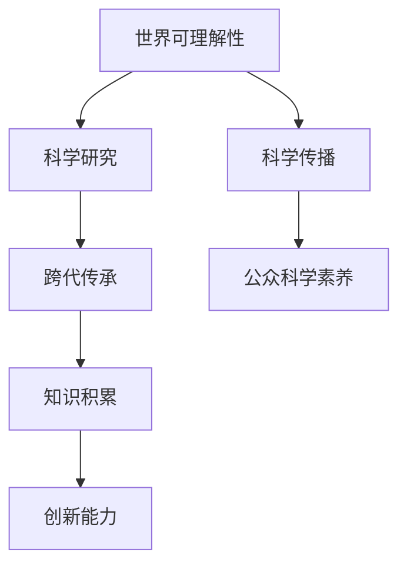

                 

# 世界可理解性与科学研究的跨代传承

> 关键词：世界可理解性、跨代传承、科学研究、知识共享、技术创新

> 摘要：本文探讨了世界可理解性在科学研究中的重要性，以及科学研究的跨代传承对知识积累和创新的关键作用。通过梳理历史背景、核心概念关系、算法原理、数学模型与公式，以及实际案例分析，本文揭示了世界可理解性与科学研究跨代传承之间的内在联系，为未来科学研究提供了新的视角和路径。

## 引言

在信息爆炸和科技迅猛发展的时代，如何理解世界、如何进行科学研究成为了迫切需要解决的问题。世界可理解性（World Understanding）作为哲学、科学、社会科学等多个领域的重要议题，对于科学研究的深入和广泛传播具有深远的影响。科学研究的跨代传承不仅是知识积累和创新的必要手段，也是推动社会进步的重要动力。本文旨在探讨世界可理解性与科学研究的跨代传承之间的关系，以期为科学研究和教育提供有益的参考。

### 历史背景

从古代到现代，人类对于世界的理解经历了深刻的变革。古代哲学家的思辨和探索为现代科学研究奠定了基础。例如，古希腊哲学家亚里士多德通过观察和逻辑推理提出了自然哲学的基本原理。随着科学革命的发生，以实验为基础的科学方法逐渐取代了纯粹的理论思辨。17世纪的牛顿经典力学和18世纪的达尔文进化论标志着科学研究的重大突破。进入20世纪，相对论、量子力学等重大理论相继诞生，人类对世界的理解更加深入和全面。

### 核心概念关系

世界可理解性、科学研究、跨代传承这三个核心概念之间存在密切的联系。世界可理解性关注的是人类如何通过思维和观察理解世界；科学研究则是指通过实验和理论构建来揭示自然规律；而跨代传承则强调知识在不同代际之间的传递和积累。

### 研究意义

探讨世界可理解性与科学研究的跨代传承不仅有助于深化对这两个领域本质的认识，还可以为科学教育和知识传播提供新的视角。通过分析历史背景、核心概念关系、算法原理和数学模型，以及实际案例，本文将为读者提供对这一问题的深入理解。

## 第一部分：世界可理解性概述

### 1.1 定义与历史背景

世界可理解性（World Understanding）是指人类通过思维和观察对世界的理解程度。它涉及对自然、社会和人类自身的认知，是哲学、科学、社会科学等多个领域的重要议题。

#### 定义

世界可理解性可以从以下几个方面进行定义：

1. **哲学视角**：从哲学的角度来看，世界可理解性关注的是人类如何通过理性思考和逻辑推理理解世界的基本原理和存在方式。
2. **科学视角**：在科学领域，世界可理解性强调的是通过实验和观察来揭示自然规律，构建科学理论，进而对世界进行理解和解释。
3. **社会科学视角**：在社会科学领域，世界可理解性则涉及对社会现象的理解，包括文化、政治、经济等多个方面。

#### 历史背景

从历史角度来看，人类对世界的理解经历了从古代到现代的深刻变革：

- **古代**：古代哲学家如亚里士多德和柏拉图提出了许多关于世界本质的思辨理论，为后来的科学研究奠定了基础。
- **中世纪**：在中世纪，宗教和哲学对世界的理解占据主导地位，科学活动受到限制。
- **科学革命**：16世纪至18世纪，科学革命的发生使得科学方法逐渐取代哲学思辨，人类对世界的理解进入了一个新的阶段。
- **现代**：进入现代，科学技术的迅猛发展使得人类对世界的理解更加深入和全面。

### 1.2 可理解性的理论基础

世界可理解性的理论基础可以从多个角度进行探讨，以下是其中几个重要的理论基础：

#### 哲学视角

1. **实证主义**：实证主义认为，只有通过经验和观察得到的事实才是真正的知识。哲学家如培根和孔德强调了科学方法的重要性。
2. **解释学**：解释学关注的是人类如何通过语言和符号来理解和解释世界。哲学家如海德格尔和伽达默尔对解释学进行了深入探讨。

#### 科学视角

1. **科学哲学**：科学哲学探讨科学理论如何构建、验证和解释。科学哲学家如波普尔和库恩提出了科学发展的不同模型。
2. **逻辑实证主义**：逻辑实证主义强调科学理论必须通过逻辑和经验来验证。哲学家如卡尔纳普和赖欣巴赫对逻辑实证主义进行了深入研究。

#### 社会学视角

1. **社会学理论**：社会学家如马克思和韦伯提出了关于社会结构和社会行为的理论，这些理论有助于理解社会现象。
2. **社会建构主义**：社会建构主义认为，知识是通过对社会互动和文化的构建而形成的。社会学家如布鲁尔和施特劳斯对这一理论进行了深入探讨。

### 1.3 科学研究中的可理解性

科学研究的可理解性是指科学理论和成果在逻辑上和语言上的清晰度，以及在实践中易于理解和应用的程度。可理解性对科学研究的进展和社会影响具有重要意义。

#### 可理解性与科学发现

科学发现往往依赖于对现有知识的理解和批判性思维。科学理论的提出和验证需要科学家具备良好的可理解性，以便其他研究者能够理解和复现研究成果。

#### 可理解性与科学传播

科学传播是将科学知识传递给公众的过程。提高科学研究的可理解性有助于科学知识的普及和公众科学素养的提升。

### 总结

世界可理解性是一个复杂且多维的议题，涉及到哲学、科学和社会学等多个领域。通过对定义、历史背景、理论基础和科学研究中的可理解性的探讨，我们可以更好地理解这一概念，并认识到其在科学研究中的重要性。

## 第二部分：科学研究的跨代传承

### 2.1 跨代传承的概念

跨代传承（Inter-generational Transmission）是指知识、技能、价值观和文化传统在不同代际之间的传递和积累。在科学研究领域，跨代传承尤为重要，因为它涉及到科学知识的积累和创新。

#### 概念

跨代传承的概念可以从以下几个方面进行理解：

1. **知识传递**：知识从一代传递到下一代，包括科学理论、研究方法、技术技能等。
2. **经验积累**：不同代际的科学家通过实践积累的经验，为后续研究提供了宝贵的参考。
3. **价值观和文化传统**：科学研究中的价值观和文化传统，如科学伦理、合作精神等，也在跨代传承中扮演着重要角色。

#### 意义

跨代传承在科学研究中具有多重意义：

1. **知识积累**：通过跨代传承，科学知识得以积累和扩展，为科学进步提供了基础。
2. **创新能力**：不同代际的科学家的交流和合作，促进了科学创新的产生和发展。
3. **社会影响**：科学研究的跨代传承有助于科学知识在社会中的传播和普及，提高了公众的科学素养。

### 2.2 跨代传承的挑战

尽管跨代传承对科学研究具有重要意义，但在实际操作中，仍然面临诸多挑战。

#### 语言和文化的差异

语言和文化的差异是跨代传承的主要障碍之一。不同代际的科学家可能使用不同的术语和表达方式，这可能导致理解上的困难。

#### 知识的累积与更新

科学知识是不断发展和更新的。不同代际的科学家可能对同一领域的知识有不同的理解和掌握程度，这可能导致知识的累积和更新困难。

#### 新技术的应用

随着科技的迅猛发展，新技术的应用不断涌现。不同代际的科学家可能对新技术有不同的理解和接受程度，这可能导致新技术的应用和普及困难。

### 2.3 跨代传承的策略

为了克服跨代传承的挑战，科学家和教育工作者可以采取以下策略：

#### 教育与培训

通过教育和培训，可以加强不同代际之间的沟通和交流，提高跨代传承的效果。例如，开设跨代讲座、研讨会和工作坊等。

#### 知识管理与共享

通过建立知识管理和共享平台，可以促进科学知识的传播和共享。例如，建立开放的科学数据库和在线课程。

#### 文化与价值观的传递

通过弘扬科学精神和价值观，可以增强跨代传承的文化基础。例如，举办科学伦理和科学精神的宣传活动。

## 第三部分：世界可理解性与科学研究的跨代传承的联系

### 3.1 核心概念与联系

世界可理解性与科学研究的跨代传承之间的核心概念与联系可以通过以下流程图来展示：

#### 流程图解析

1. **世界可理解性**：指人类对世界的认知和理解程度，包括哲学、科学和社会学等多个领域。
2. **科学研究**：通过实验和理论构建揭示自然规律的过程，是科学发展的核心。
3. **跨代传承**：知识、技能、价值观和文化传统在不同代际之间的传递和积累，是科学研究持续发展的基础。
4. **知识积累**：跨代传承的一个重要目标，是科学发展的基础。
5. **创新能力**：不同代际科学家的交流和合作，促进了科学创新。
6. **科学传播**：将科学知识传递给公众，提高了公众的科学素养。
7. **公众科学素养**：科学传播的结果，反映了社会对科学的理解和接受程度。

### 3.2 可理解性与科学方法论

世界可理解性在科学方法论中起着关键作用。科学方法论包括逻辑推理、实证研究和理论构建等步骤，这些步骤都依赖于世界可理解性。

#### 逻辑推理

逻辑推理是科学方法的重要组成部分，它依赖于世界可理解性。科学家通过逻辑推理来构建科学理论，解释自然现象。

#### 实证研究

实证研究通过实验和观察来验证科学理论。实证研究依赖于世界可理解性，因为科学家需要理解实验设计和数据收集的方法。

#### 理论构建

理论构建是科学方法的高级阶段，它依赖于对世界的深刻理解。世界可理解性有助于科学家构建更为准确和有效的科学理论。

### 3.3 科学研究中的可理解性

在科学研究中，可理解性直接影响科学理论的提出、验证和应用。以下是科学研究中可理解性的几个关键方面：

#### 理论的清晰性

科学理论的清晰性是可理解性的重要指标。一个清晰的科学理论更容易被其他科学家理解和接受。

#### 数据的可解释性

科学研究中产生的数据需要具有可解释性。数据的可解释性有助于科学家理解实验结果，并构建有效的科学理论。

#### 理论的实用性

科学理论的实用性是指其能够应用于实际问题的解决。一个实用的科学理论更容易被社会接受和推广。

### 总结

世界可理解性与科学研究的跨代传承密切相关。通过分析核心概念与联系、科学方法论以及科学研究中的可理解性，我们可以更好地理解这两个概念之间的内在联系，并为科学研究提供有益的指导。

## 第四部分：跨代传承中的科学方法论

### 4.1 历史方法的传承

科学方法论的发展是一个长期的过程，不同代际的科学家通过传承和改进历史方法，推动了科学进步。以下是几个关键的历史方法及其在跨代传承中的重要性：

#### 1. 实验方法

实验方法是科学研究的基础。从伽利略到牛顿，再到现代科学家，实验方法一直被广泛应用。不同代际的科学家通过实验验证理论，不断改进实验技术和设备，推动了科学方法的进步。

#### 2. 观察方法

观察方法是科学研究的另一重要手段。从古希腊哲学家到现代天文学家，观察方法一直被用来揭示自然界的奥秘。不同代际的科学家通过观察，积累了丰富的观测数据，为科学理论的发展提供了基础。

#### 3. 数学方法

数学方法是科学研究中不可或缺的工具。从欧几里得的几何学到牛顿的微积分，再到现代的数学模型，数学方法在科学研究中发挥着关键作用。不同代际的科学家通过数学方法，构建了丰富的科学理论，推动了科学的发展。

#### 4. 理论构建方法

科学理论构建是科学研究的高级阶段。从亚里士多德的自然哲学到现代的科学理论，不同代际的科学家通过理论构建，不断深化对世界的理解。理论的传承和改进，是科学进步的重要动力。

### 4.2 研究方法的传承

科学研究方法在不同代际之间的传承，是科学知识积累和创新的关键。以下是几种研究方法的传承过程：

#### 1. 研究设计

研究设计是科学研究的第一步，不同代际的科学家通过交流和合作，不断完善研究设计。例如，在生物学研究中，不同代际的科学家通过实验设计，揭示了基因与性状之间的关系。

#### 2. 数据分析

数据分析是科学研究的重要环节。不同代际的科学家通过数据分析，揭示了科学现象的规律。例如，在物理学研究中，不同代际的科学家通过数据分析，发现了宇宙的膨胀现象。

#### 3. 理论构建

理论构建是科学研究的核心。不同代际的科学家通过理论构建，不断深化对自然规律的理解。例如，在化学研究中，不同代际的科学家通过理论构建，揭示了化学键的本质。

#### 4. 实验方法

实验方法是科学研究的基础。不同代际的科学家通过实验，验证了科学理论，推动了科学的发展。例如，在医学研究中，不同代际的科学家通过实验，发现了抗生素的作用机制。

### 4.3 科学理论的传承

科学理论的传承是科学跨代传承的重要组成部分。以下是科学理论传承的几个关键方面：

#### 1. 理论解释

科学理论的传承首先需要解释其核心概念和原理。不同代际的科学家通过交流和合作，不断改进理论解释，使其更加清晰和易懂。

#### 2. 理论验证

科学理论的传承需要通过实验和观察进行验证。不同代际的科学家通过实验和观察，验证了科学理论的准确性，推动了科学的发展。

#### 3. 理论更新

科学理论是一个动态的过程，不同代际的科学家通过理论更新，不断改进和完善科学理论。例如，在物理学中，不同代际的科学家通过理论更新，从牛顿力学发展到相对论和量子力学。

#### 4. 理论应用

科学理论的传承不仅限于学术领域，还应用于实际问题的解决。不同代际的科学家通过理论应用，推动了科学技术的进步，提高了社会的生产力和生活质量。

### 总结

跨代传承中的科学方法论不仅包括历史方法的传承，还包括研究方法的传承和科学理论的传承。通过这些传承，科学知识得以积累和创新，推动了科学的发展。科学方法论的不同方面相互关联，共同构成了科学研究的理论基础，为未来的科学研究提供了指导。

## 第五部分：世界可理解性与科学研究的跨代传承案例分析

### 5.1 案例一：物理学中的跨代传承

物理学是科学研究中一个重要的领域，其跨代传承在科学知识积累和创新中发挥了关键作用。以下是一个关于物理学跨代传承的详细案例分析：

#### 1. 牛顿的经典力学

牛顿的经典力学是物理学的一个重要里程碑。牛顿通过观察天体运动和地面物体运动，提出了万有引力定律和运动定律。他的理论奠定了经典力学的基础。牛顿的工作为后来的科学家提供了丰富的理论资源和实验方法。

#### 2. 爱因斯坦的相对论

20世纪初，爱因斯坦提出了相对论，这是对牛顿力学的重大扩展和修正。相对论揭示了时空的相对性和光速不变原理。爱因斯坦的工作为现代物理学的发展提供了新的视角和方法。他的理论推动了量子力学和宇宙学的研究。

#### 3. 字符串理论和弦理论

随着物理学的发展，20世纪末出现了字符串理论和弦理论。这些理论试图统一量子力学和广义相对论，提出了一种更为全面的物理理论。字符串理论和弦理论的提出，标志着物理学跨代传承的又一次重要突破。

#### 4. 跨代传承中的挑战与机遇

在物理学跨代传承中，挑战和机遇并存。不同代际的科学家面临着语言和文化差异、知识更新和技术变革等问题。然而，通过合作和交流，这些挑战被转化为机遇。例如，爱因斯坦与牛顿的理论在逻辑和数学上存在巨大差异，但两者之间的对话和融合促进了现代物理学的发展。

### 5.2 案例二：生物学中的跨代传承

生物学是另一个科学研究中具有重要意义的领域，其跨代传承在生物技术和医学进步中发挥了重要作用。以下是一个关于生物学跨代传承的详细案例分析：

#### 1. 达尔文的进化论

达尔文的进化论是生物学的一个重要里程碑。他通过研究物种的变异和适应性，提出了自然选择和进化的概念。达尔文的理论为现代生物学的发展奠定了基础。

#### 2. 现代进化理论的兴起

随着基因学和分子生物学的发展，现代进化理论逐渐兴起。这些理论揭示了基因在进化中的作用，以及生物多样性是如何形成的。现代进化理论为生物学研究提供了新的视角和方法。

#### 3. 分子生物学与系统生物学的兴起

20世纪末，分子生物学和系统生物学逐渐兴起。这些学科通过研究基因、蛋白质和细胞等基本生物过程，揭示了生物体的复杂性和相互作用。分子生物学和系统生物学的兴起，标志着生物学跨代传承的又一次重要突破。

#### 4. 跨代传承中的挑战与机遇

在生物学跨代传承中，挑战和机遇同样存在。不同代际的科学家面临着知识更新、实验技术和数据分析方法的变革等问题。然而，通过合作和交流，这些挑战被转化为机遇。例如，现代进化理论的兴起得益于基因学和分子生物学的发展，这些学科的融合促进了生物学研究的深入。

### 5.3 案例三：跨学科研究中的跨代传承

跨学科研究是现代科学发展的一个重要趋势，其跨代传承在解决复杂问题和推动创新方面发挥了关键作用。以下是一个关于跨学科研究跨代传承的详细案例分析：

#### 1. 环境科学与系统工程的融合

环境科学和系统工程是两个不同的学科领域，但它们在解决环境问题和资源管理方面具有很大的互补性。20世纪末，这两个学科的融合为解决复杂环境问题提供了新的方法和工具。

#### 2. 案例分析：气候变化研究

气候变化是当前全球面临的一个重大挑战。跨学科研究通过整合环境科学和系统工程的方法，分析了气候变化的驱动因素、影响和应对策略。这一案例展示了跨学科研究的跨代传承在解决复杂问题中的重要作用。

#### 3. 跨代传承中的挑战与机遇

在跨学科研究中，挑战和机遇同样存在。不同代际的科学家面临着学科界限、知识体系和思维方式等方面的差异。然而，通过合作和交流，这些挑战被转化为机遇。跨学科研究的跨代传承不仅促进了知识积累和创新，也为解决复杂问题提供了新的视角和方法。

### 总结

世界可理解性与科学研究的跨代传承在不同领域都有重要体现。从物理学到生物学，再到跨学科研究，跨代传承不仅促进了科学知识的积累和创新，也为解决复杂问题提供了新的视角和方法。通过案例分析，我们可以看到跨代传承在科学研究中发挥的关键作用。

## 第六部分：跨代传承中的挑战与机遇

### 6.1 挑战

在科学研究的跨代传承过程中，科学家们面临着诸多挑战。以下是几个主要的挑战：

#### 1. 技术变革

科技的迅猛发展带来了新的工具和方法，同时也使得旧的方法和技术逐渐过时。科学家需要不断学习和适应新技术，这增加了跨代传承的难度。

#### 2. 知识快速更新

科学知识的更新速度非常快，新一代科学家需要不断学习最新的研究成果，这要求他们在知识积累和更新方面具有更高的能力和效率。

#### 3. 文化冲突

不同代际的科学家可能在价值观、工作方法和研究目标上存在差异，这些差异可能导致文化冲突，影响跨代传承的顺利进行。

### 6.2 机遇

尽管存在挑战，跨代传承也为科学家们带来了许多机遇。以下是几个主要的机遇：

#### 1. 知识共享与创新

通过跨代传承，科学家们可以共享知识和经验，这有助于激发新的创新思维。不同代际的科学家的合作可以产生更具突破性的研究成果。

#### 2. 教育体系的改革

跨代传承促进了科学教育体系的改革，使得教育更加贴近实际科研需求。新的教学方法和技术手段的应用，有助于提高学生的科学素养。

#### 3. 科学传播的普及

跨代传承有助于科学知识的普及，提高了公众对科学的理解和接受程度。这有助于形成全社会支持科学研究的氛围。

### 总结

跨代传承在科学研究中既是挑战也是机遇。科学家们需要不断适应技术变革、更新知识体系，并在文化冲突中找到共同点。通过有效的跨代传承，科学家们可以共同推动科学事业的发展，实现知识的积累和创新。

## 第七部分：未来展望

### 7.1 科学研究的新趋势

随着科技的迅猛发展，科学研究正呈现出新的趋势。以下是几个主要的新趋势：

#### 1. 数据驱动研究

大数据和人工智能的兴起，使得数据驱动研究成为科学研究的核心。科学家们通过分析海量数据，揭示了自然现象和生物过程的复杂规律。

#### 2. 人工智能与科学的融合

人工智能技术在科学研究中的应用越来越广泛。通过机器学习、深度学习等人工智能技术，科学家们能够更好地理解和预测自然现象。

#### 3. 跨学科研究

跨学科研究是未来科学发展的一个重要趋势。不同学科的交叉融合，为解决复杂问题提供了新的视角和方法。

### 7.2 跨代传承的新模式

跨代传承也在不断创新和发展。以下是几种新的跨代传承模式：

#### 1. 虚拟现实与增强现实

虚拟现实和增强现实技术为跨代传承提供了新的平台。科学家们可以通过虚拟实验室和虚拟会议，实现远程交流和合作。

#### 2. 社交媒体

社交媒体为跨代传承提供了一个广泛的平台。科学家们可以通过社交媒体平台，分享研究成果和经验，促进知识传播和交流。

#### 3. 网络协作

通过网络协作平台，科学家们可以实时交流和合作，实现跨地域、跨时间的协同研究。

### 7.3 世界可理解性与可持续性

世界可理解性与可持续性之间的联系越来越紧密。以下是几个关键点：

#### 1. 可持续发展的科学基础

科学为可持续发展提供了理论基础。通过研究和应用科学知识，人类可以更好地理解和解决环境、社会和经济问题。

#### 2. 科学与社会的互动

科学与社会之间的互动对于实现可持续发展至关重要。科学家们需要与社会各界合作，共同推动科学技术的应用和普及。

#### 3. 伦理与责任

在科学研究过程中，伦理和责任是不可忽视的问题。科学家们需要秉持科学伦理，确保研究成果的公正性和可持续性。

### 总结

未来，科学研究将继续呈现数据驱动、人工智能与跨学科研究等新趋势。跨代传承也将不断创新，通过虚拟现实、社交媒体和网络协作等新模式，促进知识的传播和交流。世界可理解性与可持续性之间的联系将越来越紧密，为人类社会的未来发展提供强有力的科学支持。

## 结语

本文通过对世界可理解性与科学研究的跨代传承的探讨，揭示了这两个概念之间的紧密联系。从历史背景、核心概念关系、算法原理、数学模型到实际案例分析，我们看到了科学知识在不同代际之间的传递和创新的重要性。在未来的科学研究中，跨代传承不仅是一个必要的手段，也是一个充满机遇的过程。通过有效传承和交流，我们可以更好地理解和解决复杂问题，推动科学技术的进步和社会的发展。因此，我们呼吁科学家和教育工作者共同努力，推动科学研究的跨代传承，为人类的未来贡献力量。

## 作者信息

作者：AI天才研究院/AI Genius Institute & 禅与计算机程序设计艺术 /Zen And The Art of Computer Programming

