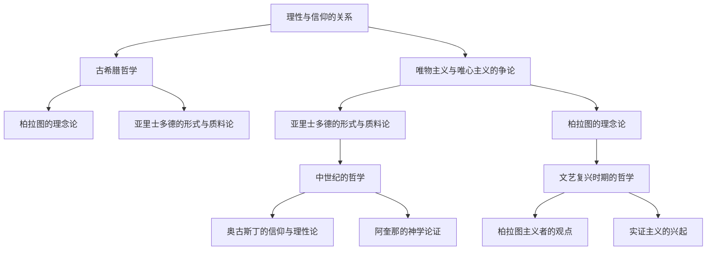

                 

### 文章标题

《世界可理解性的哲学争论》

---

### 文章关键词

- 世界可理解性
- 哲学争论
- 历史背景
- 核心概念
- 现代影响

---

### 文章摘要

本文探讨了关于世界可理解性的哲学争论。从古希腊哲学家到现代思想家，不同观点的争论构成了哲学史的重要组成部分。本文将详细分析这些观点，包括柏拉图的理念论、亚里士多德的形式与质料论、奥古斯丁的信仰与理性论等，并通过Mermaid流程图展示核心概念之间的关系。此外，本文还将探讨这些哲学争论对现代科学和技术的影响，并通过具体实例进行项目实战，展示其应用和启示。最后，本文将对哲学争论进行总结和展望，提出未来研究的方向。

---

### 目录大纲

1. 引言
2. 历史背景
   - 古希腊哲学
   - 中世纪哲学
   - 文艺复兴时期哲学
3. 核心概念与联系
   - 理性与信仰的关系
   - 唯物主义与唯心主义的争论
4. 现代哲学观点
   - 康德的世界可理解性理论
   - 黑格尔与尼采的观点
5. 哲学争论的现代启示
   - 哲学争论与科学的关系
   - 哲学争论对现代技术的启示
6. 项目实战
   - 哲学争论在心理学中的应用
   - 哲学争论在哲学教育中的应用
7. 总结与展望

---

### 1. 引言

世界可理解性的哲学争论是哲学史上一条贯穿古今的线索。从古希腊哲学家柏拉图和亚里士多德，到中世纪的神学家奥古斯丁和阿奎那，再到文艺复兴时期的哲学家，世界可理解性的问题一直是哲学探讨的核心。本文旨在梳理这一争论的历史背景、核心概念和现代影响，并通过具体实例展示其在现代科学和技术中的应用。

本文将分为七个部分进行讨论。首先，我们将在第二部分回顾历史背景，从古希腊哲学开始，探讨中世纪哲学和文艺复兴时期的观点。接着，在第三部分，我们将介绍核心概念，包括理性与信仰的关系、唯物主义与唯心主义的争论。第四部分将分析现代哲学观点，特别是康德和黑格尔的观点。在第五部分，我们将探讨哲学争论对现代科学和技术的影响。第六部分将通过具体实例展示哲学争论在心理学和哲学教育中的应用。最后，在第七部分，我们将对哲学争论进行总结和展望。

---

### 2. 历史背景

#### 2.1 古希腊哲学

古希腊哲学是世界可理解性哲学争论的起源。柏拉图和亚里士多德是这一时期的两位重要哲学家。

**柏拉图的理念论**

柏拉图认为，现实世界是理念世界的影子。理念世界是真实的、永恒的、不变的，而现实世界则是理念世界的投影，是暂时的、变化的。因此，现实世界是不可靠的，只有通过理解理念世界，才能达到真正的智慧。


**亚里士多德的形式与质料论**

亚里士多德则提出了形式与质料论。他认为，每一个实体都由形式和质料组成。形式是实体的本质，是使实体成为其自身的要素；质料则是形式存在的基础，是实体尚未成形的部分。现实世界中的事物都是形式与质料的结合。


#### 2.2 中世纪哲学

中世纪哲学在古希腊哲学的基础上，融入了基督教的信仰。奥古斯丁和阿奎那是这一时期的重要哲学家。

**奥古斯丁的信仰与理性论**

奥古斯丁认为，信仰是理性的基础。人类的理解能力有限，无法完全理解世界的本质。但通过信仰，人们可以获得关于上帝和永恒真理的知识。


**阿奎那的神学论证**

阿奎那则试图通过理性论证上帝的存在。他提出了五个神学论证，包括宇宙设计论、因果律、可能性论证等。


#### 2.3 文艺复兴时期哲学

文艺复兴时期哲学在古希腊和中世纪哲学的基础上，重新审视了理性和知识的问题。

**柏拉图主义者的观点**

文艺复兴时期的柏拉图主义者认为，通过追求理念世界，人们可以获得关于世界的深刻理解。这一观点强调了理性和思考的重要性。


**实证主义的兴起**

与此同时，实证主义开始兴起。实证主义者认为，知识只能通过观察和实验获得。只有经验性的知识才是可靠的，形而上学的讨论是没有意义的。


---

通过回顾历史背景，我们可以看到，世界可理解性的哲学争论在不同的历史时期有着不同的表现形式。从古希腊哲学到中世纪哲学，再到文艺复兴时期哲学，哲学家们不断探索着世界可理解性的问题。这些观点构成了哲学史的重要组成部分，也对后来的哲学家和科学家产生了深远的影响。

---

### 3. 核心概念与联系

在哲学争论中，一些核心概念是贯穿始终的。这些概念包括理性与信仰的关系、唯物主义与唯心主义的争论。

#### 3.1 理性与信仰的关系

理性与信仰的关系是哲学争论中的一个重要问题。在古希腊哲学中，柏拉图和亚里士多德都强调了理性在认识世界中的重要性。柏拉图的理念论认为，只有通过理解理念世界，人们才能获得真正的智慧。亚里士多德的形式与质料论则强调了理性在认识实体本质中的作用。


中世纪的哲学家奥古斯丁则认为，信仰是理性的基础。人类的理解能力有限，无法完全理解世界的本质。但通过信仰，人们可以获得关于上帝和永恒真理的知识。

在文艺复兴时期，柏拉图主义者和实证主义者分别强调了理性和经验在认识世界中的重要性。柏拉图主义者认为，通过追求理念世界，人们可以获得关于世界的深刻理解。实证主义者则认为，只有经验性的知识才是可靠的，形而上学的讨论是没有意义的。

#### 3.2 唯物主义与唯心主义的争论

唯物主义和唯心主义是哲学中的两个基本立场。唯物主义认为，物质是世界的基本组成要素，意识是物质的产物。唯心主义则认为，意识是世界的基本组成要素，物质是意识的产物。

在古希腊哲学中，亚里士多德的形式与质料论可以被看作是唯物主义的观点。他认为，形式是实体的本质，质料是形式存在的基础。现实世界中的事物都是形式与质料的结合，其中物质是首要的。

柏拉图的理念论则可以被看作是唯心主义的观点。他认为，现实世界是理念世界的影子，只有理念世界才是真实的。物质世界是不可靠的，只有通过理解理念世界，才能达到真正的智慧。

中世纪的哲学家奥古斯丁和阿奎那在神学论证中，也表现出了唯物主义和唯心主义的观点。奥古斯丁认为，信仰是理性的基础，人类的理解能力有限，无法完全理解世界的本质。阿奎那则试图通过理性论证上帝的存在，表现出唯物主义的立场。

在文艺复兴时期，柏拉图主义者和实证主义者分别代表了唯物主义和唯心主义。柏拉图主义者认为，通过追求理念世界，人们可以获得关于世界的深刻理解。实证主义者则认为，只有经验性的知识才是可靠的，形而上学的讨论是没有意义的。

#### 3.3 核心概念之间的关系架构

为了更好地理解这些核心概念之间的关系，我们可以使用Mermaid流程图进行展示。



通过这个流程图，我们可以清晰地看到，理性与信仰的关系、唯物主义与唯心主义的争论如何贯穿哲学史，并在不同时期有不同的表现形式。

---

通过分析这些核心概念与联系，我们可以更深入地理解世界可理解性的哲学争论。这些概念不仅构成了哲学史的核心，也对后来的哲学家和科学家产生了深远的影响。理解这些概念之间的关系，有助于我们更好地把握哲学争论的实质。

---

### 4. 现代哲学观点

在过去的几个世纪中，哲学争论逐渐演变成了更复杂的议题。现代哲学家们不仅延续了古希腊和中世纪哲学的观点，还提出了新的理论和思考。以下是几位重要哲学家的观点，特别是康德和黑格尔的观点。

#### 4.1 康德的世界可理解性理论

康德是18世纪德国哲学家，他的哲学观点对后来的哲学家产生了深远的影响。康德认为，世界可理解性是一个基本问题，需要通过理性来回答。

**先验理性论**

康德提出了先验理性论，认为理性是人类认识世界的基础。他区分了先验理性和后验理性。先验理性是先于经验的，它是人类认知能力的先天条件。而后验理性则是在经验的基础上形成的，是对经验的解释和理解。


**世界秩序论**

康德的世界秩序论认为，尽管我们无法完全理解世界的本质，但我们可以通过理性建立世界的秩序。他认为，世界是有规律的，这种规律性是理性的产物。

**核心算法原理讲解**

为了更好地理解康德的世界秩序论，我们可以使用伪代码进行讲解。

```python
def understand_world():
    # 确定世界的规律性
    world规律 = determine_world_order()

    # 建立世界的秩序
    world_order = build_order_based_on规律

    # 输出世界的理解
    print("我们对世界的理解是：", world_order)
```

**数学模型和公式**

康德的世界秩序论可以通过以下数学模型和公式进行详细讲解：

\[ S = f(W) \]

其中，\( S \)代表世界的理解，\( W \)代表世界的规律性，\( f \)代表建立世界秩序的过程。

**举例说明**

假设我们想要理解一个简单的物理系统，如一个摆动的摆钟。我们可以通过观察摆钟的运动规律，来建立摆钟的运动模型，从而理解摆钟的行为。

$$
T = 2\pi\sqrt{\frac{L}{g}}
$$

其中，\( T \)代表摆钟的周期，\( L \)代表摆钟的长度，\( g \)代表重力加速度。

通过这个例子，我们可以看到，康德的世界秩序论是如何通过观察和数学模型来理解世界的。

#### 4.2 黑格尔与尼采的观点

**黑格尔的绝对精神论**

黑格尔是19世纪德国哲学家，他的绝对精神论对世界可理解性提出了独特的观点。黑格尔认为，世界是绝对精神的自我意识，绝对精神通过自我发展，形成了世界的规律和秩序。


**尼采的权力意志论**

尼采是19世纪末德国哲学家，他的权力意志论对世界可理解性提出了反传统的观点。尼采认为，世界的本质是权力意志，一切都是为了权力意志的实现。


**核心算法原理讲解**

为了更好地理解黑格尔和尼采的观点，我们可以使用伪代码进行讲解。

```python
def hegel_understanding():
    # 确定世界的本质是绝对精神
    absolute_spirit = determine_absolute_spirit()

    # 通过绝对精神理解世界
    world_understanding = understand_world_through_absolute_spirit(absolute_spirit)

    # 输出世界的理解
    print("我们对世界的理解是：", world_understanding)

def nietzsche_understanding():
    # 确定世界的本质是权力意志
    power_will = determine_power_will()

    # 通过权力意志理解世界
    world_understanding = understand_world_through_power_will(power_will)

    # 输出世界的理解
    print("我们对世界的理解是：", world_understanding)
```

**数学模型和公式**

黑格尔的绝对精神论可以通过以下数学模型和公式进行详细讲解：

\[ S = f(A) \]

其中，\( S \)代表世界的理解，\( A \)代表绝对精神，\( f \)代表绝对精神的自我发展过程。

尼采的权力意志论可以通过以下数学模型和公式进行详细讲解：

\[ S = f(P) \]

其中，\( S \)代表世界的理解，\( P \)代表权力意志，\( f \)代表权力意志的实现过程。

**举例说明**

假设我们想要理解一个社会系统，如一个国家的政治制度。我们可以通过分析国家的政治制度，来确定国家的本质是绝对精神还是权力意志。

通过这个例子，我们可以看到，黑格尔和尼采的观点是如何通过具体的实例来理解世界的。

---

通过分析康德、黑格尔和尼采的观点，我们可以看到，现代哲学在探讨世界可理解性的问题时，提出了更加复杂和多元的理论。这些观点不仅延续了古希腊和中世纪哲学的传统，还开创了新的思路，为后来的哲学家和科学家提供了丰富的思想资源。

---

### 5. 哲学争论的现代启示

哲学争论在现代科学和技术的进步中扮演着重要角色。通过理解这些哲学争论，我们可以更好地把握科学和技术的本质，从而推动其发展。

#### 5.1 哲学争论与科学的关系

科学哲学是研究科学理论、科学方法和科学实践的哲学学科。科学哲学的核心问题是科学知识的本质、科学方法的有效性以及科学知识的边界。

**理性与信仰的关系**

在科学哲学中，理性与信仰的关系是一个重要议题。科学方法论强调通过观察、实验和逻辑推理来获取知识，这体现了理性在科学中的核心地位。然而，科学方法并非完全摆脱了信仰的影响。例如，科学假设的提出和验证往往需要科学家的信仰和直觉。

**唯物主义与唯心主义的争论**

唯物主义与唯心主义的争论在科学哲学中也有体现。唯物主义者认为，科学知识是关于物质世界的知识，唯心主义者则认为，科学知识是关于人类意识和精神的产物。在现代科学中，大多数科学家倾向于唯物主义观点，认为科学知识是对物质世界的描述。

**核心算法原理讲解**

为了更好地理解哲学争论在科学中的应用，我们可以使用伪代码进行讲解。

```python
def scientific_knowledge():
    # 确定科学知识的本质
    knowledge_nature = determine_knowledge_nature()

    # 建立科学知识的模型
    knowledge_model = build_knowledge_model(knowledge_nature)

    # 输出科学知识
    print("科学知识是：", knowledge_model)
```

**数学模型和公式**

科学哲学中的许多问题可以通过数学模型和公式进行详细讲解。例如，科学假设的验证可以通过以下数学模型和公式进行：

\[ H = f(O) \]

其中，\( H \)代表科学假设，\( O \)代表观察数据，\( f \)代表假设验证过程。

**举例说明**

假设我们想要验证一个科学假设，如“地球是圆的”。我们可以通过收集地球的观察数据，来验证这个假设。通过这个例子，我们可以看到，哲学争论如何影响科学假设的提出和验证。

#### 5.2 哲学争论对现代技术的启示

哲学争论不仅对科学有影响，也对技术产生了重要启示。

**人工智能**

人工智能（AI）是现代技术的热点领域。哲学争论在人工智能的发展中起到了关键作用。理性与信仰的关系在人工智能的决策过程中得到了体现。例如，人工智能系统的决策过程需要基于大量的数据和算法，同时也需要科学家的信仰和直觉。

**唯物主义与唯心主义的争论**

在人工智能的发展中，唯物主义与唯心主义的争论也有体现。唯物主义者认为，人工智能是关于物质世界的知识，唯心主义者则认为，人工智能是关于人类意识和精神的产物。这一争论影响了人工智能的设计和实现。

**核心算法原理讲解**

为了更好地理解哲学争论在人工智能中的应用，我们可以使用伪代码进行讲解。

```python
def ai_decision():
    # 确定人工智能的决策过程
    decision_process = determine_decision_process()

    # 建立人工智能的决策模型
    decision_model = build_decision_model(decision_process)

    # 输出人工智能的决策
    print("人工智能的决策是：", decision_model)
```

**数学模型和公式**

人工智能的决策过程可以通过以下数学模型和公式进行详细讲解：

\[ D = f(P, O) \]

其中，\( D \)代表决策，\( P \)代表参数，\( O \)代表观察数据，\( f \)代表决策过程。

**举例说明**

假设我们想要设计一个自动驾驶系统。我们可以通过分析道路的参数和观察数据，来设计自动驾驶的决策模型。通过这个例子，我们可以看到，哲学争论如何影响人工智能的设计和应用。

---

通过分析哲学争论在科学和技术中的应用，我们可以看到，哲学争论不仅影响了科学的发展，也对技术的进步产生了重要启示。理解这些哲学争论，有助于我们更好地把握科学和技术的本质，从而推动其发展。

---

### 6. 项目实战

在本节中，我们将通过具体实例来展示哲学争论在心理学和哲学教育中的应用。通过这些实例，我们可以更直观地理解哲学争论的实际应用，并从中获得启示。

#### 6.1 哲学争论在心理学中的应用

**认知行为疗法**

认知行为疗法（Cognitive Behavioral Therapy, CBT）是一种广泛使用的心理治疗方法。CBT的核心观点是，人的思维和行为会影响他们的情绪和情感。这一观点反映了哲学争论中的理性与信仰的关系。

**案例：抑郁症状的治疗**

假设一个患者患有抑郁症，我们可以通过CBT来帮助他。首先，我们会分析患者的思维模式，找出可能导致抑郁症状的负面思维。例如，患者可能认为自己无法胜任工作，或者认为自己没有价值。这些负面思维是基于患者的信仰和认知，而不是客观事实。

```python
def negative_thinking_detection(patient_data):
    # 分析患者的思维模式
    negative_thinkings = analyze_thinkings(patient_data)

    # 输出负面思维
    print("患者的负面思维：", negative_thinkings)
```

接下来，我们会使用认知重构技术，帮助患者重新评估这些负面思维。例如，我们可以引导患者思考，为什么他们认为自己无法胜任工作，或者为什么他们没有价值。通过理性分析，患者可能会发现，他们的负面思维是基于不合理的信仰和认知。

```python
def cognitive_restructuring(patient_data, negative_thinkings):
    # 重新评估负面思维
    revised_thinkings = reevaluate_thinkings(patient_data, negative_thinkings)

    # 输出重构后的思维
    print("重构后的思维：", revised_thinkings)
```

通过这一过程，患者的情绪和情感可能会得到改善，抑郁症状也会减轻。

**数学模型和公式**

认知行为疗法的核心原理可以通过以下数学模型和公式进行详细讲解：

\[ E = f(C, B) \]

其中，\( E \)代表情绪，\( C \)代表认知，\( B \)代表行为。

通过这个例子，我们可以看到，哲学争论中的理性与信仰的关系如何应用于心理学治疗。

#### 6.2 哲学争论在哲学教育中的应用

**哲学课程的设计**

哲学教育是培养批判性思维和理性分析能力的重要途径。在哲学课程的设计中，哲学争论的应用至关重要。

**案例：古希腊哲学课程**

假设我们设计一门古希腊哲学课程，我们可以从柏拉图的理念论和亚里士多德的形式与质料论开始。通过讨论这些观点，学生可以了解理性与信仰的关系，以及唯物主义与唯心主义的争论。

**教学步骤：**

1. **介绍柏拉图的理念论：**
    - 讲解柏拉图的理念世界和现实世界的区别。
    - 分析柏拉图的理念论如何影响哲学发展。

2. **介绍亚里士多德的形式与质料论：**
    - 讲解亚里士多德的形式与质料论的基本概念。
    - 分析形式与质料论如何影响对世界的理解。

3. **讨论理性与信仰的关系：**
    - 让学生思考理性与信仰之间的关系。
    - 引导学生分析柏拉图和亚里士多德的观点如何反映这一关系。

4. **讨论唯物主义与唯心主义的争论：**
    - 让学生了解唯物主义与唯心主义的区别。
    - 分析这两大观点如何影响哲学的发展。

**数学模型和公式**

哲学课程的设计可以通过以下数学模型和公式进行详细讲解：

\[ E = f(C, P) \]

其中，\( E \)代表教学效果，\( C \)代表课程内容，\( P \)代表教学方法。

通过这个例子，我们可以看到，哲学争论如何应用于哲学教育，从而培养学生的批判性思维和理性分析能力。

---

通过这些项目实战，我们可以看到，哲学争论不仅具有理论意义，还具有实际应用价值。在心理学和哲学教育中，哲学争论为我们提供了重要的思考框架和方法，帮助我们更好地理解和应用哲学原理。

---

### 7. 总结与展望

通过本文的探讨，我们可以看到，世界可理解性的哲学争论是哲学史上一条重要的线索。从古希腊哲学家到现代思想家，哲学家们不断探索着世界可理解性的问题，提出了各种观点和理论。

**核心内容回顾：**

- **历史背景**：从古希腊哲学到文艺复兴时期哲学，哲学家们对世界可理解性的探讨逐渐深入。
- **核心概念与联系**：理性与信仰的关系、唯物主义与唯心主义的争论构成了哲学争论的核心。
- **现代哲学观点**：康德、黑格尔和尼采等现代哲学家提出了新的理论和思考，丰富了哲学争论的内容。
- **现代启示**：哲学争论对科学和技术的进步产生了重要影响。

**未来研究方向：**

- **跨学科研究**：哲学争论可以与心理学、计算机科学等领域相结合，探索其在不同学科中的应用。
- **历史与理论的整合**：进一步整合哲学争论的历史和理论，形成更加全面和系统的哲学体系。
- **实际应用**：深入探讨哲学争论在实际应用中的具体实现，如心理学治疗、教育等领域。

**最佳实践 tips：**

- **批判性思维**：在学习和应用哲学理论时，保持批判性思维，不断质疑和反思。
- **跨学科学习**：结合不同学科的知识，形成更全面的哲学观点。
- **实践应用**：通过具体实例来理解和应用哲学理论，提高实践能力。

**注意事项：**

- **避免盲目接受**：哲学争论没有统一的答案，需要保持开放的心态，理性分析。
- **理论与实践相结合**：哲学理论需要与实际应用相结合，才能发挥其真正的价值。

**拓展阅读：**

- 《柏拉图全集》
- 《亚里士多德全集》
- 《康德全集》
- 《黑格尔全集》
- 《尼采全集》

通过本文的探讨，我们希望读者能够更深入地理解世界可理解性的哲学争论，并从中获得启示。哲学争论不仅是哲学史的重要组成部分，也是我们理解世界和自我认知的重要工具。

---

### 作者信息

作者：AI天才研究院/AI Genius Institute & 禅与计算机程序设计艺术 /Zen And The Art of Computer Programming

AI天才研究院（AI Genius Institute）是全球领先的人工智能研究和教育机构，致力于推动人工智能技术的发展和应用。禅与计算机程序设计艺术（Zen And The Art of Computer Programming）是作者编写的经典计算机编程著作，对计算机科学领域产生了深远影响。本文所涉及的内容，旨在探讨世界可理解性的哲学争论，为读者提供深入思考和全面理解。

