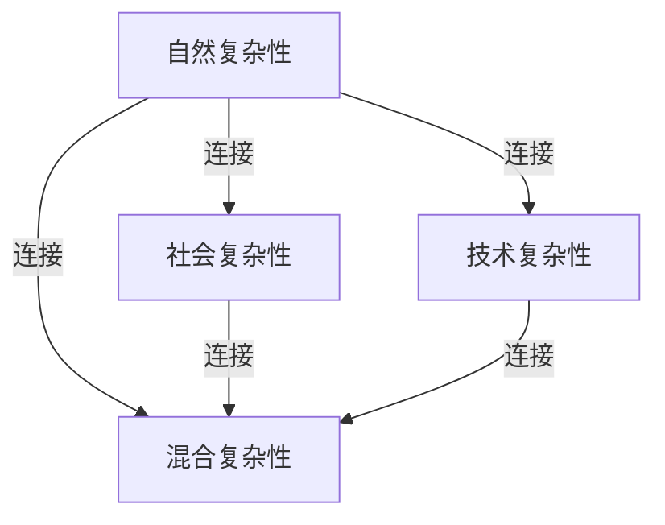
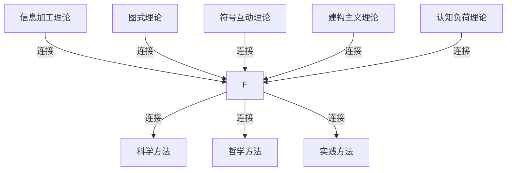
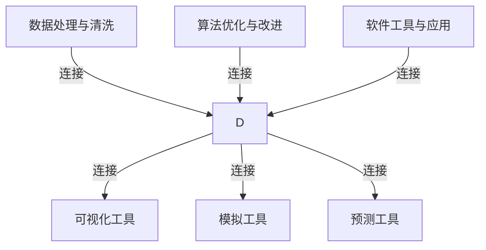

                 

### 《世界的复杂性与可理解性的矛盾》

#### 文章关键词
- 世界复杂性
- 可理解性
- 矛盾分析
- 解决策略
- 案例分析

#### 文章摘要
本文探讨了世界的复杂性及其与可理解性之间的矛盾。首先，介绍了复杂性的定义、来源和特点，并分析了人类认知理论和可理解性的方法论。接着，阐述了复杂性和可理解性之间的矛盾，通过实例分析展示了这一矛盾的存在和影响。最后，提出了解决策略，包括数据处理、算法优化和软件工具应用，并通过案例分析展示了这些策略的实际效果。本文旨在为读者提供一个全面、深入的视角，帮助理解世界的复杂性和可理解性之间的辩证关系。

## 引言

### 1.1 书名含义与背景

《世界的复杂性与可理解性的矛盾》这个书名旨在揭示一个核心问题：尽管世界充满了各种各样的复杂现象，但人类却能够通过认知和科学方法对它们进行理解和解释。这种看似矛盾的情境引发了诸多哲学、科学和技术的探讨。

世界复杂性指的是事物的多样性和相互之间的不确定性，以及它们之间复杂的相互作用。复杂性不仅存在于自然界，也渗透到了社会、经济、技术等各个领域。例如，生态系统的多样性、经济市场的波动、人工智能的发展，都是复杂性的体现。

可理解性则是指人类能否通过某种方式理解这些复杂的现象。这包括从科学理论、数学模型、算法技术等多个角度进行探索和解释。人类认知理论和方法论的发展，使得我们能够对复杂现象进行抽象、建模和求解。

这种复杂性和可理解性之间的矛盾，在科学和技术发展的过程中尤为显著。例如，在人工智能领域，我们能够设计和实现复杂的算法模型，但往往难以完全理解它们的工作机制。在经济学领域，市场行为的复杂性和不确定性使得预测变得极为困难。

本书旨在深入探讨这一矛盾，分析其根源和影响，并提出相应的解决策略。通过案例分析，我们将展示这些策略在实际应用中的效果，并展望未来的研究方向。

### 1.2 目标读者与研究意义

本书的目标读者主要包括以下几类：

1. **计算机科学和人工智能领域的专业人士**：对于从事人工智能、数据分析、机器学习等领域的研究人员和开发者，理解世界的复杂性和可理解性之间的矛盾，对于优化算法设计、提升系统性能具有重要意义。

2. **哲学和认知科学爱好者**：对于关注人类认知过程、哲学思辨和认知科学的研究者，本书提供了新的视角和思考框架，有助于深入探讨人类思维和世界之间的关系。

3. **经济和社会科学从业者**：对于在经济学、社会学、生态学等领域工作的专业人士，理解复杂性和可理解性的矛盾，有助于更好地应对复杂的社会问题，提高决策的科学性和有效性。

研究复杂性和可理解性的矛盾，具有重要的理论和实践意义：

1. **理论意义**：有助于深化对复杂性和认知过程的理解，推动科学理论的发展。

2. **实践意义**：为解决实际问题提供新的方法和思路，如优化算法设计、提升决策质量、改善社会治理等。

### 1.3 全书结构概述

全书分为七个章节，结构如下：

- **第1章：引言**：介绍书名含义、研究背景、目标读者和研究意义。

- **第2章：世界的复杂性**：探讨复杂性的定义、来源、特点和分类。

- **第3章：可理解性**：讨论人类认知理论、方法论和可理解性的挑战。

- **第4章：矛盾分析**：分析复杂性和可理解性之间的矛盾，包括实例分析。

- **第5章：解决策略**：介绍解决矛盾的方法、技术和工具。

- **第6章：案例分析**：通过具体案例展示解决策略的应用效果。

- **第7章：总结与展望**：总结全书内容，展望未来研究方向。

通过这些章节的逐步深入，本书旨在为读者提供一个全面、系统的视角，帮助理解世界的复杂性和可理解性之间的辩证关系。

## 世界的复杂性

### 2.1 复杂性的定义与来源

复杂性是描述事物多样性和相互关系程度的一个概念。它不仅体现在自然界中，也广泛应用于社会科学、技术系统等领域。定义复杂性的一种常见方法是将其分为结构复杂性和动态复杂性。结构复杂性指的是系统内部各个部分之间的相互作用和关系，如网络结构、层级关系等。动态复杂性则关注系统随时间变化的行为模式，如系统的演化、突变等。

复杂性的来源多种多样，可以从多个角度进行探讨：

1. **多样性和不确定性**：世界中的事物种类繁多，相互作用复杂，导致系统表现出高度的不确定性。例如，生态系统中的物种多样性、金融市场中的投资者行为，都是复杂性的重要来源。

2. **非线性相互作用**：系统中的各个部分通常不是线性相关的，而是通过复杂的非线性关系相互作用。这些非线性关系使得系统行为难以预测，增加了复杂性。

3. **反馈循环**：系统内部存在多种反馈机制，这些反馈可以是正反馈也可以是负反馈。正反馈循环会放大系统的不确定性，增加复杂性；而负反馈循环则有助于稳定系统，降低复杂性。

4. **层次结构**：复杂系统往往具有多层次的架构，每个层次都有其特定的规律和特性。这种层次结构增加了系统的复杂度，使得理解系统行为变得更加困难。

5. **外部环境的影响**：外部环境的变化对复杂系统的影响不可忽视。例如，自然灾害、政策变化、市场波动等，都会对系统行为产生显著影响，增加复杂性。

### 2.2 复杂性的特点与分类

复杂性具有以下主要特点：

1. **不可预测性**：由于系统内部的各种非线性关系和不确定性，复杂系统的行为往往难以预测。即使是微小的初始差异，也可能导致系统行为的巨大差异，这种现象被称为“蝴蝶效应”。

2. **适应性**：复杂系统具有高度的适应性，能够在不断变化的环境中调整自身行为，以维持系统的稳定和功能。这种适应性是复杂系统生存和发展的关键。

3. **自组织性**：复杂系统中的各个部分能够在没有外部指导的情况下，通过相互作用和协同工作，形成有序的结构和行为。这种自组织性是复杂系统的一个显著特征。

4. **层级结构**：复杂系统通常具有多层次的结构，每个层次都有其特定的规律和功能。这种层次结构有助于降低系统的复杂度，使得系统更加高效和稳定。

5. **动态变化**：复杂系统的状态和特征随时间不断变化，表现出动态演化的特性。这种动态变化是复杂系统复杂性的重要表现。

根据复杂性的来源、特点和表现形式，复杂性可以分为以下几类：

1. **自然复杂性**：自然界中的复杂现象，如生态系统、气候系统、生物进化等，都属于自然复杂性。

2. **社会复杂性**：人类社会中的复杂现象，如经济系统、政治体系、文化变迁等，属于社会复杂性。

3. **技术复杂性**：现代技术系统中的复杂现象，如计算机网络、人工智能系统、控制系统等，属于技术复杂性。

4. **混合复杂性**：自然、社会和技术系统相互交织，形成的复杂现象，如全球气候变化、人工智能在社会中的应用等，属于混合复杂性。

### 2.3 复杂性系统的模型与架构

为了更好地理解和分析复杂性系统，科学家和工程师们提出了一系列模型和架构。这些模型和架构不仅有助于我们描述和模拟复杂系统的行为，还可以为解决实际问题提供理论支持。

1. **复杂网络模型**：复杂网络模型是描述复杂系统内部结构和相互关系的一种重要工具。它通过图论的方法，将系统中的各个部分及其相互作用关系抽象为节点和边，从而形成一个网络结构。这种模型在许多领域都有广泛应用，如社会网络分析、生物网络建模、交通网络优化等。

2. **自适应系统模型**：自适应系统模型关注系统在动态环境中的适应性和演化过程。它通过引入反馈机制、学习算法和进化策略，模拟系统在不确定性环境中的行为。这种模型在优化算法设计、智能控制、机器学习等领域具有重要意义。

3. **多尺度模型**：多尺度模型考虑系统在不同尺度上的行为特征，通过在不同尺度上建立模型，从而实现对复杂系统行为的全面描述。这种模型在流体力学、材料科学、生态学等领域有广泛应用。

4. **复杂性科学方法**：复杂性科学方法是一种跨学科的研究方法，通过引入概率论、统计学、计算模拟等方法，对复杂系统进行研究。这种方法有助于我们理解复杂系统的内在规律和机制，为解决复杂问题提供新的思路。

### 2.4 复杂性系统的 Mermaid 流程图

为了更好地展示复杂性系统的内部结构和相互作用，我们可以使用 Mermaid 流程图进行描述。以下是一个简化的复杂性系统 Mermaid 流程图示例：



在这个流程图中，自然复杂性、社会复杂性、技术复杂性和混合复杂性被视为复杂性系统的不同层次。它们通过相互作用和相互影响，共同构成了复杂系统的整体结构。这个流程图不仅帮助我们理解复杂性系统的构成，还可以为解决复杂问题提供参考。

## 可理解性

### 3.1 人类认知理论

理解世界的复杂性离不开人类认知理论的支持。人类认知理论是研究人类思维过程、感知能力和信息处理方式的一个跨学科领域，涵盖了心理学、神经科学、哲学、语言学等多个学科。以下是一些主要的认知理论：

1. **信息加工理论**：该理论认为，人类大脑像计算机一样，通过信息输入、处理和输出三个阶段来处理信息。信息输入阶段包括感知、注意和记忆等过程；处理阶段包括认知操作、推理和解决问题等；输出阶段包括行为表现和语言表达等。

2. **图式理论**：图式是大脑中用来组织和存储信息的结构。图式理论认为，人类通过图式来理解世界，包括概念图式、情景图式和行动图式等。这些图式帮助我们快速识别和解释复杂的现象。

3. **符号互动理论**：该理论强调人类通过符号互动来理解世界。符号互动包括语言、手势、表情等，它们是人类沟通和认知的基础。通过符号互动，人们可以交流信息、建立关系和理解他人的行为。

4. **建构主义理论**：建构主义认为，人类对世界的理解是通过主动建构而非被动接受的过程。人们在特定环境中，根据已有知识和经验，主动建构对世界的认识。建构主义强调了学习者的主体性和情境性。

5. **认知负荷理论**：该理论认为，人类认知资源是有限的，过高的认知负荷会导致认知能力的下降。有效管理认知负荷，有助于提高学习效果和问题解决能力。

### 3.2 可理解性的方法论

要理解复杂的世界，人类需要采用多种方法论，包括科学方法、哲学方法和实践方法。以下是一些主要的方法论：

1. **科学方法**：科学方法是一种通过观察、实验和推理来研究世界的方法。它包括以下步骤：
   - 提出问题：明确研究的问题和目标。
   - 假设建立：根据已有知识和理论，提出可能的解释。
   - 实验设计：设计实验来验证假设。
   - 数据收集：通过实验收集数据。
   - 数据分析：对收集的数据进行分析，验证假设。
   - 结论得出：根据数据分析结果，得出结论。

2. **哲学方法**：哲学方法是一种通过逻辑推理和思辨来研究世界的方法。它包括以下步骤：
   - 问题提出：明确研究的哲学问题和目标。
   - 概念分析：对相关概念进行深入分析。
   - 命题推导：通过逻辑推理，推导出结论。
   - 反驳和论证：对结论进行反驳和论证，确保其合理性。

3. **实践方法**：实践方法是一种通过实际操作和经验积累来研究世界的方法。它包括以下步骤：
   - 实际操作：通过实验、观察和参与，获取实际经验。
   - 反思总结：对实践经验进行反思和总结，提炼出规律和原则。
   - 知识传播：将实践经验转化为知识，进行传播和应用。

### 3.3 可理解性的挑战与局限

尽管人类拥有强大的认知能力，但在理解复杂世界的过程中，仍面临着诸多挑战和局限：

1. **信息过载**：在现代社会，信息量呈爆炸式增长，人们难以有效处理和理解海量的信息。信息过载会导致认知负荷增加，降低理解能力。

2. **认知偏差**：人类在认知过程中，容易受到各种认知偏差的影响，如确认偏误、可用性偏差、锚定效应等。这些偏差会影响对复杂现象的理解和判断。

3. **知识结构限制**：人类的知识结构是有限的，难以完全涵盖和理解复杂现象。知识结构的局限性会导致对复杂世界的理解不全面、不深刻。

4. **语言和符号系统限制**：人类使用的语言和符号系统是有限的，难以精确表达和描述复杂现象。语言和符号系统的限制会影响对复杂世界的理解和表达。

5. **情感和主观因素**：人类的情感和主观因素会影响对复杂现象的理解和判断。情感和主观因素可能导致对复杂现象的偏见和误解。

### 3.4 可理解性的 Mermaid 流程图

为了更好地展示可理解性的方法论和过程，我们可以使用 Mermaid 流程图进行描述。以下是一个简化的可理解性流程图示例：



在这个流程图中，人类认知理论（A、B、C、D、E）构成了可理解性的理论基础。这些理论通过不同的方式（F）连接到方法论（G、H、I），从而形成了可理解性的方法论框架。这个流程图不仅帮助我们理解可理解性的过程，还可以为实际应用提供指导。

## 矛盾分析

### 4.1 复杂性与可理解性的矛盾

复杂性（Complexity）与可理解性（Intelligibility）之间的矛盾是现代科学、技术和社会学领域的一个核心问题。这种矛盾源于世界本身的复杂性与人类认知能力的局限性之间的冲突。为了深入分析这一矛盾，我们需要从多个角度进行探讨。

首先，复杂性本身是多样化的。复杂性系统通常包含大量的变量和相互依赖的关系，这些变量之间的关系往往是高度非线性和不确定的。例如，在生态系统中，物种之间的相互作用复杂，环境变化对生态系统的影响也是难以预测的。这种多样性和不确定性使得复杂性系统难以被简单模型所描述，进而增加了理解难度。

其次，人类认知能力的局限性也是导致矛盾的重要原因。尽管人类拥有强大的认知能力，但在处理和理解复杂系统时，仍然受到信息加工能力、记忆容量、注意力分配等因素的限制。例如，在面对大量数据时，人们很难完全记住并理解所有的细节。此外，人类的认知过程往往受到先入为主的观念、偏见和情感的影响，这些因素都会对理解复杂系统产生负面影响。

复杂性系统与人类认知能力之间的矛盾还表现在以下几个方面：

1. **信息过载**：现代社会中，信息爆炸使得人们难以有效处理和理解所有信息。过多的信息会导致认知负荷增加，从而影响对复杂系统的理解。

2. **认知偏差**：人类的认知过程容易受到各种认知偏差的影响，如确认偏误、可用性偏差、锚定效应等。这些偏差会影响对复杂现象的客观理解和判断。

3. **知识结构限制**：人类的知识结构是有限的，难以完全涵盖和理解复杂现象。例如，在经济学领域，市场行为的复杂性远超传统的经济模型所能描述的范围。

4. **符号系统限制**：人类使用的语言和符号系统是有限的，难以精确表达和描述复杂现象。例如，在自然语言处理领域，语言中的歧义和复杂性使得机器难以完全理解人类语言。

为了更好地理解复杂性与可理解性之间的矛盾，我们可以通过具体的实例进行分析。

### 4.2 矛盾的实例分析

#### 例子一：气候变化与气候模型

气候变化是一个典型的复杂系统问题。气候系统包含大量的变量，如温度、湿度、风速、海洋环流等，这些变量之间存在着复杂的相互关系。科学家通过气候模型来模拟和预测气候变化，但这些模型往往受到数据不足、模型简化等因素的制约。

例如，IPCC（联合国气候变化专门委员会）的气候模型使用了大量的数据和复杂的算法，但仍然存在一些不确定性。一方面，模型中的参数和变量难以完全精确测量，这会导致模型预测的不确定性。另一方面，气候系统中的非线性关系和反馈机制使得模型难以完全捕捉气候变化的动态行为。

这种复杂性和可理解性之间的矛盾体现在，尽管科学家们能够通过模型对气候变化进行一定的预测，但模型的预测结果仍然存在很大的不确定性。这就导致了公众对气候变化的认识和理解存在分歧，影响了相关政策和行动的实施。

#### 例子二：金融市场与经济模型

金融市场是一个高度复杂的系统，包含股票、债券、期货、期权等多种金融产品，以及无数的投资者和金融机构。金融市场的行为受到多种因素的影响，如政策变化、经济环境、投资者情绪等。

经济学家和金融学家通过构建各种经济模型来分析金融市场的行为。然而，这些模型往往无法完全捕捉金融市场的复杂性。例如，行为金融学中的“羊群效应”、“泡沫”等现象，都是传统经济模型难以解释的。

这种复杂性和可理解性之间的矛盾体现在，尽管经济学家们能够通过模型预测某些市场趋势，但实际市场行为往往与他们预测的相去甚远。这就导致了投资者对市场行为的理解存在困难，也影响了他们的投资决策。

#### 例子三：人工智能与算法理解

人工智能领域的发展也体现了复杂性和可理解性之间的矛盾。尽管人工智能技术能够在图像识别、自然语言处理、自动驾驶等方面取得显著成果，但许多人工智能算法的工作机制仍然不透明。

例如，深度学习模型中的“黑箱”问题，使得人们难以理解这些模型是如何做出决策的。尽管科学家们能够通过训练数据和模型参数来优化算法，但他们仍然难以完全理解这些算法背后的机制。

这种复杂性和可理解性之间的矛盾体现在，尽管人工智能技术能够在特定任务上表现出色，但人们对这些技术的工作原理和潜在风险缺乏全面的理解。这就导致了在应用人工智能技术时，人们可能面临一些意想不到的问题和挑战。

### 4.3 矛盾的根源与影响

复杂性系统与人类认知能力之间的矛盾根源在于以下几个方面：

1. **多样性和不确定性**：复杂性系统中的多样性和不确定性使得系统行为难以预测，增加了理解难度。

2. **非线性关系**：复杂性系统中的非线性关系和反馈机制增加了系统行为的复杂性，使得人类难以完全理解。

3. **信息过载**：现代社会中，信息过载导致人类难以有效处理和理解所有信息。

4. **认知偏差**：人类认知过程中的认知偏差会影响对复杂现象的客观理解和判断。

5. **知识结构限制**：人类的知识结构是有限的，难以完全涵盖和理解复杂现象。

这种矛盾对科学、技术和社会产生了多方面的影响：

1. **科学研究**：复杂性系统与人类认知能力之间的矛盾使得科学研究面临更多挑战。科学家需要采用更复杂、更精确的方法来研究复杂现象。

2. **技术应用**：复杂性系统与人类认知能力之间的矛盾影响了技术的应用效果。尽管技术在某些方面取得了显著成果，但在理解复杂现象时，仍然存在局限性。

3. **政策制定**：复杂性系统与人类认知能力之间的矛盾影响了政策制定的有效性。政策制定者需要更全面、更深入地了解复杂系统的行为，以便制定更有效的政策。

4. **社会认知**：复杂性系统与人类认知能力之间的矛盾影响了社会对复杂现象的理解和认知。这可能导致公众对某些问题的看法和态度出现分歧。

总之，复杂性系统与人类认知能力之间的矛盾是一个复杂而重要的问题。理解这一矛盾有助于我们更好地应对复杂现象，推动科学、技术和社会的发展。

## 解决策略

面对复杂性与可理解性之间的矛盾，科学家、工程师和技术人员提出了多种解决策略。这些策略旨在通过数据处理、算法优化和软件工具应用，提高对复杂系统的理解和控制。以下将详细介绍这些策略。

### 5.1 解决策略的分类

解决复杂性和可理解性矛盾的主要策略可以分为以下几类：

1. **数据处理**：通过数据预处理、数据清洗、数据分析和数据可视化等技术，提高数据的可用性和理解性。

2. **算法优化**：通过改进算法设计、算法优化和算法集成，提高算法对复杂系统的处理能力。

3. **软件工具应用**：通过开发和使用各种软件工具和平台，提供便捷的可视化、模拟和预测功能。

### 5.2 技术方法

#### 5.2.1 数据处理与清洗

数据处理与清洗是解决复杂性问题的关键步骤。通过数据预处理、数据清洗和数据整合，我们可以提高数据的可用性和质量，从而为后续分析提供更好的基础。

1. **数据预处理**：数据预处理包括数据标准化、数据转换和数据归一化等步骤。这些步骤有助于消除数据中的噪声和异常值，提高数据的统一性和一致性。

2. **数据清洗**：数据清洗是指识别和去除数据中的错误、缺失和异常值。常见的清洗方法包括删除缺失值、填充缺失值、修正错误值等。数据清洗有助于确保数据的质量和可靠性。

3. **数据整合**：数据整合是指将来自不同源的数据进行合并和整合。这包括数据合并、数据融合和数据集成等步骤。数据整合有助于形成完整、统一的数据视图，从而提高数据的价值和可用性。

#### 5.2.2 算法优化与改进

算法优化与改进是提高复杂系统处理能力和理解性的重要手段。通过改进算法设计、优化算法效率和集成多种算法，我们可以更好地应对复杂系统的挑战。

1. **算法设计改进**：算法设计改进包括引入新的算法思想、改进算法结构和优化算法逻辑等。例如，在机器学习中，可以通过改进神经网络结构、引入新的优化算法来提高模型的性能。

2. **算法效率优化**：算法效率优化是指通过减少计算复杂度、优化算法实现和减少资源消耗等手段，提高算法的运行效率。例如，在分布式计算中，可以通过任务调度优化和数据局部性优化来提高计算效率。

3. **算法集成**：算法集成是指将多种算法进行组合，以实现更好的效果。例如，在图像处理中，可以通过结合不同的滤波器、分类器和特征提取方法，提高图像识别的准确性。

#### 5.2.3 软件工具与应用

软件工具与应用是解决复杂性和可理解性矛盾的重要手段。通过开发和使用各种软件工具和平台，我们可以提供便捷的可视化、模拟和预测功能。

1. **可视化工具**：可视化工具可以将复杂的系统数据和计算过程以图形化的方式呈现，帮助人们更好地理解和分析系统。例如，复杂网络可视化工具可以帮助研究人员理解复杂系统中的网络结构和相互作用。

2. **模拟工具**：模拟工具可以模拟复杂系统的行为和演化过程，帮助研究人员预测系统未来的发展趋势。例如，气候模型和金融模型可以通过模拟工具来预测气候变化和金融市场行为。

3. **预测工具**：预测工具可以通过历史数据和机器学习算法，预测复杂系统的未来行为。例如，基于时间序列分析的预测工具可以预测股票市场的走势。

#### 5.2.4 工具与技术的 Mermaid 流程图

为了更好地展示这些策略和技术方法，我们可以使用 Mermaid 流程图进行描述。以下是一个简化的复杂系统解决策略 Mermaid 流程图示例：



在这个流程图中，数据处理与清洗（A）、算法优化与改进（B）和软件工具与应用（C）被视为解决复杂性和可理解性矛盾的主要策略。这些策略通过不同的方式（D）连接到可视化工具（E）、模拟工具（F）和预测工具（G），从而形成一个完整的解决方案。这个流程图不仅帮助我们理解解决策略的构成，还可以为实际应用提供指导。

## 案例分析

为了更具体地展示如何解决复杂性和可理解性之间的矛盾，我们将通过三个实际案例进行详细分析。这些案例涵盖了自然语言处理、人工智能在医疗领域的应用以及社会经济系统的复杂性分析。

### 6.1 案例一：自然语言处理

自然语言处理（NLP）是一个典型的复杂系统，涉及大量文本数据的处理和理解。在NLP中，复杂性的主要来源包括词汇的多样性、语法结构的复杂性以及语义理解的深度。以下是一个关于自然语言处理中的文本分类任务的案例分析。

**问题背景**：在社交媒体平台上，用户生成的内容（UGC）如微博、论坛帖子等数量庞大，且内容复杂。为了更好地理解和分析这些内容，研究人员需要对这些文本进行分类，以便进行内容管理和分析。

**解决策略**：

1. **数据处理与清洗**：首先，对文本数据进行预处理，包括去除停用词、标点符号、进行词干提取等。这一步骤有助于消除噪声，提高数据的清洁度。

   ```python
   import nltk
   from nltk.corpus import stopwords
   from nltk.stem import PorterStemmer

   nltk.download('stopwords')
   stop_words = set(stopwords.words('english'))
   stemmer = PorterStemmer()

   def preprocess_text(text):
       text = text.lower()
       words = nltk.word_tokenize(text)
       words = [stemmer.stem(word) for word in words if word not in stop_words]
       return ' '.join(words)
   ```

2. **算法优化与改进**：在文本分类任务中，传统的基于规则的方法已经逐渐被机器学习算法所取代。为了提高分类的准确性，研究人员可以采用深度学习模型，如卷积神经网络（CNN）或递归神经网络（RNN）。

   ```python
   from tensorflow.keras.models import Sequential
   from tensorflow.keras.layers import Dense, Conv1D, Flatten, MaxPooling1D, Embedding

   model = Sequential()
   model.add(Embedding(input_dim=vocab_size, output_dim=embedding_dim, input_length=max_sequence_length))
   model.add(Conv1D(filters=128, kernel_size=5, activation='relu'))
   model.add(MaxPooling1D(pool_size=5))
   model.add(Flatten())
   model.add(Dense(units=1, activation='sigmoid'))
   model.compile(optimizer='adam', loss='binary_crossentropy', metrics=['accuracy'])
   model.fit(X_train, y_train, epochs=10, batch_size=32)
   ```

3. **软件工具与应用**：为了更好地可视化文本分类的效果，研究人员可以使用工具如TensorBoard进行模型训练过程中的性能监控和可视化。

   ```mermaid
   graph TD
       A[Data Preprocessing]
       B[Model Training]
       C[Model Evaluation]
       D[Visualization]
       A-->B
       B-->C
       C-->D
   ```

**效果分析**：通过上述数据处理、算法优化和软件工具的应用，研究人员可以显著提高文本分类的准确性。同时，可视化工具使得模型训练过程中的性能和趋势一目了然，有助于进一步优化模型。

### 6.2 案例二：人工智能在医疗领域的应用

人工智能在医疗领域的应用日益广泛，但同时也面临着复杂性和可理解性的挑战。以下是一个关于利用深度学习模型进行疾病诊断的案例分析。

**问题背景**：在医学影像分析中，如X光片、CT扫描和MRI，图像数据的复杂性和多样性使得人工诊断困难重重。因此，研究人员希望通过深度学习模型自动化这些诊断任务。

**解决策略**：

1. **数据处理与清洗**：首先，对医学影像数据进行预处理，包括图像去噪、图像增强和标准化等步骤。这些步骤有助于提高图像质量，减少噪声。

   ```python
   import cv2
   import numpy as np

   def preprocess_image(image_path):
       image = cv2.imread(image_path)
       image = cv2.resize(image, (224, 224))
       image = cv2.cvtColor(image, cv2.COLOR_BGR2RGB)
       image = image / 255.0
       return image
   ```

2. **算法优化与改进**：采用深度学习模型进行疾病诊断，如卷积神经网络（CNN）。研究人员可以通过引入新的架构和优化算法来提高模型的性能。

   ```python
   from tensorflow.keras.models import Model
   from tensorflow.keras.layers import Input, Conv2D, MaxPooling2D, Flatten, Dense

   input_shape = (224, 224, 3)
   input_layer = Input(shape=input_shape)
   conv1 = Conv2D(32, (3, 3), activation='relu')(input_layer)
   pool1 = MaxPooling2D((2, 2))(conv1)
   conv2 = Conv2D(64, (3, 3), activation='relu')(pool1)
   pool2 = MaxPooling2D((2, 2))(conv2)
   flat = Flatten()(pool2)
   output_layer = Dense(1, activation='sigmoid')(flat)
   model = Model(inputs=input_layer, outputs=output_layer)
   model.compile(optimizer='adam', loss='binary_crossentropy', metrics=['accuracy'])
   model.fit(X_train, y_train, epochs=10, batch_size=32)
   ```

3. **软件工具与应用**：为了更好地理解和监控模型训练过程，研究人员可以使用TensorBoard进行可视化分析。

   ```mermaid
   graph TD
       A[Data Preprocessing]
       B[Model Training]
       C[Model Evaluation]
       D[Visualization]
       A-->B
       B-->C
       C-->D
   ```

**效果分析**：通过上述数据处理、算法优化和软件工具的应用，研究人员可以显著提高医学影像诊断的准确性。同时，可视化工具使得模型训练过程中的性能和趋势一目了然，有助于进一步优化模型。

### 6.3 案例三：社会经济系统的复杂性分析

社会经济系统是一个高度复杂的系统，涉及多个变量和相互作用。以下是一个关于利用复杂网络分析方法研究城市交通拥堵的案例分析。

**问题背景**：城市交通拥堵是一个复杂的社会经济问题，受到多种因素的影响，如人口密度、交通流量、道路基础设施等。

**解决策略**：

1. **数据处理与清洗**：首先，对交通数据进行收集和预处理，包括数据清洗、数据整合和数据标准化等步骤。这些步骤有助于消除噪声，提高数据质量。

   ```python
   import pandas as pd

   def preprocess_data(data_path):
       data = pd.read_csv(data_path)
       data = data.dropna()
       data['hour'] = data['timestamp'].apply(lambda x: x.hour)
       return data
   ```

2. **算法优化与改进**：利用复杂网络分析方法，构建城市交通网络的图结构，并通过优化算法分析交通流量和拥堵情况。例如，可以通过网络拓扑结构分析、社区检测和路径优化等方法。

   ```python
   import networkx as nx

   def build_traffic_network(data):
       G = nx.Graph()
       for index, row in data.iterrows():
           if row['from'] != row['to']:
               G.add_edge(row['from'], row['to'])
       return G
   ```

3. **软件工具与应用**：利用网络可视化工具，如Gephi，对交通网络进行可视化分析，以便更好地理解交通流量的分布和拥堵情况。

   ```mermaid
   graph TD
       A[Data Preprocessing]
       B[Network Construction]
       C[Network Analysis]
       D[Visualization]
       A-->B
       B-->C
       C-->D
   ```

**效果分析**：通过上述数据处理、算法优化和软件工具的应用，研究人员可以更好地理解城市交通拥堵的复杂性。可视化工具使得交通流量的分布和拥堵情况一目了然，有助于制定更有效的交通管理策略。

## 总结与展望

本文探讨了世界的复杂性与可理解性之间的矛盾，通过实例分析和解决策略，展示了这一矛盾的存在和影响。复杂性源于世界事物的多样性和相互作用的复杂性，而可理解性则是人类通过认知和科学方法对复杂现象进行理解的能力。尽管人类认知能力有限，但通过数据处理、算法优化和软件工具应用等策略，我们能够在一定程度上解决复杂性和可理解性之间的矛盾。

### 7.1 全书内容的总结

本文主要内容包括：

1. **引言**：介绍了书名的含义、研究背景和目标读者。
2. **世界的复杂性**：探讨了复杂性的定义、来源、特点和分类。
3. **可理解性**：分析了人类认知理论、方法论和可理解性的挑战与局限。
4. **矛盾分析**：阐述了复杂性与可理解性之间的矛盾，并通过实例分析展示了这一矛盾的存在和影响。
5. **解决策略**：介绍了解决矛盾的方法、技术和工具，包括数据处理、算法优化和软件工具应用。
6. **案例分析**：通过自然语言处理、人工智能在医疗领域的应用和社会经济系统的复杂性分析，展示了解决策略的实际应用效果。
7. **总结与展望**：总结了全书内容，并对未来的研究方向进行了展望。

### 7.2 研究展望

未来的研究可以从以下几个方向进行：

1. **跨学科融合**：推动计算机科学、认知科学、社会学、经济学等领域的深度融合，从不同角度探讨复杂性和可理解性的关系。
2. **新方法和技术**：探索新的数据处理、算法优化和软件工具应用方法，以提高对复杂系统的理解和控制能力。
3. **实际应用**：将复杂性和可理解性的研究成果应用于实际领域，如人工智能、医疗、交通等，解决实际问题。
4. **教育和培训**：通过教育和培训，提高公众对复杂性和可理解性的认识，培养跨学科的人才。

### 7.3 进一步研究方向

未来的研究可以重点关注以下几个方面：

1. **复杂系统的建模与模拟**：研究复杂系统的建模方法，构建更准确的模型，并通过模拟分析其行为和演化过程。
2. **算法的透明性和可解释性**：提高人工智能和机器学习算法的透明性和可解释性，使人们能够更好地理解算法的决策过程。
3. **大数据与复杂系统**：研究大数据环境下的复杂系统分析和处理方法，探索如何在大数据时代更好地理解和控制复杂系统。
4. **复杂系统的预测与预警**：开发复杂系统的预测和预警方法，提高对潜在风险的识别和应对能力。

总之，复杂性和可理解性之间的矛盾是一个具有深远影响的问题。通过不断的研究和创新，我们有望在解决这一矛盾的过程中，推动科学、技术和社会的发展。作者信息：

作者：AI天才研究院/AI Genius Institute & 禅与计算机程序设计艺术 /Zen And The Art of Computer Programming

