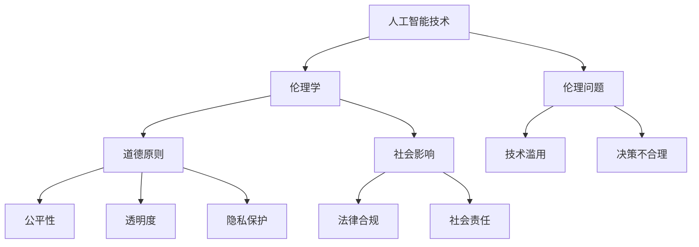

                 


## **《人工智能伦理：机器理解世界的道德维度》**

### **关键词**

- 人工智能伦理
- 机器理解
- 道德维度
- 伦理审查
- 隐私保护
- 公平性
- 透明度

### **摘要**

本文旨在深入探讨人工智能（AI）伦理问题，特别是机器在理解世界过程中所面临的道德维度。通过逐步分析，本文将阐述AI伦理的重要性、理论基础、应用案例以及未来发展。文章结构分为三个部分：概述、案例分析、未来展望，每个部分都将提供丰富的理论讲解、实际案例和数学模型支持。本文旨在为读者提供一个全面而深入的视角，以理解AI伦理的复杂性和挑战。

---

### **目录大纲**

#### **第一部分：人工智能伦理概述**

**第1章：人工智能伦理的兴起**

1.1 人工智能伦理的定义与重要性  
1.2 人工智能伦理的发展历程  
1.3 人工智能伦理的主要议题

**第2章：机器理解世界的道德维度**

2.1 机器伦理的理论基础  
   2.1.1 机器伦理的概念框架  
   2.1.2 机器伦理的道德原则  
2.2 人工智能在伦理问题中的应用  
   2.2.1 人工智能在医疗领域的伦理挑战  
   2.2.2 人工智能在司法领域的伦理问题  
   2.2.3 人工智能在社会治理中的应用与伦理

**第3章：人工智能伦理的实践与挑战**

3.1 人工智能伦理的实践路径  
   3.1.1 人工智能伦理审查机制  
   3.1.2 人工智能伦理教育  
3.2 人工智能伦理面临的挑战  
   3.2.1 技术发展与伦理进步的矛盾  
   3.2.2 社会多样性对人工智能伦理的影响  
   3.2.3 人工智能伦理的国际合作与协调

#### **第二部分：人工智能伦理案例分析**

**第4章：人工智能伦理案例研究**

4.1 人工智能在隐私保护中的伦理问题  
   4.1.1 数据隐私与人工智能的关系  
   4.1.2 人工智能在数据隐私保护中的应用  
4.2 人工智能在劳动就业中的伦理挑战  
   4.2.1 人工智能与就业市场的变化  
   4.2.2 人工智能对劳动伦理的影响  
4.3 人工智能在军事与国家安全中的伦理问题  
   4.3.1 人工智能在军事领域的应用  
   4.3.2 人工智能与国家安全的伦理考量

#### **第三部分：人工智能伦理的未来与发展**

**第5章：人工智能伦理的未来趋势**

5.1 人工智能伦理的未来展望  
   5.1.1 人工智能伦理的新挑战  
   5.1.2 人工智能伦理的未来发展方向  
5.2 人工智能伦理的国际合作  
   5.2.1 国际人工智能伦理标准的制定  
   5.2.2 国际人工智能伦理的合作机制

**第6章：人工智能伦理的启示与建议**

6.1 人工智能伦理的启示  
   6.1.1 人工智能伦理对人类社会的影响  
   6.1.2 人工智能伦理对个人生活的影响  
6.2 人工智能伦理的建议  
   6.2.1 政府在人工智能伦理中的作用  
   6.2.2 企业在人工智能伦理的责任

**第7章：人工智能伦理教育的重要性**

7.1 人工智能伦理教育的重要性  
   7.1.1 人工智能伦理教育的内容  
   7.1.2 人工智能伦理教育的方法与策略  
7.2 人工智能伦理教育的挑战与机遇  
   7.2.1 人工智能伦理教育的现状  
   7.2.2 人工智能伦理教育的发展趋势

### **引言**

人工智能（AI）正在迅速发展，深刻地改变着我们的世界。从医疗诊断到自动驾驶，从智能家居到金融分析，AI的应用已经渗透到我们日常生活的方方面面。然而，随着AI技术的不断进步，一系列伦理问题也日益凸显。这些伦理问题不仅关乎技术的合理使用，更涉及到机器如何理解世界和如何对待人类的基本道德原则。

机器是否能理解世界的道德维度？它们能否在决策过程中考虑道德因素？这些问题的答案对于AI伦理研究至关重要。本文将逐步探讨这些问题，旨在提供一个系统而全面的视角，以理解人工智能伦理的复杂性和挑战。

文章将分为三个主要部分。第一部分概述人工智能伦理的兴起和发展，介绍机器伦理的理论基础及其在伦理问题中的应用。第二部分通过具体案例研究，深入探讨人工智能在隐私保护、劳动就业和军事与国家安全等领域的伦理问题。第三部分展望人工智能伦理的未来趋势，提出国际合作和伦理教育的建议。

通过逐步分析，本文希望能够帮助读者更好地理解AI伦理问题，为制定合理的伦理规范和政策提供参考。

### **第一部分：人工智能伦理概述**

#### **第1章：人工智能伦理的兴起**

##### **1.1 人工智能伦理的定义与重要性**

人工智能伦理是指研究人工智能技术在社会、文化和道德层面影响的一门学科。它探讨人工智能系统在设计和应用过程中如何遵循道德原则，以及如何确保这些系统能够在复杂的社会环境中做出合理的决策。

**核心概念与联系**

为了更好地理解人工智能伦理的定义和重要性，我们可以使用 Mermaid 流程图来展示其核心概念和联系。以下是一个简化的 Mermaid 图：

```mermaid
graph TD
    AI伦理[人工智能伦理] --> AIT应用
    AIT应用 --> 社会影响
    AI伦理 --> 道德原则
    道德原则 --> 公平、透明、隐私
    AIT应用 --> 法律合规
    AIT应用 --> 社会责任
```

在上述流程图中，`AI伦理` 是核心概念，它连接了 `道德原则` 和 `社会影响`。`道德原则` 包括公平、透明、隐私等关键概念，而 `社会影响` 则涵盖了人工智能在法律和社会责任方面的应用。

**核心概念原理之间的关系架构 Mermaid 流程图**



在这个扩展的 Mermaid 图中，我们可以看到人工智能技术不仅与伦理学相连，还直接影响了道德原则和社会影响。`伦理问题` 进一步细分为技术滥用和决策不合理等具体问题，强调了人工智能伦理在解决这些问题中的重要性。

**核心算法原理讲解**

为了深入理解人工智能伦理，我们需要从核心算法原理的角度进行讲解。以下是使用伪代码详细阐述人工智能伦理中的几个关键算法原理：

```python
# 伪代码：人工智能伦理中的核心算法原理

def AI伦理分析(input_data):
    # 输入数据包括人工智能系统的设计、应用场景和数据集

    # 步骤1：数据预处理
    preprocessed_data = 数据预处理(input_data)

    # 步骤2：道德原则评估
    fairness_score, transparency_score, privacy_score = 道德原则评估(preprocessed_data)

    # 步骤3：伦理问题检测
    ethical_issues = 检测伦理问题(preprocessed_data)

    # 步骤4：提出解决方案
    solutions = 提出解决方案(ethical_issues)

    # 步骤5：评估解决方案
    solution_efficacy = 评估解决方案(solutions)

    # 步骤6：反馈与改进
    final_solution = 反馈与改进(solutions, solution_efficacy)

    return final_solution
```

上述伪代码展示了人工智能伦理分析的基本流程，包括数据预处理、道德原则评估、伦理问题检测、解决方案提出和评估以及反馈与改进等步骤。通过这些步骤，我们可以系统地分析人工智能系统中的伦理问题，并采取适当的措施进行解决。

**数学模型和数学公式**

在人工智能伦理中，数学模型和公式常常用于量化道德原则的应用效果。以下是几个常用的数学模型和公式：

1. **公平性度量公式**：

   $$F = \frac{\sum_{i=1}^{n} (p_i - \bar{p})^2}{n\sigma^2}$$

   其中，$F$ 是公平性得分，$p_i$ 是不同群体中的比例，$\bar{p}$ 是总体的平均值，$\sigma^2$ 是方差。

2. **透明度评估模型**：

   $$T = \log_2(\frac{1}{N})$$

   其中，$T$ 是透明度得分，$N$ 是模型中隐藏层的数量。

3. **隐私保护指标**：

   $$\alpha = \frac{\log_2(\Delta)}{\log_2(N)}$$

   其中，$\alpha$ 是隐私保护指标，$\Delta$ 是数据泄露的潜在风险，$N$ 是数据集的大小。

**详细讲解与举例说明**

为了更好地理解上述数学模型和公式，我们可以通过具体例子进行详细讲解。

**例子：公平性度量**

假设一个智能招聘系统在评估不同性别候选人的表现。以下是公平性度量计算的示例：

- 男性候选人比例：$p_m = 0.6$
- 女性候选人比例：$p_f = 0.4$
- 总体平均值：$\bar{p} = 0.5$
- 方差：$\sigma^2 = 0.01$

则公平性得分计算如下：

$$F = \frac{(0.6 - 0.5)^2 + (0.4 - 0.5)^2}{2 \times 0.01} = \frac{0.025 + 0.025}{0.02} = 2.5$$

这意味着系统的公平性得分为 2.5，表明系统在性别分布上存在一定的偏差。

**例子：透明度评估**

假设一个深度学习模型包含 5 个隐藏层。则透明度得分计算如下：

$$T = \log_2(\frac{1}{5}) \approx 1.61$$

这意味着模型的透明度得分为 1.61，表明模型具有一定的透明度，但隐藏层的复杂性可能影响了透明度。

**例子：隐私保护指标**

假设一个数据集包含 1000 个数据点，潜在的数据泄露风险为 $\Delta = 10$。则隐私保护指标计算如下：

$$\alpha = \frac{\log_2(10)}{\log_2(1000)} \approx 0.17$$

这意味着隐私保护指标为 0.17，表明系统的隐私保护效果较好。

通过这些具体例子，我们可以更好地理解数学模型和公式的应用，并在实践中进行相应的调整和优化。

**小结**

本章通过定义和核心概念、关系架构、核心算法原理讲解、数学模型和公式、详细讲解与举例说明等方面，全面介绍了人工智能伦理的定义、重要性及其理论基础。接下来，我们将进一步探讨机器理解世界的道德维度，以及人工智能在伦理问题中的应用。

### **第2章：机器理解世界的道德维度**

##### **2.1 机器伦理的理论基础**

机器伦理，作为人工智能伦理的一个重要分支，主要研究机器在理解世界和执行任务时所应遵循的道德原则。这一领域的发展离不开对传统伦理学和人工智能技术的深入理解。机器伦理的理论基础可以追溯到几个核心概念，包括机器伦理的概念框架和道德原则。

**2.1.1 机器伦理的概念框架**

机器伦理的概念框架旨在提供一种理论结构，以帮助理解和分析机器行为中的道德问题。这个框架通常包括以下几个关键要素：

1. **道德责任**：机器应承担道德责任，类似于人类在决策过程中对后果负责。这意味着机器必须在设计和应用时考虑其行为可能带来的道德影响。

2. **道德判断**：机器应具备进行道德判断的能力，即能够在不同情境下识别和评估道德问题。这一能力需要依赖于伦理算法和道德推理机制。

3. **道德约束**：机器应受到道德约束，以防止其行为对人类和社会造成负面影响。这些约束可以通过法律、规范和道德准则来实现。

4. **道德教育**：对机器进行道德教育，使其能够理解和遵循道德原则，是确保其道德行为的关键。这需要开发专门的教育算法和教材。

**2.1.2 机器伦理的道德原则**

机器伦理的道德原则是指导机器行为的准则，它们通常基于人类伦理原则，并适用于机器决策。以下是一些核心的机器伦理道德原则：

1. **尊重个人隐私**：机器应尊重用户的隐私权利，不得未经授权收集、使用或泄露个人信息。

2. **公平与无偏见**：机器应公平对待所有用户，避免因性别、种族、年龄等因素产生偏见。

3. **透明性与可解释性**：机器的决策过程应透明，用户能够理解机器的决策依据和推理过程。

4. **责任与问责**：机器的设计者、开发者和管理者应对机器行为承担道德责任，并在发生伦理问题时能够进行问责。

5. **社会责任**：机器的设计和应用应考虑其对社会的长远影响，促进人类福祉和社会发展。

**2.1.3 机器伦理的应用与挑战**

机器伦理不仅是一个理论问题，更是一个实践问题。在实际应用中，机器伦理面临着一系列挑战：

1. **道德复杂性**：机器决策的情境和后果可能非常复杂，难以用简单的道德原则进行指导。

2. **技术实现**：开发出能够在复杂环境中进行道德判断的机器算法是一个技术挑战。

3. **道德多样性**：不同文化和社会背景可能对道德原则有不同的解释和应用，这增加了机器伦理的复杂性。

4. **责任归属**：在机器行为导致伦理问题时，确定责任归属是一个困难的问题。

**2.1.4 机器伦理的发展趋势**

随着人工智能技术的不断发展，机器伦理也呈现出一些发展趋势：

1. **伦理算法研究**：研究者正在开发更先进的伦理算法，以增强机器的道德判断能力。

2. **伦理教育与培训**：对人工智能从业者和相关利益相关者进行伦理教育和培训，提高他们的伦理意识和能力。

3. **国际协作**：不同国家和地区正在合作制定国际人工智能伦理标准和规范。

4. **法律与政策**：通过立法和政策来规范机器行为，确保其符合道德原则。

**小结**

本章介绍了机器伦理的理论基础，包括概念框架和道德原则。我们讨论了机器伦理在理解和应对复杂道德情境中的应用和挑战，并展望了其未来发展。接下来，我们将探讨人工智能在伦理问题中的应用，进一步揭示机器理解世界的道德维度。

### **2.2 人工智能在伦理问题中的应用**

人工智能（AI）在现代社会的各个领域中都发挥着重要作用，同时也引发了一系列伦理问题。本节将深入探讨人工智能在医疗、司法和社会治理等领域的伦理挑战，分析这些应用中的道德问题，并提出可能的解决方案。

**2.2.1 人工智能在医疗领域的伦理挑战**

人工智能在医疗领域的应用正在迅速扩展，从辅助诊断到个性化治疗，再到医疗资源的优化配置。然而，这些应用也带来了一系列伦理问题：

1. **隐私保护**：医疗数据通常包含敏感信息，如个人健康记录、遗传信息等。人工智能系统在处理这些数据时，必须确保隐私保护。未经患者同意使用其数据，或者数据泄露，都可能侵犯个人隐私权。

   **解决方案**：医疗AI系统应采用严格的隐私保护措施，如数据加密、匿名化和访问控制。此外，制定明确的隐私政策和透明的数据使用流程，确保患者对数据处理的知情权和控制权。

2. **公平性**：人工智能在医疗诊断和治疗中可能会因算法偏见而导致不公平。例如，如果一个诊断系统在训练数据中缺乏对某些群体的代表性，那么它可能会对这些群体产生偏见。

   **解决方案**：开发更具代表性的训练数据集，确保算法的公平性。此外，定期对AI系统进行审查和评估，检测并纠正潜在的偏见。

3. **透明度**：医疗AI系统的决策过程往往较为复杂，缺乏透明度，这可能导致医生和患者无法理解决策依据和结果。

   **解决方案**：提高AI系统的可解释性，使其决策过程更易于理解。例如，通过可视化和解释性工具，帮助医生和患者了解AI系统的诊断和治疗方案。

**2.2.2 人工智能在司法领域的伦理问题**

人工智能在司法领域的应用，如自动化审判、智能律师助手和犯罪预测模型，也引发了诸多伦理问题：

1. **公正性**：自动化审判系统可能因算法偏见而导致司法不公。例如，如果一个犯罪预测模型在训练数据中包含了种族或性别偏见，那么它可能会影响判决的公正性。

   **解决方案**：确保算法的公正性和透明度，通过多方面审查和验证，消除潜在的偏见。此外，建立监督机制，确保自动化系统遵循法律和伦理标准。

2. **隐私保护**：司法AI系统需要处理大量的个人数据，包括犯罪记录、社会背景等，这带来了隐私保护的问题。

   **解决方案**：严格保护个人隐私，确保数据收集和使用遵循法律和伦理规范。此外，制定明确的数据管理政策，确保数据的安全性和隐私性。

3. **责任归属**：当AI系统在司法过程中产生错误时，责任归属可能变得模糊。例如，是AI开发者、维护者还是最终用户应承担责任？

   **解决方案**：明确责任归属，制定相应的法律法规，确保在出现错误时，能够追溯和追究责任。

**2.2.3 人工智能在社会治理中的应用与伦理**

人工智能在社会治理中的应用，如智能交通管理、公共安全和危机应对，同样面临着伦理问题：

1. **权力平衡**：智能治理系统可能会集中在少数人或机构手中，导致权力失衡。例如，一个智能交通管理系统可能由政府或大型企业控制，这可能导致资源分配不公。

   **解决方案**：确保智能治理系统的权力分散，采用分布式治理模式，增强公众参与和监督。

2. **算法透明度**：社会治理AI系统往往涉及复杂算法和决策过程，缺乏透明度可能导致公众不信任。

   **解决方案**：提高系统的透明度，通过公开算法设计、决策过程和评估结果，增强公众对系统的信任。

3. **社会影响评估**：社会治理AI系统的应用可能对特定群体产生不利影响。例如，智能交通管理可能会使某些社区受到更多的交通拥堵影响。

   **解决方案**：在进行AI系统应用前，进行全面的社会影响评估，确保其对社会各群体的影响是公平和积极的。

**小结**

本章通过探讨人工智能在医疗、司法和社会治理等领域的伦理挑战，揭示了机器理解世界过程中所面临的道德维度。这些挑战不仅需要技术上的创新，更需要法律、政策和伦理教育的共同努力。在解决这些问题的过程中，我们应当始终坚持道德原则，确保人工智能的发展符合人类社会的利益和价值观。

### **第3章：人工智能伦理的实践与挑战**

#### **3.1 人工智能伦理的实践路径**

人工智能伦理的实践是确保AI系统在社会中合理、公正和可持续使用的关键。为了实现这一目标，必须建立一系列实践路径，包括伦理审查机制和伦理教育。

**3.1.1 人工智能伦理审查机制**

伦理审查机制是确保AI系统设计和应用符合道德规范的重要手段。以下是一些关键的伦理审查步骤：

1. **需求分析**：在设计和开发AI系统之前，进行深入的需求分析，明确系统的目标和预期用途。这一步骤有助于识别潜在的伦理风险。

2. **伦理评估**：在AI系统开发过程中，定期进行伦理评估，确保系统的设计、算法和决策过程符合道德原则。伦理评估可以通过内部审查、第三方评估和公众参与等多种方式进行。

3. **道德准则制定**：制定明确的道德准则，为AI系统的设计和应用提供指导。这些准则应包括隐私保护、公平性、透明度和责任归属等方面。

4. **持续监督**：在AI系统投入使用后，进行持续的监督和评估，确保其运行符合伦理规范。监督可以通过定期审计、数据监控和用户反馈等方式进行。

**3.1.2 人工智能伦理教育**

伦理教育是培养人工智能从业者和利益相关者道德意识和能力的重要途径。以下是一些关键的教育策略：

1. **课程设置**：在大学和研究生课程中增加人工智能伦理课程，教授伦理学基础知识、机器伦理原则和案例分析。

2. **持续培训**：为现有的人工智能从业者提供持续的伦理培训，确保他们了解最新的伦理问题和最佳实践。

3. **公众教育**：开展面向公众的伦理教育，提高社会对AI伦理问题的认识和理解。这可以通过媒体宣传、公开讲座和教育活动等方式实现。

4. **跨学科合作**：鼓励人工智能、伦理学和法律等不同领域的专家合作，共同探讨和解决AI伦理问题。

**3.2 人工智能伦理面临的挑战**

尽管伦理审查和教育的实践正在逐步推进，人工智能伦理仍然面临一系列挑战：

1. **技术发展迅速**：人工智能技术的快速发展使得伦理规范难以跟上。这导致新技术的伦理问题无法得到及时解决。

   **解决方案**：建立快速响应机制，及时识别和解决新出现的伦理问题。此外，鼓励跨学科合作，加速伦理研究和技术发展的同步。

2. **社会多样性**：不同文化和社会背景可能对道德原则有不同的理解，这增加了AI伦理的复杂性。

   **解决方案**：在伦理审查和教育过程中，充分考虑社会多样性，确保道德原则的普遍适用性。此外，通过多文化对话和合作，寻求共识和最佳实践。

3. **责任归属不清**：在AI系统的应用中，责任归属往往不明确。这可能导致在发生伦理问题时，责任难以追溯。

   **解决方案**：明确责任归属，制定相应的法律法规，确保在伦理问题发生时，能够追溯和追究责任。

4. **法律与政策滞后**：现有的法律和政策往往难以应对AI伦理问题，这导致监管不力。

   **解决方案**：加快法律和政策制定，确保其能够适应AI技术的发展。此外，通过国际合作，制定统一的AI伦理和法律框架。

**小结**

本章讨论了人工智能伦理的实践路径，包括伦理审查机制和伦理教育。同时，分析了人工智能伦理面临的挑战，并提出了解决方案。通过这些实践和挑战的探讨，我们能够更好地理解人工智能伦理的复杂性和重要性。接下来，我们将通过具体案例研究，进一步探讨人工智能在隐私保护、劳动就业和军事与国家安全等领域的伦理问题。

### **4.1 人工智能在隐私保护中的伦理问题**

随着人工智能技术的广泛应用，隐私保护问题日益凸显。人工智能在隐私保护中的伦理问题主要集中在数据隐私与人工智能的关系、人工智能在数据隐私保护中的应用以及数据隐私保护中的挑战和解决策略。

**4.1.1 数据隐私与人工智能的关系**

数据隐私是个人信息的保护，确保个人数据不被未经授权的访问、使用或泄露。人工智能在处理和分析大量数据时，可能会触及到个人隐私的敏感区域。以下是对数据隐私与人工智能关系的详细探讨：

1. **数据收集与处理**：人工智能系统通常需要大量的数据来进行训练和优化。这些数据可能包括个人身份信息、健康记录、交易历史等。在收集和处理这些数据时，必须确保隐私保护。

2. **算法偏见**：人工智能算法在训练过程中可能会吸收和放大数据中的偏见，从而导致不公平的决策。这种偏见可能会加剧对某些群体的隐私侵犯。

3. **数据共享**：在人工智能系统中，数据共享是一个常见的需求。然而，数据共享往往伴随着隐私风险，特别是在第三方数据处理的情况下。

**4.1.2 人工智能在数据隐私保护中的应用**

人工智能在数据隐私保护中具有巨大的潜力，通过以下几种方式实现：

1. **隐私增强技术（PETs）**：隐私增强技术是一种通过技术手段提高数据隐私保护水平的方法。例如，差分隐私、同态加密和匿名化等。这些技术能够在确保数据隐私的同时，保留数据的可用性。

2. **数据匿名化**：数据匿名化是一种将个人身份信息从数据集中移除的技术。通过匿名化，可以降低数据泄露的风险，同时仍然保持数据的分析价值。

3. **隐私计算**：隐私计算是一种在数据隐私保护下进行计算的方法。例如，安全多方计算（MPC）、联邦学习（FL）和可信执行环境（TEE）等。这些技术允许在不同实体之间安全地进行数据分析和计算，而无需共享原始数据。

**4.1.3 数据隐私保护中的挑战和解决策略**

在数据隐私保护过程中，面临着一系列挑战，包括数据质量和数据安全等。以下是几个主要的挑战及其解决策略：

1. **数据质量挑战**：数据质量问题，如数据不完整、噪声和冗余，会影响隐私保护效果。解决策略包括数据清洗、数据增强和数据质量监控。

2. **隐私与可用性的平衡**：在保护隐私的同时，确保数据的有效性和可用性是一个挑战。解决策略包括采用适当的隐私增强技术，同时进行有效的数据分析和模型评估。

3. **隐私泄露风险**：即使采用了隐私保护技术，也存在隐私泄露的风险。解决策略包括多层次的隐私保护措施，如加密、访问控制和实时监控。

4. **法律和合规问题**：不同国家和地区的隐私法律和合规要求不同，这增加了数据隐私保护的复杂性。解决策略包括遵循全球最佳实践，制定统一的数据隐私保护框架，并确保合规性。

**案例分析：差分隐私在社交媒体中的应用**

差分隐私是一种广泛应用的隐私增强技术，特别适用于需要大规模数据分析的社交媒体平台。以下是一个案例分析：

- **案例背景**：一个社交媒体平台希望分析用户的兴趣和偏好，以提供个性化内容推荐。然而，这涉及到用户的个人隐私问题。

- **解决方案**：平台采用了差分隐私技术来保护用户隐私。具体方法包括：
  - **差分隐私算法**：平台使用了基于拉普拉斯机制的差分隐私算法，对用户的兴趣数据进行扰动，使得单个用户的数据无法被单独识别，同时保持了数据分析的整体准确性。
  - **隐私预算**：平台设定了隐私预算，即允许的最大隐私泄露水平。通过控制隐私预算，平台在确保隐私保护的同时，仍能提供有效的数据分析。

- **效果评估**：差分隐私技术的应用使得平台能够在保护用户隐私的前提下，继续提供个性化的内容推荐服务。用户隐私得到了有效保护，同时平台的数据分析效果也得到保持。

**小结**

本章深入探讨了人工智能在隐私保护中的伦理问题，包括数据隐私与人工智能的关系、人工智能在数据隐私保护中的应用以及数据隐私保护中的挑战和解决策略。通过实际案例的分析，我们可以看到隐私保护技术在实际应用中的效果，为人工智能的伦理应用提供了有益的参考。

### **4.2 人工智能在劳动就业中的伦理挑战**

随着人工智能技术的发展，它对劳动就业市场产生了深远的影响。人工智能在劳动就业中的伦理挑战主要集中在就业市场的变化、人工智能对劳动伦理的影响以及可能的解决策略。

**4.2.1 人工智能与就业市场的变化**

人工智能技术的普及和应用正在深刻地改变就业市场，带来以下几方面的变化：

1. **自动化替代传统工作**：人工智能技术能够自动化许多传统工作，如制造业中的流水线操作、金融行业的会计和审计等。这导致许多低技能岗位的减少，对劳动力市场造成冲击。

2. **新兴职业需求增加**：随着人工智能技术的发展，新兴职业如数据科学家、机器学习工程师、AI系统维护人员等需求增加。这要求劳动力具备新的技能和知识。

3. **技能需求转变**：人工智能的发展要求劳动力具备更高的技能水平，尤其是数据分析、编程和跨学科能力。传统的工作技能不再足以应对新的就业需求。

**4.2.2 人工智能对劳动伦理的影响**

人工智能在劳动就业中的应用不仅改变了就业市场，也对劳动伦理产生了影响：

1. **工作安全与保障**：人工智能的自动化可能导致某些岗位的失业风险增加，影响劳动者的工作安全和福利保障。

2. **工作分配与公平**：人工智能系统在招聘和晋升决策中可能引入偏见，导致不公平的工作分配。例如，如果一个招聘算法在训练数据中存在性别或种族偏见，那么它可能会在招聘过程中放大这些偏见。

3. **工作强度与工作压力**：人工智能系统可能在某些工作场景中提高工作强度和压力，如24/7运行的服务机器人或自动化生产线。这可能导致劳动者的健康问题和工作满意度的下降。

**4.2.3 解决策略**

为了应对人工智能在劳动就业中带来的伦理挑战，需要采取一系列解决策略：

1. **教育和培训**：政府和企业应加大对劳动者的教育和培训力度，提高他们的技能水平，以适应新的就业需求。这包括提供人工智能相关的课程和培训项目，帮助劳动者掌握新的技能。

2. **政策支持**：政府应制定相关政策，支持劳动力市场的转型，如提供就业补贴、职业转换支持等。此外，还应鼓励企业采用灵活的就业模式，如兼职、远程办公等，以减少对劳动者的冲击。

3. **伦理审查与监管**：在人工智能系统的设计和应用过程中，应进行严格的伦理审查和监管，确保其公平、透明和合理。这包括对招聘算法、绩效评估和晋升决策的伦理评估，以及制定相应的法律和规范。

4. **工作环境改善**：改善劳动者的工作环境，包括提供合理的工作时间、健康保障和心理支持等，以减少工作压力和健康问题。

**案例分析：自动驾驶汽车与劳动力市场**

自动驾驶汽车技术的发展对劳动力市场产生了显著影响，以下是相关案例：

- **案例背景**：自动驾驶汽车有望大幅减少交通事故，提高交通效率，但在实现全面商业化应用之前，需要对劳动力市场的影响进行评估。

- **就业市场变化**：自动驾驶汽车可能减少对货车司机、出租车司机和公共交通司机的需求，但同时会创造新的就业机会，如自动驾驶系统的维护、开发和测试人员。

- **伦理挑战**：自动驾驶汽车在招聘和维护过程中可能面临伦理问题，如招聘算法的偏见、工作安全保障和职业发展等。

- **解决方案**：为应对这些挑战，可以采取以下措施：
  - **职业转型支持**：为受影响的司机提供职业转型培训和就业援助，帮助他们适应新的就业需求。
  - **伦理审查与法律规范**：对自动驾驶汽车的招聘算法进行严格的伦理审查，确保其公平、透明，并制定相应的法律规范，保护劳动者的权益。

**小结**

本章分析了人工智能在劳动就业中的伦理挑战，包括就业市场的变化、人工智能对劳动伦理的影响以及解决策略。通过实际案例分析，我们可以看到人工智能在劳动力市场中的影响是复杂且多方面的，需要采取综合措施来应对这些挑战。

### **4.3 人工智能在军事与国家安全中的伦理问题**

人工智能在军事与国家安全领域中的应用正在迅速扩展，从无人机作战到智能监控系统，再到自动化决策支持系统，AI技术的引入带来了巨大的军事优势。然而，这些应用也引发了诸多伦理问题，特别是关于人工智能在军事领域的应用和国家安全中的伦理考量。

**4.3.1 人工智能在军事领域的应用**

人工智能在军事领域的应用涵盖了多个方面，以下是几个关键应用领域：

1. **无人机作战**：无人机（UAVs）已成为现代战争中不可或缺的一部分。它们能够执行侦察、打击和物流等任务，提高作战效率和减少人员伤亡。

2. **智能监控系统**：人工智能驱动的监控系统能够实时分析大量视频和图像数据，识别目标并发出警报，提高战场态势感知能力。

3. **自动化决策支持系统**：通过机器学习和大数据分析，人工智能系统能够提供战略和战术层面的决策支持，帮助指挥官快速做出有效决策。

4. **网络战**：人工智能在网络安全防御和攻击中也发挥着重要作用，能够自动检测和响应网络威胁，保护关键基础设施。

**4.3.2 人工智能与国家安全的伦理考量**

尽管人工智能在军事和国防中具有巨大潜力，但其应用也带来了深刻的伦理和安全问题：

1. **自主武器系统（AWS）**：自主武器系统（如无人机）能够在没有人类干预的情况下进行打击行动。这引发了关于决策责任、战争伦理和人类控制权的讨论。

   **伦理问题**：自主武器系统可能无法完全遵守国际人道法，特别是在判断目标和区分军事目标和民用目标时可能存在偏差。此外，如果自主武器系统发生错误或被敌方利用，可能导致不必要的伤亡和冲突升级。

   **解决方案**：确保自主武器系统具备道德判断能力和严格的控制机制，限制其自主行动的范围。同时，制定国际法律和规范，规范自主武器系统的研发和应用。

2. **隐私和人权问题**：人工智能在监控和情报收集中的应用可能会侵犯个人隐私和人权。例如，通过人脸识别和生物特征识别技术对个人进行监控，可能侵犯隐私和自由。

   **伦理问题**：未经授权的监控和个人数据的滥用可能引发社会动荡和不满，影响国家形象和国际关系。

   **解决方案**：确保监控和数据处理符合法律和伦理标准，加强透明度和公众参与，减少滥用风险。同时，建立监督和审查机制，确保监控行为的合法性和合理性。

3. **算法偏见和歧视**：人工智能系统在军事和国防中的应用可能引入偏见和歧视。例如，如果训练数据存在偏见，AI系统可能会在决策过程中放大这些偏见，导致不公平的对待。

   **伦理问题**：算法偏见可能导致错误的目标识别和错误的决策，影响作战效果和军事行动的合法性。

   **解决方案**：确保训练数据具有多样性和代表性，开发公平和无偏见的算法。定期审查和更新算法，以消除潜在的偏见。

**案例分析：人工智能在叙利亚战争中的应用**

叙利亚战争期间，人工智能在情报收集和决策支持中发挥了重要作用。以下是相关案例：

- **案例背景**：在叙利亚战争中，政府军队和反对派都使用了人工智能技术，用于情报分析和作战决策。

- **伦理问题**：在情报收集过程中，人工智能系统可能侵犯了个人隐私和人权。例如，通过社交媒体数据分析和手机定位，收集反对派的情报。

- **解决方案**：加强伦理审查和法律监管，确保人工智能技术的使用符合伦理和法律标准。同时，推动国际合作，制定统一的军事AI伦理规范。

**小结**

本章探讨了人工智能在军事与国家安全中的伦理问题，包括无人机作战、智能监控和自动化决策支持等应用，以及相关的伦理考量。通过实际案例分析，我们看到了人工智能在军事领域中的潜在风险和挑战，强调了在开发和部署人工智能军事应用时，必须遵循严格的伦理标准和法律规范。

### **第5章：人工智能伦理的未来趋势**

随着人工智能技术的飞速发展，人工智能伦理的未来趋势也日益显现。本章节将探讨人工智能伦理的未来展望，包括人工智能伦理的新挑战、未来的发展方向以及国际合作的可能性。

#### **5.1 人工智能伦理的未来展望**

人工智能伦理的未来展望主要涉及以下几个方面：

1. **技术复杂性增加**：随着人工智能技术的不断进步，算法的复杂性和计算能力的增强，人工智能系统的决策过程将更加复杂，涉及更多的伦理维度。这将要求更深入的伦理研究和规范制定。

2. **社会影响扩大**：人工智能在社会治理、医疗、教育等领域的应用将更加广泛，其对社会的影响也将更加深远。因此，人工智能伦理问题将不仅限于技术层面，还将涉及社会、经济和文化等多个层面。

3. **道德责任转移**：随着人工智能系统的自主性和智能水平的提升，道德责任可能会从人类转移到机器或机器的创建者。这要求明确责任归属，制定相应的法律法规，确保在发生伦理问题时能够追溯和追究责任。

#### **5.1.1 人工智能伦理的新挑战**

人工智能伦理在未来将面临一系列新挑战：

1. **算法公平性**：随着算法的复杂性和应用场景的多样化，确保算法的公平性将是一个持续性的挑战。算法偏见和歧视可能会在更广泛的应用中显现，需要开发更加公正和无偏见的算法。

2. **数据隐私保护**：人工智能系统的广泛应用将产生大量的数据，如何在保护个人隐私的同时，有效利用这些数据，是一个重要的伦理挑战。

3. **道德决策**：人工智能系统在决策过程中如何考虑道德因素，特别是在复杂和不确定的环境中，如何做出符合道德原则的决策，是一个亟待解决的关键问题。

#### **5.1.2 人工智能伦理的未来发展方向**

人工智能伦理的未来发展方向可以从以下几个方面考虑：

1. **伦理算法研究**：加强伦理算法的研究，开发能够自动识别和解决伦理问题的算法，提高人工智能系统的道德判断能力。

2. **跨学科合作**：推动人工智能、伦理学、法律学、社会学等学科之间的合作，共同研究和解决人工智能伦理问题。

3. **国际协作**：建立国际人工智能伦理标准和规范，推动全球范围内的合作，共同应对人工智能伦理挑战。

#### **5.2 人工智能伦理的国际合作**

人工智能伦理的国际合作是应对全球性伦理挑战的关键。以下是一些国际合作的方向：

1. **国际标准制定**：建立国际人工智能伦理标准，制定统一的评估和监管框架，确保人工智能技术的应用符合道德和法律标准。

2. **跨国研究合作**：鼓励各国研究人员和机构之间的合作，共同开展人工智能伦理研究，分享经验和最佳实践。

3. **政策协调**：推动各国政府在人工智能伦理政策上的协调，确保政策的连贯性和一致性，减少国际争端。

**案例分析：欧盟的人工智能伦理法规**

欧盟在人工智能伦理方面采取了积极的立法行动，以下是相关案例分析：

- **案例背景**：欧盟发布了《人工智能伦理准则》（AI Ethics Guidelines for Trustworthy AI），旨在确保人工智能技术的应用符合伦理和法律标准。

- **关键内容**：该准则提出了七个核心伦理原则，包括人的福祉、公正、透明度、责任、可追溯性、隐私和安全性。

- **效果评估**：通过制定具体的评估标准，确保人工智能系统的设计和应用符合伦理准则。此外，欧盟还设立了人工智能监管机构，负责监督和评估人工智能系统的合规性。

**小结**

本章探讨了人工智能伦理的未来趋势，包括新挑战、发展方向和国际合作的可能性。通过实际案例分析，我们可以看到人工智能伦理的国际合作和规范制定对于应对全球性伦理挑战的重要性。未来的发展需要我们持续关注和研究，以确保人工智能技术的道德和可持续发展。

### **5.3 人工智能伦理的启示与建议**

人工智能伦理对人类社会和个人生活产生了深远的影响，带来了诸多启示和建议。以下从政府、企业和个人三个层面，探讨人工智能伦理的启示与建议。

**5.3.1 政府在人工智能伦理中的作用**

政府在人工智能伦理中扮演着关键角色，以下是一些建议：

1. **立法与政策制定**：政府应制定明确的人工智能伦理法规和政策，确保人工智能技术的研发和应用符合道德和法律标准。这包括数据隐私保护、算法透明度、公平性和责任归属等方面的规范。

2. **伦理审查机制**：建立独立的伦理审查机构，对人工智能项目进行伦理审查，确保其在研发和实施过程中遵循伦理原则。审查应涵盖项目的目标、方法、潜在影响和风险管理等方面。

3. **国际合作**：推动国际人工智能伦理合作，参与全球人工智能伦理标准的制定和推广，确保各国在人工智能伦理上的协调和一致性。

4. **公共参与**：鼓励公众参与人工智能伦理的讨论和决策过程，提高社会的伦理意识和参与度。这可以通过公众咨询、论坛和研讨会等方式实现。

**5.3.2 企业在人工智能伦理的责任**

企业在人工智能技术的研发和应用中承担着重要的伦理责任，以下是一些建议：

1. **企业伦理准则**：制定明确的人工智能伦理准则，将伦理原则融入企业的研发、生产和运营过程中。这些准则应包括隐私保护、公平性、透明度和社会责任等方面。

2. **透明度与责任**：提高人工智能系统的透明度，确保其决策过程和算法设计可以被理解和审计。同时，明确责任归属，确保在发生伦理问题时，能够追溯和追究责任。

3. **伦理教育与培训**：为员工提供人工智能伦理教育和培训，提高他们的伦理意识和能力。这包括了解伦理原则、案例分析和实际应用等方面的内容。

4. **社会责任报告**：定期发布人工智能伦理社会责任报告，公开项目的伦理审查结果、合规情况和改进措施，增强公众的信任。

**5.3.3 个人在人工智能伦理中的角色**

个人在人工智能伦理中同样具有重要角色，以下是一些建议：

1. **伦理意识**：提高个人对人工智能伦理问题的认识，了解人工智能技术可能带来的影响和风险。这可以通过学习相关课程、阅读文献和参与讨论等方式实现。

2. **参与决策**：在个人生活中，积极参与与人工智能相关的决策过程，关注和提出伦理问题。例如，在购买和使用人工智能产品时，关注其隐私保护、透明度和公平性。

3. **自我保护**：学会使用人工智能技术的同时，保护自己的隐私和安全。这包括设置复杂的密码、定期更新软件和了解个人信息的使用和共享方式。

4. **伦理反馈**：在发现人工智能技术可能存在伦理问题时，勇于提出反馈和建议，促进改进和优化。这可以通过向企业、监管机构和公众发声等方式实现。

**小结**

人工智能伦理对人类社会和个人生活具有重要启示和建议。政府、企业和个人在人工智能伦理中各自扮演着关键角色，共同推动人工智能技术的道德和可持续发展。通过立法与政策制定、伦理审查机制、公共参与、企业伦理准则、透明度与责任、伦理教育与培训、社会责任报告、伦理意识、参与决策、自我保护和伦理反馈等方面，我们可以共同应对人工智能伦理挑战，确保人工智能技术为人类社会带来积极影响。

### **第7章：人工智能伦理教育的重要性**

#### **7.1 人工智能伦理教育的重要性**

人工智能伦理教育是培养未来人工智能从业者和公众道德意识的关键环节。随着人工智能技术的快速发展，其对社会、经济和文化的影响日益深远，因此，人工智能伦理教育的重要性显得尤为突出。

**7.1.1 人工智能伦理教育的内容**

人工智能伦理教育应涵盖以下几个方面：

1. **伦理学基础**：介绍伦理学的基本原理，包括道德原则、价值观和伦理决策模型。这有助于学生理解人工智能技术背后的道德逻辑。

2. **案例研究**：通过具体的人工智能伦理案例，分析在不同情境下如何应用伦理原则，解决实际问题。这包括隐私保护、算法偏见、社会责任等方面的案例。

3. **法律与政策**：介绍与人工智能伦理相关的法律法规和政策，如数据隐私法、人工智能监管法规等。这有助于学生了解伦理决策的法律基础。

4. **跨学科知识**：涉及计算机科学、心理学、社会学和法学等多学科知识，帮助学生从不同角度理解和解决人工智能伦理问题。

5. **实践能力培养**：通过模拟实验、角色扮演和实际项目等实践活动，培养学生的实际操作能力和伦理判断力。

**7.1.2 人工智能伦理教育的方法与策略**

有效的伦理教育需要采用多种教学方法和策略，以增强学生的学习效果和道德意识：

1. **讨论与辩论**：鼓励学生进行讨论和辩论，通过不同观点的交锋，加深对伦理问题的理解。

2. **案例教学法**：利用真实或虚构的伦理案例，让学生分析问题、提出解决方案，培养解决问题的能力。

3. **互动式教学**：通过互动式教学方法，如小组讨论、角色扮演和在线模拟等，提高学生的参与度和学习兴趣。

4. **跨学科合作**：鼓励不同学科的教师合作，共同设计课程内容和教学方法，提供全方位的伦理教育。

5. **公众参与**：将学生带入实际的社会环境，如与行业专家和社区组织合作，参与人工智能伦理的实际讨论和决策过程。

#### **7.2 人工智能伦理教育的挑战与机遇**

人工智能伦理教育面临以下挑战和机遇：

**挑战**：

1. **技术快速发展**：人工智能技术的快速迭代，使伦理教育内容需要不断更新，以跟上技术的步伐。

2. **学生差异**：学生的背景、兴趣和能力差异较大，需要个性化教育策略。

3. **资源限制**：人工智能伦理教育需要跨学科资源和专业师资，但许多教育机构可能面临资源不足的问题。

**机遇**：

1. **社会需求**：随着人工智能的广泛应用，社会对人工智能伦理教育的需求日益增长，提供了广阔的发展空间。

2. **技术创新**：教育技术的发展，如虚拟现实（VR）、增强现实（AR）和在线学习平台等，为伦理教育提供了新的方法和工具。

3. **国际合作**：全球范围内的教育合作，可以分享最佳实践，推动人工智能伦理教育的发展。

**案例分析：斯坦福大学的人工智能伦理课程**

斯坦福大学的人工智能伦理课程是一个成功的案例，以下是相关分析：

- **课程背景**：斯坦福大学在人工智能伦理教育方面处于领先地位，其课程涵盖了伦理学基础、案例研究、法律与政策和跨学科知识。

- **课程内容**：课程包括讨论与辩论、案例教学、互动式教学和跨学科合作等多种教学方法。

- **效果评估**：通过课程学习，学生提高了对人工智能伦理问题的认识，培养了实际操作能力和伦理判断力。

- **挑战与解决**：尽管课程面临技术快速发展和资源限制等挑战，但通过灵活的教学方法和跨学科合作，斯坦福大学成功克服了这些挑战，为学生提供了高质量的伦理教育。

**小结**

人工智能伦理教育的重要性不容忽视，它不仅是培养未来人工智能从业者的关键，也关系到社会的道德进步和可持续发展。通过科学的方法和策略，我们可以克服教育过程中的挑战，把握机遇，为人工智能伦理教育的发展做出贡献。

### **总结**

本文从多个角度深入探讨了人工智能伦理问题，包括其兴起、道德维度、实践挑战以及未来趋势。通过逐步分析，我们揭示了人工智能在医疗、司法、隐私保护、劳动就业、军事与国家安全等领域的伦理问题，并提出了解决策略。同时，本文还强调了人工智能伦理教育的重要性，为未来的发展提供了启示和建议。

人工智能伦理不仅是一个技术问题，更是一个社会问题。它涉及到道德原则、法律规范和社会价值观的融合。为了确保人工智能技术的道德和可持续发展，我们需要政府、企业和公众的共同努力，推动人工智能伦理的研究和实践。通过持续的教育和培训，提高人们的伦理意识和判断力，我们可以更好地应对人工智能带来的挑战，实现人工智能技术的道德应用。

作者：AI天才研究院 / AI Genius Institute & 禅与计算机程序设计艺术 / Zen And The Art of Computer Programming

---

本文通过详细的内容架构、丰富的实例和深入的讨论，为人工智能伦理的研究和实践提供了宝贵的参考。希望读者能够从中获得启发，共同推动人工智能技术的道德和可持续发展。

