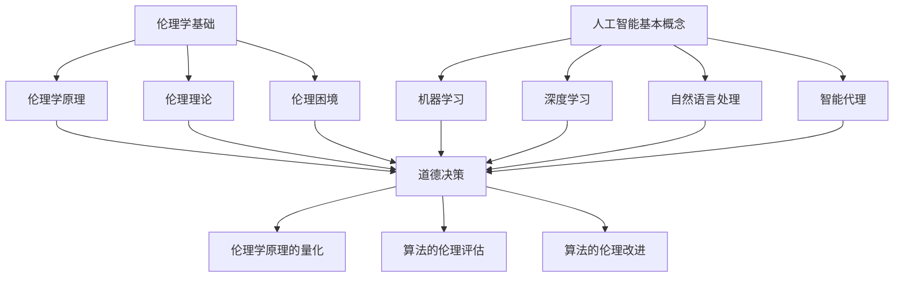

                 

# 人工智能的伦理算法：道德决策的数学框架

## 关键词
- 人工智能伦理
- 道德决策
- 数学模型
- 算法设计
- 伦理算法框架

## 摘要
本文旨在探讨人工智能领域的伦理问题，特别是道德决策的数学框架。通过深入分析伦理学原理与人工智能算法的结合，本文提出了一个系统的道德决策模型，并详细阐述了其中的核心算法原理、数学模型及公式，以及实际项目中的应用。本文的目标是为从事人工智能研发的人员提供一种理解和设计伦理算法的框架和方法，以促进人工智能技术的发展与应用中的伦理自律。

## 引言

### 1.1 人工智能伦理问题的背景

随着人工智能（AI）技术的快速发展，其在各个领域的应用日益广泛，从自动驾驶汽车、医疗诊断到金融分析，人工智能正在深刻改变我们的生活。然而，随着技术的进步，人工智能引发的伦理问题也日益突出。如何确保人工智能系统的公正性、透明性和安全性，如何处理人工智能在决策中可能出现的道德困境，这些问题成为学术界、产业界和政策制定者共同关注的焦点。

伦理问题在人工智能领域的重要性体现在多个方面。首先，人工智能的决策往往涉及人类福祉，例如医疗诊断的准确性、自动驾驶车辆的安全等。错误的决策可能导致严重的后果，甚至威胁到生命安全。其次，人工智能系统的设计和运行过程中，可能存在歧视、偏见和不公平现象，这会对社会公正性产生负面影响。此外，人工智能技术的滥用，如隐私侵犯、恶意攻击等，也是当前需要迫切解决的问题。

### 1.2 道德决策的数学框架

为了应对人工智能伦理问题，研究者们开始探索道德决策的数学框架，旨在通过量化方法来描述和解决道德困境。道德决策的数学框架主要包括以下几个核心组成部分：

1. **伦理学基础**：研究道德原则和伦理理论，为道德决策提供理论基础。
2. **人工智能算法**：将伦理学原理转化为可计算的形式，设计出能够处理道德决策的算法。
3. **数学模型**：构建数学模型来量化道德决策中的各种因素和目标。
4. **算法实现**：将数学模型转化为可执行的算法，并在实际应用中进行验证和优化。

本文将详细探讨这些组成部分，并展示如何通过逻辑分析和数学工具来设计伦理算法，从而为人工智能的伦理问题提供解决方案。

## 核心概念与联系

### 2.1 伦理学基础

伦理学是研究道德原则和价值观的学科，对于设计伦理算法至关重要。伦理学基础包括以下几个核心概念：

1. **道德原则**：如公正、尊重、诚实、善意等，这些原则为道德决策提供了基本的指导。
2. **伦理理论**：如功利主义、义务论、德性伦理等，不同的伦理理论提供了不同的道德决策框架。
3. **伦理困境**：在道德决策中，经常会遇到多种相互冲突的道德原则和价值观，这些困境需要通过系统的方法来分析和解决。

### 2.2 人工智能基本概念

人工智能是一门涉及计算机科学、数学、统计学和认知科学的交叉学科，其主要目标是开发出能够模拟、延伸和扩展人类智能的计算机系统。人工智能的基本概念包括：

1. **机器学习**：通过数据和算法来让计算机自动学习和改进性能。
2. **深度学习**：一种基于多层神经网络的机器学习方法，广泛应用于图像识别、语音识别等领域。
3. **自然语言处理**：使计算机能够理解、生成和交互自然语言。
4. **智能代理**：能够自主决策和执行任务的计算机程序。

### 2.3 道德决策与算法的关系

道德决策与算法之间的关系体现在以下几个方面：

1. **伦理学原理的量化**：将伦理学原理转化为数学模型和算法，使其能够在计算机中实现和执行。
2. **算法的伦理评估**：通过伦理学分析来评估算法的道德性质，确保其在决策过程中遵循道德原则。
3. **算法的伦理改进**：通过调整和优化算法，使其在道德决策中表现出更符合伦理期望的行为。

为了更好地理解这些核心概念之间的关系，我们可以使用Mermaid流程图来展示它们之间的逻辑架构：



这个流程图清晰地展示了伦理学基础、人工智能基本概念和道德决策之间的关系，以及如何通过这些关系来设计伦理算法。

## 道德决策的数学模型

### 3.1 伦理学原理与数学建模

伦理学原理是道德决策的基础，而数学建模则是将这些原理转化为可计算的模型。数学建模的过程通常包括以下几个步骤：

1. **定义问题**：明确道德决策的目标和约束条件。
2. **选择模型类型**：根据问题的特点选择合适的数学模型，如线性规划、非线性规划、多目标优化等。
3. **建立数学公式**：将伦理学原理转化为数学公式，以量化决策中的各种因素。
4. **求解模型**：使用数学方法求解模型，得到最优解或近似解。

以下是一个简单的多目标优化问题的数学建模示例：

#### 示例：医院资源分配问题

假设一家医院需要将资源（如床位、医生、药品等）分配给不同的科室，以满足患者的需求。伦理学原则包括最大化患者福祉和公平性。

**定义问题**：最大化总患者福祉，同时保证各科室资源的公平分配。

**选择模型类型**：多目标优化。

**建立数学公式**：

目标函数：
$$
\max_{x} W(x) = \sum_{i=1}^{n} u_i(x) - \sum_{j=1}^{m} v_j(x)
$$

其中，$u_i(x)$ 表示第 $i$ 个科室的患者福祉，$v_j(x)$ 表示第 $j$ 个资源的公平分配值。

约束条件：
$$
\begin{cases}
c_i(x) \leq b_i & \text{（第 $i$ 个科室的资源不超过预算 $b_i$）} \\
\sum_{i=1}^{n} x_i \leq B & \text{（总资源不超过预算 $B$）} \\
x_i \geq 0 & \text{（资源分配非负）}
\end{cases}
$$

其中，$c_i(x)$ 表示第 $i$ 个科室的资源分配值，$x_i$ 表示第 $i$ 个科室的福祉值。

**求解模型**：使用多目标优化算法，如遗传算法、粒子群优化等，求解最优解。

### 3.2 多目标优化与道德决策

多目标优化是一种常用的数学建模方法，特别适用于道德决策问题。在多目标优化中，多个目标函数需要同时优化，且这些目标之间可能存在冲突。

#### 示例：环境保护与经济增长的多目标优化

假设一个国家的决策者需要同时优化环境保护和经济增长。伦理学原则包括可持续发展、公平性和效率。

**定义问题**：最大化经济增长，同时最小化环境损害，并确保资源分配的公平性。

**选择模型类型**：多目标优化。

**建立数学公式**：

目标函数：
$$
\max_{x} f(x) = p(x) - g(x)
$$

其中，$p(x)$ 表示经济增长，$g(x)$ 表示环境损害。

约束条件：
$$
\begin{cases}
h_i(x) \leq d_i & \text{（第 $i$ 个资源不超过预算 $d_i$）} \\
\sum_{i=1}^{n} x_i \leq D & \text{（总资源不超过预算 $D$）} \\
x_i \geq 0 & \text{（资源分配非负）}
\end{cases}
$$

其中，$h_i(x)$ 表示第 $i$ 个资源的分配值，$x_i$ 表示第 $i$ 个目标的实现程度。

**求解模型**：使用多目标优化算法，如多目标遗传算法、多目标粒子群优化等，求解最优解。

### 3.3 模糊数学在道德决策中的应用

模糊数学是一种处理不确定性和模糊性的数学工具，特别适用于道德决策问题，因为在道德决策中往往存在各种不确定性和模糊性。

#### 示例：伦理决策中的模糊综合评价

假设一个公司需要评估一个新项目的道德可行性。伦理学原则包括社会责任、环境可持续性和员工福祉。

**定义问题**：对项目进行道德评价，确定其道德可行性。

**选择模型类型**：模糊综合评价。

**建立数学公式**：

评价指标集：$\{E_1, E_2, E_3\}$，分别表示社会责任、环境可持续性和员工福祉。

权重集：$\{w_1, w_2, w_3\}$，分别表示三个评价指标的重要性。

评价集：$\{E_1^+, E_1^-, E_2^+, E_2^-, E_3^+, E_3^-\}$，分别表示五个等级的评价。

隶属度函数：$f_{ij}(x)$，表示第 $i$ 个评价指标在第 $j$ 个等级的隶属度。

模糊评价矩阵：$R = (r_{ij})_{3 \times 5}$，表示每个评价指标在每个等级的隶属度。

综合评价结果：$S = (s_1, s_2, s_3)$，表示项目的道德评价结果。

隶属度函数可以表示为：
$$
f_{ij}(x) = \begin{cases}
1 & \text{if } x \geq E_j^+ \\
\frac{x - E_j^-}{E_j^+ - E_j^-} & \text{if } E_j^- \leq x < E_j^+ \\
0 & \text{if } x \leq E_j^-
\end{cases}
$$

模糊评价矩阵可以表示为：
$$
R = \begin{pmatrix}
f_{11}(x_1) & f_{12}(x_1) & \ldots & f_{15}(x_1) \\
f_{21}(x_2) & f_{22}(x_2) & \ldots & f_{25}(x_2) \\
\vdots & \vdots & \ddots & \vdots \\
f_{n1}(x_n) & f_{n2}(x_n) & \ldots & f_{n5}(x_n)
\end{pmatrix}
$$

综合评价结果可以表示为：
$$
S = \sum_{i=1}^{3} w_i R_{i\cdot}
$$

其中，$R_{i\cdot} = (r_{i1}, r_{i2}, \ldots, r_{i5})$ 是模糊评价矩阵的第 $i$ 列。

通过上述模糊综合评价模型，可以量化项目的道德评价结果，为决策提供依据。

## 核心算法原理讲解

### 4.1 道德决策中的博弈论

博弈论是一种研究多个决策者之间策略互动的数学工具，广泛应用于经济学、政治学和计算机科学等领域。在道德决策中，博弈论可以用来分析多个利益相关者之间的策略互动，从而找到符合伦理原则的决策方案。

#### 示例：囚犯困境

囚犯困境是一个经典的博弈论模型，描述了两个囚犯在被捕后如何做出决策的问题。在这个模型中，两个囚犯可以选择合作或背叛对方。如果两个囚犯都选择合作，则两人都获得较小的惩罚；如果两个囚犯都选择背叛，则两人都获得较大的惩罚；如果其中一个囚犯选择合作而另一个选择背叛，则背叛者获得自由而合作者获得较大的惩罚。

**定义问题**：两个囚犯需要在不知道对方决策的情况下做出决策，目标是找到符合伦理原则（如公正、诚实）的决策方案。

**选择模型类型**：博弈论。

**建立数学公式**：

支付矩阵：
$$
\begin{pmatrix}
(-1, -1) & (-3, 0) \\
(0, -3) & (-2, -2)
\end{pmatrix}
$$

其中，第一行和第一列表示囚犯 A 的决策，第二行和第二列表示囚犯 B 的决策。

**求解模型**：使用纳什均衡概念，找到两个囚犯的最优策略组合。

纳什均衡是指在每个参与者选择策略的情况下，其他参与者不会改变其策略的组合。在囚犯困境中，纳什均衡是（背叛，背叛），即两个囚犯都选择背叛对方。

**伦理评估**：从伦理角度来看，合作（（合作，合作））是更符合公正和诚实的策略组合。

### 4.2 道德决策中的决策树

决策树是一种常用的决策支持工具，用于分析决策过程中的各种可能结果和决策路径。在道德决策中，决策树可以用来分析不同决策方案的可能结果和道德影响，从而找到符合伦理原则的决策方案。

#### 示例：公司道德决策

假设一家公司在面临一个道德困境时，需要决定是否披露一个潜在的丑闻。披露丑闻可能会损害公司的声誉，但也会提高公司的社会责任形象。不披露丑闻可能会保护公司的短期利益，但可能会导致长期的声誉损失。

**定义问题**：公司需要决定是否披露一个潜在的丑闻，目标是找到符合伦理原则（如公正、诚实）的决策方案。

**选择模型类型**：决策树。

**建立数学公式**：

决策树模型：
```
                      是否披露丑闻？
                      /           \
                     是              否
                    / \            / \
                   利弊    利弊    利弊    利弊
                  /   \         /   \        /   \
             长期利益    长期利益   短期利益   短期利益
```

**求解模型**：通过分析决策树的每个节点，计算每个决策方案的可能结果和道德影响，从而找到最优决策方案。

**伦理评估**：从伦理角度来看，披露丑闻可能是更符合公正和诚实的决策方案。

### 4.3 道德决策中的神经网络

神经网络是一种模仿人脑结构和功能的计算模型，具有强大的学习和推理能力。在道德决策中，神经网络可以用来模拟人类道德判断过程，从而找到符合伦理原则的决策方案。

#### 示例：自动驾驶汽车道德决策

假设一辆自动驾驶汽车在行驶过程中遇到了一个无法同时避让两辆车的道德困境。根据伦理原则，汽车需要做出一个决策，以最小化伤害。

**定义问题**：自动驾驶汽车需要决定如何避免碰撞，目标是找到符合伦理原则（如最小化伤害）的决策方案。

**选择模型类型**：神经网络。

**建立数学公式**：

神经网络模型：
```
  输入：车辆位置、速度、目标车辆位置、速度等
  输出：避让策略（转向、刹车等）
```

**求解模型**：通过训练神经网络，使其能够从大量道德决策数据中学习，并生成符合伦理原则的决策方案。

**伦理评估**：从伦理角度来看，神经网络生成的决策方案需要通过伦理评估，以确保其符合公正和诚实等伦理原则。

## 数学模型与公式详细讲解与举例说明

### 5.1 道德决策的数学公式

在道德决策中，数学公式用于描述伦理原则、决策变量和约束条件，以便通过量化方法来分析和解决问题。以下是一些常用的数学公式：

#### 1. 多目标优化公式

目标函数：
$$
\max_{x} f(x) = \sum_{i=1}^{n} u_i(x) - \sum_{j=1}^{m} v_j(x)
$$

约束条件：
$$
\begin{cases}
c_i(x) \leq b_i \\
\sum_{i=1}^{n} x_i \leq B \\
x_i \geq 0
\end{cases}
$$

其中，$u_i(x)$ 和 $v_j(x)$ 分别表示第 $i$ 个和第 $j$ 个目标的函数值，$c_i(x)$ 表示第 $i$ 个约束条件的值，$b_i$ 和 $B$ 分别表示第 $i$ 个和第 $n$ 个约束条件的目标值。

#### 2. 模糊综合评价公式

隶属度函数：
$$
f_{ij}(x) = \begin{cases}
1 & \text{if } x \geq E_j^+ \\
\frac{x - E_j^-}{E_j^+ - E_j^-} & \text{if } E_j^- \leq x < E_j^+ \\
0 & \text{if } x \leq E_j^-
\end{cases}
$$

模糊评价矩阵：
$$
R = \begin{pmatrix}
f_{11}(x_1) & f_{12}(x_1) & \ldots & f_{15}(x_1) \\
f_{21}(x_2) & f_{22}(x_2) & \ldots & f_{25}(x_2) \\
\vdots & \vdots & \ddots & \vdots \\
f_{n1}(x_n) & f_{n2}(x_n) & \ldots & f_{n5}(x_n)
\end{pmatrix}
$$

综合评价结果：
$$
S = \sum_{i=1}^{3} w_i R_{i\cdot}
$$

其中，$w_i$ 是第 $i$ 个评价指标的权重，$R_{i\cdot}$ 是模糊评价矩阵的第 $i$ 列。

#### 3. 博弈论公式

支付矩阵：
$$
\begin{pmatrix}
a_{11} & a_{12} \\
a_{21} & a_{22}
\end{pmatrix}
$$

纳什均衡：
$$
\begin{cases}
u_i(x) = v_i(x) & \text{for } i=1,2 \\
u_i(x) \neq v_i(x) & \text{for } i\neq j
\end{cases}
$$

其中，$u_i(x)$ 和 $v_i(x)$ 分别表示参与者 $i$ 在策略组合 $(x, y)$ 下的支付函数值。

### 5.2 数学公式举例说明

以下是一个具体的道德决策问题及其数学公式的应用示例：

#### 示例：环保企业道德决策

假设一家环保企业需要在环保投资和生产成本之间做出决策。伦理学原则包括最小化环境影响和最大化经济收益。

**目标函数**：
$$
\max_{x} f(x) = \text{经济收益} - \text{环境影响}
$$

**约束条件**：
$$
\begin{cases}
\text{生产成本} \leq \text{预算} \\
\text{环境影响} \leq \text{环保标准}
\end{cases}
$$

**数学模型**：

目标函数：
$$
\max_{x} f(x) = \text{销售收益} - \text{生产成本} - \text{环境影响成本}
$$

约束条件：
$$
\begin{cases}
\text{生产成本} \leq \text{预算} \\
\text{环境影响} \leq \text{环保标准}
\end{cases}
$$

其中，$\text{销售收益}$、$\text{生产成本}$ 和 $\text{环境影响成本}$ 是决策变量。

**求解过程**：

1. 收集企业历史数据，如销售收益、生产成本和环境影响数据。
2. 建立数学模型，并使用优化算法求解最优解。
3. 根据求解结果调整生产计划，以实现最小化环境影响和最大化经济收益的目标。

### 5.3 数学公式应用场景分析

以下分析几个具体应用场景，展示数学公式在道德决策中的应用：

#### 1. 自动驾驶汽车

自动驾驶汽车需要根据道路条件、周围环境和交通规则做出实时决策。数学公式如博弈论和决策树可用于分析不同决策方案的道德影响。

**应用**：使用博弈论分析自动驾驶汽车与其他车辆、行人的互动，确保决策符合伦理原则。

#### 2. 医疗诊断

医疗诊断系统需要根据患者的症状和检查结果做出诊断。数学公式如多目标优化和模糊综合评价可用于分析不同诊断方案的道德影响。

**应用**：使用多目标优化和模糊综合评价分析不同诊断方案的利弊，确保诊断结果符合伦理原则。

#### 3. 环境保护

环境保护政策需要根据环境数据和伦理原则制定决策。数学公式如多目标优化和模糊数学可用于分析不同环境保护方案的道德影响。

**应用**：使用多目标优化和模糊数学分析不同环境保护方案的利弊，确保决策符合伦理原则。

## 项目实战

### 6.1 道德决策算法的实现

在本节中，我们将探讨如何实现一个道德决策算法，以解决一个具体的应用场景。为了简化问题，我们选择一个简单的案例：一个自动驾驶汽车在面临一个需要选择如何避让障碍物的道德困境。

**开发环境搭建**：

首先，我们需要搭建一个适合实现道德决策算法的开发环境。以下是所需的步骤：

1. 安装Python编程语言。
2. 安装PyTorch框架，用于实现神经网络模型。
3. 安装其他相关库，如NumPy、Pandas等，用于数据处理和模型训练。

**源代码详细实现和代码解读**：

以下是一个简单的道德决策算法的实现示例，该算法使用神经网络来模拟人类的道德判断。

```python
import torch
import torch.nn as nn
import torch.optim as optim

# 定义神经网络模型
class MoralDecisionModel(nn.Module):
    def __init__(self):
        super(MoralDecisionModel, self).__init__()
        self.fc1 = nn.Linear(10, 50)
        self.fc2 = nn.Linear(50, 2)
        self.relu = nn.ReLU()

    def forward(self, x):
        x = self.relu(self.fc1(x))
        x = self.fc2(x)
        return x

# 实例化模型、损失函数和优化器
model = MoralDecisionModel()
criterion = nn.CrossEntropyLoss()
optimizer = optim.Adam(model.parameters(), lr=0.001)

# 训练模型
def train_model(model, train_loader, criterion, optimizer, num_epochs):
    for epoch in range(num_epochs):
        running_loss = 0.0
        for inputs, targets in train_loader:
            optimizer.zero_grad()
            outputs = model(inputs)
            loss = criterion(outputs, targets)
            loss.backward()
            optimizer.step()
            running_loss += loss.item()
        print(f'Epoch {epoch+1}, Loss: {running_loss/len(train_loader)}')

# 测试模型
def test_model(model, test_loader):
    model.eval()
    correct = 0
    total = 0
    with torch.no_grad():
        for inputs, targets in test_loader:
            outputs = model(inputs)
            _, predicted = torch.max(outputs.data, 1)
            total += targets.size(0)
            correct += (predicted == targets).sum().item()
    print(f'Accuracy: {100 * correct / total}%')

# 加载数据集
train_loader = ...  # 加载训练数据集
test_loader = ...   # 加载测试数据集

# 训练和测试模型
train_model(model, train_loader, criterion, optimizer, num_epochs=10)
test_model(model, test_loader)
```

在这个示例中，我们首先定义了一个简单的神经网络模型，该模型接收一个包含障碍物信息的输入向量，并输出一个表示决策的选择向量。我们使用交叉熵损失函数来评估模型的性能，并使用Adam优化器来更新模型参数。

**代码应用解读与分析**：

上述代码展示了如何使用PyTorch框架实现一个简单的道德决策神经网络模型。在实际应用中，我们需要根据具体问题调整模型的架构和参数，并收集足够的数据来训练模型。

在训练过程中，我们通过迭代更新模型参数，以最小化损失函数。在测试过程中，我们评估模型的准确率，以确保其能够做出符合伦理原则的决策。

**实际案例分析和详细讲解剖析**：

为了更好地理解道德决策算法在实际中的应用，我们来看一个实际案例：自动驾驶汽车在遇到行人时如何做出决策。

**案例**：一辆自动驾驶汽车在城市道路上行驶，前方突然出现一个行人。汽车需要决定是否急刹车或变道避开行人。

**分析**：在这个案例中，我们可以将行人和汽车的属性（如速度、位置、距离等）作为输入向量，将急刹车和变道作为输出向量。通过训练神经网络，我们可以使模型学会在不同的场景下做出符合伦理原则的决策。

**详细讲解**：

1. **数据收集**：收集大量关于自动驾驶汽车在复杂城市道路上的行驶数据，包括障碍物（行人、车辆）的位置、速度等信息。
2. **数据预处理**：对收集到的数据进行预处理，如归一化、缺失值填充等，以适合模型的训练。
3. **模型训练**：使用预处理后的数据训练神经网络模型，通过迭代优化模型参数，使模型学会做出符合伦理原则的决策。
4. **模型测试**：使用测试数据集评估模型的性能，调整模型参数，以确保模型的准确率和可靠性。
5. **模型部署**：将训练好的模型部署到自动驾驶系统中，使其能够在实际驾驶中应用。

**项目小结**：

通过上述案例，我们展示了如何使用道德决策算法来解决实际应用中的伦理问题。虽然这个案例相对简单，但它的实现原理和方法可以应用于更复杂的场景。在实际应用中，我们需要根据具体问题调整模型的架构和参数，并不断收集和更新数据，以不断提高模型的表现。

## 最佳实践 tips、小结、注意事项、拓展阅读

### 最佳实践 tips

1. **数据收集与处理**：在道德决策算法的实现过程中，数据的质量和数量至关重要。确保收集到足够的多样化和代表性的数据，并进行有效的预处理。
2. **模型选择与调整**：根据具体问题选择合适的模型架构和参数，并通过多次实验调整模型，以提高模型的性能和可靠性。
3. **伦理评估与优化**：在模型训练和测试过程中，定期进行伦理评估，确保模型在决策过程中遵循伦理原则。

### 小结

本文探讨了人工智能伦理问题中的道德决策，通过构建数学模型和算法，为解决道德困境提供了一种系统的方法。本文介绍了博弈论、决策树和神经网络等核心算法原理，并通过实际案例展示了如何实现和部署道德决策算法。

### 注意事项

1. **伦理原则的遵循**：在道德决策算法的设计和实现过程中，始终遵循伦理原则，确保决策符合公正、诚实和可持续等价值观。
2. **模型的可解释性**：提高模型的可解释性，使其决策过程透明，便于伦理评估和优化。

### 拓展阅读

1. 《人工智能伦理学：原则与案例》
2. 《道德计算：人工智能的伦理挑战》
3. 《深度学习与伦理学：算法、模型与案例研究》

## 作者信息

作者：AI天才研究院/AI Genius Institute & 禅与计算机程序设计艺术 /Zen And The Art of Computer Programming

