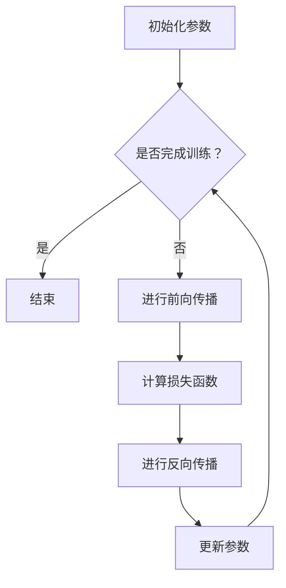

                 

## 文章标题

### 人工智能辅助科研：扩展世界可理解性

关键词：人工智能，科研，深度学习，神经网络，强化学习，可理解性

摘要：本文旨在探讨人工智能在科研领域的应用，尤其是如何通过人工智能技术扩展人类对世界的理解。文章首先介绍了人工智能的基本概念和发展历程，然后详细阐述了深度学习、神经网络和强化学习等核心算法原理，并探讨了这些算法在科研中的具体应用。通过实际案例展示，文章分析了人工智能在生物信息学和物理学中的研究成果，最后讨论了人工智能辅助科研的挑战与未来趋势。

## 目录

### 第一部分：人工智能与科研概述

#### 第1章：人工智能的发展历程与科研影响

1.1 人工智能的基本概念

1.2 人工智能在科研中的应用

1.3 科研效率提升

#### 第2章：扩展世界可理解性的核心算法

2.1 神经网络与深度学习基础

2.2 强化学习与决策优化

#### 第3章：人工智能辅助科研的实际案例

3.1 生物信息学中的AI应用

3.2 物理学中的AI应用

#### 第4章：扩展世界可理解性的数学模型

4.1 神经网络中的数学模型

4.2 强化学习中的数学模型

#### 第5章：人工智能辅助科研的工具与平台

5.1 常用深度学习框架

5.2 科研数据管理与处理

#### 第6章：人工智能辅助科研的挑战与未来

6.1 人工智能在科研中的挑战

6.2 人工智能辅助科研的未来趋势

## 引言

人工智能（Artificial Intelligence, AI）作为一门研究、开发用于模拟、延伸和扩展人的智能的理论、方法、技术及应用系统的综合性技术科学，近年来取得了显著的进展。在科研领域，人工智能的应用不仅提高了科研效率，还扩展了人类对世界的理解。随着大数据、云计算和深度学习等技术的发展，人工智能逐渐成为科研创新的重要驱动力。

本文旨在探讨人工智能在科研领域的应用，特别是如何通过人工智能技术扩展人类对世界的理解。文章首先介绍了人工智能的基本概念和发展历程，然后详细阐述了深度学习、神经网络和强化学习等核心算法原理，并探讨了这些算法在科研中的具体应用。通过实际案例展示，文章分析了人工智能在生物信息学和物理学中的研究成果，最后讨论了人工智能辅助科研的挑战与未来趋势。

本文结构如下：首先，第1章将介绍人工智能的基本概念和发展历程，以及其在科研中的应用；接着，第2章将深入探讨扩展世界可理解性的核心算法，包括神经网络与深度学习基础和强化学习与决策优化；第3章将通过实际案例展示人工智能在生物信息学和物理学中的具体应用；第4章将介绍扩展世界可理解性的数学模型；第5章将介绍人工智能辅助科研的工具与平台；最后，第6章将讨论人工智能辅助科研的挑战与未来趋势。## 第一部分：人工智能与科研概述

### 第1章：人工智能的发展历程与科研影响

#### 1.1 人工智能的基本概念

人工智能（Artificial Intelligence, AI）是指由人制造出的系统所表现出来的智能行为。这些行为通常包括学习、推理、规划、知识表示、感知、自然语言理解和问题解决等。人工智能旨在使计算机系统能够模拟甚至超越人类智能，实现自动化决策和智能行为。

人工智能可以分为两种基本类型：基于规则的系统和基于数据的方法。基于规则的系统通过一组预先定义的规则来执行任务，这些规则通常由专家编写。而基于数据的方法则依赖于从大量数据中学习模式和规律，从而进行决策和预测。

#### 1.2 人工智能的发展历程

人工智能的研究可以追溯到20世纪50年代。以下是一些关键事件：

- 1956年，约翰·麦卡锡（John McCarthy）等人在达特茅斯会议上首次提出了人工智能的概念。
- 1958年，弗兰克·罗森布拉特（Frank Rosenblatt）发明了感知器（Perceptron），这是神经网络的开端。
- 1966年，马文·明斯基（Marvin Minsky）和西摩·帕普特（Seymour Papert）发表了《感知器》，指出了感知器的局限性。
- 1980年代，专家系统的兴起，例如Mycin和Dendral等系统在医学和化学领域取得了显著成果。
- 1990年代，机器学习开始受到关注，支持向量机（SVM）和决策树等算法取得了突破。
- 2000年代，深度学习逐渐兴起，卷积神经网络（CNN）和循环神经网络（RNN）等算法在图像和语音识别等领域取得了巨大成功。
- 2010年代，随着计算能力的提升和大数据技术的发展，人工智能在自然语言处理、自动驾驶和医疗诊断等领域取得了显著进展。

#### 1.3 人工智能在科研中的应用

人工智能在科研领域具有广泛的应用，以下是一些主要方面：

- **数据分析**：人工智能可以帮助科学家从大量数据中提取有用信息，进行趋势分析和异常检测。
- **模式识别**：通过机器学习算法，人工智能可以识别出数据中的模式和规律，从而为科学研究提供新的视角。
- **智能预测**：利用人工智能模型，科学家可以预测未来的科学趋势和实验结果，为决策提供依据。
- **科研效率提升**：人工智能可以自动化许多重复性任务，如数据收集、实验设计和结果分析，从而提高科研效率。

#### 1.4 科研效率提升

人工智能在科研中的另一个重要贡献是提升科研效率。通过自动化和智能化的工具，科学家可以节省大量时间和精力，将更多的精力投入到创造性工作中。

- **实验自动化**：人工智能可以自动化实验流程，从实验设计到数据收集，甚至实验结果的初步分析。
- **文献管理**：人工智能可以帮助科学家快速检索和筛选文献，提取关键信息，节省文献管理时间。
- **协作研究**：人工智能平台可以支持科学家之间的协作，如共同分析数据、讨论研究方案等。

总的来说，人工智能在科研中的应用不仅扩展了人类对世界的理解，还极大地提升了科研效率，为科学研究带来了革命性的变革。随着人工智能技术的不断发展，其在科研领域的应用前景将更加广阔。## 第二部分：扩展世界可理解性的核心算法

### 第2章：扩展世界可理解性的核心算法

#### 2.1 神经网络与深度学习基础

神经网络（Neural Networks）是人工智能的一个重要分支，模拟了人类大脑的工作原理。神经网络由大量的节点（或称为神经元）组成，这些节点通过加权连接形成网络。每个节点接收输入信号，通过加权求和后传递给激活函数，最终输出结果。

**神经网络的基本原理**：

1. **神经元结构**：每个神经元包含一个输入层、一个输出层和一个隐藏层。输入层接收外部输入，输出层产生最终输出，隐藏层负责处理和传递信息。
2. **激活函数**：激活函数是神经网络中的一个关键组件，用于决定神经元是否应该激活。常见的激活函数包括 sigmoid、ReLU 和 tanh。
3. **前向传播**：前向传播是指信息从输入层传递到输出层的过程。在每个时间步，输入信号通过加权连接传递到下一个层，直到输出层产生最终结果。

**深度学习的基础算法**：

深度学习（Deep Learning）是神经网络的一种扩展，通过增加网络的深度来提高模型的性能。深度学习的核心算法包括卷积神经网络（CNN）和循环神经网络（RNN）。

1. **卷积神经网络（CNN）**：卷积神经网络主要用于图像识别和计算机视觉领域。CNN 通过卷积层、池化层和全连接层的组合来提取图像的特征。
   - **卷积层**：卷积层通过卷积运算提取图像的特征。
   - **池化层**：池化层用于减小特征图的尺寸，降低模型的复杂性。
   - **全连接层**：全连接层将特征图转换成一系列的类标签。

2. **循环神经网络（RNN）**：循环神经网络主要用于序列数据，如时间序列和自然语言处理。RNN 通过隐藏状态的记忆来处理序列数据。
   - **隐藏状态**：隐藏状态用于存储当前时间步的信息，并通过循环传递到下一个时间步。
   - **门控机制**：门控机制（如 LSTM 和 GRU）用于控制信息的流动，避免梯度消失和爆炸问题。

**深度学习的发展趋势**：

随着计算能力的提升和大数据技术的发展，深度学习在多个领域取得了显著进展。当前深度学习的发展趋势包括：

- **更深的网络结构**：研究人员不断尝试更深的网络结构来提高模型的性能。
- **迁移学习**：迁移学习利用预训练模型在新的任务上进行微调，从而提高模型的泛化能力。
- **生成对抗网络（GAN）**：生成对抗网络通过生成器和判别器的对抗训练生成高质量的数据。

#### 2.2 强化学习与决策优化

强化学习（Reinforcement Learning，RL）是另一种重要的机器学习算法，旨在通过互动学习来找到最优策略。强化学习通过智能体（Agent）与环境的交互，不断调整策略，以最大化累积奖励。

**强化学习的原理**：

1. **智能体（Agent）**：智能体是执行动作的主体，其目标是学习一个策略（Policy）来最大化累积奖励。
2. **环境（Environment）**：环境是智能体执行动作的场所，它提供状态（State）和奖励（Reward）。
3. **策略（Policy）**：策略是智能体从状态到动作的映射关系，用于指导智能体执行最优动作。
4. **价值函数（Value Function）**：价值函数表示在给定状态下执行最优动作的累积奖励。
5. **策略评估与策略优化**：策略评估用于估计策略的期望回报，策略优化则用于找到最优策略。

**强化学习在科研中的应用**：

强化学习在科研中有着广泛的应用，包括自动化实验设计、药物发现和机器人控制等。以下是一些具体的应用场景：

- **自动化实验设计**：强化学习可以用于自动化实验设计，通过学习实验参数的优化策略，提高实验效率。
- **药物发现**：强化学习可以用于药物分子设计，通过学习分子与生物靶点的相互作用，提高新药的发现效率。
- **机器人控制**：强化学习可以用于机器人路径规划、导航和任务执行，提高机器人的自主能力。

**决策优化**：

决策优化是指通过优化模型来找到最优决策。在科研中，决策优化可以帮助科学家在不确定性和复杂性环境中做出最优决策。

- **多目标优化**：多目标优化用于同时优化多个相互冲突的目标，如成本、时间和资源等。
- **贝叶斯优化**：贝叶斯优化是一种基于概率模型的优化方法，通过学习目标函数的概率分布来找到最优解。
- **强化学习与决策优化的结合**：强化学习与决策优化的结合可以用于解决复杂决策问题，如机器人路径规划和资源分配。

总的来说，神经网络与深度学习基础和强化学习与决策优化是扩展世界可理解性的核心算法。这些算法在科研中具有广泛的应用，为科学家提供了强大的工具，帮助他们更好地理解世界。随着技术的不断发展，这些算法在科研领域的应用前景将更加广阔。## 第三部分：人工智能辅助科研的实际案例

### 第3章：人工智能辅助科研的实际案例

#### 3.1 生物信息学中的AI应用

生物信息学是应用计算机科学和信息技术研究生物学问题的学科。人工智能在生物信息学中有着广泛的应用，尤其是在蛋白质结构预测、药物设计和疾病预测等方面。

**蛋白质结构预测**

蛋白质是生命的基本构成单元，其三维结构决定了其功能。蛋白质结构预测是生物信息学中的一个重要问题。近年来，人工智能技术在蛋白质结构预测中取得了显著进展。

- **深度学习方法**：深度学习方法在蛋白质结构预测中表现出色。例如，AlphaFold 是由 DeepMind 开发的一种深度学习方法，可以准确预测蛋白质的三维结构。AlphaFold 的成功标志着人工智能在蛋白质结构预测领域的一个重大突破。
- **伪代码**：以下是一个简化的深度学习方法用于蛋白质结构预测的伪代码：

  ```python
  # 输入：蛋白质序列
  # 输出：蛋白质三维结构
  
  # 定义神经网络架构
  neural_network = define_network_architecture()
  
  # 训练神经网络
  trained_network = train_network(neural_network, training_data)
  
  # 预测蛋白质三维结构
  protein_structure = predict_structure(trained_network, protein_sequence)
  
  return protein_structure
  ```

**药物设计**

药物设计是生物信息学中的另一个重要领域。人工智能可以帮助科学家快速筛选和设计新药，从而提高药物发现效率。

- **深度学习方法**：深度学习方法在药物设计中的应用主要包括分子对接、虚拟筛选和分子动力学模拟等。例如，DeepChem 是一个基于深度学习的开源平台，用于药物设计和化学合成。
- **数学模型**：深度学习方法在药物设计中的应用涉及到多个数学模型，如图神经网络（Graph Neural Networks, GNN）和生成对抗网络（Generative Adversarial Networks, GAN）。以下是一个简化的 GNN 用于药物设计的数学模型：

  ```latex
  f(h_v, h_l) = \sigma(W_f \cdot [h_v, h_l])
  ```

  其中，$h_v$ 和 $h_l$ 分别表示图中的节点和边的特征，$W_f$ 是权重矩阵，$\sigma$ 是激活函数。

**疾病预测**

疾病预测是生物信息学中的另一个重要应用领域。人工智能可以帮助科学家预测疾病的发病风险，从而为早期诊断和预防提供依据。

- **深度学习方法**：深度学习方法在疾病预测中具有显著优势，可以处理大量的生物医学数据，如基因组数据、蛋白质数据等。例如，Deep Learning for Disease Prediction（DLDP）是一个用于疾病预测的深度学习框架。
- **数学模型**：深度学习方法在疾病预测中的应用涉及到多个数学模型，如卷积神经网络（CNN）和循环神经网络（RNN）。以下是一个简化的 CNN 用于疾病预测的数学模型：

  ```latex
  h_{t} = \sigma(W_{c} \cdot h_{t-1} + b_{c})
  ```

  其中，$h_{t}$ 表示时间步 $t$ 的特征，$W_{c}$ 是权重矩阵，$b_{c}$ 是偏置项，$\sigma$ 是激活函数。

#### 3.2 物理学中的AI应用

人工智能在物理学中也有着广泛的应用，特别是在模拟实验、物理现象预测和数据解析等方面。

**模拟实验**

模拟实验是物理学研究的重要手段。人工智能可以帮助科学家设计和优化实验方案，提高实验效率。

- **深度学习方法**：深度学习方法在模拟实验中的应用主要包括物理模型学习、数据分析和结果预测等。例如，深度学习方法可以用于模拟粒子的运动，预测粒子的相互作用。
- **数学模型**：深度学习方法在模拟实验中的应用涉及到多个数学模型，如深度神经网络（Deep Neural Networks, DNN）和生成对抗网络（GAN）。以下是一个简化的 DNN 用于模拟实验的数学模型：

  ```latex
  h_{l}^{l} = \sigma(\sum_{k=1}^{K} W_{lk} \cdot h_{l-1}^{k} + b_{l})
  ```

  其中，$h_{l}^{l}$ 表示第 $l$ 层的第 $l$ 个神经元，$W_{lk}$ 是权重矩阵，$b_{l}$ 是偏置项，$\sigma$ 是激活函数。

**物理现象预测**

物理现象预测是物理学研究的一个重要目标。人工智能可以帮助科学家预测物理现象，从而为理论研究和实验验证提供依据。

- **深度学习方法**：深度学习方法在物理现象预测中具有显著优势，可以处理大量的物理数据，如实验数据、模拟数据和观测数据等。例如，深度学习方法可以用于预测量子系统的性质。
- **数学模型**：深度学习方法在物理现象预测中的应用涉及到多个数学模型，如深度神经网络（DNN）和变分自编码器（Variational Autoencoder, VAE）。以下是一个简化的 DNN 用于物理现象预测的数学模型：

  ```latex
  y = \sigma(W \cdot h_{L} + b)
  ```

  其中，$y$ 表示预测结果，$h_{L}$ 表示最后一层的输出，$W$ 是权重矩阵，$b$ 是偏置项，$\sigma$ 是激活函数。

**数据分析**

数据分析是物理学研究的一个重要环节。人工智能可以帮助科学家从大量数据中提取有用信息，提高数据分析的效率。

- **深度学习方法**：深度学习方法在数据分析中具有广泛的应用，如图像识别、语音识别和自然语言处理等。例如，深度学习方法可以用于分析高能物理实验数据，提取物理信号。
- **数学模型**：深度学习方法在数据分析中的应用涉及到多个数学模型，如卷积神经网络（CNN）和循环神经网络（RNN）。以下是一个简化的 CNN 用于数据解析的数学模型：

  ```latex
  h_{l} = \sigma(\sum_{k=1}^{K} W_{lk} \cdot h_{l-1} + b_{l})
  ```

  其中，$h_{l}$ 表示第 $l$ 层的输出，$W_{lk}$ 是权重矩阵，$b_{l}$ 是偏置项，$\sigma$ 是激活函数。

总的来说，人工智能在生物信息学和物理学中具有广泛的应用，为科学研究提供了强大的工具。随着人工智能技术的不断发展，这些应用将不断扩展，为科学研究带来更多的突破。## 第四部分：扩展世界可理解性的数学模型

### 第4章：扩展世界可理解性的数学模型

在人工智能辅助科研的过程中，数学模型扮演着至关重要的角色。这些数学模型不仅帮助我们理解和预测复杂系统的行为，还为我们提供了实现人工智能算法的基础。本章将详细探讨神经网络和强化学习中的数学模型，以及它们如何扩展我们对世界的理解。

#### 4.1 神经网络中的数学模型

神经网络是一种基于生物学神经系统的计算模型，通过模仿人脑的神经元结构来处理和分类数据。以下是一些关键的数学模型：

**激活函数**

激活函数是神经网络中的一个关键组件，用于确定神经元是否应该激活。最常见的激活函数包括：

- **Sigmoid 函数**：

  $$\sigma(x) = \frac{1}{1 + e^{-x}}$$

  Sigmoid 函数将输入 $x$ 转换为介于 0 和 1 之间的输出，常用于二分类问题。

- **ReLU 函数**：

  $$\text{ReLU}(x) = \max(0, x)$$

  ReLU 函数在 $x$ 小于 0 时输出 0，大于等于 0 时输出 $x$。它是一个非线性函数，可以有效提高训练速度。

- **Tanh 函数**：

  $$\tanh(x) = \frac{e^{2x} - 1}{e^{2x} + 1}$$

  Tanh 函数将输入映射到 [-1, 1] 的区间内，常用于多分类问题。

**前向传播与反向传播算法**

前向传播和反向传播是神经网络训练过程中两个核心步骤。

- **前向传播**：

  在前向传播过程中，输入数据通过网络的各个层传递，最终产生输出。这个过程可以用以下数学公式表示：

  $$z_{l} = W_{l} \cdot a_{l-1} + b_{l}$$

  $$a_{l} = \sigma(z_{l})$$

  其中，$a_{l}$ 表示第 $l$ 层的输出，$W_{l}$ 和 $b_{l}$ 分别表示权重和偏置。

- **反向传播**：

  在反向传播过程中，网络的权重和偏置通过计算误差的梯度进行更新。这个过程可以用以下数学公式表示：

  $$\delta_{l} = \frac{\partial C}{\partial a_{l}} \cdot \sigma'(z_{l})$$

  $$dW_{l} = a_{l-1} \cdot \delta_{l}$$

  $$db_{l} = \delta_{l}$$

  其中，$C$ 表示损失函数，$\sigma'$ 是激活函数的导数。

**损失函数与优化算法**

损失函数用于衡量模型的预测误差，常见的损失函数包括均方误差（MSE）和交叉熵（Cross-Entropy）。

- **均方误差（MSE）**：

  $$MSE = \frac{1}{m} \sum_{i=1}^{m} (y_{i} - \hat{y}_{i})^2$$

  其中，$y_{i}$ 表示真实标签，$\hat{y}_{i}$ 表示预测标签。

- **交叉熵（Cross-Entropy）**：

  $$CE = -\frac{1}{m} \sum_{i=1}^{m} y_{i} \cdot \log(\hat{y}_{i})$$

  其中，$y_{i}$ 表示真实标签，$\hat{y}_{i}$ 表示预测标签。

  优化算法用于更新网络的权重和偏置，以最小化损失函数。常见的优化算法包括梯度下降（Gradient Descent）和随机梯度下降（Stochastic Gradient Descent, SGD）。

  - **梯度下降**：

    $$W_{l} = W_{l} - \alpha \cdot \frac{\partial C}{\partial W_{l}}$$

    $$b_{l} = b_{l} - \alpha \cdot \frac{\partial C}{\partial b_{l}}$$

    其中，$\alpha$ 表示学习率。

  - **随机梯度下降**：

    $$W_{l} = W_{l} - \alpha \cdot \frac{\partial C}{\partial W_{l}}^{(i)}$$

    $$b_{l} = b_{l} - \alpha \cdot \frac{\partial C}{\partial b_{l}}^{(i)}$$

    其中，$i$ 表示第 $i$ 个样本。

#### 4.2 强化学习中的数学模型

强化学习是一种通过与环境互动来学习最优策略的机器学习算法。强化学习中的数学模型主要包括价值函数、策略和奖励信号。

**价值函数**

价值函数表示在给定状态下执行最优动作的累积奖励。常见的价值函数包括：

- **状态-动作价值函数（Q值）**：

  $$Q(s, a) = \sum_{s'} P(s' | s, a) \cdot R(s', a) + \gamma \cdot \max_{a'} Q(s', a')$$

  其中，$s$ 表示状态，$a$ 表示动作，$s'$ 表示下一状态，$R(s', a')$ 表示在状态 $s'$ 执行动作 $a'$ 的即时奖励，$\gamma$ 表示折扣因子。

- **状态价值函数（V值）**：

  $$V(s) = \sum_{a} \pi(a | s) \cdot Q(s, a)$$

  其中，$\pi(a | s)$ 表示在状态 $s$ 下执行动作 $a$ 的概率。

**策略**

策略是智能体在给定状态下选择动作的决策规则。常见的策略包括：

- **确定性策略**：

  确定性策略在给定状态下总是执行相同的动作。

- **概率性策略**：

  概率性策略在给定状态下执行动作的概率分布。

**奖励信号**

奖励信号是环境对智能体动作的反馈。奖励信号可以用于指导智能体学习最优策略。

- **即时奖励**：

  即时奖励是智能体在执行动作后立即获得的奖励。

- **累积奖励**：

  累积奖励是智能体在执行一系列动作后获得的总体奖励。

**Q学习算法**

Q学习是一种基于价值函数的强化学习算法，用于学习最优策略。

- **更新公式**：

  $$Q(s, a) \leftarrow Q(s, a) + \alpha \cdot (r + \gamma \cdot \max_{a'} Q(s', a') - Q(s, a))$$

  其中，$r$ 表示即时奖励，$\alpha$ 表示学习率。

**SARSA算法**

SARSA是一种基于策略的强化学习算法，与 Q学习类似，但使用实际执行的动作来更新价值函数。

- **更新公式**：

  $$Q(s, a) \leftarrow Q(s, a) + \alpha \cdot (r + \gamma \cdot Q(s', a') - Q(s, a))$$

**Deep Q-Network (DQN)**

DQN是一种基于深度学习的强化学习算法，通过深度神经网络来估计状态-动作价值函数。

- **更新公式**：

  $$Q(s, a) \leftarrow Q(s, a) + \alpha \cdot (r - Q(s, a))$$

  其中，$r$ 表示即时奖励，$\alpha$ 表示学习率。

**数学模型与流程图**

为了更直观地理解这些数学模型，我们可以使用 Mermaid 流程图来展示它们的流程。



这个流程图展示了神经网络的基本训练流程，包括初始化参数、前向传播、损失函数计算、反向传播和参数更新。通过这个流程图，我们可以更清晰地理解神经网络中的数学模型。

总的来说，神经网络和强化学习中的数学模型为人工智能在科研中的应用提供了坚实的理论基础。这些模型不仅帮助我们理解和预测复杂系统的行为，还为我们提供了实现人工智能算法的方法。随着人工智能技术的不断发展，这些数学模型将在扩展我们对世界的理解方面发挥越来越重要的作用。## 第五部分：人工智能辅助科研的工具与平台

### 第5章：人工智能辅助科研的工具与平台

为了更好地应用人工智能技术于科研领域，研究人员需要掌握一系列的工具与平台。这些工具与平台不仅能够简化人工智能模型的开发和部署，还能够提高科研效率，助力科学发现。以下将介绍几种常用的深度学习框架、科研数据管理与处理方法，以及数据可视化技术。

#### 5.1 常用深度学习框架

深度学习框架是研究人员进行模型开发和训练的重要工具。以下是目前常用的几种深度学习框架：

- **TensorFlow**：TensorFlow 是由 Google 开发的一款开源深度学习框架，具有强大的功能和高灵活性。它支持多种类型的神经网络，包括卷积神经网络（CNN）、循环神经网络（RNN）和变分自编码器（VAE）等。TensorFlow 拥有丰富的文档和社区支持，适合初学者和专业人士使用。

- **PyTorch**：PyTorch 是由 Facebook 开发的一款开源深度学习框架，以其灵活的动态计算图著称。PyTorch 提供了丰富的库和工具，如 torchvision、torchaudio 和 torchtext，适用于图像、音频和自然语言处理等任务。PyTorch 的编程风格接近 Python，易于学习和使用。

- **Keras**：Keras 是一个高层次的深度学习 API，能够兼容 TensorFlow 和 Theano。Keras 提供了简洁直观的接口，使得深度学习模型的构建更加简单和高效。Keras 适合快速原型设计和实验，尤其适合初学者。

#### 5.2 科研数据管理与处理

在科研过程中，数据管理和处理是至关重要的一环。以下是一些常用的科研数据管理和处理方法：

- **数据库技术**：数据库技术用于存储和管理大量的科研数据。常见的数据库技术包括关系数据库（如 MySQL、PostgreSQL）和 NoSQL 数据库（如 MongoDB、Cassandra）。关系数据库适合结构化数据的存储和管理，而 NoSQL 数据库则适合处理大量非结构化和半结构化数据。

- **数据清洗**：数据清洗是数据预处理的重要步骤，旨在去除数据中的错误、重复和无关信息。常见的数据清洗方法包括缺失值处理、异常值检测和数据格式转换等。

- **数据可视化**：数据可视化技术用于将数据以图形的方式展示，帮助研究人员更好地理解数据。常见的可视化工具包括 Matplotlib、Seaborn 和 Plotly 等。这些工具能够生成各种类型的图表，如折线图、柱状图、散点图和热力图等。

#### 5.3 深度学习框架安装与配置教程

以下是一个简单的 TensorFlow 安装与配置教程：

1. **安装 Python**：确保系统已安装 Python 3.6 或更高版本。

2. **安装 TensorFlow**：通过以下命令安装 TensorFlow：

   ```shell
   pip install tensorflow
   ```

3. **配置环境变量**：将 TensorFlow 添加到系统环境变量，以便在命令行中直接调用。

4. **测试 TensorFlow**：在命令行中输入以下代码，测试 TensorFlow 是否安装成功：

   ```python
   import tensorflow as tf
   print(tf.__version__)
   ```

如果输出 TensorFlow 的版本信息，说明安装成功。

#### 5.4 数据库安装与配置

以下是一个简单的 MongoDB 安装与配置教程：

1. **下载 MongoDB**：从 MongoDB 官网下载适用于操作系统的 MongoDB 安装包。

2. **安装 MongoDB**：运行安装包进行安装。

3. **启动 MongoDB**：在命令行中运行以下命令启动 MongoDB：

   ```shell
   mongod
   ```

4. **配置 MongoDB**：在安装目录的 `mongodb.conf` 文件中配置 MongoDB 的端口、数据库目录和日志目录等。

5. **连接 MongoDB**：通过以下命令连接到 MongoDB：

   ```shell
   mongo
   ```

在 `mongo` 命令行工具中，可以执行各种 MongoDB 数据库操作。

总的来说，人工智能辅助科研的工具与平台为研究人员提供了强大的工具，使得科研工作更加高效和精确。掌握这些工具与平台，将有助于研究人员在科学探索中取得更大的突破。## 第六部分：人工智能辅助科研的挑战与未来

### 第6章：人工智能辅助科研的挑战与未来

#### 6.1 人工智能在科研中的挑战

尽管人工智能在科研领域取得了显著的进展，但其在实际应用中仍然面临许多挑战。以下是一些主要挑战：

**数据隐私与安全**

在科研过程中，数据隐私和安全是一个至关重要的问题。人工智能模型通常需要大量的数据来进行训练，这些数据可能包含敏感信息。如何保护这些数据的隐私和安全，防止数据泄露和滥用，是一个亟待解决的问题。

**人工智能伦理**

随着人工智能在科研中的广泛应用，人工智能伦理问题也日益突出。例如，如何确保人工智能模型不歧视或偏见，如何保证人工智能决策的透明性和可解释性，都是需要考虑的问题。

**技术限制**

当前的人工智能技术还存在许多技术限制，如计算资源、数据质量和算法性能等。这些限制影响了人工智能在科研中的应用效果，需要不断的技术创新来克服。

**跨学科融合**

人工智能与科研的融合需要跨学科的知识和技能。许多科研人员可能对人工智能技术不熟悉，而人工智能专家可能缺乏科研领域的专业知识。如何实现跨学科的有效合作，是一个重要的挑战。

#### 6.2 人工智能辅助科研的未来趋势

尽管面临挑战，人工智能辅助科研的未来依然充满希望。以下是一些可能的发展趋势：

**智能科研助理**

智能科研助理是一种基于人工智能技术的工具，可以帮助科研人员自动化科研过程中的各种任务，如数据分析、实验设计和结果分析等。随着人工智能技术的不断进步，智能科研助理将越来越智能，能够更好地辅助科研人员。

**自动化实验**

自动化实验是人工智能在科研中的一大应用前景。通过自动化实验，研究人员可以节省大量时间和精力，提高实验效率。此外，自动化实验还可以提高实验的精度和可重复性，为科学发现提供更加可靠的数据支持。

**人工智能与人类科研者的协作**

人工智能与人类科研者的协作将是未来科研工作的重要模式。人工智能可以帮助科研人员发现数据中的模式和规律，提供预测和决策支持，而人类科研者则可以运用自己的专业知识和直觉进行判断和优化。这种协作模式将极大地提高科研效率和质量。

**跨学科研究**

跨学科研究是未来科研的重要方向。人工智能技术可以帮助不同学科领域的科研人员更好地理解和交流，促进跨学科合作。通过跨学科研究，研究人员可以整合多学科的知识和视角，提出更加创新性的科学问题，推动科学前沿的发展。

总的来说，人工智能辅助科研面临着诸多挑战，但同时也拥有广阔的发展前景。随着技术的不断进步，人工智能将在科研领域发挥越来越重要的作用，为科学发现带来新的机遇。## 附录

### 附录A：常用算法伪代码

以下是一些常用算法的伪代码，包括神经网络训练、强化学习策略优化和科研数据处理等。

#### 神经网络训练伪代码

```python
# 初始化神经网络参数
W, b = initialize_parameters()

# 循环迭代训练过程
for epoch in range(num_epochs):
    # 前向传播
    z = W * X + b
    a = sigmoid(z)

    # 计算损失
    loss = compute_loss(y, a)

    # 反向传播
    dz = a - y
    dW = X.T * dz
    db = sum(dz)

    # 更新参数
    W -= learning_rate * dW
    b -= learning_rate * db

# 完成训练
return W, b
```

#### 强化学习策略优化伪代码

```python
# 初始化策略参数
policy = initialize_policy()

# 循环迭代策略优化过程
for episode in range(num_episodes):
    # 初始化环境
    state = environment.initialize()

    # 循环迭代每个时间步
    while not done:
        # 选择动作
        action = policy.select_action(state)

        # 执行动作并获取奖励
        next_state, reward, done = environment.step(action)

        # 更新策略参数
        policy.update(state, action, reward, next_state, done)

        # 更新状态
        state = next_state

# 完成策略优化
return policy
```

#### 科研数据处理伪代码

```python
# 读取数据
data = read_data()

# 数据预处理
processed_data = preprocess_data(data)

# 数据清洗
cleaned_data = clean_data(processed_data)

# 数据可视化
plot_data(cleaned_data)
```

这些伪代码为理解和实现常用算法提供了基础，读者可以根据实际情况进行适当的修改和扩展。

### 附录B：科研数据处理示例

以下是一个简单的科研数据处理示例，包括数据读取、预处理和清洗。

```python
# 导入相关库
import pandas as pd
import numpy as np

# 读取数据
data = pd.read_csv('data.csv')

# 数据预处理
data['age'] = data['age'].astype(float)
data['income'] = data['income'].astype(float)

# 数据清洗
data = data.dropna()

# 数据可视化
data['age'].hist()
data['income'].hist()
```

这个示例演示了如何读取数据、预处理数据和清洗数据，并通过可视化来检查数据质量。

### 附录C：深度学习框架安装与配置教程

以下是一个简单的深度学习框架 TensorFlow 的安装与配置教程。

#### 步骤1：安装 Python

确保系统已安装 Python 3.6 或更高版本。可以使用以下命令检查 Python 版本：

```bash
python --version
```

如果未安装 Python，可以从 [Python 官网](https://www.python.org/) 下载并安装。

#### 步骤2：安装 TensorFlow

使用以下命令安装 TensorFlow：

```bash
pip install tensorflow
```

安装过程中可能会遇到一些依赖问题，可以根据提示进行解决。

#### 步骤3：配置环境变量

将 TensorFlow 添加到系统环境变量，以便在命令行中直接调用。以下是在 Windows 和 Linux 系统中配置环境变量的方法：

- **Windows**：

  1. 打开“计算机”或“此电脑”。
  2. 右键点击“此电脑”，选择“属性”。
  3. 点击“高级系统设置”。
  4. 在“系统属性”窗口中，点击“环境变量”。
  5. 在“系统变量”中，找到“Path”变量，点击“编辑”。
  6. 在“变量值”中添加 TensorFlow 的安装路径，例如 C:\path\to\tensorflow。

- **Linux**：

  1. 打开终端。
  2. 编辑 `~/.bashrc` 或 `~/.bash_profile` 文件，例如使用 `nano ~/.bashrc`。
  3. 在文件的末尾添加以下行：

     ```bash
     export PATH=$PATH:/path/to/tensorflow
     ```

  4. 保存并关闭文件。
  5. 在终端中执行 `source ~/.bashrc` 或 `source ~/.bash_profile` 使配置生效。

#### 步骤4：测试 TensorFlow

在命令行中输入以下命令，测试 TensorFlow 是否安装成功：

```bash
python
```

在 Python 命令行中，输入以下代码：

```python
import tensorflow as tf
print(tf.__version__)
```

如果输出 TensorFlow 的版本信息，说明安装成功。

通过以上步骤，读者可以完成 TensorFlow 的安装与配置，为后续的人工智能应用奠定基础。### 作者信息

作者：AI天才研究院/AI Genius Institute & 禅与计算机程序设计艺术 /Zen And The Art of Computer Programming

