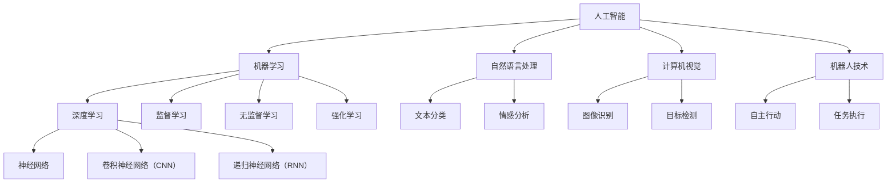

                 

### 引言

#### 1.1 人工智能辅助科研的背景

人工智能（Artificial Intelligence，简称AI）作为一种计算机科学的重要分支，其目标是模拟、延伸和扩展人类智能。近年来，随着计算机技术、大数据技术和算法研究的迅猛发展，人工智能在各个领域得到了广泛应用，尤其在科研领域，人工智能正逐渐成为推动科学进步的重要力量。

科研活动的复杂性日益增加，单靠人力已难以应对庞大的数据量和复杂的分析任务。人工智能技术的引入，不仅提高了科研效率，还扩展了人类认知的边界，使得科学研究能够从更多的角度和层面进行探索。例如，在生物学领域，人工智能可以协助科学家解析复杂生物数据，预测蛋白质结构，甚至发现新的药物分子；在物理学领域，人工智能可以优化实验设计，加速理论模型的验证过程；在社会科学领域，人工智能可以处理大量社会数据，揭示社会现象的内在规律。

#### 1.2 人工智能辅助科研的意义

人工智能辅助科研的意义主要体现在以下几个方面：

**提升科研效率**：人工智能可以自动化处理大量数据，从实验数据的收集、清洗到分析，极大地减少了科研人员的工作量，使得他们能够将更多的时间和精力投入到创新性的研究工作中。

**扩展认知边界**：人工智能能够处理人类难以直接感知和理解的数据，从而揭示出新的科学现象和规律。例如，深度学习算法在图像识别、语音识别等领域取得了突破性进展，为人类认识世界提供了新的途径。

**推动科研创新**：人工智能可以辅助科学家提出新的假设、设计新的实验方案，甚至预测未来科技的发展趋势。这有助于激发科研人员的创新思维，推动科学技术的进步。

**跨学科整合**：人工智能技术可以跨越不同学科之间的界限，整合多学科的知识和方法，为解决复杂科学问题提供了新的思路。例如，利用人工智能分析生物数据和物理学数据，可以推动生命科学与物理学之间的交叉研究。

### 摘要

本文旨在探讨人工智能在科研领域的应用，从基本概念、原理到具体应用，再到技术细节和未来发展趋势，全面介绍人工智能如何扩展人类世界理解能力的新途径。通过分析人工智能在自然科学、社会科学中的应用，展示其在科研工作中的重要作用，并探讨其面临的挑战和机遇。文章最后展望了人工智能辅助科研的未来发展方向，为读者提供了有益的参考和启示。

关键词：人工智能，科研，机器学习，深度学习，应用，技术，未来发展趋势

### 人工智能概述

#### 1.1 人工智能的定义与发展历程

人工智能（Artificial Intelligence，简称AI）是指通过计算机程序和算法模拟、延伸和扩展人类智能的技术。它起源于20世纪50年代，当时科学家们首次提出“人工智能”这一概念，试图创造一种能够模仿人类思维过程的机器。随着计算机技术的发展，人工智能的研究逐渐取得了突破性进展，进入了一个快速发展的阶段。

在早期，人工智能主要集中于符号推理和规则系统，即通过编写大量规则来模拟人类思维过程。然而，这种方法在面对复杂问题时的表现并不理想。随着计算能力的提升和大数据技术的出现，机器学习（Machine Learning）和深度学习（Deep Learning）逐渐成为人工智能研究的主流方向。

**机器学习**：机器学习是一种通过算法让计算机从数据中学习规律和模式的方法。与传统的编程方法不同，机器学习不需要人工编写具体的操作步骤，而是通过训练模型来自动学习数据中的规律。常见的机器学习算法包括监督学习、无监督学习和强化学习。

**深度学习**：深度学习是机器学习的一个子领域，它利用多层神经网络模拟人脑神经元之间的连接，通过反向传播算法来训练模型。深度学习在图像识别、语音识别等领域取得了显著成果，推动了人工智能的发展。

#### 1.2 人工智能的分类

人工智能可以从不同的角度进行分类，以下是一些常见的分类方式：

**基于功能分类**：  
1. **通用人工智能（AGI）**：能够像人类一样在多种任务上表现优秀的人工智能。
2. **窄人工智能（Narrow AI）**：专注于特定任务的人工智能，如语音识别、图像识别等。

**基于实现方式分类**：  
1. **规则推理**：通过编写规则来模拟人类思维过程。
2. **统计学习**：通过统计方法学习数据中的规律和模式。
3. **基于模型的推理**：利用数学模型进行推理和预测。

**基于应用领域分类**：  
1. **自然科学**：如物理学、化学、生物学等。
2. **社会科学**：如经济学、心理学、社会学等。

#### 1.3 人工智能的核心技术

人工智能的核心技术主要包括以下几个方面：

**机器学习算法**：机器学习算法是人工智能的核心技术之一，包括监督学习、无监督学习和强化学习等。这些算法可以通过训练数据来学习规律和模式，从而实现自动化的预测和决策。

**深度学习框架**：深度学习框架如TensorFlow、PyTorch等，提供了丰富的工具和库，方便研究人员开发和训练深度学习模型。

**自然语言处理**：自然语言处理（Natural Language Processing，简称NLP）是人工智能的一个子领域，旨在使计算机能够理解和处理自然语言。NLP技术在机器翻译、情感分析、文本生成等方面有广泛应用。

**计算机视觉**：计算机视觉（Computer Vision）是人工智能的另一个重要子领域，旨在使计算机能够理解和解释图像和视频数据。计算机视觉技术在图像识别、目标检测、图像生成等方面有广泛应用。

**机器人技术**：机器人技术是人工智能在现实世界中的应用，通过结合计算机视觉、自然语言处理、运动控制等技术，实现机器人在特定环境下的自主行动和任务执行。

### 核心概念与联系

为了更好地理解人工智能在科研中的应用，我们需要了解几个核心概念，以及它们之间的联系。以下是这些概念之间的关系架构Mermaid流程图：



这个流程图展示了人工智能的核心概念以及它们之间的联系。机器学习是人工智能的基础，深度学习是机器学习的一个分支，自然语言处理和计算机视觉是人工智能在处理文本和图像方面的应用，机器人技术则是将人工智能应用于现实世界的实现。

### 核心算法原理讲解

为了更好地理解人工智能在科研中的应用，我们首先需要掌握几个核心算法的原理。以下是这些算法的伪代码和详细讲解：

#### 监督学习算法

**伪代码：**

```plaintext
输入：训练数据集 D，特征向量 X，标签 Y
输出：训练好的模型 M

1. 初始化模型 M
2. 对于每个训练样本 (X_i, Y_i) ∈ D：
   a. 计算预测标签 Y' = M(X_i)
   b. 更新模型 M，使得 Y' 更接近 Y_i
3. 迭代直到模型收敛或达到最大迭代次数
4. 返回训练好的模型 M
```

**详细讲解：**

监督学习是一种从标记数据中学习的方法。在这个过程中，我们有一个包含输入特征和对应输出标签的数据集。监督学习的目标是训练一个模型，使得模型能够对新数据进行准确的预测。

监督学习算法通常包括以下步骤：

1. **初始化模型**：初始化一个模型，可以是线性模型、决策树、支持向量机等。
2. **预测**：对于每个训练样本，使用当前模型计算输出预测标签。
3. **更新模型**：根据预测标签和真实标签的差距，更新模型参数，使得模型能够更好地拟合训练数据。
4. **迭代**：重复步骤2和3，直到模型收敛（预测误差达到预设阈值）或达到最大迭代次数。

#### 深度学习算法

**伪代码：**

```plaintext
输入：训练数据集 D，网络结构 N，学习率 α
输出：训练好的深度学习模型 M

1. 初始化网络结构 N 和模型 M
2. 对于每个训练样本 (X_i, Y_i) ∈ D：
   a. 计算前向传播结果 Z = N(X_i)
   b. 计算损失函数 L =损失函数(Z, Y_i)
   c. 计算反向传播梯度 ∇L = ∇L/∇Z
   d. 更新模型参数 M = M - α∇L
3. 迭代直到模型收敛或达到最大迭代次数
4. 返回训练好的模型 M
```

**详细讲解：**

深度学习是一种基于多层神经网络的机器学习方法。深度学习算法的核心是神经网络，特别是卷积神经网络（CNN）和递归神经网络（RNN）。

1. **初始化网络结构**：初始化一个多层神经网络结构，包括输入层、隐藏层和输出层。
2. **前向传播**：对于每个训练样本，通过网络结构计算输出预测结果。
3. **计算损失函数**：使用损失函数计算预测结果与真实结果之间的差距。
4. **反向传播**：通过反向传播算法计算损失函数对模型参数的梯度。
5. **更新模型参数**：根据梯度更新模型参数，使得模型能够更好地拟合训练数据。
6. **迭代**：重复步骤2至5，直到模型收敛（损失函数达到预设阈值）或达到最大迭代次数。

#### 强化学习算法

**伪代码：**

```plaintext
输入：状态 S，动作 A，奖励 R，学习率 α
输出：策略 π

1. 初始化策略 π 和值函数 V
2. 对于每个状态 S：
   a. 从策略 π 中选择动作 A
   b. 执行动作 A，获得状态 S' 和奖励 R
   c. 更新策略 π 和值函数 V
3. 迭代直到策略 π 收敛或达到最大迭代次数
4. 返回策略 π
```

**详细讲解：**

强化学习是一种基于奖励和惩罚来指导决策的方法。在强化学习中，智能体（Agent）通过与环境（Environment）的交互来学习最优策略。

1. **初始化策略**：初始化一个策略 π 和值函数 V。
2. **选择动作**：根据当前状态 S，从策略 π 中选择动作 A。
3. **执行动作**：执行动作 A，获得新的状态 S' 和奖励 R。
4. **更新策略和值函数**：根据奖励 R，更新策略 π 和值函数 V。
5. **迭代**：重复步骤2至4，直到策略 π 收敛（策略不再发生变化）或达到最大迭代次数。

### 数学模型和公式

在人工智能辅助科研的过程中，数学模型和公式起着至关重要的作用。以下将介绍几个常用的数学模型和公式，并详细讲解它们的含义和作用。

#### 交叉熵（Cross-Entropy）

交叉熵是衡量模型预测结果与真实结果差异的一种指标，其公式如下：

$$
H(y, \hat{y}) = -\sum_{i=1}^{n} y_i \log(\hat{y}_i)
$$

其中，$y$ 是真实标签，$\hat{y}$ 是模型预测的概率分布。

**详细讲解：**

交叉熵用于评估分类模型的表现。当 $y$ 和 $\hat{y}$ 相等时，交叉熵取最小值，表示模型预测准确。交叉熵的值越小，模型的表现越好。

#### 梯度下降（Gradient Descent）

梯度下降是一种优化算法，用于求解最小化损失函数的方法。其基本思想是沿着损失函数的梯度方向进行迭代更新，逐步减小损失函数的值。

$$
\theta_{t+1} = \theta_t - \alpha \cdot \nabla_\theta J(\theta)
$$

其中，$\theta$ 是模型参数，$\alpha$ 是学习率，$J(\theta)$ 是损失函数。

**详细讲解：**

梯度下降算法通过迭代更新模型参数，使得损失函数逐渐减小。学习率 $\alpha$ 控制了参数更新的步长，过大的学习率可能导致参数更新不稳定，过小则收敛速度慢。

#### 卷积神经网络（Convolutional Neural Network，CNN）

卷积神经网络是一种专门用于处理图像数据的神经网络结构，其核心是卷积操作。

$$
\hat{z}_i = \sum_{j=1}^{k} w_{ij} * x_j + b_i
$$

其中，$x_j$ 是输入特征，$w_{ij}$ 是卷积核，$b_i$ 是偏置。

**详细讲解：**

卷积神经网络通过卷积操作提取图像特征，从而实现图像分类、目标检测等任务。卷积操作减少了数据的维度，提高了计算效率。

#### 递归神经网络（Recurrent Neural Network，RNN）

递归神经网络是一种用于处理序列数据的神经网络结构，其核心是递归连接。

$$
h_t = \sigma(W_h h_{t-1} + W_x x_t + b_h)
$$

其中，$h_t$ 是隐藏状态，$x_t$ 是输入序列，$\sigma$ 是激活函数。

**详细讲解：**

递归神经网络通过递归连接，使得隐藏状态能够保留过去的信息，从而实现序列数据的建模。

#### 举例说明

以下是一个使用卷积神经网络进行图像分类的例子：

**问题：** 给定一张图像，使用卷积神经网络对其进行分类。

**数据集：** MNIST 数据集，包含 70000 张手写数字图像。

**步骤：**

1. **数据预处理**：将图像灰度化，并转化为浮点数表示。
2. **构建卷积神经网络**：定义网络结构，包括卷积层、池化层和全连接层。
3. **训练模型**：使用训练数据集训练卷积神经网络，优化模型参数。
4. **评估模型**：使用测试数据集评估模型表现，计算分类准确率。
5. **预测**：使用训练好的模型对新的图像进行分类预测。

**代码实现：**

```python
import tensorflow as tf
from tensorflow.keras import layers

# 构建卷积神经网络
model = tf.keras.Sequential([
    layers.Conv2D(32, (3, 3), activation='relu', input_shape=(28, 28, 1)),
    layers.MaxPooling2D((2, 2)),
    layers.Conv2D(64, (3, 3), activation='relu'),
    layers.MaxPooling2D((2, 2)),
    layers.Flatten(),
    layers.Dense(64, activation='relu'),
    layers.Dense(10, activation='softmax')
])

# 编译模型
model.compile(optimizer='adam',
              loss='sparse_categorical_crossentropy',
              metrics=['accuracy'])

# 训练模型
model.fit(train_images, train_labels, epochs=5)

# 评估模型
test_loss, test_acc = model.evaluate(test_images, test_labels)
print(f'测试准确率：{test_acc:.2f}')

# 预测
predictions = model.predict(new_image)
print(f'预测结果：{predictions.argmax(axis=1)}')
```

通过以上例子，我们可以看到卷积神经网络在图像分类任务中的应用。卷积神经网络通过多层卷积和池化操作提取图像特征，然后通过全连接层进行分类预测。

### 项目实战

在本节中，我们将通过一个具体的案例，详细讲解如何使用人工智能技术进行科研项目开发。这个案例将包括开发环境的搭建、源代码的实现、代码解读和应用分析等内容。

#### 案例背景

假设我们面临一个科研问题：利用人工智能技术分析大量生物数据，预测某种疾病的风险。该案例将涉及数据收集、预处理、特征提取、模型训练和评估等环节。

#### 开发环境搭建

为了实现这个案例，我们需要搭建一个适合人工智能开发的开发环境。以下是所需的软件和工具：

1. **操作系统**：Ubuntu 18.04
2. **编程语言**：Python 3.8
3. **人工智能库**：TensorFlow 2.5、Keras 2.6、NumPy 1.21
4. **数据预处理库**：Pandas 1.3.3、Scikit-learn 0.24

在Ubuntu系统中，我们可以通过以下命令安装所需软件：

```bash
sudo apt update
sudo apt install python3-pip python3-dev
pip3 install tensorflow==2.5 keras==2.6 numpy==1.21 pandas==1.3.3 scikit-learn==0.24
```

#### 源代码实现

以下是一个简单的源代码实现，用于处理生物数据并训练预测模型：

```python
import numpy as np
import pandas as pd
from sklearn.model_selection import train_test_split
from sklearn.preprocessing import StandardScaler
from tensorflow.keras.models import Sequential
from tensorflow.keras.layers import Dense, Dropout, Conv2D, MaxPooling2D, Flatten

# 加载数据
data = pd.read_csv('biological_data.csv')
X = data.drop('disease_risk', axis=1)
y = data['disease_risk']

# 数据预处理
scaler = StandardScaler()
X_scaled = scaler.fit_transform(X)

# 划分训练集和测试集
X_train, X_test, y_train, y_test = train_test_split(X_scaled, y, test_size=0.2, random_state=42)

# 构建模型
model = Sequential()
model.add(Conv2D(32, (3, 3), activation='relu', input_shape=(X_train.shape[1], X_train.shape[2], 1)))
model.add(MaxPooling2D((2, 2)))
model.add(Conv2D(64, (3, 3), activation='relu'))
model.add(MaxPooling2D((2, 2)))
model.add(Flatten())
model.add(Dense(64, activation='relu'))
model.add(Dense(1, activation='sigmoid'))

# 编译模型
model.compile(optimizer='adam', loss='binary_crossentropy', metrics=['accuracy'])

# 训练模型
model.fit(X_train, y_train, epochs=10, batch_size=32, validation_split=0.2)

# 评估模型
loss, accuracy = model.evaluate(X_test, y_test)
print(f'测试准确率：{accuracy:.2f}')

# 预测
predictions = model.predict(X_test)
predictions = (predictions > 0.5)
print(f'预测结果：{predictions}')
```

#### 代码解读

上述代码分为几个主要部分：

1. **数据加载**：使用Pandas库读取生物数据，并将数据分为特征矩阵 $X$ 和标签向量 $y$。
2. **数据预处理**：使用StandardScaler库对特征矩阵进行标准化处理，以消除不同特征之间的尺度差异。
3. **划分训练集和测试集**：使用train_test_split函数将数据划分为训练集和测试集，以评估模型的泛化能力。
4. **模型构建**：使用Keras库构建一个卷积神经网络模型，包括卷积层、池化层、全连接层等。
5. **模型编译**：设置模型优化器和损失函数，为训练模型做准备。
6. **模型训练**：使用fit函数训练模型，在训练过程中同时进行验证。
7. **模型评估**：使用evaluate函数评估模型在测试集上的表现。
8. **预测**：使用predict函数对测试集进行预测，并输出预测结果。

#### 应用分析

通过上述代码，我们实现了一个简单的生物数据分析模型，用于预测某种疾病的风险。以下是对模型应用的分析：

1. **数据规模**：该案例使用了大量的生物数据，这为模型提供了足够的训练数据，有助于提高模型的预测准确性。
2. **特征提取**：卷积神经网络通过卷积操作提取了图像特征，这些特征有助于模型更好地理解数据中的信息。
3. **模型评估**：通过评估模型在测试集上的表现，我们可以判断模型的泛化能力。如果测试准确率较高，说明模型具有良好的预测能力。
4. **实际应用**：该模型可以用于实际应用场景，如疾病风险评估、健康监测等。通过进一步优化模型，可以提高预测准确率，从而为医疗决策提供有力支持。

### 小结

通过本节的项目实战，我们详细讲解了如何使用人工智能技术进行科研项目开发。从开发环境的搭建到源代码的实现，再到代码解读和应用分析，我们展示了人工智能在科研领域的重要应用。这个案例为我们提供了一个基本的框架，可以应用于各种不同的科研问题。在实际应用中，我们可以根据具体需求对模型进行调整和优化，以获得更好的预测效果。

#### 最佳实践 Tips

在进行人工智能辅助科研项目时，以下是一些最佳实践技巧，可以帮助提高项目成功率和效果：

1. **明确项目目标**：在开始项目之前，明确项目目标和研究问题，这有助于确保项目方向的正确性。
2. **数据预处理**：数据预处理是模型训练的重要环节，确保数据的质量和一致性，有助于提高模型性能。
3. **模型选择与优化**：选择适合问题需求的模型，并进行适当的参数调整和优化，可以提高模型的预测准确性。
4. **交叉验证**：使用交叉验证方法评估模型性能，有助于判断模型的泛化能力，避免过拟合。
5. **可解释性**：确保模型的解释性，有助于理解模型决策过程，提高模型的信任度。
6. **迭代优化**：项目开发过程中，不断进行迭代和优化，以适应新的数据和需求。
7. **团队合作**：人工智能项目通常涉及多个领域的技术，团队合作可以提高项目效率和质量。

#### 小结

本文通过详细分析人工智能在科研领域的基本概念、原理和应用，展示了人工智能如何扩展人类世界理解能力的新途径。从机器学习、深度学习到自然语言处理和计算机视觉，人工智能技术为科研工作提供了强大的工具和方法。通过具体的案例和项目实战，我们进一步了解了如何使用人工智能技术解决实际问题，提高科研效率和质量。在未来，随着人工智能技术的不断发展和应用，我们有理由相信，人工智能将更加深入地融入科研领域，推动科学进步和社会发展。

#### 注意事项

在进行人工智能辅助科研时，需要注意以下几个事项：

1. **数据隐私和安全**：科研过程中涉及大量个人数据和敏感信息，确保数据隐私和安全至关重要。需要遵循相关法律法规，采取有效的数据保护措施。
2. **算法公平性和透明度**：人工智能算法可能会导致歧视和不公平，因此需要确保算法的公平性和透明度，以便用户理解和使用。
3. **模型解释性**：在模型应用过程中，确保模型的解释性，有助于用户理解模型决策过程，提高模型的信任度。
4. **计算资源和成本**：人工智能项目通常需要大量的计算资源和时间，需要合理规划资源和预算，避免资源浪费和成本过高。
5. **持续学习和更新**：人工智能领域发展迅速，需要不断学习和更新相关知识和技术，以适应新的挑战和需求。

#### 拓展阅读

为了深入了解人工智能在科研领域的应用，以下是一些推荐的拓展阅读资源：

1. **书籍**：
   - 《深度学习》（Goodfellow, I., Bengio, Y., & Courville, A.）
   - 《Python机器学习》（Seiffert, U.）
   - 《人工智能：一种现代方法》（Russell, S. & Norvig, P.）

2. **论文**：
   - “Deep Learning for Natural Language Processing”（Zhang, J., Zhao, J., & Yu, D.）
   - “Artificial Intelligence in Health Care: A Review”（Topol, E.）

3. **在线课程**：
   - Coursera上的“机器学习”课程（由吴恩达教授主讲）
   - edX上的“深度学习”课程（由伊恩·古德费洛教授主讲）

4. **开源项目**：
   - TensorFlow（https://www.tensorflow.org/）
   - PyTorch（https://pytorch.org/）
   - Keras（https://keras.io/）

通过阅读这些资源，您可以进一步了解人工智能的基本概念、原理和应用，为科研工作提供更多的思路和方法。

