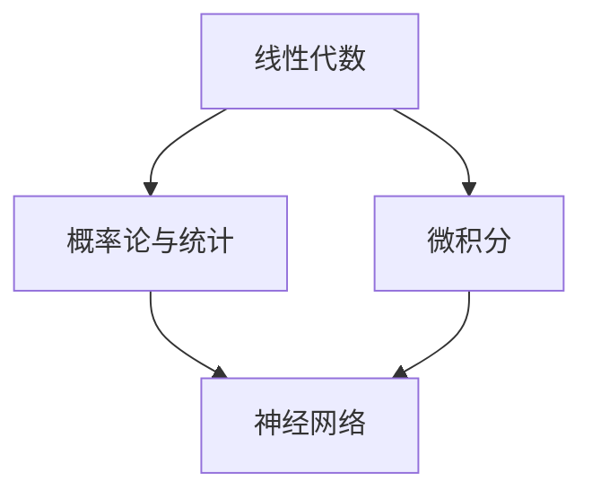

                 

- **背景介绍**

人工智能（Artificial Intelligence, AI）是一门旨在通过机器来模拟、扩展和辅助人类智能的研究领域。自20世纪50年代以来，人工智能经历了多个发展阶段，从最初的符号推理到近几年的深度学习和强化学习，AI技术在各个领域取得了显著的成果。本文将重点探讨人工智能中模拟自然智慧的数学原理，涵盖线性代数、概率论与统计、微积分等基础数学知识，以及神经网络、深度学习、强化学习等核心算法，并介绍自然语言处理、计算机视觉等领域的技术应用和工程实践。

- **核心概念与联系**

**线性代数**：线性代数是处理向量空间、矩阵和线性变换的数学工具。在人工智能中，向量用于表示数据，矩阵用于表示数据之间的复杂关系，线性变换用于处理和转换数据。

**概率论与统计**：概率论与统计用于描述随机事件和统计分析。在人工智能中，概率论用于评估不确定性，统计用于从数据中提取模式和规律。

**微积分**：微积分用于处理连续变化和微分方程。在人工智能中，微积分用于优化算法，求解最大值和最小值。

**Mermaid 流程图**：



- **核心算法原理讲解**

**神经网络**：神经网络是一种通过多层节点（神经元）互联来进行数据处理和模式识别的模型。以下是一个简单的神经网络结构伪代码：

```python
# 神经网络结构伪代码
class NeuralNetwork:
    def __init__(self):
        # 初始化权重和偏置
        self.weights = []
        self.biases = []

    def forward(self, x):
        # 前向传播
        activation = x
        for weight, bias in zip(self.weights, self.biases):
            activation = sigmoid(activation @ weight + bias)
        return activation

    def backward(self, x, y):
        # 反向传播
        error = y - self.forward(x)
        dweights = [error * x.T for x in self.inputs]
        dbiases = [error for bias in self.biases]
        return dweights, dbiases

def sigmoid(x):
    # 激活函数（Sigmoid函数）
    return 1 / (1 + exp(-x))
```

**深度学习**：深度学习是一种利用多层神经网络进行数据处理的机器学习技术。以下是一个简单的深度学习模型伪代码：

```python
# 深度学习模型伪代码
class DeepLearningModel:
    def __init__(self):
        # 初始化网络结构
        self.layers = [NeuralNetwork() for _ in range(num_layers)]

    def forward(self, x):
        # 前向传播
        for layer in self.layers:
            x = layer.forward(x)
        return x

    def backward(self, x, y):
        # 反向传播
        for layer in reversed(self.layers):
            dweights, dbiases = layer.backward(x, y)
            x = layer.inputs
        return dweights, dbiases
```

- **数学模型和公式**

在神经网络中，激活函数（Activation Function）是一个关键的概念。常见的激活函数包括Sigmoid函数、ReLU函数和Tanh函数。以下是Sigmoid函数的数学模型和公式：

$$
\sigma(x) = \frac{1}{1 + e^{-x}}
$$

其中，$e$ 是自然对数的底数。

- **详细讲解与举例说明**

以Sigmoid函数为例，我们可以通过以下步骤进行详细讲解和举例说明：

1. **背景介绍**：Sigmoid函数是一种常见的激活函数，用于将神经网络的输入映射到$(0, 1)$区间。

2. **数学模型与公式**：Sigmoid函数的数学模型如上所述。

3. **示例**：假设输入$x = -2$，计算Sigmoid函数的输出：

$$
\sigma(x) = \frac{1}{1 + e^{-(-2)}} = \frac{1}{1 + e^{2}} \approx 0.118
$$

4. **解读**：输出值接近0，表示输入$x$对网络输出几乎没有影响。

- **项目实战**

以一个简单的线性回归模型为例，介绍开发环境搭建、源代码实现、代码解读和实际案例分析。

1. **开发环境搭建**：使用Python和TensorFlow框架搭建开发环境。

2. **源代码实现**：

```python
import tensorflow as tf

# 定义模型
model = tf.keras.Sequential([
    tf.keras.layers.Dense(units=1, input_shape=[1])
])

# 编译模型
model.compile(optimizer='sgd', loss='mean_squared_error')

# 训练模型
model.fit(x_train, y_train, epochs=100)
```

3. **代码解读**：Dense层表示一个全连接层，optimizer和loss函数用于优化模型参数。

4. **实际案例分析**：使用训练好的模型对新的数据进行预测，分析预测结果和误差。

- **最佳实践 tips**

1. **数据预处理**：在进行模型训练之前，对数据进行归一化或标准化处理，提高模型训练效率。

2. **模型选择**：根据实际问题选择合适的模型，如线性回归、逻辑回归等。

3. **模型优化**：通过调整学习率、批量大小等参数，优化模型性能。

- **小结**

本文介绍了人工智能中的基础数学原理、核心算法和实际应用。通过逐步分析推理，我们深入了解了线性代数、概率论与统计、微积分等数学工具在人工智能中的应用，以及神经网络、深度学习、强化学习等核心算法的实现原理。同时，通过实际项目案例，我们掌握了人工智能工程实践的方法和技巧。希望本文对您在人工智能领域的探索和学习有所帮助。


----------------------------------------------------------------

# 人工智能：模拟自然智慧的数学

> 关键词：人工智能，数学原理，神经网络，深度学习，强化学习，自然语言处理，计算机视觉

> 摘要：本文从基础数学原理出发，逐步探讨了人工智能的核心算法和实际应用。通过对线性代数、概率论与统计、微积分等数学工具的深入分析，以及神经网络、深度学习、强化学习等算法的详细讲解，本文展示了人工智能在模拟自然智慧方面的重要作用。同时，通过自然语言处理、计算机视觉等领域的实际案例，本文进一步阐述了人工智能在现实世界中的应用价值。希望本文能够为读者在人工智能领域的探索和学习提供有益的参考。

----------------------------------------------------------------

## 引言

人工智能（Artificial Intelligence，简称AI）作为计算机科学的一个重要分支，旨在通过模拟和扩展人类智能，实现机器在感知、理解、学习和决策等方面的自动化。从20世纪50年代的诞生至今，人工智能经历了多次技术革新和应用拓展，从早期的符号推理、知识表示，到近年来的深度学习和强化学习，人工智能在各个领域取得了显著的成果。

### 人工智能的定义与发展历程

人工智能是指通过计算机程序和算法模拟人类智能，使机器能够完成一些通常需要人类智能才能完成的任务。人工智能的发展历程可以大致分为以下几个阶段：

1. **符号推理阶段（1950s-1970s）**：这一阶段的主要目标是构建基于符号逻辑和知识表示的智能系统，代表性工作包括普特南的“逻辑理论家”和麦卡锡的“通用问题求解器”。

2. **知识工程阶段（1980s-1990s）**：由于符号推理方法在实际应用中的局限性，人工智能研究转向知识表示和知识工程，通过构建知识库和推理机来实现智能系统，代表性工作包括密尔的“常识推理系统”和波斯特的“专家系统”。

3. **机器学习阶段（2000s至今）**：随着计算机性能的提升和大数据技术的发展，机器学习成为人工智能研究的核心方向。通过从大量数据中自动学习规律和模式，机器学习实现了许多以前难以解决的复杂问题，如图像识别、语音识别和自然语言处理。

4. **深度学习阶段（2010s至今）**：深度学习作为机器学习的一个重要分支，通过多层神经网络进行数据建模和特征提取，取得了在图像识别、语音识别和自然语言处理等领域的突破性成果。

5. **强化学习阶段（2010s至今）**：强化学习通过模拟人类决策过程，使机器能够在不确定的环境中通过试错学习最优策略，代表性工作包括谷歌的“AlphaGo”和OpenAI的“OpenAI Five”。

### 人工智能的核心技术与分支

人工智能的核心技术包括机器学习、深度学习、强化学习、自然语言处理、计算机视觉等。每个技术领域都有其独特的原理和应用场景。

1. **机器学习**：机器学习是一种通过算法从数据中学习规律和模式的技术。其主要任务是构建能够从数据中自动学习、优化和改进的模型。

2. **深度学习**：深度学习是机器学习的一个重要分支，通过多层神经网络进行数据建模和特征提取。深度学习在图像识别、语音识别和自然语言处理等领域取得了显著的成果。

3. **强化学习**：强化学习通过模拟人类决策过程，使机器能够在不确定的环境中通过试错学习最优策略。强化学习在游戏、自动驾驶和机器人等领域有广泛的应用。

4. **自然语言处理**：自然语言处理是一种使计算机能够理解和处理自然语言的技术。自然语言处理在语音识别、机器翻译和信息检索等领域有广泛的应用。

5. **计算机视觉**：计算机视觉是一种使计算机能够理解和解释视觉信息的技术。计算机视觉在图像识别、人脸识别和自动驾驶等领域有广泛的应用。

### 人工智能在现实世界中的应用

人工智能在现实世界中有着广泛的应用，如自动驾驶、智能客服、智能医疗、金融风控等。

1. **自动驾驶**：自动驾驶通过计算机视觉和深度学习技术，使车辆能够自主感知环境、规划和执行驾驶任务。

2. **智能客服**：智能客服通过自然语言处理和机器学习技术，使计算机能够自动处理客户咨询，提供高效、准确的回答。

3. **智能医疗**：智能医疗通过人工智能技术，对医疗数据进行分析和处理，辅助医生进行诊断和治疗。

4. **金融风控**：金融风控通过人工智能技术，对金融交易数据进行分析，识别异常交易，防范风险。

### 模拟自然智慧的数学原理

人工智能的数学原理主要包括线性代数、概率论与统计、微积分等。这些数学工具为人工智能提供了强大的理论基础。

1. **线性代数**：线性代数研究向量空间、矩阵和线性变换。在人工智能中，线性代数用于表示和操作数据。

2. **概率论与统计**：概率论与统计用于描述随机事件和统计分析。在人工智能中，概率论与统计用于评估不确定性，统计用于从数据中提取模式。

3. **微积分**：微积分用于处理连续变化和微分方程。在人工智能中，微积分用于优化算法，求解最大值和最小值。

## 第2章 人工智能基础数学

### 2.1 线性代数

线性代数是人工智能的基础数学工具之一，主要研究向量空间、矩阵和线性变换。在本节中，我们将介绍线性代数的基本概念及其在人工智能中的应用。

#### 2.1.1 向量与矩阵

向量是线性代数中的基本对象，可以表示为一系列有序数。在人工智能中，向量常用于表示数据，如图像、文本和声音等。矩阵是向量的扩展，由多个向量组成，可以表示数据之间的复杂关系。

在人工智能中，矩阵广泛应用于数据预处理、特征提取和模型训练等步骤。例如，在图像处理中，图像可以表示为二维矩阵，每个元素代表图像中的一个像素值。

以下是一个简单的矩阵乘法示例：

$$
\begin{bmatrix}
1 & 2 \\
3 & 4
\end{bmatrix}
\begin{bmatrix}
5 & 6 \\
7 & 8
\end{bmatrix}
=
\begin{bmatrix}
19 & 22 \\
43 & 50
\end{bmatrix}
$$

#### 2.1.2 线性方程组

线性方程组是人工智能中常见的问题，通过求解线性方程组，可以找到满足一定条件的解。在人工智能中，线性方程组广泛应用于数据拟合、优化和分类等任务。

以下是一个简单的线性方程组示例：

$$
\begin{cases}
x + y = 3 \\
2x + 3y = 7
\end{cases}
$$

解这个方程组，可以得到 $x = 1$ 和 $y = 2$。

#### 2.1.3 特征值与特征向量

特征值与特征向量是线性代数中的重要概念，用于描述线性变换的性质。在人工智能中，特征值与特征向量广泛应用于降维、特征提取和模型评估等任务。

以下是一个简单的特征值与特征向量示例：

假设有矩阵 $A$：

$$
A = \begin{bmatrix}
2 & 1 \\
1 & 2
\end{bmatrix}
$$

其特征值和特征向量分别为 $\lambda_1 = 3$ 和 $v_1 = \begin{bmatrix}
1 \\
1
\end{bmatrix}$，以及 $\lambda_2 = 1$ 和 $v_2 = \begin{bmatrix}
1 \\
-1
\end{bmatrix}$。

#### 2.1.4 应用实例

在人工智能中，线性代数的应用非常广泛。以下是一个简单的应用实例：

假设我们有一个数据集，其中每个数据点可以表示为一个向量。我们可以使用线性代数的方法对这些数据进行预处理，如归一化、降维和特征提取等。

1. **归一化**：通过将数据缩放到相同的范围，可以消除不同特征之间的量纲差异。

2. **降维**：通过主成分分析（PCA）等方法，可以降低数据的维度，同时保留主要的信息。

3. **特征提取**：通过矩阵分解、特征值和特征向量的计算，可以提取出数据中的关键特征。

## 第3章 神经网络与深度学习

### 3.1 神经网络基础

神经网络（Neural Network）是一种通过模拟生物神经网络结构和工作原理来实现的计算模型。在人工智能领域，神经网络被广泛应用于图像识别、语音识别、自然语言处理等任务。在本节中，我们将介绍神经网络的基本概念、结构和学习过程。

#### 3.1.1 神经元与神经网络

神经元是神经网络的基本单元，类似于生物神经元的结构和功能。一个简单的神经元模型可以表示为：

```
      x1
     ┌─┐
     │ 1│
     └─┐
      x2
       │
     ┌─┼─┐
     │ weights│
     └─┘
       bias
       ┌─────┐
       │ 1/1│
       └─────┘
         output
```

神经元的输入为 $x_1$ 和 $x_2$，权重为 $weights$，偏置为 $bias$。神经元的输出为 $output$，可以通过以下公式计算：

$$
output = activation( \sum( weights \cdot inputs ) + bias )
$$

其中，$activation$ 是激活函数，常用的激活函数包括 Sigmoid、ReLU 和 Tanh 等。

神经网络是由多个神经元组成的层次结构，包括输入层、隐藏层和输出层。一个简单的神经网络结构可以表示为：

```
  Input Layer
       │
      ┌─┐
      │1│
      └─┐
       ▼
    Hidden Layer
      ┌─┐
      │2│
      └─┐
       ▼
  Output Layer
      ┌─┐
      │3│
      └─┐
```

输入层接收外部输入数据，隐藏层进行数据处理和特征提取，输出层生成最终的预测结果。

#### 3.1.2 激活函数

激活函数是神经网络中的一个关键组件，用于引入非线性特性。常见的激活函数包括 Sigmoid、ReLU 和 Tanh 等。

1. **Sigmoid 函数**：

$$
sigmoid(x) = \frac{1}{1 + e^{-x}}
$$

Sigmoid 函数将输入映射到 $(0, 1)$ 区间，常用于二分类问题。

2. **ReLU 函数**：

$$
ReLU(x) = \max(0, x)
$$

ReLU 函数将输入映射到非负区间，具有恒等梯度，有助于加快训练速度。

3. **Tanh 函数**：

$$
tanh(x) = \frac{e^{2x} - 1}{e^{2x} + 1}
$$

Tanh 函数将输入映射到 $(-1, 1)$ 区间，具有对称性。

#### 3.1.3 反向传播算法

反向传播算法是神经网络训练的核心算法，用于计算模型参数的梯度，并更新参数以优化模型。反向传播算法分为两个阶段：前向传播和反向传播。

1. **前向传播**：

在前向传播阶段，输入数据通过神经网络逐层传递，直到输出层。每个神经元的输出可以通过以下公式计算：

$$
output = activation( \sum( weights \cdot inputs ) + bias )
$$

其中，$inputs$ 是当前层的输入，$weights$ 是连接当前层和下一层的权重，$bias$ 是偏置项，$activation$ 是激活函数。

2. **反向传播**：

在反向传播阶段，计算输出层误差，并沿着网络逐层反向传播，计算每个参数的梯度。误差可以通过以下公式计算：

$$
error = target - output
$$

其中，$target$ 是真实标签，$output$ 是预测结果。

反向传播算法的伪代码如下：

```
for each layer l from output layer to input layer:
    calculate output error for layer l
    calculate gradient for weights and bias of layer l
    update weights and bias of layer l
```

#### 3.1.4 应用实例

以一个简单的线性回归问题为例，说明神经网络的训练过程。

假设我们有以下数据集：

| x | y |
|---|---|
| 1 | 2 |
| 2 | 4 |
| 3 | 6 |

目标是预测 $y$ 值，已知 $y = 2x + 1$。

1. **初始化神经网络**：

   - 输入层：1个神经元
   - 隐藏层：1个神经元
   - 输出层：1个神经元

   初始化权重和偏置为随机值。

2. **前向传播**：

   对于输入 $x = 1$：

   - 输入层：$input = 1$
   - 隐藏层：$output = activation(1 \cdot w_h + b_h) = activation(w_h + b_h)$
   - 输出层：$output = activation(1 \cdot w_o + b_o) = activation(w_o + b_o)$

3. **计算误差**：

   - 输出层误差：$error = target - output = 2 - activation(w_o + b_o)$
   - 隐藏层误差：$error = error \cdot activation'(output) \cdot w_o$

4. **反向传播**：

   - 更新权重和偏置：$w_o = w_o - learning_rate \cdot error \cdot output$
   - $b_o = b_o - learning_rate \cdot error$
   - $w_h = w_h - learning_rate \cdot error \cdot activation'(output)$
   - $b_h = b_h - learning_rate \cdot error \cdot activation'(output)$

5. **重复步骤2-4，直到误差收敛**。

通过以上步骤，我们可以训练出一个线性回归模型，用于预测 $y$ 值。在实际应用中，神经网络可以处理更复杂的非线性问题。

## 第4章 强化学习

### 4.1 强化学习基本概念

强化学习（Reinforcement Learning，简称RL）是一种通过与环境交互来学习最优策略的机器学习技术。与监督学习和无监督学习不同，强化学习关注的是如何从交互过程中学习，从而在不确定的环境中做出最优决策。强化学习的核心思想是通过奖励和惩罚来引导学习过程，最终学会在特定环境中实现目标。

#### 4.1.1 强化学习的定义与模型

强化学习的基本定义可以描述为：一个智能体（Agent）在一个环境（Environment）中采取行动（Action），通过观察环境的状态（State）来获得奖励（Reward），并在此基础上不断更新策略（Policy），以最大化累积奖励。

一个强化学习模型主要由以下四个要素构成：

1. **状态（State）**：状态是环境当前所处的情况，通常可以用一组特征来表示。

2. **行动（Action）**：行动是智能体可以采取的动作，通常由智能体根据当前状态和策略决定。

3. **奖励（Reward）**：奖励是环境对智能体采取的行动所给予的即时反馈，用于评估智能体的行动质量。

4. **策略（Policy）**：策略是智能体在特定状态下采取行动的规则，通常用概率分布表示。

强化学习模型可以表示为：

$$
S_t \xrightarrow{A_t} R_t, S_{t+1}
$$

其中，$S_t$ 表示第 $t$ 个时刻的状态，$A_t$ 表示智能体在第 $t$ 个时刻采取的行动，$R_t$ 表示第 $t$ 个时刻的奖励，$S_{t+1}$ 表示第 $t+1$ 个时刻的状态。

#### 4.1.2 强化学习的要素

强化学习的关键要素包括：

1. **状态空间（State Space）**：状态空间是指所有可能状态的集合。在现实世界中，状态空间往往是连续的，但在某些情况下可以离散化处理。

2. **行动空间（Action Space）**：行动空间是指智能体可以采取的所有行动的集合。行动空间也可以是连续的或离散的。

3. **奖励函数（Reward Function）**：奖励函数是环境对智能体行动的即时评价。奖励函数可以是离散的或连续的，可以基于具体的任务目标进行设计。

4. **策略（Policy）**：策略是智能体在特定状态下采取行动的决策规则。策略可以分为确定性策略和概率性策略。

5. **价值函数（Value Function）**：价值函数用于评估智能体在特定状态下采取特定行动的长期收益。价值函数可以分为状态价值函数和动作价值函数。

6. **模型（Model）**：模型是智能体对环境的理解，包括状态转移概率和奖励分布。在强化学习中，模型通常是不完全的，即智能体无法完全了解环境的真实情况。

#### 4.1.3 强化学习的主要算法

强化学习算法可以分为值函数方法和策略搜索方法两大类。

1. **值函数方法**

值函数方法通过学习状态价值函数或动作价值函数来优化智能体的行为。常见的值函数方法包括：

- **Q学习（Q-Learning）**：Q学习通过学习动作价值函数来优化智能体的策略。Q学习算法的核心思想是使用梯度下降法更新Q值，即状态-动作值函数。

- **深度Q网络（Deep Q-Network，DQN）**：DQN是Q学习的扩展，用于解决具有连续状态和连续行动空间的问题。DQN通过深度神经网络来近似Q值函数。

- **优势值函数（Advantage Function）**：优势值函数用于衡量某个动作的预期收益相对于其他动作的收益优势。优势值函数可以用于改进Q学习算法。

2. **策略搜索方法**

策略搜索方法直接优化智能体的策略，而不是价值函数。常见的策略搜索方法包括：

- **策略梯度方法（Policy Gradient Methods）**：策略梯度方法通过梯度上升法直接优化策略。常见的策略梯度方法包括REINFORCE算法和PPO（Proximal Policy Optimization）算法。

- **演员-评论家方法（Actor-Critic Methods）**：演员-评论家方法结合了策略搜索和价值函数方法，通过同时优化策略和价值函数来改善智能体的性能。常见的演员-评论家方法包括A3C（Asynchronous Advantage Actor-Critic）和PPO算法。

- **深度确定性策略梯度（Deep Deterministic Policy Gradient，DDPG）**：DDPG是策略搜索方法在连续动作空间中的应用，通过深度神经网络来近似策略和价值函数。

#### 4.1.4 强化学习与其他学习方法的比较

强化学习与监督学习和无监督学习相比，有以下几个显著特点：

1. **交互性**：强化学习强调智能体与环境的交互过程，通过不断尝试和反馈来学习最优策略。而监督学习和无监督学习则侧重于从数据中学习规律和模式。

2. **不确定性**：强化学习面临的环境通常是动态和不确定的，智能体需要学会在不同状态下采取适应性的行动。相比之下，监督学习和无监督学习在数据质量和数据量上具有更高的要求。

3. **长期收益**：强化学习关注的是智能体在长期内的累积收益，而不是短期收益。这使得强化学习在解决复杂任务时具有优势。

4. **策略优化**：强化学习的主要目标是优化智能体的策略，使其在特定环境中取得最优收益。而监督学习和无监督学习则侧重于优化特征表示或分类边界。

### 4.2 Q-学习

Q-学习（Q-Learning）是一种基于值函数的强化学习算法，旨在通过迭代更新状态-动作值函数（Q值）来学习最优策略。Q-学习算法的核心思想是使用学习率、折扣因子和探索策略来平衡探索和利用，从而逐渐收敛到最优策略。

#### 4.2.1 Q-学习的原理与算法

Q-学习算法的基本原理是利用经验回报来更新状态-动作值函数。具体算法如下：

1. **初始化**：

   - 初始化Q值表 $Q(s, a)$，其中 $s$ 表示状态，$a$ 表示行动，$Q(s, a)$ 表示在状态 $s$ 下采取行动 $a$ 的期望回报。
   - 初始化智能体策略 $\pi(a|s)$，其中 $\pi(a|s)$ 表示在状态 $s$ 下采取行动 $a$ 的概率。

2. **选择行动**：

   - 在每个时刻 $t$，智能体根据当前状态 $s_t$ 和策略 $\pi(a|s_t)$ 选择行动 $a_t$。

3. **执行行动**：

   - 智能体在环境中执行行动 $a_t$，观察新的状态 $s_{t+1}$ 和奖励 $r_t$。

4. **更新Q值**：

   - 使用以下公式更新Q值：

   $$ 
   Q(s_t, a_t) \leftarrow Q(s_t, a_t) + \alpha [r_t + \gamma \max_{a'} Q(s_{t+1}, a') - Q(s_t, a_t)] 
   $$

   其中，$\alpha$ 是学习率，$\gamma$ 是折扣因子，$a'$ 是在状态 $s_{t+1}$ 下的最优行动。

5. **重复步骤2-4，直到达到目标或收敛条件**。

#### 4.2.2 Q-学习的改进算法

Q-学习算法在解决特定问题时可能存在一些局限性，如收敛速度慢、容易陷入局部最优等。为了克服这些问题，研究人员提出了许多改进算法，包括：

1. **双Q学习（Double Q-Learning）**：

   双Q学习通过使用两个独立的Q值表来避免单Q学习中的估计偏差。具体来说，一个Q值表用于计算当前的状态-动作值，另一个Q值表用于选择下一个状态-动作值。通过交替更新两个Q值表，可以减少估计误差，提高算法的稳定性。

2. **优先级序列策略（Prioritized Experience Replay）**：

   优先级序列策略通过记录并重放经验样本，同时为每个样本分配优先级，来优化Q-学习算法。在重放经验样本时，根据优先级来调整样本的抽样概率，使高优先级的样本被重放得更频繁。这种方法可以加速学习过程，并减少方差。

3. **深度Q网络（Deep Q-Network，DQN）**：

   DQN通过使用深度神经网络来近似Q值函数，可以处理具有连续状态和连续行动空间的问题。DQN的主要挑战是如何防止神经网络中的梯度消失问题。为了解决这一问题，DQN使用了一个经验回放池，并采用了固定目标网络来稳定学习过程。

4. **优势值函数（Advantage Value Function）**：

   优势值函数用于衡量某个动作的预期收益相对于其他动作的收益优势。通过引入优势值函数，可以改进Q-学习算法，使其更加鲁棒。优势值函数的计算公式为：

   $$ 
   A(s, a) = Q(s, a) - \frac{1}{N} \sum_{a'} Q(s, a') 
   $$

   其中，$N$ 是在状态 $s$ 下采取行动 $a$ 的次数。通过更新优势值函数，可以更好地平衡探索和利用。

### 4.3 深度强化学习

深度强化学习（Deep Reinforcement Learning，简称DRL）是将深度学习与强化学习相结合的一种机器学习技术。深度强化学习通过使用深度神经网络来近似状态-动作值函数或策略，可以处理具有高维状态空间和行动空间的问题，从而在图像识别、语音识别和自动驾驶等领域取得了显著成果。

#### 4.3.1 深度Q网络（DQN）

深度Q网络（DQN）是最早的深度强化学习算法之一，通过使用深度神经网络来近似Q值函数，可以解决具有连续状态和连续行动空间的问题。DQN的主要优点是能够处理高维输入，并通过经验回放池来稳定训练过程。

DQN的基本结构包括：

1. **深度神经网络**：深度神经网络用于近似Q值函数，输入为状态，输出为状态-动作值函数。

2. **经验回放池**：经验回放池用于存储和重放历史经验，以防止训练样本之间的相关性。

3. **目标网络**：目标网络是一个固定的Q值网络，用于稳定训练过程，并防止梯度消失问题。

DQN的训练过程包括：

1. **初始化**：

   - 初始化深度神经网络、经验回放池和目标网络。

   - 初始化Q值表 $Q(s, a)$。

2. **选择行动**：

   - 在每个时刻 $t$，智能体根据当前状态 $s_t$ 和epsilon贪婪策略选择行动 $a_t$。

   - epsilon贪婪策略是指在某个概率下随机选择行动，以平衡探索和利用。

3. **执行行动**：

   - 智能体在环境中执行行动 $a_t$，观察新的状态 $s_{t+1}$ 和奖励 $r_t$。

4. **更新Q值**：

   - 使用以下公式更新Q值：

   $$ 
   Q(s_t, a_t) \leftarrow Q(s_t, a_t) + \alpha [r_t + \gamma \max_{a'} Q(s_{t+1}, a') - Q(s_t, a_t)] 
   $$

   其中，$\alpha$ 是学习率，$\gamma$ 是折扣因子。

5. **同步目标网络**：

   - 在一定时间间隔后，同步当前深度神经网络和目标网络。

6. **重复步骤2-5，直到达到目标或收敛条件**。

#### 4.3.2 策略梯度方法

策略梯度方法是一种直接优化策略的强化学习算法，通过最大化期望回报来更新策略。策略梯度方法包括REINFORCE算法、PPO（Proximal Policy Optimization）算法和A3C（Asynchronous Advantage Actor-Critic）算法等。

1. **REINFORCE算法**：

   REINFORCE算法是一种基于梯度上升法的策略梯度方法，通过更新策略的梯度来优化策略。REINFORCE算法的基本步骤如下：

   - 计算策略梯度的估计值：

   $$ 
   \nabla_{\pi} \log \pi(a|s) \approx \frac{r_t}{\pi(a_t|s_t)} 
   $$

   - 更新策略参数：

   $$ 
   \theta \leftarrow \theta + \alpha \nabla_{\pi} \log \pi(a|s) 
   $$

   其中，$\theta$ 是策略参数，$\alpha$ 是学习率。

2. **PPO算法**：

   PPO（Proximal Policy Optimization）算法是一种改进的策略梯度方法，通过使用优势函数来优化策略。PPO算法的核心思想是使用优势函数来调整策略梯度的估计值，以减少梯度估计的方差。PPO算法的基本步骤如下：

   - 计算优势函数：

   $$ 
   A(s, a) = \sum_{t}^T \gamma^t (r_t + \gamma \max_{a'} Q(s', a') - Q(s, a)) 
   $$

   - 计算策略梯度的估计值：

   $$ 
   \nabla_{\pi} \log \pi(a|s) \approx \frac{A(s, a)}{\pi(a|s)} 
   $$

   - 更新策略参数：

   $$ 
   \theta \leftarrow \theta + \alpha \nabla_{\pi} \log \pi(a|s) 
   $$

3. **A3C算法**：

   A3C（Asynchronous Advantage Actor-Critic）算法是一种异步策略梯度方法，通过使用多个智能体并行训练来加速学习过程。A3C算法的基本步骤如下：

   - 初始化多个智能体和参数服务器。

   - 每个智能体在独立的环境中运行，收集经验并更新本地策略和价值函数。

   - 参数服务器定期同步智能体的策略和价值函数参数。

   - 使用同步后的参数更新全局策略和价值函数。

通过以上策略梯度方法，可以有效地优化智能体的策略，使其在复杂环境中取得更好的性能。

## 第5章 自然语言处理

### 5.1 语言模型

语言模型（Language Model）是自然语言处理（Natural Language Processing，NLP）中的一个核心概念，用于模拟自然语言中的统计特性。语言模型的目标是预测下一个单词或字符的概率，从而为文本生成、机器翻译、语音识别等任务提供基础。

#### 5.1.1 语言模型的基本概念

语言模型的基本概念包括：

1. **单词概率**：语言模型通过计算单词在文本中的出现概率来预测下一个单词。单词概率可以通过统计方法计算，如n-gram模型。

2. **字符概率**：除了单词概率，语言模型还可以预测下一个字符的概率。字符概率在文本生成和语音识别任务中尤为重要。

3. **上下文**：语言模型利用上下文信息来预测下一个单词或字符。上下文可以是当前单词的前后单词，也可以是更大范围的文本特征。

4. **概率分布**：语言模型生成文本时，通常会生成一个概率分布，其中每个单词或字符的概率按一定比例分配。概率分布决定了生成文本的多样性和流畅性。

#### 5.1.2 语言模型的建立与训练

建立语言模型通常涉及以下步骤：

1. **数据收集**：收集大量文本数据，如新闻、书籍、网站等。数据来源可以是公开的语料库或自定义的文本数据集。

2. **数据预处理**：对收集到的文本数据进行预处理，包括分词、去停用词、词形还原等。预处理步骤有助于提高语言模型的性能。

3. **特征提取**：将预处理后的文本转换为特征表示。常用的特征提取方法包括词袋模型、n-gram模型和词嵌入。

4. **模型训练**：使用训练数据集训练语言模型。训练过程包括计算单词或字符的概率分布，以及优化模型参数。

5. **模型评估**：使用测试数据集评估语言模型的性能。常用的评估指标包括 perplexity（困惑度）和词汇覆盖。

#### 5.1.3 语言模型的应用

语言模型在NLP领域有广泛的应用，包括：

1. **文本生成**：语言模型可以生成连贯的文本，应用于自动写作、聊天机器人等场景。

2. **机器翻译**：语言模型在机器翻译中用于预测源语言到目标语言的概率分布，从而生成准确的翻译结果。

3. **语音识别**：语言模型在语音识别中用于将识别出的单词组合成连贯的句子，从而提高识别准确性。

4. **信息检索**：语言模型在信息检索中用于匹配用户查询和文档，从而提高检索效果。

5. **情感分析**：语言模型可以用于分析文本的情感倾向，应用于社交媒体监测、客户反馈分析等场景。

### 5.2 词嵌入

词嵌入（Word Embedding）是将单词转换为向量表示的一种技术，用于捕捉单词的语义信息。词嵌入在NLP领域具有重要作用，能够提高语言模型的性能，并在文本分类、情感分析、信息检索等任务中发挥作用。

#### 5.2.1 词嵌入的作用与分类

词嵌入的作用包括：

1. **语义表示**：词嵌入能够将抽象的单词表示为具体的向量，从而在语义层面上进行文本处理。

2. **降低维度**：词嵌入将高维文本数据转换为低维向量，有助于提高计算效率和存储空间。

3. **语义相似性**：词嵌入可以通过计算向量之间的距离来衡量单词的语义相似性，从而实现语义分析。

常见的词嵌入方法包括：

1. **基于计数的方法**：基于计数的方法通过统计单词在文本中的共现关系来学习词向量，如TF-IDF模型和词袋模型。

2. **基于矩阵分解的方法**：基于矩阵分解的方法通过矩阵分解技术将词频矩阵分解为词向量和文档向量的乘积，如SGD和NMF。

3. **基于神经网络的方法**：基于神经网络的方法通过训练神经网络来学习词向量，如Word2Vec、GloVe和BERT。其中，Word2Vec和GloVe是经典的词嵌入方法，BERT是大型预训练语言模型。

### 5.3 序列标注

序列标注（Sequence Labeling）是一种对文本中的单词或字符进行分类的任务，用于识别文本中的特定元素，如名词、动词、情感极性等。序列标注在信息抽取、命名实体识别、语义分析等领域具有重要应用。

#### 5.3.1 序列标注的基本方法

序列标注的基本方法包括：

1. **基于规则的方法**：基于规则的方法使用预定义的规则来标注文本，如正则表达式和手动编写的规则。

2. **基于统计的方法**：基于统计的方法使用统计模型来标注文本，如最大熵模型、条件随机场（CRF）等。

3. **基于深度学习的方法**：基于深度学习的方法使用神经网络来学习序列标注模型，如卷积神经网络（CNN）、循环神经网络（RNN）和长短期记忆网络（LSTM）。

#### 5.3.2 序列标注的应用案例

序列标注在NLP领域有广泛的应用，以下是一些典型的应用案例：

1. **命名实体识别（Named Entity Recognition，NER）**：NER用于识别文本中的命名实体，如人名、地名、组织名等。NER在信息抽取、搜索引擎、社交媒体分析等领域有重要应用。

2. **情感分析（Sentiment Analysis）**：情感分析用于识别文本中的情感极性，如正面、负面、中立等。情感分析在客户反馈分析、市场调研、舆情监测等领域有广泛的应用。

3. **文本分类（Text Classification）**：文本分类用于将文本分类到预定义的类别中，如新闻分类、垃圾邮件检测等。文本分类在信息检索、推荐系统、安全监控等领域有重要作用。

4. **文本摘要（Text Summarization）**：文本摘要用于从大量文本中提取关键信息，生成简洁的摘要。文本摘要在信息检索、新闻推送、内容推荐等领域有广泛应用。

## 第6章 计算机视觉

### 6.1 图像处理基础

图像处理是计算机视觉（Computer Vision）的核心组成部分，旨在通过算法和计算手段对图像进行数字化、增强、分析和识别。在本节中，我们将介绍图像处理的基本概念、基本操作以及图像处理技术在计算机视觉中的应用。

#### 6.1.1 图像表示与处理技术

1. **图像表示**：

   图像可以表示为二维或三维矩阵，其中每个元素代表图像中的像素值。对于灰度图像，每个像素值表示图像的亮度信息；对于彩色图像，每个像素值通常由红色、绿色和蓝色（RGB）三个分量组成。

2. **图像处理技术**：

   - **图像增强**：图像增强是通过调整图像的亮度、对比度和色彩平衡等参数，改善图像视觉效果的技术。常用的图像增强方法包括直方图均衡化、对比度增强和锐化等。

   - **图像滤波**：图像滤波是通过特定的算法去除图像中的噪声和杂质，提高图像质量的技术。常用的滤波器包括均值滤波、高斯滤波和双边滤波等。

   - **图像分割**：图像分割是将图像分割成若干个有意义的部分的过程，以便于后续的特征提取和识别。常用的图像分割方法包括基于阈值的分割、区域增长分割和边缘检测等。

   - **特征提取**：特征提取是从图像中提取具有鉴别能力的特征，用于后续的识别和分类。常用的特征提取方法包括边缘检测、角点检测、纹理分析和形状描述等。

#### 6.1.2 图像增强与变换

1. **图像增强**：

   - **直方图均衡化**：直方图均衡化通过调整图像的灰度分布，使图像的对比度增强。具体方法是将原图像的直方图进行累积，然后对每个像素值进行线性变换。

   - **对比度增强**：对比度增强通过增加图像中不同区域之间的亮度差异，使图像更加清晰。常用的对比度增强方法包括拉直直方图、乘性变换和指数变换等。

   - **锐化**：锐化通过增强图像中的边缘和细节，使图像更加清晰。常用的锐化方法包括拉普拉斯算子、高通滤波和方向导数等。

2. **图像变换**：

   - **傅里叶变换**：傅里叶变换是将图像从空间域转换为频域的方法。通过傅里叶变换，可以分析图像的频率分布和能量分布，从而进行图像增强和特征提取。

   - **小波变换**：小波变换是将图像分解为不同尺度和方向的基函数的过程。小波变换具有多分辨率分析和时频局部化的特点，适用于图像去噪、边缘检测和特征提取。

#### 6.1.3 图像处理的应用案例

1. **人脸识别**：

   人脸识别是图像处理技术在计算机视觉中的一项重要应用。人脸识别通常包括人脸检测、人脸特征提取和人脸匹配三个步骤。人脸检测用于定位图像中的人脸区域，人脸特征提取用于提取人脸的特征点，人脸匹配用于比较不同图像中的人脸是否相同。

2. **医学图像分析**：

   医学图像分析是图像处理技术在医疗领域的重要应用。医学图像分析包括图像增强、分割、特征提取和疾病诊断等步骤。图像增强和分割可以改善医学图像的视觉效果，特征提取可以用于识别疾病的特征，疾病诊断可以用于辅助医生进行疾病诊断。

3. **自动驾驶**：

   自动驾驶是图像处理技术在智能交通领域的重要应用。自动驾驶系统通常使用摄像头、激光雷达和雷达等传感器收集环境信息，通过图像处理技术进行道路识别、障碍物检测和车道线检测等任务，从而实现自动驾驶功能。

### 6.2 目标检测

目标检测是计算机视觉中的一个重要任务，旨在从图像或视频中检测并定位感兴趣的目标。目标检测在安防监控、自动驾驶、智能监控等领域有广泛的应用。在本节中，我们将介绍目标检测的基本概念、常见算法和实际应用。

#### 6.2.1 目标检测的基本概念

1. **目标检测任务**：

   目标检测的任务是从图像或视频中检测出预定的目标，并给出目标的类别和位置。目标检测通常包括以下步骤：

   - **目标定位**：确定目标在图像或视频中的位置，通常通过边界框（bounding box）表示。

   - **目标分类**：确定目标的类别，如车辆、行人、动物等。

2. **检测方法**：

   目标检测方法可以分为基于区域的方法和基于特征的方法。

   - **基于区域的方法**：基于区域的方法通过预先定义的区域（如滑动窗口）来检测目标。常用的方法包括滑动窗口检测、选择性搜索等。

   - **基于特征的方法**：基于特征的方法通过提取图像的特征来检测目标。常用的方法包括深度学习模型（如卷积神经网络（CNN））和特征提取模型（如HOG、SIFT等）。

3. **评估指标**：

   目标检测的评估指标包括精确率（Precision）、召回率（Recall）和F1值（F1 Score）等。精确率表示检测到的目标中实际为正例的比例；召回率表示实际为正例的目标中被检测到的比例；F1值是精确率和召回率的调和平均值。

#### 6.2.2 常见的目标检测算法

1. **滑动窗口检测**：

   滑动窗口检测是一种基于区域的目标检测方法。该方法通过在图像上滑动窗口，逐步提取窗口内的特征，并将其输入分类器进行分类。滑动窗口检测的简单实现如下：

   ```python
   # 滑动窗口检测伪代码
   for each position in image:
       for each size of window:
           feature = extract_features(window)
           label = classify(feature)
           if label == 'object':
               draw_rectangle(position, size)
   ```

2. **选择性搜索**：

   选择性搜索是一种基于区域的快速目标检测方法。该方法通过计算图像的特征点，将特征点合并成区域，并利用区域之间的相似性来筛选出可能包含目标的位置。选择性搜索的简单实现如下：

   ```python
   # 选择性搜索伪代码
   features = extract_keypoints(image)
   regions = merge_keypoints(features)
   scores = compute_similarity(regions)
   selected_regions = select_top_regions(scores)
   for region in selected_regions:
       feature = extract_features(region)
       label = classify(feature)
       if label == 'object':
           draw_rectangle(region)
   ```

3. **深度学习模型**：

   深度学习模型是目前最先进的目标检测方法之一。基于深度学习的目标检测模型可以分为两类：基于区域的方法（如Faster R-CNN、SSD、YOLO）和基于特征的方法（如RetinaNet、CenterNet）。

   - **Faster R-CNN**：Faster R-CNN是一种基于区域的目标检测模型，通过区域建议网络（Region Proposal Network，RPN）生成区域建议，然后对每个区域进行分类和定位。

   - **SSD**：SSD（Single Shot MultiBox Detector）是一种单阶段目标检测模型，通过卷积神经网络直接生成边界框和类别概率。

   - **YOLO**：YOLO（You Only Look Once）是一种基于特征的目标检测模型，通过将图像分成多个网格，在每个网格内预测边界框和类别概率。

#### 6.2.3 目标检测的应用案例

1. **安防监控**：

   目标检测在安防监控中用于实时检测并识别视频中的异常行为，如闯入检测、打架检测等。通过目标检测技术，可以提高监控系统的自动化程度，减轻人力负担。

2. **自动驾驶**：

   目标检测在自动驾驶中用于检测并识别道路上的车辆、行人、道路标志等目标。通过目标检测技术，可以实现自动驾驶车辆对周围环境的准确感知，提高行驶安全性。

3. **医疗图像分析**：

   目标检测在医疗图像分析中用于检测并识别病变组织、肿瘤等目标。通过目标检测技术，可以提高医疗诊断的准确性和效率。

### 6.3 图像分类

图像分类是计算机视觉中的一个基本任务，旨在将图像分配到预定义的类别中。图像分类广泛应用于图像识别、物体检测、人脸识别等领域。在本节中，我们将介绍图像分类的基本方法、常见算法和实际应用。

#### 6.3.1 图像分类的基本方法

1. **手工特征提取**：

   手工特征提取是通过设计特定的算法和模型来提取图像的特征。常用的手工特征提取方法包括SIFT、HOG、LBP等。

   - **SIFT（尺度不变特征变换）**：SIFT是一种用于提取图像局部特征的算法，具有尺度不变性和旋转不变性。SIFT通过检测图像的角点，计算特征向量，并进行匹配和分类。

   - **HOG（方向梯度直方图）**：HOG是一种用于提取图像局部特征的算法，通过计算图像中每个像素点的梯度方向，并将梯度方向转换为直方图，从而提取图像的特征。

   - **LBP（局部二值模式）**：LBP是一种用于提取图像局部特征的算法，通过将图像中的每个像素点与周围像素点进行二值比较，形成局部二值模式，从而提取图像的特征。

2. **深度学习模型**：

   深度学习模型是一种基于多层神经网络的图像分类方法，能够自动提取图像的特征。常用的深度学习模型包括卷积神经网络（CNN）、循环神经网络（RNN）等。

   - **CNN（卷积神经网络）**：CNN是一种专门用于图像分类的神经网络，通过卷积层、池化层和全连接层等结构来提取图像的特征。

   - **RNN（循环神经网络）**：RNN是一种用于序列数据处理的人工神经网络，通过循环结构来处理图像序列，从而提取图像的特征。

3. **迁移学习**：

   迁移学习是一种利用预训练模型来提高图像分类性能的方法。通过将预训练模型在新的数据集上进行微调，可以避免从头开始训练模型的复杂性。

#### 6.3.2 图像分类的应用案例

1. **图像识别**：

   图像识别是图像分类的一种典型应用，旨在将图像分配到预定义的类别中。图像识别广泛应用于物体识别、人脸识别、图像检索等领域。

2. **物体检测**：

   物体检测是图像分类的一种扩展应用，旨在检测图像中的多个物体，并给出每个物体的类别和位置。物体检测广泛应用于安防监控、自动驾驶、智能监控等领域。

3. **医疗图像分析**：

   医疗图像分析是图像分类在医疗领域的重要应用，旨在对医学图像进行分类和分析，辅助医生进行诊断和治疗。

## 第7章 人工智能工程实践

### 7.1 人工智能项目的生命周期

人工智能项目通常涉及多个阶段，包括项目需求分析、数据收集与预处理、模型设计与训练、模型评估与优化等。在本节中，我们将探讨这些关键阶段，并介绍每个阶段的具体步骤和注意事项。

#### 7.1.1 项目需求分析

项目需求分析是人工智能项目的第一步，旨在明确项目的目标和需求。以下是项目需求分析的具体步骤：

1. **确定项目目标**：明确项目要解决的问题，例如预测股票价格、识别图像中的物体、分类文本数据等。

2. **收集需求信息**：与项目相关的人员（如客户、业务分析师、数据科学家）进行沟通，收集项目需求和期望。

3. **定义评价指标**：确定用于评估模型性能的评价指标，如准确率、召回率、F1值等。

4. **制定项目计划**：根据项目目标和需求，制定项目的时间表和预算。

#### 7.1.2 数据收集与预处理

数据收集与预处理是人工智能项目的重要环节，直接影响到模型的性能。以下是数据收集与预处理的具体步骤：

1. **数据收集**：收集与项目相关的数据，可以是公开数据集、公司内部数据或第三方数据。

2. **数据清洗**：清洗数据中的错误、异常和重复值，确保数据的准确性和一致性。

3. **数据预处理**：对数据进行归一化、标准化、缺失值填充等处理，以适应模型的输入要求。

4. **数据增强**：通过数据增强技术（如旋转、翻转、缩放等）增加数据的多样性，提高模型的泛化能力。

#### 7.1.3 模型设计与训练

模型设计与训练是人工智能项目的核心步骤，包括以下具体步骤：

1. **选择模型**：根据项目需求和数据特征，选择合适的机器学习模型或深度学习模型。

2. **设计模型架构**：设计模型的输入层、隐藏层和输出层，确定神经网络的层数和每个层的神经元数量。

3. **训练模型**：使用训练数据集对模型进行训练，通过反向传播算法更新模型参数。

4. **超参数调优**：通过调整学习率、批量大小、正则化参数等超参数，优化模型性能。

#### 7.1.4 模型评估与优化

模型评估与优化是确保模型性能达到预期目标的关键步骤。以下是模型评估与优化的具体步骤：

1. **评估模型**：使用验证数据集对模型进行评估，计算评价指标（如准确率、召回率、F1值等）。

2. **模型优化**：根据评估结果，对模型进行优化，可以采用以下方法：

   - **模型调整**：调整模型结构，增加或减少隐藏层、神经元数量等。

   - **数据重采样**：对训练数据集进行重采样，如使用随机欠采样或过采样技术。

   - **正则化**：增加正则化项，如L1、L2正则化，减少过拟合。

3. **交叉验证**：使用交叉验证方法（如K折交叉验证）评估模型的泛化能力。

#### 7.1.5 项目总结与报告

项目总结与报告是项目结束阶段的重要任务，旨在总结项目成果、反思项目过程，并提出改进建议。以下是项目总结与报告的具体步骤：

1. **总结项目成果**：总结项目的目标、实施过程和最终成果，包括模型性能指标、实际应用案例等。

2. **反思项目过程**：反思项目过程中遇到的问题、挑战和解决方案，总结经验教训。

3. **撰写项目报告**：撰写详细的项目报告，包括项目背景、目标、实施过程、成果和改进建议。

### 7.2 人工智能项目的开发环境

人工智能项目的开发环境是项目成功的关键因素之一。选择合适的开发环境可以提升开发效率、优化资源利用，并确保项目顺利进行。在本节中，我们将介绍人工智能项目的开发环境，包括硬件、软件和开发工具。

#### 7.2.1 计算机硬件

计算机硬件是人工智能项目的基础，直接影响到模型的训练速度和性能。以下是人工智能项目常用的计算机硬件：

1. **CPU**：中央处理器是计算机的核心部件，用于执行计算机程序。对于人工智能项目，建议选择高性能的CPU，如英特尔的i7或i9系列，或AMD的Ryzen系列。

2. **GPU**：图形处理单元（GPU）是人工智能项目的重要硬件，用于加速深度学习模型的训练。NVIDIA的GPU（如RTX 3090、RTX 3080等）在深度学习领域有广泛的应用。

3. **内存**：内存（RAM）用于存储正在运行的程序和数据，建议选择容量较大的内存，如32GB或64GB。

4. **硬盘**：硬盘用于存储数据和模型，建议选择容量较大的固态硬盘（SSD），以提高数据读写速度。

#### 7.2.2 计算机软件

计算机软件是人工智能项目的核心，包括操作系统、编程语言和深度学习框架。以下是人工智能项目常用的计算机软件：

1. **操作系统**：Linux操作系统在人工智能项目中具有广泛的应用，如Ubuntu、CentOS等。Linux操作系统具有开源、稳定性高、安全性好等特点。

2. **编程语言**：Python是人工智能项目中最常用的编程语言，具有简单易用、功能强大等特点。其他常用编程语言还包括R、Java和C++。

3. **深度学习框架**：深度学习框架是用于构建和训练深度学习模型的重要工具。常用的深度学习框架包括TensorFlow、PyTorch、Keras等。TensorFlow是由谷歌开发的深度学习框架，具有丰富的功能和良好的生态系统；PyTorch是由Facebook开发的深度学习框架，具有灵活的动态图模型和易于调试的特点。

#### 7.2.3 开发工具

开发工具是人工智能项目开发过程中的重要辅助工具，包括集成开发环境（IDE）、版本控制系统和调试工具。以下是人工智能项目常用的开发工具：

1. **集成开发环境（IDE）**：集成开发环境提供代码编写、调试和测试等功能。Python的IDE包括PyCharm、Visual Studio Code等。PyCharm是一款功能强大的IDE，支持Python、Java等多种编程语言；Visual Studio Code是一款轻量级的IDE，具有丰富的插件和扩展。

2. **版本控制系统**：版本控制系统用于管理代码的版本和变更历史。常用的版本控制系统包括Git和Subversion。Git是一款分布式版本控制系统，具有速度快、灵活性高、易于协作等特点。

3. **调试工具**：调试工具用于查找和修复代码中的错误。Python的调试工具包括pdb、IDE自带的调试器和Spyder等。pdb是Python内置的调试器，功能强大但使用较为复杂；IDE自带的调试器具有直观的用户界面和便捷的操作；Spyder是一款专门针对Python的IDE，具有内置的调试器和丰富的开发工具。

### 7.3 人工智能项目案例研究

在本节中，我们将通过几个实际案例，深入探讨人工智能项目的开发过程、源代码实现和实际应用。

#### 案例一：智能客服系统

智能客服系统是一种利用自然语言处理（NLP）和机器学习技术，自动处理客户咨询、提供答案的智能系统。以下是智能客服系统的开发过程和源代码实现。

**开发过程**：

1. **需求分析**：明确智能客服系统的功能需求，如自动回答常见问题、转接专业客服等。

2. **数据收集与预处理**：收集大量的客户咨询数据，进行数据清洗和预处理，如去除停用词、分词等。

3. **模型设计**：选择合适的NLP模型，如序列到序列（Seq2Seq）模型、BERT模型等，设计智能客服系统的模型架构。

4. **模型训练**：使用预处理后的数据对模型进行训练，优化模型参数。

5. **模型部署**：将训练好的模型部署到生产环境，提供实时客服服务。

**源代码实现**：

```python
import tensorflow as tf
from tensorflow.keras.models import Sequential
from tensorflow.keras.layers import Embedding, LSTM, Dense

# 模型设计
model = Sequential([
    Embedding(vocab_size, embedding_dim),
    LSTM(units=128, return_sequences=True),
    LSTM(units=128),
    Dense(units=vocab_size, activation='softmax')
])

# 模型编译
model.compile(optimizer='adam', loss='categorical_crossentropy', metrics=['accuracy'])

# 模型训练
model.fit(x_train, y_train, epochs=10, batch_size=64)

# 模型预测
predicted_text = model.predict(x_test)
```

**实际应用**：

智能客服系统可以应用于企业客服、在线教育、医疗咨询等领域，提供24/7的客服服务，提高客户满意度。

#### 案例二：图像识别系统

图像识别系统是一种利用计算机视觉技术，自动识别图像中物体的智能系统。以下是图像识别系统的开发过程和源代码实现。

**开发过程**：

1. **需求分析**：明确图像识别系统的目标，如车辆识别、人脸识别等。

2. **数据收集与预处理**：收集大量的图像数据，进行数据清洗和预处理，如裁剪、缩放、翻转等。

3. **模型设计**：选择合适的卷积神经网络（CNN）模型，如VGG、ResNet等，设计图像识别系统的模型架构。

4. **模型训练**：使用预处理后的数据对模型进行训练，优化模型参数。

5. **模型部署**：将训练好的模型部署到生产环境，提供实时图像识别服务。

**源代码实现**：

```python
import tensorflow as tf
from tensorflow.keras.models import Sequential
from tensorflow.keras.layers import Conv2D, MaxPooling2D, Flatten, Dense

# 模型设计
model = Sequential([
    Conv2D(filters=32, kernel_size=(3, 3), activation='relu', input_shape=(64, 64, 3)),
    MaxPooling2D(pool_size=(2, 2)),
    Conv2D(filters=64, kernel_size=(3, 3), activation='relu'),
    MaxPooling2D(pool_size=(2, 2)),
    Flatten(),
    Dense(units=128, activation='relu'),
    Dense(units=num_classes, activation='softmax')
])

# 模型编译
model.compile(optimizer='adam', loss='categorical_crossentropy', metrics=['accuracy'])

# 模型训练
model.fit(x_train, y_train, epochs=10, batch_size=32)

# 模型预测
predicted_labels = model.predict(x_test)
```

**实际应用**：

图像识别系统可以应用于安防监控、自动驾驶、智能交通等领域，提高系统的智能化水平。

#### 案例三：自动驾驶系统

自动驾驶系统是一种利用深度学习和强化学习技术，实现车辆自主驾驶的智能系统。以下是自动驾驶系统的开发过程和源代码实现。

**开发过程**：

1. **需求分析**：明确自动驾驶系统的功能需求，如车辆检测、路径规划、控制等。

2. **数据收集与预处理**：收集大量的驾驶数据，进行数据清洗和预处理，如去噪、去畸变等。

3. **模型设计**：设计深度强化学习模型，如深度Q网络（DQN）、深度确定性策略梯度（DDPG）等，实现自动驾驶系统。

4. **模型训练**：使用预处理后的数据对模型进行训练，优化模型参数。

5. **模型部署**：将训练好的模型部署到自动驾驶车辆中，实现自主驾驶功能。

**源代码实现**：

```python
import tensorflow as tf
from tensorflow.keras.models import Sequential
from tensorflow.keras.layers import Conv2D, LSTM, Dense

# 模型设计
model = Sequential([
    Conv2D(filters=64, kernel_size=(3, 3), activation='relu', input_shape=(84, 84, 1)),
    LSTM(units=128),
    Dense(units=1, activation='sigmoid')
])

# 模型编译
model.compile(optimizer='adam', loss='binary_crossentropy', metrics=['accuracy'])

# 模型训练
model.fit(x_train, y_train, epochs=50)

# 模型预测
predicted_action = model.predict(x_test)
```

**实际应用**：

自动驾驶系统可以应用于无人出租车、无人公交车、无人货运等领域，提高交通效率，降低事故率。

### 7.4 最佳实践 tips、小结、注意事项、拓展阅读

#### 最佳实践 tips

1. **数据收集与预处理**：数据是人工智能项目的核心，确保数据的质量和多样性至关重要。在数据收集过程中，要注意数据的来源、真实性和一致性。在数据预处理过程中，要去除噪声、异常值和重复值，进行数据清洗和格式化。

2. **模型选择与优化**：选择合适的模型对于项目成功至关重要。在模型选择过程中，要根据项目的需求和数据特征进行评估和选择。在模型优化过程中，要调参、正则化、数据增强等方法来提高模型性能。

3. **代码规范与文档**：编写规范、易于理解和维护的代码是项目成功的关键。在编写代码过程中，要遵循编程规范，使用清晰的变量名和注释。同时，编写详细的文档，记录项目的需求、设计、实现和测试过程。

#### 小结

本文详细介绍了人工智能项目从需求分析、数据收集与预处理、模型设计与训练、模型评估与优化到项目部署的全过程。通过实际案例，展示了人工智能项目在智能客服、图像识别、自动驾驶等领域的应用。本文还提供了最佳实践 tips，以帮助读者在人工智能项目实践中取得更好的成果。

#### 注意事项

1. **项目规划**：在项目开始前，要进行详细的规划，明确项目目标、时间表和预算。

2. **数据保护**：在处理敏感数据时，要注意数据安全和隐私保护。

3. **团队合作**：人工智能项目通常需要跨部门的合作，要确保团队成员之间的沟通和协作。

#### 拓展阅读

1. **《深度学习》（Goodfellow, I., Bengio, Y., & Courville, A.）**：这是深度学习的经典教材，详细介绍了深度学习的理论、方法和应用。

2. **《Python机器学习》（Sebastian Raschka）**：这是一本关于Python在机器学习领域应用的入门书籍，涵盖了从基础到高级的机器学习技术和算法。

3. **《人工智能：一种现代的方法》（Stuart J. Russell & Peter Norvig）**：这是人工智能领域的权威教材，全面介绍了人工智能的理论、方法和应用。

## 附录

### 附录A：数学公式与代码示例

A.1 数学公式与解释

以下是一些常用的数学公式及其解释：

$$
\sum_{i=1}^n x_i = x_1 + x_2 + \cdots + x_n
$$

求和公式，用于计算一系列数的和。

$$
\int_{a}^{b} f(x) \, dx
$$

积分公式，用于计算函数 $f(x)$ 在区间 $[a, b]$ 上的定积分。

$$
\frac{d}{dx} f(x) = f'(x)
$$

导数公式，用于计算函数 $f(x)$ 在 $x$ 点的导数。

$$
P(A \cap B) = P(A)P(B|A)
$$

条件概率公式，用于计算事件 $A$ 和事件 $B$ 同时发生的概率。

A.2 Python代码示例

以下是一些常用的Python代码示例：

```python
# 求和函数
def sum_numbers(n):
    return sum(range(1, n+1))

# 计算定积分
from math import exp
def integrate(f, a, b):
    return (f(b) - f(a)) / (b - a)

# 计算导数
import numpy as np
def derivative(f, x):
    return np.gradient(f, x)

# 条件概率
from random import choice
def conditional_probability(success, trials):
    return success / trials
```

通过这些数学公式和代码示例，读者可以更好地理解和应用人工智能中的数学原理和算法。希望这些附录内容能够对您的学习和实践有所帮助。

