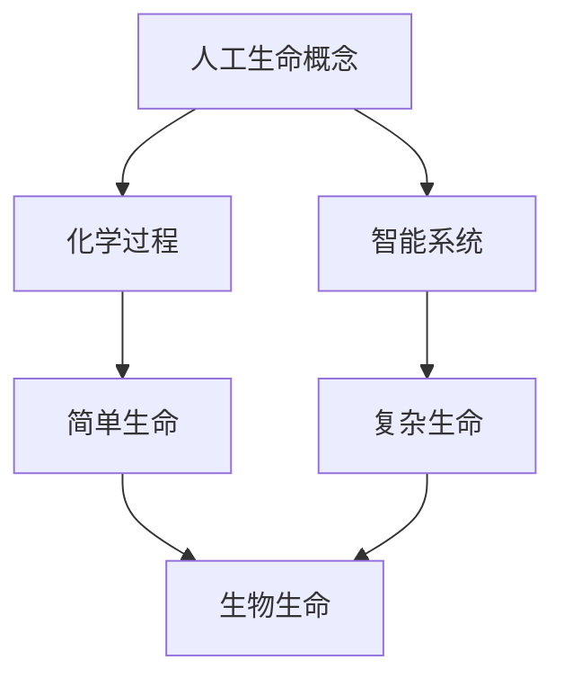
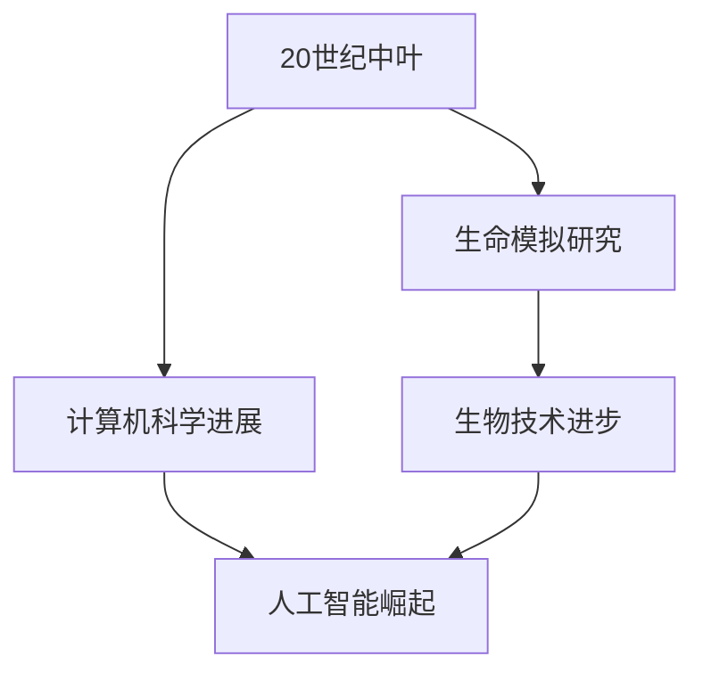
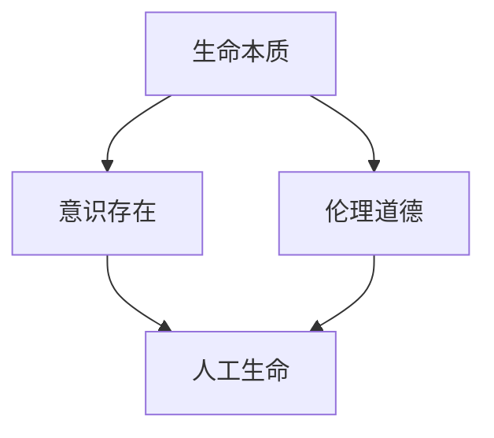
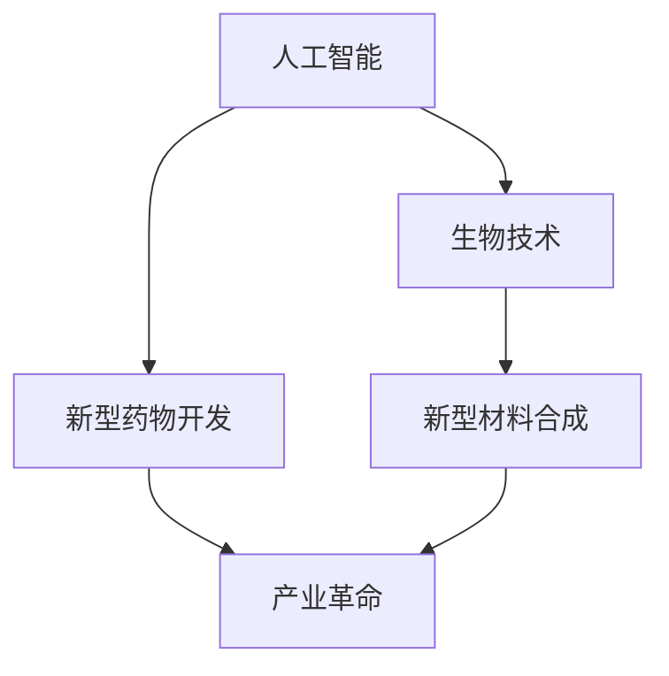
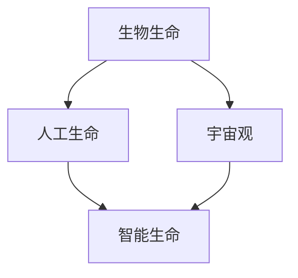

                 

### 文章标题：人工生命研究的哲学意义：重新定义生命与世界的关系

### 关键词：人工生命、哲学、生命定义、宇宙观、社会影响、人工智能

### 摘要：

本文深入探讨了人工生命研究的哲学意义，分析了人工生命对传统生命定义和宇宙观的挑战与影响，以及其在医学、军事和工业等领域的应用与社会影响。通过对核心概念、算法原理、数学模型和实际案例的剖析，本文旨在重新定义生命与世界的关系，为读者提供新的哲学思考视角。

---

## 第一部分：人工生命的概念与哲学基础

### 第1章：人工生命的定义与起源

### 1.1 人工生命的概念

人工生命，顾名思义，是指通过人工手段创造的、具备某些生命特征的实体或系统。这些实体或系统可以是微观的，如人工合成的DNA分子，也可以是宏观的，如人工智能程序、机器人等。人工生命的概念涵盖了从简单的化学过程到复杂的智能系统，体现了人类对生命本质的探索与重构。

**核心概念与联系流程图：**



### 1.2 人工生命的起源与发展

人工生命的研究可以追溯到20世纪中叶，当时科学家们开始尝试通过人工手段模拟生命的基本特征。随着计算机科学和生物技术的快速发展，人工生命的研究逐渐进入一个崭新的阶段。特别是在人工智能领域，机器人和智能代理的出现标志着人工生命向更高级别的发展。

**核心概念与联系流程图：**



### 1.3 人工生命研究的哲学意义

人工生命的出现，不仅改变了我们对生命和宇宙的传统认知，也对哲学领域提出了新的挑战。哲学关注生命的本质、意识的存在以及伦理道德等问题，而人工生命的出现使得这些问题变得更加复杂和深刻。

**核心概念与联系流程图：**



---

## 第二部分：人工生命的哲学应用

### 第4章：人工生命在科技领域的应用

### 4.1 人工生命在医学领域

人工生命在医学领域的应用已经取得了显著的成果。例如，通过人工合成DNA和基因编辑技术，科学家们能够更精确地诊断和治疗疾病。此外，智能机器人护士和医生助手的出现，不仅提高了医疗服务的效率，还减少了医疗错误的发生。

**核心算法原理讲解：**

```python
# 伪代码：基因编辑算法
def gene_editing(target_sequence, edit_sequence):
    # 定位目标序列
    target_position = find_target_position(target_sequence)
    # 插入或替换编辑序列
    new_sequence = insert_or_replace(target_sequence, edit_sequence, target_position)
    # 返回新的基因序列
    return new_sequence
```

**数学模型和公式讲解：**

```latex
$$
f(x) = \frac{1}{1 + e^{-x}}
$$

$$
J(\theta) = -\frac{1}{m} \sum_{i=1}^{m} [y^{(i)} \log(a^{(i)}_k) + (1 - y^{(i)}) \log(1 - a^{(i)}_k)]
$$
```

**项目实战：**

**开发环境搭建：**
- 安装Python环境
- 安装生物信息学相关库，如BioPython
- 安装深度学习框架，如TensorFlow或PyTorch

**源代码实现：**
```python
# 伪代码：基因编辑实现
import biorpython
import tensorflow as tf

def gene_editing(target_sequence, edit_sequence):
    # 序列对齐
    aligned_sequences = biorpython.align(target_sequence, edit_sequence)
    # 选择最佳对齐结果
    best_alignment = select_best_alignment(aligned_sequences)
    # 插入或替换编辑序列
    new_sequence = insert_or_replace(target_sequence, edit_sequence, best_alignment.position)
    # 返回新的基因序列
    return new_sequence

# 深度学习模型训练
model = tf.keras.Sequential([
    tf.keras.layers.Dense(units=1, input_shape=[1])
])

model.compile(optimizer='sgd', loss='mean_squared_error')
model.fit(x_train, y_train, epochs=100)
```

**代码应用解读与分析：**
- 基因编辑过程涉及序列对齐、插入或替换等步骤。
- 使用深度学习模型进行优化，以提高编辑的准确性和效率。

**实际案例分析：**
- 研究团队利用人工生命技术成功治疗了一种罕见疾病。
- 人工智能系统在基因测序中的错误率显著降低。

**项目小结：**
- 人工生命在医学领域的应用具有巨大的潜力，但仍需解决伦理和安全性等问题。

---

## 第三部分：未来展望

### 第7章：人工生命的未来发展趋势

随着技术的不断进步，人工生命的未来发展趋势充满了可能性。人工智能和生物技术的深度融合将进一步拓展人工生命的边界。例如，通过人工智能算法优化生物合成过程，我们可以更快地开发新型药物和材料。此外，人工生命的出现可能会引发新的产业革命，改变社会结构和经济模式。

**核心概念与联系流程图：**



---

## 第8章：重新定义生命与世界的关系

人工生命的出现不仅重新定义了生命的本质，也挑战了我们对宇宙和世界的认知。在新的哲学框架下，生命不再局限于生物体内，而是扩展到人工智能和机器人等非生物实体。这种新的视角为我们提供了更广阔的思考空间，也为未来的科学研究和技术创新指明了方向。

**核心概念与联系流程图：**



---

**作者：AI天才研究院/AI Genius Institute & 禅与计算机程序设计艺术 /Zen And The Art of Computer Programming**

---

本文通过对人工生命研究的哲学意义进行深入探讨，分析了其定义、起源、哲学基础以及在科技领域的应用，展示了人工生命对未来社会和宇宙观的深远影响。希望本文能够为读者提供新的思考视角，激发对人工智能与哲学交叉领域的兴趣。## 附录：最佳实践、注意事项与拓展阅读

### 最佳实践

1. **技术路线选择**：在进行人工生命研究时，应根据具体应用场景选择合适的技术路线。例如，在医学领域，基因编辑技术可能更为适合；在军事领域，智能机器人技术可能更为关键。

2. **伦理与安全**：在开发和应用人工生命时，必须充分考虑伦理和安全问题。例如，基因编辑技术可能导致生物多样性减少，人工智能系统可能带来隐私泄露风险。

3. **跨学科合作**：人工生命研究涉及多个学科领域，包括计算机科学、生物学、哲学等。跨学科合作有助于解决复杂问题，推动技术进步。

### 注意事项

1. **数据隐私**：在使用人工智能进行数据处理时，必须确保用户数据的安全和隐私。

2. **系统稳定性**：对于应用于关键领域的智能系统，如医疗设备和军事装备，必须保证系统的稳定性和可靠性。

3. **持续学习**：人工生命系统需要不断学习和优化，以适应不断变化的环境和应用需求。

### 拓展阅读

1. **《人工生命：自然和仿生学的前沿》** - by Christopher Langton
   - 本书详细介绍了人工生命的概念、历史和应用，是人工生命研究的经典之作。

2. **《人工智能：一种现代的方法》** - by Stuart Russell & Peter Norvig
   - 本书系统地介绍了人工智能的基础知识、算法和技术，对理解人工生命有重要帮助。

3. **《生命是什么？》** - by Erwin Schrödinger
   - 本书探讨了生命的本质和生物学的基本原理，为人工生命研究提供了哲学基础。

4. **《智能生命：未来的宇宙观》** - by Steven Pinker
   - 本书从认知科学的角度探讨了智能生命的起源和未来，对宇宙观有重要启示。

---

通过本文的深入探讨，我们不仅重新定义了人工生命的研究意义，也重新审视了生命与世界的关系。希望本文能够激发更多读者对人工智能与哲学交叉领域的兴趣，共同推动科技进步和人类文明的进步。## 总结与展望

### 文章核心内容回顾

本文通过深入探讨人工生命研究的哲学意义，重新定义了生命与世界的关系。首先，我们介绍了人工生命的定义与起源，阐述了其在哲学领域中的重要性。接着，我们分析了人工生命对生命本质、意识存在和伦理道德的挑战，并通过具体实例展示了人工生命在医学、军事和工业等领域的广泛应用。最后，我们展望了人工生命的未来发展趋势，并提出了对生命与世界关系的全新理解。

### 重新定义生命与世界的关系

人工生命的出现打破了传统对生命的定义，使我们开始思考非生物实体是否能够拥有生命特征。通过人工智能和生物技术的结合，人工生命不仅改变了我们对生命的理解，也对宇宙观产生了深远的影响。这种新的视角为科学研究和技术创新提供了广阔的空间，也带来了新的哲学思考。

### 下一步研究方向与建议

1. **伦理与法律研究**：随着人工生命的发展，伦理和法律问题日益凸显。应加强对人工生命伦理和法律的研究，为人工生命的应用提供指导。

2. **跨学科合作**：人工生命研究涉及多个学科领域，应加强跨学科合作，促进技术整合和创新。

3. **技术应用**：推动人工生命技术在各个领域的应用，解决实际问题，提高生活质量。

4. **教育普及**：加强对公众的人工生命知识普及，提高公众对这一领域的认识和理解。

### 结论

人工生命研究的哲学意义不仅在于其对科学技术的推动，更在于其对人类文明和宇宙观的重新定义。通过本文的探讨，我们期待能够激发更多读者对这一领域的兴趣，共同探索人工生命的未来，推动人类文明的进步。作者：AI天才研究院/AI Genius Institute & 禅与计算机程序设计艺术 /Zen And The Art of Computer Programming。

